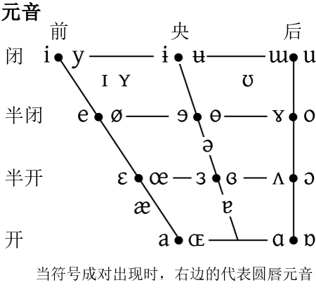

Did h**e** bel**ie**ve that C**ae**sar could  
s**ee** the p**eo**ple s**ei**ze the s**ea**s?  
The sill**y** am**oe**ba stole the k**ey** to the mach**i**ne.    
[i]: e, ie, ae, ee, eo, ei, ea, y, oe, ey, i    

于瑜欲渔,逼余于寓。  
jy35 jy35 jy51 jy35 jy51 jy35 jy35 jy51  
> **五度标记法**    

My f**a**ther w**a**nted m**a**ny a vill**a**ge d**a**me b**a**dly.  
a: a ɒ ɛ ə ɪ ei æ  

一套符符号记录人类所有语言  

  

> 横向 **舌位的前后**   
纵向    **舌位的高低**  开口越大舌位越低  
黑点左右是**展・圆**  

《詩·鄭風·子衿》：“**縱我不往，子寧不嗣音?**”  
>子：泛稱人、特指儿子女儿女婿、男子美称  

> y 就是汉语拼音里面的ü   

  

a o e i u ü 元音  
b p m f d t n l 辅音  

音乐里面的滑音？  

英文a 是双元音，e向 i过渡(没到i中间一点)   
> 诶  ei⁴  答应声  **诶！来了！**   

前a  
> 前a 滑向i，爱。**爱不发i音** 就是前a      

后a  
> **昂** ang²  中的a 就是后a  

ɔ  
> boy ɔi 滑音   

o  
> 韩语的 哦爸(哥哥) 就是这个o   

## 元音  

i  
> **衣 [ ji ]**  
be  [ bi: ] 

y  
> **鱼 [ jy ]**   

e  
play [ pʰle: ]  [ pʰleɪ ]  

ø  
> 英语没有 sure 发音比较接近  
Europe [ øRop ]  法语: 欧洲  

辅音的发音过程  
> 

元音中  6:19 

  

 

