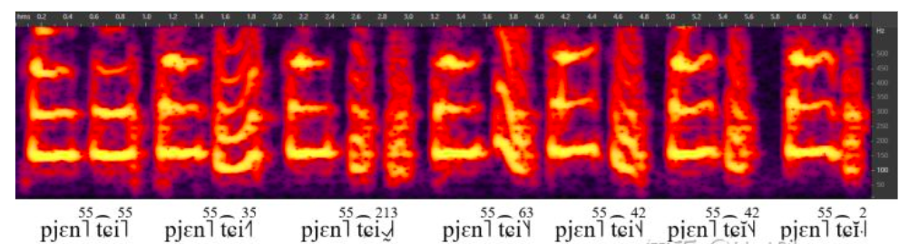

## Standard Chinese / 汉语普通话[z](https://zhuanlan.zhihu.com/p/99512131)

## Initials

| No.  | Pinyin | IPA-U | IPA-L |
| ---- | ------ | ----- | ----- |
| 1    | b      | p     | p     |
| 2    | p      | pʰ    | pʰ    |
| 3    | m      | m     | m     |
| 4    | f      | f     | f     |
| 5    | d      | t     | t     |
| 6    | t      | tʰ    | tʰ    |
| 7    | n      | n     | n     |
| 8    | l      | l     | l     |
| 9    | g      | k     | k     |
| 10   | k      | kʰ    | kʰ    |
| 11   | h      | x     | x     |
| 12   | j      | t͡ɕ    | tɕ    |
| 13   | q      | t͡ɕʰ   | tɕʰ   |
| 14   | x      | ɕ     | ɕ     |
| 15   | zh     | t͡ʂ    | tʃ̺    |
| 16   | ch     | t͡ʂʰ   | tʃ̺ʰ   |
| 17   | sh     | ʂ     | ʃ̺     |
| 18   | r      | ɻ     | ɹ̺     |
| 19   | z      | t͡s    | ts    |
| 20   | c      | t͡sʰ   | tsʰ   |
| 21   | s      | s     | s     |
| 22   | ∅      | ∅     | ∅     |

- ∅: Zero initial.

## Finals

| No.  | Pinyin | IPA-U | IPA-L |
| ---- | ------ | ----- | ----- |
| 1    | a      | a     | a     |
| 2    | ia     | ja    | ia    |
| 3    | ua     | wa    | ua    |
| 4    | o      | o     | uo    |
| 5    | io     | jo    | /     |
| 6    | uo     | wo    | uo    |
| 7    | e      | ɤ     | ɤ     |
| 8    | ê      | ɛ     | /     |
| 9    | ie     | jɛ    | ie    |
| 10   | üe     | ɥɛ    | ye    |
| 11   | i      | i     | i     |
| 11a  | i₁     | ɹ̩     | ɹ̩     |
| 11b  | i₂     | ɻ̍     | ɹ̩     |
| 12   | u      | u     | u     |
| 12a  | u₁     | ʋ̩     | u     |
| 13   | ü      | y     | y     |
| 14   | ai     | aɪ    | ai    |
| 15   | uai    | waɪ   | uai   |
| 16   | ei     | eɪ    | ei    |
| 17   | ui     | weɪ   | uei   |
| 18   | ao     | ɑʊ    | au    |
| 19   | iao    | jɑʊ   | iau   |
| 20   | ou     | oʊ    | ou    |
| 21   | iu     | joʊ   | iou   |
| 22   | an     | an    | an    |
| 23   | ian    | jɛn   | ien   |
| 24   | uan    | wan   | uan   |
| 25   | üan    | ɥæn   | yen   |
| 26   | en     | ən    | ən    |
| 27   | in     | in    | in    |
| 28   | un     | wən   | uən   |
| 29   | ün     | yn    | yn    |
| 30   | ang    | ɑŋ    | aŋ    |
| 31   | iang   | jɑŋ   | iaŋ   |
| 32   | uang   | wɑŋ   | uaŋ   |
| 33   | eng    | ɤŋ    | əŋ    |
| 34   | ing    | iŋ    | iŋ    |
| 35   | ueng   | wɤŋ   | uəŋ   |
| 36   | ong    | ʊŋ    | uŋ    |
| 37   | iong   | jʊŋ   | iuŋ   |
| 38   | er     | əɻ    | ɚ     |
| 39   | m      | m̩     | /     |
| 40   | n      | n̩     | /     |
| 41   | ng     | ŋ̍     | /     |

- *i*₁: *i* after *z*, *c*, and *s*.
- *i*₂: *i* after *zh*, *ch*, *sh*, and *r*.
- *u*₁: *u* after *f*.
- Although *èr* (二, 贰) is pronounced [ɐɻ˥˩] by a number of speakers now, the conservative varient [əɻ˥˩] is still used in IPA-U.

## Rhotacized Finals

| No.  | Pinyin      | IPA-U | IPA-L |
| ---- | ----------- | ----- | ----- |
| 1    | ar          | a˞    | aɚ    |
| 2    | iar         | ja˞   | ia˞ɚ  |
| 3    | uar         | wa˞   | ua˞ɚ  |
| 4    | or          | o˞    | uo˞   |
| 5    | uor         | wo˞   | uo˞   |
| 6    | er          | ɤ˞    | ɤ˞    |
| 7    | ier         | jɝ    | iɚ    |
| 8    | üer         | ɥɝ    | yɚ    |
| 9    | ur          | ʊ˞    | u˞    |
| 9a   | ur₁         | ʋ̩͡ʊ˞   | u˞    |
| 10   | anr/air     | ɐɻ    | aɚ    |
| 11   | ianr        | jɐɻ   | iəɚ   |
| 12   | uanr/uair   | wɐɻ   | ua˞ɚ  |
| 13   | üanr        | ɥɐɻ   | yəɚ   |
| 14   | enr/eir/ir₁ | əɻ    | əɚ    |
| 15   | inr/ir      | iəɻ   | iɚ    |
| 16   | unr/uir     | wəɻ   | uəɚ   |
| 17   | ünr/ür      | yəɻ   | yɚ    |
| 18   | aor         | ɑ˞ʊ˞  | au˞   |
| 19   | iaor        | jɑ˞ʊ˞ | ia˞u˞ |
| 20   | our         | o˞ʊ˞  | ou˞   |
| 21   | iur         | jo˞ʊ˞ | io˞u˞ |
| 22   | angr        | ɑ̃˞    | ãɚ̃    |
| 23   | iangr       | jɑ̃˞   | ĩã˞ɚ̃  |
| 24   | uangr       | wɑ̃˞   | ũã˞ɚ̃  |
| 25   | engr        | ɤ̃˞    | ə̃ɚ̃    |
| 26   | ingr        | iɘ̃˞   | ĩɚ̃    |
| 27   | uengr       | wɤ̃˞   | ũə̃ɚ̃   |
| 28   | ongr        | ʊ̃˞    | ũ˞    |
| 29   | iongr       | jʊ̃˞   | ĩũ˞   |

- *ur*₁: *ur* after *f*.
- *ir*₁: *ir* after *zh*, *ch*, *sh*, *r*, *z*, *c*, and *s*. IPA-L transcribes *ir₁* as [ɹ̩ɚ], different from *enr/eir*. This should be incorrect for Standard Chinese or Beijing Mandarin.

## Tones

| No.  | Pinyin | IPA-U | IPA-L |
| ---- | ------ | ----- | ----- |
| 1    | ◌̄      | ˥     | ˥     |
| 2    | ◌́      | ˧˥    | ˧˥    |
| 3    | ◌̌      | ˨˩˦   | ˨˩˧   |
| 4    | ◌̀      | ˥˩    | ˥˩    |
| 5    | ∅      | ∅     | *     |

- ∅: Neutral tone (轻声). In IPA-U, no tone letters are written for neutral-tone syllables. In IPA-L, neutral tones are ˧˩, ˥˩, ˧, and ˩ when following the 1st, 2nd, 3rd, and 4th tones, respectively.

## Field Description

- **No.**: Index of phonemes.
- **Pinyin**: [*Hànyǔ Pīnyīn* (汉语拼音)](https://en.wikipedia.org/wiki/Pinyin), the official romanization system of Standard Chinese.
- **IPA-U**: The broad transcription of fairly conservative varieties by unt[1].
- **IPA-L**: The broad transcription of younger speakers in Beijing by Wai-Sum Lee & Eric Zee[2].

# References

1. unt. [新老派普通话的宽严式记音（含儿化韵）](https://zhuanlan.zhihu.com/p/38258415).
2. Wai-Sum Lee, Eric Zee. [Standard Chinese (Beijing)](https://www.cambridge.org/core/journals/journal-of-the-international-phonetic-association/article/standard-chinese-beijing/050A393AF2D3C325E3C6796FE8CA99A3). *Journal of the International Phonetic Association*, **2003**, *33* (1): 109–112.

附一个我录的“biān ji”后字各种读音的时频谱：[z](https://www.zhihu.com/question/300616439/answer/521779375)

阴阳上去后的短轻声⁽²⁾：꜋、꜊、꜉、꜌（2、3、4、1）
阴阳上去后的长轻声⁽³⁾：˦˩、˥˨、˧˦、˨˩（41、52、34、21）
（各家对长轻声起终点的选择多有不同，这里用了比较理想化的记法）

后字依次是阴平、阳平、上声、重读去声、非重读去声、长轻声、短轻声。

## 前言

本文的初衷是用宽、严式记音分别描写普通话的语音，但说到严式记音就不得不考虑口音差异：普通话继承自新国音，而新国音起源于 1923 年国语统一筹备会的第五次大会（决定改以京音为标准），如此算来，普通话的语音史已近百年。这百年间，普通话的语音发生了些许变化，个别变化甚至影响到音系层面。于是，描写语音时，不同时期的口音不能一概而论。

本文粗略地将普通话分成老、中、新 3 派口音，老派指 5、60 年代普通话诞生初期的口音（反映着更早些时候的“京音”），中派指 8、90 年代至今的主流口音，新派指现在正逐渐被接受的口音（反映着未来的发展趋势）。本文以中派口音为描写的基础，当老派或新派与中派发音不同时，在后面用括号写出。一种音值被判断为老派的充分条件是它在今天中、青年人口中已经很少听到了（否则仍应视为自由变体），被判断为新派的一个必要条件是它已经在央视播音中出现（否则不应视为标准发音）。

和基本韵母相比，儿化韵母的音值和分合存在复杂的历时、共时差异，即便是在一时一派的口音中，音值通常也有很大的变化空间。本文以中派口音里韵类分合的情况与公认情况一致的口音为描写的基础。儿化韵母的新派当然不以已经在央视播音中出现为必要条件，而是考虑生活中新派口音的儿化。

严式记音（出现于 [ ] 中）声母只记出现于句首时的发音，韵母只记出现于句尾且完整发出时的发音，自由变体只记出现得最多的一种，但口语中有裂化现象的韵母兼记两种变体。宽式记音（出现于 / / 中）可兼用于记出现于句中与非句中时的发音。语流音变极其复杂，记法也不唯一，本文无力描写。

首先列出本文特别规定的一些国际音标用法：

- 语音为零用“∅”表示。
- zh、ch、sh、r 组声母用舌尖卷舌音表示。因为这组声母有 r 色彩，所以应以卷舌音（如 [ʂ]）为基（另外因为 l 记为 [l̠]）。国际音标卷舌音的默认调音部位是舌下（subapical）和硬腭，而这组声母的调音部位是舌尖和龈后，因此完全的表达如 [ʂ̺˖]；但前移 [◌̟] 是没必要加的，因为加上舌尖 [◌̺] 已经暗示被动部位前移了。
- z、c、s 组声母的被动部位是齿–龈（denti-alveolar），加前移 [◌̟] 来表示这个介于齿（如 [s̪]）和龈后（如 [s]）之间的音。
- 记韵母时为了简洁，省略介音给声母带来的次要调音。注意介音是非稳态音，时长很短，且向目标韵腹滑动，因此很多时候介音 i-、u-、ü- 的实际音值接近 [ɪ̯]、[ʊ̯]、[ʏ̯]，但仍然记作 [j]、[w]、[ɥ]（等价于半元音 [i̯]、[u̯]、[y̑]）。
- 擦化用上标的擦音表示。
- 唇齿化用上标的 [ʋ] 表示，唇–腭化用上标的 [ɥ] 表示，唇化用 [◌͡β̞] 表示。
- 拼合型儿化韵尾（如 enr 的韵尾）是一个比 [ɻ] 更松更开的音，加下移 [◌̞] 来表示。注意它通常比 r 声母靠后。

除上述用法以外，本文对国际音标的使用都是世界公认的标准用法，因此不再作任何文字解释（流氓行为！）。

严式记音（出现于 [ ] 中）宽式记音（出现于 / / 中）

选用《新老派普通话的宽严式记音（含儿化韵）》中的宽式记音，与李蕙心、徐云扬《标准汉语（北京话）》宽式记音记法不同者用注释标出。表格版可看：untunt/PhonoCollection。

声母
b [p]
p [pʰ]
m [m]
f [f]

d [t]
t [tʰ]
n [n]
l [l]

g [k]
k [kʰ]
h [x]

j [t͡ɕ][1]
q [t͡ɕʰ]
x [ɕ]

zh [t͡ʂ][2]
ch [t͡ʂʰ]
sh [ʂ]
r [ɻ]

z [t͡s]
c [t͡sʰ]
s [s]

零声母不写任何符号。

韵母
a [a]
ia [ja][3]
ua [wa]

o [o][4]
io [jo][5]
uo [wo]

e [ɤ]

ê [ɛ][5]
ie [jɛ][6]
üe [ɥɛ]

i [i]
“资雌思”的韵母 [ɹ̩]
“知蚩诗日”的韵母 [ɻ̍][7]

u [u]
fu 中的 u [ʋ̩][8]

ü [y]

ai [aɪ][9]
uai [waɪ]

ei [eɪ]
ui [weɪ]

ao [ɑʊ][9]
iao [jɑʊ]

ou [oʊ]
iu [joʊ]

an [an]
ian [jɛn][6]
uan [wan]
üan [ɥæn]

en [ən]
in [in]
un [wən]
ün [yn]

ang [ɑŋ][9]
iang [jɑŋ]
uang [wɑŋ]

eng [ɤŋ][10]
ing [iŋ]
ueng [wɤŋ]

ong [ʊŋ]
iong [jʊŋ]

er [əɻ][11]

m [m̩][12]
n [n̩]
ng [ŋ̍]

儿化韵
or [o˞]
uor [wo˞]

er [ɤ˞]

ier [jɝ][11]
üer [ɥɝ]

ur [ʊ˞]
fur 中的 ur [ʋ̩͡ʊ˞][8]

ar/anr/air [ɐɻ][13]
iar/ianr [jɐɻ][14]
uar/uanr/uair [wɐɻ]
üanr [ɥɐɻ]

enr/eir/“汁儿、字儿”的韵母 [əɻ][11][15]
inr/ir [iəɻ]
unr/uir [wəɻ]
ünr/ür [yəɻ]

aor [ɑ˞ʊ˞]
iaor [jɑ˞ʊ˞]

our [o˞ʊ˞]
iur [jo˞ʊ˞]

angr [ɑ̃˞][16]
iangr [jɑ̃˞][17]
uangr [wɑ̃˞]

engr [ɤ̃˞][10]
ingr [iɘ̃˞]
uengr [wɤ̃˞]

ongr [ʊ̃˞]
iongr [jʊ̃˞]

声调
◌̄ [˥]
◌́ [˧˥]
◌̌ [˨˩˦][18]
◌̀ [˥˩]

轻声可以不写出调值。如果要写，四声后的轻声分别是 [˦˩]、[˥˨]、[˧˦]、[˨˩][19]。

参考
^[t͡ɕ]、[t͡ɕʰ]、[t͡ʂ]、[t͡ʂʰ]、[t͡s]、[t͡sʰ] 的弧线可省略。
^[t͡ʂ]、[t͡ʂʰ]、[ʂ]、[ɻ] 李、徐记作 [tʃ̺]、[tʃ̺ʰ]、[ʃ̺]、[ɹ̺]。
^[j]、[w]、[ɥ] 李、徐记作 [i]、[u]、[y]。
^韵母 o 李、徐记作 [uo]。
^ab韵母 yo、ê 李、徐不收。
^ab[ɛ]、[æ] 李、徐都记作 [e]。
^“知蚩诗日”的韵母李、徐记作 [ɹ̩]。
^ab[ʋ̩]、[ʋ̩͡ʊ˞] 李、徐记作 [u]、[u˞]。
^abc[ɪ]、[ʊ]、[ɑ] 李、徐记作 [i]、[u]、[a]。
^ab韵腹 [ɤ]、[ɘ] 李、徐都记作 [ə]。
^abc[əɻ]、[ɝ] 李、徐都记作 [ɚ]。
^成音节的 m、n、ng 李、徐不收。
^[ɻ]、[ɝ] 李、徐都记作 [ɚ]。
^ianr、üanr 李、徐记作 [iəɚ]、[yəɚ]。
^“汁儿、字儿”的韵母李、徐记作 [ɹ̩ɚ]，有误。
^[ɑ̃˞] 李、徐记作 [ã˞ɚ̃]。
^后鼻音儿化韵中的 [j]、[w] 李、徐记作 [ĩ]、[ũ]。
^[˨˩˦] 李、徐记作 [˨˩˧]。
^李、徐记作 [(˧˩)]、[(˥˩)]、[(˧)]、[(˩)]。

