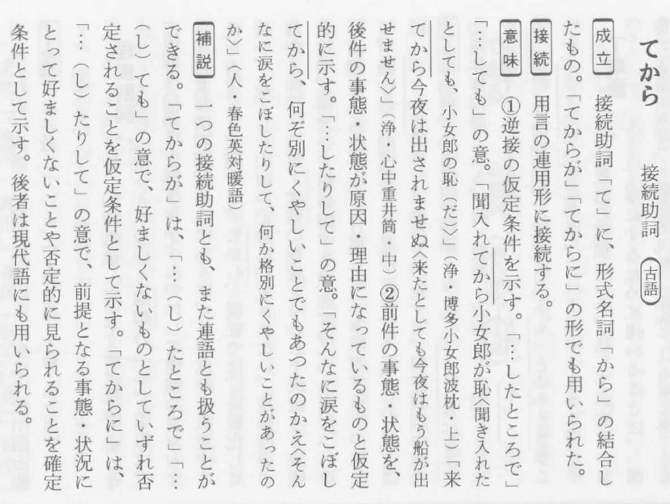

# gpt-4o

てから
接続助詞

接続助詞「て」に、形式名詞「から」の結合し
たもの。「てから」「てからに」の形でも用い
られた。

①逆接の仮定条件を示す。「…したところで」
「…しても」の意。

「聞いててから小次郎が恥ぢ聞きえた」
（今様）

②前件の事態・状態が原因・理由になっていること。仮定
条件として示す。「…したところで」「…しても」の意で、好ましくないこともあったかええの
なに涙をこぼして、の意味で、前提となる事態・状態に
肯定されることを仮定条件として示す。てからには、「…たりして」「…しても」の意で、好ましくないことを仮定
条件として示す。後者は現代語にも用いられる。

成立
接続助詞「て」に、形式名詞「から」の結合し
たもの。「てから」で、「てからに」の形でも用い
られる。

①逆接の仮定条件を示す。「…したところで」
「…しても」の意。

「聞いててから小次郎が恥ぢ聞きえた」
（今様）

②前件の事態・状態が原因・理由になっていること。仮定
条件として示す。「…したところで」「…しても」の意で、好ましくないこともあったかええの
なに涙をこぼして、の意味で、前提となる事態・状態に
肯定されることを仮定条件として示す。てからには、「…たりして」「…しても」の意で、好ましくないことを仮定
条件として示す。後者は現代語にも用いられる。