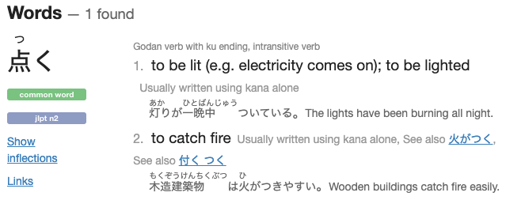
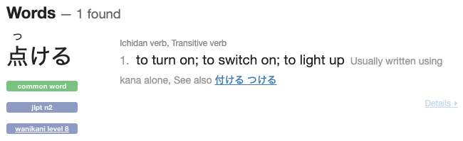
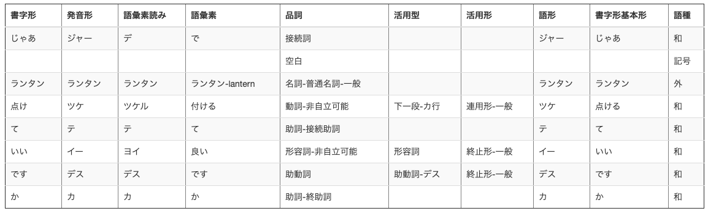
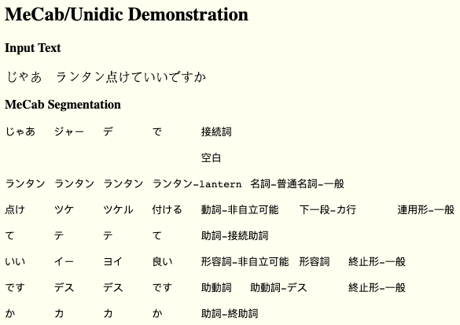

p.263

p.266

p.273

p.277

## 过去的た、和完成的た

p.278

未来形

## “て”是表示以前的“た”的连用形

## だ 完成体

状态转换

- 陽が沈んだ。  **The sun has set.**  

  

## でいる 既然体

阵述事实

- 陽が沈んでいる。  **The sun is set.**

  

## でいる 进行体

- 太郎は本を読んでいる。 **Taro is reading a book.**

## でいる 整体表示某种状态

## ず 否定体

- 雨も降らず

## じゃあ　ランタン点けていいですか

[《少女的终末旅行》]()

### 点く intransitive 不及物

Godan verb with ku ending, **intransitive** verb  不及物

### 点ける Transitive 及物

Ichidan verb, Transitive verb

##### 点灯，从及物不及物来判断应该是点ける 正确

#### Te-form	点けて

[jisho.org](https://jisho.org/)

[形態素解析ウェブアプリUniDic-MeCab](http://www4414uj.sakura.ne.jp/Yasanichi1/unicheck/)

[edrdg.org](http://www.edrdg.org/~jwb/mecabdemo.html)

カーテンに火がついた　The curtain caught fire.

電気がついている.　The electric light is on.

ランプがついた.　The lamp lit up.

[《研究社新和英第五版》]()  

https://www.hi-pda.com/forum/viewthread.php?tid=2670375&from=favorites

有人爬清华的太过分了 服务器更新中=-=

---------------------
清华的比较简单 浏览器里会留缓存图片 python3 需要 pip install selenium img2pdf
from selenium import webdriver
import os,imghdr,shutil
import time,random
import img2pdf
from PIL import Image
def getpics(pdfidurl):
    options = webdriver.ChromeOptions()
    options.add_argument(r"user-data-dir=%s\wqbook"%os.getcwd())  # Path to your chrome profile
    driver = webdriver.Chrome("chromedriver.exe",chrome_options=options)
    pdf_url = 'https://lib-nuanxin.wqxuetang.com/read/pdf/{}'.format(pdfid)
    driver.get(pdf_url)
    body=driver.find_element_by_css_selector('body')
    time.sleep(5)
    scrpositon=0
    height=driver.execute_script("return document.body.scrollHeight;")
    print(height)
    while scrpositon<height:
        scrpositon+=1500
        driver.execute_script("window.scrollTo(0,%s);"%scrpositon)
        time.sleep(4+random.randint(0,1))
    driver.quit()
def movefiles(pdfid):
    os.mkdir(pdfid)
    path = 'wqbook\Default\Cache\\'
    fileList = os.listdir(path)
    for i in fileList:
        print(imghdr.what(path + i))
        ext = imghdr.what(path + i)
        if ext == 'png':
            shutil.copyfile(path + i, '%s\\'%pdfid + i + '.' + ext)
        os.remove(path + i)
def changename(pdfid):
    fileList = os.listdir(pdfid)
    for i in fileList:
        name=i.split('.')[0]
        name=name.split('_')[1]
        os.rename(r'%s\%s'%(pdfid,i),r'%s\%s.png'%(pdfid,int(name, 16)))

if __name__ == '__main__':
    for pdfid in [
        '',#书的id
    ]:
        getpics(pdfid)
        movefiles(pdfid)
        changename(pdfid)
        for file in os.listdir(pdfid):
            filepath = '%s\\'%pdfid + file
            img = Image.open(filepath)
            img.convert('RGB').save(filepath)
        a = ['%s\\'%pdfid + i for i in os.listdir(pdfid) if i.endswith(".png")]
        a.sort(key=lambda x: int(x.split('\\')[1].split('.')[0]))
        with open("%s.pdf"%pdfid, "wb") as f:
            f.write(img2pdf.convert(a))
        print('%s已完成'%pdfid)

电子工业的似乎会banIP了

--------------------------

电子工业的一页一页截就行 一样用法
from selenium import webdriver
import time,os
from selenium.webdriver.common.action_chains import ActionChains
import img2pdf
from PIL import Image, ImageDraw, ImageFilter

def getbook(bookid):
    driver = webdriver.Chrome()
    driver.set_window_size(1456,2536)
    driver.get('https://yd.51zhy.cn/ebook/reader/index.html#/pdfReader?id=%s'%bookid)
    time.sleep(5)
    ActionChains(driver).move_by_offset(200, 100).click().perform()

    pdfboxes = driver.find_elements_by_class_name('pdf_box')
    pagenum = 0
    if os.path.exists(bookid):
        pagenum=len(os.listdir(bookid))
    else:
        os.mkdir(bookid)
    for box in pdfboxes[pagenum:]:
        driver.execute_script("arguments[0].scrollIntoView(true)", box)
        while box.get_attribute('style') != 'background: white;': time.sleep(1)
        with open(r'%s/%s.png' % (bookid,pagenum), 'wb') as f:
            f.write(box.find_element_by_class_name('page').screenshot_as_png)
        pagenum += 1
    driver.quit()

if __name__ == '__main__':
    for bookid in [
        '',
    ]:
        getbook(bookid)
        for file in os.listdir(bookid):
            filepath = '%s\\'%bookid + file
            img = Image.open(filepath)
            img.convert('RGB').save(filepath)
        a = ['%s\\'%bookid + i for i in os.listdir(bookid) if i.endswith(".png")]
        a.sort(key=lambda x: int(x.split('\\')[1].split('.')[0]))
        with open("%s.pdf"%bookid, "wb") as f:
            f.write(img2pdf.convert(a))
        print('%s已完成'%bookid)

还要下个chromedrive 看电脑上的chrome版本 是最新的话就下载这个
https://chromedriver.storage.googleapis.com/index.html?path=79.0.3945.36/

检查下 selenium调用chrome后 是不是没设置浏览器窗口大小
因为调用的是chrome的 capture node screenshot 可能node没显示全

跑的时候chrome里 开发者工具 alt+ctrl+p 然后 capture node screenshot 看看正不正常？

机械工业的，有人抓了电脑书的

https://www.52pojie.cn/thread-1098838-1-1.html

