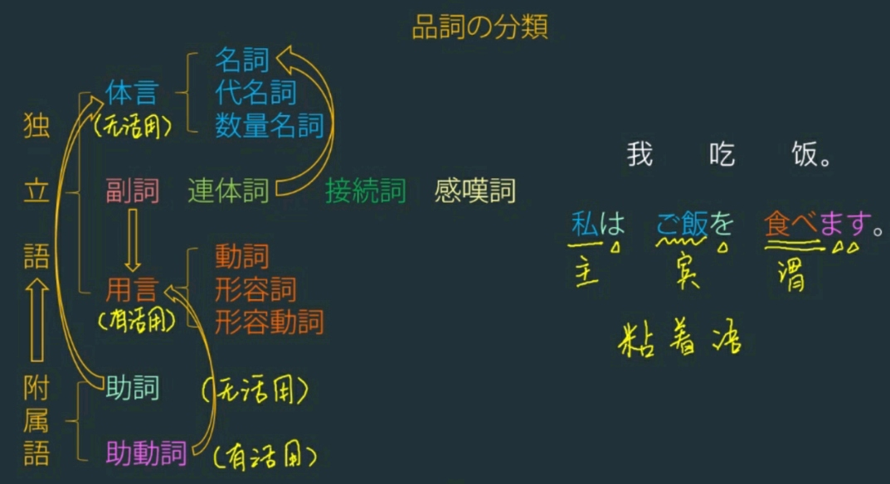

# 词类

**独立语有**：体言(名词、代名词、数量名词)、用言(动词、形容词、形容动词)、副词、连体词、接续词，感叹词

**附属语有**：助词、助动词

>格助词，接在主语后  
>接续助词，接在谓语后(因为所以虽然但是，即使尽管不管)
>

助词是用来帮助名词拆开的，用哪个助词是由谓语进行判断的

 只有用言和助动词有活用       
 助词和连体词粘在体言后面，助动词粘在用言后面

**を + 他动词、使役动词、移动的自动词(を=在移动)**  
**ガ + 自动词、形容词、形容动词、可能形、被动式**

**ヘ是に 的古语，意思是to**  
**より 是から的古语，意思是 from**  

 

# 句型

日语是一种粘着语，用胶水(助词)把很多的名词粘起来，最后放动词

> 汉语的顺序是：名词动词名词动词  
> 日语的顺序是：名词名词名词动词

## 主语宾语之间接的是状语

**时间、地点、方法、交通，对象**

> 我现在学日语  
> 我在新东方学日语  
> 我用这本书学日语  
> 我坐公共汽车来新东方  
> 我跟安老师学日语

## 宾语和谓语之间接的是

**期间、方向、数量**

> 我日本**三年**去过  
> 往哪去  
>我苹果**三个**吃

**を + 他动词、使役动词、移动的自动词(を=在移动)**  
**ガ + 自动词、形容词、形容动词、可能形、被动式**

**他动词：有人去做**
 - 风吹草**振**
 
**自动词：自己做**
- 地动山**摇**

**他动强调做的动作，自动强调结果和状态**

> 同样都表示"做完了"，但是意思的重点不同  
> 作った(他动,一类)  つくる   
> できた(自动)  

词性的误用有时会让人生气
> 頭(あたま)ガ**揺れる**( ゆれる,自动,二类)   
- 脑袋自己晃怕不是有病？

> 頭(あたま)を**振る**(ふる,他动,一类) 正确的用法
く 方向、己(我)    く 方向、己(我)    
