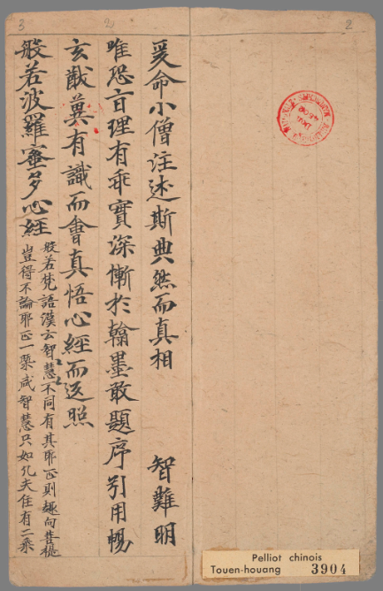

[中国国家图书馆·中华古籍资源库](http://read.nlc.cn/OutOpenBook/OpenObjectBook?aid=892&bid=243508.0)

爰命小僧注述斯典。

然而真相幽隱，空智難明。

唯恐旨理有乖，實深慚於瀚墨。

敢題序引，用暢玄猷。

冀有識而會真，悟《心經》而返照。

般若波羅蜜多心經

「般若」，梵語；漢云：「智慧」。

智慧不同，有其邪正。邪則歸於生死，正則趣向菩提，豈得不論正邪，一概咸稱智慧。

36

只

如

凡夫住有，二乘住

无

，悉並是邪

37

，

不名為正。菩薩行於中道，不住有

无

。既離有

无

，乃名為正。故知智慧觀察

38

，觀

察有

无

；觀有

之

心

39

，名之為「智」；了有非有，名之為「慧」。

