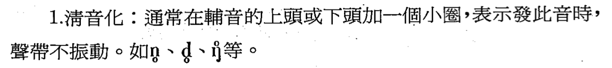
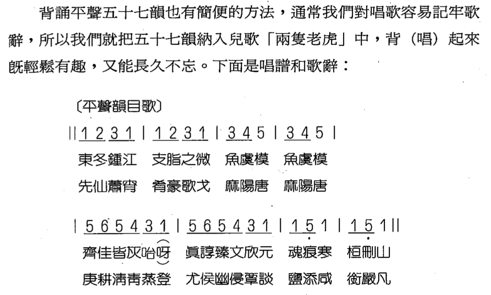

# 聲韻學

> 「**聲母**」或「聲紐」,**簡稱「聲」**
> **「韻母」,簡稱韻**
> 「韻」**已含有聲調的區別**
> 辅音分**清浊**，元音分**展圆**
> 雙唇音(古人稱「**重唇音**」, bilabial) 
> 唇齒音(古人稱「**輕唇音**」
> **押韻只要求韻腹、韻尾相同即可**
> **聲母相同的字稱之爲「雙聲」,韻母相同的字稱之爲「叠韻」**
> **反切上字定清濁開合、下字定洪細聲調**
>
> **推溯上古音的立足點是《廣韻》 ,譜出中古到現代的音變規則,也要依據《廣韻》。因此,《廣韻》是學習聲韻學的關鍵,它的重要性正如《說文解字》之於文字學一樣**
>
> 每個韻都有一個名稱,叫做「**韻目**」,韻目的來源正好就是**各韻的頭一個字**
>
> 封演《聞見記》說:「周題好爲體語。」此所謂的**「體語」,就是「雙聲語」**
>
> 英語的重音是個很重要的上加成素,它有辨別意義的功能。**例如record和insult的重音在第一音節是名詞,重音在第二音節就變成了動詞**。漢語的重音不重要,卻有聲調的變化來區別詞義。這是英語所沒有的語言成分。

「韻母」由介音(或稱「韻頭」)、主元音(或稱「韻腹」) 、韻尾三個段落組成

>**「阿、依、屋、兒、俄」只有主元音**
> 
>「由」(iou) (此字沒有聲母,這種情況稱爲「**零聲母**」),其中**(i)是介音**, **[o]是主元音**, **(u)是韻尾**。
> 
>「代、造、寒、中..」缺少介音;「花、街、牙、」等缺少韻尾;**主元音是個不能缺的成分**

#### 「開、合」「洪、細」

> 介音或主意有i 是合，有u 是细。否则是开洪
>
> 字音若依介主分四類:**開口洪音、開口細音、合口洪音、合口細音**

### i齐，u合，y撮，其他开口呼

1開口呼-不以(i]、(u)、(y)開頭的韻母。
2.齊齒呼-以(i]開頭的韻母。
3合口呼-以(u]開頭的韻母。
4·撮口呼--以(y]開頭的韻母。
開、合兩類又稱爲「洪音」,齊、撮兩類又稱爲「細音」

#### 依韻尾分韻

> **陰聲韻**  **以元音收尾**者
>
>   - 你、我、他
>
> **陽聲韻**  以**鼻音收尾**者
>
> - 先生、英雄
>
> 入聲韻  以**塞音收尾**者
>

**《切韻》時代還沒有輕唇音,正齒音卻有兩套,中古後期産生了輕唇音,正齒音卻合併爲一套了**

**東漢時代還还没有雙聲、叠韻的觀念**

**「開、齊、合、撮」是近世韻母的分類**,用來描寫中古音,事實上,**中古還沒有撮口(y)的音**

聲母通常是由輔音擔任,但是**輔音不只作聲母用**,例如「共同」兩字的**韻母就含有輔音**(都有個舌根鼻音在音節末尾)。**我國南部許多方言念「德、物、合」等入聲字,韻母中也帶有輔音**(都有個塞音在音節末尾) 。

「聲韻」兩個字又是什麼意義呢?原來,漢字音的分析在傳統上把前半叫「**聲母**」或「**聲紐**」,簡稱「聲」;後半叫**「韻母」,簡稱韻**。通常觀念裏,**「韻」已含有聲調的區別**。因此,便把研究漢語音的學科稱爲「聲韻學」了

一般讀書人的聲韻知識只不過是「東冬鍾江….、「幫旁並明 」的辨認而已。你若懂得多一點,就是件值得炫耀的事。像**《鏡花緣》的作者李汝珍就忍不住要在書中寶弄一番,專門安排了一回,來談聲韻問題**。

**從語音學入手**

> 能夠分析語音的**音素**,懂得**語音演變的通例**
>
> 認識標音工具的音標

「聲母」有時單稱「聲」或「母」,有時稱「紐」或「字父」(利馬寶) 、「經聲」(清周費) 、「字祖」(明楊選杞)等。術語的混亂,自

## 漢字音節的基本成分

> 聲母、韻母、聲調三個要素
>

不論哪個時代的語音,不論哪個地方的方言,在分析上都不外。這是構成。

聲母是音節的前段,韻母是音節的後段,它們各**佔有一定的發音時間**。聲調是不佔時間的,它是**附屬在韻母上的一種語音成分**。這種字音分析的知識,東漢時代就有了,「反切」就是這種觀念下的産物。
六朝時代流行的**雙聲、叠韻**,也是這種知識下的産物。

## 漢字音的結構

> 聲母、**介音**、**主要元音和韻尾**
>
> 「阿、依、屋、兒、俄」等字則1、2、4段全缺
>
> 「恩」 (en)、「愛」(ai)缺第1、2段

**《切韻》時代還沒有輕唇音,正齒音卻有兩套,中古後期産生了輕唇音,正齒音卻合併爲一套了**。如果我們把這兩種現象看成是一個音系,就混淆了歷史觀念。又如**東漢時代還不流行雙聲、叠韻的觀念,也沒有雙聲、叠韻的名稱**,在研究東漢的讀若、聲訓或更早的

也是**歷史觀念的模糊所致**。再如「開、齊、合、撮」是近世韻母的分類,用來描寫中古音,也是把不同時代的東西混爲一談了,事實上,**中古還沒有撮口(y)的音**。

音,歷代典籍都有註解,我看註解不也一樣?但是,註解只能告訴你是這樣,你卻無從知道爲什麼會這樣。**依賴註解,只是人云亦云,只能知其然而不能知其所以然,完全沒有獨立判斷的能力**。如果各家註解分歧,說法不同,你就茫然不知所從了。所以,要**眞正讀懂古書,不能沒有聲韻學的知識**。

訓話學中,有兩個重要的課題:**語根(cognate)**和聲訓。所謂**「聲義同源」、「凡同聲多同義」就是語根的問題**。例如「配」和「妃」,「膜」和「眠」,「遇」和「晤」,「號」和「吼」,「首」和「頭」,「柄」和「秉」等,都是語根相同的詞,也叫做「同源詞」。**最早的時候,它們在語言裏是一個詞,只有一個音一個義**,後來語言變遷,才乳分化,變成了不同的詞。

## 漢語語音史的分期

一、上古音(周秦兩漢)
二、中古音(魏晉至宋)
三、近代音(元至今)

上古音最主要的兩種語料是**韻語和形聲字**,這是我們認識上古音的兩大支柱。其次有通假字、聲訓、讀若、和同族語言等。

中古音的語料十分豐富,最重要的是韻書的**反切和等韻圖**,這是我們認識中古音的兩大支柱。其次有直音、對音、域外借詞等。

### 語音的性質和功能

語音學就是探究某語言到底有幾個音,以及它們是如何組織起來的一門知識。

「發音學」 (articulatory phonetics) 

「實驗語音學」(acoustic pbonetics)

「音位學」 (phonemics) 

「音系學」(phonology)

語音依性質可分爲輔音(consomant)和元音(vowel)兩大類

輔音和元音是語音性質的分類,「聲母」(Initial)和「韻母」(Final) 是語音功能的分類。聲母是指一個音節的開頭部分,並不含有輔音或元音的意味;韻母是指一個音節的後面部分,它可能是元音,也可能有輔音。例如「家」字的,是聲母,-丫是韻母。聲母通常是由輔音擔任,但是**輔音不只作聲母用**,例如「共同」兩字的**韻母就含有輔音**(都有個舌根鼻音在音節末尾)。**我國南部許多方言念「德、物、合」等入聲字,韻母中也帶有輔音**(都有個塞音在音節末尾) 。

「韻母」的結構如果再分析得細一點,是由介音(或稱「韻頭」)、主要元音(或稱「韻腹」) 、韻尾三個段落組成。例如「由」字的發音是(iou) (此字沒有聲母,這種情況稱爲「零聲母」),其中(i)是介音, [0]是主要元音, (u)是韻尾。在國語裏,有些字缺少介音,例如「代、造、寒、中..」等;有些字缺少韻尾,例如「花、街、牙、」等;而主要元音是個不能缺的成分,每個字都必須有個主要元音。像「餓、而、阿」等字都沒有聲母,也沒有介音、韻尾,只有一個主要元音。

### 「開、合」「洪、細」

> 介音或主意有i 是合，有u 是细。否则是开洪
> 字音若依介主分四類:**開口洪音、開口細音、合口洪音、合口細音**

國語的撮口字是由古代的「合口細音」經「唇化作用」(labialization)産生的(iu-y) 。

依韻尾的情況分類,可以分爲:「陰聲韻」(以元音收尾者) ,如「你、我、他」三字;「陽聲韻」. (以鼻音收尾者) ,如「先生、英雄」等字;「入聲韻」 (以塞音收尾者) ,如闆南話[職業、合作」等字。這是傳統音韻學常用到的術語。

#### 國際音標的來源和設計

英文字母在單字中的發音往往不易確定。例如不同的字母卻表示相同的發音:to , too , two , through , threw , clue , shoe ;相同的字母卻表示不同的發音: dam , dad , father , village , Americ a , many ;有的字母又不發音: whole , resign , ghost , hole , corps , psychology ,sword , debt , gnaw , lamb , island , knife。國際音標絕對沒有這樣的情形。

如果你能使用全套國際音標,你就能記錄全世界任何一種語言,即使時隔多年,你再拿出記錄,仍可以精確的發出那種語言的聲音。

#### 辅音分清浊，元音分展圆

1雙唇音(古人稱「重唇音」, bilabial) ,這是阻碍點在上、下唇所形成的音。
2.唇齒音(古人稱「輕唇音」, labiodental) ,這是阻碍點在上齒和下唇所形成的音。
3舌尖音(apico-dental) ,道是舌尖向上接觸上齒觀(如國語t、t、
n) ,或舌尖向前抵住上下齒的背後(如國語ts、 ts、s)形成的音。
4·捲舌音(又稱「舌尖後音」,retrolex) ,這是舌尖向上升起,接觸前硬顆所形成的音。
5舌尖面音(palato-alveolar) ,這是舌尖和舌面前之間的部位接觸上齒眼所形成的音。
6舌面前音(alveolo-palatal) ,這是舌面前部和前硬顆發生阻碍所形
成的音。
7舌面中音(palatal) ,這是舌面中段與上顎中段發生阻碍所形成的
8舌根音(古人稱「牙音」,velar) ,這是舌面後與軟顆發生阻碍所形成的音。
9小舌音(woular) ,這是舌面最後端與小舌發生阻碍所形成的音。
10.喉音(glottal) ,這是緊縮聲門而形成的音。
音。

輔音如果依發音方法分類,可以分爲以下幾種
1鼻音(nasal) ,發音時口腔某一部位受阻,於是軟顎下降,打開通鼻腔的孔道,氣流從鼻腔出來,這樣的音叫鼻音。
2塞音(plosive或stop) ,發音時口腔某一點完全封閉,然後突然放開,氣流衝出,這樣的音叫做塞音。
3·擦音(fricative) ,發音時口腔某一點並未完全封閉,而是留出一個狹窄的隙縫,讓氣流擠出來,所以稱爲摩擦音,簡稱擦音。
4·塞擦音(affricate) ,發音時口腔某一點完全封閉,然後突然放開一個隙縫,使氣流前半衝出,後半從隙縫擠出,這樣的音叫塞擦音。
5邊音(lateral) ,舌頭的某一部分完全封閉,氣流由舌兩邊流出,叫做邊音。

6音(rolled或rill),由於氣流的推動,使得舌尖或雙唇或小舌發生快速顫動的現象,使之連續拍打著發音器官的另一部分(例如上齒觀、或舌根) ,這樣生成的音叫顫音。這種音在德文、法文、西班牙文、意大利文都可以見到。
7·閃音(flapped) ,這是富彈性的某部分發音器官輕微的颤動一次,和連續顫動的顫音不同。它很類似柔軟的、閉塞不全的塞音。所以在
英文裡塞音td往往也可以念成閃音r,像butter、ladder 、writing、
riding等字中間的t、d即是。閃音在上古漢語裏十分普遍,它可以作聲
母,也可作介音或韻尾。
通常,塞音、塞擦音、擦音都各有清、濁的兩套。在漢語裏,塞音和塞擦音還分送氣(aspirated)和不送氣(unaspirated)兩套,前者發音時氣流強些,後者氣流弱些。

#### 音標的附加符號

英語的重音是個很重要的上加成素,它有辨別意義的功能。**例如record和insult的重音在第一音節是名詞,重音在第二音節就變成了動詞**。漢語的重音不重要,卻有聲調的變化來區別詞義。這是英語所沒有的語言成分。

### 孔子的「國語」

**古代的共同語就是「雅言」**,孔子在家中說山東話,當他走出家門,面對來自各地的三千弟子時,他就需要說「雅言」。只不過當時的「雅言」

「雅」就是「正」的意思,也就是「標準」的意思

《詩》之有風雅也亦然:**王都之音最正,故以雅名;列國之音不盡正,故以風名**。」可知「雅言」就是「正音」,也就是「官話」、「普通話」的意思。所謂**《爾雅》的「雅」,也是指當時的普通話**而言。

#### 押韻只要求韻腹、韻尾相同即可  

古代學者因拼音文字的啓發,懂得了分析字音的技巧,把漢字的發音分成前、後兩半,前半稱爲聲母,後半稱爲韻母。**聲母相同的字稱之爲「雙聲」,韻母相同的字稱之爲「叠韻」**。有了雙聲、叠韻的知識,自然就會想到運用這種知識來製造反切。有了能夠精確注音的反切,韻書的編纂條件也就成熟了。

### 反切的方法

> 用兩個字拼一個字的音,頭一個叫「反切上字」,第二個叫「反切下字」。反切上字必與本字雙聲,反切下字必與本字叠韻。所以,字音的清、濁由反切上字決定,字音的開合、洪細由反切下字決定。至於聲調,也是由反切下字決定。

同時,也因爲**中國人的心理,一向喜歡博大**,這種棄容並納的韻書一出現,所有六朝韻書都消聲匿跡了。

### 廣韻

今天,我們從事中古音系的擬定需要參考《廣韻》 ,**推溯上古音的立足點是《廣韻》 ,譜出中古到現代的音變規則,也要依據《廣韻》。因此,《廣韻》是學習聲韻學的關鍵,它的重要性正如《說文解字》之於文字學一樣**。

根據《廣韻》繼首所載,所收字數共26194字,注共191692字。依平上去入分爲五卷,平聲字多,故分兩卷。因此,《廣韻》的編排方式是先分聲調,再分韻類。總韻數爲206韻,其分佈狀況是:上平聲28韻、下平聲29韻(平聲共57韻) 、上聲55韻、去聲60韻、入聲34韻。每韻之內,把同音字類聚在一起,並在頭一個字的下面注明反切,表示這一群同音字的共同念法,其他同音字就不分别注音了。反切之下還注明了同音字的數目,例如「東」下注「德紅切,十七」,表示這一群念德紅切的字一共有十七個,「同」下注「徒紅切,四十五」,表示這一群念徒紅切的字一共有四十五個。一群一群的同音字中間有小圈隔開。

每個韻都有一個名稱,叫做「**韻目**」,韻目的來源正好就是**各韻的頭一個字**。

封演《聞見記》說:「周題好爲體語。」此所謂的「體語」,就是「雙聲語」