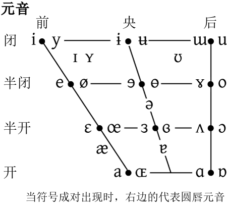
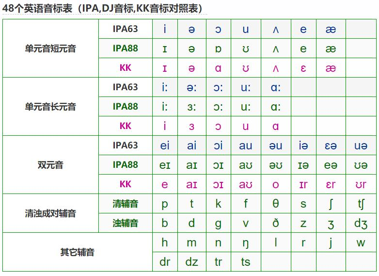

[Markdown 入门参考](http://xianbai.me/learn-md/)  

22 古今音规律  
23集仔细听   
为什么中元音韵很重要   

章( 上古音，diang1，声母是滴，国际音标[tj-]，的加依，的依->滴)  立早还是音十? 看你切割点在哪里。哪个切割点比较对呢 ?古时侯从诗经时代开始，十首诗组合成一个乐章，所以当时这个字就是音十叫做章。  p.20  00:30:00  

章(中古，jiang1，声母是鸡，国际音标是 [tɕj-]，鸡加依，鸡依ang->江 )，  声母从上古的滴鄂化成中古的鸡。    

章  昌  船  中古音: 江，枪，juan2  

吴，口天吴。  天实际上不是天，而是人，一个歪着头的人。  歪着头的人，含这，也就是仄，侧。都是一个音。仄侧就是不正，不平。  

仄声不能无限拉长，因为音的升降总有个顶和底，但是平声却不受这个限制，气有多长就可以拖多长。  (写歌可以应用?)    

颚化作用  像国语的j q c，像英文字母的g，有时侯念歌，有时侯念ji3 浊化 。  

有一种鄂化作用是从滴踢hi1 变来的，普通话的j q c 就是从滴踢hi1 变来的变来的。  

good evening  
美 [ˌɡʊd ˈiːvnɪŋ]      

晋朝人讲话怎么讲，在**正法华经**里面。唐代的人怎么讲话，玄奘的心经  

央元音 应答声：呃 就是央元音  
> 英文的央元音出现在非重音的场合，中文出现在轻音的场合  

双唇音(爆破)  
> 中文是送气对立  p p' 不分清浊  
英文是清浊对立  p  b 不分送气  

《中原音韵》支思韵专门装舌尖元音
舌尖元音没出现以前都是念i ，舌尖元音全部是从i 变来的 

汉字所有的ie(n) 都是ia(n) 变来的   
> 远上寒山石径斜，白云生处有人家。 斜(xia²) 演变成今天的xie²   

普通话四声的五度标记法  

55（阴平，一声）  ヿ  
35（阳平，二声）  
214（上声，三声）  
51 去    √  

1888 国际音标发布   

钢琴52 36 88键  

四声调值的变化  
> 一声由最高的5到5，声音变化小，调值高    
二声是35，从3到5，体现了二声是升调    
三声是214，先从2降到1，再从1升到4    
四声就是51降调，从最高的5，降到最低的1   

不学诗，何以言  

问渠那得清如许？为有源头活水来。

  

**高低**    
> 舌头位置的高低，嘴巴了张得越大舌位越低   
低元音  啊   
高元音  衣、屋、鱼   

**三元音**  
舌位高开口小 i，u  
舌位低开口大 a

**五元音**  
> i 开口大一点**e**，开到最大是a  
u开口大一点**o**  
a i u e o 日语五元音  
西班牙语也是这五个元音   

中文有的元音  
> i・y | e | a  
ə 央元音，u，o  
**汉语比日语多出了两个元音：i 的圆唇音y(yu)、央元音ə**  
**英文比汉语多出了四个元音：a的小口æ，ʊ ，u的大口ʌ・ɔ**   

前a后a 中古音有区别，法语有区别  

反切  
多拔切  de  a²  达  
第一个字代表声母  
第一个字代表韵母  

中古音  杜甫的音   
> 反切  
等韵图  

上古音  孔子的音  
> 形声字    
古韵语  

晚节渐于诗律细  
> 瞿塘峡口曲江头  
全用爆破音表现水急    
万里风烟接素秋。   

洛  各  
klak ge³ la 
kak
lak  

擬音  
擬构，声韵学的一种科学方法  
有一定的程序、方式、证据  

你不必讶异，更无须欢心，在转瞬间就可以拟构出来  

诗经 北方  
楚词 南方  

楚词   多神论，无处不在的神  举头三尺有神明  
风神  飞簾  風字的上古音念法  pl-m    
飛  p  
簾  l-m  

全世界的语言bo 都会变成fo  

芳(古) pang ，意香、没有香这个字  

爸 bua4  b〜p  u〜a  
>dia dia 〜 da da  
父 pa4  

多(唐) da³  

ma ba da 全世界都是用这三个音称呼最亲近的人  

小学  
> 声韵学  
文字学  
训诂学  
小学分在经史子集的经部  

经 <- 传 <- 注 <- 疏  
> 后面的是前面的注释  
诗经 <- 毛传 <- 毛诗郑笺  <- 毛诗正义  
先秦  西汉  东汉    

女 na 
> a -> iu -> ü (明代)  

之  de  

知、是、也  di  
> 滴道不滴道  

IPA 国际音标  
《一切经音义》 慧琳大师  
收在大正藏里面  

gi ki hi -> ji qi xi 

行  胡孟切  性  
>  德行  

心经  玄藏译  
是 意思是[此] 冠词 the, this  
> 这
样的 这样的  这个 这个 能除一切苦  

单复数  
> 中文缺乏  
梵文讲究  
〜等  复数  比丘等   
〜众  复数  比丘众  
众〜  复数  众比丘  
诸〜  复数  诸比丘  

G   dʒ i  **浊音**  声带会发生振动  **舌尖面音**(舌叶音)  
鸡  t? i   **清音**  不振  **舌面前音**    

行李  
> 行李之往来，共其乏困  
来往的使节 -> 人提的东西   意义变化  
李是使的同音字，是借用。    
唐代讲究字形，字样学，不通假了  
李  dzli  塞擦音  **浊音容易失落**  变成li  
使  sli  l失落变成 si  

所有语言都是用最少的声音表示最多的意义，**经济性法则**  

**鼻音**就是鼻腔共鸣的音  
> ɑn  ɑŋ  ən  əŋ  

声带振动  声音大  **浊音**    薄膜关闭，振动  
声带不振动  悄悄话  **清音**    薄膜打开  
声带是两薄膜，合起来的初始状态  

家乐福  在法文里面是十字路口  

会咽软骨  
> 吃东西关上  
讲话打开  
**吃饭和讲话是冲突的动作**  
会呛到  
吃饭不要讲话  

软腭  
> 打开  鼻音  
感冒每个音都是鼻音  
肿胀变形，关不上  

送气不送气音  
> 不是说发音的时候有气出来，没气出来  
只过过气流很大，气流很小这样的差别    

**双唇音**  

> p pˈ  清音  
b bˈ  浊音  
p  b  **不送气音**   
pˈ  bˈ  **送气音**  
发音部位双唇   
发音方法爆破音  
中文是送气不送气的区别  
英文是清浊的区别  

鼻化音  
> 鼻子嘴巴同时出气同时共鸣  

音调
> 语言五调就够了  
第一声是最高的音，五五调G  
所以日语升调念第一声，降调反而是第三声    
阳平是三五调、mi 到so 上去  
第三声是复合调先从2 降下来，然后再升到4   
去声是全降调，5到1  

仁者 = 仁 不等于尊者、贤者    
> 尊者是尊敬的人  
仁 发音ning⁴  者  jia³  忍者？  
仁是第二人称you 你(不含尊敬不是您)，者后缀词尾可以不要  
者相当于现代第一点第二点的序数第，相当于th   
一者、二者、三者。后缀是虚化的成分  

**女生起名字**  
> 第二个字**零声母**(没有辅音)
读起来很容易滑过去，第一滑到第三，顺口    
阳阳声韵又分洪音、**细音(中间有个i)**      
细音适合女生，开口很小，婉约、柔和    

**男生起名字** 
> **阳声韵**  音有力  
有鼻音共鸣的字叫做阳声字   
**男**女、雌**雄**、**公**母  **哪个是阳声韵**  

**起名声调**  

> **一声 55** 了张  
**三声 214**  小  本来是5 突然掉到2，落差很大  不顺口  
**二声  35**  明   连起来音调一直曲折起伏  费力  
正确示范：一声55 张  **四声51** 振  214/35 都行  214更顺  
**可以用钢琴弹调让人猜话**    

**天子圣哲**  **平上去入**  
上古  先秦两汉
中古  魏晋六朝隋唐两宋  
近代  宋元明清  段玉裁、关汉卿   

### IPA 国际音标  

《比较语音学概要》  

拉丁字母变体  ɱ  ɳ  ɲ  ŋ    
希腊字母  θ  ɤ  
附加符号  
吸气音  ɓ  ɗ  海南岛闽南话受当地语言影响   
浙江南部  广东北部汕头潮州  也讲闽南话  

**元音**  开口就可以发出来，**不需口腔调节**    
**辅音**  口腔阻碍气流  

元音  
> **高低**  舌头位置的高低  舌头跟着下巴动的海拔高低变化。**开口大就低，小就高**        
**前后**  哪个地方比较用力  i 前  u 后  
展圆  嘴唇展开来、圆起来  

### 舌面元音

|  | 前 | 中 | 后 | |
| :----:  | :----: | :----:  | :----:  | :----:  |
| **高** | i・y  | ɨ・ʉ | ɯ・u | **展**・**圆** |
| **次高** | I ・Y| 〜 | 〜・ʊ |  |
| **中高** | e・ø  | ɘ・θ | . ɣ・o |  |
| **中** | 〜  | ə | 〜 |  |
| **中低** | ɛ・œ | ɜ・ɢ | . ʌ・ɔ |  |
| **次低** | æ・〜  | e?? | 〜 |  |
| **低** | a・ ɶ | ??・?? | ɑ・D?? |  |

上高下低嘴小嘴大  

i 念依，然后把嘴巴圆起来 y 淤  圆唇音  
后圆音u 乌，嘴巴展开ɯ

seat i  sit  I   
foolish  u  
book  ʊ  

中古汉语分前啊后啊  前啊姐姐啊花  后啊妹妹  
法语多圆唇音，有前啊后啊  

**央元音**  高低关系是中，前后关系也是中  
> 不前不后，不高不低  处于元音表的正中央  
最好发最轻松的音  
回答人家：**呃**  就是了  

英文的元音系统比较复杂，学会了英文再学中文就比较简单。反过来会中文再学英文有些困难  

英文是多音节语言，有重音的不同。**英文的央元音出现在非重音的场合**，中文出现在轻音的场合  

**ə  ɐ  A  左高右低嘴小嘴大  呃 啊³  啊⁴**  

a  A  ɑ  **前啊**  **中啊**  **后啊**  
> A **中啊IPA没有**，因为**没有语言能辨认**出来的现象  

### 辅音比较复杂需要去调节  

音位学、发音学、音系学  

声母 z c s ,  j q x 
> 有一套可以接**i y 细音高元音嘴小**，首一套不行**没有iy的叫洪音**   
zcs 绝对不配细音，只配洪音 
jqx 只配细音  

**b p 英是清浊的差别，我们是送气不送气的差别**  

**诗经注解  高本汉**  

### 舌尖元音  

|  | 舌尖前 | 舌尖后 |  |  |  |
| :----: | :----: | :----: | :----: | :----: | :----: |
| 高 | ɿ・ʮ | ʅ・ʯ | 展・圆 |  |  |
| 中    | ɚ      |     |    |     |      |

**舌尖元音全部由i 演化而来**  

ɿ  资 [tsɿ ˥]  舌尖元音 滋〜 音拖长了就是它  
> 此 司  

知 [tʂʅ˥]   
> 吃 食 日  

兒  倪  以前都念ni²   

**国际音标声调**
> **˥  Extra high**   55  

## 辅音  

双唇  

唇齿音  上齿下唇  

齿间  
> th  

舌尖  
- 前、后 

舌尖面(舌叶音)  
> 英文ch  

舌面前音  
> ji qi xi 

舌面中  

舌根  

舌面后  

小舌音 扁桃体振动？  

声门  喉塞音  ʔ  

**塞音就是爆发音**  bo po ge ke de te  
双唇塞音  bo po   

>  p p' 清音、送气清音  **右上一撇表送气**  
b b'  浊音、送气独音  

舌尖塞音 de te  
> t t'  
d d'    

卷舌塞音  
> ʈ  ʈ'  
ɖ  ɖ'  
梵语有  

舌跟塞音 (舌面后)  
> k  k'  
g  g'   
**英文是上下的区别k g一清一浊，中文是左右的区别一不送气一送气k k'**       

喉塞音  
> ʔ  **咳嗽就是喉塞音**    
喊军令的1 2 也是这个   

**塞擦音** ji qi zi ci 先是有点爆发，但是气流没有全发出去，从发音器官的缝隙挤出去，塞是爆发，擦是摩擦  
> 塞擦音全部用两个符号组合起来，先爆发后摩擦  

舌尖塞擦音  
> **ts ts**' 清 不送/送  **滋  吃**  
dz dz' 浊  不送/送  

舌面前塞擦音  
>**tɕ  tɕ'**  **鸡  七**  
tʑ  tʑ'    

舌尖面音/舌叶音  位置更前   
> tʃ  tʃ' 英文  ch 清  古音有   
dʒ dʒ' 英文    j   浊  

舌尖后塞擦音(卷舌)  
> **tʂ  tʂ'  知、吃 卷**  
dʐ  dʐ'  
ʂ  师   卷  
ʐ   日  卷   

唇齿塞察音  
> pf  pf'  古音有  德文有   
bv  bv'  

擦音  f  s  发音器官留下一个狭窄的缝隙，气摩擦出来   
双唇擦音  
> ɸ  **吹蜡烛发出的音**  清音  
β  浊音  

唇齿擦音  上齿不唇  
> f  
v  古音有，英文有   

舌尖擦音  
> s  清
z  浊  
斜 zia² 〜 z变清音s sia² 〜 xia² 〜 xie²  省力原则  
**汉字所有的ie(n) 都是ia(n) 变来的**     
远上寒山石径**斜**，白云生处有人家。
斜(xia²) 演变成今天的xie²      

舌尖面擦音  
> ʃ  s变体  就是英文sh 的发音，古音有    
ʒ  z变体  

舌面前擦音  
> ɕ  c变体  清  古音有 
ʑ 浊  z 变体  

鼻音  鼻腔产生共鸣的音  an eng ong   
> 口腔是一楼，鼻腔是二楼  
ɱ  唇齿     
n  舌尖    
ɳ  卷舌  
ȵ  舌面前  nia¹  
ŋ  舌根  嗯啊切(韵母)  

颤音  发抖的音  
> 双唇  嘟嘟嘟  
舌尖  堵阿切(e¹)  声机关枪一样连续发出  西班牙 意大利  拉丁语系有  

**舌尖闪音**  舌头往上拍打一下  right  
> ɾ  就是**英文的r**  

边音  le  气从舌头两边流出来的  
> **e 不要单发 l 感觉一下气流**  
l  
ɭ 卷舌边音  梵文有  
ʎ 舌面边音  lia¹  

清浊  **声带振否**  
送气否  **气多气少**  

哪个部位发音  
怎么发(方法)  

**d t n 舌尖音**，汉语可以不分前后  
> **de te ne**   

**d t n 舌尖后**，也叫卷舌翘舌音   
> **da ka na**   **梵文**有  
**般若  pra̬᷄jn̄a**  
> 汉泽： pra̬᷄j  般(p r j 被无视了)  
n̄a  若(中古音nia)    
另一种译法  
p 波  ra 罗(中古音la)  j 积 孃 nia³  

### 佛光大辞典  
### 一切经音义  

佛经的字加口字边是中文没有的音，是拟音   
**唇、舌、牙、齿、喉  古代的五音**    
> 舌指的是 de te ne le 之类的音  
啰字为什么加个口字边，因为汉字没有这音，用罗变调变成上声模拟梵音  

**二合**  意思是两字各取半音合为一个音  
> 波啰两个子各取一半，合起来拼起来   
**pra  bu³ ra⁴  波啰**  (简略译法译为**班**)

**若**  **nia**  
> **n̄a 有一横是nia**   
**na 没有一横是na**  

### 反切

反、切 都是表示这是个注音  
> 还可以用作动词  
这个音不会乏念，你反给我切给我看好不好  
反了半天切了半天还是反不出来切不出来  

> **而者切**  合二
而 ne 者 ia，**nia**  日语 **にんじ**  
上字取

**枳孃反(合二)**  
> 

**引表长音**

准上  依上所说  
正云  梵音标准念法  

**ma ma ba ba  da da** 
> 小孩第一个会发的音  
die die、dia dia、da da  反古念法  
**多 中古音da**  

**具足**  **完整的**   
应言  应该说成  

高低  前后  展圆  可以决定全世界一切的元音    

元音三角 a i u (容发度高低排序)
> 人类最容易发，而且最基本的元音  
所有音中区别度最大的音  
**三元音**

区别度次大的音
> a **e** i  
a **o** u  
介于他们中间的两个音 e o  
a i u e o 日语**五元音**  
西班牙语也是这五个元音  

八元音  
> 四个前元，四个后元  

**ia(n)** 中古   -> **ie(n)** 现代  谢、耶   
iam 中古 -> ien 现代  盐、尖    

G   
> [ɡ] 洪音念这个   
[dʒ] 细音 来源是 i ，细音就是有i 的音  
**细音i 是一个强有力的，非常容易影响别人的音**  

**苏州话圆唇音多** 

《中原音韵》支思韵专门装舌尖元音  
舌尖元音没出现以前都是念i ，**舌尖元音全部是从i 变来的**    
> 资 此 司 ji qi xi 
知 吃 食 **日** di ki ji² **ni** 
食 jia³ 文读  

**日语 日 に**    
**中古汉语 日念ni ，和今天的日语的日(に) 一至**    

**半元音**  
> 气好像有阻碍好像又没有  

i u 元音  
ji w 半元音  
> i 嘴还要变得更小的时候就会发生摩擦变成半元音  

**i u 开头和结尾的音会很自然的发成半元音**   

**发音的抛物线**    
> h u e i  灰 开口最小到最大再回到最小  

古时候舌面前的半元音  
> i, j 不同义，现代念哪个都可以  
**i 四等字  j 三等字，所有三等字都有一个j 音在里面**    
古时出家人学**声明论**，学**悉昙章**，音韵学最好  

**歇后语  打破沙锅问到底**   打破沙锅是比喻下了决心  跌破眼镜也不是真的跌破眼镜。 好意外，出人意表。乌龟拉车，四平八稳。 **譬喻在前，实说在后的一种结构**。   

### i a 相差很远，开口度最小到最大费力，演变成发i a 中间的 e ，同化作用  

远上寒山石径斜，白云生处有人家。

斜(xia²) 演变成今天的xie²    

bo mo de 
> 最基本的辅音  

惠林大师的一切经音义  
> 前无古人后无来者的伟大声韵学著作，佛门的佛门里面  
引经据典，四书五经也照样引用，说文解字，尔雅，方言，释名。所以他的学问非常好  
所以佛门不一定是关起门来研究佛经而己，佛法无边，声韵学也是佛法对不对  

正法花经十卷      
> **华就是花，意思是一样的**。指的就是开出的花。**华是象形**的花。形容词的华，华丽意是后起义。 **花是形声**结构  

同一部经有十几个译本
**佛经的翻译用当时最流行的口语来翻的** 
语言的变迁。口语会一直变，到后来己经看不懂了，所以又再翻一次。佛经为什么用口语？这里秉承佛陀的教训。他说佛法是众生的，要用大众的语言、方言来宣扬。晋朝人讲话怎么讲，在正法华经里面。唐代的人怎么讲话，玄奘的心经。    
文言文不能保留它当时的语言面貌   

**汉文本是选出来的佛经最好的版本**，印度留下的梵文本不一定是最好的。印象人很不擅长保存文献    

音位  
> 多种音表同一意    

**声母介音主元音韵尾**      
> 乖  k  u  a  i    
交  tɕ  i  a  u  

中文讲究声调，英文不讲。梵文也没有声调    
声调是一种音高的变化，用音高的变化区别意义  
**平上sang³去入  是古代僧人翻译梵语的时候发现的**    
汉藏语言绝大多数都有声调   

**阴  清声母变来**  
**阳  浊声母变来  来(lai) 阳平  l浊**      

所有方言都是平上去入阴阳的组合，**粤语分阴入中入阳入**      

**吴语 上声不分阴阳**     
> 吴国建都于建康又名建业，现在的南京。开发后院向浙江南部到福建整个丘陵地带移民，原先全是少数民族   **广东秦代移民  福建三国周瑜海军大将海路移民**    吴方言演变成闽方言  

**会讲吴方言**的有夫差和他的死对头**勾践**，**夫差**的女朋友西施，**西施**的前任男友**范蠡**  

**湘方言**  楚文化  **屈原、宋玉**      
**扬雄《方言》**    

**古义声贬、音褒**      

**《弟子规》** 作者山西人，山西话音混入  

生  ʂə**ŋ**  ˥    **星**    注意这个**形声字**  猩
泯  mi**n**˩˥     民   压韵  

**山西话**不分这两个鼻音， 前鼻音后鼻音/**舌根鼻音舌尖鼻音**   an ang 不分  
**以前只有平，后来才分出阴平阳平**，根据声母的清浊，**声母清阴平，声母浊阳平**    
**所有鼻音都浊**    

走  子苟切   
後  胡口切  
胡口切 猴  胡是匣母字，ɤ-  全浊上变去声(浊上归去) ，胡口切今天普通话念成后，当时山西未发生浊上归去     

**声母韵母声调**
> ˥˥ 阴平  高平调（55）  
˦˥ 阳平  中升调（35）
次低降升调（214）

押韵  
> 遲  tʂ  ʅ  ˦˥  声母 韵母 **阳平**   **舌尖元音全是 i 变来的**  
移  i  ˥   舌面前高元音      
遲以前念齐  

**魚**  **ŋjo ˦˥** nio² **兒**  **ni²** **李白的念法**    
> 魚兒的兒以前是后缀(是衬字？)      

正  tʂ ə ŋ ˥˩  去声  以前读 近  
敬  tɕ i ŋ ˥˩  

看到14     37     

