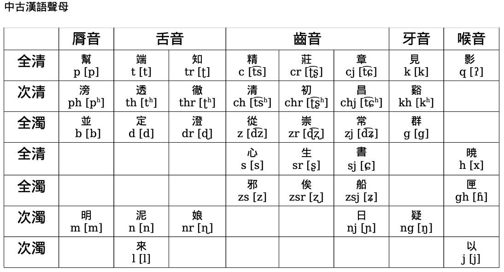

《切韻》隋朝陸法言  

《廣韻》宋

《等韻圖》宋  

代詞 :

中古的人稱代詞比上古漢語有很大的變化，第一人稱除了繼承自上古的我，還有儂;第二人稱是由爾發展成的你;第三人稱南北朝多用伊，后來又用渠，到了唐朝，又出現了他。

名詞:

中古漢語仍然是單音節詞占優勢，中古漢語的名詞和上古漢語比起來，除了詞義的變遷，上古漢語的詞頭廢棄了(如 有)，取而代之一套新的詞頭和詞尾。最普遍的詞頭是阿，其次是老;最普遍的詞尾是子，其次是兒、頭。阿可以加在疑問代詞誰、人名、親屬稱謂、排行、人稱代詞的前面;老的出現比阿晚得多，唐代之前，只有加在姓前的例子。

- 向者之論，阿誰為失?——《三國志·蜀志·龐統傳》
- 忽出喚曰:“阿鼠!”子文不覺應曰:“諾!”——《法苑珠林》(人名)
-  孝琬呼阿叔。帝怒曰:“誰是爾叔?”——《北史·河間王孝琬傳》(親屬) * 阿六，汝生活大可。——《南史·臨川王傳》(排行)
- 阿你酒能昏亂，吃了多饒啾唧。——王敷《茶酒論》(人稱代詞)
- 每被老元偷格律，苦交短李伏歌行。——白居易《戲贈元九李十二》(姓)

地名:

長安，大興，今西安;東京，今開封;建康，建業，今南京; 大都，京師，北平，今北京;余杭， 錢塘，臨安，今杭州;臨淄，今淄博;益州，今成都;廣陵，江都，今揚州;南海，今廣州;晉陽，并州，今太原;錦官城，今成都;彭城 ，今徐州;姑蘇，今蘇州。

  越人歌
 濫兮抃草濫予
 昌枑澤予
 昌州州〈飠甚〉
 州焉乎秦胥胥
 縵予乎昭澶秦逾滲
 惿隨河湖

《越人歌》是中國文學史上較早的明確歌頌戀情的詩歌，它和楚國的其他民間詩歌一起成為《楚辭》的藝朮源頭。《越人歌》出自漢代劉向《說苑》(卷十一·善說篇)，第十三段并有漢字記其古越語發音。當時的漢字當用上古音來發，但是由于各家擬的上古音在音韻學界并不能得到良好的認同，那我們就試着用中古音來感受感受穿越時空的感覺。

荀巨伯探友

《世說新語》是我國南朝宋時期(420-581 年)產生的一部主要記述魏晉人物言談軼事的筆記小說。是由南朝劉宋宗室臨川王劉義慶(403-444 年)組織一批文人編寫的。

《世說新語》中多為對話，這對于研究中古漢語口語而言，是難得的口語教材。

一個音節可以分析成聲母、韻母和聲調。聲母是開頭輔音，韻母必須包含一個韻腹(主元音)，韻腹前面也可以有一個韻頭(介音)，韻腹后面可以有一個韻尾(元音或輔音)

正體字的“并”和“並”，都簡化為了“并”，但 是在中古時期，“并”讀 pjeng，而“並”讀 bengx。如果使用簡體字的話，這些音就無法區別出了

