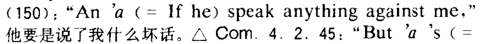

**morpheme ”音“(词素？)**  高本汉《 中国音韵学研究》  p.16  

大部分以tion,sion 结尾的词都来源于法语  [法语发音](../lang/french/法语发音.md)  

William Shakespeare  
> 1564年4月23日—1616年4月23日  

源自法语的单词“vis-à-vis” 和汉字“讎”(chóu)，无论从形还是意上都很相似。很容易注意到它们都呈现出左右对称的结构。词根vis 是look 看，vis-à-vis 两个人你看我，我看你，所以它的意思就是“face to face”，面对面。汉字“隹”(cuī)是一种短尾鸟。“讎”，左右都是鸟，中间一个言，像两只鸟你一句我一句地在说话。所以“讎”的本意是应答。例如诗经里有：“無言不讎，無德不報。”《詩・大雅・抑》。由应答引伸出报答，应答是回应别人说的话，报答是回应别人对你的好。又引伸出报复，即对恶的回应。

visa 签证
来自拉丁语charta visa, 即验证过的文件；visa, 看，词源同visage, charta, 纸，词源同chart.

vista 景观，远景，展望
来自拉丁语videre, 看；-st, 过去分词格。引申词义景观，远景，展望等。

perspective  
视角；观点；想法  
远景；景观   

vis-a-vis 最初是指座位相对的马车，由相对的座位引伸出”面对面“ 的意思。也可以指”舞伴“，因为两个人跳舞是面对面的。也可以指”同事“ 等这些地位相当的人。这个词好几个不同的意思：

1. 面对面

《兰亭集序》有”悟言一室之内“，这个类似的表达，”悟言“ 就是面对面的谈话。

2. 对等地位，不分优劣。

《兰亭集序》有 ”一生死“，这个对应的表达；你看这个”一“ 字是水平的，生和死就像放在天平的两端，分不出谁轻谁重。 

3. 和 ... 对比

   介词 against 也可以表达"对比" 这个意思，但是它的核心意思是 ”逆反“，比如逆风行走：walk against a slanting rain  顶着斜风雨行走。

  有”反差“有才”对比“，对比其实是”逆反“的引伸意。如果认为说好话是正面的，说坏话是反面的，”说反话，说坏话“ 的场合就可以用 "against"：

  中古英语写成的《罗密欧与朱丽叶》里有："An 'a (= if he) speak anything against me'" 他要是说了我什么坏话。

against 还可以表达作准备，防备。如果夏天就开始准备冬天的衣服，这就反季节的，所以它也还是引伸意：

"food stored against winter"  为过冬贮备的食物。

《英汉大词典》

T%_1IMUC@I662CT.png)

《特级教师高中文言文译解》

《英汉双解莎士比亚大词典》

