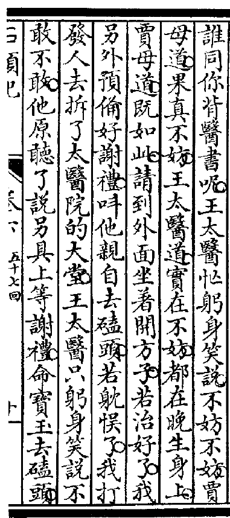

日々(ひび)の暮(く)らしによって の姿(すがた)が　変(か)わっても　　　随着每天的生活改变样子

機能(きのう)の拡張(かくちょう)によって　　由于功能扩充，现在可以制作 露脸立牌、小旗子、雨伞 和扇子

機能(きのう)の拡張(かくちょう)によって 顔出(かおだ)し看板(かんばん)、手旗(てばた)、かさ

また、開発(かいはつ)工事(こうじ)によって、 身動(みうご)きが　取(と)れなくなったときのために 周囲(しゅうい)を片付(かたづ)ける
另外,根据施工的不同, 也会有身体无法动作的时候

席によってはステージが見えにくくなるという。
\>1. 席（せき）：名词，意思是"座位"。
\>2. によっては（によっては）：表达方式，表示"根据，依据"，这里用于说明某些座位的情况。
\>3. ステージ（ステージ）：名词，来自英语的借词，意思是"舞台"。
\>4. が（が）：助词，表示主语标记。
\>5. 見えにくくなる（みえにくくなる）：由动词"見える"（看得见）的形容动词"にくい"形式，表示"难以看到"。"なる"是动词，表示变成某种状态，合在一起表示"变得难以看到"。
\>6. という（という）：引用助词，这里表示"据说，人们说"等意思。

\>句子翻译："据说根据座位的不同，有时舞台会变得难以看到。"

つける場所によって意味が違うんだってさ。
\>1. つける（つける）：这是一个动词，表示"放置，戴上，附上"等。
\>2. 場所（ばしょ）：这是一个名词，表示"地方，位置"。
\>3. によって：这是一个助词短语，表示"根据，依据，按照"。
\>4. 意味（いみ）：这是一个名词，表示"意义，含义"。
\>5. 違う（ちがう）：这是一个动词，表示"不同，有差异"。
\>6. んだ：这是"のだ"的口语化形式，用于强调或解释某一事实或情况。
\>7. ってさ：这是一个口语化的引用助词组合，表示"据说，我听说"的意思。

句子翻译："据说，根据放置的位置，这个花装饰的意义会有所不同。"。

