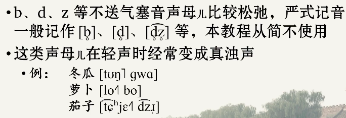
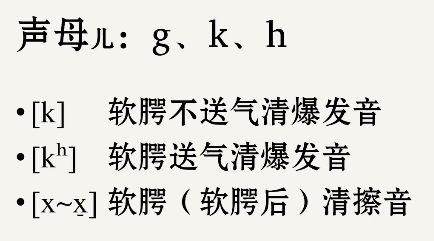

[IPA Input](https://ipa.typeit.org/full/)

[【民国北京话语音教程】第1讲：前言、声母](https://www.bilibili.com/video/av62002848/?spm_id_from=333.788.videocard.5)

[TOC]

# 高本汉、赵元任、老舍

# 声母

## 唇音声母

##  不送气塞音声母

### 轻声浊化

# 严式记音加个圈表示浊化

## 齿龈声母

# 加短横表示后移

## 软腭声母

# 小舌擦音

# 小舌爆发音

## 龈-腭 声母

## 翘舌音

## 平舌音

## 零声母

### 唇齿近音

	

## 连读

【ʐ】 的摩擦性很强，【ɻ】 以乐音性为主。普通话（北京话）没有其他的浊擦音了，因此 sh－r 也不应构成清浊对立。更多可以看https://www.zhihu.com/question/49451528

