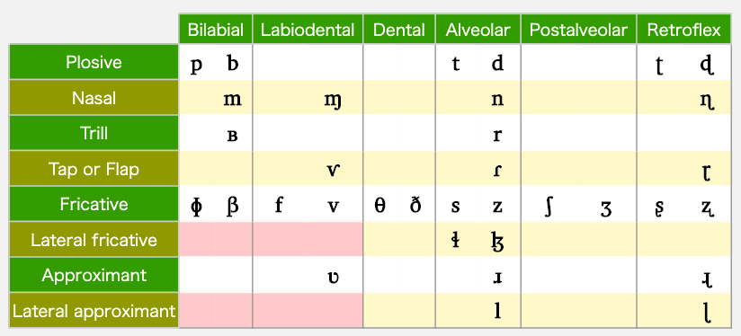
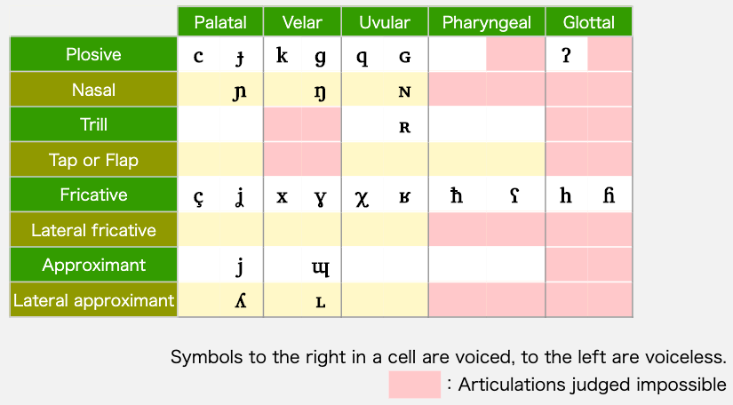
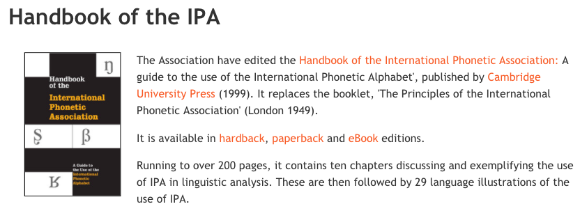

[TOC]

# IPA 国际音标

## IPA真人发音

[IPA真人发音](https://www.internationalphoneticalphabet.org/ipa-sounds/ipa-chart-with-sounds-version-3/)

## IPA 图书网站视频

1. [国际语音学会手册](https://www.internationalphoneticassociation.org/content/handbook-ipa)
   《Handbook of the International Phonetic Association : A Guide to the Use of the International Phonetic Alphabet》
   - 可以下载到多语种真人录音，包括粤语、英语、日语、法语、德语、俄语、印地语、希伯来语等等
2. [東京外国語大学 国际音标教学](http://www.coelang.tufs.ac.jp/ipa/english/consonant_pulmonic.php)
   - IPA真人发音，有英文解说
   - 日语语法，有中文解说
     - [日本語文法日本語文法](http://www.coelang.tufs.ac.jp/ja/zt/gmod/)
3. **英語語音學** (含發音練習) 外文系  **Karen Steffen Chung 史嘉琳** [tw](https://e10aa8944c668c5e049e3851c3215aaa.cloudflareworkers.com/-----http://ocw.aca.ntu.edu.tw/ntu-ocw/ocw/cou/101S102)  

# IPA 肺部气流辅音表

[東京外国語大学 国际音标教学](http://www.coelang.tufs.ac.jp/ipa/english/consonant_pulmonic.php)

## 清濁р, b

### 解説

  雖然在很多語言裡都有p這個音，但在日語裡，如果摸摸喉嚨的中間部位（男性因為有喉結的突出應該很容易摸到）感覺到指尖振動的話，就是b的音；如果沒有振動，就表示發出的是p的音。換句話說，在日語裡是靠振動或不振動喉結附近的聲帶來做區別的。（詳細說明請參照理論篇）。 　　然而， 不同母語的日語學習者在發出p的時候也有吐氣多寡的區別。因此，某些特定母語的日語學習者很容易將「ば、び、ぶ、べ、ぼ」發成不吐氣的p音，聽在日本人耳裡很容易誤以為他們說的是「ぱ、ぴ、ぷ、ぺ、ぽ」。（例：ボク（僕）→ポク）。 　　另外，有些日語學習者的母語中有字首音節發p，中間音節發b，依所在位置而決定是否振動聲帶的發音規則。因此，雖然該學習者能順利發出中間音節的「ば、び、ぶ、べ、ぼ」，卻容易將字首音節的「ば、び、ぶ、べ、ぼ」發成「ぱ、ぴ、ぷ、ぺ、ぽ」（例：ビン（瓶）→ピン）。又或者是與上述相反，將中間音節的「ぱ、ぴ、ぷ、ぺ、ぽ」唸成「ば、び、ぶ、べ、ぼ」（例：シンパイ（心配）→シンバイ）。

[東京外国語大学 清濁р, b ](http://www.coelang.tufs.ac.jp/ja/zt/pmod/practical/01-04-01.php)

[国际语音学会手册](https://www.internationalphoneticassociation.org/content/handbook-ipa)

解説
  「つ」是許多人無法正確唸好的一個子音。有些人會誤將「つ」唸成「ちゅ」或是「す」。實際上，「つ」是先以「ｔ」的嘴形加上「す」的發音而成的。如果無法順利發出「つ」這個音，請先將舌尖頂住上排牙齒之後再發出す的聲音。
  特別是母語中沒有這個音的日語學習者（例如英語、法語、西班牙語、葡萄牙語、韓語、印尼語、馬來西亞語、泰語、寮國語、越南語、柬埔寨語、緬甸語、阿拉伯語、土耳其語等。）更需注意。

[東京外国語大学 1 基本中的基本，這是一定要的](http://www.coelang.tufs.ac.jp/ja/zt/pmod/practical/01-01-01.php)

### 解説

  ラ行音的發音方法是，將舌尖輕輕頂在上排牙齒之後馬上放開。在做「ら、り、る、れ、ろ」的發音練習時，如果舌尖沒有頂到牙齒就是不正確的發音方法。這時請先注意「舌尖輕輕頂住上排牙齒」這個動作。  即使在發ラ行音時記住要將舌尖輕輕頂在上排牙齒後方，也很容易將ナ行、ダ行、ラ行的發音搞混。舉例來說，將ダ行子音與ラ行子音混在一起（例：ハタラク（働く）→ハタダク）；把ナ行子音發成ラ行子音（例：サヨウナラ（さようなら）→ サヨウナナ、ライゲツ（来月）→ナイゲツ）；漏掉ラ行子音（例：レンラク（連絡）→エンラク）；將ナ行子音或ダ行子音發成ラ行子音，就會發生以下的混亂情況。（例：コドモ（子供）→コロモ、オメデトウ（おめでとう）→オメレトー、ダンシ（男子）→ランシ、ドロボー（泥棒）→ロロボー、ハネル（跳ねる）→ハレル、ナンボク（南北）→ランボク）。   會造成這樣的混亂，是因為ナ行、ダ行、ラ行的舌尖位置基本上都在同一位置的關係。其間微妙的差異只在舌尖碰觸齒後的方式有所不同。以ラ行來說，首先要讓舌尖保持不與任何部位相觸的狀態，然後讓舌尖在上排齒後輕輕彈一下之後馬上離開。至於ナ行及ダ行則是先讓舌頭完全貼住上口蓋並頂住上排牙齒後方，之後再一鼓作氣彈開。

流音包括了[边流音](https://zh.wikipedia.org/wiki/邊流音)（例如：/l/）和[非边音流音](https://zh.wikipedia.org/w/index.php?title=R音&action=edit&redlink=1)（例如：/r/，亦作“R系子音”）两类。

在英语中，/l/和/ɹ/都是常见的流音；在其他欧洲语言里，字母“r”通常都用来表示[齿龈颤音](https://zh.wikipedia.org/wiki/齒齦顫音)，而这个发音亦是[IPA](https://zh.wikipedia.org/wiki/IPA)里“r”这个字母所代表的发音。

在[法语](https://zh.wikipedia.org/wiki/法語)、[德语](https://zh.wikipedia.org/wiki/德語)及[丹麦语](https://zh.wikipedia.org/wiki/丹麥語)，字母“r”一般用来表示在喉咙后方的[浊小舌擦音](https://zh.wikipedia.org/wiki/濁小舌擦音)([ʁ])─有时亦会被[小舌近音](https://zh.wikipedia.org/w/index.php?title=小舌近音&action=edit&redlink=1)所替代。由于两者在IPA使用的符号一样，有时语言学家会在符号下加上符号作识别：[ʁ̝]用来表示浊小舌擦音，而[ʁ̞]则用来表示小舌近音。

### 流音是不得作为本地词语的词首

在阿尔泰语系里面，通常流音是不得作为本地词语的词首的，如[蒙古语](https://zh.wikipedia.org/wiki/蒙古语)及有争议的[日语](https://zh.wikipedia.org/wiki/日语)、[朝鲜语](https://zh.wikipedia.org/wiki/朝鲜语)等。

[汉粤日英音标转换器](https://easypronunciation.com/)

[爆破音的另外一个名字是塞音](https://www.bilibili.com/video/av76761930?from=search&seid=9146713917627386415)  

[国际音标：严式与宽式](http://abkai.net/blog/国际音标：严式与宽式/)

> 比如,中国人说巴和葩,美国人认为一样,都是pa,法国人也认为一样,都是pa。美国人说ba和pa,中国人认为不一样,分别是巴和葩;法国人能正确分辨。法国人说ba和pa,中国人认为一样,都是巴;美国人能正确分辨。同样说pa,美国人说出来,中国人认为是葩,而法国人说出来,中国人认为是巴。

[同位異音](https://zh.wikipedia.org/wiki/同位異音)

[濁雙唇塞音](https://zh.wikipedia.org/wiki/濁雙唇塞音)

|双唇音|唇齿音|

## 清浊的对立

### 英语的 [p] [b]

这个表里每个小格之内是清浊的对立

#### 英汉大词典
> pay  /ˈpeɪ/
> bay  /ˈbeɪ/
> 搬[pǣn]
> 攀[pʰǣn]

[ˈlɪps]

lips

[ˈsɪmpəɫ]

[simple](https://easypronunciation.com/zh/american-english-listening-skills-online-quiz-start)

[ˈkʌpəɫ]

couple

[ˈɹizn̩əbəɫ]

reasonable

[ˈbɹʌðɚ]

brother

##### 辅音b p 高级

[ɹɪˈplaɪd]

replied

发音者不按国际音标发音

## 送不送气的对立

我们更熟悉的是送不送气的对立比如

> 不是说发音的时候有气出来，没气出来  
> 只不过气流很大，气流很小这样的差别    

#### 汉语的 搬[pan]攀[pʰan]

## 声门符号h 写在上标的位置代表送气

在不引起歧义的情况下也可以不上标比如：pʰ 写成 ph 

### 

