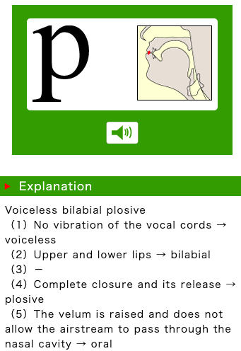

[TOC]

# IPA 国际音标

1. [国际语音学会手册](https://www.internationalphoneticassociation.org/content/handbook-ipa)
   《Handbook of the International Phonetic Association : A Guide to the Use of the International Phonetic Alphabet》
   - 可以下载到多语种真人录音，包括粤语、英语、日语、法语、德语、俄语、印地语、希伯来语等等
2. [東京外国語大学 国际音标教学](http://www.coelang.tufs.ac.jp/ipa/english/consonant_pulmonic.php)
   - IPA真人发音，有英文解说
   - 日语语法，有中文解说
     - [日本語文法日本語文法](http://www.coelang.tufs.ac.jp/ja/zt/gmod/)
3. **英語語音學** (含發音練習) 外文系  **Karen Steffen Chung 史嘉琳** [tw](https://e10aa8944c668c5e049e3851c3215aaa.cloudflareworkers.com/-----http://ocw.aca.ntu.edu.tw/ntu-ocw/ocw/cou/101S102)  

# IPA 肺部气流辅音表

[東京外国語大学 国际音标教学](http://www.coelang.tufs.ac.jp/ipa/english/consonant_pulmonic.php)

[汉粤日英音标转换器](https://easypronunciation.com/)

[爆破音的另外一个名字是塞音](https://www.bilibili.com/video/av76761930?from=search&seid=9146713917627386415)  

[国际音标：严式与宽式](http://abkai.net/blog/国际音标：严式与宽式/)

> 比如,中国人说巴和葩,美国人认为一样,都是pa,法国人也认为一样,都是pa。美国人说ba和pa,中国人认为不一样,分别是巴和葩;法国人能正确分辨。法国人说ba和pa,中国人认为一样,都是巴;美国人能正确分辨。同样说pa,美国人说出来,中国人认为是葩,而法国人说出来,中国人认为是巴。

[同位異音](https://zh.wikipedia.org/wiki/同位異音)

[濁雙唇塞音](https://zh.wikipedia.org/wiki/濁雙唇塞音)

|双唇音|唇齿音|

## 清浊的对立

### 英语的 [p] [b]

这个表里每个小格之内是清浊的对立

#### 英汉大词典
> pay  /ˈpeɪ/
> bay  /ˈbeɪ/
> 搬[pǣn]
> 攀[pʰǣn]

[ˈlɪps]

lips

[ˈsɪmpəɫ]

[simple](https://easypronunciation.com/zh/american-english-listening-skills-online-quiz-start)

[ˈkʌpəɫ]

couple

[ˈɹizn̩əbəɫ]

reasonable

[ˈbɹʌðɚ]

brother

##### 辅音b p 高级

[ɹɪˈplaɪd]

replied

发音者不按国际音标发音

## 送不送气的对立

我们更熟悉的是送不送气的对立比如

> 不是说发音的时候有气出来，没气出来  
> 只不过气流很大，气流很小这样的差别    

#### 汉语的 搬[pan]攀[pʰan]

## 声门符号h 写在上标的位置代表送气

在不引起歧义的情况下也可以不上标比如：pʰ 写成 ph 

### 

