[客语声调](https://langwiki.org/index.php?title=客家语&variant=zh-hans)

我 ŋai2   13调

> 柳州话说“爱”

[記得gi dedˋ](https://wiki.hakka.gov.tw/ver2018/classification.aspx?p=%u8A18%u5F97&r=&c=&g=)

恁久無來，你還記得路無?

這麼久沒來，你還記得路嗎？

| 梅縣 |      |      |      |      |      |
| ---- | ---- | ---- | ---- | ---- | ---- |
| 我   | ŋ    | ai   | 2    | ŋai2 | 白   |

| 梅縣 |      |      |      |      |
| ---- | ---- | ---- | ---- | ---- |
| 記   | k    | i    | 5    | ki5  |

> 汉语拼音的g, k 是不送气与送气的关系。
>
> g (汉拼)在国际音标里用k 表示，k(汉拼)在在国际音标里用kʰ 表示(其中的上示h 表示送气)。
> 另外h(汉拼) 对应的是 x
>
> 5调在粤拼和客拼都是阴入，调值 ˥

> 萌典
>
> **饶平 gi53**

| 梅縣 |      |      |      |      |
| ---- | ---- | ---- | ---- | ---- |
| 得   | t    | ɛt   | 7    | tɛt7 |

> 汉语拼音的d, t 是不送气与送气的关系。
>
> d (汉拼)在国际音标里用t 表示，t(汉拼)在在国际音标里用tʰ表示(其中的上示h 表示送气)。

汉语拼音声调

### 声调

（五度标记法）

阴平55，阳平35，上声214，去声51，轻声调值依前一字而定  

上声在阴平声、阳平声、去声、轻声前变为半上21，在上声前变为24。

| **声调** | **阴平声** | **阳平声** | **上声** | **去声** |
| -------- | ---------- | ---------- | -------- | -------- |
| 声调轮廓 | ˥˥         | ˧˥         | ˨˩˦      | ˥˩       |
| 调值     | 55         | 35         | 214      | 51       |

客语声调

#### 声调表

- 声调

| 调类 | 阴平 | 阳平  | 上声 | 去声 | 阴入 | 阳入 |
| ---- | ---- | ----- | ---- | ---- | ---- | ---- |
| 调号 | 1    | 2     | 3    | 4    | 5    | 6    |
| 调值 | 44   | 11    | 31   | 52   | 2    | 5    |
| 拼音 | fu1  | fu2 * | fu3  | fu4  | fug5 | fug6 |
| 例字 | 夫   | 扶    | 府   | 富   | 福   | 服   |

*扶的发音还有pu2[pʰu44]。

#### 改进意见

由于上述客语拼音方案仅以梅县话为基准，在声母上不包括有卷舌的客家语方言（如zh、ch、sh、r，类似普通话）及粤西-桂南客语（涯话）常见的**边擦音[ɬ][43] （可用sl表示）**，在韵母方面不考虑部分客语的撮口呼[y]（可用普通话的ü表示），在声调上没有兼顾五调、七调等**非六调客语**，故该方案还不能完全在客语内部完全通用。

一个可行的办法是根据现行方案，按照相同的规则，适当增加音素，如（zh、ch、sh、r、sl、ü等），声调调值各地不完全一致，故而无法统一，但是可以按以下建议统一调号：

| 调类 | 阴平 | 阳平 | 阴上 | 阳上 | 阴去 | 阳去 | 阴入 | 阳入 |
| ---- | ---- | ---- | ---- | ---- | ---- | ---- | ---- | ---- |
| 调号 | 1    | 2    | 3    | 4    | 5    | 6    | 7    | 8    |

说明：对于**主流客语**（六调）来说，**上声去声不分阴阳**，上声用3表示，去声用5表示，**4和6空出**；对于水源音、海陆腔等客语（七调）来说，只有上声不分阴阳，上声用3表示，4不用；对于长汀话等汀北片客语（五调），上声不分阴阳，上声用3表示，而4不用，没有入声，7、8也不用。

采用上述改进意见后，客拼就达到了最大程度的兼容，满足除梅县话外更多客语分支的要求，而不需要再独立修订方案。

教院(教育學院拼音方案)

粤语声调

|              | [IPA](https://zh.wikipedia.org/wiki/國際音標) | [宽式IPA](https://zh.wikipedia.org/wiki/粵語寬式國際音標) | [黄锡凌](https://zh.wikipedia.org/wiki/黃錫凌羅馬拼音) | [广州](https://zh.wikipedia.org/wiki/广州话拼音方案) | [教院](https://zh.wikipedia.org/wiki/教育學院拼音方案) | [粤拼](https://zh.wikipedia.org/wiki/香港語言學學會粵語拼音方案) | [耶鲁](https://zh.wikipedia.org/wiki/耶魯粵語拼音) | [刘锡祥](https://zh.wikipedia.org/wiki/劉錫祥拼音) | [Meyer-Wempe](https://zh.wikipedia.org/wiki/Meyer-Wempe) | [越语式](https://zh.wikipedia.org/wiki/蘇鴻傑-越语式) |
| ------------ | --------------------------------------------- | --------------------------------------------------------- | ------------------------------------------------------ | ---------------------------------------------------- | ------------------------------------------------------ | ------------------------------------------------------------ | -------------------------------------------------- | -------------------------------------------------- | -------------------------------------------------------- | ----------------------------------------------------- |
| 阴平，53     | ˥˧                                            | ˈa                                                        | ˈa                                                     | 1                                                    | 1                                                      | 1                                                            | à                                                  | 1                                                  | a                                                        | á                                                     |
| 高平，55     | ˥˥                                            | ˈa                                                        | ˈa                                                     | 1                                                    | 1                                                      | 1                                                            | ā                                                  | 10                                                 | a                                                        |                                                       |
| 阴上，35     | ˧˥                                            | ˊa                                                        | ˊa                                                     | 2                                                    | 2                                                      | 2                                                            | á                                                  | 2                                                  | á                                                        | ã                                                     |
| 阴去，33     | ˧˧                                            | ˉa                                                        | ˉa                                                     | 3                                                    | 3                                                      | 3                                                            | a                                                  | 3                                                  | à                                                        | a                                                     |
| 阳平，21或11 | ˨˩ 或 ˩˩                                      | ˌa                                                        | ˌa                                                     | 4                                                    | 4                                                      | 4                                                            | àh                                                 | 4                                                  | ā                                                        | à                                                     |
| 阳上，13或23 | ˩˧ 或 ˨˧                                      | ˏa                                                        | ˏa                                                     | 5                                                    | 5                                                      | 5                                                            | áh                                                 | 5                                                  | ǎ                                                        | ạ                                                     |
| 阳去，22     | ˨˨                                            | ˍa                                                        | ˍa                                                     | 6                                                    | 6                                                      | 6                                                            | ah                                                 | 6                                                  | â                                                        | à                                                     |
| 阴入，5      | ˥                                             | ˈat                                                       | ˈat                                                    | 1                                                    | 7或1                                                   | 1                                                            | āt                                                 | 1                                                  | at                                                       | á                                                     |
| 中入，3      | ˧                                             | ˉat                                                       | ˉat                                                    | 3                                                    | 8或3                                                   | 3                                                            | at                                                 | 3                                                  | àt                                                       | a                                                     |
| 阳入，2      | ˨                                             | ˍat                                                       | ˍat                                                    | 6                                                    | 9或6                                                   | 6                                                            | aht                                                | 6                                                  | ât                                                       | à                                                     |

|                    |       |        |       |       |        |        |              |      |
| :----------------: | :---: | :----: | :---: | :---: | :----: | :----: | :----------: | :--: |
|                    | 陰平  |  陽平  | 上聲  | 陰去  |  陽去  |  陰入  |     陽入     | 備註 |
|  **四縣腔(苗栗)**  | vˊ 24 | vˇ 11  | vˋ 31 | v 55  | vdˋ 2  |  vd 5  |              |      |
| **南四縣腔(美濃)** | v+ 33 | vˇ 11  | vˋ 31 | v 55  | vdˋ 2  |  vd 5  |              |      |
|     **海陸腔**     | vˋ 53 |  v 55  | vˊ 24 | vˇ 11 | v+ 33  |  vd 5  |    vdˋ 2     |      |
|     **大埔腔**     | v+ 33 | vˇ 113 | v^ 31 | vˋ 53 | vd^ 21 | vdˋ 54 | 超陰平 vˊ35  |      |
|  **饒平腔(新竹)**  | vˇ 11 |  v 55  | vˋ 53 | vˊ 24 |  vˋ 2  |  v 5   |              |      |
|  **饒平腔(卓蘭)**  | vˇ 11 | vˋ 53  | v^ 31 | v 55  |  vˋ 2  |  v 5   | 超陰入 vˊ 24 |      |
|     **詔安腔**     | vˇ 11 | vˋ 53  | v^ 31 | v 55  | vdˊ 24 | vdˋ 43 |              |      |

普通话是"三声四调"，而客家话是"四声六调"，其中客家话的四声即“平上去入”与中古汉浯一脉相承。

洪秀全是客家人，太平天国国语是客家语！

蘭芳共和國

1884年，蘭芳公司被荷蘭東印度公司擊敗而滅亡，殘餘勢力逃至蘇門答臘。蘭芳共和國從立國至滅亡，共經歷**一百零七年**

18世紀，西婆羅洲的各蘇丹國進口大量華人苦力到南洋挖掘金礦與錫礦，由於有荷蘭殖民者進行騷擾，所以當地有華人社團從廣東招請團練，來到南洋擔當類似保鑣或傭兵的角色，逐漸形成所謂「公司」的組織。又以客家人族群由於習武風氣盛又相當團結有嚴格紀律，故頗受歡迎影響力甚大，當中勢力最大的是蘭芳公司。

[在](https://www.moedict.tw/:在)[哪](https://www.moedict.tw/:哪)[拿](https://www.moedict.tw/:拿)[个](https://www.moedict.tw/:个)[東西](https://www.moedict.tw/:東西)[就](https://www.moedict.tw/:就)[愛](https://www.moedict.tw/:愛)[**記得**](https://www.moedict.tw/:記得)[放](https://www.moedict.tw/:放)[倒轉去](https://www.moedict.tw/:倒轉去)。
[在](https://www.moedict.tw/:在)[哪](https://www.moedict.tw/:哪)[裡](https://www.moedict.tw/:裡)[拿](https://www.moedict.tw/:拿)[的](https://www.moedict.tw/:的)[東西](https://www.moedict.tw/:東西)[就](https://www.moedict.tw/:就)[要](https://www.moedict.tw/:要)[**記得**](https://www.moedict.tw/:記得)[放](https://www.moedict.tw/:放)[回](https://www.moedict.tw/:回)[原](https://www.moedict.tw/:原)[處](https://www.moedict.tw/:處)。

梅縣
知	ts	ɿ	1	tsɿ1

梅县方言词典 

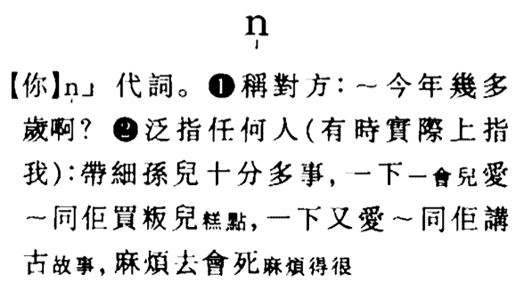

Enter a caption for this image (optional)

Enter a caption for this image (optional)

‌

永嘉南渡

‌

先到为主，后到为客

‌

土客械斗

‌

1854年的洪兵起义，这是在两广地区活跃多年的天地会组织策的一次规模庞大的农民总暴动。

‌

从1854年（咸丰四年）开始，两广地区爆发了令人难以想象的血腥惨烈大范围土客械斗。

‌

广东恩平一县内被攻打的土村就有400余个，七月客勇围攻松柏山，杀死土人2000余人，遗尸满山谷。咸丰六年，土人反攻，杀死客家较精干的丁壮500余人，客家人被迫逃亡他乡，不料半路又被土勇联合劫杀，老弱妇孺死者四千余人。

‌

由于土人在人力和财力上较之客家人有明显优势，客家人在广东开平和鹤山的聚落多被捣毁。客家人成千上万逃往新宁等地聚集，形成了多达数万乃至十余万的流民集团。

‌

为了平息土客冲突，清朝政府采用以产换产、划界分疆的政策，将土人和客人的聚居地完全隔离，才逐步平息了持续十四年的血腥冲突。

‌

https://www.zhihu.com/question/50123064

‌

“外面大街上”河南农民俚语词是什么？“mer，mer上”，本字也是“陌、**陌上**”。

> 唐 孟郊：天津桥下冰初结，洛阳陌上人行绝。 南朝《玉篇》：陌，市中街也。 《後漢·袁紹傳》塡接街陌。 《史記·龜策傳》故牧人民，爲之城郭，內經閭術，外爲阡陌。例如：”车音争陌去如流“——苏辙。

| Title | Title | Title | Title | Title |
| ----- | ----- | ----- | ----- | ----- |
| 我    | ŋ     | ai    | 2     | ŋai2  |

‌

 **軟顎鼻音**（velar nasal、agma）是[輔音](https://zh.wikipedia.org/wiki/輔音)的一種，中文俗稱**後鼻音**，在[國際音標](https://zh.wikipedia.org/wiki/國際音標)中以**⟨ŋ⟩**(ng)表示，在[X-SAMPA](https://zh.wikipedia.org/wiki/X-SAMPA)中以**⟨N⟩**表示。[現代標準漢語](https://zh.wikipedia.org/wiki/現代標準漢語)的 ang、eng、ing、ong 的[韻尾](https://zh.wikipedia.org/wiki/韻尾) ng 就是此音。

‌

鼻韵母

‌

[普通话](https://baike.baidu.com/item/普通话/161653)鼻[韵母](https://baike.baidu.com/item/韵母)共有十六个，即an ian uan üan en in uen ün ang iang uang eng ing ong ueng iong。

‌

普通话明确区分为-n和-ng为[韵尾](https://baike.baidu.com/item/韵尾/5489384)的两组韵母。以-n为韵尾构成的韵母叫[前鼻韵母](https://baike.baidu.com/item/前鼻韵母/1718041)，以-ng为韵尾构成的韵母叫[后鼻韵母](https://baike.baidu.com/item/后鼻韵母)。

‌

前后鼻音不分，是困扰很多人尤其是南方人说普通话的一大难点。那么，我们该如何正确区分两者？彻底纠正这一问题呢？

‌

以下是小普经过对专业老师的咨询以及资料的整理之后，总结了分清前后鼻音的两个关键要点。

‌

**分不清前后鼻音主要存在两方面的问题，一是发音的混杂；二是音节识辨混淆。要想正确区分前后鼻音，首先就需要克服发音混杂的问题。**

‌

**01**

‌

**发音混杂是指前鼻音和后鼻音的舌位区别不开。**鼻韵母中以an｜ang，en｜eng，in｜ing为代表，来看下列动图中前鼻音与后鼻音发音的区别，仔细看舌位的变化。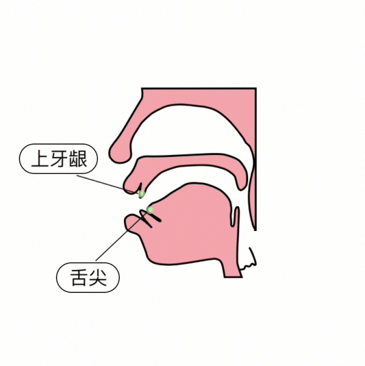前鼻音发音动图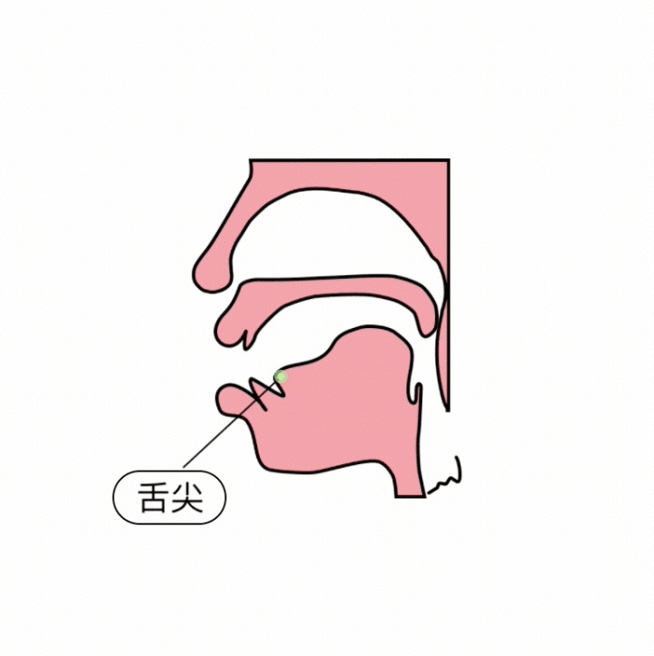后鼻音发音动图

‌

**3个典型鼻韵母的正确发音方法**

‌

**an**：an由前“a”开始发音，舌尖活动是顶下齿背到抵上**牙龈部分**，舌面稍升，舌前伸。收音时an上下齿闭拢，嘴型如下图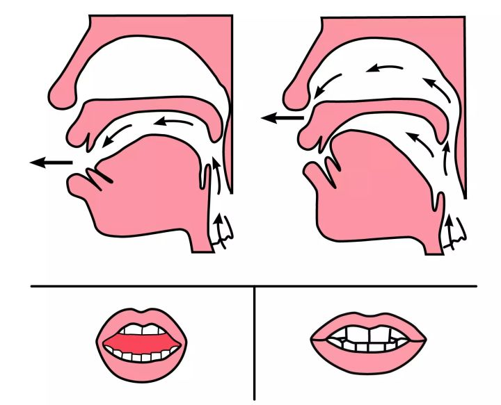

‌

**ang**：由后“a”开始发音，舌尖离开下齿背，舌头后缩，舌根抬起与软腭接触，舌头后缩。读ang收音时，嘴形微开。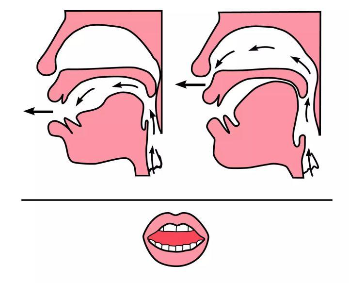

‌

**en**：由e舌位开始发音，舌头平放，结尾时舌尖也抵到上牙龈结束发音，发完音上下齿都是闭拢的。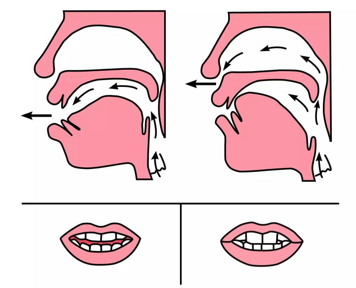

‌

**eng**：由e开始发音后缩，舌根上升，软腭下降，收音时，嘴巴微开，上下齿不闭拢。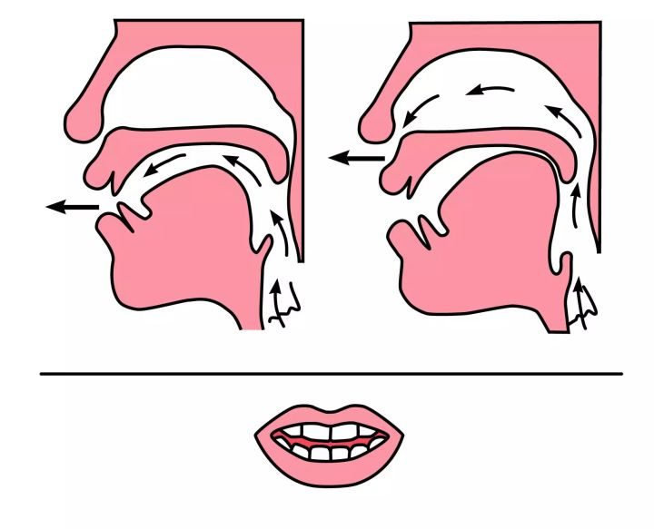

‌

**in**：由i开始发音，上下齿始终不动，只是明显感觉到舌尖从下向上的动作，收音时，舌尖抵住上牙龈，不后缩。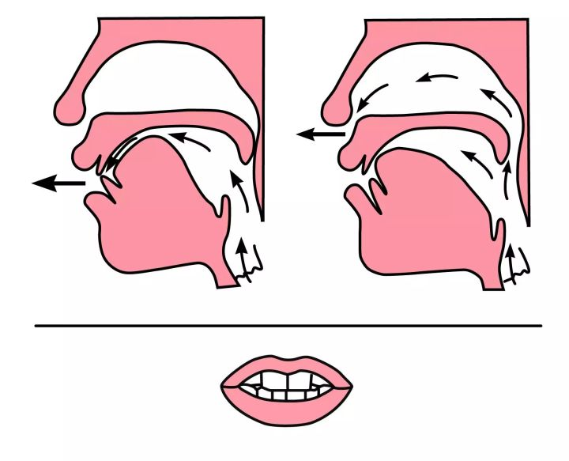

‌

ing：同为i开始发音，舌尖离开下齿背，舌头后移。发音时，要注意由i到n、ng时，舌位不要降低，不要发ien、ieng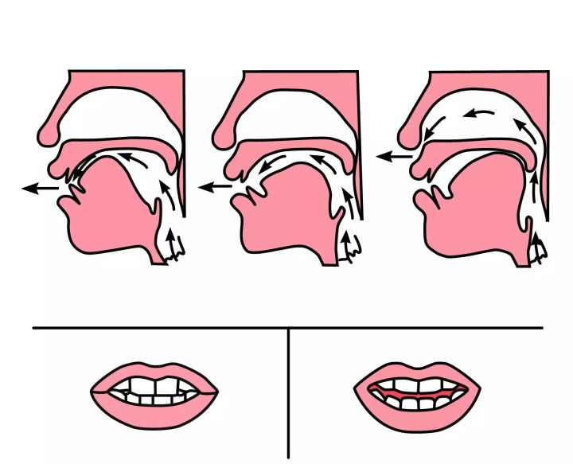

‌

**日常练习：鼻韵母辩证－字和词的对比**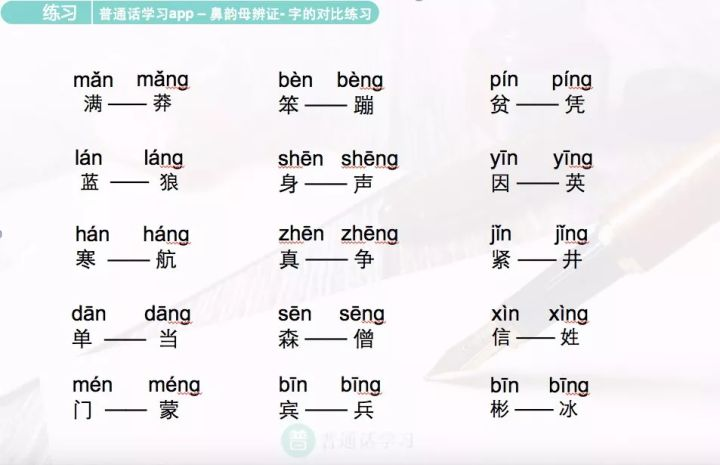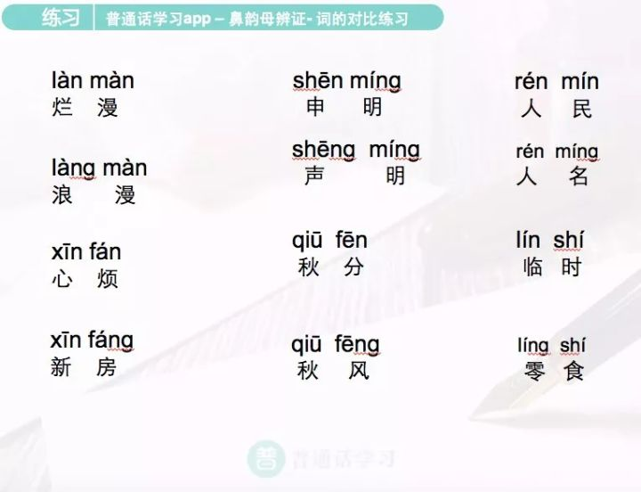

‌

**02**

‌

音节识辨混淆是指不认识前后鼻音的字，小普总结了大部分人都**容易读错的单字**，照着这些拼音，多练几遍，熟能生巧。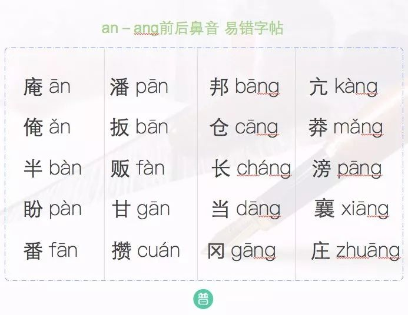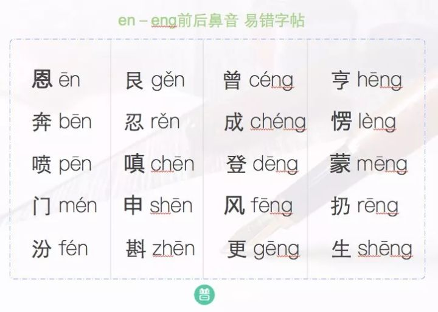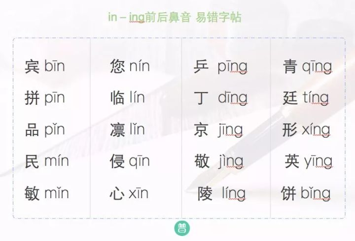

‌

掌握了基础的两个要点之后，接下来最重要的就是练习、练习、练习。

‌

每天录音，反复练，反复改，自我纠正，或请老师帮你纠正。在语言这条道路上，就像章子怡老师说的那样，是“**没有捷径可走的，花多少时间去学习，你就可以体现多少时间的成绩**”。

# 汉语拼音与国际音标对照表（简明版）

https://zhuanlan.zhihu.com/p/99512131

## 声母

b [p]
p [pʰ]
m [m]
f [f]

d [t]
t [tʰ]
n [n]
l [l]

g [k]
k [kʰ]
h [x]

j [t͡ɕ][[1\]](https://zhuanlan.zhihu.com/p/99512131#ref_1)
q [t͡ɕʰ]
x [ɕ]

zh [t͡ʂ][[2\]](https://zhuanlan.zhihu.com/p/99512131#ref_2)
ch [t͡ʂʰ]
sh [ʂ]
r [ɻ]

z [t͡s]
c [t͡sʰ]
s [s]

零声母不写任何符号。

## 韵母

a [a]
ia [ja][[3\]](https://zhuanlan.zhihu.com/p/99512131#ref_3)
ua [wa]

o [o][[4\]](https://zhuanlan.zhihu.com/p/99512131#ref_4)
io [jo][[5\]](https://zhuanlan.zhihu.com/p/99512131#ref_5)
uo [wo]

e [ɤ]

ê [ɛ][[5\]](https://zhuanlan.zhihu.com/p/99512131#ref_5)
ie [jɛ][[6\]](https://zhuanlan.zhihu.com/p/99512131#ref_6)
üe [ɥɛ]

i [i]
“资雌思”的韵母 [ɹ̩]
“知蚩诗日”的韵母 [ɻ̍][[7\]](https://zhuanlan.zhihu.com/p/99512131#ref_7)

u [u]
fu 中的 u [ʋ̩][[8\]](https://zhuanlan.zhihu.com/p/99512131#ref_8)

ü [y]

ai [aɪ][[9\]](https://zhuanlan.zhihu.com/p/99512131#ref_9)
uai [waɪ]

ei [eɪ]
ui [weɪ]

ao [ɑʊ][[9\]](https://zhuanlan.zhihu.com/p/99512131#ref_9)
iao [jɑʊ]

ou [oʊ]
iu [joʊ]

an [an]
ian [jɛn][[6\]](https://zhuanlan.zhihu.com/p/99512131#ref_6)
uan [wan]
üan [ɥæn]

en [ən]
in [in]
un [wən]
ün [yn]

ang [ɑŋ][[9\]](https://zhuanlan.zhihu.com/p/99512131#ref_9)
iang [jɑŋ]
uang [wɑŋ]

eng [ɤŋ][[10\]](https://zhuanlan.zhihu.com/p/99512131#ref_10)
ing [iŋ]
ueng [wɤŋ]

ong [ʊŋ]
iong [jʊŋ]

er [əɻ][[11\]](https://zhuanlan.zhihu.com/p/99512131#ref_11)

m [m̩][[12\]](https://zhuanlan.zhihu.com/p/99512131#ref_12)
n [n̩]
ng [ŋ̍]

## 儿化韵

or [o˞]
uor [wo˞]

er [ɤ˞]

ier [jɝ][[11\]](https://zhuanlan.zhihu.com/p/99512131#ref_11)
üer [ɥɝ]

ur [ʊ˞]
fur 中的 ur [ʋ̩͡ʊ˞][[8\]](https://zhuanlan.zhihu.com/p/99512131#ref_8)

ar/anr/air [ɐɻ][[13\]](https://zhuanlan.zhihu.com/p/99512131#ref_13)
iar/ianr [jɐɻ][[14\]](https://zhuanlan.zhihu.com/p/99512131#ref_14)
uar/uanr/uair [wɐɻ]
üanr [ɥɐɻ]

enr/eir/“汁儿、字儿”的韵母 [əɻ][[11\]](https://zhuanlan.zhihu.com/p/99512131#ref_11)[[15\]](https://zhuanlan.zhihu.com/p/99512131#ref_15)
inr/ir [iəɻ]
unr/uir [wəɻ]
ünr/ür [yəɻ]

aor [ɑ˞ʊ˞]
iaor [jɑ˞ʊ˞]

our [o˞ʊ˞]
iur [jo˞ʊ˞]

angr [ɑ̃˞][[16\]](https://zhuanlan.zhihu.com/p/99512131#ref_16)
iangr [jɑ̃˞][[17\]](https://zhuanlan.zhihu.com/p/99512131#ref_17)
uangr [wɑ̃˞]

engr [ɤ̃˞][[10\]](https://zhuanlan.zhihu.com/p/99512131#ref_10)
ingr [iɘ̃˞]
uengr [wɤ̃˞]

ongr [ʊ̃˞]
iongr [jʊ̃˞]

## 声调

◌̄ [˥]
◌́ [˧˥]
◌̌ [˨˩˦][[18\]](https://zhuanlan.zhihu.com/p/99512131#ref_18)
◌̀ [˥˩]

轻声可以不写出调值。如果要写，四声后的轻声分别是 [˦˩]、[˥˨]、[˧˦]、[˨˩][[19\]](https://zhuanlan.zhihu.com/p/99512131#ref_19)。

## 参考

1. [^](https://zhuanlan.zhihu.com/p/99512131#ref_1_0)[t͡ɕ]、[t͡ɕʰ]、[t͡ʂ]、[t͡ʂʰ]、[t͡s]、[t͡sʰ] 的弧线可省略。
2. [^](https://zhuanlan.zhihu.com/p/99512131#ref_2_0)[t͡ʂ]、[t͡ʂʰ]、[ʂ]、[ɻ] 李、徐记作 [tʃ̺]、[tʃ̺ʰ]、[ʃ̺]、[ɹ̺]。
3. [^](https://zhuanlan.zhihu.com/p/99512131#ref_3_0)[j]、[w]、[ɥ] 李、徐记作 [i]、[u]、[y]。
4. [^](https://zhuanlan.zhihu.com/p/99512131#ref_4_0)韵母 o 李、徐记作 [uo]。
5. ^[a](https://zhuanlan.zhihu.com/p/99512131#ref_5_0)[b](https://zhuanlan.zhihu.com/p/99512131#ref_5_1)韵母 yo、ê 李、徐不收。
6. ^[a](https://zhuanlan.zhihu.com/p/99512131#ref_6_0)[b](https://zhuanlan.zhihu.com/p/99512131#ref_6_1)[ɛ]、[æ] 李、徐都记作 [e]。
7. [^](https://zhuanlan.zhihu.com/p/99512131#ref_7_0)“知蚩诗日”的韵母李、徐记作 [ɹ̩]。
8. ^[a](https://zhuanlan.zhihu.com/p/99512131#ref_8_0)[b](https://zhuanlan.zhihu.com/p/99512131#ref_8_1)[ʋ̩]、[ʋ̩͡ʊ˞] 李、徐记作 [u]、[u˞]。
9. ^[a](https://zhuanlan.zhihu.com/p/99512131#ref_9_0)[b](https://zhuanlan.zhihu.com/p/99512131#ref_9_1)[c](https://zhuanlan.zhihu.com/p/99512131#ref_9_2)[ɪ]、[ʊ]、[ɑ] 李、徐记作 [i]、[u]、[a]。
10. ^[a](https://zhuanlan.zhihu.com/p/99512131#ref_10_0)[b](https://zhuanlan.zhihu.com/p/99512131#ref_10_1)韵腹 [ɤ]、[ɘ] 李、徐都记作 [ə]。
11. ^[a](https://zhuanlan.zhihu.com/p/99512131#ref_11_0)[b](https://zhuanlan.zhihu.com/p/99512131#ref_11_1)[c](https://zhuanlan.zhihu.com/p/99512131#ref_11_2)[əɻ]、[ɝ] 李、徐都记作 [ɚ]。
12. [^](https://zhuanlan.zhihu.com/p/99512131#ref_12_0)成音节的 m、n、ng 李、徐不收。
13. [^](https://zhuanlan.zhihu.com/p/99512131#ref_13_0)[ɻ]、[ɝ] 李、徐都记作 [ɚ]。
14. [^](https://zhuanlan.zhihu.com/p/99512131#ref_14_0)ianr、üanr 李、徐记作 [iəɚ]、[yəɚ]。
15. [^](https://zhuanlan.zhihu.com/p/99512131#ref_15_0)“汁儿、字儿”的韵母李、徐记作 [ɹ̩ɚ]，有误。
16. [^](https://zhuanlan.zhihu.com/p/99512131#ref_16_0)[ɑ̃˞] 李、徐记作 [ã˞ɚ̃]。
17. [^](https://zhuanlan.zhihu.com/p/99512131#ref_17_0)后鼻音儿化韵中的 [j]、[w] 李、徐记作 [ĩ]、[ũ]。
18. [^](https://zhuanlan.zhihu.com/p/99512131#ref_18_0)[˨˩˦] 李、徐记作 [˨˩˧]。
19. [^](https://zhuanlan.zhihu.com/p/99512131#ref_19_0)李、徐记作 [(˧˩)]、[(˥˩)]、[(˧)]、[(˩)]。

# Standard Chinese / 汉语普通话

## Initials

| No.  | Pinyin | IPA-U | IPA-L |
| ---- | ------ | ----- | ----- |
| 1    | b      | p     | p     |
| 2    | p      | pʰ    | pʰ    |
| 3    | m      | m     | m     |
| 4    | f      | f     | f     |
| 5    | d      | t     | t     |
| 6    | t      | tʰ    | tʰ    |
| 7    | n      | n     | n     |
| 8    | l      | l     | l     |
| 9    | g      | k     | k     |
| 10   | k      | kʰ    | kʰ    |
| 11   | h      | x     | x     |
| 12   | j      | t͡ɕ    | tɕ    |
| 13   | q      | t͡ɕʰ   | tɕʰ   |
| 14   | x      | ɕ     | ɕ     |
| 15   | zh     | t͡ʂ    | tʃ̺    |
| 16   | ch     | t͡ʂʰ   | tʃ̺ʰ   |
| 17   | sh     | ʂ     | ʃ̺     |
| 18   | r      | ɻ     | ɹ̺     |
| 19   | z      | t͡s    | ts    |
| 20   | c      | t͡sʰ   | tsʰ   |
| 21   | s      | s     | s     |
| 22   | ∅      | ∅     | ∅     |

- ∅: Zero initial.

## Finals

| No.  | Pinyin | IPA-U | IPA-L |
| ---- | ------ | ----- | ----- |
| 1    | a      | a     | a     |
| 2    | ia     | ja    | ia    |
| 3    | ua     | wa    | ua    |
| 4    | o      | o     | uo    |
| 5    | io     | jo    | /     |
| 6    | uo     | wo    | uo    |
| 7    | e      | ɤ     | ɤ     |
| 8    | ê      | ɛ     | /     |
| 9    | ie     | jɛ    | ie    |
| 10   | üe     | ɥɛ    | ye    |
| 11   | i      | i     | i     |
| 11a  | i₁     | ɹ̩     | ɹ̩     |
| 11b  | i₂     | ɻ̍     | ɹ̩     |
| 12   | u      | u     | u     |
| 12a  | u₁     | ʋ̩     | u     |
| 13   | ü      | y     | y     |
| 14   | ai     | aɪ    | ai    |
| 15   | uai    | waɪ   | uai   |
| 16   | ei     | eɪ    | ei    |
| 17   | ui     | weɪ   | uei   |
| 18   | ao     | ɑʊ    | au    |
| 19   | iao    | jɑʊ   | iau   |
| 20   | ou     | oʊ    | ou    |
| 21   | iu     | joʊ   | iou   |
| 22   | an     | an    | an    |
| 23   | ian    | jɛn   | ien   |
| 24   | uan    | wan   | uan   |
| 25   | üan    | ɥæn   | yen   |
| 26   | en     | ən    | ən    |
| 27   | in     | in    | in    |
| 28   | un     | wən   | uən   |
| 29   | ün     | yn    | yn    |
| 30   | ang    | ɑŋ    | aŋ    |
| 31   | iang   | jɑŋ   | iaŋ   |
| 32   | uang   | wɑŋ   | uaŋ   |
| 33   | eng    | ɤŋ    | əŋ    |
| 34   | ing    | iŋ    | iŋ    |
| 35   | ueng   | wɤŋ   | uəŋ   |
| 36   | ong    | ʊŋ    | uŋ    |
| 37   | iong   | jʊŋ   | iuŋ   |
| 38   | er     | əɻ    | ɚ     |
| 39   | m      | m̩     | /     |
| 40   | n      | n̩     | /     |
| 41   | ng     | ŋ̍     | /     |

- *i*₁: *i* after *z*, *c*, and *s*.
- *i*₂: *i* after *zh*, *ch*, *sh*, and *r*.
- *u*₁: *u* after *f*.
- Although *èr* (二, 贰) is pronounced [ɐɻ˥˩] by a number of speakers now, the conservative varient [əɻ˥˩] is still used in IPA-U.

## Rhotacized Finals

| No.  | Pinyin      | IPA-U | IPA-L |
| ---- | ----------- | ----- | ----- |
| 1    | ar          | a˞    | aɚ    |
| 2    | iar         | ja˞   | ia˞ɚ  |
| 3    | uar         | wa˞   | ua˞ɚ  |
| 4    | or          | o˞    | uo˞   |
| 5    | uor         | wo˞   | uo˞   |
| 6    | er          | ɤ˞    | ɤ˞    |
| 7    | ier         | jɝ    | iɚ    |
| 8    | üer         | ɥɝ    | yɚ    |
| 9    | ur          | ʊ˞    | u˞    |
| 9a   | ur₁         | ʋ̩͡ʊ˞   | u˞    |
| 10   | anr/air     | ɐɻ    | aɚ    |
| 11   | ianr        | jɐɻ   | iəɚ   |
| 12   | uanr/uair   | wɐɻ   | ua˞ɚ  |
| 13   | üanr        | ɥɐɻ   | yəɚ   |
| 14   | enr/eir/ir₁ | əɻ    | əɚ    |
| 15   | inr/ir      | iəɻ   | iɚ    |
| 16   | unr/uir     | wəɻ   | uəɚ   |
| 17   | ünr/ür      | yəɻ   | yɚ    |
| 18   | aor         | ɑ˞ʊ˞  | au˞   |
| 19   | iaor        | jɑ˞ʊ˞ | ia˞u˞ |
| 20   | our         | o˞ʊ˞  | ou˞   |
| 21   | iur         | jo˞ʊ˞ | io˞u˞ |
| 22   | angr        | ɑ̃˞    | ãɚ̃    |
| 23   | iangr       | jɑ̃˞   | ĩã˞ɚ̃  |
| 24   | uangr       | wɑ̃˞   | ũã˞ɚ̃  |
| 25   | engr        | ɤ̃˞    | ə̃ɚ̃    |
| 26   | ingr        | iɘ̃˞   | ĩɚ̃    |
| 27   | uengr       | wɤ̃˞   | ũə̃ɚ̃   |
| 28   | ongr        | ʊ̃˞    | ũ˞    |
| 29   | iongr       | jʊ̃˞   | ĩũ˞   |

- *ur*₁: *ur* after *f*.
- *ir*₁: *ir* after *zh*, *ch*, *sh*, *r*, *z*, *c*, and *s*. IPA-L transcribes *ir₁* as [ɹ̩ɚ], different from *enr/eir*. This should be incorrect for Standard Chinese or Beijing Mandarin.

## Tones

| No.  | Pinyin | IPA-U | IPA-L |
| ---- | ------ | ----- | ----- |
| 1    | ◌̄      | ˥     | ˥     |
| 2    | ◌́      | ˧˥    | ˧˥    |
| 3    | ◌̌      | ˨˩˦   | ˨˩˧   |
| 4    | ◌̀      | ˥˩    | ˥˩    |
| 5    | ∅      | ∅     | *     |

- ∅: Neutral tone (轻声). In IPA-U, no tone letters are written for neutral-tone syllables. In IPA-L, neutral tones are ˧˩, ˥˩, ˧, and ˩ when following the 1st, 2nd, 3rd, and 4th tones, respectively.

## Field Description

- **No.**: Index of phonemes.
- **Pinyin**: [*Hànyǔ Pīnyīn* (汉语拼音)](https://en.wikipedia.org/wiki/Pinyin), the official romanization system of Standard Chinese.
- **IPA-U**: The broad transcription of fairly conservative varieties by unt[1].
- **IPA-L**: The broad transcription of younger speakers in Beijing by Wai-Sum Lee & Eric Zee[2].

# References

1. unt. [新老派普通话的宽严式记音（含儿化韵）](https://zhuanlan.zhihu.com/p/38258415).
2. Wai-Sum Lee, Eric Zee. [Standard Chinese (Beijing)](https://www.cambridge.org/core/journals/journal-of-the-international-phonetic-association/article/standard-chinese-beijing/050A393AF2D3C325E3C6796FE8CA99A3). *Journal of the International Phonetic Association*, **2003**, *33* (1): 109–112.

《汉语拼音字母与国际音标对照表》是一种用于汉语普通话学习、语音研究的对照表。语音是语言交流的基础，掌握语音是掌握一门语言关键的一步。是本对照表有助于人们更好地学习汉语、了解或研究汉语普通话语音。

- 中文名

  汉语拼音字母与国际音标对照表

- 用  途

  汉语普通话学习、语音研究

## 目录

1. 1 [声调](https://baike.baidu.com/item/汉语拼音字母与国际音标对照表#1)
2. 2 [辅音](https://baike.baidu.com/item/汉语拼音字母与国际音标对照表#2)
3. 3 [元音](https://baike.baidu.com/item/汉语拼音字母与国际音标对照表#3)

1. ▪ [单元音表](https://baike.baidu.com/item/汉语拼音字母与国际音标对照表#3_1)
2. ▪ [韵母表](https://baike.baidu.com/item/汉语拼音字母与国际音标对照表#3_2)
3. 4 [注意事项](https://baike.baidu.com/item/汉语拼音字母与国际音标对照表#4)

1. ▪ [关于拼音](https://baike.baidu.com/item/汉语拼音字母与国际音标对照表#4_1)
2. ▪ [语流音变](https://baike.baidu.com/item/汉语拼音字母与国际音标对照表#4_2)

## 声调

[编辑](javascript:;)

（五度标记法）

[阴平](https://baike.baidu.com/item/阴平/10970766)55，[阳平](https://baike.baidu.com/item/阳平/28779)35，[上声](https://baike.baidu.com/item/上声)214，[去声](https://baike.baidu.com/item/去声)51，轻声不标注声调，调值依前一字而定

上声在阴平声、阳平声、去声、轻声前变为半上21，在上声前变为24

例：用a标注声调：

阴平 ā ，阳平 á ，上声 ǎ ，去声 à ，轻声 a

## 辅音

[编辑](javascript:;)

|                                                   | **[双唇音](https://baike.baidu.com/item/双唇音)** | **[唇齿音](https://baike.baidu.com/item/唇齿音)** | **[齿音](https://baike.baidu.com/item/齿音)****（舌尖前音）** | **龈音**（舌尖中音）                                   | **[翘舌音](https://baike.baidu.com/item/翘舌音)**(舌尖后音） | **[龈腭音](https://baike.baidu.com/item/龈腭音)** | **[软腭音](https://baike.baidu.com/item/软腭音)** |                                               |                                               |                                               |        |      |
| ------------------------------------------------- | ------------------------------------------------- | ------------------------------------------------- | ------------------------------------------------------------ | ------------------------------------------------------ | ------------------------------------------------------------ | ------------------------------------------------- | ------------------------------------------------- | --------------------------------------------- | --------------------------------------------- | --------------------------------------------- | ------ | ---- |
| **[清音](https://baike.baidu.com/item/清音)**     | **[浊音](https://baike.baidu.com/item/浊音)**     | **[清音](https://baike.baidu.com/item/清音)**     | **[清音](https://baike.baidu.com/item/清音/16296256)**       | **[清音](https://baike.baidu.com/item/清音/16296256)** | **[浊音](https://baike.baidu.com/item/浊音)**                | **[清音](https://baike.baidu.com/item/清音)**     | **[浊音](https://baike.baidu.com/item/浊音)**     | **[清音](https://baike.baidu.com/item/清音)** | **[清音](https://baike.baidu.com/item/清音)** | **[浊音](https://baike.baidu.com/item/浊音)** |        |      |
| **[鼻音](https://baike.baidu.com/item/鼻音)**     |                                                   | m [m]                                             |                                                              |                                                        |                                                              | n [n]                                             |                                                   |                                               |                                               |                                               | ng [ŋ] |      |
| **[塞音](https://baike.baidu.com/item/塞音)**     | **[不送气](https://baike.baidu.com/item/不送气)** | b [p]                                             |                                                              |                                                        |                                                              | d [t]                                             |                                                   |                                               |                                               |                                               | g [k]  |      |
| **[送气](https://baike.baidu.com/item/送气)**     | p [pʰ]                                            |                                                   |                                                              |                                                        | t [tʰ]                                                       |                                                   |                                                   |                                               |                                               | k [kʰ]                                        |        |      |
| **[塞擦音](https://baike.baidu.com/item/塞擦音)** | **[不送气](https://baike.baidu.com/item/不送气)** |                                                   |                                                              |                                                        | z [ts]                                                       |                                                   |                                                   | zh [ʈʂ]                                       |                                               | j [tɕ]                                        |        |      |
| **[送气](https://baike.baidu.com/item/送气)**     |                                                   |                                                   |                                                              | c [tsʰ]                                                |                                                              |                                                   | ch [ʈʂʰ]                                          |                                               | q [tɕʰ]                                       |                                               |        |      |
| **[擦音](https://baike.baidu.com/item/擦音)**     |                                                   |                                                   |                                                              | f [f]                                                  | s [s]                                                        |                                                   |                                                   | sh [ʂ]                                        | r [ʐ]                                         | x [ɕ]                                         | h [x]  |      |
| **[边音](https://baike.baidu.com/item/边音)**     |                                                   |                                                   |                                                              |                                                        |                                                              |                                                   | l [l]                                             |                                               |                                               |                                               |        |      |

**注：**

1. “[齿音](https://baike.baidu.com/item/齿音)”、“龈音”和“[翘舌音](https://baike.baidu.com/item/翘舌音)”又分别叫做“[舌尖前音](https://baike.baidu.com/item/舌尖前音)”、“[舌尖中音](https://baike.baidu.com/item/舌尖中音)”和“[舌尖后音](https://baike.baidu.com/item/舌尖后音)”。
2. 普通话的塞音b、d、g与破擦音j、zh、z并不是[浊音](https://baike.baidu.com/item/浊音)[b]、[d]、[g]、[ʥ]、[ɖʐ]、[ʣ]，而只是根据送气与否来决定，所以拼音 b、d、g 、j、zh、z对应音标[p]、[t]、[k]、[ʨ]、[ʈʂ]、[ʦ]，而拼音 p、t、k、q、ch、c 对应音标[pʰ]、[tʰ]、[kʰ]、[ʨʰ]、[ʈʂʰ]、[ʦʰ]，国际音标以上标的“h”标于右方来表示送气音。
3. 汉语中，声母大多是清辅音，仅有五个是浊辅音：m[m],n[n],l[l],r[ʐ],ng[[ŋ](https://baike.baidu.com/item/ŋ)]
4. 以a、o、e开头的零声母音节头发喉塞音[ʔ]，拼音中省略或以隔音符号表示
5. 以i、u、ü开头的零声母音节头发半元音[j]、[w]、[ɥ]，拼音中以y、w、yu表示。
6. 拼音的 z、c、s 中擦音是由舌尖接触到上门牙的[齿音](https://baike.baidu.com/item/齿音)[s̪]，与英语的龈音 [s] 略有不同。
7. 拼音的 h 不等同于声门清擦音[h]，而是软腭清擦音[x]，气流摩擦部位在软腭处而非直接呼出的声门处。
8. 在语流中，声母 w 有着唇齿近音 [ʋ] 的音位变体，但这种发音不被鼓励。
9. 声母 r 的实际发音介于擦音[ʐ]与近音[ɻ]之间，通常以[ʐ]为标准音。
10. 声母zh、ch、sh、r是卷舌音[ʈʂ]、[ʈʂʰ]、[ʂ]、[ʐ]，不是舌叶音[ʧ]、[ʧʰ]、 [ʃ]、[ʒ]。舌叶音是舌叶（包括舌尖和舌面前沿）抵住硬腭前部构成阻碍而形成的音，不卷舌。“卷舌音”是由舌尖向上翘起和硬腭前部相接触，使气流受阻而构成的一种辅音。二者发音方式完全不同。

## 元音

[编辑](javascript:;)

### 单元音表

| **拼音字母** | **[国际音标](https://baike.baidu.com/item/国际音标)** | **拼音字母**             | **[国际音标](https://baike.baidu.com/item/国际音标)** | **拼音字母**          | **[国际音标](https://baike.baidu.com/item/国际音标)** |
| ------------ | ----------------------------------------------------- | ------------------------ | ----------------------------------------------------- | --------------------- | ----------------------------------------------------- |
| a            | [a]                                                   | e                        | [ɤ]或[ə]（轻声）                                      | u                     | [u]                                                   |
| o            | [o]                                                   | i                        | [i]                                                   | ü                     | [y]                                                   |
| ê            | [ɛ]                                                   | -i（声母为zh、ch、sh时） | [ɻ̩] / [ʅ]                                             | -i（声母为z、c、s时） | [ɹ̩] / [ɿ]                                             |

**注：**

1. 单元音“e”在[轻声](https://baike.baidu.com/item/轻声)时读[ә]，例如“了”、“着”等（多为助词的情况下）
2. 中文的“土”会和英语“two”在元音上听起来会有差别，原因在于英文中的[uː]更靠前接近于[ʉː]，甚至双元音化作[ʊʉ̯]等等，但一般的宽式标音采用 /uː/ 为代表。
3. 跟在zh、ch、sh和z、c、s后的 i 实际上分别是近音（即[无擦通音](https://baike.baidu.com/item/无擦通音)）[ɻ̩] 与 [ɹ̩]，有时亦发成[擦音](https://baike.baidu.com/item/擦音)[ʐ̩]与[z̩]；汉语言学者也使用“舌尖元音”的概念，以非标准[国际音标](https://baike.baidu.com/item/国际音标)符号[ʅ]（舌尖后不圆唇元音）和[ɿ]（舌尖前不圆唇元音）表示。

### 韵母表

|                                                   | **[开口呼](https://baike.baidu.com/item/开口呼)** | **[齐齿呼](https://baike.baidu.com/item/齐齿呼)** | **[合口呼](https://baike.baidu.com/item/合口呼)** | **[撮口呼](https://baike.baidu.com/item/撮口呼)** |
| ------------------------------------------------- | ------------------------------------------------- | ------------------------------------------------- | ------------------------------------------------- | ------------------------------------------------- |
| **[单韵母](https://baike.baidu.com/item/单韵母)** |                                                   | i /i/                                             | u /u/                                             | ü /y/                                             |
| a /a/                                             | ia /ia/                                           | ua /uɑ/                                           |                                                   |                                                   |
| o /o/                                             |                                                   | uo /wo/                                           |                                                   |                                                   |
| e /ɤ/                                             |                                                   |                                                   |                                                   |                                                   |
| ê /ɛ/                                             | ie /jɛ/                                           |                                                   | üe /ɥɛ/                                           |                                                   |
| er /əɹ/ /ɚ/                                       |                                                   |                                                   |                                                   |                                                   |
| **[复韵母](https://baike.baidu.com/item/复韵母)** | ai /aɪ/                                           | (iai /jæɪ/)                                       | uai /waɪ/                                         |                                                   |
| ei /eɪ/                                           |                                                   | uei /weɪ/                                         |                                                   |                                                   |
| ao /ɑʊ/                                           | iao /jɑʊ/                                         |                                                   |                                                   |                                                   |
| ou /oʊ/                                           | iou /joʊ/                                         |                                                   |                                                   |                                                   |
| **带鼻音韵母**                                    | an /an/                                           | ian /jæn/                                         | uan /wan/                                         | üan /ɥæn/                                         |
| en /ən/                                           |                                                   | uen /wən/                                         |                                                   |                                                   |
|                                                   | in/in/                                            |                                                   | ün /yn/                                           |                                                   |
| ang /ɑŋ/                                          | iang /jɑŋ/                                        | uang /wɑŋ/                                        |                                                   |                                                   |
| eng /ɤŋ/                                          | ing /iŋ/                                          | ueng /wɤŋ/                                        |                                                   |                                                   |
|                                                   |                                                   | ong /ʊŋ/                                          | iong /ɥʊŋ/                                        |                                                   |

**注：**

1. 中华人民共和国台湾方言中有韵母 iai ，如“崖”念作yái [1] ，现大陆地区已不用。
2. ou [oʊ̯]、iou [i̯oʊ̯]的主元音的圆唇程度经常弱化，变成 [ɤʊ̯]和[i̯ɤʊ̯]。
3. 单韵母e 常双元音化，变成[ɯʌ̯]或[ɤʌ̯],但其标准读音应为单元音[ɤ]。
4. 当声调为阴平与阳平时，uei [u̯eɪ̯]、iou [i̯oʊ̯]、uen [u̯ən] 中的主元音常被弱化，发成 [u̯ᵊi]、[i̯ᵊu] 和 [uᵊn]。
5. ian（yan）和üan（yuan）的读音各地存在差异，以当代北京音为例，普遍读作[i̯æn] 和[y̯ɐn]。

以下是国际音标（IPA）的[元音](https://baike.baidu.com/item/元音/2811)表：

[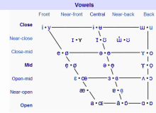](https://baike.baidu.com/pic/汉语拼音字母与国际音标对照表/8794240/0/14ce36d3d539b6004568ee03e150352ac75cb7e4?fr=lemma&ct=single)

## 注意事项

[编辑](javascript:;)

### 关于拼音

1. 汉语拼音有一些缩写形式，如：ui是uei的缩写，un是uen的缩写（j、q、x、y后的un是ün），ü在j、q、x、y后写作u。
2. [儿化](https://baike.baidu.com/item/儿化)标记：r写在[音节](https://baike.baidu.com/item/音节)末尾，[调值](https://baike.baidu.com/item/调值)之前，如果儿化音出现在a后，则这个a发[ɐ]。
3. bo、po、mo、fo中的o发单元音[o],不可读作双元音uo[wo]
4. 韵母in、ing、ün单用时写作yin、ying、yun。
5. 声母n在i、ü前时的发音是[ɲ]。

### 语流音变

语流中韵母常常发音不完整，例如“春天”*chūntian*的“天”的韵母会发成 [i̯ə̃]。

鼻音韵尾会根据下一个字开头辅音的变化而变化，举例说明：

1. 前鼻音韵尾 -n 后接开头是b、p、m的字时，前一个字韵尾变为[m]，如：面包
2. 前鼻音韵尾 -n 后接开头是f的字时，前一个字韵尾变为[ɱ]，如：反复
3. 前鼻音韵尾 -n 后接开头是g、k、h时，前一个字韵尾变为[ŋ]，如：变革
4. 前鼻音韵尾 -n 后接字开头是z、c、s，前一个字韵尾变为[n̪]，如：荤素
5. 前鼻音韵尾 -n 后接开头是j、q、x的字时，前一个字韵尾变为[ȵ]，如：今宵
6. 前鼻音韵尾 -n 后接第二个字开头是zh、ch、sh、r时，前一个字韵尾变为[ɳ]，如：震慑
7. 前鼻音韵尾 -n后接第二个字开头是y时，前一个字韵尾变为[ɲ]，如：棉衣
8. 前鼻音韵尾 -n后接第二个字开头是w时，前一个字韵尾变为[w̃]，如：万物
9. 前鼻韵母一般不会直接与后字相连，例如“棉袄”*mián'ǎo*会变成 [mi̯ænʔɑu]、[mi̯ænɣɑu]、[mi̯æŋɣɑu]或[mi̯æŋŋɑu]；然而，当连读时，最自然的发音是将鼻韵尾前的元音鼻化，变成 [mi̯æ̃ːɑu]。 [2] 

元音严式标音记忆方法

（以下只根据[汉语拼音](https://baike.baidu.com/item/汉语拼音/454)而非[国际音标](https://baike.baidu.com/item/国际音标)来给出同一韵母的不同[音位变体](https://baike.baidu.com/item/音位变体)）

1. a 的[音位变体](https://baike.baidu.com/item/音位变体)有4种：用[a]:a,ai,uai,ia,an,uan用[ɑ]:ua,ang,iang,uang。用[æ]：ian，üan，用[ɐ]:儿化音中
2. o 的[音位变体](https://baike.baidu.com/item/音位变体)有2种：用[o]:o,ou,iu(iou),uo,用[ʊ]:ao,iao,ong,iong
3. e 的[音位变体](https://baike.baidu.com/item/音位变体)有4种：用[ɤ]:e,用[ə]:en,un(uen),eng,ueng,语气词着、了、的，用[e]:ei,ui(uei),用[ɛ]:ie,üe
4. i 的[音位变体](https://baike.baidu.com/item/音位变体)有5种：用[i]:i,in,ing,用[j]:介音i和半元音声母y,用[ɪ]:ai,ei,ui的韵尾，用[ʅ]:zhi,chi,shi,ri,用[ɿ]:zi,ci,si. 特别地：iong标作[ɥʊŋ]
5. u的[音位变体](https://baike.baidu.com/item/音位变体)有3种：用[u]u,用[w]:介音u和半元音声母w，用[ʊ]:ou,iou(you)的韵尾
6. ü的[音位变体](https://baike.baidu.com/item/音位变体)有2种： [3] 用[y]:ü,ün,用[ɥ]:介音ü和半元音声母yu

