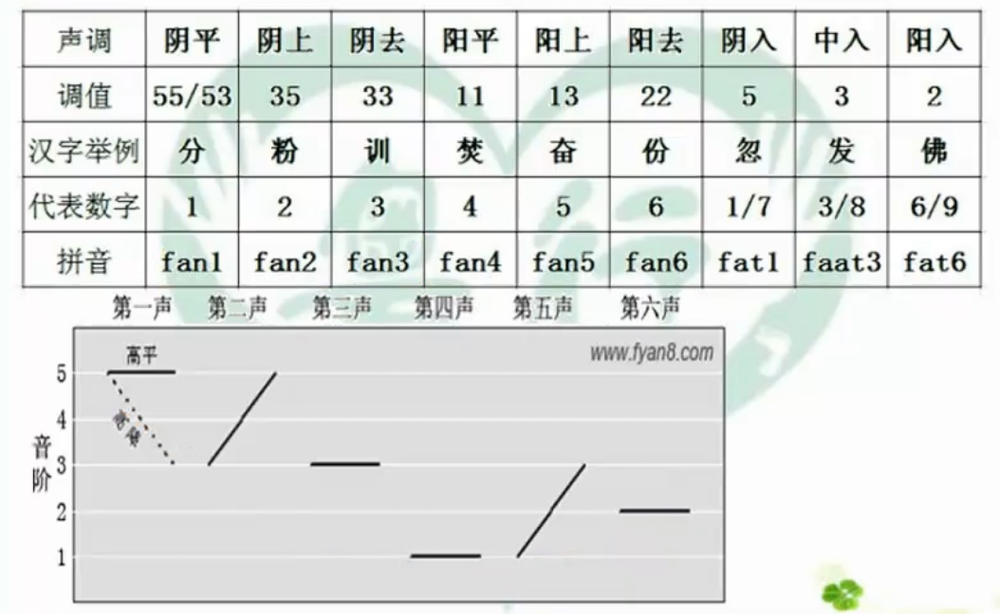

轻浊音 h  
> h 摩擦小，haa 虾  比普通话摩擦小  

粤语没有卷舌音   

gw 类似姑  
kw 类似哭  
j   类似 i   
w  类似 u  
ng  

韵尾  
i  u  n  ng  m  t  k  p  

韵母  
a  aa  i  u  e  o  yu  oe  eo  (ng)  (m)  

复韵母  
> 前鼻韵母加n  
后鼻韵母加ng  
闭口韵母加m   发音发出就立刻用力闭口    
**入声韵母加t  p  k**  发音短促      

**有n 就有t，有ng 就有k，有m 就有p 可互相替换**   
> t p k 韵尾不发音，只做口型  
**入声发音时长少一半**    

声调  
> **平上去入和阴阳组合，外加一个中入**  
共九调  

**平入清 去入清浊**  

**阴入**是阴平时长少一半  **平入清**  
**中入**是阴去时长少一半  **去入清**  
**阳入**是阳去时长少一半  **去入浊**    

  

> 1  55/53  清平5调  阴平  
2  35   清上3  阴上  
3  33   清平3调  阴去  
4  11  浊平1  阳平  
5  13  
6  22  
7  55/53  时值减半  阴入  
8  33  时值减半  中入  
9  22  时值减半  阳入  

分数  55  
**分手  53  愤**  

**很多汉拼h 粤拼发f**    
**汉拼鼻音n 粤拼也发鼻音n**    
鼻音n 发成边音l 是懒音  
> 你好 nei² lei²  

