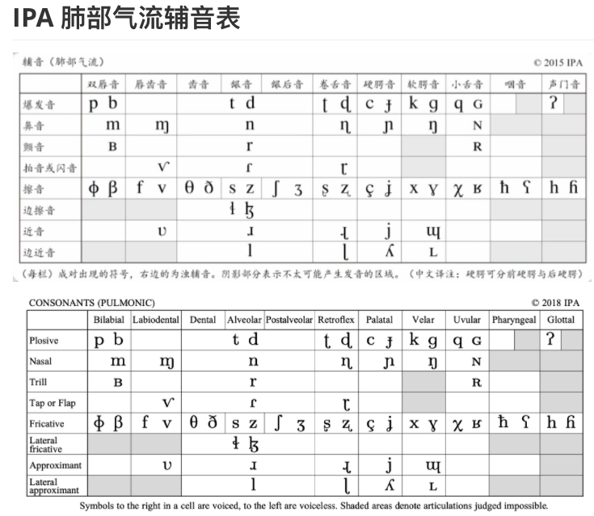

[TOC]

[IPA Input](https://ipa.typeit.org/full/)

# 英語語音學

# 01 Class overview

[youtube](https://www.youtube.com/watch?v=IHUKxHiRraw) 史嘉琳 Karen Steffen Chung

**英語語音學** (含發音練習) 外文系  **Karen Steffen Chung 史嘉琳** [tw](http://ocw.aca.ntu.edu.tw/ntu-ocw/ocw/cou/101S102)  

[0:3:23]

## accents are not a problem if they are understandable

I had to be in a root shell for it work!

phonetics resources
名词+名词构成一个复合名词的话，后面的那个被修饰的名词没有重音
many teachers of English don't get it right because 

# 02 First peek into the world of Phonetics

##   Unreleased stop 无声除阻

[0:9:50]
don't release the stops
[bat]   unreleased 不除阻  憋气  最后的t 不发音

you thought it was voiced hen it was voiceless

[0:11:28]

## bat  bad  

### 入声韵尾 /p̚/、/t̚/、/k̚/  称为唯闭音，就是一种典型的无声除阻音

粤语广府话[aːp̚]“鸭”、[paːt̚]“八”、[tɐk̚]“德”。在这些词中，韵尾辅音都有成阻和持阻阶段，但最后没有爆发

[15:53]

### bad   [bɛt]   直接的接, ɛ,ɛ,ɛ

