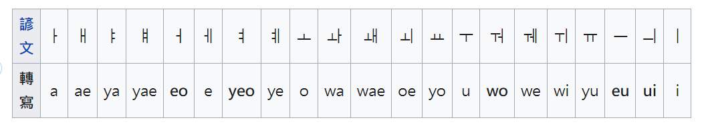
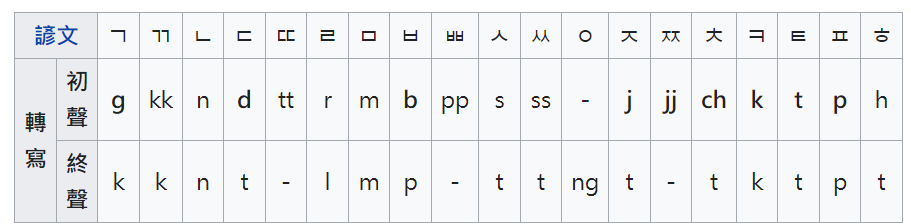

# で　ー　小说三要素：时间、地点、人物、数量

- F:\bilidown\日语\日文文法\【日常会话中”で”的九种用法总结】｜常用日文助词

## で　ー　因果逻辑的因

- F:\bilidown\日语\（已完结）【日语学习 0-N1语法全掌握】现代日语语法教程，助你构建正确日语语法体系\7-7.格助词（2）-720P 60帧-AVC.mp4


# という　ー　引用、被称为

- F:\bilidown\日语\（已完结）【日语学习 0-N1语法全掌握】现代日语语法教程，助你构建正确日语语法体系\83-83.复合表达「という」-720P 高清-AVC.mp4

##  という　ー　强调全部、所有 

>  前后必须是同一个名词  A+という+A

### という　ー　传闻 

> という这种情况下不能变形

### といった　ー　不完全列举

> 所谓的这类东西  **偷油塔**


# 格

- D:\Github\books\日本语-金田一春彦-2017.pdf  p.252


# た　

- D:\Github\books\日本语-金田一春彦-2017.pdf  p.277


# ている　动作完成、结果持续 过去完成时

- D:\Github\books\日本语-金田一春彦-2017.pdf  p.283


# だ、である　不是判断、也不是肯定

- D:\Github\books\日本语-金田一春彦-2017.pdf  p.304 

1. 与某物等价
2. 属于某类、是其中一员
3. 具有某种属性
4. 处于某种状态


## だ 名词+だ 作谓语

- G:\bilidown\日语\（已完结）【日语学习 0-N1语法全掌握】现代日语语法教程，助你构建正确日语语法体系\1-1.名词谓语句-720P 高清-AVC.mp4

> 否定是 名词+ではない


## だ 敬体 では


# ような　ー　样态  这样的 那样的

- 1-1.名词谓语句 2:44

## こんな 口语

> そんな　あんな　どんな　


# 私たち、あなたがた、彼ら、私ども ー 人称复数

> 对外说话不可以敬内


# 名词谓词句


名词+だ

- だった 过去

- でした 过去敬体
- ではありませんでした 过去否定敬体


# 形容词


它的两个连用形有两个： く 和  かっ，但是 かっ 只能和 た 一起用，构成  かった 表过去

寒い变过去否定要进行两次变形：

1.  先变连用 寒く然后加 ない = 寒くない　变完以后现在它是 い形
2. い形再变连用  寒くなかっ 加表过去的用言た  = 寒くなかった


1. 所有形容词都以  い 结尾，数量很少
2. 连用形以 く 结尾
4. 形容词后面的 の　它是名词，代指
5. 形容词后面什么都不加，它是终止形，表句子结束


后面什么也不加（句末表疑问的 か 表敬体です 除外）的形容词是**终止形**

名词前面的形容词是连体形


# 形容动词


终止形 だ


它是动词，不是形词词。它的连体形有形容词一样的功能，有动词一样的变形

1. 它跟动词的变换是一样的，所以被称为形容动词

2. 形容动词在词典里面都是以 だ 结尾的（新明解除外）

3. 连体形以 な 结尾

   > ```
   > な结尾的形容动词在语义和功能上与形容词完全相同
   > 动词+た 也可以作为形容词使用
   > 日本语-金田一春彦 p.291
   > 
   > 总结：形容动词连体形有形容词一样的功能，有动词一样的变形
   > ```

4. 连用形以 で 结尾 


同じ　是形容动词连体形


## 总结：共有三种形容词 

#### い形、な形、动词+た形


教室は大きく、静かだ

> 大きく后接用言，要连用形
>
> 静かだ 什么也不接，要终止形

教室は静かで、大きい

> 静かで 后接用言，要连用形
>
> 大きい 什么也不接，要终止形


终止形 = 字典形


# 动词


总结：**先说词干，再说是否动作是主语主动做的还是主语被动承受的，然后说是描述动作过程还是动作结果存续，**

**最后说动作发生的时间**


## 动词的语态

主语是动作执行者——主动态

主主是动作承受者——被动态


**用言的连用形有一个是 かっ，但是 かっ 只能和 た 一起用，构成  かった 表过去** （见“形容词条目”）


読ま **れ**


## 动词的体

読ま れ **てい**

究竟是要说整个事件呢，还是要说整个事件的过程呢，还是说这个动作结束之后这个结果一直在存留呢


## 动词的肯定否定


読ま れ  てい **なかっ**　た


ない的连用形 **なかっ **


## 动词的时态


以说话时间为参考系，**动作的时间和说话时间是怎么的关系**（先后等）


# 五段动词


書く かく

## え段命令

-   附加く变け、加！号 ，書け！

## え段可能

-   附加く变け、加る，書ける

## お段意志

-    附加く变こ、拉上长音、_**書こう？？？**_

## え段使役

-    附加く变か、加**せ(让)**、加る，書かせる

> **所有使役 词性都是他动词。可能形都是自动词**
>
> **使役叫せる、させる。要么有せる、要么有させる**
>
> **被动叫れる、られる**

## 段被动

-    附加く变か、加**れ(来)**、加る，書かれる

**动词变过一次形了以后，这个动词它就是一段动词**，后续把它当成一段动词来变化


# 1 段动词

只有一种形态

- 换后缀不换附加

**1 段动词的识别**

- 一个汉字、中间有い段或え段上的音、后边加一个る或ます

看到一个单词先找附加

- **う的上面是い，要敬上、う的下面是え，地位低你可以命令他**
  - 当看到敬上和命下后你应该马上想到这可能是1段动词
    -  再接着看后缀是不是ます或着る，是就确定了


1 段动词非常好变化，只需把后缀改成る或ます


# 特殊动词

词干发生变化

サ变动词 只有一个

- する 做，します 敬体

カ变动词 只有一个

- くる 来，きます 敬体


# 词干 + 中缀 + 后缀 = 表意 + 表态 + 表时

- 词干用固定不变的汉字表意  
- 中缀用可变的五个元音之一表态（意态、可能、被动）
- 后缀用可变的表时（形式、时态、词性）
  - 肯定否定疑问敬体简体、一般将要现在一直过去、**た变**：自动词变形容词


# 音调

 [《NHK日语发音音调辞典》.pdf](Japanese\《NHK日语发音音调辞典》.pdf) 


# 中古音韵

- 《反切拼读入门》

  > ​	比如说先看上字清浊；若浊，看下字平仄定上字送气与否，再依下字变添介音、定声调。

- 麻介话 融柳平话 土拐话  [《活力新故鄉》EP12：美國 X 邱福生、宋美珍《Home, sweet home》](https://www.youtube.com/watch?v=_gKKNacMHhc&t=1185s)

  > **诶话**（或**欸话**）是[中华人民共和国](https://zh.wikipedia.org/wiki/中华人民共和国)[广西壮族自治区](https://zh.wikipedia.org/wiki/广西壮族自治区)[融水苗族自治县](https://zh.wikipedia.org/wiki/融水苗族自治县)[永乐乡](https://zh.wikipedia.org/wiki/永乐乡_(融水县))几个村的自称为“诶”（/ɛ55/）的[族群](https://zh.wikipedia.org/wiki/族群)使用的一种作为[母语](https://zh.wikipedia.org/wiki/母语)的[语言](https://zh.wikipedia.org/wiki/语言)。其性质可能是一种由[汉语](https://zh.wikipedia.org/wiki/漢語)[平话](https://zh.wikipedia.org/wiki/廣西平話)与[壮侗语言](https://zh.wikipedia.org/wiki/壯侗語族)形成的[混合语](https://zh.wikipedia.org/wiki/混合語)，或是一门受到汉语平话深刻影响的壮侗语言。诶话又被周边其他族群称作**五色话**，但诶人自己较不认同该称呼。
  >
  > 有研究者认为，诶人族群是[明代](https://zh.wikipedia.org/wiki/明代)征调屯驻于此的[狼兵](https://zh.wikipedia.org/wiki/狼兵)的后裔。[[4\]](https://zh.wikipedia.org/wiki/誒話#cite_note-WW-4):2其父系主体为[壮族](https://zh.wikipedia.org/wiki/壮族)，母系主体为其他壮侗民族、特别是持[侗水语支](https://zh.wikipedia.org/wiki/侗水语支)语言的族群，在与[军官](https://zh.wikipedia.org/wiki/军官)的交流中又使用[汉语](https://zh.wikipedia.org/wiki/汉语)，由此逐渐形成了诶话。


## 基于《切韵》的中古拼音方案

- https://zhuanlan.zhihu.com/p/105194895


# 对比韩语

## 查多语词典

- https://zh.dict.naver.com/#/search?query=박수   可以查各国语言
  - https://stdict.korean.go.kr/main/main.do 标准国语大词典
- https://ja.dict.naver.com/#/search?query=ぼんやり&range=all
- https://korean.dict.naver.com/kozhdict/#/main  韩中
- https://www.bilibili.com/video/BV1w4411e7Bz
- https://bulbapedia.bulbagarden.net/wiki/List_of_Korean_Pok%C3%A9mon_names  **宝可梦韩名**
- 日语用训读汉字书写的和语词，韩语借入时按对应汉字直接音读了，例如

> 소포-小包-小包み（包裹）
>  수입-手入-手入れ（保养） 
> 매상-賣上-売り上げ（营业额）

- 日语用对音借字书写的[外来词](https://www.zhihu.com/search?q=外来词&search_source=Entity&hybrid_search_source=Entity&hybrid_search_extra={"sourceType"%3A"answer"%2C"sourceId"%3A1285427117})，韩语借入时按对应汉字直接音读了，例如

> 독일-獨逸-独逸-ドイツ-Deutsch（[德意志](https://www.zhihu.com/search?q=德意志&search_source=Entity&hybrid_search_source=Entity&hybrid_search_extra={"sourceType"%3A"answer"%2C"sourceId"%3A1285427117})-德国）借自德语（原义为“德国的”）

- 韩语通过日语借入葡、法、英、德语等西方语言的音译词，例如

> 빵-パン（面包）对应葡语pão、西语pan、法语pain
> 아르바이트-アルバイト（兼职）借自德语Arbeit（原义为“工作”）

- 韩语从日语借入，但来源不确定的词，例如「가방-かばん-鞄-手包」

> 有说法称，日语かばん来源于「夹板」，未经证实

- 疑似来源相关的词，例如「곰-くま-熊-熊」


錢大昕《古無輕唇音》:"凡輕脣之音，古讀皆爲重脣。"。證之韓國至今也無輕脣音  [f ], [v]。韓音與古漢語的音又一相連證據。

例如：

- ＂方＂，＂房＂，＂發＂，＂犯＂，＂法＂等，普通話聲母是＂f＂，韓音都讀重脣音＂ㅂ＂。
-  西方小提琴 violin，韓音바이올린，聲母都是"ㅂ"。

～～～

又例如韩语跟中国南方好些方言一样，都保留了p、t、k三个入声。普通话则没有入声。

韩语的对应规律是[ t〕一律改为[ l ]。

例如“一”， 粵语 [ jat ]7， 韩语是 일 [ il ]。
链接：https://www.zhihu.com/question/47919082/answer/108264719


韩语的汉语词比例比日语还高(日语五成韩语七成)，只不过日语的自有词汇多有汉字训读而韩语没有，加上朝韩都逐渐弃用汉字，所以似乎韩语跟汉语关系没那么近。刚接触韩语不太了解韩语汉字词读音怎么来的，不过日语的汉字读音基本上分为吴音(南朝金陵雅音)、汉音(隋唐长安官话)、唐音(宋及以后)三种，比如这个“兄”在日语中汉音kei，吴音kyou，训读ani，熟字训里则是nii(欧尼桑的尼)。除此之外还有惯用音，可以理解成读音将错就错。
但听韩语的时候听不出来这些汉语词也正常，韩语有一套音变规则，比如“韩国语”写成han gug eo，但是读出来则是han gu geo，加之韩语这个g（ㄱ）实际上更接近汉语k，就显得没那么像了。另一方面是韩语用词不同，很多词听起来很古派，举几个例子：朋友叫“亲旧”，钱包叫“纸匣”，上课叫“授业”，残疾叫“不具”，书叫“册”，书桌叫“册床”，现在叫“只今”等等。还有另一些词汇是韩国日据时期从日本过来的叫法，比如免费叫无料，报纸叫新闻，考试叫试验等等。还有一些用法跟中国日本都不同的，比如用户名(ID)叫“计定”，手机叫“携带phone”等等。
“兄”在韩语也很有意思，男性管哥哥叫兄，女性管哥哥叫“obba”（也就是欧巴），男女对哥哥姐姐称呼不同。而弟弟妹妹则都叫“男同生”、“女同生”，亲弟妹就是“亲同生”，这也是颇为存古的称呼。

https://forum.freemdict.com/t/topic/8231/12


## 读法 从左到右 从上到下


### 韩语连浊


# 对比粤语

[粤语审音配字库](https://humanum.arts.cuhk.edu.hk/Lexis/lexi-can/)

[粵語國際音標查詢](https://open-dict-data.github.io/ipa-lookup/yue/?#)

[【粤词音韵】粤语填词基础：五度标记法和调值](https://www.bilibili.com/video/BV17U4y1P7Ud)


**永** /wɪŋ˩˧/ 实际发音23，这里像是标13


[五度标记法](https://zh.wikipedia.org/zh-hans/%E4%BA%94%E5%BA%A6%E6%A0%87%E8%AE%B0%E6%B3%95)

是赵元任1920年代发明的一种记录语言调值的方法[1]。五度标记法在汉语方言、苗瑶语及侗台语调查中大量使用，在其他语言的描写中也有影响。

| 曲线法 | ˩    | ˨    | ˧    | ˦    | ˥    |
| :----: | ---- | ---- | ---- | ---- | ---- |
| 数字法 | 11   | 22   | 33   | 44   | 55   |

| 曲线法 |      | ˩˨   | ˩˧   | ˩˦   | ˩˥   | ˨˩   |      | ˨˧   | ˨˦   | ˨˥   |
| :----: | ---- | ---- | ---- | ---- | ---- | ---- | ---- | ---- | ---- | ---- |
| 数字法 |      | 12   | 13   | 14   | 15   | 21   |      | 23   | 24   | 25   |
| 曲线法 | ˧˩   | ˧˨   |      | ˧˦   | ˧˥   | ˦˩   | ˦˨   | ˦˧   |      | ˦˥   |
| 数字法 | 31   | 32   |      | 34   | 35   | 41   | 42   | 43   |      | 45   |
| 曲线法 | ˥˩   | ˥˨   | ˥˧   | ˥˦   |      |      |      |      |      |      |
| 数字法 | 51   | 52   | 53   | 54   |      |      |      |      |      |      |

| 曲线法 |      | ˩˩˨  | ˩˩˧  | ˩˩˦  | ˩˩˥  | ˩˨˩  | ˩˨˨  | ˩˨˧  | ˩˨˦  | ˩˨˥  |
| :----: | ---- | ---- | ---- | ---- | ---- | ---- | ---- | ---- | ---- | ---- |
| 数字法 |      | 112  | 113  | 114  | 115  | 121  | 122  | 123  | 124  | 125  |
| 曲线法 | ˩˧˩  | ˩˧˨  | ˩˧˧  | ˩˧˦  | ˩˧˥  | ˩˦˩  | ˩˦˨  | ˩˦˧  | ˩˦˦  | ˩˦˥  |
| 数字法 | 131  | 132  | 133  | 134  | 135  | 141  | 142  | 143  | 144  | 145  |
| 曲线法 | ˩˥˩  | ˩˥˨  | ˩˥˧  | ˩˥˦  | ˩˥˥  |      |      |      |      |      |
| 数字法 | 151  | 152  | 153  | 154  | 155  |      |      |      |      |      |
| 曲线法 | ˨˩˩  | ˨˩˨  | ˨˩˧  | ˨˩˦  | ˨˩˥  | ˨˨˩  |      | ˨˨˧  | ˨˨˦  | ˨˨˥  |
| 数字法 | 211  | 212  | 213  | 214  | 215  | 221  |      | 223  | 224  | 225  |
| 曲线法 | ˨˧˩  | ˨˧˨  | ˨˧˧  | ˨˧˦  | ˨˧˥  | ˨˦˩  | ˨˦˨  | ˨˦˧  | ˨˦˦  | ˨˦˥  |
| 数字法 | 231  | 232  | 233  | 234  | 235  | 241  | 242  | 243  | 244  | 245  |
| 曲线法 | ˨˥˩  | ˨˥˨  | ˨˥˧  | ˨˥˦  | ˨˥˥  |      |      |      |      |      |
| 数字法 | 251  | 252  | 253  | 254  | 255  |      |      |      |      |      |
| 曲线法 | ˧˩˩  | ˧˩˨  | ˧˩˧  | ˧˩˦  | ˧˩˥  | ˧˨˩  | ˧˨˨  | ˧˨˧  | ˧˨˦  | ˧˨˥  |
| 数字法 | 311  | 312  | 313  | 314  | 315  | 321  | 322  | 323  | 324  | 325  |
| 曲线法 | ˧˧˩  | ˧˧˨  |      | ˧˧˦  | ˧˧˥  | ˧˦˩  | ˧˦˨  | ˧˦˧  | ˧˦˦  | ˧˦˥  |
| 数字法 | 331  | 332  |      | 334  | 335  | 341  | 342  | 343  | 344  | 345  |
| 曲线法 | ˧˥˩  | ˧˥˨  | ˧˥˧  | ˧˥˦  | ˧˥˥  |      |      |      |      |      |
| 数字法 | 351  | 352  | 353  | 354  | 355  |      |      |      |      |      |
| 曲线法 | ˦˩˩  | ˦˩˨  | ˦˩˧  | ˦˩˦  | ˦˩˥  | ˦˨˩  | ˦˨˨  | ˦˨˧  | ˦˨˦  | ˦˨˥  |
| 数字法 | 411  | 412  | 413  | 414  | 415  | 421  | 422  | 423  | 424  | 425  |
| 曲线法 | ˦˧˩  | ˦˧˨  | ˦˧˧  | ˦˧˦  | ˦˧˥  | ˦˦˩  | ˦˦˨  | ˦˦˧  |      | ˦˦˥  |
| 数字法 | 431  | 432  | 433  | 434  | 435  | 441  | 442  | 443  |      | 445  |
| 曲线法 | ˦˥˩  | ˦˥˨  | ˦˥˧  | ˦˥˦  | ˦˥˥  |      |      |      |      |      |
| 数字法 | 451  | 452  | 453  | 454  | 455  |      |      |      |      |      |
| 曲线法 | ˥˩˩  | ˥˩˨  | ˥˩˧  | ˥˩˦  | ˥˩˥  | ˥˨˩  | ˥˨˨  | ˥˨˧  | ˥˨˦  | ˥˨˥  |
| 数字法 | 511  | 512  | 513  | 514  | 515  | 521  | 522  | 523  | 524  | 525  |
| 曲线法 | ˥˧˩  | ˥˧˨  | ˥˧˧  | ˥˧˦  | ˥˧˥  | ˥˦˩  | ˥˦˨  | ˥˦˧  | ˥˦˦  | ˥˦˥  |
| 数字法 | 531  | 532  | 533  | 534  | 535  | 541  | 542  | 543  | 544  | 545  |
| 曲线法 | ˥˥˩  | ˥˥˨  | ˥˥˧  | ˥˥˦  |      |      |      |      |      |      |
| 数字法 | 551  | 552  | 553  | 554  |      |      |      |      |      |      |

# NLP+


新とわの駅

> とわ ：【永久】之意的雅语表达形式。永久。永远。
>
> > 永久(えいきゅう)
>
> 영구, 영원. (=永遠, 永久)
>
> > ㅕ= yo ; ㅇ= n ; ㄱ = g   (注：**ㅇ通常作为零声母，但作为韵尾时读作n**)
> >
> > 영구 音同"拥古"
> >
> > ㄴ = n ; 
> >
> > 영원 音同"拥吻"
> >
>
>  粤语
>
> > 永 /wɪŋ˩˧/ 实际发音23，这里像是标13

ここがとわの市か……。

> 市(し)：城市
>
> 시 市 ; 도시 都市 ; shi  sh->s  i->i
>
> > ㅅ 这个辅音为什么对应 s ? 因为女人是 S 形曲线
> >
> > ㄷ 对应辅音 d，因为这是一只嗷嗷**待**哺的口
> >
> > 도시 : 音同"突喜"


现在你是一个生活在日本的日本人，你正在教一个中国人学日语。请把我说的所有日语句子中的语汇和语法作出详细解释，现在开始


新とわの駅

> とわ ：【永久(えいきゅう)】之意的雅语表达形式。永久。永远。
>
> 整个句子的意思是：新永久车站。

ここがとわの市が……。

家の都合で引っ越すことになっちゃったけど、

> 假名标注：家(いえ)の都合(つごう)で引(ひ)っ越(こ)すことになっちゃったけど、
>
> 词汇和语法解释：
>
> 家(いえ)：家，表示住所或家庭。
> **都合**(つごう)：情况，表示某种状况或原因。
> で：表示原因或理由。
> **引っ越す**(ひっこす)：搬家。
> ことになる：表示事情发生了变化，意为“变成...”，“变得...”。
> **ちゃった：是「てしまう」的口语形式，表示完成动作，有时带有一定的遗憾或意外之感。**
> けど：表示转折，相当于汉语的“但是”。
> 整个句子的意思是：由于家庭原因，不得不搬家了，但是（或虽然）。

今日からはこの街で暮らして、学校に通うんだな。

> 假名标注： 今日（きょう）からはこの街（まち）で暮らして（くらして）、学校（がっこう）に通う（かよう）んだな。
>
> 词汇和语法解释：
>
> 今日(きょう)：今天。
> から：表示时间、空间或原因的起点，相当于汉语的“从...开始”。
> は：表示主题或对比。
> この：这个。
> 街(まち)：城市或城镇。
> で：表示动作发生的场所。
> **暮らす**(くらす)：生活，居住。
> て：连接助词，用于连接两个动词。
> 学校(がっこう)：学校。
> に：表示方向、目标等。
> **通う**(かよう)：通勤，通学等往返于两地的行为。
> んだ：表示解释、强调或命令等，相当于汉语的“就是...”。
> な：表示肯定的语气，相当于汉语的“呢”。
> 整个句子的意思是：从今天开始，我将在这个城市生活，并且上学了呢。

駅のすぐ近くに公園があるのか、いい街だな。

> 假名标注： 駅（えき）のすぐ近く（ちかく）に公園（こうえん）があるのか、いい街（まち）だな。
>
> 语汇和语法解释：
>
> 1. 駅（えき）: 名词，表示火车站的意思，译为“车站”。
> 2. の: 助词，表示所属关系，相当于汉语的“的”。
> 3. すぐ: 副词，表示紧邻的意思，译为“马上”、“就在”。
> 4. 近く（ちかく）: 名词，表示附近的意思，译为“附近”。
> 5. に: 助词，表示目的地、时间等，译为“在”、“向”等。
> 6. 公園（こうえん）: 名词，表示公园的意思，译为“公园”。
> 7. が: 助词，表示主语或者强调的意思，可以译为“是”、“就是”等。
> 8. ある: 动词，表示存在的意思，译为“有”。
> 9. のか: 助词组合，表示疑问或惊讶的语气，可以翻译为“吗”、“啊”等。
> 10. いい: 形容词，表示好的意思，译为“好的”、“不错的”等。
> 11. 街（まち）: 名词，表示城市或街区的意思，译为“街道”、“城市”等。
> 12. だ: 助动词，表示断定或肯定的意思，译为“是”。
> 13. な: 助词，用于句末，表示感叹或惊讶，可以翻译为“啊”、“呀”等。
>
> 句子翻译：车站附近竟然有公园，真是个好地方啊。

さすがに今の季節、散歩には寒いな……もう行こう。

> 假名标注： さすが（さすが）に今（いま）の季節（きせつ）、散歩（さんぽ）には寒い（さむい）な……もう行こう（いこう）。
>
> 语汇和语法解释：
>
> 1. さすがに（さすがに）: 表示不得不承认的意思，可以翻译为“果然”、“不愧”等。
> 2. 今（いま）: 表示现在的意思，译为“现在”。
> 3. の: 助词，表示所属关系，相当于汉语的“的”。
> 4. 季節（きせつ）: 名词，表示季节，译为“季节”。
> 5. 散歩（さんぽ）: 名词，表示散步，译为“散步”。
> 6. には: 助词组合，表示目的或原因，可以翻译为“对于……来说”。
> 7. 寒い（さむい）: 形容词，表示寒冷的意思，译为“寒冷”。
> 8. な: 助词，用于句末，表示感叹或惊讶，可以翻译为“啊”、“呀”等。
> 9. もう: 副词，表示已经或马上的意思，译为“已经”或“马上”。
> 10. 行こう（いこう）: 动词いく（去）的意志形式，表示提议或打算，译为“去吧”。
>
> 句子翻译：果然现在这个季节，散步还是有点冷啊……我们走吧。

これから住むことになる部屋は、たしかこの辺だったはず……。

> 假名标注： これから住む（すむ）ことになる部屋（へや）は、たしかこの辺（へん）だったはず……。
>
> 语汇和语法解释：
>
> 1. これから: 副词，表示从现在开始，译为“从现在开始”或“以后”。
> 2. **住む**（すむ）: 动词，表示居住的意思，译为“住”。
> 3. ことになる: 动词组合，表示确定性的意思，可以翻译为“将要”、“决定了”等。
> 4. 部屋（へや）: 名词，表示房间的意思，译为“房间”。
> 5. は: 助词，表示主题或对比，译为“是”或“关于……”。
> 6. たしか: 副词，表示不太确定的意思，可以翻译为“好像”、“似乎”等。
> 7. この: 代词，表示这个的意思，译为“这个”。
> 8. **辺**（へん）: 名词，表示附近的意思，译为“附近”、“周围”等。
> 9. だった: 动词だ（是）的过去形式，表示过去的状态。
> 10. はず: 助词，表示推测或期待的意思，可以翻译为“应该”、“应当”等。
>
> 句子翻译：我将要住的房间，好像就在这附近……。

そうそう。新しい部屋は……。

> 假名标注： そうそう。新しい（あたらしい）部屋（へや）は……。
>
> 语汇和语法解释：
>
> 1. そうそう: 感叹词，表示赞同或想起的意思，可以翻译为“对了”、“没错”等。
> 2. 新しい（あたらしい）: 形容词，表示新的意思，译为“新的”。
> 3. 部屋（へや）: 名词，表示房间的意思，译为“房间”。
> 4. は: 助词，表示主题或对比，译为“是”或“关于……”。
>
> 句子翻译：对了对了。新房子是……。

学生らしいシンブルな部屋だ。

大人っぽいオシャレな部屋だ。

落ち着い和風の部屋だ。

> 1. 学生（がくせい）：学生，指上学的人。 
>
>    らしい：表示“像……一样”，用于形容词或名词后，表示似乎符合某种特征。 
>
>    シンプル：简单、简约，形容词。 
>
>    な：用于连接形容动词或名词与名词。 
>
>    部屋（へや）：房间。 
>
>    だ：断言助词，表示陈述句。
>
> ​       这个句子的意思是：“这是一个看起来像学生住的简约房间。”
>
> 2. 大人（おとな）：成人。
>
>    **っぽい**：类似于……的，用于名词后，表示与某种特征相似。 
>
>    **オシャレ**：时尚、时髦。 
>
>    な：用于连接形容动词或名词与名词。 
>
>    部屋（へや）：房间。 
>
>    だ：断言助词，表示陈述句。
>
> ​      这个句子的意思是：“这是一个成人气质的时尚房间。”
>
> 3. **落ち着く**（おちつく）：平静、安定，动词。 
>
>    い：用于将动词的连用形（て形去掉て）变成形容词。 
>
>    和風（わふう）：和风，指日本风格。
>
>     の：用于连接名词与名词，表示所属关系。 
>
>    部屋（へや）：房间。 
>
>    だ：断言助词，表示陈述句。
>
> ​       这个句子的意思是：“这是一个宁静的日式房间。”

せっかくの新生活だし、オシャしレな部屋にしたんだ。

> **せっかく**：既然，表示抓住难得的机会，用于强调某事的重要性。 
>
> の：用于连接名词与名词，表示所属关系。 
>
> 新生活（しんせいかつ）：新的生活。 
>
> だし：表示原因或理由，相当于“既然……”。 
>
> オシャレ：时尚、时髦，形容词。 
>
> な：用于连接形容动词或名词与名词。 
>
> 部屋（へや）：房间。 
>
> に：表示方向或目的，相当于“到、向”。 
>
> した（する）：做、使，动词。 
>
> んだ：表示解释、强调，相当于“这就是……”。
>
> 这个句子的意思是：“既然开始了新生活，就把房间布置得时尚了。”

あっ、あそこだな……まずは荷物を整理しないと。

> あっ：表示惊讶、惊奇的感叹词。 
>
> あそこ：那里，指代不远的地点。 
>
> だ：断言助词，表示陈述句。 
>
> な：表示推测、猜测，相当于“应该是”。 
>
> まずは：首先，表示按顺序进行的动作。 
>
> 荷物（にもつ）：行李，物品。 
>
> を：表示动作的直接宾语。 
>
> 整理（せいり）：整理，动词连用形。 
>
> しない：否定形，表示不做某事。 
>
> と：表示假设条件，相当于“如果不……”。
>
> 这个句子的意思是：“啊，就是那里……首先得整理行李。”

よし、 こんなもんかな……。

> よし、こんなもんかな……。
>
> よし：表示做好决心，相当于“好吧”。 こんな：这样的，这种，指代近处的事物或情况。 もん：在此句子中，这个词用作口语化的表达方式，表示“东西”或“程度”。 か：表示疑问，相当于“吗？”。 な：表示推测、猜测，相当于“应该是”。
>
> 这个句子的意思是：“好吧，大概就是这样吧？”或者“好吧，这个程度差不多了吧？”

今日からここが俺の部屋だ!

今日からここが僕の部屋だな

> 今日（きょう）からここが俺（おれ）の部屋（へや）だ！
>
> 今日（きょう）：今天。 から：表示时间或地点的起点，相当于“从……开始”。 ここ：这里，指代近处的地点。 が：表示主语。 俺（おれ）：我，较为男性化的第一人称代词。 の：用于连接名词与名词，表示所属关系。 部屋（へや）：房间。 だ：断言助词，表示陈述句。
>
> 这个句子的意思是：“从今天开始，这里就是我的房间了！”

そうだ、今日は転入の手続きをしに学校まで行かないと。

> そうだ、今日（きょう）は転入（てんにゅう）の手続き（てつづき）をしに学校（がっこう）まで行かないと。
>
> そうだ：表示突然想起，相当于“对了”或“是的”。 今日（きょう）：今天。 は：表示主题的助词。 転入（てんにゅう）：转学，指从一个学校转到另一个学校。 の：用于连接名词与名词，表示所属关系。 手続き（てつづき）：手续，流程。 を：表示动作的直接宾语。 しに：表示目的，相当于“为了做……”。 学校（がっこう）：学校。 まで：表示范围，相当于“到……为止”。 行かない（いかない）：去，动词行く（いく）的否定形。 と：表示假设条件，相当于“如果不……”。
>
> 这个句子的意思是：“对了，今天得去学校办理转学手续。”

そろそろ出たほうがいいいな……。

> 详细解释：
>
> 1. そろそろ（そろそろ）：表示时间或状态即将到来，相当于汉语的"差不多"、"快要"。
> 2. 出（で）：这里的"出"是动词"出る"（でる）的连用形，表示"出去"、"离开"的意思。
> 3. た（た）：是助动词"た"的基本形式，用于表示过去时态。在这个句子里，它与"出"（で）组合，表示"出去"的动作已经完成。
> 4. ほう（ほう）：表示比较，相当于汉语的"更"。
> 5. が（が）：表示主谓关系的助词，这里用于连接"たほう"，表示比较的对象。
> 6. いい（いい）：形容词，表示"好"的意思。这里的"いい"与"ほうが"搭配使用，表示"更好"的意思。
> 7. な（な）：表示疑问、感叹或提议的助词，相当于汉语的"啊"、"呢"。
>
> 整个句子的意思是："差不多该走了呢……" 或者 "快要出去了啊……"。这是一个表示建议或提醒的句子，用于提醒对方现在差不多该离开的时候了。

俺は２年からの編入だけど、編入試験、結構難しかったな……。

> 详细解释：
>
> 1. 俺（おれ）：第一人称代词，表示"我"。在日常口语中，多为男性使用。
> 2. は（は）：表示主题的助词。
> 3. ２年（にねん）：表示"两年"。
> 4. から（から）：表示起点、原因或理由，相当于汉语的"从"、"因为"。
> 5. の（の）：表示所有关系或修饰关系的助词。
> 6. 編入（へんにゅう）：名词，表示"转学"、"转入"。
> 7. だけど（だけど）：连接词，表示"但是"、"然而"的意思。
> 8. 編入試験（へんにゅうしけん）：名词，表示"转学考试"。
> 9. 結構（けっこう）：副词，表示"相当"、"还算"的意思。
> 10. 難しかった（むずかしかった）：形容词"難しい"（むずかしい，表示"困难"、"难"的意思）的过去形态。
> 11. な（な）：表示疑问、感叹或提议的助词，相当于汉语的"啊"、"呢"。
>
> 整个句子的意思是："我是从第二年开始转学的，但是转学考试还挺难的啊……"。这是一个表达过去经历和感叹考试难度的句子。

ちゃんとやっていけるといいけど。

> 详细解释：
>
> 1. ちゃんと（ちゃんと）：副词，表示"好好地"、"认真地"的意思。
> 2. やって（やって）：这里的"やって"是动词"やる"（做、进行）的て形，用于连接其他动词或表示进行中的状态。
> 3. いける（いける）：动词，表示"能够"、"可以"的意思。
> 4. と（と）：表示条件或引述的助词，相当于汉语的"如果"、"当"。
> 5. いい（いい）：形容词，表示"好"的意思。与"と"搭配使用，表示"如果……就好"的意思。
> 6. けど（けど）：连接词，表示"但是"、"然而"的意思。
>
> 整个句子的意思是："如果能够好好地做下去就好了，但是……"。这是一个表达期望和担忧的句子，表示希望能够继续好好地进行，但实际情况可能会有困难。

よし、着いた。

> 详细解释：
>
> 1. よし（よし）：感叹词，表示"好"、"好了"的意思，常用于表示做好决定或完成某件事情后的语气。
> 2. 着（つ）：这里的"着"是动词"着く"（つく）的连用形，表示"到达"的意思。
> 3. いた（いた）：是助动词"た"的基本形式，用于表示过去时态。在这个句子里，它与"着"（つ）组合，表示"到达"的动作已经完成。
>
> 整个句子的意思是："好了，到了。" 这是一个表示已经到达目的地的句子。

私立『十羽野高校』。ここが俺が通うことになる学校だ……。

> 详细解释：
>
> 1. 私立（しりつ）：名词，表示"私立"，用于描述学校、医院等非公立的机构。
> 2. 十羽野高校（じゅうばのこうこう）：名词，表示一个虚构的学校名称，"十羽野"是地名，"高校"表示"高中"。
> 3. ここ（ここ）：代词，表示"这里"的意思。
> 4. が（が）：表示主谓关系的助词。
> 5. 俺（おれ）：第一人称代词，表示"我"。在日常口语中，多为男性使用。
> 6. 通（かよ）：这里的"通"是动词"通う"（かよう）的连用形，表示"上学"、"上班"、"往来"的意思。
> 7. う（う）：助动词，表示意愿或推测的意思。
> 8. こと（こと）：名词，表示"事情"、"事物"的意思。在这里，它和动词"通う"组合，表示"上学"这个动作。
> 9. に（に）：表示目的、方向或时间的助词。
> 10. なる（なる）：动词，表示"成为"、"变成"的意思。在这里，"ことになる"表示"将要……"的意思。
> 11. 学校（がっこう）：名词，表示"学校"。
> 12. だ（だ）：助动词，表示断定的意思，相当于汉语的"是"。
>
> 整个句子的意思是："私立'十羽野高中'。这就是我将要上学的地方……"。这是一个表达对未来学校的介绍和期待的句子。

歴史は古いのに、自由な校風が特徴ってところに惹かれたんだよな。

> 1. 歴史（れきし）：意为“历史”。
> 2. は：表示主题标记，用于强调后面的内容。
> 3. 古い（ふるい）：意为“古老的、旧的”。
> 4. のに：表示尽管、虽然的意思，用来连接两个相反的事物。
> 5. 自由（じゆう）：意为“自由”。
> 6. な：形容动词连接词，用于连接形容动词和名词。
> 7. 校風（こうふう）：意为“校风”。
> 8. が：表示主语标记。
> 9. 特徴（とくちょう）：意为“特点、特色”。
> 10. って：口语中表示引述的助词，相当于「という」。
> 11. ところ：意为“地方”，在这里表示“方面”。
> 12. に：表示方向、目的等。
> 13. 惹（ひ）かれた：动词「惹く（ひく）」的被动形式，意为“被吸引”。
> 14. んだ：表示解释或者推测的意思。
> 15. よ：表示强调或者说服对方的意思。
> 16. な：表示对自己的陈述或者感叹的意思。
>
> 这个句子可以理解为：“虽然历史悠久，但我被这所学校自由的校风所吸引。”

これからの高校生活も、楽しまないとな!

> 1. これから：意为“从现在开始”。
> 2. の：表示名词之间的连接。
> 3. 高校生活（こうこうせいかつ）：意为“高中生活”。
> 4. も：表示“也”的意思。
> 5. 楽（たの）しまない：动词「楽しむ（たのしむ）」的否定形式，意为“不享受、不尽兴”。
> 6. と：表示假定条件的意思，类似于“如果不……”。
> 7. な：表示自己的陈述或者感叹的意思，相当于“啊”。
>
> 这个句子可以理解为：“从现在开始的高中生活也要好好享受啊！”

転入の手続きはすんなり終わったけど。

> 下面是详细的词汇和语法解释：
>
> 1. 転入（てんにゅう）：这是一个名词，表示转入或迁入。在这个句子中，它表示办理的手续是与迁入相关的。
> 2. の：这是一个名词后面的助词，用于表示两个名词之间的关系，类似于中文的“的”。
> 3. 手続き（てつづき）：这是一个名词，意为手续、程序。在这个句子中，与転入结合，表示迁入手续。
> 4. は：这是一个主题标记助词，用于表示句子的主题。在这里，“転入の手続き”是句子的主题。
> 5. すんなり：这是一个副词，表示顺利、毫无困难。在这个句子中，它修饰动词“終わった”。
> 6. 終わった（おわった）：这是动词“終わる”的过去完成式，表示结束、完成。在这个句子中，它表示手续已经办理完毕。
> 7. けど：这是一个连接助词，用于表示转折，类似于中文的“但是”或“虽然”。在这个句子中，它暗示虽然手续办理顺利，但接下来可能还有其他事情需要处理。
>
> 翻译成中文大致是：“虽然转入手续办理得很顺利。”

たまたま職員室に来てたテ二ス部の部長にしつこく勧誘されて、押し切られてしまった。

> 1. たまたま：这是一个副词，表示偶然、碰巧。
> 2. 職員室（しょくいんしつ）：这是一个名词，意为教职员工室。
> 3. に：这是一个方向助词，表示动作发生的地点，在这里表示在职员室。
> 4. 来てた（きてた）：这是动词“来る（くる）”的て-form（て形）连用形加上た形（过去形），表示过去进行时，意为“正在来”。
> 5. テニス部（てにすぶ）：这是一个名词，表示网球部。
> 6. の：这是一个名词后面的助词，用于表示两个名词之间的关系，类似于中文的“的”。
> 7. 部長（ぶちょう）：这是一个名词，意为部长、负责人。
> 8. に：这是一个间接目标助词，表示受到动作的对象，在这里表示受到部长的勧誘。
> 9. しつこく：这是一个副词，表示繁琐、纠缠不休。
> 10. 勧誘されて（かんゆうされて）：这是动词“勧誘する（かんゆうする）”的被动形式（受け身形）的て-form（て形），表示被邀请、被劝说。
> 11. 押し切られて（おしきられて）：这是动词“押し切る（おしきる）”的被动形式（受け身形）的て-form（て形），表示被强行推动、被强行推进。
> 12. しまった：这是动词“しまう”的过去完成形（た形），表示事情已经发生且带有遗憾或失望的情感。
>
> 根据上述解释，这句日语句子的中文翻译是：“碰巧在教职员工室的网球部部长，繁琐地劝说我，结果被他强行说服了。”

何か部活には入ろうと思ってたし、まぁいいか。

> 1. 何か（なにか）：这是一个指示代词，表示“某个、某些”。
> 2. 部活（ぶかつ）：这是一个名词，表示课外活动或社团活动。
> 3. に：这是一个方向助词，表示动作的方向或目的，在这里表示加入某个部活。
> 4. は：这是一个主题标记助词，用于表示句子的主题。在这里，“部活に”是句子的主题。
> 5. 入ろう（はいろう）：这是动词“入る（はいる）”的意志形（意向形），表示想要加入、打算加入。
> 6. と思ってた（とおもってた）：这是动词“思う（おもう）”的て-form（て形）连用形加上た形（过去形），表示过去进行时，意为“在想”。这里的“と”是一个引导助词，表示引述，即“在想要做……”。
> 7. し：这是一个连用助词，表示原因、理由，类似于中文的“因为”。
> 8. まぁ：这是一个副词，表示“嗯、好吧”，表示对某事的默认或接受。
> 9. いい：这是形容词“良い（よい）”的口语变形，表示好、可以。
> 10. か：这是一个疑问助词，表示疑问或反问，用于句末，表示对自己的想法或决定的不确定。
>
> 根据上述解释，这句日语句子的中文翻译是：“本来我也想加入某个课外活动的，嗯，算了，也挺好的。”

この学校、そんなに運動部強くないらしいし、楽しくやれるかも。

> 1. この：这是一个指示代词，表示“这个”。
> 2. 学校（がっこう）：这是一个名词，意为学校。
> 3. そんなに：这是一个副词，表示“那么、那样”。
> 4. 運動部（うんどうぶ）：这是一个名词，表示运动部、体育部。
> 5. 強くない（つよくない）：这是形容词“強い（つよい）”的否定形式，表示不强、不厉害。
> 6. らしい：这是一个助动词，表示传闻、听说。
> 7. し：这是一个连用助词，表示原因、理由，类似于中文的“因为”。
> 8. 楽しく（たのしく）：这是形容词“楽しい（たのしい）”的副词形式，表示愉快地、开心地。
> 9. やれる：这是动词“やる”的潜在形（可能形），表示可以做、能够做。
> 10. かも：这是一个助词，表示可能性，类似于中文的“或许、可能”。
>
> 中文翻译：“这个学校的运动部似乎并不是很厉害，或许能够愉快地参与。”

女の子にもモテるかもしれないし、なんてな。

> 1. 女の子（おんなのこ）：这是一个名词，意为女孩子。
> 2. に：这是一个间接目标助词，表示受到动作的对象，在这里表示受到女孩子的喜欢。
> 3. も：这是一个助词，表示也、还，用于强调。
> 4. モテる：这是一个动词，表示受欢迎、吸引异性。
> 5. かもしれない：这是一个助动词短语，表示可能性，类似于中文的“或许、可能”。
> 6. し：这是一个连用助词，表示原因、理由，类似于中文的“因为”。
> 7. なんて：这是一个副词，表示惊讶、感叹，类似于中文的“居然、竟然”。
> 8. な：这是一个句末助词，表示感叹、惊讶。
>
> 中文翻译：“或许还能受到女孩子的喜欢呢，真是的。”

よし、さっそく入部届出しにいくか！

> 1. よし：这是一个感叹词，表示下定决心、鼓劲，类似于中文的“好吧、好”。
> 2. さっそく：这是一个副词，表示立刻、马上。
> 3. 入部届（にゅうぶとどけ）：这是一个名词，表示入部申请、加入部门的申请。
> 4. 出し（だし）：这是动词“出す（だす）”的连用形（ます形），表示提交、递交。
> 5. に：这是一个方向助词，表示动作的方向或目的，这里表示去提交入部届。
> 6. いく：这是一个动词，表示去做某事、进行某个动作。
> 7. か：这是一个疑问助词，表示疑问或反问，用于句末，表示对自己的想法或决定的不确定。
>
> 中文翻译：“好吧，我马上去提交入部申请吧！”

すいませーん、入部届出しに来たんすけど、テ二ス部の鈴木先生は……。

> 1. すいませーん：这是一个感叹词，是“すみません”的口语化表达，表示道歉、请求注意，类似于中文的“对不起、抱歉”。
> 2. 入部届出し（にゅうぶとどけだし）：这是一个名词短语，表示提交入部申请、加入部门的申请。
> 3. に：这是一个方向助词，表示动作的方向或目的，在这里表示来提交入部届。
> 4. 来た（きた）：这是动词“来る（くる）”的过去形（た形），表示来、到达。
> 5. んすけど：这是助词“のですけど”的口语化表达，表示解释、说明。
> 6. テニス部（てにすぶ）：这是一个名词，表示网球部。
> 7. の：这是一个名词后面的助词，用于表示两个名词之间的关系，类似于中文的“的”。
> 8. 鈴木先生（すずきせんせい）：这是一个名词短语，表示一个人的名字，鈴木（すずき）是姓氏，先生（せんせい）表示敬称。
> 9. は：这是一个主题标记助词，用于表示句子的主题。在这里，“鈴木先生”是句子的主题。
>
> 中文翻译：“不好意思，我是来提交网球部入部申请的，鈴木先生在吗？”

鈴木先生ならさっき出てったぞ？テニスコートの方に行ってみたらどうだ？

> 1. 鈴木先生（すずきせんせい）：这是一个名词短语，表示一个人的名字，鈴木（すずき）是姓氏，先生（せんせい）表示敬称。
> 2. なら：这是一个助词，表示假设、条件，类似于中文的“如果、既然”。
> 3. さっき：这是一个副词，表示刚刚、刚才。
> 4. 出てった（でてった）：这是动词“出る（でる）”的过去形（た形），表示离开、出去。
> 5. ぞ：这是一个句末助词，表示确定、强调。
> 6. テニスコート：这是一个名词，表示网球场。
> 7. の方（のほう）：这是一个名词短语，表示方向、位置，类似于中文的“那边、方向”。
> 8. に：这是一个方向助词，表示动作的方向或目的，在这里表示去网球场的方向。
> 9. 行ってみたら（いってみたら）：这是动词“行く（いく）”的て-form（て形）连用形加上助动词“みる”的たら形（条件形），表示尝试去做某事，类似于中文的“试着去”。
> 10. どうだ：这是一个疑问短语，表示建议、提议，类似于中文的“怎么样、如何”。
>
> 中文翻译：“如果你是找鈴木先生的话，他刚才出去了。你试着去网球场那边找找看怎么样？”

そっすか、じゃあ……。

> 1. そっすか：这是一个感叹词，是“そうですか”的口语化表达，表示了解、明白，类似于中文的“是吗、这样啊”。
> 2. じゃあ：这是一个连接词，表示转折、承接，类似于中文的“那么、那”。
> 3. ……：这是一个省略号，表示句子的后半部分被省略，表示故意留下悬念。
>
> 中文翻译：“这样啊，那么……。”

（誰もいない……..寒っ！）

> 1. 誰も（だれも）：这是一个指示代词，表示“任何人、谁都”。
> 2. いない：这是动词“いる”的否定形式，表示不存在、没有。
> 3. ……：这是一个省略号，表示句子的后半部分被省略，表示故意留下悬念。
> 4. 寒っ（さむっ）：这是形容词“寒い（さむい）”的感叹形式，表示感叹寒冷。
> 5. ！：这是一个感叹号，表示惊讶、感叹。
>
> 这是一个含有省略句的日语句子，它是一个心理活动描绘。中文翻译：“（没有人在这里……好冷！）”。

（部室の方に行ってみるか……）

> 1. 部室（ぶしつ）：这是一个名词，表示部门的房间、活动室。
> 2. の方（のほう）：这是一个名词短语，表示方向、位置，类似于中文的“那边、方向”。
> 3. に：这是一个方向助词，表示动作的方向或目的，在这里表示去部室的方向。
> 4. 行ってみる（いってみる）：这是动词“行く（いく）”的て-form（て形）连用形加上助动词“みる”，表示尝试去做某事，类似于中文的“试着去”。
> 5. か：这是一个疑问助词，表示疑问或反问，用于句末，表示对自己的想法或决定的不确定。
> 6. ……：这是一个省略号，表示句子的后半部分被省略，表示故意留下悬念。
>
> 这是一个含有省略句的日语句子，它是一个心理活动描绘。中文翻译：“（试着去部室那边看看吧……）”。

（この寒いのに…….部室の掃除でもしてるのかな？）

> 1. この：这是一个指示代词，表示“这个”。
> 2. 寒い（さむい）：这是一个形容词，表示寒冷。
> 3. のに：这是一个连用助词，表示虽然、尽管。
> 4. ……：这是一个省略号，表示句子的后半部分被省略，表示故意留下悬念。
> 5. 部室（ぶしつ）：这是一个名词，表示部门的房间、活动室。
> 6. の：这是一个名词后面的助词，用于表示两个名词之间的关系，类似于中文的“的”。
> 7. 掃除（そうじ）：这是一个名词，表示打扫、清理。
> 8. でも：这是一个助词，表示举例、假设，类似于中文的“或许、大概”。
> 9. してる：这是动词“する”的て-form（て形）连用形加上助动词“いる”，表示正在进行的动作，类似于中文的“在做”。
> 10. の：这是一个助词，表示疑问、反问，用于句末。
> 11. かな：这是一个句末助词，表示疑问、不确定，类似于中文的“吧、呢”。
>
> 这是一个含有省略句的日语句子，它是一个心理活动描绘。中文翻译：“（在这么冷的天气里……他们是不是在部室打扫呢？）”。

おのすいま世一ん！

はぁい！!

はい、なにかご用ですか？

> 1. はい：这是一个感叹词，表示应答、同意，类似于中文的“是的、好的”。
> 2. なにか：这是一个指示代词，表示“什么、某个”。
> 3. ご用（ごよう）：这是一个名词，表示事情、用事。其中，"ご"是敬语前缀，表示尊敬。
> 4. ですか：这是一个助动词，表示疑问，用于句末，类似于中文的“吗”。
>
> 中文翻译：“是的，有什么事吗？”

（うわっ…….きれいな人だな……マネージャーかな？）

> 1. うわっ：这是一个感叹词，表示惊讶、惊叹，类似于中文的“哇”。
> 2. ……：这是一个省略号，表示句子的后半部分被省略，表示故意留下悬念。
> 3. きれいな：这是一个形容词，表示美丽、漂亮。
> 4. 人（ひと）：这是一个名词，表示人。
> 5. だ：这是一个助动词，表示断定、判断。
> 6. な：这是一个感叹助词，表示感叹、惊讶。
> 7. マネージャー：这是一个名词，表示经理、管理者。在这里，指的是运动队伍的管理员。
> 8. かな：这是一个句末助词，表示疑问、不确定，类似于中文的“吧、呢”。
>
> 这是一个含有省略句的日语句子，它是一个心理活动描绘。中文翻译：“（哇……好漂亮的人啊……是管理员吗？）”。

あの、なにか……。

俺、２年の丁人。転入してきて、今日からなして、入部届、持ってきたんだけど。:顧問の先生が見つからなくて……。

> 1. 俺（おれ）：这是一个代词，表示“我”，通常用于男性，带有自豪、自信的意味。
> 2. ２年（にねん）：这是一个名词，表示二年级。
> 3. の：这是一个名词后面的助词，用于表示两个名词之间的关系，类似于中文的“的”。
> 4. 丁人（ていと）：这是一个名字，用于表示人物的姓名。
> 5. 転入（てんにゅう）：这是一个名词，表示转学、转入。
> 6. してきて：这是动词“する”的て-form（て形）连用形加上助动词“くる”，表示已经完成的动作，类似于中文的“已经”。
> 7. 今日（きょう）：这是一个名词，表示今天。
> 8. から：这是一个助词，表示从某个时间或地点开始，类似于中文的“从”。
> 9. なして：这是动词“なる”的て-form（て形），表示变成、成为。
> 10. 入部届（にゅうぶとどけ）：这是一个名词短语，表示提交入部申请、加入部门的申请。
> 11. 持ってきた（もってきた）：这是动词“持つ（もつ）”的て-form（て形）连用形加上助动词“くる”，表示已经完成的动作，类似于中文的“拿来”。
> 12. んだけど：这是助词“のですけど”的口语化表达，表示解释、说明。
> 13. 顧問（こもん）：这是一个名词，表示顾问、指导老师。
> 14. の：这是一个名词后面的助词，用于表示两个名词之间的关系，类似于中文的“的”。
> 15. 先生（せんせい）：这是一个名词，表示老师、导师。
> 16. が：这是一个标志助词，表示句子的主语。
> 17. 見つからなくて（みつからなくて）：这是动词“見つかる（みつかる）”的否定形式的て-form（て形），表示找不到、无法发现。
> 18. ……：这是一个省略号，表示句子的后半部分被省略，表示故意留下悬念。
>
> 中文翻译：“我是二年级的丁人，刚转学过来，从今天开始加入部门，已经拿来了入部申请，但是找不到顾问老师……”。

じゃあ、鈴木先生がおっしゃってた新入部員の方って……。

> 1. じゃあ (jaā)：这是一个非正式的表达，类似于中文中的“那么”或“那”。
> 2. 鈴木先生 (Suzuki-sensei)：这是一个人名，鈴木 (Suzuki) 是一个常见的日本姓氏。先生 (sensei) 表示对该人的尊敬，类似于中文中的“老师”或“教授”。
> 3. が (ga)：这是一个助词，表示句子中的主语。在这个例子中，主语是“鈴木先生”。
> 4. おっしゃってた (osshatteta)：这是“おっしゃる”（尊敬动词，表示“说”或“讲”）的进行体+过去体形式。由于这是一个尊敬动词，表示对鈴木先生的尊敬。
> 5. 新入部員 (shinnyūbuin)：这是一个名词，表示“新加入的社团成员”。新 (shin) 意为“新的”，入部 (nyūbu) 意为“加入（社团、部门等）”，員 (in) 是一个后缀，表示“成员”。
> 6. の (no)：这是一个助词，表示所属关系。在这个例子中，它表示新入部員是鈴木先生提到的。
> 7. 方 (kata)：这是一个名词，表示“人”或“某人”，常用于表示尊敬。在这里，它与“新入部員”一起使用，表示对新成员的尊敬。
> 8. って (tte)：这是一个口语中常用的引述助词，表示引述前面的内容。在这个例子中，它表示鈴木先生曾经提到过的新入部員。
>
> 整句翻译成中文是：“那个，鈴木老师提到的新加入的社团成员是……”

たぶん、俺だと思う。あのさ、マネージャーさんに入部届、頼んでいいかな？

>1. たぶん (tabun)：这是一个副词，表示“可能”，“或许”或“大概”。
>2. 俺 (ore)：这是一个第一人称代词，表示“我”。这是一个较为自然、非正式场合使用的说法，通常男性使用。
>3. だ (da)：这是一个断定助词，用于陈述句的结尾。在这里，它表示确定。
>4. と思う (to omou)：这是一个表达个人想法或意见的短语，类似于中文中的“我觉得”或“我认为”。
>5. あのさ (ano sa)：这是一个非正式的表达，用于引起对方注意或开始说话。类似于中文中的“那个”或“你知道”。
>6. マネージャーさん (manējā-san)：这是一个名词，表示“经理”。さん (san) 是一个敬称，表示尊敬。
>7. に (ni)：这是一个助词，表示动作的对象。在这个例子中，对象是“マネージャーさん”。
>8. 入部届 (nyūbutodoke)：这是一个名词，表示“加入社团的申请”。入部 (nyūbu) 意为“加入（社团、部门等）”，届 (todoke) 是一个后缀，表示“通知”或“申请”。
>9. 頼んで (tanonde)：这是动词“頼む”（tanomu，意为“请求”或“请教”）的て-form（て形）。
>10. いい (ii)：这是一个形容词，表示“好的”，“可以的”。
>11. かな (kana)：这是一个疑问助词，表示对自己的陈述表示疑问或不确定。类似于中文中的“吧”。

ふふ……。

女子テニス部の２年、高嶺愛花（たかね　まなか）です。一応、選手です。

> 1. 女子 (joshi)：这是一个名词，表示“女性”或“女子”。
> 2. テニス部 (tenisubu)：这是一个名词，表示“网球社团”。テニス (tenisu) 是“网球”的意思，部 (bu) 是指“社团”或“部门”。
> 3. の (no)：这是一个助词，表示所属关系。在这个例子中，它连接“女子”和“テニス部”。
> 4. ２年 (ni-nen)：这是一个名词，表示“二年级”。２ (ni) 是“二”的意思，年 (nen) 是“年级”的意思。
> 5. 高嶺愛花 (たかね まなか，Takane Manaka)：这是一个人名，高嶺 (Takane) 是姓氏，愛花 (Manaka) 是名字。
> 6. です (desu)：这是一个断定助词，用于陈述句的结尾。在这里，它表示确定。
> 7. 一応 (ichiō)：这是一个副词，表示“姑且”，“暂且”或“大致”。
> 8. 選手 (senshu)：这是一个名词，表示“运动员”。
>
> 整句翻译成中文是：“我是女子网球社团的二年级学生，高嶺愛花。姑且说是运动员。”
>
> 这句话表示说话者是一个名叫高嶺愛花的女子网球社团的二年级学生，并暗示她是一名运动员，但可能她认为自己的运动水平还有待提高。

選手？一人で部室の掃除してるから、てっきり……。

> 1. 選手 (senshu)：这是一个名词，表示“运动员”。
> 2. ？：问号，表示疑问。
> 3. 一人で (hitori de)：这是一个短语，表示“一个人”，“独自一人”。一人 (hitori) 是“一个人”的意思，で (de) 是一个助词，表示方式或手段。
> 4. 部室 (bushitsu)：这是一个名词，表示“社团活动室”或“部室”。
> 5. の (no)：这是一个助词，表示所属关系。在这个例子中，它连接“部室”和“掃除”。
> 6. 掃除 (sōji)：这是一个名词，表示“打扫”或“清洁”。
> 7. してる (shiteru)：这是动词“する”（意为“做”或“进行”）的进行体形式，表示正在进行的动作。
> 8. から (kara)：这是一个助词，表示原因或理由。在这个例子中，它表示因为看到对方一个人在打扫部室，所以产生了误解。
> 9. てっきり (tekkiri)：这是一个副词，表示“原本以为”，“本以为”。
>
> 整句翻译成中文是：“运动员？因为你一个人在打扫部室，我本以为……。”

新しい人が来るまでに、お掃除しておきたかったの。.しま丁度終わったところ。

> 1. 新しい (atarashii)：这是一个形容词，表示“新的”。
> 2. 人 (hito)：这是一个名词，表示“人”。
> 3. が (ga)：这是一个助词，表示句子中的主语。在这个例子中，主语是“新しい人”。
> 4. 来る (kuru)：这是一个动词，表示“来”。
> 5. までに (made ni)：这是一个时间表达，表示“在……之前”。
> 6. お掃除 (o-sōji)：这是一个名词，表示“打扫”。お (o) 是一个前缀，表示尊敬。
> 7. しておきたかった (shiteokitakatta)：这是动词“しておく”（shiteoku，表示事先做好某事）的过去体形式，表示“想要事先做好”。
> 8. の (no)：这是一个助词，用于表示解释、原因等。在这个例子中，它表示解释为什么要打扫。
> 9. しま (shima)：这是一个表达，表示突然的情况或事态发生。在这个例子中，它表示“正好”。
> 10. 丁度 (chōdo)：这是一个副词，表示“正好”，“恰好”。
> 11. 終わった (owatta)：这是动词“終わる”（owaru，表示“结束”或“完成”）的过去体形式。
> 12. ところ (tokoro)：这是一个名词，表示“地方”或“位置”。在这个例子中，它表示“刚刚”。
>
> 整句翻译成中文是：“在新来的人到来之前，我想把打扫做好。正好刚刚结束。”

そラだったのか、サンキュ。

> 1. そう (sō)：这是一个副词，表示“这样”，“那样”。
> 2. だった (datta)：这是动词“です”（desu，断定助词）的过去体形式，用于陈述句的结尾。
> 3. のか (noka)：这是一个疑问助词，表示对自己的陈述表示疑问或惊讶。在这个例子中，它表示说话者刚刚知道了某个事实，表示惊讶。
> 4. サンキュ (sankyū)：这是一个感谢的表达，来源于英文“thank you”，表示“谢谢”。
>
> 整句翻译成中文是：“原来是这样啊，谢谢。”

どういたしまして。届は、鈴木先生に渡しておけばいしい

> 1. どういたしまして：这是一个固定短语，表示“不客气”，“不用谢”。
> 2. 届 (todoke)：这是一个名词，表示“申请”，“通知”。
> 3. は (wa)：这是一个助词，表示句子中的主题。在这个例子中，主题是“届”。
> 4. 鈴木先生 (Suzuki-sensei)：这是一个人名，鈴木 (Suzuki) 是姓氏，先生 (sensei) 是敬称，表示“老师”。
> 5. に (ni)：这是一个助词，表示动作的对象。
> 6. 渡しておけば (watashiteokeba)：这是动词“渡す”（watashi，表示“交给”）的～ておけば形式，表示假设，条件。在这个例子中，表示“如果交给”。
> 7. いい (ii)：这是一个形容词，表示“好”，“可以”。
> 8. ？：问号，表示疑问。
>
> 整句翻译成中文是：“不用谢。把申请交给鈴木先生就可以了吗？”

悪いな、何から何まで。

>1. 悪いな (warui na)：这是一个短语，表示“抱歉”，“对不起”。悪い (warui) 是一个形容词，表示“不好”，“不对”，加上助词“な” (na) 表示感慨或抱歉。
>2. 何から何まで (nani kara nani made)：这是一个固定短语，表示“从头到尾”，“事事”。
>
>整句翻译成中文是：“真抱歉，从头到尾。”
>
>这句话表示说话者为给对方添麻烦而道歉，表达了对从头到尾给对方带来不便的歉意。

困った時はお互い様。ね？

> 1. 困った (komatta)：这是动词“困る”（komaru，表示“困扰”或“为难”）的过去体形式，表示在困难的情况下。
> 2. 時 (toki)：这是一个名词，表示“时候”，“时间”。
> 3. は (wa)：这是一个助词，表示句子中的主题。在这个例子中，主题是“困った時”。
> 4. お互い様 (o-tagai sama)：这是一个固定短语，表示“彼此彼此”，“互相帮助”。
> 5. ね (ne)：这是一个助词，用于表示疑问、肯定或请求对方同意。在这个例子中，它表示请求对方同意。
>
> 整句翻译成中文是：“在困难时候，彼此都应互相帮助，对吧？”

高嶺……俺の新生活、いいことあリそうだな！

> 1. 高嶺 (Takane)：这是一个人名，可能是对话中提到的高嶺愛花（たかね　まなか）的简称。
> 2. 俺 (ore)：这是一个代词，表示“我”，通常用于男性之间的对话。
> 3. の (no)：这是一个助词，表示所属关系。在这个例子中，它连接“俺”和“新生活”。
> 4. 新生活 (shin seikatsu)：这是一个名词短语，表示“新生活”。新 (shin) 是“新”的意思，生活 (seikatsu) 是“生活”的意思。
> 5. いい (ii)：这是一个形容词，表示“好”，“棒”。
> 6. こと (koto)：这是一个名词，表示“事情”，“事件”。
> 7. ありそう (arisō)：这是一个副词，表示“看起来有”，“可能有”。它是由动词“ある”（aru，表示“有”）的未然形“あり”（ari）加上助词“そう”（sō，表示可能性）组成的。
> 8. だ (da)：这是一个断定助词，用于陈述句的结尾。
> 9. な (na)：这是一个助词，表示感慨、感叹。
>
> 整句翻译成中文是：“高嶺……我的新生活，看起来会有好事发生啊！”

予定入力
友達パート
あなたの新しい学生生活が始まりました。
友達パートについて確認しますか？

> 1. 予定入力 (yotei nyūryoku)：这是一个名词短语，表示“计划输入”。予定 (yotei) 是“计划”的意思，入力 (nyūryoku) 是“输入”的意思。
> 2. 友達パート (tomodachi pāto)：这是一个名词短语。友達 (tomodachi) 是“朋友”的意思，“パート”(pāto) 表示“部分”。
> 3. あなた (anata)：这是一个代词，表示“你”。
> 4. の (no)：这是一个助词，表示所属关系。在这个例子中，它连接“あなた”和“新しい学生生活”。
> 5. 新しい (atarashii)：这是一个形容词，表示“新的”。
> 6. 学生生活 (gakusei seikatsu)：这是一个名词短语，表示“学生生活”。学生 (gakusei) 是“学生”的意思，生活 (seikatsu) 是“生活”的意思。
> 7. が (ga)：这是一个助词，表示句子中的主语。在这个例子中，主语是“あなたの新しい学生生活”。
> 8. 始まりました (hajimarimashita)：这是动词“始まる”（hajimaru，表示“开始”）的礼貌体过去形式。
> 9. について (ni tsuite)：这是一个表达，表示“关于”。
> 10. 確認しますか (kakunin shimasu ka)：这是一个疑问句，表示“要确认吗？”。確認 (kakunin) 是“确认”的意思，します (shimasu) 是动词“する”（suru，表示“做”）的礼貌体形式，か (ka) 是疑问助词。
>
> 整句翻译成中文是：“计划输入。朋友部分。你的新学生生活开始了。要确认朋友部分吗？”

実行コマンドの入カ方法について確認しますか？

> 1. 実行コマンド (jikkō komando)：这是一个名词短语，表示“执行命令”。実行 (jikkō) 是“执行”的意思，コマンド (komando) 是从英文“command”借来的词汇，表示“命令”。
> 2. の (no)：这是一个助词，表示所属关系。在这个例子中，它连接“実行コマンド”和“入力方法”。
> 3. 入力方法 (nyūryoku hōhō)：这是一个名词短语，表示“输入方法”。入力 (nyūryoku) 是“输入”的意思，方法 (hōhō) 是“方法”的意思。
> 4. について (ni tsuite)：这是一个表达，表示“关于”。
> 5. 確認しますか (kakunin shimasu ka)：这是一个疑问句，表示“要确认吗？”。確認 (kakunin) 是“确认”的意思，します (shimasu) 是动词“する”（suru，表示“做”）的礼貌体形式，か (ka) 是疑问助词。
>
> 整句翻译成中文是：“要确认执行命令的输入方法吗？”

今日は頭が冴えてるな。難しい公式も簡単に頭に入ってくるぞ。

> 1. 今日 (kyō)：这是一个名词，表示“今天”。
> 2. は (wa)：这是一个助词，表示句子中的主题。在这个例子中，主题是“今日”。
> 3. 頭 (atama)：这是一个名词，表示“头脑”，“思考”。
> 4. が (ga)：这是一个助词，表示句子中的主语。在这个例子中，主语是“頭”。
> 5. 冴えてる (saeteru)：这是动词“冴える”（saeru，表示“清晰”，“敏锐”）的现在进行体形式。
> 6. な (na)：这是一个助词，表示感慨、感叹。
> 7. 難しい (muzukashii)：这是一个形容词，表示“困难的”。
> 8. 公式 (kōshiki)：这是一个名词，表示“公式”。
> 9. も (mo)：这是一个助词，表示“也”。
> 10. 簡単に (kantan ni)：这是一个副词短语，表示“简单地”。簡単 (kantan) 是“简单”的意思，に (ni) 是一个助词，表示方式。
> 11. 頭に入ってくる (atama ni haitte kuru)：这是一个动词短语，表示“进入头脑”，即“理解”。頭に (atama ni) 是“头脑”加上助词“に”，表示方向；入ってくる (haitte kuru) 是动词“入る”（hairu，表示“进入”）的て-form（入って，haitte）加上动词“来る”（kuru，表示“来”），表示动作的进行和结果。
> 12. ぞ (zo)：这是一个助词，表示强调。
>
> 整句翻译成中文是：“今天头脑真的很清晰啊。连难懂的公式也能轻易理解。”

よし、チョップだ！

声をかけない

> 1. よし (yoshi)：这是一个感叹词，表示“好”，“好吧”，常用于做出决定或鼓励自己。
> 2. チョップ (choppu)：这是一个名词，来源于英文单词"chop"，在这里可能表示"砍击"或"劈"的动作。chop也表示网球中的斩击运动
> 3. だ (da)：这是一个断定助词，用于陈述句的结尾。
>
> 第一个短句翻译成中文是：“好吧，砍击（或劈）吧！”
>
> 1. 声 (koe)：这是一个名词，表示“声音”。
>
> 2. を (wo)：这是一个助词，表示句子中的宾语。在这个例子中，宾语是“声”。
>
> 3. かけない (kakenai)：这是动词“かける”（kakeru，表示“呼喊”，“叫”）的否定形式。动词的ない-form表示否定。
> 
> 第二个短句翻译成中文是：“不要喊（叫）。” 或者 “不喊（叫）声音。”

あの、そろそろ行かないと。

> 1. あの (ano)：这是一个填充词，类似于英语中的“um”，“uh”。在日语中，它可以表示犹豫、试探或礼貌。
> 2. そろそろ (sorosoro)：这是一个副词，表示“快要”，“差不多”。
> 3. **行かないと** (ikanaito)：这是动词“行く”（iku，表示“去”，“离开”）的否定形式（行かない，ikanai）加上助词“と”（to）。在这个语境中，行かないと表示“必须去”，“不得不去”。
>
> 整句翻译成中文是：“那个，差不多该走了。”

あれ、もうそんな時間？

> 1. あれ (are)：这是一个感叹词，表示惊讶、疑惑，类似于中文里的“啊”，“哎呀”。
> 2. もう (mou)：这是一个副词，表示“已经”，“现在”。
> 3. そんな (sonna)：这是一个指示词，表示“那样的”，“这样的”。
> 4. 時間 (jikan)：这是一个名词，表示“时间”。
> 5. ？：这是一个疑问标志，表示这是一个疑问句。
>
> 整句翻译成中文是：“啊，已经这个时间了吗？”

ほんとは、チャイムが鳴る前に教室に戻らないと。

> 1. ほんとは (honto wa)：这是一个副词短语，ほんと（本当）表示“真的”，“实际上”，は（wa）是一个助词，表示主题。这个短语表示“实际上”。
> 2. チャイム (chaimu)：这是一个名词，来源于英文单词"chime"，在日本教育环境中，通常指的是“下课铃声”。
> 3. が (ga)：这是一个助词，表示句子中的主语。在这个例子中，主语是“チャイム”。
> 4. 鳴る (naru)：这是一个动词，表示“响”，“鸣”。在这里，它表示下课铃声响起。
> 5. 前に (mae ni)：这是一个副词短语，表示“在……之前”。前（mae）表示“前面”，“之前”，に（ni）是一个助词，表示时间。
> 6. 教室 (kyōshitsu)：这是一个名词，表示“教室”。
> 7. に (ni)：这是一个助词，表示目标或方向。在这个例子中，它表示要回到“教室”。
> 8. 戻らないと (modoranaito)：这是动词“戻る”（modoru，表示“回去”，“返回”）的否定形式（戻らない，modoranai）加上助词“と”（to）。在这个语境中，戻らないと表示“必须回去”，“不得不回去”。
>
> 整句翻译成中文是：“实际上，我得在下课铃响之前回到教室。”

（高嶺は真面目だな）

> 1. 高嶺 (たかね, Takane)：这是一个日本人的姓氏，在这里作为主语。
> 2. は (wa)：这是一个助词，表示句子中的主题。在这个例子中，主题是“高嶺”。
> 3. 真面目 (まじめ, majime)：这是一个形容动词，表示“认真的”，“勤奋的”。
> 4. だ (da)：这是一个断定助词，用于陈述句的结尾。
> 5. な (na)：这是一个语气助词，表示说话者的感叹，类似于中文里的“啊”，“呀”。
>
> 整句翻译成中文是：“（高嶺真是个认真的人啊）”。

（いけね、遅くなった！今日は確か女子部の練習試合だったはず……）

> 1. いけね (ikene)：这是一个短语，表示“不行”，“糟糕”。在这里，它表达了说话者的紧张和焦虑。
> 2. 遅くなった (おそくなった, osokunatta)：这是形容词“遅い”（おそい, osoi，表示“晚的”，“迟的”）的过去形式。表示时间已经过去，晚了。
> 3. 今日 (きょう, kyou)：这是一个名词，表示“今天”。
> 4. は (wa)：这是一个助词，表示句子中的主题。在这个例子中，主题是“今日”。
> 5. 確か (たしか, tashika)：这是一个副词，表示“确实”，“的确”。
> 6. 女子部 (じょしぶ, joshibu)：这是一个名词短语，女子（じょし, joshi）表示“女子”，部（ぶ, bu）表示“部门”，“团队”。在这里，它可能指的是某个女子体育队。
> 7. の (no)：这是一个助词，表示所有格。在这个例子中，它连接“女子部”和“練習試合”。
> 8. 練習試合 (れんしゅうじあい, renshuu jiai)：这是一个名词短语，練習（れんしゅう, renshuu）表示“练习”，試合（しあい, shiai）表示“比赛”。所以練習試合表示“练习赛”，“热身赛”。
> 9. だった (datta)：这是助词“だ”（da）的过去形式，表示过去的陈述。
> 10. はず (hazu)：这是一个名词，表示“应该”，“应当”。在这里，它表示说话者对某事的期望或推测。
>
> 整句翻译成中文是：“（糟糕，已经这么晚了！今天应该是女子队的练习赛……）”。

決まってんだろ？高領の圧勝たよ。

> 1. 決まってんだろ (kimatten daro)：这是一个短语，其中“決まる”（kimaru）表示“确定”，“决定”，“ん”是省略的“の”，表示解释或推测，だろ（darou）是“だ”（断定助词）的推测形式，表示“吧”，“是吗”。整个短语表示“已经确定了吧”。
> 2. ？：这是一个疑问标志，表示这是一个疑问句。
> 3. 高領 (たかえり, takaeri)：这里应该是一个名字，但在日本姓名中并不常见，可能是一个笔误或特殊情况。如果您可以提供更多背景信息，我们可以更好地理解这个词。
> 4. の (no)：这是一个助词，表示所有格。在这个例子中，它连接“高領”和“圧勝”。
> 5. **圧勝** (あっしょう, asshou)：这是一个名词，表示“压倒性胜利”，“轻松获胜”。
> 6. た (ta)：这是一个助动词，表示过去时。在这里，它表示说话者谈论过去的事情。
> 7. よ (yo)：这是一个语气助词，表示强调，类似于中文里的“呀”，“哟”。
>
> 整句翻译成中文是：“已经确定了吧？高领轻松获胜了。”

女子部の一番手だぞ？おまけにあの美少女キャラで、成績も常にトップクラス。

> 1. 女子部 (じょしぶ, joshibu)：这是一个名词短语，女子（じょし, joshi）表示“女子”，部（ぶ, bu）表示“部门”，“团队”。在这里，它可能指的是某个女子体育队。
> 2. の (no)：这是一个助词，表示所有格。在这个例子中，它连接“女子部”和“一番手”。
> 3. 一番手 (いちばんて, ichibante)：这是一个名词短语，一番（いちばん, ichiban）表示“最”，手（て, te）在这里表示“成员”，“选手”。整个短语表示“第一名选手”，“最强选手”。
> 4. だ (da)：这是一个断定助词，用于陈述句的结尾。
> 5. ぞ (zo)：这是一个语气助词，表示强调，类似于中文里的“哟”，“呀”。
> 6. おまけに (omake ni)：这是一个连接词，表示“而且”，“另外”。
> 7. あの (ano)：这是一个指示代词，表示“那个”。
> 8. 美少女 (びしょうじょ, bishoujo)：这是一个名词，表示“美少女”，“美女”。
> 9. キャラ (kyara)：这是一个名词，来源于英文单词"character"，在日本表示“角色”，“性格”。
> 10. で (de)：这是一个助词，表示原因、方式、程度等。
> 11. 成績 (せいせき, seiseki)：这是一个名词，表示“成绩”。
> 12. も (mo)：这是一个助词，表示“也”，“还”。
> 13. 常に (つねに, tsune ni)：这是一个副词，表示“总是”，“一直”。
> 14. トップクラス (toppu kurasu)：这是一个名词短语，来源于英文单词"top class"，表示“顶级”，“最高水平”。
>
> 整句翻译成中文是：“她可是女子队的第一名选手哦？而且还有那个美少女形象，成绩也总是顶级。”
>
> 这句话描述了一个女子队的第一名选手，她不仅外貌出众，还有优秀的成绩。

で、家が医者のお嬢様なんだよなぁ……。

> 1. で (de)：这是一个助词，表示附加的信息、原因、方式等。在这里，它表示说话者继续描述前面提到的人物。
> 2. 家 (いえ, ie)：这是一个名词，表示“家”，“家庭”。
> 3. が (ga)：这是一个助词，表示句子中的主语。在这个例子中，主语是“家”。
> 4. 医者 (いしゃ, isha)：这是一个名词，表示“医生”。
> 5. の (no)：这是一个助词，表示所有格。在这个例子中，它连接“医者”和“お嬢様”。
> 6. お嬢様 (おじょうさま, ojousama)：这是一个名词，表示“千金”，“贵族家庭的女儿”。
> 7. なんだ (nanda)：这是助词“だ”（断定助词）的表达形式，表示解释或推测。
> 8. よ (yo)：这是一个语气助词，表示强调，类似于中文里的“呀”，“哟”。
> 9. なぁ (naa)：这是一个语气助词，表示感叹，类似于中文里的“啊”。
> 10. ……：这是一个省略号，表示句子的省略或者说话者的思考。
>
> 整句翻译成中文是：“而且，她家里是医生，还是个千金呢……。”
>
> 这句话进一步描述了前面提到的女子队第一名选手的家庭背景，说她出身于医生家庭，并且是个千金。

へえ、そうだったのか……やっばり、モテるんだろうな。

> 1. へえ (hee)：这是一个感叹词，表示惊讶、钦佩，类似于中文里的“哦”，“啊”。
> 2. そう (sou)：这是一个指示代词，表示“那样”，“这样”。
> 3. だった (datta)：这是助词“だ”（断定助词）的过去式。
> 4. のか (noka)：这是一个疑问句的表达形式，表示疑问、惊讶。在这里表示说话者对于刚刚得知的事情表示惊讶。
> 5. ……：这是一个省略号，表示句子的省略或者说话者的思考。
> 6. やっばり (yappari)：这是一个副词，表示“果然”，“毕竟”。
> 7. モテる (moteru)：这是一个动词，表示“受欢迎”，“吸引人”。
> 8. んだろう (ndarou)：这是助词“だ”（断定助词）的推测形式，表示“吧”，“是吗”。
> 9. な (na)：这是一个语气助词，表示感叹，类似于中文里的“啊”。
>
> 整句翻译成中文是：“哦，原来如此……果然，她很受欢迎吧。”
>
> 这句话表达了说话者对于前面提到的女子队第一名选手的家庭背景表示惊讶，并猜测她在人际关系中很受欢迎。

モテるっていうか……あまリにも住む世界が違うだろ。それに、ちょっと、ほら、な？

> 1. モテる (moteru)：这是一个动词，表示“受欢迎”，“吸引人”。
> 2. っていうか (tte iu ka)：这是一个口语表达，表示“或者说”，“其实”。
> 3. あまりにも (amari ni mo)：这是一个副词短语，表示“太”，“过于”。
> 4. 住む (すむ, sumu)：这是一个动词，表示“居住”。
> 5. 世界 (せかい, sekai)：这是一个名词，表示“世界”。
> 6. が (ga)：这是一个助词，表示句子中的主语。在这个例子中，主语是“世界”。
> 7. 違う (ちがう, chigau)：这是一个动词，表示“不同”，“有差别”。
> 8. だろ (darou)：这是助词“だ”（断定助词）的推测形式，表示“吧”，“是吗”。
> 9. それに (sore ni)：这是一个连接词，表示“而且”，“另外”。
> 10. ちょっと (chotto)：这是一个副词，表示“有点”，“稍微”。
> 11. ほら (hora)：这是一个拟声词，表示“你看”，“瞧”。
> 12. な (na)：这是一个语气助词，表示感叹，类似于中文里的“啊”。
>
> 整句翻译成中文是：“不仅是受欢迎……她所生活的世界实在是太不同了吧。而且，有点，你看，对吧？”
>
> 这句话表达了说话者认为女子队第一名选手不仅受欢迎，而且她所生活的世界与普通人相去甚远。

なんか固いだろ、高嶺って。言葉づかいとかさ。”近寄らないで！”ってオーラが出てるみたいな？

> 1. なんか (nanka)：这是一个副词，表示“有点”，“稍微”。
> 2. 固い (かたい, katai)：这是一个形容词，表示“生硬的”，“拘谨的”。
> 3. だろ (darou)：这是助词“だ”（断定助词）的推测形式，表示“吧”，“是吗”。
> 4. 高嶺 (たかね, takane)：这是一个名词，是女子队第一名选手的姓氏。
> 5. って (tte)：这是一个引用助词，表示引述前面提到的人或事物。
> 6. 言葉づかい (ことばづかい, kotobazukai)：这是一个名词，表示“用词”，“措辞”。
> 7. とか (toka)：这是一个助词，表示“等”，“之类”。
> 8. さ (sa)：这是一个语气助词，表示强调。
> 9. 近寄らないで (ちかよらないで, chikayoranai de)：这是一个动词短语，表示“不要靠近”。
> 10. って (tte)：这是一个引用助词，表示引述前面提到的人或事物。
> 11. オーラ (oora)：这是一个名词，表示“气场”，“气质”。
> 12. が (ga)：这是一个助词，表示句子中的主语。在这个例子中，主语是“オーラ”。
> 13. 出てる (でてる, deteru)：这是一个动词，表示“散发出”。
> 14. みたいな (mitai na)：这是一个副词，表示“像是”，“似的”。
>
> 整句翻译成中文是：“高嶺有点拘谨吧，比如说用词。好像散发着‘不要靠近我’的气场，对吧？”
>
> 这句话表达了说话者对女子队第一名选手的看法，认为她有点拘谨，好像散发出不想让人靠近的气场。

ゲームセット!　カウント３ー0マッチ・ウォン・パイ高領！

> 1. ゲームセット (geemu setto)：这是一个名词短语，表示“比赛结束”，“游戏结束”。这个词在日语中用于表示一场比赛已经结束。
> 2. カウント (kaunto)：这是一个名词，表示“计数”，“计分”。
> 3. ３ー0 (san-zero)：这是一个数词，表示分数“3-0”。
> 4. マッチ・ウォン (macchi won)：这是一个名词短语，表示“比赛胜利”，“赢得比赛”。
> 5. パイ (pai)：这是一个名词，表示“被”或“由”。
> 6. 高領 (こうりょう, kouryou)：这是一个名词，是女子队第一名选手的名字。
>
> 整句翻译成中文是：“比赛结束！3-0，比赛胜利由高领赢得！”
>
> 这句话表达了一场比赛的结果，女子队第一名选手高领以3-0获得了胜利。

お疲れ! 高嶺、すこいな！　圧勝だったな？

> 1. お疲れ (おつかれ, otsukare)：这是一个常用短语，用于表示“辛苦了”，“劳累了”，常用于向完成某项任务或比赛的人表示敬意。
> 2. 高嶺 (たかね, takane)：这是一个名词，是女子队第一名选手的姓氏。
> 3. すごい (sugoi)：这是一个形容词，表示“了不起”，“厉害”。
> 4. な (na)：这是一个语气助词，表示感叹，类似于中文里的“啊”。
> 5. 圧勝 (あっしょう, asshou)：这是一个名词，表示“压倒性胜利”。
> 6. だった (datta)：这是助词“だ”（断定助词）的过去形式，表示“是”。
> 7. な (na)：这是一个语气助词，表示疑问，类似于中文里的“吗”。
>
> 整句翻译成中文是：“辛苦了！高嶺，真了不起啊！压倒性胜利，对吗？”
>
> 这句话表达了对女子队第一名选手高嶺获得压倒性胜利的赞叹，并对她表示敬意。

あの……ありがとう。でも、たまたまだから。

> 1. あの (ano)：这是一个感叹词，表示“那个”，“那么”。在口语中，可以表示犹豫，试图引起对方注意。
> 2. ありがとう (arigatou)：这是一个感谢用语，表示“谢谢”。
> 3. でも (demo)：这是一个连词，表示“但是”，“然而”。
> 4. たまたま (tamatama)：这是一个副词，表示“偶然”，“碰巧”。
> 5. だから (dakara)：这是一个连词，表示“所以”，“因此”。
>
> 整句翻译成中文是：“那个……谢谢。但是，这只是碰巧。”
>
> 这句话表达了说话者对感谢的回应，同时表示这次胜利只是偶然，并不代表自己真正的实力。

たまたまってことないだろー?すごいよ!

> 1. たまたま (tamatama)：这是一个副词，表示“偶然”，“碰巧”。
> 2. って (tte)：这是一个引用助词，表示引述前面提到的事物。
> 3. こと (koto)：这是一个名词，表示“事情”，“事物”。
> 4. ない (nai)：这是一个形容词，表示“没有”，“不存在”。
> 5. だろ (darou)：这是助词“だ”（断定助词）的推测形式，表示“吧”，“是吗”。
> 6. ー？(ー)：表示疑问，类似于中文里的“？”。
> 7. すごい (sugoi)：这是一个形容词，表示“了不起”，“厉害”。
> 8. よ (yo)：这是一个语气助词，表示强调。
>
> 整句翻译成中文是：“不可能是偶然的吧？真的很厉害！”

あの……もう、行くから。

>1. あの (ano)：这是一个感叹词，表示“那个”，“那么”。在口语中，可以表示犹豫，试图引起对方注意。
>2. もう (mou)：这是一个副词，表示“已经”，“马上”。
>3. 行く (いく, iku)：这是一个动词，表示“去”，“离开”。
>4. から (kara)：这是一个连词，表示“因为”，“所以”。
>
>整句翻译成中文是：“那个……已经要走了。”
>
>这句话表达了说话者即将离开的意思，可能是因为有其他事情需要处理。

（なんか、勝った選手とは思えない浮かない顔だな……）

> 1. なんか (nanka)：这是一个副词，表示“有点”，“稍微”。
> 2. 勝った (かった, katta)：这是动词“勝つ”（かつ, katsu，表示“赢”，“胜利”）的过去形式。
> 3. 選手 (せんしゅ, senshu)：这是一个名词，表示“运动员”，“选手”。
> 4. とは (towa)：这是一个助词，表示“与……不同”。
> 5. 思えない (おもえない, omoenai)：这是动词“思う”（おもう, omou，表示“觉得”，“认为”）的否定可能形式。
> 6. 浮かない (うかない, ukanai)：这是形容词“浮かぶ”（うかぶ, ukabu，表示“显得轻松”，“神采飞扬”）的否定形式。
> 7. 顔 (かお, kao)：这是一个名词，表示“脸”，“面部表情”。
> 8. だ (da)：这是一个断定助词，表示“是”。
> 9. な (na)：这是一个语气助词，表示感叹，类似于中文里的“啊”。
>
> 整句翻译成中文是：“（有点不像赢了比赛的选手，那张脸看起来有些沉重啊……）”
>
> 这句话表达了说话者对刚刚赢得比赛的选手脸上表情的观察，觉得她的表情看起来有些沉重，与胜利者的神采飞扬相悖。


[客家话](https://www.youtube.com/watch?v=AP7dYqPqXzA) 耳公，鼻公，在外面，看得见，属阳，看不见的在口里面的舌嫲属阴，所以客家话里有阴阳来分别。客家话很有文化的哦

[客家话](https://www.youtube.com/watch?v=NtXO54vCydw)

[禾苗最怕寒露风，人生最怕老来穷](https://www.youtube.com/watch?v=T1y_IJbc1uM&list=PLqv-rlESeSaDbOGHZVb07Yzr0QQnNrogM&index=1)  客家谚语

[逢人要讲七分话，三分留来打天下](https://www.youtube.com/watch?v=gwurBUhfsvo)

[患难之时能有几，人敬富来狗咬贫](https://www.youtube.com/watch?v=gwurBUhfsvo)

[不信且看宴中酒，怀怀先敬有钱人]()


# pokemon

[switch rom](https://www.zake.store/swindex.html)

集合啦！动物森友会本体＋2.0.5升补＋3DLC

```
ポケットモンスターspecial 宝可梦特别篇

「ポケモンの息づかいが聞こえてきそ……」

https://www.amazon.co.jp/-/zh/dp/B00YBHDPFA
	# 日亚账号 echodict@outlook.com

「南国（なんこく）の町（まち）」

这句话的意思是「南国的城镇。」南国是指热带或亚热带地区，通常是指日本以外的地区。汉字「南国」在日语中通常被读作「なんこく」（nankoku），意思是「南国」。汉字「町」在日语中通常被读作「まち」（machi），意思是「城镇」或「小城镇」。

「くそう、またはじかれた。
よおし、今度は私の番よ！」

第一句话的意思是「可恶，又被拒绝了。」
汉字「くそう」通常被读作「くそう」（kusou），是一种表示不满或失望的词语。
「また」（mata）意思是“再次”或“又一次”，「はじかれた」（hajikareta）是动词「はじく」的过去式，意思是“被拒绝”或“被拒绝”。

第二句话的意思是「好的，现在轮到我了！」
「よおし」（yooshi）是一种表示决心或鼓舞人心的词语，类似于“来吧！”或“OK！”。
「今度（こんど）」意思是“这次”或“下次”，「私の番（わたしのばん）」意思是“我的回合”或“轮到我了”。

「お前（おまえ）に捕（つか）まえられんのか？」

这句话的意思是「难道你抓不住我吗？」
「お前」（omae）是一种非常口语化的称呼，意思类似于“你”或“你们”。
「捕まえる」（つかまえる）是一个动词，意思是“捕捉”或“抓住”。在此处，该动词使用否定形式「捕まえられん」（つかまえられん）表示“不能被捕捉”或“无法抓住”。 「のか」在此处是一个表示疑问或询问的语气词，类似于“吗？”或“难道？” 。


https://www.1wwh.net/bbs-4881-1-1.html
	# 【mobi】神奇宝贝特别篇/精灵宝可梦 第01-68卷未

《口袋妖怪》系列的时间线。1、第一世代《红》《绿》《蓝》——1996年《黄》——1998年对应无印篇关东和橘子群岛部分2、第二世代《金》《银》《水晶》——2000年对应无印篇成都部分3、第三世代《红宝石》《蓝宝石》——2002年《绿宝石》——2004年对应AG《火红》《叶绿》——2004年复刻《红绿蓝》、第四世代《钻石》《珍珠》——2006年《白金》——2008年对应DP《心金》《魂银》——2009年复刻《金银》对应无印篇成都5、第五世代《黑》《白》——2010年《黑2》《白2》——2012年对应BW6、第六世代《x》《y》——2013年对应xy以及xyz《终极红宝石》《始源蓝宝石》——2014年复刻《红蓝宝石》对应AG7、第七世代《日》《月》——2016年《究极之日》《究极之月》——2017年对应日月
```

「ポケモンの息づかいが聞こえてきそ……」 
1. ポケモン (Pokémon)：这是一个来自游戏、动画和其他媒体的著名角色系列的名称。"ポケモン"是"Pocket Monsters"（口袋怪兽）的日语缩写。
2. の (no)：这是一个名词间的连接助词，表示属于关系，相当于英文的 's 或 of。
3. 息づかい (いきづかい)：这个词是由「息」（いき）和「づかい」组成的。"いき"意为"呼吸"，而"づかい"是一个助动词，表示"使用"。"息づかい"是指"呼吸"这个动作本身，可以翻译为"breathing"或"breath"。
4. が (ga)：这是一个助词，表示主语或者强调主题。在这个句子里，它表示主语"ポケモンの息づかい"。
5. 聞こえてき (きこえてき)：这是动词「聞こえる」（きこえる）的て-form加上助动词「くる」（き）的连用形。"聞こえる"意为"被听到"或"听得到"，而「くる」在这里表示动作从远处向说话者靠近。所以"聞こえてき"可以翻译为"开始听到"或"听得到的声音渐近"。
6. そ (そ)：这是一个语气助词，表示"似乎"、"好像"，用于表达说话者的不确定性。在这个句子中，它表示说话者对于听到的声音的不确定性。

所以，这个句子的意思是："似乎开始听到了宝可梦的呼吸声……"。


## DP

出ておいでナエトル	出来吧，草苗龟

> 1. 出て (でて, dete)：这是一个动词，“出る”(でる, deru)的て形，表示“出来”、“出现”。
> 2. おいで (oide)：这是一个动词，“おいで”是敬语形式，相当于一般形式的“来る”(くる, kuru)，表示“来”、“到来”。
> 3. ナエトル (Naetoru)：这是一个名词，表示“口袋妖怪”的一个种类，英文名为“Turtwig”。
>
> 句子翻译：“出来吧，树林龟（Turtwig）！”

だったら　これで十分です　あぁ……それだけ

> 1. "それだけ" (sore dake)：表示 "就这些" 或 "仅此而已"。"それ" 指代 "那个"，"だけ" 表示 "仅仅" 或 "只有"。


# Novel

## ノクスノベルスBook01

日译中，一句日文一句中文，最后解释日语的词汇和语法：

第一 話 　 パンデ ミック 十日 目 　 武 村 雄 介。 　 二十 五 歳。 元 サラリーマン。 　 会社 が 倒産 し てからは 転職活動 も うまく いか ず、 すこし 前 から マンション に 引き こもっ て、 ひたすら ゲーム を し て い た。 敵 を 銃 で 撃ち殺し て いく アクション ゲーム だ。 無心 に なっ て 一週間、 ぶっ続け で やっ て い た。 　 それ が ひと 区切り つい た あと、 適当 に ヒゲ を そり、 食料 でも 買い に 行く かと 外 に 出 た。 　 その 廊下 の 途中 で、 見知らぬ 男 に 襲いかから れ た。 　 スーツ を 着 た 中年 の 男 だっ た。 よ だれ を 垂らし、 顔 を 歪め て、 飛びかかっ て き

> - 第一話　パンデミック十日目　武村雄介。--> 第一集 - 疫情爆发的第十天 - 武村雄介。
>   - 「第一話」- 表示第一集的意思。
>   - 「パンデミック」- 意为“全球瘟疫”。
>   - 「十日目」- 表示疫情爆发后的第十天。
>   - 「武村雄介」- 人物的姓名。
> - 二十五歳。元サラリーマン。--> 25岁。曾是薪水族。
>   - 「二十五歳」- 表示年龄为25岁。
>   - 「元サラリーマン」- 意为“曾经是薪水族”，表示这个人以前有过正式的工作。
> - 会社が倒産してからは転職活動もうまくいかず、すこし前からマンションに引きこもって、ひたすらゲームをしていた。--> 自公司倒闭后，他没有找到合适的工作，从不久前开始就躲在公寓里沉迷于游戏中。
>   - 「会社が倒産してからは」- 由于公司破产后，表示因果关系。
>   - 「転職活動もうまくいかず」- 意为“转职活动不顺利”。
>   - 「すこし前から」- 意为“从不久前开始”，表示一段时间。
>   - 「マンションに引きこもって、ひたすらゲームをしていた」- 意为“躲在公寓里沉迷于游戏中”，表示这个人有些宅。
> - 敵を銃で撃ち殺していくアクションゲームだ。--> 游戏中需要用枪击杀敌人的动作游戏。
>   - 「敵を銃で撃ち殺していく」- 意为“用枪击杀敌人”，是一个动作游戏的特点。
>   - 「アクションゲーム」- 意为“动作游戏”。
> - 無心になって一週間、ぶっ続けでやっていた。--> 他沉迷于游戏中一周，不断地玩着。
>   - 「無心になって」- 意为“沉迷于”，表示被游戏吸引住了。
>   - 「一週間、ぶっ続けでやっていた」- 意为“不断地玩了一个星期”，表示这个人一直在玩游戏。


# 输入法


浊音、半浊音

が—ga ぎ—gi ぐ—gu げ—ge ご—go
ざ—za じ—ji ず—zu ぜ—ze ぞ—zo
だ—da ぢ—di づ—du で—de ど—do
ば—ba び—bi ぶ—bu べ—be ぼ—bo
ぱ—pa ぴ—pi ぷ—pu ぺ—pe ぽ—po
は—ha ひ—hi ふ—fu/hu へ—he ほ—ho


3、拗音输入对照表
拗音输入，平/片假名通用，把第一个字的母音去掉即可
あ行-对应字母 う行-对应字母 お行-对应字母
きゃ-kya きゅ-kyu きょ-kyo
しゃ-sya/sha しゅ-syu/shu しょ-syo/sho
ちゃ-tya/cha ちゅ-tyu/chu ちょ-tyo/cho
にゃ-nya にゅ-nyu にょ-nyo
ひゃ-hya ひゅ-hyu ひょ-hyo
みゃ-mya みゅ-myu みょ-myo
りゃ-rya りゅ-ryu りょ-ryo
ぎゃ-gya ぎゅ-gyu みょ-gyo
じゃ-ja じゅ-ju じょ-jo说明：微软日文输入法、南极星日文输入法通用
じゃ-zya じゅ-zyu じょ-zyo说明：微软日文输入法适用
びゃ-bya びゅbyu びょ-byo
ぴゃ-pya ぴゅ-pyu ぴょ-pyo
ぢゃ-dya ぢゅ-dyu ぢょ-dyo说明：微软日文输入法适用
ぢゃ-dja ぢゅ-dju ぢょ-djo说明：南极星日文输入法适用
4、长音ー输入
片假名里的长音符号“ー”，输入方法是按数字键0右方的-（减号键）。

5、促音っ输入
单词中输入促音也就是小っ，方式有两种：
双重输入后一发音的第一个字母后，会出现促音，比如：切符，きっぷ kippu、学校 がっこう gakkou
单独输入小っ的时候可以使用直接输入ltu或者xtu

5、小ぁぃぅぇぉ输入
在前面加上x或l就可以变成小假名（没有小假名的除外）。比如：输入字母“l”或“x”+a、i、u、e、o，输入la得到ぁ，输入xa也得到ぁ，输入li得到ぃ。

6、ぢ和づ的输入
ぢ读音为ji，但在输入时应该输入di。
づ读音为zu，但在输入时应该输入du。
7、は和を的输入
は在作助词用时，读作wa，但输入仍为ha。
を的读音为o，但输入时为wo。

8、古语假名ゐ和ゑ的输入
“ゐ”和“ゑ”是古语假名，使用较少。ゐ输入wi，ゑ输入we，然后按空格键寻找就可以了。

9、汉字、词输入
要变换汉字、词语时，输入对应的假名后，按[space]空格键，即会出现变换出来的汉字或词的清单，找到想输入的汉字或词时再按[enter]回车键。


## 韓语


> 要打出紧音只需要按住shift在按相应的松音键就可以了，比如按Q键显示ㅂ，按住shift再按Q就会打出ㅃ。







粗體部分顯示了修正案與馬-賴系統相異的轉寫法

「ㄱ」和「ㅋ」做韻尾的時候，轉寫為「K」。例如　곡 GOK

「ㄷ」、「ㅌ」、「ㅅ」和「ㅈ」做韻尾的時候，轉寫為「T」。例如 꽃 KKOT

「ㅂ」和「ㅍ」做韻尾的時候，轉寫為「P」。例如 탑 TAP


前字韻尾同後字聲母相遇的時候寫法有一定的變化


# 查字典


0调低开高走，1调高开低走

0调低开高走，高音从2开始连绵不绝

1调高开低走，高音1开1结

2,  3,  4, 5 低开高走，高音2345开，2345结

低调  三声214

高调  一声55


音节  拍(时值)  

シャツ (shatsu)  反切 二合  切上字シ  切下字ャ 
shirt  

0 调是平调55  一声  
2 调是降调51  四声  


1. 端を見る hashi o mi**?**ru – 看到**尽头**
2. 箸を見る ha**?**shi o mi**?**ru – 看到**筷子**
3. 橋を見る hashi**?** o mi**?**ru – 看到**桥**


日语假名与罗马字对照表  

平假名：あ い う え お  
片假名：ア イ ウ エ オ  
输入法：a i u e o  

平假名：か き く け こ  
片假名：カ キ ク ケ コ  
输入法：ka ki ku ke ko  

平假名：さ し す せ そ  
片假名：サ シ ス セ ソ  
输入法：sa si su se so   

平假名：た ち つ て と  
片假名：タ チ ツ テ ト  
输入法：ta ti tu te to 『ち chi』**つ** tsu [ **tsɯ** ]  

平假名：な に ぬ ね の  
片假名：ナ ニ ヌ ネ ノ  
输入法：na ni nu ne no   

平假名：は ひ ふ へ ほ  
片假名：ハ ヒ フ ヘ ホ  
输入法：ha hi hu he ho 『ふ fu』  

平假名：ま み む め も  
片假名：マ ミ ム メ モ  
输入法：ma mi mu me mo  

平假名：や ゆ よ  
片假名：ヤ ユ ヨ  
输入法：ya yu yo  

平假名：ら り る れ ろ  
片假名：ラ リ ル レ ロ  
输入法：ra ri ru re ro  

平假名：わ を ん  
片假名：ワ ヲ ン  
输入法：wa wo n   

浊音（浊音.だくおん）  
日语的浊音包括が行、ざ行、だ行和ば行共20个。  
平假名：が ぎ ぐ げ ご  
片假名：ガ ギ グ ゲ ゴ  
输入法：ga gi gu ge go   

平假名：ざ じ ず ぜ ぞ  
片假名：ザ ジ ズ ゼ ゾ  
输入法：za zi zu ze zo  

平假名：だ ぢ づ で ど  
片假名：ダ ヂ ヅ デ ド  
输入法：da di du de do  

平假名：ば び ぶ べ ぼ  
片假名：バ ビ ブ ベ ボ  
输入法：ba bi bu be bo  

平假名：ぱ ぴ ぷ ぺ ぽ  
片假名：パ ピ プ ペ ポ  
输入法：pa pi pu pe po  

拗音:（这里的片假名就省略了，因为写法完全一样）   
きゃ きゅ きょ  
kya kyu kyo  
しゃ しゅ しょ  
sya syu syo 『しゃsha しゅshu しょsho』  
ちゃ ちゅ ちょ  
cya cyu cyo 『ちゃcha ちゅchu ちょcho』  
にゃ にゅ にょ  
nya nyu nyo  
ひゃ ひゅ ひょ  
hya hyu hyo  
みゃ みゅ みょ  
mya myu myo  
りゃ りゅ りょ  
rya ryu ryo  
ぎゃ ぎゅ ぎょ  
gya gyu gyo  
じゃ じゅ じょ  
ja ju jo  
[じゃ じゅ じょ]   
zya zyu zyo  
びゃ びゅ びょ  
bya byu byo  
ぴゃ ぴゅ ぴょ  
pya pyu pyo  
ぢゃ ぢゅ ぢょ  
dya dyu dyo  
ぢゃ ぢゅ ぢょ  
dja dju djo  

1.促音的输入法:例:ずっと zutto 、はっきり hakkiri、 やっぱり yappari、 怎么样,找到规律了吗? （即：双打っ音后的第一个字母）。单独的っ的打法是xtu（注：在あ い う え お及个别假名打法前加打一个“x”会打出相应的小假名）
2.拨音的输入法:按两下"n"。例:まんぞく mannzoku

「ヴ」这个假名 50 音图里没有，作为表示 V 音的标志，是日语中比较特殊的的
外来语。这个假名平时不会经常出现，出现时也会经常是用バ音来代替。
例：小提琴 （violin） ，用日语可以表示成：「ヴァイオリン」或者「バイオリ
ン」。
输入方法：键盘直接打「vu」就可以打出这个音。


经常在日语里看到的「々」是什么意思？   
这个是表示两个同样汉字，后面一个缩写。   
例：様々（さまざま），人々（ひとびと）也是这样。在电脑里输入后会自动转
换，并不是假名。

什么是连浊？   
连浊（れんだく）是指在日语复合词中，后方词素的最初的清音变成浊音的现象。
在复合词中，如果后方词素以清音／k／、／s／、 ／t／、 ／h／中的其中一个
开头，将分别变为与之相对应的浊音。
例：旅行会社（りょこうがいしゃ）中的会社（かいしゃ）。目印（めじるし）
中的印（しるし）か、「し」都是发生了连浊现象。
来源于名词的助词中也能看到这种现象，如：「ぐらい」「だけ」「ばかり」。


《新明解国语辞典》里面，将表外汉字用「〈」标出（复数为「〈〉」），将在表内但使用表中没有的音训的汉字用「《」标出，熟字训以及「当て字」用「｛｝」标出。除了最常用的写法外的其他写法都写在词条最后的「表記」栏里。比如：

**うるさい ③:③（形）
……
〔表記〕「《煩い・｛五月〈蠅｝い」などと書く。

这里，你就知道一般写假名就可以，写汉字「煩」也可以接受，「五月蠅」是熟字训，里面还有表外汉字，故少用为好。

## 音调

在《新明解》中，冒号两边是音调标记。冒号的存在是为了区别动词形容词的终止形和连体形的音调。**冒号前是终止形，后面是连体形的音调**。


1. ### 注意头两拍绝对是高低对立，你低我就高，你高我就低

2. ### 特别记住1 调要高开，其他全部低开

3. ### 低读汉语拼音第三声，高读汉语拼音第一声

4. ### 0低开，1高开，0 1 2 3 4 5 标记了 第n+1拍读汉语拼音的三声

   ### 遇到n+1 没有对应的音的情况，忽略既可 


1调的高开读第二声？确信+1 かっぱ


## 活用

```
つ・く【着く】 自動詞五段活用［カ行］
形式名 活用形 下接語例
未然形 つ・か {ない/う}
　　　 つ・こ
連用形 つ・き {ます/た}
　　　 つ・い
終止形 つ・く {。}
連体形 つ・く {とき}
仮定形 つ・け {ば}
命令形 つ・け {。}

・未然形と連用形の欄は二つに分けた。そのそれぞれの用法は次のようである。
未然形の上段…助動詞「ない」「ぬ」「せる」「れる」「しめる」に続く。
下段…助動詞「う」に続く。
連用形の上段…言いさすときと、「-はしない」「-もしない」「-さえすれば」のような連語の形に用いる。また、助動詞「ます」「たい」「そうだ(様態)」、助詞「ながら」、接尾語「たがる」に続く。
下段…助動詞「た(だ)」、助詞「て(で)」「たり(だり)」「ても(でも)」に続く。
・「行(い)く」の連用形は「いき」「いっ」、「行(ユ)く」の連用形は「ゆき」。

未然形的上段用于接在助动词「ない」「ぬ」「せる」「れる」「しめる」之后。

在日语中，动词的未然形（未だ然らぬ形）是一种动词的变化形式，用于表示某个动作尚未发生或不可能发生。未然形的上段，指的是未然形的一种形式，它用于连接某些助动词，如「ない」（表示否定）、 「ぬ」（表示否定，较古老的用法）、 「せる」（表示被动）、 「れる」（表示被动或可能性）和 「しめる」（表示可能性）。这些助动词添加在未然形上，用以表示动词的否定、被动或可能性等含义。
```


## 复合词后字 k、s、t、h 浊化


## 当て字 汉字作为拼音工具


