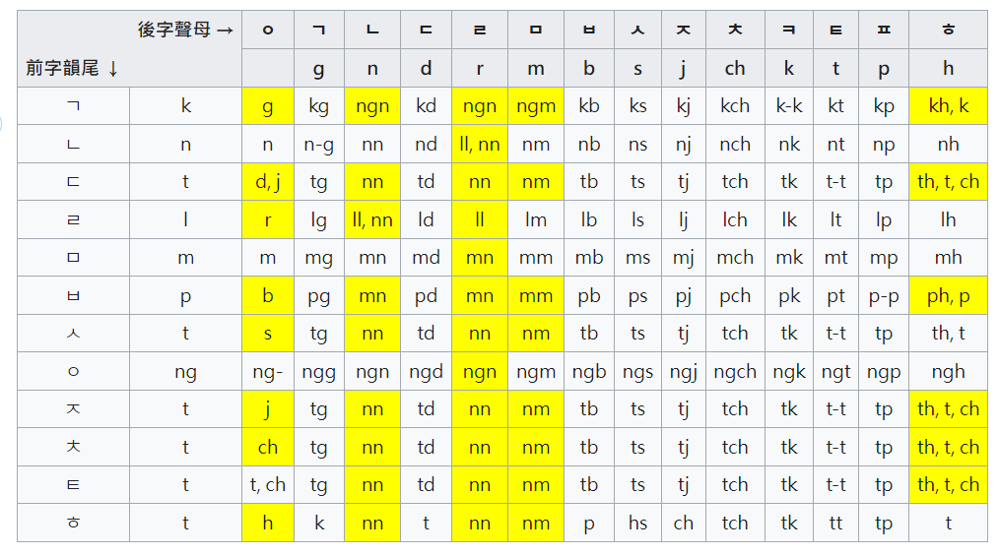

# で　ー　小说三要素：时间、地点、人物、数量

- F:\bilidown\日语\日文文法\【日常会话中”で”的九种用法总结】｜常用日文助词

## で　ー　因果逻辑的因

- F:\bilidown\日语\（已完结）【日语学习 0-N1语法全掌握】现代日语语法教程，助你构建正确日语语法体系\7-7.格助词（2）-720P 60帧-AVC.mp4


# という　ー　引用、被称为

- F:\bilidown\日语\（已完结）【日语学习 0-N1语法全掌握】现代日语语法教程，助你构建正确日语语法体系\83-83.复合表达「という」-720P 高清-AVC.mp4

##  という　ー　强调全部、所有 

>  前后必须是同一个名词  A+という+A

### という　ー　传闻 

> という这种情况下不能变形

### といった　ー　不完全列举

> 所谓的这类东西  **偷油塔**


# 格

- D:\Github\books\日本语-金田一春彦-2017.pdf  p.252


# た　

- D:\Github\books\日本语-金田一春彦-2017.pdf  p.277


# ている　动作完成、结果持续 过去完成时

- D:\Github\books\日本语-金田一春彦-2017.pdf  p.283


# だ、である　不是判断、也不是肯定

- D:\Github\books\日本语-金田一春彦-2017.pdf  p.304 

1. 与某物等价
2. 属于某类、是其中一员
3. 具有某种属性
4. 处于某种状态


## だ 名词+だ 作谓语

- G:\bilidown\日语\（已完结）【日语学习 0-N1语法全掌握】现代日语语法教程，助你构建正确日语语法体系\1-1.名词谓语句-720P 高清-AVC.mp4

> 否定是 名词+ではない


## だ 敬体 では


# ような　ー　样态  这样的 那样的

- 1-1.名词谓语句 2:44

## こんな 口语

> そんな　あんな　どんな　


# 私たち、あなたがた、彼ら、私ども ー 人称复数

> 对外说话不可以敬内


# 名词谓词句


名词+だ

- だった 过去

- でした 过去敬体
- ではありませんでした 过去否定敬体


# 形容词


它的两个连用形有两个： く 和  かっ，但是 かっ 只能和 た 一起用，构成  かった 表过去

寒い变过去否定要进行两次变形：

1.  先变连用 寒く然后加 ない = 寒くない　变完以后现在它是 い形
2. い形再变连用  寒くなかっ 加表过去的用言た  = 寒くなかった


1. 所有形容词都以  い 结尾，数量很少
2. 连用形以 く 结尾
4. 形容词后面的 の　它是名词，代指
5. 形容词后面什么都不加，它是终止形，表句子结束


后面什么也不加（句末表疑问的 か 表敬体です 除外）的形容词是**终止形**

名词前面的形容词是连体形


# 形容动词


终止形 だ


它是动词，不是形词词。它的连体形有形容词一样的功能，有动词一样的变形

1. 它跟动词的变换是一样的，所以被称为形容动词

2. 形容动词在词典里面都是以 だ 结尾的（新明解除外）

3. 连体形以 な 结尾

   > ```
   > な结尾的形容动词在语义和功能上与形容词完全相同
   > 动词+た 也可以作为形容词使用
   > 日本语-金田一春彦 p.291
   > 
   > 总结：形容动词连体形有形容词一样的功能，有动词一样的变形
   > ```

4. 连用形以 で 结尾 


同じ　是形容动词连体形


## 总结：共有三种形容词 

#### い形、な形、动词+た形


教室は大きく、静かだ

> 大きく后接用言，要连用形
>
> 静かだ 什么也不接，要终止形

教室は静かで、大きい

> 静かで 后接用言，要连用形
>
> 大きい 什么也不接，要终止形


终止形 = 字典形


# 动词


总结：**先说词干，再说是否动作是主语主动做的还是主语被动承受的，然后说是描述动作过程还是动作结果存续，**

**最后说动作发生的时间**


## 动词的语态

主语是动作执行者——主动态

主主是动作承受者——被动态


**用言的连用形有一个是 かっ，但是 かっ 只能和 た 一起用，构成  かった 表过去** （见“形容词条目”）


読ま **れ**


## 动词的体

読ま れ **てい**

究竟是要说整个事件呢，还是要说整个事件的过程呢，还是说这个动作结束之后这个结果一直在存留呢


## 动词的肯定否定


読ま れ  てい **なかっ**　た


ない的连用形 **なかっ **


## 动词的时态


以说话时间为参考系，**动作的时间和说话时间是怎么的关系**（先后等）


# 五段动词


書く かく

## え段命令

-   附加く变け、加！号 ，書け！

## え段可能

-   附加く变け、加る，書ける

## お段意志

-    附加く变こ、拉上长音、_**書こう？？？**_

## え段使役

-    附加く变か、加**せ(让)**、加る，書かせる

> **所有使役 词性都是他动词。可能形都是自动词**
>
> **使役叫せる、させる。要么有せる、要么有させる**
>
> **被动叫れる、られる**

## 段被动

-    附加く变か、加**れ(来)**、加る，書かれる

**动词变过一次形了以后，这个动词它就是一段动词**，后续把它当成一段动词来变化


# 1 段动词

只有一种形态

- 换后缀不换附加

**1 段动词的识别**

- 一个汉字、中间有い段或え段上的音、后边加一个る或ます

看到一个单词先找附加

- **う的上面是い，要敬上、う的下面是え，地位低你可以命令他**
  - 当看到敬上和命下后你应该马上想到这可能是1段动词
    -  再接着看后缀是不是ます或着る，是就确定了


1 段动词非常好变化，只需把后缀改成る或ます


# 特殊动词

词干发生变化

サ变动词 只有一个

- する 做，します 敬体

カ变动词 只有一个

- くる 来，きます 敬体


# 词干 + 中缀 + 后缀 = 表意 + 表态 + 表时

- 词干用固定不变的汉字表意  
- 中缀用可变的五个元音之一表态（意态、可能、被动）
- 后缀用可变的表时（形式、时态、词性）
  - 肯定否定疑问敬体简体、一般将要现在一直过去、**た变**：自动词变形容词


# 音调

 [《NHK日语发音音调辞典》.pdf](Japanese\《NHK日语发音音调辞典》.pdf) 


# 中古音韵

- 《反切拼读入门》

  > ​	比如说先看上字清浊；若浊，看下字平仄定上字送气与否，再依下字变添介音、定声调。


## 基于《切韵》的中古拼音方案

- https://zhuanlan.zhihu.com/p/105194895


# 对比韩语

## 查多语词典

- https://zh.dict.naver.com/#/search?query=박수   可以查各国语言
  - https://stdict.korean.go.kr/main/main.do 标准国语大词典
- https://ja.dict.naver.com/#/search?query=ぼんやり&range=all
- https://korean.dict.naver.com/kozhdict/#/main  韩中
- https://www.bilibili.com/video/BV1w4411e7Bz
- https://bulbapedia.bulbagarden.net/wiki/List_of_Korean_Pok%C3%A9mon_names  **宝可梦韩名**
- 日语用训读汉字书写的和语词，韩语借入时按对应汉字直接音读了，例如

> 소포-小包-小包み（包裹）
>  수입-手入-手入れ（保养） 
> 매상-賣上-売り上げ（营业额）

- 日语用对音借字书写的[外来词](https://www.zhihu.com/search?q=外来词&search_source=Entity&hybrid_search_source=Entity&hybrid_search_extra={"sourceType"%3A"answer"%2C"sourceId"%3A1285427117})，韩语借入时按对应汉字直接音读了，例如

> 독일-獨逸-独逸-ドイツ-Deutsch（[德意志](https://www.zhihu.com/search?q=德意志&search_source=Entity&hybrid_search_source=Entity&hybrid_search_extra={"sourceType"%3A"answer"%2C"sourceId"%3A1285427117})-德国）借自德语（原义为“德国的”）

- 韩语通过日语借入葡、法、英、德语等西方语言的音译词，例如

> 빵-パン（面包）对应葡语pão、西语pan、法语pain
> 아르바이트-アルバイト（兼职）借自德语Arbeit（原义为“工作”）

- 韩语从日语借入，但来源不确定的词，例如「가방-かばん-鞄-手包」

> 有说法称，日语かばん来源于「夹板」，未经证实

- 疑似来源相关的词，例如「곰-くま-熊-熊」


錢大昕《古無輕唇音》:"凡輕脣之音，古讀皆爲重脣。"。證之韓國至今也無輕脣音  [f ], [v]。韓音與古漢語的音又一相連證據。

例如：

- ＂方＂，＂房＂，＂發＂，＂犯＂，＂法＂等，普通話聲母是＂f＂，韓音都讀重脣音＂ㅂ＂。
-  西方小提琴 violin，韓音바이올린，聲母都是"ㅂ"。

～～～

又例如韩语跟中国南方好些方言一样，都保留了p、t、k三个入声。普通话则没有入声。

韩语的对应规律是[ t〕一律改为[ l ]。

例如“一”， 粵语 [ jat ]7， 韩语是 일 [ il ]。
链接：https://www.zhihu.com/question/47919082/answer/108264719


韩语的汉语词比例比日语还高(日语五成韩语七成)，只不过日语的自有词汇多有汉字训读而韩语没有，加上朝韩都逐渐弃用汉字，所以似乎韩语跟汉语关系没那么近。刚接触韩语不太了解韩语汉字词读音怎么来的，不过日语的汉字读音基本上分为吴音(南朝金陵雅音)、汉音(隋唐长安官话)、唐音(宋及以后)三种，比如这个“兄”在日语中汉音kei，吴音kyou，训读ani，熟字训里则是nii(欧尼桑的尼)。除此之外还有惯用音，可以理解成读音将错就错。
但听韩语的时候听不出来这些汉语词也正常，韩语有一套音变规则，比如“韩国语”写成han gug eo，但是读出来则是han gu geo，加之韩语这个g（ㄱ）实际上更接近汉语k，就显得没那么像了。另一方面是韩语用词不同，很多词听起来很古派，举几个例子：朋友叫“亲旧”，钱包叫“纸匣”，上课叫“授业”，残疾叫“不具”，书叫“册”，书桌叫“册床”，现在叫“只今”等等。还有另一些词汇是韩国日据时期从日本过来的叫法，比如免费叫无料，报纸叫新闻，考试叫试验等等。还有一些用法跟中国日本都不同的，比如用户名(ID)叫“计定”，手机叫“携带phone”等等。
“兄”在韩语也很有意思，男性管哥哥叫兄，女性管哥哥叫“obba”（也就是欧巴），男女对哥哥姐姐称呼不同。而弟弟妹妹则都叫“男同生”、“女同生”，亲弟妹就是“亲同生”，这也是颇为存古的称呼。

https://forum.freemdict.com/t/topic/8231/12


## 读法 从左到右 从上到下


### 韩语连浊


# 对比粤语

[粤语审音配字库](https://humanum.arts.cuhk.edu.hk/Lexis/lexi-can/)

[粵語國際音標查詢](https://open-dict-data.github.io/ipa-lookup/yue/?#)

[【粤词音韵】粤语填词基础：五度标记法和调值](https://www.bilibili.com/video/BV17U4y1P7Ud)


**永** /wɪŋ˩˧/ 实际发音23，这里像是标13


[五度标记法](https://zh.wikipedia.org/zh-hans/%E4%BA%94%E5%BA%A6%E6%A0%87%E8%AE%B0%E6%B3%95)

是赵元任1920年代发明的一种记录语言调值的方法[1]。五度标记法在汉语方言、苗瑶语及侗台语调查中大量使用，在其他语言的描写中也有影响。

| 曲线法 | ˩    | ˨    | ˧    | ˦    | ˥    |
| :----: | ---- | ---- | ---- | ---- | ---- |
| 数字法 | 11   | 22   | 33   | 44   | 55   |

| 曲线法 |      | ˩˨   | ˩˧   | ˩˦   | ˩˥   | ˨˩   |      | ˨˧   | ˨˦   | ˨˥   |
| :----: | ---- | ---- | ---- | ---- | ---- | ---- | ---- | ---- | ---- | ---- |
| 数字法 |      | 12   | 13   | 14   | 15   | 21   |      | 23   | 24   | 25   |
| 曲线法 | ˧˩   | ˧˨   |      | ˧˦   | ˧˥   | ˦˩   | ˦˨   | ˦˧   |      | ˦˥   |
| 数字法 | 31   | 32   |      | 34   | 35   | 41   | 42   | 43   |      | 45   |
| 曲线法 | ˥˩   | ˥˨   | ˥˧   | ˥˦   |      |      |      |      |      |      |
| 数字法 | 51   | 52   | 53   | 54   |      |      |      |      |      |      |

| 曲线法 |      | ˩˩˨  | ˩˩˧  | ˩˩˦  | ˩˩˥  | ˩˨˩  | ˩˨˨  | ˩˨˧  | ˩˨˦  | ˩˨˥  |
| :----: | ---- | ---- | ---- | ---- | ---- | ---- | ---- | ---- | ---- | ---- |
| 数字法 |      | 112  | 113  | 114  | 115  | 121  | 122  | 123  | 124  | 125  |
| 曲线法 | ˩˧˩  | ˩˧˨  | ˩˧˧  | ˩˧˦  | ˩˧˥  | ˩˦˩  | ˩˦˨  | ˩˦˧  | ˩˦˦  | ˩˦˥  |
| 数字法 | 131  | 132  | 133  | 134  | 135  | 141  | 142  | 143  | 144  | 145  |
| 曲线法 | ˩˥˩  | ˩˥˨  | ˩˥˧  | ˩˥˦  | ˩˥˥  |      |      |      |      |      |
| 数字法 | 151  | 152  | 153  | 154  | 155  |      |      |      |      |      |
| 曲线法 | ˨˩˩  | ˨˩˨  | ˨˩˧  | ˨˩˦  | ˨˩˥  | ˨˨˩  |      | ˨˨˧  | ˨˨˦  | ˨˨˥  |
| 数字法 | 211  | 212  | 213  | 214  | 215  | 221  |      | 223  | 224  | 225  |
| 曲线法 | ˨˧˩  | ˨˧˨  | ˨˧˧  | ˨˧˦  | ˨˧˥  | ˨˦˩  | ˨˦˨  | ˨˦˧  | ˨˦˦  | ˨˦˥  |
| 数字法 | 231  | 232  | 233  | 234  | 235  | 241  | 242  | 243  | 244  | 245  |
| 曲线法 | ˨˥˩  | ˨˥˨  | ˨˥˧  | ˨˥˦  | ˨˥˥  |      |      |      |      |      |
| 数字法 | 251  | 252  | 253  | 254  | 255  |      |      |      |      |      |
| 曲线法 | ˧˩˩  | ˧˩˨  | ˧˩˧  | ˧˩˦  | ˧˩˥  | ˧˨˩  | ˧˨˨  | ˧˨˧  | ˧˨˦  | ˧˨˥  |
| 数字法 | 311  | 312  | 313  | 314  | 315  | 321  | 322  | 323  | 324  | 325  |
| 曲线法 | ˧˧˩  | ˧˧˨  |      | ˧˧˦  | ˧˧˥  | ˧˦˩  | ˧˦˨  | ˧˦˧  | ˧˦˦  | ˧˦˥  |
| 数字法 | 331  | 332  |      | 334  | 335  | 341  | 342  | 343  | 344  | 345  |
| 曲线法 | ˧˥˩  | ˧˥˨  | ˧˥˧  | ˧˥˦  | ˧˥˥  |      |      |      |      |      |
| 数字法 | 351  | 352  | 353  | 354  | 355  |      |      |      |      |      |
| 曲线法 | ˦˩˩  | ˦˩˨  | ˦˩˧  | ˦˩˦  | ˦˩˥  | ˦˨˩  | ˦˨˨  | ˦˨˧  | ˦˨˦  | ˦˨˥  |
| 数字法 | 411  | 412  | 413  | 414  | 415  | 421  | 422  | 423  | 424  | 425  |
| 曲线法 | ˦˧˩  | ˦˧˨  | ˦˧˧  | ˦˧˦  | ˦˧˥  | ˦˦˩  | ˦˦˨  | ˦˦˧  |      | ˦˦˥  |
| 数字法 | 431  | 432  | 433  | 434  | 435  | 441  | 442  | 443  |      | 445  |
| 曲线法 | ˦˥˩  | ˦˥˨  | ˦˥˧  | ˦˥˦  | ˦˥˥  |      |      |      |      |      |
| 数字法 | 451  | 452  | 453  | 454  | 455  |      |      |      |      |      |
| 曲线法 | ˥˩˩  | ˥˩˨  | ˥˩˧  | ˥˩˦  | ˥˩˥  | ˥˨˩  | ˥˨˨  | ˥˨˧  | ˥˨˦  | ˥˨˥  |
| 数字法 | 511  | 512  | 513  | 514  | 515  | 521  | 522  | 523  | 524  | 525  |
| 曲线法 | ˥˧˩  | ˥˧˨  | ˥˧˧  | ˥˧˦  | ˥˧˥  | ˥˦˩  | ˥˦˨  | ˥˦˧  | ˥˦˦  | ˥˦˥  |
| 数字法 | 531  | 532  | 533  | 534  | 535  | 541  | 542  | 543  | 544  | 545  |
| 曲线法 | ˥˥˩  | ˥˥˨  | ˥˥˧  | ˥˥˦  |      |      |      |      |      |      |
| 数字法 | 551  | 552  | 553  | 554  |      |      |      |      |      |      |

# NLP+


新とわの駅

> とわ ：【永久】之意的雅语表达形式。永久。永远。
>
> > 永久(えいきゅう)
>
> 영구, 영원. (=永遠, 永久)
>
> > ㅕ= yo ; ㅇ= n ; ㄱ = g   (注：**ㅇ通常作为零声母，但作为韵尾时读作n**)
> >
> > 영구 音同"拥古"
> >
> > ㄴ = n ; 
> >
> > 영원 音同"拥吻"
> >
>
>  粤语
>
> > 永 /wɪŋ˩˧/ 实际发音23，这里像是标13

ここがとわの市か……。

> 市(し)：城市
>
> 시 市 ; 도시 都市 ; shi  sh->s  i->i
>
> > ㅅ 这个辅音为什么对应 s ? 因为女人是 S 形曲线
> >
> > ㄷ 对应辅音 d，因为这是一只嗷嗷**待**哺的口
> >
> > 도시 : 音同"都喜"


现在你是一个生活在日本的日本人，你正在教一个中国人学日语。请把我说的所有日语句子中的汉字标注假名，并对日语句子的语汇和语法作出详细解释，现在开始


新とわの駅

ここがとわの市が……。

家の都合で引っ越すことになっちゃったけど、今日からはこの街で暮らして、学校に通うんだな。

```
新(しん)とわの駅(えき)
ここがとわの市(し)が……。
家(いえ)の都合(つごう)で引(ひ)っ越(こ)すことになっちゃったけど、今日(きょう)からはこの街(まち)で暮(く)らして、学校(がっこう)に通(かよ)うんだな。
第一个句子：
新(しん)とわの駅(えき)

整个句子的意思是：新永久车站。

第二个句子：
ここがとわの市(し)が……。

整个句子的意思是：这里是永久市吗……（表示疑问或惊讶）。

第三个句子：
家(いえ)の都合(つごう)で引(ひ)っ越(こ)すことになっちゃったけど、今日(きょう)からはこの街(まち)で暮(く)らして、学校(がっこう)に通(かよ)うんだな。

整个句子的意思是：由于家庭原因，不得不搬家了，但是（或虽然）从今天开始，在这个城市生活，并上学了呢。


这是两个日语句子。让我们先来为其中的汉字标注假名，然后对每个句子的词汇和语法进行详细解释。

家(いえ)の都合(つごう)で引(ひ)っ越(こ)すことになっちゃったけど、

今日(きょう)からはこの街(まち)で暮(く)らして、学校(がっこう)に通(かよ)うんだな。

第一个句子：
家(いえ)の都合(つごう)で引(ひ)っ越(こ)すことになっちゃったけど、

词汇和语法解释：

家(いえ)：家，表示住所或家庭。
都合(つごう)：情况，表示某种状况或原因。
で：表示原因或理由。
引っ越す(ひっこす)：搬家。
ことになる：表示事情发生了变化，意为“变成...”，“变得...”。
ちゃった：是「てしまう」的口语形式，表示完成动作，有时带有一定的遗憾或意外之感。
けど：表示转折，相当于汉语的“但是”。
整个句子的意思是：由于家庭原因，不得不搬家了，但是（或虽然）。

第二个句子：
今日(きょう)からはこの街(まち)で暮(く)らして、学校(がっこう)に通(かよ)うんだな。

词汇和语法解释：

今日(きょう)：今天。
から：表示时间、空间或原因的起点，相当于汉语的“从...开始”。
は：表示主题或对比。
この：这个。
街(まち)：城市或城镇。
で：表示动作发生的场所。
暮らす(くらす)：生活，居住。
て：连接助词，用于连接两个动词。
学校(がっこう)：学校。
に：表示方向、目标等。
通う(かよう)：通勤，通学等往返于两地的行为。
んだ：表示解释、强调或命令等，相当于汉语的“就是...”。
な：表示肯定的语气，相当于汉语的“呢”。
整个句子的意思是：从今天开始，在这个城市生活，并上学了呢。
```


駅のすぐ近くに公園があるのか、いい街だな。

```
句子：
駅(えき)のすぐ近(ちか)くに公園(こうえん)があるのか、いい街(まち)だな。

词汇和语法解释：

駅(えき)：车站，通常指火车站或地铁站。
在日语中，汽车站通常用「バス停」（バスてい）表示，它是指公共汽车站点、巴士站等地方，乘客在这里上下车。
の：表示所属关系或修饰名词。
すぐ：紧接着，马上，表示时间或空间上的紧邻。
近(ちか)く：附近，近处。
に：表示方向、目标等。
公園(こうえん)：公园。
が：表示主语。
ある：存在，表示非生物的存在。
のか：表示疑问、惊讶或强调等，相当于汉语的“吗？”、“啊？”或“原来如此！”。
いい：好，优秀。
街(まち)：城市或城镇。
だ：断定助词，表示陈述或肯定。
な：表示肯定的语气，相当于汉语的“呢”。
整个句子的意思是：车站附近有个公园吗？真是个好城市呢。
```


[客家话](https://www.youtube.com/watch?v=AP7dYqPqXzA) 耳公，鼻公，在外面，看得见，属阳，看不见的在口里面的舌嫲属阴，所以客家话里有阴阳来分别。客家话很有文化的哦

[客家话](https://www.youtube.com/watch?v=NtXO54vCydw)

[禾苗最怕寒露风，人生最怕老来穷](https://www.youtube.com/watch?v=T1y_IJbc1uM&list=PLqv-rlESeSaDbOGHZVb07Yzr0QQnNrogM&index=1)  客家谚语

[逢人要讲七分话，三分留来打天下](https://www.youtube.com/watch?v=gwurBUhfsvo)

[患难之时能有几，人敬富来狗咬贫](https://www.youtube.com/watch?v=gwurBUhfsvo)

[不信且看宴中酒，怀怀先敬有钱人]()


# pokemon

```
ポケットモンスターspecial 宝可梦特别篇

「ポケモンの息つ

https://www.1wwh.net/bbs-4881-1-1.html
	# 【mobi】神奇宝贝特别篇/精灵宝可梦 第01-68卷未

《口袋妖怪》系列的时间线。1、第一世代《红》《绿》《蓝》——1996年《黄》——1998年对应无印篇关东和橘子群岛部分2、第二世代《金》《银》《水晶》——2000年对应无印篇成都部分3、第三世代《红宝石》《蓝宝石》——2002年《绿宝石》——2004年对应AG《火红》《叶绿》——2004年复刻《红绿蓝》对应无印篇关东和橘子群岛4、第四世代《钻石》《珍珠》——2006年《白金》——2008年对应DP《心金》《魂银》——2009年复刻《金银》对应无印篇成都5、第五世代《黑》《白》——2010年《黑2》《白2》——2012年对应BW6、第六世代《x》《y》——2013年对应xy以及xyz《终极红宝石》《始源蓝宝石》——2014年复刻《红蓝宝石》对应AG7、第七世代《日》《月》——2016年《究极之日》《究极之月》——2017年对应日月
```


# 输入法


浊音、半浊音

が—ga ぎ—gi ぐ—gu げ—ge ご—go
ざ—za じ—ji ず—zu ぜ—ze ぞ—zo
だ—da ぢ—di づ—du で—de ど—do
ば—ba び—bi ぶ—bu べ—be ぼ—bo
ぱ—pa ぴ—pi ぷ—pu ぺ—pe ぽ—po
は—ha ひ—hi ふ—fu/hu へ—he ほ—ho


3、拗音输入对照表
拗音输入，平/片假名通用，把第一个字的母音去掉即可
あ行-对应字母 う行-对应字母 お行-对应字母
きゃ-kya きゅ-kyu きょ-kyo
しゃ-sya/sha しゅ-syu/shu しょ-syo/sho
ちゃ-tya/cha ちゅ-tyu/chu ちょ-tyo/cho
にゃ-nya にゅ-nyu にょ-nyo
ひゃ-hya ひゅ-hyu ひょ-hyo
みゃ-mya みゅ-myu みょ-myo
りゃ-rya りゅ-ryu りょ-ryo
ぎゃ-gya ぎゅ-gyu みょ-gyo
じゃ-ja じゅ-ju じょ-jo说明：微软日文输入法、南极星日文输入法通用
じゃ-zya じゅ-zyu じょ-zyo说明：微软日文输入法适用
びゃ-bya びゅbyu びょ-byo
ぴゃ-pya ぴゅ-pyu ぴょ-pyo
ぢゃ-dya ぢゅ-dyu ぢょ-dyo说明：微软日文输入法适用
ぢゃ-dja ぢゅ-dju ぢょ-djo说明：南极星日文输入法适用
4、长音ー输入
片假名里的长音符号“ー”，输入方法是按数字键0右方的-（减号键）。

5、促音っ输入
单词中输入促音也就是小っ，方式有两种：
双重输入后一发音的第一个字母后，会出现促音，比如：切符，きっぷ kippu、学校 がっこう gakkou
单独输入小っ的时候可以使用直接输入ltu或者xtu

5、小ぁぃぅぇぉ输入
在前面加上x或l就可以变成小假名（没有小假名的除外）。比如：输入字母“l”或“x”+a、i、u、e、o，输入la得到ぁ，输入xa也得到ぁ，输入li得到ぃ。

6、ぢ和づ的输入
ぢ读音为ji，但在输入时应该输入di。
づ读音为zu，但在输入时应该输入du。
7、は和を的输入
は在作助词用时，读作wa，但输入仍为ha。
を的读音为o，但输入时为wo。

8、古语假名ゐ和ゑ的输入
“ゐ”和“ゑ”是古语假名，使用较少。ゐ输入wi，ゑ输入we，然后按空格键寻找就可以了。

9、汉字、词输入
要变换汉字、词语时，输入对应的假名后，按[space]空格键，即会出现变换出来的汉字或词的清单，找到想输入的汉字或词时再按[enter]回车键。


## 韓语


> 要打出紧音只需要按住shift在按相应的松音键就可以了，比如按Q键显示ㅂ，按住shift再按Q就会打出ㅃ。


粗體部分顯示了修正案與馬-賴系統相異的轉寫法

「ㄱ」和「ㅋ」做韻尾的時候，轉寫為「K」。例如　곡 GOK

「ㄷ」、「ㅌ」、「ㅅ」和「ㅈ」做韻尾的時候，轉寫為「T」。例如 꽃 KKOT

「ㅂ」和「ㅍ」做韻尾的時候，轉寫為「P」。例如 탑 TAP



前字韻尾同後字聲母相遇的時候寫法有一定的變化


# 查字典


0调低开高走，1调高开低走

0调低开高走，高音从2开始连绵不绝

1调高开低走，高音1开1结

2,  3,  4, 5 低开高走，高音2345开，2345结

低调  三声214

高调  一声55


音节  拍(时值)  

シャツ (shatsu)  反切 二合  切上字シ  切下字ャ 
shirt  

0 调是平调55  一声  
2 调是降调51  四声  


1. 端を見る hashi o mi**?**ru – 看到**尽头**
2. 箸を見る ha**?**shi o mi**?**ru – 看到**筷子**
3. 橋を見る hashi**?** o mi**?**ru – 看到**桥**


日语假名与罗马字对照表  

平假名：あ い う え お  
片假名：ア イ ウ エ オ  
输入法：a i u e o  

平假名：か き く け こ  
片假名：カ キ ク ケ コ  
输入法：ka ki ku ke ko  

平假名：さ し す せ そ  
片假名：サ シ ス セ ソ  
输入法：sa si su se so   

平假名：た ち つ て と  
片假名：タ チ ツ テ ト  
输入法：ta ti tu te to 『ち chi』**つ** tsu [ **tsɯ** ]  

平假名：な に ぬ ね の  
片假名：ナ ニ ヌ ネ ノ  
输入法：na ni nu ne no   

平假名：は ひ ふ へ ほ  
片假名：ハ ヒ フ ヘ ホ  
输入法：ha hi hu he ho 『ふ fu』  

平假名：ま み む め も  
片假名：マ ミ ム メ モ  
输入法：ma mi mu me mo  

平假名：や ゆ よ  
片假名：ヤ ユ ヨ  
输入法：ya yu yo  

平假名：ら り る れ ろ  
片假名：ラ リ ル レ ロ  
输入法：ra ri ru re ro  

平假名：わ を ん  
片假名：ワ ヲ ン  
输入法：wa wo n   

浊音（浊音.だくおん）  
日语的浊音包括が行、ざ行、だ行和ば行共20个。  
平假名：が ぎ ぐ げ ご  
片假名：ガ ギ グ ゲ ゴ  
输入法：ga gi gu ge go   

平假名：ざ じ ず ぜ ぞ  
片假名：ザ ジ ズ ゼ ゾ  
输入法：za zi zu ze zo  

平假名：だ ぢ づ で ど  
片假名：ダ ヂ ヅ デ ド  
输入法：da di du de do  

平假名：ば び ぶ べ ぼ  
片假名：バ ビ ブ ベ ボ  
输入法：ba bi bu be bo  

平假名：ぱ ぴ ぷ ぺ ぽ  
片假名：パ ピ プ ペ ポ  
输入法：pa pi pu pe po  

拗音:（这里的片假名就省略了，因为写法完全一样）   
きゃ きゅ きょ  
kya kyu kyo  
しゃ しゅ しょ  
sya syu syo 『しゃsha しゅshu しょsho』  
ちゃ ちゅ ちょ  
cya cyu cyo 『ちゃcha ちゅchu ちょcho』  
にゃ にゅ にょ  
nya nyu nyo  
ひゃ ひゅ ひょ  
hya hyu hyo  
みゃ みゅ みょ  
mya myu myo  
りゃ りゅ りょ  
rya ryu ryo  
ぎゃ ぎゅ ぎょ  
gya gyu gyo  
じゃ じゅ じょ  
ja ju jo  
[じゃ じゅ じょ]   
zya zyu zyo  
びゃ びゅ びょ  
bya byu byo  
ぴゃ ぴゅ ぴょ  
pya pyu pyo  
ぢゃ ぢゅ ぢょ  
dya dyu dyo  
ぢゃ ぢゅ ぢょ  
dja dju djo  

1.促音的输入法:例:ずっと zutto 、はっきり hakkiri、 やっぱり yappari、 怎么样,找到规律了吗? （即：双打っ音后的第一个字母）。单独的っ的打法是xtu（注：在あ い う え お及个别假名打法前加打一个“x”会打出相应的小假名）
2.拨音的输入法:按两下"n"。例:まんぞく mannzoku

「ヴ」这个假名 50 音图里没有，作为表示 V 音的标志，是日语中比较特殊的的
外来语。这个假名平时不会经常出现，出现时也会经常是用バ音来代替。
例：小提琴 （violin） ，用日语可以表示成：「ヴァイオリン」或者「バイオリ
ン」。
输入方法：键盘直接打「vu」就可以打出这个音。


经常在日语里看到的「々」是什么意思？   
这个是表示两个同样汉字，后面一个缩写。   
例：様々（さまざま），人々（ひとびと）也是这样。在电脑里输入后会自动转
换，并不是假名。

什么是连浊？   
连浊（れんだく）是指在日语复合词中，后方词素的最初的清音变成浊音的现象。
在复合词中，如果后方词素以清音／k／、／s／、 ／t／、 ／h／中的其中一个
开头，将分别变为与之相对应的浊音。
例：旅行会社（りょこうがいしゃ）中的会社（かいしゃ）。目印（めじるし）
中的印（しるし）か、「し」都是发生了连浊现象。
来源于名词的助词中也能看到这种现象，如：「ぐらい」「だけ」「ばかり」。


《新明解国语辞典》里面，将表外汉字用「〈」标出（复数为「〈〉」），将在表内但使用表中没有的音训的汉字用「《」标出，熟字训以及「当て字」用「｛｝」标出。除了最常用的写法外的其他写法都写在词条最后的「表記」栏里。比如：

**うるさい ③:③（形）
……
〔表記〕「《煩い・｛五月〈蠅｝い」などと書く。

这里，你就知道一般写假名就可以，写汉字「煩」也可以接受，「五月蠅」是熟字训，里面还有表外汉字，故少用为好。

## 音调

在《新明解》中，冒号两边是音调标记。冒号的存在是为了区别动词形容词的终止形和连体形的音调。**冒号前是终止形，后面是连体形的音调**。


1. ### 注意头两拍绝对是高低对立，你低我就高，你高我就低

2. ### 特别记住1 调要高开，其他全部低开

3. ### 低读汉语拼音第三声，高读汉语拼音第一声

4. ### 0低开，1高开，0 1 2 3 4 5 标记了 第n+1拍读汉语拼音的三声

   ### 遇到n+1 没有对应的音的情况，忽略既可 


1调的高开读第二声？确信+1 かっぱ


## 复合词后字 k、s、t、h 浊化


## 当て字 汉字作为拼音工具


