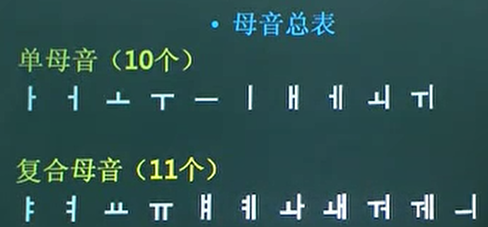
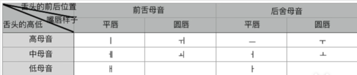

40个字母

21 韵母   19声母

# 10个单元音，11个复合元音

[难以区分、难以发音的母音](https://www.bilibili.com/video/BV1VW411u72c/?spm_id_from=333.999.0.0&vd_source=1f4569489a622719e5c3b00101194ac3)

5:31 从上到小从左到右   啊  呜  呃 哦  ㅏ ㅜ  ㅓ ㅗ   

8:38  ㅡ 发呃的时侯嘴巴扁平化的方式方出来就对了

ㅣ 依  ㅐ 日语的元音 e 第三声   ㅔ 也是日语的元音 e 第三声  区别只是开口小一点，韩国人也区分不出来

[ᅬ](https://zh.wikipedia.org/wiki/%E6%9C%9D%E9%AE%AE%E8%AA%9E)

G:\bilidown\【韩语学习】零基础入门\2-[韩语发音] 第2课  单母音-480P 清晰-AVC

