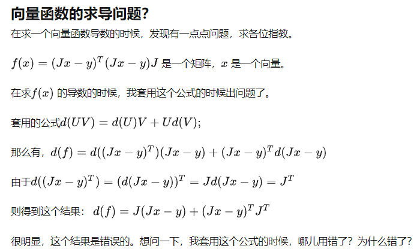
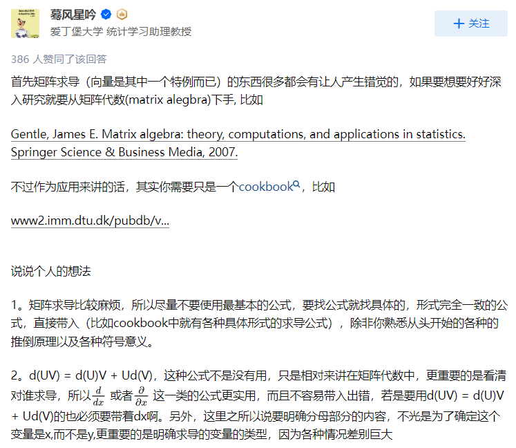
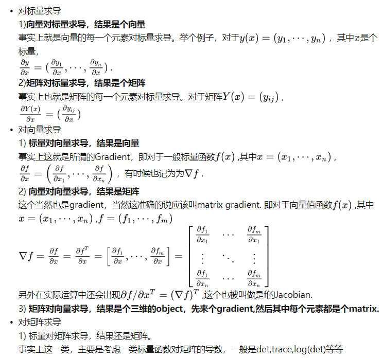
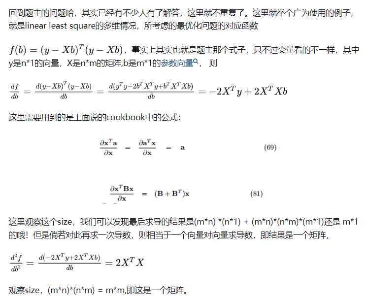

$$
\begin{align}
f(x) &= cx^{n} \\
f(x)'&= cn \ast x^{n -1}
\end{align}
$$

$$
(f \circ g)'(x) = f'\big( g(x) \big ) g'(x)
$$


$$
\mathcal{L} = \frac{1}{2} (y - t) ^ 2
$$

令：$z = y - t$,  则  $\mathcal{L} = \frac{1}{2} z ^ 2 \\$,  根据链式法则有：

 $\frac{\partial \mathcal{L}}{\partial z} = \frac{1}{2} * 2 * z = z$ ,  $\frac{\partial \mathcal{z}}{\partial y} = 1$

$\frac{\partial \mathcal{L}}{\partial y} = \frac{\partial \mathcal{L}}{\partial z} \frac{\partial \mathcal{z}}{\partial y} = z * 1 = z = y - t$   


根据复合函数求导法则： $(f \circ g)'(x) = f'\big( g(x) \big ) g'(x)$ 有，


$$
(\mathcal{L} \circ z)'(y) = \mathcal{L}' ( z(y) ) z'(y) \\
= z(z(y)) \\
= z(y-t) \\
= (y-t) -t \\
= y - 2t
$$


注：符号 $\overline{z}$  表示 $\frac{\partial \mathcal{L}}{\partial z}$ 
$$
\mathcal{L} = \frac{1}{2} (y - t) ^ 2 \\
y = \sigma(z)
$$

$$
\frac{\partial \mathcal{L}}{\partial y} = y - t = \overline{y} \\

\frac{\partial \mathcal{y}}{\partial z} = \frac{\partial \mathcal{\sigma}}{\partial z} = \mathcal{\sigma}'(z) \\

\frac{\partial \mathcal{z}}{\partial w} = x
$$


所以有：
$$
\overline{z} = \frac{\partial \mathcal{L}}{\partial y} \frac{\partial \mathcal{y}}{\partial z} = \overline{y} \ \mathcal{\sigma}'(z)
$$

$$
\overline{w} = \frac{\partial \mathcal{L}}{\partial y} \frac{\partial \mathcal{y}}{\partial z} \ \frac{\partial \mathcal{z}}{\partial w} \\
= \overline{z} x
$$


- 克罗内克积

  - https://baike.baidu.com/item/%E5%85%8B%E7%BD%97%E5%86%85%E5%85%8B%E7%A7%AF/6282573

    > vec(X)表示矩阵X的向量化，它是把X的所有列堆起来所形成的列向量。


- **矩阵求导术(下)**


$例1：F=AX, A 是n \times p 的矩阵，求 \frac{\partial F}{\partial A}。$

这样怎么求？
$$
\begin{bmatrix}
a^{1}_{1,1} & a^{1}_{1,2} & \cdots & a^{1}_{1,p}  \\
a^{1}_{2,1} & a^{1}_{2,2} & \cdots & a^{1}_{2,p} \\
\vdots & \vdots & \ddots & \vdots & \\
a^{1}_{n,1} & a^{1}_{n,2} & \cdots & a^{1}_{n,p} \\
\end{bmatrix}

\cdot 

\begin{bmatrix}
x^{0}_{1,1} & x^{0}_{1,2} & \cdots & x^{0}_{1,m}  \\
x^{0}_{2,1} & x^{0}_{2,2} & \cdots & x^{0}_{2,m} \\
\vdots & \vdots & \ddots & \vdots & \\
x^{0}_{p,1} & x^{0}_{p,2} & \cdots & x^{0}_{p,m} \\
\end{bmatrix}

= 

\begin{bmatrix}
a_{1,} . x_{,1} & a_{1,} . x_{,2} & \cdots & a_{1,} . x_{,m}  \\
a_{2,} . x_{,1} & a_{2,} . x_{,2} & \cdots & a_{2,} . x_{,m} \\
\vdots & \vdots & \ddots & \vdots & \\
a_{n,} . x_{,1} & a_{n,} . x_{,2} & \cdots & a_{n,} . x_{,m} \\
\end{bmatrix}
$$

$$
\frac{\partial a_{1,} . x_{,1}}{\partial a^{1}_{1,1}} = x^{0}_{1,1}
$$


```
jax.numpy.kron(a, b)
```


- https://www.bilibili.com/video/av541440845/ 【手推机器学习】矩阵求导3--向量函数与矩阵求导初印象


- https://www.zhihu.com/question/58312854












