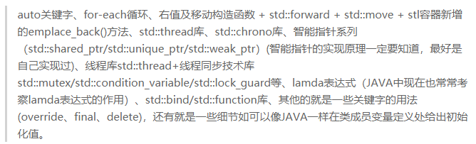

[TOC]

# C++ Monads

see nodejs summary.md -> C++ Monads

[FunctionalPlus](https://github.com/Dobiasd/FunctionalPlus)

- [install](https://github.com/Dobiasd/FunctionalPlus/blob/master/INSTALL.md)

- [vcpkg 包管理](https://github.com/microsoft/vcpkg/blob/master/README_zh_CN.md#%E5%BF%AB%E9%80%9F%E5%BC%80%E5%A7%8B-windows)

## [utfcpp u8string](https://github.com/nemtrif/utfcpp)

  > ```
  > // http://www.unicode.org/cgi-bin/GetUnihanData.pl?codepoint=中
  > 
  > /*
  > 中
  > Decimal	UTF-8	    UTF-16	UTF-32
  > 20013	    E4 B8 AD 	4E2D	00004E2D
  > 文
  > Decimal	UTF-8	    UTF-16	UTF-32
  > 25991	    E6 96 87 	6587	00006587
  > */
  > // 成功逐字符输出中文
  > // see nodejs sumarry.md -> C++ Monads
  > #include <fplus/fplus.hpp>
  > #include <iostream>
  > #include "src/utf8.h"
  > #include <string.h>
  > #include <iostream>
  > #include <string>
  > #include <fstream>
  > #include <vector>
  > using namespace std;
  > 
  > std::string str("中文");
  > for (auto it = str.begin(), it2 = str.begin(); it2 != str.end(); ) {
  > utf8::next(it2, str.end());
  > while (it < it2) {
  > cout << *it;
  > ++it;
  > }
  > cout << endl;
  > }
  > 
  > // 先转成 std::u32string 再用正则
  > std::string str2("中文");
  > std::vector<unsigned long> utf32result;
  > 	utf8::utf8to32(str2.begin(), str2.end(), std::back_inserter(utf32result));
  > 	size_t size1 = utf32result.size();
  > std::u32string strr(utf32result.begin(), utf32result.end());
  > cout << "all task done." << endl;
  > 
  > ```
  >
  > ```
  > inline std::wstring from_utf8(const std::string& utf8) {
  >  std::vector<unsigned long> utf32result;
  > 	utf8::utf8to32(utf8.begin(), utf8.end(), std::back_inserter(utf32result));
  > 	size_t size1 = utf32result.size();
  >  std::wstring wstr(utf32result.begin(), utf32result.end());
  >  return wstr;
  > }
  > 
  > inline std::string to_utf8(const std::wstring& ws) {
  >  std::string utf8;
  > 	utf8::utf16to8(ws.begin(), ws.end(), std::back_inserter(utf8));
  > 	return utf8;
  > }
  > 
  > int main()
  > {
  >  std::string test = "john.doe@神谕.com"; // utf8
  >  std::string expr = "[\\u0080-\\uDB7F]+"; // utf8
  > 
  >  std::wstring wtest = from_utf8(test);
  >  std::wstring wexpr = from_utf8(expr);
  > 
  >  std::wregex we(wexpr);
  >  std::wsmatch wm;
  >  if(std::regex_search(wtest, wm, we))
  >  {
  >      std::cout << to_utf8(wm.str(0)) << '\n';
  >  }
  > }
  > ```
  >
  > 

  


```powershell
New-Item -ItemType Directory -Path C:\src -Force
cd C:\src
git clone https://github.com/microsoft/vcpkg
.\vcpkg\bootstrap-vcpkg.bat
.\vcpkg\vcpkg.exe integrate install
.\vcpkg\vcpkg install fplus:x64-windows

--> C:/src/vcpkg/packages/fplus_x64-windows/share/fplus/copyright
fplus provides CMake targets:

    # this is heuristically generated, and may not be correct
    find_package(FunctionalPlus CONFIG REQUIRED)
    target_link_libraries(main PRIVATE FunctionalPlus::fplus)

```


```
# 源码安装
# win -> MINGW64 -> 右键 -> 管理员身份运行
git clone https://github.com/Dobiasd/FunctionalPlus
cmake -S FunctionalPlus -B FunctionalPlus/build && \
cmake --build FunctionalPlus/build && \
cmake --install FunctionalPlus/build
	# CPP Monads
	--> -- Installing: C:/Program Files (x86)/FunctionalPlus/include/fplus
	

```


```c++
#include <fplus/fplus.hpp>
#include <iostream>
using namespace std;

bool is_odd_int(int x) { return x % 2 != 0; }

int main(){
    typedef vector<int> Ints;
    Ints values = { 24, 11, 65, 44, 80, 18, 73, 90, 69, 18 };
    auto odds = fplus::keep_if(is_odd_int, values);
    std::cout << "done." << std::endl;
}
```


### regex

see nodejs summary.md C++ Monads

```

vcpkg install boost-regex[icu]:x64-windows
	# C:/src/vcpkg/packages/boost-regex_x64-windows
	# 成功安装
	#include "boost/regex.hpp"
	#include "boost/regex/icu.hpp"
	https://github.com/unicode-org/icu/releases 下载
		icu-cldr\icu4c\source\allinone
			# 有 vc 工程

// // Include the Boost regex header 
// #include <boost/regex.hpp> // Include other headers as needed 
// #include <iostream> 
// #include <string>

// int main() {

//     boost::regex reg("[\u3000-\u303f\u3040-\u309f\u30a0-\u30ff\uff00-\uff9f\u4e00-\u9faf\u3400-\u4dbf]+"); 

//     //boost::regex reg("(A.*)");

//     // Create a string that contains some Japanese characters 
//     std::string s = "This is a string with 日本語 characters."; 
//     // Create a regex object with the syntax option for ICU regex 
//     // boost::regex reg("/[\u3000-\u303f\u3040-\u309f\u30a0-\u30ff\uff00-\uff9f\u4e00-\u9faf\u3400-\u4dbf]+/", boost::regex::icu); 
//     // // Use regex_search to check if the string contains any Japanese characters 
//     // if (boost::regex_search(s, re)) {
//     //     std::cout << "The string contains Japanese characters.\n"; 
//     //     // Use regex_iterator to iterate over all the matches of the regex in the string 
//     //     boost::sregex_iterator it(s.begin(), s.end(), re); 
//     //     boost::sregex_iterator end; 
//     //     while (it != end) { 
//     //         // Print each match and its position in the string 
//     //         std::cout << "Match: " << it->str() << "\n"; 
//     //         std::cout << "Position: " << it->position() << "\n"; ++it; } 
//     //     } 
//     // else {
//     //     std::cout << "The string does not contain Japanese characters.\n"; 
//     // } 
//     return 0; 
// }
```


#### 成功提取中文

```
#include <iostream>
#include <vector>
#include <regex>

int main() {
    std::wstring str = L"aa中bb文";
    std::wregex pattern(L"[\\u4E00-\\u9FAF]+");
    std::wsregex_iterator it(str.begin(), str.end(), pattern);
    std::wsregex_iterator end;

    std::vector<std::pair<std::wstring, std::size_t>> chinese_substrings;
    while (it != end) {
        std::wstring substr = it->str();
        std::size_t pos = it->position();
        chinese_substrings.push_back(std::make_pair(substr, pos));
        ++it;
    }

    for (const auto& pair : chinese_substrings) {
        std::wcout << "中文子串: " << pair.first << ", 位置: " << pair.second << std::endl;
    }

    return 0;
}

```


```
#include <iostream>
#include <vector>
#include <regex>

int main() {
    std::wstring str = L"aa中bb文";
    std::wregex pattern(L"[\\u4E00-\\u9FAF]+");
    std::wsregex_iterator it(str.begin(), str.end(), pattern);
    std::wsregex_iterator end;

    std::vector<std::wstring> chinese_substrings;
    while (it != end) {
        chinese_substrings.push_back(it->str());
        ++it;
    }

    for (const auto& substr : chinese_substrings) {
        std::wcout << substr << std::endl;
    }

    return 0;
}

```


# vscdoe + MSVC

[VS Code for Microsoft C++](https://code.visualstudio.com/docs/cpp/config-msvc)

```
解决 vscode 调试窗口 utf8 显示乱码
win键 -> 设置 -> 时间和语言 -> 最右边"日期、时间和区域格式设置" 
  ->其他日期、时间和区域设置 ->区域 更改日期、时间或数字格式
  -> 管理 ->更改系统区域设置 ->Beta版:使用Unicode UTF-8提供全球语言支持


打开 Developer Command Prompt for VS 2019 命令行
在这个命令行运行 code ，会打开 vscode
打开目录 -> 打开文件t.cpp -> ctrl + shift + P -> 输入C++ 
  -> 选 C/C++:Debug C/C++File
  	# 会自动生成 task.json

{
    "tasks": [
        {
            "type": "cppbuild",
            "label": "C/C++: cl.exe build active file",
            "command": "cl.exe",
            "args": [
                "/Zi",
                "/EHsc",
                "/nologo",
                "/Fe${fileDirname}\\${fileBasenameNoExtension}.exe",
                "${file}"
            ],
            "options": {
                "cwd": "${fileDirname}"
            },
            "problemMatcher": [
                "$msCompile"
            ],
            "group": {
                "kind": "build",
                "isDefault": true
            },
            "detail": "Task generated by Debugger."
        }
    ],
    "version": "2.0.0"
}


```


[vscode使用visual studio编译工具MSVC构建C++工程](https://blog.csdn.net/qq_37429313/article/details/120588483)

```
ctrl + shift + x -> 输入 easy c
	# 安装 Easy C++ projects 插件

ctrl + shit + p -> 输入 c json
	# 会生成 c_cpp_properties.json

ctrl + shit + p -> 输入 easy -> 选新建工程
	# 选 x64 visual studio 2019
	# 会自动生成 .vscode 下的各种配置

```


```
# 自动生成的 build.bat 修改成这样
@echo off
if exist "C:\Program Files (x86)\Microsoft Visual Studio\2019\BuildTools\VC\Auxiliary\Build\vcvarsall.bat" (
    call "C:\Program Files (x86)\Microsoft Visual Studio\2019\BuildTools\VC\Auxiliary\Build\vcvarsall.bat" x64
) else (
    if exist "C:\Program Files (x86)\Microsoft Visual Studio\2019\Community\VC\Auxiliary\Build\vcvarsall.bat" (
        call "C:\Program Files (x86)\Microsoft Visual Studio\2019\Community\VC\Auxiliary\Build\vcvarsall.bat" x64
    ) else (
        call "C:\Program Files (x86)\Microsoft Visual Studio\2019\Enterprise\VC\Auxiliary\Build\vcvarsall.bat" x64
    )
)
set compilerflags=/Od /Zi /EHsc /std:c++latest /I include /I C:\src\vcpkg\packages\fplus_x64-windows\include
set linkerflags=/OUT:bin\main.exe
cl.exe %compilerflags% src\*.cpp /link %linkerflags%
del bin\*.ilk *.obj *.pdb
```


```
# 自动生成的(不是) main.cpp 修改成这样
#include <fplus/fplus.hpp>
#include <iostream>
using namespace std;

bool is_odd_int(int x) { return x % 2 != 0; }

int main(){
    typedef vector<int> Ints;
    Ints values = { 24, 11, 65, 44, 80, 18, 73, 90, 69, 18 };
    auto odds = fplus::keep_if(is_odd_int, values);
    std::cout << "done." << std::endl;
}
```


```
# 对比 MSYS32 MINGW64 或许可以改进一下
{
    "tasks": [
        {
            "type": "cppbuild",
            "label": "C/C++: g++.exe build active file",
            "command": "C:\\msys64\\ucrt64\\bin\\g++.exe",
            "args": [
                "-fdiagnostics-color=always",
                "-g",
                "${file}",
                "-o",
                "${fileDirname}\\${fileBasenameNoExtension}.exe",
                "-IC:\\Program Files (x86)\\FunctionalPlus\\include"
            ],
            "options": {
                "cwd": "${fileDirname}"
            },
            "problemMatcher": [
                "$gcc"
            ],
            "group": {
                "kind": "build",
                "isDefault": true
            },
            "detail": "Task generated by Debugger."
        }
    ],
    "version": "2.0.0"
}
```


## vcpkg

```
vcpkg install boost-regex[icu]:x64-windows
    # C:/src/vcpkg/packages/boost-regex_x64-windows
    # C:\src\vcpkg\packages\icu_x64-windows\include
    # C:\src\vcpkg\installed\x64-windows\bin
        # dll 在这，复制到 exe 同目录下成功运行，否则会出错
    # 成功安装
vcpkg install nlohmann-json
// see nodejs sumarry.md -> C++ Monads
// vcpkg.exe search boost
// vcpkg.exe install boost-regex
```


# vscode genie

[chatgpt-vscode](https://github.com/ai-genie/chatgpt-vscode)

[CopilotForXcode](https://github.com/intitni/CopilotForXcode)


# string

[utfcpp](https://github.com/nemtrif/utfcpp)


C++11 标准中增加了一些表示字符串常量的标识，如下有：

L"您好！"： wstring 字符串常量，使用文件保存编码方式字符集
R"(您 好 \n)": 原始字符串常量（字节数组），保留所有的字符
u8"您好！"： string 字符串常量（字节数组），使用 UTF8 进行编码保存


- UTF16编码中，英文字符占两个字节；绝大多数汉字（尤其是常用汉字）占用两个字节，个别汉字（在后期加入unicode编码的汉字，一般是极少用到的生僻字）占用四个字节。

- UTF8编码中，英文字符占用一个字节；绝大多数汉字占用三个字节，个别汉字占用四个字节。


```
json j = json::parse(u8"JSON string with Chinese characters");
// or
json j = json::parse(u8 R"(JSON string with Chinese characters)");
```


## 不转义


```c++
    // https://github.com/ReneNyffenegger/cpp-base64

    const std::string orig =
        "René Nyffenegger\n"
        "http://www.renenyffenegger.ch\n"
        "passion for data\n";

    // C++ 11 only, 不转义 $"(xxx)" 括号里的内容不转义，而且括号前后都可以有其它内容
    std::ifstream t(R"(D:\workcode\csharp\dll\Examples\DllExport\BasicExport\UnmanagedCppConsole\base64.txt)");
    std::stringstream buffer;
    buffer << t.rdbuf();


    std::string str_base64 = buffer.str(); 

    std::string encoded = base64_encode(reinterpret_cast<const unsigned char*>(orig.c_str()), orig.length());
    std::string decoded = base64_decode(encoded);
```


## wsring 转 utf8 string 

```
#include <codecvt>
std::wstring_convert<std::codecvt_utf8<wchar_t>> converter;
std::string first_ = converter.to_bytes(first);
```


# dict

```
#include <iostream>
#include <map>
#include <string>

int main() {
    std::map<std::string, int> my_dict = {{"apple", 1}, {"banana", 2}, {"orange", 3}};

    // 输出字典中的元素
    for (const auto &pair : my_dict) {
        std::cout << pair.first << ": " << pair.second << std::endl;
    }

    return 0;
}

```


```
#include <iostream>
#include <map>
#include <string>
#include <tuple>

int main() {
    std::map<std::string, std::tuple<int, std::string>> dict;

    // Adding values to the dictionary
    dict["key1"] = std::make_tuple(42, "value1");
    dict["key2"] = std::make_tuple(99, "value2");

    // Accessing values from the dictionary
    std::tuple<int, std::string> value1 = dict["key1"];
    std::cout << "Value for key1: " << std::get<0>(value1) << ", " << std::get<1>(value1) << std::endl;

    std::tuple<int, std::string> value2 = dict["key2"];
    std::cout << "Value for key2: " << std::get<0>(value2) << ", " << std::get<1>(value2) << std::endl;

    return 0;
}

```


```
#include <iostream>
#include <map>

int main() {
    std::map<int, std::string> myMap = {{1, "one"}, {2, "two"}, {3, "three"}};

    // 使用count()函数
    if (myMap.count(2) > 0) {
        std::cout << "Key exists!" << std::endl;
    } else {
        std::cout << "Key does not exist!" << std::endl;
    }

    // 使用find()函数
    auto it = myMap.find(4);
    if (it != myMap.end()) {
        std::cout << "Key exists!" << std::endl;
    } else {
        std::cout << "Key does not exist!" << std::endl;
    }

    return 0;
}

```


# tuple

```
std::vector<std::tuple<std::wstring, std::wstring, std::wstring>> three_part;

                                three_part.push_back(std::tuple<std::wstring, std::wstring, std::wstring>(first, second, third));


    std::vector<std::tuple<std::wstring, std::wstring, std::wstring>> three_part2 = _::filter<std::vector<std::tuple<std::wstring, std::wstring, std::wstring>>>(three_part, [&](const std::tuple<std::wstring, std::wstring, std::wstring>& value) {
        std::wstring first = std::get<0>(value);
        std::wstring second = std::get<1>(value);
        std::wstring third = std::get<2>(value);

        if (first != L"") {
            int a = 1;
        }

        return true;
    });
```


# Lambda

- `[&]`是一个捕获列表（capture list），表示以引用方式捕获所有外层作用域中的变量。


# file

##　read write

```
#include <iostream>
#include <fstream>

inline void write(std::string str)
{
    std::ofstream file;
    file.open("example.txt");

    if (file.is_open())
    {
        file << str;
        file.close();
    }
    else
    {
        std::cerr << "无法打开文件" << std::endl;
    }
}
```


## 遍历目录

```
/std:c++17 需要这个参数 传给 cl.exe
{
    "tasks": [
        {
            "type": "cppbuild",
            "label": "C/C++: cl.exe build active file",
            "command": "cl.exe",
            "args": [
                "/Zi",
                "/EHsc",
                "/nologo",
                "/std:c++17",
                "/I",
                "C:\\src\\vcpkg\\packages\\nlohmann-json_x86-windows\\include",
                "/Fe${fileDirname}\\${fileBasenameNoExtension}.exe",
                "${file}"
            ],
            "options": {
                "cwd": "${fileDirname}"
            },
            "problemMatcher": [
                "$msCompile"
            ],
            "group": {
                "kind": "build",
                "isDefault": true
            },
            "detail": "Task generated by Debugger."
        }
    ],
    "version": "2.0.0"
}
```


# JSON

[json](https://github.com/nlohmann/json)

[Chinese character ](https://github.com/nlohmann/json/issues/2325)

```
vcpkg install nlohmann-json
```


## string 比较的坑


```
std::wstring type = se["type"];
        type.pop_back(); // 它存了一个 \0 在最后，删掉最后一个字符才能比较
        std::wstring tmp = L"jp";
        if (type == tmp)
        { // need seg
            int a = 1;
        }
```


# csv

[rapidcsv](https://github.com/d99kris/rapidcsv)

```
# 没有 heard 的 csv 这样读

#include <iostream>
#include <vector>
#include "rapidcsv.h"

rapidcsv::Document doc("Book1.csv", rapidcsv::LabelParams(-1, -1)); // No Headers
            std::vector<std::string> close = doc.GetColumn<std::string>(0);
            # 取第 0 列
```


# windows


## dll


Unicode 字符集会调用失败

 **注意：常规 -> 高级 ->  使用多字节字符集**


### C++ 调用 node.dll


```

// C++ 调用 node.dll

#include <iostream>

#include "windows.h"

int main()
{
    HINSTANCE   ghDLL = NULL;
    ghDLL = LoadLibrary("D:\\GitHub\\node-14.21.1\\out\\Debug\\node.dll");

    typedef int (_cdecl* FunctionPtr) (int argc, wchar_t* wargv[]);

    FunctionPtr wmain;

    wmain = (FunctionPtr)GetProcAddress(ghDLL, "wmain");

    int argc = 2;

    wchar_t* wargv[] = {
      (wchar_t*)L"C:\\projects\\edge-js\\tools\\build\\node-14.21.1\\out\\Debug\\node2.exe",
      (wchar_t*)L"C:\\projects\\edge-js\\tools\\build\\node-14.21.1\\out\\Debug\\pmserver\\server.js",
      nullptr
    };

    wmain(argc, wargv);

    std::cout << "Hello World!\n";
}
```


### C# 调用 node.dll


````

// C# 调用 node.dll

using System.Runtime.InteropServices;

namespace ConsoleApp2
{
    class Program
    {
        [DllImport("user32.dll", EntryPoint = "MessageBoxA")]
        public static extern int MsgBox(int hWnd, string msg, string caption, int type);

        // 定义给 C# 的传参，全部参数都定义在这个结构数组里
        [StructLayout(LayoutKind.Sequential, CharSet = CharSet.Ansi)]
        public struct wmain_params
        {
            [MarshalAs(UnmanagedType.ByValArray, SizeConst = 3)]
            public string[] wargv;  // 大小固定为 3 个元素，最后一个元素设置为空指针，表示结束
        }
        [DllImport("D:\\GitHub\\node-14.21.1\\out\\Debug\\node.dll", EntryPoint = "wmain", CallingConvention = CallingConvention.Cdecl, CharSet = CharSet.Ansi)]
        public static extern int wmain(int argc,  ref wmain_params wargv);


        static void Main(string[] args)
        {

            wmain_params pms = new wmain_params();
            pms.wargv = new string[] {
                "C:\\projects\\edge-js\\tools\\build\\node-14.21.1\\out\\Debug\\node2.exe",
                "C:\\projects\\edge-js\\tools\\build\\node-14.21.1\\out\\Debug\\pmserver\\server.js",
                null
            };

            wmain(2, ref pms);


            MsgBox(0, "C#调用DLL文件", "这是标题", 0x30);
        }
    }
}
````


### stdcall

```
#pragma comment(lib, "FreeImage.lib")

https://github.com/node-ffi/node-ffi/blob/master/example/factorial/factorial.c

#include <stdint.h>
#if defined(WIN32) || defined(_WIN32)
#define EXPORT __declspec(dllexport)
#else
#define EXPORT
#endif
EXPORT uint64_t factorial(int max) {
    int i = max;
    uint64_t result = 1;
    while (i >= 2) {
        result *= i--;
    }
    return result;
}  


var FFI = require('ffi');
var hi = new FFI.Library('hi', {
   'factorial': [
      'int32', ['int32']
   ]
});
console.log ( hi.factorial(3) );

原因：win7下的64位系统，在运行程序的时候，需要的DLL必须是64位系统编译的，VS2010也必须在安装的时候，选择了32位编译的支持。如果安装的时候，已经选择了，那么出现该问题的解决办法：

      （1）右键项目名，点击属性，弹出项目属性页，找到链接器----高级，修改右侧的目标计算机，选择有X64的那个选项。

      （2）右键项目名，选择清理解决方案，清理完之后选择X64平台编译器，然后重新生成解决方案，便可以调试成功。选择X64平台编译器如下图：


```


### _cdecl

```


extern "C" __declspec(dllexport)  int __cdecl reconize(char * imageFileName, char * p, int numOfTest, int numOfOption, double rate, unsigned int brightness) {


calldll
int dll() {
    typedef int(_cdecl*FunctionPtr)(char * imageFileName, char * p, int numOfTest, int numOfOption, double rate, unsigned int brightness);
    //typedef int(_stdcall*FunctionPtr)(char * imageFileName, char * p, int numOfTest, int numOfOption, double rate, unsigned int brightness);
    
    //reconize(char * imageFileName, char * p, int numOfTest, int numOfOption, double rate, unsigned int brightness);
    char *imageName = "IMG_0167.JPG";
    char *fileName = "hi.txt";
    char *buf = (char*)malloc(1024*1024*3);
    memset(buf, 0, 1024 * 1024 * 3);
    HINSTANCE   ghDLL = NULL;
    FunctionPtr   reconize;
    ghDLL = LoadLibrary("rec32160622.dll");
    ASSERT(ghDLL != NULL);
    reconize = (FunctionPtr)GetProcAddress(ghDLL, "reconize");
    ASSERT(reconize != NULL);
    //reconize(imageName, buf);
    reconize("IMG_1119.jpg", buf, 100, 4, 0.4, 125);
    //dataWrite(fileName, buf, strlen(buf));
    //fprintf(stdout, buf);
    printf("done.");
    free(buf);
    getchar();
    return 0;
} 


2)_cdecl调用
   _cdecl是C/C++的缺省调用方式，参数采用从右到左的压栈方式，由调用者完成压栈操作 ，传送参数的内存栈由调用者维护。
   _cedcl约定的函数只能被C/C++调用，每一个调用它的函数都包含清空堆栈的代码，所以产生的可执行文件大小会比调用_stdcall函数的大。
   按C编译方式，_cdecl调用约定仅在输出函数名前面加下划线，形如_functionname。
   按C++编译方式，可参看（三）


 
```


[语法糖](https://www.zhihu.com/question/298981020)

```c++
std::tuple<int,string> nextToken(){
    return {4,"fallthrough"};
}
auto[tokenType,lexeme] = nextToken();
```


vscode configure

```
{
    "version": "0.2.0",
    "configurations": [
        {
            "name": "(gdb) Launch",
            "type": "cppdbg",
            "request": "launch",
            "program": "${workspaceFolder}/build/textrank",
            "args": ["/home/ubuntu/workcode/gitlab/cpp/textrank-master/data/abc.txt", "1", "2", "./out.txt"],
            "stopAtEntry": false,
            "cwd": "${workspaceFolder}",
            "environment": [],
            "externalConsole": false,
            "MIMode": "gdb",
            "setupCommands": [
                {
                    "description": "Enable pretty-printing for gdb",
                    "text": "-enable-pretty-printing",
                    "ignoreFailures": true
                }
            ]
        }
    ]
}
```


https://launchpad.net/~codeblocks-devs/


[string](https://github.com/chenshuo/recipes/blob/master/string/StringTrivial.h)


```python
 // In C++11, this is unifying assignment operator
  String& operator=(String rhs) // yes, pass-by-value
  {
    // http://en.wikibooks.org/wiki/More_C++_Idioms/Copy-and-swap
    swap(rhs);
    return *this;
  }

  // C++11 move-ctor
  String(String&& rhs) noexcept
    : data_(rhs.data_)
  {
    rhs.data_ = nullptr;
  }

  /* Not needed if we have pass-by-value operator=() above,
   * and it conflits. http://stackoverflow.com/questions/17961719/
  String& operator=(String&& rhs)
  {
    swap(rhs);
    return *this;
  }
  */
```


sudo add-apt-repository ppa:codeblocks-devs/release

sudo apt update

sudo apt install codeblocks codeblocks-contrib


sudo add-apt-repository --remove ppa:codeblocks-devs/release

sudo apt remove --autoremove codeblocks codeblocks-contrib


右值引用（&&），move语义（std::move）和完美转发（std::forward<T>(t)）啦

nullptr

lambda表达式（匿名函数对象）

类的非静态成员在声明时赋值

auto_ptr 被弃用，应使用 unique_ptr

C 语言风格的类型转换被弃用，应该使用 static_cast、reinterpret_cast、const_cast 来进行类型转换

快速组装一个函数对象的bind绑定器

新增了一个容器——元组（tuple）

线程库第一次被纳入到标准库中

时间日期库——chrono

模板的>>中间不需要加空格了





xcode + cpp11

 Build Settings  -> C++ Language Dialect ->select c++11

-std=c++11

clang -std=c++98 -pedantic-errors


## C# interop


```
# 成功调用，就是只支持 .net 4.5
# https://github.com/3F/DllExport
PEModule ClassLibrary1(_T("ClassLibrary1.dll")); // 定义函数 origin, 返回int ，参数int
double re = ClassLibrary1.call<int>("origin", 5);
```


```
# C 分配的内存只能由自已释放，C# 不可以

# C#
IntPtr pout = Simhash256.simhash256();

            var hs = Marshal.PtrToStringUTF8(pout);
            Marshal.FreeHGlobal(pout);
            
        class Simhash256
        {

            [DllImport("simhash256.dll")]
            public static extern IntPtr simhash256();
        }
 
 # C
 
 #include <inttypes.h>
#include <stdint.h>
#include <stdio.h>
#include <stdlib.h>

__declspec(dllexport) void* simhash256() { // uint8_t* input, size_t number_of_bytes
    //uint64_t hash_1, hash_2, hash_3, hash_4;
    //simple_simhash(input, number_of_bytes, &hash_1, &hash_2, &hash_3, &hash_4);
    char* out = (char*)malloc(128);
    sprintf_s(out, 128, "%s", "hello, wrold!\n");
    //free(out);
    //sprintf_s(out, 128, "%16.16" PRIx64 "-%16.16" PRIx64 "-%16.16" PRIx64 "-%16.16"
    //    PRIx64 "\n", hash_1, hash_2, hash_3, hash_4);
    return (void*)out;
}

int main() {

    simhash256();
    //free(pout);
}
        
        
```


```C#
# https://www.cnblogs.com/s5689412/p/12773177.html
static string PtrToStringUTF8(IntPtr ptr)
{
    var bytesCount = 0;
    byte b;
    do
    {
        b = Marshal.ReadByte(ptr, bytesCount);
        bytesCount++;
    }
    while (b != 0);
    var bytes = new byte[bytesCount - 1];
    Marshal.Copy(ptr, bytes, 0, bytesCount - 1);
    return Encoding.UTF8.GetString(bytes);
}


byte[] bytes = new byte[4096];
GCHandle pinned = GCHandle.Alloc(bytes, GCHandleType.Pinned);
var result = iReadXXX(pinned.AddrOfPinnedObject());
pinned.Free();
int count = bytes.ToList().FindIndex(b => b == 0);
var text = Encoding.Default.GetString(bytes, 0, count);

```


```
// Unmanaged Signature
int MessageBoxEx(
    HWND hWnd,
    LPCTSTR lpText,
    LPCTSTR lpCaption,
    UINT uType,
    WORD wLanguageId);
    
[DllImport("User32.dll", CharSet = CharSet.Unicode)]
[return: MarshalAs(UnmanagedType.I4)]
static extern Int32 MessageBoxEx
    (IntPtr hWnd,
    // Marshaling as Unicode characters
    [param: MarshalAs(UnmanagedType.LPTStr)]
    String lpText,
    // Marshaling as Unicode characters
    [param: MarshalAs(UnmanagedType.LPTStr)]
    String lpCaption,
    // Marshaling as 4-bytes (32-bit) unsigned integer
    [param: MarshalAs(UnmanagedType.U4)]
    UInt32 uType,
    // Marshaling as 2-bytes (16-bit) unsigned integer
    [param: MarshalAs(UnmanagedType.U2)]
    UInt16 wLanguageId);    
  
```


```C++

#include <inttypes.h>
#include <stdint.h>
#include <stdio.h>
#include <stdlib.h>

__declspec(dllexport) void simhash256(void* input, size_t number_of_bytes, uint64_t* hash256, void* buffer) { // uint8_t* input, size_t number_of_bytes
    uint64_t hash_1, hash_2, hash_3, hash_4;

    simple_simhash((uint8_t*)input, number_of_bytes, &hash256[0], &hash256[1], &hash256[2], &hash256[3]);
    sprintf_s((char*)buffer, 128, "%16.16" PRIx64 "-%16.16" PRIx64 "-%16.16" PRIx64 "-%16.16"
        PRIx64, hash256[0], hash256[1], hash256[2], hash256[3]);
}

int main() {

    uint8_t input[] = "0123456789";

    char buffer[128] = { 0 };
    char buf[128] = { 0 };
    uint64_t hash256[] = { 0, 0, 0, 0 };

    simhash256(input, strlen(input), hash256, buffer);

    sprintf_s((char*)buf, 128, "%16.16" PRIx64 "-%16.16" PRIx64 "-%16.16" PRIx64 "-%16.16"
        PRIx64 "\n", hash256[0], hash256[1], hash256[2], hash256[3]);

}

```


### 指针

```
https://docs.microsoft.com/en-us/dotnet/csharp/language-reference/operators/pointer-related-operators


```


## C# call C++


```
https://github.com/xanatos/CSharpCPlusPlusInteropSamples
```


## dll 注入进程

- https://github.com/AYIDouble/Simple-DLL-Injection


# Dictionary


```c++
map<string, vector<string> > sentence_token_map;  // key: sentence  value: words 
sentence_token_map.begin()->first
```


# List


```cpp
    // mapStudent.insert(pair<int, string>(1, "student_one"));
    // vector添加数据的缺省方法是push_back()  

    map<string, vector<string> > senten_words;
    vector<string> words;
    //senten_words.insert(make_pair(sent_vec[i], bigram_vec));
```


pair 是有first, second两个成员变量的结构体  


std::pair<std::string, double>("This is a StringTest0.", 9.7);

std::make_pair("This is a StringTest.", 9.9);  


[textrank c++](https://github.com/lostfish/textrank)


```cpp
    map<string, vector<string> > senten_words;
    senten_words.insert(std::pair<string, vector<string> >( "a b c",  vector<string>({"a", "b", "c"}) ) );
    senten_words.insert(std::pair<string, vector<string> >( "a b c",  vector<string>({"a", "b", "c"}) ) );
    senten_words.insert(std::pair<string, vector<string> >( "a b c",  vector<string>({"a", "b", "c"}) ) );
    
    vector<pair<string, double> > great_sents;
    SentenceRank rank(3, 100, 0.85, 0.0001);
    
    rank.ExtractKeySentence(senten_words, great_sents, 2);
```


# OpenCV

- https://mp.weixin.qq.com/s?__biz=MzA4ODgyMDg0MQ==&mid=100001057&idx=1&sn=ebfd3cf30ffb3a48909bd309fa59f82d&chksm=1025182727529131c5c63d02663bfc517b89c23f4884c4d49334fee27d12947b792e9b36643f#rd
  - 面对直线，你说霍夫线变换是万能的吗

```

#include <iostream>
#include <opencv2/opencv.hpp>

using namespace std;
using namespace cv;

int main()
{
  Mat srcImage, dstImage, binaryImage;
  srcImage = imread("原图.png",0);  
  imshow("原图", srcImage);
  
  waitKey(0);
  return 0;
}
```


