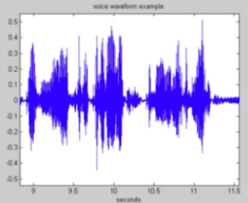

TOC

[(01)言語学入門　CH1　音声学と音韻論(1) .md]()  

[ipa-chart-with-sounds-version-3 IPA图表带发音](https://www.internationalphoneticalphabet.org/ipa-sounds/ipa-chart-with-sounds-version-3/)

/Users/XXX/Library/Caches/Google/Chrome/Default/Cache  找到缓存的mp3文件

[ipa在线输入](https://ipa.typeit.org/full/)  

[日语国际音标标注](https://easypronunciation.com/)  

[汉语语法](《魏晋南北朝文与汉文佛典语言比较研究》陈秀兰)

[微信知乎Markdonw排版工具  React Markdown编辑器](https://github.com/mdnice/markdown-nice)  

[粤语发音词典](http://www.yueyv.com/)

[粤语U学院]()   

[粤日英法国际音标转换](https://easypronunciation.com/zh/japanese-kanji-to-romaji-converter)  

[日英词典](https://jisho.org/)

[美国英语应用语音学.桂灿昆 第九章]()  

[谢孟媛文法视频课程讲义]()  

[English Grammar in Use]() 

[Speech and Language Processing-Daniel Jurafsky, James H. Martin (2008)]()

# 声音的表示方式

## 波形 ( waveform )

## 频谱

## 语谱图

# 不同元音辅音在声音频谱的表现是什么样子？

首先,鄙人是语音学的盲人,但对语音学很有兴趣,遂脑子中想到了几个问题:
1.为什么频声音频率波线(speech frequency waveform)是一段段的三角形?

2.除了音色泛音以外,说话声音的音高只是单纯的一个频率吗?网上有说是一个,有说是几个频率构成的,真把我弄糊涂了。

3.不同元音表现形式为什么只通过f1和f2就可以确定?那么辅音呢?不同形式的辅音在频谱中的表现有固定或可参考的模型吗?这里突然有一个比较好玩的念头,比如汉语辅音t和sh,是两种听起来不同的辅音,那在频谱表现中,这种不同是怎么展现的,我现在弄不懂频谱到底是根据什么绘出的,频谱中t表现的波浪和sh表现的间隔我随便画条波浪线,自然界一定会有那种声音吗?t和sh之间的音是什么?

[作者：王赟 Maigo](https://www.zhihu.com/question/27126800/answer/35376174)

1.没有“frequency waveform”这种东西。声音最直接的表示方式是**波形**，英文叫**waveform**，就是你贴的左边那张图。另外两种表示方式（频谱和语谱图）下文再说。波形的横轴是时间（所以波形也叫声音的**时域**表示），纵轴的含义并不重要，可以理解成位移（声带或者耳机膜的位置）或者压强。

当横轴的分辨率不高的时候，语音的波形看起来就是像你贴的图中一样，呈现一个个的三角形。这些三角形的轮廓叫作波形的**包络**（**envelope**）。包络的大小代表了声音的响度。一般来说，每一个音节会对应着一个三角形，因为一般地每个音节含有一个元音，而元音比辅音听起来响亮。但例外也是有的，比如：1) 像/s/这样的音，持续时间比较长，也会形成一个三角形；2) 爆破音（尤其是送气爆破音，如/p/）可能会在瞬时聚集大量能量，在波形的包络上就体现为一个脉冲。

下面这张图中上方的子图，是我自己读单词pass /pæs/的录音。它的横坐标已经被我拉开了一些，但其实这个波形是由两个“三角形”组成的。0.05秒处那个小突起是爆破音/p/，0.05秒到0.3秒是元音/æ/，0.3到0.58秒是辅音/s/。

如果你把横轴的分辨率调高，比如只观察0.02s秒甚至更短时间内的波形，你就可以看到波形的**精细结构**（**fine structure**），像上图的下面两个子图。波形的精细结构可能呈现两种情况：一种是有周期性的，比如左边那段波形（图中显示了两个周期多一点），这种波形一般是元音或者辅音中的鼻音、浊擦音以及/l/、/r/等；另一种是乱的，比如右边那段波形，这种波形一般是辅音中的清擦音。辅音中的爆破音，则往往表现为一小段静音加一个脉冲（如pass开头的/p/）。

\2. 看完了声音的**时域**表示，我们再来看它的**频域**表示——**频谱**（**spectrum**）。它是由一小段波形做傅里叶变换（Fourier transform）之后取模得到的。注意，必须是一小段波形，太长了弄出来的东西（比如你贴的右边的图）就没意义了！这样的一小段波形（通常在0.02~0.05s这样的数量级）称为一**帧**（**frame**）。下面是我读的pass的波形中，以0.17s和0.4s为中心截取0.04s波形经傅里叶变换得到的频谱。频谱的横轴是频率；我录音的采样率用的是16000 Hz，频谱的频率范围也是0 ~ 16000 Hz。但由于0 ~ 8000 Hz和8000 ~ 16000 Hz的频谱是对称的，所以一般只画0 ~ 8000 Hz的部分。

频谱跟波形一样，也有包络和精细结构。你把横轴压缩，看到的就是包络；把横轴拉开，看到的就是精细结构。我上面这两张图使得二者都能看到。

第一个频谱是元音/æ/的频谱，可以看到它的精细结构是有周期性的，每隔108 Hz出现一个峰。从这儿也可以看出来，语音不是一个单独的频率，而是由许多频率的简谐振动叠加而成的。第一个峰叫**基音**，其余的峰叫**泛音**。第一个峰的频率（也是相邻峰的间隔）叫作**基频**（**fundamental frequency**），也叫**音高**（**pitch**），常记作![[公式]](https://www.zhihu.com/equation?tex=f_0)。有时说“一个音的频率”，就是特指基频。基频的倒数叫**基音周期**。你再看看上面元音/æ/的波形的周期，大约是0.009 s，跟基频108 Hz吻合。频谱上每个峰的高度是不一样的，这些峰的高度之比决定了**音色**（**timbre**）。不过对于语音来说，一般没有必要精确地描写每个峰的高度，而是用“**共振峰**”（**formant**）来描述音色。共振峰指的是包络的峰。在我这个图中，忽略精细结构，可以看到0~1000 Hz形成一个比较宽的峰，1800 Hz附近形成一个比较窄的峰。共振峰的频率一般用![[公式]](https://www.zhihu.com/equation?tex=f_1)、![[公式]](https://www.zhihu.com/equation?tex=f_2)等等来表示。上图中，![[公式]](https://www.zhihu.com/equation?tex=f_1)是多少很难精确地读出来，但![[公式]](https://www.zhihu.com/equation?tex=f_2+%5Capprox+1800+%5Ctext%7BHz%7D)。当然，在2800 Hz、3800 Hz、5000 Hz处还有第三、四、五共振峰，但它们与第一、二共振峰相比就弱了许多。除了元音以外，辅音中的鼻音、浊擦音以及/l/、/r/等也具有这种频谱，可以讨论基频和共振峰频率（不过浊擦音一般不讨论共振峰频率）。

第二个频谱是辅音/s/的频谱。可以看出它的精细结构是没有周期性的，所以就无所谓**基频**。一般也不提这种频谱的**共振峰**。清擦音的频谱一般都是这样。

2.5 在回答你的第三个问题之前，我们先来看一下声音的第三种表示方式——**语谱图**（**spectrogram**）。上面说过，频谱只能表示一小段声音。那么，如果我想观察一整段语音信号的频域特性，要怎么办呢？我们可以把一整段语音信号截成许多帧，把它们各自的频谱“竖”起来（即用纵轴表示频率），用颜色的深浅来代替频谱强度，再把所有帧的频谱横向并排起来（即用横轴表示时间），就得到了语谱图，它可以称为声音的**时频域**表示。下面我就偷懒，不用Matlab自己画语谱图，而用Cool Edit绘制上面“pass”的语谱图，如下：

注意横轴是时间，纵轴是频率，颜色越亮代表强度越大。可以观察一下0.17s和0.4s处，是不是跟我上面画的频谱相似？然后再试着从这张语谱图上读出元音/æ/的第二共振峰频率。

语谱图的好处是可以直观地看出共振峰频率的变化。我上面读的“pass”中只有一个单元音，如果有双元音就会非常明显了。比如下面这张我读的“eye” /aɪ/，可以非常明显地看出在元音从/a/向/ɪ/过渡的阶段（0.2 ~ 0.25s），![[公式]](https://www.zhihu.com/equation?tex=f_1)在降低，而![[公式]](https://www.zhihu.com/equation?tex=f_2)在升高。

\3. 元音与共振峰的关系已经研究得比较透彻了，简单地说：
1) 开口度越大，![[公式]](https://www.zhihu.com/equation?tex=f_1)越高；
2) 舌位越靠前，![[公式]](https://www.zhihu.com/equation?tex=f_2)越高；
3) 不圆唇元音的![[公式]](https://www.zhihu.com/equation?tex=f_3)比圆唇元音高。
例如，/ɑ/是开、后、不圆唇元音，所以![[公式]](https://www.zhihu.com/equation?tex=f_1)高，![[公式]](https://www.zhihu.com/equation?tex=f_2)低，![[公式]](https://www.zhihu.com/equation?tex=f_3)高；/y/（即汉语拼音的ü）是闭、前、圆唇元音，所以![[公式]](https://www.zhihu.com/equation?tex=f_1)低，![[公式]](https://www.zhihu.com/equation?tex=f_2)高，![[公式]](https://www.zhihu.com/equation?tex=f_3)低。
也许题主见过下图那样的元音图（vowel chart），我把![[公式]](https://www.zhihu.com/equation?tex=f_1)和![[公式]](https://www.zhihu.com/equation?tex=f_2)的变化方向标了上去。

![[公式]](https://www.zhihu.com/equation?tex=f_3)最明显的体现其实是在英语的辅音/r/中，例如下面我读的erase /ɪ'reɪz/的语谱图，可以看到辅音/r/处（0.19s左右）![[公式]](https://www.zhihu.com/equation?tex=f_3)明显低，把![[公式]](https://www.zhihu.com/equation?tex=f_2)也压下去了。

清擦音可以根据能量集中的频段来分辨。下面是我读的/f/, /θ/, /s/, /ʃ/的语谱图。浊擦音会在清擦音的基础上有周期性的精细结构。

爆破音的爆破时间很短，在语谱图上一般较难分辨。

题主问的“两个音之间的音是什么样子”，就要分情况讨论了。
1) 如果是两个元音，那么可以在元音图上找到两个元音，取它们连线的中点。这对应着把![[公式]](https://www.zhihu.com/equation?tex=f_1)、![[公式]](https://www.zhihu.com/equation?tex=f_2)分别取平均。
2) 如果是两个清擦音，那么可以把它们的频谱取平均，这样听起来应该是个四不像（后来我做了实验，结果见这里：[Mixture of Unvoiced Fricatives](https://link.zhihu.com/?target=http%3A//maigoakisame.github.io/fricative-mix/)）。
3) 楼主提到的/t/和/ʃ/属于不同类型的辅音，很难定义它们“之间”是什么东西。