[TOC]


# TextRank Summary

[z](https://zhuanlan.zhihu.com/p/126733456) [g](https://ansvver.github.io/pagerank_and_textrank.html) [g](https://zouzhitao.github.io/posts/pagerank/) [j](https://www.jianshu.com/p/f6d66ab97332)

[The Google Pagerank Algorithm and How It Works](https://www.cs.princeton.edu/~chazelle/courses/BIB/pagerank.htm)

[浅入浅出：PageRank算法](https://www.letianbiji.com/machine-learning/page-rank.html)

[关键字提取算法TF-IDF和TextRank（python3）————实现TF-IDF并jieba中的TF-IDF对比，使用jieba中的实现TextRank](https://www.cnblogs.com/Micang/p/10366954.html)

[TextRank Keyword Extraction](https://yam.gift/2020/03/21/Paper/2020-03-21-Text-Rank)

[TextRank 代码使用Scala编写](https://github.com/STHSF/TextRank)

[基于TextRank的中文摘要工具](http://jayveehe.github.io/2016/05/11/da_textrank/)


**TFIDF 仅考虑了词频的统计信息，没有考虑词之间的关联信息**

与TF-IDF需要在语料库上计算IDF(**逆文档频率**)不同，TextRank利用一篇文档内部的词语间的共现信息(语义)便可以抽取关键词。

关键思想都是重要性传递

假如两个词的距离小于预设的距离，那么就认为这两个词间存在语义关系，否则不存在。这个预设的距离在TextRank算法中被称为同现窗口（co-occurance window）。这样便可构建出一个词的图模型。

**幂法求特征向量与初始值无关**。具体做法就是，先给每个网页随机附一个初值，然后通过迭代计算直至收敛，理论证明了收敛的值与初始值无关

实现的一个关键点在于构建词的图模型

另外一个实现关键点就是判断算法是否收敛，可以认为前后两次计算出来的值小于指定的阈值（一般取值较小，如0.000001）时算法收敛，或者超过设定的最大迭代次数时停止


这个图可以是有向图，也可以是无向图。在有向图中，方向为语料中的行文方向，也可是这个方向的反方向（在刘知远老师的博士论文中，是这样构建有向图的：在每个滑动窗口中，将该窗口中的第一个词指向剩余的其他词）；在无向图中，节点入度等于出度，所以公式中链接到V(i)的点集就是与V(i)相连的点，V(j)链接出去的点集就是V(j)与相连的点。
图中的边可以有权值，也可以没有权值。没有权值的话，和PageRank公式基本一致了；如果有权值，这个权值可以是两个候选词共现的次数，也可以是两个候选词的相关度，总之可以自己定义。
滑动窗口不是越大越好。在算法提出者论文展示的实验中，滑动窗口为2时的无向图，效果最好。
所谓收敛，就是有一个阈值，节点权重更新大小（原值与更新后值的差）不超过这个阈值时就是收敛状态，整个图收敛就是所有点都达到收敛状态。


TextRank采用图的思想，将文档中的词表示成一张无向有权图，词为图的节点，词之间的联系紧密程度体现为图的边的权值。

有A B C D E五个词，词之间的关系使用边连接起来，词之间连接的次数作为边的权值。比如：A和C一起出现了2次，则其边的权重为2,A与B/C/E都有联系，而D仅与B有联系。词的权重等价于计算图中节点的权重。**提取关键字，等价于找出图中权重排名TopK的节点**。


（巴尔宾认为一篇文章的第二句比第一句更重要，因为很多作家都习惯到第二句话引入关键点）备注：用段落效果会怎样？ ***文章标题与文章内容的关系，***句子是否包含标题词，根据句子中包含标题词的多少来打分。 ***句子关键词打分，***文本进行预处理之后，按照词频统计出排名前10的关键词，通过比较句子中包含关键词的情况，以及关键词分布的情况来打分（sbs，dbs两个函数）


想要知道一个人怎么样，看他的朋友怎么样。箭头表示愿意和他“做朋友”


### PageRank的目的

- **判断网页的重要性**
  
  > 在已知网页互相链接方式的情况下**判断网页的重要性**。如果A和B中含有相同的关键字，而A的重要性高于B，那么搜索这个关键字的结果中网页A应该放在网页B之前

- 重要的网页，搜索结果排名靠前，优先展示

#### 最简模型

1. 每个人的**重要性必须要靠别人赏赐**
   - 开始时每个人都有重要性1 可以均匀地分给别人
2. 每个人赏赐给别人的时侯**必须均分自已的重要性**

3. 每个人的重要性必须迭代计算，最终收敛到一个稳定值

- 存在的问题
  - 某些情况重要性没法计算（比如仅存在B、C指向A这样的指向关系时。如下图2）
  - 多次迭代后结果最终收敛到0

#### 修正模型

2. 每个人的**重要性必须要靠别人赏赐**
   - 开始时每个人都有重要性1，可以均匀地分给别人，但是别人只能收到其中的85%(阻尼系数d=0.85)
   - 相当于捐赠的时侯有一部分钱被抽税了
3. 每个人重要性等于(1-0.85)加上0.85*别人均分过来的重要性之和
4. 每个人的重要性必须迭代计算，最终收敛到一个稳定值


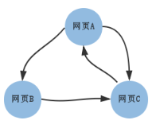

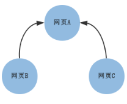


### 重要性方程组写成矩阵

```
PR(A) =   0 * PR(A) + 0 * PR(B) + 1 * PR(C)
PR(B) = 0.5 * PR(A) + 0 * PR(B) + 0 * PR(C)
PR(C) = 0.5 * PR(A) + 1 * PR(B) + 0 * PR(C)
```
  - PR = PageRank
  - PR(A) 、PR(B)、PR(C)  初值都是1


### 修正版本的PageRank

- 引入了0和1之间的**阻尼系数**d

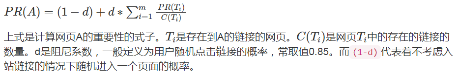

- **A的重要性 = 0.15 + 0.85 * 其他所有人分给A的重要性之和**

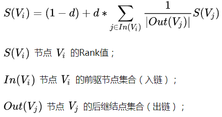

- 按第二个公式表达，图1 的i 的上界是3，有A、B、C 三个节点
  - V1 = A, V2 = B, V3 = C
- j 的取值是除i 以外的值
  - In(Vi) 是**指向**Vi 的结点，Out(Vj) 是Vj **指向**的结点
- vj 是指向vi 的结点, j != i ，**指向它既是给它贡献重要性**
- |out(Vj)| 是结点vj **指向其他结点的箭头总数**

- S(Vj)  是结点Vj 的**重要性**  S(Vj)=PR(Vj) = PageRank(Vj)


#### 修正版的方程组

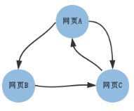

##### 图1 的计算

```
初始化：
	PR(A) = PR(B) = PR(C) = 1

第一轮计算：
	PR(A) = 0.15 + 0.85 * (   0 * PR(A) + 0 * PR(B) + 1 * PR(C) )
	PR(B) = 0.15 + 0.85 * ( 1/2 * PR(A) + 0 * PR(B) + 0 * PR(C) )
	PR(C) = 0.15 + 0.85 * ( 1/2 * PR(A) + 1 * PR(B) + 0 * PR(C) )
```

- A分到了C 的百分百，
- B 分到了A的1/2，因为A 均分给了两个人，B和C

- C 分到了A的1/2，B的百分百


##### Mathematica 实现迭代100 次的结果：

```
Nest[ Transpose[{{0,1/2,1/2},{0,0,1},{1,0,0}}].# 0.85 +c&,PR,100]//MatrixForm
```

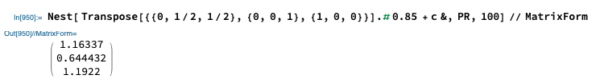


##### 图2 的计算

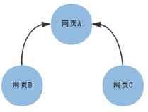

```
初始化：
	PR(A) = PR(B) = PR(C) = 1

第一轮计算：
	PR(A) = 0.15 + 0.85 * ( 0 * PR(A) + 1 * PR(B) + 1 * PR(C) )
	PR(B) = 0.15 + 0.85 * ( 0 * PR(A) + 0 * PR(B) + 0 * PR(C) )
	PR(C) = 0.15 + 0.85 * ( 0 * PR(A) + 0 * PR(B) + 0 * PR(C) )
```

- A分到了B 的百分百,  C 的百分百
- B 什么也没有分到

- C 什么也没有分到

这种情况下第一轮计算就决定最终结果了。最终收敛值是：

```plain
A = 0.4050
B = 0.15
C = 0.15
```

Mathematica 实现迭代3 次的结果：
```
PR={{1},{1},{1}};
W= {{0,0,0},{1,0,0},{1,0,0}}//Transpose;
c = {{0.15},{0.15},{0.15}};
Nest[W.# 0.85 +c&,PR,3]//MatrixForm (* Applying Functions Repeatedly *)
```

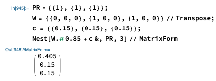

###### 图2看作无向图（等价于双向图）


```
初始化：
	PR(A) = PR(B) = PR(C) = 1

第一轮计算：
	PR(A) = 0.15 + 0.85 * (   0 * PR(A) + 1 * PR(B) + 1 * PR(C) )
	PR(B) = 0.15 + 0.85 * ( 1/2 * PR(A) + 0 * PR(B) + 0 * PR(C) )
	PR(C) = 0.15 + 0.85 * ( 1/2 * PR(A) + 0 * PR(B) + 0 * PR(C) )
```

- A 分到了B 的百分百,  C 的百分百
- B 分到了A 的1/2

- C 分到了A 的1/2

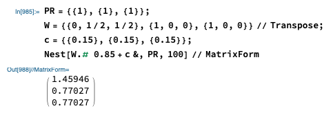


#### W其实就是一个状态转移矩阵

也叫做**随机矩阵**（Stochastic matrix），**所有元素不小于0，每一列的和为1**，状态转移矩阵的最大特征值为1


## 使用TextRank提取关键字

将原文本拆分为句子，在每个句子中过滤掉停用词（可选），并只保留指定词性的单词（可选）。由此可以得到句子的集合和单词的集合。

每个单词作为pagerank中的一个节点。设定窗口大小为k，假设一个句子依次由下面的单词组成：

w1,w2,w3,w4,w5,...,wn

[w1,w2,...,wk]、[w2,w3,...,wk+1]、[w3,w4,...,wk+2]等都是一个窗口。在一个窗口中的任两个单词对应的节点之间存在一个无向无权的边。

基于上面构成图，可以计算出每个单词节点的重要性。最重要的若干单词可以作为关键词。

## 使用TextRank提取关键短语

参照“使用TextRank提取关键词”提取出若干关键词。若原文本中存在若干个关键词相邻的情况，那么这些关键词可以构成一个关键短语。

例如，在一篇介绍“支持向量机”的文章中，可以找到三个关键词支持、向量、机，通过关键短语提取，可以得到支持向量机。 使用TextRank提取摘要

将每个句子看成图中的一个节点，若两个句子之间有相似性，认为对应的两个节点之间有一个无向有权边，权值是相似度。

通过pagerank算法计算得到的重要性最高的若干句子可以当作摘要。

论文中使用下面的公式计算两个句子Si和Sj的相似度：

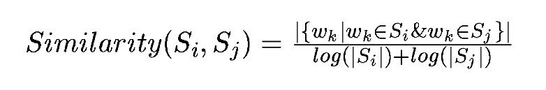

分子是在两个句子中都出现的单词的数量。|Si|是句子i的单词数。

由于是有权图，PageRank公式略做修改：

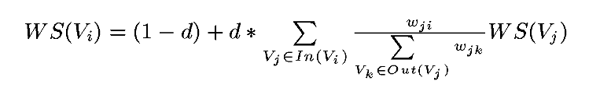

## 实现TextRank

因为要用测试多种情况，所以自己实现了一个基于Python 2.7的TextRank针对中文文本的库TextRank4ZH。位于：

https://github.com/letiantian/TextRank4ZH

下面是一个例子：

```plain
# -*- encoding:utf-8 -*-

import codecs
from textrank4zh import TextRank4Keyword, TextRank4Sentence

text = codecs.open('./text/01.txt', 'r', 'utf-8').read()
tr4w = TextRank4Keyword(stop_words_file='./stopword.data')  # 导入停止词

# 使用词性过滤，文本小写，窗口为2
tr4w.train(text=text, speech_tag_filter=True, lower=True, window=2)  

print '关键词：'
# 20个关键词且每个的长度最小为1
print '/'.join(tr4w.get_keywords(20, word_min_len=1))  

print '关键短语：'
# 20个关键词去构造短语，短语在原文本中出现次数最少为2
print '/'.join(tr4w.get_keyphrases(keywords_num=20, min_occur_num= 2))  

tr4s = TextRank4Sentence(stop_words_file='./stopword.data')

# 使用词性过滤，文本小写，使用words_all_filters生成句子之间的相似性
tr4s.train(text=text, speech_tag_filter=True, lower=True, source = 'all_filters')

print '摘要：'
print '\n'.join(tr4s.get_key_sentences(num=3)) # 重要性最高的三个句子
```

Copy

运行结果如下：

```plain
关键词：
媒体/高圆圆/微/宾客/赵又廷/答谢/谢娜/现身/记者/新人/北京/博/展示/捧场/礼物/张杰/当晚/戴/酒店/外套
关键短语：
微博
摘要：
中新网北京12月1日电(记者 张曦) 30日晚，高圆圆和赵又廷在京举行答谢宴，诸多明星现身捧场，其中包括张杰(微博)、谢娜(微博)夫妇、何炅(微博)、蔡康永(微博)、徐克、张凯丽、黄轩(微博)等
高圆圆身穿粉色外套，看到大批记者在场露出娇羞神色，赵又廷则戴着鸭舌帽，十分淡定，两人快步走进电梯，未接受媒体采访
记者了解到，出席高圆圆、赵又廷答谢宴的宾客近百人，其中不少都是女方的高中同学
```

Copy

另外， [jieba分词](https://github.com/fxsjy/jieba)提供的基于TextRank的关键词提取工具。 [snownlp](https://github.com/isnowfy/snownlp)也实现了关键词提取和摘要生成。

**下载：**

https://github.com/letiantian/TextRank4ZH


## 有向图

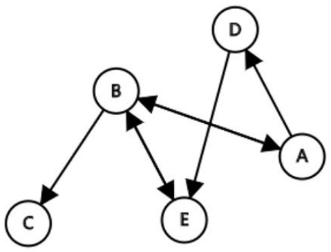

- node 节点，一个节点是一个网页

- edge 边，一条边是一个网页链接

- 箭头方向表示网页链接的方向


## Adjacency Matrix 邻接矩阵

> 邻接矩阵是**有向图的数学表示**


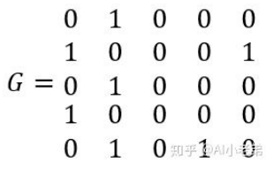


- **G(i,j) = 1 表示有箭头从第i 个结点指向第j 个结点，既网页i 链接到网页j** 

- G中的1表示无权重的图，如果是有权图，则这里的1可以替换为相应权重


## 概率转移矩阵（只是近似）

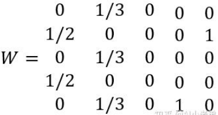


- 通过标准化邻接矩阵得到概率转移矩阵

- **W并不真正满足概率转移矩阵的定义**：

  矩阵各元素都是非负的，并且各行（列）元素之和等于1，各元素用概率表示，在一定条件下是互相转移的。

- **W(i,j) = 1/3 表示网页i "转移"到网页j 的概率是1/3**  ???


## 随机向量


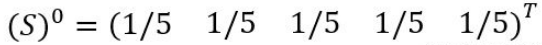


- 随机向量是一个列向量
- 这个随机向量表示五个节点的初始概率


### 随机向量的概率转移

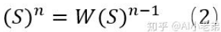

- **随机变量s 右乘（因为s 在右边）概率转移矩阵W 得到新的随机变量**，这就是概率转移
  - W 在左边，所以它是左概率转移矩阵(也叫**随机矩阵**)


### 马尔科夫收敛过程

> 马尔可夫收敛，也需要满足一定的条件，首先必须满足转移矩阵的定义，其次转移矩阵不可约，且非周期。转移矩阵不可约指的是每一个状态都可来自任意的其它状态，也就是任意两个网页都可以通过若干中间网页链接。周期指的是存在一个最小的正整数 k，使得从某状态 i 出发又回到状态 i 的所有路径的长度都是 k 的整数倍，也就是Dead Ends问题，这里由于d(**阻尼因子**)的存在，也使得非周期性得到满足


### 阻尼因子

- 当加入了阻尼因子后，可以认为用户浏览到任何一个页面，都**有可能以一个极小的概率转移到另外一个页面**


## 基于TextRank提取关键词、关键短语、摘要，文章排序


[z](https://zhuanlan.zhihu.com/p/53962922)


TextRank算法基于PageRank，用于为文本生成关键字和摘要。其论文是：

> Mihalcea R, Tarau P. TextRank: Bringing order into texts[C]. Association for Computational Linguistics, 2004.


# The Google Pagerank Algorithm and How It Works

[o](https://www.cs.princeton.edu/~chazelle/courses/BIB/pagerank.htm)


## Definitions

-  **PR = PageRank**


## So what is PageRank?

- In short **PageRank is a “vote”**


