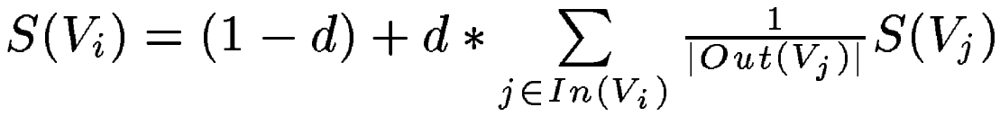
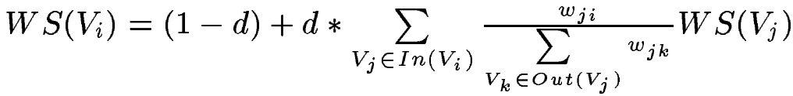
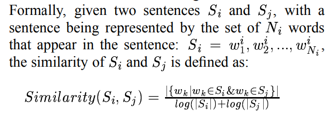
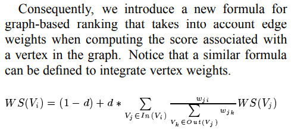
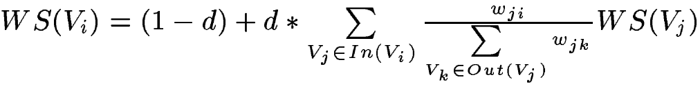
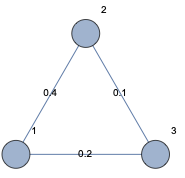
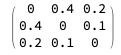
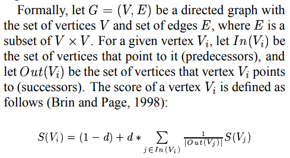
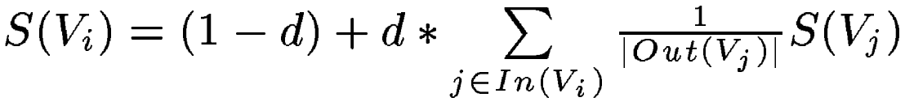

[TOC]


# TextRank Summary

[z](https://zhuanlan.zhihu.com/p/126733456) [g](https://ansvver.github.io/pagerank_and_textrank.html) [g](https://zouzhitao.github.io/posts/pagerank/) [j](https://www.jianshu.com/p/f6d66ab97332)

[The Google Pagerank Algorithm and How It Works](https://www.cs.princeton.edu/~chazelle/courses/BIB/pagerank.htm)

[浅入浅出：PageRank算法](https://www.letianbiji.com/machine-learning/page-rank.html)

[关键字提取算法TF-IDF和TextRank（python3）————实现TF-IDF并jieba中的TF-IDF对比，使用jieba中的实现TextRank](https://www.cnblogs.com/Micang/p/10366954.html)

[TextRank Keyword Extraction](https://yam.gift/2020/03/21/Paper/2020-03-21-Text-Rank)

[TextRank 代码使用Scala编写](https://github.com/STHSF/TextRank)

[基于TextRank的中文摘要工具](http://jayveehe.github.io/2016/05/11/da_textrank/)

[TextRank 简介](https://zhuanlan.zhihu.com/p/102978954)

[TextRank关键词提取 算法原理 公式推导](https://blog.csdn.net/qq_41664845/article/details/82869596) 

- 公式细节多

[手撕 TextRank]()

[textrank c++](https://github.com/lostfish/textrank)

```
cmake ./
make
./textrank data/news.seg 1 2 data/news.sent
```


[Haskell Tutorial and Cookbook Text Summarization](https://leanpub.com/haskell-cookbook/read#leanpub-auto-natural-language-processing-tools)

[《TextRank: Bringing Order into Texts》](https://www.aclweb.org/anthology/W04-3252.pdf)

- 原始论文

[jieba分词过滤停顿词、标点符号及统计词频](https://zhuanlan.zhihu.com/p/39437488)


# PageRank



> pagerank 是说一个人的价值完全靠朋友，朋友数量越多个人价值越高，既不用自已努力，也不靠拼爹
>
> 每个人都把自已的价值均分出去，你总共有N个朋友，那么你给你的每个朋友都贡献自已价值的1/N
>
> 每个人的初始价值都是0.15


# TextRank




> textrank 也是说一个人的价值同样完全靠朋友，但是除了朋友数量这个因素外同时还考虑了朋友质量的影响
>
> 两个人越相似（性格相似，聊得来），互相之间就会成为越重要的朋友
>
> 越是重要的朋友你就会想要把自已的价值更多的分给他，你有N 个朋友，总相似度是S，和某个朋友相似度是d，那么你给这个朋友贡献自已价值的 d / S  （和pagerank 的差别就只有这一点而已）
>
> 每个人的初始价值都是0.15


## Matlab

```matlab
str = [
    "a b c"
    "a b c"
    "a b c"
];
documents = tokenizedDocument(str)

scores = textrankScores(documents);

figure
bar(scores)
xlabel("Document")
ylabel("Score")
title("TextRank Scores")
```

输入词向量：

["a b c", "a b c", "a b c"]

输出分值：

[0.333333333333333;0.333333333333333;0.333333333333333]


["a b c", "a b f", "a h i"]

[0.370135263877755;0.370135263877755;0.259729472244489]


## Python


```python

import math
import numpy as np
#import networkx as nx

# 相似度计算公式参见原始论文：《TextRank: Bringing Order into Texts》by: Rada Mihalcea and Paul Tarau

def similarOfSents(words1, words2):
	"""
	words1:句子1的词list
	words2:句子2的词list
	"""
	intersects = [] # 两个词集合words1，words2 的交集
	for w in words1:
		if w in words2:
			if w not in intersects:
				intersects.append(w)
	numerator = len(intersects)  # 分子是交集的元素个数
	if numerator == 0:
		return 0.0
	denominator = math.log(len(words1)) + math.log(len(words2))  # 分母是句子对应的词集长度分别求对数，然后相加
	if denominator < 1e-12:
		return 0.0

	return numerator / denominator

words1 = ['a', 'b', 'c']
words2 = ['a', 'b', 'f']
words3 = ['a', 'h', 'i']

# 构造相似度邻接矩阵
# wordsList: 句子词向量列表 example: [ ['a', 'b', 'c'], ['a', 'b', 'f'], ['a', 'h', 'i'] ]
def similarMatrix(wordsList):
	n = len(wordsList)
	adjacentMatrix = np.zeros((n, n))
	"""
	邻接矩阵，里面存的是相似度，相似度可以用作graph 边的权值
	"""
	for i in range(0, n):
		for j in range(i+1, n):
			sim = similarOfSents(wordsList[i], wordsList[j])
			adjacentMatrix[i, j] = sim
			adjacentMatrix[j, i] = sim
	return adjacentMatrix


# 构造权值邻接矩阵
# simMatrix: 相似度邻接矩阵
def weightMatrix(simMatrix):
	"""
	graph 是一个有向图，结点是句子， \
		边的意义是两句子相似，箭头指向的意义是价值传递的方向，  \
		权值的意义是你愿意把自已价值的百分之几传递给箭头指向的那个结点。 \
		计算A -> B 的权值的方法是：  \
			先算A 和所有结点相似度的总和，这是分母  \
			再算A 和B 的相似度，这是分子  \
			两者的比值既是A -> B的边的权值
	"""
	n = len(simMatrix)
	weightMtrx = np.zeros((n, n))
	
	for i in range(0, n):
		sumsim = sum( simMatrix[i] )  # 句子i 和其他所有结点相似度的总和
		for j in range(0, n):
			if i != j and simMatrix[i][j] > 0.001 and sumsim != 0:  # 相似度小于一定值，认为结点之间没有边
				weightMtrx[i][j] = simMatrix[i][j] / sumsim
	
	return weightMtrx			

# 计算句子textrank 值(价值，或者说“重要性”)
# wordsList: 句子词向量列表 example: [ ['a', 'b', 'c'], ['a', 'b', 'f'], ['a', 'h', 'i'] ]
def textrank(wordsList):
	"""
	相比原算法没有考虑孤立结点的贡献值(没有边的结点)
	"""
	N = len(wordsList)

	simMatrix = similarMatrix(wordsList) # 相似度邻接矩阵
	print("similary matrix:\n ", simMatrix, "\n\n")

	W = weightMatrix(simMatrix)  # 权值邻接矩阵
	print("weight matrix:\n ", W, "\n\n")

	WS = [1/N, 1/N, 1/N]  # TextRank 初始值
	#print(WS)
	for _ in range(0, 100):
		WS_last = WS
		WS = [0, 0, 0]
		for i in range(0, N):
			for j in range(0, N):
				if i != j and W[i][j] > 0:
					WS[j] += 0.85 * WS_last[i] * W[i][j]  # 先算i 为别人做了多少贡献
			WS[i] += 0.15 * 1 / N  # 再算别人为i 做了多少贡献
	
	print ("textrank值：\n", WS, "\n", sum(WS))
	return WS


if __name__ == "__main__":
	textrank( [ ['a', 'b', 'c'],
				['a', 'b', 'f'],
				['a', 'h', 'i']
		  	  ])
 
```


## Mathematica


```mathematica
(* 
	计算词向量的相似度
      words1:句子1的词list
	words2:句子2的词list
相似度计算公式参见原始论文：《TextRank:Bringing Order into Texts》by:Rada Mihalcea and Paul Tarau 
*)
similarOfSents[
	 words1:List[_String..], 
	 words2:List[_String..]
	(* words1:p 的完整形式是：Pattern[words1, List[_String..]] *)
]:=Module[
{
numerator,
denominator (* 分母是句子对应的词集长度分别求对数，然后相加 *)

},
numerator = Length[  Intersection[words1,words2] ]; (* 分子是交集的元素个数 *)
denominator = Log[ Length[words1] ] + Log[ Length[words2] ];

If[denominator < 0.000001, 
Return[0]
];

numerator / denominator//N
]

words ={ {"a", "b", "c"}, {"a", "b", "c"}, {"a", "b", "c"} }; 
similarOfSents[words[[1]], words[[2]]]
=> 1.36536
```


**文本关键字取排名靠前的前k 个词**（用一定规则对词进行排序）

**文本摘要取排名靠前的前K 个句子**（用一定规则对句进行排序）

- 所有句子当作一个结点，构造全连接图

- 计算所有句子之间的相似度，如果相似度小于设定的最小值则删除这两个结点的边
  - 这样，一个句子和越多句子相似，它的重要性就越大  （朋友越多价值越大）


**TFIDF 仅考虑了词频的统计信息，没有考虑词之间的关联信息**

与TF-IDF需要在语料库上计算IDF(**逆文档频率**)不同，TextRank利用一篇文档内部的词语间的共现信息(语义)便可以抽取关键词。

**关键思想都是重要性传递**

假如两个词的距离小于预设的距离，那么就认为这两个词间存在语义关系，否则不存在。这个预设的距离在TextRank算法中被称为同现窗口（co-occurance window）。这样便可构建出一个词的图模型。

**幂法求特征向量与初始值无关**。具体做法就是，先给每个网页随机附一个初值，然后通过迭代计算直至收敛，理论证明了收敛的值与初始值无关

实现的一个关键点在于构建词的图模型

另外一个实现关键点就是判断算法是否收敛，可以认为前后两次计算出来的值小于指定的阈值（一般取值较小，如0.000001）时算法收敛，或者超过设定的最大迭代次数时停止


这个图可以是有向图，也可以是无向图。在有向图中，方向为语料中的行文方向，也可是这个方向的反方向（在刘知远老师的博士论文中，是这样构建有向图的：在每个滑动窗口中，将该窗口中的第一个词指向剩余的其他词）；在无向图中，节点入度等于出度，所以公式中链接到V(i)的点集就是与V(i)相连的点，V(j)链接出去的点集就是V(j)与相连的点。
图中的边可以有权值，也可以没有权值。没有权值的话，和PageRank公式基本一致了；如果有权值，这个权值可以是两个候选词共现的次数，也可以是两个候选词的相关度，总之可以自己定义。
滑动窗口不是越大越好。在算法提出者论文展示的实验中，滑动窗口为2时的无向图，效果最好。
所谓收敛，就是有一个阈值，节点权重更新大小（原值与更新后值的差）不超过这个阈值时就是收敛状态，整个图收敛就是所有点都达到收敛状态。


TextRank采用图的思想，将文档中的词表示成一张无向有权图，词为图的节点，词之间的联系紧密程度体现为图的边的权值。

有A B C D E五个词，词之间的关系使用边连接起来，词之间连接的次数作为边的权值。比如：A和C一起出现了2次，则其边的权重为2,A与B/C/E都有联系，而D仅与B有联系。词的权重等价于计算图中节点的权重。**提取关键字，等价于找出图中权重排名TopK的节点**。


（巴尔宾认为一篇文章的第二句比第一句更重要，因为很多作家都习惯到第二句话引入关键点）备注：用段落效果会怎样？ ***文章标题与文章内容的关系，***句子是否包含标题词，根据句子中包含标题词的多少来打分。 ***句子关键词打分，***文本进行预处理之后，按照词频统计出排名前10的关键词，通过比较句子中包含关键词的情况，以及关键词分布的情况来打分（sbs，dbs两个函数）


利用Textrank做文本摘要的核心思想很简单，和著名的网页排名算法PageRank类似：每个句子可以作为一个网络中的节点（称为节点i），与之相连的其他节点（例如节点j）会对其重要度产生一定的“贡献值”，该“贡献值”与节点j自身的重要度以及i、j之间的相似度（也可以称为连接的强度）有关，只需要对整个图进行迭代直至收敛，最后各节点的分值即是该句子的重要性，根据重要性排序后选**取前k个句子即可作为摘要**。


由text_rank得到的前k个句子，**只能表示这几个句子很重要，然而他们在逻辑上很难串联起来。如何重组织摘要，在学术界也是一大研究热点**。根据不同的处理粒度（句子级、字词级）和不同的处理思路（根据语义重组还是改变现有词句的顺序），生成的摘要在阅读性上有很大的不同。
在此为了简便，选取最简单的，根据句子在文章中出现的顺序对text_rank结果进行重排序。


可以看出，本套方案第一个可修改的地方是句子间相似度的计算，**如何精确衡量句子之间的语义相似度，是NLP的另一个坑**。（可以用TF-IDF或词向量相加的方式生成句子向量并求cosine相似度，或者一些基于神经网络的方法）
TextRank同期的也是基于图结构的rank算法LexRank（参见论文）即是在相似性的计算上有所区别，采用了一些词法上特征进行相似度计算，有兴趣的读者可以参考。


{w1,w2,w3......wk}对于在滑动窗口k之内的词，都可以认为是有联系的，对于有联系的两个词，可以在有词构成的图中增加相应的权重。一个窗口遍历完文章的所有句子后，一个由词语构成的图就建立了。


摘要的抽取，是将文本中的每一个句子看作一个节点，计算句子之间的相似性，那么句子间对应的节点存在**无向有权边**


句子间的相似性计算：

使用同时出现在两个句子中的同一个词的个数作为分子，分母是对句子中词的个数求对数之和。

使用相似度公式循环计算任意两个节点之间的相似度。

根据阈值去掉两个节点之间相似度较低的边连接，构建出节点连接图。

然后计算TextRank值，最后对所有TextRank值排序，选出TextRank值最高的几个节点对应的句子作为摘要。


正规的TextRank公式在PageRank的公式的基础上，引入了边的权值的概念，**代表两个句子的相似度**。

但是很明显我只想计算关键字，如果把一个单词视为一个句子的话，那么所有句子（单词）构成的边的权重都是0（没有交集，没有相似性），所以分子分母的权值w约掉了，算法退化为PageRank。所以说，这里称关键字提取算法为PageRank也不为过。


### 语义理解和自然语言生成目前还面临巨大的困难


另外，做中文的文摘或者小结时，推荐用子句（逗号分隔）而不是句子（句号分隔）作为一个节点。个人感觉对中文来说，句子作为颗粒有些太大了。另一种做法是Abstractive summarization，就是直接从文本中抽取信息，再重新构造出句子。这方面似乎还没有比较成熟的成果，毕竟**语义理解和自然语言生成**目前还面临巨大的困难。有一些方法会首先从文本中抽取出一些关键句，再进一步通过NLG的技术进行加工和处理。不过这一块我也不大熟的说。事实上目前工业界做中文的文本摘要总结，更多还是会依靠人的介入。比如机器先筛选出一些关键词关键句，然后靠人工生成可读的内容。想要机器自动生成可读的高质量的段落总结，恐怕还要等待NLU和NLG上有新的突破。


想要知道一个人怎么样，看他的朋友怎么样。箭头表示愿意和他“做朋友”




[《TextRank: Bringing Order into Texts》](https://www.aclweb.org/anthology/W04-3252.pdf)

 S 是句子的集合，$S_i = w^i_1 + w^i_2, ..., w^i_N{_i}$

> $S_i$ 是第i 个句子
>
> $w^i_1$ 的表示句子i 的第1 个词
>
> $N_i$ 表示句子i 的总词数

$$
Similarity(S_i, S_j) =  \frac{| \{w_k | w_k \in S_i \& w_k \in S_j\}    |}{log(|S_i|)+log(|S_j|)}
$$

## 句子$S_i$ 和$S_j$ 的相似度计算方法

> - 相似度是一个0~1 之间的小数
>
> - 分子是词集$w_k$ 的元素总数  
>   - $w_k$ 是一个交集，$S_i$ 所有词与$S_j$ 所有词的交集
> - 分母是$S_i$ 所有词长度求对数与$S_j$ 所有词长度求对数，这两个对数之和
> 






## TextRank 句子重要性计算方法

>- $V_i$ 是图的顶点，顶点就是一个句子
>- WS是weight sum的缩写，表示**权重和**
>- 边是有权重的，边的权重就是两个句子的相似度
>- $V_j$ 是指向$V_i$ 的结点
>- $w_{ji}$ 是从j指向i 这条边的权重
>- $V_k$ 是$V_j$ 指向的结点  
>  - k 是$V_j$ 指向的结点总数
>- $w_{jk}$ 是从j 指向k 这条边的权重

### TextRank 公式的意思

> - 句子$V_i$ 的权重和等于
>   - 0.15 + 0.85 * (  指向$V_i$ 的结点所指向的结点0  )


等式左边表示一个句子的权重（WS是weight_sum的缩写），右侧的求和表示每个相邻句子对本句子的贡献程度。与提取关键字的时候不同，一般认为全部句子都是相邻的，不再提取窗口。

求和的分母wji表示两个句子的相似程度，分母又是一个weight_sum，而WS(Vj)代表上次迭代j的权重。整个公式是一个迭代的过程。


## TexRank 方程组

带权无向图



带权邻接矩阵



```
初始化：
	TR(A) = TR(B) = TR(C) = 1

第一轮计算：
	TR(A) = 0.15 + 0.85 * ( 0 * TR(A) +  0.4/(0.4+0.1) * TR(B) + 0.2/(0.2+0.1) * TR(C) )
	TR(B) = 0.15 + 0.85 * ( 0.4/(0.4+0.2) * TR(A) +  0 * TR(B) + 0.1/(0.2+0.1) * TR(C) )
	TR(C) = 0.15 + 0.85 * ( 0.2/(0.4+0.2) * TR(A) +  0.1/(0.4+0.1) * TR(B) + 0 * TR(C) )
```


PageRank

​	




N 是词的集合，$S_i$ 是句子i ，$N_i$ 是

### PageRank的目的

- **判断网页的重要性**
  
  > 在已知网页互相链接方式的情况下**判断网页的重要性**。如果A和B中含有相同的关键字，而A的重要性高于B，那么搜索这个关键字的结果中网页A应该放在网页B之前

- 重要的网页，搜索结果排名靠前，优先展示

#### 最简模型

1. 每个人的**重要性必须要靠别人赏赐**
   - 开始时每个人都有重要性1 可以均匀地分给别人
2. 每个人赏赐给别人的时侯**必须均分自已的重要性**

3. 每个人的重要性必须迭代计算，最终收敛到一个稳定值

- 存在的问题
  - 某些情况重要性没法计算（比如仅存在B、C指向A这样的指向关系时。如下图2）
  - 多次迭代后结果最终收敛到0

#### 修正模型

2. 每个人的**重要性必须要靠别人赏赐**
   - 开始时每个人都有重要性1，可以均匀地分给别人，但是别人只能收到其中的85%(阻尼系数d=0.85)
   - 相当于捐赠的时侯有一部分钱被抽税了
3. 每个人重要性等于(1-0.85)加上0.85*别人均分过来的重要性之和
4. 每个人的重要性必须迭代计算，最终收敛到一个稳定值


### 重要性方程组写成矩阵

```
PR(A) =   0 * PR(A) + 0 * PR(B) + 1 * PR(C)
PR(B) = 0.5 * PR(A) + 0 * PR(B) + 0 * PR(C)
PR(C) = 0.5 * PR(A) + 1 * PR(B) + 0 * PR(C)
```
  - PR = PageRank
  - PR(A) 、PR(B)、PR(C)  初值都是1


### 修正版本的PageRank

- 引入了0和1之间的**阻尼系数**d


- **A的重要性 = 0.15 + 0.85 * 其他所有人分给A的重要性之和**


- 按第二个公式表达，图1 的i 的上界是3，有A、B、C 三个节点
  - V1 = A, V2 = B, V3 = C
- j 的取值是除i 以外的值
  - In(Vi) 是**指向**Vi 的结点，Out(Vj) 是Vj **指向**的结点
- vj 是指向vi 的结点, j != i ，**指向它既是给它贡献重要性**
- |out(Vj)| 是结点vj **指向其他结点的箭头总数**

- S(Vj)  是结点Vj 的**重要性**  S(Vj)=PR(Vj) = PageRank(Vj)


#### 修正版的方程组


##### 图1 的计算

```
初始化：
	PR(A) = PR(B) = PR(C) = 1

第一轮计算：
	PR(A) = 0.15 + 0.85 * (   0 * PR(A) + 0 * PR(B) + 1 * PR(C) )
	PR(B) = 0.15 + 0.85 * ( 1/2 * PR(A) + 0 * PR(B) + 0 * PR(C) )
	PR(C) = 0.15 + 0.85 * ( 1/2 * PR(A) + 1 * PR(B) + 0 * PR(C) )
```

- A分到了C 的百分百，
- B 分到了A的1/2，因为A 均分给了两个人，B和C

- C 分到了A的1/2，B的百分百


##### Mathematica 实现迭代100 次的结果：

```
Nest[ Transpose[{{0,1/2,1/2},{0,0,1},{1,0,0}}].# 0.85 +c&,PR,100]//MatrixForm
```


##### 图2 的计算


```
初始化：
	PR(A) = PR(B) = PR(C) = 1

第一轮计算：
	PR(A) = 0.15 + 0.85 * ( 0 * PR(A) + 1 * PR(B) + 1 * PR(C) )
	PR(B) = 0.15 + 0.85 * ( 0 * PR(A) + 0 * PR(B) + 0 * PR(C) )
	PR(C) = 0.15 + 0.85 * ( 0 * PR(A) + 0 * PR(B) + 0 * PR(C) )
```

- A分到了B 的百分百,  C 的百分百
- B 什么也没有分到

- C 什么也没有分到

这种情况下第一轮计算就决定最终结果了。最终收敛值是：

```plain
A = 0.4050
B = 0.15
C = 0.15
```

Mathematica 实现迭代3 次的结果：
```
PR={{1},{1},{1}};
W= {{0,0,0},{1,0,0},{1,0,0}}//Transpose;
c = {{0.15},{0.15},{0.15}};
Nest[W.# 0.85 +c&,PR,3]//MatrixForm (* Applying Functions Repeatedly *)
```


###### 图2看作无向图（等价于双向图）


```
初始化：
	PR(A) = PR(B) = PR(C) = 1

第一轮计算：
	PR(A) = 0.15 + 0.85 * (   0 * PR(A) + 1 * PR(B) + 1 * PR(C) )
	PR(B) = 0.15 + 0.85 * ( 1/2 * PR(A) + 0 * PR(B) + 0 * PR(C) )
	PR(C) = 0.15 + 0.85 * ( 1/2 * PR(A) + 0 * PR(B) + 0 * PR(C) )
```

- A 分到了B 的百分百,  C 的百分百
- B 分到了A 的1/2

- C 分到了A 的1/2


#### W其实就是一个状态转移矩阵

也叫做**随机矩阵**（Stochastic matrix），**所有元素不小于0，每一列的和为1**，状态转移矩阵的最大特征值为1


## 使用TextRank提取关键字

将原文本拆分为句子，在每个句子中过滤掉停用词（可选），并只保留指定词性的单词（可选）。由此可以得到句子的集合和单词的集合。

每个单词作为pagerank中的一个节点。设定窗口大小为k，假设一个句子依次由下面的单词组成：

w1,w2,w3,w4,w5,...,wn

[w1,w2,...,wk]、[w2,w3,...,wk+1]、[w3,w4,...,wk+2]等都是一个窗口。在一个窗口中的任两个单词对应的节点之间存在一个**无向无权的边**。

基于上面构成图，可以计算出每个单词节点的重要性。最重要的若干单词可以作为关键词。

## 使用TextRank提取关键短语

参照“使用TextRank提取关键词”提取出若干关键词。若原文本中存在若干个关键词相邻的情况，那么这些关键词可以构成一个关键短语。

例如，在一篇介绍“支持向量机”的文章中，可以找到三个关键词支持、向量、机，通过关键短语提取，可以得到支持向量机。 使用TextRank提取摘要

将每个句子看成图中的一个节点，若两个句子之间有相似性，认为对应的两个节点之间有一个**无向有权边**，**权值是相似度**。

通过pagerank算法计算得到的重要性最高的若干句子可以当作摘要。

论文中使用下面的公式计算两个句子Si和Sj的相似度：


分子是在两个句子中都出现的单词的数量。|Si|是句子i的单词数。

由于是有权图，PageRank公式略做修改：


## 实现TextRank

因为要用测试多种情况，所以自己实现了一个基于Python 2.7的TextRank针对中文文本的库TextRank4ZH。位于：

https://github.com/letiantian/TextRank4ZH

下面是一个例子：

```plain
# -*- encoding:utf-8 -*-

import codecs
from textrank4zh import TextRank4Keyword, TextRank4Sentence

text = codecs.open('./text/01.txt', 'r', 'utf-8').read()
tr4w = TextRank4Keyword(stop_words_file='./stopword.data')  # 导入停止词

# 使用词性过滤，文本小写，窗口为2
tr4w.train(text=text, speech_tag_filter=True, lower=True, window=2)  

print '关键词：'
# 20个关键词且每个的长度最小为1
print '/'.join(tr4w.get_keywords(20, word_min_len=1))  

print '关键短语：'
# 20个关键词去构造短语，短语在原文本中出现次数最少为2
print '/'.join(tr4w.get_keyphrases(keywords_num=20, min_occur_num= 2))  

tr4s = TextRank4Sentence(stop_words_file='./stopword.data')

# 使用词性过滤，文本小写，使用words_all_filters生成句子之间的相似性
tr4s.train(text=text, speech_tag_filter=True, lower=True, source = 'all_filters')

print '摘要：'
print '\n'.join(tr4s.get_key_sentences(num=3)) # 重要性最高的三个句子
```

Copy

运行结果如下：

```plain
关键词：
媒体/高圆圆/微/宾客/赵又廷/答谢/谢娜/现身/记者/新人/北京/博/展示/捧场/礼物/张杰/当晚/戴/酒店/外套
关键短语：
微博
摘要：
中新网北京12月1日电(记者 张曦) 30日晚，高圆圆和赵又廷在京举行答谢宴，诸多明星现身捧场，其中包括张杰(微博)、谢娜(微博)夫妇、何炅(微博)、蔡康永(微博)、徐克、张凯丽、黄轩(微博)等
高圆圆身穿粉色外套，看到大批记者在场露出娇羞神色，赵又廷则戴着鸭舌帽，十分淡定，两人快步走进电梯，未接受媒体采访
记者了解到，出席高圆圆、赵又廷答谢宴的宾客近百人，其中不少都是女方的高中同学
```

Copy

另外， [jieba分词](https://github.com/fxsjy/jieba)提供的基于TextRank的关键词提取工具。 [snownlp](https://github.com/isnowfy/snownlp)也实现了关键词提取和摘要生成。

**下载：**

https://github.com/letiantian/TextRank4ZH


## 有向图


- node 节点，一个节点是一个网页

- edge 边，一条边是一个网页链接

- 箭头方向表示网页链接的方向


## Adjacency Matrix 邻接矩阵

> 邻接矩阵是**有向图的数学表示**


- **G(i,j) = 1 表示有箭头从第i 个结点指向第j 个结点，既网页i 链接到网页j** 

- G中的1表示无权重的图，如果是有权图，则这里的1可以替换为相应权重


## 概率转移矩阵（只是近似）


- 通过标准化邻接矩阵得到概率转移矩阵

- **W并不真正满足概率转移矩阵的定义**：

  矩阵各元素都是非负的，并且各行（列）元素之和等于1，各元素用概率表示，在一定条件下是互相转移的。

- **W(i,j) = 1/3 表示网页i "转移"到网页j 的概率是1/3**  ???


## 随机向量


- 随机向量是一个列向量
- 这个随机向量表示五个节点的初始概率


### 随机向量的概率转移


- **随机变量s 右乘（因为s 在右边）概率转移矩阵W 得到新的随机变量**，这就是概率转移
  - W 在左边，所以它是左概率转移矩阵(也叫**随机矩阵**)


### 马尔科夫收敛过程

> 马尔可夫收敛，也需要满足一定的条件，首先必须满足转移矩阵的定义，其次转移矩阵不可约，且非周期。转移矩阵不可约指的是每一个状态都可来自任意的其它状态，也就是任意两个网页都可以通过若干中间网页链接。周期指的是存在一个最小的正整数 k，使得从某状态 i 出发又回到状态 i 的所有路径的长度都是 k 的整数倍，也就是Dead Ends问题，这里由于d(**阻尼因子**)的存在，也使得非周期性得到满足


### 阻尼因子

- 当加入了阻尼因子后，可以认为用户浏览到任何一个页面，都**有可能以一个极小的概率转移到另外一个页面**


## 基于TextRank提取关键词、关键短语、摘要，文章排序


[z](https://zhuanlan.zhihu.com/p/53962922)


TextRank算法基于PageRank，用于为文本生成关键字和摘要。其论文是：

> Mihalcea R, Tarau P. TextRank: Bringing order into texts[C]. Association for Computational Linguistics, 2004.


# The Google Pagerank Algorithm and How It Works

[o](https://www.cs.princeton.edu/~chazelle/courses/BIB/pagerank.htm)


## Definitions

-  **PR = PageRank**


## So what is PageRank?

- In short **PageRank is a “vote”**


