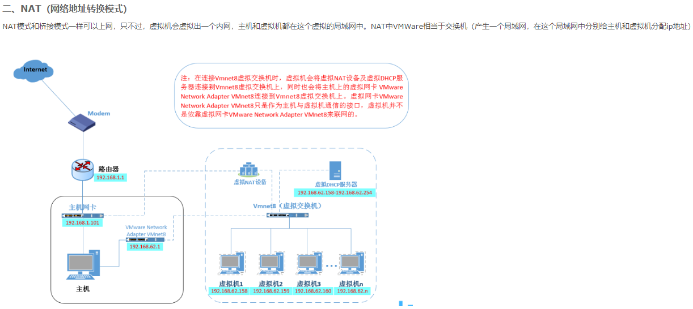
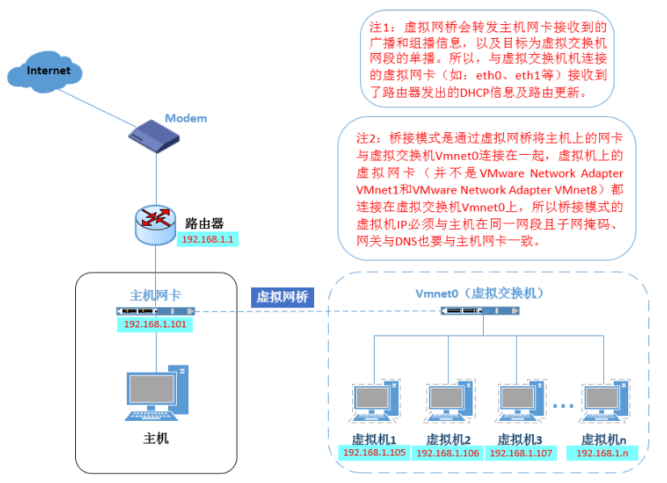
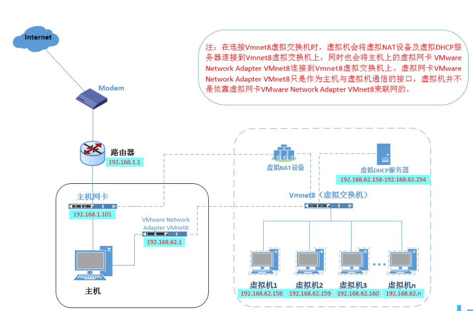
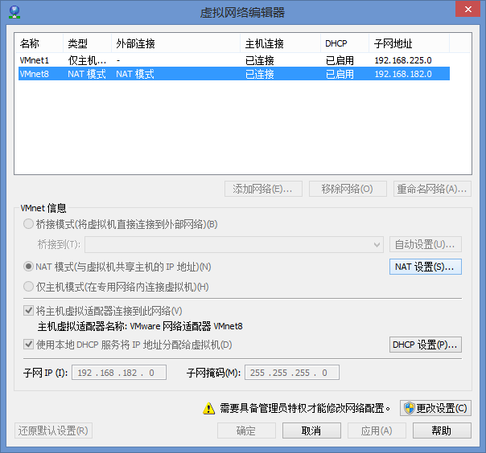
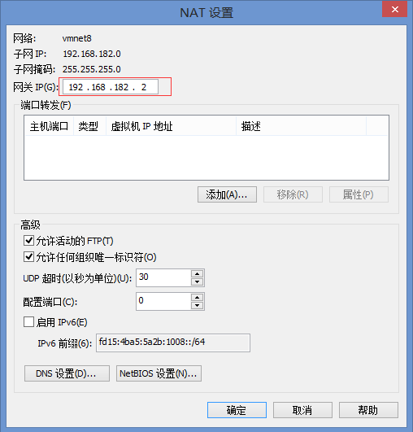
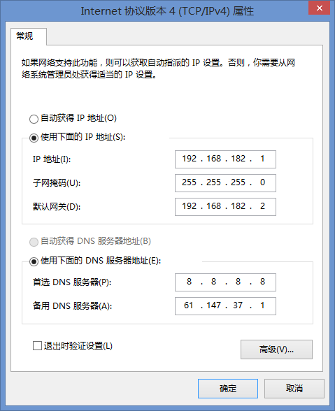
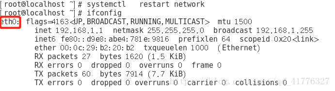
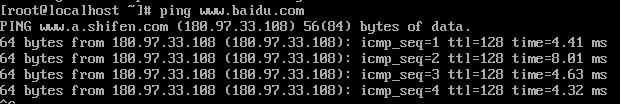
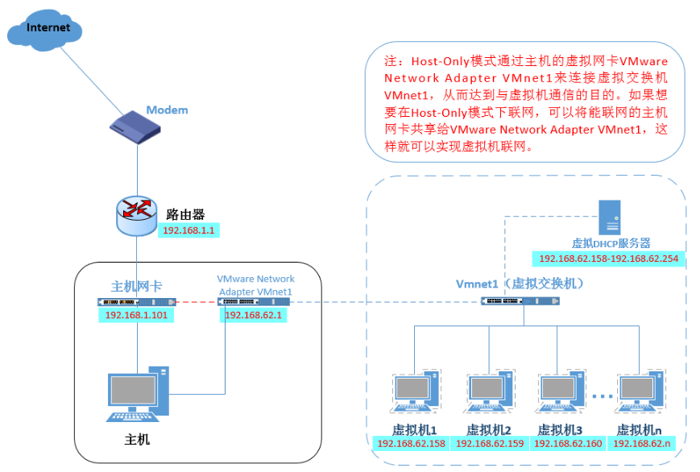

[TOC]

# VMWare summary


mount /dev/cdrom /mnt

cd /mnt


## Key


```
VMware Workstation 15 Pro

官方下载链接：https://download3.vmware.com/software/wkst/file/VMware-workstation-full-15.0.0-10134415.exe

永久许可证：ZC10K-8EF57-084QZ-VXYXE-ZF2XF

附：备用许可项

UF71K-2TW5J-M88QZ-8WMNT-WKUY4

AZ7MK-44Y1J-H819Z-WMYNC-N7ATF

CU702-DRD1M-H89GP-JFW5E-YL8X6

YY5EA-00XDJ-480RP-35QQV-XY8F6

VA510-23F57-M85PY-7FN7C-MCRG0
```


NAT 可以理解为虚拟机集群里的虚拟的局域网

NAT模式，这种模式下，虚拟机与所在的物理机单独组成了一个新的局域网，他们共享接入物理机的IP段

局域网内的其他计算机相对于虚拟机和物理机新组的局域网来说属于外网，这时候还需要在物理机中对其进行端口映射，这个与局域网中利用路由器对其中某个IP端口进行映射的原理是一样的，通过这种也可以实现局域网访问虚拟机内的服务


感觉最简单的就是 代理软件端口改成 0.0.0.0:8080，虚拟机只要能 ping 通物理主机，虚拟机就用物理主机 ip:8080 进行代理


## Network configure


[VMWare虚拟机15.X局域网网络配置(修改网卡)](https://www.cnblogs.com/lys_013/p/11412092.html)





### Win10 ipconfig


```
C:\Users\i>ipconfig

Windows IP 配置

以太网适配器 以太网:

   连接特定的 DNS 后缀 . . . . . . . :
   IPv4 地址 . . . . . . . . . . . . : 192.168.0.163
   子网掩码  . . . . . . . . . . . . : 255.255.255.0
   默认网关. . . . . . . . . . . . . : 192.168.0.1
```


- 物理主机可以ping 通虚拟机

```
C:\Users\i>ping 192.168.162.128

正在 Ping 192.168.162.128 具有 32 字节的数据:
来自 192.168.162.128 的回复: 字节=32 时间<1ms TTL=64
来自 192.168.162.128 的回复: 字节=32 时间<1ms TTL=64
来自 192.168.162.128 的回复: 字节=32 时间<1ms TTL=64
来自 192.168.162.128 的回复: 字节=32 时间<1ms TTL=64
```


### VMware ifconfig


#### Initial config

- 虚拟机的初始配置可以ping 通物理主机

```
$ ifconfig
ens33: flags=4163<UP,BROADCAST,RUNNING,MULTICAST>  mtu 1500
        inet 192.168.162.128  netmask 255.255.255.0  broadcast 192.168.162.255
```

```
$ route
Kernel IP routing table
Destination     Gateway         Genmask         Flags Metric Ref    Use Iface
default         _gateway        0.0.0.0         UG    100    0        0 ens33
link-local      0.0.0.0         255.255.0.0     U     1000   0        0 ens33
172.17.0.0      0.0.0.0         255.255.0.0     U     0      0        0 docker0
192.168.162.0   0.0.0.0         255.255.255.0   U     100    0        0 ens33
```

```
$ ping 192.168.0.163
PING 192.168.0.163 (192.168.0.163) 56(84) bytes of data.
64 bytes from 192.168.0.163: icmp_seq=1 ttl=128 time=0.537 ms
```


## Static IP configure


VMware ->编辑 ->虚拟网路编辑器 ->选中Vmnet8 NAT模式  ->取消"使用本地DHCP服务"

当前完整的网络配置是:

子网IP: 192.168.162.0 

子网掩码: 255.255.255.0

默认网关:192.168.162.2

IP: 192.168.162.128


## Proxy Setting


#### ss选择允许其他设备连入


#### Ubuntu 网络设置

1. 桥接模式（不是NAT）
2. Ubuntu18.04 ->Setting->System Settings->Network
3. Option ->IPV4Settings  ->Method ->Manual ->Add
4. 添加与主机不同的局域网IP地址。点击save保存
5. 点击Wired右侧的开关重启一下
6. 此时你的Ubuntu应该可以正常上网了


#### 代理设置


Network proxy 在右侧的Method选择Manual ，然后在下面的Proxy中全部填写主机的IP地址和代理端口，到此代理设置完成


## FRP Server

 

[使用frp进行内网穿透](https://sspai.com/post/52523)

[frp点对点udp方式内网穿透ssh，不走服务器流量](https://java-er.com/blog/frp-udp-ssh/)


[VMWare虚拟机15.X局域网网络配置(修改网卡)](https://www.cnblogs.com/lys_013/p/11412092.html)

最近在搞几台虚拟机来学习分布式和大数据的相关技术，首先先要把虚拟机搞起来，搞起虚拟机第一步先安装系统，接着配置网络

vmware为我们提供了三种网络工作模式，它们分别是：**Bridged（桥接模式）**、**NAT（网络地址转换模式）**、**Host-Only（仅主机模式）**。

### 一、Bridged（桥接模式）

桥接模式相当于虚拟机和主机在同一个真实网段，VMWare充当一个集线器功能（一根网线连到主机相连的路由器上），所以如果电脑换了内网，静态分配的ip要更改。图如下：



### 二、**NAT（网络地址转换模式）**

NAT模式和桥接模式一样可以上网，只不过，虚拟机会虚拟出一个内网，主机和虚拟机都在这个虚拟的局域网中。NAT中VMWare相当于交换机（产生一个局域网，在这个局域网中分别给主机和虚拟机分配ip地址）

****

步骤：

1.设置VMVare的默认网关（相当于我们设置路由器）: 
编辑->虚拟网络编辑器->更改设置->选中VM8>点击NAT设置，设置默认网关为192.168.182.2。



2.设置主机ip地址，点击VMnet8，设置ip地址为192.168.182.1，网关为上面设置的网关。




3.设置linux虚拟机上的网络配置，界面化同上，并且换网卡，操作系统版本为CentOS7.5。

[](javascript:void(0);)


```
cd  /etc/sysconfig/network-scripts/     //进入到网络适配器文件夹中
mv /ifcfg-ens33 /ifcfg-eth0     //名字改为ifcfg-eth0
vi  ifcfg-eth0    //编辑文件

TYPE=Ethernet 
DEFROUTE=yes 
PEERDNS=yes 
PEERROUTES=yes 
IPV4_FAILURE_FATAL=no 
IPV6INIT=yes 
IPV6_AUTOCONF=yes
IPV6_DEFROUTE=yes 
IPV6_PEERDNS=yes 
IPV6_PEERROUTES=yes 
IPV6_FAILURE_FATAL=no 
NAME=eth0 
UUID=ae0965e7-22b9-45aa-8ec9-3f0a20a85d11 

ONBOOT=yes  #开启自动启用网络连接,这个一定要改
IPADDR=192.168.182.3  #设置IP地址 
NETMASK=255.255.225.0  #设置子网掩码 
GATEWAY=192.168.182.2  #设置网关 
DNS1=61.147.37.1  #设置主DNS 
DNS2=8.8.8.8  #设置备DNS 
BOOTPROTO=static  #启用静态IP地址 ,默认为dhcp

:wq!  #保存退出 

service network restart  #重启网络 
ping www.baidu.com  #测试网络是否正常
ip addr  #查看IP地址
```


[](javascript:void(0);)

 

插入修改网卡ens33名称：

```
1）打开/etc/sysconfig/grub编辑配置文件，因为无法复制虚拟机里面的编辑文本，请看先后的变化 
想想还是手写出来吧：net.ifnames=0 biosdevname=0 
```


 

 

 

 保存退出 
2）执行命令grub2-mkconfig -o /boot/grub2/grub.cfg 


 

3）重启虚拟机，然后重启之后在使用重启网卡的命令检测一下，reboot快点输入 



 

 

最后ping www.baidu.com测试下OK



ping通网络之后可以下载ifconfig命令

```
yum provides ifconfig    #查看哪个包提供了ifconfig命令,显示net-tools
yum -y install net-tools    #安装提供ifconfig的包
```

### 三、**Host-Only（仅主机模式）**

主机模式和NAT模式很相似，只不过不能上网，相当于VMware虚拟一个局域网，但是这个局域网没有连互联网。



 

虚拟机安装好后用xshell直接拖拽传递文件的话要执行以下命令

yum -y install lrzsz


