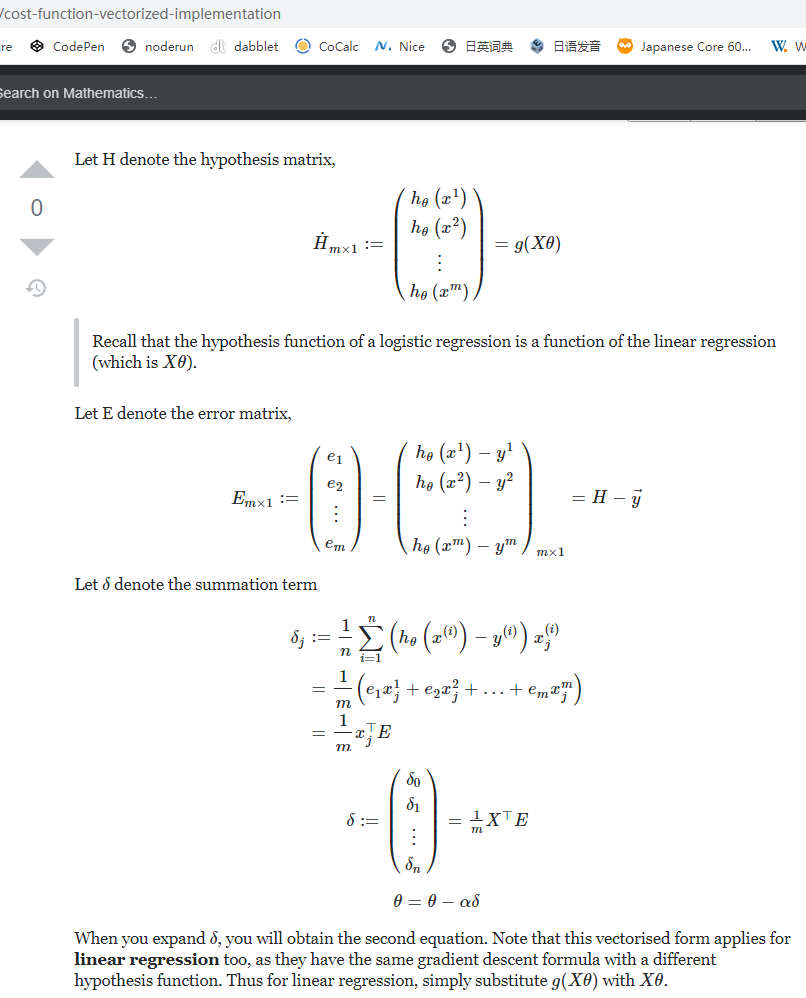

## Forward propagation

$$
h_{W}(X) =
X \cdot W
=
\begin{bmatrix}
x^{1}_{0} & x^{1}_{1} & x^{1}_{2}  \\
x^{2}_{0} & x^{2}_{1} & x^{2}_{2} \\
... & ... & ... & \\
x^{4}_{0} & x^{4}_{1} & x^{4}_{2} \\
\end{bmatrix}
\cdot
\begin{bmatrix}
w_{0}  \\
w_{1}  \\
w_{2}  \\
\end{bmatrix}
=
\begin{bmatrix}
w_{0} x^{1}_{0} + w_{1} x^{1}_{1} + w_{2} x^{1}_{2}  \\
w_{0} x^{2}_{0} + w_{1} x^{2}_{1} + w_{2} x^{2}_{2}  \\
...  \\
w_{0} x^{4}_{0} + w_{1} x^{4}_{1} + w_{2} x^{4}_{2}  \\
\end{bmatrix} \\
= \begin{bmatrix}
h_{W}(x^{(1)})  \\
h_{W}(x^{(2)})  \\
...  \\
h_{W}(x^{(m)})  \\
\end{bmatrix}
$$

## Activation Function

### Sigmoid Function

$$
g(x) = \frac{1}{1 + e^{-x}}
$$

> e 是欧拉数（Euler’s number），近似数值 2.718281，是一个无理数
>
> Sigmoid 意为“S形的”

## Errors

$$
E =
g(h_{w}(X)) - Y
=
\begin{bmatrix}
g(h_{W}(x^{1})) - y^{1}  \\
g(h_{W}(x^{2})) - y^{2}  \\
...  \\
g(h_{W}(x^{m})) - y^{m}  \\
\end{bmatrix}
=
\begin{bmatrix}
e^{1}  \\
e^{2}  \\
...  \\
e^{m}  \\
\end{bmatrix}
$$

## Cost function

$$
J(w_{0},w_{1},w_{2}) = 
 \frac{1}{2m} \sum^{m}_{i=1}(g(h_{W}(x^{(i)})) - y^{i})^2
$$

### Derivation

$$
\frac{d}{dx} c = 0, \ \frac{d}{dx} x = 1, \\
\frac{d}{dx} [c\cdot f(x)] = c\cdot\frac{df}{dx} \ \ \ \text{(linearity)}, \\
\frac{d}{dx}[f(x)+g(x)] = \frac{df}{dx} + \frac{dg}{dx} \ \ \ \text{(linearity)},  \\
\frac{d}{dx}[f(x)]^2 = 2f(x)\cdot\frac{df}{dx} \ \ \ \text{(chain rule)}.
$$

$$
\frac{\partial}{\partial w_{j}} J(w_{0},w_{1},w_{2}) = 
\frac{\partial}{\partial w_{j}} \bigg [ \frac{1}{2m} \sum^{m}_{i=1}(g(h_{W}(x^{(i)})) - y^{i})^2 \bigg ] \\
= \frac{1}{2m} \sum^{m}_{i=1}\frac{\partial}{\partial w_{j}} (g(h_{W}(x^{(i)})) - y^{i})^2   \quad \text{(by linearity of the derivative)} \\
= \frac{1}{2m} \sum^{m}_{i=1} 

2 \cdot (g(h_{W}(x^{(i)})) - y^{i}) \frac{\partial}{\partial w_{j}} (g(h_{W}(x^{(i)})) - y^{i})   \quad \text{(by chain rule)} \\
= \frac{1}{2m} \cdot 2 \sum^{m}_{i=1} 

(g(h_{W}(x^{(i)})) - y^{i}) \bigg [ \frac{\partial}{\partial w_{j}} g(h_{W}(x^{(i)})) - \frac{\partial}{\partial w_{j}} y^{i} \bigg ]  \quad \text{(by linearity of the derivative)}  \\
= \frac{1}{m} \sum^{m}_{i=1} 

(g(h_{W}(x^{(i)})) - y^{i}) \bigg [ \frac{\partial}{\partial w_{j}} g(h_{W}(x^{(i)})) - 0 \bigg ]   \\

= \frac{1}{m} \sum^{m}_{i=1} 

(g(h_{W}(x^{(i)})) - y^{i}) \frac{\partial}{\partial w_{j}} g(h_{W}(x^{(i)}))     \\
= \frac{1}{m} \sum^{m}_{i=1} 

(g(h_{W}(x^{(i)})) - y^{i}) g(h_{W}(x^{(i)}))(1 - g(h_{W}(x^{(i)}))) x^{i}_{j} \\
$$

$$
J(w_{0},w_{1},w_{2}) = 
 \frac{1}{2m} \sum^{m}_{i=1}(g(h_{W}(x^{(i)})) - y^{i})^2 \\
 = \frac{1}{2m} ( (e^{1})^2 + (e^{2})^2 + \cdots + (e^{m})^2 )
$$

$$
h_{W}(X) =
X \cdot W
=
\begin{bmatrix}
x^{1}_{0} & x^{1}_{1} & \cdots & x^{1}_{n}  \\
x^{2}_{0} & x^{2}_{1} & \cdots & x^{2}_{n} \\
\vdots & \vdots & \ddots & \vdots & \\
x^{m}_{0} & x^{m}_{1} & \cdots & x^{m}_{n} \\
\end{bmatrix}
\cdot
\begin{bmatrix}
w_{0}  \\
w_{1}  \\
\vdots \\
w_{n}  \\
\end{bmatrix}
=
\begin{bmatrix}
w_{0} x^{1}_{0} + w_{1} x^{1}_{1} + \ \cdots \  + w_{n} x^{1}_{n}  \\
w_{0} x^{2}_{0} + w_{1} x^{2}_{1} +\ \cdots \  + w_{n} x^{2}_{n}  \\
\vdots \\
w_{0} x^{m}_{0} + w_{1} x^{m}_{1} + \ \cdots \  + w_{n} x^{m}_{n}  \\
\end{bmatrix}  \\
=
\begin{bmatrix}
h_{W}(x^{^{(1)}}) \\
h_{W}(x^{^{(2)}})  \\
...  \\
h_{W}(x^{^{(m)}}) \\
\end{bmatrix}
$$

$$
g(h_{W}(X)) = 
\begin{bmatrix}
g( h_{W}(x^{^{(1)}}) ) \\
g( h_{W}(x^{^{(2)}}) ) \\
... \\
g( h_{W}(x^{^{(m)}}) ) \\
\end{bmatrix}
$$

$$
E =
h_{w}(X) - Y
=
\begin{bmatrix}
g( h_{W}(x^{^{(1)}}) ) - y^{1} \\
g( h_{W}(x^{^{(2)}}) ) - y^{2} \\
... \\
g( h_{W}(x^{^{(m)}}) ) - y^{m} \\
\end{bmatrix}
=
\begin{bmatrix}
e^{1}  \\
e^{2}  \\
...  \\
e^{m}  \\
\end{bmatrix}
$$

$$
J(W) =
\frac{1}{2m}
\bigg [
(1, \cdots, 1) \cdot E 
\bigg ]
^{2}
$$

#### Reciprocal rule

$$
g(x) = \frac{1}{f(x)} \\
\frac{d}{d x} g(x) = \frac{d}{d x} \frac{1}{f(x)} \\
= - \frac{ \frac{d}{d x}f(x) }{f(x)^{2}}
$$

##### Sigmoid Derivation

$$
\frac{d}{d x} e^x = e^x \\
g(x) = \frac{1}{1 + e^{-x}} \\
$$

$$
\frac{d}{d x} g(x) =  \frac{ - \frac{d}{d x} (1 + e^{-x}) }{(1 + e^{-x})^{2}} \\
= \frac{ - \frac{d}{dx} e^{-x} }{(1 + e^{-x})^{2}} = \frac{ - \frac{d}{dx} \frac{1}{e^{x}} }{(1 + e^{-x})^{2}} = \frac{ - (\frac{- \frac{d}{dx} e^x}{(e^x)^2}) }{(1 + e^{-x})^{2}} = \frac{e^{-x}}{(1 + e^{-x})^2} \\
= (\frac{1}{1+e^{-x}}) (\frac{e^{-x}}{1 + e^{-x}}) \\
= (\frac{1}{1+e^{-x}}) (\frac{1 + e^{-x}}{1 + e^{-x}} -\frac{1}{1 + e^{-x}}) \\
= g(x)(1 - g(x))
$$

$$
h_{W}(x^{(i)}) = w_{0} x^{i}_{0} + w_{1} x^{i}_{1} + w_{2} x^{i}_{2} \\
= x^{(i)} \cdot W
$$

for j=0, 1, 2；i = 1,2,3,4:

$$
\frac{\partial}{\partial w_{j}} h_{W}(x^{i}) = x^{i}_{j}
$$

$$
\frac{\partial}{\partial w_{j}} g(h_{W}(x^{(i)})) = 
g(h_{W}(x^{(i)}))(1 - g(h_{W}(x^{(i)}))) x^{i}_{j} \\
= g( x^{(i)} \cdot W )(1 -  x^{(i)} \cdot W) x^{i}_{j}
$$
