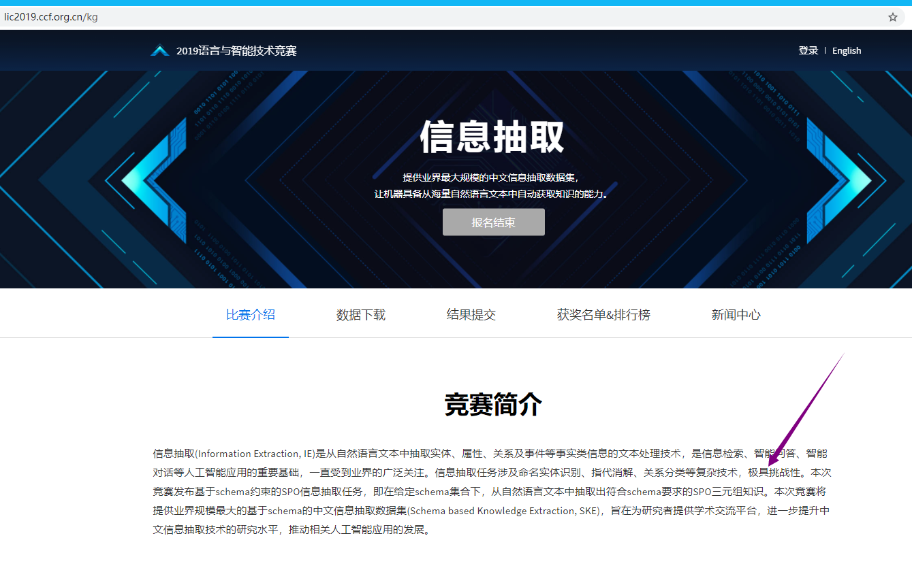
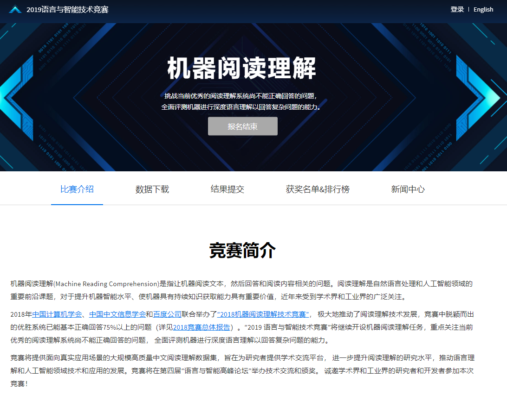

“AIIA”杯-国家电网-电力专业领域词汇挖掘 [u](https://www.datafountain.cn/competitions/320)

2019语言与智能技术竞赛 [u](http://lic2019.ccf.org.cn/)

> 机器阅读理解(Machine Reading Comprehension)是指让机器阅读文本，然后回答和阅读内容相关的问题。阅读理解是自然语言处理和人工智能领域的重要前沿课题，对于提升机器智能水平、使机器具有持续知识获取能力具有重要价值，近年来受到学术界和工业界的广泛关注。

> 信息抽取(Information Extraction, IE)是从自然语言文本中抽取实体、属性、关系及事件等事实类信息的文本处理技术，是信息检索、智能问答、智能对话等人工智能应用的重要基础，一直受到业界的广泛关注。信息抽取任务涉及命名实体识别、指代消解、关系分类等复杂技术，极具挑战性。本次竞赛发布基于schema约束的SPO信息抽取任务，即在给定schema集合下，从自然语言文本中抽取出符合schema要求的SPO三元组知识。本次竞赛将提供业界规模最大的基于schema的中文信息抽取数据集(Schema based Knowledge Extraction, SKE)，旨在为研究者提供学术交流平台，进一步提升中文信息抽取技术的研究水平，推动相关人工智能应用的发展。


最小熵原理（二）：“当机立断”之词库构建 [u](https://www.spaces.ac.cn/archives/5476)

> 互联网时代的社会语言学：基于SNS的文本数据挖掘 [u](http://www.matrix67.com/blog/archives/5044)
>
> 苏剑林 python3实现 [u](https://kexue.fm/archives/3491)
>
> > python3实现 [u](https://github.com/yanghanxy/New-Word-Detection)


**基于DGCNN和概率图的轻量级信息抽取模型** [u](https://kexue.fm/archives/6671)

> 抽取三元组  就是断言
>
> [知识图谱]神经关系抽取 [u](https://zhpmatrix.github.io/2019/06/30/neural-relation-extraction/)


分享一次**专业领域词汇的无监督挖掘** [u](https://kexue.fm/archives/6540)

> 基于最小熵原理的NLP库：nlp zero [u](https://kexue.fm/archives/5597)
>
> 最小熵原理（五）：“层层递进”之社区发现与聚类 [u](https://kexue.fm/archives/7006)


必须要GPT3吗？不，BERT的**MLM模型也能小样本学习** [u](https://kexue.fm/archives/7764)

> 那个屠榜的T5模型，现在可以在中文上玩玩了 [u](https://kexue.fm/archives/7867)


【语料】2500万中文三元组 [u](https://kexue.fm/archives/4359)


从语言模型到Seq2Seq：Transformer如戏，全靠Mask [u](https://www.spaces.ac.cn/archives/6933)

玩转Keras之seq2seq自动生成标题 [u](https://www.spaces.ac.cn/archives/5861)

用Transformer完全替代CNN [u](https://zhuanlan.zhihu.com/p/266311690)


## 互联网时代的社会语言学：基于SNS的文本数据挖掘


> 1. 统计所有字出现次数和概率
> 2. 统计所有词出现次数和概率
> 3. 算词中的所有字随机拼在一起的概率
> 4. 如果词概率远远大于里面的所有字随机拼在一起的概率，则认为词的凝合程度高
>    - **凝合程度** = 词概率  /  里面所有字随机拼在一起的概率


> 1. 统计所有词的左邻字集合、所有词的右邻字集合
> 2. 算所有词的左邻字信息熵，右邻字信息熵
> 3. **自由运用程度**  = 左邻字信息熵和右邻字信息熵中较小的那个
>> “吃葡萄不吐葡萄皮不吃葡萄倒吐葡萄皮”，“葡萄”一词出现了四次，其中左邻字分别为 {吃, 吐, 吃, 吐} ，右邻字分别为 {不, 皮, 倒, 皮} 。根据公式，“葡萄”一词的左邻字的信息熵为 – (1/2) · log(1/2) – (1/2) · log(1/2) ≈ 0.693 ，它的右邻字的信息熵则为 – (1/2) · log(1/2) – (1/4) · log(1/4) – (1/4) · log(1/4) ≈ 1.04 。可见，在这个句子中，“葡萄”一词的右邻字更加丰富一些


> 以**出现次数、凝合程度、自由运用程度** 这三个条件来对所有词进行筛选，选出来的就是“真实词”


> 1. 统计所有字的所有左邻和右邻？？


### 两个词随机拼成概率

词w1 出现概率：0.000113，词W2 出现的概率：0.0001969

则它们**随机拼在一起的概率**：0.000113 × 0.0001969


### 复合词的出现概率远远大于随机拼成概率

> 这说明组成复合词的独立词之间不是随机拼成的，是**真实词**


### “的电影”" 出现概率很接近随机拼成概率

> 说明它不是假词


### 凝合程度

> 凝合程度高，意味着内部片段**不是偶然拼在一起的**
>
> - 意思是：片断出现的概率远远大于独立的一部分单独出现的概率
>
> **凝合程度**最高的文本片段是诸如“蝙蝠”、“蜘蛛”、“彷徨”、“忐忑”、“玫瑰”之类的词了，这些词里的每一个字几乎总是会和另一个字同时出现，从不在其他场合中使用


### 真实词具有非常丰富的左邻字集合和右邻字集合

> “辈子”这个文本片段左边可以出现的字太有限，以至于直觉上我们可能会认为，“辈子”并不单独成词，真正成词的其实是“一辈子”、“这辈子”之类的整体


### “信息熵” 能够反映知道一个事件的结果后平均会给你带来多大的信息量

> 概率为 p 的事件发生了，得到的**信息量**是：$– log(p) $ 

- 事件发生**概率越小，得到的信息量越大**


### 六面骰子的信息熵

> 六个面分别是 1 、 1 、 1 、 2 、 2 、 3 
>
> 1/2 的机会得到 0.693 的信息量，1/3 的机会得到 1.0986 的信息量，1/6 的机会得到 1.79 的信息量，因而平均情况下你会得到 0.693/2 + 1.0986/3 + 1.79/6 ≈ 1.0114 的信息量。这个 1.0114 就是那颗骰子的信息熵


### 左邻右邻字信息熵

> “吃葡萄不吐葡萄皮不吃葡萄倒吐葡萄皮”，“葡萄”一词出现了四次，其中左邻字分别为 {吃, 吐, 吃, 吐} ，右邻字分别为 {不, 皮, 倒, 皮} 。根据公式，“葡萄”一词的左邻字的信息熵为 – (1/2) · log(1/2) – (1/2) · log(1/2) ≈ 0.693 ，它的右邻字的信息熵则为 – (1/2) · log(1/2) – (1/4) · log(1/4) – (1/4) · log(1/4) ≈ 1.04 。可见，在这个句子中，“葡萄”一词的右邻字更加丰富一些


### 文本片段的自由运用程度

> 我们不妨就把一个文本片段的自由运用程度**定义为它的左邻字信息熵和右邻字信息熵中的较小值**


### 文本片段的凝固程度和自由程度，两种判断标准缺一不可

> 只看凝固程度的话，程序会找出“巧克”、“俄罗”、“颜六色”、“柴可夫”等实际上是“半个词”的片段；只看自由程度的话，程序则会把“吃了一顿”、“看了一遍”、“睡了一晚”、“去了一趟”中的“了一”提取出来，因为**它的左右邻字都太丰富了**


### 参数阈值

> 长度不超过 d 的子串都当作潜在的词（即候选词，其中 d 为自己设定的候选词长度上限，我设定的值为 5 ），再为出现频数、凝固程度和自由程度各设定一个阈值，然后只需要提取出所有满足阈值要求的候选词即可


## 最小熵原理


### 香农信息量


$$
I(X=x^i) = log\frac{1}{p(x^i)} = - log\ p(x^i), \ i = 1,...,k
$$


如果**以2 为底，信息量的单位是比特**(bit)。$I(X=x^i)$ 中的$X=x^i$ 是一条信息，$I$ 是这条信息的**自信息量**(self-information)。$X$ 是信息源。

>  信息中的事件发生的概率越小，信息量越大

- **事件 = 随机变量** random variable


### 熵(entropy)  是所有事件的概率及其信息量之积的总和

> 信息源$X$ 的**熵(entropy)** 是**所有事件的概率及其信息量之积的总和**
>
> - **熵是平均能够获得的信息量，既稳定获得的信息量**


$$
H(p) = \sum^k_{i=1} p(x^i) \ log \frac{1}{p(x^i)} = - \sum^k_{i=1} p(x^i) \ log \ p(x^i)
$$


#### 后验概率


$$
p(X=x|Y=y) = \frac{p(Y=y|X=x) \ p(X=x)}{p(Y=y)}
$$

后验概率是观察到一个事件$Y=y$ 后，另一个事件的$X=x$ 的概率


$$
-log \ p_c
$$

> 概率为 p 的事件发生了，得到的**信息量**是：$– log(p) $ 


- 有一个骰子$1/2$ 的概率获得2 比特，$1/2$ 的概率获得3 比特

  > 平均能获得多少比特？既投掷足够多次以后，平均数是多少？
  >
  > > **掷100 次**，50 个2，50 个3，(100+150)/100 = 平均每次获得**2.5 比特** 
  > >
  > > $1/2 *2 + 1/2 * 3 = 2.5$


### 最小熵原理（一）：无监督学习的原理 [u](https://kexue.fm/archives/5448)


- “去冗余”（Redundancy Reduction）就是信息熵的最小化

  > 去掉其中一部分，但是并不减小总信息量
  >
  > > 说明它原本就是多余的。**能推导出来的东西就不要浪费存储空间**
  > >
  > > **规律有助于降低总体的信息熵**
  >
  > **有点像向量的线性独立？有部分量是并没有贡献新的维度**
- 不仅仅是NLP，**信息熵最小化很可能是所有无监督学习的根本**


- “知识”有一个固有信息熵，因为你的理解不透彻，所以表达的时侯带有“冗余”
  > 信息熵最小化意味着我们要想办法**减少未知，逼近固有信息熵**
  


#### 信息熵是正比于它的概率的负对数


$$
I(c) \sim -log \ p_c
$$


> 1/2 的机会得到 0.693 的信息量，1/3 的机会得到 1.0986 的信息量，1/6 的机会得到 1.79 的信息量，因而平均情况下你会得到 0.693/2 + 1.0986/3 + 1.79/6 ≈ 1.0114 的信息量。这个 1.0114 就是那颗骰子的信息熵


 **平均每一个汉字的信量是**


$$
\mathcal{H} = - \sum_{c \in 汉字} p_c log \ p_c
$$

> 信息熵 = 平均信息量？


#### 信息熵=学习成本


##### 固有信息和冗余信息

- 一个汉字的信息量约为 9.65比特
- 一个英文字母的信息量约为4.03比特

> 比较不同文字单元的信息量是没有意义的，有意义的是信息总量，也就是说**描述同样的意思时谁更简练**
>
> - **固有信息量相同的情况下，谁的冗余信息量最小**
>
>   > 也就是说，**同一个意思翻译后会人为的加入冗余信息**

- **冗余信息量其实就相当于记忆负荷**，越累赘的语言信息量越大，记忆负荷越大


### 最小熵原理（二）：“当机立断”之词库构建 [u](https://kexue.fm/archives/5476)


#### 平均字信息熵


假如一编文章分好词，每个词的信息量是：$- log \ p_w$，所有词不去重，总信息量是：
$$
- \sum_{w \in 语料} log \ p_w
$$







conda create -n tensorflow==1.12.0

https://github.com/sogou/SogouMRCToolkit

pip3 install tensorflow==1.12


```text
pip install tensorflow==1.12 -i https://pypi.tuna.tsinghua.edu.cn/simple
```


https://pypi.org/project/tensorflow/1.12.0/#files


```bash
conda create -n tensorflow_cpu pip python=3.6
conda activate tensorflow_cpu
conda install pytorch-cpu==1.0.0 torchvision-cpu==0.2.1 cpuonly -c pytorch
pip install stanfordnlp
pip install tensorflow==1.15
conda deactivate
conda info -e
conda env remove -n tensorflow_cpu
```


```bash
python -m spacy download en
pip install https://github.com/explosion/spacy-models/releases/download/en_core_web_sm-2.2.0/en_core_web_sm-2.2.0.tar.gz
nlp = spacy.load("en_core_web_sm")
```


QA数据集的经典之作——Stanford Question Answering Dataset（SQuAD）

https://cloud.tencent.com/developer/article/1438803

机器阅读理解。它的目标是根据给定的问题和文章，在文章中抽取或改写文字片段作为问题的答案。

搜索的未来是问答，而机器阅读理解是现今问答技术发展的核心之一


```
与旧版 TensorFlow 1 一起使用
tensorflow_hub 库需要 TensorFlow version 1.7 或更高版本。

我们强烈建议您使用 TensorFlow 1.15 进行安装，此版本默认采用与 TF1 兼容的行为，但其底层包含了许多 TF2 功能，允许使用 TensorFlow Hub 的 TF2 样式 API。

$ pip install "tensorflow>=1.15,<2.0"
$ pip install --upgrade tensorflow-hub
```


```python
install_requires=['numpy', 'tensorflow-gpu==1.12', 'tensorflow-hub', "tqdm", "spacy", "jieba",
                        "stanfordnlp"],
```

