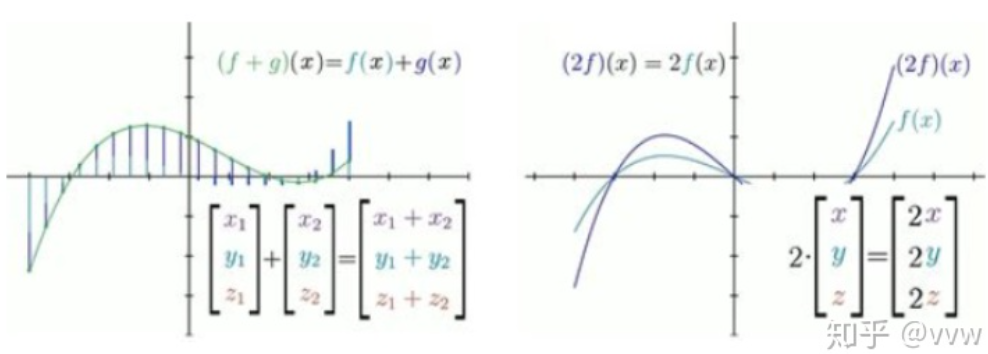

# 双隐层神经网络梯度下降公式推导


## 序言


双隐层比起单隐层复杂了很多，大量的变量参数和上下标容易让人眼花缭乱。但是一旦自已从零开始把公式推导出来，那个东西在你面前就不再有秘密。

文末附有双隐层神经网络求解异或问题的Python 实现。

更多数学细节请参考前一编：《梯度下降公式详细推导》。


## 一点无关紧要的说明

> 本文坚持把权重矩阵W 放在输入矩阵X 的前面，原因是$W$ 实际上代表的是一个线性变换，既$W$ 对$X$ 进行了线性变换，而不应该反过来。作为变换的向量实际上就是函数，这方向的知识可以参考视频：《线性代数的本质》


What I cannot create I do not understand

Things Happen for A Reason


**算子就是变换的别名，而变换又是函数的花俏说法。**


函数是一种向量

函数可进行加和与数乘运算，而因为向量也不过只有相加和数乘两种运算，所以最初以空间中箭头为背景来建立的线性代数的合理概念和解决问题的手段，例如：**线性变换，列空间、点积、特征值、特征向量等，都能够直接应用于函数**。





映射是函数的推广，**雅可比是梯度的推广**

> 梯度是偏导的向量，雅可比是梯度的向量


一个多元函数求偏导，每一元就得到一个偏导，n元偏导组成一个向量，这就是梯度。

m个多元函数求偏导，每一函数得到一个梯度，m个梯度组成一个矩阵，这就是雅可比矩阵。


函数的输出是标量，映射的输入输出都是向量

> 单个神经元就是一个函数，神经网络的执行就是一个映射
>
> > m 组输入构成的**向量**是**神经网络(映射)**的输入，m个预测构成的**向量**是**神经网络(映射)**的输出


应用链式法则求**某节点对其他节点的雅可比矩阵**，它**从结果节点开始**，沿着计算路径向前追溯，**逐节点计算雅可比**。将神经网络和损失函数连接成一个计算图，则它的输入、输出和参数都是节点，可利用自动求导**求损失值对网络参数的雅可比**，从而得到梯度。


$$
\begin{bmatrix}
w^{1}_{1,1} & w^{1}_{1,2} & \cdots & w^{1}_{1,n}  \\
w^{1}_{2,1} & w^{1}_{2,2} & \cdots & w^{1}_{2,n} \\
\vdots & \vdots & \ddots & \vdots & \\
w^{1}_{n,1} & w^{1}_{n,2} & \cdots & w^{1}_{n,n} \\
\end{bmatrix}

\cdot 

\begin{bmatrix}
x^{0}_{1,1} & x^{0}_{1,2} & \cdots & x^{0}_{1,m}  \\
x^{0}_{2,1} & x^{0}_{2,2} & \cdots & x^{0}_{2,m} \\
\vdots & \vdots & \ddots & \vdots & \\
x^{0}_{n,1} & x^{0}_{n,2} & \cdots & x^{0}_{n,m} \\
\end{bmatrix}

+ 

\begin{bmatrix}
b^{1}_{1,1} & b^{1}_{1,2} & \cdots & b^{1}_{1,m}  \\
b^{1}_{2,1} & b^{1}_{2,2} & \cdots & b^{1}_{2,m} \\
\vdots & \vdots & \ddots & \vdots & \\
b^{1}_{n,1} & b^{1}_{n,2} & \cdots & b^{1}_{n,m} \\
\end{bmatrix}

\\

= 

\begin{bmatrix}
a^{1}_{1,1} & a^{1}_{1,2} & \cdots & a^{1}_{1,m}  \\
a^{1}_{2,1} & a^{1}_{2,2} & \cdots & a^{1}_{2,m} \\
\vdots & \vdots & \ddots & \vdots & \\
a^{1}_{n,1} & a^{1}_{n,2} & \cdots & a^{1}_{n,m} \\
\end{bmatrix}
$$

$$
g \bigg (
\begin{bmatrix}
a^{1}_{1,1} & a^{1}_{1,2} & \cdots & a^{1}_{1,m}  \\
a^{1}_{2,1} & a^{1}_{2,2} & \cdots & a^{1}_{2,m} \\
\vdots & \vdots & \ddots & \vdots & \\
a^{1}_{n,1} & a^{1}_{n,2} & \cdots & a^{1}_{n,m} \\
\end{bmatrix}
\bigg )

= 

\begin{bmatrix}
x^{1}_{1,1} & x^{1}_{1,2} & \cdots & x^{1}_{1,m}  \\
x^{1}_{2,1} & x^{1}_{2,2} & \cdots & x^{1}_{2,m} \\
\vdots & \vdots & \ddots & \vdots & \\
x^{1}_{n,1} & x^{1}_{n,2} & \cdots & x^{1}_{n,m} \\
\end{bmatrix}
$$

$$
\begin{bmatrix}
w^{2}_{1,1} & w^{2}_{1,2} & \cdots & w^{2}_{1,n}  \\
\end{bmatrix}

\cdot 

\begin{bmatrix}
x^{1}_{1,1} & x^{1}_{1,2} & \cdots & x^{1}_{1,m}  \\
x^{1}_{2,1} & x^{1}_{2,2} & \cdots & x^{1}_{2,m} \\
\vdots & \vdots & \ddots & \vdots & \\
x^{1}_{n,1} & x^{1}_{n,2} & \cdots & x^{1}_{n,m} \\
\end{bmatrix}

+ 

\begin{bmatrix}
b^{2}_{1,1} & b^{2}_{1,2} & \cdots & b^{2}_{1,m}  \\
\end{bmatrix}
\\
= 
\begin{bmatrix}
a^{2}_{1,1} & a^{2}_{1,2} & \cdots & a^{2}_{1,m}  \\
\end{bmatrix}
$$

$$
g \bigg (
\begin{bmatrix}
a^{2}_{1,1} & a^{2}_{1,2} & \cdots & a^{2}_{1,m}  \\
\end{bmatrix}
\bigg )

= 

\begin{bmatrix}
h^{2}_{1,1} & h^{2}_{1,2} & \cdots & h^{2}_{1,m}  \\
\end{bmatrix}
$$


$$
w^1_{i,j} \ for \ i, j \in 1 \cdots n  \\
\begin{bmatrix}
w^1_{i,1} & w^1_{i,2} & \cdots & w^1_{i,n}   \\
\end{bmatrix}

\cdot 

\begin{bmatrix}
x^{0}_{1,s}  \\
x^{0}_{2,s}  \\
\vdots  \\
x^{0}_{n,s} \\
\end{bmatrix}

+  b^1_{i,s}

 =
 
 a^1_{i,s}
 
 \ for \ s \in 1 \cdots m  \\
$$


$$
w^2_{1,j} \ for \ j \in 1 \cdots n  \\
\begin{bmatrix}
w^2_{1,1} & w^2_{1,2} & \cdots & w^2_{1,n}   \\
\end{bmatrix}

\cdot 

\begin{bmatrix}
g(a^{1}_{1,s})  \\
g(a^{1}_{2,s})  \\
\vdots  \\
g(a^{1}_{n,s}) \\
\end{bmatrix}

+  b^2_{1,s}

 =
 
 a^2_{1,s}
 
  \ for \ s \in 1 \cdots m  \\
$$


第一层偏导


$$
\frac{\partial}{\partial w^1_{i,j}} a^2_{1,s} =

\frac{\partial}{\partial w^1_{i,j}} 
\bigg [
w^2_{1,i} \cdot g(a^{1}_{i,s}) +  b^2_{1,s}
\bigg ] \\
= w^2_{1,i} \frac{\partial}{\partial w^1_{i,j}} g(a^{1}_{i,s}) \\
= w^2_{1,i} g(a^{1}_{i,s}) (1 - g(a^{1}_{i,s})) \frac{\partial}{\partial w^1_{i,j}} a^{1}_{i,s}
\\
= w^2_{1,i} g(a^{1}_{i,s}) (1 - g(a^{1}_{i,s})) \frac{\partial}{\partial w^1_{i,j}} (w^1_{i,j} x^0_{j,s} +  b^1_{i,s}) \\

= w^2_{1,i} g(a^{1}_{i,s}) (1 - g(a^{1}_{i,s}))  x^0_{j,s}
$$


$$
b^1_{i,k} 
\ for \ i \in 1 \cdots n , \ 
\ k \in 1 \cdots m  \\

\frac{\partial}{\partial b^1_{i,k}} a^2_{1,s} =

\frac{\partial}{\partial b^1_{i,k}} 
\bigg [
w^2_{1,i} \cdot g(a^{1}_{i,s}) +  b^2_{1,s}
\bigg ] \\
= w^2_{1,i} \frac{\partial}{\partial b^1_{i,k}} g(a^{1}_{i,s}) \\
= w^2_{1,i} g(a^{1}_{i,s}) (1 - g(a^{1}_{i,s})) \frac{\partial}{\partial b^1_{i,k}} a^{1}_{i,s}
\\
= w^2_{1,i} g(a^{1}_{i,s}) (1 - g(a^{1}_{i,s})) \frac{\partial}{\partial b^1_{i,k}} (w^1_{i,j} x^0_{j,s} +  b^1_{i,s}) \\

= w^2_{1,i} g(a^{1}_{i,s}) (1 - g(a^{1}_{i,s}))  \frac{\partial}{\partial b^1_{i,k}} b^1_{i,s}
$$


$$
\frac{\partial}{\partial b^1_{i,k}} b^1_{i,s} =  0, if \ k \neq s  \\
\frac{\partial}{\partial b^1_{i,k}} b^1_{i,s} =  1, if \ k = s
$$


$$
\frac{\partial}{\partial w^1_{i,j}} \mathcal{L} = \frac{\partial}{\partial w^1_{i,j}} 
\bigg [
\frac{1}{2m} \sum^{m}_{s=1}(h^{2}_{1,s} - y_{1,s})^2 
\bigg ]
, \ for \ i, j \in 1 \cdots n  \\
\\

= \frac{1}{m} \sum^{m}_{s=1} 

(h^{2}_{1,s} - y_{1,s}) \frac{\partial}{\partial w^1_{i,j}} h^{2}_{1,s} 

\\


= \frac{1}{m} \sum^{m}_{s=1} 

(h^{2}_{1,s} - y_{1,s}) \frac{\partial}{\partial w^1_{i,j}} g(a^2_{1,s}) 

\\

= \frac{1}{m} \sum^{m}_{s=1} 

(h^{2}_{1,s} - y_{1,s}) g(a^2_{1,s}) (1 - g(a^2_{1,s}))  \frac{\partial}{\partial w^1_{i,j}} a^2_{1,s}  \\

= \frac{1}{m} \sum^{m}_{s=1} 

(h^{2}_{1,s} - y_{1,s}) g(a^2_{1,s}) (1 - g(a^2_{1,s}))  w^2_{1,i} g(a^{1}_{i,s}) (1 - g(a^{1}_{i,s}))  x^0_{j,s} \\
$$


$$
\frac{\partial}{\partial b^1_{i,k}} \mathcal{L} = \frac{\partial}{\partial b^1_{i,k}} 
\bigg [
\frac{1}{2m} \sum^{m}_{s=1}(h^{2}_{1,s} - y_{1,s})^2 
\bigg ]
, \ for \ i \in 1 \cdots n , \ 
\ k \in 1 \cdots m  \\
\\

= \frac{1}{m} \sum^{m}_{s=1} 

(h^{2}_{1,s} - y_{1,s}) \frac{\partial}{\partial b^1_{i,k}} h^{2}_{1,s} 

\\


= \frac{1}{m} \sum^{m}_{s=1} 

(h^{2}_{1,s} - y_{1,s}) \frac{\partial}{\partial b^1_{i,k}} g(a^2_{1,s}) 

\\

= \frac{1}{m} \sum^{m}_{s=1} 

(h^{2}_{1,s} - y_{1,s}) g(a^2_{1,s}) (1 - g(a^2_{1,s}))  \frac{\partial}{\partial b^1_{i,k}} a^2_{1,s}  \\

= \frac{1}{m} \sum^{m}_{s=1} 

(h^{2}_{1,s} - y_{1,s}) g(a^2_{1,s}) (1 - g(a^2_{1,s}))  

w^2_{1,i} g(a^{1}_{i,s}) (1 - g(a^{1}_{i,s}))  \frac{\partial}{\partial b^1_{i,k}} b^1_{i,s}

\\
$$

$$
\frac{\partial}{\partial b^1_{i,k}} b^1_{i,s} =  0, if \ k \neq s  \\
\frac{\partial}{\partial b^1_{i,k}} b^1_{i,s} =  1, if \ k = s
$$


第二层偏导


$$
a^2_{1,s} = w^2_{1,*} \cdot x^1_{*,s} + b^2_{1,s} , \ for \ s \in 1 \cdots m  \\
\frac{\partial}{\partial w^2_{1,j}} a^2_{1,s} = 
\frac{\partial}{\partial w^2_{1,j}} (w^2_{1,j} \  x^1_{j,s} ) \\
= x^1_{j,s}
$$

$$
\frac{\partial}{\partial w^2_{1,j}} \mathcal{L} = \frac{\partial}{\partial w^2_{1,j}} 
\bigg [
\frac{1}{2m} \sum^{m}_{s=1}(h^{2}_{1,s} - y_{1,s})^2 
\bigg ]
, \ for \ j \in 1 \cdots n  \\
\\

= \frac{1}{m} \sum^{m}_{s=1} 

(h^{2}_{1,s} - y_{1,s}) \frac{\partial}{\partial w^2_{1,j}} h^{2}_{1,s} 

\\


= \frac{1}{m} \sum^{m}_{s=1} 

(h^{2}_{1,s} - y_{1,s}) \frac{\partial}{\partial w^2_{1,j}} g(a^2_{1,s}) 

\\

= \frac{1}{m} \sum^{m}_{s=1} 

(h^{2}_{1,s} - y_{1,s}) g(a^2_{1,s}) (1 - g(a^2_{1,s}))  \frac{\partial}{\partial w^2_{1,j}} a^2_{1,s}  \\

= \frac{1}{m} \sum^{m}_{s=1} 

(h^{2}_{1,s} - y_{1,s}) g(a^2_{1,s}) (1 - g(a^2_{1,s}))  x^1_{j,s}  \\
$$

$$
a^2_{1,s} = w^2_{1,*} \cdot x^1_{*,s} + b^2_{1,s} , \ for \ s \in 1 \cdots m  \\

\frac{\partial}{\partial b^2_{1,k}} a^2_{1,s} = 
\frac{\partial}{\partial b^2_{1,k}} b^2_{1,s}
\\
\frac{\partial}{\partial b^2_{1,k}} b^2_{1,s} =  0, if \ k \neq s
\\
\frac{\partial}{\partial b^2_{1,k}} b^2_{1,s} =  1, if \ k = s
$$


$$
\frac{\partial}{\partial b^2_{1,k}} \mathcal{L} = \frac{\partial}{\partial b^2_{1,k}} 
\bigg [
\frac{1}{2m} \sum^{m}_{s=1}(h^{2}_{1,s} - y_{1,s})^2 
\bigg ]
, \ for \ k \in 1 \cdots m  \\
\\

= \frac{1}{m} \sum^{m}_{s=1} 

(h^{2}_{1,s} - y_{1,s}) \frac{\partial}{\partial b^2_{1,k}} h^{2}_{1,s} 

\\


= \frac{1}{m} \sum^{m}_{s=1} 

(h^{2}_{1,s} - y_{1,s}) \frac{\partial}{\partial b^1_{i,k}} g(a^2_{1,s}) 

\\

= \frac{1}{m} \sum^{m}_{s=1} 

(h^{2}_{1,s} - y_{1,s}) g(a^2_{1,s}) (1 - g(a^2_{1,s}))  \frac{\partial}{\partial b^2_{1,k}} a^2_{1,s}  \\
$$


$$
b^2_{1,k} \ for \ k \in 1 \cdots m  \\

\frac{\partial}{\partial b^2_{1,k}} a^2_{1,s} =
\frac{\partial}{\partial b^2_{1,k}}
\bigg [
w^2_{1,j} \cdot g(a^{1}_{j,s}) +  b^2_{1,s}
\bigg ] \\

\frac{\partial}{\partial b^2_{1,k}} b^2_{1,s}  \\
$$

$$
\frac{\partial}{\partial b^2_{1,k}} b^2_{1,s} = 0, \ if \ s \neq k  \\

\frac{\partial}{\partial b^2_{1,k}} b^2_{1,s} = 1, \ if \ s = k  \\
$$


```python
import numpy as np
import itertools


def sigmoid(x):
    return 1/(1 + np.exp(-x))

# 激活函数的导函数
def derivative_sigmoid(x):
    d = sigmoid(x)
    return d * (1 - d)

if __name__ == "__main__":

    """
    异或问题，双隐层神经网络算法
    """
    m = 4 # 样本数
    n = 2 # 每个样本的维度

    alpha = 0.5 # 学习率
    maxIter = 50000 # 最大迭代次数

    x_0 = np.array([
                [0, 0, 1, 1],
                [0, 1, 0, 1]
            ], np.float)
    # (2 * 4) 输入

    Y = np.array([
                [0, 1, 1, 0]
            ], np.float)
    # (1 * 4) 输出

    W_1 = np.random.uniform(size=(n, n))   # 隐层一权重
    # (2 * 2) (2 * 4) -> (2 * 4)

    b_1 = np.random.uniform(size=(n, m))   # 隐层一偏置


    W_2 = np.random.uniform(size=(1, n))   # 隐层二权重
    # (1 * 2) (2 * 4) -> (1 * 4)

    b_2 = np.random.uniform(size=(1, m))   # 隐层二偏置

    for k in range(50000): # 50000
        """
        前向传播部分开始
        """
        a_1 = np.dot(W_1, x_0) + b_1    
        x_1 = sigmoid(a_1)           # (2 * 4) 
        
        a_2 = np.dot(W_2, x_1) + b_2 # ()
        h_2 = sigmoid(a_2)                  # 预测结果

        E = h_2 - Y                         # 误差值

        errs = sum( list(itertools.chain(*abs(E))) )  # 误差总和
        if errs < 0.05:
            print(f'stop at {k}')
            """
            输出训练好的参数
            """
            print("Weight1: \n",W_1)
            print("b1: \n",b_1)
            print("Weight2: \n",W_2)
            print("b2: \n",b_2)
            break

        print(f'curr errs:', errs) 


        """
        反向传播部分开始
        """

        """
        权重更新
        """
        a_2_derivative = derivative_sigmoid(a_2)  # 求a_2 的导数
        a_1_derivative = derivative_sigmoid(a_1)  # 求a_1 的导数

        # 第一层权重的更新
        for i in range(n):
            for j in range(n):
                sums = 0
                for s in range(m):
                    sums += E[0][s] * a_2_derivative[0][s] * W_2[0][i] * a_1_derivative[i][s] * x_0[j][s]

                W_1[i][j] = W_1[i][j] - alpha * (1/m) * sums  # 更新权重


        # 第一层偏置的更新
        for i in range(n):
            for k in range(m):
                sums = 0
                for s in range(m):
                    if k == s:
                       sums += E[0][s] * a_2_derivative[0][s] * W_2[0][i] * a_1_derivative[i][s]
                
                b_1[i][k] = b_1[i][k] - alpha * (1/m) * sums # 更新偏置


        # 第二层权重的更新
        for j in range(n):
            sums = 0
            for s in range(m):
                sums += E[0][s] * a_2_derivative[0][s] * x_1[j][s]

            W_2[0][j] = W_2[0][j] - alpha * (1/m) * sums  # 更新
            
        
        # 第二层偏置的更新
        for k in range(m):
            sums = 0
            for s in range(m):
                if s == k:
                    sums += E[0][s] * a_2_derivative[0][s]
            
            b_2[0][k] = b_2[0][k] - alpha * (1/m) * sums # 更新
```


