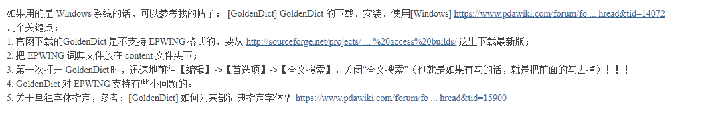

[epwing doc](http://www.mistys-internet.website/eb/index-en.html)


  D:\workcode\cpp\goldendict\build>D:\Qt\4.8.7\bin\moc.exe -o "D:\workcode\cpp\goldendict\build\moc_ui_dictheadwords.cpp"    "D:\workcode\cpp\goldendict\build\ui_dictheadwords.h"


linux .o,.a,.so
        .o,是目标文件,相当于windows中的.obj文件 

　　.so 为共享库,是shared object,用于动态连接的,相当于windows下的dll 

　　.a为静态库,是好多个.o合在一起,用于静态连接 


**一定要观察qtcreator 的堆栈窗口** 

控件 ->视图 ->栈

> 锁定取消就可以拖大窗口了

```c++

epwing_book.cc
  eb_set_binary_wave( &book, &spos, &epos );
    # 音频读取在这里
	spos.offset = 1630
    spos.page = 201297
    
    epos.offset = 1839
    epos.page = 201298
    
    eb_read_binary( &book, BinaryBufferSize,
                              buffer.data(), &length );
	

epwing.cc
    
    vector< sptr< Dictionary::Class > > makeDictionaries
    	# 总入口	
    
    sptr< Dictionary::DataRequest > req = getArticle( GD_NATIVE_TO_WS( L"00databaseinfo" 
    
    dict.eBook.getArticlePos( gd::toQString( word ), pg, off );
      # 输入词，得到词的 page, offset
      # 查词方法就在里面了，词头列表还不知道
                                           
    vector< WordArticleLink > chain = dict.findArticles( word, ignoreDiacritics );
	EpwingArticleRequest
    eBook.getArticle( headword, text, articlePage, articleOffset, false );
	headword       A级
    articlePage    11721
    articleOffset  1490

epwing_book.cc
EB_Error_Code hook_wave( EB_Book * book, EB_Appendix *, void * container,
                         EB_Hook_Code code, int, const unsigned int * argv )

// 把这个条件改成True
if ( Dictionary::needToRebuildIndex( dictFiles, indexFile ) ||
                 indexIsOldOrBad( indexFile ) )

EpwingDictionary::EpwingDictionary

vector< sptr< Dictionary::Class > > makeDictionaries
	bool indexIsOldOrBad( string const & indexFile )

```


```
if( readHeadword( hits[ i ].heading, headword, true ) )
```


```c++
#include <QString>
#include <QTextCodec>

#include <QTextStream>
#include <QTextDocumentFragment>

#include <eb/eb.h>
#include <eb/text.h>
#include <eb/appendix.h>
#include <eb/error.h>
#include <eb/binary.h>
#include <eb/font.h>


int iloadDict() {

   EB_Book book;
   EB_Appendix appendix;
   EB_Subbook_Code subBookList[ EB_MAX_SUBBOOKS ];

   int subBookCount;
   int currentSubBook = 0;
   EB_Position currentPosition;

   QString error_string;
   const char * errs;
   const char * errmsg;

   char buf[ EB_MAX_TITLE_LENGTH + 1 ];
   char buffer[ EB_MAX_PATH_LENGTH + 1 ];

   eb_initialize_book( &book );
   EB_Error_Code ret = eb_bind( &book, "E:\\GoldenDict\\content\\NHK" );

   eb_initialize_appendix(&appendix);

   ret = eb_subbook_list( &book, subBookList, &subBookCount );
   ret = eb_set_subbook( &book, subBookList[ currentSubBook ] );


   ret = eb_subbook_title( &book, buf );
   QTextCodec * codec_ISO, * codec_GB, * codec_Euc;
   codec_ISO = QTextCodec::codecForName( "ISO8859-1" );
   codec_GB = QTextCodec::codecForName( "GB2312" );
   codec_Euc = QTextCodec::codecForName("EUC-JP");

   QString title = codec_Euc->toUnicode( buf ); // QString

   ret = eb_subbook_directory2( &book, subBookList[ currentSubBook ], buffer );


   QString subbook_dir = QString::fromLocal8Bit( buffer );

   int isHaveCopyrightQ = eb_have_copyright( &book );

   if( isHaveCopyrightQ ) {
       EB_Position position;
       ret = eb_copyright( &book, &position );
       currentPosition = position;
   }


   EB_Position pos;

   int isHaveMenu = eb_have_menu(&book);
   if ( isHaveMenu == 1) {
       ret = eb_menu(&book, &pos);
       if (pos.offset != -1 && pos.page != -1) {
           ret = eb_seek_text(&book, &pos);
           char buff[1024+1] = {0};
           ssize_t len;

           QByteArray b;
           for (;;) {

               ret = eb_read_text(&book, &appendix, NULL, NULL,
                                1024, buff, &len);
               if (ret != EB_SUCCESS) {
                   errs =  eb_error_string( ret );
                   errmsg = eb_error_message( ret );
                   break;
               }

               if (len > 0)
                   b += QByteArray(buff, (int)len);

               char* bf = b.data();
               QString s = codec_Euc->toUnicode( bf );
               QString ss = codec_Euc->toUnicode( buff );


               if (!eb_is_text_stopped(&book))  // 返回1 表示当前这条数据已读完，可以开始读下一条数据了，否则continue 继续读
                       continue;

               ret = eb_forward_text(&book, NULL);
               if (ret != EB_SUCCESS) {
                   errs =  eb_error_string( ret );
                   errmsg = eb_error_message( ret );
                   if (ret == EB_ERR_END_OF_CONTENT) {
                       break;
                   } else {
                       break;
                   }
               }

               int i;
               i = 0;
           }
        }
   }


   ret = eb_text(&book, &pos);
   ret = eb_seek_text(&book, &pos);


   //return getText( position.page, position.offset, true );


   if( ret != EB_SUCCESS )
   {
     errs =  eb_error_string( ret );
     errmsg = eb_error_message( ret );

   }


   eb_finalize_book( &book );
   eb_finalize_appendix(&appendix);

}

```


```
EB_Book book;

epwing_book.cc
	int EpwingBook::setBook( string const & directory )
```


```
std::vector< sptr< Dictionary::Class > > & dictionaries
dictionaries.clear();
```


```

sources.ui
	QPushButton
		rescan  # objectName
		Re&scan now # Text

sources.hh
	private slots:
		void on_rescan_clicked();

sources.cc
	void Sources::on_rescan_clicked()
	{
  		emit rescan();
	}

editdictionaries.cc
	connect( &sources, SIGNAL( rescan() ), this, SLOT( rescanSources() ) );

	void EditDictionaries::rescanSources()
	{
  		acceptChangedSources( true );
	}
	
	void EditDictionaries::acceptChangedSources( bool rebuildGroups )
		loadDictionaries( this, true, cfg, dictionaries, dictNetMgr );

	
	# 这里下断
	void loadDictionaries( QWidget * parent, bool showInitially,
                       Config::Class const & cfg,
                       std::vector< sptr< Dictionary::Class > > & dictionaries,
                       QNetworkAccessManager & dictNetMgr,
                       bool doDeferredInit_ )
    	 dictionaries.clear();
		 ::Initializing init( parent, showInitially );
		 
		 // Start a thread to load all the dictionaries
		 LoadDictionaries loadDicts( cfg );  # 初始化一个类
		 

  		 loadDicts.start();  # 多线程开始
		 localLoop.exec();
  		 loadDicts.wait();


loaddictionaries.cc
void LoadDictionaries::handlePath( Config::Path const & path )
#ifndef NO_EPWING_SUPPORT
  {
    vector< sptr< Dictionary::Class > > epwingDictionaries =
      Epwing::makeDictionaries( allFiles, FsEncoding::encode( Config::getIndexDir() ), *this );

    dictionaries.insert( dictionaries.end(), epwingDictionaries.begin(),
                         epwingDictionaries.end() );
  }

ui_mainwindow.h
	QAction *rescanFiles;  
    rescanFiles = new QAction(MainWindow);
    rescanFiles->setObjectName(QString::fromUtf8("rescanFiles"));
    rescanFiles->setMenuRole(QAction::NoRole);

epwing_book.cc
 EB_Book book;
 EB_Error_Code ret = eb_bind( &book, directory.c_str() );  // 469

LoadDictionaries::LoadDictionaries( Config::Class const & cfg )
cfg.path = "E:\\GoldenDict\\content\\NHK";

/// A list of paths where to search for the dictionaries
typedef QVector< Path > Paths;

nameFilters QStringList
["*catalogs"]
```


```
$(QTDIR)\lib\QtWebKitd4.lib
$(QTDIR)\lib\Qt5Quickd.lib
$(QTDIR)\lib\Qt5MultimediaWidgetsd.lib
$(QTDIR)\lib\Qt5OpenGLd.lib
$(QTDIR)\lib\Qt5PrintSupportd.lib
$(QTDIR)\lib\Qt5Svgd.lib
$(QTDIR)\lib\Qt5WebKitd.lib
$(QTDIR)\lib\Qt5Qmld.lib
$(QTDIR)\lib\QtMultimediad4.lib
$(QTDIR)\lib\Qt5Widgetsd.lib
$(QTDIR)\lib\Qt5Sensorsd.lib
$(QTDIR)\lib\QtNetworkd4.lib
$(QTDIR)\lib\QtXmld4.lib
$(QTDIR)\lib\QtGuid4.lib
$(QTDIR)\lib\QtCored4.lib
```


```
qtmain.lib
avutil-gd.lib
avcodec-gd.lib
avformat-gd.lib
ao.lib
z.lib
bz2.lib
hunspell.lib
lzo2.lib
iconv.lib
vorbisfile.lib
vorbis.lib
ogg.lib
wsock32.lib
psapi.lib
ole32.lib
oleaut32.lib
advapi32.lib
comdlg32.lib
$(QTDIR)\lib\QtWebKitd4.lib
$(QTDIR)\lib\QtSvgd4.lib
$(QTDIR)\lib\QtMultimediad4.lib
$(QTDIR)\lib\QtNetworkd4.lib
$(QTDIR)\lib\QtXmld4.lib
$(QTDIR)\lib\QtGuid4.lib
$(QTDIR)\lib\QtCored4.lib
libEGLd.lib
libGLESv2d.lib
gdi32.lib
user32.lib
```


```c++

loaddictionaries.cc

   for( Config::Paths::const_iterator i = paths.begin(); i != paths.end(); ++i )
      handlePath( *i );
    
    void LoadDictionaries::handlePath( Config::Path const & path )
    
    vector< sptr< Dictionary::Class > > epwingDictionaries =
      Epwing::makeDictionaries( allFiles, FsEncoding::encode( Config::getIndexDir() ), *this );

    dictionaries.insert( dictionaries.end(), epwingDictionaries.begin(),
                         epwingDictionaries.end() );    
    
epwing.cc
    
vector< sptr< Dictionary::Class > > makeDictionaries(
                                      vector< string > const & fileNames,
                                      string const & indicesDir,
                                      Dictionary::Initializing & initializing )

    
EpwingDictionary::EpwingDictionary( string const & id,
                                    string const & indexFile,
                                    vector< string > const & dictionaryFiles,
                                    int subBook ):
  BtreeDictionary( id, dictionaryFiles )
```





https://www.pdawiki.com/forum/thread-11705-1-1.html


如果用的是 Windows 系统的话，可以参考我的帖子： [GoldenDict] GoldenDict 的下载、安装、使用[Windows] https://www.pdawiki.com/forum/fo ... hread&tid=14072# p( C0 a6 ]% n1 ~; r
几个关键点：6 s6 H1 L; [% E% E
1. 官网下载的GoldenDict 是不支持 EPWING 格式的，要从 http://sourceforge.net/projects/ ... %20access%20builds/ 这里下载最新版；% K% e- e% ?, t) ^) Y
2. 把 EPWING 词典文件放在 content 文件夹下；9 _: E; O" Z5 p) M/ `* }
3. 第一次打开 GoldenDict 时，迅速地前往【编辑】->【首选项】->【全文搜索】，关闭“全文搜索”（也就是如果有勾的话，就是把前面的勾去掉）！！！9 p/ N# O/ q: M3 t( e9 X
4. GoldenDict 对 EPWING 支持有些小问题的。
5. 关于单独字体指定，参考：[GoldenDict] 如何为某部词典指定字体？ https://www.pdawiki.com/forum/fo ... hread&tid=15900


## Windows QT 编译


```
15:50:10: 为项目goldendict执行步骤 ...
15:50:10: 正在启动 "E:\mingw32\bin\mingw32-make.exe" clean

E:/mingw32/bin/mingw32-make -f Makefile.Debug clean
mingw32-make[1]: Entering directory 'D:/workcode/cpp/build-goldendict-unknown-Debug'
del locale\ru_RU.qm locale\zh_CN.qm locale\cs_CZ.qm locale\de_DE.qm locale\el_GR.qm locale\bg_BG.qm locale\ar_SA.qm locale\lt_LT.qm locale\uk_UA.qm locale\vi_VN.qm locale\it_IT.qm locale\pl_PL.qm locale\ja_JP.qm locale\zh_TW.qm locale\sq_AL.qm locale\pt_BR.qm locale\es_AR.qm locale\es_BO.qm locale\es_ES.qm locale\sk_SK.qm locale\tr_TR.qm locale\qu_WI.qm locale\tg_TJ.qm locale\ay_WI.qm locale\be_BY.qm locale\be_BY@latin.qm locale\fr_FR.qm locale\ko_KR.qm locale\nl_NL.qm locale\sr_SR.qm locale\sv_SE.qm locale\tk_TM.qm locale\fa_IR.qm locale\mk_MK.qm locale\eo_EO.qm locale\fi_FI.qm locale\jb_JB.qm
del build\moc_mainwindow.cpp build\moc_dictionary.cpp build\moc_config.cpp build\moc_sources.cpp build\moc_initializing.cpp build\moc_article_netmgr.cpp build\moc_groups.cpp build\moc_groups_widgets.cpp build\moc_article_maker.cpp build\moc_scanpopup.cpp build\moc_articleview.cpp build\moc_audioplayerinterface.cpp build\moc_ffmpegaudioplayer.cpp build\moc_multimediaaudioplayer.cpp build\moc_externalaudioplayer.cpp build\moc_externalviewer.cpp build\moc_wordfinder.cpp build\moc_groupcombobox.cpp build\moc_mouseover.cpp build\moc_preferences.cpp build\moc_mediawiki.cpp build\moc_hotkeywrapper.cpp build\moc_hotkeyedit.cpp build\moc_editdictionaries.cpp build\moc_loaddictionaries.cpp build\moc_website.cpp build\moc_orderandprops.cpp build\moc_dictionarybar.cpp build\moc_history.cpp build\moc_articlewebview.cpp build\moc_webmultimediadownload.cpp build\moc_forvo.cpp build\moc_about.cpp build\moc_programs.cpp build\moc_dictspanewidget.cpp build\moc_maintabwidget.cpp build\moc_mainstatusbar.cpp build\moc_gdappstyle.cpp build\moc_mruqmenu.cpp build\moc_dictinfo.cpp build\moc_stylescombobox.cpp build\moc_extlineedit.cpp build\moc_translatebox.cpp build\moc_historypanewidget.cpp build\moc_wordlist.cpp build\moc_ffmpegaudio.cpp build\moc_articleinspector.cpp build\moc_dictheadwords.cpp build\moc_fulltextsearch.cpp build\moc_helpwindow.cpp build\moc_favoritespanewidget.cpp build\moc_texttospeechsource.cpp build\moc_speechclient.cpp build\moc_chineseconversion.cpp build\moc_qtsingleapplication.cpp build\moc_qtlocalpeer.cpp
del build\qrc_resources.cpp build\qrc_flags.cpp
del build\ui_groups.h build\ui_dictgroupwidget.h build\ui_mainwindow.h build\ui_sources.h build\ui_initializing.h build\ui_scanpopup.h build\ui_articleview.h build\ui_preferences.h build\ui_about.h build\ui_editdictionaries.h build\ui_orderandprops.h build\ui_dictinfo.h build\ui_dictheadwords.h build\ui_authentication.h build\ui_fulltextsearch.h build\ui_texttospeechsource.h build\ui_chineseconversion.h
del build\folding.o build\main.o build\dictionary.o build\config.o build\sources.o build\mainwindow.o build\utf8.o build\file.o build\bgl_babylon.o build\bgl.o build\initializing.o build\article_netmgr.o build\dictzip.o build\btreeidx.o build\stardict.o build\chunkedstorage.o build\xdxf2html.o build\iconv.o build\lsa.o build\htmlescape.o build\dsl.o build\dsl_details.o build\filetype.o build\fsencoding.o build\groups.o build\groups_widgets.o build\instances.o build\article_maker.o build\scanpopup.o build\articleview.o build\audioplayerfactory.o build\multimediaaudioplayer.o build\externalaudioplayer.o build\externalviewer.o build\wordfinder.o build\groupcombobox.o build\keyboardstate.o build\mouseover.o build\preferences.o build\mutex.o build\mediawiki.o build\sounddir.o build\hunspell.o build\dictdfiles.o build\audiolink.o build\wstring.o build\wstring_qt.o build\processwrapper.o build\hotkeywrapper.o build\hotkeyedit.o build\langcoder.o build\editdictionaries.o build\loaddictionaries.o build\transliteration.o build\romaji.o build\belarusiantranslit.o build\russiantranslit.o build\german.o build\website.o build\orderandprops.o build\language.o build\dictionarybar.o build\broken_xrecord.o build\history.o build\atomic_rename.o build\articlewebview.o build\zipfile.o build\indexedzip.o build\termination.o build\greektranslit.o build\webmultimediadownload.o build\forvo.o build\country.o build\about.o build\programs.o build\parsecmdline.o build\maintabwidget.o build\mainstatusbar.o build\gdappstyle.o build\ufile.o build\xdxf.o build\sdict.o build\decompress.o build\aard.o build\mruqmenu.o build\dictinfo.o build\zipsounds.o build\stylescombobox.o build\extlineedit.o build\translatebox.o build\historypanewidget.o build\wordlist.o build\mdictparser.o build\mdx.o build\voiceengines.o build\ffmpegaudio.o build\articleinspector.o build\delegate.o build\zim.o build\gddebug.o build\gestures.o build\tiff.o build\dictheadwords.o build\fulltextsearch.o build\ftshelpers.o build\dictserver.o build\helpwindow.o
del build\slob.o build\ripemd.o build\gls.o build\splitfile.o build\favoritespanewidget.o build\treeview.o build\ThTypes.o build\wordbyauto.o build\guids.o build\x64.o build\speechclient_win.o build\texttospeechsource.o build\speechhlp.o build\epwing.o build\epwing_book.o build\epwing_charmap.o build\chinese.o build\chineseconversion.o build\qtsingleapplication.o build\qtlocalpeer.o build\moc_mainwindow.o build\moc_dictionary.o build\moc_config.o build\moc_sources.o build\moc_initializing.o build\moc_article_netmgr.o build\moc_groups.o build\moc_groups_widgets.o build\moc_article_maker.o build\moc_scanpopup.o build\moc_articleview.o build\moc_audioplayerinterface.o build\moc_ffmpegaudioplayer.o build\moc_multimediaaudioplayer.o build\moc_externalaudioplayer.o build\moc_externalviewer.o build\moc_wordfinder.o build\moc_groupcombobox.o build\moc_mouseover.o build\moc_preferences.o build\moc_mediawiki.o build\moc_hotkeywrapper.o build\moc_hotkeyedit.o build\moc_editdictionaries.o build\moc_loaddictionaries.o build\moc_website.o build\moc_orderandprops.o build\moc_dictionarybar.o build\moc_history.o build\moc_articlewebview.o build\moc_webmultimediadownload.o build\moc_forvo.o build\moc_about.o build\moc_programs.o build\moc_dictspanewidget.o build\moc_maintabwidget.o build\moc_mainstatusbar.o build\moc_gdappstyle.o build\moc_mruqmenu.o build\moc_dictinfo.o build\moc_stylescombobox.o build\moc_extlineedit.o build\moc_translatebox.o build\moc_historypanewidget.o build\moc_wordlist.o build\moc_ffmpegaudio.o build\moc_articleinspector.o build\moc_dictheadwords.o build\moc_fulltextsearch.o build\moc_helpwindow.o build\moc_favoritespanewidget.o build\moc_texttospeechsource.o build\moc_speechclient.o build\moc_chineseconversion.o build\moc_qtsingleapplication.o build\moc_qtlocalpeer.o build\qrc_resources.o build\qrc_flags.o
del build\goldendict_res.o
mingw32-make[1]: Leaving directory 'D:/workcode/cpp/build-goldendict-unknown-Debug'
E:/mingw32/bin/mingw32-make -f Makefile.Release clean
mingw32-make[1]: Entering directory 'D:/workcode/cpp/build-goldendict-unknown-Debug'
del locale\ru_RU.qm locale\zh_CN.qm locale\cs_CZ.qm locale\de_DE.qm locale\el_GR.qm locale\bg_BG.qm locale\ar_SA.qm locale\lt_LT.qm locale\uk_UA.qm locale\vi_VN.qm locale\it_IT.qm locale\pl_PL.qm locale\ja_JP.qm locale\zh_TW.qm locale\sq_AL.qm locale\pt_BR.qm locale\es_AR.qm locale\es_BO.qm locale\es_ES.qm locale\sk_SK.qm locale\tr_TR.qm locale\qu_WI.qm locale\tg_TJ.qm locale\ay_WI.qm locale\be_BY.qm locale\be_BY@latin.qm locale\fr_FR.qm locale\ko_KR.qm locale\nl_NL.qm locale\sr_SR.qm locale\sv_SE.qm locale\tk_TM.qm locale\fa_IR.qm locale\mk_MK.qm locale\eo_EO.qm locale\fi_FI.qm locale\jb_JB.qm
找不到 D:\workcode\cpp\build-goldendict-unknown-Debug\locale\ru_RU.qm
del build\moc_mainwindow.cpp build\moc_dictionary.cpp build\moc_config.cpp build\moc_sources.cpp build\moc_initializing.cpp build\moc_article_netmgr.cpp build\moc_groups.cpp build\moc_groups_widgets.cpp build\moc_article_maker.cpp build\moc_scanpopup.cpp build\moc_articleview.cpp build\moc_audioplayerinterface.cpp build\moc_ffmpegaudioplayer.cpp build\moc_multimediaaudioplayer.cpp build\moc_externalaudioplayer.cpp build\moc_externalviewer.cpp build\moc_wordfinder.cpp build\moc_groupcombobox.cpp build\moc_mouseover.cpp build\moc_preferences.cpp build\moc_mediawiki.cpp build\moc_hotkeywrapper.cpp build\moc_hotkeyedit.cpp build\moc_editdictionaries.cpp build\moc_loaddictionaries.cpp build\moc_website.cpp build\moc_orderandprops.cpp build\moc_dictionarybar.cpp build\moc_history.cpp build\moc_articlewebview.cpp build\moc_webmultimediadownload.cpp build\moc_forvo.cpp build\moc_about.cpp build\moc_programs.cpp build\moc_dictspanewidget.cpp build\moc_maintabwidget.cpp build\moc_mainstatusbar.cpp build\moc_gdappstyle.cpp build\moc_mruqmenu.cpp build\moc_dictinfo.cpp build\moc_stylescombobox.cpp build\moc_extlineedit.cpp build\moc_translatebox.cpp build\moc_historypanewidget.cpp build\moc_wordlist.cpp build\moc_ffmpegaudio.cpp build\moc_articleinspector.cpp build\moc_dictheadwords.cpp build\moc_fulltextsearch.cpp build\moc_helpwindow.cpp build\moc_favoritespanewidget.cpp build\moc_texttospeechsource.cpp build\moc_speechclient.cpp build\moc_chineseconversion.cpp build\moc_qtsingleapplication.cpp build\moc_qtlocalpeer.cpp
找不到 D:\workcode\cpp\build-goldendict-unknown-Debug\build\moc_mainwindow.cpp
del build\qrc_resources.cpp build\qrc_flags.cpp
找不到 D:\workcode\cpp\build-goldendict-unknown-Debug\build\qrc_resources.cpp
del build\ui_groups.h build\ui_dictgroupwidget.h build\ui_mainwindow.h build\ui_sources.h build\ui_initializing.h build\ui_scanpopup.h build\ui_articleview.h build\ui_preferences.h build\ui_about.h build\ui_editdictionaries.h build\ui_orderandprops.h build\ui_dictinfo.h build\ui_dictheadwords.h build\ui_authentication.h build\ui_fulltextsearch.h build\ui_texttospeechsource.h build\ui_chineseconversion.h
找不到 D:\workcode\cpp\build-goldendict-unknown-Debug\build\ui_groups.h
del build\folding.o build\main.o build\dictionary.o build\config.o build\sources.o build\mainwindow.o build\utf8.o build\file.o build\bgl_babylon.o build\bgl.o build\initializing.o build\article_netmgr.o build\dictzip.o build\btreeidx.o build\stardict.o build\chunkedstorage.o build\xdxf2html.o build\iconv.o build\lsa.o build\htmlescape.o build\dsl.o build\dsl_details.o build\filetype.o build\fsencoding.o build\groups.o build\groups_widgets.o build\instances.o build\article_maker.o build\scanpopup.o build\articleview.o build\audioplayerfactory.o build\multimediaaudioplayer.o build\externalaudioplayer.o build\externalviewer.o build\wordfinder.o build\groupcombobox.o build\keyboardstate.o build\mouseover.o build\preferences.o build\mutex.o build\mediawiki.o build\sounddir.o build\hunspell.o build\dictdfiles.o build\audiolink.o build\wstring.o build\wstring_qt.o build\processwrapper.o build\hotkeywrapper.o build\hotkeyedit.o build\langcoder.o build\editdictionaries.o build\loaddictionaries.o build\transliteration.o build\romaji.o build\belarusiantranslit.o build\russiantranslit.o build\german.o build\website.o build\orderandprops.o build\language.o build\dictionarybar.o build\broken_xrecord.o build\history.o build\atomic_rename.o build\articlewebview.o build\zipfile.o build\indexedzip.o build\termination.o build\greektranslit.o build\webmultimediadownload.o build\forvo.o build\country.o build\about.o build\programs.o build\parsecmdline.o build\maintabwidget.o build\mainstatusbar.o build\gdappstyle.o build\ufile.o build\xdxf.o build\sdict.o build\decompress.o build\aard.o build\mruqmenu.o build\dictinfo.o build\zipsounds.o build\stylescombobox.o build\extlineedit.o build\translatebox.o build\historypanewidget.o build\wordlist.o build\mdictparser.o build\mdx.o build\voiceengines.o build\ffmpegaudio.o build\articleinspector.o build\delegate.o build\zim.o build\gddebug.o build\gestures.o build\tiff.o build\dictheadwords.o build\fulltextsearch.o build\ftshelpers.o build\dictserver.o build\helpwindow.o
找不到 D:\workcode\cpp\build-goldendict-unknown-Debug\build\folding.o
del build\slob.o build\ripemd.o build\gls.o build\splitfile.o build\favoritespanewidget.o build\treeview.o build\ThTypes.o build\wordbyauto.o build\guids.o build\x64.o build\speechclient_win.o build\texttospeechsource.o build\speechhlp.o build\epwing.o build\epwing_book.o build\epwing_charmap.o build\chinese.o build\chineseconversion.o build\qtsingleapplication.o build\qtlocalpeer.o build\moc_mainwindow.o build\moc_dictionary.o build\moc_config.o build\moc_sources.o build\moc_initializing.o build\moc_article_netmgr.o build\moc_groups.o build\moc_groups_widgets.o build\moc_article_maker.o build\moc_scanpopup.o build\moc_articleview.o build\moc_audioplayerinterface.o build\moc_ffmpegaudioplayer.o build\moc_multimediaaudioplayer.o build\moc_externalaudioplayer.o build\moc_externalviewer.o build\moc_wordfinder.o build\moc_groupcombobox.o build\moc_mouseover.o build\moc_preferences.o build\moc_mediawiki.o build\moc_hotkeywrapper.o build\moc_hotkeyedit.o build\moc_editdictionaries.o build\moc_loaddictionaries.o build\moc_website.o build\moc_orderandprops.o build\moc_dictionarybar.o build\moc_history.o build\moc_articlewebview.o build\moc_webmultimediadownload.o build\moc_forvo.o build\moc_about.o build\moc_programs.o build\moc_dictspanewidget.o build\moc_maintabwidget.o build\moc_mainstatusbar.o build\moc_gdappstyle.o build\moc_mruqmenu.o build\moc_dictinfo.o build\moc_stylescombobox.o build\moc_extlineedit.o build\moc_translatebox.o build\moc_historypanewidget.o build\moc_wordlist.o build\moc_ffmpegaudio.o build\moc_articleinspector.o build\moc_dictheadwords.o build\moc_fulltextsearch.o build\moc_helpwindow.o build\moc_favoritespanewidget.o build\moc_texttospeechsource.o build\moc_speechclient.o build\moc_chineseconversion.o build\moc_qtsingleapplication.o build\moc_qtlocalpeer.o build\qrc_resources.o build\qrc_flags.o
找不到 D:\workcode\cpp\build-goldendict-unknown-Debug\build\slob.o
del build\goldendict_res.o
找不到 D:\workcode\cpp\build-goldendict-unknown-Debug\build\goldendict_res.o
mingw32-make[1]: Leaving directory 'D:/workcode/cpp/build-goldendict-unknown-Debug'
15:50:13: 进程"E:\mingw32\bin\mingw32-make.exe"正常退出。
15:50:13: 配置没有改变, 跳过 qmake 步骤。
15:50:13: 正在启动 "E:\mingw32\bin\mingw32-make.exe" 

E:/mingw32/bin/mingw32-make -f Makefile.Debug
mingw32-make[1]: Entering directory 'D:/workcode/cpp/build-goldendict-unknown-Debug'
e:\Qt\4.8.7\bin\lrelease ..\goldendict-qt\locale\ru_RU.ts -qm locale\ru_RU.qm
Updating 'locale\ru_RU.qm'...
    Generated 928 translation(s) (928 finished and 0 unfinished)
    Ignored 7 untranslated source text(s)
e:\Qt\4.8.7\bin\lrelease ..\goldendict-qt\locale\zh_CN.ts -qm locale\zh_CN.qm
Updating 'locale\zh_CN.qm'...
    Generated 935 translation(s) (935 finished and 0 unfinished)
e:\Qt\4.8.7\bin\lrelease ..\goldendict-qt\locale\cs_CZ.ts -qm locale\cs_CZ.qm
Updating 'locale\cs_CZ.qm'...
    Generated 773 translation(s) (757 finished and 16 unfinished)
    Ignored 162 untranslated source text(s)
e:\Qt\4.8.7\bin\lrelease ..\goldendict-qt\locale\de_DE.ts -qm locale\de_DE.qm
Updating 'locale\de_DE.qm'...
    Generated 837 translation(s) (822 finished and 15 unfinished)
    Ignored 98 untranslated source text(s)
e:\Qt\4.8.7\bin\lrelease ..\goldendict-qt\locale\el_GR.ts -qm locale\el_GR.qm
Updating 'locale\el_GR.qm'...
    Generated 773 translation(s) (757 finished and 16 unfinished)
    Ignored 162 untranslated source text(s)
e:\Qt\4.8.7\bin\lrelease ..\goldendict-qt\locale\bg_BG.ts -qm locale\bg_BG.qm
Updating 'locale\bg_BG.qm'...
    Generated 945 translation(s) (945 finished and 0 unfinished)
e:\Qt\4.8.7\bin\lrelease ..\goldendict-qt\locale\ar_SA.ts -qm locale\ar_SA.qm
Updating 'locale\ar_SA.qm'...
    Generated 771 translation(s) (757 finished and 14 unfinished)
    Ignored 164 untranslated source text(s)
e:\Qt\4.8.7\bin\lrelease ..\goldendict-qt\locale\lt_LT.ts -qm locale\lt_LT.qm
Updating 'locale\lt_LT.qm'...
    Generated 929 translation(s) (929 finished and 0 unfinished)
    Ignored 6 untranslated source text(s)
e:\Qt\4.8.7\bin\lrelease ..\goldendict-qt\locale\uk_UA.ts -qm locale\uk_UA.qm
Updating 'locale\uk_UA.qm'...
    Generated 771 translation(s) (757 finished and 14 unfinished)
    Ignored 164 untranslated source text(s)
e:\Qt\4.8.7\bin\lrelease ..\goldendict-qt\locale\vi_VN.ts -qm locale\vi_VN.qm
Updating 'locale\vi_VN.qm'...
    Generated 858 translation(s) (853 finished and 5 unfinished)
    Ignored 77 untranslated source text(s)
e:\Qt\4.8.7\bin\lrelease ..\goldendict-qt\locale\it_IT.ts -qm locale\it_IT.qm
Updating 'locale\it_IT.qm'...
    Generated 935 translation(s) (935 finished and 0 unfinished)
e:\Qt\4.8.7\bin\lrelease ..\goldendict-qt\locale\pl_PL.ts -qm locale\pl_PL.qm
Updating 'locale\pl_PL.qm'...
    Generated 857 translation(s) (852 finished and 5 unfinished)
    Ignored 78 untranslated source text(s)
e:\Qt\4.8.7\bin\lrelease ..\goldendict-qt\locale\ja_JP.ts -qm locale\ja_JP.qm
Updating 'locale\ja_JP.qm'...
    Generated 546 translation(s) (512 finished and 34 unfinished)
    Ignored 389 untranslated source text(s)
e:\Qt\4.8.7\bin\lrelease ..\goldendict-qt\locale\zh_TW.ts -qm locale\zh_TW.qm
Updating 'locale\zh_TW.qm'...
    Generated 925 translation(s) (925 finished and 0 unfinished)
    Ignored 10 untranslated source text(s)
e:\Qt\4.8.7\bin\lrelease ..\goldendict-qt\locale\sq_AL.ts -qm locale\sq_AL.qm
Updating 'locale\sq_AL.qm'...
    Generated 773 translation(s) (757 finished and 16 unfinished)
    Ignored 162 untranslated source text(s)
e:\Qt\4.8.7\bin\lrelease ..\goldendict-qt\locale\pt_BR.ts -qm locale\pt_BR.qm
Updating 'locale\pt_BR.qm'...
    Generated 935 translation(s) (935 finished and 0 unfinished)
e:\Qt\4.8.7\bin\lrelease ..\goldendict-qt\locale\es_AR.ts -qm locale\es_AR.qm
Updating 'locale\es_AR.qm'...
    Generated 774 translation(s) (757 finished and 17 unfinished)
    Ignored 161 untranslated source text(s)
e:\Qt\4.8.7\bin\lrelease ..\goldendict-qt\locale\es_BO.ts -qm locale\es_BO.qm
Updating 'locale\es_BO.qm'...
    Generated 546 translation(s) (512 finished and 34 unfinished)
    Ignored 389 untranslated source text(s)
e:\Qt\4.8.7\bin\lrelease ..\goldendict-qt\locale\es_ES.ts -qm locale\es_ES.qm
Updating 'locale\es_ES.qm'...
    Generated 773 translation(s) (757 finished and 16 unfinished)
    Ignored 162 untranslated source text(s)
e:\Qt\4.8.7\bin\lrelease ..\goldendict-qt\locale\sk_SK.ts -qm locale\sk_SK.qm
Updating 'locale\sk_SK.qm'...
    Generated 773 translation(s) (757 finished and 16 unfinished)
    Ignored 162 untranslated source text(s)
e:\Qt\4.8.7\bin\lrelease ..\goldendict-qt\locale\tr_TR.ts -qm locale\tr_TR.qm
Updating 'locale\tr_TR.qm'...
    Generated 824 translation(s) (820 finished and 4 unfinished)
    Ignored 111 untranslated source text(s)
e:\Qt\4.8.7\bin\lrelease ..\goldendict-qt\locale\qu_WI.ts -qm locale\qu_WI.qm
Updating 'locale\qu_WI.qm'...
    Generated 546 translation(s) (512 finished and 34 unfinished)
    Ignored 389 untranslated source text(s)
e:\Qt\4.8.7\bin\lrelease ..\goldendict-qt\locale\tg_TJ.ts -qm locale\tg_TJ.qm
Updating 'locale\tg_TJ.qm'...
    Generated 881 translation(s) (877 finished and 4 unfinished)
    Ignored 54 untranslated source text(s)
e:\Qt\4.8.7\bin\lrelease ..\goldendict-qt\locale\ay_WI.ts -qm locale\ay_WI.qm
Updating 'locale\ay_WI.qm'...
    Generated 540 translation(s) (511 finished and 29 unfinished)
    Ignored 395 untranslated source text(s)
e:\Qt\4.8.7\bin\lrelease ..\goldendict-qt\locale\be_BY.ts -qm locale\be_BY.qm
Updating 'locale\be_BY.qm'...
    Generated 773 translation(s) (757 finished and 16 unfinished)
    Ignored 162 untranslated source text(s)
e:\Qt\4.8.7\bin\lrelease ..\goldendict-qt\locale\be_BY@latin.ts -qm locale\be_BY@latin.qm
Updating 'locale\be_BY@latin.qm'...
    Generated 773 translation(s) (757 finished and 16 unfinished)
    Ignored 162 untranslated source text(s)
e:\Qt\4.8.7\bin\lrelease ..\goldendict-qt\locale\fr_FR.ts -qm locale\fr_FR.qm
Updating 'locale\fr_FR.qm'...
    Generated 858 translation(s) (853 finished and 5 unfinished)
    Ignored 77 untranslated source text(s)
e:\Qt\4.8.7\bin\lrelease ..\goldendict-qt\locale\ko_KR.ts -qm locale\ko_KR.qm
Updating 'locale\ko_KR.qm'...
    Generated 857 translation(s) (852 finished and 5 unfinished)
    Ignored 78 untranslated source text(s)
e:\Qt\4.8.7\bin\lrelease ..\goldendict-qt\locale\nl_NL.ts -qm locale\nl_NL.qm
Updating 'locale\nl_NL.qm'...
    Generated 773 translation(s) (757 finished and 16 unfinished)
    Ignored 162 untranslated source text(s)
e:\Qt\4.8.7\bin\lrelease ..\goldendict-qt\locale\sr_SR.ts -qm locale\sr_SR.qm
Updating 'locale\sr_SR.qm'...
    Generated 773 translation(s) (757 finished and 16 unfinished)
    Ignored 162 untranslated source text(s)
e:\Qt\4.8.7\bin\lrelease ..\goldendict-qt\locale\sv_SE.ts -qm locale\sv_SE.qm
Updating 'locale\sv_SE.qm'...
    Generated 935 translation(s) (935 finished and 0 unfinished)
e:\Qt\4.8.7\bin\lrelease ..\goldendict-qt\locale\tk_TM.ts -qm locale\tk_TM.qm
Updating 'locale\tk_TM.qm'...
    Generated 773 translation(s) (757 finished and 16 unfinished)
    Ignored 162 untranslated source text(s)
e:\Qt\4.8.7\bin\lrelease ..\goldendict-qt\locale\fa_IR.ts -qm locale\fa_IR.qm
Updating 'locale\fa_IR.qm'...
    Generated 804 translation(s) (786 finished and 18 unfinished)
    Ignored 131 untranslated source text(s)
e:\Qt\4.8.7\bin\lrelease ..\goldendict-qt\locale\mk_MK.ts -qm locale\mk_MK.qm
Updating 'locale\mk_MK.qm'...
    Generated 766 translation(s) (418 finished and 348 unfinished)
    Ignored 167 untranslated source text(s)
e:\Qt\4.8.7\bin\lrelease ..\goldendict-qt\locale\eo_EO.ts -qm locale\eo_EO.qm
Updating 'locale\eo_EO.qm'...
    Generated 512 translation(s) (507 finished and 5 unfinished)
    Ignored 422 untranslated source text(s)
e:\Qt\4.8.7\bin\lrelease ..\goldendict-qt\locale\fi_FI.ts -qm locale\fi_FI.qm
Updating 'locale\fi_FI.qm'...
    Generated 547 translation(s) (546 finished and 1 unfinished)
    Ignored 386 untranslated source text(s)
e:\Qt\4.8.7\bin\lrelease ..\goldendict-qt\locale\jb_JB.ts -qm locale\jb_JB.qm
Updating 'locale\jb_JB.qm'...
    Generated 562 translation(s) (562 finished and 0 unfinished)
    Ignored 371 untranslated source text(s)
e:\Qt\4.8.7\bin\uic.exe ..\goldendict-qt\dictgroupwidget.ui -o build\ui_dictgroupwidget.h
e:\Qt\4.8.7\bin\uic.exe ..\goldendict-qt\groups.ui -o build\ui_groups.h
e:\Qt\4.8.7\bin\uic.exe ..\goldendict-qt\mainwindow.ui -o build\ui_mainwindow.h
e:\Qt\4.8.7\bin\uic.exe ..\goldendict-qt\sources.ui -o build\ui_sources.h
e:\Qt\4.8.7\bin\uic.exe ..\goldendict-qt\initializing.ui -o build\ui_initializing.h
e:\Qt\4.8.7\bin\uic.exe ..\goldendict-qt\scanpopup.ui -o build\ui_scanpopup.h
e:\Qt\4.8.7\bin\uic.exe ..\goldendict-qt\articleview.ui -o build\ui_articleview.h
e:\Qt\4.8.7\bin\uic.exe ..\goldendict-qt\preferences.ui -o build\ui_preferences.h
e:\Qt\4.8.7\bin\uic.exe ..\goldendict-qt\about.ui -o build\ui_about.h
e:\Qt\4.8.7\bin\uic.exe ..\goldendict-qt\editdictionaries.ui -o build\ui_editdictionaries.h
e:\Qt\4.8.7\bin\uic.exe ..\goldendict-qt\orderandprops.ui -o build\ui_orderandprops.h
e:\Qt\4.8.7\bin\uic.exe ..\goldendict-qt\dictinfo.ui -o build\ui_dictinfo.h
e:\Qt\4.8.7\bin\uic.exe ..\goldendict-qt\dictheadwords.ui -o build\ui_dictheadwords.h
e:\Qt\4.8.7\bin\uic.exe ..\goldendict-qt\authentication.ui -o build\ui_authentication.h
e:\Qt\4.8.7\bin\uic.exe ..\goldendict-qt\fulltextsearch.ui -o build\ui_fulltextsearch.h
e:\Qt\4.8.7\bin\uic.exe ..\goldendict-qt\texttospeechsource.ui -o build\ui_texttospeechsource.h
e:\Qt\4.8.7\bin\uic.exe ..\goldendict-qt\chineseconversion.ui -o build\ui_chineseconversion.h
g++ -c -pipe -Wextra -Wempty-body -g -frtti -fexceptions -mthreads -Wall -Wextra -DUNICODE -DMAKE_FFMPEG_PLAYER -DPROGRAM_VERSION=\"1.5.0-RC2+git\" -DMAKE_ZIM_SUPPORT -DMAKE_EXTRA_TIFF_HANDLER -DMAKE_CHINESE_CONVERSION_SUPPORT -DQT_DLL -DQT_WEBKIT_LIB -DQT_SVG_LIB -DQT_SQL_LIB -DQT_XML_LIB -DQT_GUI_LIB -DQT_NETWORK_LIB -DQT_CORE_LIB -DQT_HAVE_MMX -DQT_HAVE_3DNOW -DQT_HAVE_SSE -DQT_HAVE_MMXEXT -DQT_HAVE_SSE2 -DQT_THREAD_SUPPORT -I"e:\Qt\4.8.7\include\QtCore" -I"e:\Qt\4.8.7\include\QtNetwork" -I"e:\Qt\4.8.7\include\QtGui" -I"e:\Qt\4.8.7\include\QtXml" -I"e:\Qt\4.8.7\include\QtSql" -I"e:\Qt\4.8.7\include\QtSvg" -I"e:\Qt\4.8.7\include\QtWebKit" -I"e:\Qt\4.8.7\include" -I"e:\Qt\4.8.7\include\QtHelp" -I"..\goldendict-qt" -I"..\goldendict-qt\winlibs\include" -I"..\goldendict-qt\qtsingleapplication\src" -I"e:\Qt\4.8.7\include\ActiveQt" -I"build" -I"build" -I"." -I"e:\Qt\4.8.7\mkspecs\win32-g++" -o build\folding.o ..\goldendict-qt\folding.cc
g++ -c -pipe -Wextra -Wempty-body -g -frtti -fexceptions -mthreads -Wall -Wextra -DUNICODE -DMAKE_FFMPEG_PLAYER -DPROGRAM_VERSION=\"1.5.0-RC2+git\" -DMAKE_ZIM_SUPPORT -DMAKE_EXTRA_TIFF_HANDLER -DMAKE_CHINESE_CONVERSION_SUPPORT -DQT_DLL -DQT_WEBKIT_LIB -DQT_SVG_LIB -DQT_SQL_LIB -DQT_XML_LIB -DQT_GUI_LIB -DQT_NETWORK_LIB -DQT_CORE_LIB -DQT_HAVE_MMX -DQT_HAVE_3DNOW -DQT_HAVE_SSE -DQT_HAVE_MMXEXT -DQT_HAVE_SSE2 -DQT_THREAD_SUPPORT -I"e:\Qt\4.8.7\include\QtCore" -I"e:\Qt\4.8.7\include\QtNetwork" -I"e:\Qt\4.8.7\include\QtGui" -I"e:\Qt\4.8.7\include\QtXml" -I"e:\Qt\4.8.7\include\QtSql" -I"e:\Qt\4.8.7\include\QtSvg" -I"e:\Qt\4.8.7\include\QtWebKit" -I"e:\Qt\4.8.7\include" -I"e:\Qt\4.8.7\include\QtHelp" -I"..\goldendict-qt" -I"..\goldendict-qt\winlibs\include" -I"..\goldendict-qt\qtsingleapplication\src" -I"e:\Qt\4.8.7\include\ActiveQt" -I"build" -I"build" -I"." -I"e:\Qt\4.8.7\mkspecs\win32-g++" -o build\main.o ..\goldendict-qt\main.cc
g++ -c -pipe -Wextra -Wempty-body -g -frtti -fexceptions -mthreads -Wall -Wextra -DUNICODE -DMAKE_FFMPEG_PLAYER -DPROGRAM_VERSION=\"1.5.0-RC2+git\" -DMAKE_ZIM_SUPPORT -DMAKE_EXTRA_TIFF_HANDLER -DMAKE_CHINESE_CONVERSION_SUPPORT -DQT_DLL -DQT_WEBKIT_LIB -DQT_SVG_LIB -DQT_SQL_LIB -DQT_XML_LIB -DQT_GUI_LIB -DQT_NETWORK_LIB -DQT_CORE_LIB -DQT_HAVE_MMX -DQT_HAVE_3DNOW -DQT_HAVE_SSE -DQT_HAVE_MMXEXT -DQT_HAVE_SSE2 -DQT_THREAD_SUPPORT -I"e:\Qt\4.8.7\include\QtCore" -I"e:\Qt\4.8.7\include\QtNetwork" -I"e:\Qt\4.8.7\include\QtGui" -I"e:\Qt\4.8.7\include\QtXml" -I"e:\Qt\4.8.7\include\QtSql" -I"e:\Qt\4.8.7\include\QtSvg" -I"e:\Qt\4.8.7\include\QtWebKit" -I"e:\Qt\4.8.7\include" -I"e:\Qt\4.8.7\include\QtHelp" -I"..\goldendict-qt" -I"..\goldendict-qt\winlibs\include" -I"..\goldendict-qt\qtsingleapplication\src" -I"e:\Qt\4.8.7\include\ActiveQt" -I"build" -I"build" -I"." -I"e:\Qt\4.8.7\mkspecs\win32-g++" -o build\dictionary.o ..\goldendict-qt\dictionary.cc
g++ -c -pipe -Wextra -Wempty-body -g -frtti -fexceptions -mthreads -Wall -Wextra -DUNICODE -DMAKE_FFMPEG_PLAYER -DPROGRAM_VERSION=\"1.5.0-RC2+git\" -DMAKE_ZIM_SUPPORT -DMAKE_EXTRA_TIFF_HANDLER -DMAKE_CHINESE_CONVERSION_SUPPORT -DQT_DLL -DQT_WEBKIT_LIB -DQT_SVG_LIB -DQT_SQL_LIB -DQT_XML_LIB -DQT_GUI_LIB -DQT_NETWORK_LIB -DQT_CORE_LIB -DQT_HAVE_MMX -DQT_HAVE_3DNOW -DQT_HAVE_SSE -DQT_HAVE_MMXEXT -DQT_HAVE_SSE2 -DQT_THREAD_SUPPORT -I"e:\Qt\4.8.7\include\QtCore" -I"e:\Qt\4.8.7\include\QtNetwork" -I"e:\Qt\4.8.7\include\QtGui" -I"e:\Qt\4.8.7\include\QtXml" -I"e:\Qt\4.8.7\include\QtSql" -I"e:\Qt\4.8.7\include\QtSvg" -I"e:\Qt\4.8.7\include\QtWebKit" -I"e:\Qt\4.8.7\include" -I"e:\Qt\4.8.7\include\QtHelp" -I"..\goldendict-qt" -I"..\goldendict-qt\winlibs\include" -I"..\goldendict-qt\qtsingleapplication\src" -I"e:\Qt\4.8.7\include\ActiveQt" -I"build" -I"build" -I"." -I"e:\Qt\4.8.7\mkspecs\win32-g++" -o build\config.o ..\goldendict-qt\config.cc
g++ -c -pipe -Wextra -Wempty-body -g -frtti -fexceptions -mthreads -Wall -Wextra -DUNICODE -DMAKE_FFMPEG_PLAYER -DPROGRAM_VERSION=\"1.5.0-RC2+git\" -DMAKE_ZIM_SUPPORT -DMAKE_EXTRA_TIFF_HANDLER -DMAKE_CHINESE_CONVERSION_SUPPORT -DQT_DLL -DQT_WEBKIT_LIB -DQT_SVG_LIB -DQT_SQL_LIB -DQT_XML_LIB -DQT_GUI_LIB -DQT_NETWORK_LIB -DQT_CORE_LIB -DQT_HAVE_MMX -DQT_HAVE_3DNOW -DQT_HAVE_SSE -DQT_HAVE_MMXEXT -DQT_HAVE_SSE2 -DQT_THREAD_SUPPORT -I"e:\Qt\4.8.7\include\QtCore" -I"e:\Qt\4.8.7\include\QtNetwork" -I"e:\Qt\4.8.7\include\QtGui" -I"e:\Qt\4.8.7\include\QtXml" -I"e:\Qt\4.8.7\include\QtSql" -I"e:\Qt\4.8.7\include\QtSvg" -I"e:\Qt\4.8.7\include\QtWebKit" -I"e:\Qt\4.8.7\include" -I"e:\Qt\4.8.7\include\QtHelp" -I"..\goldendict-qt" -I"..\goldendict-qt\winlibs\include" -I"..\goldendict-qt\qtsingleapplication\src" -I"e:\Qt\4.8.7\include\ActiveQt" -I"build" -I"build" -I"." -I"e:\Qt\4.8.7\mkspecs\win32-g++" -o build\sources.o ..\goldendict-qt\sources.cc
g++ -c -pipe -Wextra -Wempty-body -g -frtti -fexceptions -mthreads -Wall -Wextra -DUNICODE -DMAKE_FFMPEG_PLAYER -DPROGRAM_VERSION=\"1.5.0-RC2+git\" -DMAKE_ZIM_SUPPORT -DMAKE_EXTRA_TIFF_HANDLER -DMAKE_CHINESE_CONVERSION_SUPPORT -DQT_DLL -DQT_WEBKIT_LIB -DQT_SVG_LIB -DQT_SQL_LIB -DQT_XML_LIB -DQT_GUI_LIB -DQT_NETWORK_LIB -DQT_CORE_LIB -DQT_HAVE_MMX -DQT_HAVE_3DNOW -DQT_HAVE_SSE -DQT_HAVE_MMXEXT -DQT_HAVE_SSE2 -DQT_THREAD_SUPPORT -I"e:\Qt\4.8.7\include\QtCore" -I"e:\Qt\4.8.7\include\QtNetwork" -I"e:\Qt\4.8.7\include\QtGui" -I"e:\Qt\4.8.7\include\QtXml" -I"e:\Qt\4.8.7\include\QtSql" -I"e:\Qt\4.8.7\include\QtSvg" -I"e:\Qt\4.8.7\include\QtWebKit" -I"e:\Qt\4.8.7\include" -I"e:\Qt\4.8.7\include\QtHelp" -I"..\goldendict-qt" -I"..\goldendict-qt\winlibs\include" -I"..\goldendict-qt\qtsingleapplication\src" -I"e:\Qt\4.8.7\include\ActiveQt" -I"build" -I"build" -I"." -I"e:\Qt\4.8.7\mkspecs\win32-g++" -o build\mainwindow.o ..\goldendict-qt\mainwindow.cc
g++ -c -pipe -Wextra -Wempty-body -g -frtti -fexceptions -mthreads -Wall -Wextra -DUNICODE -DMAKE_FFMPEG_PLAYER -DPROGRAM_VERSION=\"1.5.0-RC2+git\" -DMAKE_ZIM_SUPPORT -DMAKE_EXTRA_TIFF_HANDLER -DMAKE_CHINESE_CONVERSION_SUPPORT -DQT_DLL -DQT_WEBKIT_LIB -DQT_SVG_LIB -DQT_SQL_LIB -DQT_XML_LIB -DQT_GUI_LIB -DQT_NETWORK_LIB -DQT_CORE_LIB -DQT_HAVE_MMX -DQT_HAVE_3DNOW -DQT_HAVE_SSE -DQT_HAVE_MMXEXT -DQT_HAVE_SSE2 -DQT_THREAD_SUPPORT -I"e:\Qt\4.8.7\include\QtCore" -I"e:\Qt\4.8.7\include\QtNetwork" -I"e:\Qt\4.8.7\include\QtGui" -I"e:\Qt\4.8.7\include\QtXml" -I"e:\Qt\4.8.7\include\QtSql" -I"e:\Qt\4.8.7\include\QtSvg" -I"e:\Qt\4.8.7\include\QtWebKit" -I"e:\Qt\4.8.7\include" -I"e:\Qt\4.8.7\include\QtHelp" -I"..\goldendict-qt" -I"..\goldendict-qt\winlibs\include" -I"..\goldendict-qt\qtsingleapplication\src" -I"e:\Qt\4.8.7\include\ActiveQt" -I"build" -I"build" -I"." -I"e:\Qt\4.8.7\mkspecs\win32-g++" -o build\utf8.o ..\goldendict-qt\utf8.cc
g++ -c -pipe -Wextra -Wempty-body -g -frtti -fexceptions -mthreads -Wall -Wextra -DUNICODE -DMAKE_FFMPEG_PLAYER -DPROGRAM_VERSION=\"1.5.0-RC2+git\" -DMAKE_ZIM_SUPPORT -DMAKE_EXTRA_TIFF_HANDLER -DMAKE_CHINESE_CONVERSION_SUPPORT -DQT_DLL -DQT_WEBKIT_LIB -DQT_SVG_LIB -DQT_SQL_LIB -DQT_XML_LIB -DQT_GUI_LIB -DQT_NETWORK_LIB -DQT_CORE_LIB -DQT_HAVE_MMX -DQT_HAVE_3DNOW -DQT_HAVE_SSE -DQT_HAVE_MMXEXT -DQT_HAVE_SSE2 -DQT_THREAD_SUPPORT -I"e:\Qt\4.8.7\include\QtCore" -I"e:\Qt\4.8.7\include\QtNetwork" -I"e:\Qt\4.8.7\include\QtGui" -I"e:\Qt\4.8.7\include\QtXml" -I"e:\Qt\4.8.7\include\QtSql" -I"e:\Qt\4.8.7\include\QtSvg" -I"e:\Qt\4.8.7\include\QtWebKit" -I"e:\Qt\4.8.7\include" -I"e:\Qt\4.8.7\include\QtHelp" -I"..\goldendict-qt" -I"..\goldendict-qt\winlibs\include" -I"..\goldendict-qt\qtsingleapplication\src" -I"e:\Qt\4.8.7\include\ActiveQt" -I"build" -I"build" -I"." -I"e:\Qt\4.8.7\mkspecs\win32-g++" -o build\file.o ..\goldendict-qt\file.cc
g++ -c -pipe -Wextra -Wempty-body -g -frtti -fexceptions -mthreads -Wall -Wextra -DUNICODE -DMAKE_FFMPEG_PLAYER -DPROGRAM_VERSION=\"1.5.0-RC2+git\" -DMAKE_ZIM_SUPPORT -DMAKE_EXTRA_TIFF_HANDLER -DMAKE_CHINESE_CONVERSION_SUPPORT -DQT_DLL -DQT_WEBKIT_LIB -DQT_SVG_LIB -DQT_SQL_LIB -DQT_XML_LIB -DQT_GUI_LIB -DQT_NETWORK_LIB -DQT_CORE_LIB -DQT_HAVE_MMX -DQT_HAVE_3DNOW -DQT_HAVE_SSE -DQT_HAVE_MMXEXT -DQT_HAVE_SSE2 -DQT_THREAD_SUPPORT -I"e:\Qt\4.8.7\include\QtCore" -I"e:\Qt\4.8.7\include\QtNetwork" -I"e:\Qt\4.8.7\include\QtGui" -I"e:\Qt\4.8.7\include\QtXml" -I"e:\Qt\4.8.7\include\QtSql" -I"e:\Qt\4.8.7\include\QtSvg" -I"e:\Qt\4.8.7\include\QtWebKit" -I"e:\Qt\4.8.7\include" -I"e:\Qt\4.8.7\include\QtHelp" -I"..\goldendict-qt" -I"..\goldendict-qt\winlibs\include" -I"..\goldendict-qt\qtsingleapplication\src" -I"e:\Qt\4.8.7\include\ActiveQt" -I"build" -I"build" -I"." -I"e:\Qt\4.8.7\mkspecs\win32-g++" -o build\bgl_babylon.o ..\goldendict-qt\bgl_babylon.cc
g++ -c -pipe -Wextra -Wempty-body -g -frtti -fexceptions -mthreads -Wall -Wextra -DUNICODE -DMAKE_FFMPEG_PLAYER -DPROGRAM_VERSION=\"1.5.0-RC2+git\" -DMAKE_ZIM_SUPPORT -DMAKE_EXTRA_TIFF_HANDLER -DMAKE_CHINESE_CONVERSION_SUPPORT -DQT_DLL -DQT_WEBKIT_LIB -DQT_SVG_LIB -DQT_SQL_LIB -DQT_XML_LIB -DQT_GUI_LIB -DQT_NETWORK_LIB -DQT_CORE_LIB -DQT_HAVE_MMX -DQT_HAVE_3DNOW -DQT_HAVE_SSE -DQT_HAVE_MMXEXT -DQT_HAVE_SSE2 -DQT_THREAD_SUPPORT -I"e:\Qt\4.8.7\include\QtCore" -I"e:\Qt\4.8.7\include\QtNetwork" -I"e:\Qt\4.8.7\include\QtGui" -I"e:\Qt\4.8.7\include\QtXml" -I"e:\Qt\4.8.7\include\QtSql" -I"e:\Qt\4.8.7\include\QtSvg" -I"e:\Qt\4.8.7\include\QtWebKit" -I"e:\Qt\4.8.7\include" -I"e:\Qt\4.8.7\include\QtHelp" -I"..\goldendict-qt" -I"..\goldendict-qt\winlibs\include" -I"..\goldendict-qt\qtsingleapplication\src" -I"e:\Qt\4.8.7\include\ActiveQt" -I"build" -I"build" -I"." -I"e:\Qt\4.8.7\mkspecs\win32-g++" -o build\bgl.o ..\goldendict-qt\bgl.cc
g++ -c -pipe -Wextra -Wempty-body -g -frtti -fexceptions -mthreads -Wall -Wextra -DUNICODE -DMAKE_FFMPEG_PLAYER -DPROGRAM_VERSION=\"1.5.0-RC2+git\" -DMAKE_ZIM_SUPPORT -DMAKE_EXTRA_TIFF_HANDLER -DMAKE_CHINESE_CONVERSION_SUPPORT -DQT_DLL -DQT_WEBKIT_LIB -DQT_SVG_LIB -DQT_SQL_LIB -DQT_XML_LIB -DQT_GUI_LIB -DQT_NETWORK_LIB -DQT_CORE_LIB -DQT_HAVE_MMX -DQT_HAVE_3DNOW -DQT_HAVE_SSE -DQT_HAVE_MMXEXT -DQT_HAVE_SSE2 -DQT_THREAD_SUPPORT -I"e:\Qt\4.8.7\include\QtCore" -I"e:\Qt\4.8.7\include\QtNetwork" -I"e:\Qt\4.8.7\include\QtGui" -I"e:\Qt\4.8.7\include\QtXml" -I"e:\Qt\4.8.7\include\QtSql" -I"e:\Qt\4.8.7\include\QtSvg" -I"e:\Qt\4.8.7\include\QtWebKit" -I"e:\Qt\4.8.7\include" -I"e:\Qt\4.8.7\include\QtHelp" -I"..\goldendict-qt" -I"..\goldendict-qt\winlibs\include" -I"..\goldendict-qt\qtsingleapplication\src" -I"e:\Qt\4.8.7\include\ActiveQt" -I"build" -I"build" -I"." -I"e:\Qt\4.8.7\mkspecs\win32-g++" -o build\initializing.o ..\goldendict-qt\initializing.cc
g++ -c -pipe -Wextra -Wempty-body -g -frtti -fexceptions -mthreads -Wall -Wextra -DUNICODE -DMAKE_FFMPEG_PLAYER -DPROGRAM_VERSION=\"1.5.0-RC2+git\" -DMAKE_ZIM_SUPPORT -DMAKE_EXTRA_TIFF_HANDLER -DMAKE_CHINESE_CONVERSION_SUPPORT -DQT_DLL -DQT_WEBKIT_LIB -DQT_SVG_LIB -DQT_SQL_LIB -DQT_XML_LIB -DQT_GUI_LIB -DQT_NETWORK_LIB -DQT_CORE_LIB -DQT_HAVE_MMX -DQT_HAVE_3DNOW -DQT_HAVE_SSE -DQT_HAVE_MMXEXT -DQT_HAVE_SSE2 -DQT_THREAD_SUPPORT -I"e:\Qt\4.8.7\include\QtCore" -I"e:\Qt\4.8.7\include\QtNetwork" -I"e:\Qt\4.8.7\include\QtGui" -I"e:\Qt\4.8.7\include\QtXml" -I"e:\Qt\4.8.7\include\QtSql" -I"e:\Qt\4.8.7\include\QtSvg" -I"e:\Qt\4.8.7\include\QtWebKit" -I"e:\Qt\4.8.7\include" -I"e:\Qt\4.8.7\include\QtHelp" -I"..\goldendict-qt" -I"..\goldendict-qt\winlibs\include" -I"..\goldendict-qt\qtsingleapplication\src" -I"e:\Qt\4.8.7\include\ActiveQt" -I"build" -I"build" -I"." -I"e:\Qt\4.8.7\mkspecs\win32-g++" -o build\article_netmgr.o ..\goldendict-qt\article_netmgr.cc
gcc -c -pipe -g -Wall -Wextra -DUNICODE -DMAKE_FFMPEG_PLAYER -DPROGRAM_VERSION=\"1.5.0-RC2+git\" -DMAKE_ZIM_SUPPORT -DMAKE_EXTRA_TIFF_HANDLER -DMAKE_CHINESE_CONVERSION_SUPPORT -DQT_DLL -DQT_WEBKIT_LIB -DQT_SVG_LIB -DQT_SQL_LIB -DQT_XML_LIB -DQT_GUI_LIB -DQT_NETWORK_LIB -DQT_CORE_LIB -DQT_HAVE_MMX -DQT_HAVE_3DNOW -DQT_HAVE_SSE -DQT_HAVE_MMXEXT -DQT_HAVE_SSE2 -DQT_THREAD_SUPPORT -I"e:\Qt\4.8.7\include\QtCore" -I"e:\Qt\4.8.7\include\QtNetwork" -I"e:\Qt\4.8.7\include\QtGui" -I"e:\Qt\4.8.7\include\QtXml" -I"e:\Qt\4.8.7\include\QtSql" -I"e:\Qt\4.8.7\include\QtSvg" -I"e:\Qt\4.8.7\include\QtWebKit" -I"e:\Qt\4.8.7\include" -I"e:\Qt\4.8.7\include\QtHelp" -I"..\goldendict-qt" -I"..\goldendict-qt\winlibs\include" -I"..\goldendict-qt\qtsingleapplication\src" -I"e:\Qt\4.8.7\include\ActiveQt" -I"build" -I"build" -I"." -I"e:\Qt\4.8.7\mkspecs\win32-g++" -o build\dictzip.o ..\goldendict-qt\dictzip.c
g++ -c -pipe -Wextra -Wempty-body -g -frtti -fexceptions -mthreads -Wall -Wextra -DUNICODE -DMAKE_FFMPEG_PLAYER -DPROGRAM_VERSION=\"1.5.0-RC2+git\" -DMAKE_ZIM_SUPPORT -DMAKE_EXTRA_TIFF_HANDLER -DMAKE_CHINESE_CONVERSION_SUPPORT -DQT_DLL -DQT_WEBKIT_LIB -DQT_SVG_LIB -DQT_SQL_LIB -DQT_XML_LIB -DQT_GUI_LIB -DQT_NETWORK_LIB -DQT_CORE_LIB -DQT_HAVE_MMX -DQT_HAVE_3DNOW -DQT_HAVE_SSE -DQT_HAVE_MMXEXT -DQT_HAVE_SSE2 -DQT_THREAD_SUPPORT -I"e:\Qt\4.8.7\include\QtCore" -I"e:\Qt\4.8.7\include\QtNetwork" -I"e:\Qt\4.8.7\include\QtGui" -I"e:\Qt\4.8.7\include\QtXml" -I"e:\Qt\4.8.7\include\QtSql" -I"e:\Qt\4.8.7\include\QtSvg" -I"e:\Qt\4.8.7\include\QtWebKit" -I"e:\Qt\4.8.7\include" -I"e:\Qt\4.8.7\include\QtHelp" -I"..\goldendict-qt" -I"..\goldendict-qt\winlibs\include" -I"..\goldendict-qt\qtsingleapplication\src" -I"e:\Qt\4.8.7\include\ActiveQt" -I"build" -I"build" -I"." -I"e:\Qt\4.8.7\mkspecs\win32-g++" -o build\btreeidx.o ..\goldendict-qt\btreeidx.cc
g++ -c -pipe -Wextra -Wempty-body -g -frtti -fexceptions -mthreads -Wall -Wextra -DUNICODE -DMAKE_FFMPEG_PLAYER -DPROGRAM_VERSION=\"1.5.0-RC2+git\" -DMAKE_ZIM_SUPPORT -DMAKE_EXTRA_TIFF_HANDLER -DMAKE_CHINESE_CONVERSION_SUPPORT -DQT_DLL -DQT_WEBKIT_LIB -DQT_SVG_LIB -DQT_SQL_LIB -DQT_XML_LIB -DQT_GUI_LIB -DQT_NETWORK_LIB -DQT_CORE_LIB -DQT_HAVE_MMX -DQT_HAVE_3DNOW -DQT_HAVE_SSE -DQT_HAVE_MMXEXT -DQT_HAVE_SSE2 -DQT_THREAD_SUPPORT -I"e:\Qt\4.8.7\include\QtCore" -I"e:\Qt\4.8.7\include\QtNetwork" -I"e:\Qt\4.8.7\include\QtGui" -I"e:\Qt\4.8.7\include\QtXml" -I"e:\Qt\4.8.7\include\QtSql" -I"e:\Qt\4.8.7\include\QtSvg" -I"e:\Qt\4.8.7\include\QtWebKit" -I"e:\Qt\4.8.7\include" -I"e:\Qt\4.8.7\include\QtHelp" -I"..\goldendict-qt" -I"..\goldendict-qt\winlibs\include" -I"..\goldendict-qt\qtsingleapplication\src" -I"e:\Qt\4.8.7\include\ActiveQt" -I"build" -I"build" -I"." -I"e:\Qt\4.8.7\mkspecs\win32-g++" -o build\stardict.o ..\goldendict-qt\stardict.cc
g++ -c -pipe -Wextra -Wempty-body -g -frtti -fexceptions -mthreads -Wall -Wextra -DUNICODE -DMAKE_FFMPEG_PLAYER -DPROGRAM_VERSION=\"1.5.0-RC2+git\" -DMAKE_ZIM_SUPPORT -DMAKE_EXTRA_TIFF_HANDLER -DMAKE_CHINESE_CONVERSION_SUPPORT -DQT_DLL -DQT_WEBKIT_LIB -DQT_SVG_LIB -DQT_SQL_LIB -DQT_XML_LIB -DQT_GUI_LIB -DQT_NETWORK_LIB -DQT_CORE_LIB -DQT_HAVE_MMX -DQT_HAVE_3DNOW -DQT_HAVE_SSE -DQT_HAVE_MMXEXT -DQT_HAVE_SSE2 -DQT_THREAD_SUPPORT -I"e:\Qt\4.8.7\include\QtCore" -I"e:\Qt\4.8.7\include\QtNetwork" -I"e:\Qt\4.8.7\include\QtGui" -I"e:\Qt\4.8.7\include\QtXml" -I"e:\Qt\4.8.7\include\QtSql" -I"e:\Qt\4.8.7\include\QtSvg" -I"e:\Qt\4.8.7\include\QtWebKit" -I"e:\Qt\4.8.7\include" -I"e:\Qt\4.8.7\include\QtHelp" -I"..\goldendict-qt" -I"..\goldendict-qt\winlibs\include" -I"..\goldendict-qt\qtsingleapplication\src" -I"e:\Qt\4.8.7\include\ActiveQt" -I"build" -I"build" -I"." -I"e:\Qt\4.8.7\mkspecs\win32-g++" -o build\chunkedstorage.o ..\goldendict-qt\chunkedstorage.cc
g++ -c -pipe -Wextra -Wempty-body -g -frtti -fexceptions -mthreads -Wall -Wextra -DUNICODE -DMAKE_FFMPEG_PLAYER -DPROGRAM_VERSION=\"1.5.0-RC2+git\" -DMAKE_ZIM_SUPPORT -DMAKE_EXTRA_TIFF_HANDLER -DMAKE_CHINESE_CONVERSION_SUPPORT -DQT_DLL -DQT_WEBKIT_LIB -DQT_SVG_LIB -DQT_SQL_LIB -DQT_XML_LIB -DQT_GUI_LIB -DQT_NETWORK_LIB -DQT_CORE_LIB -DQT_HAVE_MMX -DQT_HAVE_3DNOW -DQT_HAVE_SSE -DQT_HAVE_MMXEXT -DQT_HAVE_SSE2 -DQT_THREAD_SUPPORT -I"e:\Qt\4.8.7\include\QtCore" -I"e:\Qt\4.8.7\include\QtNetwork" -I"e:\Qt\4.8.7\include\QtGui" -I"e:\Qt\4.8.7\include\QtXml" -I"e:\Qt\4.8.7\include\QtSql" -I"e:\Qt\4.8.7\include\QtSvg" -I"e:\Qt\4.8.7\include\QtWebKit" -I"e:\Qt\4.8.7\include" -I"e:\Qt\4.8.7\include\QtHelp" -I"..\goldendict-qt" -I"..\goldendict-qt\winlibs\include" -I"..\goldendict-qt\qtsingleapplication\src" -I"e:\Qt\4.8.7\include\ActiveQt" -I"build" -I"build" -I"." -I"e:\Qt\4.8.7\mkspecs\win32-g++" -o build\xdxf2html.o ..\goldendict-qt\xdxf2html.cc
g++ -c -pipe -Wextra -Wempty-body -g -frtti -fexceptions -mthreads -Wall -Wextra -DUNICODE -DMAKE_FFMPEG_PLAYER -DPROGRAM_VERSION=\"1.5.0-RC2+git\" -DMAKE_ZIM_SUPPORT -DMAKE_EXTRA_TIFF_HANDLER -DMAKE_CHINESE_CONVERSION_SUPPORT -DQT_DLL -DQT_WEBKIT_LIB -DQT_SVG_LIB -DQT_SQL_LIB -DQT_XML_LIB -DQT_GUI_LIB -DQT_NETWORK_LIB -DQT_CORE_LIB -DQT_HAVE_MMX -DQT_HAVE_3DNOW -DQT_HAVE_SSE -DQT_HAVE_MMXEXT -DQT_HAVE_SSE2 -DQT_THREAD_SUPPORT -I"e:\Qt\4.8.7\include\QtCore" -I"e:\Qt\4.8.7\include\QtNetwork" -I"e:\Qt\4.8.7\include\QtGui" -I"e:\Qt\4.8.7\include\QtXml" -I"e:\Qt\4.8.7\include\QtSql" -I"e:\Qt\4.8.7\include\QtSvg" -I"e:\Qt\4.8.7\include\QtWebKit" -I"e:\Qt\4.8.7\include" -I"e:\Qt\4.8.7\include\QtHelp" -I"..\goldendict-qt" -I"..\goldendict-qt\winlibs\include" -I"..\goldendict-qt\qtsingleapplication\src" -I"e:\Qt\4.8.7\include\ActiveQt" -I"build" -I"build" -I"." -I"e:\Qt\4.8.7\mkspecs\win32-g++" -o build\iconv.o ..\goldendict-qt\iconv.cc
g++ -c -pipe -Wextra -Wempty-body -g -frtti -fexceptions -mthreads -Wall -Wextra -DUNICODE -DMAKE_FFMPEG_PLAYER -DPROGRAM_VERSION=\"1.5.0-RC2+git\" -DMAKE_ZIM_SUPPORT -DMAKE_EXTRA_TIFF_HANDLER -DMAKE_CHINESE_CONVERSION_SUPPORT -DQT_DLL -DQT_WEBKIT_LIB -DQT_SVG_LIB -DQT_SQL_LIB -DQT_XML_LIB -DQT_GUI_LIB -DQT_NETWORK_LIB -DQT_CORE_LIB -DQT_HAVE_MMX -DQT_HAVE_3DNOW -DQT_HAVE_SSE -DQT_HAVE_MMXEXT -DQT_HAVE_SSE2 -DQT_THREAD_SUPPORT -I"e:\Qt\4.8.7\include\QtCore" -I"e:\Qt\4.8.7\include\QtNetwork" -I"e:\Qt\4.8.7\include\QtGui" -I"e:\Qt\4.8.7\include\QtXml" -I"e:\Qt\4.8.7\include\QtSql" -I"e:\Qt\4.8.7\include\QtSvg" -I"e:\Qt\4.8.7\include\QtWebKit" -I"e:\Qt\4.8.7\include" -I"e:\Qt\4.8.7\include\QtHelp" -I"..\goldendict-qt" -I"..\goldendict-qt\winlibs\include" -I"..\goldendict-qt\qtsingleapplication\src" -I"e:\Qt\4.8.7\include\ActiveQt" -I"build" -I"build" -I"." -I"e:\Qt\4.8.7\mkspecs\win32-g++" -o build\lsa.o ..\goldendict-qt\lsa.cc
g++ -c -pipe -Wextra -Wempty-body -g -frtti -fexceptions -mthreads -Wall -Wextra -DUNICODE -DMAKE_FFMPEG_PLAYER -DPROGRAM_VERSION=\"1.5.0-RC2+git\" -DMAKE_ZIM_SUPPORT -DMAKE_EXTRA_TIFF_HANDLER -DMAKE_CHINESE_CONVERSION_SUPPORT -DQT_DLL -DQT_WEBKIT_LIB -DQT_SVG_LIB -DQT_SQL_LIB -DQT_XML_LIB -DQT_GUI_LIB -DQT_NETWORK_LIB -DQT_CORE_LIB -DQT_HAVE_MMX -DQT_HAVE_3DNOW -DQT_HAVE_SSE -DQT_HAVE_MMXEXT -DQT_HAVE_SSE2 -DQT_THREAD_SUPPORT -I"e:\Qt\4.8.7\include\QtCore" -I"e:\Qt\4.8.7\include\QtNetwork" -I"e:\Qt\4.8.7\include\QtGui" -I"e:\Qt\4.8.7\include\QtXml" -I"e:\Qt\4.8.7\include\QtSql" -I"e:\Qt\4.8.7\include\QtSvg" -I"e:\Qt\4.8.7\include\QtWebKit" -I"e:\Qt\4.8.7\include" -I"e:\Qt\4.8.7\include\QtHelp" -I"..\goldendict-qt" -I"..\goldendict-qt\winlibs\include" -I"..\goldendict-qt\qtsingleapplication\src" -I"e:\Qt\4.8.7\include\ActiveQt" -I"build" -I"build" -I"." -I"e:\Qt\4.8.7\mkspecs\win32-g++" -o build\htmlescape.o ..\goldendict-qt\htmlescape.cc
g++ -c -pipe -Wextra -Wempty-body -g -frtti -fexceptions -mthreads -Wall -Wextra -DUNICODE -DMAKE_FFMPEG_PLAYER -DPROGRAM_VERSION=\"1.5.0-RC2+git\" -DMAKE_ZIM_SUPPORT -DMAKE_EXTRA_TIFF_HANDLER -DMAKE_CHINESE_CONVERSION_SUPPORT -DQT_DLL -DQT_WEBKIT_LIB -DQT_SVG_LIB -DQT_SQL_LIB -DQT_XML_LIB -DQT_GUI_LIB -DQT_NETWORK_LIB -DQT_CORE_LIB -DQT_HAVE_MMX -DQT_HAVE_3DNOW -DQT_HAVE_SSE -DQT_HAVE_MMXEXT -DQT_HAVE_SSE2 -DQT_THREAD_SUPPORT -I"e:\Qt\4.8.7\include\QtCore" -I"e:\Qt\4.8.7\include\QtNetwork" -I"e:\Qt\4.8.7\include\QtGui" -I"e:\Qt\4.8.7\include\QtXml" -I"e:\Qt\4.8.7\include\QtSql" -I"e:\Qt\4.8.7\include\QtSvg" -I"e:\Qt\4.8.7\include\QtWebKit" -I"e:\Qt\4.8.7\include" -I"e:\Qt\4.8.7\include\QtHelp" -I"..\goldendict-qt" -I"..\goldendict-qt\winlibs\include" -I"..\goldendict-qt\qtsingleapplication\src" -I"e:\Qt\4.8.7\include\ActiveQt" -I"build" -I"build" -I"." -I"e:\Qt\4.8.7\mkspecs\win32-g++" -o build\dsl.o ..\goldendict-qt\dsl.cc
g++ -c -pipe -Wextra -Wempty-body -g -frtti -fexceptions -mthreads -Wall -Wextra -DUNICODE -DMAKE_FFMPEG_PLAYER -DPROGRAM_VERSION=\"1.5.0-RC2+git\" -DMAKE_ZIM_SUPPORT -DMAKE_EXTRA_TIFF_HANDLER -DMAKE_CHINESE_CONVERSION_SUPPORT -DQT_DLL -DQT_WEBKIT_LIB -DQT_SVG_LIB -DQT_SQL_LIB -DQT_XML_LIB -DQT_GUI_LIB -DQT_NETWORK_LIB -DQT_CORE_LIB -DQT_HAVE_MMX -DQT_HAVE_3DNOW -DQT_HAVE_SSE -DQT_HAVE_MMXEXT -DQT_HAVE_SSE2 -DQT_THREAD_SUPPORT -I"e:\Qt\4.8.7\include\QtCore" -I"e:\Qt\4.8.7\include\QtNetwork" -I"e:\Qt\4.8.7\include\QtGui" -I"e:\Qt\4.8.7\include\QtXml" -I"e:\Qt\4.8.7\include\QtSql" -I"e:\Qt\4.8.7\include\QtSvg" -I"e:\Qt\4.8.7\include\QtWebKit" -I"e:\Qt\4.8.7\include" -I"e:\Qt\4.8.7\include\QtHelp" -I"..\goldendict-qt" -I"..\goldendict-qt\winlibs\include" -I"..\goldendict-qt\qtsingleapplication\src" -I"e:\Qt\4.8.7\include\ActiveQt" -I"build" -I"build" -I"." -I"e:\Qt\4.8.7\mkspecs\win32-g++" -o build\dsl_details.o ..\goldendict-qt\dsl_details.cc
g++ -c -pipe -Wextra -Wempty-body -g -frtti -fexceptions -mthreads -Wall -Wextra -DUNICODE -DMAKE_FFMPEG_PLAYER -DPROGRAM_VERSION=\"1.5.0-RC2+git\" -DMAKE_ZIM_SUPPORT -DMAKE_EXTRA_TIFF_HANDLER -DMAKE_CHINESE_CONVERSION_SUPPORT -DQT_DLL -DQT_WEBKIT_LIB -DQT_SVG_LIB -DQT_SQL_LIB -DQT_XML_LIB -DQT_GUI_LIB -DQT_NETWORK_LIB -DQT_CORE_LIB -DQT_HAVE_MMX -DQT_HAVE_3DNOW -DQT_HAVE_SSE -DQT_HAVE_MMXEXT -DQT_HAVE_SSE2 -DQT_THREAD_SUPPORT -I"e:\Qt\4.8.7\include\QtCore" -I"e:\Qt\4.8.7\include\QtNetwork" -I"e:\Qt\4.8.7\include\QtGui" -I"e:\Qt\4.8.7\include\QtXml" -I"e:\Qt\4.8.7\include\QtSql" -I"e:\Qt\4.8.7\include\QtSvg" -I"e:\Qt\4.8.7\include\QtWebKit" -I"e:\Qt\4.8.7\include" -I"e:\Qt\4.8.7\include\QtHelp" -I"..\goldendict-qt" -I"..\goldendict-qt\winlibs\include" -I"..\goldendict-qt\qtsingleapplication\src" -I"e:\Qt\4.8.7\include\ActiveQt" -I"build" -I"build" -I"." -I"e:\Qt\4.8.7\mkspecs\win32-g++" -o build\filetype.o ..\goldendict-qt\filetype.cc
g++ -c -pipe -Wextra -Wempty-body -g -frtti -fexceptions -mthreads -Wall -Wextra -DUNICODE -DMAKE_FFMPEG_PLAYER -DPROGRAM_VERSION=\"1.5.0-RC2+git\" -DMAKE_ZIM_SUPPORT -DMAKE_EXTRA_TIFF_HANDLER -DMAKE_CHINESE_CONVERSION_SUPPORT -DQT_DLL -DQT_WEBKIT_LIB -DQT_SVG_LIB -DQT_SQL_LIB -DQT_XML_LIB -DQT_GUI_LIB -DQT_NETWORK_LIB -DQT_CORE_LIB -DQT_HAVE_MMX -DQT_HAVE_3DNOW -DQT_HAVE_SSE -DQT_HAVE_MMXEXT -DQT_HAVE_SSE2 -DQT_THREAD_SUPPORT -I"e:\Qt\4.8.7\include\QtCore" -I"e:\Qt\4.8.7\include\QtNetwork" -I"e:\Qt\4.8.7\include\QtGui" -I"e:\Qt\4.8.7\include\QtXml" -I"e:\Qt\4.8.7\include\QtSql" -I"e:\Qt\4.8.7\include\QtSvg" -I"e:\Qt\4.8.7\include\QtWebKit" -I"e:\Qt\4.8.7\include" -I"e:\Qt\4.8.7\include\QtHelp" -I"..\goldendict-qt" -I"..\goldendict-qt\winlibs\include" -I"..\goldendict-qt\qtsingleapplication\src" -I"e:\Qt\4.8.7\include\ActiveQt" -I"build" -I"build" -I"." -I"e:\Qt\4.8.7\mkspecs\win32-g++" -o build\fsencoding.o ..\goldendict-qt\fsencoding.cc
g++ -c -pipe -Wextra -Wempty-body -g -frtti -fexceptions -mthreads -Wall -Wextra -DUNICODE -DMAKE_FFMPEG_PLAYER -DPROGRAM_VERSION=\"1.5.0-RC2+git\" -DMAKE_ZIM_SUPPORT -DMAKE_EXTRA_TIFF_HANDLER -DMAKE_CHINESE_CONVERSION_SUPPORT -DQT_DLL -DQT_WEBKIT_LIB -DQT_SVG_LIB -DQT_SQL_LIB -DQT_XML_LIB -DQT_GUI_LIB -DQT_NETWORK_LIB -DQT_CORE_LIB -DQT_HAVE_MMX -DQT_HAVE_3DNOW -DQT_HAVE_SSE -DQT_HAVE_MMXEXT -DQT_HAVE_SSE2 -DQT_THREAD_SUPPORT -I"e:\Qt\4.8.7\include\QtCore" -I"e:\Qt\4.8.7\include\QtNetwork" -I"e:\Qt\4.8.7\include\QtGui" -I"e:\Qt\4.8.7\include\QtXml" -I"e:\Qt\4.8.7\include\QtSql" -I"e:\Qt\4.8.7\include\QtSvg" -I"e:\Qt\4.8.7\include\QtWebKit" -I"e:\Qt\4.8.7\include" -I"e:\Qt\4.8.7\include\QtHelp" -I"..\goldendict-qt" -I"..\goldendict-qt\winlibs\include" -I"..\goldendict-qt\qtsingleapplication\src" -I"e:\Qt\4.8.7\include\ActiveQt" -I"build" -I"build" -I"." -I"e:\Qt\4.8.7\mkspecs\win32-g++" -o build\groups.o ..\goldendict-qt\groups.cc
g++ -c -pipe -Wextra -Wempty-body -g -frtti -fexceptions -mthreads -Wall -Wextra -DUNICODE -DMAKE_FFMPEG_PLAYER -DPROGRAM_VERSION=\"1.5.0-RC2+git\" -DMAKE_ZIM_SUPPORT -DMAKE_EXTRA_TIFF_HANDLER -DMAKE_CHINESE_CONVERSION_SUPPORT -DQT_DLL -DQT_WEBKIT_LIB -DQT_SVG_LIB -DQT_SQL_LIB -DQT_XML_LIB -DQT_GUI_LIB -DQT_NETWORK_LIB -DQT_CORE_LIB -DQT_HAVE_MMX -DQT_HAVE_3DNOW -DQT_HAVE_SSE -DQT_HAVE_MMXEXT -DQT_HAVE_SSE2 -DQT_THREAD_SUPPORT -I"e:\Qt\4.8.7\include\QtCore" -I"e:\Qt\4.8.7\include\QtNetwork" -I"e:\Qt\4.8.7\include\QtGui" -I"e:\Qt\4.8.7\include\QtXml" -I"e:\Qt\4.8.7\include\QtSql" -I"e:\Qt\4.8.7\include\QtSvg" -I"e:\Qt\4.8.7\include\QtWebKit" -I"e:\Qt\4.8.7\include" -I"e:\Qt\4.8.7\include\QtHelp" -I"..\goldendict-qt" -I"..\goldendict-qt\winlibs\include" -I"..\goldendict-qt\qtsingleapplication\src" -I"e:\Qt\4.8.7\include\ActiveQt" -I"build" -I"build" -I"." -I"e:\Qt\4.8.7\mkspecs\win32-g++" -o build\groups_widgets.o ..\goldendict-qt\groups_widgets.cc
g++ -c -pipe -Wextra -Wempty-body -g -frtti -fexceptions -mthreads -Wall -Wextra -DUNICODE -DMAKE_FFMPEG_PLAYER -DPROGRAM_VERSION=\"1.5.0-RC2+git\" -DMAKE_ZIM_SUPPORT -DMAKE_EXTRA_TIFF_HANDLER -DMAKE_CHINESE_CONVERSION_SUPPORT -DQT_DLL -DQT_WEBKIT_LIB -DQT_SVG_LIB -DQT_SQL_LIB -DQT_XML_LIB -DQT_GUI_LIB -DQT_NETWORK_LIB -DQT_CORE_LIB -DQT_HAVE_MMX -DQT_HAVE_3DNOW -DQT_HAVE_SSE -DQT_HAVE_MMXEXT -DQT_HAVE_SSE2 -DQT_THREAD_SUPPORT -I"e:\Qt\4.8.7\include\QtCore" -I"e:\Qt\4.8.7\include\QtNetwork" -I"e:\Qt\4.8.7\include\QtGui" -I"e:\Qt\4.8.7\include\QtXml" -I"e:\Qt\4.8.7\include\QtSql" -I"e:\Qt\4.8.7\include\QtSvg" -I"e:\Qt\4.8.7\include\QtWebKit" -I"e:\Qt\4.8.7\include" -I"e:\Qt\4.8.7\include\QtHelp" -I"..\goldendict-qt" -I"..\goldendict-qt\winlibs\include" -I"..\goldendict-qt\qtsingleapplication\src" -I"e:\Qt\4.8.7\include\ActiveQt" -I"build" -I"build" -I"." -I"e:\Qt\4.8.7\mkspecs\win32-g++" -o build\instances.o ..\goldendict-qt\instances.cc
g++ -c -pipe -Wextra -Wempty-body -g -frtti -fexceptions -mthreads -Wall -Wextra -DUNICODE -DMAKE_FFMPEG_PLAYER -DPROGRAM_VERSION=\"1.5.0-RC2+git\" -DMAKE_ZIM_SUPPORT -DMAKE_EXTRA_TIFF_HANDLER -DMAKE_CHINESE_CONVERSION_SUPPORT -DQT_DLL -DQT_WEBKIT_LIB -DQT_SVG_LIB -DQT_SQL_LIB -DQT_XML_LIB -DQT_GUI_LIB -DQT_NETWORK_LIB -DQT_CORE_LIB -DQT_HAVE_MMX -DQT_HAVE_3DNOW -DQT_HAVE_SSE -DQT_HAVE_MMXEXT -DQT_HAVE_SSE2 -DQT_THREAD_SUPPORT -I"e:\Qt\4.8.7\include\QtCore" -I"e:\Qt\4.8.7\include\QtNetwork" -I"e:\Qt\4.8.7\include\QtGui" -I"e:\Qt\4.8.7\include\QtXml" -I"e:\Qt\4.8.7\include\QtSql" -I"e:\Qt\4.8.7\include\QtSvg" -I"e:\Qt\4.8.7\include\QtWebKit" -I"e:\Qt\4.8.7\include" -I"e:\Qt\4.8.7\include\QtHelp" -I"..\goldendict-qt" -I"..\goldendict-qt\winlibs\include" -I"..\goldendict-qt\qtsingleapplication\src" -I"e:\Qt\4.8.7\include\ActiveQt" -I"build" -I"build" -I"." -I"e:\Qt\4.8.7\mkspecs\win32-g++" -o build\article_maker.o ..\goldendict-qt\article_maker.cc
g++ -c -pipe -Wextra -Wempty-body -g -frtti -fexceptions -mthreads -Wall -Wextra -DUNICODE -DMAKE_FFMPEG_PLAYER -DPROGRAM_VERSION=\"1.5.0-RC2+git\" -DMAKE_ZIM_SUPPORT -DMAKE_EXTRA_TIFF_HANDLER -DMAKE_CHINESE_CONVERSION_SUPPORT -DQT_DLL -DQT_WEBKIT_LIB -DQT_SVG_LIB -DQT_SQL_LIB -DQT_XML_LIB -DQT_GUI_LIB -DQT_NETWORK_LIB -DQT_CORE_LIB -DQT_HAVE_MMX -DQT_HAVE_3DNOW -DQT_HAVE_SSE -DQT_HAVE_MMXEXT -DQT_HAVE_SSE2 -DQT_THREAD_SUPPORT -I"e:\Qt\4.8.7\include\QtCore" -I"e:\Qt\4.8.7\include\QtNetwork" -I"e:\Qt\4.8.7\include\QtGui" -I"e:\Qt\4.8.7\include\QtXml" -I"e:\Qt\4.8.7\include\QtSql" -I"e:\Qt\4.8.7\include\QtSvg" -I"e:\Qt\4.8.7\include\QtWebKit" -I"e:\Qt\4.8.7\include" -I"e:\Qt\4.8.7\include\QtHelp" -I"..\goldendict-qt" -I"..\goldendict-qt\winlibs\include" -I"..\goldendict-qt\qtsingleapplication\src" -I"e:\Qt\4.8.7\include\ActiveQt" -I"build" -I"build" -I"." -I"e:\Qt\4.8.7\mkspecs\win32-g++" -o build\scanpopup.o ..\goldendict-qt\scanpopup.cc
g++ -c -pipe -Wextra -Wempty-body -g -frtti -fexceptions -mthreads -Wall -Wextra -DUNICODE -DMAKE_FFMPEG_PLAYER -DPROGRAM_VERSION=\"1.5.0-RC2+git\" -DMAKE_ZIM_SUPPORT -DMAKE_EXTRA_TIFF_HANDLER -DMAKE_CHINESE_CONVERSION_SUPPORT -DQT_DLL -DQT_WEBKIT_LIB -DQT_SVG_LIB -DQT_SQL_LIB -DQT_XML_LIB -DQT_GUI_LIB -DQT_NETWORK_LIB -DQT_CORE_LIB -DQT_HAVE_MMX -DQT_HAVE_3DNOW -DQT_HAVE_SSE -DQT_HAVE_MMXEXT -DQT_HAVE_SSE2 -DQT_THREAD_SUPPORT -I"e:\Qt\4.8.7\include\QtCore" -I"e:\Qt\4.8.7\include\QtNetwork" -I"e:\Qt\4.8.7\include\QtGui" -I"e:\Qt\4.8.7\include\QtXml" -I"e:\Qt\4.8.7\include\QtSql" -I"e:\Qt\4.8.7\include\QtSvg" -I"e:\Qt\4.8.7\include\QtWebKit" -I"e:\Qt\4.8.7\include" -I"e:\Qt\4.8.7\include\QtHelp" -I"..\goldendict-qt" -I"..\goldendict-qt\winlibs\include" -I"..\goldendict-qt\qtsingleapplication\src" -I"e:\Qt\4.8.7\include\ActiveQt" -I"build" -I"build" -I"." -I"e:\Qt\4.8.7\mkspecs\win32-g++" -o build\articleview.o ..\goldendict-qt\articleview.cc
g++ -c -pipe -Wextra -Wempty-body -g -frtti -fexceptions -mthreads -Wall -Wextra -DUNICODE -DMAKE_FFMPEG_PLAYER -DPROGRAM_VERSION=\"1.5.0-RC2+git\" -DMAKE_ZIM_SUPPORT -DMAKE_EXTRA_TIFF_HANDLER -DMAKE_CHINESE_CONVERSION_SUPPORT -DQT_DLL -DQT_WEBKIT_LIB -DQT_SVG_LIB -DQT_SQL_LIB -DQT_XML_LIB -DQT_GUI_LIB -DQT_NETWORK_LIB -DQT_CORE_LIB -DQT_HAVE_MMX -DQT_HAVE_3DNOW -DQT_HAVE_SSE -DQT_HAVE_MMXEXT -DQT_HAVE_SSE2 -DQT_THREAD_SUPPORT -I"e:\Qt\4.8.7\include\QtCore" -I"e:\Qt\4.8.7\include\QtNetwork" -I"e:\Qt\4.8.7\include\QtGui" -I"e:\Qt\4.8.7\include\QtXml" -I"e:\Qt\4.8.7\include\QtSql" -I"e:\Qt\4.8.7\include\QtSvg" -I"e:\Qt\4.8.7\include\QtWebKit" -I"e:\Qt\4.8.7\include" -I"e:\Qt\4.8.7\include\QtHelp" -I"..\goldendict-qt" -I"..\goldendict-qt\winlibs\include" -I"..\goldendict-qt\qtsingleapplication\src" -I"e:\Qt\4.8.7\include\ActiveQt" -I"build" -I"build" -I"." -I"e:\Qt\4.8.7\mkspecs\win32-g++" -o build\audioplayerfactory.o ..\goldendict-qt\audioplayerfactory.cc
g++ -c -pipe -Wextra -Wempty-body -g -frtti -fexceptions -mthreads -Wall -Wextra -DUNICODE -DMAKE_FFMPEG_PLAYER -DPROGRAM_VERSION=\"1.5.0-RC2+git\" -DMAKE_ZIM_SUPPORT -DMAKE_EXTRA_TIFF_HANDLER -DMAKE_CHINESE_CONVERSION_SUPPORT -DQT_DLL -DQT_WEBKIT_LIB -DQT_SVG_LIB -DQT_SQL_LIB -DQT_XML_LIB -DQT_GUI_LIB -DQT_NETWORK_LIB -DQT_CORE_LIB -DQT_HAVE_MMX -DQT_HAVE_3DNOW -DQT_HAVE_SSE -DQT_HAVE_MMXEXT -DQT_HAVE_SSE2 -DQT_THREAD_SUPPORT -I"e:\Qt\4.8.7\include\QtCore" -I"e:\Qt\4.8.7\include\QtNetwork" -I"e:\Qt\4.8.7\include\QtGui" -I"e:\Qt\4.8.7\include\QtXml" -I"e:\Qt\4.8.7\include\QtSql" -I"e:\Qt\4.8.7\include\QtSvg" -I"e:\Qt\4.8.7\include\QtWebKit" -I"e:\Qt\4.8.7\include" -I"e:\Qt\4.8.7\include\QtHelp" -I"..\goldendict-qt" -I"..\goldendict-qt\winlibs\include" -I"..\goldendict-qt\qtsingleapplication\src" -I"e:\Qt\4.8.7\include\ActiveQt" -I"build" -I"build" -I"." -I"e:\Qt\4.8.7\mkspecs\win32-g++" -o build\multimediaaudioplayer.o ..\goldendict-qt\multimediaaudioplayer.cc
g++ -c -pipe -Wextra -Wempty-body -g -frtti -fexceptions -mthreads -Wall -Wextra -DUNICODE -DMAKE_FFMPEG_PLAYER -DPROGRAM_VERSION=\"1.5.0-RC2+git\" -DMAKE_ZIM_SUPPORT -DMAKE_EXTRA_TIFF_HANDLER -DMAKE_CHINESE_CONVERSION_SUPPORT -DQT_DLL -DQT_WEBKIT_LIB -DQT_SVG_LIB -DQT_SQL_LIB -DQT_XML_LIB -DQT_GUI_LIB -DQT_NETWORK_LIB -DQT_CORE_LIB -DQT_HAVE_MMX -DQT_HAVE_3DNOW -DQT_HAVE_SSE -DQT_HAVE_MMXEXT -DQT_HAVE_SSE2 -DQT_THREAD_SUPPORT -I"e:\Qt\4.8.7\include\QtCore" -I"e:\Qt\4.8.7\include\QtNetwork" -I"e:\Qt\4.8.7\include\QtGui" -I"e:\Qt\4.8.7\include\QtXml" -I"e:\Qt\4.8.7\include\QtSql" -I"e:\Qt\4.8.7\include\QtSvg" -I"e:\Qt\4.8.7\include\QtWebKit" -I"e:\Qt\4.8.7\include" -I"e:\Qt\4.8.7\include\QtHelp" -I"..\goldendict-qt" -I"..\goldendict-qt\winlibs\include" -I"..\goldendict-qt\qtsingleapplication\src" -I"e:\Qt\4.8.7\include\ActiveQt" -I"build" -I"build" -I"." -I"e:\Qt\4.8.7\mkspecs\win32-g++" -o build\externalaudioplayer.o ..\goldendict-qt\externalaudioplayer.cc
g++ -c -pipe -Wextra -Wempty-body -g -frtti -fexceptions -mthreads -Wall -Wextra -DUNICODE -DMAKE_FFMPEG_PLAYER -DPROGRAM_VERSION=\"1.5.0-RC2+git\" -DMAKE_ZIM_SUPPORT -DMAKE_EXTRA_TIFF_HANDLER -DMAKE_CHINESE_CONVERSION_SUPPORT -DQT_DLL -DQT_WEBKIT_LIB -DQT_SVG_LIB -DQT_SQL_LIB -DQT_XML_LIB -DQT_GUI_LIB -DQT_NETWORK_LIB -DQT_CORE_LIB -DQT_HAVE_MMX -DQT_HAVE_3DNOW -DQT_HAVE_SSE -DQT_HAVE_MMXEXT -DQT_HAVE_SSE2 -DQT_THREAD_SUPPORT -I"e:\Qt\4.8.7\include\QtCore" -I"e:\Qt\4.8.7\include\QtNetwork" -I"e:\Qt\4.8.7\include\QtGui" -I"e:\Qt\4.8.7\include\QtXml" -I"e:\Qt\4.8.7\include\QtSql" -I"e:\Qt\4.8.7\include\QtSvg" -I"e:\Qt\4.8.7\include\QtWebKit" -I"e:\Qt\4.8.7\include" -I"e:\Qt\4.8.7\include\QtHelp" -I"..\goldendict-qt" -I"..\goldendict-qt\winlibs\include" -I"..\goldendict-qt\qtsingleapplication\src" -I"e:\Qt\4.8.7\include\ActiveQt" -I"build" -I"build" -I"." -I"e:\Qt\4.8.7\mkspecs\win32-g++" -o build\externalviewer.o ..\goldendict-qt\externalviewer.cc
g++ -c -pipe -Wextra -Wempty-body -g -frtti -fexceptions -mthreads -Wall -Wextra -DUNICODE -DMAKE_FFMPEG_PLAYER -DPROGRAM_VERSION=\"1.5.0-RC2+git\" -DMAKE_ZIM_SUPPORT -DMAKE_EXTRA_TIFF_HANDLER -DMAKE_CHINESE_CONVERSION_SUPPORT -DQT_DLL -DQT_WEBKIT_LIB -DQT_SVG_LIB -DQT_SQL_LIB -DQT_XML_LIB -DQT_GUI_LIB -DQT_NETWORK_LIB -DQT_CORE_LIB -DQT_HAVE_MMX -DQT_HAVE_3DNOW -DQT_HAVE_SSE -DQT_HAVE_MMXEXT -DQT_HAVE_SSE2 -DQT_THREAD_SUPPORT -I"e:\Qt\4.8.7\include\QtCore" -I"e:\Qt\4.8.7\include\QtNetwork" -I"e:\Qt\4.8.7\include\QtGui" -I"e:\Qt\4.8.7\include\QtXml" -I"e:\Qt\4.8.7\include\QtSql" -I"e:\Qt\4.8.7\include\QtSvg" -I"e:\Qt\4.8.7\include\QtWebKit" -I"e:\Qt\4.8.7\include" -I"e:\Qt\4.8.7\include\QtHelp" -I"..\goldendict-qt" -I"..\goldendict-qt\winlibs\include" -I"..\goldendict-qt\qtsingleapplication\src" -I"e:\Qt\4.8.7\include\ActiveQt" -I"build" -I"build" -I"." -I"e:\Qt\4.8.7\mkspecs\win32-g++" -o build\wordfinder.o ..\goldendict-qt\wordfinder.cc
g++ -c -pipe -Wextra -Wempty-body -g -frtti -fexceptions -mthreads -Wall -Wextra -DUNICODE -DMAKE_FFMPEG_PLAYER -DPROGRAM_VERSION=\"1.5.0-RC2+git\" -DMAKE_ZIM_SUPPORT -DMAKE_EXTRA_TIFF_HANDLER -DMAKE_CHINESE_CONVERSION_SUPPORT -DQT_DLL -DQT_WEBKIT_LIB -DQT_SVG_LIB -DQT_SQL_LIB -DQT_XML_LIB -DQT_GUI_LIB -DQT_NETWORK_LIB -DQT_CORE_LIB -DQT_HAVE_MMX -DQT_HAVE_3DNOW -DQT_HAVE_SSE -DQT_HAVE_MMXEXT -DQT_HAVE_SSE2 -DQT_THREAD_SUPPORT -I"e:\Qt\4.8.7\include\QtCore" -I"e:\Qt\4.8.7\include\QtNetwork" -I"e:\Qt\4.8.7\include\QtGui" -I"e:\Qt\4.8.7\include\QtXml" -I"e:\Qt\4.8.7\include\QtSql" -I"e:\Qt\4.8.7\include\QtSvg" -I"e:\Qt\4.8.7\include\QtWebKit" -I"e:\Qt\4.8.7\include" -I"e:\Qt\4.8.7\include\QtHelp" -I"..\goldendict-qt" -I"..\goldendict-qt\winlibs\include" -I"..\goldendict-qt\qtsingleapplication\src" -I"e:\Qt\4.8.7\include\ActiveQt" -I"build" -I"build" -I"." -I"e:\Qt\4.8.7\mkspecs\win32-g++" -o build\groupcombobox.o ..\goldendict-qt\groupcombobox.cc
g++ -c -pipe -Wextra -Wempty-body -g -frtti -fexceptions -mthreads -Wall -Wextra -DUNICODE -DMAKE_FFMPEG_PLAYER -DPROGRAM_VERSION=\"1.5.0-RC2+git\" -DMAKE_ZIM_SUPPORT -DMAKE_EXTRA_TIFF_HANDLER -DMAKE_CHINESE_CONVERSION_SUPPORT -DQT_DLL -DQT_WEBKIT_LIB -DQT_SVG_LIB -DQT_SQL_LIB -DQT_XML_LIB -DQT_GUI_LIB -DQT_NETWORK_LIB -DQT_CORE_LIB -DQT_HAVE_MMX -DQT_HAVE_3DNOW -DQT_HAVE_SSE -DQT_HAVE_MMXEXT -DQT_HAVE_SSE2 -DQT_THREAD_SUPPORT -I"e:\Qt\4.8.7\include\QtCore" -I"e:\Qt\4.8.7\include\QtNetwork" -I"e:\Qt\4.8.7\include\QtGui" -I"e:\Qt\4.8.7\include\QtXml" -I"e:\Qt\4.8.7\include\QtSql" -I"e:\Qt\4.8.7\include\QtSvg" -I"e:\Qt\4.8.7\include\QtWebKit" -I"e:\Qt\4.8.7\include" -I"e:\Qt\4.8.7\include\QtHelp" -I"..\goldendict-qt" -I"..\goldendict-qt\winlibs\include" -I"..\goldendict-qt\qtsingleapplication\src" -I"e:\Qt\4.8.7\include\ActiveQt" -I"build" -I"build" -I"." -I"e:\Qt\4.8.7\mkspecs\win32-g++" -o build\keyboardstate.o ..\goldendict-qt\keyboardstate.cc
g++ -c -pipe -Wextra -Wempty-body -g -frtti -fexceptions -mthreads -Wall -Wextra -DUNICODE -DMAKE_FFMPEG_PLAYER -DPROGRAM_VERSION=\"1.5.0-RC2+git\" -DMAKE_ZIM_SUPPORT -DMAKE_EXTRA_TIFF_HANDLER -DMAKE_CHINESE_CONVERSION_SUPPORT -DQT_DLL -DQT_WEBKIT_LIB -DQT_SVG_LIB -DQT_SQL_LIB -DQT_XML_LIB -DQT_GUI_LIB -DQT_NETWORK_LIB -DQT_CORE_LIB -DQT_HAVE_MMX -DQT_HAVE_3DNOW -DQT_HAVE_SSE -DQT_HAVE_MMXEXT -DQT_HAVE_SSE2 -DQT_THREAD_SUPPORT -I"e:\Qt\4.8.7\include\QtCore" -I"e:\Qt\4.8.7\include\QtNetwork" -I"e:\Qt\4.8.7\include\QtGui" -I"e:\Qt\4.8.7\include\QtXml" -I"e:\Qt\4.8.7\include\QtSql" -I"e:\Qt\4.8.7\include\QtSvg" -I"e:\Qt\4.8.7\include\QtWebKit" -I"e:\Qt\4.8.7\include" -I"e:\Qt\4.8.7\include\QtHelp" -I"..\goldendict-qt" -I"..\goldendict-qt\winlibs\include" -I"..\goldendict-qt\qtsingleapplication\src" -I"e:\Qt\4.8.7\include\ActiveQt" -I"build" -I"build" -I"." -I"e:\Qt\4.8.7\mkspecs\win32-g++" -o build\mouseover.o ..\goldendict-qt\mouseover.cc
g++ -c -pipe -Wextra -Wempty-body -g -frtti -fexceptions -mthreads -Wall -Wextra -DUNICODE -DMAKE_FFMPEG_PLAYER -DPROGRAM_VERSION=\"1.5.0-RC2+git\" -DMAKE_ZIM_SUPPORT -DMAKE_EXTRA_TIFF_HANDLER -DMAKE_CHINESE_CONVERSION_SUPPORT -DQT_DLL -DQT_WEBKIT_LIB -DQT_SVG_LIB -DQT_SQL_LIB -DQT_XML_LIB -DQT_GUI_LIB -DQT_NETWORK_LIB -DQT_CORE_LIB -DQT_HAVE_MMX -DQT_HAVE_3DNOW -DQT_HAVE_SSE -DQT_HAVE_MMXEXT -DQT_HAVE_SSE2 -DQT_THREAD_SUPPORT -I"e:\Qt\4.8.7\include\QtCore" -I"e:\Qt\4.8.7\include\QtNetwork" -I"e:\Qt\4.8.7\include\QtGui" -I"e:\Qt\4.8.7\include\QtXml" -I"e:\Qt\4.8.7\include\QtSql" -I"e:\Qt\4.8.7\include\QtSvg" -I"e:\Qt\4.8.7\include\QtWebKit" -I"e:\Qt\4.8.7\include" -I"e:\Qt\4.8.7\include\QtHelp" -I"..\goldendict-qt" -I"..\goldendict-qt\winlibs\include" -I"..\goldendict-qt\qtsingleapplication\src" -I"e:\Qt\4.8.7\include\ActiveQt" -I"build" -I"build" -I"." -I"e:\Qt\4.8.7\mkspecs\win32-g++" -o build\preferences.o ..\goldendict-qt\preferences.cc
g++ -c -pipe -Wextra -Wempty-body -g -frtti -fexceptions -mthreads -Wall -Wextra -DUNICODE -DMAKE_FFMPEG_PLAYER -DPROGRAM_VERSION=\"1.5.0-RC2+git\" -DMAKE_ZIM_SUPPORT -DMAKE_EXTRA_TIFF_HANDLER -DMAKE_CHINESE_CONVERSION_SUPPORT -DQT_DLL -DQT_WEBKIT_LIB -DQT_SVG_LIB -DQT_SQL_LIB -DQT_XML_LIB -DQT_GUI_LIB -DQT_NETWORK_LIB -DQT_CORE_LIB -DQT_HAVE_MMX -DQT_HAVE_3DNOW -DQT_HAVE_SSE -DQT_HAVE_MMXEXT -DQT_HAVE_SSE2 -DQT_THREAD_SUPPORT -I"e:\Qt\4.8.7\include\QtCore" -I"e:\Qt\4.8.7\include\QtNetwork" -I"e:\Qt\4.8.7\include\QtGui" -I"e:\Qt\4.8.7\include\QtXml" -I"e:\Qt\4.8.7\include\QtSql" -I"e:\Qt\4.8.7\include\QtSvg" -I"e:\Qt\4.8.7\include\QtWebKit" -I"e:\Qt\4.8.7\include" -I"e:\Qt\4.8.7\include\QtHelp" -I"..\goldendict-qt" -I"..\goldendict-qt\winlibs\include" -I"..\goldendict-qt\qtsingleapplication\src" -I"e:\Qt\4.8.7\include\ActiveQt" -I"build" -I"build" -I"." -I"e:\Qt\4.8.7\mkspecs\win32-g++" -o build\mutex.o ..\goldendict-qt\mutex.cc
g++ -c -pipe -Wextra -Wempty-body -g -frtti -fexceptions -mthreads -Wall -Wextra -DUNICODE -DMAKE_FFMPEG_PLAYER -DPROGRAM_VERSION=\"1.5.0-RC2+git\" -DMAKE_ZIM_SUPPORT -DMAKE_EXTRA_TIFF_HANDLER -DMAKE_CHINESE_CONVERSION_SUPPORT -DQT_DLL -DQT_WEBKIT_LIB -DQT_SVG_LIB -DQT_SQL_LIB -DQT_XML_LIB -DQT_GUI_LIB -DQT_NETWORK_LIB -DQT_CORE_LIB -DQT_HAVE_MMX -DQT_HAVE_3DNOW -DQT_HAVE_SSE -DQT_HAVE_MMXEXT -DQT_HAVE_SSE2 -DQT_THREAD_SUPPORT -I"e:\Qt\4.8.7\include\QtCore" -I"e:\Qt\4.8.7\include\QtNetwork" -I"e:\Qt\4.8.7\include\QtGui" -I"e:\Qt\4.8.7\include\QtXml" -I"e:\Qt\4.8.7\include\QtSql" -I"e:\Qt\4.8.7\include\QtSvg" -I"e:\Qt\4.8.7\include\QtWebKit" -I"e:\Qt\4.8.7\include" -I"e:\Qt\4.8.7\include\QtHelp" -I"..\goldendict-qt" -I"..\goldendict-qt\winlibs\include" -I"..\goldendict-qt\qtsingleapplication\src" -I"e:\Qt\4.8.7\include\ActiveQt" -I"build" -I"build" -I"." -I"e:\Qt\4.8.7\mkspecs\win32-g++" -o build\mediawiki.o ..\goldendict-qt\mediawiki.cc
g++ -c -pipe -Wextra -Wempty-body -g -frtti -fexceptions -mthreads -Wall -Wextra -DUNICODE -DMAKE_FFMPEG_PLAYER -DPROGRAM_VERSION=\"1.5.0-RC2+git\" -DMAKE_ZIM_SUPPORT -DMAKE_EXTRA_TIFF_HANDLER -DMAKE_CHINESE_CONVERSION_SUPPORT -DQT_DLL -DQT_WEBKIT_LIB -DQT_SVG_LIB -DQT_SQL_LIB -DQT_XML_LIB -DQT_GUI_LIB -DQT_NETWORK_LIB -DQT_CORE_LIB -DQT_HAVE_MMX -DQT_HAVE_3DNOW -DQT_HAVE_SSE -DQT_HAVE_MMXEXT -DQT_HAVE_SSE2 -DQT_THREAD_SUPPORT -I"e:\Qt\4.8.7\include\QtCore" -I"e:\Qt\4.8.7\include\QtNetwork" -I"e:\Qt\4.8.7\include\QtGui" -I"e:\Qt\4.8.7\include\QtXml" -I"e:\Qt\4.8.7\include\QtSql" -I"e:\Qt\4.8.7\include\QtSvg" -I"e:\Qt\4.8.7\include\QtWebKit" -I"e:\Qt\4.8.7\include" -I"e:\Qt\4.8.7\include\QtHelp" -I"..\goldendict-qt" -I"..\goldendict-qt\winlibs\include" -I"..\goldendict-qt\qtsingleapplication\src" -I"e:\Qt\4.8.7\include\ActiveQt" -I"build" -I"build" -I"." -I"e:\Qt\4.8.7\mkspecs\win32-g++" -o build\sounddir.o ..\goldendict-qt\sounddir.cc
g++ -c -pipe -Wextra -Wempty-body -g -frtti -fexceptions -mthreads -Wall -Wextra -DUNICODE -DMAKE_FFMPEG_PLAYER -DPROGRAM_VERSION=\"1.5.0-RC2+git\" -DMAKE_ZIM_SUPPORT -DMAKE_EXTRA_TIFF_HANDLER -DMAKE_CHINESE_CONVERSION_SUPPORT -DQT_DLL -DQT_WEBKIT_LIB -DQT_SVG_LIB -DQT_SQL_LIB -DQT_XML_LIB -DQT_GUI_LIB -DQT_NETWORK_LIB -DQT_CORE_LIB -DQT_HAVE_MMX -DQT_HAVE_3DNOW -DQT_HAVE_SSE -DQT_HAVE_MMXEXT -DQT_HAVE_SSE2 -DQT_THREAD_SUPPORT -I"e:\Qt\4.8.7\include\QtCore" -I"e:\Qt\4.8.7\include\QtNetwork" -I"e:\Qt\4.8.7\include\QtGui" -I"e:\Qt\4.8.7\include\QtXml" -I"e:\Qt\4.8.7\include\QtSql" -I"e:\Qt\4.8.7\include\QtSvg" -I"e:\Qt\4.8.7\include\QtWebKit" -I"e:\Qt\4.8.7\include" -I"e:\Qt\4.8.7\include\QtHelp" -I"..\goldendict-qt" -I"..\goldendict-qt\winlibs\include" -I"..\goldendict-qt\qtsingleapplication\src" -I"e:\Qt\4.8.7\include\ActiveQt" -I"build" -I"build" -I"." -I"e:\Qt\4.8.7\mkspecs\win32-g++" -o build\hunspell.o ..\goldendict-qt\hunspell.cc
g++ -c -pipe -Wextra -Wempty-body -g -frtti -fexceptions -mthreads -Wall -Wextra -DUNICODE -DMAKE_FFMPEG_PLAYER -DPROGRAM_VERSION=\"1.5.0-RC2+git\" -DMAKE_ZIM_SUPPORT -DMAKE_EXTRA_TIFF_HANDLER -DMAKE_CHINESE_CONVERSION_SUPPORT -DQT_DLL -DQT_WEBKIT_LIB -DQT_SVG_LIB -DQT_SQL_LIB -DQT_XML_LIB -DQT_GUI_LIB -DQT_NETWORK_LIB -DQT_CORE_LIB -DQT_HAVE_MMX -DQT_HAVE_3DNOW -DQT_HAVE_SSE -DQT_HAVE_MMXEXT -DQT_HAVE_SSE2 -DQT_THREAD_SUPPORT -I"e:\Qt\4.8.7\include\QtCore" -I"e:\Qt\4.8.7\include\QtNetwork" -I"e:\Qt\4.8.7\include\QtGui" -I"e:\Qt\4.8.7\include\QtXml" -I"e:\Qt\4.8.7\include\QtSql" -I"e:\Qt\4.8.7\include\QtSvg" -I"e:\Qt\4.8.7\include\QtWebKit" -I"e:\Qt\4.8.7\include" -I"e:\Qt\4.8.7\include\QtHelp" -I"..\goldendict-qt" -I"..\goldendict-qt\winlibs\include" -I"..\goldendict-qt\qtsingleapplication\src" -I"e:\Qt\4.8.7\include\ActiveQt" -I"build" -I"build" -I"." -I"e:\Qt\4.8.7\mkspecs\win32-g++" -o build\dictdfiles.o ..\goldendict-qt\dictdfiles.cc
g++ -c -pipe -Wextra -Wempty-body -g -frtti -fexceptions -mthreads -Wall -Wextra -DUNICODE -DMAKE_FFMPEG_PLAYER -DPROGRAM_VERSION=\"1.5.0-RC2+git\" -DMAKE_ZIM_SUPPORT -DMAKE_EXTRA_TIFF_HANDLER -DMAKE_CHINESE_CONVERSION_SUPPORT -DQT_DLL -DQT_WEBKIT_LIB -DQT_SVG_LIB -DQT_SQL_LIB -DQT_XML_LIB -DQT_GUI_LIB -DQT_NETWORK_LIB -DQT_CORE_LIB -DQT_HAVE_MMX -DQT_HAVE_3DNOW -DQT_HAVE_SSE -DQT_HAVE_MMXEXT -DQT_HAVE_SSE2 -DQT_THREAD_SUPPORT -I"e:\Qt\4.8.7\include\QtCore" -I"e:\Qt\4.8.7\include\QtNetwork" -I"e:\Qt\4.8.7\include\QtGui" -I"e:\Qt\4.8.7\include\QtXml" -I"e:\Qt\4.8.7\include\QtSql" -I"e:\Qt\4.8.7\include\QtSvg" -I"e:\Qt\4.8.7\include\QtWebKit" -I"e:\Qt\4.8.7\include" -I"e:\Qt\4.8.7\include\QtHelp" -I"..\goldendict-qt" -I"..\goldendict-qt\winlibs\include" -I"..\goldendict-qt\qtsingleapplication\src" -I"e:\Qt\4.8.7\include\ActiveQt" -I"build" -I"build" -I"." -I"e:\Qt\4.8.7\mkspecs\win32-g++" -o build\audiolink.o ..\goldendict-qt\audiolink.cc
g++ -c -pipe -Wextra -Wempty-body -g -frtti -fexceptions -mthreads -Wall -Wextra -DUNICODE -DMAKE_FFMPEG_PLAYER -DPROGRAM_VERSION=\"1.5.0-RC2+git\" -DMAKE_ZIM_SUPPORT -DMAKE_EXTRA_TIFF_HANDLER -DMAKE_CHINESE_CONVERSION_SUPPORT -DQT_DLL -DQT_WEBKIT_LIB -DQT_SVG_LIB -DQT_SQL_LIB -DQT_XML_LIB -DQT_GUI_LIB -DQT_NETWORK_LIB -DQT_CORE_LIB -DQT_HAVE_MMX -DQT_HAVE_3DNOW -DQT_HAVE_SSE -DQT_HAVE_MMXEXT -DQT_HAVE_SSE2 -DQT_THREAD_SUPPORT -I"e:\Qt\4.8.7\include\QtCore" -I"e:\Qt\4.8.7\include\QtNetwork" -I"e:\Qt\4.8.7\include\QtGui" -I"e:\Qt\4.8.7\include\QtXml" -I"e:\Qt\4.8.7\include\QtSql" -I"e:\Qt\4.8.7\include\QtSvg" -I"e:\Qt\4.8.7\include\QtWebKit" -I"e:\Qt\4.8.7\include" -I"e:\Qt\4.8.7\include\QtHelp" -I"..\goldendict-qt" -I"..\goldendict-qt\winlibs\include" -I"..\goldendict-qt\qtsingleapplication\src" -I"e:\Qt\4.8.7\include\ActiveQt" -I"build" -I"build" -I"." -I"e:\Qt\4.8.7\mkspecs\win32-g++" -o build\wstring.o ..\goldendict-qt\wstring.cc
g++ -c -pipe -Wextra -Wempty-body -g -frtti -fexceptions -mthreads -Wall -Wextra -DUNICODE -DMAKE_FFMPEG_PLAYER -DPROGRAM_VERSION=\"1.5.0-RC2+git\" -DMAKE_ZIM_SUPPORT -DMAKE_EXTRA_TIFF_HANDLER -DMAKE_CHINESE_CONVERSION_SUPPORT -DQT_DLL -DQT_WEBKIT_LIB -DQT_SVG_LIB -DQT_SQL_LIB -DQT_XML_LIB -DQT_GUI_LIB -DQT_NETWORK_LIB -DQT_CORE_LIB -DQT_HAVE_MMX -DQT_HAVE_3DNOW -DQT_HAVE_SSE -DQT_HAVE_MMXEXT -DQT_HAVE_SSE2 -DQT_THREAD_SUPPORT -I"e:\Qt\4.8.7\include\QtCore" -I"e:\Qt\4.8.7\include\QtNetwork" -I"e:\Qt\4.8.7\include\QtGui" -I"e:\Qt\4.8.7\include\QtXml" -I"e:\Qt\4.8.7\include\QtSql" -I"e:\Qt\4.8.7\include\QtSvg" -I"e:\Qt\4.8.7\include\QtWebKit" -I"e:\Qt\4.8.7\include" -I"e:\Qt\4.8.7\include\QtHelp" -I"..\goldendict-qt" -I"..\goldendict-qt\winlibs\include" -I"..\goldendict-qt\qtsingleapplication\src" -I"e:\Qt\4.8.7\include\ActiveQt" -I"build" -I"build" -I"." -I"e:\Qt\4.8.7\mkspecs\win32-g++" -o build\wstring_qt.o ..\goldendict-qt\wstring_qt.cc
g++ -c -pipe -Wextra -Wempty-body -g -frtti -fexceptions -mthreads -Wall -Wextra -DUNICODE -DMAKE_FFMPEG_PLAYER -DPROGRAM_VERSION=\"1.5.0-RC2+git\" -DMAKE_ZIM_SUPPORT -DMAKE_EXTRA_TIFF_HANDLER -DMAKE_CHINESE_CONVERSION_SUPPORT -DQT_DLL -DQT_WEBKIT_LIB -DQT_SVG_LIB -DQT_SQL_LIB -DQT_XML_LIB -DQT_GUI_LIB -DQT_NETWORK_LIB -DQT_CORE_LIB -DQT_HAVE_MMX -DQT_HAVE_3DNOW -DQT_HAVE_SSE -DQT_HAVE_MMXEXT -DQT_HAVE_SSE2 -DQT_THREAD_SUPPORT -I"e:\Qt\4.8.7\include\QtCore" -I"e:\Qt\4.8.7\include\QtNetwork" -I"e:\Qt\4.8.7\include\QtGui" -I"e:\Qt\4.8.7\include\QtXml" -I"e:\Qt\4.8.7\include\QtSql" -I"e:\Qt\4.8.7\include\QtSvg" -I"e:\Qt\4.8.7\include\QtWebKit" -I"e:\Qt\4.8.7\include" -I"e:\Qt\4.8.7\include\QtHelp" -I"..\goldendict-qt" -I"..\goldendict-qt\winlibs\include" -I"..\goldendict-qt\qtsingleapplication\src" -I"e:\Qt\4.8.7\include\ActiveQt" -I"build" -I"build" -I"." -I"e:\Qt\4.8.7\mkspecs\win32-g++" -o build\processwrapper.o ..\goldendict-qt\processwrapper.cc
g++ -c -pipe -Wextra -Wempty-body -g -frtti -fexceptions -mthreads -Wall -Wextra -DUNICODE -DMAKE_FFMPEG_PLAYER -DPROGRAM_VERSION=\"1.5.0-RC2+git\" -DMAKE_ZIM_SUPPORT -DMAKE_EXTRA_TIFF_HANDLER -DMAKE_CHINESE_CONVERSION_SUPPORT -DQT_DLL -DQT_WEBKIT_LIB -DQT_SVG_LIB -DQT_SQL_LIB -DQT_XML_LIB -DQT_GUI_LIB -DQT_NETWORK_LIB -DQT_CORE_LIB -DQT_HAVE_MMX -DQT_HAVE_3DNOW -DQT_HAVE_SSE -DQT_HAVE_MMXEXT -DQT_HAVE_SSE2 -DQT_THREAD_SUPPORT -I"e:\Qt\4.8.7\include\QtCore" -I"e:\Qt\4.8.7\include\QtNetwork" -I"e:\Qt\4.8.7\include\QtGui" -I"e:\Qt\4.8.7\include\QtXml" -I"e:\Qt\4.8.7\include\QtSql" -I"e:\Qt\4.8.7\include\QtSvg" -I"e:\Qt\4.8.7\include\QtWebKit" -I"e:\Qt\4.8.7\include" -I"e:\Qt\4.8.7\include\QtHelp" -I"..\goldendict-qt" -I"..\goldendict-qt\winlibs\include" -I"..\goldendict-qt\qtsingleapplication\src" -I"e:\Qt\4.8.7\include\ActiveQt" -I"build" -I"build" -I"." -I"e:\Qt\4.8.7\mkspecs\win32-g++" -o build\hotkeywrapper.o ..\goldendict-qt\hotkeywrapper.cc
g++ -c -pipe -Wextra -Wempty-body -g -frtti -fexceptions -mthreads -Wall -Wextra -DUNICODE -DMAKE_FFMPEG_PLAYER -DPROGRAM_VERSION=\"1.5.0-RC2+git\" -DMAKE_ZIM_SUPPORT -DMAKE_EXTRA_TIFF_HANDLER -DMAKE_CHINESE_CONVERSION_SUPPORT -DQT_DLL -DQT_WEBKIT_LIB -DQT_SVG_LIB -DQT_SQL_LIB -DQT_XML_LIB -DQT_GUI_LIB -DQT_NETWORK_LIB -DQT_CORE_LIB -DQT_HAVE_MMX -DQT_HAVE_3DNOW -DQT_HAVE_SSE -DQT_HAVE_MMXEXT -DQT_HAVE_SSE2 -DQT_THREAD_SUPPORT -I"e:\Qt\4.8.7\include\QtCore" -I"e:\Qt\4.8.7\include\QtNetwork" -I"e:\Qt\4.8.7\include\QtGui" -I"e:\Qt\4.8.7\include\QtXml" -I"e:\Qt\4.8.7\include\QtSql" -I"e:\Qt\4.8.7\include\QtSvg" -I"e:\Qt\4.8.7\include\QtWebKit" -I"e:\Qt\4.8.7\include" -I"e:\Qt\4.8.7\include\QtHelp" -I"..\goldendict-qt" -I"..\goldendict-qt\winlibs\include" -I"..\goldendict-qt\qtsingleapplication\src" -I"e:\Qt\4.8.7\include\ActiveQt" -I"build" -I"build" -I"." -I"e:\Qt\4.8.7\mkspecs\win32-g++" -o build\hotkeyedit.o ..\goldendict-qt\hotkeyedit.cc
g++ -c -pipe -Wextra -Wempty-body -g -frtti -fexceptions -mthreads -Wall -Wextra -DUNICODE -DMAKE_FFMPEG_PLAYER -DPROGRAM_VERSION=\"1.5.0-RC2+git\" -DMAKE_ZIM_SUPPORT -DMAKE_EXTRA_TIFF_HANDLER -DMAKE_CHINESE_CONVERSION_SUPPORT -DQT_DLL -DQT_WEBKIT_LIB -DQT_SVG_LIB -DQT_SQL_LIB -DQT_XML_LIB -DQT_GUI_LIB -DQT_NETWORK_LIB -DQT_CORE_LIB -DQT_HAVE_MMX -DQT_HAVE_3DNOW -DQT_HAVE_SSE -DQT_HAVE_MMXEXT -DQT_HAVE_SSE2 -DQT_THREAD_SUPPORT -I"e:\Qt\4.8.7\include\QtCore" -I"e:\Qt\4.8.7\include\QtNetwork" -I"e:\Qt\4.8.7\include\QtGui" -I"e:\Qt\4.8.7\include\QtXml" -I"e:\Qt\4.8.7\include\QtSql" -I"e:\Qt\4.8.7\include\QtSvg" -I"e:\Qt\4.8.7\include\QtWebKit" -I"e:\Qt\4.8.7\include" -I"e:\Qt\4.8.7\include\QtHelp" -I"..\goldendict-qt" -I"..\goldendict-qt\winlibs\include" -I"..\goldendict-qt\qtsingleapplication\src" -I"e:\Qt\4.8.7\include\ActiveQt" -I"build" -I"build" -I"." -I"e:\Qt\4.8.7\mkspecs\win32-g++" -o build\langcoder.o ..\goldendict-qt\langcoder.cc
g++ -c -pipe -Wextra -Wempty-body -g -frtti -fexceptions -mthreads -Wall -Wextra -DUNICODE -DMAKE_FFMPEG_PLAYER -DPROGRAM_VERSION=\"1.5.0-RC2+git\" -DMAKE_ZIM_SUPPORT -DMAKE_EXTRA_TIFF_HANDLER -DMAKE_CHINESE_CONVERSION_SUPPORT -DQT_DLL -DQT_WEBKIT_LIB -DQT_SVG_LIB -DQT_SQL_LIB -DQT_XML_LIB -DQT_GUI_LIB -DQT_NETWORK_LIB -DQT_CORE_LIB -DQT_HAVE_MMX -DQT_HAVE_3DNOW -DQT_HAVE_SSE -DQT_HAVE_MMXEXT -DQT_HAVE_SSE2 -DQT_THREAD_SUPPORT -I"e:\Qt\4.8.7\include\QtCore" -I"e:\Qt\4.8.7\include\QtNetwork" -I"e:\Qt\4.8.7\include\QtGui" -I"e:\Qt\4.8.7\include\QtXml" -I"e:\Qt\4.8.7\include\QtSql" -I"e:\Qt\4.8.7\include\QtSvg" -I"e:\Qt\4.8.7\include\QtWebKit" -I"e:\Qt\4.8.7\include" -I"e:\Qt\4.8.7\include\QtHelp" -I"..\goldendict-qt" -I"..\goldendict-qt\winlibs\include" -I"..\goldendict-qt\qtsingleapplication\src" -I"e:\Qt\4.8.7\include\ActiveQt" -I"build" -I"build" -I"." -I"e:\Qt\4.8.7\mkspecs\win32-g++" -o build\editdictionaries.o ..\goldendict-qt\editdictionaries.cc
g++ -c -pipe -Wextra -Wempty-body -g -frtti -fexceptions -mthreads -Wall -Wextra -DUNICODE -DMAKE_FFMPEG_PLAYER -DPROGRAM_VERSION=\"1.5.0-RC2+git\" -DMAKE_ZIM_SUPPORT -DMAKE_EXTRA_TIFF_HANDLER -DMAKE_CHINESE_CONVERSION_SUPPORT -DQT_DLL -DQT_WEBKIT_LIB -DQT_SVG_LIB -DQT_SQL_LIB -DQT_XML_LIB -DQT_GUI_LIB -DQT_NETWORK_LIB -DQT_CORE_LIB -DQT_HAVE_MMX -DQT_HAVE_3DNOW -DQT_HAVE_SSE -DQT_HAVE_MMXEXT -DQT_HAVE_SSE2 -DQT_THREAD_SUPPORT -I"e:\Qt\4.8.7\include\QtCore" -I"e:\Qt\4.8.7\include\QtNetwork" -I"e:\Qt\4.8.7\include\QtGui" -I"e:\Qt\4.8.7\include\QtXml" -I"e:\Qt\4.8.7\include\QtSql" -I"e:\Qt\4.8.7\include\QtSvg" -I"e:\Qt\4.8.7\include\QtWebKit" -I"e:\Qt\4.8.7\include" -I"e:\Qt\4.8.7\include\QtHelp" -I"..\goldendict-qt" -I"..\goldendict-qt\winlibs\include" -I"..\goldendict-qt\qtsingleapplication\src" -I"e:\Qt\4.8.7\include\ActiveQt" -I"build" -I"build" -I"." -I"e:\Qt\4.8.7\mkspecs\win32-g++" -o build\loaddictionaries.o ..\goldendict-qt\loaddictionaries.cc
g++ -c -pipe -Wextra -Wempty-body -g -frtti -fexceptions -mthreads -Wall -Wextra -DUNICODE -DMAKE_FFMPEG_PLAYER -DPROGRAM_VERSION=\"1.5.0-RC2+git\" -DMAKE_ZIM_SUPPORT -DMAKE_EXTRA_TIFF_HANDLER -DMAKE_CHINESE_CONVERSION_SUPPORT -DQT_DLL -DQT_WEBKIT_LIB -DQT_SVG_LIB -DQT_SQL_LIB -DQT_XML_LIB -DQT_GUI_LIB -DQT_NETWORK_LIB -DQT_CORE_LIB -DQT_HAVE_MMX -DQT_HAVE_3DNOW -DQT_HAVE_SSE -DQT_HAVE_MMXEXT -DQT_HAVE_SSE2 -DQT_THREAD_SUPPORT -I"e:\Qt\4.8.7\include\QtCore" -I"e:\Qt\4.8.7\include\QtNetwork" -I"e:\Qt\4.8.7\include\QtGui" -I"e:\Qt\4.8.7\include\QtXml" -I"e:\Qt\4.8.7\include\QtSql" -I"e:\Qt\4.8.7\include\QtSvg" -I"e:\Qt\4.8.7\include\QtWebKit" -I"e:\Qt\4.8.7\include" -I"e:\Qt\4.8.7\include\QtHelp" -I"..\goldendict-qt" -I"..\goldendict-qt\winlibs\include" -I"..\goldendict-qt\qtsingleapplication\src" -I"e:\Qt\4.8.7\include\ActiveQt" -I"build" -I"build" -I"." -I"e:\Qt\4.8.7\mkspecs\win32-g++" -o build\transliteration.o ..\goldendict-qt\transliteration.cc
g++ -c -pipe -Wextra -Wempty-body -g -frtti -fexceptions -mthreads -Wall -Wextra -DUNICODE -DMAKE_FFMPEG_PLAYER -DPROGRAM_VERSION=\"1.5.0-RC2+git\" -DMAKE_ZIM_SUPPORT -DMAKE_EXTRA_TIFF_HANDLER -DMAKE_CHINESE_CONVERSION_SUPPORT -DQT_DLL -DQT_WEBKIT_LIB -DQT_SVG_LIB -DQT_SQL_LIB -DQT_XML_LIB -DQT_GUI_LIB -DQT_NETWORK_LIB -DQT_CORE_LIB -DQT_HAVE_MMX -DQT_HAVE_3DNOW -DQT_HAVE_SSE -DQT_HAVE_MMXEXT -DQT_HAVE_SSE2 -DQT_THREAD_SUPPORT -I"e:\Qt\4.8.7\include\QtCore" -I"e:\Qt\4.8.7\include\QtNetwork" -I"e:\Qt\4.8.7\include\QtGui" -I"e:\Qt\4.8.7\include\QtXml" -I"e:\Qt\4.8.7\include\QtSql" -I"e:\Qt\4.8.7\include\QtSvg" -I"e:\Qt\4.8.7\include\QtWebKit" -I"e:\Qt\4.8.7\include" -I"e:\Qt\4.8.7\include\QtHelp" -I"..\goldendict-qt" -I"..\goldendict-qt\winlibs\include" -I"..\goldendict-qt\qtsingleapplication\src" -I"e:\Qt\4.8.7\include\ActiveQt" -I"build" -I"build" -I"." -I"e:\Qt\4.8.7\mkspecs\win32-g++" -o build\romaji.o ..\goldendict-qt\romaji.cc
g++ -c -pipe -Wextra -Wempty-body -g -frtti -fexceptions -mthreads -Wall -Wextra -DUNICODE -DMAKE_FFMPEG_PLAYER -DPROGRAM_VERSION=\"1.5.0-RC2+git\" -DMAKE_ZIM_SUPPORT -DMAKE_EXTRA_TIFF_HANDLER -DMAKE_CHINESE_CONVERSION_SUPPORT -DQT_DLL -DQT_WEBKIT_LIB -DQT_SVG_LIB -DQT_SQL_LIB -DQT_XML_LIB -DQT_GUI_LIB -DQT_NETWORK_LIB -DQT_CORE_LIB -DQT_HAVE_MMX -DQT_HAVE_3DNOW -DQT_HAVE_SSE -DQT_HAVE_MMXEXT -DQT_HAVE_SSE2 -DQT_THREAD_SUPPORT -I"e:\Qt\4.8.7\include\QtCore" -I"e:\Qt\4.8.7\include\QtNetwork" -I"e:\Qt\4.8.7\include\QtGui" -I"e:\Qt\4.8.7\include\QtXml" -I"e:\Qt\4.8.7\include\QtSql" -I"e:\Qt\4.8.7\include\QtSvg" -I"e:\Qt\4.8.7\include\QtWebKit" -I"e:\Qt\4.8.7\include" -I"e:\Qt\4.8.7\include\QtHelp" -I"..\goldendict-qt" -I"..\goldendict-qt\winlibs\include" -I"..\goldendict-qt\qtsingleapplication\src" -I"e:\Qt\4.8.7\include\ActiveQt" -I"build" -I"build" -I"." -I"e:\Qt\4.8.7\mkspecs\win32-g++" -o build\belarusiantranslit.o ..\goldendict-qt\belarusiantranslit.cc
g++ -c -pipe -Wextra -Wempty-body -g -frtti -fexceptions -mthreads -Wall -Wextra -DUNICODE -DMAKE_FFMPEG_PLAYER -DPROGRAM_VERSION=\"1.5.0-RC2+git\" -DMAKE_ZIM_SUPPORT -DMAKE_EXTRA_TIFF_HANDLER -DMAKE_CHINESE_CONVERSION_SUPPORT -DQT_DLL -DQT_WEBKIT_LIB -DQT_SVG_LIB -DQT_SQL_LIB -DQT_XML_LIB -DQT_GUI_LIB -DQT_NETWORK_LIB -DQT_CORE_LIB -DQT_HAVE_MMX -DQT_HAVE_3DNOW -DQT_HAVE_SSE -DQT_HAVE_MMXEXT -DQT_HAVE_SSE2 -DQT_THREAD_SUPPORT -I"e:\Qt\4.8.7\include\QtCore" -I"e:\Qt\4.8.7\include\QtNetwork" -I"e:\Qt\4.8.7\include\QtGui" -I"e:\Qt\4.8.7\include\QtXml" -I"e:\Qt\4.8.7\include\QtSql" -I"e:\Qt\4.8.7\include\QtSvg" -I"e:\Qt\4.8.7\include\QtWebKit" -I"e:\Qt\4.8.7\include" -I"e:\Qt\4.8.7\include\QtHelp" -I"..\goldendict-qt" -I"..\goldendict-qt\winlibs\include" -I"..\goldendict-qt\qtsingleapplication\src" -I"e:\Qt\4.8.7\include\ActiveQt" -I"build" -I"build" -I"." -I"e:\Qt\4.8.7\mkspecs\win32-g++" -o build\russiantranslit.o ..\goldendict-qt\russiantranslit.cc
g++ -c -pipe -Wextra -Wempty-body -g -frtti -fexceptions -mthreads -Wall -Wextra -DUNICODE -DMAKE_FFMPEG_PLAYER -DPROGRAM_VERSION=\"1.5.0-RC2+git\" -DMAKE_ZIM_SUPPORT -DMAKE_EXTRA_TIFF_HANDLER -DMAKE_CHINESE_CONVERSION_SUPPORT -DQT_DLL -DQT_WEBKIT_LIB -DQT_SVG_LIB -DQT_SQL_LIB -DQT_XML_LIB -DQT_GUI_LIB -DQT_NETWORK_LIB -DQT_CORE_LIB -DQT_HAVE_MMX -DQT_HAVE_3DNOW -DQT_HAVE_SSE -DQT_HAVE_MMXEXT -DQT_HAVE_SSE2 -DQT_THREAD_SUPPORT -I"e:\Qt\4.8.7\include\QtCore" -I"e:\Qt\4.8.7\include\QtNetwork" -I"e:\Qt\4.8.7\include\QtGui" -I"e:\Qt\4.8.7\include\QtXml" -I"e:\Qt\4.8.7\include\QtSql" -I"e:\Qt\4.8.7\include\QtSvg" -I"e:\Qt\4.8.7\include\QtWebKit" -I"e:\Qt\4.8.7\include" -I"e:\Qt\4.8.7\include\QtHelp" -I"..\goldendict-qt" -I"..\goldendict-qt\winlibs\include" -I"..\goldendict-qt\qtsingleapplication\src" -I"e:\Qt\4.8.7\include\ActiveQt" -I"build" -I"build" -I"." -I"e:\Qt\4.8.7\mkspecs\win32-g++" -o build\german.o ..\goldendict-qt\german.cc
g++ -c -pipe -Wextra -Wempty-body -g -frtti -fexceptions -mthreads -Wall -Wextra -DUNICODE -DMAKE_FFMPEG_PLAYER -DPROGRAM_VERSION=\"1.5.0-RC2+git\" -DMAKE_ZIM_SUPPORT -DMAKE_EXTRA_TIFF_HANDLER -DMAKE_CHINESE_CONVERSION_SUPPORT -DQT_DLL -DQT_WEBKIT_LIB -DQT_SVG_LIB -DQT_SQL_LIB -DQT_XML_LIB -DQT_GUI_LIB -DQT_NETWORK_LIB -DQT_CORE_LIB -DQT_HAVE_MMX -DQT_HAVE_3DNOW -DQT_HAVE_SSE -DQT_HAVE_MMXEXT -DQT_HAVE_SSE2 -DQT_THREAD_SUPPORT -I"e:\Qt\4.8.7\include\QtCore" -I"e:\Qt\4.8.7\include\QtNetwork" -I"e:\Qt\4.8.7\include\QtGui" -I"e:\Qt\4.8.7\include\QtXml" -I"e:\Qt\4.8.7\include\QtSql" -I"e:\Qt\4.8.7\include\QtSvg" -I"e:\Qt\4.8.7\include\QtWebKit" -I"e:\Qt\4.8.7\include" -I"e:\Qt\4.8.7\include\QtHelp" -I"..\goldendict-qt" -I"..\goldendict-qt\winlibs\include" -I"..\goldendict-qt\qtsingleapplication\src" -I"e:\Qt\4.8.7\include\ActiveQt" -I"build" -I"build" -I"." -I"e:\Qt\4.8.7\mkspecs\win32-g++" -o build\website.o ..\goldendict-qt\website.cc
g++ -c -pipe -Wextra -Wempty-body -g -frtti -fexceptions -mthreads -Wall -Wextra -DUNICODE -DMAKE_FFMPEG_PLAYER -DPROGRAM_VERSION=\"1.5.0-RC2+git\" -DMAKE_ZIM_SUPPORT -DMAKE_EXTRA_TIFF_HANDLER -DMAKE_CHINESE_CONVERSION_SUPPORT -DQT_DLL -DQT_WEBKIT_LIB -DQT_SVG_LIB -DQT_SQL_LIB -DQT_XML_LIB -DQT_GUI_LIB -DQT_NETWORK_LIB -DQT_CORE_LIB -DQT_HAVE_MMX -DQT_HAVE_3DNOW -DQT_HAVE_SSE -DQT_HAVE_MMXEXT -DQT_HAVE_SSE2 -DQT_THREAD_SUPPORT -I"e:\Qt\4.8.7\include\QtCore" -I"e:\Qt\4.8.7\include\QtNetwork" -I"e:\Qt\4.8.7\include\QtGui" -I"e:\Qt\4.8.7\include\QtXml" -I"e:\Qt\4.8.7\include\QtSql" -I"e:\Qt\4.8.7\include\QtSvg" -I"e:\Qt\4.8.7\include\QtWebKit" -I"e:\Qt\4.8.7\include" -I"e:\Qt\4.8.7\include\QtHelp" -I"..\goldendict-qt" -I"..\goldendict-qt\winlibs\include" -I"..\goldendict-qt\qtsingleapplication\src" -I"e:\Qt\4.8.7\include\ActiveQt" -I"build" -I"build" -I"." -I"e:\Qt\4.8.7\mkspecs\win32-g++" -o build\orderandprops.o ..\goldendict-qt\orderandprops.cc
g++ -c -pipe -Wextra -Wempty-body -g -frtti -fexceptions -mthreads -Wall -Wextra -DUNICODE -DMAKE_FFMPEG_PLAYER -DPROGRAM_VERSION=\"1.5.0-RC2+git\" -DMAKE_ZIM_SUPPORT -DMAKE_EXTRA_TIFF_HANDLER -DMAKE_CHINESE_CONVERSION_SUPPORT -DQT_DLL -DQT_WEBKIT_LIB -DQT_SVG_LIB -DQT_SQL_LIB -DQT_XML_LIB -DQT_GUI_LIB -DQT_NETWORK_LIB -DQT_CORE_LIB -DQT_HAVE_MMX -DQT_HAVE_3DNOW -DQT_HAVE_SSE -DQT_HAVE_MMXEXT -DQT_HAVE_SSE2 -DQT_THREAD_SUPPORT -I"e:\Qt\4.8.7\include\QtCore" -I"e:\Qt\4.8.7\include\QtNetwork" -I"e:\Qt\4.8.7\include\QtGui" -I"e:\Qt\4.8.7\include\QtXml" -I"e:\Qt\4.8.7\include\QtSql" -I"e:\Qt\4.8.7\include\QtSvg" -I"e:\Qt\4.8.7\include\QtWebKit" -I"e:\Qt\4.8.7\include" -I"e:\Qt\4.8.7\include\QtHelp" -I"..\goldendict-qt" -I"..\goldendict-qt\winlibs\include" -I"..\goldendict-qt\qtsingleapplication\src" -I"e:\Qt\4.8.7\include\ActiveQt" -I"build" -I"build" -I"." -I"e:\Qt\4.8.7\mkspecs\win32-g++" -o build\language.o ..\goldendict-qt\language.cc
g++ -c -pipe -Wextra -Wempty-body -g -frtti -fexceptions -mthreads -Wall -Wextra -DUNICODE -DMAKE_FFMPEG_PLAYER -DPROGRAM_VERSION=\"1.5.0-RC2+git\" -DMAKE_ZIM_SUPPORT -DMAKE_EXTRA_TIFF_HANDLER -DMAKE_CHINESE_CONVERSION_SUPPORT -DQT_DLL -DQT_WEBKIT_LIB -DQT_SVG_LIB -DQT_SQL_LIB -DQT_XML_LIB -DQT_GUI_LIB -DQT_NETWORK_LIB -DQT_CORE_LIB -DQT_HAVE_MMX -DQT_HAVE_3DNOW -DQT_HAVE_SSE -DQT_HAVE_MMXEXT -DQT_HAVE_SSE2 -DQT_THREAD_SUPPORT -I"e:\Qt\4.8.7\include\QtCore" -I"e:\Qt\4.8.7\include\QtNetwork" -I"e:\Qt\4.8.7\include\QtGui" -I"e:\Qt\4.8.7\include\QtXml" -I"e:\Qt\4.8.7\include\QtSql" -I"e:\Qt\4.8.7\include\QtSvg" -I"e:\Qt\4.8.7\include\QtWebKit" -I"e:\Qt\4.8.7\include" -I"e:\Qt\4.8.7\include\QtHelp" -I"..\goldendict-qt" -I"..\goldendict-qt\winlibs\include" -I"..\goldendict-qt\qtsingleapplication\src" -I"e:\Qt\4.8.7\include\ActiveQt" -I"build" -I"build" -I"." -I"e:\Qt\4.8.7\mkspecs\win32-g++" -o build\dictionarybar.o ..\goldendict-qt\dictionarybar.cc
g++ -c -pipe -Wextra -Wempty-body -g -frtti -fexceptions -mthreads -Wall -Wextra -DUNICODE -DMAKE_FFMPEG_PLAYER -DPROGRAM_VERSION=\"1.5.0-RC2+git\" -DMAKE_ZIM_SUPPORT -DMAKE_EXTRA_TIFF_HANDLER -DMAKE_CHINESE_CONVERSION_SUPPORT -DQT_DLL -DQT_WEBKIT_LIB -DQT_SVG_LIB -DQT_SQL_LIB -DQT_XML_LIB -DQT_GUI_LIB -DQT_NETWORK_LIB -DQT_CORE_LIB -DQT_HAVE_MMX -DQT_HAVE_3DNOW -DQT_HAVE_SSE -DQT_HAVE_MMXEXT -DQT_HAVE_SSE2 -DQT_THREAD_SUPPORT -I"e:\Qt\4.8.7\include\QtCore" -I"e:\Qt\4.8.7\include\QtNetwork" -I"e:\Qt\4.8.7\include\QtGui" -I"e:\Qt\4.8.7\include\QtXml" -I"e:\Qt\4.8.7\include\QtSql" -I"e:\Qt\4.8.7\include\QtSvg" -I"e:\Qt\4.8.7\include\QtWebKit" -I"e:\Qt\4.8.7\include" -I"e:\Qt\4.8.7\include\QtHelp" -I"..\goldendict-qt" -I"..\goldendict-qt\winlibs\include" -I"..\goldendict-qt\qtsingleapplication\src" -I"e:\Qt\4.8.7\include\ActiveQt" -I"build" -I"build" -I"." -I"e:\Qt\4.8.7\mkspecs\win32-g++" -o build\broken_xrecord.o ..\goldendict-qt\broken_xrecord.cc
g++ -c -pipe -Wextra -Wempty-body -g -frtti -fexceptions -mthreads -Wall -Wextra -DUNICODE -DMAKE_FFMPEG_PLAYER -DPROGRAM_VERSION=\"1.5.0-RC2+git\" -DMAKE_ZIM_SUPPORT -DMAKE_EXTRA_TIFF_HANDLER -DMAKE_CHINESE_CONVERSION_SUPPORT -DQT_DLL -DQT_WEBKIT_LIB -DQT_SVG_LIB -DQT_SQL_LIB -DQT_XML_LIB -DQT_GUI_LIB -DQT_NETWORK_LIB -DQT_CORE_LIB -DQT_HAVE_MMX -DQT_HAVE_3DNOW -DQT_HAVE_SSE -DQT_HAVE_MMXEXT -DQT_HAVE_SSE2 -DQT_THREAD_SUPPORT -I"e:\Qt\4.8.7\include\QtCore" -I"e:\Qt\4.8.7\include\QtNetwork" -I"e:\Qt\4.8.7\include\QtGui" -I"e:\Qt\4.8.7\include\QtXml" -I"e:\Qt\4.8.7\include\QtSql" -I"e:\Qt\4.8.7\include\QtSvg" -I"e:\Qt\4.8.7\include\QtWebKit" -I"e:\Qt\4.8.7\include" -I"e:\Qt\4.8.7\include\QtHelp" -I"..\goldendict-qt" -I"..\goldendict-qt\winlibs\include" -I"..\goldendict-qt\qtsingleapplication\src" -I"e:\Qt\4.8.7\include\ActiveQt" -I"build" -I"build" -I"." -I"e:\Qt\4.8.7\mkspecs\win32-g++" -o build\history.o ..\goldendict-qt\history.cc
g++ -c -pipe -Wextra -Wempty-body -g -frtti -fexceptions -mthreads -Wall -Wextra -DUNICODE -DMAKE_FFMPEG_PLAYER -DPROGRAM_VERSION=\"1.5.0-RC2+git\" -DMAKE_ZIM_SUPPORT -DMAKE_EXTRA_TIFF_HANDLER -DMAKE_CHINESE_CONVERSION_SUPPORT -DQT_DLL -DQT_WEBKIT_LIB -DQT_SVG_LIB -DQT_SQL_LIB -DQT_XML_LIB -DQT_GUI_LIB -DQT_NETWORK_LIB -DQT_CORE_LIB -DQT_HAVE_MMX -DQT_HAVE_3DNOW -DQT_HAVE_SSE -DQT_HAVE_MMXEXT -DQT_HAVE_SSE2 -DQT_THREAD_SUPPORT -I"e:\Qt\4.8.7\include\QtCore" -I"e:\Qt\4.8.7\include\QtNetwork" -I"e:\Qt\4.8.7\include\QtGui" -I"e:\Qt\4.8.7\include\QtXml" -I"e:\Qt\4.8.7\include\QtSql" -I"e:\Qt\4.8.7\include\QtSvg" -I"e:\Qt\4.8.7\include\QtWebKit" -I"e:\Qt\4.8.7\include" -I"e:\Qt\4.8.7\include\QtHelp" -I"..\goldendict-qt" -I"..\goldendict-qt\winlibs\include" -I"..\goldendict-qt\qtsingleapplication\src" -I"e:\Qt\4.8.7\include\ActiveQt" -I"build" -I"build" -I"." -I"e:\Qt\4.8.7\mkspecs\win32-g++" -o build\atomic_rename.o ..\goldendict-qt\atomic_rename.cc
g++ -c -pipe -Wextra -Wempty-body -g -frtti -fexceptions -mthreads -Wall -Wextra -DUNICODE -DMAKE_FFMPEG_PLAYER -DPROGRAM_VERSION=\"1.5.0-RC2+git\" -DMAKE_ZIM_SUPPORT -DMAKE_EXTRA_TIFF_HANDLER -DMAKE_CHINESE_CONVERSION_SUPPORT -DQT_DLL -DQT_WEBKIT_LIB -DQT_SVG_LIB -DQT_SQL_LIB -DQT_XML_LIB -DQT_GUI_LIB -DQT_NETWORK_LIB -DQT_CORE_LIB -DQT_HAVE_MMX -DQT_HAVE_3DNOW -DQT_HAVE_SSE -DQT_HAVE_MMXEXT -DQT_HAVE_SSE2 -DQT_THREAD_SUPPORT -I"e:\Qt\4.8.7\include\QtCore" -I"e:\Qt\4.8.7\include\QtNetwork" -I"e:\Qt\4.8.7\include\QtGui" -I"e:\Qt\4.8.7\include\QtXml" -I"e:\Qt\4.8.7\include\QtSql" -I"e:\Qt\4.8.7\include\QtSvg" -I"e:\Qt\4.8.7\include\QtWebKit" -I"e:\Qt\4.8.7\include" -I"e:\Qt\4.8.7\include\QtHelp" -I"..\goldendict-qt" -I"..\goldendict-qt\winlibs\include" -I"..\goldendict-qt\qtsingleapplication\src" -I"e:\Qt\4.8.7\include\ActiveQt" -I"build" -I"build" -I"." -I"e:\Qt\4.8.7\mkspecs\win32-g++" -o build\articlewebview.o ..\goldendict-qt\articlewebview.cc
g++ -c -pipe -Wextra -Wempty-body -g -frtti -fexceptions -mthreads -Wall -Wextra -DUNICODE -DMAKE_FFMPEG_PLAYER -DPROGRAM_VERSION=\"1.5.0-RC2+git\" -DMAKE_ZIM_SUPPORT -DMAKE_EXTRA_TIFF_HANDLER -DMAKE_CHINESE_CONVERSION_SUPPORT -DQT_DLL -DQT_WEBKIT_LIB -DQT_SVG_LIB -DQT_SQL_LIB -DQT_XML_LIB -DQT_GUI_LIB -DQT_NETWORK_LIB -DQT_CORE_LIB -DQT_HAVE_MMX -DQT_HAVE_3DNOW -DQT_HAVE_SSE -DQT_HAVE_MMXEXT -DQT_HAVE_SSE2 -DQT_THREAD_SUPPORT -I"e:\Qt\4.8.7\include\QtCore" -I"e:\Qt\4.8.7\include\QtNetwork" -I"e:\Qt\4.8.7\include\QtGui" -I"e:\Qt\4.8.7\include\QtXml" -I"e:\Qt\4.8.7\include\QtSql" -I"e:\Qt\4.8.7\include\QtSvg" -I"e:\Qt\4.8.7\include\QtWebKit" -I"e:\Qt\4.8.7\include" -I"e:\Qt\4.8.7\include\QtHelp" -I"..\goldendict-qt" -I"..\goldendict-qt\winlibs\include" -I"..\goldendict-qt\qtsingleapplication\src" -I"e:\Qt\4.8.7\include\ActiveQt" -I"build" -I"build" -I"." -I"e:\Qt\4.8.7\mkspecs\win32-g++" -o build\zipfile.o ..\goldendict-qt\zipfile.cc
g++ -c -pipe -Wextra -Wempty-body -g -frtti -fexceptions -mthreads -Wall -Wextra -DUNICODE -DMAKE_FFMPEG_PLAYER -DPROGRAM_VERSION=\"1.5.0-RC2+git\" -DMAKE_ZIM_SUPPORT -DMAKE_EXTRA_TIFF_HANDLER -DMAKE_CHINESE_CONVERSION_SUPPORT -DQT_DLL -DQT_WEBKIT_LIB -DQT_SVG_LIB -DQT_SQL_LIB -DQT_XML_LIB -DQT_GUI_LIB -DQT_NETWORK_LIB -DQT_CORE_LIB -DQT_HAVE_MMX -DQT_HAVE_3DNOW -DQT_HAVE_SSE -DQT_HAVE_MMXEXT -DQT_HAVE_SSE2 -DQT_THREAD_SUPPORT -I"e:\Qt\4.8.7\include\QtCore" -I"e:\Qt\4.8.7\include\QtNetwork" -I"e:\Qt\4.8.7\include\QtGui" -I"e:\Qt\4.8.7\include\QtXml" -I"e:\Qt\4.8.7\include\QtSql" -I"e:\Qt\4.8.7\include\QtSvg" -I"e:\Qt\4.8.7\include\QtWebKit" -I"e:\Qt\4.8.7\include" -I"e:\Qt\4.8.7\include\QtHelp" -I"..\goldendict-qt" -I"..\goldendict-qt\winlibs\include" -I"..\goldendict-qt\qtsingleapplication\src" -I"e:\Qt\4.8.7\include\ActiveQt" -I"build" -I"build" -I"." -I"e:\Qt\4.8.7\mkspecs\win32-g++" -o build\indexedzip.o ..\goldendict-qt\indexedzip.cc
g++ -c -pipe -Wextra -Wempty-body -g -frtti -fexceptions -mthreads -Wall -Wextra -DUNICODE -DMAKE_FFMPEG_PLAYER -DPROGRAM_VERSION=\"1.5.0-RC2+git\" -DMAKE_ZIM_SUPPORT -DMAKE_EXTRA_TIFF_HANDLER -DMAKE_CHINESE_CONVERSION_SUPPORT -DQT_DLL -DQT_WEBKIT_LIB -DQT_SVG_LIB -DQT_SQL_LIB -DQT_XML_LIB -DQT_GUI_LIB -DQT_NETWORK_LIB -DQT_CORE_LIB -DQT_HAVE_MMX -DQT_HAVE_3DNOW -DQT_HAVE_SSE -DQT_HAVE_MMXEXT -DQT_HAVE_SSE2 -DQT_THREAD_SUPPORT -I"e:\Qt\4.8.7\include\QtCore" -I"e:\Qt\4.8.7\include\QtNetwork" -I"e:\Qt\4.8.7\include\QtGui" -I"e:\Qt\4.8.7\include\QtXml" -I"e:\Qt\4.8.7\include\QtSql" -I"e:\Qt\4.8.7\include\QtSvg" -I"e:\Qt\4.8.7\include\QtWebKit" -I"e:\Qt\4.8.7\include" -I"e:\Qt\4.8.7\include\QtHelp" -I"..\goldendict-qt" -I"..\goldendict-qt\winlibs\include" -I"..\goldendict-qt\qtsingleapplication\src" -I"e:\Qt\4.8.7\include\ActiveQt" -I"build" -I"build" -I"." -I"e:\Qt\4.8.7\mkspecs\win32-g++" -o build\termination.o ..\goldendict-qt\termination.cc
g++ -c -pipe -Wextra -Wempty-body -g -frtti -fexceptions -mthreads -Wall -Wextra -DUNICODE -DMAKE_FFMPEG_PLAYER -DPROGRAM_VERSION=\"1.5.0-RC2+git\" -DMAKE_ZIM_SUPPORT -DMAKE_EXTRA_TIFF_HANDLER -DMAKE_CHINESE_CONVERSION_SUPPORT -DQT_DLL -DQT_WEBKIT_LIB -DQT_SVG_LIB -DQT_SQL_LIB -DQT_XML_LIB -DQT_GUI_LIB -DQT_NETWORK_LIB -DQT_CORE_LIB -DQT_HAVE_MMX -DQT_HAVE_3DNOW -DQT_HAVE_SSE -DQT_HAVE_MMXEXT -DQT_HAVE_SSE2 -DQT_THREAD_SUPPORT -I"e:\Qt\4.8.7\include\QtCore" -I"e:\Qt\4.8.7\include\QtNetwork" -I"e:\Qt\4.8.7\include\QtGui" -I"e:\Qt\4.8.7\include\QtXml" -I"e:\Qt\4.8.7\include\QtSql" -I"e:\Qt\4.8.7\include\QtSvg" -I"e:\Qt\4.8.7\include\QtWebKit" -I"e:\Qt\4.8.7\include" -I"e:\Qt\4.8.7\include\QtHelp" -I"..\goldendict-qt" -I"..\goldendict-qt\winlibs\include" -I"..\goldendict-qt\qtsingleapplication\src" -I"e:\Qt\4.8.7\include\ActiveQt" -I"build" -I"build" -I"." -I"e:\Qt\4.8.7\mkspecs\win32-g++" -o build\greektranslit.o ..\goldendict-qt\greektranslit.cc
g++ -c -pipe -Wextra -Wempty-body -g -frtti -fexceptions -mthreads -Wall -Wextra -DUNICODE -DMAKE_FFMPEG_PLAYER -DPROGRAM_VERSION=\"1.5.0-RC2+git\" -DMAKE_ZIM_SUPPORT -DMAKE_EXTRA_TIFF_HANDLER -DMAKE_CHINESE_CONVERSION_SUPPORT -DQT_DLL -DQT_WEBKIT_LIB -DQT_SVG_LIB -DQT_SQL_LIB -DQT_XML_LIB -DQT_GUI_LIB -DQT_NETWORK_LIB -DQT_CORE_LIB -DQT_HAVE_MMX -DQT_HAVE_3DNOW -DQT_HAVE_SSE -DQT_HAVE_MMXEXT -DQT_HAVE_SSE2 -DQT_THREAD_SUPPORT -I"e:\Qt\4.8.7\include\QtCore" -I"e:\Qt\4.8.7\include\QtNetwork" -I"e:\Qt\4.8.7\include\QtGui" -I"e:\Qt\4.8.7\include\QtXml" -I"e:\Qt\4.8.7\include\QtSql" -I"e:\Qt\4.8.7\include\QtSvg" -I"e:\Qt\4.8.7\include\QtWebKit" -I"e:\Qt\4.8.7\include" -I"e:\Qt\4.8.7\include\QtHelp" -I"..\goldendict-qt" -I"..\goldendict-qt\winlibs\include" -I"..\goldendict-qt\qtsingleapplication\src" -I"e:\Qt\4.8.7\include\ActiveQt" -I"build" -I"build" -I"." -I"e:\Qt\4.8.7\mkspecs\win32-g++" -o build\webmultimediadownload.o ..\goldendict-qt\webmultimediadownload.cc
g++ -c -pipe -Wextra -Wempty-body -g -frtti -fexceptions -mthreads -Wall -Wextra -DUNICODE -DMAKE_FFMPEG_PLAYER -DPROGRAM_VERSION=\"1.5.0-RC2+git\" -DMAKE_ZIM_SUPPORT -DMAKE_EXTRA_TIFF_HANDLER -DMAKE_CHINESE_CONVERSION_SUPPORT -DQT_DLL -DQT_WEBKIT_LIB -DQT_SVG_LIB -DQT_SQL_LIB -DQT_XML_LIB -DQT_GUI_LIB -DQT_NETWORK_LIB -DQT_CORE_LIB -DQT_HAVE_MMX -DQT_HAVE_3DNOW -DQT_HAVE_SSE -DQT_HAVE_MMXEXT -DQT_HAVE_SSE2 -DQT_THREAD_SUPPORT -I"e:\Qt\4.8.7\include\QtCore" -I"e:\Qt\4.8.7\include\QtNetwork" -I"e:\Qt\4.8.7\include\QtGui" -I"e:\Qt\4.8.7\include\QtXml" -I"e:\Qt\4.8.7\include\QtSql" -I"e:\Qt\4.8.7\include\QtSvg" -I"e:\Qt\4.8.7\include\QtWebKit" -I"e:\Qt\4.8.7\include" -I"e:\Qt\4.8.7\include\QtHelp" -I"..\goldendict-qt" -I"..\goldendict-qt\winlibs\include" -I"..\goldendict-qt\qtsingleapplication\src" -I"e:\Qt\4.8.7\include\ActiveQt" -I"build" -I"build" -I"." -I"e:\Qt\4.8.7\mkspecs\win32-g++" -o build\forvo.o ..\goldendict-qt\forvo.cc
g++ -c -pipe -Wextra -Wempty-body -g -frtti -fexceptions -mthreads -Wall -Wextra -DUNICODE -DMAKE_FFMPEG_PLAYER -DPROGRAM_VERSION=\"1.5.0-RC2+git\" -DMAKE_ZIM_SUPPORT -DMAKE_EXTRA_TIFF_HANDLER -DMAKE_CHINESE_CONVERSION_SUPPORT -DQT_DLL -DQT_WEBKIT_LIB -DQT_SVG_LIB -DQT_SQL_LIB -DQT_XML_LIB -DQT_GUI_LIB -DQT_NETWORK_LIB -DQT_CORE_LIB -DQT_HAVE_MMX -DQT_HAVE_3DNOW -DQT_HAVE_SSE -DQT_HAVE_MMXEXT -DQT_HAVE_SSE2 -DQT_THREAD_SUPPORT -I"e:\Qt\4.8.7\include\QtCore" -I"e:\Qt\4.8.7\include\QtNetwork" -I"e:\Qt\4.8.7\include\QtGui" -I"e:\Qt\4.8.7\include\QtXml" -I"e:\Qt\4.8.7\include\QtSql" -I"e:\Qt\4.8.7\include\QtSvg" -I"e:\Qt\4.8.7\include\QtWebKit" -I"e:\Qt\4.8.7\include" -I"e:\Qt\4.8.7\include\QtHelp" -I"..\goldendict-qt" -I"..\goldendict-qt\winlibs\include" -I"..\goldendict-qt\qtsingleapplication\src" -I"e:\Qt\4.8.7\include\ActiveQt" -I"build" -I"build" -I"." -I"e:\Qt\4.8.7\mkspecs\win32-g++" -o build\country.o ..\goldendict-qt\country.cc
g++ -c -pipe -Wextra -Wempty-body -g -frtti -fexceptions -mthreads -Wall -Wextra -DUNICODE -DMAKE_FFMPEG_PLAYER -DPROGRAM_VERSION=\"1.5.0-RC2+git\" -DMAKE_ZIM_SUPPORT -DMAKE_EXTRA_TIFF_HANDLER -DMAKE_CHINESE_CONVERSION_SUPPORT -DQT_DLL -DQT_WEBKIT_LIB -DQT_SVG_LIB -DQT_SQL_LIB -DQT_XML_LIB -DQT_GUI_LIB -DQT_NETWORK_LIB -DQT_CORE_LIB -DQT_HAVE_MMX -DQT_HAVE_3DNOW -DQT_HAVE_SSE -DQT_HAVE_MMXEXT -DQT_HAVE_SSE2 -DQT_THREAD_SUPPORT -I"e:\Qt\4.8.7\include\QtCore" -I"e:\Qt\4.8.7\include\QtNetwork" -I"e:\Qt\4.8.7\include\QtGui" -I"e:\Qt\4.8.7\include\QtXml" -I"e:\Qt\4.8.7\include\QtSql" -I"e:\Qt\4.8.7\include\QtSvg" -I"e:\Qt\4.8.7\include\QtWebKit" -I"e:\Qt\4.8.7\include" -I"e:\Qt\4.8.7\include\QtHelp" -I"..\goldendict-qt" -I"..\goldendict-qt\winlibs\include" -I"..\goldendict-qt\qtsingleapplication\src" -I"e:\Qt\4.8.7\include\ActiveQt" -I"build" -I"build" -I"." -I"e:\Qt\4.8.7\mkspecs\win32-g++" -o build\about.o ..\goldendict-qt\about.cc
g++ -c -pipe -Wextra -Wempty-body -g -frtti -fexceptions -mthreads -Wall -Wextra -DUNICODE -DMAKE_FFMPEG_PLAYER -DPROGRAM_VERSION=\"1.5.0-RC2+git\" -DMAKE_ZIM_SUPPORT -DMAKE_EXTRA_TIFF_HANDLER -DMAKE_CHINESE_CONVERSION_SUPPORT -DQT_DLL -DQT_WEBKIT_LIB -DQT_SVG_LIB -DQT_SQL_LIB -DQT_XML_LIB -DQT_GUI_LIB -DQT_NETWORK_LIB -DQT_CORE_LIB -DQT_HAVE_MMX -DQT_HAVE_3DNOW -DQT_HAVE_SSE -DQT_HAVE_MMXEXT -DQT_HAVE_SSE2 -DQT_THREAD_SUPPORT -I"e:\Qt\4.8.7\include\QtCore" -I"e:\Qt\4.8.7\include\QtNetwork" -I"e:\Qt\4.8.7\include\QtGui" -I"e:\Qt\4.8.7\include\QtXml" -I"e:\Qt\4.8.7\include\QtSql" -I"e:\Qt\4.8.7\include\QtSvg" -I"e:\Qt\4.8.7\include\QtWebKit" -I"e:\Qt\4.8.7\include" -I"e:\Qt\4.8.7\include\QtHelp" -I"..\goldendict-qt" -I"..\goldendict-qt\winlibs\include" -I"..\goldendict-qt\qtsingleapplication\src" -I"e:\Qt\4.8.7\include\ActiveQt" -I"build" -I"build" -I"." -I"e:\Qt\4.8.7\mkspecs\win32-g++" -o build\programs.o ..\goldendict-qt\programs.cc
g++ -c -pipe -Wextra -Wempty-body -g -frtti -fexceptions -mthreads -Wall -Wextra -DUNICODE -DMAKE_FFMPEG_PLAYER -DPROGRAM_VERSION=\"1.5.0-RC2+git\" -DMAKE_ZIM_SUPPORT -DMAKE_EXTRA_TIFF_HANDLER -DMAKE_CHINESE_CONVERSION_SUPPORT -DQT_DLL -DQT_WEBKIT_LIB -DQT_SVG_LIB -DQT_SQL_LIB -DQT_XML_LIB -DQT_GUI_LIB -DQT_NETWORK_LIB -DQT_CORE_LIB -DQT_HAVE_MMX -DQT_HAVE_3DNOW -DQT_HAVE_SSE -DQT_HAVE_MMXEXT -DQT_HAVE_SSE2 -DQT_THREAD_SUPPORT -I"e:\Qt\4.8.7\include\QtCore" -I"e:\Qt\4.8.7\include\QtNetwork" -I"e:\Qt\4.8.7\include\QtGui" -I"e:\Qt\4.8.7\include\QtXml" -I"e:\Qt\4.8.7\include\QtSql" -I"e:\Qt\4.8.7\include\QtSvg" -I"e:\Qt\4.8.7\include\QtWebKit" -I"e:\Qt\4.8.7\include" -I"e:\Qt\4.8.7\include\QtHelp" -I"..\goldendict-qt" -I"..\goldendict-qt\winlibs\include" -I"..\goldendict-qt\qtsingleapplication\src" -I"e:\Qt\4.8.7\include\ActiveQt" -I"build" -I"build" -I"." -I"e:\Qt\4.8.7\mkspecs\win32-g++" -o build\parsecmdline.o ..\goldendict-qt\parsecmdline.cc
g++ -c -pipe -Wextra -Wempty-body -g -frtti -fexceptions -mthreads -Wall -Wextra -DUNICODE -DMAKE_FFMPEG_PLAYER -DPROGRAM_VERSION=\"1.5.0-RC2+git\" -DMAKE_ZIM_SUPPORT -DMAKE_EXTRA_TIFF_HANDLER -DMAKE_CHINESE_CONVERSION_SUPPORT -DQT_DLL -DQT_WEBKIT_LIB -DQT_SVG_LIB -DQT_SQL_LIB -DQT_XML_LIB -DQT_GUI_LIB -DQT_NETWORK_LIB -DQT_CORE_LIB -DQT_HAVE_MMX -DQT_HAVE_3DNOW -DQT_HAVE_SSE -DQT_HAVE_MMXEXT -DQT_HAVE_SSE2 -DQT_THREAD_SUPPORT -I"e:\Qt\4.8.7\include\QtCore" -I"e:\Qt\4.8.7\include\QtNetwork" -I"e:\Qt\4.8.7\include\QtGui" -I"e:\Qt\4.8.7\include\QtXml" -I"e:\Qt\4.8.7\include\QtSql" -I"e:\Qt\4.8.7\include\QtSvg" -I"e:\Qt\4.8.7\include\QtWebKit" -I"e:\Qt\4.8.7\include" -I"e:\Qt\4.8.7\include\QtHelp" -I"..\goldendict-qt" -I"..\goldendict-qt\winlibs\include" -I"..\goldendict-qt\qtsingleapplication\src" -I"e:\Qt\4.8.7\include\ActiveQt" -I"build" -I"build" -I"." -I"e:\Qt\4.8.7\mkspecs\win32-g++" -o build\maintabwidget.o ..\goldendict-qt\maintabwidget.cc
g++ -c -pipe -Wextra -Wempty-body -g -frtti -fexceptions -mthreads -Wall -Wextra -DUNICODE -DMAKE_FFMPEG_PLAYER -DPROGRAM_VERSION=\"1.5.0-RC2+git\" -DMAKE_ZIM_SUPPORT -DMAKE_EXTRA_TIFF_HANDLER -DMAKE_CHINESE_CONVERSION_SUPPORT -DQT_DLL -DQT_WEBKIT_LIB -DQT_SVG_LIB -DQT_SQL_LIB -DQT_XML_LIB -DQT_GUI_LIB -DQT_NETWORK_LIB -DQT_CORE_LIB -DQT_HAVE_MMX -DQT_HAVE_3DNOW -DQT_HAVE_SSE -DQT_HAVE_MMXEXT -DQT_HAVE_SSE2 -DQT_THREAD_SUPPORT -I"e:\Qt\4.8.7\include\QtCore" -I"e:\Qt\4.8.7\include\QtNetwork" -I"e:\Qt\4.8.7\include\QtGui" -I"e:\Qt\4.8.7\include\QtXml" -I"e:\Qt\4.8.7\include\QtSql" -I"e:\Qt\4.8.7\include\QtSvg" -I"e:\Qt\4.8.7\include\QtWebKit" -I"e:\Qt\4.8.7\include" -I"e:\Qt\4.8.7\include\QtHelp" -I"..\goldendict-qt" -I"..\goldendict-qt\winlibs\include" -I"..\goldendict-qt\qtsingleapplication\src" -I"e:\Qt\4.8.7\include\ActiveQt" -I"build" -I"build" -I"." -I"e:\Qt\4.8.7\mkspecs\win32-g++" -o build\mainstatusbar.o ..\goldendict-qt\mainstatusbar.cc
g++ -c -pipe -Wextra -Wempty-body -g -frtti -fexceptions -mthreads -Wall -Wextra -DUNICODE -DMAKE_FFMPEG_PLAYER -DPROGRAM_VERSION=\"1.5.0-RC2+git\" -DMAKE_ZIM_SUPPORT -DMAKE_EXTRA_TIFF_HANDLER -DMAKE_CHINESE_CONVERSION_SUPPORT -DQT_DLL -DQT_WEBKIT_LIB -DQT_SVG_LIB -DQT_SQL_LIB -DQT_XML_LIB -DQT_GUI_LIB -DQT_NETWORK_LIB -DQT_CORE_LIB -DQT_HAVE_MMX -DQT_HAVE_3DNOW -DQT_HAVE_SSE -DQT_HAVE_MMXEXT -DQT_HAVE_SSE2 -DQT_THREAD_SUPPORT -I"e:\Qt\4.8.7\include\QtCore" -I"e:\Qt\4.8.7\include\QtNetwork" -I"e:\Qt\4.8.7\include\QtGui" -I"e:\Qt\4.8.7\include\QtXml" -I"e:\Qt\4.8.7\include\QtSql" -I"e:\Qt\4.8.7\include\QtSvg" -I"e:\Qt\4.8.7\include\QtWebKit" -I"e:\Qt\4.8.7\include" -I"e:\Qt\4.8.7\include\QtHelp" -I"..\goldendict-qt" -I"..\goldendict-qt\winlibs\include" -I"..\goldendict-qt\qtsingleapplication\src" -I"e:\Qt\4.8.7\include\ActiveQt" -I"build" -I"build" -I"." -I"e:\Qt\4.8.7\mkspecs\win32-g++" -o build\gdappstyle.o ..\goldendict-qt\gdappstyle.cc
g++ -c -pipe -Wextra -Wempty-body -g -frtti -fexceptions -mthreads -Wall -Wextra -DUNICODE -DMAKE_FFMPEG_PLAYER -DPROGRAM_VERSION=\"1.5.0-RC2+git\" -DMAKE_ZIM_SUPPORT -DMAKE_EXTRA_TIFF_HANDLER -DMAKE_CHINESE_CONVERSION_SUPPORT -DQT_DLL -DQT_WEBKIT_LIB -DQT_SVG_LIB -DQT_SQL_LIB -DQT_XML_LIB -DQT_GUI_LIB -DQT_NETWORK_LIB -DQT_CORE_LIB -DQT_HAVE_MMX -DQT_HAVE_3DNOW -DQT_HAVE_SSE -DQT_HAVE_MMXEXT -DQT_HAVE_SSE2 -DQT_THREAD_SUPPORT -I"e:\Qt\4.8.7\include\QtCore" -I"e:\Qt\4.8.7\include\QtNetwork" -I"e:\Qt\4.8.7\include\QtGui" -I"e:\Qt\4.8.7\include\QtXml" -I"e:\Qt\4.8.7\include\QtSql" -I"e:\Qt\4.8.7\include\QtSvg" -I"e:\Qt\4.8.7\include\QtWebKit" -I"e:\Qt\4.8.7\include" -I"e:\Qt\4.8.7\include\QtHelp" -I"..\goldendict-qt" -I"..\goldendict-qt\winlibs\include" -I"..\goldendict-qt\qtsingleapplication\src" -I"e:\Qt\4.8.7\include\ActiveQt" -I"build" -I"build" -I"." -I"e:\Qt\4.8.7\mkspecs\win32-g++" -o build\ufile.o ..\goldendict-qt\ufile.cc
g++ -c -pipe -Wextra -Wempty-body -g -frtti -fexceptions -mthreads -Wall -Wextra -DUNICODE -DMAKE_FFMPEG_PLAYER -DPROGRAM_VERSION=\"1.5.0-RC2+git\" -DMAKE_ZIM_SUPPORT -DMAKE_EXTRA_TIFF_HANDLER -DMAKE_CHINESE_CONVERSION_SUPPORT -DQT_DLL -DQT_WEBKIT_LIB -DQT_SVG_LIB -DQT_SQL_LIB -DQT_XML_LIB -DQT_GUI_LIB -DQT_NETWORK_LIB -DQT_CORE_LIB -DQT_HAVE_MMX -DQT_HAVE_3DNOW -DQT_HAVE_SSE -DQT_HAVE_MMXEXT -DQT_HAVE_SSE2 -DQT_THREAD_SUPPORT -I"e:\Qt\4.8.7\include\QtCore" -I"e:\Qt\4.8.7\include\QtNetwork" -I"e:\Qt\4.8.7\include\QtGui" -I"e:\Qt\4.8.7\include\QtXml" -I"e:\Qt\4.8.7\include\QtSql" -I"e:\Qt\4.8.7\include\QtSvg" -I"e:\Qt\4.8.7\include\QtWebKit" -I"e:\Qt\4.8.7\include" -I"e:\Qt\4.8.7\include\QtHelp" -I"..\goldendict-qt" -I"..\goldendict-qt\winlibs\include" -I"..\goldendict-qt\qtsingleapplication\src" -I"e:\Qt\4.8.7\include\ActiveQt" -I"build" -I"build" -I"." -I"e:\Qt\4.8.7\mkspecs\win32-g++" -o build\xdxf.o ..\goldendict-qt\xdxf.cc
g++ -c -pipe -Wextra -Wempty-body -g -frtti -fexceptions -mthreads -Wall -Wextra -DUNICODE -DMAKE_FFMPEG_PLAYER -DPROGRAM_VERSION=\"1.5.0-RC2+git\" -DMAKE_ZIM_SUPPORT -DMAKE_EXTRA_TIFF_HANDLER -DMAKE_CHINESE_CONVERSION_SUPPORT -DQT_DLL -DQT_WEBKIT_LIB -DQT_SVG_LIB -DQT_SQL_LIB -DQT_XML_LIB -DQT_GUI_LIB -DQT_NETWORK_LIB -DQT_CORE_LIB -DQT_HAVE_MMX -DQT_HAVE_3DNOW -DQT_HAVE_SSE -DQT_HAVE_MMXEXT -DQT_HAVE_SSE2 -DQT_THREAD_SUPPORT -I"e:\Qt\4.8.7\include\QtCore" -I"e:\Qt\4.8.7\include\QtNetwork" -I"e:\Qt\4.8.7\include\QtGui" -I"e:\Qt\4.8.7\include\QtXml" -I"e:\Qt\4.8.7\include\QtSql" -I"e:\Qt\4.8.7\include\QtSvg" -I"e:\Qt\4.8.7\include\QtWebKit" -I"e:\Qt\4.8.7\include" -I"e:\Qt\4.8.7\include\QtHelp" -I"..\goldendict-qt" -I"..\goldendict-qt\winlibs\include" -I"..\goldendict-qt\qtsingleapplication\src" -I"e:\Qt\4.8.7\include\ActiveQt" -I"build" -I"build" -I"." -I"e:\Qt\4.8.7\mkspecs\win32-g++" -o build\sdict.o ..\goldendict-qt\sdict.cc
g++ -c -pipe -Wextra -Wempty-body -g -frtti -fexceptions -mthreads -Wall -Wextra -DUNICODE -DMAKE_FFMPEG_PLAYER -DPROGRAM_VERSION=\"1.5.0-RC2+git\" -DMAKE_ZIM_SUPPORT -DMAKE_EXTRA_TIFF_HANDLER -DMAKE_CHINESE_CONVERSION_SUPPORT -DQT_DLL -DQT_WEBKIT_LIB -DQT_SVG_LIB -DQT_SQL_LIB -DQT_XML_LIB -DQT_GUI_LIB -DQT_NETWORK_LIB -DQT_CORE_LIB -DQT_HAVE_MMX -DQT_HAVE_3DNOW -DQT_HAVE_SSE -DQT_HAVE_MMXEXT -DQT_HAVE_SSE2 -DQT_THREAD_SUPPORT -I"e:\Qt\4.8.7\include\QtCore" -I"e:\Qt\4.8.7\include\QtNetwork" -I"e:\Qt\4.8.7\include\QtGui" -I"e:\Qt\4.8.7\include\QtXml" -I"e:\Qt\4.8.7\include\QtSql" -I"e:\Qt\4.8.7\include\QtSvg" -I"e:\Qt\4.8.7\include\QtWebKit" -I"e:\Qt\4.8.7\include" -I"e:\Qt\4.8.7\include\QtHelp" -I"..\goldendict-qt" -I"..\goldendict-qt\winlibs\include" -I"..\goldendict-qt\qtsingleapplication\src" -I"e:\Qt\4.8.7\include\ActiveQt" -I"build" -I"build" -I"." -I"e:\Qt\4.8.7\mkspecs\win32-g++" -o build\decompress.o ..\goldendict-qt\decompress.cc
g++ -c -pipe -Wextra -Wempty-body -g -frtti -fexceptions -mthreads -Wall -Wextra -DUNICODE -DMAKE_FFMPEG_PLAYER -DPROGRAM_VERSION=\"1.5.0-RC2+git\" -DMAKE_ZIM_SUPPORT -DMAKE_EXTRA_TIFF_HANDLER -DMAKE_CHINESE_CONVERSION_SUPPORT -DQT_DLL -DQT_WEBKIT_LIB -DQT_SVG_LIB -DQT_SQL_LIB -DQT_XML_LIB -DQT_GUI_LIB -DQT_NETWORK_LIB -DQT_CORE_LIB -DQT_HAVE_MMX -DQT_HAVE_3DNOW -DQT_HAVE_SSE -DQT_HAVE_MMXEXT -DQT_HAVE_SSE2 -DQT_THREAD_SUPPORT -I"e:\Qt\4.8.7\include\QtCore" -I"e:\Qt\4.8.7\include\QtNetwork" -I"e:\Qt\4.8.7\include\QtGui" -I"e:\Qt\4.8.7\include\QtXml" -I"e:\Qt\4.8.7\include\QtSql" -I"e:\Qt\4.8.7\include\QtSvg" -I"e:\Qt\4.8.7\include\QtWebKit" -I"e:\Qt\4.8.7\include" -I"e:\Qt\4.8.7\include\QtHelp" -I"..\goldendict-qt" -I"..\goldendict-qt\winlibs\include" -I"..\goldendict-qt\qtsingleapplication\src" -I"e:\Qt\4.8.7\include\ActiveQt" -I"build" -I"build" -I"." -I"e:\Qt\4.8.7\mkspecs\win32-g++" -o build\aard.o ..\goldendict-qt\aard.cc
g++ -c -pipe -Wextra -Wempty-body -g -frtti -fexceptions -mthreads -Wall -Wextra -DUNICODE -DMAKE_FFMPEG_PLAYER -DPROGRAM_VERSION=\"1.5.0-RC2+git\" -DMAKE_ZIM_SUPPORT -DMAKE_EXTRA_TIFF_HANDLER -DMAKE_CHINESE_CONVERSION_SUPPORT -DQT_DLL -DQT_WEBKIT_LIB -DQT_SVG_LIB -DQT_SQL_LIB -DQT_XML_LIB -DQT_GUI_LIB -DQT_NETWORK_LIB -DQT_CORE_LIB -DQT_HAVE_MMX -DQT_HAVE_3DNOW -DQT_HAVE_SSE -DQT_HAVE_MMXEXT -DQT_HAVE_SSE2 -DQT_THREAD_SUPPORT -I"e:\Qt\4.8.7\include\QtCore" -I"e:\Qt\4.8.7\include\QtNetwork" -I"e:\Qt\4.8.7\include\QtGui" -I"e:\Qt\4.8.7\include\QtXml" -I"e:\Qt\4.8.7\include\QtSql" -I"e:\Qt\4.8.7\include\QtSvg" -I"e:\Qt\4.8.7\include\QtWebKit" -I"e:\Qt\4.8.7\include" -I"e:\Qt\4.8.7\include\QtHelp" -I"..\goldendict-qt" -I"..\goldendict-qt\winlibs\include" -I"..\goldendict-qt\qtsingleapplication\src" -I"e:\Qt\4.8.7\include\ActiveQt" -I"build" -I"build" -I"." -I"e:\Qt\4.8.7\mkspecs\win32-g++" -o build\mruqmenu.o ..\goldendict-qt\mruqmenu.cc
g++ -c -pipe -Wextra -Wempty-body -g -frtti -fexceptions -mthreads -Wall -Wextra -DUNICODE -DMAKE_FFMPEG_PLAYER -DPROGRAM_VERSION=\"1.5.0-RC2+git\" -DMAKE_ZIM_SUPPORT -DMAKE_EXTRA_TIFF_HANDLER -DMAKE_CHINESE_CONVERSION_SUPPORT -DQT_DLL -DQT_WEBKIT_LIB -DQT_SVG_LIB -DQT_SQL_LIB -DQT_XML_LIB -DQT_GUI_LIB -DQT_NETWORK_LIB -DQT_CORE_LIB -DQT_HAVE_MMX -DQT_HAVE_3DNOW -DQT_HAVE_SSE -DQT_HAVE_MMXEXT -DQT_HAVE_SSE2 -DQT_THREAD_SUPPORT -I"e:\Qt\4.8.7\include\QtCore" -I"e:\Qt\4.8.7\include\QtNetwork" -I"e:\Qt\4.8.7\include\QtGui" -I"e:\Qt\4.8.7\include\QtXml" -I"e:\Qt\4.8.7\include\QtSql" -I"e:\Qt\4.8.7\include\QtSvg" -I"e:\Qt\4.8.7\include\QtWebKit" -I"e:\Qt\4.8.7\include" -I"e:\Qt\4.8.7\include\QtHelp" -I"..\goldendict-qt" -I"..\goldendict-qt\winlibs\include" -I"..\goldendict-qt\qtsingleapplication\src" -I"e:\Qt\4.8.7\include\ActiveQt" -I"build" -I"build" -I"." -I"e:\Qt\4.8.7\mkspecs\win32-g++" -o build\dictinfo.o ..\goldendict-qt\dictinfo.cc
g++ -c -pipe -Wextra -Wempty-body -g -frtti -fexceptions -mthreads -Wall -Wextra -DUNICODE -DMAKE_FFMPEG_PLAYER -DPROGRAM_VERSION=\"1.5.0-RC2+git\" -DMAKE_ZIM_SUPPORT -DMAKE_EXTRA_TIFF_HANDLER -DMAKE_CHINESE_CONVERSION_SUPPORT -DQT_DLL -DQT_WEBKIT_LIB -DQT_SVG_LIB -DQT_SQL_LIB -DQT_XML_LIB -DQT_GUI_LIB -DQT_NETWORK_LIB -DQT_CORE_LIB -DQT_HAVE_MMX -DQT_HAVE_3DNOW -DQT_HAVE_SSE -DQT_HAVE_MMXEXT -DQT_HAVE_SSE2 -DQT_THREAD_SUPPORT -I"e:\Qt\4.8.7\include\QtCore" -I"e:\Qt\4.8.7\include\QtNetwork" -I"e:\Qt\4.8.7\include\QtGui" -I"e:\Qt\4.8.7\include\QtXml" -I"e:\Qt\4.8.7\include\QtSql" -I"e:\Qt\4.8.7\include\QtSvg" -I"e:\Qt\4.8.7\include\QtWebKit" -I"e:\Qt\4.8.7\include" -I"e:\Qt\4.8.7\include\QtHelp" -I"..\goldendict-qt" -I"..\goldendict-qt\winlibs\include" -I"..\goldendict-qt\qtsingleapplication\src" -I"e:\Qt\4.8.7\include\ActiveQt" -I"build" -I"build" -I"." -I"e:\Qt\4.8.7\mkspecs\win32-g++" -o build\zipsounds.o ..\goldendict-qt\zipsounds.cc
g++ -c -pipe -Wextra -Wempty-body -g -frtti -fexceptions -mthreads -Wall -Wextra -DUNICODE -DMAKE_FFMPEG_PLAYER -DPROGRAM_VERSION=\"1.5.0-RC2+git\" -DMAKE_ZIM_SUPPORT -DMAKE_EXTRA_TIFF_HANDLER -DMAKE_CHINESE_CONVERSION_SUPPORT -DQT_DLL -DQT_WEBKIT_LIB -DQT_SVG_LIB -DQT_SQL_LIB -DQT_XML_LIB -DQT_GUI_LIB -DQT_NETWORK_LIB -DQT_CORE_LIB -DQT_HAVE_MMX -DQT_HAVE_3DNOW -DQT_HAVE_SSE -DQT_HAVE_MMXEXT -DQT_HAVE_SSE2 -DQT_THREAD_SUPPORT -I"e:\Qt\4.8.7\include\QtCore" -I"e:\Qt\4.8.7\include\QtNetwork" -I"e:\Qt\4.8.7\include\QtGui" -I"e:\Qt\4.8.7\include\QtXml" -I"e:\Qt\4.8.7\include\QtSql" -I"e:\Qt\4.8.7\include\QtSvg" -I"e:\Qt\4.8.7\include\QtWebKit" -I"e:\Qt\4.8.7\include" -I"e:\Qt\4.8.7\include\QtHelp" -I"..\goldendict-qt" -I"..\goldendict-qt\winlibs\include" -I"..\goldendict-qt\qtsingleapplication\src" -I"e:\Qt\4.8.7\include\ActiveQt" -I"build" -I"build" -I"." -I"e:\Qt\4.8.7\mkspecs\win32-g++" -o build\stylescombobox.o ..\goldendict-qt\stylescombobox.cc
g++ -c -pipe -Wextra -Wempty-body -g -frtti -fexceptions -mthreads -Wall -Wextra -DUNICODE -DMAKE_FFMPEG_PLAYER -DPROGRAM_VERSION=\"1.5.0-RC2+git\" -DMAKE_ZIM_SUPPORT -DMAKE_EXTRA_TIFF_HANDLER -DMAKE_CHINESE_CONVERSION_SUPPORT -DQT_DLL -DQT_WEBKIT_LIB -DQT_SVG_LIB -DQT_SQL_LIB -DQT_XML_LIB -DQT_GUI_LIB -DQT_NETWORK_LIB -DQT_CORE_LIB -DQT_HAVE_MMX -DQT_HAVE_3DNOW -DQT_HAVE_SSE -DQT_HAVE_MMXEXT -DQT_HAVE_SSE2 -DQT_THREAD_SUPPORT -I"e:\Qt\4.8.7\include\QtCore" -I"e:\Qt\4.8.7\include\QtNetwork" -I"e:\Qt\4.8.7\include\QtGui" -I"e:\Qt\4.8.7\include\QtXml" -I"e:\Qt\4.8.7\include\QtSql" -I"e:\Qt\4.8.7\include\QtSvg" -I"e:\Qt\4.8.7\include\QtWebKit" -I"e:\Qt\4.8.7\include" -I"e:\Qt\4.8.7\include\QtHelp" -I"..\goldendict-qt" -I"..\goldendict-qt\winlibs\include" -I"..\goldendict-qt\qtsingleapplication\src" -I"e:\Qt\4.8.7\include\ActiveQt" -I"build" -I"build" -I"." -I"e:\Qt\4.8.7\mkspecs\win32-g++" -o build\extlineedit.o ..\goldendict-qt\extlineedit.cc
g++ -c -pipe -Wextra -Wempty-body -g -frtti -fexceptions -mthreads -Wall -Wextra -DUNICODE -DMAKE_FFMPEG_PLAYER -DPROGRAM_VERSION=\"1.5.0-RC2+git\" -DMAKE_ZIM_SUPPORT -DMAKE_EXTRA_TIFF_HANDLER -DMAKE_CHINESE_CONVERSION_SUPPORT -DQT_DLL -DQT_WEBKIT_LIB -DQT_SVG_LIB -DQT_SQL_LIB -DQT_XML_LIB -DQT_GUI_LIB -DQT_NETWORK_LIB -DQT_CORE_LIB -DQT_HAVE_MMX -DQT_HAVE_3DNOW -DQT_HAVE_SSE -DQT_HAVE_MMXEXT -DQT_HAVE_SSE2 -DQT_THREAD_SUPPORT -I"e:\Qt\4.8.7\include\QtCore" -I"e:\Qt\4.8.7\include\QtNetwork" -I"e:\Qt\4.8.7\include\QtGui" -I"e:\Qt\4.8.7\include\QtXml" -I"e:\Qt\4.8.7\include\QtSql" -I"e:\Qt\4.8.7\include\QtSvg" -I"e:\Qt\4.8.7\include\QtWebKit" -I"e:\Qt\4.8.7\include" -I"e:\Qt\4.8.7\include\QtHelp" -I"..\goldendict-qt" -I"..\goldendict-qt\winlibs\include" -I"..\goldendict-qt\qtsingleapplication\src" -I"e:\Qt\4.8.7\include\ActiveQt" -I"build" -I"build" -I"." -I"e:\Qt\4.8.7\mkspecs\win32-g++" -o build\translatebox.o ..\goldendict-qt\translatebox.cc
g++ -c -pipe -Wextra -Wempty-body -g -frtti -fexceptions -mthreads -Wall -Wextra -DUNICODE -DMAKE_FFMPEG_PLAYER -DPROGRAM_VERSION=\"1.5.0-RC2+git\" -DMAKE_ZIM_SUPPORT -DMAKE_EXTRA_TIFF_HANDLER -DMAKE_CHINESE_CONVERSION_SUPPORT -DQT_DLL -DQT_WEBKIT_LIB -DQT_SVG_LIB -DQT_SQL_LIB -DQT_XML_LIB -DQT_GUI_LIB -DQT_NETWORK_LIB -DQT_CORE_LIB -DQT_HAVE_MMX -DQT_HAVE_3DNOW -DQT_HAVE_SSE -DQT_HAVE_MMXEXT -DQT_HAVE_SSE2 -DQT_THREAD_SUPPORT -I"e:\Qt\4.8.7\include\QtCore" -I"e:\Qt\4.8.7\include\QtNetwork" -I"e:\Qt\4.8.7\include\QtGui" -I"e:\Qt\4.8.7\include\QtXml" -I"e:\Qt\4.8.7\include\QtSql" -I"e:\Qt\4.8.7\include\QtSvg" -I"e:\Qt\4.8.7\include\QtWebKit" -I"e:\Qt\4.8.7\include" -I"e:\Qt\4.8.7\include\QtHelp" -I"..\goldendict-qt" -I"..\goldendict-qt\winlibs\include" -I"..\goldendict-qt\qtsingleapplication\src" -I"e:\Qt\4.8.7\include\ActiveQt" -I"build" -I"build" -I"." -I"e:\Qt\4.8.7\mkspecs\win32-g++" -o build\historypanewidget.o ..\goldendict-qt\historypanewidget.cc
g++ -c -pipe -Wextra -Wempty-body -g -frtti -fexceptions -mthreads -Wall -Wextra -DUNICODE -DMAKE_FFMPEG_PLAYER -DPROGRAM_VERSION=\"1.5.0-RC2+git\" -DMAKE_ZIM_SUPPORT -DMAKE_EXTRA_TIFF_HANDLER -DMAKE_CHINESE_CONVERSION_SUPPORT -DQT_DLL -DQT_WEBKIT_LIB -DQT_SVG_LIB -DQT_SQL_LIB -DQT_XML_LIB -DQT_GUI_LIB -DQT_NETWORK_LIB -DQT_CORE_LIB -DQT_HAVE_MMX -DQT_HAVE_3DNOW -DQT_HAVE_SSE -DQT_HAVE_MMXEXT -DQT_HAVE_SSE2 -DQT_THREAD_SUPPORT -I"e:\Qt\4.8.7\include\QtCore" -I"e:\Qt\4.8.7\include\QtNetwork" -I"e:\Qt\4.8.7\include\QtGui" -I"e:\Qt\4.8.7\include\QtXml" -I"e:\Qt\4.8.7\include\QtSql" -I"e:\Qt\4.8.7\include\QtSvg" -I"e:\Qt\4.8.7\include\QtWebKit" -I"e:\Qt\4.8.7\include" -I"e:\Qt\4.8.7\include\QtHelp" -I"..\goldendict-qt" -I"..\goldendict-qt\winlibs\include" -I"..\goldendict-qt\qtsingleapplication\src" -I"e:\Qt\4.8.7\include\ActiveQt" -I"build" -I"build" -I"." -I"e:\Qt\4.8.7\mkspecs\win32-g++" -o build\wordlist.o ..\goldendict-qt\wordlist.cc
g++ -c -pipe -Wextra -Wempty-body -g -frtti -fexceptions -mthreads -Wall -Wextra -DUNICODE -DMAKE_FFMPEG_PLAYER -DPROGRAM_VERSION=\"1.5.0-RC2+git\" -DMAKE_ZIM_SUPPORT -DMAKE_EXTRA_TIFF_HANDLER -DMAKE_CHINESE_CONVERSION_SUPPORT -DQT_DLL -DQT_WEBKIT_LIB -DQT_SVG_LIB -DQT_SQL_LIB -DQT_XML_LIB -DQT_GUI_LIB -DQT_NETWORK_LIB -DQT_CORE_LIB -DQT_HAVE_MMX -DQT_HAVE_3DNOW -DQT_HAVE_SSE -DQT_HAVE_MMXEXT -DQT_HAVE_SSE2 -DQT_THREAD_SUPPORT -I"e:\Qt\4.8.7\include\QtCore" -I"e:\Qt\4.8.7\include\QtNetwork" -I"e:\Qt\4.8.7\include\QtGui" -I"e:\Qt\4.8.7\include\QtXml" -I"e:\Qt\4.8.7\include\QtSql" -I"e:\Qt\4.8.7\include\QtSvg" -I"e:\Qt\4.8.7\include\QtWebKit" -I"e:\Qt\4.8.7\include" -I"e:\Qt\4.8.7\include\QtHelp" -I"..\goldendict-qt" -I"..\goldendict-qt\winlibs\include" -I"..\goldendict-qt\qtsingleapplication\src" -I"e:\Qt\4.8.7\include\ActiveQt" -I"build" -I"build" -I"." -I"e:\Qt\4.8.7\mkspecs\win32-g++" -o build\mdictparser.o ..\goldendict-qt\mdictparser.cc
g++ -c -pipe -Wextra -Wempty-body -g -frtti -fexceptions -mthreads -Wall -Wextra -DUNICODE -DMAKE_FFMPEG_PLAYER -DPROGRAM_VERSION=\"1.5.0-RC2+git\" -DMAKE_ZIM_SUPPORT -DMAKE_EXTRA_TIFF_HANDLER -DMAKE_CHINESE_CONVERSION_SUPPORT -DQT_DLL -DQT_WEBKIT_LIB -DQT_SVG_LIB -DQT_SQL_LIB -DQT_XML_LIB -DQT_GUI_LIB -DQT_NETWORK_LIB -DQT_CORE_LIB -DQT_HAVE_MMX -DQT_HAVE_3DNOW -DQT_HAVE_SSE -DQT_HAVE_MMXEXT -DQT_HAVE_SSE2 -DQT_THREAD_SUPPORT -I"e:\Qt\4.8.7\include\QtCore" -I"e:\Qt\4.8.7\include\QtNetwork" -I"e:\Qt\4.8.7\include\QtGui" -I"e:\Qt\4.8.7\include\QtXml" -I"e:\Qt\4.8.7\include\QtSql" -I"e:\Qt\4.8.7\include\QtSvg" -I"e:\Qt\4.8.7\include\QtWebKit" -I"e:\Qt\4.8.7\include" -I"e:\Qt\4.8.7\include\QtHelp" -I"..\goldendict-qt" -I"..\goldendict-qt\winlibs\include" -I"..\goldendict-qt\qtsingleapplication\src" -I"e:\Qt\4.8.7\include\ActiveQt" -I"build" -I"build" -I"." -I"e:\Qt\4.8.7\mkspecs\win32-g++" -o build\mdx.o ..\goldendict-qt\mdx.cc
g++ -c -pipe -Wextra -Wempty-body -g -frtti -fexceptions -mthreads -Wall -Wextra -DUNICODE -DMAKE_FFMPEG_PLAYER -DPROGRAM_VERSION=\"1.5.0-RC2+git\" -DMAKE_ZIM_SUPPORT -DMAKE_EXTRA_TIFF_HANDLER -DMAKE_CHINESE_CONVERSION_SUPPORT -DQT_DLL -DQT_WEBKIT_LIB -DQT_SVG_LIB -DQT_SQL_LIB -DQT_XML_LIB -DQT_GUI_LIB -DQT_NETWORK_LIB -DQT_CORE_LIB -DQT_HAVE_MMX -DQT_HAVE_3DNOW -DQT_HAVE_SSE -DQT_HAVE_MMXEXT -DQT_HAVE_SSE2 -DQT_THREAD_SUPPORT -I"e:\Qt\4.8.7\include\QtCore" -I"e:\Qt\4.8.7\include\QtNetwork" -I"e:\Qt\4.8.7\include\QtGui" -I"e:\Qt\4.8.7\include\QtXml" -I"e:\Qt\4.8.7\include\QtSql" -I"e:\Qt\4.8.7\include\QtSvg" -I"e:\Qt\4.8.7\include\QtWebKit" -I"e:\Qt\4.8.7\include" -I"e:\Qt\4.8.7\include\QtHelp" -I"..\goldendict-qt" -I"..\goldendict-qt\winlibs\include" -I"..\goldendict-qt\qtsingleapplication\src" -I"e:\Qt\4.8.7\include\ActiveQt" -I"build" -I"build" -I"." -I"e:\Qt\4.8.7\mkspecs\win32-g++" -o build\voiceengines.o ..\goldendict-qt\voiceengines.cc
g++ -c -pipe -Wextra -Wempty-body -g -frtti -fexceptions -mthreads -Wall -Wextra -DUNICODE -DMAKE_FFMPEG_PLAYER -DPROGRAM_VERSION=\"1.5.0-RC2+git\" -DMAKE_ZIM_SUPPORT -DMAKE_EXTRA_TIFF_HANDLER -DMAKE_CHINESE_CONVERSION_SUPPORT -DQT_DLL -DQT_WEBKIT_LIB -DQT_SVG_LIB -DQT_SQL_LIB -DQT_XML_LIB -DQT_GUI_LIB -DQT_NETWORK_LIB -DQT_CORE_LIB -DQT_HAVE_MMX -DQT_HAVE_3DNOW -DQT_HAVE_SSE -DQT_HAVE_MMXEXT -DQT_HAVE_SSE2 -DQT_THREAD_SUPPORT -I"e:\Qt\4.8.7\include\QtCore" -I"e:\Qt\4.8.7\include\QtNetwork" -I"e:\Qt\4.8.7\include\QtGui" -I"e:\Qt\4.8.7\include\QtXml" -I"e:\Qt\4.8.7\include\QtSql" -I"e:\Qt\4.8.7\include\QtSvg" -I"e:\Qt\4.8.7\include\QtWebKit" -I"e:\Qt\4.8.7\include" -I"e:\Qt\4.8.7\include\QtHelp" -I"..\goldendict-qt" -I"..\goldendict-qt\winlibs\include" -I"..\goldendict-qt\qtsingleapplication\src" -I"e:\Qt\4.8.7\include\ActiveQt" -I"build" -I"build" -I"." -I"e:\Qt\4.8.7\mkspecs\win32-g++" -o build\ffmpegaudio.o ..\goldendict-qt\ffmpegaudio.cc
g++ -c -pipe -Wextra -Wempty-body -g -frtti -fexceptions -mthreads -Wall -Wextra -DUNICODE -DMAKE_FFMPEG_PLAYER -DPROGRAM_VERSION=\"1.5.0-RC2+git\" -DMAKE_ZIM_SUPPORT -DMAKE_EXTRA_TIFF_HANDLER -DMAKE_CHINESE_CONVERSION_SUPPORT -DQT_DLL -DQT_WEBKIT_LIB -DQT_SVG_LIB -DQT_SQL_LIB -DQT_XML_LIB -DQT_GUI_LIB -DQT_NETWORK_LIB -DQT_CORE_LIB -DQT_HAVE_MMX -DQT_HAVE_3DNOW -DQT_HAVE_SSE -DQT_HAVE_MMXEXT -DQT_HAVE_SSE2 -DQT_THREAD_SUPPORT -I"e:\Qt\4.8.7\include\QtCore" -I"e:\Qt\4.8.7\include\QtNetwork" -I"e:\Qt\4.8.7\include\QtGui" -I"e:\Qt\4.8.7\include\QtXml" -I"e:\Qt\4.8.7\include\QtSql" -I"e:\Qt\4.8.7\include\QtSvg" -I"e:\Qt\4.8.7\include\QtWebKit" -I"e:\Qt\4.8.7\include" -I"e:\Qt\4.8.7\include\QtHelp" -I"..\goldendict-qt" -I"..\goldendict-qt\winlibs\include" -I"..\goldendict-qt\qtsingleapplication\src" -I"e:\Qt\4.8.7\include\ActiveQt" -I"build" -I"build" -I"." -I"e:\Qt\4.8.7\mkspecs\win32-g++" -o build\articleinspector.o ..\goldendict-qt\articleinspector.cc
g++ -c -pipe -Wextra -Wempty-body -g -frtti -fexceptions -mthreads -Wall -Wextra -DUNICODE -DMAKE_FFMPEG_PLAYER -DPROGRAM_VERSION=\"1.5.0-RC2+git\" -DMAKE_ZIM_SUPPORT -DMAKE_EXTRA_TIFF_HANDLER -DMAKE_CHINESE_CONVERSION_SUPPORT -DQT_DLL -DQT_WEBKIT_LIB -DQT_SVG_LIB -DQT_SQL_LIB -DQT_XML_LIB -DQT_GUI_LIB -DQT_NETWORK_LIB -DQT_CORE_LIB -DQT_HAVE_MMX -DQT_HAVE_3DNOW -DQT_HAVE_SSE -DQT_HAVE_MMXEXT -DQT_HAVE_SSE2 -DQT_THREAD_SUPPORT -I"e:\Qt\4.8.7\include\QtCore" -I"e:\Qt\4.8.7\include\QtNetwork" -I"e:\Qt\4.8.7\include\QtGui" -I"e:\Qt\4.8.7\include\QtXml" -I"e:\Qt\4.8.7\include\QtSql" -I"e:\Qt\4.8.7\include\QtSvg" -I"e:\Qt\4.8.7\include\QtWebKit" -I"e:\Qt\4.8.7\include" -I"e:\Qt\4.8.7\include\QtHelp" -I"..\goldendict-qt" -I"..\goldendict-qt\winlibs\include" -I"..\goldendict-qt\qtsingleapplication\src" -I"e:\Qt\4.8.7\include\ActiveQt" -I"build" -I"build" -I"." -I"e:\Qt\4.8.7\mkspecs\win32-g++" -o build\delegate.o ..\goldendict-qt\delegate.cc
g++ -c -pipe -Wextra -Wempty-body -g -frtti -fexceptions -mthreads -Wall -Wextra -DUNICODE -DMAKE_FFMPEG_PLAYER -DPROGRAM_VERSION=\"1.5.0-RC2+git\" -DMAKE_ZIM_SUPPORT -DMAKE_EXTRA_TIFF_HANDLER -DMAKE_CHINESE_CONVERSION_SUPPORT -DQT_DLL -DQT_WEBKIT_LIB -DQT_SVG_LIB -DQT_SQL_LIB -DQT_XML_LIB -DQT_GUI_LIB -DQT_NETWORK_LIB -DQT_CORE_LIB -DQT_HAVE_MMX -DQT_HAVE_3DNOW -DQT_HAVE_SSE -DQT_HAVE_MMXEXT -DQT_HAVE_SSE2 -DQT_THREAD_SUPPORT -I"e:\Qt\4.8.7\include\QtCore" -I"e:\Qt\4.8.7\include\QtNetwork" -I"e:\Qt\4.8.7\include\QtGui" -I"e:\Qt\4.8.7\include\QtXml" -I"e:\Qt\4.8.7\include\QtSql" -I"e:\Qt\4.8.7\include\QtSvg" -I"e:\Qt\4.8.7\include\QtWebKit" -I"e:\Qt\4.8.7\include" -I"e:\Qt\4.8.7\include\QtHelp" -I"..\goldendict-qt" -I"..\goldendict-qt\winlibs\include" -I"..\goldendict-qt\qtsingleapplication\src" -I"e:\Qt\4.8.7\include\ActiveQt" -I"build" -I"build" -I"." -I"e:\Qt\4.8.7\mkspecs\win32-g++" -o build\zim.o ..\goldendict-qt\zim.cc
g++ -c -pipe -Wextra -Wempty-body -g -frtti -fexceptions -mthreads -Wall -Wextra -DUNICODE -DMAKE_FFMPEG_PLAYER -DPROGRAM_VERSION=\"1.5.0-RC2+git\" -DMAKE_ZIM_SUPPORT -DMAKE_EXTRA_TIFF_HANDLER -DMAKE_CHINESE_CONVERSION_SUPPORT -DQT_DLL -DQT_WEBKIT_LIB -DQT_SVG_LIB -DQT_SQL_LIB -DQT_XML_LIB -DQT_GUI_LIB -DQT_NETWORK_LIB -DQT_CORE_LIB -DQT_HAVE_MMX -DQT_HAVE_3DNOW -DQT_HAVE_SSE -DQT_HAVE_MMXEXT -DQT_HAVE_SSE2 -DQT_THREAD_SUPPORT -I"e:\Qt\4.8.7\include\QtCore" -I"e:\Qt\4.8.7\include\QtNetwork" -I"e:\Qt\4.8.7\include\QtGui" -I"e:\Qt\4.8.7\include\QtXml" -I"e:\Qt\4.8.7\include\QtSql" -I"e:\Qt\4.8.7\include\QtSvg" -I"e:\Qt\4.8.7\include\QtWebKit" -I"e:\Qt\4.8.7\include" -I"e:\Qt\4.8.7\include\QtHelp" -I"..\goldendict-qt" -I"..\goldendict-qt\winlibs\include" -I"..\goldendict-qt\qtsingleapplication\src" -I"e:\Qt\4.8.7\include\ActiveQt" -I"build" -I"build" -I"." -I"e:\Qt\4.8.7\mkspecs\win32-g++" -o build\gddebug.o ..\goldendict-qt\gddebug.cc
g++ -c -pipe -Wextra -Wempty-body -g -frtti -fexceptions -mthreads -Wall -Wextra -DUNICODE -DMAKE_FFMPEG_PLAYER -DPROGRAM_VERSION=\"1.5.0-RC2+git\" -DMAKE_ZIM_SUPPORT -DMAKE_EXTRA_TIFF_HANDLER -DMAKE_CHINESE_CONVERSION_SUPPORT -DQT_DLL -DQT_WEBKIT_LIB -DQT_SVG_LIB -DQT_SQL_LIB -DQT_XML_LIB -DQT_GUI_LIB -DQT_NETWORK_LIB -DQT_CORE_LIB -DQT_HAVE_MMX -DQT_HAVE_3DNOW -DQT_HAVE_SSE -DQT_HAVE_MMXEXT -DQT_HAVE_SSE2 -DQT_THREAD_SUPPORT -I"e:\Qt\4.8.7\include\QtCore" -I"e:\Qt\4.8.7\include\QtNetwork" -I"e:\Qt\4.8.7\include\QtGui" -I"e:\Qt\4.8.7\include\QtXml" -I"e:\Qt\4.8.7\include\QtSql" -I"e:\Qt\4.8.7\include\QtSvg" -I"e:\Qt\4.8.7\include\QtWebKit" -I"e:\Qt\4.8.7\include" -I"e:\Qt\4.8.7\include\QtHelp" -I"..\goldendict-qt" -I"..\goldendict-qt\winlibs\include" -I"..\goldendict-qt\qtsingleapplication\src" -I"e:\Qt\4.8.7\include\ActiveQt" -I"build" -I"build" -I"." -I"e:\Qt\4.8.7\mkspecs\win32-g++" -o build\gestures.o ..\goldendict-qt\gestures.cc
g++ -c -pipe -Wextra -Wempty-body -g -frtti -fexceptions -mthreads -Wall -Wextra -DUNICODE -DMAKE_FFMPEG_PLAYER -DPROGRAM_VERSION=\"1.5.0-RC2+git\" -DMAKE_ZIM_SUPPORT -DMAKE_EXTRA_TIFF_HANDLER -DMAKE_CHINESE_CONVERSION_SUPPORT -DQT_DLL -DQT_WEBKIT_LIB -DQT_SVG_LIB -DQT_SQL_LIB -DQT_XML_LIB -DQT_GUI_LIB -DQT_NETWORK_LIB -DQT_CORE_LIB -DQT_HAVE_MMX -DQT_HAVE_3DNOW -DQT_HAVE_SSE -DQT_HAVE_MMXEXT -DQT_HAVE_SSE2 -DQT_THREAD_SUPPORT -I"e:\Qt\4.8.7\include\QtCore" -I"e:\Qt\4.8.7\include\QtNetwork" -I"e:\Qt\4.8.7\include\QtGui" -I"e:\Qt\4.8.7\include\QtXml" -I"e:\Qt\4.8.7\include\QtSql" -I"e:\Qt\4.8.7\include\QtSvg" -I"e:\Qt\4.8.7\include\QtWebKit" -I"e:\Qt\4.8.7\include" -I"e:\Qt\4.8.7\include\QtHelp" -I"..\goldendict-qt" -I"..\goldendict-qt\winlibs\include" -I"..\goldendict-qt\qtsingleapplication\src" -I"e:\Qt\4.8.7\include\ActiveQt" -I"build" -I"build" -I"." -I"e:\Qt\4.8.7\mkspecs\win32-g++" -o build\tiff.o ..\goldendict-qt\tiff.cc
g++ -c -pipe -Wextra -Wempty-body -g -frtti -fexceptions -mthreads -Wall -Wextra -DUNICODE -DMAKE_FFMPEG_PLAYER -DPROGRAM_VERSION=\"1.5.0-RC2+git\" -DMAKE_ZIM_SUPPORT -DMAKE_EXTRA_TIFF_HANDLER -DMAKE_CHINESE_CONVERSION_SUPPORT -DQT_DLL -DQT_WEBKIT_LIB -DQT_SVG_LIB -DQT_SQL_LIB -DQT_XML_LIB -DQT_GUI_LIB -DQT_NETWORK_LIB -DQT_CORE_LIB -DQT_HAVE_MMX -DQT_HAVE_3DNOW -DQT_HAVE_SSE -DQT_HAVE_MMXEXT -DQT_HAVE_SSE2 -DQT_THREAD_SUPPORT -I"e:\Qt\4.8.7\include\QtCore" -I"e:\Qt\4.8.7\include\QtNetwork" -I"e:\Qt\4.8.7\include\QtGui" -I"e:\Qt\4.8.7\include\QtXml" -I"e:\Qt\4.8.7\include\QtSql" -I"e:\Qt\4.8.7\include\QtSvg" -I"e:\Qt\4.8.7\include\QtWebKit" -I"e:\Qt\4.8.7\include" -I"e:\Qt\4.8.7\include\QtHelp" -I"..\goldendict-qt" -I"..\goldendict-qt\winlibs\include" -I"..\goldendict-qt\qtsingleapplication\src" -I"e:\Qt\4.8.7\include\ActiveQt" -I"build" -I"build" -I"." -I"e:\Qt\4.8.7\mkspecs\win32-g++" -o build\dictheadwords.o ..\goldendict-qt\dictheadwords.cc
g++ -c -pipe -Wextra -Wempty-body -g -frtti -fexceptions -mthreads -Wall -Wextra -DUNICODE -DMAKE_FFMPEG_PLAYER -DPROGRAM_VERSION=\"1.5.0-RC2+git\" -DMAKE_ZIM_SUPPORT -DMAKE_EXTRA_TIFF_HANDLER -DMAKE_CHINESE_CONVERSION_SUPPORT -DQT_DLL -DQT_WEBKIT_LIB -DQT_SVG_LIB -DQT_SQL_LIB -DQT_XML_LIB -DQT_GUI_LIB -DQT_NETWORK_LIB -DQT_CORE_LIB -DQT_HAVE_MMX -DQT_HAVE_3DNOW -DQT_HAVE_SSE -DQT_HAVE_MMXEXT -DQT_HAVE_SSE2 -DQT_THREAD_SUPPORT -I"e:\Qt\4.8.7\include\QtCore" -I"e:\Qt\4.8.7\include\QtNetwork" -I"e:\Qt\4.8.7\include\QtGui" -I"e:\Qt\4.8.7\include\QtXml" -I"e:\Qt\4.8.7\include\QtSql" -I"e:\Qt\4.8.7\include\QtSvg" -I"e:\Qt\4.8.7\include\QtWebKit" -I"e:\Qt\4.8.7\include" -I"e:\Qt\4.8.7\include\QtHelp" -I"..\goldendict-qt" -I"..\goldendict-qt\winlibs\include" -I"..\goldendict-qt\qtsingleapplication\src" -I"e:\Qt\4.8.7\include\ActiveQt" -I"build" -I"build" -I"." -I"e:\Qt\4.8.7\mkspecs\win32-g++" -o build\fulltextsearch.o ..\goldendict-qt\fulltextsearch.cc
g++ -c -pipe -Wextra -Wempty-body -g -frtti -fexceptions -mthreads -Wall -Wextra -DUNICODE -DMAKE_FFMPEG_PLAYER -DPROGRAM_VERSION=\"1.5.0-RC2+git\" -DMAKE_ZIM_SUPPORT -DMAKE_EXTRA_TIFF_HANDLER -DMAKE_CHINESE_CONVERSION_SUPPORT -DQT_DLL -DQT_WEBKIT_LIB -DQT_SVG_LIB -DQT_SQL_LIB -DQT_XML_LIB -DQT_GUI_LIB -DQT_NETWORK_LIB -DQT_CORE_LIB -DQT_HAVE_MMX -DQT_HAVE_3DNOW -DQT_HAVE_SSE -DQT_HAVE_MMXEXT -DQT_HAVE_SSE2 -DQT_THREAD_SUPPORT -I"e:\Qt\4.8.7\include\QtCore" -I"e:\Qt\4.8.7\include\QtNetwork" -I"e:\Qt\4.8.7\include\QtGui" -I"e:\Qt\4.8.7\include\QtXml" -I"e:\Qt\4.8.7\include\QtSql" -I"e:\Qt\4.8.7\include\QtSvg" -I"e:\Qt\4.8.7\include\QtWebKit" -I"e:\Qt\4.8.7\include" -I"e:\Qt\4.8.7\include\QtHelp" -I"..\goldendict-qt" -I"..\goldendict-qt\winlibs\include" -I"..\goldendict-qt\qtsingleapplication\src" -I"e:\Qt\4.8.7\include\ActiveQt" -I"build" -I"build" -I"." -I"e:\Qt\4.8.7\mkspecs\win32-g++" -o build\ftshelpers.o ..\goldendict-qt\ftshelpers.cc
g++ -c -pipe -Wextra -Wempty-body -g -frtti -fexceptions -mthreads -Wall -Wextra -DUNICODE -DMAKE_FFMPEG_PLAYER -DPROGRAM_VERSION=\"1.5.0-RC2+git\" -DMAKE_ZIM_SUPPORT -DMAKE_EXTRA_TIFF_HANDLER -DMAKE_CHINESE_CONVERSION_SUPPORT -DQT_DLL -DQT_WEBKIT_LIB -DQT_SVG_LIB -DQT_SQL_LIB -DQT_XML_LIB -DQT_GUI_LIB -DQT_NETWORK_LIB -DQT_CORE_LIB -DQT_HAVE_MMX -DQT_HAVE_3DNOW -DQT_HAVE_SSE -DQT_HAVE_MMXEXT -DQT_HAVE_SSE2 -DQT_THREAD_SUPPORT -I"e:\Qt\4.8.7\include\QtCore" -I"e:\Qt\4.8.7\include\QtNetwork" -I"e:\Qt\4.8.7\include\QtGui" -I"e:\Qt\4.8.7\include\QtXml" -I"e:\Qt\4.8.7\include\QtSql" -I"e:\Qt\4.8.7\include\QtSvg" -I"e:\Qt\4.8.7\include\QtWebKit" -I"e:\Qt\4.8.7\include" -I"e:\Qt\4.8.7\include\QtHelp" -I"..\goldendict-qt" -I"..\goldendict-qt\winlibs\include" -I"..\goldendict-qt\qtsingleapplication\src" -I"e:\Qt\4.8.7\include\ActiveQt" -I"build" -I"build" -I"." -I"e:\Qt\4.8.7\mkspecs\win32-g++" -o build\dictserver.o ..\goldendict-qt\dictserver.cc
g++ -c -pipe -Wextra -Wempty-body -g -frtti -fexceptions -mthreads -Wall -Wextra -DUNICODE -DMAKE_FFMPEG_PLAYER -DPROGRAM_VERSION=\"1.5.0-RC2+git\" -DMAKE_ZIM_SUPPORT -DMAKE_EXTRA_TIFF_HANDLER -DMAKE_CHINESE_CONVERSION_SUPPORT -DQT_DLL -DQT_WEBKIT_LIB -DQT_SVG_LIB -DQT_SQL_LIB -DQT_XML_LIB -DQT_GUI_LIB -DQT_NETWORK_LIB -DQT_CORE_LIB -DQT_HAVE_MMX -DQT_HAVE_3DNOW -DQT_HAVE_SSE -DQT_HAVE_MMXEXT -DQT_HAVE_SSE2 -DQT_THREAD_SUPPORT -I"e:\Qt\4.8.7\include\QtCore" -I"e:\Qt\4.8.7\include\QtNetwork" -I"e:\Qt\4.8.7\include\QtGui" -I"e:\Qt\4.8.7\include\QtXml" -I"e:\Qt\4.8.7\include\QtSql" -I"e:\Qt\4.8.7\include\QtSvg" -I"e:\Qt\4.8.7\include\QtWebKit" -I"e:\Qt\4.8.7\include" -I"e:\Qt\4.8.7\include\QtHelp" -I"..\goldendict-qt" -I"..\goldendict-qt\winlibs\include" -I"..\goldendict-qt\qtsingleapplication\src" -I"e:\Qt\4.8.7\include\ActiveQt" -I"build" -I"build" -I"." -I"e:\Qt\4.8.7\mkspecs\win32-g++" -o build\helpwindow.o ..\goldendict-qt\helpwindow.cc
g++ -c -pipe -Wextra -Wempty-body -g -frtti -fexceptions -mthreads -Wall -Wextra -DUNICODE -DMAKE_FFMPEG_PLAYER -DPROGRAM_VERSION=\"1.5.0-RC2+git\" -DMAKE_ZIM_SUPPORT -DMAKE_EXTRA_TIFF_HANDLER -DMAKE_CHINESE_CONVERSION_SUPPORT -DQT_DLL -DQT_WEBKIT_LIB -DQT_SVG_LIB -DQT_SQL_LIB -DQT_XML_LIB -DQT_GUI_LIB -DQT_NETWORK_LIB -DQT_CORE_LIB -DQT_HAVE_MMX -DQT_HAVE_3DNOW -DQT_HAVE_SSE -DQT_HAVE_MMXEXT -DQT_HAVE_SSE2 -DQT_THREAD_SUPPORT -I"e:\Qt\4.8.7\include\QtCore" -I"e:\Qt\4.8.7\include\QtNetwork" -I"e:\Qt\4.8.7\include\QtGui" -I"e:\Qt\4.8.7\include\QtXml" -I"e:\Qt\4.8.7\include\QtSql" -I"e:\Qt\4.8.7\include\QtSvg" -I"e:\Qt\4.8.7\include\QtWebKit" -I"e:\Qt\4.8.7\include" -I"e:\Qt\4.8.7\include\QtHelp" -I"..\goldendict-qt" -I"..\goldendict-qt\winlibs\include" -I"..\goldendict-qt\qtsingleapplication\src" -I"e:\Qt\4.8.7\include\ActiveQt" -I"build" -I"build" -I"." -I"e:\Qt\4.8.7\mkspecs\win32-g++" -o build\slob.o ..\goldendict-qt\slob.cc
g++ -c -pipe -Wextra -Wempty-body -g -frtti -fexceptions -mthreads -Wall -Wextra -DUNICODE -DMAKE_FFMPEG_PLAYER -DPROGRAM_VERSION=\"1.5.0-RC2+git\" -DMAKE_ZIM_SUPPORT -DMAKE_EXTRA_TIFF_HANDLER -DMAKE_CHINESE_CONVERSION_SUPPORT -DQT_DLL -DQT_WEBKIT_LIB -DQT_SVG_LIB -DQT_SQL_LIB -DQT_XML_LIB -DQT_GUI_LIB -DQT_NETWORK_LIB -DQT_CORE_LIB -DQT_HAVE_MMX -DQT_HAVE_3DNOW -DQT_HAVE_SSE -DQT_HAVE_MMXEXT -DQT_HAVE_SSE2 -DQT_THREAD_SUPPORT -I"e:\Qt\4.8.7\include\QtCore" -I"e:\Qt\4.8.7\include\QtNetwork" -I"e:\Qt\4.8.7\include\QtGui" -I"e:\Qt\4.8.7\include\QtXml" -I"e:\Qt\4.8.7\include\QtSql" -I"e:\Qt\4.8.7\include\QtSvg" -I"e:\Qt\4.8.7\include\QtWebKit" -I"e:\Qt\4.8.7\include" -I"e:\Qt\4.8.7\include\QtHelp" -I"..\goldendict-qt" -I"..\goldendict-qt\winlibs\include" -I"..\goldendict-qt\qtsingleapplication\src" -I"e:\Qt\4.8.7\include\ActiveQt" -I"build" -I"build" -I"." -I"e:\Qt\4.8.7\mkspecs\win32-g++" -o build\ripemd.o ..\goldendict-qt\ripemd.cc
g++ -c -pipe -Wextra -Wempty-body -g -frtti -fexceptions -mthreads -Wall -Wextra -DUNICODE -DMAKE_FFMPEG_PLAYER -DPROGRAM_VERSION=\"1.5.0-RC2+git\" -DMAKE_ZIM_SUPPORT -DMAKE_EXTRA_TIFF_HANDLER -DMAKE_CHINESE_CONVERSION_SUPPORT -DQT_DLL -DQT_WEBKIT_LIB -DQT_SVG_LIB -DQT_SQL_LIB -DQT_XML_LIB -DQT_GUI_LIB -DQT_NETWORK_LIB -DQT_CORE_LIB -DQT_HAVE_MMX -DQT_HAVE_3DNOW -DQT_HAVE_SSE -DQT_HAVE_MMXEXT -DQT_HAVE_SSE2 -DQT_THREAD_SUPPORT -I"e:\Qt\4.8.7\include\QtCore" -I"e:\Qt\4.8.7\include\QtNetwork" -I"e:\Qt\4.8.7\include\QtGui" -I"e:\Qt\4.8.7\include\QtXml" -I"e:\Qt\4.8.7\include\QtSql" -I"e:\Qt\4.8.7\include\QtSvg" -I"e:\Qt\4.8.7\include\QtWebKit" -I"e:\Qt\4.8.7\include" -I"e:\Qt\4.8.7\include\QtHelp" -I"..\goldendict-qt" -I"..\goldendict-qt\winlibs\include" -I"..\goldendict-qt\qtsingleapplication\src" -I"e:\Qt\4.8.7\include\ActiveQt" -I"build" -I"build" -I"." -I"e:\Qt\4.8.7\mkspecs\win32-g++" -o build\gls.o ..\goldendict-qt\gls.cc
g++ -c -pipe -Wextra -Wempty-body -g -frtti -fexceptions -mthreads -Wall -Wextra -DUNICODE -DMAKE_FFMPEG_PLAYER -DPROGRAM_VERSION=\"1.5.0-RC2+git\" -DMAKE_ZIM_SUPPORT -DMAKE_EXTRA_TIFF_HANDLER -DMAKE_CHINESE_CONVERSION_SUPPORT -DQT_DLL -DQT_WEBKIT_LIB -DQT_SVG_LIB -DQT_SQL_LIB -DQT_XML_LIB -DQT_GUI_LIB -DQT_NETWORK_LIB -DQT_CORE_LIB -DQT_HAVE_MMX -DQT_HAVE_3DNOW -DQT_HAVE_SSE -DQT_HAVE_MMXEXT -DQT_HAVE_SSE2 -DQT_THREAD_SUPPORT -I"e:\Qt\4.8.7\include\QtCore" -I"e:\Qt\4.8.7\include\QtNetwork" -I"e:\Qt\4.8.7\include\QtGui" -I"e:\Qt\4.8.7\include\QtXml" -I"e:\Qt\4.8.7\include\QtSql" -I"e:\Qt\4.8.7\include\QtSvg" -I"e:\Qt\4.8.7\include\QtWebKit" -I"e:\Qt\4.8.7\include" -I"e:\Qt\4.8.7\include\QtHelp" -I"..\goldendict-qt" -I"..\goldendict-qt\winlibs\include" -I"..\goldendict-qt\qtsingleapplication\src" -I"e:\Qt\4.8.7\include\ActiveQt" -I"build" -I"build" -I"." -I"e:\Qt\4.8.7\mkspecs\win32-g++" -o build\splitfile.o ..\goldendict-qt\splitfile.cc
g++ -c -pipe -Wextra -Wempty-body -g -frtti -fexceptions -mthreads -Wall -Wextra -DUNICODE -DMAKE_FFMPEG_PLAYER -DPROGRAM_VERSION=\"1.5.0-RC2+git\" -DMAKE_ZIM_SUPPORT -DMAKE_EXTRA_TIFF_HANDLER -DMAKE_CHINESE_CONVERSION_SUPPORT -DQT_DLL -DQT_WEBKIT_LIB -DQT_SVG_LIB -DQT_SQL_LIB -DQT_XML_LIB -DQT_GUI_LIB -DQT_NETWORK_LIB -DQT_CORE_LIB -DQT_HAVE_MMX -DQT_HAVE_3DNOW -DQT_HAVE_SSE -DQT_HAVE_MMXEXT -DQT_HAVE_SSE2 -DQT_THREAD_SUPPORT -I"e:\Qt\4.8.7\include\QtCore" -I"e:\Qt\4.8.7\include\QtNetwork" -I"e:\Qt\4.8.7\include\QtGui" -I"e:\Qt\4.8.7\include\QtXml" -I"e:\Qt\4.8.7\include\QtSql" -I"e:\Qt\4.8.7\include\QtSvg" -I"e:\Qt\4.8.7\include\QtWebKit" -I"e:\Qt\4.8.7\include" -I"e:\Qt\4.8.7\include\QtHelp" -I"..\goldendict-qt" -I"..\goldendict-qt\winlibs\include" -I"..\goldendict-qt\qtsingleapplication\src" -I"e:\Qt\4.8.7\include\ActiveQt" -I"build" -I"build" -I"." -I"e:\Qt\4.8.7\mkspecs\win32-g++" -o build\favoritespanewidget.o ..\goldendict-qt\favoritespanewidget.cc
g++ -c -pipe -Wextra -Wempty-body -g -frtti -fexceptions -mthreads -Wall -Wextra -DUNICODE -DMAKE_FFMPEG_PLAYER -DPROGRAM_VERSION=\"1.5.0-RC2+git\" -DMAKE_ZIM_SUPPORT -DMAKE_EXTRA_TIFF_HANDLER -DMAKE_CHINESE_CONVERSION_SUPPORT -DQT_DLL -DQT_WEBKIT_LIB -DQT_SVG_LIB -DQT_SQL_LIB -DQT_XML_LIB -DQT_GUI_LIB -DQT_NETWORK_LIB -DQT_CORE_LIB -DQT_HAVE_MMX -DQT_HAVE_3DNOW -DQT_HAVE_SSE -DQT_HAVE_MMXEXT -DQT_HAVE_SSE2 -DQT_THREAD_SUPPORT -I"e:\Qt\4.8.7\include\QtCore" -I"e:\Qt\4.8.7\include\QtNetwork" -I"e:\Qt\4.8.7\include\QtGui" -I"e:\Qt\4.8.7\include\QtXml" -I"e:\Qt\4.8.7\include\QtSql" -I"e:\Qt\4.8.7\include\QtSvg" -I"e:\Qt\4.8.7\include\QtWebKit" -I"e:\Qt\4.8.7\include" -I"e:\Qt\4.8.7\include\QtHelp" -I"..\goldendict-qt" -I"..\goldendict-qt\winlibs\include" -I"..\goldendict-qt\qtsingleapplication\src" -I"e:\Qt\4.8.7\include\ActiveQt" -I"build" -I"build" -I"." -I"e:\Qt\4.8.7\mkspecs\win32-g++" -o build\treeview.o ..\goldendict-qt\treeview.cc
gcc -c -pipe -g -Wall -Wextra -DUNICODE -DMAKE_FFMPEG_PLAYER -DPROGRAM_VERSION=\"1.5.0-RC2+git\" -DMAKE_ZIM_SUPPORT -DMAKE_EXTRA_TIFF_HANDLER -DMAKE_CHINESE_CONVERSION_SUPPORT -DQT_DLL -DQT_WEBKIT_LIB -DQT_SVG_LIB -DQT_SQL_LIB -DQT_XML_LIB -DQT_GUI_LIB -DQT_NETWORK_LIB -DQT_CORE_LIB -DQT_HAVE_MMX -DQT_HAVE_3DNOW -DQT_HAVE_SSE -DQT_HAVE_MMXEXT -DQT_HAVE_SSE2 -DQT_THREAD_SUPPORT -I"e:\Qt\4.8.7\include\QtCore" -I"e:\Qt\4.8.7\include\QtNetwork" -I"e:\Qt\4.8.7\include\QtGui" -I"e:\Qt\4.8.7\include\QtXml" -I"e:\Qt\4.8.7\include\QtSql" -I"e:\Qt\4.8.7\include\QtSvg" -I"e:\Qt\4.8.7\include\QtWebKit" -I"e:\Qt\4.8.7\include" -I"e:\Qt\4.8.7\include\QtHelp" -I"..\goldendict-qt" -I"..\goldendict-qt\winlibs\include" -I"..\goldendict-qt\qtsingleapplication\src" -I"e:\Qt\4.8.7\include\ActiveQt" -I"build" -I"build" -I"." -I"e:\Qt\4.8.7\mkspecs\win32-g++" -o build\ThTypes.o ..\goldendict-qt\mouseover_win32\ThTypes.c
g++ -c -pipe -Wextra -Wempty-body -g -frtti -fexceptions -mthreads -Wall -Wextra -DUNICODE -DMAKE_FFMPEG_PLAYER -DPROGRAM_VERSION=\"1.5.0-RC2+git\" -DMAKE_ZIM_SUPPORT -DMAKE_EXTRA_TIFF_HANDLER -DMAKE_CHINESE_CONVERSION_SUPPORT -DQT_DLL -DQT_WEBKIT_LIB -DQT_SVG_LIB -DQT_SQL_LIB -DQT_XML_LIB -DQT_GUI_LIB -DQT_NETWORK_LIB -DQT_CORE_LIB -DQT_HAVE_MMX -DQT_HAVE_3DNOW -DQT_HAVE_SSE -DQT_HAVE_MMXEXT -DQT_HAVE_SSE2 -DQT_THREAD_SUPPORT -I"e:\Qt\4.8.7\include\QtCore" -I"e:\Qt\4.8.7\include\QtNetwork" -I"e:\Qt\4.8.7\include\QtGui" -I"e:\Qt\4.8.7\include\QtXml" -I"e:\Qt\4.8.7\include\QtSql" -I"e:\Qt\4.8.7\include\QtSvg" -I"e:\Qt\4.8.7\include\QtWebKit" -I"e:\Qt\4.8.7\include" -I"e:\Qt\4.8.7\include\QtHelp" -I"..\goldendict-qt" -I"..\goldendict-qt\winlibs\include" -I"..\goldendict-qt\qtsingleapplication\src" -I"e:\Qt\4.8.7\include\ActiveQt" -I"build" -I"build" -I"." -I"e:\Qt\4.8.7\mkspecs\win32-g++" -o build\wordbyauto.o ..\goldendict-qt\wordbyauto.cc
gcc -c -pipe -g -Wall -Wextra -DUNICODE -DMAKE_FFMPEG_PLAYER -DPROGRAM_VERSION=\"1.5.0-RC2+git\" -DMAKE_ZIM_SUPPORT -DMAKE_EXTRA_TIFF_HANDLER -DMAKE_CHINESE_CONVERSION_SUPPORT -DQT_DLL -DQT_WEBKIT_LIB -DQT_SVG_LIB -DQT_SQL_LIB -DQT_XML_LIB -DQT_GUI_LIB -DQT_NETWORK_LIB -DQT_CORE_LIB -DQT_HAVE_MMX -DQT_HAVE_3DNOW -DQT_HAVE_SSE -DQT_HAVE_MMXEXT -DQT_HAVE_SSE2 -DQT_THREAD_SUPPORT -I"e:\Qt\4.8.7\include\QtCore" -I"e:\Qt\4.8.7\include\QtNetwork" -I"e:\Qt\4.8.7\include\QtGui" -I"e:\Qt\4.8.7\include\QtXml" -I"e:\Qt\4.8.7\include\QtSql" -I"e:\Qt\4.8.7\include\QtSvg" -I"e:\Qt\4.8.7\include\QtWebKit" -I"e:\Qt\4.8.7\include" -I"e:\Qt\4.8.7\include\QtHelp" -I"..\goldendict-qt" -I"..\goldendict-qt\winlibs\include" -I"..\goldendict-qt\qtsingleapplication\src" -I"e:\Qt\4.8.7\include\ActiveQt" -I"build" -I"build" -I"." -I"e:\Qt\4.8.7\mkspecs\win32-g++" -o build\guids.o ..\goldendict-qt\guids.c
g++ -c -pipe -Wextra -Wempty-body -g -frtti -fexceptions -mthreads -Wall -Wextra -DUNICODE -DMAKE_FFMPEG_PLAYER -DPROGRAM_VERSION=\"1.5.0-RC2+git\" -DMAKE_ZIM_SUPPORT -DMAKE_EXTRA_TIFF_HANDLER -DMAKE_CHINESE_CONVERSION_SUPPORT -DQT_DLL -DQT_WEBKIT_LIB -DQT_SVG_LIB -DQT_SQL_LIB -DQT_XML_LIB -DQT_GUI_LIB -DQT_NETWORK_LIB -DQT_CORE_LIB -DQT_HAVE_MMX -DQT_HAVE_3DNOW -DQT_HAVE_SSE -DQT_HAVE_MMXEXT -DQT_HAVE_SSE2 -DQT_THREAD_SUPPORT -I"e:\Qt\4.8.7\include\QtCore" -I"e:\Qt\4.8.7\include\QtNetwork" -I"e:\Qt\4.8.7\include\QtGui" -I"e:\Qt\4.8.7\include\QtXml" -I"e:\Qt\4.8.7\include\QtSql" -I"e:\Qt\4.8.7\include\QtSvg" -I"e:\Qt\4.8.7\include\QtWebKit" -I"e:\Qt\4.8.7\include" -I"e:\Qt\4.8.7\include\QtHelp" -I"..\goldendict-qt" -I"..\goldendict-qt\winlibs\include" -I"..\goldendict-qt\qtsingleapplication\src" -I"e:\Qt\4.8.7\include\ActiveQt" -I"build" -I"build" -I"." -I"e:\Qt\4.8.7\mkspecs\win32-g++" -o build\x64.o ..\goldendict-qt\x64.cc
g++ -c -pipe -Wextra -Wempty-body -g -frtti -fexceptions -mthreads -Wall -Wextra -DUNICODE -DMAKE_FFMPEG_PLAYER -DPROGRAM_VERSION=\"1.5.0-RC2+git\" -DMAKE_ZIM_SUPPORT -DMAKE_EXTRA_TIFF_HANDLER -DMAKE_CHINESE_CONVERSION_SUPPORT -DQT_DLL -DQT_WEBKIT_LIB -DQT_SVG_LIB -DQT_SQL_LIB -DQT_XML_LIB -DQT_GUI_LIB -DQT_NETWORK_LIB -DQT_CORE_LIB -DQT_HAVE_MMX -DQT_HAVE_3DNOW -DQT_HAVE_SSE -DQT_HAVE_MMXEXT -DQT_HAVE_SSE2 -DQT_THREAD_SUPPORT -I"e:\Qt\4.8.7\include\QtCore" -I"e:\Qt\4.8.7\include\QtNetwork" -I"e:\Qt\4.8.7\include\QtGui" -I"e:\Qt\4.8.7\include\QtXml" -I"e:\Qt\4.8.7\include\QtSql" -I"e:\Qt\4.8.7\include\QtSvg" -I"e:\Qt\4.8.7\include\QtWebKit" -I"e:\Qt\4.8.7\include" -I"e:\Qt\4.8.7\include\QtHelp" -I"..\goldendict-qt" -I"..\goldendict-qt\winlibs\include" -I"..\goldendict-qt\qtsingleapplication\src" -I"e:\Qt\4.8.7\include\ActiveQt" -I"build" -I"build" -I"." -I"e:\Qt\4.8.7\mkspecs\win32-g++" -o build\speechclient_win.o ..\goldendict-qt\speechclient_win.cc
g++ -c -pipe -Wextra -Wempty-body -g -frtti -fexceptions -mthreads -Wall -Wextra -DUNICODE -DMAKE_FFMPEG_PLAYER -DPROGRAM_VERSION=\"1.5.0-RC2+git\" -DMAKE_ZIM_SUPPORT -DMAKE_EXTRA_TIFF_HANDLER -DMAKE_CHINESE_CONVERSION_SUPPORT -DQT_DLL -DQT_WEBKIT_LIB -DQT_SVG_LIB -DQT_SQL_LIB -DQT_XML_LIB -DQT_GUI_LIB -DQT_NETWORK_LIB -DQT_CORE_LIB -DQT_HAVE_MMX -DQT_HAVE_3DNOW -DQT_HAVE_SSE -DQT_HAVE_MMXEXT -DQT_HAVE_SSE2 -DQT_THREAD_SUPPORT -I"e:\Qt\4.8.7\include\QtCore" -I"e:\Qt\4.8.7\include\QtNetwork" -I"e:\Qt\4.8.7\include\QtGui" -I"e:\Qt\4.8.7\include\QtXml" -I"e:\Qt\4.8.7\include\QtSql" -I"e:\Qt\4.8.7\include\QtSvg" -I"e:\Qt\4.8.7\include\QtWebKit" -I"e:\Qt\4.8.7\include" -I"e:\Qt\4.8.7\include\QtHelp" -I"..\goldendict-qt" -I"..\goldendict-qt\winlibs\include" -I"..\goldendict-qt\qtsingleapplication\src" -I"e:\Qt\4.8.7\include\ActiveQt" -I"build" -I"build" -I"." -I"e:\Qt\4.8.7\mkspecs\win32-g++" -o build\texttospeechsource.o ..\goldendict-qt\texttospeechsource.cc
g++ -c -pipe -Wextra -Wempty-body -g -frtti -fexceptions -mthreads -Wall -Wextra -DUNICODE -DMAKE_FFMPEG_PLAYER -DPROGRAM_VERSION=\"1.5.0-RC2+git\" -DMAKE_ZIM_SUPPORT -DMAKE_EXTRA_TIFF_HANDLER -DMAKE_CHINESE_CONVERSION_SUPPORT -DQT_DLL -DQT_WEBKIT_LIB -DQT_SVG_LIB -DQT_SQL_LIB -DQT_XML_LIB -DQT_GUI_LIB -DQT_NETWORK_LIB -DQT_CORE_LIB -DQT_HAVE_MMX -DQT_HAVE_3DNOW -DQT_HAVE_SSE -DQT_HAVE_MMXEXT -DQT_HAVE_SSE2 -DQT_THREAD_SUPPORT -I"e:\Qt\4.8.7\include\QtCore" -I"e:\Qt\4.8.7\include\QtNetwork" -I"e:\Qt\4.8.7\include\QtGui" -I"e:\Qt\4.8.7\include\QtXml" -I"e:\Qt\4.8.7\include\QtSql" -I"e:\Qt\4.8.7\include\QtSvg" -I"e:\Qt\4.8.7\include\QtWebKit" -I"e:\Qt\4.8.7\include" -I"e:\Qt\4.8.7\include\QtHelp" -I"..\goldendict-qt" -I"..\goldendict-qt\winlibs\include" -I"..\goldendict-qt\qtsingleapplication\src" -I"e:\Qt\4.8.7\include\ActiveQt" -I"build" -I"build" -I"." -I"e:\Qt\4.8.7\mkspecs\win32-g++" -o build\speechhlp.o ..\goldendict-qt\speechhlp.cc
g++ -c -pipe -Wextra -Wempty-body -g -frtti -fexceptions -mthreads -Wall -Wextra -DUNICODE -DMAKE_FFMPEG_PLAYER -DPROGRAM_VERSION=\"1.5.0-RC2+git\" -DMAKE_ZIM_SUPPORT -DMAKE_EXTRA_TIFF_HANDLER -DMAKE_CHINESE_CONVERSION_SUPPORT -DQT_DLL -DQT_WEBKIT_LIB -DQT_SVG_LIB -DQT_SQL_LIB -DQT_XML_LIB -DQT_GUI_LIB -DQT_NETWORK_LIB -DQT_CORE_LIB -DQT_HAVE_MMX -DQT_HAVE_3DNOW -DQT_HAVE_SSE -DQT_HAVE_MMXEXT -DQT_HAVE_SSE2 -DQT_THREAD_SUPPORT -I"e:\Qt\4.8.7\include\QtCore" -I"e:\Qt\4.8.7\include\QtNetwork" -I"e:\Qt\4.8.7\include\QtGui" -I"e:\Qt\4.8.7\include\QtXml" -I"e:\Qt\4.8.7\include\QtSql" -I"e:\Qt\4.8.7\include\QtSvg" -I"e:\Qt\4.8.7\include\QtWebKit" -I"e:\Qt\4.8.7\include" -I"e:\Qt\4.8.7\include\QtHelp" -I"..\goldendict-qt" -I"..\goldendict-qt\winlibs\include" -I"..\goldendict-qt\qtsingleapplication\src" -I"e:\Qt\4.8.7\include\ActiveQt" -I"build" -I"build" -I"." -I"e:\Qt\4.8.7\mkspecs\win32-g++" -o build\epwing.o ..\goldendict-qt\epwing.cc
g++ -c -pipe -Wextra -Wempty-body -g -frtti -fexceptions -mthreads -Wall -Wextra -DUNICODE -DMAKE_FFMPEG_PLAYER -DPROGRAM_VERSION=\"1.5.0-RC2+git\" -DMAKE_ZIM_SUPPORT -DMAKE_EXTRA_TIFF_HANDLER -DMAKE_CHINESE_CONVERSION_SUPPORT -DQT_DLL -DQT_WEBKIT_LIB -DQT_SVG_LIB -DQT_SQL_LIB -DQT_XML_LIB -DQT_GUI_LIB -DQT_NETWORK_LIB -DQT_CORE_LIB -DQT_HAVE_MMX -DQT_HAVE_3DNOW -DQT_HAVE_SSE -DQT_HAVE_MMXEXT -DQT_HAVE_SSE2 -DQT_THREAD_SUPPORT -I"e:\Qt\4.8.7\include\QtCore" -I"e:\Qt\4.8.7\include\QtNetwork" -I"e:\Qt\4.8.7\include\QtGui" -I"e:\Qt\4.8.7\include\QtXml" -I"e:\Qt\4.8.7\include\QtSql" -I"e:\Qt\4.8.7\include\QtSvg" -I"e:\Qt\4.8.7\include\QtWebKit" -I"e:\Qt\4.8.7\include" -I"e:\Qt\4.8.7\include\QtHelp" -I"..\goldendict-qt" -I"..\goldendict-qt\winlibs\include" -I"..\goldendict-qt\qtsingleapplication\src" -I"e:\Qt\4.8.7\include\ActiveQt" -I"build" -I"build" -I"." -I"e:\Qt\4.8.7\mkspecs\win32-g++" -o build\epwing_book.o ..\goldendict-qt\epwing_book.cc
g++ -c -pipe -Wextra -Wempty-body -g -frtti -fexceptions -mthreads -Wall -Wextra -DUNICODE -DMAKE_FFMPEG_PLAYER -DPROGRAM_VERSION=\"1.5.0-RC2+git\" -DMAKE_ZIM_SUPPORT -DMAKE_EXTRA_TIFF_HANDLER -DMAKE_CHINESE_CONVERSION_SUPPORT -DQT_DLL -DQT_WEBKIT_LIB -DQT_SVG_LIB -DQT_SQL_LIB -DQT_XML_LIB -DQT_GUI_LIB -DQT_NETWORK_LIB -DQT_CORE_LIB -DQT_HAVE_MMX -DQT_HAVE_3DNOW -DQT_HAVE_SSE -DQT_HAVE_MMXEXT -DQT_HAVE_SSE2 -DQT_THREAD_SUPPORT -I"e:\Qt\4.8.7\include\QtCore" -I"e:\Qt\4.8.7\include\QtNetwork" -I"e:\Qt\4.8.7\include\QtGui" -I"e:\Qt\4.8.7\include\QtXml" -I"e:\Qt\4.8.7\include\QtSql" -I"e:\Qt\4.8.7\include\QtSvg" -I"e:\Qt\4.8.7\include\QtWebKit" -I"e:\Qt\4.8.7\include" -I"e:\Qt\4.8.7\include\QtHelp" -I"..\goldendict-qt" -I"..\goldendict-qt\winlibs\include" -I"..\goldendict-qt\qtsingleapplication\src" -I"e:\Qt\4.8.7\include\ActiveQt" -I"build" -I"build" -I"." -I"e:\Qt\4.8.7\mkspecs\win32-g++" -o build\epwing_charmap.o ..\goldendict-qt\epwing_charmap.cc
g++ -c -pipe -Wextra -Wempty-body -g -frtti -fexceptions -mthreads -Wall -Wextra -DUNICODE -DMAKE_FFMPEG_PLAYER -DPROGRAM_VERSION=\"1.5.0-RC2+git\" -DMAKE_ZIM_SUPPORT -DMAKE_EXTRA_TIFF_HANDLER -DMAKE_CHINESE_CONVERSION_SUPPORT -DQT_DLL -DQT_WEBKIT_LIB -DQT_SVG_LIB -DQT_SQL_LIB -DQT_XML_LIB -DQT_GUI_LIB -DQT_NETWORK_LIB -DQT_CORE_LIB -DQT_HAVE_MMX -DQT_HAVE_3DNOW -DQT_HAVE_SSE -DQT_HAVE_MMXEXT -DQT_HAVE_SSE2 -DQT_THREAD_SUPPORT -I"e:\Qt\4.8.7\include\QtCore" -I"e:\Qt\4.8.7\include\QtNetwork" -I"e:\Qt\4.8.7\include\QtGui" -I"e:\Qt\4.8.7\include\QtXml" -I"e:\Qt\4.8.7\include\QtSql" -I"e:\Qt\4.8.7\include\QtSvg" -I"e:\Qt\4.8.7\include\QtWebKit" -I"e:\Qt\4.8.7\include" -I"e:\Qt\4.8.7\include\QtHelp" -I"..\goldendict-qt" -I"..\goldendict-qt\winlibs\include" -I"..\goldendict-qt\qtsingleapplication\src" -I"e:\Qt\4.8.7\include\ActiveQt" -I"build" -I"build" -I"." -I"e:\Qt\4.8.7\mkspecs\win32-g++" -o build\chinese.o ..\goldendict-qt\chinese.cc
g++ -c -pipe -Wextra -Wempty-body -g -frtti -fexceptions -mthreads -Wall -Wextra -DUNICODE -DMAKE_FFMPEG_PLAYER -DPROGRAM_VERSION=\"1.5.0-RC2+git\" -DMAKE_ZIM_SUPPORT -DMAKE_EXTRA_TIFF_HANDLER -DMAKE_CHINESE_CONVERSION_SUPPORT -DQT_DLL -DQT_WEBKIT_LIB -DQT_SVG_LIB -DQT_SQL_LIB -DQT_XML_LIB -DQT_GUI_LIB -DQT_NETWORK_LIB -DQT_CORE_LIB -DQT_HAVE_MMX -DQT_HAVE_3DNOW -DQT_HAVE_SSE -DQT_HAVE_MMXEXT -DQT_HAVE_SSE2 -DQT_THREAD_SUPPORT -I"e:\Qt\4.8.7\include\QtCore" -I"e:\Qt\4.8.7\include\QtNetwork" -I"e:\Qt\4.8.7\include\QtGui" -I"e:\Qt\4.8.7\include\QtXml" -I"e:\Qt\4.8.7\include\QtSql" -I"e:\Qt\4.8.7\include\QtSvg" -I"e:\Qt\4.8.7\include\QtWebKit" -I"e:\Qt\4.8.7\include" -I"e:\Qt\4.8.7\include\QtHelp" -I"..\goldendict-qt" -I"..\goldendict-qt\winlibs\include" -I"..\goldendict-qt\qtsingleapplication\src" -I"e:\Qt\4.8.7\include\ActiveQt" -I"build" -I"build" -I"." -I"e:\Qt\4.8.7\mkspecs\win32-g++" -o build\chineseconversion.o ..\goldendict-qt\chineseconversion.cc
g++ -c -pipe -Wextra -Wempty-body -g -frtti -fexceptions -mthreads -Wall -Wextra -DUNICODE -DMAKE_FFMPEG_PLAYER -DPROGRAM_VERSION=\"1.5.0-RC2+git\" -DMAKE_ZIM_SUPPORT -DMAKE_EXTRA_TIFF_HANDLER -DMAKE_CHINESE_CONVERSION_SUPPORT -DQT_DLL -DQT_WEBKIT_LIB -DQT_SVG_LIB -DQT_SQL_LIB -DQT_XML_LIB -DQT_GUI_LIB -DQT_NETWORK_LIB -DQT_CORE_LIB -DQT_HAVE_MMX -DQT_HAVE_3DNOW -DQT_HAVE_SSE -DQT_HAVE_MMXEXT -DQT_HAVE_SSE2 -DQT_THREAD_SUPPORT -I"e:\Qt\4.8.7\include\QtCore" -I"e:\Qt\4.8.7\include\QtNetwork" -I"e:\Qt\4.8.7\include\QtGui" -I"e:\Qt\4.8.7\include\QtXml" -I"e:\Qt\4.8.7\include\QtSql" -I"e:\Qt\4.8.7\include\QtSvg" -I"e:\Qt\4.8.7\include\QtWebKit" -I"e:\Qt\4.8.7\include" -I"e:\Qt\4.8.7\include\QtHelp" -I"..\goldendict-qt" -I"..\goldendict-qt\winlibs\include" -I"..\goldendict-qt\qtsingleapplication\src" -I"e:\Qt\4.8.7\include\ActiveQt" -I"build" -I"build" -I"." -I"e:\Qt\4.8.7\mkspecs\win32-g++" -o build\qtsingleapplication.o ..\goldendict-qt\qtsingleapplication\src\qtsingleapplication.cpp
g++ -c -pipe -Wextra -Wempty-body -g -frtti -fexceptions -mthreads -Wall -Wextra -DUNICODE -DMAKE_FFMPEG_PLAYER -DPROGRAM_VERSION=\"1.5.0-RC2+git\" -DMAKE_ZIM_SUPPORT -DMAKE_EXTRA_TIFF_HANDLER -DMAKE_CHINESE_CONVERSION_SUPPORT -DQT_DLL -DQT_WEBKIT_LIB -DQT_SVG_LIB -DQT_SQL_LIB -DQT_XML_LIB -DQT_GUI_LIB -DQT_NETWORK_LIB -DQT_CORE_LIB -DQT_HAVE_MMX -DQT_HAVE_3DNOW -DQT_HAVE_SSE -DQT_HAVE_MMXEXT -DQT_HAVE_SSE2 -DQT_THREAD_SUPPORT -I"e:\Qt\4.8.7\include\QtCore" -I"e:\Qt\4.8.7\include\QtNetwork" -I"e:\Qt\4.8.7\include\QtGui" -I"e:\Qt\4.8.7\include\QtXml" -I"e:\Qt\4.8.7\include\QtSql" -I"e:\Qt\4.8.7\include\QtSvg" -I"e:\Qt\4.8.7\include\QtWebKit" -I"e:\Qt\4.8.7\include" -I"e:\Qt\4.8.7\include\QtHelp" -I"..\goldendict-qt" -I"..\goldendict-qt\winlibs\include" -I"..\goldendict-qt\qtsingleapplication\src" -I"e:\Qt\4.8.7\include\ActiveQt" -I"build" -I"build" -I"." -I"e:\Qt\4.8.7\mkspecs\win32-g++" -o build\qtlocalpeer.o ..\goldendict-qt\qtsingleapplication\src\qtlocalpeer.cpp
E:\Qt\4.8.7\bin\moc.exe -DUNICODE -DMAKE_FFMPEG_PLAYER -DPROGRAM_VERSION=\"1.5.0-RC2+git\" -DMAKE_ZIM_SUPPORT -DMAKE_EXTRA_TIFF_HANDLER -DMAKE_CHINESE_CONVERSION_SUPPORT -DQT_DLL -DQT_WEBKIT_LIB -DQT_SVG_LIB -DQT_SQL_LIB -DQT_XML_LIB -DQT_GUI_LIB -DQT_NETWORK_LIB -DQT_CORE_LIB -DQT_HAVE_MMX -DQT_HAVE_3DNOW -DQT_HAVE_SSE -DQT_HAVE_MMXEXT -DQT_HAVE_SSE2 -DQT_THREAD_SUPPORT -I"e:\Qt\4.8.7\include\QtCore" -I"e:\Qt\4.8.7\include\QtNetwork" -I"e:\Qt\4.8.7\include\QtGui" -I"e:\Qt\4.8.7\include\QtXml" -I"e:\Qt\4.8.7\include\QtSql" -I"e:\Qt\4.8.7\include\QtSvg" -I"e:\Qt\4.8.7\include\QtWebKit" -I"e:\Qt\4.8.7\include" -I"e:\Qt\4.8.7\include\QtHelp" -I"..\goldendict-qt" -I"..\goldendict-qt\winlibs\include" -I"..\goldendict-qt\qtsingleapplication\src" -I"e:\Qt\4.8.7\include\ActiveQt" -I"build" -I"build" -I"." -I"e:\Qt\4.8.7\mkspecs\win32-g++" -D__GNUC__ -DWIN32 ..\goldendict-qt\mainwindow.hh -o build\moc_mainwindow.cpp
g++ -c -pipe -Wextra -Wempty-body -g -frtti -fexceptions -mthreads -Wall -Wextra -DUNICODE -DMAKE_FFMPEG_PLAYER -DPROGRAM_VERSION=\"1.5.0-RC2+git\" -DMAKE_ZIM_SUPPORT -DMAKE_EXTRA_TIFF_HANDLER -DMAKE_CHINESE_CONVERSION_SUPPORT -DQT_DLL -DQT_WEBKIT_LIB -DQT_SVG_LIB -DQT_SQL_LIB -DQT_XML_LIB -DQT_GUI_LIB -DQT_NETWORK_LIB -DQT_CORE_LIB -DQT_HAVE_MMX -DQT_HAVE_3DNOW -DQT_HAVE_SSE -DQT_HAVE_MMXEXT -DQT_HAVE_SSE2 -DQT_THREAD_SUPPORT -I"e:\Qt\4.8.7\include\QtCore" -I"e:\Qt\4.8.7\include\QtNetwork" -I"e:\Qt\4.8.7\include\QtGui" -I"e:\Qt\4.8.7\include\QtXml" -I"e:\Qt\4.8.7\include\QtSql" -I"e:\Qt\4.8.7\include\QtSvg" -I"e:\Qt\4.8.7\include\QtWebKit" -I"e:\Qt\4.8.7\include" -I"e:\Qt\4.8.7\include\QtHelp" -I"..\goldendict-qt" -I"..\goldendict-qt\winlibs\include" -I"..\goldendict-qt\qtsingleapplication\src" -I"e:\Qt\4.8.7\include\ActiveQt" -I"build" -I"build" -I"." -I"e:\Qt\4.8.7\mkspecs\win32-g++" -o build\moc_mainwindow.o build\moc_mainwindow.cpp
E:\Qt\4.8.7\bin\moc.exe -DUNICODE -DMAKE_FFMPEG_PLAYER -DPROGRAM_VERSION=\"1.5.0-RC2+git\" -DMAKE_ZIM_SUPPORT -DMAKE_EXTRA_TIFF_HANDLER -DMAKE_CHINESE_CONVERSION_SUPPORT -DQT_DLL -DQT_WEBKIT_LIB -DQT_SVG_LIB -DQT_SQL_LIB -DQT_XML_LIB -DQT_GUI_LIB -DQT_NETWORK_LIB -DQT_CORE_LIB -DQT_HAVE_MMX -DQT_HAVE_3DNOW -DQT_HAVE_SSE -DQT_HAVE_MMXEXT -DQT_HAVE_SSE2 -DQT_THREAD_SUPPORT -I"e:\Qt\4.8.7\include\QtCore" -I"e:\Qt\4.8.7\include\QtNetwork" -I"e:\Qt\4.8.7\include\QtGui" -I"e:\Qt\4.8.7\include\QtXml" -I"e:\Qt\4.8.7\include\QtSql" -I"e:\Qt\4.8.7\include\QtSvg" -I"e:\Qt\4.8.7\include\QtWebKit" -I"e:\Qt\4.8.7\include" -I"e:\Qt\4.8.7\include\QtHelp" -I"..\goldendict-qt" -I"..\goldendict-qt\winlibs\include" -I"..\goldendict-qt\qtsingleapplication\src" -I"e:\Qt\4.8.7\include\ActiveQt" -I"build" -I"build" -I"." -I"e:\Qt\4.8.7\mkspecs\win32-g++" -D__GNUC__ -DWIN32 ..\goldendict-qt\dictionary.hh -o build\moc_dictionary.cpp
g++ -c -pipe -Wextra -Wempty-body -g -frtti -fexceptions -mthreads -Wall -Wextra -DUNICODE -DMAKE_FFMPEG_PLAYER -DPROGRAM_VERSION=\"1.5.0-RC2+git\" -DMAKE_ZIM_SUPPORT -DMAKE_EXTRA_TIFF_HANDLER -DMAKE_CHINESE_CONVERSION_SUPPORT -DQT_DLL -DQT_WEBKIT_LIB -DQT_SVG_LIB -DQT_SQL_LIB -DQT_XML_LIB -DQT_GUI_LIB -DQT_NETWORK_LIB -DQT_CORE_LIB -DQT_HAVE_MMX -DQT_HAVE_3DNOW -DQT_HAVE_SSE -DQT_HAVE_MMXEXT -DQT_HAVE_SSE2 -DQT_THREAD_SUPPORT -I"e:\Qt\4.8.7\include\QtCore" -I"e:\Qt\4.8.7\include\QtNetwork" -I"e:\Qt\4.8.7\include\QtGui" -I"e:\Qt\4.8.7\include\QtXml" -I"e:\Qt\4.8.7\include\QtSql" -I"e:\Qt\4.8.7\include\QtSvg" -I"e:\Qt\4.8.7\include\QtWebKit" -I"e:\Qt\4.8.7\include" -I"e:\Qt\4.8.7\include\QtHelp" -I"..\goldendict-qt" -I"..\goldendict-qt\winlibs\include" -I"..\goldendict-qt\qtsingleapplication\src" -I"e:\Qt\4.8.7\include\ActiveQt" -I"build" -I"build" -I"." -I"e:\Qt\4.8.7\mkspecs\win32-g++" -o build\moc_dictionary.o build\moc_dictionary.cpp
E:\Qt\4.8.7\bin\moc.exe -DUNICODE -DMAKE_FFMPEG_PLAYER -DPROGRAM_VERSION=\"1.5.0-RC2+git\" -DMAKE_ZIM_SUPPORT -DMAKE_EXTRA_TIFF_HANDLER -DMAKE_CHINESE_CONVERSION_SUPPORT -DQT_DLL -DQT_WEBKIT_LIB -DQT_SVG_LIB -DQT_SQL_LIB -DQT_XML_LIB -DQT_GUI_LIB -DQT_NETWORK_LIB -DQT_CORE_LIB -DQT_HAVE_MMX -DQT_HAVE_3DNOW -DQT_HAVE_SSE -DQT_HAVE_MMXEXT -DQT_HAVE_SSE2 -DQT_THREAD_SUPPORT -I"e:\Qt\4.8.7\include\QtCore" -I"e:\Qt\4.8.7\include\QtNetwork" -I"e:\Qt\4.8.7\include\QtGui" -I"e:\Qt\4.8.7\include\QtXml" -I"e:\Qt\4.8.7\include\QtSql" -I"e:\Qt\4.8.7\include\QtSvg" -I"e:\Qt\4.8.7\include\QtWebKit" -I"e:\Qt\4.8.7\include" -I"e:\Qt\4.8.7\include\QtHelp" -I"..\goldendict-qt" -I"..\goldendict-qt\winlibs\include" -I"..\goldendict-qt\qtsingleapplication\src" -I"e:\Qt\4.8.7\include\ActiveQt" -I"build" -I"build" -I"." -I"e:\Qt\4.8.7\mkspecs\win32-g++" -D__GNUC__ -DWIN32 ..\goldendict-qt\config.hh -o build\moc_config.cpp
g++ -c -pipe -Wextra -Wempty-body -g -frtti -fexceptions -mthreads -Wall -Wextra -DUNICODE -DMAKE_FFMPEG_PLAYER -DPROGRAM_VERSION=\"1.5.0-RC2+git\" -DMAKE_ZIM_SUPPORT -DMAKE_EXTRA_TIFF_HANDLER -DMAKE_CHINESE_CONVERSION_SUPPORT -DQT_DLL -DQT_WEBKIT_LIB -DQT_SVG_LIB -DQT_SQL_LIB -DQT_XML_LIB -DQT_GUI_LIB -DQT_NETWORK_LIB -DQT_CORE_LIB -DQT_HAVE_MMX -DQT_HAVE_3DNOW -DQT_HAVE_SSE -DQT_HAVE_MMXEXT -DQT_HAVE_SSE2 -DQT_THREAD_SUPPORT -I"e:\Qt\4.8.7\include\QtCore" -I"e:\Qt\4.8.7\include\QtNetwork" -I"e:\Qt\4.8.7\include\QtGui" -I"e:\Qt\4.8.7\include\QtXml" -I"e:\Qt\4.8.7\include\QtSql" -I"e:\Qt\4.8.7\include\QtSvg" -I"e:\Qt\4.8.7\include\QtWebKit" -I"e:\Qt\4.8.7\include" -I"e:\Qt\4.8.7\include\QtHelp" -I"..\goldendict-qt" -I"..\goldendict-qt\winlibs\include" -I"..\goldendict-qt\qtsingleapplication\src" -I"e:\Qt\4.8.7\include\ActiveQt" -I"build" -I"build" -I"." -I"e:\Qt\4.8.7\mkspecs\win32-g++" -o build\moc_config.o build\moc_config.cpp
E:\Qt\4.8.7\bin\moc.exe -DUNICODE -DMAKE_FFMPEG_PLAYER -DPROGRAM_VERSION=\"1.5.0-RC2+git\" -DMAKE_ZIM_SUPPORT -DMAKE_EXTRA_TIFF_HANDLER -DMAKE_CHINESE_CONVERSION_SUPPORT -DQT_DLL -DQT_WEBKIT_LIB -DQT_SVG_LIB -DQT_SQL_LIB -DQT_XML_LIB -DQT_GUI_LIB -DQT_NETWORK_LIB -DQT_CORE_LIB -DQT_HAVE_MMX -DQT_HAVE_3DNOW -DQT_HAVE_SSE -DQT_HAVE_MMXEXT -DQT_HAVE_SSE2 -DQT_THREAD_SUPPORT -I"e:\Qt\4.8.7\include\QtCore" -I"e:\Qt\4.8.7\include\QtNetwork" -I"e:\Qt\4.8.7\include\QtGui" -I"e:\Qt\4.8.7\include\QtXml" -I"e:\Qt\4.8.7\include\QtSql" -I"e:\Qt\4.8.7\include\QtSvg" -I"e:\Qt\4.8.7\include\QtWebKit" -I"e:\Qt\4.8.7\include" -I"e:\Qt\4.8.7\include\QtHelp" -I"..\goldendict-qt" -I"..\goldendict-qt\winlibs\include" -I"..\goldendict-qt\qtsingleapplication\src" -I"e:\Qt\4.8.7\include\ActiveQt" -I"build" -I"build" -I"." -I"e:\Qt\4.8.7\mkspecs\win32-g++" -D__GNUC__ -DWIN32 ..\goldendict-qt\sources.hh -o build\moc_sources.cpp
g++ -c -pipe -Wextra -Wempty-body -g -frtti -fexceptions -mthreads -Wall -Wextra -DUNICODE -DMAKE_FFMPEG_PLAYER -DPROGRAM_VERSION=\"1.5.0-RC2+git\" -DMAKE_ZIM_SUPPORT -DMAKE_EXTRA_TIFF_HANDLER -DMAKE_CHINESE_CONVERSION_SUPPORT -DQT_DLL -DQT_WEBKIT_LIB -DQT_SVG_LIB -DQT_SQL_LIB -DQT_XML_LIB -DQT_GUI_LIB -DQT_NETWORK_LIB -DQT_CORE_LIB -DQT_HAVE_MMX -DQT_HAVE_3DNOW -DQT_HAVE_SSE -DQT_HAVE_MMXEXT -DQT_HAVE_SSE2 -DQT_THREAD_SUPPORT -I"e:\Qt\4.8.7\include\QtCore" -I"e:\Qt\4.8.7\include\QtNetwork" -I"e:\Qt\4.8.7\include\QtGui" -I"e:\Qt\4.8.7\include\QtXml" -I"e:\Qt\4.8.7\include\QtSql" -I"e:\Qt\4.8.7\include\QtSvg" -I"e:\Qt\4.8.7\include\QtWebKit" -I"e:\Qt\4.8.7\include" -I"e:\Qt\4.8.7\include\QtHelp" -I"..\goldendict-qt" -I"..\goldendict-qt\winlibs\include" -I"..\goldendict-qt\qtsingleapplication\src" -I"e:\Qt\4.8.7\include\ActiveQt" -I"build" -I"build" -I"." -I"e:\Qt\4.8.7\mkspecs\win32-g++" -o build\moc_sources.o build\moc_sources.cpp
E:\Qt\4.8.7\bin\moc.exe -DUNICODE -DMAKE_FFMPEG_PLAYER -DPROGRAM_VERSION=\"1.5.0-RC2+git\" -DMAKE_ZIM_SUPPORT -DMAKE_EXTRA_TIFF_HANDLER -DMAKE_CHINESE_CONVERSION_SUPPORT -DQT_DLL -DQT_WEBKIT_LIB -DQT_SVG_LIB -DQT_SQL_LIB -DQT_XML_LIB -DQT_GUI_LIB -DQT_NETWORK_LIB -DQT_CORE_LIB -DQT_HAVE_MMX -DQT_HAVE_3DNOW -DQT_HAVE_SSE -DQT_HAVE_MMXEXT -DQT_HAVE_SSE2 -DQT_THREAD_SUPPORT -I"e:\Qt\4.8.7\include\QtCore" -I"e:\Qt\4.8.7\include\QtNetwork" -I"e:\Qt\4.8.7\include\QtGui" -I"e:\Qt\4.8.7\include\QtXml" -I"e:\Qt\4.8.7\include\QtSql" -I"e:\Qt\4.8.7\include\QtSvg" -I"e:\Qt\4.8.7\include\QtWebKit" -I"e:\Qt\4.8.7\include" -I"e:\Qt\4.8.7\include\QtHelp" -I"..\goldendict-qt" -I"..\goldendict-qt\winlibs\include" -I"..\goldendict-qt\qtsingleapplication\src" -I"e:\Qt\4.8.7\include\ActiveQt" -I"build" -I"build" -I"." -I"e:\Qt\4.8.7\mkspecs\win32-g++" -D__GNUC__ -DWIN32 ..\goldendict-qt\initializing.hh -o build\moc_initializing.cpp
g++ -c -pipe -Wextra -Wempty-body -g -frtti -fexceptions -mthreads -Wall -Wextra -DUNICODE -DMAKE_FFMPEG_PLAYER -DPROGRAM_VERSION=\"1.5.0-RC2+git\" -DMAKE_ZIM_SUPPORT -DMAKE_EXTRA_TIFF_HANDLER -DMAKE_CHINESE_CONVERSION_SUPPORT -DQT_DLL -DQT_WEBKIT_LIB -DQT_SVG_LIB -DQT_SQL_LIB -DQT_XML_LIB -DQT_GUI_LIB -DQT_NETWORK_LIB -DQT_CORE_LIB -DQT_HAVE_MMX -DQT_HAVE_3DNOW -DQT_HAVE_SSE -DQT_HAVE_MMXEXT -DQT_HAVE_SSE2 -DQT_THREAD_SUPPORT -I"e:\Qt\4.8.7\include\QtCore" -I"e:\Qt\4.8.7\include\QtNetwork" -I"e:\Qt\4.8.7\include\QtGui" -I"e:\Qt\4.8.7\include\QtXml" -I"e:\Qt\4.8.7\include\QtSql" -I"e:\Qt\4.8.7\include\QtSvg" -I"e:\Qt\4.8.7\include\QtWebKit" -I"e:\Qt\4.8.7\include" -I"e:\Qt\4.8.7\include\QtHelp" -I"..\goldendict-qt" -I"..\goldendict-qt\winlibs\include" -I"..\goldendict-qt\qtsingleapplication\src" -I"e:\Qt\4.8.7\include\ActiveQt" -I"build" -I"build" -I"." -I"e:\Qt\4.8.7\mkspecs\win32-g++" -o build\moc_initializing.o build\moc_initializing.cpp
E:\Qt\4.8.7\bin\moc.exe -DUNICODE -DMAKE_FFMPEG_PLAYER -DPROGRAM_VERSION=\"1.5.0-RC2+git\" -DMAKE_ZIM_SUPPORT -DMAKE_EXTRA_TIFF_HANDLER -DMAKE_CHINESE_CONVERSION_SUPPORT -DQT_DLL -DQT_WEBKIT_LIB -DQT_SVG_LIB -DQT_SQL_LIB -DQT_XML_LIB -DQT_GUI_LIB -DQT_NETWORK_LIB -DQT_CORE_LIB -DQT_HAVE_MMX -DQT_HAVE_3DNOW -DQT_HAVE_SSE -DQT_HAVE_MMXEXT -DQT_HAVE_SSE2 -DQT_THREAD_SUPPORT -I"e:\Qt\4.8.7\include\QtCore" -I"e:\Qt\4.8.7\include\QtNetwork" -I"e:\Qt\4.8.7\include\QtGui" -I"e:\Qt\4.8.7\include\QtXml" -I"e:\Qt\4.8.7\include\QtSql" -I"e:\Qt\4.8.7\include\QtSvg" -I"e:\Qt\4.8.7\include\QtWebKit" -I"e:\Qt\4.8.7\include" -I"e:\Qt\4.8.7\include\QtHelp" -I"..\goldendict-qt" -I"..\goldendict-qt\winlibs\include" -I"..\goldendict-qt\qtsingleapplication\src" -I"e:\Qt\4.8.7\include\ActiveQt" -I"build" -I"build" -I"." -I"e:\Qt\4.8.7\mkspecs\win32-g++" -D__GNUC__ -DWIN32 ..\goldendict-qt\article_netmgr.hh -o build\moc_article_netmgr.cpp
g++ -c -pipe -Wextra -Wempty-body -g -frtti -fexceptions -mthreads -Wall -Wextra -DUNICODE -DMAKE_FFMPEG_PLAYER -DPROGRAM_VERSION=\"1.5.0-RC2+git\" -DMAKE_ZIM_SUPPORT -DMAKE_EXTRA_TIFF_HANDLER -DMAKE_CHINESE_CONVERSION_SUPPORT -DQT_DLL -DQT_WEBKIT_LIB -DQT_SVG_LIB -DQT_SQL_LIB -DQT_XML_LIB -DQT_GUI_LIB -DQT_NETWORK_LIB -DQT_CORE_LIB -DQT_HAVE_MMX -DQT_HAVE_3DNOW -DQT_HAVE_SSE -DQT_HAVE_MMXEXT -DQT_HAVE_SSE2 -DQT_THREAD_SUPPORT -I"e:\Qt\4.8.7\include\QtCore" -I"e:\Qt\4.8.7\include\QtNetwork" -I"e:\Qt\4.8.7\include\QtGui" -I"e:\Qt\4.8.7\include\QtXml" -I"e:\Qt\4.8.7\include\QtSql" -I"e:\Qt\4.8.7\include\QtSvg" -I"e:\Qt\4.8.7\include\QtWebKit" -I"e:\Qt\4.8.7\include" -I"e:\Qt\4.8.7\include\QtHelp" -I"..\goldendict-qt" -I"..\goldendict-qt\winlibs\include" -I"..\goldendict-qt\qtsingleapplication\src" -I"e:\Qt\4.8.7\include\ActiveQt" -I"build" -I"build" -I"." -I"e:\Qt\4.8.7\mkspecs\win32-g++" -o build\moc_article_netmgr.o build\moc_article_netmgr.cpp
E:\Qt\4.8.7\bin\moc.exe -DUNICODE -DMAKE_FFMPEG_PLAYER -DPROGRAM_VERSION=\"1.5.0-RC2+git\" -DMAKE_ZIM_SUPPORT -DMAKE_EXTRA_TIFF_HANDLER -DMAKE_CHINESE_CONVERSION_SUPPORT -DQT_DLL -DQT_WEBKIT_LIB -DQT_SVG_LIB -DQT_SQL_LIB -DQT_XML_LIB -DQT_GUI_LIB -DQT_NETWORK_LIB -DQT_CORE_LIB -DQT_HAVE_MMX -DQT_HAVE_3DNOW -DQT_HAVE_SSE -DQT_HAVE_MMXEXT -DQT_HAVE_SSE2 -DQT_THREAD_SUPPORT -I"e:\Qt\4.8.7\include\QtCore" -I"e:\Qt\4.8.7\include\QtNetwork" -I"e:\Qt\4.8.7\include\QtGui" -I"e:\Qt\4.8.7\include\QtXml" -I"e:\Qt\4.8.7\include\QtSql" -I"e:\Qt\4.8.7\include\QtSvg" -I"e:\Qt\4.8.7\include\QtWebKit" -I"e:\Qt\4.8.7\include" -I"e:\Qt\4.8.7\include\QtHelp" -I"..\goldendict-qt" -I"..\goldendict-qt\winlibs\include" -I"..\goldendict-qt\qtsingleapplication\src" -I"e:\Qt\4.8.7\include\ActiveQt" -I"build" -I"build" -I"." -I"e:\Qt\4.8.7\mkspecs\win32-g++" -D__GNUC__ -DWIN32 ..\goldendict-qt\groups.hh -o build\moc_groups.cpp
g++ -c -pipe -Wextra -Wempty-body -g -frtti -fexceptions -mthreads -Wall -Wextra -DUNICODE -DMAKE_FFMPEG_PLAYER -DPROGRAM_VERSION=\"1.5.0-RC2+git\" -DMAKE_ZIM_SUPPORT -DMAKE_EXTRA_TIFF_HANDLER -DMAKE_CHINESE_CONVERSION_SUPPORT -DQT_DLL -DQT_WEBKIT_LIB -DQT_SVG_LIB -DQT_SQL_LIB -DQT_XML_LIB -DQT_GUI_LIB -DQT_NETWORK_LIB -DQT_CORE_LIB -DQT_HAVE_MMX -DQT_HAVE_3DNOW -DQT_HAVE_SSE -DQT_HAVE_MMXEXT -DQT_HAVE_SSE2 -DQT_THREAD_SUPPORT -I"e:\Qt\4.8.7\include\QtCore" -I"e:\Qt\4.8.7\include\QtNetwork" -I"e:\Qt\4.8.7\include\QtGui" -I"e:\Qt\4.8.7\include\QtXml" -I"e:\Qt\4.8.7\include\QtSql" -I"e:\Qt\4.8.7\include\QtSvg" -I"e:\Qt\4.8.7\include\QtWebKit" -I"e:\Qt\4.8.7\include" -I"e:\Qt\4.8.7\include\QtHelp" -I"..\goldendict-qt" -I"..\goldendict-qt\winlibs\include" -I"..\goldendict-qt\qtsingleapplication\src" -I"e:\Qt\4.8.7\include\ActiveQt" -I"build" -I"build" -I"." -I"e:\Qt\4.8.7\mkspecs\win32-g++" -o build\moc_groups.o build\moc_groups.cpp
E:\Qt\4.8.7\bin\moc.exe -DUNICODE -DMAKE_FFMPEG_PLAYER -DPROGRAM_VERSION=\"1.5.0-RC2+git\" -DMAKE_ZIM_SUPPORT -DMAKE_EXTRA_TIFF_HANDLER -DMAKE_CHINESE_CONVERSION_SUPPORT -DQT_DLL -DQT_WEBKIT_LIB -DQT_SVG_LIB -DQT_SQL_LIB -DQT_XML_LIB -DQT_GUI_LIB -DQT_NETWORK_LIB -DQT_CORE_LIB -DQT_HAVE_MMX -DQT_HAVE_3DNOW -DQT_HAVE_SSE -DQT_HAVE_MMXEXT -DQT_HAVE_SSE2 -DQT_THREAD_SUPPORT -I"e:\Qt\4.8.7\include\QtCore" -I"e:\Qt\4.8.7\include\QtNetwork" -I"e:\Qt\4.8.7\include\QtGui" -I"e:\Qt\4.8.7\include\QtXml" -I"e:\Qt\4.8.7\include\QtSql" -I"e:\Qt\4.8.7\include\QtSvg" -I"e:\Qt\4.8.7\include\QtWebKit" -I"e:\Qt\4.8.7\include" -I"e:\Qt\4.8.7\include\QtHelp" -I"..\goldendict-qt" -I"..\goldendict-qt\winlibs\include" -I"..\goldendict-qt\qtsingleapplication\src" -I"e:\Qt\4.8.7\include\ActiveQt" -I"build" -I"build" -I"." -I"e:\Qt\4.8.7\mkspecs\win32-g++" -D__GNUC__ -DWIN32 ..\goldendict-qt\groups_widgets.hh -o build\moc_groups_widgets.cpp
g++ -c -pipe -Wextra -Wempty-body -g -frtti -fexceptions -mthreads -Wall -Wextra -DUNICODE -DMAKE_FFMPEG_PLAYER -DPROGRAM_VERSION=\"1.5.0-RC2+git\" -DMAKE_ZIM_SUPPORT -DMAKE_EXTRA_TIFF_HANDLER -DMAKE_CHINESE_CONVERSION_SUPPORT -DQT_DLL -DQT_WEBKIT_LIB -DQT_SVG_LIB -DQT_SQL_LIB -DQT_XML_LIB -DQT_GUI_LIB -DQT_NETWORK_LIB -DQT_CORE_LIB -DQT_HAVE_MMX -DQT_HAVE_3DNOW -DQT_HAVE_SSE -DQT_HAVE_MMXEXT -DQT_HAVE_SSE2 -DQT_THREAD_SUPPORT -I"e:\Qt\4.8.7\include\QtCore" -I"e:\Qt\4.8.7\include\QtNetwork" -I"e:\Qt\4.8.7\include\QtGui" -I"e:\Qt\4.8.7\include\QtXml" -I"e:\Qt\4.8.7\include\QtSql" -I"e:\Qt\4.8.7\include\QtSvg" -I"e:\Qt\4.8.7\include\QtWebKit" -I"e:\Qt\4.8.7\include" -I"e:\Qt\4.8.7\include\QtHelp" -I"..\goldendict-qt" -I"..\goldendict-qt\winlibs\include" -I"..\goldendict-qt\qtsingleapplication\src" -I"e:\Qt\4.8.7\include\ActiveQt" -I"build" -I"build" -I"." -I"e:\Qt\4.8.7\mkspecs\win32-g++" -o build\moc_groups_widgets.o build\moc_groups_widgets.cpp
E:\Qt\4.8.7\bin\moc.exe -DUNICODE -DMAKE_FFMPEG_PLAYER -DPROGRAM_VERSION=\"1.5.0-RC2+git\" -DMAKE_ZIM_SUPPORT -DMAKE_EXTRA_TIFF_HANDLER -DMAKE_CHINESE_CONVERSION_SUPPORT -DQT_DLL -DQT_WEBKIT_LIB -DQT_SVG_LIB -DQT_SQL_LIB -DQT_XML_LIB -DQT_GUI_LIB -DQT_NETWORK_LIB -DQT_CORE_LIB -DQT_HAVE_MMX -DQT_HAVE_3DNOW -DQT_HAVE_SSE -DQT_HAVE_MMXEXT -DQT_HAVE_SSE2 -DQT_THREAD_SUPPORT -I"e:\Qt\4.8.7\include\QtCore" -I"e:\Qt\4.8.7\include\QtNetwork" -I"e:\Qt\4.8.7\include\QtGui" -I"e:\Qt\4.8.7\include\QtXml" -I"e:\Qt\4.8.7\include\QtSql" -I"e:\Qt\4.8.7\include\QtSvg" -I"e:\Qt\4.8.7\include\QtWebKit" -I"e:\Qt\4.8.7\include" -I"e:\Qt\4.8.7\include\QtHelp" -I"..\goldendict-qt" -I"..\goldendict-qt\winlibs\include" -I"..\goldendict-qt\qtsingleapplication\src" -I"e:\Qt\4.8.7\include\ActiveQt" -I"build" -I"build" -I"." -I"e:\Qt\4.8.7\mkspecs\win32-g++" -D__GNUC__ -DWIN32 ..\goldendict-qt\article_maker.hh -o build\moc_article_maker.cpp
g++ -c -pipe -Wextra -Wempty-body -g -frtti -fexceptions -mthreads -Wall -Wextra -DUNICODE -DMAKE_FFMPEG_PLAYER -DPROGRAM_VERSION=\"1.5.0-RC2+git\" -DMAKE_ZIM_SUPPORT -DMAKE_EXTRA_TIFF_HANDLER -DMAKE_CHINESE_CONVERSION_SUPPORT -DQT_DLL -DQT_WEBKIT_LIB -DQT_SVG_LIB -DQT_SQL_LIB -DQT_XML_LIB -DQT_GUI_LIB -DQT_NETWORK_LIB -DQT_CORE_LIB -DQT_HAVE_MMX -DQT_HAVE_3DNOW -DQT_HAVE_SSE -DQT_HAVE_MMXEXT -DQT_HAVE_SSE2 -DQT_THREAD_SUPPORT -I"e:\Qt\4.8.7\include\QtCore" -I"e:\Qt\4.8.7\include\QtNetwork" -I"e:\Qt\4.8.7\include\QtGui" -I"e:\Qt\4.8.7\include\QtXml" -I"e:\Qt\4.8.7\include\QtSql" -I"e:\Qt\4.8.7\include\QtSvg" -I"e:\Qt\4.8.7\include\QtWebKit" -I"e:\Qt\4.8.7\include" -I"e:\Qt\4.8.7\include\QtHelp" -I"..\goldendict-qt" -I"..\goldendict-qt\winlibs\include" -I"..\goldendict-qt\qtsingleapplication\src" -I"e:\Qt\4.8.7\include\ActiveQt" -I"build" -I"build" -I"." -I"e:\Qt\4.8.7\mkspecs\win32-g++" -o build\moc_article_maker.o build\moc_article_maker.cpp
E:\Qt\4.8.7\bin\moc.exe -DUNICODE -DMAKE_FFMPEG_PLAYER -DPROGRAM_VERSION=\"1.5.0-RC2+git\" -DMAKE_ZIM_SUPPORT -DMAKE_EXTRA_TIFF_HANDLER -DMAKE_CHINESE_CONVERSION_SUPPORT -DQT_DLL -DQT_WEBKIT_LIB -DQT_SVG_LIB -DQT_SQL_LIB -DQT_XML_LIB -DQT_GUI_LIB -DQT_NETWORK_LIB -DQT_CORE_LIB -DQT_HAVE_MMX -DQT_HAVE_3DNOW -DQT_HAVE_SSE -DQT_HAVE_MMXEXT -DQT_HAVE_SSE2 -DQT_THREAD_SUPPORT -I"e:\Qt\4.8.7\include\QtCore" -I"e:\Qt\4.8.7\include\QtNetwork" -I"e:\Qt\4.8.7\include\QtGui" -I"e:\Qt\4.8.7\include\QtXml" -I"e:\Qt\4.8.7\include\QtSql" -I"e:\Qt\4.8.7\include\QtSvg" -I"e:\Qt\4.8.7\include\QtWebKit" -I"e:\Qt\4.8.7\include" -I"e:\Qt\4.8.7\include\QtHelp" -I"..\goldendict-qt" -I"..\goldendict-qt\winlibs\include" -I"..\goldendict-qt\qtsingleapplication\src" -I"e:\Qt\4.8.7\include\ActiveQt" -I"build" -I"build" -I"." -I"e:\Qt\4.8.7\mkspecs\win32-g++" -D__GNUC__ -DWIN32 ..\goldendict-qt\scanpopup.hh -o build\moc_scanpopup.cpp
g++ -c -pipe -Wextra -Wempty-body -g -frtti -fexceptions -mthreads -Wall -Wextra -DUNICODE -DMAKE_FFMPEG_PLAYER -DPROGRAM_VERSION=\"1.5.0-RC2+git\" -DMAKE_ZIM_SUPPORT -DMAKE_EXTRA_TIFF_HANDLER -DMAKE_CHINESE_CONVERSION_SUPPORT -DQT_DLL -DQT_WEBKIT_LIB -DQT_SVG_LIB -DQT_SQL_LIB -DQT_XML_LIB -DQT_GUI_LIB -DQT_NETWORK_LIB -DQT_CORE_LIB -DQT_HAVE_MMX -DQT_HAVE_3DNOW -DQT_HAVE_SSE -DQT_HAVE_MMXEXT -DQT_HAVE_SSE2 -DQT_THREAD_SUPPORT -I"e:\Qt\4.8.7\include\QtCore" -I"e:\Qt\4.8.7\include\QtNetwork" -I"e:\Qt\4.8.7\include\QtGui" -I"e:\Qt\4.8.7\include\QtXml" -I"e:\Qt\4.8.7\include\QtSql" -I"e:\Qt\4.8.7\include\QtSvg" -I"e:\Qt\4.8.7\include\QtWebKit" -I"e:\Qt\4.8.7\include" -I"e:\Qt\4.8.7\include\QtHelp" -I"..\goldendict-qt" -I"..\goldendict-qt\winlibs\include" -I"..\goldendict-qt\qtsingleapplication\src" -I"e:\Qt\4.8.7\include\ActiveQt" -I"build" -I"build" -I"." -I"e:\Qt\4.8.7\mkspecs\win32-g++" -o build\moc_scanpopup.o build\moc_scanpopup.cpp
E:\Qt\4.8.7\bin\moc.exe -DUNICODE -DMAKE_FFMPEG_PLAYER -DPROGRAM_VERSION=\"1.5.0-RC2+git\" -DMAKE_ZIM_SUPPORT -DMAKE_EXTRA_TIFF_HANDLER -DMAKE_CHINESE_CONVERSION_SUPPORT -DQT_DLL -DQT_WEBKIT_LIB -DQT_SVG_LIB -DQT_SQL_LIB -DQT_XML_LIB -DQT_GUI_LIB -DQT_NETWORK_LIB -DQT_CORE_LIB -DQT_HAVE_MMX -DQT_HAVE_3DNOW -DQT_HAVE_SSE -DQT_HAVE_MMXEXT -DQT_HAVE_SSE2 -DQT_THREAD_SUPPORT -I"e:\Qt\4.8.7\include\QtCore" -I"e:\Qt\4.8.7\include\QtNetwork" -I"e:\Qt\4.8.7\include\QtGui" -I"e:\Qt\4.8.7\include\QtXml" -I"e:\Qt\4.8.7\include\QtSql" -I"e:\Qt\4.8.7\include\QtSvg" -I"e:\Qt\4.8.7\include\QtWebKit" -I"e:\Qt\4.8.7\include" -I"e:\Qt\4.8.7\include\QtHelp" -I"..\goldendict-qt" -I"..\goldendict-qt\winlibs\include" -I"..\goldendict-qt\qtsingleapplication\src" -I"e:\Qt\4.8.7\include\ActiveQt" -I"build" -I"build" -I"." -I"e:\Qt\4.8.7\mkspecs\win32-g++" -D__GNUC__ -DWIN32 ..\goldendict-qt\articleview.hh -o build\moc_articleview.cpp
g++ -c -pipe -Wextra -Wempty-body -g -frtti -fexceptions -mthreads -Wall -Wextra -DUNICODE -DMAKE_FFMPEG_PLAYER -DPROGRAM_VERSION=\"1.5.0-RC2+git\" -DMAKE_ZIM_SUPPORT -DMAKE_EXTRA_TIFF_HANDLER -DMAKE_CHINESE_CONVERSION_SUPPORT -DQT_DLL -DQT_WEBKIT_LIB -DQT_SVG_LIB -DQT_SQL_LIB -DQT_XML_LIB -DQT_GUI_LIB -DQT_NETWORK_LIB -DQT_CORE_LIB -DQT_HAVE_MMX -DQT_HAVE_3DNOW -DQT_HAVE_SSE -DQT_HAVE_MMXEXT -DQT_HAVE_SSE2 -DQT_THREAD_SUPPORT -I"e:\Qt\4.8.7\include\QtCore" -I"e:\Qt\4.8.7\include\QtNetwork" -I"e:\Qt\4.8.7\include\QtGui" -I"e:\Qt\4.8.7\include\QtXml" -I"e:\Qt\4.8.7\include\QtSql" -I"e:\Qt\4.8.7\include\QtSvg" -I"e:\Qt\4.8.7\include\QtWebKit" -I"e:\Qt\4.8.7\include" -I"e:\Qt\4.8.7\include\QtHelp" -I"..\goldendict-qt" -I"..\goldendict-qt\winlibs\include" -I"..\goldendict-qt\qtsingleapplication\src" -I"e:\Qt\4.8.7\include\ActiveQt" -I"build" -I"build" -I"." -I"e:\Qt\4.8.7\mkspecs\win32-g++" -o build\moc_articleview.o build\moc_articleview.cpp
E:\Qt\4.8.7\bin\moc.exe -DUNICODE -DMAKE_FFMPEG_PLAYER -DPROGRAM_VERSION=\"1.5.0-RC2+git\" -DMAKE_ZIM_SUPPORT -DMAKE_EXTRA_TIFF_HANDLER -DMAKE_CHINESE_CONVERSION_SUPPORT -DQT_DLL -DQT_WEBKIT_LIB -DQT_SVG_LIB -DQT_SQL_LIB -DQT_XML_LIB -DQT_GUI_LIB -DQT_NETWORK_LIB -DQT_CORE_LIB -DQT_HAVE_MMX -DQT_HAVE_3DNOW -DQT_HAVE_SSE -DQT_HAVE_MMXEXT -DQT_HAVE_SSE2 -DQT_THREAD_SUPPORT -I"e:\Qt\4.8.7\include\QtCore" -I"e:\Qt\4.8.7\include\QtNetwork" -I"e:\Qt\4.8.7\include\QtGui" -I"e:\Qt\4.8.7\include\QtXml" -I"e:\Qt\4.8.7\include\QtSql" -I"e:\Qt\4.8.7\include\QtSvg" -I"e:\Qt\4.8.7\include\QtWebKit" -I"e:\Qt\4.8.7\include" -I"e:\Qt\4.8.7\include\QtHelp" -I"..\goldendict-qt" -I"..\goldendict-qt\winlibs\include" -I"..\goldendict-qt\qtsingleapplication\src" -I"e:\Qt\4.8.7\include\ActiveQt" -I"build" -I"build" -I"." -I"e:\Qt\4.8.7\mkspecs\win32-g++" -D__GNUC__ -DWIN32 ..\goldendict-qt\audioplayerinterface.hh -o build\moc_audioplayerinterface.cpp
g++ -c -pipe -Wextra -Wempty-body -g -frtti -fexceptions -mthreads -Wall -Wextra -DUNICODE -DMAKE_FFMPEG_PLAYER -DPROGRAM_VERSION=\"1.5.0-RC2+git\" -DMAKE_ZIM_SUPPORT -DMAKE_EXTRA_TIFF_HANDLER -DMAKE_CHINESE_CONVERSION_SUPPORT -DQT_DLL -DQT_WEBKIT_LIB -DQT_SVG_LIB -DQT_SQL_LIB -DQT_XML_LIB -DQT_GUI_LIB -DQT_NETWORK_LIB -DQT_CORE_LIB -DQT_HAVE_MMX -DQT_HAVE_3DNOW -DQT_HAVE_SSE -DQT_HAVE_MMXEXT -DQT_HAVE_SSE2 -DQT_THREAD_SUPPORT -I"e:\Qt\4.8.7\include\QtCore" -I"e:\Qt\4.8.7\include\QtNetwork" -I"e:\Qt\4.8.7\include\QtGui" -I"e:\Qt\4.8.7\include\QtXml" -I"e:\Qt\4.8.7\include\QtSql" -I"e:\Qt\4.8.7\include\QtSvg" -I"e:\Qt\4.8.7\include\QtWebKit" -I"e:\Qt\4.8.7\include" -I"e:\Qt\4.8.7\include\QtHelp" -I"..\goldendict-qt" -I"..\goldendict-qt\winlibs\include" -I"..\goldendict-qt\qtsingleapplication\src" -I"e:\Qt\4.8.7\include\ActiveQt" -I"build" -I"build" -I"." -I"e:\Qt\4.8.7\mkspecs\win32-g++" -o build\moc_audioplayerinterface.o build\moc_audioplayerinterface.cpp
E:\Qt\4.8.7\bin\moc.exe -DUNICODE -DMAKE_FFMPEG_PLAYER -DPROGRAM_VERSION=\"1.5.0-RC2+git\" -DMAKE_ZIM_SUPPORT -DMAKE_EXTRA_TIFF_HANDLER -DMAKE_CHINESE_CONVERSION_SUPPORT -DQT_DLL -DQT_WEBKIT_LIB -DQT_SVG_LIB -DQT_SQL_LIB -DQT_XML_LIB -DQT_GUI_LIB -DQT_NETWORK_LIB -DQT_CORE_LIB -DQT_HAVE_MMX -DQT_HAVE_3DNOW -DQT_HAVE_SSE -DQT_HAVE_MMXEXT -DQT_HAVE_SSE2 -DQT_THREAD_SUPPORT -I"e:\Qt\4.8.7\include\QtCore" -I"e:\Qt\4.8.7\include\QtNetwork" -I"e:\Qt\4.8.7\include\QtGui" -I"e:\Qt\4.8.7\include\QtXml" -I"e:\Qt\4.8.7\include\QtSql" -I"e:\Qt\4.8.7\include\QtSvg" -I"e:\Qt\4.8.7\include\QtWebKit" -I"e:\Qt\4.8.7\include" -I"e:\Qt\4.8.7\include\QtHelp" -I"..\goldendict-qt" -I"..\goldendict-qt\winlibs\include" -I"..\goldendict-qt\qtsingleapplication\src" -I"e:\Qt\4.8.7\include\ActiveQt" -I"build" -I"build" -I"." -I"e:\Qt\4.8.7\mkspecs\win32-g++" -D__GNUC__ -DWIN32 ..\goldendict-qt\ffmpegaudioplayer.hh -o build\moc_ffmpegaudioplayer.cpp
g++ -c -pipe -Wextra -Wempty-body -g -frtti -fexceptions -mthreads -Wall -Wextra -DUNICODE -DMAKE_FFMPEG_PLAYER -DPROGRAM_VERSION=\"1.5.0-RC2+git\" -DMAKE_ZIM_SUPPORT -DMAKE_EXTRA_TIFF_HANDLER -DMAKE_CHINESE_CONVERSION_SUPPORT -DQT_DLL -DQT_WEBKIT_LIB -DQT_SVG_LIB -DQT_SQL_LIB -DQT_XML_LIB -DQT_GUI_LIB -DQT_NETWORK_LIB -DQT_CORE_LIB -DQT_HAVE_MMX -DQT_HAVE_3DNOW -DQT_HAVE_SSE -DQT_HAVE_MMXEXT -DQT_HAVE_SSE2 -DQT_THREAD_SUPPORT -I"e:\Qt\4.8.7\include\QtCore" -I"e:\Qt\4.8.7\include\QtNetwork" -I"e:\Qt\4.8.7\include\QtGui" -I"e:\Qt\4.8.7\include\QtXml" -I"e:\Qt\4.8.7\include\QtSql" -I"e:\Qt\4.8.7\include\QtSvg" -I"e:\Qt\4.8.7\include\QtWebKit" -I"e:\Qt\4.8.7\include" -I"e:\Qt\4.8.7\include\QtHelp" -I"..\goldendict-qt" -I"..\goldendict-qt\winlibs\include" -I"..\goldendict-qt\qtsingleapplication\src" -I"e:\Qt\4.8.7\include\ActiveQt" -I"build" -I"build" -I"." -I"e:\Qt\4.8.7\mkspecs\win32-g++" -o build\moc_ffmpegaudioplayer.o build\moc_ffmpegaudioplayer.cpp
E:\Qt\4.8.7\bin\moc.exe -DUNICODE -DMAKE_FFMPEG_PLAYER -DPROGRAM_VERSION=\"1.5.0-RC2+git\" -DMAKE_ZIM_SUPPORT -DMAKE_EXTRA_TIFF_HANDLER -DMAKE_CHINESE_CONVERSION_SUPPORT -DQT_DLL -DQT_WEBKIT_LIB -DQT_SVG_LIB -DQT_SQL_LIB -DQT_XML_LIB -DQT_GUI_LIB -DQT_NETWORK_LIB -DQT_CORE_LIB -DQT_HAVE_MMX -DQT_HAVE_3DNOW -DQT_HAVE_SSE -DQT_HAVE_MMXEXT -DQT_HAVE_SSE2 -DQT_THREAD_SUPPORT -I"e:\Qt\4.8.7\include\QtCore" -I"e:\Qt\4.8.7\include\QtNetwork" -I"e:\Qt\4.8.7\include\QtGui" -I"e:\Qt\4.8.7\include\QtXml" -I"e:\Qt\4.8.7\include\QtSql" -I"e:\Qt\4.8.7\include\QtSvg" -I"e:\Qt\4.8.7\include\QtWebKit" -I"e:\Qt\4.8.7\include" -I"e:\Qt\4.8.7\include\QtHelp" -I"..\goldendict-qt" -I"..\goldendict-qt\winlibs\include" -I"..\goldendict-qt\qtsingleapplication\src" -I"e:\Qt\4.8.7\include\ActiveQt" -I"build" -I"build" -I"." -I"e:\Qt\4.8.7\mkspecs\win32-g++" -D__GNUC__ -DWIN32 ..\goldendict-qt\multimediaaudioplayer.hh -o build\moc_multimediaaudioplayer.cpp
..\goldendict-qt\multimediaaudioplayer.hh:0: Note: No relevant classes found. No output generated.
g++ -c -pipe -Wextra -Wempty-body -g -frtti -fexceptions -mthreads -Wall -Wextra -DUNICODE -DMAKE_FFMPEG_PLAYER -DPROGRAM_VERSION=\"1.5.0-RC2+git\" -DMAKE_ZIM_SUPPORT -DMAKE_EXTRA_TIFF_HANDLER -DMAKE_CHINESE_CONVERSION_SUPPORT -DQT_DLL -DQT_WEBKIT_LIB -DQT_SVG_LIB -DQT_SQL_LIB -DQT_XML_LIB -DQT_GUI_LIB -DQT_NETWORK_LIB -DQT_CORE_LIB -DQT_HAVE_MMX -DQT_HAVE_3DNOW -DQT_HAVE_SSE -DQT_HAVE_MMXEXT -DQT_HAVE_SSE2 -DQT_THREAD_SUPPORT -I"e:\Qt\4.8.7\include\QtCore" -I"e:\Qt\4.8.7\include\QtNetwork" -I"e:\Qt\4.8.7\include\QtGui" -I"e:\Qt\4.8.7\include\QtXml" -I"e:\Qt\4.8.7\include\QtSql" -I"e:\Qt\4.8.7\include\QtSvg" -I"e:\Qt\4.8.7\include\QtWebKit" -I"e:\Qt\4.8.7\include" -I"e:\Qt\4.8.7\include\QtHelp" -I"..\goldendict-qt" -I"..\goldendict-qt\winlibs\include" -I"..\goldendict-qt\qtsingleapplication\src" -I"e:\Qt\4.8.7\include\ActiveQt" -I"build" -I"build" -I"." -I"e:\Qt\4.8.7\mkspecs\win32-g++" -o build\moc_multimediaaudioplayer.o build\moc_multimediaaudioplayer.cpp
E:\Qt\4.8.7\bin\moc.exe -DUNICODE -DMAKE_FFMPEG_PLAYER -DPROGRAM_VERSION=\"1.5.0-RC2+git\" -DMAKE_ZIM_SUPPORT -DMAKE_EXTRA_TIFF_HANDLER -DMAKE_CHINESE_CONVERSION_SUPPORT -DQT_DLL -DQT_WEBKIT_LIB -DQT_SVG_LIB -DQT_SQL_LIB -DQT_XML_LIB -DQT_GUI_LIB -DQT_NETWORK_LIB -DQT_CORE_LIB -DQT_HAVE_MMX -DQT_HAVE_3DNOW -DQT_HAVE_SSE -DQT_HAVE_MMXEXT -DQT_HAVE_SSE2 -DQT_THREAD_SUPPORT -I"e:\Qt\4.8.7\include\QtCore" -I"e:\Qt\4.8.7\include\QtNetwork" -I"e:\Qt\4.8.7\include\QtGui" -I"e:\Qt\4.8.7\include\QtXml" -I"e:\Qt\4.8.7\include\QtSql" -I"e:\Qt\4.8.7\include\QtSvg" -I"e:\Qt\4.8.7\include\QtWebKit" -I"e:\Qt\4.8.7\include" -I"e:\Qt\4.8.7\include\QtHelp" -I"..\goldendict-qt" -I"..\goldendict-qt\winlibs\include" -I"..\goldendict-qt\qtsingleapplication\src" -I"e:\Qt\4.8.7\include\ActiveQt" -I"build" -I"build" -I"." -I"e:\Qt\4.8.7\mkspecs\win32-g++" -D__GNUC__ -DWIN32 ..\goldendict-qt\externalaudioplayer.hh -o build\moc_externalaudioplayer.cpp
g++ -c -pipe -Wextra -Wempty-body -g -frtti -fexceptions -mthreads -Wall -Wextra -DUNICODE -DMAKE_FFMPEG_PLAYER -DPROGRAM_VERSION=\"1.5.0-RC2+git\" -DMAKE_ZIM_SUPPORT -DMAKE_EXTRA_TIFF_HANDLER -DMAKE_CHINESE_CONVERSION_SUPPORT -DQT_DLL -DQT_WEBKIT_LIB -DQT_SVG_LIB -DQT_SQL_LIB -DQT_XML_LIB -DQT_GUI_LIB -DQT_NETWORK_LIB -DQT_CORE_LIB -DQT_HAVE_MMX -DQT_HAVE_3DNOW -DQT_HAVE_SSE -DQT_HAVE_MMXEXT -DQT_HAVE_SSE2 -DQT_THREAD_SUPPORT -I"e:\Qt\4.8.7\include\QtCore" -I"e:\Qt\4.8.7\include\QtNetwork" -I"e:\Qt\4.8.7\include\QtGui" -I"e:\Qt\4.8.7\include\QtXml" -I"e:\Qt\4.8.7\include\QtSql" -I"e:\Qt\4.8.7\include\QtSvg" -I"e:\Qt\4.8.7\include\QtWebKit" -I"e:\Qt\4.8.7\include" -I"e:\Qt\4.8.7\include\QtHelp" -I"..\goldendict-qt" -I"..\goldendict-qt\winlibs\include" -I"..\goldendict-qt\qtsingleapplication\src" -I"e:\Qt\4.8.7\include\ActiveQt" -I"build" -I"build" -I"." -I"e:\Qt\4.8.7\mkspecs\win32-g++" -o build\moc_externalaudioplayer.o build\moc_externalaudioplayer.cpp
E:\Qt\4.8.7\bin\moc.exe -DUNICODE -DMAKE_FFMPEG_PLAYER -DPROGRAM_VERSION=\"1.5.0-RC2+git\" -DMAKE_ZIM_SUPPORT -DMAKE_EXTRA_TIFF_HANDLER -DMAKE_CHINESE_CONVERSION_SUPPORT -DQT_DLL -DQT_WEBKIT_LIB -DQT_SVG_LIB -DQT_SQL_LIB -DQT_XML_LIB -DQT_GUI_LIB -DQT_NETWORK_LIB -DQT_CORE_LIB -DQT_HAVE_MMX -DQT_HAVE_3DNOW -DQT_HAVE_SSE -DQT_HAVE_MMXEXT -DQT_HAVE_SSE2 -DQT_THREAD_SUPPORT -I"e:\Qt\4.8.7\include\QtCore" -I"e:\Qt\4.8.7\include\QtNetwork" -I"e:\Qt\4.8.7\include\QtGui" -I"e:\Qt\4.8.7\include\QtXml" -I"e:\Qt\4.8.7\include\QtSql" -I"e:\Qt\4.8.7\include\QtSvg" -I"e:\Qt\4.8.7\include\QtWebKit" -I"e:\Qt\4.8.7\include" -I"e:\Qt\4.8.7\include\QtHelp" -I"..\goldendict-qt" -I"..\goldendict-qt\winlibs\include" -I"..\goldendict-qt\qtsingleapplication\src" -I"e:\Qt\4.8.7\include\ActiveQt" -I"build" -I"build" -I"." -I"e:\Qt\4.8.7\mkspecs\win32-g++" -D__GNUC__ -DWIN32 ..\goldendict-qt\externalviewer.hh -o build\moc_externalviewer.cpp
g++ -c -pipe -Wextra -Wempty-body -g -frtti -fexceptions -mthreads -Wall -Wextra -DUNICODE -DMAKE_FFMPEG_PLAYER -DPROGRAM_VERSION=\"1.5.0-RC2+git\" -DMAKE_ZIM_SUPPORT -DMAKE_EXTRA_TIFF_HANDLER -DMAKE_CHINESE_CONVERSION_SUPPORT -DQT_DLL -DQT_WEBKIT_LIB -DQT_SVG_LIB -DQT_SQL_LIB -DQT_XML_LIB -DQT_GUI_LIB -DQT_NETWORK_LIB -DQT_CORE_LIB -DQT_HAVE_MMX -DQT_HAVE_3DNOW -DQT_HAVE_SSE -DQT_HAVE_MMXEXT -DQT_HAVE_SSE2 -DQT_THREAD_SUPPORT -I"e:\Qt\4.8.7\include\QtCore" -I"e:\Qt\4.8.7\include\QtNetwork" -I"e:\Qt\4.8.7\include\QtGui" -I"e:\Qt\4.8.7\include\QtXml" -I"e:\Qt\4.8.7\include\QtSql" -I"e:\Qt\4.8.7\include\QtSvg" -I"e:\Qt\4.8.7\include\QtWebKit" -I"e:\Qt\4.8.7\include" -I"e:\Qt\4.8.7\include\QtHelp" -I"..\goldendict-qt" -I"..\goldendict-qt\winlibs\include" -I"..\goldendict-qt\qtsingleapplication\src" -I"e:\Qt\4.8.7\include\ActiveQt" -I"build" -I"build" -I"." -I"e:\Qt\4.8.7\mkspecs\win32-g++" -o build\moc_externalviewer.o build\moc_externalviewer.cpp
E:\Qt\4.8.7\bin\moc.exe -DUNICODE -DMAKE_FFMPEG_PLAYER -DPROGRAM_VERSION=\"1.5.0-RC2+git\" -DMAKE_ZIM_SUPPORT -DMAKE_EXTRA_TIFF_HANDLER -DMAKE_CHINESE_CONVERSION_SUPPORT -DQT_DLL -DQT_WEBKIT_LIB -DQT_SVG_LIB -DQT_SQL_LIB -DQT_XML_LIB -DQT_GUI_LIB -DQT_NETWORK_LIB -DQT_CORE_LIB -DQT_HAVE_MMX -DQT_HAVE_3DNOW -DQT_HAVE_SSE -DQT_HAVE_MMXEXT -DQT_HAVE_SSE2 -DQT_THREAD_SUPPORT -I"e:\Qt\4.8.7\include\QtCore" -I"e:\Qt\4.8.7\include\QtNetwork" -I"e:\Qt\4.8.7\include\QtGui" -I"e:\Qt\4.8.7\include\QtXml" -I"e:\Qt\4.8.7\include\QtSql" -I"e:\Qt\4.8.7\include\QtSvg" -I"e:\Qt\4.8.7\include\QtWebKit" -I"e:\Qt\4.8.7\include" -I"e:\Qt\4.8.7\include\QtHelp" -I"..\goldendict-qt" -I"..\goldendict-qt\winlibs\include" -I"..\goldendict-qt\qtsingleapplication\src" -I"e:\Qt\4.8.7\include\ActiveQt" -I"build" -I"build" -I"." -I"e:\Qt\4.8.7\mkspecs\win32-g++" -D__GNUC__ -DWIN32 ..\goldendict-qt\wordfinder.hh -o build\moc_wordfinder.cpp
g++ -c -pipe -Wextra -Wempty-body -g -frtti -fexceptions -mthreads -Wall -Wextra -DUNICODE -DMAKE_FFMPEG_PLAYER -DPROGRAM_VERSION=\"1.5.0-RC2+git\" -DMAKE_ZIM_SUPPORT -DMAKE_EXTRA_TIFF_HANDLER -DMAKE_CHINESE_CONVERSION_SUPPORT -DQT_DLL -DQT_WEBKIT_LIB -DQT_SVG_LIB -DQT_SQL_LIB -DQT_XML_LIB -DQT_GUI_LIB -DQT_NETWORK_LIB -DQT_CORE_LIB -DQT_HAVE_MMX -DQT_HAVE_3DNOW -DQT_HAVE_SSE -DQT_HAVE_MMXEXT -DQT_HAVE_SSE2 -DQT_THREAD_SUPPORT -I"e:\Qt\4.8.7\include\QtCore" -I"e:\Qt\4.8.7\include\QtNetwork" -I"e:\Qt\4.8.7\include\QtGui" -I"e:\Qt\4.8.7\include\QtXml" -I"e:\Qt\4.8.7\include\QtSql" -I"e:\Qt\4.8.7\include\QtSvg" -I"e:\Qt\4.8.7\include\QtWebKit" -I"e:\Qt\4.8.7\include" -I"e:\Qt\4.8.7\include\QtHelp" -I"..\goldendict-qt" -I"..\goldendict-qt\winlibs\include" -I"..\goldendict-qt\qtsingleapplication\src" -I"e:\Qt\4.8.7\include\ActiveQt" -I"build" -I"build" -I"." -I"e:\Qt\4.8.7\mkspecs\win32-g++" -o build\moc_wordfinder.o build\moc_wordfinder.cpp
E:\Qt\4.8.7\bin\moc.exe -DUNICODE -DMAKE_FFMPEG_PLAYER -DPROGRAM_VERSION=\"1.5.0-RC2+git\" -DMAKE_ZIM_SUPPORT -DMAKE_EXTRA_TIFF_HANDLER -DMAKE_CHINESE_CONVERSION_SUPPORT -DQT_DLL -DQT_WEBKIT_LIB -DQT_SVG_LIB -DQT_SQL_LIB -DQT_XML_LIB -DQT_GUI_LIB -DQT_NETWORK_LIB -DQT_CORE_LIB -DQT_HAVE_MMX -DQT_HAVE_3DNOW -DQT_HAVE_SSE -DQT_HAVE_MMXEXT -DQT_HAVE_SSE2 -DQT_THREAD_SUPPORT -I"e:\Qt\4.8.7\include\QtCore" -I"e:\Qt\4.8.7\include\QtNetwork" -I"e:\Qt\4.8.7\include\QtGui" -I"e:\Qt\4.8.7\include\QtXml" -I"e:\Qt\4.8.7\include\QtSql" -I"e:\Qt\4.8.7\include\QtSvg" -I"e:\Qt\4.8.7\include\QtWebKit" -I"e:\Qt\4.8.7\include" -I"e:\Qt\4.8.7\include\QtHelp" -I"..\goldendict-qt" -I"..\goldendict-qt\winlibs\include" -I"..\goldendict-qt\qtsingleapplication\src" -I"e:\Qt\4.8.7\include\ActiveQt" -I"build" -I"build" -I"." -I"e:\Qt\4.8.7\mkspecs\win32-g++" -D__GNUC__ -DWIN32 ..\goldendict-qt\groupcombobox.hh -o build\moc_groupcombobox.cpp
g++ -c -pipe -Wextra -Wempty-body -g -frtti -fexceptions -mthreads -Wall -Wextra -DUNICODE -DMAKE_FFMPEG_PLAYER -DPROGRAM_VERSION=\"1.5.0-RC2+git\" -DMAKE_ZIM_SUPPORT -DMAKE_EXTRA_TIFF_HANDLER -DMAKE_CHINESE_CONVERSION_SUPPORT -DQT_DLL -DQT_WEBKIT_LIB -DQT_SVG_LIB -DQT_SQL_LIB -DQT_XML_LIB -DQT_GUI_LIB -DQT_NETWORK_LIB -DQT_CORE_LIB -DQT_HAVE_MMX -DQT_HAVE_3DNOW -DQT_HAVE_SSE -DQT_HAVE_MMXEXT -DQT_HAVE_SSE2 -DQT_THREAD_SUPPORT -I"e:\Qt\4.8.7\include\QtCore" -I"e:\Qt\4.8.7\include\QtNetwork" -I"e:\Qt\4.8.7\include\QtGui" -I"e:\Qt\4.8.7\include\QtXml" -I"e:\Qt\4.8.7\include\QtSql" -I"e:\Qt\4.8.7\include\QtSvg" -I"e:\Qt\4.8.7\include\QtWebKit" -I"e:\Qt\4.8.7\include" -I"e:\Qt\4.8.7\include\QtHelp" -I"..\goldendict-qt" -I"..\goldendict-qt\winlibs\include" -I"..\goldendict-qt\qtsingleapplication\src" -I"e:\Qt\4.8.7\include\ActiveQt" -I"build" -I"build" -I"." -I"e:\Qt\4.8.7\mkspecs\win32-g++" -o build\moc_groupcombobox.o build\moc_groupcombobox.cpp
E:\Qt\4.8.7\bin\moc.exe -DUNICODE -DMAKE_FFMPEG_PLAYER -DPROGRAM_VERSION=\"1.5.0-RC2+git\" -DMAKE_ZIM_SUPPORT -DMAKE_EXTRA_TIFF_HANDLER -DMAKE_CHINESE_CONVERSION_SUPPORT -DQT_DLL -DQT_WEBKIT_LIB -DQT_SVG_LIB -DQT_SQL_LIB -DQT_XML_LIB -DQT_GUI_LIB -DQT_NETWORK_LIB -DQT_CORE_LIB -DQT_HAVE_MMX -DQT_HAVE_3DNOW -DQT_HAVE_SSE -DQT_HAVE_MMXEXT -DQT_HAVE_SSE2 -DQT_THREAD_SUPPORT -I"e:\Qt\4.8.7\include\QtCore" -I"e:\Qt\4.8.7\include\QtNetwork" -I"e:\Qt\4.8.7\include\QtGui" -I"e:\Qt\4.8.7\include\QtXml" -I"e:\Qt\4.8.7\include\QtSql" -I"e:\Qt\4.8.7\include\QtSvg" -I"e:\Qt\4.8.7\include\QtWebKit" -I"e:\Qt\4.8.7\include" -I"e:\Qt\4.8.7\include\QtHelp" -I"..\goldendict-qt" -I"..\goldendict-qt\winlibs\include" -I"..\goldendict-qt\qtsingleapplication\src" -I"e:\Qt\4.8.7\include\ActiveQt" -I"build" -I"build" -I"." -I"e:\Qt\4.8.7\mkspecs\win32-g++" -D__GNUC__ -DWIN32 ..\goldendict-qt\mouseover.hh -o build\moc_mouseover.cpp
g++ -c -pipe -Wextra -Wempty-body -g -frtti -fexceptions -mthreads -Wall -Wextra -DUNICODE -DMAKE_FFMPEG_PLAYER -DPROGRAM_VERSION=\"1.5.0-RC2+git\" -DMAKE_ZIM_SUPPORT -DMAKE_EXTRA_TIFF_HANDLER -DMAKE_CHINESE_CONVERSION_SUPPORT -DQT_DLL -DQT_WEBKIT_LIB -DQT_SVG_LIB -DQT_SQL_LIB -DQT_XML_LIB -DQT_GUI_LIB -DQT_NETWORK_LIB -DQT_CORE_LIB -DQT_HAVE_MMX -DQT_HAVE_3DNOW -DQT_HAVE_SSE -DQT_HAVE_MMXEXT -DQT_HAVE_SSE2 -DQT_THREAD_SUPPORT -I"e:\Qt\4.8.7\include\QtCore" -I"e:\Qt\4.8.7\include\QtNetwork" -I"e:\Qt\4.8.7\include\QtGui" -I"e:\Qt\4.8.7\include\QtXml" -I"e:\Qt\4.8.7\include\QtSql" -I"e:\Qt\4.8.7\include\QtSvg" -I"e:\Qt\4.8.7\include\QtWebKit" -I"e:\Qt\4.8.7\include" -I"e:\Qt\4.8.7\include\QtHelp" -I"..\goldendict-qt" -I"..\goldendict-qt\winlibs\include" -I"..\goldendict-qt\qtsingleapplication\src" -I"e:\Qt\4.8.7\include\ActiveQt" -I"build" -I"build" -I"." -I"e:\Qt\4.8.7\mkspecs\win32-g++" -o build\moc_mouseover.o build\moc_mouseover.cpp
E:\Qt\4.8.7\bin\moc.exe -DUNICODE -DMAKE_FFMPEG_PLAYER -DPROGRAM_VERSION=\"1.5.0-RC2+git\" -DMAKE_ZIM_SUPPORT -DMAKE_EXTRA_TIFF_HANDLER -DMAKE_CHINESE_CONVERSION_SUPPORT -DQT_DLL -DQT_WEBKIT_LIB -DQT_SVG_LIB -DQT_SQL_LIB -DQT_XML_LIB -DQT_GUI_LIB -DQT_NETWORK_LIB -DQT_CORE_LIB -DQT_HAVE_MMX -DQT_HAVE_3DNOW -DQT_HAVE_SSE -DQT_HAVE_MMXEXT -DQT_HAVE_SSE2 -DQT_THREAD_SUPPORT -I"e:\Qt\4.8.7\include\QtCore" -I"e:\Qt\4.8.7\include\QtNetwork" -I"e:\Qt\4.8.7\include\QtGui" -I"e:\Qt\4.8.7\include\QtXml" -I"e:\Qt\4.8.7\include\QtSql" -I"e:\Qt\4.8.7\include\QtSvg" -I"e:\Qt\4.8.7\include\QtWebKit" -I"e:\Qt\4.8.7\include" -I"e:\Qt\4.8.7\include\QtHelp" -I"..\goldendict-qt" -I"..\goldendict-qt\winlibs\include" -I"..\goldendict-qt\qtsingleapplication\src" -I"e:\Qt\4.8.7\include\ActiveQt" -I"build" -I"build" -I"." -I"e:\Qt\4.8.7\mkspecs\win32-g++" -D__GNUC__ -DWIN32 ..\goldendict-qt\preferences.hh -o build\moc_preferences.cpp
g++ -c -pipe -Wextra -Wempty-body -g -frtti -fexceptions -mthreads -Wall -Wextra -DUNICODE -DMAKE_FFMPEG_PLAYER -DPROGRAM_VERSION=\"1.5.0-RC2+git\" -DMAKE_ZIM_SUPPORT -DMAKE_EXTRA_TIFF_HANDLER -DMAKE_CHINESE_CONVERSION_SUPPORT -DQT_DLL -DQT_WEBKIT_LIB -DQT_SVG_LIB -DQT_SQL_LIB -DQT_XML_LIB -DQT_GUI_LIB -DQT_NETWORK_LIB -DQT_CORE_LIB -DQT_HAVE_MMX -DQT_HAVE_3DNOW -DQT_HAVE_SSE -DQT_HAVE_MMXEXT -DQT_HAVE_SSE2 -DQT_THREAD_SUPPORT -I"e:\Qt\4.8.7\include\QtCore" -I"e:\Qt\4.8.7\include\QtNetwork" -I"e:\Qt\4.8.7\include\QtGui" -I"e:\Qt\4.8.7\include\QtXml" -I"e:\Qt\4.8.7\include\QtSql" -I"e:\Qt\4.8.7\include\QtSvg" -I"e:\Qt\4.8.7\include\QtWebKit" -I"e:\Qt\4.8.7\include" -I"e:\Qt\4.8.7\include\QtHelp" -I"..\goldendict-qt" -I"..\goldendict-qt\winlibs\include" -I"..\goldendict-qt\qtsingleapplication\src" -I"e:\Qt\4.8.7\include\ActiveQt" -I"build" -I"build" -I"." -I"e:\Qt\4.8.7\mkspecs\win32-g++" -o build\moc_preferences.o build\moc_preferences.cpp
E:\Qt\4.8.7\bin\moc.exe -DUNICODE -DMAKE_FFMPEG_PLAYER -DPROGRAM_VERSION=\"1.5.0-RC2+git\" -DMAKE_ZIM_SUPPORT -DMAKE_EXTRA_TIFF_HANDLER -DMAKE_CHINESE_CONVERSION_SUPPORT -DQT_DLL -DQT_WEBKIT_LIB -DQT_SVG_LIB -DQT_SQL_LIB -DQT_XML_LIB -DQT_GUI_LIB -DQT_NETWORK_LIB -DQT_CORE_LIB -DQT_HAVE_MMX -DQT_HAVE_3DNOW -DQT_HAVE_SSE -DQT_HAVE_MMXEXT -DQT_HAVE_SSE2 -DQT_THREAD_SUPPORT -I"e:\Qt\4.8.7\include\QtCore" -I"e:\Qt\4.8.7\include\QtNetwork" -I"e:\Qt\4.8.7\include\QtGui" -I"e:\Qt\4.8.7\include\QtXml" -I"e:\Qt\4.8.7\include\QtSql" -I"e:\Qt\4.8.7\include\QtSvg" -I"e:\Qt\4.8.7\include\QtWebKit" -I"e:\Qt\4.8.7\include" -I"e:\Qt\4.8.7\include\QtHelp" -I"..\goldendict-qt" -I"..\goldendict-qt\winlibs\include" -I"..\goldendict-qt\qtsingleapplication\src" -I"e:\Qt\4.8.7\include\ActiveQt" -I"build" -I"build" -I"." -I"e:\Qt\4.8.7\mkspecs\win32-g++" -D__GNUC__ -DWIN32 ..\goldendict-qt\mediawiki.hh -o build\moc_mediawiki.cpp
g++ -c -pipe -Wextra -Wempty-body -g -frtti -fexceptions -mthreads -Wall -Wextra -DUNICODE -DMAKE_FFMPEG_PLAYER -DPROGRAM_VERSION=\"1.5.0-RC2+git\" -DMAKE_ZIM_SUPPORT -DMAKE_EXTRA_TIFF_HANDLER -DMAKE_CHINESE_CONVERSION_SUPPORT -DQT_DLL -DQT_WEBKIT_LIB -DQT_SVG_LIB -DQT_SQL_LIB -DQT_XML_LIB -DQT_GUI_LIB -DQT_NETWORK_LIB -DQT_CORE_LIB -DQT_HAVE_MMX -DQT_HAVE_3DNOW -DQT_HAVE_SSE -DQT_HAVE_MMXEXT -DQT_HAVE_SSE2 -DQT_THREAD_SUPPORT -I"e:\Qt\4.8.7\include\QtCore" -I"e:\Qt\4.8.7\include\QtNetwork" -I"e:\Qt\4.8.7\include\QtGui" -I"e:\Qt\4.8.7\include\QtXml" -I"e:\Qt\4.8.7\include\QtSql" -I"e:\Qt\4.8.7\include\QtSvg" -I"e:\Qt\4.8.7\include\QtWebKit" -I"e:\Qt\4.8.7\include" -I"e:\Qt\4.8.7\include\QtHelp" -I"..\goldendict-qt" -I"..\goldendict-qt\winlibs\include" -I"..\goldendict-qt\qtsingleapplication\src" -I"e:\Qt\4.8.7\include\ActiveQt" -I"build" -I"build" -I"." -I"e:\Qt\4.8.7\mkspecs\win32-g++" -o build\moc_mediawiki.o build\moc_mediawiki.cpp
E:\Qt\4.8.7\bin\moc.exe -DUNICODE -DMAKE_FFMPEG_PLAYER -DPROGRAM_VERSION=\"1.5.0-RC2+git\" -DMAKE_ZIM_SUPPORT -DMAKE_EXTRA_TIFF_HANDLER -DMAKE_CHINESE_CONVERSION_SUPPORT -DQT_DLL -DQT_WEBKIT_LIB -DQT_SVG_LIB -DQT_SQL_LIB -DQT_XML_LIB -DQT_GUI_LIB -DQT_NETWORK_LIB -DQT_CORE_LIB -DQT_HAVE_MMX -DQT_HAVE_3DNOW -DQT_HAVE_SSE -DQT_HAVE_MMXEXT -DQT_HAVE_SSE2 -DQT_THREAD_SUPPORT -I"e:\Qt\4.8.7\include\QtCore" -I"e:\Qt\4.8.7\include\QtNetwork" -I"e:\Qt\4.8.7\include\QtGui" -I"e:\Qt\4.8.7\include\QtXml" -I"e:\Qt\4.8.7\include\QtSql" -I"e:\Qt\4.8.7\include\QtSvg" -I"e:\Qt\4.8.7\include\QtWebKit" -I"e:\Qt\4.8.7\include" -I"e:\Qt\4.8.7\include\QtHelp" -I"..\goldendict-qt" -I"..\goldendict-qt\winlibs\include" -I"..\goldendict-qt\qtsingleapplication\src" -I"e:\Qt\4.8.7\include\ActiveQt" -I"build" -I"build" -I"." -I"e:\Qt\4.8.7\mkspecs\win32-g++" -D__GNUC__ -DWIN32 ..\goldendict-qt\hotkeywrapper.hh -o build\moc_hotkeywrapper.cpp
g++ -c -pipe -Wextra -Wempty-body -g -frtti -fexceptions -mthreads -Wall -Wextra -DUNICODE -DMAKE_FFMPEG_PLAYER -DPROGRAM_VERSION=\"1.5.0-RC2+git\" -DMAKE_ZIM_SUPPORT -DMAKE_EXTRA_TIFF_HANDLER -DMAKE_CHINESE_CONVERSION_SUPPORT -DQT_DLL -DQT_WEBKIT_LIB -DQT_SVG_LIB -DQT_SQL_LIB -DQT_XML_LIB -DQT_GUI_LIB -DQT_NETWORK_LIB -DQT_CORE_LIB -DQT_HAVE_MMX -DQT_HAVE_3DNOW -DQT_HAVE_SSE -DQT_HAVE_MMXEXT -DQT_HAVE_SSE2 -DQT_THREAD_SUPPORT -I"e:\Qt\4.8.7\include\QtCore" -I"e:\Qt\4.8.7\include\QtNetwork" -I"e:\Qt\4.8.7\include\QtGui" -I"e:\Qt\4.8.7\include\QtXml" -I"e:\Qt\4.8.7\include\QtSql" -I"e:\Qt\4.8.7\include\QtSvg" -I"e:\Qt\4.8.7\include\QtWebKit" -I"e:\Qt\4.8.7\include" -I"e:\Qt\4.8.7\include\QtHelp" -I"..\goldendict-qt" -I"..\goldendict-qt\winlibs\include" -I"..\goldendict-qt\qtsingleapplication\src" -I"e:\Qt\4.8.7\include\ActiveQt" -I"build" -I"build" -I"." -I"e:\Qt\4.8.7\mkspecs\win32-g++" -o build\moc_hotkeywrapper.o build\moc_hotkeywrapper.cpp
E:\Qt\4.8.7\bin\moc.exe -DUNICODE -DMAKE_FFMPEG_PLAYER -DPROGRAM_VERSION=\"1.5.0-RC2+git\" -DMAKE_ZIM_SUPPORT -DMAKE_EXTRA_TIFF_HANDLER -DMAKE_CHINESE_CONVERSION_SUPPORT -DQT_DLL -DQT_WEBKIT_LIB -DQT_SVG_LIB -DQT_SQL_LIB -DQT_XML_LIB -DQT_GUI_LIB -DQT_NETWORK_LIB -DQT_CORE_LIB -DQT_HAVE_MMX -DQT_HAVE_3DNOW -DQT_HAVE_SSE -DQT_HAVE_MMXEXT -DQT_HAVE_SSE2 -DQT_THREAD_SUPPORT -I"e:\Qt\4.8.7\include\QtCore" -I"e:\Qt\4.8.7\include\QtNetwork" -I"e:\Qt\4.8.7\include\QtGui" -I"e:\Qt\4.8.7\include\QtXml" -I"e:\Qt\4.8.7\include\QtSql" -I"e:\Qt\4.8.7\include\QtSvg" -I"e:\Qt\4.8.7\include\QtWebKit" -I"e:\Qt\4.8.7\include" -I"e:\Qt\4.8.7\include\QtHelp" -I"..\goldendict-qt" -I"..\goldendict-qt\winlibs\include" -I"..\goldendict-qt\qtsingleapplication\src" -I"e:\Qt\4.8.7\include\ActiveQt" -I"build" -I"build" -I"." -I"e:\Qt\4.8.7\mkspecs\win32-g++" -D__GNUC__ -DWIN32 ..\goldendict-qt\hotkeyedit.hh -o build\moc_hotkeyedit.cpp
g++ -c -pipe -Wextra -Wempty-body -g -frtti -fexceptions -mthreads -Wall -Wextra -DUNICODE -DMAKE_FFMPEG_PLAYER -DPROGRAM_VERSION=\"1.5.0-RC2+git\" -DMAKE_ZIM_SUPPORT -DMAKE_EXTRA_TIFF_HANDLER -DMAKE_CHINESE_CONVERSION_SUPPORT -DQT_DLL -DQT_WEBKIT_LIB -DQT_SVG_LIB -DQT_SQL_LIB -DQT_XML_LIB -DQT_GUI_LIB -DQT_NETWORK_LIB -DQT_CORE_LIB -DQT_HAVE_MMX -DQT_HAVE_3DNOW -DQT_HAVE_SSE -DQT_HAVE_MMXEXT -DQT_HAVE_SSE2 -DQT_THREAD_SUPPORT -I"e:\Qt\4.8.7\include\QtCore" -I"e:\Qt\4.8.7\include\QtNetwork" -I"e:\Qt\4.8.7\include\QtGui" -I"e:\Qt\4.8.7\include\QtXml" -I"e:\Qt\4.8.7\include\QtSql" -I"e:\Qt\4.8.7\include\QtSvg" -I"e:\Qt\4.8.7\include\QtWebKit" -I"e:\Qt\4.8.7\include" -I"e:\Qt\4.8.7\include\QtHelp" -I"..\goldendict-qt" -I"..\goldendict-qt\winlibs\include" -I"..\goldendict-qt\qtsingleapplication\src" -I"e:\Qt\4.8.7\include\ActiveQt" -I"build" -I"build" -I"." -I"e:\Qt\4.8.7\mkspecs\win32-g++" -o build\moc_hotkeyedit.o build\moc_hotkeyedit.cpp
E:\Qt\4.8.7\bin\moc.exe -DUNICODE -DMAKE_FFMPEG_PLAYER -DPROGRAM_VERSION=\"1.5.0-RC2+git\" -DMAKE_ZIM_SUPPORT -DMAKE_EXTRA_TIFF_HANDLER -DMAKE_CHINESE_CONVERSION_SUPPORT -DQT_DLL -DQT_WEBKIT_LIB -DQT_SVG_LIB -DQT_SQL_LIB -DQT_XML_LIB -DQT_GUI_LIB -DQT_NETWORK_LIB -DQT_CORE_LIB -DQT_HAVE_MMX -DQT_HAVE_3DNOW -DQT_HAVE_SSE -DQT_HAVE_MMXEXT -DQT_HAVE_SSE2 -DQT_THREAD_SUPPORT -I"e:\Qt\4.8.7\include\QtCore" -I"e:\Qt\4.8.7\include\QtNetwork" -I"e:\Qt\4.8.7\include\QtGui" -I"e:\Qt\4.8.7\include\QtXml" -I"e:\Qt\4.8.7\include\QtSql" -I"e:\Qt\4.8.7\include\QtSvg" -I"e:\Qt\4.8.7\include\QtWebKit" -I"e:\Qt\4.8.7\include" -I"e:\Qt\4.8.7\include\QtHelp" -I"..\goldendict-qt" -I"..\goldendict-qt\winlibs\include" -I"..\goldendict-qt\qtsingleapplication\src" -I"e:\Qt\4.8.7\include\ActiveQt" -I"build" -I"build" -I"." -I"e:\Qt\4.8.7\mkspecs\win32-g++" -D__GNUC__ -DWIN32 ..\goldendict-qt\editdictionaries.hh -o build\moc_editdictionaries.cpp
g++ -c -pipe -Wextra -Wempty-body -g -frtti -fexceptions -mthreads -Wall -Wextra -DUNICODE -DMAKE_FFMPEG_PLAYER -DPROGRAM_VERSION=\"1.5.0-RC2+git\" -DMAKE_ZIM_SUPPORT -DMAKE_EXTRA_TIFF_HANDLER -DMAKE_CHINESE_CONVERSION_SUPPORT -DQT_DLL -DQT_WEBKIT_LIB -DQT_SVG_LIB -DQT_SQL_LIB -DQT_XML_LIB -DQT_GUI_LIB -DQT_NETWORK_LIB -DQT_CORE_LIB -DQT_HAVE_MMX -DQT_HAVE_3DNOW -DQT_HAVE_SSE -DQT_HAVE_MMXEXT -DQT_HAVE_SSE2 -DQT_THREAD_SUPPORT -I"e:\Qt\4.8.7\include\QtCore" -I"e:\Qt\4.8.7\include\QtNetwork" -I"e:\Qt\4.8.7\include\QtGui" -I"e:\Qt\4.8.7\include\QtXml" -I"e:\Qt\4.8.7\include\QtSql" -I"e:\Qt\4.8.7\include\QtSvg" -I"e:\Qt\4.8.7\include\QtWebKit" -I"e:\Qt\4.8.7\include" -I"e:\Qt\4.8.7\include\QtHelp" -I"..\goldendict-qt" -I"..\goldendict-qt\winlibs\include" -I"..\goldendict-qt\qtsingleapplication\src" -I"e:\Qt\4.8.7\include\ActiveQt" -I"build" -I"build" -I"." -I"e:\Qt\4.8.7\mkspecs\win32-g++" -o build\moc_editdictionaries.o build\moc_editdictionaries.cpp
E:\Qt\4.8.7\bin\moc.exe -DUNICODE -DMAKE_FFMPEG_PLAYER -DPROGRAM_VERSION=\"1.5.0-RC2+git\" -DMAKE_ZIM_SUPPORT -DMAKE_EXTRA_TIFF_HANDLER -DMAKE_CHINESE_CONVERSION_SUPPORT -DQT_DLL -DQT_WEBKIT_LIB -DQT_SVG_LIB -DQT_SQL_LIB -DQT_XML_LIB -DQT_GUI_LIB -DQT_NETWORK_LIB -DQT_CORE_LIB -DQT_HAVE_MMX -DQT_HAVE_3DNOW -DQT_HAVE_SSE -DQT_HAVE_MMXEXT -DQT_HAVE_SSE2 -DQT_THREAD_SUPPORT -I"e:\Qt\4.8.7\include\QtCore" -I"e:\Qt\4.8.7\include\QtNetwork" -I"e:\Qt\4.8.7\include\QtGui" -I"e:\Qt\4.8.7\include\QtXml" -I"e:\Qt\4.8.7\include\QtSql" -I"e:\Qt\4.8.7\include\QtSvg" -I"e:\Qt\4.8.7\include\QtWebKit" -I"e:\Qt\4.8.7\include" -I"e:\Qt\4.8.7\include\QtHelp" -I"..\goldendict-qt" -I"..\goldendict-qt\winlibs\include" -I"..\goldendict-qt\qtsingleapplication\src" -I"e:\Qt\4.8.7\include\ActiveQt" -I"build" -I"build" -I"." -I"e:\Qt\4.8.7\mkspecs\win32-g++" -D__GNUC__ -DWIN32 ..\goldendict-qt\loaddictionaries.hh -o build\moc_loaddictionaries.cpp
g++ -c -pipe -Wextra -Wempty-body -g -frtti -fexceptions -mthreads -Wall -Wextra -DUNICODE -DMAKE_FFMPEG_PLAYER -DPROGRAM_VERSION=\"1.5.0-RC2+git\" -DMAKE_ZIM_SUPPORT -DMAKE_EXTRA_TIFF_HANDLER -DMAKE_CHINESE_CONVERSION_SUPPORT -DQT_DLL -DQT_WEBKIT_LIB -DQT_SVG_LIB -DQT_SQL_LIB -DQT_XML_LIB -DQT_GUI_LIB -DQT_NETWORK_LIB -DQT_CORE_LIB -DQT_HAVE_MMX -DQT_HAVE_3DNOW -DQT_HAVE_SSE -DQT_HAVE_MMXEXT -DQT_HAVE_SSE2 -DQT_THREAD_SUPPORT -I"e:\Qt\4.8.7\include\QtCore" -I"e:\Qt\4.8.7\include\QtNetwork" -I"e:\Qt\4.8.7\include\QtGui" -I"e:\Qt\4.8.7\include\QtXml" -I"e:\Qt\4.8.7\include\QtSql" -I"e:\Qt\4.8.7\include\QtSvg" -I"e:\Qt\4.8.7\include\QtWebKit" -I"e:\Qt\4.8.7\include" -I"e:\Qt\4.8.7\include\QtHelp" -I"..\goldendict-qt" -I"..\goldendict-qt\winlibs\include" -I"..\goldendict-qt\qtsingleapplication\src" -I"e:\Qt\4.8.7\include\ActiveQt" -I"build" -I"build" -I"." -I"e:\Qt\4.8.7\mkspecs\win32-g++" -o build\moc_loaddictionaries.o build\moc_loaddictionaries.cpp
E:\Qt\4.8.7\bin\moc.exe -DUNICODE -DMAKE_FFMPEG_PLAYER -DPROGRAM_VERSION=\"1.5.0-RC2+git\" -DMAKE_ZIM_SUPPORT -DMAKE_EXTRA_TIFF_HANDLER -DMAKE_CHINESE_CONVERSION_SUPPORT -DQT_DLL -DQT_WEBKIT_LIB -DQT_SVG_LIB -DQT_SQL_LIB -DQT_XML_LIB -DQT_GUI_LIB -DQT_NETWORK_LIB -DQT_CORE_LIB -DQT_HAVE_MMX -DQT_HAVE_3DNOW -DQT_HAVE_SSE -DQT_HAVE_MMXEXT -DQT_HAVE_SSE2 -DQT_THREAD_SUPPORT -I"e:\Qt\4.8.7\include\QtCore" -I"e:\Qt\4.8.7\include\QtNetwork" -I"e:\Qt\4.8.7\include\QtGui" -I"e:\Qt\4.8.7\include\QtXml" -I"e:\Qt\4.8.7\include\QtSql" -I"e:\Qt\4.8.7\include\QtSvg" -I"e:\Qt\4.8.7\include\QtWebKit" -I"e:\Qt\4.8.7\include" -I"e:\Qt\4.8.7\include\QtHelp" -I"..\goldendict-qt" -I"..\goldendict-qt\winlibs\include" -I"..\goldendict-qt\qtsingleapplication\src" -I"e:\Qt\4.8.7\include\ActiveQt" -I"build" -I"build" -I"." -I"e:\Qt\4.8.7\mkspecs\win32-g++" -D__GNUC__ -DWIN32 ..\goldendict-qt\website.hh -o build\moc_website.cpp
g++ -c -pipe -Wextra -Wempty-body -g -frtti -fexceptions -mthreads -Wall -Wextra -DUNICODE -DMAKE_FFMPEG_PLAYER -DPROGRAM_VERSION=\"1.5.0-RC2+git\" -DMAKE_ZIM_SUPPORT -DMAKE_EXTRA_TIFF_HANDLER -DMAKE_CHINESE_CONVERSION_SUPPORT -DQT_DLL -DQT_WEBKIT_LIB -DQT_SVG_LIB -DQT_SQL_LIB -DQT_XML_LIB -DQT_GUI_LIB -DQT_NETWORK_LIB -DQT_CORE_LIB -DQT_HAVE_MMX -DQT_HAVE_3DNOW -DQT_HAVE_SSE -DQT_HAVE_MMXEXT -DQT_HAVE_SSE2 -DQT_THREAD_SUPPORT -I"e:\Qt\4.8.7\include\QtCore" -I"e:\Qt\4.8.7\include\QtNetwork" -I"e:\Qt\4.8.7\include\QtGui" -I"e:\Qt\4.8.7\include\QtXml" -I"e:\Qt\4.8.7\include\QtSql" -I"e:\Qt\4.8.7\include\QtSvg" -I"e:\Qt\4.8.7\include\QtWebKit" -I"e:\Qt\4.8.7\include" -I"e:\Qt\4.8.7\include\QtHelp" -I"..\goldendict-qt" -I"..\goldendict-qt\winlibs\include" -I"..\goldendict-qt\qtsingleapplication\src" -I"e:\Qt\4.8.7\include\ActiveQt" -I"build" -I"build" -I"." -I"e:\Qt\4.8.7\mkspecs\win32-g++" -o build\moc_website.o build\moc_website.cpp
E:\Qt\4.8.7\bin\moc.exe -DUNICODE -DMAKE_FFMPEG_PLAYER -DPROGRAM_VERSION=\"1.5.0-RC2+git\" -DMAKE_ZIM_SUPPORT -DMAKE_EXTRA_TIFF_HANDLER -DMAKE_CHINESE_CONVERSION_SUPPORT -DQT_DLL -DQT_WEBKIT_LIB -DQT_SVG_LIB -DQT_SQL_LIB -DQT_XML_LIB -DQT_GUI_LIB -DQT_NETWORK_LIB -DQT_CORE_LIB -DQT_HAVE_MMX -DQT_HAVE_3DNOW -DQT_HAVE_SSE -DQT_HAVE_MMXEXT -DQT_HAVE_SSE2 -DQT_THREAD_SUPPORT -I"e:\Qt\4.8.7\include\QtCore" -I"e:\Qt\4.8.7\include\QtNetwork" -I"e:\Qt\4.8.7\include\QtGui" -I"e:\Qt\4.8.7\include\QtXml" -I"e:\Qt\4.8.7\include\QtSql" -I"e:\Qt\4.8.7\include\QtSvg" -I"e:\Qt\4.8.7\include\QtWebKit" -I"e:\Qt\4.8.7\include" -I"e:\Qt\4.8.7\include\QtHelp" -I"..\goldendict-qt" -I"..\goldendict-qt\winlibs\include" -I"..\goldendict-qt\qtsingleapplication\src" -I"e:\Qt\4.8.7\include\ActiveQt" -I"build" -I"build" -I"." -I"e:\Qt\4.8.7\mkspecs\win32-g++" -D__GNUC__ -DWIN32 ..\goldendict-qt\orderandprops.hh -o build\moc_orderandprops.cpp
g++ -c -pipe -Wextra -Wempty-body -g -frtti -fexceptions -mthreads -Wall -Wextra -DUNICODE -DMAKE_FFMPEG_PLAYER -DPROGRAM_VERSION=\"1.5.0-RC2+git\" -DMAKE_ZIM_SUPPORT -DMAKE_EXTRA_TIFF_HANDLER -DMAKE_CHINESE_CONVERSION_SUPPORT -DQT_DLL -DQT_WEBKIT_LIB -DQT_SVG_LIB -DQT_SQL_LIB -DQT_XML_LIB -DQT_GUI_LIB -DQT_NETWORK_LIB -DQT_CORE_LIB -DQT_HAVE_MMX -DQT_HAVE_3DNOW -DQT_HAVE_SSE -DQT_HAVE_MMXEXT -DQT_HAVE_SSE2 -DQT_THREAD_SUPPORT -I"e:\Qt\4.8.7\include\QtCore" -I"e:\Qt\4.8.7\include\QtNetwork" -I"e:\Qt\4.8.7\include\QtGui" -I"e:\Qt\4.8.7\include\QtXml" -I"e:\Qt\4.8.7\include\QtSql" -I"e:\Qt\4.8.7\include\QtSvg" -I"e:\Qt\4.8.7\include\QtWebKit" -I"e:\Qt\4.8.7\include" -I"e:\Qt\4.8.7\include\QtHelp" -I"..\goldendict-qt" -I"..\goldendict-qt\winlibs\include" -I"..\goldendict-qt\qtsingleapplication\src" -I"e:\Qt\4.8.7\include\ActiveQt" -I"build" -I"build" -I"." -I"e:\Qt\4.8.7\mkspecs\win32-g++" -o build\moc_orderandprops.o build\moc_orderandprops.cpp
E:\Qt\4.8.7\bin\moc.exe -DUNICODE -DMAKE_FFMPEG_PLAYER -DPROGRAM_VERSION=\"1.5.0-RC2+git\" -DMAKE_ZIM_SUPPORT -DMAKE_EXTRA_TIFF_HANDLER -DMAKE_CHINESE_CONVERSION_SUPPORT -DQT_DLL -DQT_WEBKIT_LIB -DQT_SVG_LIB -DQT_SQL_LIB -DQT_XML_LIB -DQT_GUI_LIB -DQT_NETWORK_LIB -DQT_CORE_LIB -DQT_HAVE_MMX -DQT_HAVE_3DNOW -DQT_HAVE_SSE -DQT_HAVE_MMXEXT -DQT_HAVE_SSE2 -DQT_THREAD_SUPPORT -I"e:\Qt\4.8.7\include\QtCore" -I"e:\Qt\4.8.7\include\QtNetwork" -I"e:\Qt\4.8.7\include\QtGui" -I"e:\Qt\4.8.7\include\QtXml" -I"e:\Qt\4.8.7\include\QtSql" -I"e:\Qt\4.8.7\include\QtSvg" -I"e:\Qt\4.8.7\include\QtWebKit" -I"e:\Qt\4.8.7\include" -I"e:\Qt\4.8.7\include\QtHelp" -I"..\goldendict-qt" -I"..\goldendict-qt\winlibs\include" -I"..\goldendict-qt\qtsingleapplication\src" -I"e:\Qt\4.8.7\include\ActiveQt" -I"build" -I"build" -I"." -I"e:\Qt\4.8.7\mkspecs\win32-g++" -D__GNUC__ -DWIN32 ..\goldendict-qt\dictionarybar.hh -o build\moc_dictionarybar.cpp
g++ -c -pipe -Wextra -Wempty-body -g -frtti -fexceptions -mthreads -Wall -Wextra -DUNICODE -DMAKE_FFMPEG_PLAYER -DPROGRAM_VERSION=\"1.5.0-RC2+git\" -DMAKE_ZIM_SUPPORT -DMAKE_EXTRA_TIFF_HANDLER -DMAKE_CHINESE_CONVERSION_SUPPORT -DQT_DLL -DQT_WEBKIT_LIB -DQT_SVG_LIB -DQT_SQL_LIB -DQT_XML_LIB -DQT_GUI_LIB -DQT_NETWORK_LIB -DQT_CORE_LIB -DQT_HAVE_MMX -DQT_HAVE_3DNOW -DQT_HAVE_SSE -DQT_HAVE_MMXEXT -DQT_HAVE_SSE2 -DQT_THREAD_SUPPORT -I"e:\Qt\4.8.7\include\QtCore" -I"e:\Qt\4.8.7\include\QtNetwork" -I"e:\Qt\4.8.7\include\QtGui" -I"e:\Qt\4.8.7\include\QtXml" -I"e:\Qt\4.8.7\include\QtSql" -I"e:\Qt\4.8.7\include\QtSvg" -I"e:\Qt\4.8.7\include\QtWebKit" -I"e:\Qt\4.8.7\include" -I"e:\Qt\4.8.7\include\QtHelp" -I"..\goldendict-qt" -I"..\goldendict-qt\winlibs\include" -I"..\goldendict-qt\qtsingleapplication\src" -I"e:\Qt\4.8.7\include\ActiveQt" -I"build" -I"build" -I"." -I"e:\Qt\4.8.7\mkspecs\win32-g++" -o build\moc_dictionarybar.o build\moc_dictionarybar.cpp
E:\Qt\4.8.7\bin\moc.exe -DUNICODE -DMAKE_FFMPEG_PLAYER -DPROGRAM_VERSION=\"1.5.0-RC2+git\" -DMAKE_ZIM_SUPPORT -DMAKE_EXTRA_TIFF_HANDLER -DMAKE_CHINESE_CONVERSION_SUPPORT -DQT_DLL -DQT_WEBKIT_LIB -DQT_SVG_LIB -DQT_SQL_LIB -DQT_XML_LIB -DQT_GUI_LIB -DQT_NETWORK_LIB -DQT_CORE_LIB -DQT_HAVE_MMX -DQT_HAVE_3DNOW -DQT_HAVE_SSE -DQT_HAVE_MMXEXT -DQT_HAVE_SSE2 -DQT_THREAD_SUPPORT -I"e:\Qt\4.8.7\include\QtCore" -I"e:\Qt\4.8.7\include\QtNetwork" -I"e:\Qt\4.8.7\include\QtGui" -I"e:\Qt\4.8.7\include\QtXml" -I"e:\Qt\4.8.7\include\QtSql" -I"e:\Qt\4.8.7\include\QtSvg" -I"e:\Qt\4.8.7\include\QtWebKit" -I"e:\Qt\4.8.7\include" -I"e:\Qt\4.8.7\include\QtHelp" -I"..\goldendict-qt" -I"..\goldendict-qt\winlibs\include" -I"..\goldendict-qt\qtsingleapplication\src" -I"e:\Qt\4.8.7\include\ActiveQt" -I"build" -I"build" -I"." -I"e:\Qt\4.8.7\mkspecs\win32-g++" -D__GNUC__ -DWIN32 ..\goldendict-qt\history.hh -o build\moc_history.cpp
g++ -c -pipe -Wextra -Wempty-body -g -frtti -fexceptions -mthreads -Wall -Wextra -DUNICODE -DMAKE_FFMPEG_PLAYER -DPROGRAM_VERSION=\"1.5.0-RC2+git\" -DMAKE_ZIM_SUPPORT -DMAKE_EXTRA_TIFF_HANDLER -DMAKE_CHINESE_CONVERSION_SUPPORT -DQT_DLL -DQT_WEBKIT_LIB -DQT_SVG_LIB -DQT_SQL_LIB -DQT_XML_LIB -DQT_GUI_LIB -DQT_NETWORK_LIB -DQT_CORE_LIB -DQT_HAVE_MMX -DQT_HAVE_3DNOW -DQT_HAVE_SSE -DQT_HAVE_MMXEXT -DQT_HAVE_SSE2 -DQT_THREAD_SUPPORT -I"e:\Qt\4.8.7\include\QtCore" -I"e:\Qt\4.8.7\include\QtNetwork" -I"e:\Qt\4.8.7\include\QtGui" -I"e:\Qt\4.8.7\include\QtXml" -I"e:\Qt\4.8.7\include\QtSql" -I"e:\Qt\4.8.7\include\QtSvg" -I"e:\Qt\4.8.7\include\QtWebKit" -I"e:\Qt\4.8.7\include" -I"e:\Qt\4.8.7\include\QtHelp" -I"..\goldendict-qt" -I"..\goldendict-qt\winlibs\include" -I"..\goldendict-qt\qtsingleapplication\src" -I"e:\Qt\4.8.7\include\ActiveQt" -I"build" -I"build" -I"." -I"e:\Qt\4.8.7\mkspecs\win32-g++" -o build\moc_history.o build\moc_history.cpp
E:\Qt\4.8.7\bin\moc.exe -DUNICODE -DMAKE_FFMPEG_PLAYER -DPROGRAM_VERSION=\"1.5.0-RC2+git\" -DMAKE_ZIM_SUPPORT -DMAKE_EXTRA_TIFF_HANDLER -DMAKE_CHINESE_CONVERSION_SUPPORT -DQT_DLL -DQT_WEBKIT_LIB -DQT_SVG_LIB -DQT_SQL_LIB -DQT_XML_LIB -DQT_GUI_LIB -DQT_NETWORK_LIB -DQT_CORE_LIB -DQT_HAVE_MMX -DQT_HAVE_3DNOW -DQT_HAVE_SSE -DQT_HAVE_MMXEXT -DQT_HAVE_SSE2 -DQT_THREAD_SUPPORT -I"e:\Qt\4.8.7\include\QtCore" -I"e:\Qt\4.8.7\include\QtNetwork" -I"e:\Qt\4.8.7\include\QtGui" -I"e:\Qt\4.8.7\include\QtXml" -I"e:\Qt\4.8.7\include\QtSql" -I"e:\Qt\4.8.7\include\QtSvg" -I"e:\Qt\4.8.7\include\QtWebKit" -I"e:\Qt\4.8.7\include" -I"e:\Qt\4.8.7\include\QtHelp" -I"..\goldendict-qt" -I"..\goldendict-qt\winlibs\include" -I"..\goldendict-qt\qtsingleapplication\src" -I"e:\Qt\4.8.7\include\ActiveQt" -I"build" -I"build" -I"." -I"e:\Qt\4.8.7\mkspecs\win32-g++" -D__GNUC__ -DWIN32 ..\goldendict-qt\articlewebview.hh -o build\moc_articlewebview.cpp
g++ -c -pipe -Wextra -Wempty-body -g -frtti -fexceptions -mthreads -Wall -Wextra -DUNICODE -DMAKE_FFMPEG_PLAYER -DPROGRAM_VERSION=\"1.5.0-RC2+git\" -DMAKE_ZIM_SUPPORT -DMAKE_EXTRA_TIFF_HANDLER -DMAKE_CHINESE_CONVERSION_SUPPORT -DQT_DLL -DQT_WEBKIT_LIB -DQT_SVG_LIB -DQT_SQL_LIB -DQT_XML_LIB -DQT_GUI_LIB -DQT_NETWORK_LIB -DQT_CORE_LIB -DQT_HAVE_MMX -DQT_HAVE_3DNOW -DQT_HAVE_SSE -DQT_HAVE_MMXEXT -DQT_HAVE_SSE2 -DQT_THREAD_SUPPORT -I"e:\Qt\4.8.7\include\QtCore" -I"e:\Qt\4.8.7\include\QtNetwork" -I"e:\Qt\4.8.7\include\QtGui" -I"e:\Qt\4.8.7\include\QtXml" -I"e:\Qt\4.8.7\include\QtSql" -I"e:\Qt\4.8.7\include\QtSvg" -I"e:\Qt\4.8.7\include\QtWebKit" -I"e:\Qt\4.8.7\include" -I"e:\Qt\4.8.7\include\QtHelp" -I"..\goldendict-qt" -I"..\goldendict-qt\winlibs\include" -I"..\goldendict-qt\qtsingleapplication\src" -I"e:\Qt\4.8.7\include\ActiveQt" -I"build" -I"build" -I"." -I"e:\Qt\4.8.7\mkspecs\win32-g++" -o build\moc_articlewebview.o build\moc_articlewebview.cpp
E:\Qt\4.8.7\bin\moc.exe -DUNICODE -DMAKE_FFMPEG_PLAYER -DPROGRAM_VERSION=\"1.5.0-RC2+git\" -DMAKE_ZIM_SUPPORT -DMAKE_EXTRA_TIFF_HANDLER -DMAKE_CHINESE_CONVERSION_SUPPORT -DQT_DLL -DQT_WEBKIT_LIB -DQT_SVG_LIB -DQT_SQL_LIB -DQT_XML_LIB -DQT_GUI_LIB -DQT_NETWORK_LIB -DQT_CORE_LIB -DQT_HAVE_MMX -DQT_HAVE_3DNOW -DQT_HAVE_SSE -DQT_HAVE_MMXEXT -DQT_HAVE_SSE2 -DQT_THREAD_SUPPORT -I"e:\Qt\4.8.7\include\QtCore" -I"e:\Qt\4.8.7\include\QtNetwork" -I"e:\Qt\4.8.7\include\QtGui" -I"e:\Qt\4.8.7\include\QtXml" -I"e:\Qt\4.8.7\include\QtSql" -I"e:\Qt\4.8.7\include\QtSvg" -I"e:\Qt\4.8.7\include\QtWebKit" -I"e:\Qt\4.8.7\include" -I"e:\Qt\4.8.7\include\QtHelp" -I"..\goldendict-qt" -I"..\goldendict-qt\winlibs\include" -I"..\goldendict-qt\qtsingleapplication\src" -I"e:\Qt\4.8.7\include\ActiveQt" -I"build" -I"build" -I"." -I"e:\Qt\4.8.7\mkspecs\win32-g++" -D__GNUC__ -DWIN32 ..\goldendict-qt\webmultimediadownload.hh -o build\moc_webmultimediadownload.cpp
g++ -c -pipe -Wextra -Wempty-body -g -frtti -fexceptions -mthreads -Wall -Wextra -DUNICODE -DMAKE_FFMPEG_PLAYER -DPROGRAM_VERSION=\"1.5.0-RC2+git\" -DMAKE_ZIM_SUPPORT -DMAKE_EXTRA_TIFF_HANDLER -DMAKE_CHINESE_CONVERSION_SUPPORT -DQT_DLL -DQT_WEBKIT_LIB -DQT_SVG_LIB -DQT_SQL_LIB -DQT_XML_LIB -DQT_GUI_LIB -DQT_NETWORK_LIB -DQT_CORE_LIB -DQT_HAVE_MMX -DQT_HAVE_3DNOW -DQT_HAVE_SSE -DQT_HAVE_MMXEXT -DQT_HAVE_SSE2 -DQT_THREAD_SUPPORT -I"e:\Qt\4.8.7\include\QtCore" -I"e:\Qt\4.8.7\include\QtNetwork" -I"e:\Qt\4.8.7\include\QtGui" -I"e:\Qt\4.8.7\include\QtXml" -I"e:\Qt\4.8.7\include\QtSql" -I"e:\Qt\4.8.7\include\QtSvg" -I"e:\Qt\4.8.7\include\QtWebKit" -I"e:\Qt\4.8.7\include" -I"e:\Qt\4.8.7\include\QtHelp" -I"..\goldendict-qt" -I"..\goldendict-qt\winlibs\include" -I"..\goldendict-qt\qtsingleapplication\src" -I"e:\Qt\4.8.7\include\ActiveQt" -I"build" -I"build" -I"." -I"e:\Qt\4.8.7\mkspecs\win32-g++" -o build\moc_webmultimediadownload.o build\moc_webmultimediadownload.cpp
E:\Qt\4.8.7\bin\moc.exe -DUNICODE -DMAKE_FFMPEG_PLAYER -DPROGRAM_VERSION=\"1.5.0-RC2+git\" -DMAKE_ZIM_SUPPORT -DMAKE_EXTRA_TIFF_HANDLER -DMAKE_CHINESE_CONVERSION_SUPPORT -DQT_DLL -DQT_WEBKIT_LIB -DQT_SVG_LIB -DQT_SQL_LIB -DQT_XML_LIB -DQT_GUI_LIB -DQT_NETWORK_LIB -DQT_CORE_LIB -DQT_HAVE_MMX -DQT_HAVE_3DNOW -DQT_HAVE_SSE -DQT_HAVE_MMXEXT -DQT_HAVE_SSE2 -DQT_THREAD_SUPPORT -I"e:\Qt\4.8.7\include\QtCore" -I"e:\Qt\4.8.7\include\QtNetwork" -I"e:\Qt\4.8.7\include\QtGui" -I"e:\Qt\4.8.7\include\QtXml" -I"e:\Qt\4.8.7\include\QtSql" -I"e:\Qt\4.8.7\include\QtSvg" -I"e:\Qt\4.8.7\include\QtWebKit" -I"e:\Qt\4.8.7\include" -I"e:\Qt\4.8.7\include\QtHelp" -I"..\goldendict-qt" -I"..\goldendict-qt\winlibs\include" -I"..\goldendict-qt\qtsingleapplication\src" -I"e:\Qt\4.8.7\include\ActiveQt" -I"build" -I"build" -I"." -I"e:\Qt\4.8.7\mkspecs\win32-g++" -D__GNUC__ -DWIN32 ..\goldendict-qt\forvo.hh -o build\moc_forvo.cpp
g++ -c -pipe -Wextra -Wempty-body -g -frtti -fexceptions -mthreads -Wall -Wextra -DUNICODE -DMAKE_FFMPEG_PLAYER -DPROGRAM_VERSION=\"1.5.0-RC2+git\" -DMAKE_ZIM_SUPPORT -DMAKE_EXTRA_TIFF_HANDLER -DMAKE_CHINESE_CONVERSION_SUPPORT -DQT_DLL -DQT_WEBKIT_LIB -DQT_SVG_LIB -DQT_SQL_LIB -DQT_XML_LIB -DQT_GUI_LIB -DQT_NETWORK_LIB -DQT_CORE_LIB -DQT_HAVE_MMX -DQT_HAVE_3DNOW -DQT_HAVE_SSE -DQT_HAVE_MMXEXT -DQT_HAVE_SSE2 -DQT_THREAD_SUPPORT -I"e:\Qt\4.8.7\include\QtCore" -I"e:\Qt\4.8.7\include\QtNetwork" -I"e:\Qt\4.8.7\include\QtGui" -I"e:\Qt\4.8.7\include\QtXml" -I"e:\Qt\4.8.7\include\QtSql" -I"e:\Qt\4.8.7\include\QtSvg" -I"e:\Qt\4.8.7\include\QtWebKit" -I"e:\Qt\4.8.7\include" -I"e:\Qt\4.8.7\include\QtHelp" -I"..\goldendict-qt" -I"..\goldendict-qt\winlibs\include" -I"..\goldendict-qt\qtsingleapplication\src" -I"e:\Qt\4.8.7\include\ActiveQt" -I"build" -I"build" -I"." -I"e:\Qt\4.8.7\mkspecs\win32-g++" -o build\moc_forvo.o build\moc_forvo.cpp
E:\Qt\4.8.7\bin\moc.exe -DUNICODE -DMAKE_FFMPEG_PLAYER -DPROGRAM_VERSION=\"1.5.0-RC2+git\" -DMAKE_ZIM_SUPPORT -DMAKE_EXTRA_TIFF_HANDLER -DMAKE_CHINESE_CONVERSION_SUPPORT -DQT_DLL -DQT_WEBKIT_LIB -DQT_SVG_LIB -DQT_SQL_LIB -DQT_XML_LIB -DQT_GUI_LIB -DQT_NETWORK_LIB -DQT_CORE_LIB -DQT_HAVE_MMX -DQT_HAVE_3DNOW -DQT_HAVE_SSE -DQT_HAVE_MMXEXT -DQT_HAVE_SSE2 -DQT_THREAD_SUPPORT -I"e:\Qt\4.8.7\include\QtCore" -I"e:\Qt\4.8.7\include\QtNetwork" -I"e:\Qt\4.8.7\include\QtGui" -I"e:\Qt\4.8.7\include\QtXml" -I"e:\Qt\4.8.7\include\QtSql" -I"e:\Qt\4.8.7\include\QtSvg" -I"e:\Qt\4.8.7\include\QtWebKit" -I"e:\Qt\4.8.7\include" -I"e:\Qt\4.8.7\include\QtHelp" -I"..\goldendict-qt" -I"..\goldendict-qt\winlibs\include" -I"..\goldendict-qt\qtsingleapplication\src" -I"e:\Qt\4.8.7\include\ActiveQt" -I"build" -I"build" -I"." -I"e:\Qt\4.8.7\mkspecs\win32-g++" -D__GNUC__ -DWIN32 ..\goldendict-qt\about.hh -o build\moc_about.cpp
g++ -c -pipe -Wextra -Wempty-body -g -frtti -fexceptions -mthreads -Wall -Wextra -DUNICODE -DMAKE_FFMPEG_PLAYER -DPROGRAM_VERSION=\"1.5.0-RC2+git\" -DMAKE_ZIM_SUPPORT -DMAKE_EXTRA_TIFF_HANDLER -DMAKE_CHINESE_CONVERSION_SUPPORT -DQT_DLL -DQT_WEBKIT_LIB -DQT_SVG_LIB -DQT_SQL_LIB -DQT_XML_LIB -DQT_GUI_LIB -DQT_NETWORK_LIB -DQT_CORE_LIB -DQT_HAVE_MMX -DQT_HAVE_3DNOW -DQT_HAVE_SSE -DQT_HAVE_MMXEXT -DQT_HAVE_SSE2 -DQT_THREAD_SUPPORT -I"e:\Qt\4.8.7\include\QtCore" -I"e:\Qt\4.8.7\include\QtNetwork" -I"e:\Qt\4.8.7\include\QtGui" -I"e:\Qt\4.8.7\include\QtXml" -I"e:\Qt\4.8.7\include\QtSql" -I"e:\Qt\4.8.7\include\QtSvg" -I"e:\Qt\4.8.7\include\QtWebKit" -I"e:\Qt\4.8.7\include" -I"e:\Qt\4.8.7\include\QtHelp" -I"..\goldendict-qt" -I"..\goldendict-qt\winlibs\include" -I"..\goldendict-qt\qtsingleapplication\src" -I"e:\Qt\4.8.7\include\ActiveQt" -I"build" -I"build" -I"." -I"e:\Qt\4.8.7\mkspecs\win32-g++" -o build\moc_about.o build\moc_about.cpp
E:\Qt\4.8.7\bin\moc.exe -DUNICODE -DMAKE_FFMPEG_PLAYER -DPROGRAM_VERSION=\"1.5.0-RC2+git\" -DMAKE_ZIM_SUPPORT -DMAKE_EXTRA_TIFF_HANDLER -DMAKE_CHINESE_CONVERSION_SUPPORT -DQT_DLL -DQT_WEBKIT_LIB -DQT_SVG_LIB -DQT_SQL_LIB -DQT_XML_LIB -DQT_GUI_LIB -DQT_NETWORK_LIB -DQT_CORE_LIB -DQT_HAVE_MMX -DQT_HAVE_3DNOW -DQT_HAVE_SSE -DQT_HAVE_MMXEXT -DQT_HAVE_SSE2 -DQT_THREAD_SUPPORT -I"e:\Qt\4.8.7\include\QtCore" -I"e:\Qt\4.8.7\include\QtNetwork" -I"e:\Qt\4.8.7\include\QtGui" -I"e:\Qt\4.8.7\include\QtXml" -I"e:\Qt\4.8.7\include\QtSql" -I"e:\Qt\4.8.7\include\QtSvg" -I"e:\Qt\4.8.7\include\QtWebKit" -I"e:\Qt\4.8.7\include" -I"e:\Qt\4.8.7\include\QtHelp" -I"..\goldendict-qt" -I"..\goldendict-qt\winlibs\include" -I"..\goldendict-qt\qtsingleapplication\src" -I"e:\Qt\4.8.7\include\ActiveQt" -I"build" -I"build" -I"." -I"e:\Qt\4.8.7\mkspecs\win32-g++" -D__GNUC__ -DWIN32 ..\goldendict-qt\programs.hh -o build\moc_programs.cpp
g++ -c -pipe -Wextra -Wempty-body -g -frtti -fexceptions -mthreads -Wall -Wextra -DUNICODE -DMAKE_FFMPEG_PLAYER -DPROGRAM_VERSION=\"1.5.0-RC2+git\" -DMAKE_ZIM_SUPPORT -DMAKE_EXTRA_TIFF_HANDLER -DMAKE_CHINESE_CONVERSION_SUPPORT -DQT_DLL -DQT_WEBKIT_LIB -DQT_SVG_LIB -DQT_SQL_LIB -DQT_XML_LIB -DQT_GUI_LIB -DQT_NETWORK_LIB -DQT_CORE_LIB -DQT_HAVE_MMX -DQT_HAVE_3DNOW -DQT_HAVE_SSE -DQT_HAVE_MMXEXT -DQT_HAVE_SSE2 -DQT_THREAD_SUPPORT -I"e:\Qt\4.8.7\include\QtCore" -I"e:\Qt\4.8.7\include\QtNetwork" -I"e:\Qt\4.8.7\include\QtGui" -I"e:\Qt\4.8.7\include\QtXml" -I"e:\Qt\4.8.7\include\QtSql" -I"e:\Qt\4.8.7\include\QtSvg" -I"e:\Qt\4.8.7\include\QtWebKit" -I"e:\Qt\4.8.7\include" -I"e:\Qt\4.8.7\include\QtHelp" -I"..\goldendict-qt" -I"..\goldendict-qt\winlibs\include" -I"..\goldendict-qt\qtsingleapplication\src" -I"e:\Qt\4.8.7\include\ActiveQt" -I"build" -I"build" -I"." -I"e:\Qt\4.8.7\mkspecs\win32-g++" -o build\moc_programs.o build\moc_programs.cpp
E:\Qt\4.8.7\bin\moc.exe -DUNICODE -DMAKE_FFMPEG_PLAYER -DPROGRAM_VERSION=\"1.5.0-RC2+git\" -DMAKE_ZIM_SUPPORT -DMAKE_EXTRA_TIFF_HANDLER -DMAKE_CHINESE_CONVERSION_SUPPORT -DQT_DLL -DQT_WEBKIT_LIB -DQT_SVG_LIB -DQT_SQL_LIB -DQT_XML_LIB -DQT_GUI_LIB -DQT_NETWORK_LIB -DQT_CORE_LIB -DQT_HAVE_MMX -DQT_HAVE_3DNOW -DQT_HAVE_SSE -DQT_HAVE_MMXEXT -DQT_HAVE_SSE2 -DQT_THREAD_SUPPORT -I"e:\Qt\4.8.7\include\QtCore" -I"e:\Qt\4.8.7\include\QtNetwork" -I"e:\Qt\4.8.7\include\QtGui" -I"e:\Qt\4.8.7\include\QtXml" -I"e:\Qt\4.8.7\include\QtSql" -I"e:\Qt\4.8.7\include\QtSvg" -I"e:\Qt\4.8.7\include\QtWebKit" -I"e:\Qt\4.8.7\include" -I"e:\Qt\4.8.7\include\QtHelp" -I"..\goldendict-qt" -I"..\goldendict-qt\winlibs\include" -I"..\goldendict-qt\qtsingleapplication\src" -I"e:\Qt\4.8.7\include\ActiveQt" -I"build" -I"build" -I"." -I"e:\Qt\4.8.7\mkspecs\win32-g++" -D__GNUC__ -DWIN32 ..\goldendict-qt\dictspanewidget.hh -o build\moc_dictspanewidget.cpp
g++ -c -pipe -Wextra -Wempty-body -g -frtti -fexceptions -mthreads -Wall -Wextra -DUNICODE -DMAKE_FFMPEG_PLAYER -DPROGRAM_VERSION=\"1.5.0-RC2+git\" -DMAKE_ZIM_SUPPORT -DMAKE_EXTRA_TIFF_HANDLER -DMAKE_CHINESE_CONVERSION_SUPPORT -DQT_DLL -DQT_WEBKIT_LIB -DQT_SVG_LIB -DQT_SQL_LIB -DQT_XML_LIB -DQT_GUI_LIB -DQT_NETWORK_LIB -DQT_CORE_LIB -DQT_HAVE_MMX -DQT_HAVE_3DNOW -DQT_HAVE_SSE -DQT_HAVE_MMXEXT -DQT_HAVE_SSE2 -DQT_THREAD_SUPPORT -I"e:\Qt\4.8.7\include\QtCore" -I"e:\Qt\4.8.7\include\QtNetwork" -I"e:\Qt\4.8.7\include\QtGui" -I"e:\Qt\4.8.7\include\QtXml" -I"e:\Qt\4.8.7\include\QtSql" -I"e:\Qt\4.8.7\include\QtSvg" -I"e:\Qt\4.8.7\include\QtWebKit" -I"e:\Qt\4.8.7\include" -I"e:\Qt\4.8.7\include\QtHelp" -I"..\goldendict-qt" -I"..\goldendict-qt\winlibs\include" -I"..\goldendict-qt\qtsingleapplication\src" -I"e:\Qt\4.8.7\include\ActiveQt" -I"build" -I"build" -I"." -I"e:\Qt\4.8.7\mkspecs\win32-g++" -o build\moc_dictspanewidget.o build\moc_dictspanewidget.cpp
E:\Qt\4.8.7\bin\moc.exe -DUNICODE -DMAKE_FFMPEG_PLAYER -DPROGRAM_VERSION=\"1.5.0-RC2+git\" -DMAKE_ZIM_SUPPORT -DMAKE_EXTRA_TIFF_HANDLER -DMAKE_CHINESE_CONVERSION_SUPPORT -DQT_DLL -DQT_WEBKIT_LIB -DQT_SVG_LIB -DQT_SQL_LIB -DQT_XML_LIB -DQT_GUI_LIB -DQT_NETWORK_LIB -DQT_CORE_LIB -DQT_HAVE_MMX -DQT_HAVE_3DNOW -DQT_HAVE_SSE -DQT_HAVE_MMXEXT -DQT_HAVE_SSE2 -DQT_THREAD_SUPPORT -I"e:\Qt\4.8.7\include\QtCore" -I"e:\Qt\4.8.7\include\QtNetwork" -I"e:\Qt\4.8.7\include\QtGui" -I"e:\Qt\4.8.7\include\QtXml" -I"e:\Qt\4.8.7\include\QtSql" -I"e:\Qt\4.8.7\include\QtSvg" -I"e:\Qt\4.8.7\include\QtWebKit" -I"e:\Qt\4.8.7\include" -I"e:\Qt\4.8.7\include\QtHelp" -I"..\goldendict-qt" -I"..\goldendict-qt\winlibs\include" -I"..\goldendict-qt\qtsingleapplication\src" -I"e:\Qt\4.8.7\include\ActiveQt" -I"build" -I"build" -I"." -I"e:\Qt\4.8.7\mkspecs\win32-g++" -D__GNUC__ -DWIN32 ..\goldendict-qt\maintabwidget.hh -o build\moc_maintabwidget.cpp
g++ -c -pipe -Wextra -Wempty-body -g -frtti -fexceptions -mthreads -Wall -Wextra -DUNICODE -DMAKE_FFMPEG_PLAYER -DPROGRAM_VERSION=\"1.5.0-RC2+git\" -DMAKE_ZIM_SUPPORT -DMAKE_EXTRA_TIFF_HANDLER -DMAKE_CHINESE_CONVERSION_SUPPORT -DQT_DLL -DQT_WEBKIT_LIB -DQT_SVG_LIB -DQT_SQL_LIB -DQT_XML_LIB -DQT_GUI_LIB -DQT_NETWORK_LIB -DQT_CORE_LIB -DQT_HAVE_MMX -DQT_HAVE_3DNOW -DQT_HAVE_SSE -DQT_HAVE_MMXEXT -DQT_HAVE_SSE2 -DQT_THREAD_SUPPORT -I"e:\Qt\4.8.7\include\QtCore" -I"e:\Qt\4.8.7\include\QtNetwork" -I"e:\Qt\4.8.7\include\QtGui" -I"e:\Qt\4.8.7\include\QtXml" -I"e:\Qt\4.8.7\include\QtSql" -I"e:\Qt\4.8.7\include\QtSvg" -I"e:\Qt\4.8.7\include\QtWebKit" -I"e:\Qt\4.8.7\include" -I"e:\Qt\4.8.7\include\QtHelp" -I"..\goldendict-qt" -I"..\goldendict-qt\winlibs\include" -I"..\goldendict-qt\qtsingleapplication\src" -I"e:\Qt\4.8.7\include\ActiveQt" -I"build" -I"build" -I"." -I"e:\Qt\4.8.7\mkspecs\win32-g++" -o build\moc_maintabwidget.o build\moc_maintabwidget.cpp
E:\Qt\4.8.7\bin\moc.exe -DUNICODE -DMAKE_FFMPEG_PLAYER -DPROGRAM_VERSION=\"1.5.0-RC2+git\" -DMAKE_ZIM_SUPPORT -DMAKE_EXTRA_TIFF_HANDLER -DMAKE_CHINESE_CONVERSION_SUPPORT -DQT_DLL -DQT_WEBKIT_LIB -DQT_SVG_LIB -DQT_SQL_LIB -DQT_XML_LIB -DQT_GUI_LIB -DQT_NETWORK_LIB -DQT_CORE_LIB -DQT_HAVE_MMX -DQT_HAVE_3DNOW -DQT_HAVE_SSE -DQT_HAVE_MMXEXT -DQT_HAVE_SSE2 -DQT_THREAD_SUPPORT -I"e:\Qt\4.8.7\include\QtCore" -I"e:\Qt\4.8.7\include\QtNetwork" -I"e:\Qt\4.8.7\include\QtGui" -I"e:\Qt\4.8.7\include\QtXml" -I"e:\Qt\4.8.7\include\QtSql" -I"e:\Qt\4.8.7\include\QtSvg" -I"e:\Qt\4.8.7\include\QtWebKit" -I"e:\Qt\4.8.7\include" -I"e:\Qt\4.8.7\include\QtHelp" -I"..\goldendict-qt" -I"..\goldendict-qt\winlibs\include" -I"..\goldendict-qt\qtsingleapplication\src" -I"e:\Qt\4.8.7\include\ActiveQt" -I"build" -I"build" -I"." -I"e:\Qt\4.8.7\mkspecs\win32-g++" -D__GNUC__ -DWIN32 ..\goldendict-qt\mainstatusbar.hh -o build\moc_mainstatusbar.cpp
g++ -c -pipe -Wextra -Wempty-body -g -frtti -fexceptions -mthreads -Wall -Wextra -DUNICODE -DMAKE_FFMPEG_PLAYER -DPROGRAM_VERSION=\"1.5.0-RC2+git\" -DMAKE_ZIM_SUPPORT -DMAKE_EXTRA_TIFF_HANDLER -DMAKE_CHINESE_CONVERSION_SUPPORT -DQT_DLL -DQT_WEBKIT_LIB -DQT_SVG_LIB -DQT_SQL_LIB -DQT_XML_LIB -DQT_GUI_LIB -DQT_NETWORK_LIB -DQT_CORE_LIB -DQT_HAVE_MMX -DQT_HAVE_3DNOW -DQT_HAVE_SSE -DQT_HAVE_MMXEXT -DQT_HAVE_SSE2 -DQT_THREAD_SUPPORT -I"e:\Qt\4.8.7\include\QtCore" -I"e:\Qt\4.8.7\include\QtNetwork" -I"e:\Qt\4.8.7\include\QtGui" -I"e:\Qt\4.8.7\include\QtXml" -I"e:\Qt\4.8.7\include\QtSql" -I"e:\Qt\4.8.7\include\QtSvg" -I"e:\Qt\4.8.7\include\QtWebKit" -I"e:\Qt\4.8.7\include" -I"e:\Qt\4.8.7\include\QtHelp" -I"..\goldendict-qt" -I"..\goldendict-qt\winlibs\include" -I"..\goldendict-qt\qtsingleapplication\src" -I"e:\Qt\4.8.7\include\ActiveQt" -I"build" -I"build" -I"." -I"e:\Qt\4.8.7\mkspecs\win32-g++" -o build\moc_mainstatusbar.o build\moc_mainstatusbar.cpp
E:\Qt\4.8.7\bin\moc.exe -DUNICODE -DMAKE_FFMPEG_PLAYER -DPROGRAM_VERSION=\"1.5.0-RC2+git\" -DMAKE_ZIM_SUPPORT -DMAKE_EXTRA_TIFF_HANDLER -DMAKE_CHINESE_CONVERSION_SUPPORT -DQT_DLL -DQT_WEBKIT_LIB -DQT_SVG_LIB -DQT_SQL_LIB -DQT_XML_LIB -DQT_GUI_LIB -DQT_NETWORK_LIB -DQT_CORE_LIB -DQT_HAVE_MMX -DQT_HAVE_3DNOW -DQT_HAVE_SSE -DQT_HAVE_MMXEXT -DQT_HAVE_SSE2 -DQT_THREAD_SUPPORT -I"e:\Qt\4.8.7\include\QtCore" -I"e:\Qt\4.8.7\include\QtNetwork" -I"e:\Qt\4.8.7\include\QtGui" -I"e:\Qt\4.8.7\include\QtXml" -I"e:\Qt\4.8.7\include\QtSql" -I"e:\Qt\4.8.7\include\QtSvg" -I"e:\Qt\4.8.7\include\QtWebKit" -I"e:\Qt\4.8.7\include" -I"e:\Qt\4.8.7\include\QtHelp" -I"..\goldendict-qt" -I"..\goldendict-qt\winlibs\include" -I"..\goldendict-qt\qtsingleapplication\src" -I"e:\Qt\4.8.7\include\ActiveQt" -I"build" -I"build" -I"." -I"e:\Qt\4.8.7\mkspecs\win32-g++" -D__GNUC__ -DWIN32 ..\goldendict-qt\gdappstyle.hh -o build\moc_gdappstyle.cpp
g++ -c -pipe -Wextra -Wempty-body -g -frtti -fexceptions -mthreads -Wall -Wextra -DUNICODE -DMAKE_FFMPEG_PLAYER -DPROGRAM_VERSION=\"1.5.0-RC2+git\" -DMAKE_ZIM_SUPPORT -DMAKE_EXTRA_TIFF_HANDLER -DMAKE_CHINESE_CONVERSION_SUPPORT -DQT_DLL -DQT_WEBKIT_LIB -DQT_SVG_LIB -DQT_SQL_LIB -DQT_XML_LIB -DQT_GUI_LIB -DQT_NETWORK_LIB -DQT_CORE_LIB -DQT_HAVE_MMX -DQT_HAVE_3DNOW -DQT_HAVE_SSE -DQT_HAVE_MMXEXT -DQT_HAVE_SSE2 -DQT_THREAD_SUPPORT -I"e:\Qt\4.8.7\include\QtCore" -I"e:\Qt\4.8.7\include\QtNetwork" -I"e:\Qt\4.8.7\include\QtGui" -I"e:\Qt\4.8.7\include\QtXml" -I"e:\Qt\4.8.7\include\QtSql" -I"e:\Qt\4.8.7\include\QtSvg" -I"e:\Qt\4.8.7\include\QtWebKit" -I"e:\Qt\4.8.7\include" -I"e:\Qt\4.8.7\include\QtHelp" -I"..\goldendict-qt" -I"..\goldendict-qt\winlibs\include" -I"..\goldendict-qt\qtsingleapplication\src" -I"e:\Qt\4.8.7\include\ActiveQt" -I"build" -I"build" -I"." -I"e:\Qt\4.8.7\mkspecs\win32-g++" -o build\moc_gdappstyle.o build\moc_gdappstyle.cpp
E:\Qt\4.8.7\bin\moc.exe -DUNICODE -DMAKE_FFMPEG_PLAYER -DPROGRAM_VERSION=\"1.5.0-RC2+git\" -DMAKE_ZIM_SUPPORT -DMAKE_EXTRA_TIFF_HANDLER -DMAKE_CHINESE_CONVERSION_SUPPORT -DQT_DLL -DQT_WEBKIT_LIB -DQT_SVG_LIB -DQT_SQL_LIB -DQT_XML_LIB -DQT_GUI_LIB -DQT_NETWORK_LIB -DQT_CORE_LIB -DQT_HAVE_MMX -DQT_HAVE_3DNOW -DQT_HAVE_SSE -DQT_HAVE_MMXEXT -DQT_HAVE_SSE2 -DQT_THREAD_SUPPORT -I"e:\Qt\4.8.7\include\QtCore" -I"e:\Qt\4.8.7\include\QtNetwork" -I"e:\Qt\4.8.7\include\QtGui" -I"e:\Qt\4.8.7\include\QtXml" -I"e:\Qt\4.8.7\include\QtSql" -I"e:\Qt\4.8.7\include\QtSvg" -I"e:\Qt\4.8.7\include\QtWebKit" -I"e:\Qt\4.8.7\include" -I"e:\Qt\4.8.7\include\QtHelp" -I"..\goldendict-qt" -I"..\goldendict-qt\winlibs\include" -I"..\goldendict-qt\qtsingleapplication\src" -I"e:\Qt\4.8.7\include\ActiveQt" -I"build" -I"build" -I"." -I"e:\Qt\4.8.7\mkspecs\win32-g++" -D__GNUC__ -DWIN32 ..\goldendict-qt\mruqmenu.hh -o build\moc_mruqmenu.cpp
g++ -c -pipe -Wextra -Wempty-body -g -frtti -fexceptions -mthreads -Wall -Wextra -DUNICODE -DMAKE_FFMPEG_PLAYER -DPROGRAM_VERSION=\"1.5.0-RC2+git\" -DMAKE_ZIM_SUPPORT -DMAKE_EXTRA_TIFF_HANDLER -DMAKE_CHINESE_CONVERSION_SUPPORT -DQT_DLL -DQT_WEBKIT_LIB -DQT_SVG_LIB -DQT_SQL_LIB -DQT_XML_LIB -DQT_GUI_LIB -DQT_NETWORK_LIB -DQT_CORE_LIB -DQT_HAVE_MMX -DQT_HAVE_3DNOW -DQT_HAVE_SSE -DQT_HAVE_MMXEXT -DQT_HAVE_SSE2 -DQT_THREAD_SUPPORT -I"e:\Qt\4.8.7\include\QtCore" -I"e:\Qt\4.8.7\include\QtNetwork" -I"e:\Qt\4.8.7\include\QtGui" -I"e:\Qt\4.8.7\include\QtXml" -I"e:\Qt\4.8.7\include\QtSql" -I"e:\Qt\4.8.7\include\QtSvg" -I"e:\Qt\4.8.7\include\QtWebKit" -I"e:\Qt\4.8.7\include" -I"e:\Qt\4.8.7\include\QtHelp" -I"..\goldendict-qt" -I"..\goldendict-qt\winlibs\include" -I"..\goldendict-qt\qtsingleapplication\src" -I"e:\Qt\4.8.7\include\ActiveQt" -I"build" -I"build" -I"." -I"e:\Qt\4.8.7\mkspecs\win32-g++" -o build\moc_mruqmenu.o build\moc_mruqmenu.cpp
E:\Qt\4.8.7\bin\moc.exe -DUNICODE -DMAKE_FFMPEG_PLAYER -DPROGRAM_VERSION=\"1.5.0-RC2+git\" -DMAKE_ZIM_SUPPORT -DMAKE_EXTRA_TIFF_HANDLER -DMAKE_CHINESE_CONVERSION_SUPPORT -DQT_DLL -DQT_WEBKIT_LIB -DQT_SVG_LIB -DQT_SQL_LIB -DQT_XML_LIB -DQT_GUI_LIB -DQT_NETWORK_LIB -DQT_CORE_LIB -DQT_HAVE_MMX -DQT_HAVE_3DNOW -DQT_HAVE_SSE -DQT_HAVE_MMXEXT -DQT_HAVE_SSE2 -DQT_THREAD_SUPPORT -I"e:\Qt\4.8.7\include\QtCore" -I"e:\Qt\4.8.7\include\QtNetwork" -I"e:\Qt\4.8.7\include\QtGui" -I"e:\Qt\4.8.7\include\QtXml" -I"e:\Qt\4.8.7\include\QtSql" -I"e:\Qt\4.8.7\include\QtSvg" -I"e:\Qt\4.8.7\include\QtWebKit" -I"e:\Qt\4.8.7\include" -I"e:\Qt\4.8.7\include\QtHelp" -I"..\goldendict-qt" -I"..\goldendict-qt\winlibs\include" -I"..\goldendict-qt\qtsingleapplication\src" -I"e:\Qt\4.8.7\include\ActiveQt" -I"build" -I"build" -I"." -I"e:\Qt\4.8.7\mkspecs\win32-g++" -D__GNUC__ -DWIN32 ..\goldendict-qt\dictinfo.hh -o build\moc_dictinfo.cpp
g++ -c -pipe -Wextra -Wempty-body -g -frtti -fexceptions -mthreads -Wall -Wextra -DUNICODE -DMAKE_FFMPEG_PLAYER -DPROGRAM_VERSION=\"1.5.0-RC2+git\" -DMAKE_ZIM_SUPPORT -DMAKE_EXTRA_TIFF_HANDLER -DMAKE_CHINESE_CONVERSION_SUPPORT -DQT_DLL -DQT_WEBKIT_LIB -DQT_SVG_LIB -DQT_SQL_LIB -DQT_XML_LIB -DQT_GUI_LIB -DQT_NETWORK_LIB -DQT_CORE_LIB -DQT_HAVE_MMX -DQT_HAVE_3DNOW -DQT_HAVE_SSE -DQT_HAVE_MMXEXT -DQT_HAVE_SSE2 -DQT_THREAD_SUPPORT -I"e:\Qt\4.8.7\include\QtCore" -I"e:\Qt\4.8.7\include\QtNetwork" -I"e:\Qt\4.8.7\include\QtGui" -I"e:\Qt\4.8.7\include\QtXml" -I"e:\Qt\4.8.7\include\QtSql" -I"e:\Qt\4.8.7\include\QtSvg" -I"e:\Qt\4.8.7\include\QtWebKit" -I"e:\Qt\4.8.7\include" -I"e:\Qt\4.8.7\include\QtHelp" -I"..\goldendict-qt" -I"..\goldendict-qt\winlibs\include" -I"..\goldendict-qt\qtsingleapplication\src" -I"e:\Qt\4.8.7\include\ActiveQt" -I"build" -I"build" -I"." -I"e:\Qt\4.8.7\mkspecs\win32-g++" -o build\moc_dictinfo.o build\moc_dictinfo.cpp
E:\Qt\4.8.7\bin\moc.exe -DUNICODE -DMAKE_FFMPEG_PLAYER -DPROGRAM_VERSION=\"1.5.0-RC2+git\" -DMAKE_ZIM_SUPPORT -DMAKE_EXTRA_TIFF_HANDLER -DMAKE_CHINESE_CONVERSION_SUPPORT -DQT_DLL -DQT_WEBKIT_LIB -DQT_SVG_LIB -DQT_SQL_LIB -DQT_XML_LIB -DQT_GUI_LIB -DQT_NETWORK_LIB -DQT_CORE_LIB -DQT_HAVE_MMX -DQT_HAVE_3DNOW -DQT_HAVE_SSE -DQT_HAVE_MMXEXT -DQT_HAVE_SSE2 -DQT_THREAD_SUPPORT -I"e:\Qt\4.8.7\include\QtCore" -I"e:\Qt\4.8.7\include\QtNetwork" -I"e:\Qt\4.8.7\include\QtGui" -I"e:\Qt\4.8.7\include\QtXml" -I"e:\Qt\4.8.7\include\QtSql" -I"e:\Qt\4.8.7\include\QtSvg" -I"e:\Qt\4.8.7\include\QtWebKit" -I"e:\Qt\4.8.7\include" -I"e:\Qt\4.8.7\include\QtHelp" -I"..\goldendict-qt" -I"..\goldendict-qt\winlibs\include" -I"..\goldendict-qt\qtsingleapplication\src" -I"e:\Qt\4.8.7\include\ActiveQt" -I"build" -I"build" -I"." -I"e:\Qt\4.8.7\mkspecs\win32-g++" -D__GNUC__ -DWIN32 ..\goldendict-qt\stylescombobox.hh -o build\moc_stylescombobox.cpp
g++ -c -pipe -Wextra -Wempty-body -g -frtti -fexceptions -mthreads -Wall -Wextra -DUNICODE -DMAKE_FFMPEG_PLAYER -DPROGRAM_VERSION=\"1.5.0-RC2+git\" -DMAKE_ZIM_SUPPORT -DMAKE_EXTRA_TIFF_HANDLER -DMAKE_CHINESE_CONVERSION_SUPPORT -DQT_DLL -DQT_WEBKIT_LIB -DQT_SVG_LIB -DQT_SQL_LIB -DQT_XML_LIB -DQT_GUI_LIB -DQT_NETWORK_LIB -DQT_CORE_LIB -DQT_HAVE_MMX -DQT_HAVE_3DNOW -DQT_HAVE_SSE -DQT_HAVE_MMXEXT -DQT_HAVE_SSE2 -DQT_THREAD_SUPPORT -I"e:\Qt\4.8.7\include\QtCore" -I"e:\Qt\4.8.7\include\QtNetwork" -I"e:\Qt\4.8.7\include\QtGui" -I"e:\Qt\4.8.7\include\QtXml" -I"e:\Qt\4.8.7\include\QtSql" -I"e:\Qt\4.8.7\include\QtSvg" -I"e:\Qt\4.8.7\include\QtWebKit" -I"e:\Qt\4.8.7\include" -I"e:\Qt\4.8.7\include\QtHelp" -I"..\goldendict-qt" -I"..\goldendict-qt\winlibs\include" -I"..\goldendict-qt\qtsingleapplication\src" -I"e:\Qt\4.8.7\include\ActiveQt" -I"build" -I"build" -I"." -I"e:\Qt\4.8.7\mkspecs\win32-g++" -o build\moc_stylescombobox.o build\moc_stylescombobox.cpp
E:\Qt\4.8.7\bin\moc.exe -DUNICODE -DMAKE_FFMPEG_PLAYER -DPROGRAM_VERSION=\"1.5.0-RC2+git\" -DMAKE_ZIM_SUPPORT -DMAKE_EXTRA_TIFF_HANDLER -DMAKE_CHINESE_CONVERSION_SUPPORT -DQT_DLL -DQT_WEBKIT_LIB -DQT_SVG_LIB -DQT_SQL_LIB -DQT_XML_LIB -DQT_GUI_LIB -DQT_NETWORK_LIB -DQT_CORE_LIB -DQT_HAVE_MMX -DQT_HAVE_3DNOW -DQT_HAVE_SSE -DQT_HAVE_MMXEXT -DQT_HAVE_SSE2 -DQT_THREAD_SUPPORT -I"e:\Qt\4.8.7\include\QtCore" -I"e:\Qt\4.8.7\include\QtNetwork" -I"e:\Qt\4.8.7\include\QtGui" -I"e:\Qt\4.8.7\include\QtXml" -I"e:\Qt\4.8.7\include\QtSql" -I"e:\Qt\4.8.7\include\QtSvg" -I"e:\Qt\4.8.7\include\QtWebKit" -I"e:\Qt\4.8.7\include" -I"e:\Qt\4.8.7\include\QtHelp" -I"..\goldendict-qt" -I"..\goldendict-qt\winlibs\include" -I"..\goldendict-qt\qtsingleapplication\src" -I"e:\Qt\4.8.7\include\ActiveQt" -I"build" -I"build" -I"." -I"e:\Qt\4.8.7\mkspecs\win32-g++" -D__GNUC__ -DWIN32 ..\goldendict-qt\extlineedit.hh -o build\moc_extlineedit.cpp
g++ -c -pipe -Wextra -Wempty-body -g -frtti -fexceptions -mthreads -Wall -Wextra -DUNICODE -DMAKE_FFMPEG_PLAYER -DPROGRAM_VERSION=\"1.5.0-RC2+git\" -DMAKE_ZIM_SUPPORT -DMAKE_EXTRA_TIFF_HANDLER -DMAKE_CHINESE_CONVERSION_SUPPORT -DQT_DLL -DQT_WEBKIT_LIB -DQT_SVG_LIB -DQT_SQL_LIB -DQT_XML_LIB -DQT_GUI_LIB -DQT_NETWORK_LIB -DQT_CORE_LIB -DQT_HAVE_MMX -DQT_HAVE_3DNOW -DQT_HAVE_SSE -DQT_HAVE_MMXEXT -DQT_HAVE_SSE2 -DQT_THREAD_SUPPORT -I"e:\Qt\4.8.7\include\QtCore" -I"e:\Qt\4.8.7\include\QtNetwork" -I"e:\Qt\4.8.7\include\QtGui" -I"e:\Qt\4.8.7\include\QtXml" -I"e:\Qt\4.8.7\include\QtSql" -I"e:\Qt\4.8.7\include\QtSvg" -I"e:\Qt\4.8.7\include\QtWebKit" -I"e:\Qt\4.8.7\include" -I"e:\Qt\4.8.7\include\QtHelp" -I"..\goldendict-qt" -I"..\goldendict-qt\winlibs\include" -I"..\goldendict-qt\qtsingleapplication\src" -I"e:\Qt\4.8.7\include\ActiveQt" -I"build" -I"build" -I"." -I"e:\Qt\4.8.7\mkspecs\win32-g++" -o build\moc_extlineedit.o build\moc_extlineedit.cpp
E:\Qt\4.8.7\bin\moc.exe -DUNICODE -DMAKE_FFMPEG_PLAYER -DPROGRAM_VERSION=\"1.5.0-RC2+git\" -DMAKE_ZIM_SUPPORT -DMAKE_EXTRA_TIFF_HANDLER -DMAKE_CHINESE_CONVERSION_SUPPORT -DQT_DLL -DQT_WEBKIT_LIB -DQT_SVG_LIB -DQT_SQL_LIB -DQT_XML_LIB -DQT_GUI_LIB -DQT_NETWORK_LIB -DQT_CORE_LIB -DQT_HAVE_MMX -DQT_HAVE_3DNOW -DQT_HAVE_SSE -DQT_HAVE_MMXEXT -DQT_HAVE_SSE2 -DQT_THREAD_SUPPORT -I"e:\Qt\4.8.7\include\QtCore" -I"e:\Qt\4.8.7\include\QtNetwork" -I"e:\Qt\4.8.7\include\QtGui" -I"e:\Qt\4.8.7\include\QtXml" -I"e:\Qt\4.8.7\include\QtSql" -I"e:\Qt\4.8.7\include\QtSvg" -I"e:\Qt\4.8.7\include\QtWebKit" -I"e:\Qt\4.8.7\include" -I"e:\Qt\4.8.7\include\QtHelp" -I"..\goldendict-qt" -I"..\goldendict-qt\winlibs\include" -I"..\goldendict-qt\qtsingleapplication\src" -I"e:\Qt\4.8.7\include\ActiveQt" -I"build" -I"build" -I"." -I"e:\Qt\4.8.7\mkspecs\win32-g++" -D__GNUC__ -DWIN32 ..\goldendict-qt\translatebox.hh -o build\moc_translatebox.cpp
g++ -c -pipe -Wextra -Wempty-body -g -frtti -fexceptions -mthreads -Wall -Wextra -DUNICODE -DMAKE_FFMPEG_PLAYER -DPROGRAM_VERSION=\"1.5.0-RC2+git\" -DMAKE_ZIM_SUPPORT -DMAKE_EXTRA_TIFF_HANDLER -DMAKE_CHINESE_CONVERSION_SUPPORT -DQT_DLL -DQT_WEBKIT_LIB -DQT_SVG_LIB -DQT_SQL_LIB -DQT_XML_LIB -DQT_GUI_LIB -DQT_NETWORK_LIB -DQT_CORE_LIB -DQT_HAVE_MMX -DQT_HAVE_3DNOW -DQT_HAVE_SSE -DQT_HAVE_MMXEXT -DQT_HAVE_SSE2 -DQT_THREAD_SUPPORT -I"e:\Qt\4.8.7\include\QtCore" -I"e:\Qt\4.8.7\include\QtNetwork" -I"e:\Qt\4.8.7\include\QtGui" -I"e:\Qt\4.8.7\include\QtXml" -I"e:\Qt\4.8.7\include\QtSql" -I"e:\Qt\4.8.7\include\QtSvg" -I"e:\Qt\4.8.7\include\QtWebKit" -I"e:\Qt\4.8.7\include" -I"e:\Qt\4.8.7\include\QtHelp" -I"..\goldendict-qt" -I"..\goldendict-qt\winlibs\include" -I"..\goldendict-qt\qtsingleapplication\src" -I"e:\Qt\4.8.7\include\ActiveQt" -I"build" -I"build" -I"." -I"e:\Qt\4.8.7\mkspecs\win32-g++" -o build\moc_translatebox.o build\moc_translatebox.cpp
E:\Qt\4.8.7\bin\moc.exe -DUNICODE -DMAKE_FFMPEG_PLAYER -DPROGRAM_VERSION=\"1.5.0-RC2+git\" -DMAKE_ZIM_SUPPORT -DMAKE_EXTRA_TIFF_HANDLER -DMAKE_CHINESE_CONVERSION_SUPPORT -DQT_DLL -DQT_WEBKIT_LIB -DQT_SVG_LIB -DQT_SQL_LIB -DQT_XML_LIB -DQT_GUI_LIB -DQT_NETWORK_LIB -DQT_CORE_LIB -DQT_HAVE_MMX -DQT_HAVE_3DNOW -DQT_HAVE_SSE -DQT_HAVE_MMXEXT -DQT_HAVE_SSE2 -DQT_THREAD_SUPPORT -I"e:\Qt\4.8.7\include\QtCore" -I"e:\Qt\4.8.7\include\QtNetwork" -I"e:\Qt\4.8.7\include\QtGui" -I"e:\Qt\4.8.7\include\QtXml" -I"e:\Qt\4.8.7\include\QtSql" -I"e:\Qt\4.8.7\include\QtSvg" -I"e:\Qt\4.8.7\include\QtWebKit" -I"e:\Qt\4.8.7\include" -I"e:\Qt\4.8.7\include\QtHelp" -I"..\goldendict-qt" -I"..\goldendict-qt\winlibs\include" -I"..\goldendict-qt\qtsingleapplication\src" -I"e:\Qt\4.8.7\include\ActiveQt" -I"build" -I"build" -I"." -I"e:\Qt\4.8.7\mkspecs\win32-g++" -D__GNUC__ -DWIN32 ..\goldendict-qt\historypanewidget.hh -o build\moc_historypanewidget.cpp
g++ -c -pipe -Wextra -Wempty-body -g -frtti -fexceptions -mthreads -Wall -Wextra -DUNICODE -DMAKE_FFMPEG_PLAYER -DPROGRAM_VERSION=\"1.5.0-RC2+git\" -DMAKE_ZIM_SUPPORT -DMAKE_EXTRA_TIFF_HANDLER -DMAKE_CHINESE_CONVERSION_SUPPORT -DQT_DLL -DQT_WEBKIT_LIB -DQT_SVG_LIB -DQT_SQL_LIB -DQT_XML_LIB -DQT_GUI_LIB -DQT_NETWORK_LIB -DQT_CORE_LIB -DQT_HAVE_MMX -DQT_HAVE_3DNOW -DQT_HAVE_SSE -DQT_HAVE_MMXEXT -DQT_HAVE_SSE2 -DQT_THREAD_SUPPORT -I"e:\Qt\4.8.7\include\QtCore" -I"e:\Qt\4.8.7\include\QtNetwork" -I"e:\Qt\4.8.7\include\QtGui" -I"e:\Qt\4.8.7\include\QtXml" -I"e:\Qt\4.8.7\include\QtSql" -I"e:\Qt\4.8.7\include\QtSvg" -I"e:\Qt\4.8.7\include\QtWebKit" -I"e:\Qt\4.8.7\include" -I"e:\Qt\4.8.7\include\QtHelp" -I"..\goldendict-qt" -I"..\goldendict-qt\winlibs\include" -I"..\goldendict-qt\qtsingleapplication\src" -I"e:\Qt\4.8.7\include\ActiveQt" -I"build" -I"build" -I"." -I"e:\Qt\4.8.7\mkspecs\win32-g++" -o build\moc_historypanewidget.o build\moc_historypanewidget.cpp
E:\Qt\4.8.7\bin\moc.exe -DUNICODE -DMAKE_FFMPEG_PLAYER -DPROGRAM_VERSION=\"1.5.0-RC2+git\" -DMAKE_ZIM_SUPPORT -DMAKE_EXTRA_TIFF_HANDLER -DMAKE_CHINESE_CONVERSION_SUPPORT -DQT_DLL -DQT_WEBKIT_LIB -DQT_SVG_LIB -DQT_SQL_LIB -DQT_XML_LIB -DQT_GUI_LIB -DQT_NETWORK_LIB -DQT_CORE_LIB -DQT_HAVE_MMX -DQT_HAVE_3DNOW -DQT_HAVE_SSE -DQT_HAVE_MMXEXT -DQT_HAVE_SSE2 -DQT_THREAD_SUPPORT -I"e:\Qt\4.8.7\include\QtCore" -I"e:\Qt\4.8.7\include\QtNetwork" -I"e:\Qt\4.8.7\include\QtGui" -I"e:\Qt\4.8.7\include\QtXml" -I"e:\Qt\4.8.7\include\QtSql" -I"e:\Qt\4.8.7\include\QtSvg" -I"e:\Qt\4.8.7\include\QtWebKit" -I"e:\Qt\4.8.7\include" -I"e:\Qt\4.8.7\include\QtHelp" -I"..\goldendict-qt" -I"..\goldendict-qt\winlibs\include" -I"..\goldendict-qt\qtsingleapplication\src" -I"e:\Qt\4.8.7\include\ActiveQt" -I"build" -I"build" -I"." -I"e:\Qt\4.8.7\mkspecs\win32-g++" -D__GNUC__ -DWIN32 ..\goldendict-qt\wordlist.hh -o build\moc_wordlist.cpp
g++ -c -pipe -Wextra -Wempty-body -g -frtti -fexceptions -mthreads -Wall -Wextra -DUNICODE -DMAKE_FFMPEG_PLAYER -DPROGRAM_VERSION=\"1.5.0-RC2+git\" -DMAKE_ZIM_SUPPORT -DMAKE_EXTRA_TIFF_HANDLER -DMAKE_CHINESE_CONVERSION_SUPPORT -DQT_DLL -DQT_WEBKIT_LIB -DQT_SVG_LIB -DQT_SQL_LIB -DQT_XML_LIB -DQT_GUI_LIB -DQT_NETWORK_LIB -DQT_CORE_LIB -DQT_HAVE_MMX -DQT_HAVE_3DNOW -DQT_HAVE_SSE -DQT_HAVE_MMXEXT -DQT_HAVE_SSE2 -DQT_THREAD_SUPPORT -I"e:\Qt\4.8.7\include\QtCore" -I"e:\Qt\4.8.7\include\QtNetwork" -I"e:\Qt\4.8.7\include\QtGui" -I"e:\Qt\4.8.7\include\QtXml" -I"e:\Qt\4.8.7\include\QtSql" -I"e:\Qt\4.8.7\include\QtSvg" -I"e:\Qt\4.8.7\include\QtWebKit" -I"e:\Qt\4.8.7\include" -I"e:\Qt\4.8.7\include\QtHelp" -I"..\goldendict-qt" -I"..\goldendict-qt\winlibs\include" -I"..\goldendict-qt\qtsingleapplication\src" -I"e:\Qt\4.8.7\include\ActiveQt" -I"build" -I"build" -I"." -I"e:\Qt\4.8.7\mkspecs\win32-g++" -o build\moc_wordlist.o build\moc_wordlist.cpp
E:\Qt\4.8.7\bin\moc.exe -DUNICODE -DMAKE_FFMPEG_PLAYER -DPROGRAM_VERSION=\"1.5.0-RC2+git\" -DMAKE_ZIM_SUPPORT -DMAKE_EXTRA_TIFF_HANDLER -DMAKE_CHINESE_CONVERSION_SUPPORT -DQT_DLL -DQT_WEBKIT_LIB -DQT_SVG_LIB -DQT_SQL_LIB -DQT_XML_LIB -DQT_GUI_LIB -DQT_NETWORK_LIB -DQT_CORE_LIB -DQT_HAVE_MMX -DQT_HAVE_3DNOW -DQT_HAVE_SSE -DQT_HAVE_MMXEXT -DQT_HAVE_SSE2 -DQT_THREAD_SUPPORT -I"e:\Qt\4.8.7\include\QtCore" -I"e:\Qt\4.8.7\include\QtNetwork" -I"e:\Qt\4.8.7\include\QtGui" -I"e:\Qt\4.8.7\include\QtXml" -I"e:\Qt\4.8.7\include\QtSql" -I"e:\Qt\4.8.7\include\QtSvg" -I"e:\Qt\4.8.7\include\QtWebKit" -I"e:\Qt\4.8.7\include" -I"e:\Qt\4.8.7\include\QtHelp" -I"..\goldendict-qt" -I"..\goldendict-qt\winlibs\include" -I"..\goldendict-qt\qtsingleapplication\src" -I"e:\Qt\4.8.7\include\ActiveQt" -I"build" -I"build" -I"." -I"e:\Qt\4.8.7\mkspecs\win32-g++" -D__GNUC__ -DWIN32 ..\goldendict-qt\ffmpegaudio.hh -o build\moc_ffmpegaudio.cpp
g++ -c -pipe -Wextra -Wempty-body -g -frtti -fexceptions -mthreads -Wall -Wextra -DUNICODE -DMAKE_FFMPEG_PLAYER -DPROGRAM_VERSION=\"1.5.0-RC2+git\" -DMAKE_ZIM_SUPPORT -DMAKE_EXTRA_TIFF_HANDLER -DMAKE_CHINESE_CONVERSION_SUPPORT -DQT_DLL -DQT_WEBKIT_LIB -DQT_SVG_LIB -DQT_SQL_LIB -DQT_XML_LIB -DQT_GUI_LIB -DQT_NETWORK_LIB -DQT_CORE_LIB -DQT_HAVE_MMX -DQT_HAVE_3DNOW -DQT_HAVE_SSE -DQT_HAVE_MMXEXT -DQT_HAVE_SSE2 -DQT_THREAD_SUPPORT -I"e:\Qt\4.8.7\include\QtCore" -I"e:\Qt\4.8.7\include\QtNetwork" -I"e:\Qt\4.8.7\include\QtGui" -I"e:\Qt\4.8.7\include\QtXml" -I"e:\Qt\4.8.7\include\QtSql" -I"e:\Qt\4.8.7\include\QtSvg" -I"e:\Qt\4.8.7\include\QtWebKit" -I"e:\Qt\4.8.7\include" -I"e:\Qt\4.8.7\include\QtHelp" -I"..\goldendict-qt" -I"..\goldendict-qt\winlibs\include" -I"..\goldendict-qt\qtsingleapplication\src" -I"e:\Qt\4.8.7\include\ActiveQt" -I"build" -I"build" -I"." -I"e:\Qt\4.8.7\mkspecs\win32-g++" -o build\moc_ffmpegaudio.o build\moc_ffmpegaudio.cpp
E:\Qt\4.8.7\bin\moc.exe -DUNICODE -DMAKE_FFMPEG_PLAYER -DPROGRAM_VERSION=\"1.5.0-RC2+git\" -DMAKE_ZIM_SUPPORT -DMAKE_EXTRA_TIFF_HANDLER -DMAKE_CHINESE_CONVERSION_SUPPORT -DQT_DLL -DQT_WEBKIT_LIB -DQT_SVG_LIB -DQT_SQL_LIB -DQT_XML_LIB -DQT_GUI_LIB -DQT_NETWORK_LIB -DQT_CORE_LIB -DQT_HAVE_MMX -DQT_HAVE_3DNOW -DQT_HAVE_SSE -DQT_HAVE_MMXEXT -DQT_HAVE_SSE2 -DQT_THREAD_SUPPORT -I"e:\Qt\4.8.7\include\QtCore" -I"e:\Qt\4.8.7\include\QtNetwork" -I"e:\Qt\4.8.7\include\QtGui" -I"e:\Qt\4.8.7\include\QtXml" -I"e:\Qt\4.8.7\include\QtSql" -I"e:\Qt\4.8.7\include\QtSvg" -I"e:\Qt\4.8.7\include\QtWebKit" -I"e:\Qt\4.8.7\include" -I"e:\Qt\4.8.7\include\QtHelp" -I"..\goldendict-qt" -I"..\goldendict-qt\winlibs\include" -I"..\goldendict-qt\qtsingleapplication\src" -I"e:\Qt\4.8.7\include\ActiveQt" -I"build" -I"build" -I"." -I"e:\Qt\4.8.7\mkspecs\win32-g++" -D__GNUC__ -DWIN32 ..\goldendict-qt\articleinspector.hh -o build\moc_articleinspector.cpp
g++ -c -pipe -Wextra -Wempty-body -g -frtti -fexceptions -mthreads -Wall -Wextra -DUNICODE -DMAKE_FFMPEG_PLAYER -DPROGRAM_VERSION=\"1.5.0-RC2+git\" -DMAKE_ZIM_SUPPORT -DMAKE_EXTRA_TIFF_HANDLER -DMAKE_CHINESE_CONVERSION_SUPPORT -DQT_DLL -DQT_WEBKIT_LIB -DQT_SVG_LIB -DQT_SQL_LIB -DQT_XML_LIB -DQT_GUI_LIB -DQT_NETWORK_LIB -DQT_CORE_LIB -DQT_HAVE_MMX -DQT_HAVE_3DNOW -DQT_HAVE_SSE -DQT_HAVE_MMXEXT -DQT_HAVE_SSE2 -DQT_THREAD_SUPPORT -I"e:\Qt\4.8.7\include\QtCore" -I"e:\Qt\4.8.7\include\QtNetwork" -I"e:\Qt\4.8.7\include\QtGui" -I"e:\Qt\4.8.7\include\QtXml" -I"e:\Qt\4.8.7\include\QtSql" -I"e:\Qt\4.8.7\include\QtSvg" -I"e:\Qt\4.8.7\include\QtWebKit" -I"e:\Qt\4.8.7\include" -I"e:\Qt\4.8.7\include\QtHelp" -I"..\goldendict-qt" -I"..\goldendict-qt\winlibs\include" -I"..\goldendict-qt\qtsingleapplication\src" -I"e:\Qt\4.8.7\include\ActiveQt" -I"build" -I"build" -I"." -I"e:\Qt\4.8.7\mkspecs\win32-g++" -o build\moc_articleinspector.o build\moc_articleinspector.cpp
E:\Qt\4.8.7\bin\moc.exe -DUNICODE -DMAKE_FFMPEG_PLAYER -DPROGRAM_VERSION=\"1.5.0-RC2+git\" -DMAKE_ZIM_SUPPORT -DMAKE_EXTRA_TIFF_HANDLER -DMAKE_CHINESE_CONVERSION_SUPPORT -DQT_DLL -DQT_WEBKIT_LIB -DQT_SVG_LIB -DQT_SQL_LIB -DQT_XML_LIB -DQT_GUI_LIB -DQT_NETWORK_LIB -DQT_CORE_LIB -DQT_HAVE_MMX -DQT_HAVE_3DNOW -DQT_HAVE_SSE -DQT_HAVE_MMXEXT -DQT_HAVE_SSE2 -DQT_THREAD_SUPPORT -I"e:\Qt\4.8.7\include\QtCore" -I"e:\Qt\4.8.7\include\QtNetwork" -I"e:\Qt\4.8.7\include\QtGui" -I"e:\Qt\4.8.7\include\QtXml" -I"e:\Qt\4.8.7\include\QtSql" -I"e:\Qt\4.8.7\include\QtSvg" -I"e:\Qt\4.8.7\include\QtWebKit" -I"e:\Qt\4.8.7\include" -I"e:\Qt\4.8.7\include\QtHelp" -I"..\goldendict-qt" -I"..\goldendict-qt\winlibs\include" -I"..\goldendict-qt\qtsingleapplication\src" -I"e:\Qt\4.8.7\include\ActiveQt" -I"build" -I"build" -I"." -I"e:\Qt\4.8.7\mkspecs\win32-g++" -D__GNUC__ -DWIN32 ..\goldendict-qt\dictheadwords.hh -o build\moc_dictheadwords.cpp
g++ -c -pipe -Wextra -Wempty-body -g -frtti -fexceptions -mthreads -Wall -Wextra -DUNICODE -DMAKE_FFMPEG_PLAYER -DPROGRAM_VERSION=\"1.5.0-RC2+git\" -DMAKE_ZIM_SUPPORT -DMAKE_EXTRA_TIFF_HANDLER -DMAKE_CHINESE_CONVERSION_SUPPORT -DQT_DLL -DQT_WEBKIT_LIB -DQT_SVG_LIB -DQT_SQL_LIB -DQT_XML_LIB -DQT_GUI_LIB -DQT_NETWORK_LIB -DQT_CORE_LIB -DQT_HAVE_MMX -DQT_HAVE_3DNOW -DQT_HAVE_SSE -DQT_HAVE_MMXEXT -DQT_HAVE_SSE2 -DQT_THREAD_SUPPORT -I"e:\Qt\4.8.7\include\QtCore" -I"e:\Qt\4.8.7\include\QtNetwork" -I"e:\Qt\4.8.7\include\QtGui" -I"e:\Qt\4.8.7\include\QtXml" -I"e:\Qt\4.8.7\include\QtSql" -I"e:\Qt\4.8.7\include\QtSvg" -I"e:\Qt\4.8.7\include\QtWebKit" -I"e:\Qt\4.8.7\include" -I"e:\Qt\4.8.7\include\QtHelp" -I"..\goldendict-qt" -I"..\goldendict-qt\winlibs\include" -I"..\goldendict-qt\qtsingleapplication\src" -I"e:\Qt\4.8.7\include\ActiveQt" -I"build" -I"build" -I"." -I"e:\Qt\4.8.7\mkspecs\win32-g++" -o build\moc_dictheadwords.o build\moc_dictheadwords.cpp
E:\Qt\4.8.7\bin\moc.exe -DUNICODE -DMAKE_FFMPEG_PLAYER -DPROGRAM_VERSION=\"1.5.0-RC2+git\" -DMAKE_ZIM_SUPPORT -DMAKE_EXTRA_TIFF_HANDLER -DMAKE_CHINESE_CONVERSION_SUPPORT -DQT_DLL -DQT_WEBKIT_LIB -DQT_SVG_LIB -DQT_SQL_LIB -DQT_XML_LIB -DQT_GUI_LIB -DQT_NETWORK_LIB -DQT_CORE_LIB -DQT_HAVE_MMX -DQT_HAVE_3DNOW -DQT_HAVE_SSE -DQT_HAVE_MMXEXT -DQT_HAVE_SSE2 -DQT_THREAD_SUPPORT -I"e:\Qt\4.8.7\include\QtCore" -I"e:\Qt\4.8.7\include\QtNetwork" -I"e:\Qt\4.8.7\include\QtGui" -I"e:\Qt\4.8.7\include\QtXml" -I"e:\Qt\4.8.7\include\QtSql" -I"e:\Qt\4.8.7\include\QtSvg" -I"e:\Qt\4.8.7\include\QtWebKit" -I"e:\Qt\4.8.7\include" -I"e:\Qt\4.8.7\include\QtHelp" -I"..\goldendict-qt" -I"..\goldendict-qt\winlibs\include" -I"..\goldendict-qt\qtsingleapplication\src" -I"e:\Qt\4.8.7\include\ActiveQt" -I"build" -I"build" -I"." -I"e:\Qt\4.8.7\mkspecs\win32-g++" -D__GNUC__ -DWIN32 ..\goldendict-qt\fulltextsearch.hh -o build\moc_fulltextsearch.cpp
g++ -c -pipe -Wextra -Wempty-body -g -frtti -fexceptions -mthreads -Wall -Wextra -DUNICODE -DMAKE_FFMPEG_PLAYER -DPROGRAM_VERSION=\"1.5.0-RC2+git\" -DMAKE_ZIM_SUPPORT -DMAKE_EXTRA_TIFF_HANDLER -DMAKE_CHINESE_CONVERSION_SUPPORT -DQT_DLL -DQT_WEBKIT_LIB -DQT_SVG_LIB -DQT_SQL_LIB -DQT_XML_LIB -DQT_GUI_LIB -DQT_NETWORK_LIB -DQT_CORE_LIB -DQT_HAVE_MMX -DQT_HAVE_3DNOW -DQT_HAVE_SSE -DQT_HAVE_MMXEXT -DQT_HAVE_SSE2 -DQT_THREAD_SUPPORT -I"e:\Qt\4.8.7\include\QtCore" -I"e:\Qt\4.8.7\include\QtNetwork" -I"e:\Qt\4.8.7\include\QtGui" -I"e:\Qt\4.8.7\include\QtXml" -I"e:\Qt\4.8.7\include\QtSql" -I"e:\Qt\4.8.7\include\QtSvg" -I"e:\Qt\4.8.7\include\QtWebKit" -I"e:\Qt\4.8.7\include" -I"e:\Qt\4.8.7\include\QtHelp" -I"..\goldendict-qt" -I"..\goldendict-qt\winlibs\include" -I"..\goldendict-qt\qtsingleapplication\src" -I"e:\Qt\4.8.7\include\ActiveQt" -I"build" -I"build" -I"." -I"e:\Qt\4.8.7\mkspecs\win32-g++" -o build\moc_fulltextsearch.o build\moc_fulltextsearch.cpp
E:\Qt\4.8.7\bin\moc.exe -DUNICODE -DMAKE_FFMPEG_PLAYER -DPROGRAM_VERSION=\"1.5.0-RC2+git\" -DMAKE_ZIM_SUPPORT -DMAKE_EXTRA_TIFF_HANDLER -DMAKE_CHINESE_CONVERSION_SUPPORT -DQT_DLL -DQT_WEBKIT_LIB -DQT_SVG_LIB -DQT_SQL_LIB -DQT_XML_LIB -DQT_GUI_LIB -DQT_NETWORK_LIB -DQT_CORE_LIB -DQT_HAVE_MMX -DQT_HAVE_3DNOW -DQT_HAVE_SSE -DQT_HAVE_MMXEXT -DQT_HAVE_SSE2 -DQT_THREAD_SUPPORT -I"e:\Qt\4.8.7\include\QtCore" -I"e:\Qt\4.8.7\include\QtNetwork" -I"e:\Qt\4.8.7\include\QtGui" -I"e:\Qt\4.8.7\include\QtXml" -I"e:\Qt\4.8.7\include\QtSql" -I"e:\Qt\4.8.7\include\QtSvg" -I"e:\Qt\4.8.7\include\QtWebKit" -I"e:\Qt\4.8.7\include" -I"e:\Qt\4.8.7\include\QtHelp" -I"..\goldendict-qt" -I"..\goldendict-qt\winlibs\include" -I"..\goldendict-qt\qtsingleapplication\src" -I"e:\Qt\4.8.7\include\ActiveQt" -I"build" -I"build" -I"." -I"e:\Qt\4.8.7\mkspecs\win32-g++" -D__GNUC__ -DWIN32 ..\goldendict-qt\helpwindow.hh -o build\moc_helpwindow.cpp
g++ -c -pipe -Wextra -Wempty-body -g -frtti -fexceptions -mthreads -Wall -Wextra -DUNICODE -DMAKE_FFMPEG_PLAYER -DPROGRAM_VERSION=\"1.5.0-RC2+git\" -DMAKE_ZIM_SUPPORT -DMAKE_EXTRA_TIFF_HANDLER -DMAKE_CHINESE_CONVERSION_SUPPORT -DQT_DLL -DQT_WEBKIT_LIB -DQT_SVG_LIB -DQT_SQL_LIB -DQT_XML_LIB -DQT_GUI_LIB -DQT_NETWORK_LIB -DQT_CORE_LIB -DQT_HAVE_MMX -DQT_HAVE_3DNOW -DQT_HAVE_SSE -DQT_HAVE_MMXEXT -DQT_HAVE_SSE2 -DQT_THREAD_SUPPORT -I"e:\Qt\4.8.7\include\QtCore" -I"e:\Qt\4.8.7\include\QtNetwork" -I"e:\Qt\4.8.7\include\QtGui" -I"e:\Qt\4.8.7\include\QtXml" -I"e:\Qt\4.8.7\include\QtSql" -I"e:\Qt\4.8.7\include\QtSvg" -I"e:\Qt\4.8.7\include\QtWebKit" -I"e:\Qt\4.8.7\include" -I"e:\Qt\4.8.7\include\QtHelp" -I"..\goldendict-qt" -I"..\goldendict-qt\winlibs\include" -I"..\goldendict-qt\qtsingleapplication\src" -I"e:\Qt\4.8.7\include\ActiveQt" -I"build" -I"build" -I"." -I"e:\Qt\4.8.7\mkspecs\win32-g++" -o build\moc_helpwindow.o build\moc_helpwindow.cpp
E:\Qt\4.8.7\bin\moc.exe -DUNICODE -DMAKE_FFMPEG_PLAYER -DPROGRAM_VERSION=\"1.5.0-RC2+git\" -DMAKE_ZIM_SUPPORT -DMAKE_EXTRA_TIFF_HANDLER -DMAKE_CHINESE_CONVERSION_SUPPORT -DQT_DLL -DQT_WEBKIT_LIB -DQT_SVG_LIB -DQT_SQL_LIB -DQT_XML_LIB -DQT_GUI_LIB -DQT_NETWORK_LIB -DQT_CORE_LIB -DQT_HAVE_MMX -DQT_HAVE_3DNOW -DQT_HAVE_SSE -DQT_HAVE_MMXEXT -DQT_HAVE_SSE2 -DQT_THREAD_SUPPORT -I"e:\Qt\4.8.7\include\QtCore" -I"e:\Qt\4.8.7\include\QtNetwork" -I"e:\Qt\4.8.7\include\QtGui" -I"e:\Qt\4.8.7\include\QtXml" -I"e:\Qt\4.8.7\include\QtSql" -I"e:\Qt\4.8.7\include\QtSvg" -I"e:\Qt\4.8.7\include\QtWebKit" -I"e:\Qt\4.8.7\include" -I"e:\Qt\4.8.7\include\QtHelp" -I"..\goldendict-qt" -I"..\goldendict-qt\winlibs\include" -I"..\goldendict-qt\qtsingleapplication\src" -I"e:\Qt\4.8.7\include\ActiveQt" -I"build" -I"build" -I"." -I"e:\Qt\4.8.7\mkspecs\win32-g++" -D__GNUC__ -DWIN32 ..\goldendict-qt\favoritespanewidget.hh -o build\moc_favoritespanewidget.cpp
g++ -c -pipe -Wextra -Wempty-body -g -frtti -fexceptions -mthreads -Wall -Wextra -DUNICODE -DMAKE_FFMPEG_PLAYER -DPROGRAM_VERSION=\"1.5.0-RC2+git\" -DMAKE_ZIM_SUPPORT -DMAKE_EXTRA_TIFF_HANDLER -DMAKE_CHINESE_CONVERSION_SUPPORT -DQT_DLL -DQT_WEBKIT_LIB -DQT_SVG_LIB -DQT_SQL_LIB -DQT_XML_LIB -DQT_GUI_LIB -DQT_NETWORK_LIB -DQT_CORE_LIB -DQT_HAVE_MMX -DQT_HAVE_3DNOW -DQT_HAVE_SSE -DQT_HAVE_MMXEXT -DQT_HAVE_SSE2 -DQT_THREAD_SUPPORT -I"e:\Qt\4.8.7\include\QtCore" -I"e:\Qt\4.8.7\include\QtNetwork" -I"e:\Qt\4.8.7\include\QtGui" -I"e:\Qt\4.8.7\include\QtXml" -I"e:\Qt\4.8.7\include\QtSql" -I"e:\Qt\4.8.7\include\QtSvg" -I"e:\Qt\4.8.7\include\QtWebKit" -I"e:\Qt\4.8.7\include" -I"e:\Qt\4.8.7\include\QtHelp" -I"..\goldendict-qt" -I"..\goldendict-qt\winlibs\include" -I"..\goldendict-qt\qtsingleapplication\src" -I"e:\Qt\4.8.7\include\ActiveQt" -I"build" -I"build" -I"." -I"e:\Qt\4.8.7\mkspecs\win32-g++" -o build\moc_favoritespanewidget.o build\moc_favoritespanewidget.cpp
E:\Qt\4.8.7\bin\moc.exe -DUNICODE -DMAKE_FFMPEG_PLAYER -DPROGRAM_VERSION=\"1.5.0-RC2+git\" -DMAKE_ZIM_SUPPORT -DMAKE_EXTRA_TIFF_HANDLER -DMAKE_CHINESE_CONVERSION_SUPPORT -DQT_DLL -DQT_WEBKIT_LIB -DQT_SVG_LIB -DQT_SQL_LIB -DQT_XML_LIB -DQT_GUI_LIB -DQT_NETWORK_LIB -DQT_CORE_LIB -DQT_HAVE_MMX -DQT_HAVE_3DNOW -DQT_HAVE_SSE -DQT_HAVE_MMXEXT -DQT_HAVE_SSE2 -DQT_THREAD_SUPPORT -I"e:\Qt\4.8.7\include\QtCore" -I"e:\Qt\4.8.7\include\QtNetwork" -I"e:\Qt\4.8.7\include\QtGui" -I"e:\Qt\4.8.7\include\QtXml" -I"e:\Qt\4.8.7\include\QtSql" -I"e:\Qt\4.8.7\include\QtSvg" -I"e:\Qt\4.8.7\include\QtWebKit" -I"e:\Qt\4.8.7\include" -I"e:\Qt\4.8.7\include\QtHelp" -I"..\goldendict-qt" -I"..\goldendict-qt\winlibs\include" -I"..\goldendict-qt\qtsingleapplication\src" -I"e:\Qt\4.8.7\include\ActiveQt" -I"build" -I"build" -I"." -I"e:\Qt\4.8.7\mkspecs\win32-g++" -D__GNUC__ -DWIN32 ..\goldendict-qt\texttospeechsource.hh -o build\moc_texttospeechsource.cpp
g++ -c -pipe -Wextra -Wempty-body -g -frtti -fexceptions -mthreads -Wall -Wextra -DUNICODE -DMAKE_FFMPEG_PLAYER -DPROGRAM_VERSION=\"1.5.0-RC2+git\" -DMAKE_ZIM_SUPPORT -DMAKE_EXTRA_TIFF_HANDLER -DMAKE_CHINESE_CONVERSION_SUPPORT -DQT_DLL -DQT_WEBKIT_LIB -DQT_SVG_LIB -DQT_SQL_LIB -DQT_XML_LIB -DQT_GUI_LIB -DQT_NETWORK_LIB -DQT_CORE_LIB -DQT_HAVE_MMX -DQT_HAVE_3DNOW -DQT_HAVE_SSE -DQT_HAVE_MMXEXT -DQT_HAVE_SSE2 -DQT_THREAD_SUPPORT -I"e:\Qt\4.8.7\include\QtCore" -I"e:\Qt\4.8.7\include\QtNetwork" -I"e:\Qt\4.8.7\include\QtGui" -I"e:\Qt\4.8.7\include\QtXml" -I"e:\Qt\4.8.7\include\QtSql" -I"e:\Qt\4.8.7\include\QtSvg" -I"e:\Qt\4.8.7\include\QtWebKit" -I"e:\Qt\4.8.7\include" -I"e:\Qt\4.8.7\include\QtHelp" -I"..\goldendict-qt" -I"..\goldendict-qt\winlibs\include" -I"..\goldendict-qt\qtsingleapplication\src" -I"e:\Qt\4.8.7\include\ActiveQt" -I"build" -I"build" -I"." -I"e:\Qt\4.8.7\mkspecs\win32-g++" -o build\moc_texttospeechsource.o build\moc_texttospeechsource.cpp
E:\Qt\4.8.7\bin\moc.exe -DUNICODE -DMAKE_FFMPEG_PLAYER -DPROGRAM_VERSION=\"1.5.0-RC2+git\" -DMAKE_ZIM_SUPPORT -DMAKE_EXTRA_TIFF_HANDLER -DMAKE_CHINESE_CONVERSION_SUPPORT -DQT_DLL -DQT_WEBKIT_LIB -DQT_SVG_LIB -DQT_SQL_LIB -DQT_XML_LIB -DQT_GUI_LIB -DQT_NETWORK_LIB -DQT_CORE_LIB -DQT_HAVE_MMX -DQT_HAVE_3DNOW -DQT_HAVE_SSE -DQT_HAVE_MMXEXT -DQT_HAVE_SSE2 -DQT_THREAD_SUPPORT -I"e:\Qt\4.8.7\include\QtCore" -I"e:\Qt\4.8.7\include\QtNetwork" -I"e:\Qt\4.8.7\include\QtGui" -I"e:\Qt\4.8.7\include\QtXml" -I"e:\Qt\4.8.7\include\QtSql" -I"e:\Qt\4.8.7\include\QtSvg" -I"e:\Qt\4.8.7\include\QtWebKit" -I"e:\Qt\4.8.7\include" -I"e:\Qt\4.8.7\include\QtHelp" -I"..\goldendict-qt" -I"..\goldendict-qt\winlibs\include" -I"..\goldendict-qt\qtsingleapplication\src" -I"e:\Qt\4.8.7\include\ActiveQt" -I"build" -I"build" -I"." -I"e:\Qt\4.8.7\mkspecs\win32-g++" -D__GNUC__ -DWIN32 ..\goldendict-qt\speechclient.hh -o build\moc_speechclient.cpp
g++ -c -pipe -Wextra -Wempty-body -g -frtti -fexceptions -mthreads -Wall -Wextra -DUNICODE -DMAKE_FFMPEG_PLAYER -DPROGRAM_VERSION=\"1.5.0-RC2+git\" -DMAKE_ZIM_SUPPORT -DMAKE_EXTRA_TIFF_HANDLER -DMAKE_CHINESE_CONVERSION_SUPPORT -DQT_DLL -DQT_WEBKIT_LIB -DQT_SVG_LIB -DQT_SQL_LIB -DQT_XML_LIB -DQT_GUI_LIB -DQT_NETWORK_LIB -DQT_CORE_LIB -DQT_HAVE_MMX -DQT_HAVE_3DNOW -DQT_HAVE_SSE -DQT_HAVE_MMXEXT -DQT_HAVE_SSE2 -DQT_THREAD_SUPPORT -I"e:\Qt\4.8.7\include\QtCore" -I"e:\Qt\4.8.7\include\QtNetwork" -I"e:\Qt\4.8.7\include\QtGui" -I"e:\Qt\4.8.7\include\QtXml" -I"e:\Qt\4.8.7\include\QtSql" -I"e:\Qt\4.8.7\include\QtSvg" -I"e:\Qt\4.8.7\include\QtWebKit" -I"e:\Qt\4.8.7\include" -I"e:\Qt\4.8.7\include\QtHelp" -I"..\goldendict-qt" -I"..\goldendict-qt\winlibs\include" -I"..\goldendict-qt\qtsingleapplication\src" -I"e:\Qt\4.8.7\include\ActiveQt" -I"build" -I"build" -I"." -I"e:\Qt\4.8.7\mkspecs\win32-g++" -o build\moc_speechclient.o build\moc_speechclient.cpp
E:\Qt\4.8.7\bin\moc.exe -DUNICODE -DMAKE_FFMPEG_PLAYER -DPROGRAM_VERSION=\"1.5.0-RC2+git\" -DMAKE_ZIM_SUPPORT -DMAKE_EXTRA_TIFF_HANDLER -DMAKE_CHINESE_CONVERSION_SUPPORT -DQT_DLL -DQT_WEBKIT_LIB -DQT_SVG_LIB -DQT_SQL_LIB -DQT_XML_LIB -DQT_GUI_LIB -DQT_NETWORK_LIB -DQT_CORE_LIB -DQT_HAVE_MMX -DQT_HAVE_3DNOW -DQT_HAVE_SSE -DQT_HAVE_MMXEXT -DQT_HAVE_SSE2 -DQT_THREAD_SUPPORT -I"e:\Qt\4.8.7\include\QtCore" -I"e:\Qt\4.8.7\include\QtNetwork" -I"e:\Qt\4.8.7\include\QtGui" -I"e:\Qt\4.8.7\include\QtXml" -I"e:\Qt\4.8.7\include\QtSql" -I"e:\Qt\4.8.7\include\QtSvg" -I"e:\Qt\4.8.7\include\QtWebKit" -I"e:\Qt\4.8.7\include" -I"e:\Qt\4.8.7\include\QtHelp" -I"..\goldendict-qt" -I"..\goldendict-qt\winlibs\include" -I"..\goldendict-qt\qtsingleapplication\src" -I"e:\Qt\4.8.7\include\ActiveQt" -I"build" -I"build" -I"." -I"e:\Qt\4.8.7\mkspecs\win32-g++" -D__GNUC__ -DWIN32 ..\goldendict-qt\chineseconversion.hh -o build\moc_chineseconversion.cpp
g++ -c -pipe -Wextra -Wempty-body -g -frtti -fexceptions -mthreads -Wall -Wextra -DUNICODE -DMAKE_FFMPEG_PLAYER -DPROGRAM_VERSION=\"1.5.0-RC2+git\" -DMAKE_ZIM_SUPPORT -DMAKE_EXTRA_TIFF_HANDLER -DMAKE_CHINESE_CONVERSION_SUPPORT -DQT_DLL -DQT_WEBKIT_LIB -DQT_SVG_LIB -DQT_SQL_LIB -DQT_XML_LIB -DQT_GUI_LIB -DQT_NETWORK_LIB -DQT_CORE_LIB -DQT_HAVE_MMX -DQT_HAVE_3DNOW -DQT_HAVE_SSE -DQT_HAVE_MMXEXT -DQT_HAVE_SSE2 -DQT_THREAD_SUPPORT -I"e:\Qt\4.8.7\include\QtCore" -I"e:\Qt\4.8.7\include\QtNetwork" -I"e:\Qt\4.8.7\include\QtGui" -I"e:\Qt\4.8.7\include\QtXml" -I"e:\Qt\4.8.7\include\QtSql" -I"e:\Qt\4.8.7\include\QtSvg" -I"e:\Qt\4.8.7\include\QtWebKit" -I"e:\Qt\4.8.7\include" -I"e:\Qt\4.8.7\include\QtHelp" -I"..\goldendict-qt" -I"..\goldendict-qt\winlibs\include" -I"..\goldendict-qt\qtsingleapplication\src" -I"e:\Qt\4.8.7\include\ActiveQt" -I"build" -I"build" -I"." -I"e:\Qt\4.8.7\mkspecs\win32-g++" -o build\moc_chineseconversion.o build\moc_chineseconversion.cpp
E:\Qt\4.8.7\bin\moc.exe -DUNICODE -DMAKE_FFMPEG_PLAYER -DPROGRAM_VERSION=\"1.5.0-RC2+git\" -DMAKE_ZIM_SUPPORT -DMAKE_EXTRA_TIFF_HANDLER -DMAKE_CHINESE_CONVERSION_SUPPORT -DQT_DLL -DQT_WEBKIT_LIB -DQT_SVG_LIB -DQT_SQL_LIB -DQT_XML_LIB -DQT_GUI_LIB -DQT_NETWORK_LIB -DQT_CORE_LIB -DQT_HAVE_MMX -DQT_HAVE_3DNOW -DQT_HAVE_SSE -DQT_HAVE_MMXEXT -DQT_HAVE_SSE2 -DQT_THREAD_SUPPORT -I"e:\Qt\4.8.7\include\QtCore" -I"e:\Qt\4.8.7\include\QtNetwork" -I"e:\Qt\4.8.7\include\QtGui" -I"e:\Qt\4.8.7\include\QtXml" -I"e:\Qt\4.8.7\include\QtSql" -I"e:\Qt\4.8.7\include\QtSvg" -I"e:\Qt\4.8.7\include\QtWebKit" -I"e:\Qt\4.8.7\include" -I"e:\Qt\4.8.7\include\QtHelp" -I"..\goldendict-qt" -I"..\goldendict-qt\winlibs\include" -I"..\goldendict-qt\qtsingleapplication\src" -I"e:\Qt\4.8.7\include\ActiveQt" -I"build" -I"build" -I"." -I"e:\Qt\4.8.7\mkspecs\win32-g++" -D__GNUC__ -DWIN32 ..\goldendict-qt\qtsingleapplication\src\qtsingleapplication.h -o build\moc_qtsingleapplication.cpp
g++ -c -pipe -Wextra -Wempty-body -g -frtti -fexceptions -mthreads -Wall -Wextra -DUNICODE -DMAKE_FFMPEG_PLAYER -DPROGRAM_VERSION=\"1.5.0-RC2+git\" -DMAKE_ZIM_SUPPORT -DMAKE_EXTRA_TIFF_HANDLER -DMAKE_CHINESE_CONVERSION_SUPPORT -DQT_DLL -DQT_WEBKIT_LIB -DQT_SVG_LIB -DQT_SQL_LIB -DQT_XML_LIB -DQT_GUI_LIB -DQT_NETWORK_LIB -DQT_CORE_LIB -DQT_HAVE_MMX -DQT_HAVE_3DNOW -DQT_HAVE_SSE -DQT_HAVE_MMXEXT -DQT_HAVE_SSE2 -DQT_THREAD_SUPPORT -I"e:\Qt\4.8.7\include\QtCore" -I"e:\Qt\4.8.7\include\QtNetwork" -I"e:\Qt\4.8.7\include\QtGui" -I"e:\Qt\4.8.7\include\QtXml" -I"e:\Qt\4.8.7\include\QtSql" -I"e:\Qt\4.8.7\include\QtSvg" -I"e:\Qt\4.8.7\include\QtWebKit" -I"e:\Qt\4.8.7\include" -I"e:\Qt\4.8.7\include\QtHelp" -I"..\goldendict-qt" -I"..\goldendict-qt\winlibs\include" -I"..\goldendict-qt\qtsingleapplication\src" -I"e:\Qt\4.8.7\include\ActiveQt" -I"build" -I"build" -I"." -I"e:\Qt\4.8.7\mkspecs\win32-g++" -o build\moc_qtsingleapplication.o build\moc_qtsingleapplication.cpp
E:\Qt\4.8.7\bin\moc.exe -DUNICODE -DMAKE_FFMPEG_PLAYER -DPROGRAM_VERSION=\"1.5.0-RC2+git\" -DMAKE_ZIM_SUPPORT -DMAKE_EXTRA_TIFF_HANDLER -DMAKE_CHINESE_CONVERSION_SUPPORT -DQT_DLL -DQT_WEBKIT_LIB -DQT_SVG_LIB -DQT_SQL_LIB -DQT_XML_LIB -DQT_GUI_LIB -DQT_NETWORK_LIB -DQT_CORE_LIB -DQT_HAVE_MMX -DQT_HAVE_3DNOW -DQT_HAVE_SSE -DQT_HAVE_MMXEXT -DQT_HAVE_SSE2 -DQT_THREAD_SUPPORT -I"e:\Qt\4.8.7\include\QtCore" -I"e:\Qt\4.8.7\include\QtNetwork" -I"e:\Qt\4.8.7\include\QtGui" -I"e:\Qt\4.8.7\include\QtXml" -I"e:\Qt\4.8.7\include\QtSql" -I"e:\Qt\4.8.7\include\QtSvg" -I"e:\Qt\4.8.7\include\QtWebKit" -I"e:\Qt\4.8.7\include" -I"e:\Qt\4.8.7\include\QtHelp" -I"..\goldendict-qt" -I"..\goldendict-qt\winlibs\include" -I"..\goldendict-qt\qtsingleapplication\src" -I"e:\Qt\4.8.7\include\ActiveQt" -I"build" -I"build" -I"." -I"e:\Qt\4.8.7\mkspecs\win32-g++" -D__GNUC__ -DWIN32 ..\goldendict-qt\qtsingleapplication\src\qtlocalpeer.h -o build\moc_qtlocalpeer.cpp
g++ -c -pipe -Wextra -Wempty-body -g -frtti -fexceptions -mthreads -Wall -Wextra -DUNICODE -DMAKE_FFMPEG_PLAYER -DPROGRAM_VERSION=\"1.5.0-RC2+git\" -DMAKE_ZIM_SUPPORT -DMAKE_EXTRA_TIFF_HANDLER -DMAKE_CHINESE_CONVERSION_SUPPORT -DQT_DLL -DQT_WEBKIT_LIB -DQT_SVG_LIB -DQT_SQL_LIB -DQT_XML_LIB -DQT_GUI_LIB -DQT_NETWORK_LIB -DQT_CORE_LIB -DQT_HAVE_MMX -DQT_HAVE_3DNOW -DQT_HAVE_SSE -DQT_HAVE_MMXEXT -DQT_HAVE_SSE2 -DQT_THREAD_SUPPORT -I"e:\Qt\4.8.7\include\QtCore" -I"e:\Qt\4.8.7\include\QtNetwork" -I"e:\Qt\4.8.7\include\QtGui" -I"e:\Qt\4.8.7\include\QtXml" -I"e:\Qt\4.8.7\include\QtSql" -I"e:\Qt\4.8.7\include\QtSvg" -I"e:\Qt\4.8.7\include\QtWebKit" -I"e:\Qt\4.8.7\include" -I"e:\Qt\4.8.7\include\QtHelp" -I"..\goldendict-qt" -I"..\goldendict-qt\winlibs\include" -I"..\goldendict-qt\qtsingleapplication\src" -I"e:\Qt\4.8.7\include\ActiveQt" -I"build" -I"build" -I"." -I"e:\Qt\4.8.7\mkspecs\win32-g++" -o build\moc_qtlocalpeer.o build\moc_qtlocalpeer.cpp
e:\Qt\4.8.7\bin\rcc.exe -name resources ..\goldendict-qt\resources.qrc -o build\qrc_resources.cpp
g++ -c -pipe -Wextra -Wempty-body -g -frtti -fexceptions -mthreads -Wall -Wextra -DUNICODE -DMAKE_FFMPEG_PLAYER -DPROGRAM_VERSION=\"1.5.0-RC2+git\" -DMAKE_ZIM_SUPPORT -DMAKE_EXTRA_TIFF_HANDLER -DMAKE_CHINESE_CONVERSION_SUPPORT -DQT_DLL -DQT_WEBKIT_LIB -DQT_SVG_LIB -DQT_SQL_LIB -DQT_XML_LIB -DQT_GUI_LIB -DQT_NETWORK_LIB -DQT_CORE_LIB -DQT_HAVE_MMX -DQT_HAVE_3DNOW -DQT_HAVE_SSE -DQT_HAVE_MMXEXT -DQT_HAVE_SSE2 -DQT_THREAD_SUPPORT -I"e:\Qt\4.8.7\include\QtCore" -I"e:\Qt\4.8.7\include\QtNetwork" -I"e:\Qt\4.8.7\include\QtGui" -I"e:\Qt\4.8.7\include\QtXml" -I"e:\Qt\4.8.7\include\QtSql" -I"e:\Qt\4.8.7\include\QtSvg" -I"e:\Qt\4.8.7\include\QtWebKit" -I"e:\Qt\4.8.7\include" -I"e:\Qt\4.8.7\include\QtHelp" -I"..\goldendict-qt" -I"..\goldendict-qt\winlibs\include" -I"..\goldendict-qt\qtsingleapplication\src" -I"e:\Qt\4.8.7\include\ActiveQt" -I"build" -I"build" -I"." -I"e:\Qt\4.8.7\mkspecs\win32-g++" -o build\qrc_resources.o build\qrc_resources.cpp
e:\Qt\4.8.7\bin\rcc.exe -name flags ..\goldendict-qt\flags.qrc -o build\qrc_flags.cpp
g++ -c -pipe -Wextra -Wempty-body -g -frtti -fexceptions -mthreads -Wall -Wextra -DUNICODE -DMAKE_FFMPEG_PLAYER -DPROGRAM_VERSION=\"1.5.0-RC2+git\" -DMAKE_ZIM_SUPPORT -DMAKE_EXTRA_TIFF_HANDLER -DMAKE_CHINESE_CONVERSION_SUPPORT -DQT_DLL -DQT_WEBKIT_LIB -DQT_SVG_LIB -DQT_SQL_LIB -DQT_XML_LIB -DQT_GUI_LIB -DQT_NETWORK_LIB -DQT_CORE_LIB -DQT_HAVE_MMX -DQT_HAVE_3DNOW -DQT_HAVE_SSE -DQT_HAVE_MMXEXT -DQT_HAVE_SSE2 -DQT_THREAD_SUPPORT -I"e:\Qt\4.8.7\include\QtCore" -I"e:\Qt\4.8.7\include\QtNetwork" -I"e:\Qt\4.8.7\include\QtGui" -I"e:\Qt\4.8.7\include\QtXml" -I"e:\Qt\4.8.7\include\QtSql" -I"e:\Qt\4.8.7\include\QtSvg" -I"e:\Qt\4.8.7\include\QtWebKit" -I"e:\Qt\4.8.7\include" -I"e:\Qt\4.8.7\include\QtHelp" -I"..\goldendict-qt" -I"..\goldendict-qt\winlibs\include" -I"..\goldendict-qt\qtsingleapplication\src" -I"e:\Qt\4.8.7\include\ActiveQt" -I"build" -I"build" -I"." -I"e:\Qt\4.8.7\mkspecs\win32-g++" -o build\qrc_flags.o build\qrc_flags.cpp
windres -i ..\goldendict-qt\goldendict.rc -o build\goldendict_res.o --include-dir=./../goldendict-qt -DUNICODE -DMAKE_FFMPEG_PLAYER -DPROGRAM_VERSION=\"1.5.0-RC2+git\" -DMAKE_ZIM_SUPPORT -DMAKE_EXTRA_TIFF_HANDLER -DMAKE_CHINESE_CONVERSION_SUPPORT -DQT_DLL -DQT_WEBKIT_LIB -DQT_SVG_LIB -DQT_SQL_LIB -DQT_XML_LIB -DQT_GUI_LIB -DQT_NETWORK_LIB -DQT_CORE_LIB -DQT_HAVE_MMX -DQT_HAVE_3DNOW -DQT_HAVE_SSE -DQT_HAVE_MMXEXT -DQT_HAVE_SSE2 -DQT_THREAD_SUPPORT
g++ -Wl,--large-address-aware -Wl,-subsystem,console -mthreads -o debug\GoldenDict.exe object_script.GoldenDict.Debug  -L"e:\Qt\4.8.7\lib" build\goldendict_res.o -lz -lbz2 -llzo2 -LD:/workcode/cpp/goldendict-qt/winlibs/lib -lhunspell-1.6.1 -liconv -lwsock32 -lpsapi -lole32 -loleaut32 -ladvapi32 -lcomdlg32 -lvorbisfile -lvorbis -logg -lao -lavutil-gd -lavformat-gd -lavcodec-gd -llzma -lzstd -ltiff -leb -lopencc -lQtHelpd4 -lQtWebKitd4 -lQtSvgd4 -lQtSqld4 -lQtXmld4 -lQtGuid4 -lQtNetworkd4 -lQtCored4 
mingw32-make[1]: Leaving directory 'D:/workcode/cpp/build-goldendict-unknown-Debug'
15:55:32: 进程"E:\mingw32\bin\mingw32-make.exe"正常退出。
15:55:32: Elapsed time: 05:22.
```


[epwing from jp blog](http://www.mistys-internet.website/eb/doc/eb-09.html)

[epwing doc](http://www.mistys-internet.website/eb/index-en.html)

```python
/*                                                            -*- C -*-
 * Copyright (c) 1999-2006  Motoyuki Kasahara
 *
 * Redistribution and use in source and binary forms, with or without
 * modification, are permitted provided that the following conditions
 * are met:
 * 1. Redistributions of source code must retain the above copyright
 *    notice, this list of conditions and the following disclaimer.
 * 2. Redistributions in binary form must reproduce the above copyright
 *    notice, this list of conditions and the following disclaimer in the
 *    documentation and/or other materials provided with the distribution.
 * 3. Neither the name of the project nor the names of its contributors
 *    may be used to endorse or promote products derived from this software
 *    without specific prior written permission.
 * 
 * THIS SOFTWARE IS PROVIDED BY THE PROJECT AND CONTRIBUTORS ``AS IS'' AND
 * ANY EXPRESS OR IMPLIED WARRANTIES, INCLUDING, BUT NOT LIMITED TO, THE
 * IMPLIED WARRANTIES OF MERCHANTABILITY AND FITNESS FOR A PARTICULAR PURPOSE
 * ARE DISCLAIMED.  IN NO EVENT SHALL THE PROJECT OR CONTRIBUTORS BE LIABLE
 * FOR ANY DIRECT, INDIRECT, INCIDENTAL, SPECIAL, EXEMPLARY, OR CONSEQUENTIAL
 * DAMAGES (INCLUDING, BUT NOT LIMITED TO, PROCUREMENT OF SUBSTITUTE GOODS
 * OR SERVICES; LOSS OF USE, DATA, OR PROFITS; OR BUSINESS INTERRUPTION)
 * HOWEVER CAUSED AND ON ANY THEORY OF LIABILITY, WHETHER IN CONTRACT, STRICT
 * LIABILITY, OR TORT (INCLUDING NEGLIGENCE OR OTHERWISE) ARISING IN ANY WAY
 * OUT OF THE USE OF THIS SOFTWARE, EVEN IF ADVISED OF THE POSSIBILITY OF
 * SUCH DAMAGE.
 */

/*
 * 使用方法:
 *     text <book-path> <subbook-index> <number>
 * 例:
 *     text /cdrom 0 10
 * 説明:
 *     <book-path> で指定した CD-ROM 書籍から特定の副本を選び、本文
 *     の先頭から <number> 個分の単語の説明を出力します。
 *
 *     <subbook-index> には、検索対象の副本のインデックスを指定しま
 *     す。インデックスは、書籍の最初の副本から順に 0、1、2 ... に
 *     なります。
 */
#include <stdio.h>
#include <stdlib.h>

#include <eb/eb.h>
#include <eb/error.h>
#include <eb/text.h>

#define MAXLEN_TEXT 1023

int
main(int argc, char *argv[])
{
    EB_Error_Code error_code;
    EB_Book book;
    EB_Subbook_Code subbook_list[EB_MAX_SUBBOOKS];
    int subbook_count;
    int subbook_index;
    EB_Position text_position;
    char text[MAXLEN_TEXT + 1];
    ssize_t text_length;
    int text_count;
    int i;

    /* コマンド行引数をチェック。*/
    if (argc != 4) {
        fprintf(stderr, "Usage: %s book-path subbook-index number\n",
            argv[0]);
        exit(1);
    }
    text_count = atoi(argv[3]);

    /* EB ライブラリと `book' を初期化。*/
    eb_initialize_library();
    eb_initialize_book(&book);

    /* 書籍を `book' に結び付ける。*/
    error_code = eb_bind(&book, argv[1]);
    if (error_code != EB_SUCCESS) {
        fprintf(stderr, "%s: failed to bind the book, %s: %s\n",
            argv[0], eb_error_message(error_code), argv[1]);
        goto die;
    }

    /* 副本の一覧を取得。*/
    error_code = eb_subbook_list(&book, subbook_list, &subbook_count);
    if (error_code != EB_SUCCESS) {
        fprintf(stderr, "%s: failed to get the subbbook list, %s\n",
            argv[0], eb_error_message(error_code));
        goto die;
    }

    /* 副本のインデックスを取得。*/
    subbook_index = atoi(argv[2]);

    /*「現在の副本 (current subbook)」を設定。*/
    error_code = eb_set_subbook(&book, subbook_list[subbook_index]);
    if (error_code != EB_SUCCESS) {
        fprintf(stderr, "%s: failed to set the current subbook, %s\n",
            argv[0], eb_error_message(error_code));
        goto die;
    }

    /* テキストの開始位置を取得。*/
    error_code = eb_text(&book, &text_position);
    if (error_code != EB_SUCCESS) {
        fprintf(stderr, "%s: failed to get text information, %s\n",
            argv[0], eb_error_message(error_code));
        goto die;
    }

    /* テキストをシーク。*/
    error_code = eb_seek_text(&book, &text_position);
    if (error_code != EB_SUCCESS) {
        fprintf(stderr, "%s: failed to seek text, %s\n",
            argv[0], eb_error_message(error_code));
        goto die;
    }

    i = 0;
    while (i < text_count) {
        /* テキストを取得。*/
        error_code = eb_read_text(&book, NULL, NULL, NULL, MAXLEN_TEXT,
            text, &text_length);
        if (error_code != EB_SUCCESS) {
            fprintf(stderr, "%s: failed to read text, %s\n",
                argv[0], eb_error_message(error_code));
            goto die;
        }
        fputs(text, stdout);

        if (!eb_is_text_stopped(&book))
            continue;

        fputs("\n----------------------------------------\n", stdout);

        /* 次の単語の説明へ移動。*/
        error_code = eb_forward_text(&book, NULL);
        if (error_code == EB_ERR_END_OF_CONTENT)
            fputs("\n[END]\n", stdout);
        else if (error_code != EB_SUCCESS) {
            fprintf(stderr, "%s: failed to read text, %s\n",
                argv[0], eb_error_message(error_code));
            goto die;
        }
        i++;
    }
        
    /* 書籍と EB ライブラリの利用を終了。*/
    eb_finalize_book(&book);
    eb_finalize_library();
    exit(0);

    /* エラー発生で終了するときの処理。*/
  die:
    eb_finalize_book(&book);
    eb_finalize_library();
    exit(1);
}
```

