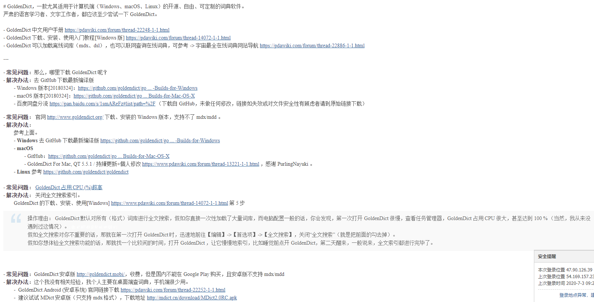

D:\workcode\cpp\goldendict\build>D:\Qt\4.8.7\bin\moc.exe -o "D:\workcode\cpp\goldendict\build\moc_ui_dictheadwords.cpp"    "D:\workcode\cpp\goldendict\build\ui_dictheadwords.h"


```
$(QTDIR)\lib\QtWebKitd4.lib
$(QTDIR)\lib\Qt5Quickd.lib
$(QTDIR)\lib\Qt5MultimediaWidgetsd.lib
$(QTDIR)\lib\Qt5OpenGLd.lib
$(QTDIR)\lib\Qt5PrintSupportd.lib
$(QTDIR)\lib\Qt5Svgd.lib
$(QTDIR)\lib\Qt5WebKitd.lib
$(QTDIR)\lib\Qt5Qmld.lib
$(QTDIR)\lib\QtMultimediad4.lib
$(QTDIR)\lib\Qt5Widgetsd.lib
$(QTDIR)\lib\Qt5Sensorsd.lib
$(QTDIR)\lib\QtNetworkd4.lib
$(QTDIR)\lib\QtXmld4.lib
$(QTDIR)\lib\QtGuid4.lib
$(QTDIR)\lib\QtCored4.lib
```


```
qtmain.lib
avutil-gd.lib
avcodec-gd.lib
avformat-gd.lib
ao.lib
z.lib
bz2.lib
hunspell.lib
lzo2.lib
iconv.lib
vorbisfile.lib
vorbis.lib
ogg.lib
wsock32.lib
psapi.lib
ole32.lib
oleaut32.lib
advapi32.lib
comdlg32.lib
$(QTDIR)\lib\QtWebKitd4.lib
$(QTDIR)\lib\QtSvgd4.lib
$(QTDIR)\lib\QtMultimediad4.lib
$(QTDIR)\lib\QtNetworkd4.lib
$(QTDIR)\lib\QtXmld4.lib
$(QTDIR)\lib\QtGuid4.lib
$(QTDIR)\lib\QtCored4.lib
libEGLd.lib
libGLESv2d.lib
gdi32.lib
user32.lib
```


```c++
epwing.cc
EpwingDictionary::EpwingDictionary( string const & id,
                                    string const & indexFile,
                                    vector< string > const & dictionaryFiles,
                                    int subBook ):
  BtreeDictionary( id, dictionaryFiles )
```





https://www.pdawiki.com/forum/thread-11705-1-1.html


如果用的是 Windows 系统的话，可以参考我的帖子： [GoldenDict] GoldenDict 的下载、安装、使用[Windows] https://www.pdawiki.com/forum/fo ... hread&tid=14072# p( C0 a6 ]% n1 ~; r
几个关键点：6 s6 H1 L; [% E% E
1. 官网下载的GoldenDict 是不支持 EPWING 格式的，要从 http://sourceforge.net/projects/ ... %20access%20builds/ 这里下载最新版；% K% e- e% ?, t) ^) Y
2. 把 EPWING 词典文件放在 content 文件夹下；9 _: E; O" Z5 p) M/ `* }
3. 第一次打开 GoldenDict 时，迅速地前往【编辑】->【首选项】->【全文搜索】，关闭“全文搜索”（也就是如果有勾的话，就是把前面的勾去掉）！！！9 p/ N# O/ q: M3 t( e9 X
4. GoldenDict 对 EPWING 支持有些小问题的。
5. 关于单独字体指定，参考：[GoldenDict] 如何为某部词典指定字体？ https://www.pdawiki.com/forum/fo ... hread&tid=15900

