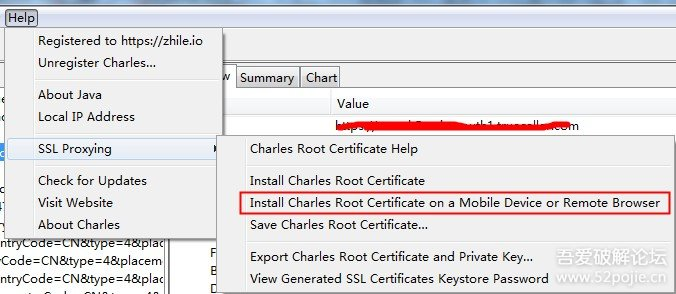

职业棋手李喆曾在2015年第20期《围棋天地》发表了七路围棋最优解研究，认为最终应是黑棋盘面9目。这一结论被围棋人工智能KataGo推翻，黑棋盘面8目才是七路棋盘上双方最佳博弈的结果。


通过sock5 是无法绕过SSL的，一般情况下，安卓采用虚拟root，挂载sslbypass 绕过SSL校验；
iOS需要砸壳替换证书重新打包，才能真正绕过SSL。


背景：Android app部分接口https，我们需要抓包，如果平时那样抓，都是乱码，没法看

-------------------------------------------------------------------------------------------------
环境：
w7：x64
Charles 最新版，破解码自己百度下，有
Android 手机 有xposed
安装just trust me 插件
https://github.com/Fuzion24/JustTrustMe
安装之后，勾选，重启手机


1：电脑打开Charles
2：Charles ，查看电脑ip，手机wifi连接同局域网wifi，然后配置手动代{过}{滤}理，写入电脑的ip，端口：8888
3：手机输入地址，下载证书，安装
 
4：开始打开app，留意自己需要抓包的地址，点击focus（关注它）
5：右键 激活SSL proxying enable
6：这个时候，还是不行，需要重新打开APP，再次出发这个请求的时候，就正常抓包了！


### 前提条件

```
 复制代码 隐藏代码
一台root手机
frida环境一套
还要会搜索（回复比较慢）
```

### 开启抓包

```
 复制代码 隐藏代码
1. 手机中执行 tcpdump
tcpdump -i any -s 0 -w /sdcard/Download/capture.pcap

2. 手机没有tcpdump的
下载地址https://www.androidtcpdump.com/android-tcpdump/downloads
adb push tcpdump /data/local/tmp/ (如果遇到权限不够的，先push到sdcard/ 再移动过去)

2.1在手机中执行给权限
chmod 777 tcpdump

2.2继续执行1
./tcpdump -i any -s 0 -w /sdcard/Download/capture.pcap
```

### hook app拿到sslkey

frida -U -f package -l ./sslkeyfilelog.js --no-pause

```
 复制代码 隐藏代码
// frida 命令选项 更多关于frida信息 可以查看frida官方信息 https://frida.re/docs/home/
C:\Users\User>frida -h
Usage: frida [options] target

Options:
  --version             show program's version number and exit
  -h, --help            show this help message and exit
  -D ID, --device=ID    connect to device with the given ID
  -U, --usb             connect to USB device
  -R, --remote          connect to remote frida-server
  -H HOST, --host=HOST  connect to remote frida-server on HOST
  -f FILE, --file=FILE  spawn FILE
  -F, --attach-frontmost
                        attach to frontmost application
  -n NAME, --attach-name=NAME
                        attach to NAME
  -p PID, --attach-pid=PID
                        attach to PID
  --stdio=inherit|pipe  stdio behavior when spawning (defaults to “inherit”)
  --runtime=duk|v8      script runtime to use (defaults to “duk”)
  --debug               enable the Node.js compatible script debugger
  -l SCRIPT, --load=SCRIPT
                        load SCRIPT
  -P PARAMETERS_JSON, --parameters=PARAMETERS_JSON
                        Parameters as JSON, same as Gadget
  -C CMODULE, --cmodule=CMODULE
                        load CMODULE
  -c CODESHARE_URI, --codeshare=CODESHARE_URI
                        load CODESHARE_URI
  -e CODE, --eval=CODE  evaluate CODE
  -q                    quiet mode (no prompt) and quit after -l and -e
  --no-pause            automatically start main thread after startup
  -o LOGFILE, --output=LOGFILE
                        output to log file
  --exit-on-error       exit with code 1 after encountering any exception in
                        the SCRIPT
 复制代码 隐藏代码
function startTLSKeyLogger(SSL_CTX_new, SSL_CTX_set_keylog_callback) {
    console.log("start----")
    function keyLogger(ssl, line) {
        console.log(new NativePointer(line).readCString());
    }
    const keyLogCallback = new NativeCallback(keyLogger, 'void', ['pointer', 'pointer']);

    Interceptor.attach(SSL_CTX_new, {
        onLeave: function(retval) {
            const ssl = new NativePointer(retval);
            const SSL_CTX_set_keylog_callbackFn = new NativeFunction(SSL_CTX_set_keylog_callback, 'void', ['pointer', 'pointer']);
            SSL_CTX_set_keylog_callbackFn(ssl, keyLogCallback);
        }
    });
}
startTLSKeyLogger(
    Module.findExportByName('libssl.so', 'SSL_CTX_new'),
    Module.findExportByName('libssl.so', 'SSL_CTX_set_keylog_callback')
)
// https://codeshare.frida.re/@k0nserv/tls-keylogger/
```

### 将抓包文件拿到pc

将/sdcard/Download/capture.pcap pull 到pc

### 保存frida输出的打印信息到sslkey.txt（还没做到一键傻瓜化）

```
 复制代码 隐藏代码
// 格式是这样紫的， 不要参杂别的哟~
CLIENT_RANDOM 557e6dc49faec93dddd41d8c55d3a0084c44031f14d66f68e3b7fb53d3f9586d 886de4677511305bfeaee5ffb072652cbfba626af1465d09dc1f29103fd947c997f6f28962189ee809944887413d8a20
CLIENT_RANDOM e66fb5d6735f0b803426fa88c3692e8b9a1f4dca37956187b22de11f1797e875 65a07797c144ecc86026a44bbc85b5c57873218ce5684dc22d4d4ee9b754eb1961a0789e2086601f5b0441c35d76c448
CLIENT_RANDOM e1c1dcaaf73a8857ee60f5b38979084c3e95fdebd9791bbab985a8f954132426 41dcf3d5e41cb469494bf5014a1ecca9f40124f5728895265fadd38f8dc9d5ac15c5fa6588c1ea68f38476297fe76183
CLIENT_RANDOM 66c4f37afb2152e3837c8a7c48ce51e8307e6739e1fe3efc542887bbcae4f02a bbafe4881084570af01bed59f95bfcf7bc49d2e55acbc7fe33c1e06f8ff0bc2e747c2c428e7cd13f1c77c2141085f951
CLIENT_RANDOM 8d0d92154ee030486a2b13f9441f85ef33c5e06732fbb06a1ac81fe34b6f2ce3 8270b34eee784e7f7de45f39af36f26e6abf99bb52fa8350945e3ebf79dc1c53a0693c24b0780ce3a54d39fd4b5b5149
CLIENT_RANDOM b5d58899346db525f14312cfb52c1247ed7adb710ae43428bd331ce27d77dbc1 9effd5b469ef6fdf7a056ea50fc3ff0fdf9fa40ae709805bea8678ddce404f211ed534623876a5c616f3e7bc43121f48
CLIENT_RANDOM af1b3f9ba0b4c27756c93595eb54cac6f0d8c6e9e4f0fcb1a36c45f0cd12060d 696a6fff39bf6c9863901a2145703de948c37e1abf6b4c03628118bee11c292239304ee020c71ff31a293fc6b9439364
CLIENT_RANDOM e2a3d8e6b638976aa27c8cf031be5e6b03cf7ffa573be101816d5103025d404b 2b006379423d7252c864a129b6c5a693b75d477dc5d3f894af5f02db755c4f6dd54470b659882871c62ce002792e211a
CLIENT_RANDOM 1c8cfe911e2111d80dc81c275c791c04467e8d7bca16963acec6a20051429981 bf08334d973d44d80c8f4542c2356a5fd9e0d390afde0374179cc81dd82aaa15aae52604988e9c9616ad0795c79c81ed
```

### 打开.pcap文件 进入Wireshark

```
 复制代码 隐藏代码
// Wireshark快速过滤
(http.request or tls.handshake.type eq 1) and !(ssdp)
// 快速参考
// https://www.jianshu.com/p/5525594600db
```

### 设置Wireshark tls

[b]编辑--> 首选项--> Protocols--> TLS


选择到tls 后将之前的sslkey.txt导入下。 再使用下前面的过滤命令， 正常情况下， 现在就能正常看到了。


#### Wireshark 番外篇

[b]编辑-->首选项-->外观-->布局
设置完这个， 就也和我一样能看到教学图了， 一下子友好很多。


### pc浏览器sslkey 番外篇

```
 复制代码 隐藏代码
// 一样要把key导入哟， 不然Wireshark怎么会知道呢？
chrome.exe --ssl-version-max=tls1.3  --ssl-key-log-file="./ssl_keys.txt"
```

### 致敬大佬

```
 复制代码 隐藏代码
@菱志漪 其实要感谢菱志漪大佬，没有他遇到的问题，我就不会深入去看研究这个问题，还要感谢@肉师傅， 没有陈老师通俗易懂的讲解， 我压根找不到北。 【手动撒花~~~】
```

### 参考内容

```
 复制代码 隐藏代码
Wireshark Tutorial: Display Filter Expressions
https://unit42.paloaltonetworks.com/using-wireshark-display-filter-expressions/

HTTPS Traffic Without the Key Log File
https://unit42.paloaltonetworks.com/wireshark-tutorial-decrypting-https-traffic/

The First Few Milliseconds of an HTTPS Connection
http://www.moserware.com/2009/06/first-few-milliseconds-of-https.html

Sniffing HTTPS Traffic in Chromium with Wireshark
https://adw0rd.com/2020/12/2/chromium-https-ssl-tls-sniffing-with-wireshark/en/
```


# iOS 透明抓包再探讨

2018-02-02 11:17:31 +08:00


 pheyer

以前的讨论： https://www.v2ex.com/t/302886

之前用 Charles/mitmproxy 抓包时发现 websocket 包不一定走代理，所以走代理的方式行不通，还是得用透明抓包，不需要用代理

以前看到的透明抓包方法是在网关或者说是路由器抓才行的，需要路由器支持才行的。另外也有一个 rvi 方法，就是手机 4g 上网，需要 usb 连接 mac，在 Mac 上敲命令创建一个远程虚拟接口 Remote Virtual Interface （ RVI ）来进行抓包

或者用 iPhone 上的 app surge 来实现抓包，这个是底层的，不需要代理，可以解密 https，但终究是手机上的，操作不方便

最近发现 iPhone 可以通过数据线连接 Mac 进行上网，即在 Mac 的共享设置里打开互联网共享，共享方式为 iPhone USB，这样就可以实现 iPhone 的流量全部走 Mac WIFI 了，实际上在 Mac 上面多了一个虚拟桥接网卡 bridge100

iPhone 的网络包全部从 Mac 上经过，用 Wireshark 抓这个 bridge100 网卡的包就能抓到 iPhone 全部的包，甚至抓 WIFI en1 的包也能抓到 iPhone 的网络包，但是这个 Wireshark 并没有 Charles 友好，https 解密、截包改包也不如 Charles/mitmproxy

Mac 上的 surge 似乎也需要代理，新出的一个 Specht （ https://www.v2ex.com/t/298865 ）不是很了解。

另外我注意到 mitmproxy 有一个透明代理功能，也就是不需要用代理的，用这个透明代理功能似乎需要部署在网关 /路由器上的，但搜了一下发现也可以部署到 Linux/Mac 上，对应的需要用到 iptables/pf，不过资料并不多

现在已知，iPhone 的网络包可以全部走 Mac 不用代理，而 Mac 上的 mitmproxy 又支持透明代理，我想这样是不是就可
以省去网关 /路由器部署，两者结合是不是实现 iOS 最强透明抓包：既能 https 解密，又能截包改包？


# mitmproxy mac 学习笔记(mac下透明代理配置)

如果你想在ios上抓包,而又不想设置代理.那么 mitmproxy 就是不错的选项.

如何 设置

具体细节 参考官方 文档

[docs.mitmproxy.org/stable/howt…](https://docs.mitmproxy.org/stable/howto-transparent/#macos)

mac 下安装 mitmproxy 非常简单

```
brew install mitmproxy

复制代码
```

打开数据包转发

```
sudo sysctl -w net.inet.ip.forwarding=1
复制代码
vim pf.conf
rdr pass on en0 inet proto tcp to any port {80, 443} -> 127.0.0.1 port 8080

复制代码
sudo pfctl -f pf.conf
sudo pfctl -e
sudo vim /etc/sudoers

# 添加到末尾
ALL ALL=NOPASSWD: /sbin/pfctl -s state
复制代码
```

启动带web界面的透明代理

```
mitmweb --mode transparent --showhost --ignore apple
复制代码
```

浏览器会自动打开

http://127.0.0.1:8081/

下面配置你的ios 把网关配置到你电脑的ip

打开 ios 浏览器,配置证书

[mitm.it/](http://mitm.it/)

如果你看到

"If you can see this, traffic is not passing through mitmproxy."

说明你的透明官方配置错误,对照官方文档检查步骤.

你会看到这个界面

"Click to install your mitmproxy certificate"

说明透明网关配置成功

然后选择 apple,下载证书 描述文件 然后 安装,打开信任 2个步骤.即可

打开的 ios,随便打开一个https的网站 就可以看到https的请求参数和数据了


