[TOC]


# math summary


## 函数是一种向量


函数可进行加和与数乘运算，而因为向量也不过只有相加和数乘两种运算，所以最初以空间中箭头为背景来建立的线性代数的合理概念和解决问题的手段，例如：**线性变换，列空间、点积、特征值、特征向量等，都能够直接应用于函数**。


**算子就是变换的别名，而变换又是函数的花俏说法。**

一个函数的变换是线性的是什么意思?

> Additivity: $L(\overrightarrow{v}+\overrightarrow{w}) = L(\overrightarrow{v})+L(\overrightarrow{w})$
> Scaling: $L(c \overrightarrow{v}) = c L(\overrightarrow{v})$


若A=A'，则A是**对称阵**


## 线性变换


> 原空间上的点等距分布，投影到新空间上的点也等距分布
>
> > **而且投影就是原来的点向新空间作垂线**
>
> 原空间的基向量点是(1,0)  (0,1)
>
> > 约定基向量正交且长度是1，其它所有向量都可以由它们数乘、求和（既线性变换）得来
>
> **新空间的基向量就是原基向量(1,0)  (0,1) 向新空间作垂线**
>
> > 得到的点就是新基向量，它们组也了投影矩阵


## 内积就是线性变换


原向量是 4 i-hat + 3 j-hat，先看成单位基 1 i-hat, 1 j-hat， 变换新基变为1 i-hat, -2 i-hat，原向量的数乘(缩放)4,3 乘进来， 4(1 i-hat) + 3(-2 i-hat) = -2，这就是内积


函数是一种向量，反过来说向量是不是函数？

> 两个列向量的内积是各同维度的分量相乘，然后所有乘积再相加，结果是一个数
>
> 把其中一个“放倒”（转置），得到一个变换，这就是函数，计算遵循矩阵乘法，结果是一个数
>
> 两种方法的结果恰好相等（只是恰好相等，本质含义不一致？）
>
> - 向量内积的计算等效于一种空间变换，原基向量1， 1分别变换到1，-2


映射是函数的推广，**雅可比是梯度的推广**


一个多元函数求偏导，每一元就得到一个偏导，n元偏导组成一个向量，这就是梯度。

m个多元函数求偏导，每一函数得到一个梯度，m个梯度组成一个矩阵，这就是雅可比矩阵。


函数的输出是标量，映射的输入输出都是向量


以下内容参见：深入理解神经网络：从逻辑回归到CNN.md


$f'$ 是一个仿射函数
$$
f'(x) = w \cdot \ x^T + b
$$

> 仿射函数是一个线性函数加上一个常量 b
>
> > 线性函数，等同于线性变换，函数又可以认为是一种向量
> >
> > 所以这里的指的线性变换就是权重向量$w$，$w$ 对$x^T$ 进行了线性变换
> >
> > $x$ 是行向量，转置成列向量


$f$ 是一个仿射映射
$$
f(X) = \begin{pmatrix} f'^1(x^{1}) \\ \vdots \\ f'^m(x^{m}) \end{pmatrix}
$$

> 仿射映射可以看作由若干个仿射函数组成
>
> 大写的$X$ 表示这是一个矩阵
>
> 小写的$x$ 表示这是一个向量，$x$ 的上标表示这是一个行向量，上标上的数字指出它是矩阵中的第几行


其中：
$$
X = 
\begin{bmatrix}
x^{1}_{0} & x^{1}_{1} & \cdots & x^{1}_{n}  \\
x^{2}_{0} & x^{2}_{1} & \cdots & x^{2}_{n} \\
\vdots & \vdots & \ddots & \vdots & \\
x^{m}_{0} & x^{m}_{1} & \cdots & x^{m}_{n} \\
\end{bmatrix}
$$


与门(OR) 运算实际上就是一个仿射映射


$$
X = \begin{bmatrix}
0 & 0 \\
0 & 1 \\
1 & 0 \\
1 & 1 \\
\end{bmatrix}
\text {（与门的输入）}
$$

$$
Y =
\begin{bmatrix}
0  \\
1  \\
1  \\
1  \\
\end{bmatrix}
\text{（与门的输出）}
$$

如何找到从$x$ 到$y$ 的线性变换（也就是A）？

> 既找到一个线性函数，将$X$ 中的行向量$x$ 变换到$Y$ 中的行向量$y$ 


$f:\mathbb{R}^n \rightarrow \mathbb{R}^m$ 是线性映射，必然存在一个$m \times n$ 的矩阵A，对任意$\vec{x} \in \mathbb{R}^n$ 满足：
$$
f(\vec{x}) = A \vec{x}
$$

> $A$ 是一个$m \times n$ 的矩阵，这个矩阵本身就是线性变换
>
> - 注意前面函数就是向量这个事实，$f$ 就是线性变换，$f$ 和$A$ 是同一个东西
>
> 为什么从$n$ 维到$m$ 维向量的线性映射的维度是$m \times n$ ?
>
> > **一个矩阵代表一个线性变换，矩阵的列是变换后的新空间的基向量**
> >
> > > 新基向量的线性组合构成了新向量
> > >
> > > 实际上是整个空间被变换了，原基向量被变换成了新基向量，原空间里的所有向量也跟着被变换了
> > > $m \times n$ 的含义是$n$ 个$m$ 维基向量，也就是说这个新空间是$m$ 维的（如果每个基向量都能贡献新维度的话，也就是说它们是线性独立的）
> > >
> > > **原向量所有维度上的点作为数乘，数乘$n$ 个$m$ 维基向量，就得到了新空间的向量。这就是线性组合**
> > >
> > > > **数乘本身在变换中保持不变，变化的实际上是基向量**。因为原向量可以表示成原基向量的数乘，新向量也可以表示成新基向量的数乘，而这两者的数乘是完全一样的
>
> 维度检查：$(m \times n) (n \times 1) \rightarrow (m \times 1)$ 
>
> > **读作：$n$ 个$m$ 维向量将$1$ 个$n$ 维向量线性变换成$1$ 个$m$ 维向量**


因为$Y$ 的维度是4 维，所以$A$ 空间也应该是4 维

> $Y$ 实际上是$A$ 空间中的向量


## 导数是输出输入改变比

[G.Strang的微分方程和线性代数（1.1）](https://zhuanlan.zhihu.com/p/21291705)


对于f = f(x, y, z)的微小改变Δf，是对其所有变量的微小扰动的总量：
$$
\Delta f \approx f_x \Delta x + f_y\Delta y + f_z \Delta z
$$
当Δx→0，Δy→0，Δz→0时，约等于就变成了等于：
$$
d f = f_x d x + f_y d y + f_z d z = \frac{\partial f}{\partial x} dx + \frac{\partial f}{\partial y} dy + \frac{\partial f}{\partial z} d
z
$$
这就是全微分，全微分包括所有能改变函数值的因素


## 链式法则(chain rule)


链式法则是**求复合函数导数的一个法则**


$(f \circ g)(x)$ 的导数$(f \circ g)'(x)$  为：
$$
(f \circ g)'(x) = f'(g(x)) \ g'(x)
$$

$$
\vec{x} \in \mathbb{R}^m, \ \vec{x} = (x_1,x_2,\cdots,x_m)
\\
\vec{y} \in \mathbb{R}^n, \ \vec{y} = (y_1,y_2,\cdots,y_n)
$$

$$
\vec{y} = g(\vec{x})
\\
z = f(\vec{y})
\\
z = (f \circ g)(\vec{x})
$$

复合函数z 求导
$$
z' = (f \circ g)'(\vec{x}) = f'(g(\vec{x})) \ g'(\vec{x})
\\
其中：\vec{x} \in \mathbb{R}^m, \ \vec{x} = (x_1,x_2,\cdots,x_m)
$$

z 的偏导
$$
\frac{\partial z}{\partial x_1} = \frac{\partial (f \circ g)}{\partial x_1}
$$


$$
f(y_1,y_2,\cdots,y_n)
$$


## 矩阵求导

乍一看，矩阵向量乘法和求导像是毫不相干的 

> 但它们两个其实是一家人 

[线性代数的本质11 抽象向量空间](https://zhuanlan.zhihu.com/p/111287930)

[矩阵求导术](https://zhuanlan.zhihu.com/p/24709748)

[矩阵微积分]([https://zh.wikipedia.org/wiki/%E7%9F%A9%E9%98%B5%E5%BE%AE%E7%A7%AF%E5%88%86](https://zh.wikipedia.org/wiki/矩阵微积分))

[GS的线性代数世界](https://zhuanlan.zhihu.com/douTintin14)

[AI算法工程师手册 - 反向传播算法](http://www.huaxiaozhuan.com/)

[多变量函数的微分学 - 中国科学技术大学](http://staff.ustc.edu.cn/~rui/ppt/calculus2/chap6_3.html#/)


[“瞬时运动学”——还是从关节空间到操作空间（雅可比矩阵上篇）](https://www.guyuehome.com/5627)

你还需要懂得简单的**向量求导运算**——其实很简单啦，如果你不知道怎么对向量求导，那就把它当一列标量一个一个写出来，比如这样：


 

不知道行列怎么分布？把分母乘到右边，算一下**左边是3×1向量，右边是3×2矩阵乘以2×1向量 = 3×1向量**，左右相等，搞定！简单粗暴，方便有效。哎呀，一不小心，把**雅可比矩阵（Jacobian Matrix）**都给写出来了呢。（想要知道数学上是怎么定义推导出向量求导方法的请去上数学课，我只负责教你记住啦:p）


### 求导矩阵

#### 矩阵空间是全体多项式

#### 用x的幂作为基向量

#### 用列向量表示多项式的坐标(分量为基向量的数乘)

#### 求导矩阵是一个线性变换，将一个多项式（函数）变换成另一个多项式(函数)


矩阵空间是全体多项式

首先要做的是给这个空间赋予坐标的含义，这是要选取基

**选取x的幂函数 $1, x^1, x^2...$ 作为基向量(只要加法和数乘有意义的东西就可以认为是向量)**

**多项式的坐标是基向量的线性组合，用列向量表示**

$$
5x^0 + 4 x^1 + 5 x^2 + 1 x^3 = \begin{bmatrix}
5 \\
4 \\
5 \\
1 \\
0 \\
0 \\
\vdots
\end{bmatrix} 

\\

\frac{d}{dx}(5x^0 + 4 x^1 + 5 x^2 + 1 x^3) = 4 + 10 x + 3 x^2
$$


求导是用一个**无限矩阵来描述**的。其中绝大部分是0，而**上对角线**上按序列排布的正整数。这个矩阵是**对每个基函数求导**后，代入**作为列向量**得到的。


$$
\frac{d}{dx} = 
\begin{bmatrix}
0 & 1 & 0 & 0 & \cdots  \\
0 & 0 & 2 & 0 & \cdots  \\
0 & 0 & 0 & 3 & \cdots \\
0 & 0 & 0 & 0 & \cdots  \\
\vdots & \vdots & \vdots & \vdots & \ddots
\end{bmatrix}
$$


注意到**矩阵里的数字是$x$ 的幂**


**求导矩阵实际上是把基向量的一组数乘变成另一组数乘**

> **数乘决定了多项式，或着说函数，又或着说向量**


$$
\begin{bmatrix}
0 & 1 & 0 & 0 & \cdots  \\
0 & 0 & 2 & 0 & \cdots  \\
0 & 0 & 0 & 3 & \cdots \\
0 & 0 & 0 & 0 & \cdots  \\
\vdots & \vdots & \vdots & \vdots & \ddots
\end{bmatrix}

\begin{bmatrix}
5 \\
4 \\
5 \\
1 \\
\vdots
\end{bmatrix}
=
\begin{bmatrix}
1 \cdot 4 \\
2 \cdot 5 \\
3 \cdot 1 \\
0 \\
\vdots
\end{bmatrix}
$$


## 线代八条公理

### 任何对象只要满足线代八公理那么线代的所有结论都适用于它 


## 张量


**算子就是变换的别名，而变换又是函数的花俏说法。**


标量只含有0 个量纲(i,j,k-hat 中的任一个hat)，是**零阶张量**

> 比如说，向量的模长。内积(点乘)中的**投影指的就是投影向量的模长**

向量含有至少1 个量纲(i,j,k-hat 的组合)，是**一阶张量**


向量的**分量是**向量**向坐标轴的投影**向量，投影向量之和等于向量本身


## 你点乘别人就是别人向你投影

### 线性变换后的向量有很多个分量，由于这些分量都处于同一维度(**投影方被线性变换降维了**)，所以它们的和就“变成”标量了

> **w 是一个法向量(一根掍)，同时也是一个线性变换**。它将垂直于w 的平面上的所有点全部变换成自身的某一点（既棍上的一点）（这是**投影变换**？对应的应该还有一个**内积变换**？）
>
> 投影是线性变换的同义词，投影向量的模长是垂直法向量的平面的截距
>
> - 这个截距就是仿射变换中的常数b
>
> **内积是投影乘棍长**
>
> > 内积是一个标量，是线性变换后的向量的模长
> >
> > 线性变换后的向量有很多个分量，由于这些分量都处于同一维度(**投影方被线性变换降维了**)，所以它们的和就“变成”标量了
>
> **投影是自已的模长乘余弦**
>
> **余弦**是投影后前模长比, 90度时余弦是0
>
> > **内积是0则向量正交**
> >
> > > 内积是0，只能分子是0，既**投影后模长为0**
>
> **投影向量是投影方的对偶向量**
>
> - [张量分析傻瓜入门：七、对偶向量](https://zhuanlan.zhihu.com/p/120309589)
>
> 投影完投**影方某个维度的信息可能会丢失**


## 内积是投影乘棍长

> 棍长不为0, 投影为0, 则内积是0,则**两向量正交**
> **余弦**是投影后前模长比, 90度时余弦是0
> **投影是自已的模长乘余弦**
> 《深入理解神经网络：从逻辑回归到CNN》


### 内积就是线性变换


原向量是 4 i-hat + 3 j-hat，先看成单位基 1 i-hat, 1 j-hat， 变换新基变为1 i-hat, -2 i-hat，原向量的数乘(缩放)4,3 乘进来， 4(1 i-hat) + 3(-2 i-hat) = -2，这就是内积

> $$
> \begin{bmatrix}
> 1 & -2
> \end{bmatrix}
> 是线性相关的两列，所以列空间是一维。\\
> 该矩阵是一个一维变换
> $$


#### 内积就是线性变换

##### 变换后的向量等于它在各数轴上（或者说各基向量）的投影向量之和

##### 所有投影向量的和等于本体

所以，

> 就是说，你看到的变换结果是一个**标量**，实际上**它还有一个隐藏的量纲**：i-hat j-hat k-hat 之类的，指出它是属于哪个数轴。
>
> 而且这个标量实际上是若干个分向量的和，这些分向量加起来等于这个标量


所有与w 的内积为常数的向量组成一个**垂直于w 的平面**

> 内积是投影乘棍长，内积是常数棍长也是长数(w的模长)，所以**投影也是常数**(准确的说是**投影向量的模长**)
>
> **w 是一个法向量(一根掍)，同时也是一个线性变换**。它将平面上的所有点全部变换成自身的某一点（既棍上的一点）
>
> 投影是线性变换的同义词，投影向量的模长是垂直法向量的平面的截距
>
> - 这个截距就是仿射变换中的常数b


二维空间最标准的基向量
$$
\begin{bmatrix}
0 \ \text{i-hat} && 1 \ \text{i-hat} \\
1 \ \text{j-hat} && 0 \ \text{j-hat} \\
\end{bmatrix}
$$
第一个基向量是第一列，值是 $0 \ \text{i-hat} + 1 \ \text{j-hat} $

第二个基向量是第二列，值是 $1 \ \text{i-hat} + 0 \ \text{j-hat} $


## 内积是投影乘以棍长

> 棍长不为0, 投影为0, 则内积是0,则**两向量正交**
> **余弦**是投影后前模长比, 90度时余弦是0
> **投影是自已的模长乘余弦**
> 《深入理解神经网络：从逻辑回归到CNN》


## First-order approximation

在数学物理中，一级近似就是把函数值用自变量的某个临近点处的函数值及导函数的值近似表示。


f(x+d) ~ f(x) + f'(x)    d 远小于x


从微商的定义推导

> $$
> \Delta x \  是一个微小量 \quad \text{and} \quad \Delta x \rightarrow 0 \\
> 
> \nabla f(x) = \frac{f(x + \Delta x) - f(x)}{ \Delta x } \\
> \Delta x \nabla f(x) = f(x + \Delta x) - f(x) \\
> f(x + \Delta x) = f(x) + \Delta x \nabla f(x)
> $$


从信号处理的角度来说，内积是两个信号的相似性

$$
||x(t)-y(t)||^2=||x(t)||^2+||y(t)||^2-2Re{<x(t),y(t)>}
$$

> 等式左边是两个信号的差别，右边前两项是信号的能量。可见对于能量相同（一般通过能量归一化实现）的若干信号来说，内积越大的两个信号差别越小。


解释物理现象：力的做功，当力的向量和移动距离向量有夹角时，力的功就是力向量与距离向量的点积

> 外积出来的量还是矢量，内积出来的量才是标量。功，是标量，这是内积没错


方便复杂计算： 例如，向量的点积为零，意味着垂直，这在证明垂直问题上有很大作用


引入内积的目的时为了定义内积空间


在数学家眼中, **张量已经被抽象成了线性变换**.


## 链式法则(chain rule)


链式法则是一个**复合函数求导法则**。


复合函数$(f \circ g)(x)$ 的导数为：
$$
(f \circ g)'(x) = f'(g(x))g'(x)
$$


[链式法则 wikipedia.org](https://zh.wikipedia.org/wiki/链式法则)


## 线性代数的本质


**用终点代表向量**

通常我们就**用向量的终点代表该向量**

> 当你只考虑几个向量时,就把它看作箭头
>
> 当你考虑很多向量时,就把它们都看作点


物理视角：向量可以在空间中自由落脚

数学视角：线性代数中,向量经常以原点作为起点


### 一个矩阵代表一个线性变换，矩阵的列是新空间的基向量

> 如果网格线保持平行且等距分布，并且原点映射为自身，就称它是线性的


### 原基向量的点投影到新空间，投影后的点就是投影矩阵，就是线性变换本身

> **而投影就是原来的点向新空间作垂线**
>
> **如果是非基向量，先把它们的数乘部分分别拿出来，看成是数乘基向量。拿基向量来投影，投影完再把数乘乘进去**


## 由于对偶性，$u_x$ 是i-hat 的投影长度，$u_y$ 是j-hat 的投影长度


$$
二维空间，线上的所有点投影成一个点，所有点连成一条线 \\
这条线就是法向量 \\
三维空间，面上的所有点投影成一个点，所有面的投影连成一条线
$$


### Cos 是投影后前模长比
#### 你点乘别人，你就是变换矩阵，你就是新空间的基

> **你点乘别人是别人向你投影，内积等于你长乘投影长**
>
> **投影等于他长乘Cos，等于内积比你长**
>
> $\|\boldsymbol{y}\|cos\theta=\frac{\left<\boldsymbol{x},\boldsymbol{y}\right>}{\|\boldsymbol{x}\|}$ 
>
> 内积就是线性变换
>
> > **你点乘别人，你就是变换矩阵，你就是新空间的基**
> >
> > **点乘的结果是他在新空间的位置**


### 行列式是变换后前面积比

> **行列式为0，矩阵的列线性相关** linearly dependent
>
> 因为这个矩阵是一个变换，它的列就是新空间的基，
>
> 三维空间中det 为0，新空间是一个体积为0 的东西，只能是面线点其中一种。三组基在二维平面上，至少有一个基向量没有为张成的空间作出贡献，也就是它没有**增加新的维度**。所以矩阵的列是线性相关的

> 测量变换究竟对空间有多少拉伸或挤压，也就是测量一个给定区域面积增大或减小的比例 

> **转置不改变行列式的值**


### 秩是变换后的维数


### 内积就是线性变换


原向量是 4 i-hat + 3 j-hat，先看成单位基 1 i-hat, 1 j-hat， 变换新基变为1 i-hat, -2 i-hat，原向量的数乘(缩放)4,3 乘进来， 4(1 i-hat) + 3(-2 i-hat) = -2，这就是内积

> $$
> \begin{bmatrix}
> 1 & -2
> \end{bmatrix}
> 是线性相关的两列，所以列空间是一维。\\
> 该矩阵是一个一维变换
> $$


**知道投影矩阵找投影**

**知道投影找投影矩阵**


## 叉积的几何意义


1. 首先获得由v和w确定的平行四边形的面积


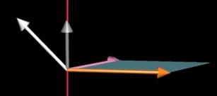


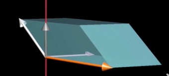

2. 乘以向量(x, y,z)在垂直于平行四边形方向上的分量

   > 是将这个向量投影到垂直于v和w的直线上，然后将投影长度与v和w张成的平行四边形的面积相乘
   >
   > **但是,这和垂直于v和w且长度为平行四边形面积的向量与(x, y, z)点乘是同一回事**


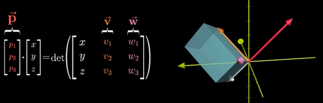


3. 这意味着我们找到了一个向量p

   > 使得p与和某个向量(x, y, z)点乘时，所得结果等于一个3x3矩阵的行列式


总结


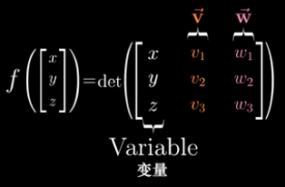


我首先定义了一个三维空间到数轴的线性变换

> 并且它是根据向量v和w来定义的
>
> 然后我通过两种不同的方式来考虑这个变换的**对偶向量**
>
> 也就是说利用了这个变换和**与对偶向量点乘等价**这个性质


### 线性变换与对偶向量点乘等价

> 但是从几何角度思考,我们可以推断出这个对偶向量
>
> 必然与v和w垂直,并且其长度与这两个向量张成的平行四边形的面积相同


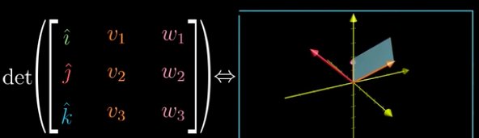


> 这两种方法给出了同一个变换的对偶向量,因此这两个向量必然相同


基向量

> i-hat, j-hat, k-hat 表示


基向量数乘，就是缩放

> 缩放前基向量围成的面积(正方形、平行四边形、立方体等)
>
> - 数学中**体积**的概念抽象到数学体系内就**是测度的研究范畴**
>
> 比上缩放后围成的面积
>
> 这个比值就是**行列式**


固定一个基向量，旋转另一个基向量

> 围成的面积由正方形变成平行四边行。但是面积没变\
>
> 这时的空间已经被扭曲了


#### 基向量围成面积的变化比例等于整个空间中任意区域的面积变化比例

> 这是由， “网格线保持平行且等距分布"这一事实推断得出的 
>
> 对于不是方格的形状，它们可以用许多方格良好近似
>
> 只要使用的方格足够小，近似就能足够好
>
> **所有任意小的方格都进行了相同比例的缩放**  


### 行列式是线性变换后的面积比变换前的面积

这个特殊的缩放比例，即**线性变换改变面积的比例** ，被称为这个**变换的行列式**


#### 线性变换作用于整个空间，所有的点都按相同的方式运动了一段距离

> **一个向量看成箭头，多个向量看成点**


### 一个二维线性变换的行列式为0

> 表示二维空间被压缩成一条线或一个点
>
> 此时任何区域的面积都变成了0


**只需要检验一个矩阵的行列式是否为 0 ，就能了解这个矩阵所代表的变换是否将空间压缩到更小的维度上** 


### 负的行列式表示空间像煎饼一样被翻面了

> invert the orientation of space
>
> i-hat 转动和j-hat 重合，det 为0，继续转 det 为负也很自然


#### 三维空间的det 表示积体的缩放比例

>  parallelepiped 平行四边形围成的平行六面体 
>
>  可以把行列式简单看作这个平行六面体的体积
>
>  -  因为基向量的模长是1，正方体体积是1
>


### 行列式为0，三维空间被压缩成0 体积的东西

> 一个平面、一条直线、或是一个点


三维空间中的定向(Orientation)：右手定则

> 食指i-hat, 中指j-hat, 大拇指k-hat，
>
> 如果在变换后你仍然可以这么做，那么**定向没有发生改变，行列式为正**，否则行列式为负


$det \left( \begin{bmatrix} a & 0 \\ 0 & d \end{bmatrix} \right)=ad - 0\cdot0$

> a 是 i-hat 伸缩后前比
>
> d 是 j-hat 伸缩后前比
>
> 其它项为0，所以ad 是**正方形面积后前比**


$det \left( \begin{bmatrix} a & b \\ 0 & d \end{bmatrix} \right)=ad - b\cdot0$

> 只有一项为0，ad 是**平形四边形面积后前比**


$det \left( \begin{bmatrix} a & b \\ c & d \end{bmatrix} \right)=ad - b\cdot c$

> 全不为0，bc 是四边形对角方向缩放


思考题：det 满足分配律

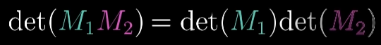


### 线性方程组(Linear system of equations)


‌

所以求解Ax=v意味着我们去寻找一个向量x，使得它在变换后与v重合


det A  不为0，有且仅有一个向量(在变换后)与v重合，并且你可以通过逆向进行变换来找到这个向量，所以找到逆矩阵也就是找到了原向量，既方程组的解

‌

det 为0 时不存在逆变换，因为不能将面积有零的东西解压缩成一个平面和体

‌

两个点重合以后有一个点的信息丢失了，两条线重合丢失一条线，两个体丢一个体

‌

当变换的结果为一条直线时,也就是说结果是一维的，我们称这个变换的秩为1

‌

所以说“秩"代表着变换后空间的维数，就矩阵列空间的维数

‌

列空间是矩阵的列所张成的空间，列空间是变换的所有可能结果构成的空间

‌

满秩就是列空间的维数等于矩阵的列数(唯线性独立才能满足条件)

‌

对一个满秩变换来说,唯一能在变换后落在原点的就是零向量自身

‌

#### 一个**非满秩的矩阵** 将空间压缩到一个更低的维度上

‌

**非满秩的矩阵是降维变换**

‌

也就是说会有一系列向量在变换后成为零向量

‌

如果一个二维线性变换将空间压缩到一条直线上，那么沿某个不同方向直线上的所有向量就被压缩到原点.

‌

如果一个三维线性变换将空间压缩到一个平面上，同样也会有一整条线上的向量在变换后落在原点

‌

如果二个三维线性变换将空间压缩到一条直线上，那么就有一整个平面上的向量在变换后落在原点

‌

变換后落在原点的向量的集合，被称为矩阵的"零空间"或“核"


### 非方阵

“在这个小测验里，我让你们求一个 2 × 3 矩阵的行列式。 让我感到非常可笑的是，你们当中竟然有人尝试去做。 "

> 2*3 是二维空间，必定有一列没有贡献新维度，所以是线性相关的


$$
\begin{bmatrix}
2  & 0 \\
-1 & 1 \\
-2 & 1
\end{bmatrix}
$$

3*2 矩阵的列空间是**三维空间中一个过原点的二维平面**

> 两点定一线，三点定一面。两向量加原点可以定一面

但是这个矩阵仍然是满秩的，因为列空间的维数与输入空间的维数相等(输入二维，输出二维) 


$$
\begin{bmatrix}
3  & 1 & 4 \\
1 & 5 & 9 \\
\end{bmatrix}
$$
2*3 ，变换后有三个基量，变换前也一定有三个基向量。

> 变换后是二维，变换前是三维
>
> **所以这是一个从三维空间到二维空间的变换**


$$
\begin{bmatrix}
1  & 2 \\
\end{bmatrix}
$$


1*2 是二维到一维的变换

> 它与点积紧密相关


### 点积是把向量从二维变换到一维，然后缩放

> 缩放的数乘就是另一个向量的模长


### 对偶(duality)

 


$$
(2v) \cdot w = 2(v \cdot w)
$$
改变v 的长度并不会改变投影长度，所以等式成立


网格上的点还没有撞在一起时还是可以还原的，否则信息就丢失了

> 逆便换也回不来


同样是二维输入和一维输出，一般的函数相比，线性变换的要求更加严格

>  **高维空间中的变换需要满足一些严格的性质才会具有线性**
>
> 如果你有一系列等距分布于一条直线上的点然后应用变换 ，线性变换会保持这些点等距分布在喻出空间中。否则，如果这些点没有等距分布，那么这个变换就不是线性的


### 内积就是线性变换


原向量是 4 i-hat + 3 j-hat，先看成单位基 1 i-hat, 1 j-hat， 变换新基变为1 i-hat, -2 i-hat，原向量的数乘(缩放)4,3 乘进来， 4(1 i-hat) + 3(-2 i-hat) = -2，这就是内积

> $$
> \begin{bmatrix}
> 1 & -2
> \end{bmatrix}
> 是线性相关的两列，所以列空间是一维。\\
> 该矩阵是一个一维变换
> $$


### 投影定义了一个从二维向量到数的线性函数


**知道投影找投影矩阵**

> 投影矩阵是[$u_x$ $u_y$] （由对偶性得出）


$$
二维空间，线上的所有点投影成一个点，所有点连成一条线 \\
这条线就是法向量 \\
三维空间，面上的所有点投影成一个点，所有面的投影连成一条线
$$


原空间上的点等距分布，投影到新空间上的点也等距分布

> **而且投影就是原来的点向新空间作垂线**

原空间的基向量点是(1,0)  (0,1)

> 约定基向量正交且长度是1，其它所有向量都可以由它们数乘、求和（既线性变换）得来

**新空间的基向量就是原基向量(1,0)  (0,1) 向新空间作垂线**

> 得到的点就是新基向量，它们组也了投影矩阵

## 原基向量的点投影到新空间，投影后的点就是投影矩阵，就是线性变换本身

> **而投影就是原来的点向新空间作垂线**


1. 假设$\hat{u},\hat{i},\hat{j}$  模长都是1
2. $\hat{u} = \begin{bmatrix}
   u_x \\
   u_y
   \end{bmatrix}$ ，其中$u_x$ 和$u_y$ 分别是$\hat{u}$ 在水平、垂直两个数轴上的坐标（分量）
3. $u_x = \hat{u} 向水平方向数轴投影的长度$ ，同理：$u_y = \hat{u} 向垂直方向数轴投影的长度$ 
4. $u_x = \hat{i} 与\hat{u} 的内积= \hat{u}向\hat{i}投影的长度$ (注：内积=投影的长度 * 被投影向量的长度，而$\hat{i}$ 又是单位向量)
5. $u_y = \hat{j} 与\hat{u} 的内积= \hat{u}向\hat{j}投影的长度$

现在来考虑一个很重要的问题：$\hat{u}$ 是一个向量，同时又是一个线性函数（可以点乘另一个向量），这个函数是如何将$\hat{i},\hat{j}$ 投影到它的行空间去的？

这个线性变换是：
$$
\begin{bmatrix}
u_x & u_y \\
\end{bmatrix}

\begin{bmatrix}
i_x \\
i_y
\end{bmatrix}

= p_1 (\hat{i} 向\hat{u}的投影点) \\
$$

$$

\begin{bmatrix}
u_x & u_y \\
\end{bmatrix}

\begin{bmatrix}
j_x \\
j_y
\end{bmatrix}

= p_2 (\hat{j} 向\hat{u}的投影点)
$$


其中$\begin{bmatrix}
u_x & u_y \\
\end{bmatrix}$ 就是投影矩阵，这个矩阵是一个一维空间，就是$\hat{u}$ 的行空间，也就是说**线性函数$\hat{u}$ 的作用是将其它向量投影(变换)到自已的行空间；它是一个空间变换函数**。


## 由于对偶性，$u_x$ 是i-hat 的投影长度，$u_y$ 是j-hat 的投影长度

> 又因为到单位向量的投影长度就是内积，所以u, i 的内积等于 $u_x$ 
>
> **找出u 到i 的投影矩阵，以及i 到u 的投影矩阵？**


直线上等距分布的点投影到数轴上后仍然等距分布

实际上，**投影定义了一个从二维向量到数的线性函数**  


你应该把它看作一个接收两个坐标输出一个坐标的函数 

不过， u-hat 是二维空间中的一个向量，而它碰巧又落在这条数轴上


所以说，如果要问 i-hat 在投影之后落在哪个数上，答案就应该是u-hat 向 x 轴投影所得到的数，而 u-hat 向 x 轴投影得到的数就是 u-hat 的横坐标，**因此根据对称性**，**将 i-hat 向斜着的数轴上投影所得到的数，就是 u-hat 的横坐标** 


 u 帽的 y 坐标给出了 j-hat 向斜着的数轴上投影所得到的数 

**所以描述投影变换的 1 × 2 矩阵的两列，就分别是 u 帽的两个坐标 ** 

**这就是为什么向量与给定非单位向量的点积可以解读为，首先朝给定向量投影，然后将投影的值与给定向量长度相乘**   


## 叉积是向量围出四边形的面积

> 负号表示v 想要旋转与W 重合，要走j-hat 负方向

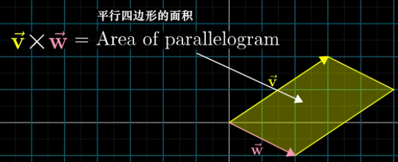


这是因为，**由 叉积v，w 的坐标为列所构成的矩阵，与一个将 i-hat和 j-hat分别移至 v 和 w 的线性变换相对应**。更重要的是，如果 v 在 w 的左侧也就是说变换后定向发生了改变 ，那么行列式为负


### 行列式是后前面积比，而前面积等于1，所以后面积等于行列式

> 行列式为负说明空间定向发生了翻转

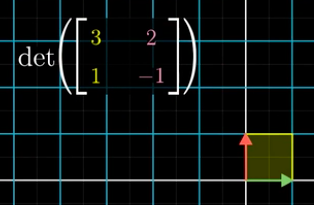


### 叉积的两个向量，是变换后新空间的基

> 那两个向量是变换矩阵，被变换的是**原空间的单位基**


## 叉积是通过两个三维向量生成一个新的三维向量 

> 这个向量的**长度就是平行四边形的面积**
>
> > 由叉积v，w 的坐标为列所构成的矩阵，与一个将 i-hat和 j-hat分别移至 v 和 w 的线性变换相对应
> >
> > 行列式是后前面积比，而前面积等于1，所以后**面积等于行列式**
> >
> > - 行列式为负说明空间定向发生了翻转
> >   - 通过观察变换前后i-hat, j-hat 是否反向来确定这一点
>
> 而这个向量的**方向与平行四边形(所在的面)垂直**
>
> > 过原点垂直平面的向量有两个，用右手定则确定方法
> >
> > - 食指v 向，中指w 向，大拇指竖起来就是v叉积w的方向


你和别人点乘是别人向你投影

> **投影向量是投影方的对偶向量**
>
> - [张量分析傻瓜入门：七、对偶向量](https://zhuanlan.zhihu.com/p/120309589)
>
> 投影方必然含有另一个维度的信息，投影完那个维度信息就丢失了


## 叉积的几何意义


1. 首先获得由v和w确定的平行四边形的面积


2. 乘以向量(x, y,z)在垂直于平行四边形方向上的分量

   > 是将这个向量投影到垂直于v和w的直线上，然后将投影长度与v和w张成的平行四边形的面积相乘
   >
   > **但是,这和垂直于v和w且长度为平行四边形面积的向量与(x, y, z)点乘是同一回事**


3. 这意味着我们找到了一个向量p

   > 使得p与和某个向量(x, y, z)点乘时，所得结果等于一个3x3矩阵的行列式


总结


我首先定义了一个三维空间到数轴的线性变换

> 并且它是根据向量v和w来定义的
>
> 然后我通过两种不同的方式来考虑这个变换的**对偶向量**
>
> 也就是说利用了这个变换和**与对偶向量点乘等价**这个性质


### 线性变换与对偶向量点乘等价

> 但是从几何角度思考,我们可以推断出这个对偶向量
>
> 必然与v和w垂直,并且其长度与这两个向量张成的平行四边形的面积相同


> 这两种方法给出了同一个变换的对偶向量,因此这两个向量必然相同


## 特征值是特征向量模长的后前比

> 负的特征值表示定向改变了


### 特征向量(Eigenvectors)

> **变换的特征向量**线性变换后还留在自已张成的空间里
>
> 特征向量的**特征值是模长的后前比**
>
> 意味着矩阵对它的作用仅仅是拉伸或者压缩而已，如同一个标量 


三维空间旋转变换的特征向量是旋转轴(Axis of rotation)

>  这种情况下**特征值为1，因为旋转并不缩放任何一个向量**


#### 特征向量的符号表示


$$
\begin{align}
A \overrightarrow{V} &= \lambda \overrightarrow{V}  \\ 
&= (\lambda I) \overrightarrow{V} \\
A \overrightarrow{V} - (\lambda I) \overrightarrow{V} &= 0 \\
(A - \lambda I) \overrightarrow{V} &= 0
\end{align}
$$


So:

$$
det (A - \lambda I) = 0
$$

#### 空间压缩对应的是矩阵行列式为零

> **空间压缩对应的是矩阵行列式为零**
>
> $\overrightarrow{V}$ 是$A$ 的特征向量, 在变换中停留在它张成的空间里
>


> A 是线性变换矩阵
>
> $\overrightarrow{V}$ 是特征向量
>
> $ \lambda$ 是特征值，一个数

> 因此**求解矩阵 A 的特征向量和特征值**
> 实际上**就是求使得这个等式成立的向量$\overrightarrow{V}$ 和 $\lambda$**


如果基向量都是特征向量

> 那么矩阵的对角元是它们的特征值


变换坐标系, 让特征向量作为基


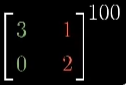

如果你要计算这个矩阵的100 次幂

> 一种更容易的做法是先变换到特征基
>
> 在那个坐标系中计算100次幂
>
> 然后转换回标准坐标系
>
> > 如果**特征向是不够多**时,并**不能张成全空间**, 就不做这么做了
> >
> > 但是如果能找到一组特征基,矩阵运算会变得非常轻松


### 抽象向量空间

[线性代数的本质11 抽象向量空间](https://zhuanlan.zhihu.com/p/111287930)


行列式和特征向量与所选坐标系无关 

> 这二者都是暗含在空间中的性质


从某种意义上说,函数实际上只是另一种向量

> f + g = (f + g)
>
> > (f+g)(x) = f(x) + g(x)

因为向量相加与数乘能用于函数

所以最初以空间中箭头为背景来建立的线性代数的合理概念和解决问题的手段，例如：线性变换，列空间、点积、特征值、特征向量等，应该能够直接应用于函数


### 算子就是变换的别名

**算子就是变换的别名，而变换又是函数的花俏说法。**
$$
L(\frac{1}{9} x^3 -x ) = \frac{1}{3} - 1
$$

函数的线性变换有一个合理的解释

> 这个变换接收一个函数,并把它变成另一个函数
>
> **导数就是这样一个例子,它将一个函数变成另一个函数**
>
> 有时你听到的是"算子" 而不是变换, 不过它们是一个意思


一个函数的变换是线性的是什么意思?

> Additivity: $L(\overrightarrow{v}+\overrightarrow{w}) = L(\overrightarrow{v})+L(\overrightarrow{w})$
> Scaling: $L(c \overrightarrow{v}) = c L(\overrightarrow{v})$


#### 求导就是一种线性运算

他符合以上两个条件


#### 函数空间倾向于有无穷维


### 选多项式的不同次幂作为一组基

> 换句话说,第一个基函数是一个常函数,既$b_{0}(x)=1,$ 第二个基函数是$b_{1}=x$,然后是 $b_{1}=x^2$ 以此类推  
>
> 基函数的作用和i-hat,j-hat,k-hat 在向量的世界中起到的作用类似
>
> > "hat" 前面的数就是坐标

> 因为多项式的次数可以任意高,所以这个基函数集也是无穷大的


> 想想二进制的定义, 它也有基函数$2^0, 2^1,...$,这里x =2


### 矩阵求导

乍一看，矩阵向量乘法和求导像是毫不相干的 

> 但它们两个其实是一家人 

[线性代数的本质11 抽象向量空间](https://zhuanlan.zhihu.com/p/111287930)


#### 矩阵描述求导


##### 线代术语及其应用于函数时的别名


>>>>>>> 63a902a5cd15b749dbb2734cabd3168210c6cb5f


## 线性函数

变量累加，**函数分别累加**。变量缩放，**函数缩放**

> $f(x+y)=f(x)+f(y)$
>
> $f(kx) = kf(x)$


张量的概念早在19世纪末就被数学家提出了, 但这个概念真正发扬光大, 还是在相对论出现以后. 原因是, 在相对论中, 在不同的参考系下看同一个物理系统, 它"看起来"是不一样的: 比如**粒子的动量和能量在不同的参考系下根据 Lorentz 变换相联系**.


A.Zee 书中所说: **A tensor is something that transforms like a tensor! 一个量, 在不同的参考系下按照某种特定的法则进行变换, 就是张量.**


如果你对线性代数略知一二, 可能知道线性变换这个概念. 线性变换这个概念的精髓之处在于, 它不依赖于线性空间的基的选取. 在某一组基下, 它的矩阵表示A是一个模样; 在另外一组基下, 它的矩阵表示
$A'=TAT^-1$是另一个模样, 其中T 是**基变换矩阵**. 有一种常见的说法: **矩阵的意义是线性变换, 相似矩阵是同一个线性变换在不同的基下的表示.**


慢着! "同一个线性变换在不同的基下的表示", 这难道不就是和之前说的张量是一回事嘛! Lorentz 变换就是 Minkowski 空间中的基变换, 能动量张量实质上就是一个线性变换. Andrew 和 Bob 看到的能动量张量, 不就是这个线性变换在不同的基下的表示吗?


什么是张量? 在数学家眼中, **张量已经被抽象成了线性变换**.


我还有一点不懂：矩阵可以看作是对矢量的线性变换，也就是在这里，矢量像是一个名词，而矩阵像是一个动词。那么，张量的地位是怎样的呢？它是可以被别人变换的东西，还是可以去变换别人的东西呢？


两者并不矛盾, 请回忆线性代数. **矩阵 A 是线性变换**, 来变换别人 (矢量 x'=Ax ), **但也可以被别人变换(坐标变换** $A'=TAT^{-1}$).


这个可以从对偶和配对的角度来理解，如果 v 是线性空间 V 的一元， u 是 V 上的线性函数意即对偶空间 V* 的一元，那么 u 作用到 v 得到的标量 u(v) ，也可以写成配对形式 <u,v>；从左往右看 u 是动词而 v 是名词，但是反过来从右往左看，也可以认为 v 是动词而 u 是名词，换言之可以将 v 视为 V^上的线性函数（即所谓 V 自然同构于 V**）

作为线性变换的张量的运算也是如此


**线性变换是一类特殊的2-型张量**，可以用二维的矩阵来表示，**一般的张量可以是更多维的对象**，运算一般就直接写分量而没有类似矩阵的写法了

推荐看看我的回答：矩阵乘法的本质是什么？


一个 ***(p,q)*型的张量** *T* 被**定义为一个多重线性映射(multilinear map)**

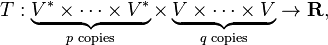

其中 *V* 是矢量空间，*V* ∗ 是其对偶空间。


## Geometry


In geometry, a normal is an object such as a line, ray, or vector that is perpendicular to a given object. 

```python
import numpy as np
import matplotlib.pyplot as plt
from mpl_toolkits.mplot3d import Axes3D

point  = np.array([1, 2, 3])
normal = np.array([1, 1, 2])

# a plane is a*x+b*y+c*z+d=0
# [a,b,c] is the normal. Thus, we have to calculate
# d and we're set
d = -point.dot(normal)

# create x,y
xx, yy = np.meshgrid(range(10), range(10))

# calculate corresponding z
z = (-normal[0] * xx - normal[1] * yy - d) * 1. /normal[2]

# plot the surface
plt3d = plt.figure().gca(projection='3d')
plt3d.plot_surface(xx, yy, z)
plt.show()
```


张量就是物理量，与张量相关的数学是对高维(维数≥ 2) 的物理量进行“量纲分析” 的一种工具。 同一个物理量可以由不同的向量/矩阵表示出来，这是由线性空间（通常是流形的切空间）的对称性决定的。 先发一个微信里看到的雷人数学题，这个其实对于理解张量分析很有帮助。


切空间（Tangent space）是在某一点所有的切向量组成的线性空间。 向量（切向量）存在多种定义。 直观的讲，如果所研究的流形（Manifold）是一个三维空间中的曲面，则在每一点的切向量，就是和该曲面相切的向量，切空间就是和该曲面相切的平面。


切空间就是流形在一点处的线性化，可以理解成对流形在给定点“求微分”。正如同切线是把曲线局部“掰直”一样，切空间就是把流形在局部“掰平”，而且这种构造是intrinsic的，只要给出流形的微分结构就自然而然地有切空间。而且切空间也是一种 natural的几何对象，这个natural 应该从范畴论中functor的角度来理解。


知识有两种：我们自己知道一个问题的答案，或我们知道在哪儿我们可以找到这个问题的答案。


信息就是力量。但就像所有力量一样，有些人只想占为己有。世界上所有的科学和文化遗产，已在书籍和期刊上发布了数个世纪，正渐渐地被少数私有的公司数字化并上锁。那些能够获取这些资源的人，你有责任将它与世界分享。


张量分析和微分几何是捆绑在一起的，微分几何学到高阶自然需要张量


‌

比如曲率张量、电磁场张量、能动量张量


‌

应力张量、应变张量,它们都是二阶张量


‌

二阶张量中的两组基可以分属不同的两个坐标系


‌

为满足爱因斯坦求和约定,分量的指标须按排序与基的指标对偶


‌

https://www.bilibili.com/video/BV1i741147SG


‌

非开集不是闭集。子集可以不开不闭，也可以既开又闭（量子态？）


‌

集合的子集分为开集和非开集两类


‌

拓扑是集合的若干子集的集合


‌

P主汉语配音-【线性代数的本质】


‌

https://www.bilibili.com/video/BV1ib411t7YR?p=4


‌

向量可以是任何东西，只要保证两个向量相加以及数字与向量相乘是有意义的即可


‌

向量加法和向量数乘有意义

> 线性代数紧紧围绕向量加法与数乘


**两个向量张成的空间**实际上是问：仅通过向量**加法与向量数乘**这两种基础运算，你能获得的**所有可能向量的集合是什么**


物理视角：向量可以在空间中自由落脚

数学视角：线性代数中,向量经常以原点作为起


**用终点代表向量**


通常我们就**用向量的终点代表该向量**

> 当你只考虑一个向量时,就把它看作箭头
>
> 当你考虑多个向量时,就把它们都看作点


### 线性相关

> 至少有一个向量对张成的空间没有做出贡献，去掉它也不影响张成的空间
>
> 它是其它向量的线性组合，它已经落在了其它向量张成的空间里


### 线性无关

> 每一个向量都为张成的空间增加了新的维度


‌

### 基的严格定义


> 空间的一组基是张成该空间的一个线性无关向量的集合


‌

矩阵是为了定义性线变换


‌

Matrices as Linear transformations


‌

变换是函数的花哨的说法


‌

**性线变换接收一个向量并且输出一个向量的变换**


‌

### 矩阵的列是变换后的基向量


‌

**原向量的分量缩放新基向量再相加**，就得到变换后的向量


‌

给出另一个空间的一组基，用原向量的分量(此时是标量)数乘这组基(缩放)，再求向量和，就**得到新空间中变换后的向量**


‌

把矩阵乘法看成是基向量的线性组合


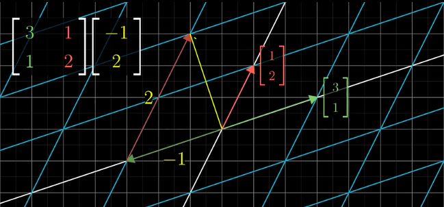

Enter a caption for this image (optional)


Enter a caption for this image (optional)


‌

**新的基向量不是垂直的，新空间就相当于对原空间进行了一个扭动**


Enter a caption for this image (optional)


‌

## 描述作用是旋转90度的矩阵这样构造


‌

描述作用是旋转90度的矩阵这样构造：原基向量转90度，得到一组新坐标然后写成矩阵的形式就成了。用它右乘原空间中的任一向量结果都相当于把它旋转90度


‌

## 复合变换


‌

多个矩阵相乘？


Enter a caption for this image (optional)


‌

原基向量先变成这个，再变成那个，最后变成这个。符合矩阵乘法，描述多个变换的叠加。**其结果和一步到位的给出最终基矩阵是一样的**


‌

矢量就是张量


‌

矢量可以表示面积，让矢量垂直平面，长度正比于面积


‌

矢量分量和基矢(vector components and basis vectors)


‌

直角(righit angles)


‌

笛卡尔坐标系(the Cartesian coordinate system)


‌

单位向量x-hat(x头上写一个^),也可以m向量i-ha


‌

单位向量指向坐标轴增加的方向


‌

**矢量的分量是矢量向坐标轴的投影**


‌

矢量以叫做一阶张量，因为每个分量只有一个基矢


‌

标量可以看成是零阶张量


‌

用分量和基矢的组合表示张量


‌

## 表示一个三维空间中的二阶张量


Enter a caption for this image (optional)


‌

比如Axx表示曲面上x方向的力,且曲面的面积矢量在x方向上


‌

Ayx表示曲面上x方向的力, 且曲面的面积矢量在y方向上


‌

9个分量和9组基矢共同组成了一个二阶张量


‌

表示了一个三维空间中的三阶张量


Enter a caption for this image (optional)


‌

a rank-three  tensor in three dimensional space


‌

Axxx是和三个基矢x有关的分量


‌

这可以解释成,**对于所有参考系下的所有观测者**，描述同样问题时,使用的基矢或者分量都不一样。**但是使用分量和基矢的组合时,就能够保持一致性**


‌

这是因为基矢在参考系之间遵循一种变换规则


> The reason for that is that the basis vectors transform one way between reference frames


‌

为了保证分量和基矢的组合对所有观测者都是一样的，分量也要以一种规则进行变换，因为张量的这一性质, Lillian Lieber把张量看作是宇宙的本质
