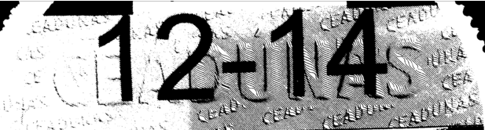
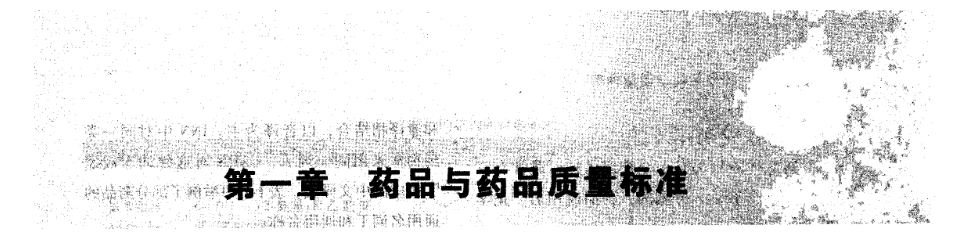

#  删除边缘的对象


```

// opencvsharp

// 删除边缘的对象
    public static Mat DeleteBorderComponents(string path_src)
    {
        // https://stackoverflow.com/questions/65534370/remove-the-element-attached-to-the-image-border
        using (Mat neg = new Mat())
        using (Mat pad = new Mat())
        using (Mat img_gray = Grayize(path_src))
        {
            Cv2.BitwiseNot(img_gray, neg);  // 反色
            Cv2.CopyMakeBorder(neg, pad, 1, 1, 1, 1, BorderTypes.Constant, 255);  // 上下左右各加一像素
            Size size = pad.Size();
            Mat mask = Mat.Zeros(size.Height + 2, size.Width + 2, MatType.CV_8UC1);  // Mask 图像宽高都比pad 多两像素

            Rect rect_floodfill = new Rect();
            Cv2.FloodFill(pad, mask, new Point(0, 0), 0, out rect_floodfill, 5, 0, FloodFillFlags.Link8);  // 填充

            Mat tmp = pad.Clone(new Rect(2, 2, size.Width - 2, size.Height - 2));  // 宽高前面各加了共两像素，这里减去
            Cv2.BitwiseNot(tmp, tmp);

            //Cv2.ImWrite(@"D:\opencv\outttttt.jpg", tmp);

            return tmp;
        }
```


```C++

// C++

void DeleteBorderComponents(Mat& im) {

    Mat neg;
    cv::bitwise_not(im, neg);  // 反色

    Mat pad;

    cv::copyMakeBorder(neg, pad, 1,1,1,1, cv::BorderTypes::BORDER_CONSTANT, 255); // 上下左右各加一像素

    Size size = pad.size();
    Mat mask = Mat::zeros(size.height + 2, size.width + 2, CV_8UC1);  // Mask 图像宽高都比pad 多两像素


    cv::floodFill(pad, mask, Point(0, 0), cv::Scalar(0), 0, cv::Scalar(), cv::Scalar(), 8); // 填充

   
    cv::Rect r(2, 2, size.width - 2, size.height - 2);
    Mat tmp = pad(r).clone();

    cv::bitwise_not(tmp, tmp);
    
    imshow("cleaned", tmp);
    cv::waitKey();
}
```


# 二值化


```python
# Python programe to illustrate
# simple thresholding type on an image
     
# organizing imports
import cv2
import numpy as np
 
# path to input image is specified and 
# image is loaded with imread command
image1 = cv2.imread('000017.bmp')
 
# cv2.cvtColor is applied over the
# image input with applied parameters
# to convert the image in grayscale
img = cv2.cvtColor(image1, cv2.COLOR_BGR2GRAY)
 
# applying different thresholding
# techniques on the input image
# all pixels value above 120 will
# be set to 255
ret, thresh1 = cv2.threshold(img, 120, 255, cv2.THRESH_BINARY)

# the window showing output images
# with the corresponding thresholding
# techniques applied to the input images
cv2.imshow('Binary Threshold', thresh1)

   
# De-allocate any associated memory usage 
if cv2.waitKey(0) & 0xff == 27:
    cv2.destroyAllWindows()
```


```C#
    // 灰度化
    public static Mat Grayize(string path_src)
    {
        using (Mat src = new Mat(path_src))
        using (Mat img_gray = new Mat())
        {
            Cv2.CvtColor(src, img_gray, ColorConversionCodes.BGR2GRAY); // 灰度化
            return img_gray.Clone();
        }
    }

    // 二值化
    public static Mat Binarize(string path_src)
    {
        // https://www.geeksforgeeks.org/python-thresholding-techniques-using-opencv-set-1-simple-thresholding/
        using (Mat img_gray = Sample.Grayize(path_src)) // 灰度化
        using (Mat img_binary = new Mat())
        {
            Cv2.Threshold(img_gray, img_binary, 120, 255, ThresholdTypes.Binary); // 二值化
            return img_binary.Clone();
        }
    }

    // 二值化并保存文件
    public static void BinarizeAndWriteFile(string path_src, string path_dst, bool silence = true)
    {
        Mat img_binary = Sample.Binarize(path_src);
        Cv2.ImWrite(path_dst, img_binary);
        if (!silence)
        {
            Cv2.ImShow("dst", img_binary);
            Cv2.WaitKey();
            //Cv2.DestroyAllWindows();
        }
    }
```


# 反色

```python
img = cv2.imread('0001.bmp')
img = cv2.bitwise_not(img)
```


# 边缘检测


```c#
            # https://blog.csdn.net/zanllp/article/details/79829813
            Mat src = new Mat("1.jpg", ImreadModes.Grayscale);
            Mat dst = new Mat();

            Cv2.Canny(src, dst, 50, 200);
            Cv2.ImShow("src image", src);
            Cv2.ImShow("dst image", dst);
            Cv2.WaitKey();
            //using (new Window("src image", src))
            //using (new Window("dst image", dst))
            //{
            //    Cv2.WaitKey();
            //}
```


# 最小外接矩形


```c#
# https://www.cnblogs.com/little-monkey/p/7429579.html


```


```c#
    // 边缘检测
    public static void canny()
    {
        // https://blog.csdn.net/zanllp/article/details/79829813
        Mat src = new Mat("1.jpg", ImreadModes.Grayscale);
        Mat dst = new Mat();

        Cv2.Canny(src, dst, 50, 200);
        Cv2.ImWrite("2.jpg", dst);

        Cv2.ImShow("src image", src);
        Cv2.ImShow("dst image", dst);
        Cv2.WaitKey();
        //using (new Window("src image", src))
        //using (new Window("dst image", dst))
        //{
        //    Cv2.WaitKey();
        //}
    }

    // 最小外接矩形
    public static void minAreaRect()
    {
        // https://www.cnblogs.com/little-monkey/p/7429579.html
        Mat src = new Mat("minAreaRect.jpg", ImreadModes.Grayscale);
        Mat dst = src.Clone();
        Cv2.Threshold(src, src, 100, 255, ThresholdTypes.Binary);
        Cv2.ImShow("src binary", src);
        Cv2.WaitKey();
    }

   
    // 透视变换
    public static void perspectiveTransformation()
    {
        // https://www.cnblogs.com/wj-1314/p/11975977.html
        // https://github.com/LeBron-Jian/ComputerVisionPractice


    }
```


# remove-image-background-of-headshot-in-mathematica


```

# https://mathematica.stackexchange.com/questions/9449/remove-image-background-of-headshot-in-mathematica


```


# removing-noise-using-connected-components


```

# https://answers.opencv.org/question/194566/removing-noise-using-connected-components/

import cv2
import numpy as np
from PIL import Image
import copy

img = cv2.imread('hsv.png',0)
nlabel,labels,stats,centroids = cv2.connectedComponentsWithStats(img,connectivity=8)

labels_small = []
areas_small = []

for l in range(1,nlabel):
    if stats[l,cv2.CC_STAT_AREA]<=1000:
        labels_small.append(l)
        areas_small.append(stats[l,cv2.CC_STAT_AREA])

mask = np.ones_like(labels,dtype=np.uint8)

# tstart = time.time()

# for l in labels_small:
#     mask[labels == l] = 0
    #img[labels == l] = 0

# labX,labY = labels.shape
# for i in range(labX):
#     print ('X:'+str(i))
#     for j in range(labY):
#         print ('Y:'+str(j))
#         if labels[i,j] in labels_small:
#             mask[i,j] = 1

for l in labels_small:
    mask[labels == l] = 255

# tend = time.time()
# print 'time taken:' + str(tend-tstart) + 'secs'


im = Image.fromarray(mask)
im.convert('RGB').save("cc_mask.jpg")

newHsv = copy.deepcopy(img)
cv2.bitwise_and(newHsv,newHsv,mask=mask)
cv2.imwrite('hsv_new.jpg',newHsv)


```


# Removing horizontal underlines


```
# https://stackoverflow.com/questions/48327567/removing-horizontal-underlines/48363834#48363834

# 很不错


```


# C++


```c++
#include <iostream>
#include <opencv.hpp>
#include <opencv2/imgproc.hpp>

using namespace cv;
using namespace std;

void clean(Mat& im) {
    // apply Otsu threshold
    Mat bw;
    threshold(im, bw, 0, 255, CV_THRESH_BINARY_INV | CV_THRESH_OTSU);
    // take the distance transform
    Mat dist;
    distanceTransform(bw, dist, CV_DIST_L2, CV_DIST_MASK_PRECISE);

    Mat dibw;
    // threshold the distance transformed image
    double SWTHRESH = 2;    // stroke width threshold
    threshold(dist, dibw, SWTHRESH / 2, 255, CV_THRESH_BINARY);

    dibw.convertTo(dibw, CV_8U);

    Mat neg;

    cv::bitwise_not(dibw, im);
}


void DeleteBorderComponents(Mat& im) {

    Mat neg;
    cv::bitwise_not(im, neg);  // 反色

    Mat pad;

    cv::copyMakeBorder(neg, pad, 1,1,1,1, cv::BorderTypes::BORDER_CONSTANT, 255); // 上下左右各加一像素

    Size size = pad.size();
    Mat mask = Mat::zeros(size.height + 2, size.width + 2, CV_8UC1);  // Mask 图像宽高都比pad 多两像素


    cv::floodFill(pad, mask, Point(0, 0), cv::Scalar(0), 0, cv::Scalar(), cv::Scalar(), 8); // 填充

   
    cv::Rect r(2, 2, size.width - 2, size.height - 2);
    Mat tmp = pad(r).clone();

    cv::bitwise_not(tmp, tmp);

    tmp.copyTo(im);

    //imshow("cleaned", tmp);
    //cv::waitKey();
}


int main()
{

    Mat im = cv::imread("booktitle.jpg", CV_LOAD_IMAGE_COLOR); // booktitle.png
    cv::cvtColor(im, im, CV_BGR2GRAY);

    DeleteBorderComponents(im);

    clean(im);
    clean(im);

    imshow("cleaned", im);
    cv::waitKey();
}
```


# 以彩图加载


```c++
Mat img = cv::imread("small3.jpg", CV_LOAD_IMAGE_COLOR);
Mat dst;
cv::cvtColor(img, dst, CV_BGR2GRAY);
```


# 对所有Components 着色


```c++

// 对所有Components 着色

#include <iostream>
#include <opencv.hpp>
#include <opencv2/imgproc.hpp>

using namespace cv;
using namespace std;

int main()
{

    Mat img = cv::imread("small3.jpg", CV_LOAD_IMAGE_COLOR);
    cv::cvtColor(img, img, CV_BGR2GRAY);

    Mat src, src_color, g_src, labels, stats, centroids;
    int num = connectedComponentsWithStats(img, labels, stats, centroids);
    vector<Vec3b> color(num + 1);
    color[0] = Vec3b(0, 0, 0);  //背景色
    for (int m = 1; m <= num; m++) {
        color[m] = Vec3b(rand() % 256, rand() % 256, rand() % 256);
        //if (stats.at<int>(m - 1, CC_STAT_AREA) < 30)
            //color[m] = Vec3b(0, 0, 0);
    }
    src_color = Mat::zeros(img.size(), CV_8UC3);
    for (int x = 0; x < img.rows; x++)
        for (int y = 0; y < img.cols; y++)
        {
            int label = labels.at<int>(x, y);//注意labels是int型，不是uchar.
            src_color.at<Vec3b>(x, y) = color[label];
        }
    imshow("labelMap", src_color);
    cv::waitKey();

    std::cout << "Hello World!\n";
}
```


# 无损删除过小对象


```c++
#include <iostream>
#include <opencv.hpp>
#include <opencv2/imgproc.hpp>

using namespace cv;
using namespace std;

int main()
{

    Mat img = cv::imread("small.jpg", CV_LOAD_IMAGE_COLOR);
    cv::cvtColor(img, img, CV_BGR2GRAY);

    cv::Mat outputLabels, stats, img_color, centroids;

    // 计算所有8 个方向的连通块
    int numberofComponents = cv::connectedComponentsWithStats(img, outputLabels,
        stats, centroids, 4);

    std::vector<cv::Vec3b> colors(numberofComponents + 1);
    

    //do not count the original background-> label = 0:
    colors[0] = cv::Vec3b(0, 0, 0);

    // 每个连通块随机分配一种不同的颜色
    for (int i = 1; i <= numberofComponents; i++) {
        colors[i] = cv::Vec3b(rand() % 256, rand() % 256, rand() % 256);
    }

    //Area threshold:
    int minArea = 25*25; //10 px


    // 面积过小的块用粉色标注
    for (int i = 1; i <= numberofComponents; i++) {

        //get the area of the current blob:
        auto blobArea = stats.at<int>(i - 1, cv::CC_STAT_AREA);

        //apply the area filter:
        if (blobArea < minArea)
        {
            //filter blob below minimum area:
            //small regions are painted with (ridiculous) pink color
            colors[i - 1] =  cv::Vec3b(248, 48, 213);  // cv::Vec3b(0, 0, 0);

        }

    }

    // 新建一张彩图
    Mat color_img = Mat::zeros(img.size(), CV_8UC3);

    for (int x = 0; x < img.rows; x++) 
    {
        for (int y = 0; y < img.cols; y++)
        {
            int label = outputLabels.at<int>(x, y);  //注意labels是int型，不是uchar.
            color_img.at<Vec3b>(x, y) = colors[label];

            if (colors[label] == cv::Vec3b(248, 48, 213)) {
                img.at<cv::uint8_t>(x, y) = 0;
            }

        }
    }

    imshow("color", color_img);
    imshow("origin", img);
    cv::waitKey();

    std::cout << "Hello World!\n";
}
```


```c++
# CV3

#include <iostream>
#include <opencv.hpp>
#include <opencv2/imgproc.hpp>

using namespace cv;

int main()
{
    Mat im = imread("small.jpg", 0);

    cv::Mat outputLabels, stats, img_color, centroids;

    int numberofComponents = cv::connectedComponentsWithStats(im, outputLabels,
        stats, centroids, 8);


    std::vector<cv::Vec3b> colors(numberofComponents + 1);
    for (int i = 0; i <= numberofComponents; i++) {
        colors[i] = cv::Vec3b(rand() % 256, rand() % 256, rand() % 256);
    }


    //do not count the original background-> label = 0:
    colors[0] = cv::Vec3b(0, 0, 0);

    //Area threshold:
    int minArea = 10; //10 px

    for (int i = 1; i <= numberofComponents; i++) {

        //get the area of the current blob:
        auto blobArea = stats.at<int>(i - 1, cv::CC_STAT_AREA);

        //apply the area filter:
        if (blobArea < minArea)
        {
            //filter blob below minimum area:
            //small regions are painted with (ridiculous) pink color
            colors[i - 1] = cv::Vec3b(248, 48, 213);

        }

    }

    std::cout << "Hello World!\n";
}
```


# Distance transform





```c++

# https://stackoverflow.com/questions/33881175/remove-background-noise-from-image-to-make-text-more-clear-for-ocr/33961545#33961545


#include <iostream>
#include <opencv.hpp>
#include <opencv2/imgproc.hpp>

using namespace cv;
using namespace std;

int main()
{

    Mat im = cv::imread("aRh8C.png", CV_LOAD_IMAGE_COLOR);
    cv::cvtColor(im, im, CV_BGR2GRAY);

    // apply Otsu threshold
    Mat bw;
    threshold(im, bw, 0, 255, CV_THRESH_BINARY_INV | CV_THRESH_OTSU);
    // take the distance transform
    Mat dist;
    distanceTransform(bw, dist, CV_DIST_L2, CV_DIST_MASK_PRECISE);

    Mat dibw;
    // threshold the distance transformed image
    double SWTHRESH = 10;    // stroke width threshold
    threshold(dist, dibw, SWTHRESH / 2, 255, CV_THRESH_BINARY);

    Mat kernel = getStructuringElement(MORPH_RECT, Size(3, 3));
    // perform opening, in case digits are still connected
    Mat morph;
    morphologyEx(dibw, morph, CV_MOP_OPEN, kernel);
    dibw.convertTo(dibw, CV_8U);

    // find contours and filter
    Mat cont;
    morph.convertTo(cont, CV_8U);

    Mat binary;
    cvtColor(dibw, binary, CV_GRAY2BGR);

    const double HTHRESH = im.rows * .5;    // height threshold
    vector<vector<Point>> contours;
    vector<Vec4i> hierarchy;
    vector<Point> digits; // points corresponding to digit contours

    findContours(cont, contours, hierarchy, CV_RETR_CCOMP, CV_CHAIN_APPROX_SIMPLE, Point(0, 0));
    for (int idx = 0; idx >= 0; idx = hierarchy[idx][0])
    {
        Rect rect = boundingRect(contours[idx]);
        if (rect.height > HTHRESH)
        {
            // append the points of this contour to digit points
            digits.insert(digits.end(), contours[idx].begin(), contours[idx].end());

            rectangle(binary,
                Point(rect.x, rect.y), Point(rect.x + rect.width - 1, rect.y + rect.height - 1),
                Scalar(0, 0, 255), 1);
        }
    }

    // take the convexhull of the digit contours
    vector<Point> digitsHull;
    convexHull(digits, digitsHull);
    // prepare a mask
    vector<vector<Point>> digitsRegion;
    digitsRegion.push_back(digitsHull);
    Mat digitsMask = Mat::zeros(im.rows, im.cols, CV_8U);
    drawContours(digitsMask, digitsRegion, 0, Scalar(255, 255, 255), -1);
    // expand the mask to include any information we lost in earlier morphological opening
    morphologyEx(digitsMask, digitsMask, CV_MOP_DILATE, kernel);
    // copy the region to get a cleaned image
    Mat cleaned = Mat::zeros(im.rows, im.cols, CV_8U);
    dibw.copyTo(cleaned, digitsMask);

    //imshow("Otsu threshold", bw);
    imshow("cleaned", cleaned);
    cv::waitKey();


    std::cout << "Hello World!\n";
}

```


# Clean




```

// clean 两次就比较干净了

#include <iostream>
#include <opencv.hpp>
#include <opencv2/imgproc.hpp>

using namespace cv;
using namespace std;

void clean(Mat& im) {
    // apply Otsu threshold
    Mat bw;
    threshold(im, bw, 0, 255, CV_THRESH_BINARY_INV | CV_THRESH_OTSU);
    // take the distance transform
    Mat dist;
    distanceTransform(bw, dist, CV_DIST_L2, CV_DIST_MASK_PRECISE);

    Mat dibw;
    // threshold the distance transformed image
    double SWTHRESH = 2;    // stroke width threshold
    threshold(dist, dibw, SWTHRESH / 2, 255, CV_THRESH_BINARY);

    dibw.convertTo(dibw, CV_8U);

    Mat neg;

    cv::bitwise_not(dibw, im);
}

int main()
{

    Mat im = cv::imread("booktitle.png", CV_LOAD_IMAGE_COLOR);
    cv::cvtColor(im, im, CV_BGR2GRAY);

    clean(im);
    clean(im);

    imshow("cleaned", im);
    cv::waitKey();
}
```


```c++
# cv2
opencv_core2413d.lib
opencv_imgproc2413d.lib
opencv_highgui2413d.lib
opencv_ml2413d.lib
opencv_video2413d.lib
opencv_features2d2413d.lib
opencv_calib3d2413d.lib
opencv_objdetect2413d.lib
opencv_contrib2413d.lib
opencv_legacy2413d.lib
opencv_flann2413d.lib
```

