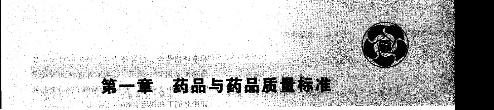
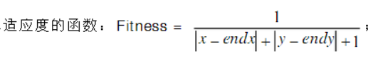

# opencv-python

```
// 对所有Components 着色  python
// 其它语言看后面的：对所有Components 着色(三语)
# pip install opencv-python
# https://docs.opencv.org/3.4/d3/dc0/group__imgproc__shape.html#ga107a78bf7cd25dec05fb4dfc5c9e765f
# https://www.programcreek.com/python/example/89340/cv2.connectedComponentsWithStats
# https://learnopencv.com/color-spaces-in-opencv-cpp-python/

import numpy as np
import cv2
import random


"""
虽然python 3 使用统一编码解决了中文字符串的问题, 但在使用opencv中imread函数读取中文路径图像文件时仍会报错
此时可借助于numpy 先将文件数据读取出来, 然后使用opencv中imdecode函数将其解码成图像数据。此方法对python 2 和3均使用。
"""

if __name__ == '__main__':

    img = cv2.imdecode(np.fromfile('./small3.jpg', dtype=np.uint8), -1)

    img = cv2.cvtColor(img, cv2.COLOR_BGR2GRAY)

    num, labels, stats, centroids = cv2.connectedComponentsWithStats(img)

    Rows, Cols = img.shape

    color = []
    color.append([0, 0, 0]) # 背景色
    for i in range(num):
        color.append( [
            random.randint(0, 32767) % 256,
            random.randint(0, 32767) % 256,
            random.randint(0, 32767) % 256 
        ])

    src_color = np.zeros((Rows,Cols, 3), dtype=np.uint8)

    for x in range(Rows):
        for y in range(Cols):
            label = labels[x][y]  # 图像总共有 num 个连通块, labels 会告诉你每一个坐标属于哪一个连通块
                # color 总共分配了 num + 1 种随机颜色, 每一个连通块都能分到一个随机色 
            src_color[x][y] = color[label]  

    cv2.imshow("Perpesctive transform", src_color)
    cv2.waitKey()
```


```
# tesseract ocr 文字坐标
# https://localcoder.org/getting-the-bounding-box-of-the-recognized-words-using-python-tesseract

import pytesseract
from pytesseract import Output
import cv2
img = cv2.imread('7001.jpg')

d = pytesseract.image_to_data(img, output_type=Output.DICT)
n_boxes = len(d['level'])
for i in range(n_boxes):
    (x, y, w, h) = (d['left'][i], d['top'][i], d['width'][i], d['height'][i])
    cv2.rectangle(img, (x, y), (x + w, y + h), (0, 255, 0), 2)

cv2.imshow('img', img)
cv2.waitKey(0)
```


# Opencv4nodejs

- https://zhuanlan.zhihu.com/p/334814524

  > Opencv4nodejs 安装

- https://github.com/UrielCh/opencv4nodejs

  >  Opencv4nodejs fork 版，易安装，功能多
  >
  > NW.js lets you call all Node.js modules directly from DOM 


# 坐标系不要被坑了


```c#
Point p(x, y); //第几行第几列
im.At(x, y) //第几行第几列
Rect(X=y, Y=x) //第几列第几行
// 注意这两个传参的顺序是不一样的
int pixel = im.At<Byte>(x, y);
```


#  删除边缘的对象


```

        /// <summary>
        /// computes weighted sum of two arrays (dst = alpha*src1 + beta*src2 + gamma)
        /// </summary>
        /// <param name="src1"></param>
        /// <param name="alpha"></param>
        /// <param name="src2"></param>
        /// <param name="beta"></param>
        /// <param name="gamma"></param>
        /// <param name="dst"></param>
        /// <param name="dtype"></param>

// opencvsharp
// https://github.com/VahidN/OpenCVSharp-Samples/blob/master/OpenCVSharpSample19/Program.cs

// 删除边缘的对象
    public static Mat DeleteBorderComponents(string path_src)
    {
        // https://stackoverflow.com/questions/65534370/remove-the-element-attached-to-the-image-border
        using (Mat neg = new Mat())
        using (Mat pad = new Mat())
        using (Mat img_gray = Grayize(path_src))
        {
            Cv2.BitwiseNot(img_gray, neg);  // 反色
            Cv2.CopyMakeBorder(neg, pad, 1, 1, 1, 1, BorderTypes.Constant, 255);  // 上下左右各加一像素
            Size size = pad.Size();
            Mat mask = Mat.Zeros(size.Height + 2, size.Width + 2, MatType.CV_8UC1);  // Mask 图像宽高都比pad 多两像素

            Rect rect_floodfill = new Rect();
            Cv2.FloodFill(pad, mask, new Point(0, 0), 0, out rect_floodfill, 5, 0, FloodFillFlags.Link8);  // 填充

            Mat tmp = pad.Clone(new Rect(2, 2, size.Width - 2, size.Height - 2));  // 宽高前面各加了共两像素，这里减去
            Cv2.BitwiseNot(tmp, tmp);

            //Cv2.ImWrite(@"D:\opencv\outttttt.jpg", tmp);

            return tmp;
        }
```


```C++

// C++

void DeleteBorderComponents(Mat& im) {

    Mat neg;
    cv::bitwise_not(im, neg);  // 反色

    Mat pad;

    cv::copyMakeBorder(neg, pad, 1,1,1,1, cv::BorderTypes::BORDER_CONSTANT, 255); // 上下左右各加一像素

    Size size = pad.size();
    Mat mask = Mat::zeros(size.height + 2, size.width + 2, CV_8UC1);  // Mask 图像宽高都比pad 多两像素


    cv::floodFill(pad, mask, Point(0, 0), cv::Scalar(0), 0, cv::Scalar(), cv::Scalar(), 8); // 填充

   
    cv::Rect r(2, 2, size.width - 2, size.height - 2);
    Mat tmp = pad(r).clone();

    cv::bitwise_not(tmp, tmp);
    
    imshow("cleaned", tmp);
    cv::waitKey();
}
```


# 二值化


```python
# Python programe to illustrate
# simple thresholding type on an image
     
# organizing imports
import cv2
import numpy as np
 
# path to input image is specified and 
# image is loaded with imread command
image1 = cv2.imread('000017.bmp')
 
# cv2.cvtColor is applied over the
# image input with applied parameters
# to convert the image in grayscale
img = cv2.cvtColor(image1, cv2.COLOR_BGR2GRAY)
 
# applying different thresholding
# techniques on the input image
# all pixels value above 120 will
# be set to 255
ret, thresh1 = cv2.threshold(img, 120, 255, cv2.THRESH_BINARY)

# the window showing output images
# with the corresponding thresholding
# techniques applied to the input images
cv2.imshow('Binary Threshold', thresh1)

   
# De-allocate any associated memory usage 
if cv2.waitKey(0) & 0xff == 27:
    cv2.destroyAllWindows()
```


```C#
    // 灰度化
    public static Mat Grayize(string path_src)
    {
        using (Mat src = new Mat(path_src))
        using (Mat img_gray = new Mat())
        {
            Cv2.CvtColor(src, img_gray, ColorConversionCodes.BGR2GRAY); // 灰度化
            return img_gray.Clone();
        }
    }

    // 二值化
    public static Mat Binarize(string path_src)
    {
        // https://www.geeksforgeeks.org/python-thresholding-techniques-using-opencv-set-1-simple-thresholding/
        using (Mat img_gray = Sample.Grayize(path_src)) // 灰度化
        using (Mat img_binary = new Mat())
        {
            Cv2.Threshold(img_gray, img_binary, 120, 255, ThresholdTypes.Binary); // 二值化
            return img_binary.Clone();
        }
    }

    // 二值化并保存文件
    public static void BinarizeAndWriteFile(string path_src, string path_dst, bool silence = true)
    {
        Mat img_binary = Sample.Binarize(path_src);
        Cv2.ImWrite(path_dst, img_binary);
        if (!silence)
        {
            Cv2.ImShow("dst", img_binary);
            Cv2.WaitKey();
            //Cv2.DestroyAllWindows();
        }
    }
```


# 遍历像素


```c#
public Mat DeleteSmallComponents(Mat im)
    {

        // https://qiita.com/kaiyu_tech/items/a37fc929ac0f3328fea1

        Cv2.BitwiseNot(im, im);  // 反色

        var labels = new Mat();
        var stats = new Mat();
        var centroids = new Mat();
        var count = Cv2.ConnectedComponentsWithStats(im, labels, stats, centroids, PixelConnectivity.Connectivity8, MatType.CV_32SC1);

        var indexes = stats.Col((int)ConnectedComponentsTypes.Area).SortIdx(SortFlags.EveryColumn);


        var indexer = stats.GetGenericIndexer<int>();

        var output = im.CvtColor(ColorConversionCodes.GRAY2BGR);


        // 遍历每一个像素
        for (int x = 0; x < im.Rows; x++)
        {
            for (int y = 0; y < im.Cols; y++)
            {

                int label = labels.At<int>(x, y);

                if (label == 0)
                {
                    // 是背景对象，跳过
                    continue;
                }

                var area = indexer[label, (int)ConnectedComponentsTypes.Area];

                var rect = new Rect
                {
                    X = indexer[label, (int)ConnectedComponentsTypes.Left],
                    Y = indexer[label, (int)ConnectedComponentsTypes.Top],
                    Width = indexer[label, (int)ConnectedComponentsTypes.Width],
                    Height = indexer[label, (int)ConnectedComponentsTypes.Height]
                };

                // 所处的连通块面积过小则删除（变成背景色）
                if (area < 20)
                {
                    im.At<Byte>(x, y) = 0;
                }
            }
        }

        // 遍历每一个连通块
        for (int i = 0; i < indexes.Rows - 1; i++)
        {
            var index = indexes.Get<int>(i);

            var area = indexer[index, (int)ConnectedComponentsTypes.Area];

            var rect = new Rect
            {
                X = indexer[index, (int)ConnectedComponentsTypes.Left],
                Y = indexer[index, (int)ConnectedComponentsTypes.Top],
                Width = indexer[index, (int)ConnectedComponentsTypes.Width],
                Height = indexer[index, (int)ConnectedComponentsTypes.Height]
            };

            // 绘制矩形
            if (area < 20)
            {
                output.Rectangle(rect, Scalar.Blue);
            }
            //else
            //{
            //    output.Rectangle(rect, Scalar.Red);
            //}
        }


        Cv2.BitwiseNot(im, im);

        return im;

    }

```


# 反色

```python
img = cv2.imread('0001.bmp')
img = cv2.bitwise_not(img)
```


# 边缘检测


```c#
            # https://blog.csdn.net/zanllp/article/details/79829813
            Mat src = new Mat("1.jpg", ImreadModes.Grayscale);
            Mat dst = new Mat();

            Cv2.Canny(src, dst, 50, 200);
            Cv2.ImShow("src image", src);
            Cv2.ImShow("dst image", dst);
            Cv2.WaitKey();
            //using (new Window("src image", src))
            //using (new Window("dst image", dst))
            //{
            //    Cv2.WaitKey();
            //}
```


# 最小外接矩形


```c#
# https://www.cnblogs.com/little-monkey/p/7429579.html


```


# 压缩图片

```c#
        public static bool CompressImage(string path, string outPath)
        {
            try
            {
                Bitmap img = new Bitmap(path);

                Bitmap newImg = new Bitmap(img.Width, img.Height);
                Graphics g = Graphics.FromImage(newImg);

                g.SmoothingMode = System.Drawing.Drawing2D.SmoothingMode.HighQuality;
                g.InterpolationMode = System.Drawing.Drawing2D.InterpolationMode.HighQualityBicubic;
                g.PixelOffsetMode = System.Drawing.Drawing2D.PixelOffsetMode.HighQuality;
                g.DrawImage(img, 0, 0, img.Width, img.Height);

                newImg.Save(outPath, ImageFormat.Jpeg);
                g.Dispose();
                newImg.Dispose();
                img.Dispose();
            }
            catch (Exception)
            {
                File.Copy(path, outPath);
            }
            return true;

        }
```


```c#
    // 边缘检测
    public static void canny()
    {
        // https://blog.csdn.net/zanllp/article/details/79829813
        Mat src = new Mat("1.jpg", ImreadModes.Grayscale);
        Mat dst = new Mat();

        Cv2.Canny(src, dst, 50, 200);
        Cv2.ImWrite("2.jpg", dst);

        Cv2.ImShow("src image", src);
        Cv2.ImShow("dst image", dst);
        Cv2.WaitKey();
        //using (new Window("src image", src))
        //using (new Window("dst image", dst))
        //{
        //    Cv2.WaitKey();
        //}
    }

    // 最小外接矩形
    public static void minAreaRect()
    {
        // https://www.cnblogs.com/little-monkey/p/7429579.html
        Mat src = new Mat("minAreaRect.jpg", ImreadModes.Grayscale);
        Mat dst = src.Clone();
        Cv2.Threshold(src, src, 100, 255, ThresholdTypes.Binary);
        Cv2.ImShow("src binary", src);
        Cv2.WaitKey();
    }

   
    // 透视变换
    public static void perspectiveTransformation()
    {
        // https://www.cnblogs.com/wj-1314/p/11975977.html
        // https://github.com/LeBron-Jian/ComputerVisionPractice


    }
```


# remove-image-background-of-headshot-in-mathematica


```

# https://mathematica.stackexchange.com/questions/9449/remove-image-background-of-headshot-in-mathematica


```


# removing-noise-using-connected-components


```

# https://answers.opencv.org/question/194566/removing-noise-using-connected-components/

import cv2
import numpy as np
from PIL import Image
import copy

img = cv2.imread('hsv.png',0)
nlabel,labels,stats,centroids = cv2.connectedComponentsWithStats(img,connectivity=8)

labels_small = []
areas_small = []

for l in range(1,nlabel):
    if stats[l,cv2.CC_STAT_AREA]<=1000:
        labels_small.append(l)
        areas_small.append(stats[l,cv2.CC_STAT_AREA])

mask = np.ones_like(labels,dtype=np.uint8)

# tstart = time.time()

# for l in labels_small:
#     mask[labels == l] = 0
    #img[labels == l] = 0

# labX,labY = labels.shape
# for i in range(labX):
#     print ('X:'+str(i))
#     for j in range(labY):
#         print ('Y:'+str(j))
#         if labels[i,j] in labels_small:
#             mask[i,j] = 1

for l in labels_small:
    mask[labels == l] = 255

# tend = time.time()
# print 'time taken:' + str(tend-tstart) + 'secs'


im = Image.fromarray(mask)
im.convert('RGB').save("cc_mask.jpg")

newHsv = copy.deepcopy(img)
cv2.bitwise_and(newHsv,newHsv,mask=mask)
cv2.imwrite('hsv_new.jpg',newHsv)


```


# Removing horizontal underlines


```
# https://stackoverflow.com/questions/48327567/removing-horizontal-underlines/48363834#48363834

# 很不错


```


# C++





```c++
#include <iostream>
#include <opencv.hpp>
#include <opencv2/imgproc.hpp>

using namespace cv;
using namespace std;

void clean(Mat& im) {
    // apply Otsu threshold
    Mat bw;
    threshold(im, bw, 0, 255, CV_THRESH_BINARY_INV | CV_THRESH_OTSU);
    // take the distance transform
    Mat dist;
    distanceTransform(bw, dist, CV_DIST_L2, CV_DIST_MASK_PRECISE);

    Mat dibw;
    // threshold the distance transformed image
    double SWTHRESH = 2;    // stroke width threshold
    threshold(dist, dibw, SWTHRESH / 2, 255, CV_THRESH_BINARY);

    dibw.convertTo(dibw, CV_8U);

    Mat neg;

    cv::bitwise_not(dibw, im);
}


void DeleteBorderComponents(Mat& im) {

    Mat neg;
    cv::bitwise_not(im, neg);  // 反色

    Mat pad;

    cv::copyMakeBorder(neg, pad, 1,1,1,1, cv::BorderTypes::BORDER_CONSTANT, 255); // 上下左右各加一像素

    Size size = pad.size();
    Mat mask = Mat::zeros(size.height + 2, size.width + 2, CV_8UC1);  // Mask 图像宽高都比pad 多两像素


    cv::floodFill(pad, mask, Point(0, 0), cv::Scalar(0), 0, cv::Scalar(), cv::Scalar(), 8); // 填充

   
    cv::Rect r(2, 2, size.width - 2, size.height - 2);
    Mat tmp = pad(r).clone();

    cv::bitwise_not(tmp, tmp);

    tmp.copyTo(im);

    //imshow("cleaned", tmp);
    //cv::waitKey();
}


int main()
{

    Mat im = cv::imread("booktitle.jpg", CV_LOAD_IMAGE_COLOR); // booktitle.png
    cv::cvtColor(im, im, CV_BGR2GRAY);

    DeleteBorderComponents(im);

    clean(im);
    clean(im);

    imshow("cleaned", im);
    cv::waitKey();
}
```


# 以彩图加载


```c++
Mat img = cv::imread("small3.jpg", CV_LOAD_IMAGE_COLOR);
Mat dst;
cv::cvtColor(img, dst, CV_BGR2GRAY);
```


# 对所有Components 着色(三语)


```c++

// 对所有Components 着色  C++
// doc\lang\programming\cpp\opencv\connectedComponentsWithStats


// 对所有Components 着色  C++

/*

环境: win10 + vs2019 + opencv3
  
    附加包含目录
        E:\opencv3\opencv\build\include
        E:\opencv3\opencv\build\include\opencv2

    附加库目录
        E:\opencv3\opencv\build\x64\vc15\lib

*/

#include <iostream>
#include <opencv.hpp>
#include <opencv2/imgproc.hpp>

#pragma comment(lib, "opencv_world3414d.lib")  // for debug
//#pragma comment(lib, "opencv_world3414.lib") // for release

using namespace cv;
using namespace std;

int main()
{

    Mat img = cv::imread("small3.jpg", CV_LOAD_IMAGE_COLOR);
    cv::cvtColor(img, img, CV_BGR2GRAY);

    Mat src, src_color, g_src, labels, stats, centroids;
    int num = cv::connectedComponentsWithStats(img, labels, stats, centroids);
    vector<Vec3b> color(num + 1);
    color[0] = Vec3b(0, 0, 0);  //背景色
    for (int m = 1; m <= num; m++) {
        color[m] = Vec3b(rand() % 256, rand() % 256, rand() % 256); // rand() 会随机生成一个位于 0 ~ RAND_MAX 之间的整数。
            //RAND_MAX 是 <stdlib.h> 头文件中的一个宏，它用来指明 rand() 所能返回的随机数的最大值。C语言标准并没有规定 RAND_MAX 的具体数值，只是规定它的值至少为 32767。
        //if (stats.at<int>(m - 1, CC_STAT_AREA) < 30)
            //color[m] = Vec3b(0, 0, 0);
    }
    src_color = Mat::zeros(img.size(), CV_8UC3);
    for (int x = 0; x < img.rows; x++)
        for (int y = 0; y < img.cols; y++)
        {
            int label = labels.at<int>(x, y); //注意labels是int型，不是uchar.
                // 图像总共有 num 个连通块, labels 会告诉你每一个坐标属于哪一个连通块
            src_color.at<Vec3b>(x, y) = color[label];
                // color 总共分配了 num + 1 种随机颜色, 每一个连通块都能分到一个随机色 
        }
    imshow("labelMap", src_color);
    cv::waitKey();

    //std::cout << "Hello World!\n";
}

```


```c#
// 对所有Components 着色  CSharp
// doc\lang\programming\csharp\opencv\connectedComponentsWithStats

/*
win10 + vs2019 + 
OpenCvSharp4.Windows 4.5.5.20211231 (NuGet安装)
*/
using System;
using System.Collections.Generic;
using OpenCvSharp;

namespace connectedComponentsWithStats
{
    class Program
    {
        static void Main(string[] args)
        {
            Mat img = Cv2.ImRead(@"D:\workcode\csharp\opencv\connectedComponentsWithStats\small3.jpg", ImreadModes.Color);
            Cv2.CvtColor(img, img, ColorConversionCodes.BGR2GRAY);

            var labels = new Mat();
            var stats = new Mat();
            var centroids = new Mat();
            int num = Cv2.ConnectedComponentsWithStats(img, labels, stats, centroids);

            List<Vec3b> color = new List<Vec3b>(num +1);
            color.Add(new Vec3b(0, 0, 0));  //背景色
            Random rd = new Random();
            for (int m = 1; m <= num; m++)
            {
                var c = new Vec3b((byte)(rd.Next(0, 32767) % 256), (byte)(rd.Next(0, 32767) % 256), (byte)(rd.Next(0, 32767) % 256));  // rd.next(0,32767)(生成0~32767之间的随机数，不包括32767)
                color.Add(c); 
                //if (stats.at<int>(m - 1, CC_STAT_AREA) < 30)
                //color[m] = Vec3b(0, 0, 0);
            }

            Mat src_color = Mat.Zeros(img.Size(), MatType.CV_8UC3);

            for (int x = 0; x < img.Rows; x++)
                for (int y = 0; y < img.Cols; y++)
                {
                    int label = labels.At<int>(x, y); //注意labels是int型，不是uchar.
                                                      // 图像总共有 num 个连通块, labels 会告诉你每一个坐标属于哪一个连通块
                    src_color.At<Vec3b>(x, y) = color[label];
                    // color 总共分配了 num + 1 种随机颜色, 每一个连通块都能分到一个随机色 
                }

            Cv2.ImShow("labelMap", src_color);
            Cv2.WaitKey();

            //Console.WriteLine("Hello World!");
        }
    }
}


```


```python
// 对所有Components 着色  python
// doc\lang\programming\python\opencv\connectedComponentsWithStats


// 对所有Components 着色  python
# pip install opencv-python
# https://docs.opencv.org/3.4/d3/dc0/group__imgproc__shape.html#ga107a78bf7cd25dec05fb4dfc5c9e765f
# https://www.programcreek.com/python/example/89340/cv2.connectedComponentsWithStats
# https://learnopencv.com/color-spaces-in-opencv-cpp-python/

import numpy as np
import cv2
import random


"""
虽然python 3 使用统一编码解决了中文字符串的问题, 但在使用opencv中imread函数读取中文路径图像文件时仍会报错
此时可借助于numpy 先将文件数据读取出来, 然后使用opencv中imdecode函数将其解码成图像数据。此方法对python 2 和3均使用。
"""

if __name__ == '__main__':

    img = cv2.imdecode(np.fromfile('./small3.jpg', dtype=np.uint8), -1)

    img = cv2.cvtColor(img, cv2.COLOR_BGR2GRAY)

    num, labels, stats, centroids = cv2.connectedComponentsWithStats(img)

    Rows, Cols = img.shape

    color = []
    color.append([0, 0, 0]) # 背景色
    for i in range(num):
        color.append( [
            random.randint(0, 32767) % 256,
            random.randint(0, 32767) % 256,
            random.randint(0, 32767) % 256 
        ])

    src_color = np.zeros((Rows,Cols, 3), dtype=np.uint8)

    for x in range(Rows):
        for y in range(Cols):
            label = labels[x][y]  # 图像总共有 num 个连通块, labels 会告诉你每一个坐标属于哪一个连通块
                # color 总共分配了 num + 1 种随机颜色, 每一个连通块都能分到一个随机色 
            src_color[x][y] = color[label]  

    cv2.imshow("Perpesctive transform", src_color)
    cv2.waitKey()
```


# 卷积(只保留水平线)

```python

import cv2
import numpy as np
  

image = cv2.imdecode(np.fromfile('./cleaned.jpg',dtype=np.uint8), -1)

# 卷积, 只保留水平线
kernel1 = np.array([ [1], [-1] ])
img = cv2.filter2D(src=image, ddepth=-1, kernel=kernel1)
  
cv2.imshow('Original', image)
cv2.imshow('conv', img)
  
cv2.waitKey()
```


# 卷积、连通面积、小对象着色


```C#
        static void demo()
        {
            var src = new Mat(@"D:\workcode\csharp\imageprocessing\data.png", ImreadModes.Grayscale);

            float[,] filterX = { { 0,  0, 0 },
                     { 0, -1, 1 },
                     { 0,  0, 0 },
};

            float[,] filterY =  { { 0,  0, 0 },
                      { 0, -1, 0 },
                      { 0,  1, 0 },
};

            var filter2D = new Mat();

            Cv2.Filter2D(src, filter2D, MatType.CV_32FC1, InputArray.Create(filterX));
            Cv2.Filter2D(filter2D, filter2D, MatType.CV_32FC1, InputArray.Create(filterY));

            filter2D = Cv2.Abs(filter2D);

            Cv2.Normalize(filter2D, filter2D, 0, 255, NormTypes.MinMax, MatType.CV_8UC1);

            Cv2.Threshold(filter2D, filter2D, 1, 255, ThresholdTypes.Binary);


            byte[,] element1 = { { 0, 0, 1 },
                     { 0, 1, 0 },
                     { 1, 0, 0 },
};

            Cv2.MorphologyEx(filter2D, filter2D, MorphTypes.Close, InputArray.Create(element1));

            byte[,] element2 = { { 1, 0 },
                     { 0, 1 },
};

            Cv2.MorphologyEx(filter2D, filter2D, MorphTypes.Close, InputArray.Create(element2));

            var labels = new Mat();
            var stats = new Mat();
            var centroids = new Mat();
            var count = Cv2.ConnectedComponentsWithStats(filter2D, labels, stats, centroids, PixelConnectivity.Connectivity8, MatType.CV_32SC1);

            var indexes = stats.Col((int)ConnectedComponentsTypes.Area).SortIdx(SortFlags.EveryColumn);
            

            var indexer = stats.GetGenericIndexer<int>();

            var output = filter2D.CvtColor(ColorConversionCodes.GRAY2BGR);

            for (int i = 0; i < indexes.Rows - 1; i++)
            {
                var index = indexes.Get<int>(i);

                var area = indexer[index, (int)ConnectedComponentsTypes.Area];

                var rect = new Rect
                {
                    X = indexer[index, (int)ConnectedComponentsTypes.Left],
                    Y = indexer[index, (int)ConnectedComponentsTypes.Top],
                    Width = indexer[index, (int)ConnectedComponentsTypes.Width],
                    Height = indexer[index, (int)ConnectedComponentsTypes.Height]
                };

                if (area < 8)
                {
                    output.Rectangle(rect, Scalar.Blue);
                }
                else
                {
                    output.Rectangle(rect, Scalar.Red);
                }
            }


            Vec3b[] colors = new Vec3b[ count + 1 ];

            // 背景色，对应的label 是 0，总共有 count 个label
            colors[0] = new Vec3b(0, 0, 0);

            // 每个连通块随机分配一种不同的颜色
            for (int i = 1; i <= count; i++)
            {
                // 随机生成红、绿、蓝 三个通道的颜色
                Random rand = new Random();
                Byte r = (Byte)(rand.Next(0, Int32.MaxValue) % 256);
                Byte g = (Byte)(rand.Next(0, Int32.MaxValue) % 256);
                Byte b = (Byte)(rand.Next(0, Int32.MaxValue) % 256);

                colors[i] = new Vec3b(r, g, b);
            }


            // 新建一张彩图
            Mat color_img = Mat.Zeros(output.Size(), MatType.CV_8UC3);

            for (int x = 0; x < output.Rows; x++)
            {
                for (int y = 0; y < output.Cols; y++)
                {

                    int label = labels.At<int>(x, y);
                    color_img.At<Vec3b>(x, y) = colors[label];

                    if (label != 0)
                    {
                        var area = indexer[label, (int)ConnectedComponentsTypes.Area];

                        // small regions are painted with (ridiculous) pink color
                        if (area < 8)
                        {
                            color_img.At<Vec3b>(x, y) = new Vec3b(248, 48, 213);
                        }
                    }

                }
            }

            Cv2.ImShow("color_img", color_img);
            Cv2.ImShow("filter2D", filter2D);
            Cv2.ImShow("output", output);
            Cv2.WaitKey();

        }
```


# 无损删除过小对象


```C#
                Mat tmp = sample.Grayize(src);  // 以灰度图加载
                tmp = sample.Binarize(tmp);  // 二值化
                tmp = sample.DeleteBorderComponents(tmp);  // 删除边缘对象

                Cv2.BitwiseNot(tmp, tmp);  // 反色

                var labels = new Mat();
                var stats = new Mat();
                var centroids = new Mat();
                var count = Cv2.ConnectedComponentsWithStats(tmp, labels, stats, centroids, PixelConnectivity.Connectivity8, MatType.CV_32SC1);

                var indexes = stats.Col((int)ConnectedComponentsTypes.Area).SortIdx(SortFlags.EveryColumn);


                var indexer = stats.GetGenericIndexer<int>();

                var output = tmp.CvtColor(ColorConversionCodes.GRAY2BGR);


                // 遍历每一个像素
                for (int x = 0; x < tmp.Rows; x++)
                {
                    for (int y = 0; y < tmp.Cols; y++)
                    {

                        int label = labels.At<int>(x, y);

                        if (label == 0)
                        {
                            // 是背景对象，跳过
                            continue;
                        }

                        var area = indexer[label, (int)ConnectedComponentsTypes.Area];

                        var rect = new Rect
                        {
                            X = indexer[label, (int)ConnectedComponentsTypes.Left],
                            Y = indexer[label, (int)ConnectedComponentsTypes.Top],
                            Width = indexer[label, (int)ConnectedComponentsTypes.Width],
                            Height = indexer[label, (int)ConnectedComponentsTypes.Height]
                        };

                        // 所处的连通块面积过小则删除（变成背景色）
                        if (area < 20)
                        {
                            tmp.At<Byte>(x, y) = 0;
                        }
                    }
                }

                // 遍历每一个连通块
                for (int i = 0; i < indexes.Rows - 1; i++)
                {
                    var index = indexes.Get<int>(i);

                    var area = indexer[index, (int)ConnectedComponentsTypes.Area];

                    var rect = new Rect
                    {
                        X = indexer[index, (int)ConnectedComponentsTypes.Left],
                        Y = indexer[index, (int)ConnectedComponentsTypes.Top],
                        Width = indexer[index, (int)ConnectedComponentsTypes.Width],
                        Height = indexer[index, (int)ConnectedComponentsTypes.Height]
                    };

                    // 绘制矩形
                    if (area < 20)
                    {
                        output.Rectangle(rect, Scalar.Blue);
                    }
                    //else
                    //{
                    //    output.Rectangle(rect, Scalar.Red);
                    //}
                }


                Cv2.BitwiseNot(tmp, tmp);

                Cv2.ImWrite(dst, output);
                Cv2.ImWrite(dst+".jpg", tmp);
```


```c++

# https://qiita.com/kaiyu_tech/items/a37fc929ac0f3328fea1
	# C# 版的写法有很大的不同

#include <iostream>
#include <opencv.hpp>
#include <opencv2/imgproc.hpp>

using namespace cv;
using namespace std;

int main()
{

    Mat img = cv::imread("small.jpg", CV_LOAD_IMAGE_COLOR);
    cv::cvtColor(img, img, CV_BGR2GRAY);

    cv::Mat outputLabels, stats, img_color, centroids;

    // 计算所有8 个方向的连通块
    int numberofComponents = cv::connectedComponentsWithStats(img, outputLabels,
        stats, centroids, 4);

    std::vector<cv::Vec3b> colors(numberofComponents + 1);
    

    //do not count the original background-> label = 0:
    colors[0] = cv::Vec3b(0, 0, 0);

    // 每个连通块随机分配一种不同的颜色
    for (int i = 1; i <= numberofComponents; i++) {
        colors[i] = cv::Vec3b(rand() % 256, rand() % 256, rand() % 256);
    }

    //Area threshold:
    int minArea = 25*25; //10 px


    // 面积过小的块用粉色标注
    for (int i = 1; i <= numberofComponents; i++) {

        //get the area of the current blob:
        auto blobArea = stats.at<int>(i - 1, cv::CC_STAT_AREA);

        //apply the area filter:
        if (blobArea < minArea)
        {
            //filter blob below minimum area:
            //small regions are painted with (ridiculous) pink color
            colors[i - 1] =  cv::Vec3b(248, 48, 213);  // cv::Vec3b(0, 0, 0);

        }

    }

    // 新建一张彩图
    Mat color_img = Mat::zeros(img.size(), CV_8UC3);

    for (int x = 0; x < img.rows; x++) 
    {
        for (int y = 0; y < img.cols; y++)
        {
            int label = outputLabels.at<int>(x, y);  //注意labels是int型，不是uchar.
            color_img.at<Vec3b>(x, y) = colors[label];

            if (colors[label] == cv::Vec3b(248, 48, 213)) {
                img.at<cv::uint8_t>(x, y) = 0;
            }

        }
    }

    imshow("color", color_img);
    imshow("origin", img);
    cv::waitKey();

    std::cout << "Hello World!\n";
}
```


```c#

# https://qiita.com/kaiyu_tech/items/a37fc929ac0f3328fea1
	# C# 版的写法有很大的不同

static void demo()
        {
            var src = new Mat(@"D:\workcode\csharp\imageprocessing\data.png", ImreadModes.Grayscale);

            float[,] filterX = { { 0,  0, 0 },
                     { 0, -1, 1 },
                     { 0,  0, 0 },
};

            float[,] filterY =  { { 0,  0, 0 },
                      { 0, -1, 0 },
                      { 0,  1, 0 },
};

            var filter2D = new Mat();

            Cv2.Filter2D(src, filter2D, MatType.CV_32FC1, InputArray.Create(filterX));
            Cv2.Filter2D(filter2D, filter2D, MatType.CV_32FC1, InputArray.Create(filterY));

            filter2D = Cv2.Abs(filter2D);

            Cv2.Normalize(filter2D, filter2D, 0, 255, NormTypes.MinMax, MatType.CV_8UC1);

            Cv2.Threshold(filter2D, filter2D, 1, 255, ThresholdTypes.Binary);


            byte[,] element1 = { { 0, 0, 1 },
                     { 0, 1, 0 },
                     { 1, 0, 0 },
};

            Cv2.MorphologyEx(filter2D, filter2D, MorphTypes.Close, InputArray.Create(element1));

            byte[,] element2 = { { 1, 0 },
                     { 0, 1 },
};

            Cv2.MorphologyEx(filter2D, filter2D, MorphTypes.Close, InputArray.Create(element2));

            var label = new Mat();
            var stats = new Mat();
            var centroids = new Mat();
            var count = Cv2.ConnectedComponentsWithStats(filter2D, label, stats, centroids, PixelConnectivity.Connectivity8, MatType.CV_32SC1);

            var indexes = stats.Col((int)ConnectedComponentsTypes.Area).SortIdx(SortFlags.EveryColumn);

            var indexer = stats.GetGenericIndexer<int>();

            var output = filter2D.CvtColor(ColorConversionCodes.GRAY2BGR);

            for (int i = 0; i < indexes.Rows - 1; i++)
            {
                var index = indexes.Get<int>(i);

                var area = indexer[index, (int)ConnectedComponentsTypes.Area];

                var rect = new Rect
                {
                    X = indexer[index, (int)ConnectedComponentsTypes.Left],
                    Y = indexer[index, (int)ConnectedComponentsTypes.Top],
                    Width = indexer[index, (int)ConnectedComponentsTypes.Width],
                    Height = indexer[index, (int)ConnectedComponentsTypes.Height]
                };

                if (area < 8)
                {
                    output.Rectangle(rect, Scalar.Black, -1);
                }
                else
                {
                    output.Rectangle(rect, Scalar.Red);
                }
            }

            
            Cv2.ImShow("filter2D", filter2D);
            Cv2.ImShow("output", output);
            Cv2.WaitKey();

        }
```


```c++
# CV3

#include <iostream>
#include <opencv.hpp>
#include <opencv2/imgproc.hpp>

using namespace cv;

int main()
{
    Mat im = imread("small.jpg", 0);

    cv::Mat outputLabels, stats, img_color, centroids;

    int numberofComponents = cv::connectedComponentsWithStats(im, outputLabels,
        stats, centroids, 8);


    std::vector<cv::Vec3b> colors(numberofComponents + 1);
    for (int i = 0; i <= numberofComponents; i++) {
        colors[i] = cv::Vec3b(rand() % 256, rand() % 256, rand() % 256);
    }


    //do not count the original background-> label = 0:
    colors[0] = cv::Vec3b(0, 0, 0);

    //Area threshold:
    int minArea = 10; //10 px

    for (int i = 1; i <= numberofComponents; i++) {

        //get the area of the current blob:
        auto blobArea = stats.at<int>(i - 1, cv::CC_STAT_AREA);

        //apply the area filter:
        if (blobArea < minArea)
        {
            //filter blob below minimum area:
            //small regions are painted with (ridiculous) pink color
            colors[i - 1] = cv::Vec3b(248, 48, 213);

        }

    }

    std::cout << "Hello World!\n";
}
```


# DeleteSmallComponents

```
# python

import numpy as np
import cv2

if __name__ == '__main__':

    img = cv2.imdecode(np.fromfile('D:/GitHub/doc/lang/programming/python/opencv/deleteSmallComponents/booktitle.png', dtype=np.uint8), -1)
    img = cv2.cvtColor(img, cv2.COLOR_BGR2GRAY)
    #ret, img = cv2.threshold(img, 185, 255, cv2.THRESH_BINARY) # 二值化

    # 前提假设：原图是纯白表示空白像素；反色后纯黑表示空白像素
    img = cv2.bitwise_not(img, mask = None)  # 反色

    img_color = cv2.cvtColor(img, cv2.COLOR_GRAY2BGR)
    img_removed = img.copy()

    num, labels, stats, centroids = cv2.connectedComponentsWithStats(img)

    rows, cols = img.shape

    for x in range(cols):
        for y in range(rows):
            label = labels[y][x]
            left, up, w, h, area = stats[label]
            if (area < 20):
                cv2.rectangle(img_color, pt1=(left, up), pt2=(left+w,up+h), color=(255,0,0), thickness=1)
                img_removed[y][x] = 0


    cv2.imshow("origin", img)
    cv2.imshow("img_color", img_color)
    cv2.imshow("img_removed", img_removed)
    cv2.waitKey()
```


# Distance transform


```c++

# https://stackoverflow.com/questions/33881175/remove-background-noise-from-image-to-make-text-more-clear-for-ocr/33961545#33961545


#include <iostream>
#include <opencv.hpp>
#include <opencv2/imgproc.hpp>

using namespace cv;
using namespace std;

int main()
{

    Mat im = cv::imread("aRh8C.png", CV_LOAD_IMAGE_COLOR);
    cv::cvtColor(im, im, CV_BGR2GRAY);

    // apply Otsu threshold
    Mat bw;
    threshold(im, bw, 0, 255, CV_THRESH_BINARY_INV | CV_THRESH_OTSU);
    // take the distance transform
    Mat dist;
    distanceTransform(bw, dist, CV_DIST_L2, CV_DIST_MASK_PRECISE);

    Mat dibw;
    // threshold the distance transformed image
    double SWTHRESH = 10;    // stroke width threshold
    threshold(dist, dibw, SWTHRESH / 2, 255, CV_THRESH_BINARY);

    Mat kernel = getStructuringElement(MORPH_RECT, Size(3, 3));
    // perform opening, in case digits are still connected
    Mat morph;
    morphologyEx(dibw, morph, CV_MOP_OPEN, kernel);
    dibw.convertTo(dibw, CV_8U);

    // find contours and filter
    Mat cont;
    morph.convertTo(cont, CV_8U);

    Mat binary;
    cvtColor(dibw, binary, CV_GRAY2BGR);

    const double HTHRESH = im.rows * .5;    // height threshold
    vector<vector<Point>> contours;
    vector<Vec4i> hierarchy;
    vector<Point> digits; // points corresponding to digit contours

    findContours(cont, contours, hierarchy, CV_RETR_CCOMP, CV_CHAIN_APPROX_SIMPLE, Point(0, 0));
    for (int idx = 0; idx >= 0; idx = hierarchy[idx][0])
    {
        Rect rect = boundingRect(contours[idx]);
        if (rect.height > HTHRESH)
        {
            // append the points of this contour to digit points
            digits.insert(digits.end(), contours[idx].begin(), contours[idx].end());

            rectangle(binary,
                Point(rect.x, rect.y), Point(rect.x + rect.width - 1, rect.y + rect.height - 1),
                Scalar(0, 0, 255), 1);
        }
    }

    // take the convexhull of the digit contours
    vector<Point> digitsHull;
    convexHull(digits, digitsHull);
    // prepare a mask
    vector<vector<Point>> digitsRegion;
    digitsRegion.push_back(digitsHull);
    Mat digitsMask = Mat::zeros(im.rows, im.cols, CV_8U);
    drawContours(digitsMask, digitsRegion, 0, Scalar(255, 255, 255), -1);
    // expand the mask to include any information we lost in earlier morphological opening
    morphologyEx(digitsMask, digitsMask, CV_MOP_DILATE, kernel);
    // copy the region to get a cleaned image
    Mat cleaned = Mat::zeros(im.rows, im.cols, CV_8U);
    dibw.copyTo(cleaned, digitsMask);

    //imshow("Otsu threshold", bw);
    imshow("cleaned", cleaned);
    cv::waitKey();


    std::cout << "Hello World!\n";
}

```


# Clean


```

// clean 两次就比较干净了

#include <iostream>
#include <opencv.hpp>
#include <opencv2/imgproc.hpp>

using namespace cv;
using namespace std;

void clean(Mat& im) {
    // apply Otsu threshold
    Mat bw;
    threshold(im, bw, 0, 255, CV_THRESH_BINARY_INV | CV_THRESH_OTSU);
    // take the distance transform
    Mat dist;
    distanceTransform(bw, dist, CV_DIST_L2, CV_DIST_MASK_PRECISE);

    Mat dibw;
    // threshold the distance transformed image
    double SWTHRESH = 2;    // stroke width threshold
    threshold(dist, dibw, SWTHRESH / 2, 255, CV_THRESH_BINARY);

    dibw.convertTo(dibw, CV_8U);

    Mat neg;

    cv::bitwise_not(dibw, im);
}

int main()
{

    Mat im = cv::imread("booktitle.png", CV_LOAD_IMAGE_COLOR);
    cv::cvtColor(im, im, CV_BGR2GRAY);

    clean(im);
    clean(im);

    imshow("cleaned", im);
    cv::waitKey();
}
```


# 透视变换


```
// 透视变换
        static void demo2()
        {
            // https://github.com/shimat/opencvsharp/blob/c925abadf53cc82396c4be2bbfe839c773235113/test/OpenCvSharp.Tests/calib3d/Calib3dTest.cs
            // https://www.youtube.com/watch?v=ZZ5M7Q5ZWX4
            // https://www.gitmemory.com/issue/shimat/opencvsharp/1093/739471217


            string impath = @"D:\workcode\csharp\imageprocessing\dot_Bobbin_img.png";

            var src = new Mat(impath, ImreadModes.Grayscale);

            var patternSize = new Size(18, 13);

            var centers = new Mat();
            var found = Cv2.FindCirclesGrid(src, patternSize, centers, FindCirclesGridFlags.SymmetricGrid);

            var points_img = new Mat();
            Cv2.CvtColor(src.Clone(), points_img, ColorConversionCodes.GRAY2BGR);

            Cv2.DrawChessboardCorners(points_img, patternSize, centers, true);


            int left_margin = 26;
            int top_margin = 18;
            int interval = 44;

            //var object_points = new Mat<Point3f>();
            var object_points = new Mat<Point3f>(patternSize.Height * patternSize.Width, 1);
            Point3f[] arr = new Point3f[patternSize.Height * patternSize.Width];

            //List<List<Point3f>> object_points = new List<List<Point3f>>();

            for (int j = 0; j < patternSize.Height; j++)
            {
                for (int i = 0; i < patternSize.Width; i++)
                {

                    Point3f p = new Point3f(left_margin + i * interval, top_margin + j * interval, 0);

                    arr.SetValue(p, j * patternSize.Width + i);

                }
            }

            object_points.SetArray(arr);

            var imageSize = src.Size();

            var cameraMatrix = new Mat<double>(3, 3);
            var distCoeffs = new Mat<double>(5, 1);

            Cv2.CalibrateCamera(new[] { object_points }, new[] { centers }, imageSize, cameraMatrix, distCoeffs, out Mat[] rvecs, out Mat[] tvecs);

            var newImageSize = new Size();
            var newCameraMatrix = Cv2.GetOptimalNewCameraMatrix(cameraMatrix, distCoeffs, imageSize, 1, newImageSize, out Rect validPixROI);

            var data = new Mat(impath, ImreadModes.Grayscale);

            var temp_img = new Mat();
            Cv2.Undistort(data, temp_img, cameraMatrix, distCoeffs, newCameraMatrix);

            var rotation = new Mat();
            Cv2.Rodrigues(rvecs[0], rotation);

            var transRot = new Mat<double>(3, 3);
            rotation.Col(0).CopyTo(transRot.Col(0));
            rotation.Col(1).CopyTo(transRot.Col(1));

            var transData = new double[3, 3] { { 0, 0, tvecs[0].At<double>(0) }, { 0, 0, tvecs[0].At<double>(1) }, { 0, 0, tvecs[0].At<double>(2) } };
            var translate = InputArray.Create(transData).GetMat();
            translate.Col(2).CopyTo(transRot.Col(2));

            var dst_img = new Mat();
            var m = newCameraMatrix * transRot;
            Cv2.WarpPerspective(temp_img, dst_img, m, newImageSize, InterpolationFlags.WarpInverseMap);


            Cv2.ImShow("points", points_img);

            Cv2.ImShow("temp", temp_img);


            Cv2.ImShow("dst", dst_img);
            Cv2.WaitKey();
        }
```


# 旋转图像

```

    /// 旋转图像(优化旋转后模糊的问题)
    public static Mat matRotate2(Mat src, float angle)
    {
        //using (Mat src = Cv2.ImRead("D:\\rotate_src.jpg"))
        Mat dst = new Mat();

        var centreX = Math.Floor( (Double)(src.Cols / 2) );
        var centreY = Math.Floor( (Double)(src.Rows / 2) );

        Point2f center = new Point2f((float)centreX, (float)centreY);
        Mat rotationMatrix = Cv2.GetRotationMatrix2D(center, angle, 1);  // 计算旋转矩阵
        var cosofRotationMatrix = Math.Abs(rotationMatrix.At<double>(0, 0) );
        var sinofRotationMatrix = Math.Abs(rotationMatrix.At<double>(0, 1) );

        // 计算旋转后新图片的宽度
        var newImageHeight = Math.Floor((src.Height * sinofRotationMatrix) +
              (src.Width * cosofRotationMatrix));

        var newImageWidth = Math.Floor((src.Height * cosofRotationMatrix) +
              (src.Width * sinofRotationMatrix));

        // 更新旋转矩阵
        rotationMatrix.At<double>(0, 2) += (newImageWidth / 2) - centreX;
        rotationMatrix.At<double>(1, 2) += (newImageHeight / 2) - centreY;

        // 执行实际旋转
        Cv2.WarpAffine(src, dst, rotationMatrix, new OpenCvSharp.Size(newImageWidth, newImageHeight));


        // 重设新图片宽度，让它和源图片的宽度保持一至
        Mat dst2 = new Mat();
        Cv2.Resize(dst, dst2, new OpenCvSharp.Size(src.Width, src.Height), 0, 0, InterpolationFlags.Nearest);

        //Cv2.ImWrite("D:\\rotate_dst.jpg", dst2);

        rotationMatrix.Dispose();
        dst.Dispose();

        return dst2;
    }
```


# 三维重建


```
https://zhuanlan.zhihu.com/p/141799551


完全解析RNN, Seq2Seq, Attention注意力机制
https://zhuanlan.zhihu.com/p/51383402
```


# Numpy && OpenCV in C#


```
https://www.gitmemory.com/issue/shimat/opencvsharp/1093/739471217
https://www.youtube.com/watch?v=ZZ5M7Q5ZWX4
```


## 导出MNIST 手写数字图片

```

# https://towardsdatascience.com/handwritten-digit-mnist-pytorch-977b5338e627

import cv2

print( images.shape[0] )

for i in range(images.shape[0]):
  a = ((images[i].numpy().squeeze() + 1) / 2) * 255 
  	# 原来的数值范围是 -1.0 ~ +1.0 ，规范为 0 ~ 255
  b = np.rint(a)
  	# Round elements of the array to the nearest integer.
  plt.imshow(b, cmap='gray_r')
  b
  label = labels.numpy()[i]
  print(label)
  #cv2.imshow('Binary Threshold', b)
  cv2.imwrite(f'./out/{label}_{i}.jpg',b)
```


### 读取

```
    import os
    import matplotlib.pyplot as plt
    from google.colab.patches import cv2_imshow

    currDir = "/content" # jupyter not ok

    root = os.path.join(currDir, "MNIST")

    names = os.listdir(root)

    for name in names:

        print("name: ", name)

        num = name.split('_')[0]  # number in fname already 
        num = int(num)

        print( "label: ", num )

        num = num / 10  # normalize number to 0.0 ~ 1.0

        path = os.path.join(root, name)
        im = cv2.imread(path)
        im = cv2.cvtColor(im, cv2.COLOR_BGR2GRAY)
        print( type(im) )
        print(im.shape)
        #print(im)

        # cv2.imshow('image', im) # BUG: crash the colab kernel
        cv2_imshow(im)
        plt.imshow(im.squeeze(), cmap='gray_r'); 

        break
```


## 验证码识别（含数据增强）


```
https://github.com/pprp/captcha.Pytorch
```


# VC6 & A* & 遗传算法


```
https://github.com/hashimg/maze-genetic-algorithm
https://wenku.baidu.com/view/c46d51c65fbfc77da269b180.html
```


```
# 迷宫适应度函数的设计
https://blog.csdn.net/Androidlushangderen/article/details/44656809
```



```
# 基因表示
已经将角色的每一次的移动步骤转化为基因的表示，每次的移动总共有4种可能，上下左右，基因编码是标准的二进制形式，所以可以取值为00代表向上，01向下，10向左，11向右，也就是说，每个基因组用2个编码表示，所以总共的编码数字就是2*7=14个，两两一对。
```


```
一般我们用适应性函数（fitness function）来衡量这个解决方案的优劣

遗传算法并不保证你能获得问题的最优解，但是使用遗传算法的最大优点在于你不必去了解和操心如何去“找”最优解。（你不必去指导袋鼠向那边跳，跳多远。）而只要简单的“否定”一些表现不好的个体就行了。

人类的基因有AGCT 4种碱基序列一样。不过在这里我们只用了0和1两种碱基,然后将他们串成一条链形成染色体。

https://www.huaweicloud.com/articles/ad738e6e6d477fcd372dd8df3cb9c163.html
在遗传算法中一定要注意,变异不会导致个体发生改变,而是会产生新的个体.在遗传算法中,一切个体一旦生成它的基因就不再发生改变.否则,好不容易求出来的最佳解可能一变异就消失了,导致算法收敛缓慢.一言以蔽之,变异就像是无性生殖,是个体自己复制了一个自己然后在复制的过程中发生了很多错乱.在进行交叉繁殖时,是优先选择优秀的个体,在变异中,每个个体人人平等,大家都有平等的概率来发生变异.

(3)选择概率p
把整个种群的fitness求个总和s,每个个体的选择概率就是person.fitness/s.然后就可以像转盘抽奖一样进行选择,以person.fitness/s的概率选择该个体去繁殖后代.

```


```
# 用深度优先搜索算法走迷宫
python3 search.py
# 用强化学习走迷宫
python3 RL.py
# 用遗传算法走迷宫
python3 GA.py

https://github.com/HangHuang/maze
```


```

# Direct2d
	https://stackoverflow.com/questions/60121151/why-is-direct2d-not-drawing-to-the-screen
	
# 算法详细
	https://www.redblobgames.com/pathfinding/a-star/introduction.html

# DX12 开源书
	https://github.com/Gavin991/DirectX12CodeSamples

# 使用WIC、Computer Shader显示GIF动画纹理（上）
	https://blog.csdn.net/u014038143/article/details/105038239

# 全屏窗口切换
https://github.com/microsoft/DirectX-Graphics-Samples/tree/master/Samples/Desktop/D3D12Fullscreen/src

# Drawing text in DirectX 12
	https://www.braynzarsoft.net/viewtutorial/q16390-11-drawing-text-in-directx-12

# 地形渲染
	https://www.rastertek.com/tutdx11s2ter.html

# 动态棋盘渲染
https://software.intel.com/content/www/us/en/develop/articles/checkerboard-rendering-for-real-time-upscaling-on-intel-integrated-graphics.html

# How to Draw a Bitmap
	https://docs.microsoft.com/en-us/windows/win32/direct2d/how-to-draw-a-bitmap

# DX12 入门示例
	https://github.com/GamebabyRockSun/GRSD3D12Sample

# Introduction to 3D Game Programming with DirectX 12
	https://github.com/d3dcoder/d3d12book

# C# DX12
	https://github.com/discosultan/dx12-game-programming

```


```c++
D:\workcode\directx\XP_dev\myastar\src

#define DIRECTINPUT_VERSION 0x0700
	# 加在#include <dinput.h> 前面
    
注意：
    只需要VC6 就可以编译成功，VC6 自带dx7b
    头文件
    	Tools -> Options
    		D:\workcode\directx\XP_dev\VC6\dx7a\include
                # 加入后一定要调整顺序，放在 \VC6\VC98\INCLUDE 等的前面
    
```


```
显示DX 版本
	dxdiag

Directx12 Ultimate
	https://devblogs.microsoft.com/directx/directx-12-ultimate-getting-started-guide/
```

```
# 全屏窗口切换
https://github.com/microsoft/DirectX-Graphics-Samples/tree/master/Samples/Desktop/D3D12Fullscreen/src

	# 1290*1080
```


## VC6 返回上一次位置

```
VC6 返回上一次位置
	Ctrl + F6

```


```
o create a DirectX 7.0 interface from the DirectX 8.x or latest DirectX SDK without using CoCreateInstance:

Set "#define DIRECTINPUT_VERSION 0x0700" before the include statement for dinput.h.

Call DirectInputCreateEx instead of DirectInput8Create.

Link to the Dinput.lib library instead of Dinput8.lib.
```


```

https://archive.org/details/dx70eng

http://www.oldversion.com/windows/download/directx-8-1

https://www.xcode.me/post/862
	# 历代 vs

DX9 的所有inclue 目录和库目录全部放在最后一项，否则会出错。提示缺少";"
	https://blog.51cto.com/itsdf/1106989

vs2019 默认 include
	$(VC_IncludePath)
	$(WindowsSDK_IncludePath)
的值是：

C:\Program Files (x86)\Microsoft Visual Studio\2019\Enterprise\VC\Tools\MSVC\14.29.30037\include
C:\Program Files (x86)\Microsoft Visual Studio\2019\Enterprise\VC\Tools\MSVC\14.29.30037\atlmfc\include
C:\Program Files (x86)\Microsoft Visual Studio\2019\Enterprise\VC\Auxiliary\VS\include
C:\Program Files (x86)\Windows Kits\10\Include\10.0.19041.0\ucrt
C:\Program Files (x86)\Windows Kits\10\Include\10.0.19041.0\um
C:\Program Files (x86)\Windows Kits\10\Include\10.0.19041.0\shared
C:\Program Files (x86)\Windows Kits\10\Include\10.0.19041.0\winrt
C:\Program Files (x86)\Windows Kits\10\Include\10.0.19041.0\cppwinrt
C:\Program Files (x86)\Windows Kits\NETFXSDK\4.8\Include\um

dinput.h 在：这是DX12
C:\Program Files (x86)\Windows Kits\10\Include\10.0.19041.0\um

找不到
objbase.h
	VC6\VC98\Include\OBJBASE.H


将VC项目->配置属性->C/C++->预处理器->预处理器定义->
WIN32
_WINDOWS
_DEBUG
改为
_INTEL
WIN32
_DEBUG
_CONSOLE
_Windows
_CRT_SECURE_NO_DEPRECATE
_WINNT
就可在VC项目中编译C源程序
```


```

# https://www.laozuo.org/6180.html
	# DD XP

# https://blog.csdn.net/cosmoslife/article/details/50855620?utm_medium=distribute.pc_relevant_download.none-task-blog-baidujs-4.nonecase&depth_1-utm_source=distribute.pc_relevant_download.none-task-blog-baidujs-4.nonecase


# https://www.cnblogs.com/kingangWang/archive/2012/03/14/2396005.html
# https://blog.csdn.net/luckye1988/article/details/6150939?utm_medium=distribute.pc_relevant_bbs_down.none-task--2~all~sobaiduend~default-1.nonecase&depth_1-utm_source=distribute.pc_relevant_bbs_down.none-task--2~all~sobaiduend~default-1.nonecase

```


```c++
刚接触视频开发，就遇到了困难，把自己的经验分享给他家，希望少走弯路：

安装好vc++6.0，及derectx9.0 SDK 及Microsoft Platform SDK for Windows Server 2003 SP1（xp系统）

出现错误：

        环境配置 ：

分directXInput 和directXshow的不同开发：

        要将directx sdk的include和lib目录配置到vc的系统目录中，并且放到标准的vc目录之前，以保证编译器能拿到最新版本的源文件。

DirectXshow;

     1)选择include files

                说明：将C:\Program Files\Microsoft DirectX 9.0 SDK (Summer 2004)换成自己的SDK的安装目录

          添加这些路径：

             C:\Program Files\Microsoft Platform SDK\Include

              C:\Program Files\Microsoft DirectX 9.0 SDK (Summer 2004)\Include

              C:\Program Files\Microsoft DirectX 9.0 SDK (Summer 2004)\Samples\C++\DirectShow\BaseClasses

              C:\Program Files\Microsoft DirectX 9.0 SDK (Summer 2004)\Samples\C++\Common\INCLUDE

               D:\VC98\MFC\INCLUDE（这个是vc本身自带的）

     2）选择Liberary files

        添加这些路径：

             C:\Program Files\Microsoft Platform SDK\Lib

             C:\Program Files\Microsoft DirectX 9.0 SDK (Summer 2004)\Lib

             C:\Program Files\Microsoft DirectX 9.0 SDK (Summer 2004\Samples\C++\DirectShow\BaseClasses\release

                      C:\Program Files\Microsoft DirectX 9.0 SDK (Summer 2004)\Samples\C++\DirectShow\BaseClasses\debug

                      D:\VC98\MFC\LIB（这个vc本身就带的）

    DirectXInput:

    只在vs2010的视图-->属性管理----》win32\debug--->vc++添加自己安装的directX SDK 的安装路径下的include和lib路径即可

1）缺少“streams.h”

    解决办法：

   streams.h这个文件在路径

    C:\Program Files\Microsoft DirectX 9.0 SDK (Summer 2004)\Samples\C++\DirectShow\BaseClasses下。、

    在VC++6.0里面设置如下：

    tools-->options--->derectories--->右边栏，Show derectories for

2）

出现 DirectX9.missing ';' before identifier 'HSEMAPHORE错误：

解决方法：

1/ 将#include "c:\dxsdk\include\strmif.h"加入VC的"stdafx.h"文件中

2/编译运行，如果成功的话，再把#include "c:\dxsdk\include\strmif.h"从"stdafx.h"中删除掉

```


```c++
# cv2
opencv_core2413d.lib
opencv_imgproc2413d.lib
opencv_highgui2413d.lib
opencv_ml2413d.lib
opencv_video2413d.lib
opencv_features2d2413d.lib
opencv_calib3d2413d.lib
opencv_objdetect2413d.lib
opencv_contrib2413d.lib
opencv_legacy2413d.lib
opencv_flann2413d.lib
```

