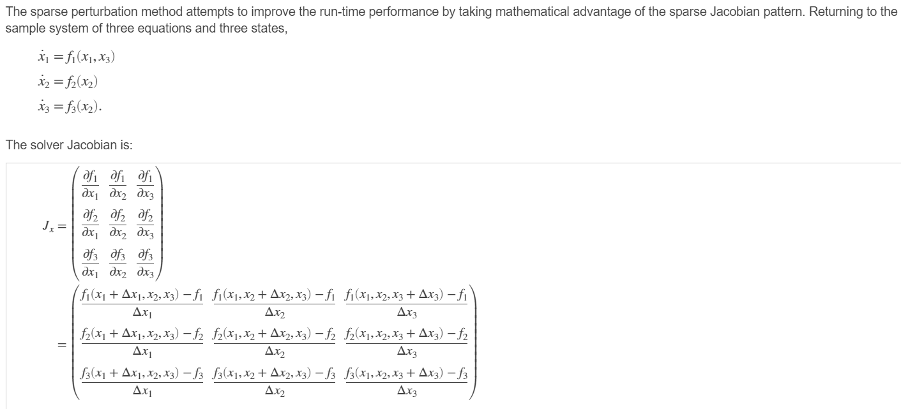

## install cuda11.8

```
install cuda 11.8

update-alternatives --remove cuda /usr/local/cuda-12.2
update-alternatives --install /usr/local/cuda cuda /usr/local/cuda-11.8 118 && 
ln -sfT /usr/local/cuda-11.8 /etc/alternatives/cuda && 
ln -sfT /etc/alternatives/cuda /usr/local/cuda  


vi ~/.bashrc 

if [ -z $LD_LIBRARY_PATH ]; then
  LD_LIBRARY_PATH=/usr/local/cuda-11.8/lib64
else
  LD_LIBRARY_PATH=$LD_LIBRARY_PATH:/usr/local/cuda-11.8/lib64
fi
export LD_LIBRARY_PATH

export PATH=/usr/local/cuda/bin:/usr/lib/wsl/lib:$PATH


source ~/.bashrc 

nvcc --version
```


## rwkv_jax

```python

# see huggingface/rwkv_numpy/rwkv.py

# pip install tokenizers
# pip install -U "jax[cpu]"

# Taken from https://johanwind.github.io/2023/03/23/rwkv_details.html. 
# I've added additional comments restructured it a tiny bit, which makes it clearer for me.


""""
probs
    shape:
        (50277,)
    # RWKV 函数输出下一个 token 的概率分布,  总 token 数为 50277
    
"""

# import numpy as np
import jax.numpy as np
from torch import load as torch_load  # Only for loading the model weights
from torch import save as torch_save
from tokenizers import Tokenizer
import base64
from collections import OrderedDict
import json
import jax
import jax.numpy as jnp
import jax.random as jrandom

exp = np.exp
layer_norm = lambda x, w, b : (x - np.mean(x)) / np.std(x) * w + b
sigmoid = lambda x : 1/(1 + exp(-x))


def RWKV(model, token, state):
    keys = model.keys()
    emb = [key for key in model.keys() if key.startswith('emb')]
    blocks_0_ln0 = [key for key in model.keys() if key.startswith('blocks.0.ln0')]
    blocks_0_att = [key for key in model.keys() if key.startswith('blocks.0.att')]
    blocks_0_ffn = [key for key in model.keys() if key.startswith('blocks.0.ffn')]
    ln_out = [key for key in model.keys() if key.startswith('ln_out')]
    head = [key for key in model.keys() if key.startswith('head')]
    
    params = lambda prefix: [model[key] for key in model.keys() if key.startswith(prefix)]
    
    emb_weight = model['emb.weight']
    
    x = emb_weight[token]
    
    # b64 = base64.b64encode(x)
    # bytes = base64.decodebytes(b64)
    # x__ = np.frombuffer(bytes, dtype=np.float32)
    
    blocks_0_ln0_weight = model['blocks.0.ln0.weight']
    blocks_0_ln0_bias = model['blocks.0.ln0.bias']
    
    x = layer_norm(x, blocks_0_ln0_weight, blocks_0_ln0_bias)

    #x = params('emb')[0][token]
    #x = layer_norm(x, *params('blocks.0.ln0'))

    for i in range(N_LAYER):
        blocks_i_ln1_weight = model[f'blocks.{i}.ln1.weight']
        blocks_i_ln1_bias = model[f'blocks.{i}.ln1.bias']
        x_ = layer_norm(x, blocks_i_ln1_weight, blocks_i_ln1_bias)
        
        blocks_i_att_time_decay = model[f'blocks.{i}.att.time_decay']
        blocks_i_att_time_first = model[f'blocks.{i}.att.time_first']
        blocks_i_att_time_mix_k = model[f'blocks.{i}.att.time_mix_k']
        blocks_i_att_time_mix_v = model[f'blocks.{i}.att.time_mix_v']
        blocks_i_att_time_mix_r = model[f'blocks.{i}.att.time_mix_r']
        blocks_i_att_key_weight = model[f'blocks.{i}.att.key.weight']
        blocks_i_att_value_weight = model[f'blocks.{i}.att.value.weight']
        blocks_i_att_receptance_weight = model[f'blocks.{i}.att.receptance.weight']
        blocks_i_att_output_weight = model[f'blocks.{i}.att.output.weight']
        
                
        last_x, last_num, last_den = state[i][:3]
        dx, x_num_den = time_mixing(x_, last_x, last_num, last_den, 
                                blocks_i_att_time_decay,
                                blocks_i_att_time_first,
                                blocks_i_att_time_mix_k,
                                blocks_i_att_time_mix_v,
                                blocks_i_att_time_mix_r,
                                blocks_i_att_key_weight,
                                blocks_i_att_value_weight,
                                blocks_i_att_receptance_weight,
                                blocks_i_att_output_weight
                            )

        # state[i][:3] = x_num_den  # just for numpy
        state = state.at[i, :3].set( x_num_den )

        x = x + dx


        blocks_i_ln2_weight = model[f'blocks.{i}.ln2.weight']
        blocks_i_ln2_bias = model[f'blocks.{i}.ln2.bias']

        blocks_i_ffn_time_mix_k = model[f'blocks.{i}.ffn.time_mix_k']
        blocks_i_ffn_time_mix_r = model[f'blocks.{i}.ffn.time_mix_r']
        blocks_i_ffn_key_weight = model[f'blocks.{i}.ffn.key.weight']
        blocks_i_ffn_receptance_weight = model[f'blocks.{i}.ffn.receptance.weight']
        blocks_i_ffn_value_weight = model[f'blocks.{i}.ffn.value.weight']


        x_ = layer_norm(x, blocks_i_ln2_weight, blocks_i_ln2_bias)
        dx, tmp_x = channel_mixing(x_, state[i][3], 
                            blocks_i_ffn_time_mix_k,
                            blocks_i_ffn_time_mix_r,
                            blocks_i_ffn_key_weight,
                            blocks_i_ffn_receptance_weight,
                            blocks_i_ffn_value_weight
                        )

        # state[i][3] = tmp_x  # just for numpy
        state = state.at[i, 3].set( tmp_x )

        x = x + dx
        

    
    ln_out_weight = model[f'ln_out.weight']
    ln_out_bias = model[f'ln_out.bias']
    head_weight = model[f'head.weight']

    x = layer_norm(x, ln_out_weight, ln_out_bias)
    x = head_weight @ x


    e_x = exp(x - np.max(x))
    probs = e_x / e_x.sum() # Softmax of x

    return probs, state


def save_model(model, pth):
    ml = OrderedDict()
    for k, v in model.items():
        ml[k] = base64.b64encode(v).decode('ascii')  # bytes to asscii
        a = 1
    ml_str = json.dumps(ml)
    # ml_ = json.loads(ml_str, object_pairs_hook=OrderedDict)
    with open(pth, 'w', encoding='utf-8') as f:
	    f.write(ml_str)
    

def time_mixing(x, last_x, last_num, last_den, decay, bonus, mix_k, mix_v, mix_r, Wk, Wv, Wr, Wout):
    # Part of the state tensor
    #   - last_x  - previous time step embedding (input / prev layer's emb) (1024,)
    #   - last_num - numerator, or "weighted sum of past values" (1024,)
    #   - last_den - denominator, "sum of weights of past values" (1024,)
    # Learnable parameters
    #   - decay (1024,)
    #   - bonus (1024,)
    #   - mix_k - mixing ratio for key (1024,)
    #   - mix_v - mixing ratio for value (1024,)
    #   - mix_r - mixing ratio for receptance (1024,)
    #   - Wk - affine transformation for key (1024, 1024)
    #   - Wv - affine transformation for value (1024, 1024)
    #   - Wr - affine transformation for receptance (1024, 1024)
    #   - Wout - affine transformation for output (1024, 1024)

    # In a typical transformer, the “time mixing” would be done by multi head attention.
    # However, in the RWKV model, the time mixing is done at each time step when
    # num(erator) and den(ominator) are updated. This is similar to how RNNs work.

    # Linear interpolation below between x and last_x uses element-wise mixing ratios
    # mix_*, which are learned weights (of same size as x, last_x).
    # W* are 1024x1024 matrices; matmul with these are most time-consuming.
    k = Wk @ (x * mix_k + last_x * (1 - mix_k))
    v = Wv @ (x * mix_v + last_x * (1 - mix_v))
    r = Wr @ (x * mix_r + last_x * (1 - mix_r))

    # num / den ~= Weighted average of past values
    # wkv ~= Also weighted average of past values, 
    #        but we are adding a "bonus" weight to the current value `v`.
    #        Previous weights get exponentially smaller weight, which is
    #        already captured in the last_num and last_den variables.
    #        However the weight doesn't decay the same for each dimension,
    #        but is determined on each time step based on the decay vector 
    #        (see num and den updates below)
    wkv = (
        (last_num + exp(bonus + k) * v) /
        (last_den + exp(bonus + k))
    )
    # Multiplying the wkv (weighted average of past values) with sigmoid(r) is similar
    # to a "gate" in RNNs that controls how much of the past values to use, since
    # sigmoid(r) is a value between 0 and 1.
    rwkv = sigmoid(r) * wkv
    # Final linear (affine) transformation to get the output embedding.
    time_mixed = Wout @ rwkv

    # Below we set the numerator and denominator for the next time step.
    #   num - numerator, or "weighted sum of past values"
    #   den - denominator, "sum of weights of past values"
    # Can be seen as interpolate between previous step num (or den) and a new value,
    # where element-wise decay vector determines the amount of decay per dimension.
    num = exp(-exp(decay)) * last_num + exp(k) * v
    den = exp(-exp(decay)) * last_den + exp(k)

    return time_mixed, (x, num, den)


def channel_mixing(x, last_x, mix_k, mix_r, Wk, Wr, Wv):
    # Wk - (4096, 1024)
    # Wr - (1024, 1024)
    # Wv - (1024, 4096)
    
    # In a typical transformer, the “channel mixing” is done by a simple FF NN.
    # By contrast, we use two separate fully connected layers on the input
    # (where input linearly interpolates between the current input and 
    # previous time step input) and then multiply them element-wise.

    # Linear interpolation (below) between x and last_x uses an element-wise mixing ratio
    # mix_k and mix_r, which are learned weights (of same size as x, last_x).
    # Wk, Wr, Wv are 1024x1024 matrices; matmul with these are most time-consuming.

    # x and last_x is linearly interpolated with mixing ratio mix_k,
    # then passed through a FC layer with squared relu activation
    k = Wk @ (x * mix_k + last_x * (1 - mix_k)) # @ is matrix multiplication
    k = np.maximum(k, 0) ** 2 # squared relu activation

    # x and last_x is linearly interpolated with mixing ratio mix_r,
    # then passed through a FC layer with sigmoid activation
    r = Wr @ (x * mix_r + last_x * (1 - mix_r))
    r = sigmoid(r)

    # K-mixed input is passed through affine transformation (without activation, 
    # so not quite a FC layer) before being multiplied to r-mixed input element-wise.
    vk = Wv @ k
    channel_mixed = r * vk

    return channel_mixed, x # pass x along unchanged, will be last_x in the next step


def sample_probs(probs, temperature=1.0, top_p=0.85):
    sorted_probs = np.sort(probs)[::-1]
    cumulative_probs = np.cumsum(sorted_probs)
    cutoff = sorted_probs[np.argmax(cumulative_probs > top_p)]
    idx = probs < cutoff
    # probs[probs < cutoff] = 0
    probs = probs.at[idx].set(0)
    probs = probs ** (1 / temperature)
    # return np.random.choice(a=len(probs), p=probs / np.sum(probs))
    key1, key2, key3, key4 = jrandom.split(jrandom.PRNGKey(1999), 4)
    return jax.random.choice(key=key4, a=len(probs), p=probs / np.sum(probs))


# Available at https://huggingface.co/BlinkDL/rwkv-4-pile-430m/resolve/main/RWKV-4-Pile-430M-20220808-8066.pth
MODEL_FILE = 'RWKV-4-Pile-430M-20220808-8066.pth'
N_LAYER = 24
N_EMBD = 1024

print(f'\nLoading {MODEL_FILE}')
weights = torch_load(MODEL_FILE, map_location='cpu')
for k in weights.keys():
    if '.time_' in k:
        weights[k] = weights[k].squeeze()
    weights[k] = weights[k].float().numpy() # convert to f32 type


# import pickle
# with open("new.pkl", "wb") as f:
#     pickle.dump(weights, f)


emb_weight = weights['emb.weight']

# weights['emb.weight'] = np.random.uniform(size=(50277, 1024))
    # 只替换嵌入向量成随机数, 后面再自已训练？

# key1, key2, key3, key4 = jrandom.split(jrandom.PRNGKey(1999), 4)
# weights['emb.weight'] = jax.random.normal(key1, shape=(50277, 1024), dtype=jnp.float32)   

# Available at https://github.com/BlinkDL/ChatRWKV/blob/main/20B_tokenizer.json
tokenizer = Tokenizer.from_file("20B_tokenizer.json")

print(f'\nPreprocessing context')
context = "\nIn a shocking finding, scientist discovered a herd of dragons living in a remote, previously unexplored valley, in Tibet. Even more surprising to the researchers was the fact that the dragons spoke perfect Chinese."

# The 4 dimensions are 
#     [last_x, last_num, last_den] (after time mixing) - used by time mixing
#     last_x (after channel mixing) - used by channel mixing
state = np.zeros((N_LAYER, 4, N_EMBD), dtype=np.float32)
for token in tokenizer.encode(context).ids:
    probs, state = RWKV(weights, token, state)

print(context, end="")
for i in range(100):
    token = sample_probs(probs)
    print(tokenizer.decode([token]), end="", flush=True)
    probs, state = RWKV(weights, token, state)

```


## cuda 多版本切换

```
/usr/local/cuda/bin/nvcc --version

ldconfig -p | grep cuda

wget https://developer.download.nvidia.com/compute/cuda/11.7.1/local_installers/cuda_11.7.1_515.65.01_linux.run
sudo sh cuda_11.7.1_515.65.01_linux.run

update-alternatives --install /usr/local/cuda cuda /usr/local/cuda-11.7 117
ln -sfT /usr/local/cuda-11.7 /etc/alternatives/cuda
ln -sfT /etc/alternatives/cuda /usr/local/cuda

```


```
pip3 install torch torchvision torchaudio  # for cpu AND CUDA 10.2
```


### spectify CUDA version

- https://vitalitylearning.medium.com/running-cuda-in-google-colab-525a92efcf75

CUDA 10.2 是Pytorch 官方默认版

```
!nvcc --version # check cuda version
Cuda compilation tools, release 11.1, V11.1.105
Build cuda_11.1.TC455_06.29190527_0
# cuda 11.1 是colab 默认版 
```


**IRT 教科书代码实现 in github** [u](https://github.com/pluralsight/irt_parameter_estimation)

- book [u](https://www.routledge.com/Item-Response-Theory-Parameter-Estimation-Techniques-Second-Edition/Baker-Kim/p/book/9780824758257)


**A MATLAB Package for Markov Chain Monte Carlo with a Multi-Unidimensional IRT Model** [u](https://www.jstatsoft.org/article/view/v028i10)

- **此网站论文+代码 全开放下载，概率统计专题**


**Udacity — deep-learning**-v2-pytorch [u](https://github.com/udacity/deep-learning-v2-pytorch)

**OpenAI — Spinning Up** [u](https://spinningup.readthedocs.io/zh_CN/latest/user/introduction.html)

DearPyGui 基础 [u](https://blog.csdn.net/hekaiyou/article/details/109386393)

DearPyGui 实现队列模型仿真[u](https://www.zhihu.com/zvideo/1307375212308856832)


**How Pytorch Backward() function works** [u](https://medium.com/@mustafaghali11/how-pytorch-backward-function-works-55669b3b7c62)

CSC321 Lecture 10: Automatic Differentiation [u](https://www.cs.toronto.edu/~rgrosse/courses/csc321_2018/slides/lec10.pdf)

官方电子书

> [Deep Learning With Pytorch by Eli Stevens, Luca Antiga, Thomas Viehmann (z-lib.org)]()

MatrixSlow 手写框架

> https://gitee.com/zackchen/MatrixSlow
>
> ```
> pip install protobuf
> pip install grpcio
> ```


**PyTorch 学习笔记汇总** [u](https://zhuanlan.zhihu.com/p/265394674)

[动手学深度学习Pytorch版](https://github.com/ShusenTang/Dive-into-DL-PyTorch)

[PyTorch for Deep Learning - Full Course / Tutorial](https://www.youtube.com/watch?v=GIsg-ZUy0MY&ab_channel=freeCodeCamp.org)

> [Linear Regression with PyTorch](https://jovian.ai/aakashns/02-linear-regression)

> conda list


李宏毅2020机器学习深度学习(完整版)国语

> [课程主页](http://speech.ee.ntu.edu.tw/~tlkagk/courses_ML20.html)
>
> > [第一课作业](https://mrsuncodes.github.io/2020/03/15/%E6%9D%8E%E5%AE%8F%E6%AF%85%E6%9C%BA%E5%99%A8%E5%AD%A6%E4%B9%A0-%E7%AC%AC%E4%B8%80%E8%AF%BE%E4%BD%9C%E4%B8%9A/#more)
>
> [B站视频](https://www.bilibili.com/video/av94519857/)
>
> [PyTorch_Introduction.slides](http://speech.ee.ntu.edu.tw/~tlkagk/courses/ML2020/PyTorch_Introduction.slides.html#/)


[Pytorch autograd,backward详解](https://zhuanlan.zhihu.com/p/83172023)

[pytorch-tutorial-for-deep-learning-lovers](https://www.kaggle.com/kanncaa1/pytorch-tutorial-for-deep-learning-lovers)


[Yann LeCun 深度学习（Pytorch）2020 春季课程【官方字幕】](https://www.bilibili.com/video/av796677275/)

> [讲义](https://atcold.github.io/pytorch-Deep-Learning/)

[全-中英字幕-吴恩达 深度学习_Deep Learning_Pytorch特别制作版](https://www.bilibili.com/video/BV1BZ4y1M7hF/)

> [代码](https://gitee.com/inkCode/pytorch_tutorial)


## DataLoader


```
import json
import torch
from torch.utils.data import Dataset, DataLoader
import linecache

class LargeJSONLDataset(Dataset):
    def __init__(self, file_path):
        self.file_path = file_path
        # 计算文件中的数据行数，该步骤需要时间，因为要遍历整个文件
        self.num_entries = sum(1 for line in open(file_path))
    
    def __getitem__(self, index):
        line = linecache.getline(self.file_path, index+1)
        data = json.loads(line)
        return data
    
    def __len__(self):
        return self.num_entries

dataset = LargeJSONLDataset('traindata_nlpp.jsonl')
data_loader = DataLoader(dataset, batch_size=4, shuffle=True)

for data in data_loader:
    pass
```


## 概率输出

```
# see nanoRWKV/train.py
import torch.nn.functional as F
import tiktoken
# encode with tiktoken gpt2 bpe
enc = tiktoken.get_encoding("gpt2")
encode = lambda s: enc.encode(s, allowed_special={"<|endoftext|>"})
decode = lambda l: enc.decode(l)

        with ctx:
            logits, loss = model(X, Y)
            loss = loss / gradient_accumulation_steps # scale the loss to account for gradient accumulation

            x0 = list( X[0].cpu().numpy() )
            x0_str = decode(x0)

            y0 = list( Y[0].cpu().numpy() )
            y0_str = decode(y0)

            probs = logits.cpu().detach().numpy()
            out_tokens = np.argmax(probs[0], axis=1)
            out_str = decode(out_tokens)
            

# see huggingface\RWKV-LM\RWKV-v4\src\utils.py
probs = F.softmax(torch.tensor(out), dim=-1)
sorted_probs, s_index = torch.sort(probs, descending=True)


```


## Kaggle 练习


> 1. Titanic（泰坦尼克之灾）
> 中文教程： 逻辑回归应用之Kaggle泰坦尼克之灾
> 英文教程：An Interactive Data Science Tutorial
>
> 2. House Prices: Advanced Regression Techniques（房价预测）
> 中文教程：Kaggle竞赛 — 2017年房价预测
> 英文教程：How to get to TOP 25% with Simple Model using sklearn
>
> 3. Digital Recognition（数字识别）
> 中文教程：大数据竞赛平台—Kaggle 入门
> 英文教程：Interactive Intro to Dimensionality Reduction


## 线性回归 [u](https://jovian.ai/aakashns/02-linear-regression)

### 要点：更新仅重时不要跟踪梯度

> ```python
> with torch.no_grad():
> ```

### 要点：梯度用完后置0再重新算

> ```python
> .grad.zero_()
> ```


> \# 前向传播, @ 是矩阵乘
>
> def model(x):
>
>   return x @ w.t() + b
>
> \# 均方误差损失函数 MSE loss 
>
> def mse(t1, t2):
>
>   diff = t1 - t2
>
>   return torch.sum(diff * diff) / diff.numel()
>
> \# Train for 100 epochs
>
> for i in range(10000):
>
>   preds = model(inputs)
>
>   print(preds)
>
>   print(targets)
>
>   loss = mse(preds, targets)
>
>   loss.backward()
>
>   **with torch.no_grad()**:
>
> ​    w -= w.grad * 1e-5
>
> ​    b -= b.grad * 1e-5
>
> ​    **w.grad.zero_()**
>
> ​    **b.grad.zero_()**


## 提前退出

```python
with torch.no_grad():
	errs = torch.sum( torch.abs(E) )

if errs < 0.05:
	print(f'stop at {k}')
    print("Weight: ")
    print(W)
    break
```


## 线性模型
> **自动生成并初始化权重和偏置**
>
> ```python
> """
> 定义线性模型，自动生成并初始化所需权重和偏置
> y = x A^T + b --> x @ A.t() + b
> nn.Linear
>    第一参：一条输入样本的维数(行向量)
>    第二参：一条输出样本的维数(行向量)
> """
> model = nn.Linear(3, 2)  # 输入3 维(行向量)，输出2 维(行向量)
> print(model.weight)
> print(model.bias)
> list(model.parameters()) # 返回模型中的所有权重和偏置
> ```

```python
    seq_model = nn.Sequential( # 双隐层模型
        nn.Linear(2, 2),       # 一输入，一隐层
        nn.Sigmoid(),
        nn.Linear(2, 1),       # 一隐层，一输出
    )
	
    # seq_model = nn.Sequential(OrderedDict([
    #     ('hidden_linear', nn.Linear(1, 8)),
    #     ('hidden_activation', nn.Tanh()),
    #     ('output_linear', nn.Linear(8, 1))
    # ]))
```


计算构建了计算图，输出结果带有grad_fn，否则没有

t1.sum().detach() # 和原来的计算图分离

loss_fn = F.cross_entropy


## numpy


### 赋值

```python
import numpy as np
a = np.array([1, 2, 3, 4, 5])
a[:3] = (6, 7, 8)

import jax.numpy as jnp
a = jnp.array([1, 2, 3, 4, 5])
a = a.at[:3].set( (6, 7, 8) )

b = jnp.array([ [1, 2, 3], [4, 5, 6] ])
b = b.at[1].set([ 7, 8, 9 ])

import jax
import jax.random as jrandom
key1, key2, key3, key4 = jrandom.split(jrandom.PRNGKey(1999), 4)
c = jax.random.normal(key1, shape=(2, 2, 2), dtype=jnp.float32)
c = c.at[0, :2].set(jnp.array([ [9, 9], [9, 9]]))

https://jax.readthedocs.io/en/latest/_autosummary/jax.lax.slice.html#jax.lax.slice

https://stackoverflow.com/questions/75043981/updating-entire-row-or-column-of-a-2d-array-in-jax

```


numpy.array2string


## 张量

[一个本子工程系列张量的重点概念运算 必看](https://zhuanlan.zhihu.com/p/591344339)


### shape

```
import torch
t0 = torch.tensor(0)   # shape:torch.Size([])
t1 = t0.reshape(1,)    # shape:torch.Size([1])
t2 = t0.reshape(1,-1)  # shape:torch.Size([1, 1]) #一行,列数自动安排
t3 = t2.to('cpu')
print(t0)
```


```
import numpy as np
a = np.array([ 
    [ 
        [1, 2],  # 相当于删掉这一行
        [3, 4]
    ], 
    [
        [5, 6],  # 相当于删掉这一行
        [7, 8]
    ] 
])
b = a[:, -1, :] 
    # 第一维全部都要
    # 第二维要最后一个元素
    # 第三维全部都要 
print(a)
    # 注意原本应该是 (2, 1, 2) 的，第二维直接被合并了，结果变成 (2, 2)
```


### 转浮点数


```python
answers = torch.tensor(answers).float() # convert to tensor
```


### to

```

i.item()
	# 真 int
	# 下面转完还是 tensor

tensor.to(torch.float64)

>>> cuda0 = torch.device('cuda:0')
>>> tensor.to(cuda0)
tensor([[-0.5044,  0.0005],
        [ 0.3310, -0.0584]], device='cuda:0')

>>> tensor.to(cuda0, dtype=torch.float64)
```


### view

https://github.com/ashvardanian/SimSIMD

```
see huggingface/NLPP_vector_server/readme.txt

vec1 = np.random.randint(2, size=80).astype(np.uint8).packbits().view(np.bool_)
vec2 = np.random.randint(2, size=80).astype(np.uint8).packbits().view(np.bool_)
hamming_distance = simsimd.hamming(vec1, vec2)
jaccard_distance = simsimd.jaccard(vec1, vec2)

```


### numpy 互转

```python
.from_numpy(x)
.numpy()

generated_tokens.cpu().numpy()
	# gpu tensor to cpu

    
see huggingface/rwkv5-jp-trimvd/vad.py

# tensor 转 bytes
for chunk in chunks:
    np_array = chunk.numpy()
    byte_array = np_array.tobytes()
    it = asr_rec(byte_array)
    for s in it:
      print(s)

# huggingface/colab_Whisper_w_PEFT/kotoba_asr.py
def convert_audio(pth_media):
    import subprocess
    from io import BytesIO
    audio_bytes = BytesIO()
    
    command = [
        'ffmpeg',
        '-i', pth_media,
        '-metadata', 'encoder=Lavf58.45.100',
        '-t', '60',
        '-acodec', 'pcm_s16le',
        '-ar', '16000',
        '-ac', '1',
        '-b:a', '256k',
        '-f', 'wav',         
        'pipe:1'
    ]

    process = subprocess.Popen(
        command,
        stdout=subprocess.PIPE,
        stderr=subprocess.PIPE
    )

    stdout, stderr = process.communicate()

    audio_bytes.write(stdout)
        # audio_bytes 是内存流，用起来就像普通的文件指针

    audio_bytes.seek(0)

    if stderr:
        print(f"Error: {stderr.decode()}")

    return audio_bytes.read()    
    
```


```python
torch.rand()
torch.randn()
torch.normal()
torch.linespace()
```

```python
x = torch.full((2,3), 4, requires_grad=True)  # (2*3) 初值4
inputs = torch.from_numpy(inputs)
```

```python
X = np.array([
	[0,0],
	[0,1],
	[1,0],
	[1,1]
], dtype=float)

Y = np.array([
	[0],
	[1],
	[1],
	[0]
], dtype=float)
X = torch.from_numpy(X)
Y = torch.from_numpy(Y)
```


### flip 逆序重排

```
# see echodict\transformer\transformer_jax.py
		"""
        np.flip(inp_data, axis=0) # 沿第一个维度(行)逆序重排
        [ [1, 2, 3],
          [4, 5, 6],
          [7, 8, 9]]
        ->
        [ [7, 8, 9],
          [4, 5, 6],
          [1, 2, 3]]
        """
        labels = np.flip(inp_data, axis=0)
```


### 按行求和

```python
print(torch.sum(x))   #按列求和
print(torch.sum(x, 0))#按列求和
print(torch.sum(x, 1))#按行求和
```

```python
a = torch.tensor(np.array([[1,2],[3,4]]))
b = torch.sum(a, 1)
-> [3, 7] 
```


### 矩阵乘@和转置t

> ```python
> def model(x):
>     return x @ w.t() + b
> ```
>
> `@` represents matrix multiplication in PyTorch, and the `.t` method returns the transpose of a tensor.


### torch.stack()

> 低维张量堆叠起来（维度增加），生成高维空间中的高维张量
>
> > 就像把桌面上的书堆起来一样

```
# https://blog.csdn.net/xinjieyuan/article/details/105205326

		if self.processes is not None:
            for data_process in self.processes:
                data = data_process(data)
        im = data['image']
        shape = im.shape  # (3, 640, 640)
        im = torch.stack( (im[0], im[1], im[2]), 2 )  # (640, 640, 3)
        return data
```


### 柱状图


```python
"""
概率编程语言入门指南

有偏差的掷硬币(a biased coin toss)

随机函数被叫做模型，表达模型的方法，和正常的Python方法没有区别
模型（model）和变分分布（guide）的参数。【注：所谓变分就是将原始函数换作另一（易处理的）函数的数学技巧】
最大化证据（evidence）  证据下限”ELBO（evidence lower bound）


https://colab.research.google.com/drive/1SZDm5ppWBFIpowO8KIATfoYZXEVbuVGr#scrollTo=tdhST1QE8MuX

Fitting a Distribution with Pyro: Part 2 - Beta
https://www.richard-stanton.com/2020/05/03/fit-dist-with-pyro_2.html


A Gentle Introduction to Probabilistic Programming Languages
https://medium.com/swlh/a-gentle-introduction-to-probabilistic-programming-languages-bf1e19042ab6
"""

import numpy as np
import torch
from torch.distributions import constraints
import pyro
import pyro.infer
import pyro.optim
import pyro.distributions as dist

import matplotlib.pyplot as plt


n_persons = 5
n_questions = 5
pyro.enable_validation(True)
np.random.seed(543678)
true_theta = np.random.normal(loc=0, scale=1, size=(n_persons,1))   # 2个人的能力 (2*1)
true_theta = np.tile(true_theta, n_questions)                       # 2个人每道题的能力都一样，列复制2次 (2*1) -> (2*2)
true_beta = np.random.normal(loc=0, scale=1, size=(1,n_questions))  # 2个问题的难度 (1*2)

"""
维度不同的减法：
(2*2) - (1*2) = ( (1*2) - (1*2),
                  (1*2) - (1*2)
                )
= (2*2) 
"""
likelihood = np.exp(true_theta - true_beta) / (1 + np.exp(true_theta - true_beta))
answers = np.random.binomial(size=(n_persons, n_questions), p=likelihood, n=1) # calculate answers based on theta and likelihood function
answers = torch.tensor(answers).float() # convert to tensor
"""
size 和 p 的维度相同
二项分布，值为1 的概率由p 给出
"""

sums = torch.sum(answers, 1)  # 按行求和  # 每个人答对多少题
plt.hist(sums) 
plt.show()
```

纵坐标表示**有几个人**，横坐标表示**答对多少题**


## Variable

- https://blog.csdn.net/weixin_42782150/article/details/106854349

- [pytorch中的Autograd 自动微分](https://blog.csdn.net/weixin_38664232/article/details/104430535)

  

Variable 是可以自动微分的 Tensor，Varibale 默认不求梯度

```
import torch
from torch.autograd import Variable

x_tensor = torch.randn(2,3)  # 创建2*3的张量矩阵
x = Variable(x_tensor) 
print(x.requires_grad) 
>>>
False

x = Variable(x_tensor,requires_grad=True)  # x 要求自动求梯度
```


## 损失函数

> ```
> # MSE loss
> def mse(t1, t2):
>     diff = t1 - t2
>     return torch.sum(diff * diff) / diff.numel()
> ```
>
> `torch.sum` returns the sum of all the elements in a tensor, and the `.numel` method returns the number of elements in a tensor. Let's compute the mean squared error for the current predictions of our model.


### 均方误差

```python
for name in pyro.get_param_store().get_all_param_names():
    print(name)
    val = pyro.param(name).data.numpy()
    print(val)
    if name == 'loc_diff':
        print('mse: {}'.format(np.mean((val - real_diff) ** 2)))
    elif name == 'loc_ability':
        print('mse: {}'.format(np.mean((val - real_theta) ** 2)))
```


## 导数


### 计算雅可比 [u](https://pytorch.org/docs/stable/autograd.html)

```python
x = torch.ones(3, requires_grad=True)
def calc(x):
	return torch.stack((x[0]**2+x[1], x[1]**2+x[2], x[2]**2))
jacobian = torch.autograd.functional.jacobian(calc, x)
```

```python
def calc(w, x):
	return w @ x
j = torch.autograd.functional.jacobian( lambda w: calc(w, X), W ) 
# 现在X是常量了，只算W的雅可比
```


计算某个Tensor的导数，需要设置其`.requires_grad`属性为`True`

> 不需要算导数的就不设了吧？


### **vector-Jacobian product** 

- $J \cdot v$ 中的v 是人为的给各**微量变化比加权重**，调大调小变化影响力

  > $J^T \cdot v$ 是列向量 [CSC321 Lecture 10：Automatic Differentiation]()
  >
  > $v^T \cdot J$ 是行向量

 [u](https://stackoverflow.com/questions/64260561/pytorch-compute-vector-jacobian-product-for-vector-function)

> ```python
> def j3():
>     x = torch.ones(3, requires_grad=True)
> 
>     y = torch.stack((x[0]**2+x[1], x[1]**2+x[2], x[2]**2))
> 
>     v = torch.tensor([3, 5, 7])
> 
>     y.backward(v)
>     print(x.grad)
>     """
>     The Jacobian seems correct and if it multiplies on vector (3, 5, 7) I would expect result to be (11, 17, 14).
>     Got it! We should transpose Jacobian before multiplication. Then everything matches.
>     """
> 
>     print( torch.matmul(  torch.tensor([ [2, 0, 0], [1, 2 , 0], [0, 1, 2] ]),  torch.tensor([ [3], [5], [7] ]) ) )       # J.t() @ v  结果是列向量
>     print( torch.matmul(  torch.tensor([ [3], [5], [7] ]).t(), torch.tensor([ [2, 1, 0], [0, 2 , 1], [0, 0, 2] ])  ) )   # v.t() @ J  结果是行向量
> ```


### Generalized Jacobian

- 广义雅可比

> There are two ways to compute the Generalized Jacobian that I'm aware of in PyTorch.
>
> ## Option 1
>
> Repeated application of back-propagation on each element of Y.
>
> ```python
> import torch
> 
> def construct_jacobian(y, x, retain_graph=False):
>     x_grads = []
>     for idx, y_element in enumerate(y.flatten()):
>         if x.grad is not None:
>             x.grad.zero_()
>         # if specified set retain_graph=False on last iteration to clean up
>         y_element.backward(retain_graph=retain_graph or idx < y.numel() - 1)
>         x_grads.append(x.grad.clone())
>     return torch.stack(x_grads).reshape(*y.shape, *x.shape)
> ```
>
> then the Jacobian for your test case may be computed using
>
> ```python
> a = torch.tensor([1., 2., 3.])
> b = torch.tensor([4., 5., 6.], requires_grad=True)
> c = a * b
> 
> jacobian = construct_jacobian(c, b)
> 
> print(jacobian)
> ```
>
> which results in
>
> ```py
> tensor([[1., 0., 0.],
>         [0., 2., 0.],
>         [0., 0., 3.]])
> ```
>
> ## Option 2
>
> In PyTorch 1.5.1 a new autograd.functional API was introduced, including the new function [`torch.autograd.functional.jacobian`](https://pytorch.org/docs/stable/autograd.html#torch.autograd.functional.jacobian). This produces the same results as the previous example but takes a function as an argument. Not demonstrated here, but you can provide the `jacobian` function a list of inputs if your function takes multiple independent tensors as input. In that case the `jacobian` would return a tuple containing the Generalized Jacobian for each of the input arguments.
>
> ```python
> import torch
> 
> a = torch.tensor([1., 2., 3.])
> 
> def my_fun(b):
>     return a * b
> 
> b = torch.tensor([4., 5., 6.], requires_grad=True)
> 
> jacobian = torch.autograd.functional.jacobian(my_fun, b)
> 
> print(jacobian)
> ```
>
> which also produces
>
> ```py
> tensor([[1., 0., 0.],
>         [0., 2., 0.],
>         [0., 0., 3.]])
> ```
>
> ------
>
> As an aside, in some literature the term "gradient" is used to refer to the transpose of the Jacobian matrix. If that's what you're after then, assuming Y and X are vectors, you can simply use the code above and take the transpose of the resulting Jacobian matrix. If Y or X are higher order tensors (matrices or n-dimensional tensors) then I'm not aware of any literature that distinguishes between gradient and Generalized Jacobian. A natural way to represent such a "transpose" of the Generalized Jacobian would be to use `Tensor.permute` to turn it into a tensor of shape (n1, n2, ..., nD, m1, m2, ..., mE).
>
> ------
>
> As another aside, the concept of the Generalized Jacobian is rarely used in literature ([example usage](http://cs231n.stanford.edu/handouts/derivatives.pdf)) but is actually relatively useful in practice. This is because it basically works as a bookkeeping technique to keep track of the original dimensionality of Y and X. By this I mean you could just as easily take Y and X and flatten them into vectors, regardless of their original shape. Then the derivative would be a standard Jacobian matrix. Consequently this Jacobian matrix would be equivalent to a reshaped version of the Generalized Jacobian.


**pytorch: compute vector-Jacobian product for vector function** [u](https://stackoverflow.com/questions/64260561/pytorch-compute-vector-jacobian-product-for-vector-function)

You should not define tensor y by `torch.tensor()`, `torch.tensor()` is a tensor constructor, not an operator, so it is not trackable in the operation graph. You should use `torch.stack()` instead.

Just change that line to:

```py
y = torch.stack((x[0]**2+x[1], x[1]**2+x[2], x[2]**2))
```

the result of `x.grad` should be `tensor([ 6., 13., 19.])`

> Thank you very much! Could you please elaborate on why the result is (6, 13, 19)? The Jacobian seems correct and if it multiplies on vector (3, 5, 7) I would expect result to be (11, 17, 14)... Probably I misunderstand how backward + grad are executed. 
>
> Got it! We should transpose Jacobian before multiplication. Then everything matches. 


**CSC321 Lecture 10：Automatic Differentiation** [u]()


**Pytorch most efficient Jacobian calculation** [u](https://stackoverflow.com/questions/56480578/pytorch-most-efficient-jacobian-hessian-calculation)


Choose a Jacobian Method for an Implicit Solver [u](https://www.mathworks.com/help/simulink/ug/choose-a-jacobian-method-for-an-implicit-solver.html)

> 稀疏方程组的“稀疏” 雅可比




### 清空梯度

- 梯度计算时会一直自动累加所以需要清掉

> 清空张量的梯度
> ```python
> if W.grad is not None:
> 	W.grad.data.zero_()
> ```
>
> 清空优化器的梯度
>
> ```python
> opt.zero_grad()
> ```


### leaf nodes (叶子节点)

> **自定义产生**的tensor 是叶子节点
>
> grad_fn 通常为None
>
> grad: 该Tensor的梯度值，每次在计算backward时都需要将前一时刻的梯度归零，否则梯度值会一直累加


**结果节点**

> **计算产生**的tensor 是结果节点
>
> **grad_fn** 指出梯度函数是哪种类型 PowBackward，AddBackward 等


**计算叶子节点的梯度值**

> 结果节点是标量，直接调用.backward()
>
> 非结果节点需要定义`grad_tensor`来计算矩阵的梯度
>
> > 


### 自动求导 [u](https://www.jianshu.com/p/aa7e9f65fa3e)

> [Pytorch中的vector-Jacobian product](https://juejin.im/post/6844904009841524750)
>
> [PyTorch for Deep Learning - Full Course / Tutorial](https://www.youtube.com/watch?v=GIsg-ZUy0MY&ab_channel=freeCodeCamp.org)
>
> [PyTorch 101, Part 1: Understanding Graphs, Automatic Differentiation and Autograd](https://blog.paperspace.com/pytorch-101-understanding-graphs-and-automatic-differentiation/)
>
> [pytorch自动求导Autograd系列教程](https://blog.csdn.net/qq_27825451/article/details/89393332)


> `torch.autograd.backward(tensors, grad_tensors=None, retain_graph=None, create_graph=False, grad_variables=None)`参数介绍如下：
>
> - **tensors**(tensor序列) — 需要被求导的张量
> - **grad_tensors**(tensor序列或None) — Jacobian矢量积中的矢量，也可理解为链式法则的中间变量的梯度
> - **create_graph**(bool) — 默认为false，否则会对反向传播过程再次构建计算图，可通过backward of backward实现求高阶函数
>    `backward()`函数中的grad_tesnors参数size需要与根节点的size相同。当根节点为标量时，则无需说明该参数，例如对`out`进行反向求导


####  grad_tensor 梯度张量

> ```python
> A.backward( torch.ones_like(A) )
> ```
>
> 作为参数传递给`backward()` 函数
>
> Y计算标量损失l。假设向量v恰好是标量损失l关于向量Y的梯度
>
> PyTorch从不显式地构造整个雅可比矩阵。直接计算JVP (Jacobian vector product)通常更简单、更有效


> ```php
> # 假如针对一个模型有两个Loss，先执行第一个的backward，再执行第二个backward
> loss1.backward(retain_graph=True)
> loss2.backward()  # 执行完这个后，所有中间变量都会被释放，以便下一次的循环
> optimizer.step()  # 更新参数
> ```
> ```objectivec
> self.target = target.detach() * weight # 这里只是单纯地将其当作常量来对待，因此使用了detach，则在backward中计算梯度时不对target之前所在的计算图存在任何影响
> ```


Torch张量和numpy数组将共享潜在的内存，改变其中一个也将改变另一个

> a = torch.ones(5)
>
> b = a.**numpy()**
>
> a.add_(1)
>
> --> tensor([2., 2., 2., 2., 2.]) 
>
> [ 2.  2.  2.  2.  2.]

> a = np.ones(5)
>
> b = **torch.from_numpy**(a)
>
> np.add(a, 1, out=a)


更改Tensor的**requires_grad 自动求导标志**

>  **requires_grad  默认是False, 它有传递性**
>
> a.requires_grad_(True)
>
> print(a.requires_grad)


使用**torch.no_grad()包装代码块**

> ```python
> with torch.no_grad():
> 	errs = torch.sum( torch.abs(E) )
> ```
>
> 显示的指明不需要梯度，既使变量拥有requires_grad = True 属性


矩阵乘

> import torch
>
> import numpy as np
>
> X = torch.tensor(
>
>   np.array([
>
> ​        [1, 0, 0],
>
> ​        [1, 0, 1],
>
> ​        [1, 1, 0],
>
> ​        [1, 1, 1]
>
> ​       ], np.float)
>
> )
>
> X.requires_grad = True # **requires_grad  默认是False, 它有传递性**
>
> 
>
> W = torch.tensor(
>
>   np.random.uniform(size=(3, 1))
>
> ) # 3*1 权重
>
> A = torch.matmul( X, W )


## Dataload

> 比如你有1000组数据（假设每组数据为三通道256px×256px的图像），batchsize为4，那么每次训练则提取(4,3,256,256)维度的张量来训练，刚好250个epoch解决(250×4=1000)。但是如果你有999组数据，你继续使用batchsize为4的话，这样999和4并不能整除，你在训练前249组时的张量维度都为(4,3,256,256)但是最后一个批次的维度为(3,3,256,256)，Pytorch检查到(4,3,256,256) != (3,3,256,256)，维度不匹配，自然就会报错了，这可以称为一个小bug


```python
# see echodict\transformer\transformer_jax.py
import torch.utils.data as data
class ReverseDataset(data.Dataset):
    """
    最简单的数据集: 输入是一行整数, 输出是输入的逆序
    """
    def __init__(self, num_categories, seq_len, size, np_rng):
        super().__init__()
        self.num_categories = num_categories
        self.seq_len = seq_len
        self.size = size
        self.np_rng = np_rng

        self.data = self.np_rng.integers(self.num_categories, size=(self.size, self.seq_len))

    def __len__(self):
        return self.size

    def __getitem__(self, idx):
        inp_data = self.data[idx]
        """
        np.flip(inp_data, axis=0) # 沿第一个维度(行)逆序重排
        [ [1, 2, 3],
          [4, 5, 6],
          [7, 8, 9]]
        ->
        [ [7, 8, 9],
          [4, 5, 6],
          [1, 2, 3]]
        """
        labels = np.flip(inp_data, axis=0)
        return inp_data, labels

def numpy_collate(batch):
    if isinstance(batch[0], np.ndarray):
        return np.stack(batch)
    elif isinstance(batch[0], (tuple,list)):
        transposed = zip(*batch)
        return [numpy_collate(samples) for samples in transposed]
    else:
        return np.array(batch)
    
    
from functools import partial
dataset = partial(ReverseDataset, 10, 16) # 相比原函数前两参数已固定，只需传后面的参数就可以了
rev_train_loader = data.DataLoader(dataset(50000, np_rng=np.random.default_rng(42)),
                                   batch_size=128,
                                   shuffle=True,
                                   drop_last=True,
                                   collate_fn=numpy_collate)
										# 将batch_size个样本合成一个向量 np.stack(batch)
rev_val_loader   = data.DataLoader(dataset(1000, np_rng=np.random.default_rng(43)),
                                   batch_size=128,
                                   collate_fn=numpy_collate)
rev_test_loader  = data.DataLoader(dataset(10000, np_rng=np.random.default_rng(44)),
                                   batch_size=128,
                                   collate_fn=numpy_collate)

```


## CPU OR GPU [u](https://github.com/mhw32/variational-item-response-theory-public/blob/master/src/pyro_core/hmc.py)


```python
device = torch.device("cuda" if args.cuda else "cpu")
```


# 图像编码

https://zhuanlan.zhihu.com/p/448407149 CV预训练MAE（Masked AutoEncoder）

```
信息密度不同：文本数据是经过人类高度抽象之后的一种信号，它的信息是密集的，所以仅仅预测文本中的几个被掩码掉的单词就能很好的捕捉文本的语义特征。而图像数据是一个信息密度非常小的矩阵，其中包含着大量的冗余信息，而且像素和它周围的像素仅仅在纹理上就有非常大的相似性，恢复被掩码的像素并不需要太多的语义信息。

解码器的作用不同：在BERT的掩码语言模型任务中，预测被掩码掉的单词是需要解码器了解文本的语义信息的。但是在计算机视觉的掩码预测任务中，预测被掩码的像素往往对图像的语义信息依赖的并不严重。

基于这三个动机，作者设计了基于掩码自编码器（Masked AutoEncoder，MAE）的图像预训练任务。MAE的先对图像的Patch进行掩码，然后通过模型还原这些掩码，从事实现模型的预训练。MAE的核心是通过75%的高掩码率来对图像添加噪音，这样图像便很难通过周围的像素来对被掩码的像素进行重建，迫使编码器去学习图像中的语义信息。

```


## Coursera.org

## IBM 

[Deep Neural Networks with PyTorch](https://www.coursera.org/learn/deep-neural-networks-with-pytorch/home/welcome)

[第 2 周](https://www.coursera.org/learn/deep-neural-networks-with-pytorch/home/week/2)


```python

# https://jovian.ai/aakashns/02-linear-regression

import numpy as np
import torch
import torch.nn as nn
import torch.nn.functional as F
from torch.utils.data import TensorDataset
from torch.utils.data import DataLoader

class hardway():
    # 前向传播, @ 是矩阵乘
    def model(self, x, w, b):
        return x @ w.t() + b

    # 均方误差损失函数 MSE loss 
    def mse(self, t1, t2):
        diff = t1 - t2
        return torch.sum(diff * diff) / diff.numel()

    def dosomething(self):
        
        model = self.model
        mse = self.mse

        # Input (temp, rainfall, humidity)
        inputs = np.array([
                   [73, 67, 43], 
                   [91, 88, 64], 
                   [87, 134, 58], 
                   [102, 43, 37], 
                   [69, 96, 70]], dtype='float32')
        #(5 * 3)

        # Targets (apples, oranges)
        targets = np.array([[56, 70], 
                    [81, 101], 
                    [119, 133], 
                    [22, 37], 
                    [103, 119]], dtype='float32')
        #(5 * 2)

        # Convert inputs and targets to tensors
        inputs = torch.from_numpy(inputs)
        targets = torch.from_numpy(targets)

        # Weights and biases
        w = torch.randn(2, 3, requires_grad=True)
        b = torch.randn(2, requires_grad=True)
        print(w)
        print(b)

        # Train for 100 epochs
        for i in range(10000):
            preds = model(inputs, w, b)
            print(preds)
            print(targets)
            loss = mse(preds, targets)
            loss.backward()
            with torch.no_grad():
                w -= w.grad * 1e-5
                b -= b.grad * 1e-5
                w.grad.zero_()
                b.grad.zero_()

class easyway():
    def dosomething(self):

        # Define loss function
        loss_fn = F.mse_loss

        # Input (temp, rainfall, humidity)
        inputs = np.array([[73, 67, 43], [91, 88, 64], [87, 134, 58], 
                   [102, 43, 37], [69, 96, 70], [73, 67, 43], 
                   [91, 88, 64], [87, 134, 58], [102, 43, 37], 
                   [69, 96, 70], [73, 67, 43], [91, 88, 64], 
                   [87, 134, 58], [102, 43, 37], [69, 96, 70]], 
                  dtype='float32')

        # Targets (apples, oranges)
        targets = np.array([[56, 70], [81, 101], [119, 133], 
                    [22, 37], [103, 119], [56, 70], 
                    [81, 101], [119, 133], [22, 37], 
                    [103, 119], [56, 70], [81, 101], 
                    [119, 133], [22, 37], [103, 119]], 
                   dtype='float32')

        inputs = torch.from_numpy(inputs)
        targets = torch.from_numpy(targets)

        # Define dataset
        train_ds = TensorDataset(inputs, targets)  # 生成训练样本  (  tensor(输入), tensor(输出)  )
        print( train_ds[0:3] )  # 查看前三条样本

        # Define data loader
        batch_size = 5
        train_dl = DataLoader(train_ds, batch_size, shuffle=True)  # 样本分组(batches)，5 条样本一组 # shuffle 重新洗牌，既乱序

        for xb, yb in train_dl:
            print(xb)
            print(yb)
            break
        
        # Define model
        """
        y = x A^T + b
        nn.Linear
            第一参：x 一条样本的维数(行向量)
            第二参：y 一条样本的维数(行向量)  
        """
        model = nn.Linear(3, 2)  # 自动生成并初始化权重和偏置  # 输入3 维(行向量)，输出2 维(行向量)
        print(model.weight)
        print(model.bias)

        # Parameters
        list(model.parameters())  # 返回模型中的所有权重和偏置

        opt = torch.optim.SGD(model.parameters(), lr=1e-5)

        num_epochs = 5000

        # Repeat for given number of epochs
        for epoch in range(num_epochs):
        
            # Train with batches of data
            for xb,yb in train_dl:
            
                # 1. Generate predictions
                pred = model(xb)
            
                # 2. Calculate loss
                loss = loss_fn(pred, yb)
            
                # 3. Compute gradients
                loss.backward()
            
                # 4. Update parameters using gradients
                opt.step()
            
                # 5. Reset the gradients to zero
                opt.zero_grad()
        
            # Print the progress
            if (epoch+1) % 10 == 0:
                print('Epoch [{}/{}], Loss: {:.4f}'.format(epoch+1, num_epochs, loss.item()))


if __name__ == "__main__":

    hard = hardway()
    #hard.dosomething()

    easy = easyway()
    easy.dosomething()

    print('hi,,,')
```


```python
import numpy as np
import torch
import torch.nn as nn
import torch.nn.functional as F
from torch.utils.data import TensorDataset
from torch.utils.data import DataLoader

def OR():
    X = torch.tensor([
            [0,0],
            [0,1],
            [1,0],
            [1,1]
        ], dtype=torch.float32)

    Y = torch.tensor([
            [0],
            [1],
            [1],
            [1]
        ], dtype=torch.float32)

    """
    定义线性模型，自动生成并初始化所需权重和偏置
    y = x w^T + b --> x @ w.t() + b
    nn.Linear
        第一参：一条输入样本的维数(行向量)
        第二参：一条输出样本的维数(行向量)
    """
    model = nn.Linear(2, 1)  # X 第一行维度是2， Y 第一行的维度是1
    print(model.weight)
    print(model.bias)
    list(model.parameters()) # 返回模型中的所有权重和偏置

    # Define dataset
    train_ds = TensorDataset(X, Y)  # 生成训练样本  (  tensor(输入), tensor(输出)  )
    print( train_ds[0:2] )          # 查看前两条样本

    # Define data loader
    batch_size = 2
    train_dl = DataLoader(train_ds, batch_size, shuffle=True)  # 样本分组(batches)，2 条样本一组 # shuffle 重新洗牌，既乱序

    opt = torch.optim.SGD(model.parameters(), lr=1e-5)  # 定义优化方法：随机梯度下降

    # Define loss function
    loss_fn = F.mse_loss  # 定义损失函数：均方误差损失函数

    num_epochs = 10000

    # Repeat for given number of epochs
    for epoch in range(num_epochs):
        
        # Train with batches of data
        for xb,yb in train_dl:
            
            # 1. Generate predictions
            pred = model(xb)
            
            # 2. Calculate loss
            loss = loss_fn(pred, yb)
            
            # 3. Compute gradients
            loss.backward()
            
            # 4. Update parameters using gradients
            opt.step()
            
            # 5. Reset the gradients to zero
            opt.zero_grad()
        
        # Print the progress
        if (epoch+1) % 10 == 0:
            print('Epoch [{}/{}], Loss: {:.4f}'.format(epoch+1, num_epochs, loss.item()))

if __name__ == "__main__":
    OR()
```


## 用pytorch实现吴恩达老师深度学习课程课后编程作业 [u](https://blog.csdn.net/weixin_44581161/article/details/106697267)

```python
import torch.nn as nn
import torch
import numpy as np
#我们随机创建一组训练数据，100个具有500维特征的数据
M=100
features=500
train_x = torch.randn(M, features)
train_y = torch.randint(0, 2, [M,1]).float()         #数据集统一是float类型

#建立网络
in_put=features
Hidden1=10
Hidden2=5
out_put=1         #这里是一个输入层，两个隐藏层和一个输出层。

model = torch.nn.Sequential(
     torch.nn.Linear(in_put, Hidden1, bias=True),
     torch.nn.Sigmoid(),
     torch.nn.Linear(Hidden1, Hidden2, bias=True),
     torch.nn.ReLU(),
     torch.nn.Linear(Hidden2, out_put, bias=True),
     torch.nn.Sigmoid(),
)


#模型建好以后要定义损失函数和模型优化方法，torch包含多种方法，可自行百度
iter_n=1000       #迭代次数
learn_rate=1e-2
loss_fn = nn.MSELoss()
optimizer = torch.optim.Adam(model.parameters(), lr=learn_rate)

#开始优化
for i in range(iter_n):
    y_pred=model(train_x)            #一次训练后得到的结果
    loss=loss_fn(y_pred,train_y)
    print(i,loss.item())
    optimizer.zero_grad()            #下面这三行可理解为固定搭配，就是更新w，b的值的
    loss.backward()
    optimizer.step()
```

```python
参数初始化
#model[0].weight是第0层的w参数，其他层可同样的方法初始化参数，初始化在建好model后使用，怎样建model参考上一篇。
# 0-1之间均匀分布
torch.nn.init.uniform_(model[0].weight, a=0, b=1)
# 初始化为常数0.5
torch.nn.init.constant_(model[0].weight, 0.5)
# 正态分布
torch.nn.init.normal_(model[0].weight)


正则化
正则化是用来减小过拟合的方法，这里给出L2正则化方法和dropout方法
L2正则化

optimizer = torch.optim.Adam(model.parameters(), lr=learn_rate,weight_decay=0.01)
#这里的weight_decay=0.01相当于λ参数。
1
2
dropout方法

model=torch.nn.Sequential(
    torch.nn.Linear(in_put,Hidden1,bias=True),
    torch.nn.ReLU(),
    torch.nn.Dropout(0.2),
    torch.nn.Linear(Hidden1,Hidden2,bias=True),
    torch.nn.ReLU(),
    torch.nn.Dropout(0.2),
    torch.nn.Linear(Hidden2,out_put,bias=True),
    torch.nn.Sigmoid(),
)
#在每层后边加上torch.nn.Dropout(0.2)，0.2是随机架空该层20%神经元。
```


