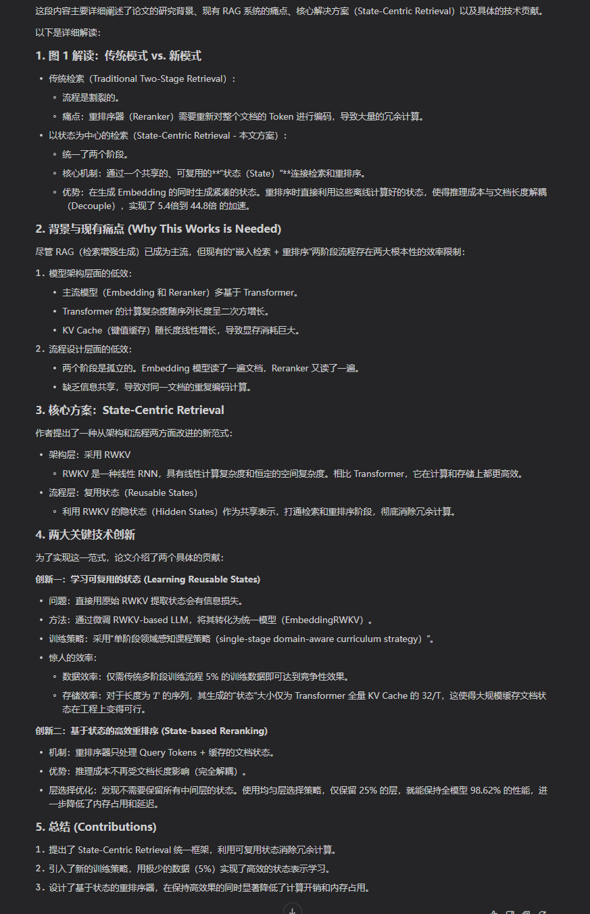
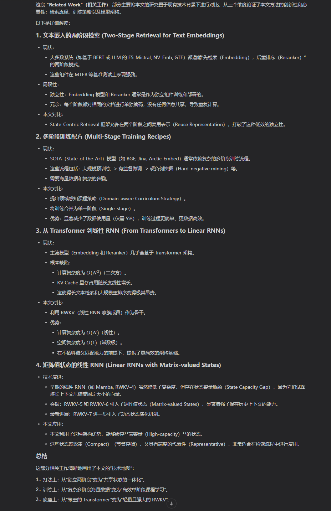
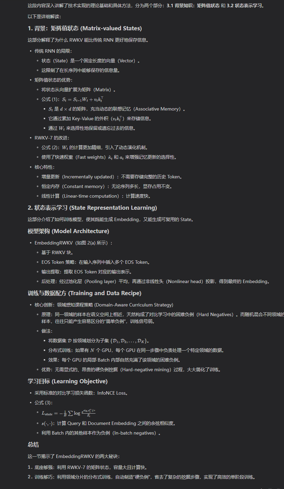
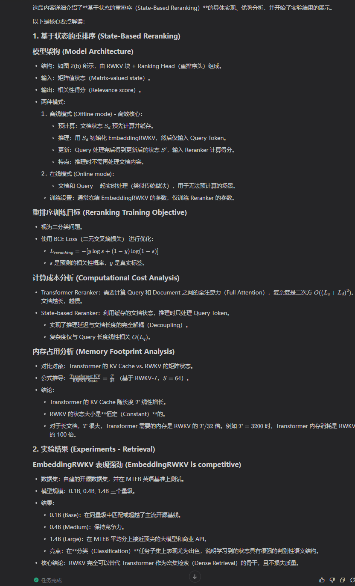

# ROSA

https://github.com/bcml-labs/rosa-plus  python 100% 可以直接跑

https://huggingface.co/spaces/Jellyfish042/ROSA-Visualizer 看看是作什么用的

https://github.com/zyaaa-ux/ROSA-Tuning

https://github.com/wjie98/rosa_soft


```


这份文档介绍了 Softened ROSA Operators，这是一个针对 RWKV-8 架构中 ROSA（Rapid Online Suffix Automaton，快速在线后缀自动机）机制的端到端可训练实现。

以下是该文档的技术细节总结：

1. 背景与核心目标
RWKV-8 ROSA: 这是一个由 Peng Bo (BlinkDL) 提出的概念，旨在用一种“神经符号无限范围无损信息传播器”取代传统的注意力机制。其核心逻辑是基于历史中最长的精确匹配后缀来预测下一个 Token。
核心挑战: 原始 ROSA 是离散的且不可微的（基于精确匹配的阶跃函数），这导致无法直接使用标准的梯度反向传播进行训练。
目标: 通过 Straight-Through Estimator (STE) 框架，使离散的 ROSA 机制能够兼容基于梯度的优化方法。
2. 解决方案：前向与后向解耦 (STE Framework)
该方案通过解耦前向传播和反向传播，结合了离散逻辑的效率和连续梯度的可训练性：

前向传播 (Forward Pass) - True ROSA:

执行真实的、离散的、无参数的 ROSA 逻辑。
原理: 寻找以当前位置结尾的最长后缀在历史中的匹配，输出该匹配位置后的 Token。
特性: 无需点积/Softmax，无浮点 KV Cache，推理极快（CPU 并行）。
反向传播 (Backward Pass) - Soft Proxy:

使用 后缀注意力 (Suffix Attention, SUFA) 作为梯度的代理 (Proxy)。
原理: 计算 Query 和 Key 的后缀在几何衰减窗口内的点积相似度。
作用: 为模型提供“使相似后缀具有更高点积”的梯度信号，从而引导模型学习出能够在前向传播中形成离散匹配的表示。
3. 关键技术创新
A. 后缀注意力 (Suffix Attention, SUFA)
作为梯度的平滑代理。
利用 scaled_dot_product_attention 实现，可利用 Flash Attention 加速。
通过 Softmax 提供表现良好的稠密梯度信号，平滑损失地形。
B. Value Detach (值截断/分离)
这是训练配方中的关键创新：

问题: 如果 Value (
[objectObject]
V) 张量通过 Soft Attention 进行优化，模型倾向于学习多个 Key 的加权平均（变得“模糊”），从而降低了寻找单一正确匹配的动力。
解决方案: 在 Soft 分支中截断 (Detach) 
[objectObject]
V 的梯度。
Soft 分支仅用于训练 
[objectObject]
Q 和 
[objectObject]
K 去寻找正确的位置。
[objectObject]
V 仅通过 Hard ROSA 分支（显式注入）进行更新。
这强制 
[objectObject]
Q/K 在几何上对齐，以找到清晰、准确的 
[objectObject]
V。
C. 几何衰减 (Geometric Decay)
目的: 在连续的点积和离散的后缀匹配之间架起桥梁。
实现: 对 Query 和 Key 的投影应用几何衰减。
效果: 强制执行严格的时间层级。最近的 Token 权重指数级高于远处的历史。这构建了一个独特的“状态指纹 (state fingerprint)”，使得 Flash Attention 的目标在数学上与 ROSA 的“最长公共后缀”逻辑对齐，防止历史上下文掩盖主要信号。
4. 总结优势
这种方法结合了两个世界的优点：

推理效率: 保持了 ROSA 的无参数、无 Softmax、无浮点 KV Cache 的高效推理特性。
训练稳定性: 利用 SUFA 提供了稳定、有效的梯度流，使得该层可以嵌入到任何现代深度学习架构中进行端到端训练。


```


```

基于对 ROSA+ 文档的分析，结合之前关于 Softened ROSA 的知识，以下是对 ROSA+ 的深度分析及可能的技术改进细节。

 1. ROSA+ 现状分析：优势与局限
- 核心机制 ：ROSA+ 是一个 “精确匹配 + 统计平滑” 的混合体。它利用后缀自动机（Suffix Automaton）进行极高效的精确历史检索（99%的情况），并在无法匹配时回退到 Witten-Bell 概率预测（处理新颖序列）。
- 优势 ：
  - 极速推理 ：大部分预测基于查表式的自动机跳转，无需矩阵乘法。
  - 表面级连贯性 ：能很好地拼接句子，保持语法结构。
- 关键痛点 （文档中明确指出）：
  - 缺乏深层语义 ：只有“数据库式”的理解，没有真正的上下文推理能力（例如角色混淆）。
  - 状态僵化 ：容易陷入重复循环（Attractor State），缺乏全局规划能力。
  - 离散性限制 ：无法进行 Few-shot 学习或迁移学习，因为它没有连续的状态空间。
 2. 提出的技术改进细节
针对上述局限，可以从以下几个维度进行深度技术改进：
 改进一：神经-符号混合状态注入 (Neuro-Symbolic State Injection)
文档提到可以将 ROSA+ 嵌入输入 GRU。我们可以将此想法具体化为 “利用 ROSA 状态作为超级特征” 。

- 原理 ：后缀自动机中的每一个节点（State）实际上代表了历史中出现的某类后缀集合（等价类）。这是一种极高密度的历史压缩。
- 实施细节 ：
  1. State Embedding ：为 ROSA 自动机中的每个节点（或频繁访问的节点）学习一个向量表示 [ o bj ec tO bj ec t ] E s t a t e  。
  2. 混合输入 ：神经模型（如 RWKV 或小型 Transformer）的输入不再仅仅是 Token Embedding，而是 [ o bj ec tO bj ec t ] I n p u t = E mb e dd in g ( t o k e n ) + E mb e dd in g ( ROS A _ St a t e ) 。
  3. 效果 ：神经模型不需要自己去学习“回顾历史”的注意力机制，因为 ROSA 状态已经明确告诉它“当前历史后缀是 XYZ”。这能极大减轻神经模型的负担，使其专注于语义推理而非模式匹配。 改进二：可微门控回退机制 (Differentiable Gating Mechanism)
目前的 ROSA+ 使用硬逻辑回退（如果未知则使用 Witten-Bell）。这导致了模型割裂。

- 原理 ：引入一个轻量级的神经网络（Gate Net）来动态决定“信任 ROSA”还是“信任泛化模型”。
- 实施细节 ：
  1. 构建一个预测头： [ o bj ec tO bj ec t ] P f ina l ​ = g ⋅ P ROS A ​ + ( 1 − g ) ⋅ P N e u r a l ​ 。
  2. 门控网络 [ o bj ec tO bj ec t ] g ( x ) ：输入当前上下文，输出一个标量权重 [ o bj ec tO bj ec t ] g ∈ [ 0 , 1 ] 。
  3. 训练目标 ：当历史完全匹配且置信度高时，模型会自动学习将 [ o bj ec tO bj ec t ] g 推向 1（因为 ROSA 准确且 loss 低）；当遇到生僻表达或需要创造性续写时， [ o bj ec tO bj ec t ] g 会降低，让神经模型接管。
  4. 这实际上实现了 “检索增强生成 (RAG)” 的内化版本——ROSA 就是那个检索器。 改进三：语义模糊匹配 (Semantic Fuzzy Matching / Softened ROSA Integration)
ROSA+ 仅基于字符/Token 的精确匹配。如果把上一篇文档中的 Softened ROSA (SUFA) 思想引入 ROSA+：

- 原理 ：打破“精确匹配”的限制，允许自动机在“语义相似”的路径上跳转。
- 实施细节 ：
  1. 在自动机的边（Edge）上，除了存储 Token ID，还存储该 Token 的语义向量。
  2. 在推理时，如果当前 Token 与路径上的 Token 不完全匹配，计算向量相似度。
  3. 如果相似度高于阈值（例如 0.8），则允许以一定的衰减概率沿着该路径“模糊跳转”。
  4. 解决痛点 ：这能解决“同义词”导致路径断裂的问题（例如训练集有 "Hello world"，输入 "Hi world"，传统 ROSA 会断开，而模糊 ROSA 可以继续利用 "world" 的后缀信息）。 改进四：全局上下文向量 (Global Context Vector)
针对“Attractor State”和重复问题，单纯的 n-gram 或后缀模型无法解决，因为它们视野有限。

- 原理 ：引入一个独立于 ROSA 结构的连续状态向量，用于跟踪长程语义（Topic/Intent）。
- 实施细节 ：
  1. 维护一个慢速更新的全局向量 [ o bj ec tO bj ec t ] C t ​ （类似于 RNN 的 hidden state）。
  2. 在 ROSA+ 进行预测时，利用 [ o bj ec tO bj ec t ] C t ​ 对预测概率分布进行重排序（Re-ranking）或偏置（Bias）。
  3. 惩罚机制 ：如果 ROSA 预测的下一个 Token 会导致 [ o bj ec tO bj ec t ] C t ​ 进入已在大脑皮层（Memory Bank）中记录过的“重复区域”，则降低其概率。这比简单的 n-gram 重复惩罚更智能，是在语义层面上防止死循环。 改进五：Tokenization 的优化 (Subword over Character)
文档提到目前默认是 Character-based。这对于捕捉长距离依赖非常低效（后缀树会变得极深）。

- 改进 ：直接适配 BPE 或 RWKV World Tokenizer。
- 挑战与解决 ：基于词的后缀自动机会更加稀疏。解决方法是结合 改进二 中的平滑策略，在稀疏节点使用神经网络进行填充，在密集节点（常见短语）使用 ROSA 进行快速检索。
 总结
ROSA+ 的未来在于从 “纯统计模型” 进化为 “神经辅助的结构化记忆模型” 。

- ROSA 负责：精确记忆、长语境的无损检索（海马体）。
- Neural Network 负责：语义泛化、模糊匹配、全局规划（大脑皮层）。
这种架构极有可能在保持推理效率（大部分时间查表）的同时，获得接近 Transformer 的智能表现。

```


```

Neural Network 负责：语义泛化、模糊匹配、全局规划（大脑皮层）。 这部分直接用 Transformer 做可以吗

答案是肯定的，而且这是一个非常主流且极具潜力的技术路线。

用 Transformer 来充当“大脑皮层”（处理语义、泛化和规划），而让 ROSA 充当“海马体”（负责精准记忆和快速检索），这实际上构成了 神经符号 AI (Neuro-Symbolic AI) 或者 检索增强生成 (RAG) 的一种极致高效的形态。

然而，直接“生搬硬套”一个标准的 Transformer 会面临 效率不匹配 的问题。以下是深度分析和建议的架构方案：

 1. 为什么 Transformer 是完美互补？
ROSA 和 Transformer 在能力谱系上处于两个极端，互补性极强：

特性 ROSA (后缀自动机) Transformer (注意力机制) 擅长 精准记忆 、逐字背诵、极长序列的精确检索。 语义泛化 、模糊匹配、多跳推理、全局规划。 短板 遇到没见过的表达就“瞎蒙”（回退到 n-gram）；不懂同义词。 记忆极其昂贵（KV Cache 显存占用大）；很难做到 100% 精确复述长文。 计算复杂度 [ o bj ec tO bj ec t ] O ( 1 ) 或 [ o bj ec tO bj ec t ] O ( L ) (与历史长度无关) [ o bj ec tO bj ec t ] O ( N 2 ) (与上下文长度平方相关)

结论 ：用 Transformer 补足 ROSA 的语义短板，在理论上是完美的。

 2. 核心挑战：效率的“贫富差距”
这是你必须解决的工程问题： ROSA 的推理速度极快（CPU 即可跑飞快），而标准 Transformer 很重（需要 GPU）。
如果你在每一步预测时，都让一个庞大的 Transformer（比如 7B 参数）介入，那么 ROSA 的 “极速”优势将完全消失 。整个系统的速度瓶颈会变成 Transformer。

如果不加设计，你只是得到了一个“带着累赘的 Transformer”，而不是一个“增强的 ROSA”。

 3. 推荐的三种架构方案
为了保留 ROSA 的速度优势并获得 Transformer 的智能，建议采用以下三种架构之一：
 方案 A： “小脑 + 大记忆” (Tiny Transformer + Huge ROSA)
不要用大模型，而是训练一个 极小 的 Transformer（例如 2-4 层，维度 256-512）。

- 工作流 ：
  1. ROSA 维护超长（甚至无限）的历史上下文状态。
  2. 将 ROSA 当前的 State ID 或 路径特征 Embedding 化。
  3. Tiny Transformer 只看最近的窗口（比如 512 token），但它的输入不仅是 Token Embedding，还融合了 ROSA 提供的“历史压缩特征”。
- 优势 ：Transformer 极小，推理极快，几乎不拖慢 ROSA。
- 逻辑 ：ROSA 负责“记住之前发生了什么”，Tiny Transformer 只需要负责“根据记忆和语法把句子通顺地接下去”。 方案 B： 稀疏触发/门控机制 (Gated / Lazy Transformer)
只有在 ROSA “搞不定”的时候，才呼叫 Transformer。

- 工作流 ：
  1. ROSA 先尝试预测。如果 ROSA 在后缀树中找到了很长的匹配（比如匹配了 20 个字符），置信度极高，直接输出， 不运行 Transformer 。
  2. 如果 ROSA 发现匹配长度很短（比如只匹配了 1-2 个字符），说明遇到了新颖的语义或生僻表达。
  3. 此时 激活 Transformer 接管预测。
- 优势 ：对于重复性、结构化的文本（代码、法律文档），90% 的时间都在用 ROSA，速度飞快。遇到复杂的创造性写作时，智能介入。
- 难点 ：需要训练一个轻量级的“置信度判别器”（Gate），且批处理（Batching）实现较难（因为有的样本跑 ROSA，有的跑 Transformer）。 方案 C： 线性 Transformer / RNN (如 RWKV / Mamba) —— 最推荐
既然你在关注 RWKV 社区，这可能是最自然的路径。
使用 RWKV 或 Mamba 这种线性注意力模型来代替标准 Transformer。

- 原因 ：线性模型的推理复杂度也是 [ o bj ec tO bj ec t ] O ( 1 ) （类似于 RNN）。
- 结合方式 ：
  - ROSA 作为一个 非参数化的辅助记忆模块 。
  - RWKV/Mamba 作为主干网络。
  - 在每一层，将 ROSA 检索到的信息（"历史中这里出现过，下一个词是 X"）作为一种 Extra Context 注入到 RWKV 的 State 中。
- 效果 ：你得到了一个拥有 无限精确记忆 的 RNN。这直接解决了 RNN/RWKV “记不住太久以前细节”的痛点，同时保持了纯粹的 [ o bj ec tO bj ec t ] O ( 1 ) 推理速度。
 4. 类似于 DeepMind 的 RETRO 模型
你的这个想法其实与 DeepMind 的 RETRO (Retrieval-Enhanced Transformer) 异曲同工。

- RETRO ：使用一个数据库检索相似的文本块，然后喂给 Transformer。
- 你的方案 ：ROSA 本身就是一个 极致压缩、极致快速的数据库 。
技术实现建议 ：
你可以把 ROSA 看作是一个 Attention Head 的替代品。
在 Transformer 的层中，标准的 Attention 是 Softmax(Q K^T) V 。
你可以加一个 ROSA Head ：
 [ o bj ec tO bj ec t ] O u tp u t = ( 1 − α ) ⋅ SelfAttention ( X ) + α ⋅ ROSA_Lookup ( X )
其中 [ o bj ec tO bj ec t ] α 是一个可学习的门控参数。

 总结
可以直接用 Transformer，但为了不牺牲 ROSA 的核心优势，建议：

1. 首选 ：使用 RWKV 或 Mamba 这类线性模型作为“大脑”，因为它们与 ROSA 的推理效率在同一个量级。
2. 次选 ：使用 Tiny Transformer （微型转换器），只负责语法润色，重活累活让 ROSA 做。
3. 避免 ：不要直接挂载一个巨大的标准 Transformer，否则 ROSA 就变成了一个可有可无的阑尾。

```


# Deepseek 的 Engram

https://medium.com/@zhouboyang1983/deepseek%E7%9A%84%E6%96%B0%E8%AE%BA%E6%96%87engram-b8e895669111


# EmbeddingRWKV


https://github.com/howard-hou/EmbeddingRWKV


这篇论文摘要介绍了 EmbeddingRWKV ，一种旨在解决当前检索增强生成（RAG）系统中效率瓶颈的新方法。

以下是摘要的核心内容总结：

1. 现有问题： 传统的 RAG 系统通常采用“嵌入检索 + 重排序”的两阶段流程。这两个阶段之间缺乏信息共享，导致了大量的重复计算和显著的低效。

2. 核心方案：以状态为中心的检索（State-Centric Retrieval） 作者提出了一种统一的检索范式，利用**“状态（States）”**作为桥梁来连接嵌入模型和重排序器。

3. 具体实现与模型：

- EmbeddingRWKV ：通过微调基于 RWKV 的大语言模型（LLM），将其转化为一个统一模型。它既能作为嵌入模型，也能作为提取紧凑、可复用状态的主干网络。
- 基于状态的重排序器（State-based Reranker） ：利用上述预计算的“可复用状态”进行重排序。
4. 关键优势与结果：

- 极高的推理速度 ：在重排序阶段，模型只需处理查询（Query）的 Token，推理成本与文档长度解耦。这带来了 5.4倍到 44.8倍 的速度提升。
- 高效的层选择 ：研究发现无需保留所有中间层状态。通过均匀层选择策略，仅使用 25% 的层 就能保持全模型 98.62% 的性能。
- 整体效果 ：该方法在显著提升系统效率的同时，仍能实现高质量的检索和重排序结果。


这段内容主要详细阐述了论文的研究背景、现有 RAG 系统的痛点、核心解决方案（State-Centric Retrieval）以及具体的技术贡献。

以下是详细解读：


1. 图 1 解读：传统模式 vs. 新模式
- 传统检索（Traditional Two-Stage Retrieval） ：
  - 流程是 割裂 的。
  - 痛点 ：重排序器（Reranker）需要重新对整个文档的 Token 进行编码，导致大量的 冗余计算 。
- 以状态为中心的检索（State-Centric Retrieval - 本文方案） ：
  - 统一 了两个阶段。
  - 核心机制 ：通过一个共享的、可复用的**“状态（State）”**连接检索和重排序。
  - 优势 ：在生成 Embedding 的同时生成紧凑的状态。重排序时直接利用这些离线计算好的状态，使得推理成本与文档长度 解耦 （Decouple），实现了 5.4倍到 44.8倍 的加速。


2. 背景与现有痛点 (Why This Works is Needed)
尽管 RAG（检索增强生成）已成为主流，但现有的“嵌入检索 + 重排序”两阶段流程存在两大根本性的效率限制：

1. 模型架构层面的低效 ：
   - 主流模型（Embedding 和 Reranker）多基于 Transformer 。
   - Transformer 的计算复杂度随序列长度呈 二次方 增长。
   - KV Cache（键值缓存）随长度线性增长，导致显存消耗巨大。
2. 流程设计层面的低效 ：
   - 两个阶段是 孤立 的。Embedding 模型读了一遍文档，Reranker 又读了一遍。
   - 缺乏信息共享，导致对同一文档的 重复编码计算 。


3. 核心方案：State-Centric Retrieval
作者提出了一种从架构和流程两方面改进的新范式：

- 架构层：采用 RWKV
  - RWKV 是一种线性 RNN，具有 线性计算复杂度 和 恒定的空间复杂度 。相比 Transformer，它在计算和存储上都更高效。
- 流程层：复用状态（Reusable States）
  - 利用 RWKV 的隐状态（Hidden States）作为共享表示，打通检索和重排序阶段，彻底消除冗余计算。


4. 两大关键技术创新
为了实现这一范式，论文介绍了两个具体的贡献：

创新一：学习可复用的状态 (Learning Reusable States)

- 问题 ：直接用原始 RWKV 提取状态会有信息损失。
- 方法 ：通过微调 RWKV-based LLM，将其转化为统一模型（EmbeddingRWKV）。
- 训练策略 ：采用“单阶段领域感知课程策略（single-stage domain-aware curriculum strategy）”。
- 惊人的效率 ：
  - 数据效率 ：仅需传统多阶段训练流程 5% 的训练数据即可达到竞争性效果。
  - 存储效率 ：对于长度为 [ o bj ec tO bj ec t ] T 的序列，其生成的“状态”大小仅为 Transformer 全量 KV Cache 的 32/T ，这使得大规模缓存文档状态在工程上变得可行。
  创新二：基于状态的高效重排序 (State-based Reranking)

- 机制 ：重排序器只处理 Query Tokens + 缓存的文档状态 。
- 优势 ：推理成本不再受文档长度影响（完全解耦）。
- 层选择优化 ：发现不需要保留所有中间层的状态。使用 均匀层选择策略 ，仅保留 25% 的层，就能保持全模型 98.62% 的性能，进一步降低了内存占用和延迟。


5. 总结 (Contributions)
1. 提出了 State-Centric Retrieval 统一框架，利用可复用状态消除冗余计算。
2. 引入了新的 训练策略 ，用极少的数据（5%）实现了高效的状态表示学习。
3. 设计了 基于状态的重排序器 ，在保持高效果的同时显著降低了计算开销和内存占用。


这段 "Related Work"（相关工作） 部分主要将本文的研究置于现有技术背景下进行对比，从三个维度论证了本文方法的创新性和必要性：检索流程、训练策略以及模型架构。

以下是详细解读：


1. 文本嵌入的两阶段检索 (Two-Stage Retrieval for Text Embeddings)
- 现状 ：
  - 大多数系统（如基于 BERT 或 LLM 的 E5-Mistral, NV-Emb, GTE）都遵循“先检索（Embedding），后重排序（Reranker）”的两阶段模式。
  - 这些组件在 MTEB 等基准测试上表现强劲。
- 局限性 ：
  - 独立性 ：Embedding 模型和 Reranker 通常是作为独立组件训练和部署的。
  - 冗余 ：每个阶段都对相同的文档进行单独编码，没有任何信息共享，导致重复计算。
- 本文对比 ：
  - State-Centric Retrieval 框架允许在两个阶段之间 复用表示（Reuse Representation） ，打破了这种低效的独立性。

2. 多阶段训练配方 (Multi-Stage Training Recipes)
- 现状 ：
  - SOTA（State-of-the-Art）模型（如 BGE, Jina, Arctic-Embed）通常依赖复杂的 多阶段训练流程 。
  - 这些流程包括：大规模预训练 -> 有监督微调 -> 硬负例挖掘（Hard-negative mining）等。
  - 需要海量数据和复杂的步骤。
- 本文对比 ：
  - 提出 领域感知课程策略（Domain-aware Curriculum Strategy） 。
  - 将训练合并为 单一阶段（Single-stage） 。
  - 优势 ：显著减少了数据使用量（仅需 5%），训练过程更简单、更数据高效。

3. 从 Transformer 到线性 RNN (From Transformers to Linear RNNs)
- 现状 ：
  - 主流模型（Embedding 和 Reranker）几乎全基于 Transformer 架构。
  - 根本缺陷 ：
    - 计算复杂度为 [ o bj ec tO bj ec t ] O ( N 2 ) （二次方）。
    - KV Cache 显存占用随长度线性增长。
    - 这使得长文本检索和大规模重排序变得极其昂贵。
- 本文对比 ：
  - 利用 RWKV （线性 RNN 家族成员）作为骨干。
  - 优势 ：
    - 计算复杂度为 [ o bj ec tO bj ec t ] O ( N ) （线性）。
    - 空间复杂度为 [ o bj ec tO bj ec t ] O ( 1 ) （常数级）。
    - 在不牺牲语义匹配能力的前提下，提供了更高效的架构基础。

4. 矩阵值状态的线性 RNN (Linear RNNs with Matrix-valued States)
- 技术演进 ：
  - 早期的线性 RNN（如 Mamba, RWKV-4）虽然降低了复杂度，但存在 状态容量瓶颈（State Capacity Gap） ，因为它们试图将长上下文压缩成固定大小的向量。
  - 突破 ：RWKV-5 和 RWKV-6 引入了 矩阵值状态（Matrix-valued States） ，显著增强了保存历史上下文的能力。
  - 最新进展：RWKV-7 进一步引入了动态状态演化机制。
- 本文应用 ：
  - 本文利用了这种架构优势，能够缓存**高容量（High-capacity）**的状态。
  - 这些状态既 紧凑（Compact） （节省存储），又具有高度的 代表性（Representative） ，非常适合在检索流程中进行复用。

总结
这部分相关工作清晰地画出了本文的“技术地图”：

1. 打法上 ：从“独立两阶段”变为“共享状态的一体化”。
2. 训练上 ：从“复杂多阶段海量数据”变为“高效单阶段课程学习”。
3. 底座上 ：从“笨重的 Transformer”变为“轻量且强大的 RWKV”。


这段内容深入讲解了技术实现的理论基础和具体方法，分为两个部分： 3.1 背景知识：矩阵值状态 和 3.2 状态表示学习 。

以下是详细解读：


1. 背景：矩阵值状态 (Matrix-valued States)
这部分解释了为什么 RWKV 能比传统 RNN 更好地保存信息。

- 传统 RNN 的局限 ：
  - 状态（State）是一个 固定长度的向量（Vector） 。
  - 这限制了在长序列中能够保存的信息量。
- 矩阵值状态的优势 ：
  - 将状态从向量扩展为 矩阵（Matrix） 。
  - 公式 (1) ： [ o bj ec tO bj ec t ] S t  = S t − 1  W t  + v t  k t ⊤ 
    - [ o bj ec tO bj ec t ] S t  是 [ o bj ec tO bj ec t ] d × d 的矩阵，充当动态的 联想记忆（Associative Memory） 。
    - 它通过累加 Key-Value 的外积（ [ o bj ec tO bj ec t ] v t  k t ⊤  ）来存储信息。
    - 通过 [ o bj ec tO bj ec t ] W t  来选择性地保留或遗忘过去的信息。
- RWKV-7 的改进 ：
  - 公式 (2) ： [ o bj ec tO bj ec t ] W t  的计算更加精细，引入了 动态演化机制 。
  - 使用了快速权重（Fast weights） [ o bj ec tO bj ec t ] κ ^ t  和 [ o bj ec tO bj ec t ] a t  来增强记忆更新的选择性。
- 核心特性 ：
  - 增量更新（Incrementally updated） ：不需要存储完整的历史 Token。
  - 恒定内存（Constant memory） ：无论序列多长，显存占用不变。
  - 线性计算（Linear-time computation） ：计算速度快。

2. 状态表示学习 (State Representation Learning)
这部分介绍了如何训练模型，使其既能生成 Embedding，又能生成可复用的 State。
 模型架构 (Model Architecture)
- EmbeddingRWKV （如图 2(a) 所示）：
  - 基于 RWKV 块。
  - EOS Token 策略 ：在输入序列中插入多个 EOS Token。
  - 输出提取 ：提取 EOS Token 对应的输出表示。
  - 后处理 ：经过池化层（Pooling layer）平均，再通过非线性头（Nonlinear head）投影，得到最终的 Embedding。 训练与数据配方 (Training and Data Recipe)
- 核心创新：领域感知课程策略 (Domain-Aware Curriculum Strategy)
  - 原理 ：同一领域的样本在语义空间上相近，天然构成了对比学习中的 困难负例（Hard Negatives） 。而随机混合不同领域的样本，往往只能产生容易区分的“简单负例”，训练信号弱。
  - 做法 ：
    - 将数据集 [ o bj ec tO bj ec t ] D 按领域划分为子集 [ o bj ec tO bj ec t ] { D 1  , D 2  , … , D K  } 。
    - 分布式训练 ：如果有 [ o bj ec tO bj ec t ] N 个 GPU，每个 GPU 在同一步骤中负责处理 一个特定领域 的数据。
    - 效果 ：每个 GPU 的局部 Batch 内部自然充满了该领域的困难负例。
  - 优势 ：无需显式的、昂贵的硬负例挖掘（Hard-negative mining）过程，大大简化了训练。 学习目标 (Learning Objective)
- 采用标准的对比学习损失函数： InfoNCE Loss 。
- 公式 (3) ：
  - [ o bj ec tO bj ec t ] L s t a t e  = − B 1  ∑ lo g Z i  e s ( q i  , d i +  ) / τ 
  - [ o bj ec tO bj ec t ] s ( ⋅ , ⋅ ) ：计算 Query 和 Document Embedding 之间的余弦相似度。
  - 利用 Batch 内的其他样本作为负例（In-batch negatives）。

总结
这一节揭示了 EmbeddingRWKV 的两大秘诀：

1. 底座够强 ：利用 RWKV-7 的 矩阵状态 ，容量大且计算快。
2. 训练够巧 ：利用 领域分片 的分布式训练，自动制造“硬负例”，省去了复杂的挖掘步骤，实现了高效的单阶段训练。


这段内容详细介绍了**基于状态的重排序（State-Based Reranking）**的具体实现、优势分析，并开始了实验结果的展示。

以下是核心要点解读：


1. 基于状态的重排序 (State-Based Reranking) 模型架构 (Model Architecture)
- 结构 ：如图 2(b) 所示，由 RWKV 块 + Ranking Head（重排序头）组成。
- 输入 ：矩阵值状态（Matrix-valued state）。
- 输出 ：相关性得分（Relevance score）。
- 两种模式 ：
  1. 离线模式 (Offline mode) - 高效核心 ：
     - 预计算 ：文档状态 [ o bj ec tO bj ec t ] S d  预先计算并缓存。
     - 推理 ：用 [ o bj ec tO bj ec t ] S d  初始化 EmbeddingRWKV，然后 仅输入 Query Token 。
     - 更新 ：Query 处理完后得到更新后的状态 [ o bj ec tO bj ec t ] S ′ ，输入 Reranker 计算得分。
     - 特点 ：推理时 不需再处理文档内容 。
  2. 在线模式 (Online mode) ：
     - 文档和 Query 一起实时处理（类似传统做法），用于无法预计算的场景。
  - 训练设置 ：通常冻结 EmbeddingRWKV 的参数，仅训练 Reranker 的参数。 重排序训练目标 (Reranking Training Objective)
- 视为 二分类问题 。
- 使用 BCE Loss（二元交叉熵损失） 进行优化：
  - [ o bj ec tO bj ec t ] L rer ankin g  = − [ y lo g s + ( 1 − y ) lo g ( 1 − s )]
  - [ o bj ec tO bj ec t ] s 是预测的相关性概率， [ o bj ec tO bj ec t ] y 是真实标签。 计算成本分析 (Computational Cost Analysis)
- Transformer Reranker ：需要计算 Query 和 Document 之间的全注意力（Full Attention），复杂度是二次方 [ o bj ec tO bj ec t ] O (( L q  + L d  ) 2 ) 。文档越长，越慢。
- State-based Reranker ：利用缓存的文档状态，推理时 只处理 Query Token 。
  - 实现了推理延迟与文档长度的 完全解耦（Decoupling） 。
  - 复杂度仅与 Query 长度线性相关 [ o bj ec tO bj ec t ] O ( L q  ) 。 内存占用分析 (Memory Footprint Analysis)
- 对比对象 ：Transformer 的 KV Cache vs. RWKV 的矩阵状态。
- 公式推导 ： [ o bj ec tO bj ec t ] RWKV State Transformer KV  = 32 T  （基于 RWKV-7， [ o bj ec tO bj ec t ] S = 64 ）。
- 结论 ：
  - Transformer 的 KV Cache 随长度 [ o bj ec tO bj ec t ] T 线性增长 。
  - RWKV 的状态大小是**恒定（Constant）**的。
  - 对于长文档， [ o bj ec tO bj ec t ] T 很大，Transformer 需要的内存是 RWKV 的 [ o bj ec tO bj ec t ] T /32 倍。例如 [ o bj ec tO bj ec t ] T = 3200 时，Transformer 内存消耗是 RWKV 的 100 倍。

2. 实验结果 (Experiments - Retrieval) EmbeddingRWKV 表现强劲 (EmbeddingRWKV is competitive)
- 数据集 ：自建的开源数据集，并在 MTEB 英语基准上测试。
- 模型规模 ：0.1B, 0.4B, 1.4B 三个量级。
- 结果 ：
  - 0.1B (Base) ：在同量级中匹配或超越了主流开源基线。
  - 0.4B (Medium) ：保持竞争力。
  - 1.4B (Large) ：在 MTEB 平均分上接近顶尖的大模型和商业 API。
  - 亮点 ：在**分类（Classification）**任务子集上表现尤为出色，说明学习到的状态具有很强的判别性语义结构。
- 核心结论 ：RWKV 完全可以替代 Transformer 作为密集检索（Dense Retrieval）的骨干，且不损失质量。


## origin













