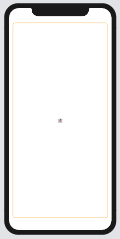
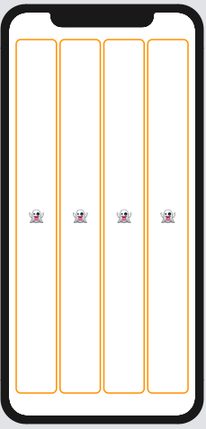
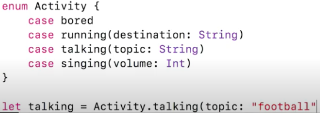

[TOC]


# Swift Summary

[Demo Todolist](https://github.com/theniceboy/Todolist-SwiftUI/issues/1)


## 2020 斯坦福（Stanford）SwiftUI教程 


所有Swift关键字都是洋红色 [u](https://www.bilibili.com/video/BV1EV411C77B)

struct 里可以有变量、函数、**行为(behaviors)**

```swift
// 这不是面向对象编程，是面向行为(function)编程
// 这句话是说这个结构行为类似View
struct ContentView: View {
  // 属性，行为类似View 则必须有some View 属性
  // some View 是说，查看我的代码，看看它返回值是什么，确保它的行为类似View
  var body: some View {
      // 每次对body 取值都执行一次函数体里的代码
      // 花括号就是函数体，实际上Text 的前面省略了 return 语句
    	Text("Hello, World!")
```


```swift
Text("👻") // 插入表情符号：Edit ->Emoji ->搜索ghost
```


```swift
    var body: some View {
      	// Z轴方向从下往上堆叠，上层会遮挡下层 
        ZStack(content: {
            // 底层用白纸打底，填充白色
            RoundedRectangle(cornerRadius: 10.0).fill(Color.white)
          	// 中层用线条描边，线条前景色由父容器广播得来，相当于默认属性
            RoundedRectangle(cornerRadius: 10.0).stroke(lineWidth: 3)
            // 上层放表情文字
            Text("👻").font(.largeTitle)
        })
      			// ZStack 外围留出一点空白，并给内部所有对象广播一种前景色 
      			.padding().foregroundColor(Color.orange)
```





```swift
    var body: some View {
        HStack(){
            ForEach(0..<4) { index in
                ZStack(content: {
                    RoundedRectangle(cornerRadius: 10.0).fill(Color.white)
                    RoundedRectangle(cornerRadius: 10.0).stroke(lineWidth: 3)
                    Text("👻").font(.largeTitle)
                })
            }
            
        }.padding().foregroundColor(Color.orange)
            .font(.largeTitle)
    }
```





```swift
private(set) var // 私有写
```


```swift
struct Card:Identifiable {
	 var id:Int
// 实际化时赋值唯一值
```


 \


> Option values  值有可能是nil 的变量，变量后面要加一个问号?
>
> > xx as? String ?? ” “  option强转String,  转不了就给个空串默认值
>


> $somevalue  传指针，期待被修改
>
> > DatePicker 的第二参日期变量


UInt64(0xffff_ffff_ffff_ffff) 


Code written at global scope is used as the entry point for the program, so you **don’t need a main() function**.

don’t need to import a separate library for functionality like input/output or string handling


```swift
let fruitSummary = "I have \(apples + oranges) pieces of fruit."
let quotation = """
I said "I have \(apples) apples."
And then I said "I have \(apples + oranges) pieces of fruit."
"""
```

“let s = 1.description”


## struct


struct 是值类型，**所有赋值都是值拷贝**


结构体本身是不可变的，我们无法修改它的属性值 —— Swift 需要**销毁并重建整个结构体以完成属性的改动**。（**mutating** 相当于向编译器表态我就是要这个过程发生）


## @state


对于 SwiftUI 视图来说，传统的**异步分发是不安全**的 —— 不要引火烧身


State属于SwiftUI架构，ObservableObject属于Combine架构

ObservableObject


### views are functions of their state


> 视图是state 的函数，也就是说视图是函数的结果，state 是函数的参数
> 想要修改视图不是直接对结果动手，而是要修改参数，既修改state


```swift
struct ContentView: View {
    @State private var score = 0
}
```


state 是不共享的数据，state 值改变会触发**视图重绘** 


## @ObservedObject


1. 须实现ObservableObject 协议
2. 类型是class 
3. 值变化是否会触发视图重绘由你决定
   - 使用@Published 会触发重绘的变量


@ObservableObject 是**共享数据**


```swift
class User : ObservableObject {
    @Published var firstName = "Bilbo"
    @Published var lastName = "Baggins"
}
@ObservedObject var user = User()
```


## @EnvironmentObject


相当于全局变量


## $


指针，披着传值外套的指针就是引用


## 匿名函数


> 函数就是闭包

```
let mappedNumbers = numbers.map({ number in 3 * number })  // in 分隔了形参和函数体
print(mappedNumbers)

let sortedNumbers = numbers.sorted { $0 > $1 } // 第一参、第二参
print(sortedNumbers)
{1}()  // call and re 1
```


no return, three are legal

```
func say1(_ s:String) -> Void { print(s) }
func say2(_ s:String) -> () { print(s) }
func say3(_ s:String) { print(s) }
```


## List and Dictionary


```
let emptyArray = [String]()
let emptyDictionary = [String: Float]()
shoppingList = []
occupations = [:]
```


## Optional value


? 表示值可以为nil，?? 为nil 时提供默认值

```swift
if let name = optionalName {
    greeting = "Hello, \(name)"
}
let informalGreeting = "Hi \(nickName ?? fullName)"
```


## Function


### 参数由标签后接变量签名组成

```swift
func greet(_ person: String, on day: String) -> String {  // 
    return "Hello \(person), today is \(day)."
}
greet("John", on: "Wednesday")
```


## Protocol


### 继承协议确定类型

```swift
protocol Entertainment  {      
  associatedtype MediaType  
}
class Foo : Entertainment  {
  typealias MediaType = String //可以指定任意类型
}
```


继承只继承协议，传统继承的语义通过组合来实现。既**一个view 套在另一个view 里面**


## String


### multi-line strings

```
"""
a
b
"""

"""
a \
b \
"""
// 一个有换行，一个无换行
```


### interpolation

```
"a is \(v)"
```


## View 


### minimal protocol

```swift
import SwiftUI

struct iHome: View {
    var body: some View {
        ZStack {
            Spacer()
        }
    }
}

#if DEBUG
struct iHome_Previews: PreviewProvider {
    static var previews: some View {
        iHome()
    }
}
#endif
```


### the *safe area*

an area where they can’t be covered up by system UI or device rounded corners

.edgesIgnoringSafeArea(.bottom)


### 是看得见摸得着的对象（Touchable）

A view may come from a nib, or you can create it in code. 


启动时窗口被创建并显示，否则就是黑屏一片。view 是windows 的下一级。

Windows 组成了可视部分的整个背景，是所有view 的superview

IOS 13 起，ipad 可以有多窗口，iphone 只能有一个窗口


- view


## VStack 竖排


```swift
VStack {
	Text("Hello, World!")
  Text("Hello, World!")
}
```


**默认居中**


### Form


**默认置顶左对齐**


Forms are regular containers just like VStack, so you can switch between the two freely depending on your purpose.


```swift
        NavigationView {
            Form {
                Section {
                    Text("Hello World")
                }
            }.navigationBarTitle("", displayMode: .inline)
        }
```


#### Section

分组显示

```swift
List {
    Section(header: Text("Section 1")) {
        Text("Static row 1")
        Text("Static row 2")
    }
}
```


## ZStack 垂直排


## Space


```swift
Spacer().frame(height:20)  // 加点小空档
```


## Text


### padding, background, foregroundColor

###  font(.title)

### text binding

```
TextField 
init(LocalizedStringKey, text: Binding<String>, onEditingChanged: (Bool) -> Void, onCommit: () -> Void)
```


灰色的字体

```swift
.font(.subheadline)
			.foregroundColor(.secondary)
```


## Enum




```swift
enum Planet: Int {
    case mercury  // 默认从零开始，也可以显示给第一项赋值 xx = 1
    case venus
    case earth
    case mars
}
let earth = Planet(rawValue: 2)
```


### 文本过长用省略号代替

```text
lineLimit(nil)
```


### 文本过长自动缩小并显示

```text
minimumScaleFactor(0.3)
```


### 多行文本对齐

```text
.multilineTextAlignment(.leading)
```


## Navigation


### Hide navigation

```swift
.navigationBarHidden(true)
.navigationBarTitle(Text("Home"))
.edgesIgnoringSafeArea([.top, .bottom])
```


## Button

### cornerRadius, shadow

```swift
        VStack {
            Text("Hello, World!")
            Button(action:{
                
            }){
                Text("屠龙宝刀点击就送！")
                .padding() // 文本外围胖一圈
                    .background(Color.blue)
                    .foregroundColor(.white)
            }
            .cornerRadius(10) // 按钮加圆角效果
            .shadow(radius: 10) // 按钮加外围阴影
        }
```


### forbidden click

```swift
disabled(true)
```


##  Class


### restore data on startup

- 继承 NSObject, NSCoding, Identifiable


```swift
class Todo:NSObject, NSCoding, Identifiable
```


## System


### hide keyboard

```swift
UIApplication.shared.keyWindow?.endEditing(true)
```


nibs, outlets, and actions, and the mechanics of nib loading

