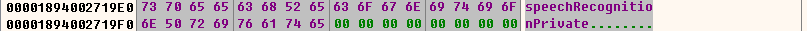

# dll

```
根据这个思路，我们从rundll32开始调试就好了

x64dbg打开"C:\Windows\System32\rundll32.exe"，32位应该是"C:\Windows\SysWOW64\rundll32.exe"
文件->改变命令行，补充dll路径和导出函数名，例如: "C:\Windows\SysWOW64\rundll32.exe" "C:\Users\alice\Desktop\hello.dll",sayhello
选项->选项->事件(当以下事件发生时暂停:)，勾选"用户DLL入口"
运行到要调试的dll入口时，切换到"符号"窗口，选择要调试的dll，在相应的导出函数下断点，
继续运行即可在指定的导出函数开始处断下

如果调试的dll要访问额外的文件，注意当前文件夹是rundll32.exe所在的文件夹
```


```
"C:\Windows\System32\rundll32.exe" "E:\SODA.dll",CreateExtendedSodaAsync 
```


# soda

```
PID=17272
名称=chrome
路径=C:\Program Files\Google\Chrome\Application\chrome.exe
命令行参数=--type=utility --utility-sub-type=media.mojom.SpeechRecognitionService --lang=zh-CN --service-sandbox-type=speech_recognition --video-capture-use-gpu-memory-buffer --field-trial-handle=2060,i,416351341486393937,12593638908818774446,262144 --variations-see

搜字符串可能可以找到创健进程的地方？  SpeechRecognitionService

火绒的安全分析工具 -> 进程 -> 在 chrome top 进程搜字符串，能搜到

单进程模式：
	“快捷方式”选项卡。 你需要做的就是在“目标”的路径后面加上下面这个参数:" --single-process"
	
	"C:\Program Files\Google\Chrome\Application\chrome.exe" --single-process
	
	breakpoint这个回调，我在x64dbgpy中使用了，的确很迅速，好用。
	

```


DbgChild 插件在附加的主进程创建新进程时，会自动新开一个 x64dbg 实例附加到新进程去，以下是它的内存数据：




## windbg

```

在调试父进程时使用.childdbg命令

```


## Ghidra

- https://blog.csdn.net/qq_15174755/article/details/108906564
- https://blog.csdn.net/kailiaq_1/article/details/134977595


## IDA

https://www.torproject.org/

```
https://bbs.kanxue.com/thread-277984.htm
位大佬，应该是俄罗斯的，收集了IDA历次版本(Demo/Free/Leak)，从0.1到8.3，在		http://fckilfkscwusoopguhi7i6yg3l6tknaz7lrumvlhg5mvtxzxbbxlimid.onion/  
	# 暗网？
	https://blog.smallfang.us/cn/0012/
	

```


```
apt install libxcb-xinerama0 libxcb-cursor0
```


## soda 源码

https://source.chromium.org/

	- 这里搜 CreateExtendedSodaAsync

```

$ git clone https://chromium.googlesource.com/chromiumos/platform2
	# linux 能正常签出

error: invalid path 'diagnostics/cros_healthd/fetchers/storage/testdata/sys/devices/pci0000:00/0000:00:12.7/device_descriptor/manufacturer_id'
fatal: unable to checkout working tree
warning: Clone succeeded, but checkout failed.
	# 原始报错

  SodaConfig(
      uint32_t channel_count,
      uint32_t sample_rate,
      const std::string& api_key,
      const std::string& library_dlc_path,
      const std::string& language_dlc_path,
      OptionalBool enable_formatting);
      	# 第三参就是 api_key, 调试 linux 正常运行的 libsoda.so，看能不能导出自已传的 API KEY


New-ItemProperty -Path "HKLM:\SYSTEM\CurrentControlSet\Control\FileSystem" -Name "LongPathsEnabled" -Value 1 -PropertyType DWORD -Force

git clone --no-checkout https://chromium.googlesource.com/chromiumos/platform2 platform2
cd platform2
git sparse-checkout init --cone

echo "diagnostics/cros_healthd/fetchers/storage/testdata/sys/devices/pci0000:00/0000:00:12.7/" >> .git/info/sparse-checkout
git checkout


```


### api key?

```

https://source.chromium.org/chromium/chromium/src/+/main:components/soda/constants.h
	# api key?

https://github.com/FaintWhisper/SODAKeyDumper
	# api key dumper
	
{LanguageCode::kJaJp,
     "ja-JP",
     prefs::kSodaJaJpConfigPath,
     {0xed, 0x7f, 0x96, 0xa5, 0x60, 0x9c, 0xaa, 0x4d, 0x80, 0xe5, 0xb8,
      0x26, 0xea, 0xf0, 0x41, 0x50, 0x09, 0x52, 0xa4, 0xb3, 0x1e, 0x6a,
      0x8e, 0x24, 0x99, 0xde, 0x51, 0x14, 0xc4, 0x3c, 0xfa, 0x48}},
     	# 日语的 
     	
     h = [0x6, 0xe, 0x0, 0xe, ... rest of the fr-FR hex as single chars]
	 crxid = ''
	 for c in h[:16]:
    	crxid += chr(((c>>4)&0x0f) +ord('a'))
    	crxid += chr((c&0x0f) +ord('a'))


https://source.chromium.org/chromium/chromium/src/+/main:chrome/services/speech/soda/proto/soda_api.proto
	# 接口协议


constexpr SodaLanguagePackComponentConfig kLanguageComponentConfigs[] = {
    {LanguageCode::kEnUs,
     "en-US",
     prefs::kSodaEnUsConfigPath,
     {0xe4, 0x64, 0x1c, 0xc2, 0x8c, 0x2a, 0x97, 0xa7, 0x16, 0x61, 0xbd,
      0xa9, 0xbe, 0xe6, 0x93, 0x56, 0xf5, 0x05, 0x33, 0x9b, 0x8b, 0x0b,
      0x02, 0xe2, 0x6b, 0x7e, 0x6c, 0x40, 0xa1, 0xd2, 0x7e, 0x18}},
    {LanguageCode::kDeDe,
     "de-DE",
     prefs::kSodaDeDeConfigPath,
     {0x92, 0xb6, 0xd8, 0xa3, 0x0b, 0x09, 0xce, 0x21, 0xdb, 0x68, 0x48,
      0x15, 0xcb, 0x49, 0xd7, 0xc6, 0x21, 0x3f, 0xe5, 0x96, 0x10, 0x97,
      0x6e, 0x0f, 0x08, 0x31, 0xec, 0xe4, 0x7f, 0xed, 0xef, 0x3d}},
    {LanguageCode::kEsEs,
     "es-ES",
     prefs::kSodaEsEsConfigPath,
     {0x9a, 0x22, 0xac, 0x04, 0x97, 0xc1, 0x70, 0x61, 0x24, 0x1f, 0x49,
      0x18, 0x72, 0xd8, 0x67, 0x31, 0x72, 0x7a, 0xf9, 0x77, 0x04, 0xf0,
      0x17, 0xb5, 0xfe, 0x88, 0xac, 0x60, 0xdd, 0x8a, 0x67, 0xdd}},
    {LanguageCode::kFrFr,
     "fr-FR",
     prefs::kSodaFrFrConfigPath,
     {0x6e, 0x0e, 0x2b, 0xd3, 0xc6, 0xe5, 0x1b, 0x5e, 0xfa, 0xef, 0x42,
      0x3f, 0x57, 0xb9, 0x2b, 0x13, 0x56, 0x47, 0x58, 0xdb, 0x76, 0x89,
      0x71, 0xeb, 0x1f, 0xed, 0x48, 0x6c, 0xac, 0xd5, 0x31, 0xa0}},
    {LanguageCode::kItIt,
     "it-IT",
     prefs::kSodaItItConfigPath,
     {0x97, 0x45, 0xd7, 0xbc, 0xf0, 0x61, 0x24, 0xb3, 0x0e, 0x13, 0xf2,
      0x97, 0xaa, 0xd5, 0x9e, 0x78, 0xa5, 0x81, 0x35, 0x75, 0xb5, 0x9d,
      0x3b, 0xbb, 0xde, 0xba, 0x0e, 0xf7, 0xf0, 0x48, 0x56, 0x01}},
    {LanguageCode::kJaJp,
     "ja-JP",
     prefs::kSodaJaJpConfigPath,
     {0xed, 0x7f, 0x96, 0xa5, 0x60, 0x9c, 0xaa, 0x4d, 0x80, 0xe5, 0xb8,
      0x26, 0xea, 0xf0, 0x41, 0x50, 0x09, 0x52, 0xa4, 0xb3, 0x1e, 0x6a,
      0x8e, 0x24, 0x99, 0xde, 0x51, 0x14, 0xc4, 0x3c, 0xfa, 0x48}},
    {LanguageCode::kHiIn,
     "hi-IN",
     prefs::kSodaHiInConfigPath,
     {0x0e, 0xb6, 0x04, 0xa8, 0x86, 0xb5, 0x7d, 0x96, 0x06, 0x3b, 0x94,
      0x8b, 0x64, 0x6f, 0x54, 0x2d, 0x75, 0x34, 0x87, 0xcf, 0xaf, 0x19,
      0x4c, 0x76, 0xb7, 0xf5, 0xe0, 0x7d, 0x21, 0x0a, 0xca, 0x88}},
    {LanguageCode::kPtBr,
     "pt-BR",
     prefs::kSodaPtBrConfigPath,
     {0x0d, 0x52, 0xe0, 0x31, 0xbc, 0x9f, 0xbc, 0xa6, 0xc0, 0x7b, 0xa7,
      0x6d, 0xd6, 0xa7, 0xe1, 0x4d, 0x97, 0xaa, 0x2e, 0x2b, 0x51, 0x9a,
      0xfa, 0x0f, 0x17, 0x04, 0x52, 0x04, 0xfc, 0xa9, 0x07, 0xd4}},
    {LanguageCode::kIdId,
     "id-ID",
     prefs::kSodaIdIdConfigPath,
     {0xa2, 0x60, 0xdb, 0xd4, 0xdf, 0x1b, 0xaa, 0x71, 0xdf, 0xf5, 0x86,
      0x8e, 0x27, 0xe4, 0x36, 0xd7, 0xc1, 0x25, 0xfe, 0x0d, 0x48, 0xba,
      0x3b, 0x28, 0x24, 0x60, 0x9d, 0x2a, 0xc1, 0x6f, 0xa0, 0x5c}},
    {LanguageCode::kKoKr,
     "ko-KR",
     prefs::kSodaKoKrConfigPath,
     {0x2e, 0x69, 0x38, 0x62, 0xd2, 0x77, 0xab, 0x59, 0xa7, 0x0b, 0x67,
      0x75, 0x41, 0x9f, 0x39, 0x71, 0x22, 0x95, 0x7c, 0x25, 0xbd, 0xea,
      0x8a, 0x19, 0x92, 0xa0, 0xa6, 0x81, 0x93, 0xa0, 0x11, 0x45}},
    {LanguageCode::kPlPl,
     "pl-PL",
     prefs::kSodaPlPlConfigPath,
     {0x3f, 0xa6, 0xc9, 0x44, 0x13, 0x6a, 0xbe, 0xb8, 0xc2, 0xd2, 0x30,
      0xa0, 0x71, 0x0e, 0xab, 0xfc, 0xfc, 0x5d, 0x74, 0x62, 0xd8, 0x50,
      0x67, 0x90, 0x61, 0x81, 0x21, 0xd9, 0xf8, 0x74, 0x6d, 0x1c}},
    {LanguageCode::kRuRu,
     "ru-RU",
     prefs::kSodaRuRuConfigPath,
     {0xd9, 0xcd, 0x1f, 0x88, 0xbe, 0xa7, 0xe1, 0xe5, 0x62, 0x8b, 0xe1,
      0x3c, 0xf6, 0x3a, 0x54, 0x5e, 0x38, 0xb4, 0x79, 0x2b, 0x56, 0xc5,
      0x61, 0x3b, 0xc1, 0x97, 0xb6, 0x91, 0x16, 0x98, 0xa3, 0xb6}},
    {LanguageCode::kThTh,
     "th-TH",
     prefs::kSodaThThConfigPath,
     {0xeb, 0x2e, 0xa1, 0x98, 0xba, 0x0a, 0x10, 0xad, 0x09, 0x15, 0xea,
      0x1e, 0x84, 0x8f, 0x1b, 0x4b, 0x7d, 0xfb, 0xfa, 0x33, 0x92, 0x4c,
      0x34, 0xe2, 0x5b, 0x33, 0x0c, 0x4a, 0x35, 0x79, 0xfe, 0xa4}},
    {LanguageCode::kTrTr,
     "tr-TR",
     prefs::kSodaTrTrConfigPath,
     {0x85, 0x02, 0x59, 0xd8, 0x1f, 0xba, 0x8d, 0x23, 0x42, 0xfa, 0xa4,
      0x3c, 0x4a, 0x65, 0x4e, 0x09, 0xfa, 0xb0, 0x22, 0x2d, 0x31, 0x85,
      0xdb, 0xb2, 0x04, 0x42, 0x22, 0x6f, 0x4b, 0x86, 0xb9, 0xff}},
    {LanguageCode::kViVn,
     "vi-VN",
     prefs::kSodaViVnConfigPath,
     {0x1f, 0xd2, 0xae, 0x98, 0x67, 0x68, 0x1b, 0x4b, 0x31, 0xe5, 0x39,
      0xc5, 0x38, 0xf5, 0x48, 0x0a, 0xa8, 0xb6, 0xf6, 0xcc, 0x2f, 0x7d,
      0xe8, 0x49, 0x35, 0x5e, 0xa8, 0xb9, 0x13, 0x9f, 0x32, 0x3c}},
    {LanguageCode::kZhCn,
     "cmn-Hans-CN",
     prefs::kSodaZhCnConfigPath,
     {0xfb, 0x55, 0xfa, 0xa7, 0x38, 0x1d, 0xf5, 0x5d, 0x29, 0xf5, 0xbd,
      0xeb, 0x5b, 0xaf, 0x69, 0xde, 0x6c, 0xcc, 0x98, 0xa5, 0x7d, 0x66,
      0x29, 0x34, 0xbf, 0xce, 0x8e, 0xde, 0x24, 0x5b, 0x30, 0x79}},
    {LanguageCode::kZhTw,
     "cmn-Hant-TW",
     prefs::kSodaZhTwConfigPath,
     {0x91, 0xb3, 0x38, 0x63, 0x94, 0x27, 0xd8, 0xd9, 0xb1, 0xa9, 0x94,
      0x80, 0x35, 0x6c, 0xbf, 0xe2, 0x7d, 0xf3, 0x1a, 0xc8, 0x8a, 0x13,
      0xcf, 0x95, 0x0a, 0x15, 0x3a, 0xb1, 0x1c, 0x19, 0xbc, 0xbe}},
};
```


# debugger tools

https://down.52pojie.cn/Tools/Debuggers/

https://bbs.kanxue.com/forum-10.htm

 https://bbs.kanxue.com/thread-276162.htm  从0开始编写简易调试器 

- https://51asm.com/ 逆向班


## 子进程插件

https://github.com/therealdreg/DbgChild

- https://github.com/x64dbg/ScyllaHide
- https://github.com/a1ext/labeless


```
https://www.52pojie.cn/thread-1585120-1-1.html   
   DbgChild: 他提供了一个自动检测被调试进程创建的子进程的功能，如果主进程创建了子进程，那么它会自动附加到一个新的x64dbg实例上。很多时候，这可以为你节省时间。
   
```


## jdk

```
# see huggingface\gasr\readme.txt
vi ~/.bashrc 
export JAVA_HOME=/root/jdk-21.0.4+7/
export PATH=$JAVA_HOME/bin:$PATH
export CLASSPATH=.:$JAVA_HOME/lib/dt.jar:$JAVA_HOME/lib/tools.jar　
source ~/.bashrc
	# jdk 配置
```


