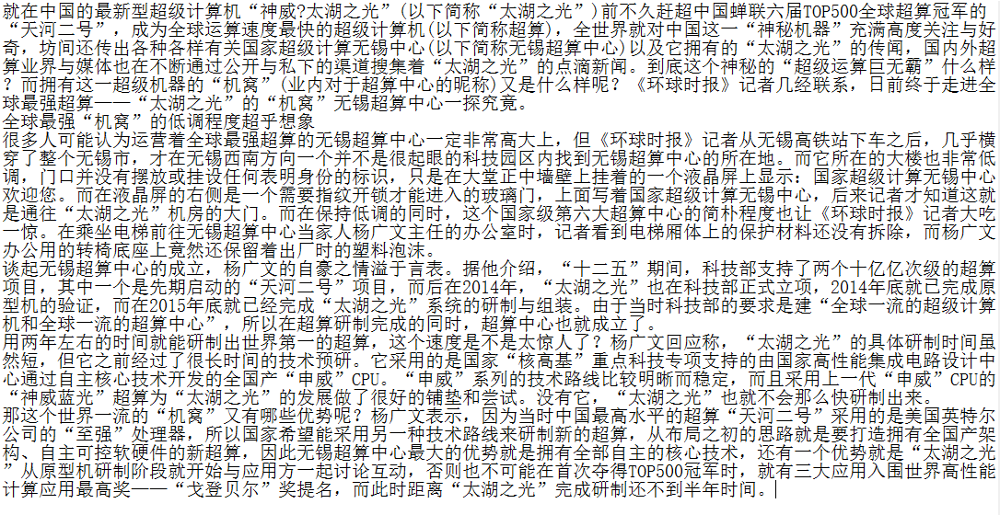
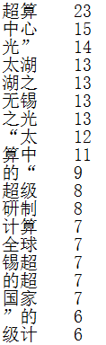
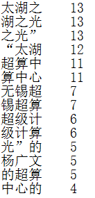
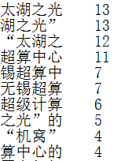

# 无需中文分词算法的简单词频统计

做自然语言处理有一个基本的步骤是词频统计，然而我们知道，中文的词语有单音节词、双音节词和多音节词之分，所以中文处理起来远比英文复杂得多。不过，我们可以“偷个懒”，如果要做词频统计的文本量足够大，而且我们只需要知道词频最高的几个词的话，那么我们可以将问题简化一下。

我们简化成什么样呢？很简单，我们通过大量文本来分别每2字词、3字词、4字词乃至5个及以上的字词做一个切分，每统计一个后再向后偏移1字符，如此往复，直到自然切分标识（标点符号、空格或换行符等）或者文本结束，然后再进行下一段切分统计，当然也可以把标点符号也当成普通文本字符切分进去（好处是可以囊括一些特殊用法）。

这个简化之后的方法也是有理论上的可靠性的，因为我们可以通过**大数定理得知，一个随机变量出现的频率是随着样本总数增大而逐渐稳定在某个值附近的。那么，我们可以将具有固定搭配的词看为一个随机变量，在现实中，某一个词的使用频率在大的样本条件下是稳定的**。这样一来，只要我们有相当多的文本，那么我们就可以生成一个带有词频标识的词典，而且可以发现，词频较高的字符块，是真正的词的概率很高，不是词的概率随着词频的降低而增大。

我们可以使用以下的文本来做测试，文本内容来源于某新闻网站。

得到的切分统计结果是这样的（省略了部分词频过低的内容）：

二字词：

三字词：

四字词：

根据结果，我们可以看到，这篇文章如果用两个字来概括，那就是“超算”，如果用三个字，好像不好说，但我们隐约可以看到“太湖之光”四个字，而四字词统计结果就是这四个字，词频还一样！这篇文章在说什么？那就是两个词：“超算”和“太湖之光”，这正是文章中一直在说明的对象，是不是很神奇？

这是一个比较简单的一种方法，可以用来做一些关键词发现之类的程序。不过毕竟这种方法太过于简化，它的精确度以及可靠性等方面不够好，但是这种方法相当简单，可以作为对于复杂模型和方法的替代品。看过吴军老师的《数学之美》的读者们应该知道，如果有一种简单的方法可以起到不错的效果的时候，那么就用简单的方法，除非我们有更高的要求。

这种方法我在一次出题的时候出的就是这样的题，还是有不少人是可以答出来的。下面我提供这种简单方法的4种编程语言实现的代码供大家学习参考。

 

代码：

C#

tool.cs

**using** *System;*

**using** *System.Collections.Generic;*

**using** *System.ComponentModel;*

**using** *System.Data;*

**using** *System.Drawing;*

**using** *System.Linq;*

**using** *System.Text;*

**using** *System.Threading.Tasks;*

**using** *System.Windows.Forms;*

**namespace** *WindowsFormsApplication1*

{

​    **public** **partial** **class** Form1 : Form

​    {

​        **struct** substr

​        {

​            **public** string str;

​            **public** **int** num;

​        }

​        **public** Form1()

​        {

​            InitializeComponent();

​        }

​        **private** **void** Form1_Load(**object** sender, EventArgs e)

​        {

​            string filepath = "文本.txt";//用于统计用的文本路径

​            

​            sub_run(filepath, "结果2.txt", 2);

​            sub_run(filepath, "结果3.txt", 3);

​            sub_run(filepath, "结果4.txt", 4);

​            

​        }

​        **private** **void** sub_run(string path,string resultpath,**int** n)//n 记录每次切片的一组中包含的字符数

​        {

​            string stxt = System.IO.File.ReadAllText(path);//语言数据读取

​            //Console.WriteLine(stxt);

​            substr[] tmp_str = new substr[stxt.Length - n];

​            **for** (**int** i = 0; i < stxt.Length - n; i++)//文本切片，每2个字符为一组

​            {

​                tmp_str[i].str = stxt.Substring(i, n);

​                tmp_str[i].num = 1;

​            }

​            **for** (**int** i = 0; i < tmp_str.Length; i++)//统计每个切片出现的次数

​            {

​                **if** (tmp_str[i].num == 0) **continue**;

​                **for** (**int** j = tmp_str.Length - 1; j > i; j--)

​                {

​                    **if** (tmp_str[i].str == tmp_str[j].str)

​                    {

​                        tmp_str[i].num++;

​                        tmp_str[j].num--;

​                    }

​                }

​            }

​            **for** (**int** i = 0; i < tmp_str.Length; i++)//按频数从大到小的顺序排序

​            {

​                **for** (**int** j = i + 1; j < tmp_str.Length; j++)

​                {

​                    **if** (tmp_str[i].num < tmp_str[j].num)

​                    {

​                        substr tmp = tmp_str[i];

​                        tmp_str[i] = tmp_str[j];

​                        tmp_str[j] = tmp;

​                    }

​                }

​            }

​            string r = "";

​            **for** (**int** i = 0; i < tmp_str.Length; i++)

​            {

​                **if**(tmp_str [i].num!=0)

​                {

​                    r = r + tmp_str[i].str + "    " + tmp_str[i].num.ToString() + "\r\n";

​                }

​            }

​            System.IO.File.WriteAllText(resultpath, r);

​            Console.WriteLine("***文件 "+path+" 的 "+n.ToString ()+"字符切片统计 已经OK");

​        }

​    }

}

vb.net

tool.vb

Public **Class** Form1

​    Structure substr

​        Public str As String

​        Public num As Integer

​    **End** Structure

​    Private Sub Form1_Load(sender As Object, e As EventArgs) Handles MyBase.Load

​        Dim filepath As String = "文本.txt"    '用于统计用的文本路径

​        sub_run(filepath, "结果2.txt", 2)

​        sub_run(filepath, "结果3.txt", 3)

​        sub_run(filepath, "结果4.txt", 4)

​    End Sub

​    Private Sub sub_run(path As String, resultpath As String, n As Integer)

​        REM    n 记录每次切片的一组中包含的字符数

​        Dim stxt As String = System.IO.File.ReadAllText(path)    '语言数据读取

​        'Console.WriteLine(stxt)

​        Dim tmp_str(stxt.Length - n) As substr

​        For i = 0 To stxt.Length - n - 1    '文本切片，每2个字符为一组

​            tmp_str(i).str = stxt.Substring(i, n)

​            tmp_str(i).num = 1

​        Next

​        **For** i = 0 To tmp_str.Length - 1    '统计每个切片出现的次数

​            If (tmp_str(i).num = 0) Then Continue For

​            For j = tmp_str.Length - 1 To i + 1 Step -1

​                If (tmp_str(i).str = tmp_str(j).str) Then

​                    tmp_str(i).num += 1

​                    tmp_str(j).num -= 1

​                End If

​            Next

​        Next

​        For i = 0 To tmp_str.Length - 1    '按频数从大到小的顺序排序

​            **For** j = i + 1 To tmp_str.Length - 1

​                **If** (tmp_str(i).num < tmp_str(j).num) **Then**

​                    Dim tmp As substr = tmp_str(i)

​                    tmp_str(i) = tmp_str(j)

​                    tmp_str(j) = tmp

​                **End** **If**

​            Next

​        Next

​        Dim r As String = ""

​        **For** i = 0 To tmp_str.Length - 1

​            **If** (tmp_str(i).num <> 0) **Then**

​                r = r & tmp_str(i).str & "    " & tmp_str(i).num.ToString() + vbCrLf

​            **End** **If**

​        Next

​        System.IO.File.WriteAllText(resultpath, r)

​        Console.WriteLine("***文件 " + path + " 的 " + n.ToString() + "字符切片统计 已经OK")

​    **End** Sub

**End** Class

python3

tool.py

\# -*- coding: utf-8 -*-

**def** sub_run(path,n):    #  n 记录每次切片的一组中包含的字符数

  f1=open(path,'rb')

  stxt=f1.read()

  stxt=str(stxt,'utf-8')

  f1.close()

  tmp_str={}

  **for** i **in** list(range(len(stxt)-1)):

​    tmp_str[stxt[i:i+n]]=0

​    

  **for** i **in** list(range(len(stxt)-1)):

​    tmp_str[stxt[i:i+n]]+=1

  

  tmp_str=sorted(tmp_str.items(),key=**lambda** d:d[1],reverse = **True**)

  print('*****'+str(n)+'字符***************')

  print(tmp_str)

  print('*************************')

filepath='文本.txt'    #用于统计用的文本路径

sub_run(filepath,2)

sub_run(filepath,3)

sub_run(filepath,4)

java

tool.java

**import** *java.io.**;

**class** substr{

  **public** **String** str;

  **public** **int** num;

}

**public** **class** tool{

  **public** **static** **void** main(**String**[] args){

​    **String** filepath = "文本.txt";//用于统计用的文本路径

​        sub_run(filepath, "结果2.txt", 2);

​        sub_run(filepath, "结果3.txt", 3);

​        sub_run(filepath, "结果4.txt", 4);

  }

  **public** **static** **void** sub_run(**String** path,**String** resultpath,**int** n){//n 记录每次切片的一组中包含的字符数

​    **String** stxt="";

​    **try**{

​      File fin=new File(path);

​      **int** len=(**int**)fin.length();

​      **byte** btxt[]=new **byte**[len];

​      **if**(fin.exists()){

​        RandomAccessFile f = new RandomAccessFile(fin,"rw");

​        f.read(btxt,0,len);

​        stxt=new **String**(btxt,"utf-8");

​        f.close();

​      }

​    }

​    **catch**(IOException e){

​      e.printStackTrace();

​    }

​    

​    substr tmp_str[] = new substr[stxt.length() - n];

​    

​    **for** (**int** i = 0; i < stxt.length() - n; i++)//文本切片，每2个字符为一组

​        {

​      tmp_str[i]=new substr();

​      tmp_str[i].str = stxt.substring(i, i+n);

​            tmp_str[i].num = 1;

​        }

​    **for** (**int** i = 0; i < tmp_str.length; i++)//统计每个切片出现的次数

​        {

​            **if** (tmp_str[i].num == 0) **continue**;

​            **for** (**int** j = tmp_str.length - 1; j > i; j--)

​            {

​                **if** (tmp_str[i].str.equals(tmp_str[j].str))

​                {

​                    tmp_str[i].num++;

​                    tmp_str[j].num--;

​                }

​            }

​        }

​    **for** (**int** i = 0; i < tmp_str.length; i++)//按频数从大到小的顺序排序

​        {

​            **for** (**int** j = i + 1; j < tmp_str.length; j++)

​            {

​                **if** (tmp_str[i].num < tmp_str[j].num)

​                {

​                    substr tmp = tmp_str[i];

​                    tmp_str[i] = tmp_str[j];

​                    tmp_str[j] = tmp;

​                }

​            }

​        }

​    **String** r = "";

​    **for** (**int** i = 0; i < tmp_str.length; i++)

​        {

​            **if**(tmp_str [i].num!=0)

​            {

​                r = r + tmp_str[i].str + "    " + **Integer**.toString(tmp_str[i].num) + "\r\n";

​            }

​        }

​    

​    **try**{

​      File fout=new File(resultpath);

​      RandomAccessFile f2=new RandomAccessFile(fout,"rw");

​      f2.write(r.getBytes("utf-8"));

​      f2.close();

​    }

​    **catch**(IOException e){

​      e.printStackTrace();

​    }

  }

}

