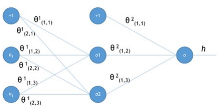

左乘是行变换，右乘是列变换

列向量右乘一个矩阵，左边的矩阵行数没变列数被降维了（被降到和列向量对齐）

> 一列向量作为系数右乘一个矩阵，矩阵降维到一列。降维的方法是矩阵所有的列加仅求和
>
> N列向量右乘一个矩阵，矩阵降维到N列

*2 加倍 *1/2减倍

异或问题神经网络图

# 梯度下降过程向量化

关于***θ***更新过程的vectorization，Andrew Ng的课程中只是一带而过，没有具体的讲解。

《机器学习实战》连Cost函数及求梯度等都没有说明，所以更不可能说明vectorization了。但是，其中给出的实现代码确是实现了vectorization的，图4所示代码的32行中weights（也就是***θ***）的更新只用了一行代码，直接通过矩阵或者向量计算更新，没有用for循环，说明确实实现了vectorization，具体代码下一章分析。

文献[3]中也提到了vectorization，但是也是比较粗略，很简单的给出vectorization的结果为：

  

且不论该更新公式正确与否，这里的**Σ(...)**是一个求和的过程，显然需要一个for语句循环m次，所以根本没有完全的实现vectorization，不像《机器学习实战》的代码中一条语句就可以完成***θ***的更新。

下面说明一下我理解《机器学习实战》中代码实现的vectorization过程。

约定训练数据的矩阵形式如下，***x\***的每一行为一条训练样本，而每一列为不同的特称取值：

约定待求的参数***θ***的矩阵形式为：

​     

先求***x.θ\***并记为***A\***：

求***hθ(x)-y\***并记为***E***：

***g(A)\***的参数***A\***为一列向量，所以实现***g\***函数时要支持列向量作为参数，并返回列向量。由上式可知***hθ(x)-y\***可以由***g(A)-y***一次计算求得。

再来看一下（15）式的***θ***更新过程，当***j=0\***时：

同样的可以写出***θj***，

综合起来就是：

综上所述，vectorization后***θ***更新的步骤如下：

（1）求***A=x.θ\***；

（2）求***E=g(A)-y\***；

（3）求**θ:=θ-α.x'.E,**x'表示矩阵x的转置。

也可以综合起来写成：

前面已经提到过：1/m是可以省略的。

# 4. 代码分析

图4中是《机器学习实战》中给出的部分实现代码。

 

sigmoid函数就是前文中的***g(z)\***函数，参数**inX**可以是向量，因为程序中使用了[Python](http://lib.csdn.net/base/python)的numpy。

gradAscent函数是梯度上升的实现函数，参数dataMatin和classLabels为训练数据，23和24行对训练数据做了处理，转换成numpy的矩阵类型，同时将横向量的classlabels转换成列向量labelMat，此时的dataMatrix和labelMat就是（18）式中的**x**和**y**。alpha为学习步长，maxCycles为迭代次数。weights为n维（等于***x\***的列数）列向量，就是（19）式中的***θ***。

29行的for循环将更新***θ***的过程迭代maxCycles次，每循环一次更新一次。对比3.4节最后总结的向量化的***θ***更新步骤，30行相当于求了***A=x.θ\***和***g(A)\***，31行相当于求了***E=g(A)-y***，32行相当于求***θ:=θ-α.x'.E***。所以这三行代码实际上与向量化的***θ***更新步骤是完全一致的。

总结一下，从上面代码分析可以看出，虽然只有十多行的代码，但是里面却隐含了太多的细节，如果没有相关基础确实是非常难以理解的。相信完整的阅读了本文，就应该没有问题了！^_^。

 

【参考文献】

[1]《机器学习实战》——【美】Peter Harington
[2] Stanford机器学习公开课（https://www.coursera.org/course/ml）
[3] http://blog.csdn.net/abcjennifer/article/details/7716281
[4] http://www.cnblogs.com/tornadomeet/p/3395593.html
[5] http://blog.csdn.net/moodytong/article/details/9731283
[6] http://blog.csdn.net/jackie_zhu/article/details/8895270