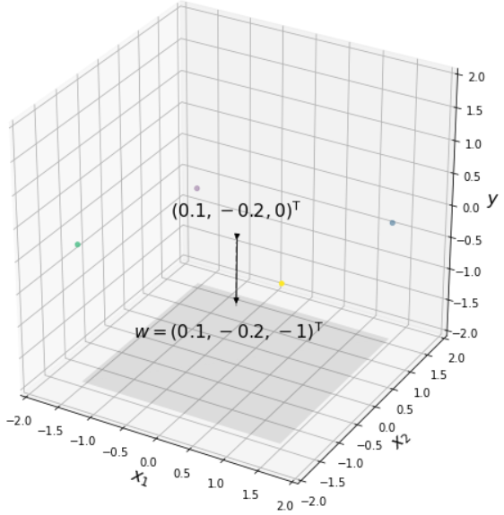
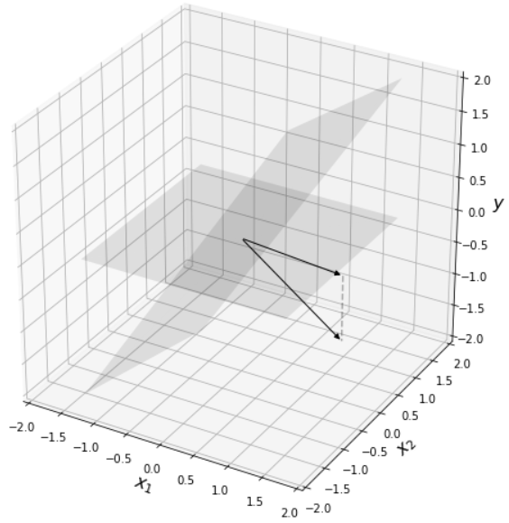
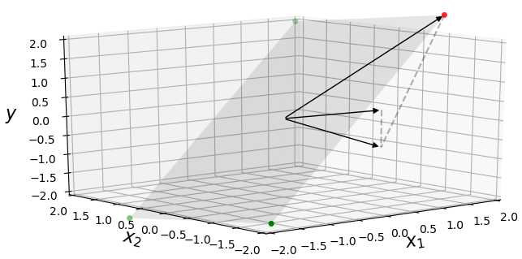
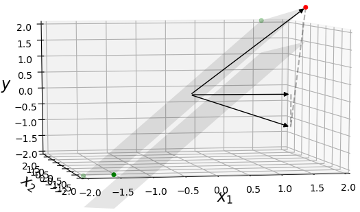
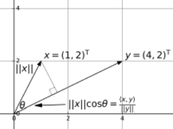
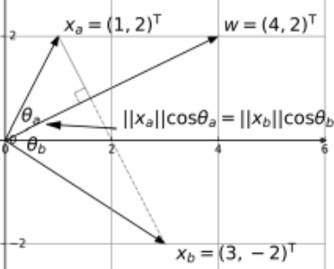
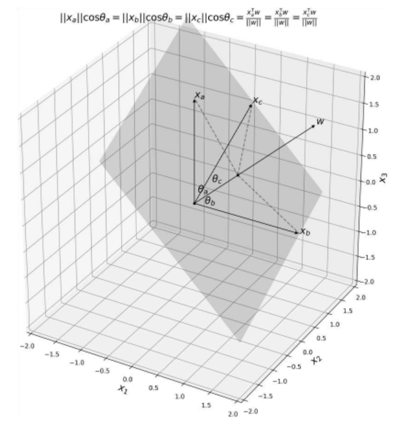
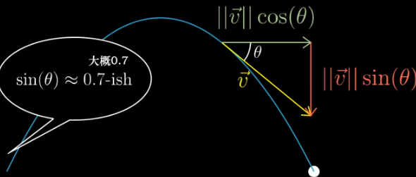

[TOC]


# 深入理解神经网络：从逻辑回归到CNN


What I cannot create I do not understand

Things Happen for A Reason


**算子就是变换的别名，而变换又是函数的花俏说法。**


函数是一种向量

函数可进行加和与数乘运算，而因为向量也不过只有相加和数乘两种运算，所以最初以空间中箭头为背景来建立的线性代数的合理概念和解决问题的手段，例如：**线性变换，列空间、点积、特征值、特征向量等，都能够直接应用于函数**。


映射是函数的推广，**雅可比是梯度的推广**

> 梯度是偏导的向量，雅可比是梯度的向量


一个多元函数求偏导，每一元就得到一个偏导，n元偏导组成一个向量，这就是梯度。

m个多元函数求偏导，每一函数得到一个梯度，m个梯度组成一个矩阵，这就是雅可比矩阵。


函数的输出是标量，映射的输入输出都是向量

> 单个神经元就是一个函数，神经网络的执行就是一个映射
>
> > m 组输入构成的**向量**是**神经网络(映射)**的输入，m个预测构成的**向量**是**神经网络(映射)**的输出


$X$ 是神经网络的输入，总共$m$ 组，每一组是一个$n$ 维向量


$$
X = 
\begin{bmatrix}
x^{1}_{1} & x^{1}_{1} & \cdots & x^{1}_{m}  \\
x^{2}_{1} & x^{2}_{1} & \cdots & x^{2}_{m} \\
\vdots & \vdots & \ddots & \vdots & \\
x^{n}_{1} & x^{n}_{1} & \cdots & x^{n}_{m} \\
\end{bmatrix}
$$


例如，与门(OR Gate) 的全部参数为：

$$
X = \begin{bmatrix}
0 & 0 & 1 & 1 \\
0 & 1 & 0 & 1 \\
\end{bmatrix}
\text {（与门的输入）}
$$

$$
Y =
\begin{bmatrix}
0 & 1 & 1 & 1 \\
\end{bmatrix}
\text{（与门的输出）}
$$

$$
W =
\begin{bmatrix}
w_1 & w_2  \\
\end{bmatrix}
\text{（线性变换，也就是权重）}
$$

$$
B =
\begin{bmatrix}
b_1 & b_2 & b_3 & b_4  \\
\end{bmatrix}
\text{（偏置）}
$$

前向传播的过程：


$$
f_W(X) =

\begin{bmatrix}
w_1 & \cdots & w_n  \\
\end{bmatrix}

\cdot 

\begin{bmatrix}
x^{1}_{1} & x^{1}_{2} & \cdots & x^{1}_{m}  \\
x^{2}_{1} & x^{2}_{2} & \cdots & x^{2}_{m} \\
\vdots & \vdots & \ddots & \vdots & \\
x^{n}_{1} & x^{n}_{2} & \cdots & x^{n}_{m} \\
\end{bmatrix}

+ 

\begin{bmatrix}
b_1 & \cdots & b_m  \\
\end{bmatrix}

\\

= 

\begin{bmatrix}
W \cdot x_1 + b_1 & \cdots & W \cdot x_m + b_m \\
\end{bmatrix}
$$


梯度是偏导的向量，雅可比是梯度的向量


$f'':\mathbb{R}^n \rightarrow \mathbb{R}^1$ 是一个线性函数

$$
f''(x_i) = W \cdot \ x_i \ , i \in 1 \cdots m
$$

> 线性函数，等同于线性变换，函数又可以认为是一种向量
>
> 所以这里的指的线性变换就是权重向量$W$，$W$对$x_i$ 进行了线性变换
>
> 维度变化：$(1 \times n) (n \times 1) \rightarrow (1 \times 1)$ ，所以线性变换$W$ **的维度是$(1 \times n)$**
>
> > 读作：线性变换将$1$ 个$n$ 维向量变换成$1$ 个 $1$ 维向量 


$f'$ 是一个仿射函数
$$
f'(x_i) = W \cdot \ x_i + b_i \ , i \in 1 \cdots m
$$

> 仿射函数是一个线性函数加上一个常量
>
> $b_i$ 的维度是$(1 \times 1)$ ，$B$ 的维度是$(1 \times m)$ 


$f$ 是一个仿射映射
$$
f(X) = \begin{bmatrix} f'_1(x_{1}) & \cdots &  f'_m(x_{m}) \end{bmatrix} = W \cdot X + B \\
=
\begin{bmatrix}
w_1 & \cdots & w_n  \\
\end{bmatrix}

\cdot 

\begin{bmatrix}
x^{1}_{1} & x^{1}_{2} & \cdots & x^{1}_{m}  \\
x^{2}_{1} & x^{2}_{2} & \cdots & x^{2}_{m} \\
\vdots & \vdots & \ddots & \vdots & \\
x^{n}_{1} & x^{n}_{2} & \cdots & x^{n}_{m} \\
\end{bmatrix}

+ 

\begin{bmatrix}
b_1 & \cdots & b_m  \\
\end{bmatrix}
$$

> 仿射映射可以看作由若干个仿射函数组成
>
> 大写的$X$ 表示这是一个矩阵
>
> 小写的$x$ 表示这是一个向量，$x$ 的下标表示这是一个列向量，下标的数字指出它是矩阵中的第几列


$$
\begin{bmatrix}
w_1 & \cdots & w_n  \\
\end{bmatrix}

\cdot 

\begin{bmatrix}
x^{1}_{1} & x^{1}_{2} & \cdots & x^{1}_{m}  \\
x^{2}_{1} & x^{2}_{2} & \cdots & x^{2}_{m} \\
\vdots & \vdots & \ddots & \vdots & \\
x^{n}_{1} & x^{n}_{2} & \cdots & x^{n}_{m} \\
\end{bmatrix}

+ 

\begin{bmatrix}
b_1 & \cdots & b_m  \\
\end{bmatrix}
$$


如果映射$f:\mathbb{R}^{n \times m} \rightarrow \mathbb{R}^m$ 在自变量$x$ 附近可以写成：
$$
f(x+h) = f(x) + A h + \mathcal{R}(h)
$$


$A$ 由$x$ 决定，余项$\mathcal{R}(h)$ 是$m$ 维向量，满足：


其中：
$$
X = 
\begin{bmatrix}
x^{1}_{0} & x^{1}_{1} & \cdots & x^{1}_{n}  \\
x^{2}_{0} & x^{2}_{1} & \cdots & x^{2}_{n} \\
\vdots & \vdots & \ddots & \vdots & \\
x^{m}_{0} & x^{m}_{1} & \cdots & x^{m}_{n} \\
\end{bmatrix}
$$


与门(OR) 运算实际上就是一个仿射映射


$$
X = \begin{bmatrix}
0 & 0 \\
0 & 1 \\
1 & 0 \\
1 & 1 \\
\end{bmatrix}
\text {（与门的输入）}
$$

$$
Y =
\begin{bmatrix}
0  \\
1  \\
1  \\
1  \\
\end{bmatrix}
\text{（与门的输出）}
$$

如何找到从$x$ 到$y$ 的线性变换（也就是w）？

> 既找到一个线性函数，将$X$ 中的行向量$x$ 变换到$Y$ 中的行向量$y$ 


$f:\mathbb{R}^n \rightarrow \mathbb{R}^m$ 是线性映射，必然存在一个$m \times n$ 的矩阵A，对任意$\vec{x} \in \mathbb{R}^n$ 满足：
$$
f(\vec{x}) = A \vec{x}
$$

> $A$ 是一个$m \times n$ 的矩阵，这个矩阵本身就是线性变换
>
> - 注意前面函数就是向量这个事实，$f$ 就是线性变换，$f$ 和$A$ 是同一个东西
>
> 为什么从$n$ 维到$m$ 维向量的线性映射的维度是$m \times n$ ?
>
> > **一个矩阵代表一个线性变换，矩阵的列是变换后的新空间的基向量**
> >
> > > 新基向量的线性组合构成了新向量
> > >
> > > 实际上是整个空间被变换了，原基向量被变换成了新基向量，原空间里的所有向量也跟着被变换了
> > > $m \times n$ 的含义是$n$ 个$m$ 维基向量，也就是说这个新空间是$m$ 维的（如果每个基向量都能贡献新维度的话，也就是说它们是线性独立的）
> > >
> > > **原向量所有维度上的点作为数乘，数乘$n$ 个$m$ 维基向量，就得到了新空间的向量。这就是线性组合**
> > >
> > > > **数乘本身在变换中保持不变，变化的实际上是基向量**。因为原向量可以表示成原基向量的数乘，新向量也可以表示成新基向量的数乘，而这两者的数乘是完全一样的
>
> 维度检查：$(m \times n) (n \times 1) \rightarrow (m \times 1)$ 
>
> > **读作：$n$ 个$m$ 维向量将$1$ 个$n$ 维向量线性变换成$1$ 个$m$ 维向量**


与门(OR) 运算的仿性映射$f$ 表示为：
$$
f(X) = W \cdot X + B = Y
$$
其中$X$ 的维度是$(2 \times 4)$，$Y$ 的维度是$(1 \times 4)$

> 将4 个2 维向量，线性变换成4个1 维向量
>
> 这个变换$W$ 的维度是$(1 \times 2)$
>
> 维度检查：$(1 \times 2) (2 \times 4) \rightarrow (1 \times 4)$ 


$$
X = \begin{bmatrix}
0 & 0 & 1 & 1 \\
0 & 1 & 0 & 1 \\
\end{bmatrix}
\text {（与门的输入）}
$$

$$
Y =
\begin{bmatrix}
0 & 1 & 1 & 1 \\
\end{bmatrix}
\text{（与门的输出）}
$$

$$
W =
\begin{bmatrix}
w_1 & w_2  \\
\end{bmatrix}
\text{（线性变换）}
$$

$$
B =
\begin{bmatrix}
b_1 & b_2 & b_3 & b_4  \\
\end{bmatrix}
\text{（偏置）}
$$


前向


$$
h_{W}(X) =
W \cdot X
=
\begin{bmatrix}
w_1 & w_2  \\
\end{bmatrix}

\cdot

\begin{bmatrix}
0 & 0 & 1 & 1 \\
0 & 1 & 0 & 1 \\
\end{bmatrix}
$$


**w 是一个法向量(一根掍)，同时也是一个线性变换**。它将垂直于w 的平面上的所有点全部变换成自身的某一点（既棍上的一点）（这是**投影变换**？对应的应该还有一个**内积变换**？）

投影是线性变换的同义词，投影向量的模长是垂直法向量的平面的截距

- 这个截距就是仿射变换中的常数b


$$
h_{W}(X) =
X \cdot W
=
\begin{bmatrix}
x^{1}_{0} & x^{1}_{1} & \cdots & x^{1}_{n}  \\
x^{2}_{0} & x^{2}_{1} & \cdots & x^{2}_{n} \\
\vdots & \vdots & \ddots & \vdots & \\
x^{m}_{0} & x^{m}_{1} & \cdots & x^{m}_{n} \\
\end{bmatrix}
\cdot
\begin{bmatrix}
w_{0}  \\
w_{1}  \\
\vdots \\
w_{n}  \\
\end{bmatrix}
=
\begin{bmatrix}
w_{0} x^{1}_{0} + w_{1} x^{1}_{1} + \ \cdots \  + w_{n} x^{1}_{n}  \\
w_{0} x^{2}_{0} + w_{1} x^{2}_{1} +\ \cdots \  + w_{n} x^{2}_{n}  \\
\vdots \\
w_{0} x^{m}_{0} + w_{1} x^{m}_{1} + \ \cdots \  + w_{n} x^{m}_{n}  \\
\end{bmatrix}  \\
=
\begin{bmatrix}
h_{W}(x^{^{(1)}}) \\
h_{W}(x^{^{(2)}})  \\
...  \\
h_{W}(x^{^{(m)}}) \\
\end{bmatrix}
$$


仿射映射可以看作由若干个仿射函数组成


## 反向传播

若要透彻理解反向传播算法的原理，需要掌握**映射、仿射映射、雅可比矩阵，以及映射求导的链式法则**。

映射是函数的推广，雅可比矩阵是梯度的推广


反向传播是**计算损失函数对**神经网络**权值和偏置的偏导数**的算法。有了偏导数也就有了**梯度**，然后利用**梯度下降算法更新权值和偏置**


**狭义的反向传播只适用于多层全连接神经网络**，它是计算图自动求导的一个特例


### 映射(map)

**函数的输出是标量**，既实数。映射是函数的推广，**映射的输入输出都是向量**。函数是映射的特例，因为**标量是一维向量**。

单个神经元就是一个函数，神经网络的执行就是一个映射。


#### 线性映射

$\vec{x}, \vec{y}$ 是任意向量，$a, b$ 是任意实数，如果映射$f:\mathbb{R}^n \rightarrow \mathbb{R}^m$满足：
$$
f(a \vec{x}+b\vec{y}) = af(\vec{x}) + bf(\vec{y})
$$

**则称$f$ 是线性映射**(linear map)

> 可以将$f$ 看成一个变换矩阵，$\vec{x}, \vec{y}$ 看成基向量，$a \vec{x}+b\vec{y}$ 是基向量的线性组合得到的一个新向量，
>
> 整个操作是：对向量进行变换，等同于先分别对向量的分量中的基向量进行变换，然后再把数乘(模长的缩放)放进来


$f:\mathbb{R}^n \rightarrow \mathbb{R}^m$ 是线性映射，必然存在一个$m \times n$ 的矩阵A，对任意$\vec{x} \in \mathbb{R}^n$ 满足：
$$
f(\vec{x}) = A \vec{x}
$$

> 维度检查：$(m \times n) (n \times 1) \rightarrow (m \times 1)$ 


证明：

任意 $\vec{x} \in \mathbb{R}^n$ 必然能够以**标准正交基**的线性组合表示：
$$
\vec{x} = \sum^n_{i=1} x_i e^i
$$

因为$f$ 是线性映射，所以：

$$
f(\vec{x}) = f(\sum^n_{i=1} x_i e^i ) = \sum^n_{i=1} x_i f(e^i) = (f(e^1)\  \cdots \ f(e^n)) \begin{pmatrix} x_1 \\ \vdots \\ x_n \end{pmatrix} = A \ \vec{x}
$$

> 整个操作是：对向量进行变换，等同于先分别对向量的分量中的基向量进行变换，然后再把数乘(模长的缩放)放进来

$f:\mathbb{R}^n \rightarrow \mathbb{R}^m$ ，所以$e^i$ 是n 维列向量，$f(e^i)$ 是m 维列向量，$
A$ 是 $m \times n$ 矩阵(**$n$ 个$m$ 维向量** )。

 

线性映射必将$\mathbb{R^n}$ 中的零向量映射到$\mathbb{R^m}$  中的零向量，因为：

$$
f(0) = A \ 0 = 0
$$


#### 仿射映射


仿射映射(affine map)是线性映射加上一个常向量，b：
$$
f(x) = A \ x + b
$$


如果b 不是零向量，则仿射映射不保持零向量。仿射映射可以看作由若干个仿射函数组成：
$$
f(x) = \begin{pmatrix} f^1(x) \\ \vdots \\ f^m(x) \end{pmatrix} = A \ x + b = \begin{pmatrix} (a_{1, \ *})^T x + b_1 \\ \vdots \\ (a_{m, \ *})^T x + b_m \end{pmatrix}
$$


$f$ 的第$i$ 分量用$f^i$ 表示，$(a_{i,*})^T$ 是矩阵A 的第$i$ 行。$f^i$ **是输出为标量的函数。**


#### 雅可比矩阵

如果映射$f:\mathbb{R}^n \rightarrow \mathbb{R}^m$ 在自变量$x$ 附近可以写成：
$$
f(x+h) = f(x) + A h + \mathcal{R}(h)
$$


$A$ 由$x$ 决定，余项$\mathcal{R}(h)$ 是$m$ 维向量，满足：
$$
lim_{\|\boldsymbol{h}\| \rightarrow 0} \frac{\mathcal{R}(h)}{\|\boldsymbol{h}\|} = 0
$$

则称映射$f$ 在$x$ 可导。**$A$ 是$f$ 在$x$ 的雅可比矩阵( Jacobian matrix )**，简称雅可比。

这种情况意味着，$f(x+h)$ 可被**仿射映射$f(x) + A h$** 近似，近似误差随$h$ 趋于零向量而**迅速消失**——误差的每个分量都是$\|\boldsymbol{h}\|$ 的**高阶无穷小**。

> **大家都是无穷小，都趋向于零，谁跑得快谁就是高阶**
>
> 高阶无穷小是一个比较，即在两个无穷小之间的比较一个相对于另一个是高阶。
> 那么什么是高阶呢，无穷小都趋向于零，一个无穷小**比另一个趋向于0的速度更快**，那就是高阶无穷小。
>
> 一条直线上的点的数量是无穷多个，记为n。
> 两条直线上的点的数量也是无穷多个，记为m。
> 一个平面上的点的数量也是无穷多个，记为l。
>
> 有以下几个结论：
> l>>m
> l >>n
> m~n
> 所以l就是m和n的高阶无穷大。
> 在以上空间任选某点选中任意点的概率就是1/n,1/m,1/l，其中1/l就是1/n,1/m的高阶无穷小。


$(a_{i,*})^T$ 是矩阵A 的第$i$ 行，$a_{i,*}$ 是函数$f^i(x)$ 在$x$ 的梯度：
$$
a_{i,*} = \nabla f^i(x) = \begin{pmatrix} \frac{\partial{f^i(x)}}{\partial{x_1}} \\ \vdots \\ \frac{\partial{f^i(x)}}{\partial{x_n}}  \end{pmatrix}
$$

$$
A_{m \times n} = \begin{pmatrix} \frac{\partial{f^i(x)}}{\partial{x_1}} & \cdots & \frac{\partial{f^i(x)}}{\partial{x_n}} \\
\vdots & \ddots & \vdots \\
\frac{\partial{f^m(x)}}{\partial{x_1}} & \cdots & \frac{\partial{f^m(x)}}{\partial{x_n}}
\end{pmatrix}
$$


映射是函数的推广，**雅可比是梯度的推广**


#### 平面的倾斜程度与法向量的模长有关

#### 平面的朝向由法向量在平面上的投影决定


仿射函数
$$
y = b + \sum^{n}_{i=1} w_i x_i
$$

$$
w_1 x_1 + w_2 x_2 - y = (w_1, w_2, -1) \begin{pmatrix} x_1 \\ x_2 \\ y \end{pmatrix} = -b
$$

内积为常数，也就是说**仿射变换的图像是3维空间中的一张平面**。

> **点积是把向量从二维变换到一维，然后缩放**
>
> - 缩放的数乘就是另一个向量的模长


变换前是
$$
\begin{bmatrix}
x_1 \ \text{i-hat} \\
x_2 \ \text{j-hat} \\
y \ \ \text{k-hat} \\
\end{bmatrix}
$$
也就是
$$
\begin{bmatrix}
 1 \ \text{i-hat} * x_1 \\
1 \ \text{j-hat} * x_2 \\
1 \ \ \text{k-hat} * y \\
\end{bmatrix}
$$


首先把基向量 $(1 \ \text{i-hat}, 1 \ \text{j-hat}, 1 \ \ \text{k-hat} )^T$ 变换成新的基向量：
$$
\begin{bmatrix}
w_1 \ \text{i-hat} & w_2 \ \text{i-hat} & -1\ \ \text{i-hat}
\end{bmatrix}
$$
所以，**三个不同维度的向量(共同构成原空间的基)线性变换成同一维度的三个向量(构成新空间的基)**：

- $1 \ \text{i-hat} \rightarrow w_1 \ \text{i-hat}$
- $1 \ \text{j-hat} \rightarrow w_2 \ \text{i-hat}$
- $1 \ \text{k-hat} \rightarrow -1 \ \text{i-hat}$

三个相同维度的向量，其中只有一个能贡献新的维度，所以它们是**线性相关的**


然后，把原来的数乘（缩放）放进来就得到**真实变换后的向量**：

- $w_1 \ \text{i-hat} \rightarrow w_1 * x_1 \ \text{i-hat}$ 
- $w_2 \ \text{j-hat} \rightarrow w_2 * x_2 \ \text{i-hat}$
- $-1 \ \text{k-hat} \rightarrow -1 * y \ \text{i-hat}$


#### 内积就是线性变换

##### 变换后的向量等于它在各数轴上（或者说各基向量）的投影向量之和

##### 所有投影向量的和等于本体

所以，

> 就是说，你看到的变换结果是一个**标量**，实际上**它还有一个隐藏的量纲**：i-hat j-hat k-hat 之类的，指出它是属于哪个数轴。
>
> 而且这个标量实际上是若干个分向量的和，这些分向量加起来等于这个标量


# 内积是线性变换，变换的结果是"本体"在数轴上（或者说基向量上）所有投影的和

$$
\begin{align}
(w_1, w_2, -1) \begin{pmatrix} x_1 \\ x_2 \\ y \end{pmatrix} &=
w_1 * x_1 \ \text{i-hat} + w_2 * x_2 \ \text{i-hat} + -1 * y \ \text{i-hat}
\\
&= -b 
\end{align}
$$

## 所有投影(所有到基向量的投影之和等于它自身)都变换到同一个数轴上了，这使得内积的值是一个常量


w 是法向量，-b 的绝对值是平面的截距


$$
w = (0.1, -0.2, -1)^T \\
w' = (0.1, -0.2, 0)^T \\
$$

$$
向量可以看成一个点，也可以看成\textbf{从原点指向这个点的箭头} \\
\\
w' 是w 在x_1x_2 平面上的投影，它决定了平面的朝向(我觉得是决定了平面的斜率？) \\
w_1 \ w_2 绝对值的大小决定了平面的倾斜程度
$$


所有与w 的内积为常数的向量组成一个**垂直于w 的平面**

> 内积是投影乘棍长，内积是常数棍长也是长数(w的模长)，所以**投影也是常数**(准确的说是**投影向量的模长**)
>
> **w 是一个法向量(一根掍)，同时也是一个线性变换**。它将平面上的所有点全部变换成自身的某一点（既棍上的一点）
>
> 投影是线性变换的同义词，投影向量的模长是垂直法向量的平面的截距
>
> - 这个截距就是仿射变换中的常数b
> 


```python
import numpy as np
import matplotlib.pyplot as plt
from mpl_toolkits.mplot3d import proj3d
from matplotlib.patches import FancyArrowPatch
from mpl_toolkits.mplot3d import Axes3D

SQUARE_FIG_SIZE = (10 ,10)
AXIS_LABEL_FONT_SIZE = 16
TEXT_FONT_SIZE = 16
ALPHA = 0.3
LIGHT_ALPHA = 0.1


fig = plt.figure(figsize=np.array(SQUARE_FIG_SIZE) * 2, facecolor='white')

T = "\mathrm{T}"

ax = fig.add_subplot(2, 2, 1, projection="3d")
ax.set_xlim([-2, 2])
ax.set_ylim([-2, 2])
ax.set_zlim([-2, 2])

class Arrow3D(FancyArrowPatch):
    def __init__(self, xs, ys, zs, *args, **kwargs):
        FancyArrowPatch.__init__(self, (0,0), (0,0), *args, **kwargs)
        self._verts3d = xs, ys, zs
 
    def draw(self, renderer):
        xs3d, ys3d, zs3d = self._verts3d
        xs, ys, zs = proj3d.proj_transform(xs3d, ys3d, zs3d, renderer.M)
        self.set_positions((xs[0],ys[0]),(xs[1],ys[1]))
        FancyArrowPatch.draw(self, renderer)
 
    def set_data(self, xs, ys, zs):
        self._verts3d = xs, ys, zs

    # 画简头，从p1 指向p2        
def drawArrow(p1, p2, ax):
    pts = np.array([ p1, p2 ], np.float).T  
    arrow = Arrow3D(pts[0], pts[1], pts[2], arrowstyle="-|>", lw=1,mutation_scale=10,color="black")
    ax.add_artist(arrow)

    # 画虚线 p1 [x, y, z] 坐标 p2 [x, y, z] 坐标 
def drawDashe(p1, p2, ax):
    pts = np.array([ p1, p2 ], np.float).T
    ax.plot((pts[0][0], pts[0][1]), (pts[1][0], pts[1][1]), (pts[2][0], pts[2][1]), "k--", alpha=ALPHA)

    # 画平面 corner4hight: 4 个角的高度
def drawPlane(ax, w, DrawScatter=False):
    x1 = np.linspace(-1.5, 1.5, endpoint=True, num=2)
    x2 = np.linspace(-1.5, 1.5, endpoint=True, num=2)
    x1, x2 = np.meshgrid(x1, x2)
    x1, x2 = x1.flatten(), x2.flatten()
    x3 = w[0] * x1 + w[1] * x2
    print("----->x3:", x3)
    if DrawScatter:
        #ax.scatter(x1, x2, x3, c=[0, 2.7, -2.7,  2.1], cmap='viridis', linewidth=0.5)
        ax.scatter(x1, x2, x3, c=['g', 'r', 'g',  'g'], linewidth=0.5)
    ax.plot_trisurf(x1, x2, x3, antialiased=True, alpha=LIGHT_ALPHA, color="black")

    
# ax.set_title(r"$Lorenz\ Attractor$")
ax.set_xlabel(r"$x_1$", fontsize=AXIS_LABEL_FONT_SIZE)
ax.set_ylabel(r"$x_2$", fontsize=AXIS_LABEL_FONT_SIZE)
ax.set_zlabel(r"$y$", fontsize=AXIS_LABEL_FONT_SIZE)

w = [1.6, -0.2]
drawArrow([0,0,0], [w[0], w[1], 0], ax)
drawArrow([0,0,0], [w[0], w[1], -1], ax)
drawDashe([w[0], w[1], 0], [w[0], w[1], -1], ax)
#drawPlane(ax, [0,0])                # 四个角高度为0 的平面
drawPlane(ax, w, DrawScatter=True)   # 大概是垂直于法向量的平面？
plt.show()                           # .py 需要, .ipynb 不需要

```




```python
import numpy as np
import matplotlib.pyplot as plt
from mpl_toolkits.mplot3d import proj3d
from matplotlib.patches import FancyArrowPatch
from mpl_toolkits.mplot3d import Axes3D

SQUARE_FIG_SIZE = (10 ,10)
AXIS_LABEL_FONT_SIZE = 16
TEXT_FONT_SIZE = 16
ALPHA = 0.3
LIGHT_ALPHA = 0.1


fig = plt.figure(figsize=np.array(SQUARE_FIG_SIZE) * 2, facecolor='white')

T = "\mathrm{T}"

ax = fig.add_subplot(2, 2, 1, projection="3d")
ax.set_xlim([-2, 2])
ax.set_ylim([-2, 2])
ax.set_zlim([-2, 2])

class Arrow3D(FancyArrowPatch):
    def __init__(self, xs, ys, zs, *args, **kwargs):
        FancyArrowPatch.__init__(self, (0,0), (0,0), *args, **kwargs)
        self._verts3d = xs, ys, zs
 
    def draw(self, renderer):
        xs3d, ys3d, zs3d = self._verts3d
        xs, ys, zs = proj3d.proj_transform(xs3d, ys3d, zs3d, renderer.M)
        self.set_positions((xs[0],ys[0]),(xs[1],ys[1]))
        FancyArrowPatch.draw(self, renderer)
 
    def set_data(self, xs, ys, zs):
        self._verts3d = xs, ys, zs

    # 画简头，从p1 指向p2        
def drawArrow(p1, p2, ax):
    pts = np.array([ p1, p2 ], np.float).T  
    arrow = Arrow3D(pts[0], pts[1], pts[2], arrowstyle="-|>", lw=1,mutation_scale=10,color="black")
    ax.add_artist(arrow)

    # 画虚线 p1 [x, y, z] 坐标 p2 [x, y, z] 坐标 
def drawDashe(p1, p2, ax):
    pts = np.array([ p1, p2 ], np.float).T
    ax.plot((pts[0][0], pts[0][1]), (pts[1][0], pts[1][1]), (pts[2][0], pts[2][1]), "k--", alpha=ALPHA)

    # 画平面 corner4hight: 4 个角的高度
def drawPlane(ax, w, DrawScatter=False):
    x1 = np.linspace(-1.5, 1.5, endpoint=True, num=2)
    x2 = np.linspace(-1.5, 1.5, endpoint=True, num=2)
    x1, x2 = np.meshgrid(x1, x2)
    x1, x2 = x1.flatten(), x2.flatten()
    x3 = w[0] * x1 + w[1] * x2
    print("----->x1:\n", x1)
    print("----->x2:\n", x2)
    print("----->x3:\n", x3)
    if DrawScatter:
        #ax.scatter(x1, x2, x3, c=[0, 2.7, -2.7,  2.1], cmap='viridis', linewidth=0.5)
        ax.scatter(x1, x2, [-2.1, 2.7, -2.7, 2.1], c=['g', 'r', 'g',  'g'], linewidth=0.5)
    ax.plot_trisurf(x1, x2, x3, antialiased=True, alpha=LIGHT_ALPHA, color="black")

    
# ax.set_title(r"$Lorenz\ Attractor$")
ax.set_xlabel(r"$x_1$", fontsize=AXIS_LABEL_FONT_SIZE)
ax.set_ylabel(r"$x_2$", fontsize=AXIS_LABEL_FONT_SIZE)
ax.set_zlabel(r"$y$", fontsize=AXIS_LABEL_FONT_SIZE)

w = [1.6, -0.2]
"""
W
    [1.6 -0.2 -1]           # 仿射变换中的法向量
x1
    [-1.5  1.5 -1.5  1.5]
x2
    [-1.5 -1.5  1.5  1.5]
x3
    [-2.1 2.7 -2.7 2.1]
         # 这是四个角的高度  2.7 是图中红色那个点的高度
         # c=['g', 'r', 'g',  'g'] 既是画散点时指定了红色 'r' 的那一个
         # 我们的目标是绘制从这个角点到法向量W 的投影
    
    x1, x2, x3 如果构成一个矩阵，矩阵的列向量就是四个角点的坐标
    
"""
drawArrow([0,0,0], [w[0], w[1], 0], ax)
drawArrow([0,0,0], [w[0], w[1], -1], ax)
drawDashe([w[0], w[1], 0], [w[0], w[1], -1], ax)
#drawPlane(ax, [0,0])                # 四个角高度为0 的平面
drawPlane(ax, w, DrawScatter=True)   # 大概是垂直于法向量的平面？
drawDashe([1.5, -1.5, 2.7], [w[0], w[1], -1], ax)  # 红色角点到法向量W 的线段
drawArrow([0,0,0], [1.5, -1.5, 2.7], ax) # 红点向量
plt.show()                           # .py 需要, .ipynb 不需要


```


**法向量穿过平面的那个点刚好是原点，这时平面所有的点(向量)都和w 垂直**

> 如果穿过点不是原点，则平面的点向量就不与w 垂直了。此时平面与w 有截距




```mathematica
v= {{1.5,-1.5,2.7}}^\[Transpose] ;v//MatrixForm (* 红点向量 *)
w={{1.6,-0.2,-1}};w//MatrixForm  (* 法向量 *)
w.v
--> {{0.}}  (* 内积为零，所以平面和w 是垂直的 *)
```

#### 你点乘别人，你就是变换矩阵，你就是新空间的基

> 参见 math summary.md

#### 你点乘别人是别人向你投影，内积等于你长乘投影长

> 内积为0，棍长不为0，所以**投影长一定是零**


#### 一个矩阵代表一个线性变换，矩阵的列是新空间的基向量

> 如果网格线保持平行且等距分布，并且原点映射为自身，就称它是线性的


## 绘制垂直于法向量的平面，截距是b

```python
    # 画垂直于法向量W 的平面，平面的截距是b（原点到平面与W 的交点）
def drawPlaneVerticalWithW(ax, w, b, DrawScatter=False):
    """
    参见：张觉非《深入理解神经网络》 p.15
    代码：https://gitee.com/neural_network/neural_network_code
    mma： ParametricPlot3D[{x1, x2, 1.6 x1 - 0.2 x2 +1},{x1,-2,2}, {x2,-2,2}]
    """
    x1 = np.linspace(-1.5, 1.5, endpoint=True, num=2)
    x2 = np.linspace(-1.5, 1.5, endpoint=True, num=2)
    x1, x2 = np.meshgrid(x1, x2)
    x1, x2 = x1.flatten(), x2.flatten()
    x3 = w[0] * x1 + w[1] * x2 + b
    print("----->x1:\n", x1)
    print("----->x2:\n", x2)
    print("----->x3:\n", x3)
    if DrawScatter:
        #ax.scatter(x1, x2, x3, c=[0, 2.7, -2.7,  2.1], cmap='viridis', linewidth=0.5)
        ax.scatter(x1, x2, [-2.1, 2.7, -2.7, 2.1], c=['g', 'r', 'g',  'g'], linewidth=0.5)
    ax.plot_trisurf(x1, x2, x3, antialiased=True, alpha=LIGHT_ALPHA, color="black")

drawPlaneVerticalWithW(ax, w, -1, DrawScatter=False)

```




## affine function


关于$x_1, x_2,\dots,x_n$ 的**仿射函数**(affine function)


$$
a = b + \sum^n_{i=1} w_i x_i
$$

## multilayer perceptron


多层感知机(**MLP**)，也称**多层全连接神经网络**


神经元的能力和极限


## 向量


**黑斜体小写字母**表示向量 $\boldsymbol{x}$ 

> $\mathbf{x}$ 黑非斜

斜体小写字母表示标量  $\textit{x}$ 

矩阵表示一组向量 $X$

上标$\textbf{x}^3$ 表示一组向量中的第3 个


### 维数

向量分量的个数称为向量的维数

向量可以表示坐标系上的一个点，也可以看作**从原点指向这个点的一个有长度和方向的“箭头”**

点和箭头都是向量的几何表现形式


### 向量差


其中一个向量取反方向再求和


### 模长


向量的长度是向量与原点之间的欧式距离。 3 维乃至更高维向量的长度也是它们与原点之间的 欧氏距离一一各分量平方和的平方根。 


$$
length(\textbf{x}) = \sqrt{x_{_1}^2 + x_{_2}^2}
$$


向量的模定义为**与自身内积的平方根** ： 
$$
\|\boldsymbol{x}\| = \sqrt{\left < \boldsymbol{x},\boldsymbol{x} \right>} 
= \sqrt{\sum^n_{i=1}\boldsymbol{x}_{_i}^2}
$$
方向不变，长度缩放到1

$$
\frac{\boldsymbol{x}}{\|\boldsymbol{x}\|}
$$

#### 模长和分量的长度成正比


## 数乘


### 数乘是缩放每一个分量

$$
\|k\boldsymbol{x}\| = 
\sqrt{\sum^n_{i=1}(k\boldsymbol{x_{_i}})^2} \\
= 
\sqrt{\sum^n_{i=1}k^2\boldsymbol{x_{_i}}^2} \\
= 
\sqrt{k^2\sum^n_{i=1}\boldsymbol{x_{_i}}^2} \\
= 
k  \sqrt{\sum^n_{i=1}\boldsymbol{x_{_i}}^2} \\
= 
|k| \ \|\boldsymbol{x}\|
$$


## 内积

dot product

> product 是积，积量的积累


# 内积是投影乘棍长

> 棍长不为0, 投影为0, 则内积是0,则**两向量正交**
> 余弦是投影的长度比自已的模长, 90度时余弦是0
> 投影是自已的模长乘余弦

#### 投影是内积比棍长(法向量的模长) 

> 棍子是竹签


### 内积空间

内积空间是数学中的线性代数里的基本概念，是增添了一个额外的结构的向量空间。这个额外的结构叫做内积或标量积。**内积将一对向量与一个标量连接起来**，允许我们严格地谈论向量的“夹角”和“长度”，并进一步谈论**向量的正交性**。内积空间由欧几里得空间抽象而来（内积是点积的抽象），这是泛函分析讨论的课题。

内积空间有时也叫做**准希尔伯特空间**（pre-Hilbert space），因为由内积定义的距离完备化之后就会得到一个希尔伯特空间。


### 三角形三边关系

$$
c^2 = a^2+b^2-2ab \  cos\theta \\
2ab \  cos\theta = 0 \quad \text{when $\theta=\frac{\pi}{2}, cos\theta=0$}
$$
> $cos\theta = \frac{斜边的投影}{斜边}$, 90度的时侯斜边的投影是0

# 余弦是投影的长度比自已的模长


### $\|\boldsymbol{x}\|cos\theta=\frac{\left<\boldsymbol{x},\boldsymbol{y}\right>}{\|\boldsymbol{y}\|}$ 是 $\boldsymbol{x}$向 $\boldsymbol{y}$  的投影的长度

如果$\boldsymbol{x}$和 $\boldsymbol{y}$ 之间的夹角为$\theta$，那么$\|\boldsymbol{x}\|cos\theta$ 是向 $\boldsymbol{x}$向 $\boldsymbol{y}$  的投影的长度。如果 $\boldsymbol{y}$是单位向量，则$\boldsymbol{x}$向 $\boldsymbol{y}$ 的投影的长度就等于 $\left<\boldsymbol{x},\boldsymbol{y}\right>$ 。 


#### 投影到一个单位向量，投影长度就是内积




所以最好把**法向量**的长度定为1，作为单位向量


# 法向量所有垂线上的点与法向量的内积都相同


#### 想到内积就要想到投影和法向量模长


$$
\left<\boldsymbol{w},\boldsymbol{x}\right> = \|\boldsymbol{w}\| \|\boldsymbol{x}\| cos\theta 
= c
$$
$\|\boldsymbol{x}\|cos\theta=\frac{\left<\boldsymbol{w},\boldsymbol{x}\right>}{\|\boldsymbol{w}\|}\text{（projection $\boldsymbol{x}$ to $\boldsymbol{w}$）}$ 

> 想到内积就要想就投影和法向量模长


#### 法向量是烤肉串的那根棍，肉上的所有点向量在棍上的投影相同

> 投影就是从棍尾到肉块的长度
>
> 内积就是投影乘以棍长


#### 和法向量内积相同的所有点构成一条直线
> 二维点构成直线
>  三维点构成平面
> N维点构成超平面


### 内积定义为各分量的乘积和


$$
\left< x,y \right> = \sum_{i=1}^n x_i y_i
$$

### 内积是模长乘积再乘夹角余弦

$$
\left< x,y \right> = \|\boldsymbol{x}\| \ \|\boldsymbol{y}\| \ cos \theta
$$

> 在更高维的情况下，向量的夹角反过来由这个式子定义


#### 内积是0则向量正交


### 垂线上的点内积都相同





**2 维空间中与非零向量内积相同的点构成垂直于该向量的直线** 

$$\|\boldsymbol{x_{_a}}\|cos\theta=\frac{\left<\boldsymbol{x_{_a}},\boldsymbol{w}\right>}{\|\boldsymbol{w}\|}$$  and  $$\|\boldsymbol{x_{_b}}\|cos\theta=\frac{\left<\boldsymbol{x_{_b}},\boldsymbol{w}\right>}{\|\boldsymbol{w}\|}$$


**3 维空间中与非零向量内积相同的点构成垂直于该向量的平面** 







[【直观详解】线性代数的本质](https://charlesliuyx.github.io/2017/10/06/%E3%80%90%E7%9B%B4%E8%A7%82%E8%AF%A6%E8%A7%A3%E3%80%91%E7%BA%BF%E6%80%A7%E4%BB%A3%E6%95%B0%E7%9A%84%E6%9C%AC%E8%B4%A8/)


## 线性独立


线性变换

线性函数满足分配律 $f(x+y)=f(x)+f(y)$

线性函数一定可以表示为两个向量的内积 $f(x)=w^T x$

线性函数一定过原点

线性变换原点不变


如果高维被低维线性表出，则高维是线性相关的。（高维信息有冗余，可以被压缩。它们中有基本粒子的组合）


#### 如果一组向量$v^1,v^2,\dots ,v^s$可以被另一组向量$u^1,u^2,\dots ,u^r$线性表出,并且$r<s$,那么向量组$V$ 是线性相关的


如果**一组向量中的任何一个都不能被组内其他向量线性表出**，则称这组向量是 线性独立的 (lmearmdependent ） 。如果一组向量不是线性独立的，则称它们线性相关。


如果存在非全零$\boldsymbol{w}$ 满足 $\sum^n_{i=1}w^iV^i=0$  则$V$ 是线性相关的

> w是向量，V 是一组向量  $V \cdot \boldsymbol{w}$ = 0


- 关于什么是线性相关，有两种表达

  - 【表达一】你有多个向量，并且可以**移除其中一个而不减小张成的空间**（即2D共线或3D共面），我们称**它们（这些向量）线性相关**

  - 【表达二】其中一个向量，可以**表示为其他向量的线性组合**，因为这个向量已经落在其他向量张成的空间之中

- 如果从统计学角度来说，这些向量之中有**冗余**。这一堆向量中，我们只需要其中几个（取决于维度）就可以表示其他所有的向量


### 仿射函数

仿射函数是线性函数加上一个常量 b 

仿射函数是一类最简单的函数，它的图像在自变量为 1 维的情况下是直线，在自变量为 2 维 的情况下是平面，在更高维情况下是高维超平面。超平面在任意位置的性质都相同，例如 2 维平面任意位置的朝向和倾斜程度都相同。 


从信号处理的角度来说，内积是两个信号的相似性

$$
||x(t)-y(t)||^2=||x(t)||^2+||y(t)||^2-2Re{<x(t),y(t)>}
$$
> 
> 等式左边是两个信号的差别，右边前两项是信号的能量。可见对于能量相同（一般通过能量归一化实现）的若干信号来说，内积越大的两个信号差别越小。


解释物理现象：力的做功，当力的向量和移动距离向量有夹角时，力的功就是力向量与距离向量的点积

> 外积出来的量还是矢量，内积出来的量才是标量。功，是标量，这是内积没错


方便复杂计算： 例如，向量的点积为零，意味着垂直，这在证明垂直问题上有很大作用


引入内积的目的时为了定义内积空间


## 香农信息量

### 熵(entropy)  是所有事件的概率及其信息量之积的总和


$$
I(X=x^i) = log\frac{1}{p(x^i)} = - log\ p(x^i), \ i = 1,...,k
$$


如果**以2 为底，信息量的单位是比特**(bit)。$I(X=x^i)$ 中的$X=x^i$ 是一条信息，$I$ 是这条信息的**自信息量**(self-information)。$X$ 是信息源。


信息中的事件发生的概率越小，信息量越大。


信息源$X$ 的**熵(entropy)** 是**所有事件的概率及其信息量之积的总和**


$$
H(p) = \sum^k_{i=1} p(x^i) \ log \frac{1}{p(x^i)} = - \sum^k_{i=1} p(x^i) \ log \ p(x^i)
$$


## 后验概率


$$
p(X=x|Y=y) = \frac{p(Y=y|X=x) \ p(X=x)}{p(Y=y)}
$$
后验概率是观察到一个事件$Y=y$ 后，另一个事件的$X=x$ 的概率


一个简单的办法：
chrome打开知乎页面，按顺序 F12 - F1 - 在General 里面点选 Disable JavaScript。就可以复制了。


## 雅可比矩阵


[雅可比矩阵和雅可比行列式](https://zhuanlan.zhihu.com/p/39762178)

[The Jacobian matrix Video](https://www.khanacademy.org/math/multivariable-calculus/multivariable-derivatives/jacobian/v/the-jacobian-matrix)


