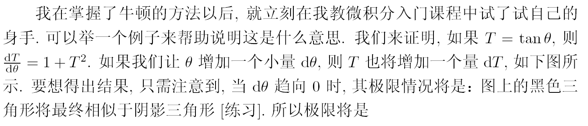

[TOC]


# 深入理解神经网络：从逻辑回归到CNN


What I cannot create I do not understand

Things Happen for A Reason


**强化学习** ，是一种通过教会智能体（agents）**反复试错从而完成任务的机器学习方法**。深度强化学习指的是强化学习和 深度学习的结合。—— **OpenAI — Spinning Up** [u](https://spinningup.readthedocs.io/zh_CN/latest/user/introduction.html)


选择 **PyTorch** 的重要原因是：**用它来实现各种新的想法特别容易**，特别是在 GPU 集群上。


**A MATLAB Package for Markov Chain Monte Carlo with a Multi-Unidimensional IRT Model** [u](https://www.jstatsoft.org/article/view/v028i10)

- **此网站论文+代码 全开放下载，概率统计专题**


```
Kaggle 是一个数据科学竞赛的平台，很多公司会发布一些接近真实业务的问题，吸引爱好数据科学的人来一起解决。
可以锻炼数据挖掘和机器学习技能
```


PyTorch入门: Kaggle 泰坦尼克幸存者预测 [u](https://magolor.cn/2020/01/12/2020-01-12-blog-01/)

- 入门很细致 [u](https://zhuanlan.zhihu.com/p/53176091)

- top 3% [u](https://zhuanlan.zhihu.com/p/50194676)


线代笔记 jupyter

https://github.com/MacroAnalyst/Linear_Algebra_With_Python


**OpenAI — Spinning Up** [u](https://spinningup.readthedocs.io/zh_CN/latest/user/introduction.html)

**Udacity — deep-learning**-v2-pytorch [u](https://github.com/udacity/deep-learning-v2-pytorch)

**Open AI Five Dota2** [u](https://aistudio.baidu.com/aistudio/projectdetail/632270)

DearPyGui 基础 [u](https://blog.csdn.net/hekaiyou/article/details/109386393)

DearPyGui 实现队列模型仿真[u](https://www.zhihu.com/zvideo/1307375212308856832)

**清华大学学位论文模板** [u](https://github.com/tuna/thuthesis)


**How Pytorch Backward() function works**


### 优化方法

> Diagonal Gaussian Likelihood 对角高斯似然


[PyTorch for Deep Learning - Full Course / Tutorial](https://www.youtube.com/watch?v=GIsg-ZUy0MY&ab_channel=freeCodeCamp.org)

> [Linear Regression with PyTorch](https://jovian.ai/aakashns/02-linear-regression)

李宏毅2020机器学习深度学习(完整版)国语

> [课程主页](http://speech.ee.ntu.edu.tw/~tlkagk/courses_ML20.html)
>
> [B站视频](https://www.bilibili.com/video/av94519857/)


[Pytorch autograd,backward详解](https://zhuanlan.zhihu.com/p/83172023)

[pytorch-tutorial-for-deep-learning-lovers](https://www.kaggle.com/kanncaa1/pytorch-tutorial-for-deep-learning-lovers)

[Yann LeCun 深度学习（Pytorch）2020 春季课程【官方字幕】](https://www.bilibili.com/video/av796677275/)

> [讲义](https://atcold.github.io/pytorch-Deep-Learning/)

[全-中英字幕-吴恩达 深度学习_Deep Learning_Pytorch特别制作版](https://www.bilibili.com/video/BV1BZ4y1M7hF/)

> [代码](https://gitee.com/inkCode/pytorch_tutorial)


SVD分解(一)：自编码器与人工智能 [u](https://kexue.fm/archives/4208)


深度神经网络（Deep Neural Networks， 简称DNN）是深度学习的基础


**算子就是变换的别名，而变换又是函数的花俏说法。**


函数是一种向量

函数可进行加和与数乘运算，而因为向量也不过只有相加和数乘两种运算，所以最初以空间中箭头为背景来建立的线性代数的合理概念和解决问题的手段，例如：**线性变换，列空间、点积、特征值、特征向量等，都能够直接应用于函数**。


映射是函数的推广，**雅可比是梯度的推广**

> 梯度是偏导的向量，雅可比是梯度的向量


一个多元函数求偏导，每一元就得到一个偏导，n元偏导组成一个向量，这就是梯度。

m个多元函数求偏导，每一函数得到一个梯度，m个梯度组成一个矩阵，这就是雅可比矩阵。


函数的输出是标量，映射的输入输出都是向量

> 单个神经元就是一个函数，神经网络的执行就是一个映射
>
> > m 组输入构成的**向量**是**神经网络(映射)**的输入，m个预测构成的**向量**是**神经网络(映射)**的输出


应用链式法则求**某节点对其他节点的雅可比矩阵**，它**从结果节点开始**，沿着计算路径向前追溯，**逐节点计算雅可比**。将神经网络和损失函数连接成一个计算图，则它的输入、输出和参数都是节点，可利用自动求导**求损失值对网络参数的雅可比**，从而得到梯度。


逻辑回归计算图，预测时将 $w$和$b$ 视为常量，将 $x$ 视为变量；训练时则将$x$ 视为常量，将 $w$ 和$b$ 视为变量。


梯度、散度、旋度、Jacobian、Hessian、Laplacian 的关系图 [u](https://zhuanlan.zhihu.com/p/35323714) [微分算子](https://zh.wikipedia.org/wiki/%E5%BE%AE%E5%88%86%E7%AE%97%E5%AD%90)


$X$ 是神经网络的输入，总共$m$ 组，每一组是一个$n$ 维向量


$$
X = 
\begin{bmatrix}
x^{1}_{1} & x^{1}_{1} & \cdots & x^{1}_{m}  \\
x^{2}_{1} & x^{2}_{1} & \cdots & x^{2}_{m} \\
\vdots & \vdots & \ddots & \vdots & \\
x^{n}_{1} & x^{n}_{1} & \cdots & x^{n}_{m} \\
\end{bmatrix}
$$


例如，与门(OR Gate) 的全部参数为：

$$
X = \begin{bmatrix}
0 & 0 & 1 & 1 \\
0 & 1 & 0 & 1 \\
\end{bmatrix}
\text {（与门的输入）}
$$

$$
Y =
\begin{bmatrix}
0 & 1 & 1 & 1 \\
\end{bmatrix}
\text{（与门的输出）}
$$

$$
W =
\begin{bmatrix}
w_1 & w_2  \\
\end{bmatrix}
\text{（线性变换，也就是权重）}
$$

$$
B =
\begin{bmatrix}
b_1 & b_2 & b_3 & b_4  \\
\end{bmatrix}
\text{（偏置）}
$$

维度检查：$(1 \times 2) (2 \times 4) \rightarrow (1 \times 4)$ 


前向传播的过程：

$$
f(W,X,B) = W \cdot X + B =

\begin{bmatrix}
w_1 & \cdots & w_n  \\
\end{bmatrix}

\cdot 

\begin{bmatrix}
x^{1}_{1} & x^{1}_{2} & \cdots & x^{1}_{m}  \\
x^{2}_{1} & x^{2}_{2} & \cdots & x^{2}_{m} \\
\vdots & \vdots & \ddots & \vdots & \\
x^{n}_{1} & x^{n}_{2} & \cdots & x^{n}_{m} \\
\end{bmatrix}

+ 

\begin{bmatrix}
b_1 & \cdots & b_m  \\
\end{bmatrix}

\\

= 

\begin{bmatrix}
W \cdot x_1 + b_1 & \cdots & W \cdot x_m + b_m \\
\end{bmatrix} \\
= 
\begin{bmatrix}
f'_1(W, x_1, b_1) & \cdots & f'_m(W, x_m, b_m) \\
\end{bmatrix}
$$

维度检查：$(1 \times n) (n \times m) \rightarrow (1 \times m)$ 


激活
$$
g(x) = \frac{1}{1 + e^{-x}}
$$

$$
g( f(W,X) ) = 
\begin{bmatrix}
g(f'_1(W, x_1)) & \cdots & g(f'_m(W, x_m)) \\
\end{bmatrix}
$$


$$
E =
g( f(W,X) ) - Y
=
\begin{bmatrix}
g(f'_1(W, x_1)) - y_1 & \cdots & g(f'_m(W, x_m)) - y_m \\
\end{bmatrix}
=
\begin{bmatrix}
e_{1} & \cdots & e_{m}
\end{bmatrix}
$$


均方误差代价函数
$$
J(W) = 
 \frac{1}{2m} \sum^{m}_{i=1}( g(f'(W, x_i, b_i)) - y_i )^2
$$

$$
f'(W, x_i, b_i) = W \cdot x_i + b_i \ , i \in 1 \cdots m \\
=
\begin{bmatrix}
w_1 & \cdots & w_n  \\
\end{bmatrix}

\cdot

\begin{bmatrix}
x^{1}_{i}   \\
x^{2}_{i}  \\
\vdots \\
x^{n}_{i} \\
\end{bmatrix}

+ b_i  \\

= w_1  x^1_i + w_2  x^2_i + \cdots + w_n  x^n_i + b_i
$$

$$
\frac{\partial}{\partial w_{j}} f'(W, x_i, b_i) = x^j_i \ , (j \in 1 \cdots n, i \in 1 \cdots m)
$$

$$
\frac{d}{d x} g(x) = \frac{d}{d x} (\frac{1}{1 + e^{-x}}) =  \frac{ - \frac{d}{d x} (1 + e^{-x}) }{(1 + e^{-x})^{2}} \\
= \frac{ - \frac{d}{dx} e^{-x} }{(1 + e^{-x})^{2}} = \frac{ - \frac{d}{dx} \frac{1}{e^{x}} }{(1 + e^{-x})^{2}} = \frac{ - (\frac{- \frac{d}{dx} e^x}{(e^x)^2}) }{(1 + e^{-x})^{2}} = \frac{e^{-x}}{(1 + e^{-x})^2} \\
= (\frac{1}{1+e^{-x}}) (\frac{e^{-x}}{1 + e^{-x}}) \\
= (\frac{1}{1+e^{-x}}) (\frac{1 + e^{-x}}{1 + e^{-x}} -\frac{1}{1 + e^{-x}}) \\
= g(x)(1 - g(x))
$$

$$
(f \circ g)'(x) = f'(g(x))g'(x)
$$


$$
\frac{\partial}{\partial w_j} J(W) =  \frac{1}{2m} \sum^{m}_{i=1}( g(f'(W, x_i, b_i)) - y_i )^2
$$


#### 计算图雅可比

[计算图反向传播的原理及实现](https://zhuanlan.zhihu.com/p/69175484)

[常见激活函数优缺点与dead relu problem](https://zhuanlan.zhihu.com/p/92412922)


反向传播的含义：被传播的是损失值对仿射值的偏导数

> 偏导从后往前乘，进而计算每一个权值和偏置的偏导，这就是反向传播


计算图中的一条有向路径表示一个映射


由 $x$计算 $y$ 是一个多重复合映射。如果$x$ 是 $n$ 维向量， $y$是$m$ 维向量，则该计算图表示的计算是一个$\mathbb{R}^n \rightarrow \mathbb{R}^m$ 的映射。这个映射的“导数”是一个 $m \times n$的矩阵，即雅可比矩阵。根据链式法则， $y$对$x$的雅可比矩阵是：
$$
\frac{\partial y}{\partial x} = \frac{\partial y}{\partial u^k} \frac{\partial u^k}{\partial u^{k-1}} \cdots \frac{\partial u^2}{\partial u^1} \frac{\partial u^1}{\partial x}
$$


上标表示层，输入是第$0$ 层，输出是第$K$ 层

第$1$ 到$K-1$ 层是隐层

$x^0_i$ 第$0$ 层输入向量的第$i$ 分量

$n_0$ 第$0$ 层总共有$n_0$ 个分量

$a^k_i$ 第$k$ 层第$i$ 个神经元的仿射值

$x^k_i$ 第$k$ 层第$i$ 个神经元的激活值

第$k$ 层有$n_k$ 个神经元，所以该层有$n_k$ 个输出


$$
x^k_i = f(a^k_i) = f(\sum^{n_{k-1}}_{s=1} w^k_{i,s} x^{k-1}_s + b^k_i)
$$


$$
a^k_i = \sum^{n_{k-1}}_{j=1} w^k_{i,j} x^{k-1}_j + b^k_i
$$

$$
\frac{\partial a^k_i}{\partial w^k_{i,j}} = x^{k-1}_j
$$
损失值$\mathcal{L}$  对$w^k_{i,j}$ 的偏导数由链式法则给出：
$$
\frac{ \partial{\mathcal{L}} } { \partial w^k_{i,j} } = 
\frac{ \partial{\mathcal{L}} } { \partial a^k_i }
\cdot
\frac{\partial a^k_i}{\partial w^k_{i,j}}
$$
既，损失值对某个权值的偏导，等于损失对映射值的偏导乘以映射值对权值的偏导

后偏导  * 前偏导 * 前前偏导 * ... 一直乘到要求的那个偏导

p.164 	


损失值对某个偏置的偏导
$$
\frac{ \partial{\mathcal{L}} } { \partial b^k_{i} } = 
\frac{ \partial{\mathcal{L}} } { \partial a^k_i }
\cdot
\frac{\partial a^k_i}{\partial b^k_{i}}
= \frac{ \partial{\mathcal{L}} } { \partial a^k_i }
$$


将激活值$x^k_i$ 看成是变量，同层的其他激活值是常量，则下一层神经元的仿射值由映射$g:\mathbb{R} \rightarrow \mathbb{R}^{n_{k+1}}$ 给出：


$$
g(x^k_i) = \begin{pmatrix}
a^{k+1}_1 \\
a^{k+1}_2 \\
\vdots \\
a^{k+1}_{n_{k+1}} \\
\end{pmatrix} 
= 
\begin{pmatrix}
\sum^{n_k}_{j=1} w^{k+1}_{1,j} x^k_j + b^{k+1}_1  \\
\sum^{n_k}_{j=1} w^{k+1}_{2,j} x^k_j + b^{k+1}_2  \\
\vdots \\
\sum^{n_k}_{j=1} w^{k+1}_{{n_{k+1}}, j} x^k_j + b^{k+1}_{n_{k+1}}  \\
\end{pmatrix}
$$


最后，映射$h:\mathbb{R}^{n_{k+1}} \rightarrow \mathbb{R}$ 将第$k+1$ 层的仿射值映射到损失值$\mathcal{L}$，若将损失值$\mathcal{L}$ 视作$a^k_i$ 的函数，则它是三个映射的复合： 


$$
\mathcal{L}(a^k_i) = (h \circ g \circ f)(a^k_i)
$$


$\mathcal{L}$ 对$a^k_i$ 的雅可比（导数）是这三个映射在相应位置的雅可比之积：


$$
\frac{\partial \mathcal{L}}{\partial a^k_i} = A_h \cdot A_g \cdot A_f
$$


向量导数的链式法则
$$
\vec{x} \in \mathbb{R}^m \ , \vec{y} \in \mathbb{R}^n  \\

g:\mathbb{R}^m \rightarrow \mathbb{R}^n， g(\vec{x}) = \vec{y}  \\
f:\mathbb{R}^n \rightarrow \mathbb{R}， f(\vec{y}) = z
$$


[详解Pytorch 自动微分里的（vector-Jacobian product）](https://zhuanlan.zhihu.com/p/65609544)

[带你少走弯路：强烈推荐的Pytorch快速入门资料和翻译](https://zhuanlan.zhihu.com/p/87263048)

[AI算法工程师手册](http://www.huaxiaozhuan.com/%E6%B7%B1%E5%BA%A6%E5%AD%A6%E4%B9%A0/chapters/2_bp.html)

[向量、矩阵和张量的导数](https://zhuanlan.zhihu.com/p/29502026)

[多元复合函数求导法则的教学思考](https://image.hanspub.org/Html/2-1250530_21119.htm)


### 多元复合函数求导法则

#### 导数是自变量因变量微小变化比

> 偏导数必须要先选取坐标（选取所有待求偏导的变量）以后，才有意义

[微积分本质](https://zhuanlan.zhihu.com/p/141064528)

 

##### Pytorch 计算雅可比

```python
x = torch.ones(3, requires_grad=True)
def calc(x):
	return torch.stack((x[0]**2+x[1], x[1]**2+x[2], x[2]**2))
jacobian = torch.autograd.functional.jacobian(calc, x)
```


##### vector-Jacobian product 

- $J \cdot v$ 中的v 是人为的给各**微量变化比加权重**，调大调小变化影响力

  > $J^T \cdot v$ 是列向量 [CSC321 Lecture 10：Automatic Differentiation]()
  >
  > $v^T \cdot J$ 是行向量

```python
x = torch.ones(3, requires_grad=True)
y = torch.stack((x[0]**2+x[1], x[1]**2+x[2], x[2]**2))
v = torch.tensor([3, 5, 7])
y.backward(v)
print(x.grad)
```


一个函数的变换是线性的是什么意思?

> Additivity: $L(\overrightarrow{v}+\overrightarrow{w}) = L(\overrightarrow{v})+L(\overrightarrow{w})$
> Scaling: $L(c \overrightarrow{v}) = c L(\overrightarrow{v})$


#### 求导就是一种线性运算，它将一个函数变成另一个函数

他符合以上两个条件


**将曲的函数图像掰直**，掰直的图像就是导函数


**梯度属于向量分析（或向量微積分）的范畴**


$$
A_{g} = \begin{pmatrix} 
\nabla y_1(X)^T \\

\vdots \\

\nabla y_n(X)^T \\
\end{pmatrix}

= 

\begin{pmatrix} 
\frac{\partial y_1}{\partial x_1} & \cdots & \frac{\partial y_1}{\partial x_m}\\


\vdots & \ddots & \vdots \\ 

\frac{\partial y_n}{\partial x_1} & \cdots & \frac{\partial y_n}{\partial x_m}\\

\end{pmatrix}
$$


$$
g:\mathbb{R}^m \rightarrow \mathbb{R}^n
$$


$$
g \bigg (
\begin{bmatrix}
x_{1}  \\
x_{2}  \\
\vdots  \\
x_{m} \\
\end{bmatrix}
\bigg ) 
=
\begin{bmatrix}
y_{1}  \\
y_{2}  \\
\vdots  \\
y_{n} \\
\end{bmatrix}
$$


$$
A_{f} = \nabla z(Y)^T =

\begin{pmatrix} 
\frac{\partial z}{\partial y_1} & \cdots & \frac{\partial z}{\partial y_n}\\
\end{pmatrix}
$$

$$
f:\mathbb{R}^n \rightarrow \mathbb{R}
$$

$$
f \bigg (
\begin{bmatrix}
y_{1}  \\
y_{2}  \\
\vdots  \\
y_{n} \\
\end{bmatrix}
\bigg ) 
= z
$$


$$
Jacobi(f \oplus g)_{(1 \times m)} = A_f \cdot A_g = \begin{pmatrix} 
\frac{\partial z}{\partial y_1} & \cdots & \frac{\partial z}{\partial y_n}\\
\end{pmatrix}

\begin{pmatrix} 
\frac{\partial y_1}{\partial x_1} & \cdots & \frac{\partial y_1}{\partial x_m}\\


\vdots & \ddots & \vdots \\ 

\frac{\partial y_n}{\partial x_1} & \cdots & \frac{\partial y_n}{\partial x_m}\\

\end{pmatrix}
$$

$$
Jacobi(f \oplus g)_{1,j} = \frac{\partial z}{\partial x_j}  = \sum^n_{s=1} \frac{\partial z}{\partial y_s} \frac{\partial y_s}{\partial x_j} , \ for \ j \in 1 ... m
$$

​	


$$
a^1_{i,*}:\mathbb{R}^{(1 \times n)} \rightarrow \mathbb{R}^{1 \times m}, for \ i \in 1...n
$$

$$
A_{a^1_{i,*}} = \begin{pmatrix} 
\nabla a^1_{i,1}(W^1_{i,*})^T \\

\vdots \\

\nabla a^1_{i,m}(W^1_{i,*})^T \\
\end{pmatrix}

=

\begin{pmatrix} 
\frac{\partial a^1_{i,1}}{\partial w_{i,1}} & \cdots & \frac{\partial a^1_{i,1}}{\partial w_{i,n}} \\


\vdots & \ddots & \vdots \\ 

\frac{\partial a^1_{i,m}}{\partial w_{i,1}} & \cdots & \frac{\partial a^1_{i,m}}{\partial w_{1,n}} \\

\end{pmatrix}
$$

$$
\begin{bmatrix}
w^{1}_{1,1} & w^{1}_{1,2} & \cdots & w^{1}_{1,n}  \\
w^{1}_{2,1} & w^{1}_{2,2} & \cdots & w^{1}_{2,n} \\
\vdots & \vdots & \ddots & \vdots & \\
w^{1}_{n,1} & w^{1}_{n,2} & \cdots & w^{1}_{n,n} \\
\end{bmatrix}

\cdot 

\begin{bmatrix}
x^{0}_{1,1} & x^{0}_{1,2} & \cdots & x^{0}_{1,m}  \\
x^{0}_{2,1} & x^{0}_{2,2} & \cdots & x^{0}_{2,m} \\
\vdots & \vdots & \ddots & \vdots & \\
x^{0}_{n,1} & x^{0}_{n,2} & \cdots & x^{0}_{n,m} \\
\end{bmatrix}

+ 

\begin{bmatrix}
b^{1}_{1,1} & b^{1}_{1,2} & \cdots & b^{1}_{1,m}  \\
b^{1}_{2,1} & b^{1}_{2,2} & \cdots & b^{1}_{2,m} \\
\vdots & \vdots & \ddots & \vdots & \\
b^{1}_{n,1} & b^{1}_{n,2} & \cdots & b^{1}_{n,m} \\
\end{bmatrix}

\\

= 

\begin{bmatrix}
a^{1}_{1,1} & a^{1}_{1,2} & \cdots & a^{1}_{1,m}  \\
a^{1}_{2,1} & a^{1}_{2,2} & \cdots & a^{1}_{2,m} \\
\vdots & \vdots & \ddots & \vdots & \\
a^{1}_{n,1} & a^{1}_{n,2} & \cdots & a^{1}_{n,m} \\
\end{bmatrix}
$$

$$
A_{x^1_{i,*}} = \begin{pmatrix} 
\nabla x^1_{i,1}(a^1_{i,*})^T \\

\vdots \\

\nabla x ^1_{i,m}(a^1_{i,*})^T \\
\end{pmatrix}

=

\begin{pmatrix} 
\frac{\partial x^1_{i,1}}{\partial a^1_{i,1}} \\


\vdots \\

\frac{\partial x^1_{i,m}}{\partial a^1_{i,1}} \\

\end{pmatrix}
$$

$$
g \bigg (
\begin{bmatrix}
a^{1}_{1,1} & a^{1}_{1,2} & \cdots & a^{1}_{1,m}  \\
a^{1}_{2,1} & a^{1}_{2,2} & \cdots & a^{1}_{2,m} \\
\vdots & \vdots & \ddots & \vdots & \\
a^{1}_{n,1} & a^{1}_{n,2} & \cdots & a^{1}_{n,m} \\
\end{bmatrix}
\bigg )

= 

\begin{bmatrix}
x^{1}_{1,1} & x^{1}_{1,2} & \cdots & x^{1}_{1,m}  \\
x^{1}_{2,1} & x^{1}_{2,2} & \cdots & x^{1}_{2,m} \\
\vdots & \vdots & \ddots & \vdots & \\
x^{1}_{n,1} & x^{1}_{n,2} & \cdots & x^{1}_{n,m} \\
\end{bmatrix}
$$


$$
\frac{\mathrm{d} z}{ \mathrm{d} X } = \frac{\mathrm{d} z}{ \mathrm{d} Y } \frac{\mathrm{d} Y}{ \mathrm{d}X }
$$

$$
\frac{\mathrm{d} z}{ \mathrm{d} Y } =

\begin{bmatrix}
\frac{\partial z}{\partial y_{1}}  \\
\frac{\partial z}{\partial y_{2}}  \\
\vdots  \\
\frac{\partial z}{\partial y_{n}} \\
\end{bmatrix}
$$

$$
\frac{\mathrm{d} Y}{ \mathrm{d} X } =

\begin{bmatrix}
\frac{\partial Y}{\partial x_{1}}  &
\frac{\partial Y}{\partial x_{2}}  &
\cdots  
\frac{\partial Y}{\partial x_{m}} &
\end{bmatrix} 
=

\begin{bmatrix}
\frac{\partial y_1}{\partial x_{1}} & \frac{\partial y_2}{\partial x_{1}} & \cdots & \frac{\partial y_n}{\partial x_{1}} \\

\frac{\partial y_1}{\partial x_{2}} & \frac{\partial y_2}{\partial x_{2}} & \cdots & \frac{\partial y_n}{\partial x_{2}} \\

\vdots  & \vdots & \ddots & \vdots\\

\frac{\partial y_1}{\partial x_{m}} & \frac{\partial y_2}{\partial x_{m}} & \cdots & \frac{\partial y_n}{\partial x_{m}} \\

\end{bmatrix}
$$

(1,n)(n,m)->(1,m)

(m,n)(n,1)->(m,1)

$$
\frac{\partial z}{\partial x_i} = \sum^n_{j=1} \frac{\partial z}{\partial y_j} \frac{\partial y_j}{\partial x_i} , \ i = 1, 2, \cdots ,m
$$


映射是函数的推广，**雅可比是梯度的推广**

> 梯度是偏导的向量，雅可比是梯度的向量
>
> 有些教材认为，实值函数对列向量求导的结果是**列向量**，有些教材认为上述结果需要再做一次转置，即梯度是**行向量**


一个多元函数求偏导，每一元就得到一个偏导，n元偏导组成一个向量，这就是梯度。

m个多元函数求偏导，每一函数得到一个梯度，m个梯度组成一个矩阵，这就是雅可比矩阵。


$$
\frac{\partial}{\partial w_{j}}
J(W) = 
 \frac{\partial}{\partial w_{j}} \bigg [ \frac{1}{2m} \sum^{m}_{i=1}( g(f'(W, x_i)) - y_i )^2
 
 \bigg ] \\
 
 = \frac{1}{2m} \sum^{m}_{i=1}\frac{\partial}{\partial w_{j}} ( g(f'(W, x_i)) - y_i )^2   \quad \text{(by linearity of the derivative)} \\
= \frac{1}{2m} \sum^{m}_{i=1} 

2 \cdot ( g(f'(W, x_i)) - y_i ) \frac{\partial}{\partial w_{j}} ( g(f'(W, x_i)) - y_i )   \quad \text{(by chain rule)} \\
= \frac{1}{2m} \cdot 2 \sum^{m}_{i=1} 

( g(f'(W, x_i)) - y_i ) \bigg [ \frac{\partial}{\partial w_{j}} g(f'(W, x_i)) - \frac{\partial}{\partial w_{j}} y_{i} \bigg ]  \quad \text{(by linearity of the derivative)}  \\
= \frac{1}{m} \sum^{m}_{i=1} 

(g(f'(W, x_i)) - y_{i}) \bigg [ \frac{\partial}{\partial w_{j}} g(f'(W, x_i)) - 0 \bigg ]   \\

= \frac{1}{m} \sum^{m}_{i=1} 

(g(f'(W, x_i)) - y_{i}) \frac{\partial}{\partial w_{j}} g(f'(W, x_i))     \\
= \frac{1}{m} \sum^{m}_{i=1} 

(g(f'(W, x_i)) - y_{i}) g(f'(W, x_i))(1 - g(f'(W, x_i))) x^{i}_{j}
$$


梯度是偏导的向量，雅可比是梯度的向量

$$
a_i = \nabla f'_i(W, x_i) = \begin{pmatrix} \frac{\partial{f'_i(W, x_i)}}{\partial{w_1}} \\ \vdots \\ \frac{\partial{f'_i(W, x_i)}}{\partial{w_n}}  \end{pmatrix}
, i \in 1 \cdots m
$$

$$
A_{m \times n} = \begin{pmatrix}
(a_{1})^{T} \\
\vdots \\
(a_{m})^{T}
\end{pmatrix}
$$


$A$ 就是$f(W,X)$ 的雅可比矩阵
$$
f(W+h,X) = f(W, X) + A h
$$


$f(W+h, X)$ 可被**$f(W, X) + A h$** 近似，近似误差随$h$ 趋于零向量而**迅速消失**


#### 神经网络雅可比

$f(x+h) = f(x) + A h$

> $A$ 是$f$ 的雅可比


$(a_{i,*})^T$ 是矩阵A 的第$i$ 行，$a_{i,*}$ 是函数$f^i(x)$ 在$x$ 的梯度：
$$
a_{i,*} = \nabla f^i(x) = \begin{pmatrix} \frac{\partial{f^i(x)}}{\partial{x_1}} \\ \vdots \\ \frac{\partial{f^i(x)}}{\partial{x_n}}  \end{pmatrix}
$$

$$
A_{m \times n} = \begin{pmatrix} \frac{\partial{f^i(x)}}{\partial{x_1}} & \cdots & \frac{\partial{f^i(x)}}{\partial{x_n}} \\
\vdots & \ddots & \vdots \\
\frac{\partial{f^m(x)}}{\partial{x_1}} & \cdots & \frac{\partial{f^m(x)}}{\partial{x_n}}
\end{pmatrix}
$$


$f'':\mathbb{R}^n \rightarrow \mathbb{R}^1$ 是一个线性函数

$$
f''(x_i) = W \cdot \ x_i \ , i \in 1 \cdots m
$$

> 线性函数，等同于线性变换，函数又可以认为是一种向量
>
> 所以这里的指的线性变换就是权重向量$W$，$W$对$x_i$ 进行了线性变换
>
> 维度变化：$(1 \times n) (n \times 1) \rightarrow (1 \times 1)$ ，所以线性变换$W$ **的维度是$(1 \times n)$**
>
> > 读作：线性变换将$1$ 个$n$ 维向量变换成$1$ 个 $1$ 维向量 


$f'$ 是一个仿射函数
$$
f'(x_i) = W \cdot \ x_i + b_i \ , i \in 1 \cdots m
$$

> 仿射函数是一个线性函数加上一个常量
>
> $b_i$ 的维度是$(1 \times 1)$ ，$B$ 的维度是$(1 \times m)$ 


$f$ 是一个仿射映射
$$
f(X) = \begin{bmatrix} f'_1(x_{1}) & \cdots &  f'_m(x_{m}) \end{bmatrix} = W \cdot X + B \\
=
\begin{bmatrix}
w_1 & \cdots & w_n  \\
\end{bmatrix}

\cdot 

\begin{bmatrix}
x^{1}_{1} & x^{1}_{2} & \cdots & x^{1}_{m}  \\
x^{2}_{1} & x^{2}_{2} & \cdots & x^{2}_{m} \\
\vdots & \vdots & \ddots & \vdots & \\
x^{n}_{1} & x^{n}_{2} & \cdots & x^{n}_{m} \\
\end{bmatrix}

+ 

\begin{bmatrix}
b_1 & \cdots & b_m  \\
\end{bmatrix}
$$

> 仿射映射可以看作由若干个仿射函数组成
>
> 大写的$X$ 表示这是一个矩阵
>
> 小写的$x$ 表示这是一个向量，$x$ 的下标表示这是一个列向量，下标的数字指出它是矩阵中的第几列


$$
\begin{bmatrix}
w_1 & \cdots & w_n  \\
\end{bmatrix}

\cdot 

\begin{bmatrix}
x^{1}_{1} & x^{1}_{2} & \cdots & x^{1}_{m}  \\
x^{2}_{1} & x^{2}_{2} & \cdots & x^{2}_{m} \\
\vdots & \vdots & \ddots & \vdots & \\
x^{n}_{1} & x^{n}_{2} & \cdots & x^{n}_{m} \\
\end{bmatrix}

+ 

\begin{bmatrix}
b_1 & \cdots & b_m  \\
\end{bmatrix}
$$


如果映射$f:\mathbb{R}^{n \times m} \rightarrow \mathbb{R}^m$ 在自变量$x$ 附近可以写成：
$$
f(x+h) = f(x) + A h + \mathcal{R}(h)
$$


$A$ 由$x$ 决定，余项$\mathcal{R}(h)$ 是$m$ 维向量，满足：


其中：
$$
X = 
\begin{bmatrix}
x^{1}_{0} & x^{1}_{1} & \cdots & x^{1}_{n}  \\
x^{2}_{0} & x^{2}_{1} & \cdots & x^{2}_{n} \\
\vdots & \vdots & \ddots & \vdots & \\
x^{m}_{0} & x^{m}_{1} & \cdots & x^{m}_{n} \\
\end{bmatrix}
$$


与门(OR) 运算实际上就是一个仿射映射


$$
X = \begin{bmatrix}
0 & 0 \\
0 & 1 \\
1 & 0 \\
1 & 1 \\
\end{bmatrix}
\text {（与门的输入）}
$$

$$
Y =
\begin{bmatrix}
0  \\
1  \\
1  \\
1  \\
\end{bmatrix}
\text{（与门的输出）}
$$

如何找到从$x$ 到$y$ 的线性变换（也就是w）？

> 既找到一个线性函数，将$X$ 中的行向量$x$ 变换到$Y$ 中的行向量$y$ 


$f:\mathbb{R}^n \rightarrow \mathbb{R}^m$ 是线性映射，必然存在一个$m \times n$ 的矩阵A，对任意$\vec{x} \in \mathbb{R}^n$ 满足：
$$
f(\vec{x}) = A \vec{x}
$$

> $A$ 是一个$m \times n$ 的矩阵，这个矩阵本身就是线性变换
>
> - 注意前面函数就是向量这个事实，$f$ 就是线性变换，$f$ 和$A$ 是同一个东西
>
> 为什么从$n$ 维到$m$ 维向量的线性映射的维度是$m \times n$ ?
>
> > **一个矩阵代表一个线性变换，矩阵的列是变换后的新空间的基向量**
> >
> > > 新基向量的线性组合构成了新向量
> > >
> > > 实际上是整个空间被变换了，原基向量被变换成了新基向量，原空间里的所有向量也跟着被变换了
> > > $m \times n$ 的含义是$n$ 个$m$ 维基向量，也就是说这个新空间是$m$ 维的（如果每个基向量都能贡献新维度的话，也就是说它们是线性独立的）
> > >
> > > **原向量所有维度上的点作为数乘，数乘$n$ 个$m$ 维基向量，就得到了新空间的向量。这就是线性组合**
> > >
> > > > **数乘本身在变换中保持不变，变化的实际上是基向量**。因为原向量可以表示成原基向量的数乘，新向量也可以表示成新基向量的数乘，而这两者的数乘是完全一样的
>
> 维度检查：$(m \times n) (n \times 1) \rightarrow (m \times 1)$ 
>
> > **读作：$n$ 个$m$ 维向量将$1$ 个$n$ 维向量线性变换成$1$ 个$m$ 维向量**


与门(OR) 运算的仿性映射$f$ 表示为：
$$
f(X) = W \cdot X + B = Y
$$
其中$X$ 的维度是$(2 \times 4)$，$Y$ 的维度是$(1 \times 4)$

> 将4 个2 维向量，线性变换成4个1 维向量
>
> 这个变换$W$ 的维度是$(1 \times 2)$
>
> 维度检查：$(1 \times 2) (2 \times 4) \rightarrow (1 \times 4)$ 


$$
X = \begin{bmatrix}
0 & 0 & 1 & 1 \\
0 & 1 & 0 & 1 \\
\end{bmatrix}
\text {（与门的输入）}
$$

$$
Y =
\begin{bmatrix}
0 & 1 & 1 & 1 \\
\end{bmatrix}
\text{（与门的输出）}
$$

$$
W =
\begin{bmatrix}
w_1 & w_2  \\
\end{bmatrix}
\text{（线性变换）}
$$

$$
B =
\begin{bmatrix}
b_1 & b_2 & b_3 & b_4  \\
\end{bmatrix}
\text{（偏置）}
$$


前向


$$
h_{W}(X) =
W \cdot X
=
\begin{bmatrix}
w_1 & w_2  \\
\end{bmatrix}

\cdot

\begin{bmatrix}
0 & 0 & 1 & 1 \\
0 & 1 & 0 & 1 \\
\end{bmatrix}
$$


**w 是一个法向量(一根掍)，同时也是一个线性变换**。它将垂直于w 的平面上的所有点全部变换成自身的某一点（既棍上的一点）（这是**投影变换**？对应的应该还有一个**内积变换**？）

投影是线性变换的同义词，投影向量的模长是垂直法向量的平面的截距

- 这个截距就是仿射变换中的常数b


$$
h_{W}(X) =
X \cdot W
=
\begin{bmatrix}
x^{1}_{0} & x^{1}_{1} & \cdots & x^{1}_{n}  \\
x^{2}_{0} & x^{2}_{1} & \cdots & x^{2}_{n} \\
\vdots & \vdots & \ddots & \vdots & \\
x^{m}_{0} & x^{m}_{1} & \cdots & x^{m}_{n} \\
\end{bmatrix}
\cdot
\begin{bmatrix}
w_{0}  \\
w_{1}  \\
\vdots \\
w_{n}  \\
\end{bmatrix}
=
\begin{bmatrix}
w_{0} x^{1}_{0} + w_{1} x^{1}_{1} + \ \cdots \  + w_{n} x^{1}_{n}  \\
w_{0} x^{2}_{0} + w_{1} x^{2}_{1} +\ \cdots \  + w_{n} x^{2}_{n}  \\
\vdots \\
w_{0} x^{m}_{0} + w_{1} x^{m}_{1} + \ \cdots \  + w_{n} x^{m}_{n}  \\
\end{bmatrix}  \\
=
\begin{bmatrix}
h_{W}(x^{^{(1)}}) \\
h_{W}(x^{^{(2)}})  \\
...  \\
h_{W}(x^{^{(m)}}) \\
\end{bmatrix}
$$


仿射映射可以看作由若干个仿射函数组成


## 反向传播

若要透彻理解反向传播算法的原理，需要掌握**映射、仿射映射、雅可比矩阵，以及映射求导的链式法则**。

映射是函数的推广，雅可比矩阵是梯度的推广


反向传播是**计算损失函数对**神经网络**权值和偏置的偏导数**的算法。有了偏导数也就有了**梯度**，然后利用**梯度下降算法更新权值和偏置**


**狭义的反向传播只适用于多层全连接神经网络**，它是计算图自动求导的一个特例


### 映射(map)

**函数的输出是标量**，既实数。映射是函数的推广，**映射的输入输出都是向量**。函数是映射的特例，因为**标量是一维向量**。

单个神经元就是一个函数，神经网络的执行就是一个映射。


#### 线性映射

$\vec{x}, \vec{y}$ 是任意向量，$a, b$ 是任意实数，如果映射$f:\mathbb{R}^n \rightarrow \mathbb{R}^m$满足：
$$
f(a \vec{x}+b\vec{y}) = af(\vec{x}) + bf(\vec{y})
$$

**则称$f$ 是线性映射**(linear map)

> 可以将$f$ 看成一个变换矩阵，$\vec{x}, \vec{y}$ 看成基向量，$a \vec{x}+b\vec{y}$ 是基向量的线性组合得到的一个新向量，
>
> 整个操作是：对向量进行变换，等同于先分别对向量的分量中的基向量进行变换，然后再把数乘(模长的缩放)放进来


$f:\mathbb{R}^n \rightarrow \mathbb{R}^m$ 是线性映射，必然存在一个$m \times n$ 的矩阵A，对任意$\vec{x} \in \mathbb{R}^n$ 满足：
$$
f(\vec{x}) = A \vec{x}
$$

> 维度检查：$(m \times n) (n \times 1) \rightarrow (m \times 1)$ 


证明：

任意 $\vec{x} \in \mathbb{R}^n$ 必然能够以**标准正交基**的线性组合表示：
$$
\vec{x} = \sum^n_{i=1} x_i e^i
$$

因为$f$ 是线性映射，所以：

$$
f(\vec{x}) = f(\sum^n_{i=1} x_i e^i ) = \sum^n_{i=1} x_i f(e^i) = (f(e^1)\  \cdots \ f(e^n)) \begin{pmatrix} x_1 \\ \vdots \\ x_n \end{pmatrix} = A \ \vec{x}
$$

> 整个操作是：对向量进行变换，等同于先分别对向量的分量中的基向量进行变换，然后再把数乘(模长的缩放)放进来

$f:\mathbb{R}^n \rightarrow \mathbb{R}^m$ ，所以$e^i$ 是n 维列向量，$f(e^i)$ 是m 维列向量，$
A$ 是 $m \times n$ 矩阵(**$n$ 个$m$ 维向量** )。

 

线性映射必将$\mathbb{R^n}$ 中的零向量映射到$\mathbb{R^m}$  中的零向量，因为：

$$
f(0) = A \ 0 = 0
$$


#### 仿射映射


仿射映射(affine map)是线性映射加上一个常向量，b：
$$
f(x) = A \ x + b
$$


如果b 不是零向量，则仿射映射不保持零向量。仿射映射可以看作由若干个仿射函数组成：
$$
f(x) = \begin{pmatrix} f^1(x) \\ \vdots \\ f^m(x) \end{pmatrix} = A \ x + b = \begin{pmatrix} (a_{1, \ *})^T x + b_1 \\ \vdots \\ (a_{m, \ *})^T x + b_m \end{pmatrix}
$$


$f$ 的第$i$ 分量用$f^i$ 表示，$(a_{i,*})^T$ 是矩阵A 的第$i$ 行。$f^i$ **是输出为标量的函数。**


#### 雅可比矩阵

[计算图反向传播的原理及实现](https://zhuanlan.zhihu.com/p/69175484)

[“瞬时运动学”——还是从关节空间到操作空间（雅可比矩阵上篇）](https://www.guyuehome.com/5627)

你还需要懂得简单的**向量求导运算**——其实很简单啦，如果你不知道怎么对向量求导，那就把它当一列标量一个一个写出来，比如这样：


 

不知道行列怎么分布？把分母乘到右边，算一下**左边是3×1向量，右边是3×2矩阵乘以2×1向量 = 3×1向量**，左右相等，搞定！简单粗暴，方便有效。哎呀，一不小心，把**雅可比矩阵（Jacobian Matrix）**都给写出来了呢。（想要知道数学上是怎么定义推导出向量求导方法的请去上数学课，我只负责教你记住啦:p）


如果映射$f:\mathbb{R}^n \rightarrow \mathbb{R}^m$ 在自变量$x$ 附近可以写成：
$$
f(x+h) = f(x) + A h + \mathcal{R}(h)
$$


$A$ 由$x$ 决定，余项$\mathcal{R}(h)$ 是$m$ 维向量，满足：
$$
lim_{\|\boldsymbol{h}\| \rightarrow 0} \frac{\mathcal{R}(h)}{\|\boldsymbol{h}\|} = 0
$$

则称映射$f$ 在$x$ 可导。**$A$ 是$f$ 在$x$ 的雅可比矩阵( Jacobian matrix )**，简称雅可比。

这种情况意味着，$f(x+h)$ 可被**仿射映射$f(x) + A h$** 近似，近似误差随$h$ 趋于零向量而**迅速消失**——误差的每个分量都是$\|\boldsymbol{h}\|$ 的**高阶无穷小**。

> **大家都是无穷小，都趋向于零，谁跑得快谁就是高阶**
>
> 高阶无穷小是一个比较，即在两个无穷小之间的比较一个相对于另一个是高阶。
> 那么什么是高阶呢，无穷小都趋向于零，一个无穷小**比另一个趋向于0的速度更快**，那就是高阶无穷小。
>
> 一条直线上的点的数量是无穷多个，记为n。
> 两条直线上的点的数量也是无穷多个，记为m。
> 一个平面上的点的数量也是无穷多个，记为l。
>
> 有以下几个结论：
> l>>m
> l >>n
> m~n
> 所以l就是m和n的高阶无穷大。
> 在以上空间任选某点选中任意点的概率就是1/n,1/m,1/l，其中1/l就是1/n,1/m的高阶无穷小。


$(a_{i,*})^T$ 是矩阵A 的第$i$ 行，$a_{i,*}$ 是函数$f^i(x)$ 在$x$ 的梯度：
$$
a_{i,*} = \nabla f^i(x) = \begin{pmatrix} \frac{\partial{f^i(x)}}{\partial{x_1}} \\ \vdots \\ \frac{\partial{f^i(x)}}{\partial{x_n}}  \end{pmatrix}
$$

$$
A_{m \times n} = \begin{pmatrix} \frac{\partial{f^i(x)}}{\partial{x_1}} & \cdots & \frac{\partial{f^i(x)}}{\partial{x_n}} \\
\vdots & \ddots & \vdots \\
\frac{\partial{f^m(x)}}{\partial{x_1}} & \cdots & \frac{\partial{f^m(x)}}{\partial{x_n}}
\end{pmatrix}
$$


映射是函数的推广，**雅可比是梯度的推广**

https://blog.csdn.net/m0_46510245/article/details/108614235


#### 平面的倾斜程度与法向量的模长有关

#### 平面的朝向由法向量在平面上的投影决定


仿射函数
$$
y = b + \sum^{n}_{i=1} w_i x_i
$$

$$
w_1 x_1 + w_2 x_2 - y = (w_1, w_2, -1) \begin{pmatrix} x_1 \\ x_2 \\ y \end{pmatrix} = -b
$$

内积为常数，也就是说**仿射变换的图像是3维空间中的一张平面**。

> **点积是把向量从二维变换到一维，然后缩放**
>
> - 缩放的数乘就是另一个向量的模长


变换前是
$$
\begin{bmatrix}
x_1 \ \text{i-hat} \\
x_2 \ \text{j-hat} \\
y \ \ \text{k-hat} \\
\end{bmatrix}
$$
也就是
$$
\begin{bmatrix}
 1 \ \text{i-hat} * x_1 \\
1 \ \text{j-hat} * x_2 \\
1 \ \ \text{k-hat} * y \\
\end{bmatrix}
$$


首先把基向量 $(1 \ \text{i-hat}, 1 \ \text{j-hat}, 1 \ \ \text{k-hat} )^T$ 变换成新的基向量：
$$
\begin{bmatrix}
w_1 \ \text{i-hat} & w_2 \ \text{i-hat} & -1\ \ \text{i-hat}
\end{bmatrix}
$$
所以，**三个不同维度的向量(共同构成原空间的基)线性变换成同一维度的三个向量(构成新空间的基)**：

- $1 \ \text{i-hat} \rightarrow w_1 \ \text{i-hat}$
- $1 \ \text{j-hat} \rightarrow w_2 \ \text{i-hat}$
- $1 \ \text{k-hat} \rightarrow -1 \ \text{i-hat}$

三个相同维度的向量，其中只有一个能贡献新的维度，所以它们是**线性相关的**


然后，把原来的数乘（缩放）放进来就得到**真实变换后的向量**：

- $w_1 \ \text{i-hat} \rightarrow w_1 * x_1 \ \text{i-hat}$ 
- $w_2 \ \text{j-hat} \rightarrow w_2 * x_2 \ \text{i-hat}$
- $-1 \ \text{k-hat} \rightarrow -1 * y \ \text{i-hat}$


#### 内积就是线性变换

##### 变换后的向量等于它在各数轴上（或者说各基向量）的投影向量之和

##### 所有投影向量的和等于本体

所以，

> 就是说，你看到的变换结果是一个**标量**，实际上**它还有一个隐藏的量纲**：i-hat j-hat k-hat 之类的，指出它是属于哪个数轴。
>
> 而且这个标量实际上是若干个分向量的和，这些分向量加起来等于这个标量


# 内积是线性变换，变换的结果是"本体"在数轴上（或者说基向量上）所有投影的和

$$
\begin{align}
(w_1, w_2, -1) \begin{pmatrix} x_1 \\ x_2 \\ y \end{pmatrix} &=
w_1 * x_1 \ \text{i-hat} + w_2 * x_2 \ \text{i-hat} + -1 * y \ \text{i-hat}
\\
&= -b 
\end{align}
$$

## 所有投影(所有到基向量的投影之和等于它自身)都变换到同一个数轴上了，这使得内积的值是一个常量


w 是法向量，-b 的绝对值是平面的截距


$$
w = (0.1, -0.2, -1)^T \\
w' = (0.1, -0.2, 0)^T \\
$$

$$
向量可以看成一个点，也可以看成\textbf{从原点指向这个点的箭头} \\
\\
w' 是w 在x_1x_2 平面上的投影，它决定了平面的朝向(我觉得是决定了平面的斜率？) \\
w_1 \ w_2 绝对值的大小决定了平面的倾斜程度
$$


所有与w 的内积为常数的向量组成一个**垂直于w 的平面**

> 内积是投影乘棍长，内积是常数棍长也是长数(w的模长)，所以**投影也是常数**(准确的说是**投影向量的模长**)
>
> **w 是一个法向量(一根掍)，同时也是一个线性变换**。它将平面上的所有点全部变换成自身的某一点（既棍上的一点）
>
> 投影是线性变换的同义词，投影向量的模长是垂直法向量的平面的截距
>
> - 这个截距就是仿射变换中的常数b


```python
import numpy as np
import matplotlib.pyplot as plt
from mpl_toolkits.mplot3d import proj3d
from matplotlib.patches import FancyArrowPatch
from mpl_toolkits.mplot3d import Axes3D

SQUARE_FIG_SIZE = (10 ,10)
AXIS_LABEL_FONT_SIZE = 16
TEXT_FONT_SIZE = 16
ALPHA = 0.3
LIGHT_ALPHA = 0.1


fig = plt.figure(figsize=np.array(SQUARE_FIG_SIZE) * 2, facecolor='white')

T = "\mathrm{T}"

ax = fig.add_subplot(2, 2, 1, projection="3d")
ax.set_xlim([-2, 2])
ax.set_ylim([-2, 2])
ax.set_zlim([-2, 2])

class Arrow3D(FancyArrowPatch):
    def __init__(self, xs, ys, zs, *args, **kwargs):
        FancyArrowPatch.__init__(self, (0,0), (0,0), *args, **kwargs)
        self._verts3d = xs, ys, zs
 
    def draw(self, renderer):
        xs3d, ys3d, zs3d = self._verts3d
        xs, ys, zs = proj3d.proj_transform(xs3d, ys3d, zs3d, renderer.M)
        self.set_positions((xs[0],ys[0]),(xs[1],ys[1]))
        FancyArrowPatch.draw(self, renderer)
 
    def set_data(self, xs, ys, zs):
        self._verts3d = xs, ys, zs

    # 画简头，从p1 指向p2        
def drawArrow(p1, p2, ax):
    pts = np.array([ p1, p2 ], np.float).T  
    arrow = Arrow3D(pts[0], pts[1], pts[2], arrowstyle="-|>", lw=1,mutation_scale=10,color="black")
    ax.add_artist(arrow)

    # 画虚线 p1 [x, y, z] 坐标 p2 [x, y, z] 坐标 
def drawDashe(p1, p2, ax):
    pts = np.array([ p1, p2 ], np.float).T
    ax.plot((pts[0][0], pts[0][1]), (pts[1][0], pts[1][1]), (pts[2][0], pts[2][1]), "k--", alpha=ALPHA)

    # 画平面 corner4hight: 4 个角的高度
def drawPlane(ax, w, DrawScatter=False):
    x1 = np.linspace(-1.5, 1.5, endpoint=True, num=2)
    x2 = np.linspace(-1.5, 1.5, endpoint=True, num=2)
    x1, x2 = np.meshgrid(x1, x2)
    x1, x2 = x1.flatten(), x2.flatten()
    x3 = w[0] * x1 + w[1] * x2
    print("----->x3:", x3)
    if DrawScatter:
        #ax.scatter(x1, x2, x3, c=[0, 2.7, -2.7,  2.1], cmap='viridis', linewidth=0.5)
        ax.scatter(x1, x2, x3, c=['g', 'r', 'g',  'g'], linewidth=0.5)
    ax.plot_trisurf(x1, x2, x3, antialiased=True, alpha=LIGHT_ALPHA, color="black")

    
# ax.set_title(r"$Lorenz\ Attractor$")
ax.set_xlabel(r"$x_1$", fontsize=AXIS_LABEL_FONT_SIZE)
ax.set_ylabel(r"$x_2$", fontsize=AXIS_LABEL_FONT_SIZE)
ax.set_zlabel(r"$y$", fontsize=AXIS_LABEL_FONT_SIZE)

w = [1.6, -0.2]
drawArrow([0,0,0], [w[0], w[1], 0], ax)
drawArrow([0,0,0], [w[0], w[1], -1], ax)
drawDashe([w[0], w[1], 0], [w[0], w[1], -1], ax)
#drawPlane(ax, [0,0])                # 四个角高度为0 的平面
drawPlane(ax, w, DrawScatter=True)   # 大概是垂直于法向量的平面？
plt.show()                           # .py 需要, .ipynb 不需要

```


```python
import numpy as np
import matplotlib.pyplot as plt
from mpl_toolkits.mplot3d import proj3d
from matplotlib.patches import FancyArrowPatch
from mpl_toolkits.mplot3d import Axes3D

SQUARE_FIG_SIZE = (10 ,10)
AXIS_LABEL_FONT_SIZE = 16
TEXT_FONT_SIZE = 16
ALPHA = 0.3
LIGHT_ALPHA = 0.1


fig = plt.figure(figsize=np.array(SQUARE_FIG_SIZE) * 2, facecolor='white')

T = "\mathrm{T}"

ax = fig.add_subplot(2, 2, 1, projection="3d")
ax.set_xlim([-2, 2])
ax.set_ylim([-2, 2])
ax.set_zlim([-2, 2])

class Arrow3D(FancyArrowPatch):
    def __init__(self, xs, ys, zs, *args, **kwargs):
        FancyArrowPatch.__init__(self, (0,0), (0,0), *args, **kwargs)
        self._verts3d = xs, ys, zs
 
    def draw(self, renderer):
        xs3d, ys3d, zs3d = self._verts3d
        xs, ys, zs = proj3d.proj_transform(xs3d, ys3d, zs3d, renderer.M)
        self.set_positions((xs[0],ys[0]),(xs[1],ys[1]))
        FancyArrowPatch.draw(self, renderer)
 
    def set_data(self, xs, ys, zs):
        self._verts3d = xs, ys, zs

    # 画简头，从p1 指向p2        
def drawArrow(p1, p2, ax):
    pts = np.array([ p1, p2 ], np.float).T  
    arrow = Arrow3D(pts[0], pts[1], pts[2], arrowstyle="-|>", lw=1,mutation_scale=10,color="black")
    ax.add_artist(arrow)

    # 画虚线 p1 [x, y, z] 坐标 p2 [x, y, z] 坐标 
def drawDashe(p1, p2, ax):
    pts = np.array([ p1, p2 ], np.float).T
    ax.plot((pts[0][0], pts[0][1]), (pts[1][0], pts[1][1]), (pts[2][0], pts[2][1]), "k--", alpha=ALPHA)

    # 画平面 corner4hight: 4 个角的高度
def drawPlane(ax, w, DrawScatter=False):
    x1 = np.linspace(-1.5, 1.5, endpoint=True, num=2)
    x2 = np.linspace(-1.5, 1.5, endpoint=True, num=2)
    x1, x2 = np.meshgrid(x1, x2)
    x1, x2 = x1.flatten(), x2.flatten()
    x3 = w[0] * x1 + w[1] * x2
    print("----->x1:\n", x1)
    print("----->x2:\n", x2)
    print("----->x3:\n", x3)
    if DrawScatter:
        #ax.scatter(x1, x2, x3, c=[0, 2.7, -2.7,  2.1], cmap='viridis', linewidth=0.5)
        ax.scatter(x1, x2, [-2.1, 2.7, -2.7, 2.1], c=['g', 'r', 'g',  'g'], linewidth=0.5)
    ax.plot_trisurf(x1, x2, x3, antialiased=True, alpha=LIGHT_ALPHA, color="black")

    
# ax.set_title(r"$Lorenz\ Attractor$")
ax.set_xlabel(r"$x_1$", fontsize=AXIS_LABEL_FONT_SIZE)
ax.set_ylabel(r"$x_2$", fontsize=AXIS_LABEL_FONT_SIZE)
ax.set_zlabel(r"$y$", fontsize=AXIS_LABEL_FONT_SIZE)

w = [1.6, -0.2]
"""
W
    [1.6 -0.2 -1]           # 仿射变换中的法向量
x1
    [-1.5  1.5 -1.5  1.5]
x2
    [-1.5 -1.5  1.5  1.5]
x3
    [-2.1 2.7 -2.7 2.1]
         # 这是四个角的高度  2.7 是图中红色那个点的高度
         # c=['g', 'r', 'g',  'g'] 既是画散点时指定了红色 'r' 的那一个
         # 我们的目标是绘制从这个角点到法向量W 的投影
    
    x1, x2, x3 如果构成一个矩阵，矩阵的列向量就是四个角点的坐标
    
"""
drawArrow([0,0,0], [w[0], w[1], 0], ax)
drawArrow([0,0,0], [w[0], w[1], -1], ax)
drawDashe([w[0], w[1], 0], [w[0], w[1], -1], ax)
#drawPlane(ax, [0,0])                # 四个角高度为0 的平面
drawPlane(ax, w, DrawScatter=True)   # 大概是垂直于法向量的平面？
drawDashe([1.5, -1.5, 2.7], [w[0], w[1], -1], ax)  # 红色角点到法向量W 的线段
drawArrow([0,0,0], [1.5, -1.5, 2.7], ax) # 红点向量
plt.show()                           # .py 需要, .ipynb 不需要


```


**法向量穿过平面的那个点刚好是原点，这时平面所有的点(向量)都和w 垂直**

> 如果穿过点不是原点，则平面的点向量就不与w 垂直了。此时平面与w 有截距


```mathematica
v= {{1.5,-1.5,2.7}}^\[Transpose] ;v//MatrixForm (* 红点向量 *)
w={{1.6,-0.2,-1}};w//MatrixForm  (* 法向量 *)
w.v
--> {{0.}}  (* 内积为零，所以平面和w 是垂直的 *)
```

#### 你点乘别人，你就是变换矩阵，你就是新空间的基

> 参见 math summary.md

#### 你点乘别人是别人向你投影，内积等于你长乘投影长

> 内积为0，棍长不为0，所以**投影长一定是零**


#### 一个矩阵代表一个线性变换，矩阵的列是新空间的基向量

> 如果网格线保持平行且等距分布，并且原点映射为自身，就称它是线性的


## 绘制垂直于法向量的平面，截距是b

```python
    # 画垂直于法向量W 的平面，平面的截距是b（原点到平面与W 的交点）
def drawPlaneVerticalWithW(ax, w, b, DrawScatter=False):
    """
    参见：张觉非《深入理解神经网络》 p.15
    代码：https://gitee.com/neural_network/neural_network_code
    mma： ParametricPlot3D[{x1, x2, 1.6 x1 - 0.2 x2 +1},{x1,-2,2}, {x2,-2,2}]
    """
    x1 = np.linspace(-1.5, 1.5, endpoint=True, num=2)
    x2 = np.linspace(-1.5, 1.5, endpoint=True, num=2)
    x1, x2 = np.meshgrid(x1, x2)
    x1, x2 = x1.flatten(), x2.flatten()
    x3 = w[0] * x1 + w[1] * x2 + b
    print("----->x1:\n", x1)
    print("----->x2:\n", x2)
    print("----->x3:\n", x3)
    if DrawScatter:
        #ax.scatter(x1, x2, x3, c=[0, 2.7, -2.7,  2.1], cmap='viridis', linewidth=0.5)
        ax.scatter(x1, x2, [-2.1, 2.7, -2.7, 2.1], c=['g', 'r', 'g',  'g'], linewidth=0.5)
    ax.plot_trisurf(x1, x2, x3, antialiased=True, alpha=LIGHT_ALPHA, color="black")

drawPlaneVerticalWithW(ax, w, -1, DrawScatter=False)

```


## affine function


关于$x_1, x_2,\dots,x_n$ 的**仿射函数**(affine function)


$$
a = b + \sum^n_{i=1} w_i x_i
$$

## multilayer perceptron


多层感知机(**MLP**)，也称**多层全连接神经网络**


神经元的能力和极限


## 向量


### 四个基本子空间

https://zhuanlan.zhihu.com/p/34056351

- 阶梯形矩阵（或行阶梯型）

  > 1. 非零行必在零行之上
  > 2. 


https://cloud.tencent.com/developer/article/1402805

https://zhuanlan.zhihu.com/p/37236365


- 其中行空间和零空间彼此*正交*；列空间和*左零空间*彼此*正交*。

  > AX = 0，所有被A 变换后位于0 点的向量（点）构成零空间
  >
  > A 的所有行向量（点，把它作转置变成我们熟悉的列向量）选取线性无关的一组作为基，这些基向量张成行空间（一个向量可以写成行向量成可以写成列向量，这是我们的自由，但是它们都代表同一个点）
  >
  > 正交向量的内积为0
  >
  > 矩阵乘可以看作是A 的每一行与X 的每一列作内积运算，AX = 0 要求所有这样的内积运算结果为0，
  >
  > 所以A 中的每一行必须与X 中的每一列正交


### 矩阵分析 哈工大严质彬

看完Gilbert Strang教授的线性代数后，我推荐可以继续看看国内哈工大严质彬老师的《矩阵分析》(矩阵分析_严质彬_哈尔滨工业大学-超星学术视频 1122)，同样是循序渐进通俗易通。特别是在描叙矩阵本质的时候非常精彩，把握住了思想要领，在回头来看基，相似相合，不变子空间，特征值时又会有更深的认识。视频后面部分用Gram矩阵描述最小二乘问题和李雅普夫稳定性理论的推导证明直观给力！


线代笔记 jupyter

https://github.com/MacroAnalyst/Linear_Algebra_With_Python


### 余弦相似度


直角三角形中，∠A的余弦是它的邻边比三角形的斜边


余弦相似度指的就是夹角的余弦值


```mathematica
(* 正交的两向量内积是0 *)
x ={{0,1}}; x//MatrixForm
y={{1},{0}};y//MatrixForm
x.y
```


```mathematica
(* 两向量的余弦 *)
x = {{1, 1, 1, 1, 0, 0, 1, 1, 0, 1, 1, 1, 1, 1, 2, 1, 1, 1, 1, 1}};
y = {{1, 1, 2, 1, 1, 1, 1, 1, 1, 1, 1, 1, 1, 1, 1, 0, 1, 0, 1, 1}};
x.Transpose[y] / ( Norm[x] * Norm[y] ) // N
-> {{0.829515}}
```


```python
# 两编语言
# https://blog.csdn.net/tszupup/article/details/107942261
# http://lazycece.com/2019/07/28/%E8%AF%8D%E5%90%91%E9%87%8F%E4%BD%99%E5%BC%A6%E7%AE%97%E6%B3%95%E8%AE%A1%E7%AE%97%E6%96%87%E6%9C%AC%E7%9B%B8%E4%BC%BC%E5%BA%A6/
# https://www.cnblogs.com/abella/p/11170592.html

"""
余弦相似度的假设
https://kexue.fm/archives/8069
最小熵原理（四）：“物以类聚”之从图书馆到词向量
https://kexue.fm/archives/6191
"""


import numpy as np
from sklearn.metrics.pairwise import cosine_similarity, paired_distances
 
x = np.array([[1, 1, 1, 1, 0, 0, 1, 1, 0, 1, 1, 1, 1, 1, 2, 1, 1, 1, 1, 1]])
print(x)
y = np.array([[1, 1, 2, 1, 1, 1, 1, 1, 1, 1, 1, 1, 1, 1, 1, 0, 1, 0, 1, 1]])
print(y)
# 余弦相似度
simi = cosine_similarity(x, y)
print('cosine similarity:', simi)
# 余弦距离 = 1 - 余弦相似度
dist = paired_distances(x, y, metric='cosine')
print('cosine distance:', dist)
```


**黑斜体小写字母**表示向量 $\boldsymbol{x}$ 

> $\mathbf{x}$ 黑非斜

斜体小写字母表示标量  $\textit{x}$ 

矩阵表示一组向量 $X$

上标$\textbf{x}^3$ 表示一组向量中的第3 个


### 维数

向量分量的个数称为向量的维数

向量可以表示坐标系上的一个点，也可以看作**从原点指向这个点的一个有长度和方向的“箭头”**

点和箭头都是向量的几何表现形式


### 向量差


其中一个向量取反方向再求和


### 模长


向量的长度是向量与原点之间的欧式距离。 3 维乃至更高维向量的长度也是它们与原点之间的 欧氏距离一一各分量平方和的平方根。 


$$
length(\textbf{x}) = \sqrt{x_{_1}^2 + x_{_2}^2}
$$


向量的模定义为**与自身内积的平方根** ： 
$$
\|\boldsymbol{x}\| = \sqrt{\left < \boldsymbol{x},\boldsymbol{x} \right>} 
= \sqrt{\sum^n_{i=1}\boldsymbol{x}_{_i}^2}
$$
方向不变，长度缩放到1

$$
\frac{\boldsymbol{x}}{\|\boldsymbol{x}\|}
$$

#### 模长和分量的长度成正比


### 范数


距离的定义是一个宽泛的概念，只要满足非负、自反、三角不等式就可以称之为距离。范数是一种强化了的距离概念，它在定义上比距离多了一条数乘的运算法则。有时候为了便于理解，我们可以把范数当作距离来理解。

在数学上，范数包括向量范数和矩阵范数，向量范数表征向量空间中向量的大小，矩阵范数表征矩阵引起变化的大小。一种非严密的解释就是，对应向量范数，向量空间中的向量都是有大小的，这个大小如何度量，就是用范数来度量的，不同的范数都可以来度量这个大小，就好比米和尺都可以来度量远近一样；对于矩阵范数，学过线性代数，我们知道，通过运算A X = B AX=BAX=B，可以将向量X变化为B，矩阵范数就是来度量这个变化大小的。


## 数乘


### 数乘是缩放每一个分量

$$
\|k\boldsymbol{x}\| = 
\sqrt{\sum^n_{i=1}(k\boldsymbol{x_{_i}})^2} \\
= 
\sqrt{\sum^n_{i=1}k^2\boldsymbol{x_{_i}}^2} \\
= 
\sqrt{k^2\sum^n_{i=1}\boldsymbol{x_{_i}}^2} \\
= 
k  \sqrt{\sum^n_{i=1}\boldsymbol{x_{_i}}^2} \\
= 
|k| \ \|\boldsymbol{x}\|
$$


## 内积

dot product

> product 是积，积量的积累


# 内积是投影乘棍长

> 棍长不为0, 投影为0, 则内积是0,则**两向量正交**
> 余弦是投影的长度比自已的模长, 90度时余弦是0
> 投影是自已的模长乘余弦

#### 投影是内积比棍长(法向量的模长) 

> 棍子是竹签


### 内积空间

内积空间是数学中的线性代数里的基本概念，是增添了一个额外的结构的向量空间。这个额外的结构叫做内积或标量积。**内积将一对向量与一个标量连接起来**，允许我们严格地谈论向量的“夹角”和“长度”，并进一步谈论**向量的正交性**。内积空间由欧几里得空间抽象而来（内积是点积的抽象），这是泛函分析讨论的课题。

内积空间有时也叫做**准希尔伯特空间**（pre-Hilbert space），因为由内积定义的距离完备化之后就会得到一个希尔伯特空间。


### 三角形三边关系

$$
c^2 = a^2+b^2-2ab \  cos\theta \\
2ab \  cos\theta = 0 \quad \text{when $\theta=\frac{\pi}{2}, cos\theta=0$}
$$
> $cos\theta = \frac{斜边的投影}{斜边}$, 90度的时侯斜边的投影是0

# 余弦是投影的长度比自已的模长


### $\|\boldsymbol{x}\|cos\theta=\frac{\left<\boldsymbol{x},\boldsymbol{y}\right>}{\|\boldsymbol{y}\|}$ 是 $\boldsymbol{x}$向 $\boldsymbol{y}$  的投影的长度

如果$\boldsymbol{x}$和 $\boldsymbol{y}$ 之间的夹角为$\theta$，那么$\|\boldsymbol{x}\|cos\theta$ 是向 $\boldsymbol{x}$向 $\boldsymbol{y}$  的投影的长度。如果 $\boldsymbol{y}$是单位向量，则$\boldsymbol{x}$向 $\boldsymbol{y}$ 的投影的长度就等于 $\left<\boldsymbol{x},\boldsymbol{y}\right>$ 。 


#### 投影到一个单位向量，投影长度就是内积


所以最好把**法向量**的长度定为1，作为单位向量


# 法向量所有垂线上的点与法向量的内积都相同


#### 想到内积就要想到投影和法向量模长


$$
\left<\boldsymbol{w},\boldsymbol{x}\right> = \|\boldsymbol{w}\| \|\boldsymbol{x}\| cos\theta 
= c
$$
$\|\boldsymbol{x}\|cos\theta=\frac{\left<\boldsymbol{w},\boldsymbol{x}\right>}{\|\boldsymbol{w}\|}\text{（projection $\boldsymbol{x}$ to $\boldsymbol{w}$）}$ 

> 想到内积就要想就投影和法向量模长


#### 法向量是烤肉串的那根棍，肉上的所有点向量在棍上的投影相同

> 投影就是从棍尾到肉块的长度
>
> 内积就是投影乘以棍长


#### 和法向量内积相同的所有点构成一条直线
> 二维点构成直线
>  三维点构成平面
> N维点构成超平面


### 内积定义为各分量的乘积和


$$
\left< x,y \right> = \sum_{i=1}^n x_i y_i
$$

### 内积是模长乘积再乘夹角余弦

$$
\left< x,y \right> = \|\boldsymbol{x}\| \ \|\boldsymbol{y}\| \ cos \theta
$$

> 在更高维的情况下，向量的夹角反过来由这个式子定义


#### 内积是0则向量正交


### 垂线上的点内积都相同


**2 维空间中与非零向量内积相同的点构成垂直于该向量的直线** 

$$\|\boldsymbol{x_{_a}}\|cos\theta=\frac{\left<\boldsymbol{x_{_a}},\boldsymbol{w}\right>}{\|\boldsymbol{w}\|}$$  and  $$\|\boldsymbol{x_{_b}}\|cos\theta=\frac{\left<\boldsymbol{x_{_b}},\boldsymbol{w}\right>}{\|\boldsymbol{w}\|}$$


**3 维空间中与非零向量内积相同的点构成垂直于该向量的平面** 


[【直观详解】线性代数的本质](https://charlesliuyx.github.io/2017/10/06/%E3%80%90%E7%9B%B4%E8%A7%82%E8%AF%A6%E8%A7%A3%E3%80%91%E7%BA%BF%E6%80%A7%E4%BB%A3%E6%95%B0%E7%9A%84%E6%9C%AC%E8%B4%A8/)


## 线性独立


线性变换

线性函数满足分配律 $f(x+y)=f(x)+f(y)$

线性函数一定可以表示为两个向量的内积 $f(x)=w^T x$

线性函数一定过原点

线性变换原点不变


如果高维被低维线性表出，则高维是线性相关的。（高维信息有冗余，可以被压缩。它们中有基本粒子的组合）


#### 如果一组向量$v^1,v^2,\dots ,v^s$可以被另一组向量$u^1,u^2,\dots ,u^r$线性表出,并且$r<s$,那么向量组$V$ 是线性相关的


如果**一组向量中的任何一个都不能被组内其他向量线性表出**，则称这组向量是 线性独立的 (lmearmdependent ） 。如果一组向量不是线性独立的，则称它们线性相关。


如果存在非全零$\boldsymbol{w}$ 满足 $\sum^n_{i=1}w^iV^i=0$  则$V$ 是线性相关的

> w是向量，V 是一组向量  $V \cdot \boldsymbol{w}$ = 0


- 关于什么是线性相关，有两种表达

  - 【表达一】你有多个向量，并且可以**移除其中一个而不减小张成的空间**（即2D共线或3D共面），我们称**它们（这些向量）线性相关**

  - 【表达二】其中一个向量，可以**表示为其他向量的线性组合**，因为这个向量已经落在其他向量张成的空间之中

- 如果从统计学角度来说，这些向量之中有**冗余**。这一堆向量中，我们只需要其中几个（取决于维度）就可以表示其他所有的向量


### 仿射函数

仿射函数是线性函数加上一个常量 b 

仿射函数是一类最简单的函数，它的图像在自变量为 1 维的情况下是直线，在自变量为 2 维 的情况下是平面，在更高维情况下是高维超平面。超平面在任意位置的性质都相同，例如 2 维平面任意位置的朝向和倾斜程度都相同。 


从信号处理的角度来说，内积是两个信号的相似性

$$
||x(t)-y(t)||^2=||x(t)||^2+||y(t)||^2-2Re{<x(t),y(t)>}
$$
> 
> 等式左边是两个信号的差别，右边前两项是信号的能量。可见对于能量相同（一般通过能量归一化实现）的若干信号来说，内积越大的两个信号差别越小。


解释物理现象：力的做功，当力的向量和移动距离向量有夹角时，力的功就是力向量与距离向量的点积

> 外积出来的量还是矢量，内积出来的量才是标量。功，是标量，这是内积没错


方便复杂计算： 例如，向量的点积为零，意味着垂直，这在证明垂直问题上有很大作用


引入内积的目的时为了定义内积空间


## 集合


一组集合称为集合$S$ 的**分割**，如果这组集合互不相交且并为$S$ 

$R^2$ 表示实数对的集合


## 香农信息量


熵（英語：entropy）是接收的每条消息中包含的信息的平均量，又被稱為信息熵、信源熵、**平均自信息量**

- 1948年，克劳德·艾尔伍德·**香农將熱力學的熵，引入到信息论**，因此它又被稱為香农熵(Shannon entropy)


熱力学中所谓熵（英語：entropy），是一種測量在動力學方面**不能做功的能量總數**，也就是當總體的熵增加，其做功能力也下降，熵的量度正是能量退化的指標


热力学中，**熵是不能做功的能量总和**

> 熵是热量(Q)除以温度(T)的**商数**
>
> **熵是热量温度比**

熵用于衡量系统的混乱程度


熵是不确定性的测度，对某件事情知道得越多，熵越小

 

熵是**未知平均信息量**（**平均自信息量**）

> 平均信息量是指观察到一个事件发生(接收到一条消息)，平均能获得的信息量

事件的概率分布和每个事件的信息量构成了一个随机变量，这个随机变量的均值（即期望）就是这个**分布产生的信息量的平均值（即熵）**


信息熵是**已知信息量**

```python
"""
“熵”不起：从熵、最大熵原理到最大熵模型（二）
https://kexue.fm/archives/3552
"""
# 计算随机变量的信息熵
# lp 是离散随机变量, 概率的列表
def entropy(lp):
    return int( np.sum( list(map(lambda p: -p * np.log2(p), lp)) ) )

assert( entropy([0.5, 0.5]), 1 ) # 一枚均匀的硬币信量量是1 比特
```


比特（bit）竟测量的是什么呢？香农的回答是：用于测量信息的单位。在香农眼里，**信息是和长度、重量这些物理量一样，是一种可以测量和规范的东西**。由于对于通信系统而言，其传递的信息具有随机性，所以定量描述信息应基于随机事件。香农认为，任何信息都存在冗余，冗余的大小与信息中每个符号（数字、字母或者单词）的出现概率或者不确定性相关。

- 信息论的创始人


### 相对熵（KL散度）

在机器学习中，P往往用来表示样本的真实分布，Q用来表示模型所预测的分布，那么KL散度就可以计算两个分布的差异，也就是Loss损失值。

- 从KL散度公式中可以看到Q的分布越接近P（Q分布越拟合P），那么散度值越小，即损失值越小。


### 信息量


$$
log_2(\frac{1}{p(x)}) = - log2(p(x))
$$


### 熵(entropy)  是所有事件的概率及其信息量之积的总和


$$
I(X=x^i) = log\frac{1}{p(x^i)} = - log\ p(x^i), \ i = 1,...,k
$$


如果**以2 为底，信息量的单位是比特**(bit)。$I(X=x^i)$ 中的$X=x^i$ 是一条信息，$I$ 是这条信息的**自信息量**(self-information)。$X$ 是信息源。


信息中的事件发生的概率越小，信息量越大。


信息源$X$ 的**熵(entropy)** 是**所有事件的概率及其信息量之积的总和**


离散情况
$$
H(X) = \sum^k_{i=1} p(x^i) \ log \frac{1}{p(x^i)} = - \sum^k_{i=1} p(x^i) \ log \ p(x^i)
$$

连续情况
$$
H(X) = - \int^{+\infty}_{\infty} p(x)log(p(x))dx
$$
期望形式
$$
H(X) = E_{x\sim p(x)}[-log(p(x))]
$$
熵可以理解为依据概率分布$p(x)$ 生成的符号进行编码所需要的最小平均比特数


- 所有事件的集合是一个信息源，可以对它计算一个信息熵，**信息熵描述了发生一个事件，平均可以获得多少信息量**


如昨天下雨这个已知事件，因为**已经发生，既定事实，那么它的信息量就为0**。如明天会下雨这个事件，因为未有发生，那么这个事件的信息量就大。


## 概率论


**The Probability Lifesaver** All the Tools You Need to Understand Chance by Steven J. Miller (z-lib.org).pdf

- 二项定理和二项分布 p.330

随机变量 $X$ 为正面向上的次数，它的均值（期望）是$np$

$$
\begin{align}
\mu \mathbf{x} &= E[X] \\
&= E[X_1 + \cdots + X_n] \\
&= E[X_1] + \cdots + E[X_n] \\
&= p + \cdots + p = np
\end{align}
$$

- ？？


**Gaussian Processes for Machine Learning** (Adaptive Computation and Machine Learning) by Carl Edward Rasmussen, Christopher K. I. Williams (z-lib.org).pdf


```python
np.random.binomial(p=0.5, n=1)
```


### EM 算法

因为log函数是单调递增的，所以求p(x, z)的最大值，即求log(p(x, z))的最大值。[u](http://blog.sciencenet.cn/blog-2970729-1191928.html)


(**讲得最清楚**)**EM算法(期望最大化算法)简介** [u](http://blog.sciencenet.cn/blog-2970729-1191928.html)

- $P(A \cap H) + P(B \cap H) = P(H) ？$ **AB是空间的分割就成立，且不要求H 也在同一空间**
  - **Think Bayes - 我所理解的贝叶斯定理** [u](https://zhuanlan.zhihu.com/p/22467549)
  - **全概率公式**

- 二项系数刚好等于$n$ 选$k$ 的组合数

$$
\begin{pmatrix}
n \\
k
\end{pmatrix}
= C^k_n = \frac{n!}{k!(n-k)!}
$$

**(也很清楚)EM Algorithm 从直观到数学理解** [u](https://hanspond.github.io/2018/09/02/EM%20Algorithm%20%E4%BB%8E%E7%9B%B4%E8%A7%82%E5%88%B0%E6%95%B0%E5%AD%A6%E7%90%86%E8%A7%A3/)

**(提高编)EM算法的九層境界：Hinton和Jordan理解的EM算法** [u](https://www.luoow.com/dc_hk/108333860)


**概率**是特定参数下**结果的可能性**

**似然**是特定结果下**参数的可能性**

- Likelihood


**条件概率 = 后验概率**

**边缘概率 = 先验概率**


**似然函数 = 可能性函数**
$$
P(A|B) = P(A) * \frac{P(B|A)}{P(B)}
$$
$P(A|B)$ 先验概率

$P(A)$ 后验概率

$\frac{P(B|A)}{P(B)}$ 可能性函数(**likelyhood**)

> 可能性函数>1，意味着先验概率被增强，事件A的发生可能性变大；可能性函数=1,意味着B事件无助于判断事件A的可能性；可能性函数<1，意味着先验概率被削弱，事件A的可能性变小


**初识贝叶斯** [u](https://www.jianshu.com/p/b984617c6d3c)


$arg \ max$ 的意思是求使后面的值最大的参数 


**伯努利分布**（Bernoulli Distribution），「只有两种可能，试验结果相互独立且对立」的随机变量通常称为伯努利随机变量。

- 从伯努利分布**采样得到的结果只有两种可能，结果之间互相独立**


**贝塔分布**（Beta Distribution），也称Β分布，是指一组定义在(0,1) 区间的连续概率分布。


> 随机函数被叫做模型，表达模型的方法，和正常的Python方法没有区别
> 模型（model）和变分分布（guide）的参数。【注：所谓变分就是将原始函数换作另一（易处理的）函数的数学技巧】
> 最大化证据（evidence）  证据下限”ELBO（evidence lower bound）


### 条件概率


(a) 在连续两次抛掷骰子的试验中，已知两粒骰子的点数的总和为 9 ，第一粒骰子的点数为 6 的可能性有多大？


条件概率是在小样本空间里算概率 概率导论p.17
$$
P(A|B) = \frac{P(A \cap B)}{P(B)}
$$

- 分子是同时发生的概率


Think Bayes Bayesian Statistics in Python by Allen B. Downey (z-lib.org).pdf
$$
P(A\ and\ B) = P(A)P(B|A) \\
P(B\ and\ A) = P(B)P(A|B)
$$

- The cookie problem p.3

  > 贝叶斯定理把两个对立的条件概率联系起来了 $P(A|B)和P(B|A)$
  >
  > - **贝叶斯定理通过上面那两个等式导出**


### 随机变量


随机变量是一颗筛子，随机变量的取值是筛子的点数

$\scriptsize{X} \sim P(\scriptsize{X})$ 读作随机变量$\scriptsize{X}$ 遵循分布 [u](DeepLearningBook-chinese.pdf) 

> $\sim$ 读作采样，$P(X)$ 读作随机变量$X$ 的概率分布
>
> **采样随机变量$X$ 的概率分布$P(X)$ 得到$x$**

$p(X=x)$(简写$p(x)$) 表示在特定值 $x$ 处的**密度函数值**

- **变分贝叶斯初探** [u](https://www.jianshu.com/p/86c5d1e1ef93)


连续随机变量$X$ 有 **概率密度函数**（probability density function, PDF）有时简称为**密度**函数
$$
f\scriptsize{X}(x)
$$


离散随机变量$X$ 有**概率质量函数**（probability mass function, PMF），有时简称为**分布律**函数
$$
p\scriptsize{X}(x)
$$


**联合概率分布**（joint probability distribution）
$$
P(\scriptsize{X} = x, \scriptsize{Y}=y) \\
P(x, y)
$$
表示 $x,y$ 同时发生的概率


观察到随机变量中的一个事件相当于**收到了一条消息** [u](p.30)


### 分布列 [u](概率导论,2ed,Dimitri Bertsekas,John N图灵图书中文版.pdf)

分布列是**随机变量的取值概率**
$$
p\scriptsize{X}(x) = p(\{X=x\})
$$


用记号 $P_\theta(A)$ 表示一个事件的概率。注意$P_\theta(A)$ **对于$\theta$ 的依赖性仅仅是函数上的依赖性**，**而不是**像贝叶斯分析中那样， $\theta$ 的出现意味着相应的概率是**条件概率** ·


### 期望


- **变量以一定概率出现不同的取值，函数将给出怎样的均值**？

  > 这个均值不是算术平均，从计算方法上看可以认为是**概率平均**？


函数$f(x)$ 关于某分布$P(\scriptsize{X})$ 的期望(expectation) 是指，当$x$ 由$P$ 产生时，$f$ 作用于$x$ 的平均值。


离散随机变量的期望可以通过求和得到：


$$
E_{\scriptsize{X} \sim P}[f(x)] = \sum_x P(x) f(x)
$$
连续随机变量的期望可以通过积分得到：


$$
E_{\scriptsize{X} \sim P}[f(x)] = \int P(x) f(x) dx
$$


设随机变量$X$ 的分布列为 $p\scriptsize{X}$. $X$ 的**期望值 （ 也称期望或均值 ）** 由下式给出
$$
E[X] = \sum_x x \ p\scriptsize{X}(x)
$$


信息源$X$ 的**熵(entropy)** 是**所有事件的概率及其信息量之积的总和**


$$
H(p) = \sum^k_{i=1} p(x^i) \ log \frac{1}{p(x^i)} = - \sum^k_{i=1} p(x^i) \ log \ p(x^i)
$$


### 方差


方差（variance）衡量的是当我们对$x$ 依据它的概率分布**进行采样时**，随机变量$x$ 的函数值**会呈现多大的差异**：


$$
Var(f(x)) = E [( f(x) - E[f(x)] )^2]
$$


**方差是期望离散度**
$$
var(X) = E[(X - E[X])^2] \\
var(X) = \sum_{x} (X - E[X])^2 p\scriptsize{X}(x)
$$

- 方差非负，提供了$X$ 在期望周围分散程度的一个测度


K-L 散度可以用来衡量两个分布之间的差异程度


[方差的计算](https://zh.wikihow.com/%E8%AE%A1%E7%AE%97%E6%A0%87%E5%87%86%E5%B7%AE)

1. 求平均数

2. 求方差 （方差是数据偏离平均数的程度）

   > 每一项都减去平均数，然后全部求平方，再然后全部加起来，最后除以总个数（或者总个数 - 1）

3. 求标准差

   > 方差开平方既可

 


### 正态分布


$$
N(\mu, \sigma^2)
$$
期望为$\mu$，方差为$\sigma^2$


#### 独立同分布(iid)

- independent and identically distributed (**i.i.d**.)

随机变量**具有相同的概率分布，并且互相独立**

> 概率论里是这样的概念：X1,X2,…,Xn是独立同分布的n个随机变量，当n很大时，它们的和X=X1+X2+…+Xn可以近似看作服从正态分布的。
> **中心极限定理**就是说的这个概念，定理证明了X的标准化以后的随机变量，当n→∞时趋向于标准正态分布。实际应用时，n应该至少等于几十才不至于有太大的误差。
> 独立同分布independent and identically distributed (i.i.d.)
>
> 　　在概率统计理论中，如果变量序列或者其他随机变量有相同的概率分布，并且互相独立，那么这些随机变量是独立同分布。(independent and identically distributed )
>
> 　　随机变量X1和X2独立,是指X1的取值不影响X2的取值,X2的取值也不影响X1的取值.随机变量X1和X2同分布,意味着X1和X2具有相同的分布形状和相同的分布参数,对离散随机变量具有相同的分布律,对连续随机变量具有相同的概率密度函数,有着相同的分布函数,相同的期望、方差。反之，若随机变量X1和X2是同类型分布，且分布参数完全相同，则X1和X2完全一定同分布！
>
> 　　英文资料中写成i.i.d，iid或者IID。
>
> 　　如实验条件保持不变，一系列的抛硬币的正反面结果是独立同分布


### 后验概率
#### 后验概率 = 条件概率


$$
p(X=x|Y=y) = \frac{p(Y=y|X=x) \ p(X=x)}{p(Y=y)}
$$
后验概率是观察到一个事件$Y=y$ 后，另一个事件的$X=x$ 的概率


一个简单的办法：
chrome打开知乎页面，按顺序 F12 - F1 - 在General 里面点选 Disable JavaScript。就可以复制了。


## 经典参数估计 [u](概率导论p.391)


### 最大化似然 = 最小化交叉熵


**最大似然函数**
$$
\sum_{x,y} \tilde{p}(x,y) log\ p(x,y;\theta)
$$
**交叉熵函数**
$$
- \sum_{x,y} \tilde{p}(x,y) log\ p(x,y;\theta)
$$

> 两个的函数图像关于$X$ 轴对称，最大最小值正好反过来了


### 联合概率导出似然函数，似然函数导出对数似然函数(为了求导方便)


**人人都懂EM算法** [u](https://zhuanlan.zhihu.com/p/36331115)

> 概率统计的思想，根据样本估算总体
>
> 正态分布(normal distribution) = 高斯分布(Gaussian distribution)


样本集 $X = x_1, x_2, \cdots, x_N$ 表示200 个人的身高

- 假设学校**所有学生的身高服从正态分布** $N(μ, \sigma^2)$
- 期望$μ$，方差$\sigma^2$ 未知
- 目标是：**从样本估算出未知的期望和方差**


**概率密度$p(x|\theta)$ 服从高斯分布$N(μ, \sigma^2)$** 

- 未知参数是 $\theta = [\mu, \sigma]^T$
- **目标是：估算 $\theta$**

每个样本都是独立地从$p(x|\theta)$中抽取的


**正好抽到这特定的 200 个身高的概率是一个联合概率**
$$
L(\theta) = L(x_1, x_2, \cdots , x_n; \theta) = \prod^n_{i=1} p(x_i|\theta), \theta \in \Theta
$$
**当概率密度函数的参数是$\theta$ 时，得到$X$ 这组样本的概率是$L(\theta)$**


**联合概率$L(\theta)$ 表示**在不同参数$\theta$ 取值下，**正好抽到$X $ 这组样本的概率**


**联合概率$L(\theta)$** **又称为**参数$\theta$ 相对于样本集$X$ 的**似然函数**(likehood function)


为了求导方便，**对似然函数取对数**，使连乘变成连加，**就得到对数似然函数**：
$$
H(\theta) = \ln L(\theta) = \ln \prod^n_{i=1} p(x_i|\theta) = \sum^n_{i=1} p(x_i|\theta)
$$


**什么样的参数能使联合概率出现最大值？这就是最大似然要研究的问题。既我们观察(或抽样)到这一组结果，使它出现的可能性(概率)最大的模型(公式)参数(未知量;隐变量)是什么？**


#### 最大似然估计量 $\hat{\theta}$ 

$$
\hat{\theta} = arg max\ L(\theta)
$$

- arg 表示参数
- max 表示似然函数得到极大值

> **表示使似然函数得到极大值的参数**


**求极大似然函数估计值的一般步骤**

1. 写出似然函数
2. 对似然函数取对数，并整理
3. 求导数，令导数为 0，得到似然方程
4. 解似然方程，得到的参数


**梯度下降和EM算法：系出同源，一脉相承** [u](https://kexue.fm/archives/4277/comment-page-1)

> EM算法，也就是**最大期望算法**，一般**用于**复杂的**最大似然问题的求解**。
>
> **求最大似然函数的最大值，等价于求交叉熵的最小值**。

**从最大似然到EM算法：一致的理解方式** [u](https://kexue.fm/archives/5239)


**EM 用于含有未知变量的概率模型的极大似然估计，或者说是极大后验概率估计**

> 只要有一些训练数据，再定义一个最大化函数，采用**EM算法**，利用计算机经过若干次迭代，就可以得到所要的模型。这实在是太美妙了，这也许是我们的造物主刻意安排的。所以我把它称作为**上帝的算法**。——吴军


**K-means与EM其实是有关联的**或者说k-means算法也是EM算法思想的一种体现


**交叉熵函数**
$$
S = - \sum_{x,y} \tilde{p}(x,y) log\ p(x,y;\theta)
$$

$$
\tilde{p}(x,y) = \frac{\#(x,y)}{N}
$$

> $\#(x,y)$ 是共现次数，$\tilde{p}(x,y)$ 是共现概率


经典的方法就是将参数$\theta$ 看作未知常数，而不是随机变量。

**最大似然估计量**，它**可以看作是**经典统计中与**贝叶斯最大后验概率估计量相对应**的部分

>  这是一种**适用范围较广的估计方法**，与贝叶斯推断中的**最大后验概率估计有很多相似之处**


**置信区间**：一个有很大概率包含未知参数的区间 

最后关注简单但是重要的**估计未知均值**的例子，如果可能的话**估计未知的方差**

> 这里用到的很重要的方法是**大数定律和中心极限定理**


**概率（probabilty）和统计（statistics）研究的问题刚好相反**

- **概率是已经方程和参数，求结果**
- **统计是已知结果，求方程和参数**


对于概率看法不同的两大派别频率学派与贝叶斯派。他们看待世界的视角不同，导致他们对于产生数据的模型参数的理解也不同

**频率学派**

- **他们认为世界是确定的**。他们直接为事件本身建模，也就是说事件在多次重复实验中趋于一个稳定的值p，那么这个值就是该事件的概率

- **极大似然估计（MLE）**

  - 最大化可能性

    > **已知输入数据是方程的结果，求方程最有可能的参数**


**贝叶斯派**

- **他们认为世界是不确定的**，因获取的信息不同而异。假设对世界先有一个预先的估计，然后通过获取的信息来不断调整之前的预估计。 他们不试图对事件本身进行建模，而是从旁观者的角度来说。因此对于同一个事件，不同的人掌握的先验不同的话，那么他们所认为的事件状态也会不同。

- **最大后验概率估计（MAP）**


**详解最大似然估计（MLE）、最大后验概率估计（MAP），以及贝叶斯公式的理解** [u](https://blog.csdn.net/u011508640/article/details/72815981)


### 估计量


$\hat{\Theta}_{n}$ 是未知参数 $\theta$ 的一个**估计量**，**是**关于$n$ 个的**观测** $X_1, \cdots，X_n $ 的一个函数（服从依赖参数$\theta$ 的分布）


- 估计误差
  $$
  \tilde{\Theta}_{n} = \hat{\Theta}_{n} - \theta
  $$

- 估计量的偏差
  $$
  b_{\theta}(\hat{\Theta}_{n}) = E_{\theta}[\hat{\Theta}_{n}] - \theta
  $$
  
- **均方误差**

$$
E_{\theta}[\tilde{\Theta}^2_{n}] = b^2_{\theta}(\hat{\Theta}_{n}) + \scriptsize{V}ar_{\theta}(\hat{\Theta}_{n})
$$

  > 这个公式很重要，**方差的减少总是伴随着偏差的增大**
  >
  > 一个好的估计量会让两项的取值都比较小


### 极大似然和极大期望


**参数估计**

- **最大似然估计和线性回归方法**


**最大似然估计** ： 选择参数使得**被观测到的数据“最有可能 ' 出现**


**极大似然** MLE (maximum likelihood estimation)，**极大期望** EM(Expectation Maximization)

> **必须假设数据总体的分布**，否则不能使用
>
> 利用已知的样本结果，去反推最有可能（最大概率）导致这样结果的参数值
>
> EM算法是**一种迭代算法**，用于含有隐变量的概率模型的极大似然估计，或者说是**极大后验概率估计**
>
> EM 分为两步：Expection-Step 和 Maximization-Step。E-Step 主要通过观察数据和现有模型来估计参数，然后用这个估计的参数值来计算似然函数的期望值；而 M-Step 是寻找似然函数最大化时对应的参数。由于算法会保证在每次迭代之后似然函数都会增加，所以函数最终会收敛
>
> - **EM 是梯度上升算法，最大化似然函数**


极大似然和EM算法更加抽象，与其说是一种算法，不如说是一种解决问题的思想，解决一类问题的框架


## 数值积分


**高斯求积简介** [u](https://discourse.juliacn.com/t/topic/1024) [u2](GitHub\doc\lang\programming\高斯求积简介.pdf)

**Gauss quadrature nodes and weights** [u](https://www.mathworks.com/matlabcentral/mlc-downloads/downloads/submissions/23972/versions/22/previews/chebfun/examples/quad/html/GaussQuad.html)

```matlab
% Golub-Welsch algorithm
% The classical method for computing the Gauss nodes and weights is the Golub-Welsch algorithm [2], which reduces the problem to a symmetric tridiagonal eigenvalue problem. We refrain from deriving this relation, but give a small snippet of the code (borrowed from [3, p. 129]).

n = 5; format short

    beta = .5./sqrt(1-(2*(1:n-1)).^(-2)); % 3-term recurrence coeffs
    T = diag(beta,1) + diag(beta,-1)      % Jacobi matrix
    [V,D] = eig(T);                       % Eigenvalue decomposition
    x = diag(D); [x,i] = sort(x);         % Legendre points
    w = 2*V(1,i).^2;                      % Quadrature weights
```


函数$f(x)$ 的积分可以用n 个矩形的面积来逼近，一般会在函数上等间距采 n个点的值 $f(x_1),f(x_2),\cdots,f(x_n)$，然后分别乘以间隔（权重）得到面积，再累加求和得到积分


- node 是函数值$f(x_i)$ ，是小矩形的长
- weight 是小矩形的宽

$$
\int^{1}_{-1} f(x)dx \approx  w_1 f(x_1) + w_2 f(x_2) 
+ w_3 f(x_3) + w_4 f(x_4)
$$

> 随机选4 个点对$f(x)$ 都成立

目标是用**n 个点可以完美积分n-1 阶多项式**。可以分别令$f(x)$ 为张成多项式空间的一组基$(1,x,x^2,x^3)$
$$
\begin{array}{c}
2=\int_{-1}^{1} 1 d x \approx w_{1}+w_{2}+w_{3}+w_{4} \\
0=\int_{-1}^{1} x d x \approx w_{1} x_{1}+w_{2} x_{2}+w_{3} x_{3}+w_{4} x_{4} \\
\frac{2}{3}=\int_{-1}^{1} x^{2} d x \approx w_{1} x_{1}^{2}+w_{2} x_{2}^{2}+w_{3} x_{3}^{2}+w_{4} x_{4}^{2} \\
0=\int_{-1}^{1} x^{3} d x \approx w_{1} x_{1}^{3}+w_{2} x_{2}^{3}+w_{3} x_{3}^{3}+w_{4} x_{4}^{3}
\end{array}
$$
这样就得到了一个线性方程组，4 个方程 4个权重未知数，正好可以解出。如果我们选择$x_i$在$[-1,1]$上均匀分布，那么这就是牛顿-柯特斯积分。


```python
>pip3 install pycall # for julia to using sympy package

from sympy import  integrate ,cos,sin
from sympy.abc import  a,x,y

print( integrate(sin(x)/x,(x,-float("inf"),float("inf"))) ) # 积分结果是pi
print( integrate(1+15*x+2*x**2+12*x**3,(x,float(-1),float(1))) ) # 3.333
```


```julia
# 全程开全局代理 Proxifier
julia>import Pkg; Pkg.add("SymPy")
julia>using SymPy
julia>sympy.sqrt(3)

# vscode
using SymPy
x = symbols("x")
println( integrate(sin(x)/x, (x, -oo, oo)) )
println( integrate(1+15*x+2*x^2+12*x^3, (x, -1.0, 1.0)) )

```


SymTridiagonal  对称三对角矩阵


@. 的作用是同时向量向化函数调用和赋值

```
f(x) to f.(x)
+= to .+=
```


https://www.zhihu.com/column/p/22141637

同时，我们可以通过求解一个三对角对称矩阵的本征值和本征向量来得到所需的零点位置和积分权值（这可以通过QR分解来快速精确求解），事实上这就是实际计算中所采用的办法。

上面的Golub-Welsch算法里得到点和权重的方法就是利用Jacobi矩阵的特征多项式的三项递归特性。


定义内积和系统问题本身其实关系极大，而内积也不一定要这么定义，例如在Hermite多项式中，其内积就加上一个权重函数：
$$
<H_M,H_n> = \int^{\infty}_{-\infty} dx \cdot H_m(x)H_n(x) e^{-x^2}
$$

这种连续函数的内积的定义，我是这样看的：每一个函数都是一个矢量，而矢量中每一值是在不同的x的值，即
$$
f(x) = [f(x_0),f(x_1),f(x_2)]^T
$$


内积就是两普通矢量的内积，即

把这转成积分，加上权重，就成了一般所见的函数的内积定义。


**政治大學 數值分析Numerical Analysis** [u](http://moocs.nccu.edu.tw/course/132/intro)
$$
\int^b_a f(x)dx = \sum^n_{i=0} w_i f(x_i) \\
for f \in \mathbb{P}_{2n+1}
$$

- $f$ 的阶数是$2n+1$ 时左右相等，而不是近似


勒让德多项式


数值积分和高斯点简介 [u](https://cn.comsol.com/blogs/introduction-to-numerical-integration-and-gauss-points/)

数值积分也称为*数值求积*，其本质是**用求和代替积分**，其中**被积函数在多个离散点被采样**


其中 $x_i$ 是积分点的位置，$w_i$ 是相应的权重因子。积分点通常称为高斯点，但是严格来说，这种命名法仅适用于高斯求积 法定义的积分点。


在高斯求积算法中，需要选择积分点的位置及其权重，以便精确地对阶次尽可能高的多项式进行积分。由于 N 次多项式包含 N + 1 个系数，而具有 M 个点的高斯点规则包含 2M 个参数（位置+权重），因此可以精确积分的多项式的最高阶次是 N = 2M-1。

高斯求积对于可由一定程度的多项式很好地进行近似的积分场非常有效


### Gauss–Hermite积分 [u](https://zhuanlan.zhihu.com/p/29887184)


$$
\int e^{-x^2} f(x)dx \approx \sum w_i f(x_i)
$$
假设$\theta$ 服从正态分布 $\theta \sim N(0,1)$，于是有：
$$
\sum \frac{w_i}{\sqrt\pi}f(\sqrt2 x_i)
$$

```python
class Irt2PL(BaseIrt):
    ''
    @staticmethod
    def get_gh_point(gp_size):
        x_nodes, x_weights = np.polynomial.hermite.hermgauss(gp_size)
        x_nodes = x_nodes * 2 ** 0.5
        x_nodes.shape = x_nodes.shape[0], 1
        x_weights = x_weights / np.pi ** 0.5
        x_weights.shape = x_weights.shape[0], 1
        return x_nodes, x_weights
```


MLE, MAP and Bayesian Inference [u](https://towardsdatascience.com/mle-map-and-bayesian-inference-3407b2d6d4d9)

A Gentle Introduction to Maximum Likelihood Estimation and Maximum A Posteriori Estimation [u](https://towardsdatascience.com/a-gentle-introduction-to-maximum-likelihood-estimation-and-maximum-a-posteriori-estimation-d7c318f9d22d)


在统计计算中经常需要计算积分。比如，从密度$p(x)$**计算分布函数**$F(x)$，如果**没有解析表达式**和精确的计算公式， **需要用积分来计算**


从联合密度**计算边缘密度**， 要用积分计算


贝叶斯分析中从先验密度$\pi(\theta)$ 和似然函数$p(x|\theta)$，**计算后验密度**
$$
p(\theta|x) = \frac{p(\theta,x)}{p(x)} = \frac{\pi(\theta)p(x|\theta)}{\int \pi(u)p(x|u)du}
$$

 不能得到后验密度 $p(\theta|x)$ 的解析表达式时，需要计算积分，**用后验密度求期望、平均损失函数**也需要计算积分


## 数论


[中英字幕] 科普：**费马大定理的证明** | 椭圆曲线与模形式 [u](https://www.bilibili.com/video/BV1ut4y1C7Z1?t=41)

- **sage 库**,python

**vscode+jupyternotebook+sagemath配置** [u]()


## 雅可比矩阵


[雅可比矩阵和雅可比行列式](https://zhuanlan.zhihu.com/p/39762178)

[The Jacobian matrix Video](https://www.khanacademy.org/math/multivariable-calculus/multivariable-derivatives/jacobian/v/the-jacobian-matrix)


## TextRank


```python

import math
import numpy as np

"""
功能：文本摘要算法实现(TextRank for Text Summarization)
TextRank 从PageRank 发展而来，PageRank 是计算网站重要性的算法，这里将用一个通俗的比喻来解释它的含义： 极简“个人价值模型” 
	在这个模型里面，PageRank 是说：个人价值与自身努力无关，也不靠拼爹，完全由你的朋友数量决定。朋友越多你的价值越高，
		价值计算过程很简单，假设你有N 个朋友，那么你要把自身价值均分给你的每一个朋友，既你的每一个朋友都得到你个人价值的 1/N，并且所有人都要这么做，均分自已的价值，所以这是一个循环计算的过程。
		细节：
			1. 所有人的价值都初始化为0.15
			2. 每个人都有一个基础价值0.15，如果一个人完全没有朋友，那么他的价值就是0.15
			3. 所有均分出去的价值都要抽税，既对方能得到的值是：  0.85 * 1/N * 你的价值
			4. 所以你对你的每一个朋友的贡献值都是： 0.85 * 1/N * 你的价值
			5. 你的价值等于所有朋友对你的贡献总和再加上基础价值0.15
			6. 循环计算所有人的价值，经过若干次计算以后结果会收敛到稳定值
	
	TextRank 是说：朋友里面也还分好朋友和一般的朋友，关系好的就要多分一点。 
		对应文本摘要算法，“关系好”就是句子之间的相似度高，把相似度作为边的权重
		TextRank 和PangeRank 的唯一差别就在那个 1/N 上面，TextRank 用某种方法替换了 1/N,
			1/N 的替换方法是： 你和某个朋友的相似度  /  你和所有朋友之间的相似度总和 
		细节：
			替换了那个1/N 以后，所有计算过程和PageRank 相同
"""

# 相似度计算公式参见原始论文：《TextRank: Bringing Order into Texts》by: Rada Mihalcea and Paul Tarau
# https://web.eecs.umich.edu/~mihalcea/papers/mihalcea.emnlp04.pdf

def similarOfSents(words1, words2):
	"""
	words1:句子1的词list
	words2:句子2的词list
	"""
	intersects = [] # 两个词集合words1，words2 的交集
	for w in words1:
		if w in words2:
			if w not in intersects:
				intersects.append(w)
	numerator = len(intersects)  # 分子是交集的元素个数
	if numerator == 0:
		return 0.0
	denominator = math.log(len(words1)) + math.log(len(words2))  # 分母是句子对应的词集长度分别求对数，然后相加
	if denominator < 1e-12:
		return 0.0

	return numerator / denominator

# 构造相似度邻接矩阵
# wordsList: 句子词向量列表 example: [ ['a', 'b', 'c'], ['a', 'b', 'f'], ['a', 'h', 'i'] ]
def similarMatrix(wordsList):
	n = len(wordsList)
	adjacentMatrix = np.zeros((n, n))
	"""
	邻接矩阵，里面存的是相似度，相似度可以用作graph 边的权值
	"""
	for i in range(0, n):
		for j in range(i+1, n):
			sim = similarOfSents(wordsList[i], wordsList[j])
			adjacentMatrix[i, j] = sim
			adjacentMatrix[j, i] = sim
	return adjacentMatrix


# 构造权值邻接矩阵
# simMatrix: 相似度邻接矩阵
def weightMatrix(simMatrix):
	"""
	graph 是一个有向图，结点是句子， \
		边的意义是两句子相似，箭头指向的意义是价值传递的方向，  \
		权值的意义是你愿意把自已价值的百分之几传递给箭头指向的那个结点。 \
		计算A -> B 的权值的方法是：  \
			先算A 和所有结点相似度的总和，这是分母  \
			再算A 和B 的相似度，这是分子  \
			两者的比值既是A -> B的边的权值
		注意：严格说来，这里的相似度才是论文中所指的权重， \
			而这里的权值实际上是论文公式后半段带小求和的分子除以分母的部分，  \
			但考虑到权值的意义这么定义更清晰，所以是值得的
	"""
	n = len(simMatrix)
	weightMtrx = np.zeros((n, n))
	
	for i in range(0, n):
		sumsim = sum( simMatrix[i] )  # 句子i 和其他所有结点相似度的总和
		for j in range(0, n):
			if i != j and simMatrix[i][j] > 0.001 and sumsim > 1e-12:  # 相似度小于一定值，认为结点之间没有边
				weightMtrx[i][j] = simMatrix[i][j] / sumsim
	
	return weightMtrx			

# 计算句子textrank 值(价值，或者说“重要性”)
# wordsList: 句子词向量列表 example: [ ['a', 'b', 'c'], ['a', 'b', 'f'], ['a', 'h', 'i'] ]
def textrank2(wordsList):
	"""
	这个版本的实现是networkx 库的实现，和Matlab 中内置的算法实现结果是一至的，  \
		但是和论文公式的计算过程有差异，严格按照论文的实现在textSummarization 函数
	"""
	N = len(wordsList)

	simMatrix = similarMatrix(wordsList) # 相似度邻接矩阵
	print("similary matrix:\n ", simMatrix, "\n\n")

	W = weightMatrix(simMatrix)  # 权值邻接矩阵
	print("weight matrix:\n ", W, "\n\n")

	WS = np.full(N, 1/N) # TextRank 初始值  list ，1*N 维，初值1/N
	for _ in range(0, 100):
		WS_last = WS
		WS = [0, 0, 0]
		for i in range(0, N):
			for j in range(0, N):
				if i != j and W[i][j] > 0:
					WS[j] += 0.85 * WS_last[i] * W[i][j]  # 先算i 为别人做了多少贡献
			WS[i] += 0.15 * 1 / N  # 再算别人为i 做了多少贡献
	
	print ("textrank值：\n", WS, "\n", sum(WS))
	return WS

"""
# 严格按照论文公式计算
# 计算句子textrank 值(价值，或者说“重要性”)
# wordsList: 句子词向量列表 example: [ ['a', 'b', 'c'], ['a', 'b', 'f'], ['a', 'h', 'i'] ]
# MaxIter 最大迭代次数, 默认值100
"""
def textSummarization(wordsList, MaxIter = 200):

	N = len(wordsList)

	simMatrix = similarMatrix(wordsList) # 相似度邻接矩阵
	#print("similary matrix:\n ", simMatrix, "\n\n")

	W = weightMatrix(simMatrix)  # 权值邻接矩阵
	#print("weight matrix:\n ", W, "\n\n")

	WS = np.full(N, 0.15) # TextRank 初始值  list ，1*N 维，初值0.15
	
	for k in range(MaxIter):
		last_WS = WS.copy()
		for i in range(0, N):
			s = 0 # 其他结点给句子i 的贡献总和
			for j in range(0, N):
				if i != j and W[i][j] > 0:
					s += W[j][i] * WS[j]  # 句子j 的价值是WS[j]，把自已的价值按百分比贡献给句子i，这个比值是边的权值 W[j][i] (j -> i)
			WS[i] = 0.15 + 0.85 * s
		
		if sum( WS - last_WS ) < 1e-12:  # 提前结束计算，如果误差值小于一定值（ 算法保证了新值一定不小于旧值，所以不需要求绝对值 ）
			print('break loop now. current iterate num: ', k+1, 'deviation sum is:', sum( WS - last_WS ))
			break

	"""
	评论：得到的结果和networkx 库的实现实现有差异，Matlab 原生实现和前一个实现版本是一至的，  \
		因为其他实现相当于对结果作了归一化，使得所有句子TextRank 值的总和为1，也就是百分百。  \
		如果我们也对最后的结果WS 作一次归一化就会发现和它们的结果是一模一样的,  \
			归一化的方法是：所有TextRank 值分别除以TextRank 总和
	"""

	return WS


if __name__ == "__main__":

	"""
	textrank.m
str = [
    "a b c"
    "a b f"
    "a h i"
];
documents = tokenizedDocument(str);

scores = textrankScores(documents);

figure
bar(scores)
xlabel("Document")
ylabel("Score")
title("TextRank Scores")

	"""

	# textrank2( [ ['a', 'b', 'c'],
	# 			 ['a', 'b', 'f'],
	# 			 ['a', 'h', 'i']
	# 	  	  ])

	ts = textSummarization( [ 
		                      ['a', 'b', 'c'],
					          ['a', 'b', 'f'],
				 	          ['a', 'h', 'i']
		  	   		        ])
	print ( ts )
	
	# print ( 1.11038961 / (1.11038961 + 1.11038961 + 0.77922078), 0.77922078 / (1.11038961 + 1.11038961 + 0.77922078) )  # 比较归一化后的结果
	
	total = sum(ts)
	ts2 = list( map(lambda n : n/total,ts) )

	print(ts2)

```


### 最大边界相关算法(MMR)

https://github.com/fajri91/Text-Summarization-MMR  能跑

https://blog.csdn.net/Eliza1130/article/details/24033161  解释得很清楚

https://blog.csdn.net/ZJRN1027/article/details/81136761

https://zhuanlan.zhihu.com/p/83596443


```
抽取式摘要的模式主要是使用算法从源文档中提取现成的句子作为摘要
生成式摘要比较接近于我们先理解文本内容，然后再自己写出一段话来对给定的文本进行概括的一种方式
    https://kexue.fm/archives/8046


TextRank的优点在于不需要标注数据，不需要进行预训练，效果尚可。但是缺点也很明显。从其核心思想可以看出来，它挑选摘要句时会侧重于挑选那些与很多句子相似度高的句子。
    https://zhuanlan.zhihu.com/p/83596443


摘要抽取算法——最大边界相关算法MMR(Maximal Marginal Relevance) 实践
    https://www.jianshu.com/p/4a2f7e5d45da
    生成式一般采用的是监督式学习算法，最常见的就是sequence2sequence模型，需要大量的训练数据。生成式的优点是模型可以学会自己总结文章的内容，而它的缺点是生成的摘要可能会出现语句不通顺的情况。
    抽取式指的摘要是从文章中抽出一些重要的句子，代表整篇文章的内容。抽取式的优点是生成的摘要不会出现语句不通顺的情况，而它的缺点是缺乏文本总结能力，生成的摘要可能出现信息丢失的情况。


利用最大边缘相关改进一个简单的文本摘要程序
    https://www.cnblogs.com/little-horse/p/7191287.html
    具体地说，在MMR模型中，同时将相关性和多样性进行衡量。因此，可以方便的调节相关性和多样性的权重来满足偏向“需要相似的内容”或者偏向“需要不同方面的内容”的要求。摘要的核心便是要从原文句子中选一个句子集合，使得该集合在相关性与多样性的评测标准下，得分最高。


《自动文摘研究进展与趋势》
    最大边缘相关法(Maximal Marginal Relevance – MMR)(Carbonell and Goldstein, 1998)，即在每次选取过程中，贪心选择与查询最相关或内容最重要、同时和已选择信息重叠性最小的结果。


《基于分层最大边缘相关的柬语多文档抽取式摘要方法》
    最大边缘相关算法MMR(maximalmarginalrelevance),是一种用于实现文档摘要的方法。新闻文本    
    中包含许多重复的背景信息。MMR的主要思想是使所选的摘要句与文档主旨高度相关,在确保摘要多样
    性的同时,使候选摘要句与已选摘要句之间的差异性尽可能大,最终摘要结果仅有较低冗余信息,达到平衡
    摘要句之间多样性和差异性的目的。

    https://blog.csdn.net/qq_25222361/article/details/78694617
        自动文摘评测方法：Rouge-1、Rouge-2、Rouge-L、Rouge-S


算法的思想：
    与总体相关性越高越好（相关性），与已抽出部分相关性越低越好（冗余性）
```


### 遗忘曲线

#### 曲线拟合

```python
import numpy as np
import matplotlib.pyplot as plt
import torch as t
from torch.autograd import Variable as var


def get_data(x,w,b,d):
    c,r = x.shape
    #y = (w * x * x + b*x + d) #+ (0.1*(2*np.random.rand(c,r)-1))
    y = x * x
    return(y)

xs = np.arange(-3,3,0.01).reshape(-1,1)
ys = get_data(xs,1,-2,3)

xs = var(t.Tensor(xs))
ys = var(t.Tensor(ys))

class Fit_model(t.nn.Module):
    def __init__(self):
        super(Fit_model,self).__init__()
        self.linear1 = t.nn.Linear(1,16)
        self.relu = t.nn.ReLU()
        self.linear2 = t.nn.Linear(16,1)

        self.criterion = t.nn.MSELoss()
        self.opt = t.optim.SGD(self.parameters(),lr=0.01)
    def forward(self, input):
        y = self.linear1(input)
        y = self.relu(y)
        y = self.linear2(y)
        return y
        
model = Fit_model()
for e in range(4001):
    y_pre = model(xs)

    loss = model.criterion(y_pre,ys)
    if(e%200==0):
        print(e,loss.data)
    
    # Zero gradients
    model.opt.zero_grad()
    # perform backward pass
    loss.backward()
    # update weights
    model.opt.step()

ys_pre = model(xs)

plt.title("curve")
plt.plot(xs.data.numpy(),ys.data.numpy())
plt.plot(xs.data.numpy(),ys_pre.data.numpy())
plt.legend("ys","ys_pre")
plt.show()
```


```python
import numpy as np
import matplotlib.pyplot as plt
import torch as t
from torch.autograd import Variable as var

"""
20分钟后，42%被遗忘掉，58%被记住。
1小时后，56%被遗忘掉，44%被记住。
1天后，74%被遗忘掉，26%被记住。
1周后，77%被遗忘掉，23%被记住。
1个月后，79%被遗忘掉，21%被记住。

但是，艾宾浩斯的实验中使用的是毫无意义的字母组合，因此，相对于有意义的词汇而言，其实验没有可比性和参照性的指责也同时存在。并且，再认知可能的遗忘与完全遗忘也没有被区分开来
"""


def get_data(x,w,b,d):
    c,r = x.shape
    #y = (w * x * x + b*x + d) #+ (0.1*(2*np.random.rand(c,r)-1))
    y = x * x
    return(y)

# xs = np.arange(-3,3,0.01).reshape(-1,1)
# ys = get_data(xs,1,-2,3)

# 单位统一成天
xs = np.array( [
    0,
    20/60/24,
    1/24,
    1,
    1*7,
    1*30
] ).reshape(-1,1)

ys = np.array( [
    1.0,
    1-0.42,
    1-0.56,
    1-0.74,
    1-0.77,
    1-0.79
] ).reshape(-1,1)


xs = var(t.Tensor(xs))
ys = var(t.Tensor(ys))

class Fit_model(t.nn.Module):
    def __init__(self):
        super(Fit_model,self).__init__()
        self.linear1 = t.nn.Linear(1,16)
        self.relu = t.nn.ReLU()
        self.linear2 = t.nn.Linear(16,1)

        self.criterion = t.nn.MSELoss()
        self.opt = t.optim.SGD(self.parameters(),lr=0.01)
    def forward(self, input):
        y = self.linear1(input)
        y = self.relu(y)
        y = self.linear2(y)
        return y
        
model = Fit_model()
for e in range(4001):
    y_pre = model(xs)

    loss = model.criterion(y_pre,ys)
    if(e%200==0):
        print(e,loss.data)
    
    # Zero gradients
    model.opt.zero_grad()
    # perform backward pass
    loss.backward()
    # update weights
    model.opt.step()

ys_pre = model(xs)

plt.title("curve")
plt.plot(xs.data.numpy(),ys.data.numpy())
plt.plot(xs.data.numpy(),ys_pre.data.numpy())
plt.legend("ys","ys_pre")
plt.show()

```


```
20分钟后，42%被遗忘掉，58%被记住。
1小时后，56%被遗忘掉，44%被记住。
1天后，74%被遗忘掉，26%被记住。
1周后，77%被遗忘掉，23%被记住。
1个月后，79%被遗忘掉，21%被记住。

但是，艾宾浩斯的实验中使用的是毫无意义的字母组合，因此，相对于有意义的词汇而言，其实验没有可比性和参照性的指责也同时存在。并且，再认知可能的遗忘与完全遗忘也没有被区分开来

```

20分钟后用户在其中一个记忆对象上点了一下“我认识”，这一结果如何影响原来的遗忘曲线？


考虑对象的记忆难度来修正原始曲线

考虑用户在复习时点“认识”或“不认识”的行为来修正原始曲线

20分钟后，42% 的内容将被遗忘，假设这时用户在其中一个记忆对象上点了一下“我认识”，这一结果如何影响原来的遗忘曲线？


近似公式
$$
R = e^{-\frac{t}{s}}
$$

- $R$ 记忆对象

- $t$ 时间
- $s$ 相对记忆强度

> 对于群体而言，S 的值是相对稳定的；而放在个体上来看， S 的值则会因人而异。


多邻国的实现

https://github.com/duolingo/halflife-regression


```
难道good 和superlative 需要以相同的频率复习吗

熟悉度分级
	重点复习不认识的，已认识的会插空巩固
	在每日学习单词的例句中，会包含你不久前刚学过的词，也可能包含你未来需要学的词
	
会根据大家的“认识” 与否，智能调节复习的间隔与频率

扇贝学习记忆曲线
	结合你自身的学习情况，给出更精准的记忆预测结果与建议

	“我认识”或“提示一下”
		积累每日学习行为，智能推测出你的记忆效果，绘制成图中“你的记忆曲线”，预测N 日是后单词的认识率
		


```


```
记忆难度
	第一个是记忆的复杂性（比如单词 good 就比单词 wonderful 容易记很多


```


曲线绘制

频率复习


## 高端玩法：标题生成

[李宏毅2020作业](http://speech.ee.ntu.edu.tw/~tlkagk/courses_ML20.html)

- [作业答案 NTU_MachineLearning](https://github.com/IPINGCHOU/NTU_MachineLearning)

  - > 工行纯visa卡（不要限联）可以，刚刚买了，邮编填了蒙大洲的59601，似乎免税了，9.9刀
    >
    > 以上卡的特点就是都只能在境外消费使用，在国内无法使用，这就是为什么国内很多人用信用卡申请失败的原因，失败的往往是那些用了VISA双币卡的信用卡，不是所有中国发行的信用卡都是被拒绝的。
    >
    > 招行的VISA全币卡，中国银行长城跨境通国际借记卡(VISA版)，交通银行信用卡(Master Card)，建设银行信用卡（Master Card）

- [cs224n lec08](https://blog.csdn.net/weixin_41332009/article/details/114129748?utm_medium=distribute.pc_relevant.none-task-blog-2%7Edefault%7EBlogCommendFromMachineLearnPai2%7Edefault-18.control&dist_request_id=1332049.21748.16195148309019773&depth_1-utm_source=distribute.pc_relevant.none-task-blog-2%7Edefault%7EBlogCommendFromMachineLearnPai2%7Edefault-18.control)

- [cs224 Neural-Machine-Translation-with-Attention](https://github.com/dlxj/DeepNLP-models-Pytorch)

[李宏毅2021作业](https://speech.ee.ntu.edu.tw/~hylee/ml/2021-spring.html)

[《机器翻译：基础与模型》肖桐 朱靖波](https://github.com/NiuTrans/MTBook)

- 束搜索（Beam Search）p.73 （又称束剪枝（Beam Pruning））

  - “<eos>”（end of sequence）

    "<bos>"（beginning of sequence）
- Scheduled Sampling
  - 改善RNN模型在生成任务中的错误累积问题
  - 主要应用在序列到序列模型的训练阶段，而生成阶段则不需要使用


[英中文本机器翻译源码](https://github.com/foamliu/Transformer-v2)

> AI Challenger 2017中的英中机器文本翻译数据集，超过1000万的英中对照的句子对作为数据集合。其中，训练集合占据绝大部分，为12904955对，验证集合8000对，测试集A 8000条，测试集B 8000条。

- 这个是真大佬  机翻、语音识别、图像识别

[AI Challenger 2018 中的阅读理解数据集](https://github.com/foamliu/Reading-Comprehension)

[边做边学深度强化学习：PyTorch程序设计实践 源码](https://github.com/YutaroOgawa/Deep-Reinforcement-Learning-Book)

- pytorch 实现打砖块

[seq2seq pytorch 机器翻译源码](https://github.com/SamLynnEvans/Transformer)

[教育目的的GPT](https://github.com/karpathy/minGPT)

[numpy 手写所有主流ML](https://github.com/ddbourgin/numpy-ml)


[循环神经网络 RNN-算法工程师手册](http://www.huaxiaozhuan.com/%E6%B7%B1%E5%BA%A6%E5%AD%A6%E4%B9%A0/chapters/6_RNN.html)

[手写实现李航《统计学习方法》书中全部算法](https://github.com/Dod-o/Statistical-Learning-Method_Code)

[GitHub中文排行榜](https://github.com/kon9chunkit/GitHub-Chinese-Top-Charts)

[西瓜书公式推导](https://datawhalechina.github.io/pumpkin-book/#/)

[(花书) 数学推导](https://github.com/MingchaoZhu/DeepLearning)

[动手深度学习——编码器—解码器（seq2seq）](https://tangshusen.me/Dive-into-DL-PyTorch/#/chapter10_natural-language-processing/10.9_seq2seq)

[一文看懂 NLP 里的模型框架 Encoder-Decoder 和 Seq2Seq](https://easyaitech.medium.com/%E4%B8%80%E6%96%87%E7%9C%8B%E6%87%82-nlp-%E9%87%8C%E7%9A%84%E6%A8%A1%E5%9E%8B%E6%A1%86%E6%9E%B6-encoder-decoder-%E5%92%8C-seq2seq-1012abf88572)

[《百面机器学习》]()


[从语言模型到Seq2Seq：Transformer如戏，全靠Mask](https://kexue.fm/archives/6933)

[万创杯 中医药天池大数据竞赛](https://github.com/kangyishuai/CHINESE-MEDICINE-QUESTION-GENERATION)

[SPACES：“抽取-生成”式长文本摘要（法研杯总结）](https://github.com/bojone/SPACES)

> ```
> ”代码唯一修改的地方就是在运行extract_convert.py文件的时候报错，TypeError: Object of type int64 is not JSON serializable“该问题我也遇到过，在写入文档前，即 f.write(json.dumps(d, ensure_ascii=False) + '\n')前，加入两行代码
> d = repr(d)
> d = eval(d)就可以正常运行了，不太明白什么原因，转换数据类型再转回来就可以存储了，确实很奇怪
> ```
>
> ```
> import os
> #os.environ["TF_KERAS"] = '1'  # 关键配配，出错的时侯切换试试
> %tensorflow_version 1.14
> ```
>
> ```
> # ! git clone https://github.com/bojone/SPACES.git
> ! git clone https://github.com/dlxj/SPACES.git 
> ```
> ```
> # 授权要点出来的url ，然后复制key 回来，输入，回车
> from google.colab import drive
> drive.mount('/gdrive')
> ! ln -s "/gdrive/My Drive/BERT" "/content/"
> ! unzip ./BERT/chinese_roberta_wwm_ext_L-12_H-768_A-12.zip # -d ./BERT/chinese_roberta_wwm_ext_L-12_H-768_A-12
> ```
>
> ```
> https://drive.google.com/drive/folders/1tFs-wMoXIY8zganI2hQgDBoDPqA8pSmh
> ```

[提速不掉点：基于词颗粒度的中文WoBERT](https://kexue.fm/archives/7758)


[BERT多分类：你还要我怎样？----bert源码使用](https://blog.csdn.net/sjyttkl/article/details/104767467)

[手写Transformer以及思考](http://www.sniper97.cn/index.php/note/deep-learning/note-deep-learning/3620/)


[NLP实战：使用Bert4Keras工具包+Colab实现命名实体识别NER任务](https://www.jianshu.com/p/4254053ff601)

- https://github.com/bojone/bert4keras/blob/master/examples/task_sequence_labeling_ner_crf.py
- https://colab.research.google.com/drive/1p53J9wH5PI5Fb7vhRCexTSot1TShIOxA#scrollTo=_lPjP3oURiRX

> NER（named entity recognition）的本质其实就是从文本识别某些特定实体指称的边界和类别。这些特定的实体可以是：人名、地名、组织机构名、时间和数字表达（包括时间、日期、货币量和百分数等）。

[Google Colab 的正确使用姿势](https://zhuanlan.zhihu.com/p/218133131)

[How To Run CUDA C or C++ on Google Colab or Azure Notebook](https://harshityadav95.medium.com/how-to-run-cuda-c-or-c-on-google-colab-or-azure-notebook-ea75a23a5962)

[CS224N: PyTorch Tutorial (Winter '21)](http://web.stanford.edu/class/cs224n/materials/CS224N_PyTorch_Tutorial.html)

[图解 BERT 预训练模型](https://zhuanlan.zhihu.com/p/279452588)

[当Bert遇上Keras：这可能是Bert最简单的打开姿势](https://kexue.fm/archives/6736)

[《Attention is All You Need》浅读（简介+代码）](https://kexue.fm/archives/4765)

[Attention Is All You Need | 源码解析（pytorch）](https://zhuanlan.zhihu.com/p/126671976)


```
Google Colab可直接从github打开Jupyter notebooks，

只需将“http:// github.com/”替换为“https:// colab.research.google.com/github/”，就会直接加载到Colab中 

```

```
https://colab.research.google.com/github/bojone/SPACES
```

```python
import os
os.chdir("/content/gdrive/MyDrive")

import pdb; pdb.set_trace() # 调试， exit 退出
```


```

抽取式摘要的模式主要是使用算法从源文档中提取现成的句子作为摘要
生成式摘要比较接近于我们先理解文本内容，然后再自己写出一段话来对给定的文本进行概括的一种方式
    https://kexue.fm/archives/8046


TextRank的优点在于不需要标注数据，不需要进行预训练，效果尚可。但是缺点也很明显。从其核心思想可以看出来，它挑选摘要句时会侧重于挑选那些与很多句子相似度高的句子。
    https://zhuanlan.zhihu.com/p/83596443


摘要抽取算法——最大边界相关算法MMR(Maximal Marginal Relevance) 实践
    https://www.jianshu.com/p/4a2f7e5d45da
    生成式一般采用的是监督式学习算法，最常见的就是sequence2sequence模型，需要大量的训练数据。生成式的优点是模型可以学会自己总结文章的内容，而它的缺点是生成的摘要可能会出现语句不通顺的情况。
    抽取式指的摘要是从文章中抽出一些重要的句子，代表整篇文章的内容。抽取式的优点是生成的摘要不会出现语句不通顺的情况，而它的缺点是缺乏文本总结能力，生成的摘要可能出现信息丢失的情况。


利用最大边缘相关改进一个简单的文本摘要程序
    https://www.cnblogs.com/little-horse/p/7191287.html
    具体地说，在MMR模型中，同时将相关性和多样性进行衡量。因此，可以方便的调节相关性和多样性的权重来满足偏向“需要相似的内容”或者偏向“需要不同方面的内容”的要求。摘要的核心便是要从原文句子中选一个句子集合，使得该集合在相关性与多样性的评测标准下，得分最高。
```


### BERT

#### MASK

```
# https://github.com/ymcui/Chinese-BERT-wwm#%E7%AE%80%E4%BB%8B
简介
Whole Word Masking (wwm)，暂翻译为全词Mask或整词Mask，是谷歌在2019年5月31日发布的一项BERT的升级版本，主要更改了原预训练阶段的训练样本生成策略。 简单来说，原有基于WordPiece的分词方式会把一个完整的词切分成若干个子词，在生成训练样本时，这些被分开的子词会随机被mask。 在全词Mask中，如果一个完整的词的部分WordPiece子词被mask，则同属该词的其他部分也会被mask，即全词Mask。

需要注意的是，这里的mask指的是广义的mask（替换成[MASK]；保持原词汇；随机替换成另外一个词），并非只局限于单词替换成[MASK]标签的情况。 更详细的说明及样例请参考：#4

同理，由于谷歌官方发布的BERT-base, Chinese中，中文是以字为粒度进行切分，没有考虑到传统NLP中的中文分词（CWS）。 我们将全词Mask的方法应用在了中文中，使用了中文维基百科（包括简体和繁体）进行训练，并且使用了哈工大LTP作为分词工具，即对组成同一个词的汉字全部进行Mask。

下述文本展示了全词Mask的生成样例。 注意：为了方便理解，下述例子中只考虑替换成[MASK]标签的情况。

说明	样例
原始文本	使用语言模型来预测下一个词的probability。
分词文本	使用 语言 模型 来 预测 下 一个 词 的 probability 。
原始Mask输入	使 用 语 言 [MASK] 型 来 [MASK] 测 下 一 个 词 的 pro [MASK] ##lity 。
全词Mask输入	使 用 语 言 [MASK] [MASK] 来 [MASK] [MASK] 下 一 个 词 的 [MASK] [MASK] [MASK] 。
```


## BERT


```
# # http://www.sniper97.cn/index.php/note/deep-learning/traslation/3509/
2018年是机器学习模型处理文本（更准确的说是自然语言处理，NLP）的转折点。我们对于如何以最佳方式表达单词和句子的概念理解正在迅速发展，这种理解能够更好的捕捉句子的潜在含义和关系。
```

```
最近的里程碑式发展是BERT的发布，该事件被描述为NLP新时代的开始。BERT模型在多个基于语言处理的任务中都打破了记录。
```

> BERT**是一个经过训练的Transformer编码器，它是BERT的基础**


#### 两种大小的BERT：

- BERT BASE 和OpenAI Transformer大小差不多，目的是比较性能。
- BERT LARGE 一个巨大的模型，它达到了论文中提出的SOTA。

```
两种BERT模型都有大量的编码层（论文中称作Transformer块）——BASE版有12层，LARGE版有24层。他们也有一个前馈神经网络（BASE有768个隐藏单元，而LARGE有1024个）和多头注意力机制（BASE有12个，LARGE有16个），而不是Transformer中默认的6个编码层、512个隐藏单元和8头。
```


#### Encoder-Decoder

```
https://easyaitech.medium.com/%E4%B8%80%E6%96%87%E7%9C%8B%E6%87%82-nlp-%E9%87%8C%E7%9A%84%E6%A8%A1%E5%9E%8B%E6%A1%86%E6%9E%B6-encoder-decoder-%E5%92%8C-seq2seq-1012abf88572

Encoder-Decoder 是一类算法的统称，是一个通用的框架，在这个框架下可以使用不同的算法来解决不同的任务

```


1. 不论输入和输出的长度是什么，中间的「向量 c」 长度都是固定的（这也是它的缺陷，下文会详细说明）
2. 根据不同的任务可以选择不同的编码器和解码器（可以是一个 [*RNN*](https://easyai.tech/ai-definition/rnn/) ，但通常是其变种 [*LSTM*](https://easyai.tech/ai-definition/lstm/) 或者 *GRU* ）

只要是符合上面的框架，都可以统称为 Encoder-Decoder 模型。说到 Encoder-Decoder 模型就经常提到一个名词 — — Seq2Seq。


**Encoder-Decoder 强调的是方法，既把输入编码成定长的向量，然后生成人类可以理解的输入**

应用：**机器翻译、对话机器人、诗词生成、代码补全、文章摘要（文本 — 文本）**


#### Seq2Seq

Seq2Seq（是 Sequence-to-sequence 的缩写），就如字面意思，输入一个序列，输出另一个序列。这种结构最重要的地方在于输入序列和输出序列的长度是可变的。


如上图：输入了 6 个汉字，输出了 3 个英文单词。输入和输出的长度不同。


在 Seq2Seq 框架提出之前，深度神经网络在图像分类等问题上取得了非常好的效果。在其擅长解决的问题中，输入和输出通常都可以表示为固定长度的向量，如果长度稍有变化，会使用补零等操作。
然而许多重要的问题，例如机器翻译、语音识别、自动对话等，表示成序列后，其长度事先并不知道。因此如何突破先前深度神经网络的局限，使其可以适应这些场景，成为了13年以来的研究热点，Seq2Seq框架应运而生。


“<eos>”（end of sequence）

"<bos>"（beginning of sequence）

https://tangshusen.me/Dive-into-DL-PyTorch/#/chapter10_natural-language-processing/10.9_seq2seq


**Seq2Seq 强调的是目的，既满足输入序列、输出序列的都可称为Seq2Seq**


#### Attention 解决信息丢失问题

**Attention 机制就是为了解决「信息过长，信息丢失」的问题。**

Encoder-Decoder 因为中间是定长向量，当输入信息太长时，会丢失掉一些信息。


*Ａttention* 模型的特点是 Eecoder 不再将整个输入序列编码为固定长度的「中间向量 Ｃ」 ，而是编码成一个向量的序列。


p.353《机器翻译：基础与模型》肖桐 朱靖波


p.355


# 复分析-可视化方法





当 theta很小时弧长近似于弦长，L=α× r ，其中r 是半径，α 是圆心角（弧度制），L 是弧长


