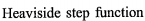

# What I cannot create, I do not understand

本书最大的特点是“剖解”了深度学习的底层技术。正如美国物理学家 理查德·费曼（Richard Phillips Feynman）所说：“What I cannot create, I do not understand.”只有创造一个东西，才算真正弄懂了一个问题。本书就 是教你如何创建深度学习模型的一本书。


*N 加倍 *1/N 减倍

^e 指数级加倍，1/(e^N) 指数级减倍


左乘是行变换，右乘是列变换
> 右乘压缩左边矩阵的列  
> 左乘扩充右边的行


sigmoid 又名logistic 

- sigmoid  意为S形的


梯度是指损失函数关于权重参数的梯度

- 梯度是损失函数关于权重参数的偏导函数的向量

  - 偏导函数的变量是权重，函数值代表速度

    - 这个速度是指权重增大，损失函数值增大或减小的速度

      - 增大还是减小取决于偏导函数带正号还是带负号

        - **正偏导函数**指出损失函数随着权重增大而增大的速度

          - 假设想让损失函数变小，权重应该**减去**正偏导函数的值，

              所以权重变小了，损失函数变小了

        - **负偏导函数**指出损失函数随着权重增大而减小的速度

          - 假设想让损失函数变小，权重应该**减去**负偏导函数的值，

              负负得正，所以权重变大了，损失函数变小了

            

- 将权重参数沿梯度方向进行微小更新

- 梯度上升法用来求函数最大值，梯度下降法求最小值
  - 正梯度变量增函数增，负梯度变量增函数减
  - 梯度的方向实际就是函数在此点上升最快的方向！而我们需要朝着下降最快的方向走，自然就是负的梯度的方向，所以此处需要加上负号


[深入浅出--梯度下降法及其实现](https://www.jianshu.com/p/c7e642877b0e)

[吴恩达老师的机器学习课程个人笔记](https://github.com/fengdu78/Coursera-ML-AndrewNg-Notes)

[李宏毅机器学习](https://speech.ee.ntu.edu.tw/~tlkagk/courses_ML19.html)

[神经网络中的偏置项b到底是什么？](https://www.jiqizhixin.com/articles/2018-07-05-18)

- > **逻辑回归就是用直线|平面|超平面（一维空间是点，二维空间是直线，三维是平面，多维是超平面）来分割空间（目地是把空间中的点分类）**

[吴恩达《神经网络与深度学习》课程笔记（4）-- 浅层神经网络](https://redstonewill.github.io/2018/03/26/37/)

- >  偏置参数b可以全部初始化为零，并不会影响神经网络训练效果
  >
  > ```
  > W_1 = np.random.randn((2,2))*0.01
  > ```
  >
  > > 乘以0.01的目的是尽量使得权重W初始化比较小的值。之所以让W比较小，是因为如果使用sigmoid函数或者tanh函数作为激活函数的话，W比较小，得到的|z|也比较小（靠近零点），而零点区域的梯度比较大，这样能大大提高梯度下降算法的更新速度，尽快找到全局最优解。如果W较大，得到的|z|也比较大，附近曲线平缓，梯度较小，训练过程会慢很多。当然，**如果激活函数是ReLU或者Leaky ReLU函数，则不需要考虑这个问题**。但是，如果输出层是sigmoid函数，则对应的权重W最好初始化到比较小的值。
  > >

[有哪些优秀的深度学习入门书籍](https://www.zhihu.com/question/36675272)

[动手学深度学习](https://github.com/d2l-ai/d2l-zh)


实现与或非门只需要输入层和输出层，不需要隐藏层，也就是说与或非问题是线性可分的。但是，异或/同或却是非线性可分的


## 感知机（perceptron）算法


感知机是由美国学者Frank Rosenblatt在**1957年**提出来的，**是神经网络（深度学习）的起源算法**

输入信号被送往神经元时，会被分别乘以固定的权重（w1 x1、w2 x2）。（注：相当于放大或缩小信号）**神经元会计算传送过来的信号的总和**，只有当这个**总和超过了某个界限值时**，才会输出1。这也称为“**神经元被激活**”。这里将这个界限值称为阈值


在应用领域，对于二进制数据建模时，**均方误差损失函数（MSE）** 通常并不是一个合适的损失函数。更加合适的方法将在6.2.2.2节中讨论。《DeepLearningBook》p. 148


### 与门


全真则为真


在NumPy数组的乘法运算中，当两个数组的元素个数相同时，各个元素分别相乘


但是请注意，**偏置和权重w1、w2的作用是不一样的**。具体地说，w1和w2是控制输入信号的重要性的参数，而**偏置是调整神经元被激活的容易程度（输出信号为1的程度）的参数**。比如，若b为−0.1，则只要输入信号的加权总和超过0.1，神经元就会被激活。但是如果b为−20.0，则输入信号的加权总和必须超过20.0，神经元才会被激活。像这样，**偏置的值决定了神经元被激活的容易程度**。另外，这里我们将w1和w2称为权重，将b称为偏置，但是根据上下文，有时也会将b、w1、w2这些参数统称为权重。


## 回归问题还是分类问题

> 回归问题输出值可以和标准答案求误差（例如：均方误差损失函数）
>
> 分类问题输出0-1之间的小数，结果是概率


```python
python --version
3 ** 2 # 乘方
a[0:2] # 0到2（不包括2！）的元素 # slicing
a[1:] # 1到最后
```

## 　NumPy的N维数组

```python
A = np.array([[1, 2], [3, 4]])
A.shape # (2,2)
A.dtype # int64
```


[吴恩达深度学习—深度神经网络的反向传播推导)](https://zhuanlan.zhihu.com/p/80376257) 


## Xor 问题

- [DeepLearningBook]()
- [梯度下降过程向量化](https://blog.csdn.net/lgb_love/article/details/81456955)


**异或问题神经网络图**


左乘是行变换，右乘是列变换


列向量右乘一个矩阵，左边的矩阵行数没变列数被降维了（被降到和列向量对齐）

> 一列向量作为系数右乘一个矩阵，矩阵降维到一列。降维的方法是矩阵所有的列加仅求和
>
> N列向量右乘一个矩阵，矩阵降维到N列

*N 加倍 *1/N 减倍

^e 指数级加倍，1/(e^N) 指数级减倍

### 训练数据


$$
X=
\begin{bmatrix}
0 & 0  \\
0 & 1  \\
1 & 0  \\
1 & 1  \\
\end{bmatrix}
$$


$$
Y=
\begin{bmatrix}
0 \\
1  \\
1 \\
0 \\
\end{bmatrix}
$$

4组行向量组成的矩阵，这是**训练数据**（行向量是同一维的两个坐标）


## 加上偏置后的训练样本


$$
X=
\begin{bmatrix}
1 & 0 & 0  \\
1 & 0 & 1  \\
1 & 1 & 0  \\
1 & 1 & 1  \\
\end{bmatrix}
$$

$$
Y=
\begin{bmatrix}
0 \\
1  \\
1 \\
0 \\
\end{bmatrix}
$$


其中 W 是 线性变换的权重矩阵，c 是偏置，g 是激活函数，h 是输出向量

>  描述的是向量 x 到向量 h 的**仿射变换**
>
>  **仿射变换相比线性变换多了一个平移，原点变了。线性变换保证几何体的形状和比例不变**


### ReLU 激活函数

现代神经网络中，默认的推荐是使用由激活函数 **g(z) = max{0, z}** 定义的整流线性单元 (rectified linear unit) 或者称为ReLU

**整流线性激活函数**（DeepLearningBook ）p.150


###  整个网络结构


> max{...} 部分是ReLu激活函数
> W  是第一层的权重
> w  是第二层的权重
> c  是第一层偏置
> b 是 第二层偏置，值是0


应用激活函数后：


### 均方误差损失函数MSE

可以把这个问题当作**回归问题**，并使用**均方误差损失函数MSE**（为了简化本例中用到的数学）


#### 神经网络的出现是为了自动从数据中学习出感知机 (perceptron)  的合适权重参数

## 深度学习有时也称为端到端机器学习
> （end-to-end machinelearning）。这里所说的端到端是指从一端到另一端的意思，也就是
从原始数据（输入）中获得目标结果（输出）的意思(包办了从输入到输出，**中间无需人工介入**)


**激活函数(activation function)**  

- **将输入信号的总和转换为输出信号**
- 回归问题用恒等函数，分类问题用softmax、ReLU 


**激活函数是连接感知机和神经网络的桥梁**

- 一般而言，“朴素感知机”是指单层网络，指的是激活函数使用了阶跃函数的模型。“多层感知机”是指神经网络，即使用 sigmoid  函数(后述)等平滑的激活函数的多层网络。
- 实际上，**如果将激活函数从阶跃函数换成其他函数，就可以进入神经网络的世界了**

> 阶跃函数是指一旦输入超过阈值，就切换输出的函数。
Mathematica 阶跃函数：UnitStep


**sigmoid 函数**

​                                                                               $h(x)=\frac{1}{1+e^{-x}}$


阶跃函数的实现


array([-1., 1., 2.])  -> array([False, True, True], dtype=bool)  ->  array([0, 1, 1])


观察图 3-8，首先注意到的是“平滑性”的不同。sigmoid 函数是一条平滑的曲线，输出随着输入发生连续性的变化。而阶跃函数以 0 为界，输出发生急剧性的变化。**sigmoid 函数的平滑性对神经网络的学习具有重要意义**


另一个不同点是，相对于阶跃函数只能返回 0 或 1，sigmoid 函数可以返 回 0.731 . . .、0.880 . . . 等实数(这一点和刚才的平滑性有关)。也就是说，**感知机中神经元之间流动的是 0 或 1 的二元信号，而神经网络中流动的是连续的实数值信号**


[机器学习实战 p75]()




- 逻辑回归可以看成是一种**概率估计**


**ReLU 函数**


在神经网络发展的历史上，sigmoid 函数很早就开始被使用了，**而最近则主要使用ReLU(Rectified Linear Unit)函数**。


def relu(x):

​    return np.maximum(0, x)


**行的加权和，行是输入信号，列是加权信号**  


## 列的线性组合


### 对输入行用权重列进行加权求和


Gilbert Strang-Linear Algebra and Its Applications (4ed)-Brooks Cole (2005)

Win10截图：  Win + Shift + S  


### 列向量是n 维空间的一个坐标，行向量是同一维空间的n 个坐标

### 点乘中第二个矩阵是加权矩阵，给第一个矩阵的列向量加权

行向量是同一维的几个坐标，列向量是多维空间的一个坐标（n个不同维的坐标分量）


**第一个矩阵贡献行数，第二个矩阵贡献列数**


**两个输入信号，三组加权信号**


##  输入向量是一组行向量，权重是几组列向量

### 一列权重对输入行向量进行加权和，得到输出行向量的一个分量


**权重的符号表示**


权重w **上标1**表示连接第一层和第二层的权重

权重w **左下标**1表示连接着箭头**所指方向**的**第1个神经元**

权重w **右下标**2表示连接着箭头**出来方向**的**第2个神经元**


图 3-17 中增加了表示偏置的神经元“1”。请注意，偏置的右下角的索引号只有一个。这是因为前一层的偏置神经元(神经元“1”)只有一个


另外，图 3-20 中，**输出层的激活函数用 σ() 表示**，不同于**隐藏层的激活函数 h()**(**σ 读作 sigma**)


### 输出层所用的激活函数，要根据求解问题的性质决定

- **回归问题**可以使用**恒等函数**
- **二元分类问题**可以使用 **sigmoid 函数**
- **多元分类问题**可以使用 **softmax 函数**


init_network() 函 数 会 进 行**权重和偏置的初始化**，并将它们**保存在字典变量 network 中**。这个字典变 量 n e t w o r k 中**保存了每一层所需的参数 (权重和偏 置)**。 f o r w a r d ( ) 函 数 中 则 封 装了将输入信号转换为输出信号的处理过程


### 求解机器学习问题的步骤可以分为“学习”  和“推理”两个阶段。首 先，在学习阶段进行模型的学习，然后，在推理阶段，用学到的模型对未知的数据进行推理(分类)。如前所述，推理阶段一般会省略输出层的 softmax 函数。在输出层使用 softmax 函数是因为它和神经网络的学习有关系


### 假设学习已经全部结束，我们使用学习到的参数，先实现神经网络的“推理处理”。这个推理处理也称为神经网络的前向传播(forward propagation)


将图像的各个像 素值除以 255，使得数据的值在 0.0~1.0 的范围内。像这样**把数据限定到某 个范围内的处理**称为**正规化(normalization)**。此外，对神经网络的输入数据 进行某种既定的转换称为**预处理(pre-processing)**。这里，作为对输入图像的 一种预处理，我们进行了正规化


预处理在神经网络(深度学习)中非常实用，其有效性已在提高识别 性能和学习的效率等众多实验中得到证明。在刚才的例子中，作为 一种预处理，我们将各个像素值除以 255，进行了简单的正规化。 实际上，很多预处理都会考虑到数据的整体分布。比如，**利用数据整体的均值或标准差，移动数据，使数据整体以 0 为中心分布**，或者进行正规化，**把数据的延展控制在一定范围内**。除此之外，还有 将数据整体的分布形状均匀化的方法，即**数据白化(whitening)**等


### 观察矩阵计算中维度的变化是否正确


**输入数据的集合称为批(batch)**。通过以批为单位进行推理处理，能够实现高速的运算


理论上可以说 2 层感知机就能构建计算机。这是因为，已有研究证明， 2层感知机(严格地说是激活函数使用了非线性的sigmoid函数的感知机，具 体请参照下一章)可以表示任意函数。但是，使用2层感知机的构造，通过设定合适的权重来构建计算机是一件非常累人的事情。  


**坏消息是，设定权重的工作**，即确定合适的、能符合预期的输 入与输出的权重，**现在还是由人工进行的**。上一章中，我们结合与门、或门 的真值表人工决定了合适的权重。


## 神经网络可以自动地从数据中学习到合适的权重参数


**神经网络的出现就是为了解决刚才的坏消息。具体地讲，神经网络的一 个重要性质是它可以自动地从数据中学习到合适的权重参数**


- 感知机是具有输入和输出的算法。给定一个输入后，将输出一个既定的值。

- 感知机将权重和偏置设定为参数。
- 使用感知机可以表示与门和或门等逻辑电路。
- 异或门无法通过单层感知机来表示。
- **使用2层感知机可以表示异或门**。
- 单层感知机只能表示线性空间，而多层感知机可以表示非线性空间。
- 多层感知机(在理论上)可以表示计算机。


## 激活函数的作用在于决定如何来激活输入信号的总和


刚才登场的**h(x)函数**会将**输入信号的总和转换为输出信号**，这种函数 一般称为**激活函数(activation function)**。如“激活”一词所示，**激活函数的作用在于决定如何来激活输入信号的总和**


**a = b + w1x1 + w2x2**   (3.4)  

**y = h(a)**   (3.5)

首先，式(3.4)计算加权输入信号和偏置的总和，记为 a。然后，式(3.5) 用h()函数将a转换为输出y。


## 机器学习的问题大体上可以分为**回归**问题和**分类**问题


# 激活函数，回归用恒等函数，分类用softmax函数


# 计算机视觉领特征量包括 SIFT、SURF和HOG等

> 使用这些特征量将图像数据转换为向量，然后对 转换后的向量使用机器学习中的SVM、KNN等分类器进行学习。


## 训练数据和测试数据

首先，使用训练数据进行学习，寻找最优的参数；然后，使用测试 数据评价训练得到的模型的实际能力


**美丽之问：宇宙万物的大设计**


点乘：a \cdot b

叉乘：a \times b

除以：a \div b


