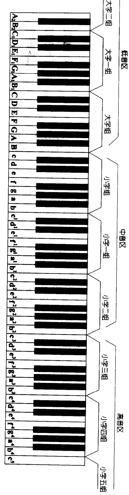
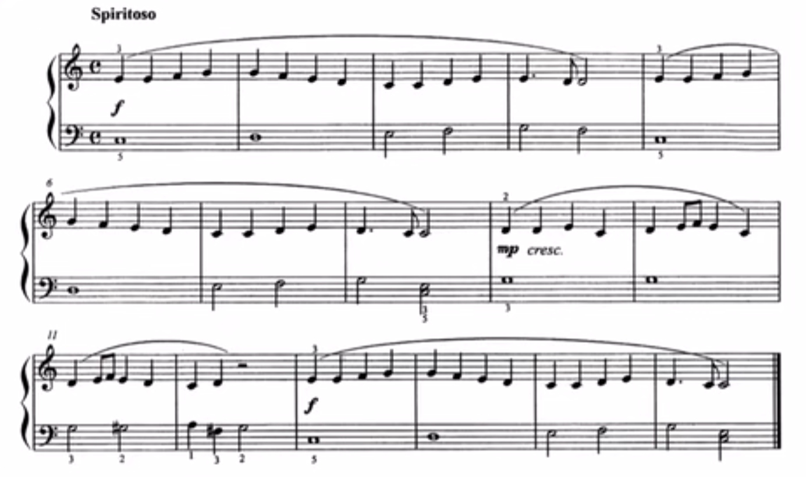
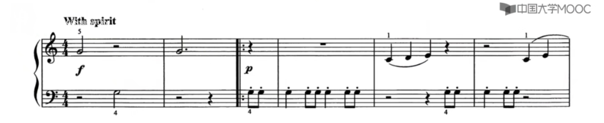
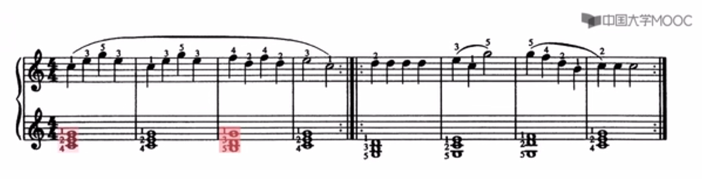
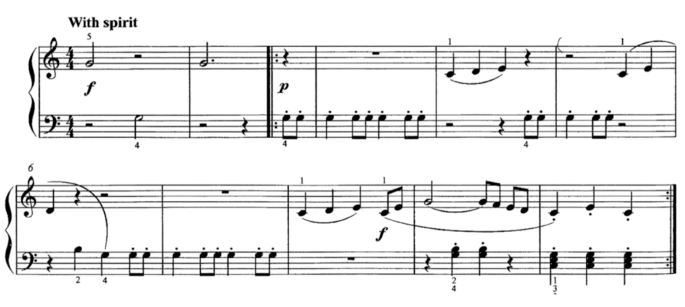
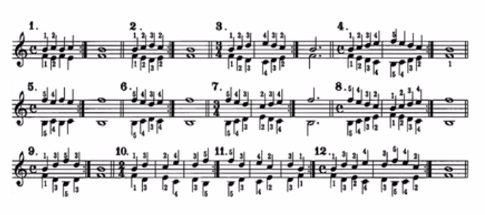
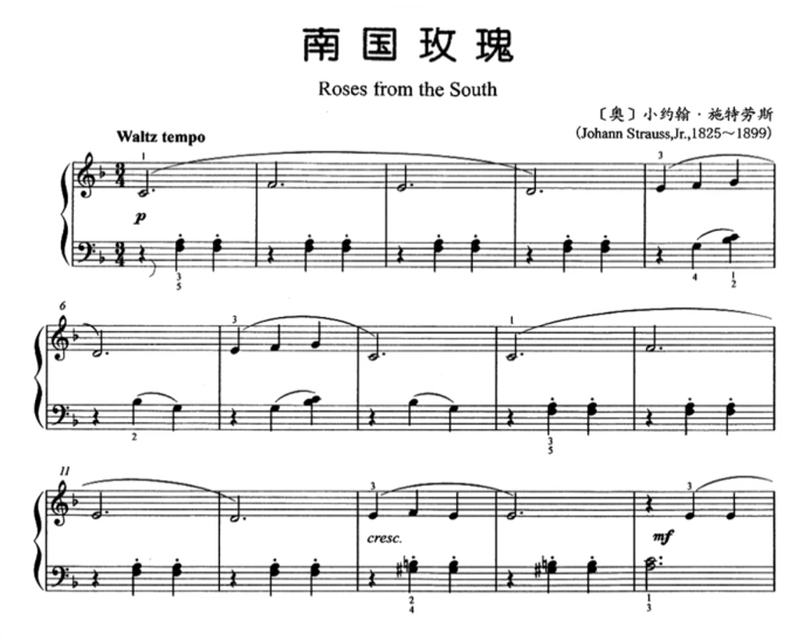
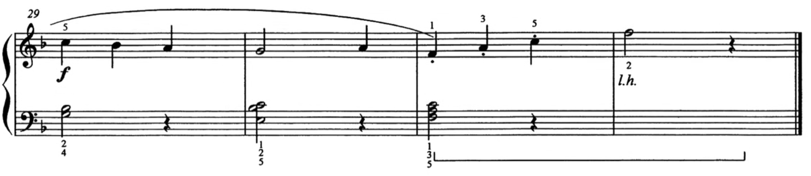

88键，52 白，36 黑  

 
> 大二  大一  大  小字 **小字一**  二  三  四  五   
**七个八度**，外加左端**两白夹一黑sol la**  
右端do   
**两黑夹一白re**，两端是do mi   
**三黑夹两白sol la**，两端是fa xi  
两大五小  完整八度的键  
**小1 2 3 4**   
**小1 小 大 大1**   

中央C sei  
> 现代钢琴上有七个八度     
**中央sei 在左起第四个八度的位置**  

黑键有两个一组的，有三个一组的。分别都穿插在白键中间。 do 在挨着两个一组黑键的左边的那个黑键的下方的白键   

**唱名法** do re mi fa sol la si    

**会唱上行还要会唱下行，对学琴很有帮助**    

**上行**  do re mi fa sol la si do   
> 从低音的do³ 一直到高音的do  

**下行**  do si la sol fa mi re  do 

**这个do 到那个do 之间是八度**，八度音更高但是音律是一样的    
> 度就是量词『个』  
**一个音就叫一度**，do到re就是两度  
高音do比中音do高**六个全音，频率高一倍**     
**现代钢琴上有七个八度**  
很多乐器能有三到四个八度  
**普通人**的音域大概是**一个半八度**  
歌唱家可以到达两个半八度音左右  

小节线跟拍号有关系，跟带奏有关系  

4/4 **四四，一个小节四拍**，3/4 **四三，三拍**    

**全音符**  空心的圆圈  
> **时值为四拍**，一个音要数四拍  
**琴键一直按下去不动**，**念出1234就是四拍**。抬手的瞬间琴音正好消失。  
手抬起来是半拍，落到琴键上又是半拍。  
**手的一起一落时值加起来正好是一拍**      

**二分音符**  多了一个符干  
> 时值是全音符的1/2，一个音要数**两拍**  
数到2，手抬起来  

**四分音符**  实心圆圈,真小蝌蚪    
>   时值是二分音符的1/2，一个音要数**一拍**  
数到1，手抬起来  

中央C 在高音谱的下加一线的位置，低音谱正好相反，在上加一线的位置  

下加一间是re    

最下面的一条线是一线  

**读谱**    
> **高音谱**号用**右手**来弹，**低音谱**号用**左手**  
**谱上的数字告诉我们用哪个手指弹什么音**  
**12345 代表五个手指。1 是拇指，5 是小指**    
**没有写连线**的音用**断奏**的方法弹    
 **双音或和弦的断奏不需要抬手指**    
**连线弹奏结束前不可抬起手腕**  
**连奏线**上谱表写，下谱表没写，  
但是**下谱表要跟着连奏**   
**上谱表用右手来弹，下谱表用左手**  
**同一谱表尾巴朝上**的音符**右手弹**，朝下左手弹  
**连线结束后把两个手腕抬起来**，告诉观众我们这一句己经完成了    

**手形**  
> 手放琴上手形是**像握鸡蛋一样**  

**准备**  
> 把双手放在琴键上默数节奏4拍之后再开始弹  
**第一个音永远用断奏来弹**    

**断奏**  断奏是雨点  
> 32415 按这样的顺序进行手指的训练    
**没有写连线的音用断奏的方法弹**，每个音都是断开的，  **每个音都要把手腕抬起来**     
**把手放在琴键上数完4拍之后再开始弹**    
**大臂带动小臂，最后提手腕、手指轻柔落下**，不是砸  
手臂手腕不要向手指施压  
**用胳膊的重量弹，而不是力量**      

**跳音**  跳音是急雨  
> **跳音是急促版的断奏**    
每个音也都是断开的，但是每个音更短促一点  
**手指通过指尖的弹性弹跳起来**  
**要注意声音的短促和手腕的放忪**  
手腕如果不放忪声音会显得机械     

**连奏**  连奏是流水  
> 将掌关节中的力量传递至下一根手指    

**双音或和弦**    
> 不抬指  
每次弹双音或和弦都提前准备好手位    

跳音短促指尖弹，   
连线弹奏不抬腕，    
断奏跳音都抬腕，    
双音和弦不抬指，  
和弦指法不固定。  

断奏是雨点，  
跳音是急雨，  
连奏是流水。   
钟子期曰：『善哉，**洋洋兮若江河**』，  
可见伯牙鼓琴当时用的是连奏。  

## 欢乐颂  

   

## 威廉退尔序曲 part1 
  
  

> 高音谱上有一个**数字5**，告诉你右手的小指放在**小字一组的g1琴键**上    
中央sei 在左起第四个八度的位置，两黑夹一白是c1，拇指放这里。三黑夹一白左边那个白键是g1，小指放这里       
可以看到除了**有跳音还有连奏**    
**没有写连线的音用断奏的方法弹**，**每个音都要把手腕抬起来**     
**把手放在琴键上数完4拍之后再开始弹**    
左手的跳音完了以后是右手的连奏  
**连线弹奏结束前不可抬起手腕**     
左手的**跳音要注意声音的短促和手腕的放忪**    
连奏线上谱表写，下谱表不写，但是**下谱表是要跟着连奏**  
即有上又有下那么**尾巴朝上的音符右手弹，朝下的左手弹**    
弹奏**双音或和弦的断奏不需要抬手指**     

> 低音谱上有一个**数字4**，告诉你左手的无名指放在**小字组的g琴键**上    

### 和弦指法可以不固定
    
> 和弦指法可以不固定配合后面的和弦按法变化小为佳  
C E G 习惯会用1 3 5 指来弹，这里为什么要用1 2 4指来弹呢？因为我们看到第三小节是B E G(**xi³ mi so**)  ，哚咪嗦 和 喜咪嗦 的距离是挨着的  

 威廉退尔序曲节选 

拜尔  

   

> 在同一谱号中符干向上的用右手弹，向下左手  
  
南国的玫瑰  

   

> 左手的伴奏有跳音的标识  
**43拍123、123 就会给人一种舞曲的感觉**    
**Waltz tempo 圆舞曲速度**   优雅均衡 不是非常快速  
节奏的稳定性，不能忽快忽慢   
**三拍子强拍的奏法  '1 2 3、'1 2 3**  重音在第一个  

**Lh记号换成左手弹奏**

   

