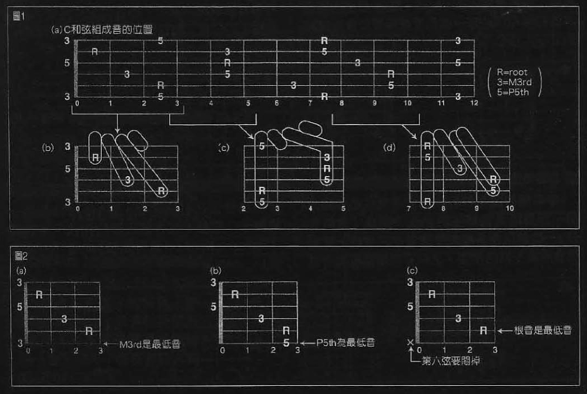

吉他**右移一个品格**就是一个**半音**  

### 调号
  代表谱子的**调性**  、
- 调号共有**12种**  
- **同调号**表示的**大小调**称为**关系调**  
- 作为调号标记的**升降记号**对**所有小节所有八度音都有效**  

**临时升降记号**  
- **同小节同八度以内有效**  
  

跳音 (Staccato)  
- 符头的上面或下面加一小圆点「・」  
- 时值一半，休止一半  
- **跳音是短促的抬腕断奏**  

**连结线**  
- **同音高**符头间的圆孤线  
- **后面的音不演奏**，时值叠加别前面  

**圆滑线**  
- **不同音高**符头间的圆孤线  
- **连线弹奏不抬腕**  
- 要全程**踩延音踏板?**

**拍子与节奏**  

- 四四拍  用4/4或C 标记  
- 二二拍  用2/2或C斜杠标记      

- 最短的音符读做嗒，其他嗒啊、嗒啊啊、xxxx......  

变小结线  
- 这小节不全等于上小节就用变小结线  
- **变小结线是双竖线**  

终止线  

- 加粗的竖线  
- 在谱子的最尾端  

**小度认音名，小程认半音**    
**音程半音数，度数音名数**   
**小程：你只说度数我哪知道有几个半音？给你加上大小增减纯**  

**音程和度数**  

- 音程以半音为最小单位  
- E与F、B与C 是**半音音程**，其他是**全音音程**  
- **1st  2nd  3rd  4th...xth**  表示1到x度  
- **上行两度音**CD，**下行两度音**DC  **线间两度线线三度**
- **音程**是为了数有几个**半音**，**度数**是为了数有几个不同的**音名**  

**和弦的构成**  

- 基本的和弦是在基础音上**每三度叠加一个音**
 所形成的，和弦的基础音称为**根音**，重叠在其上的音称为**和弦音**    

- 1 3 5 7 9 **和弦正好是线线线、间间间的排列**  

  > **3+1八度轮回** 线线线、间间间
  >
  > 三线一间、三间一线(一个轮回) 
  >
  > 往上下数三线一间或三间一线就是**另一个八度音**  

**和弦的分类**  
- 音高不同，音程关系一样的和弦是**同种类和弦** 。同种类和弦**有12种不同的音高**  
- **音的组成分类**  
- **压弦的方式分类**    

**吉他C和弦组成音的位置**  

  
R=root  3=M3rd  5=P5th  

**吉他的和弦指型**  
- 即使是**同一个和弦**，也会因为选择的音符位置不同，而**有好几种和弦指型**  
- 与原位和弦一样，根音为最低音的指型是C和弦的**基本指型**  
- **开放和弦(Low Chord)**  
  > 大多是低把位和弦「靠近琴首」    
- **封闭和弦(Hight Chord)**  p15  
  > 用一根同时按很多条弦称为**封闭指法**      
- **省略和弦**  
  > **强力和弦**(Power Chord) 或称**五度和弦**    
- **Open Hight Chord**  
  > 封闭开放和弦的组合  独特声音是其特征    

**和弦的基本型和转位型**  
- 和弦原位  根音为最低音  稳定  
- 和弦转位  根音以外音为最低音  稳定  

## 和弦名称的记法  
- **大和弦**  **仅有根音音名**  
- 其他和弦  根音名+和弦种类+度数  
- **Dm7  根音D 小和弦m 七度m7th**    
- **Eb7(#9)  根音Eb 七度m7th #9th**      
- C和弦 根音C  **M3rd叠音**E  **P5th叠音**G    
- **大三和弦**「Root M3rd  P5th」**M是Major 缩写**  **P是完全**  
  > **音色明亮安定**
- **小三和弦**「Root m3rd  P5th」**m是minor缩写**   **P是完全**  
  > **音色较暗**  
- **挂留和弦sus**「Root  P4th  P5th」 **Csus4**      
  > 音色较空  **大多后接同一根音的大和弦**    
- **增和弦**Augment chord  
  > 将大和弦中的**完全五度音P5th**提高半音   
  「Root M3rd  #5th」  音色不安定  **aug是增**  
- **减和弦**  Diminish chord    
  > 加上**减7度音**的和弦  **dim7th**  **dim是减** 突出不安感   
  减是减半音    
  这是四音和弦  

**代表性和弦的种类与特征**  
- **三音和弦**  
  > **大和弦Major chord**
  **小和弦Minor chord**  
  挂留和弦sus4、sus2  
- 大三和弦Major traid    
  > 音色明亮安定  
- 小三和弦minor traid  
  > 音色较暗  
- **四和弦**  
  > 三和弦加上M6th、m6th、m7th，M7th 其中的一个音   
 **加大六度更暗柔**，**加小六度更阴柔**    
  - **减和弦**  **Diminish chord**    
  加上**减7度音**的和弦  **dim7th**   
  - **六和弦C6** 「Root  M3rd  P5th  M6th」 
  - **小六和弦Cm6** 「Root  m3rd  P5th  M6th」  
  - **七和弦C7**  「Root  M3rd  P5th  m7th」
    > 更不安定  属和弦运动  **终止**式  **蓝调**和弦进行  
  - **挂留七和弦**  **C7sus4**  「Root  P4th  P5th  m7th」  
  - 小七和弦  「Root  m3rd  P5th  m7th」
  
**调性和弦的机能**  
> 和弦进行一般以**调性和弦(Diatonic chord)** 为中心编写   
