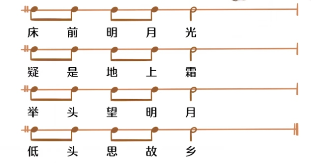

记音符  蝌蚪的发育  
**受精卵**全音符、**开眼蝌蚪**是二分音符，**闭眼蝌蚪**四分、
**一尾**八分，**两尾**十六分，**三尾**三十二分  

找音 
> 线线线   
**do mi so si re fa la**  
do la **朵啦 下加一，上加一**    
上行 **mi so si**  
下行 **fa   re si**    
找音注意奇数和偶数的变化，**越过了si(7)就会发生奇偶切换**，在此之前都是**奇奇奇，偶偶偶的规律**  

恒拍
> 拍是音乐的速度单位，每一拍按照指定的速度不变  
**恒拍就是音乐的脉搏，音乐的呼吸和律动都建立在恒拍的基础上**  

BPM  拍子数  
> Beat Per Minute，拍子数，每分钟节拍数的单位  

四分音符 = 60 
> 每分钟60 拍，每秒1 拍。每拍一个四分音符  

节拍器  
> 物理的，像钟摆  
  

一线谱  
> 无音高变化或忽略音高变化  
**记录只有节奏长短变化的音效**   
很多打击乐器都是用一线谱  

半拍一个字  
> 每字一个八分音符，**两个字一拍**  
前面一拍念两字，后面两拍念一字  

倍全音符  
> 时值是八拍  
全音符被两条竖线夹住  

符点音符  
> 时值加原先的一半  

**全休止**符像一盏**吊灯**   
**二分休止**符像放在桌上的**台灯**   
**四分休止**符像**钉子**    
**八分休止**符像**数字9**   
**十六**三十三六十四在**9上加灯泡**    

拍号  
>上 4 。拍，一小节4拍  
下 4。4分音符为基本拍  
拍号的读法**先读下面的数字**  
42 以四分音符为基本拍，每小节两拍  
**44拍**有时**用字母C 表示**    
**22拍**有时**用字母C 加条竖线表示**    
有时会**临时改变拍号**    
**艹 自由拍子**   

重音符号  
> 像**无杆的箭头**  
强、次强  

**弱拍起弱拍结**  
> **两个小节都不完整**，时值加一起刚好等于拍号  

### 时值拖长  

> 延音线看起来像连奏线。**连奏连音高不同的音**  
 **延音线**，连**音高相同**的两音    
**只演奏前面一个音符，时值是前后之和**  

切分音  
> 和连奏线引起的时值拖长有关系，改变了强弱拍关系  

**二连音头上的直线像剪刀**，将音符二等分，总时值没变，**演奏的次数加倍了**  

重升重降  
> x bb  

断奏  
> 短断音  黑色三角  1/4时长，休止3/4时长    
半断音俗称**跳音**  小黑点  **演奏1/2时长， 休止1/2 时长**  
微断音  3/4时长，上有连奏线  

保持音  
> 小横线  时值饱满  

八度变化符号  
> 标音符头上实际演奏高八度，标脚下低八度    

琶音、滑音、刮奏    
> 和弦左边一竖波浪  
一斜线  
一斜线上标gliss ，手指划过多键  

力度  
> f mf ff fff sf  强、中强、极强、最强、突强  
长镊子右口  渐强  
cresc.  渐强  
p mp pp ppp sfp  弱、中弱、极弱、最弱、突强后弱    
长镊子左口  渐弱  
dim.  渐弱  

音乐是建筑  

一个白色琴键代表一个基本音级  

表示**距离的基本单位是半音**，两个半音的距离称为全音，两个乐音**音高之间的距离**称为**音程**，也就是两个音之间包含的半音与全音的数量          

两个音**横向**进行称为**旋律音程**，**纵向叠置**同时发声称为**和声音程**    

音程中音高较高的音叫**冠音**，较低的音叫**根音**  

两音距离在**八度以内**的所构成的音程为**单音程**，两音距离超过八度的称为**复音程**      

音程名称也与人名一样包含两层含义，  

看到 3-2 
