维度

  列是多维空间的不同维度

​    1列是多维空间中N个点的同一维度坐标组成的向量

  行是多维空间的一组坐标

​    1行是多维空间的一个点


左乘是行变换，右乘是列变换

列向量右乘一个矩阵，左边的矩阵行数没变列数被降维了（被降到和列向量对齐）

> 一列向量作为系数右乘一个矩阵，矩阵降维到一列。降维的方法是矩阵所有的列加仅求和
>
> N列向量右乘一个矩阵，矩阵降维到N列

*2 加倍 *1/2减倍


 一边一权重，算看有多少条边

  二输入每对应一隐层单元就是2 条边，所以“第一间”边上的权重是2*2（间的说法对比五线谱的线间关系， \

  输入层和隐层[也可以认为是中间输出层]分别是第一线，第二线，那么连接它们的边所在位置就是第一间）

  线是line, 间是space， 所以第一间可以用 1th_space 表示


  向量x 到向量 h的仿射变换，仿射变换相比线性变换多了一个平移，原点变了。线性变换保证几何体的形状和比例不变

​    平移是通过加上一个常量，既偏置完成的

​    输入信号作为列向量左乘权重矩阵，求出输入信号的加权和，激活函数把若干个加权和压缩到0 和1 之间，这就是隐层的单元了，隐层单元又作为输入信号开始新一轮的计算，

​      最后在输出层得到前向传播的最终结果，这就是预测值


梯度是偏导数的向量

  但是仍然使用：“x上的梯度” 这样的术语，因为简单

  函数关于每个变量的偏导数指明了整个表达式对于该变量的敏感程度

  反向传播，可以计算各个节点的导数

  通过比较数值微分和误差反向传播法的结果，可以确认误差反向传播法的实现是否正确（梯度确认）


有向无环图

  有向无环图未必能转化成树，但任何有向树均为有向无环图


**随机矩阵**（Stochastic matrix），**所有元素不小于0，每一列的和为1**，状态转移矩阵的最大特征值为1


**morpheme ”音“(词素？)**  高本汉《 中国音韵学研究》  p.16  

大部分以tion,sion 结尾的词都来源于法语  [法语发音](../lang/french/法语发音.md)  

《诗经》西周初年至春秋中叶（约前11世纪-前6世纪）  

> 最古的是周頌，接著是大雅，其次是小雅，最晚的是商頌、魯頌和國風。

旧约中最早写成的部分是**《士师记》**公元前11世纪到前10世纪

> **死海古卷**是目前世界上现存第二古老的圣经抄本。第一古老的圣经抄本是在伯利恒到耶路撒冷的古道上(ketef Hinnom)发现的**银质古卷**(silver Scrolls)

William Shakespeare  

> 1564年4月23日—1616年4月23日  
>
> 杜甫（712年2月12日－770年），字子美  
>
> 《慧琳音义》成书于元和五年(公元810年)  《一切经音义》与词语探源-姚永铭  
>
> 《宛署杂记》编著于明万历十八年(公元1590年)以后。这样,我们就将末香一词上推了近800年  

**“一"为万物之始, “亥”为地支之末暗喻万物之终**  《说文学导论》万献初

卷二七“无复”条:“下吴音扶救反,秦音冯目反。”

覆载 上敷务反,见《韵英》,秦音也。诸字书音为敷救反,吴楚之音也。

“a短阿字(上聲短呼音近惡引)。

ā長阿字(依聲長呼別體作ā)。”

“e短藹字(去聲聲近櫻係反)。”

Excerpt From: 唐 智廣撰. “T2132 悉曇字記.” Apple Books. 

唐代的**《经典释文》和《慧琳音义》可说是瑰宝中之瑰宝**。由前者可以探索汉语上古形态的奥秘,由后者可以梳理汉语向近代发展的脉络 《音韵学之旅》**竺家宁**

相對於陸德明的**南音音系**(**金陵的雅言**)、陸法言的綜合音系(洛陽、金陵的雅言)，那麼玄應音系可能就是**長安的雅言**和經音了。《佛经语言研究综述（音义上）》**竺家宁**


# 什么是正确的汉语-赵元任

## 辅音韵尾-P，-t，-k

### “ 十”和“时”在官话中都念成shi

有各种因素压制了官话的威信，主要是因为北方较迅速的语音变化中古音特征的消失。

这个声调有过**辅音韵尾-P，-t，-k**，广东话现在还保留着这些的尾。北方方言中，这些韵尾已经丢失，入声字分派
这样，**“ 十”和“时”在官话中都念成shi**，由于古诗的韵步数和韵脚彼此都依赖于古声调，所以南方人比北方人
占了很大的便宜，他们至今还常喜欢写写古休诗，这就需要古声调的知识。

### **北京人区别不了“西”和“稀”**

### 尖团字

评价类的先前类发齿音和舌面后音，但是在北京方言中，它们在前高元音前合并变成舌头的评价威信的另一点是看**“尖”“团”字的区别**。面对音。**北京人区别不了“西”和“稀”**，而古汉语和今天的半个中国的方言都是能区别的。法国的大多数汉学家在他们搞的汉语拼音化文字中，，也评价威信，除了老派保留这一区别的立场之外，特别还要看到这一事实：以北京为中心的皮黄腔戏剧的演员们被称为中州音韵的标准，其特点之一就是保留尖团字的区别。


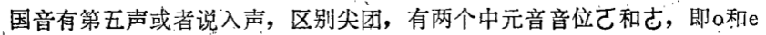

p.59

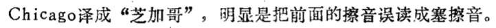

p.60


| 字號 |  字  |
| :--: | :--: |
|      |  仁  |

|      | 攝   | 聲調 | 韻目 | 字母 | 開合 | 等第 | 清濁 | 上字 | 下字 | 又音 | 又切 |
| ---- | ---- | ---- | ---- | ---- | ---- | ---- | ---- | ---- | ---- | ---- | ---- |
|      | 臻   | 平   | 真   | 日   | 開   | 三   | 次濁 | 如   | 鄰   |      |      |

漢字古今音資料庫](http://xiaoxue.iis.sinica.edu.tw/ccr)  

仁者 = 仁 不等于尊者、贤者    

查慧林音义 仁

```find . -type f | xargs cat | grep "<p>.*仁.*<span class='note-inline'>("```
仁者(而親反周禮云德一曰仁鄭玄曰愛人及物曰仁上下相親曰仁釋名仁者忍也好生惡煞善惡含忍也)。

易经 立人之道

最  
《常用音訓》   
サイ, もっとも    

后  
《常用音訓》  
コウ  

东方语言学(http://www.eastling.org)    

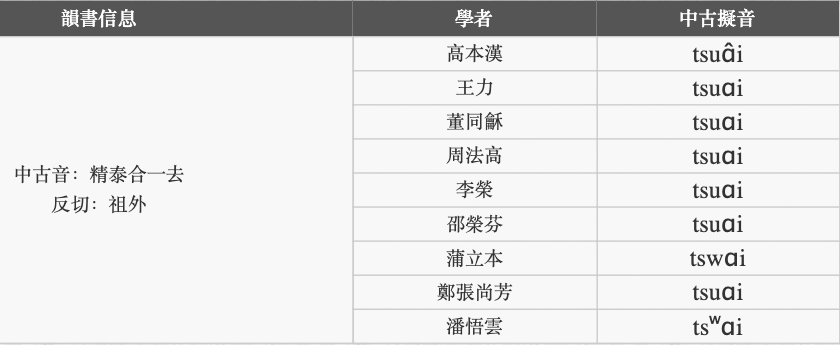


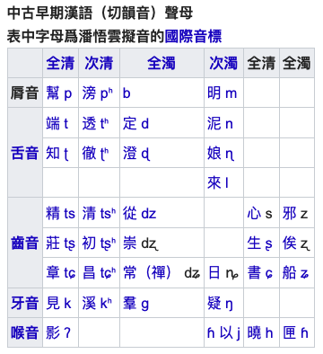

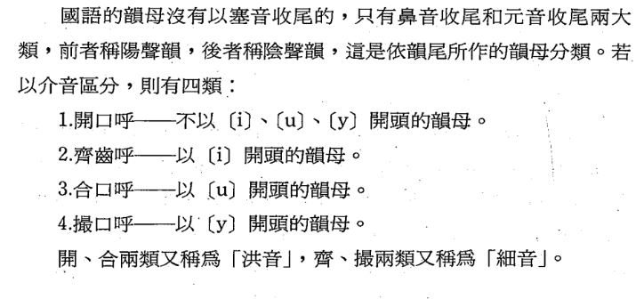

而要了解**反切上下字古今音变的原委，清浊与四呼，是必须要弄清楚的**。

清浊是讲声母发音方法的。声母的清浊,与声调的变化密切相关。四呼是按韵母开头的音素对韵母进行的分

《反切拼读入门》 


うつすといけないし  而且可能会传染的    

**「重纽」**，是指两个字声母相同，「韵」相同，甚至还同为「三等字」，但即便如此它们还是不同音 知乎  


**u合，i细**

**介音或主音有u是合，有i 是细。否则是开洪**

**聲母** initial，又稱聲紐、聲；**聲紐**、音紐，紐；体语、体文、字母等，是韵母前的**辅音**

> 位于音节开头，且不含半元音
>
> 声母的代表字称为**帮母**
>
> 封演《聞見記》說:「周題好爲體語。」此所謂的**「體語」,就是「雙聲語」**

**韻母**, 又稱韻 

> 韻母由**韻頭**(或稱「介音」)、**韻腹**(或稱「主元音」) 、**韻尾**三個段落組成
>
> **只有韻腹是不能缺少的成分**
>
> 韻已含有聲調的區別
>
> 韵的代表字称为**韵目**
>
> 每個韻都有一個名稱,叫做「**韻目**」,韻目的來源正好就是**各韻的頭一個字**
>
> **「阿、依、屋、兒、俄」只有主元音**
>
> 「由」(iou) (此字沒有聲母,這種情況稱爲「**零聲母**」),其中**(i)是介音**, **[o]是主元音**, **(u)是韻尾**。
>
> 「代、造、寒、中..」缺少介音;「花、街、牙、」等缺少韻尾;**主元音是個不能缺的成分**

**清浊**

> 辅音分**清浊**，元音分**展圆**
>
> 辅音既可以出现在聲母中，也可以以韵尾的形式出现在韵母中

**开合** = 展圆

> **韻頭**定开合，有[u]/[w] 合，无[u]/[w] 开  Kiwix《开合》
>
> **介音或主音有u是合**，有i 是细。否则是开洪  竺家宁《声韵学》
>
> **反切上字定清濁、下字定開合洪細聲調**
>
> 上下字的**清濁開合洪細聲調**都**必须与被切字相同**
>
> **现代开口呼和齐齿呼**对应中古开口，**现代合口呼、撮口呼**对应中古合口
>
> 赵元任《中古汉语的语音区别》和李荣《切韵音系》中都**主张中古汉语唇音字不分开合口**
>
> 现代汉语普通话**唇音**原则上**没有开合口**
>
> 在与o相拼时，声母后也有一个介音[u]，但因为没有对立，
>
> 普通话拼音中**buo可以简写成bo，是因为它没有对应的开口呼**，不会产生歧义  

**洪细** 

> 介音(或主要元音)是(i]的,稱爲「細音」,否則即爲「洪音」
>
> 因此,字音若依介音分,就有了四類:開口洪音、開口細音、合口洪音、合口細音。

**押韻**

> **押韻只要求韻腹、韻尾相同即可**

**雙聲、叠韻**

> 聲母相同的字稱之爲「雙聲」,韻母相同的字稱之爲「叠韻」

**依韻尾分韻**

> **陰聲韻**  **以元音收尾**者
>
>   - 你、我、他
>
> **陽聲韻**  以**鼻音收尾**者
>
> - 先生、英雄
>
> 入聲韻  以**塞音收尾**者

**重音**

> 英語的重音是個很重要的上加成素,它有辨別意義的功能。**例如record和insult的重音在第一音節是名詞,重音在第二音節就變成了動詞**。漢語的重音不重要,卻有聲調的變化來區別詞義。這是英語所沒有的語言成分。

**近世官话**  **開、齊、合，撮**

> 開口洪音→開
> 開口細音→齊
> 合口洪音→合
> 合口細音→撮
> 古音沒有撮口呼,國語的撮口字是由**古代的「合口細音」經「唇化作用」(labialization)産生的(iu-y)**。
但是,除了「撮口」的含意已有不同之外,許多字的歸類也大不相同。例如合口細音的「爲、垂、水」等字並沒有變「撮」,而變爲「合」;開口洪音的「亞、嘉、姦」等字並沒有變「開」,而變爲「齊」;開口細音的「展、善、召」等字並沒有變「齊」,而變爲「開」;合口洪音的「杯、妹、本」等字沒有變「合」,而變爲「開」。因此,術語的運用不能沒有精確的歷史觀念


唐音其实还分中世唐音（镰仓禅宗）和近世唐音（江户时代）唐音确实像《中原音韵》，当然和《广韵》也很像。可以通过以下方法验证。1.从唐音中提取汉字的读音，以石灰（シックイ）的灰（くい）kui为例。2.由「灰」の部首・画数・読み方・筆順可知训读为はいhai。3.从灰 - 字 - 中原音韻可知灰的声母为晓韵母为齐微合。4.从中原音韵查得，晓母为[x]，齐微合为[uǝi]5.从國際音標可知[xuǝi]中，x是清軟顎擦音，可听并学学这个音怎么发。然后学过英语的都知道uǝi怎么发了。[xuǝi]和唐音的くいkui，其实是很像的（x的湍流日本人大概发不出，听成了k），而且跟吴汉音的灰（はいhai）差别很大。而通过广韵的灰 - 字 - 廣韻和韻母擬音 - 廣韻、聲母擬音 - 廣韻。可以大略得出声母x的概率大些，h的概率小些。韵母则乱七八糟，有（uɑ̆i	uɒi	uᴀi	uɒi	uʌi	uoi	wəj）但大略可以看出像[uai]或[uoi]。不过，如果是这样的话，日本人听起来应该像くぉいkyoi或者くぁいkyai。虽然只查了一个例子，身心俱疲，不过既然日文wiki把唐音放进近古音・中原音韵系中，肯定有它的道理
链接：https://www.zhihu.com/question/28591064/answer/41386237

注意
名词、な形容词用在上面的复合句里要注意，不要把な和だ搞错
の前面是な

なので
なのに
から　けど　と前面是だ

だから
だけど
だと思う


2. 口语里の经常发成ん，因为这样说话快，所以注意下面两个是一样的

ので ---> んだ
もの ---> もん


**入声韵尾ptk**

在自己的方言中入声也**退化成了喉塞音**，所以在说方言时这个韵尾特征一直不凸显——只是说得短促一些而已

当然后来发现了一些**反例，比如“急”、“業”等入声字**在日语里是长音——于是又知道了“**ハ行転呼**”

那个马和梅的训读那个 据说是**渡来人(归化人)**带过去的**原始汉藏语**词汇演变过来的

日语的句子结构顺序是主宾谓，所以日语语法与满语、韩语一致。但是日语、韩语属于**孤立语系**


日语、韩语的汉字发音绝大多数都来自中古汉语。 在中古汉语中，入声指的是具有-k、-t、-p韵尾的音节。 这类音节在普通话中已经消失了，但在日语、韩语以及一些汉语方言（如粤语）中还有保留。 韩语由于有收音，所以可以保留韵尾；而日语则只能在后面添加一个元音，用两个音节表示入声汉字的发音。  三种入声韵尾在日语、韩语中的表现分别如下： 1) -k韵尾：在日语中表现为-く或-き，在韩语中表现为韵尾ㄱ。 例： 中古汉语：约束 qiak sjyuk，赤壁 chjek pek 日语：约束 やくそく，赤壁 せきへき 韩语：约束 약속，赤壁 적벽  2) -t韵尾：在日语中表现为-つ或-ち，在韩语中变为韵尾ㄹ。 例： 中古汉语：出发 chjyt pyat，一日 qjit njit 日语：出发 しゅつはつ（再发生促音便变成しゅっぱつ），一日 いちにち 韩语：出发 출발，一日 일일 3) -p韵尾：在日语中本记作-ふ，后转变为-う，并且会影响上一音节；在韩语中表现为韵尾ㅂ。 例： 中古汉语：插入 chrep njip 日语：插入 さふにふ => さうにう => そうにゅう 韩语：插入 삽입 从语法上说，日语和韩语的语法是高度对应的。它们的句子都是由若干个“文节”（名词带着助词）组成的，语序都是SOV（主宾谓），状语等修饰成分位置比较随意。各种助词之间有几乎一对一的对应关系。动词、形容词等有比较复杂的活用。 从词汇上说，日语和韩语都从汉语和以英语为主的西方语言借入了大量实词。也有一些汉字词，是在日本被创造出来的，后来传到了中国和韩国。这些词汇在日语、韩语之间也是高度对应的。但是，日语、韩语的固有词却没有对应关系。 从文字上说，日语使用汉字来书写名词，以及动词、形容词的词干（若是非汉语的外来语，则用片假名书写）；用平假名来书写助词，以及动词、形容词的词尾。由于使用了汉字和假名两套书写系统，文节之间就不需要空格了。韩语现在仅用谚文书写，文节之间用空格隔开。 由于书写方式的不同，两种语言的对应关系乍一看并不明显。但一旦把韩文里的汉字词也用汉字书写，二者的对应就一目了然了： 日语：韓国語と日本語の関係はどうですか？日语（文节间用空格隔开）：韓国語と 日本語の 関係は どうですか？韩语：한국어와 일본어의 관계는 어떻습니까?韩语（汉字词用汉字书写）：韓國語와 日本語의 關係는 어떻습니까? 这种程度的对应，使得在日韩对译时大脑里基本不需要缓存，看到一个词就可以马上译出来。


到今天，假名的另一个意义就是③表达一些汉字不方便表达的文法形式，比如**敬语当中的「にする」「になる」**等等用法。在等级尊卑十分严格的日本，只用汉字敬语不足以表达等级与等级之间细微的差别


和刻本古籍的影本，汉字右侧的是片假名（俗称苍蝇脚Õ_Õ），训读正是靠这些片假名来的

日本人当年学习汉语时应该是比较严格的。唐时的官话对入声可能会有比较高的要求，而日语对入声的严格复制可能来自于此。**葡萄牙传教士**当年似乎把**日语“笔”的发音记成“pit”**，证明了这一点。至于为什么辅音结尾演变成了独立音节，我认为可能是当年的日语在入声辅音后会加上一个不发声元音“u”，而后演变的。 此外，现代日语的所谓“拙劣”的元音也是经过了历史演变的。如果你看日本古籍，会发现当年的日语音读很不一样，比如现在大量的ou长音是由au演变而来的。当时的发音应该是更接近于重建的中世汉语


日语假名的顺序都是按梵语字母的顺序来的


最开始的音读，入声字也是读闭音节，而不是像现在这样tsuchikiku的（见日语维基）。但是声母和元音方面就无法保证了。日语音系本来元音辅音数量就少，广韵36个声母，上代日语算上浊音只有14行假名，必然会有合并。那时は行还不读/h/，读/p/，没有/h/这个音位，所以软腭擦音舍掉了擦音性质，选择了か行が行作音译。同时因为は行读/p/，现在读/h/，所以本该读/p/的现在日语都读成了/h/。当时日语没有塞擦音，所以“精清从照穿床”全部并入了さ行。另外日语本身经历了au和ou变oo，ei变ee的音变，所以“操”从さう变成了soo。介音（拗音）日语本来也没有，就是为了音读汉字才加入的。由于假名遣改革，kwa gwa这类合拗音也消失了。/m/韵尾最初也是以む表示，比如“三”就是さむ，变成さん也是之后发生的。后鼻音ng读长音不知道是不是一开始就这样，不过吴语也有不少n韵尾脱落的现象吧。/p/入声现在日语也不在单字出现了，原来是有的，“十”是じふ（zip 当时じ还没发生颚化)/中古音zjip，还是比较还原的吧？“合”这个字最开始是がふ，随后变成了gau，然后因为au变oo的音变，变成了goo，面目全非。所以由于各种原因日语出现了一堆韵部读oo，ee的字


「普通体」，就是可以用来结束一个句子，又不是敬体的那种体。它包括：动词原形、形容词原形、形容动词后接だ，以及这几种词的否定式、过去式、过去否定式。「名詞修飾形」，就是可以用来修饰名词的形式，也叫连体形。它包括：动词原形、形容词原形、形容动词后接な，以及这几种词的否定式、过去式、过去否定式。它们只在「形容动词现在肯定式」这一点上不一样。


中古汉语的1一直有一个"**入声" (t)** ,也就是所谓的清辅音收尾,南方孩纸应该能体会这个。所以**日语转写汉语音的1,基本都是いち(ichi)或者一个促音いっ**


南京,在五胡乱华导致司马睿永嘉南渡之后,大量北方人逃到建康(南京) ,从那时候开始南京就已经开始脱离吴语区而逐渐成为官话区了,再加上之后屡次的北方民族入侵,南京几乎成了北方士族的大本营,直到现在南京、镇江等地说的也是北方方言江淮官话,压根就不是吴语,好我们暂时认为安老师不懂历史,但是你研究词源不应该


日本的**吴音本质上绝大多数是从朝鲜半岛引进的佛经汉字读音**,后来日本大化改新,**小野妹子**等那些人跑去中国留学,学的一口**正宗长安音**,就开始鄙视原来日本的汉字音,蔑称"吴音",而这波人学来的东西就是所谓的"**汉音**"。 (上图中,安老师奇葩的把吴音说成"一半发音",然后说


**日本江户时代**那批搞**儒学**的老家伙已经死绝了,加上美国的占领等等原因,**日本才开始去汉字化**。


**古汉语里面的入声是出奇的多**的,也正是因为这个的存在,也让**日语这个没有音调发音简单的语言,可以通过模仿入声来区别汉字**。而我上面写的这些,虽然看起来挺多,实际上自己拼一下就会发现，也挺简单的。
说个题外话,我们知道在汉语里有一种"文白异读"现象,甚至直接就成了多音字,就比如脉(mo.
mai)、白(bo, bai)、色(se、 sai) 、露(lu、lou) 、血(xue,xie) ,削(xue,xiao)但凡存在这种状况的,一般都是原来的入声字,可以说**入声的退化也是造成北京话文白异读很大的一个原因**。


「む」在平安时期一般是写成「む」读作「ん」的。后期也有渐渐开始写成「ん」的情况


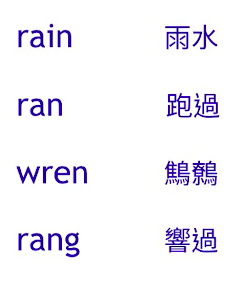

如何用「回音法」学好英文口语 史嘉琳&TEDx


は、が　句  大主语，小主语  は主格有灵魂  が主格无灵魂

は 能照顾到最后的谓语，が只能照顾到紧接着的谓语

否定强调用は，对比强调用は

は  提示重点

が排他  未知情报  是我，不是别人


原始印欧语（Proto-Indo-European）有8个格：主格、属格、与格、宾格、离格、工具格、位格、呼格。 欧洲语言的变格都是由此发展而来的。
一个名词变格后就带有了语法功能，比如一个名词变为宾格后无论放在句中什么地方就表示成为了宾语。
以拉丁文为例：
例：父亲 pater，男孩 puer，其属格 pueri；
男孩的父亲 pater pueri.
与格：作间接宾语。
例：书 liber，其宾格 librum，男孩 puer，其与格 puero，给do，其过去分词 dedi；
我给了男孩一本书 librum puero dedi.
离格：表离开的地点。（离格、工具格、位格在拉丁语中合为一格，亦称夺格）
例：罗马 romanus，其离格 roma，走 eo，其第三人称单数完成时 iit；
他离开了罗马 roma iit.
工具格：表通过某物动作。
例：杀死 occido，其被动态完成时 occisus，剑 gladius，其工具格 gladio；
被用剑杀死 occisus gladio.
位格：表位于的地点。
例：在 in，那个 illa，城市 urbs，其位格 urbe，居住 vivo，其第三人称单数 vivit；
他住在那个城市 in illa urbe vivit.
呼格：呼叫用。
例：朋友 amicus，其呼格 amice；
啊，朋友！ O,amice!


王维有一首诗，提及：“苑舍人咸能书梵字，兼达梵音，皆曲尽其妙。戏为之赠。（见《全唐诗》二函八册）


梵语转写翻译对照

Asuras 阿修罗 
Kailasa 凯拉萨山 
Kama 爱神
Kubera 财神 
Lakshmi 拉克希米(吉祥天) 
Mahabharata 摩诃婆罗多 
ramayana 罗摩衍那 
Ravana 拉伐那 
Shiva 湿婆 
Sita 悉妲（罗摩的妻子） 
Surya 苏利耶（日神） 
Vishnu 毗湿奴 
Agni 阿耆尼 阿格尼，圣火 
asura 阿修罗，魔鬼 
ātma 自我 自我，灵魂 
brahma 梵 ，梵天 
Brahman 婆罗门，祭司 
deva 提婆，天神 
Indra 因陀罗  
Krishna 黑天，克里什那 
Prajāpati 生主，生命之主
prāna 生息，生命之气，生命 
purusa 布卢沙，原人 
Rudra 楼陀罗 ，风暴之神 
shtotra 赞歌 
Vāyu 梵由 瓦由，风神 
veda 吠陀 韦达


梵文名词有八种格：　　

主格(Nominative)，　　

属格(Genetive)，　　

与格(Dative)，　　

受格(Accusative)，　　

夺格(Ablative)，　　

工具格(Instrumental)，　　

地格(Locative)，　　

呼格(Vocative)。　　
　　其中除工具格外其他七格都和拉丁文中的格对应，用法也相似，而工具格则可以在俄语中找到同类。　　梵文中的名词也有数的变化，除了单数(Singular)和复数(Plural)，还有一种数叫做双数(Dual)，用来指“两个”事物。于是8种格×3种数，每个名词就有24种变化。


梵语文法的主要特征是复杂的动词系统，丰富的名词词尾变化，和广泛使用了合成名词。梵语文法由梵语文法家在两千年多来研习和编撰著。


其中主要的是佛經的梵文本子,關於不能意譯的專名,用漢字去翻音的很多,稱為“**對音**”  董同穌-《汉语音韵学》

(1)輔音 塞音、塞擦音  鼻音  清擦音、濁擦音  邊音

普通話裏的g[k]、k[k"k]、h[x]和z[ts]、clts"]、s[s]六個聲母,只能與開口呼、合口呼韻母相拼,而不能跟齊齒呼和撮口呼韻母相拼。而jts]、qlts"].x[3]三個聲母的拼音規則正好相反。唐作藩《音韵学教程》


其三,中古平上去入四声中的平、上、去三声是指声音的高低升降,而人声则带有**[-p,-t、-k]塞音韵尾**。也就是说,平、上、去三声是音高上的非音质音位的区别,**入声则是音质音位的区别**,性质有所不同。万献初《音韵学要略》

**拼音文字**一个音节里的**每个音素都有固定的字母来表示**,不多也不少,而反切是用表示音节的汉字来拼读,**反切上字必须刨去其韵母和声调,反切下字必须刨去其声母,然后才可以作音标来使用**,否则就拼不出被切字的读音来


传统音韵学上,**声母简称“声”,或称“纽、声纽、音纽”,又或称“体语、体文、字母”等**

在没有音标的情况下,就选“帮”作为这些字所读**声母的代表字**,也就是这一类字之“母”,称为“**帮母**”

**韵目**是古代韵书中韵的标目,是**韵的代表字,也就是韵的名称**

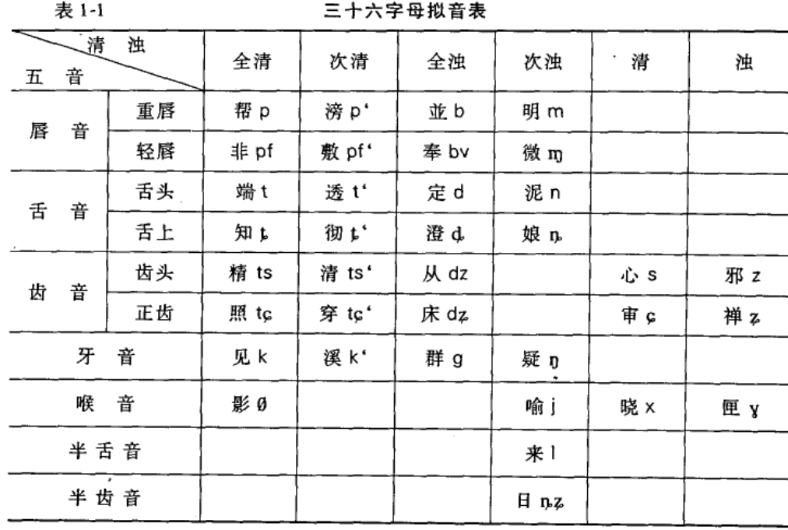


清人江永说:“**重唇音两唇相搏**”,故言“重”;“**轻唇音音穿唇缝**",故言“轻”。

全清,是指发音时**声带不颤动又不送气的清声母**,如见、端、帮等;次清,指发音时声带不颤动但送气的清声母,如溪、透、彻等;全浊,指发音时声带颤动而不送气的塞音、塞擦音、擦音,如群、定、从、邪等;次浊,指发音时声带颤动的鼻音、边音和半元音,如泥、娘、喻、来、日等。“次清”是“第二个清”的意思。《韵镜》有“清浊",是指不完全的浊,后人仿照次清而改称为“次浊”

**开、合两呼的不同实际上就是韵母圆唇与不圆唇的区别**


《**经典释文**》是隋开皇三年(公元583年)陆德明在长安独立完成的,**比《切韵》的成书还早18年**。潘悟云《汉语历史音韵学》

齐韵属于四等韵,**四等韵是不与日母配合的**


早期中古汉语反映在《切韵》及其后世版本的韵书中,显然是南北读书音的折衷(Pulleyblank 1984) 。《上古漢語詞根》 法 沙加爾

《切韵》记的是“字”音,太过于重读书音,疏于说话音


他们误以为中国各地的阳调(阳平,阳上,阳去,阳入)都是浊音字。固然,**有些方音里的阳调字就是浊音字,例如吴语**,但是,**有些方音里的阳调字却是清音字,例如粤语及北方音系**。古浊音字到了现代的粤语及北方音系里都变了清音,只把它们念作阳调  王力文集《音韵通论、上古音》


现代汉语的**日母**,在汉语拼音方案中用r来表示  日母：日字的声母

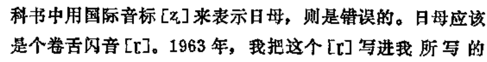

目前较为人 知的古代资料是日本法隆寺所收藏的贝叶写本，收有梵文悉昙体的【般若心经】、【佛顶尊胜陀罗尼】、【悉昙五十一字母】

约在日本推古十六年(中国隋炀 帝大业四年(608年))时，日天皇派遣隋使小野妹子与学问僧等八人赴中国，从而将悉昙文献、佛经、密教图像等文献带到日本，后存藏于法隆寺。悉昙学在日本不仅止保存妥善，甚至于演成一门独特的学问。尤其对日本天台、真言两教发展有很大影响。


卷四O“擐身”条:“上关患反。《春秋传》云:"攫甲执兵。'杜预注云: "攒,贯也。,贾注《国语》云:"衣甲也。《说文》:"贯之急也。从手畏声。”足证杜预释“摆”为“贯”,“穿衣”云云为慧琳释语。据洪诚先生的研究, “穿衣服”的概念,周人称“**衣**”,称“**服**”(动词),称“.”。……汉魏人称“**著**”。……**南北朝以后才称“穿”**。

塔考《慧琳音义》卷二七“塔”字条:“**古书无塔字**,葛洪《字苑》及《切韵》塔即佛堂、佛塔,庙也。”又卷三四“佛塔”条:“他盍反。或云


代詞 :

中古的人稱代詞比上古漢語有很大的變化，第一人稱除了繼承自上古的我，還有儂;第二人稱是由爾發展成的你;第三人稱南北朝多用伊，后來又用渠，到了唐朝，又出現了他。


不同的方音  
这是最常见的情况,**《广韵》、《集韵》的异切往往代表了不同的方音**。
**复**《广韵·宥韵》"扶富切”,又《屋韵》"房六切"。考《慧琳音义》卷27"无复"条:"下**吴音扶救反,秦音冯目反**。”扶救反”与“扶富切”相当,“冯目反”与"房六切”相当,而据《慧琳音义》,一为“吴音",一为“秦音”,说明**《广韵》兼收秦音和吴音**。

《慧琳音义》虽然宣称“吴音不取”,但在实际的注音中,还是不可避免地受到《切韵》音系的影响,它的不少注音还是免不了取用“吴音”、“江南音"

《慧琳音义》与《切韵》研究-姚永铭

《慧琳音义》为研究唐代秦音提供了有价值的资料

并认为慧琳反切所属的音系是以当时首都长安为主的“士大夫阶级的读书音”  

从晚唐五代开始,逐步形成了古白话,古白话的词汇,和现代汉语词汇有着更为密切的关系,不对古白话的词汇进行深入研究,对现代汉语词汇也就不能有透彻的理解

唐代的**《经典释文》和《慧琳音义》可说是瑰宝中之瑰宝**。由前者可以探索汉语上古形态的奥秘,由后者可以梳理汉语向近代发展的脉络

相對於陸德明的**南音音系**(**金陵的雅言**)、陸法言的綜合音系(洛陽、金陵的雅言)，那麼玄應音系可能就是**長安的雅言**和經音了。《佛经语言研究综述（音义上）》**竺家宁**  

邵荣芬《经典释文音系》（1995年） 是音系方面的集大成的著作，从首音考证出陆德明的音系，主张陆氏音系是以**金陵音为基础**的南方地区的标准语音系，具有跟《切韵》对等的地位

**陆德明** （初唐大臣） 
陆德明，本名陆元朗，字德明，因为名字犯讳，后世多称为陆德明。唐代著名经学家，著有**《经典释文》**、《周易注》、《周易兼义》、《易释文》等作品。两《唐书》有传。

火炙 征亦反。从肉在火上,会意字也。(一四.4)  《慧琳《一切经音义》研究》姚永铭

讽诵  并左形右声。(六.4)  
氛氲 ...上形下声字也。(八.9)  

囹圄  …外形内声字也。(一八.10)  

**唐** **李白**《代美人愁鏡》詩：“明明金鵲鏡，**了了**玉臺前。明白；清楚

聰慧；通曉事理。
**晉** **袁宏**《後漢紀・獻帝紀》：“**小時了了**者，至大亦未能奇也。

《二刻拍案驚奇》卷五：“**小時了了大時佳，五岁孩童已足誇。**

段玉裁在承认“省声”的同时,又尖锐地指出:“**许书言省声,多有可疑者,取一偏旁,不载全字**,指为某字之省,若家之为猥省,哭之为狱省,皆不可信。”

《说文》“省声”多有可疑,这恐怕是不争的事实。但是,如果把这笔账都算在许慎的头上,这恐怕有欠公允。清人已经认识到,《说文》省声“有传写者不知古音而私改者也,亦有非后人私改者,则古义失传,许君从为之辞也"。

但此属古今音变,**中古去声字多数来源于上古入声**。

“亡丧”条:“哭字从犬从吧,四音喧,会意字也。”此字慧琳未引据《说文》,或许《说文》本有讹误,故慧琳不从也。

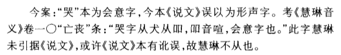

夫远不可知者,天也;近不可知者,人也。三国魏曹植《赏罚令》《魏晋南北朝文与汉文佛典语言比较研究》陈秀兰  


**计与足下别,廿六年于今**,虽时书问,不解阔怀。省足下先后二书,但增叹慨。顷积雪凝寒,五十年中所无,想顷如常,冀来夏秋间,或复得足下问耳。比者悠悠,如何可言!吾服食久,犹为劣劣,大都比之年时,为复可耳。足下保爱为上,临书但有惆怅。(晋王羲之《杂帖》, 2/1582b-1583)

**过去有王,名日月光,修菩提道**,为求法利,常呵诸欲。其王形体,**端严姝好**。才智过人,天下少双。质直不谄,所言柔软。**至诚无欺**,远离嗔恚。

例(1)是讲述月光王布施众生、济度众生的故事。文中一些普通词语在同时期的中土文献中少见或不见。如:过去、所有、端严、姝好、后时、卿等、各各、寇敌、随意、悉皆等。用“过去”表示从前, “所有”用作范围副词, **“端严” “妹好”均指女子容貌漂亮**, “后时”表示时间, “卿等”表示第二人称复数,“各各”用作表示范围的副词,用“寇敌”表示敌人, “随意”用作副词, “悉皆”用作范围副词。也有一些词语是正统文献多见

于时野猫,心怀毒害,欲危鸡命。徐徐来前,在于树下,以柔软辞而说颂曰: “意寂相异殊,食鱼若好服。**从树来下地，当为汝作妻**。”于时野鸡以偈报曰:“**仁者有四,我身有两足。计鸟与野猫,不宜为夫妻**。晋竺法护译《生经》卷一, 3/74a-75a 《魏晋南北朝文与汉文佛典语言比较研究》陈秀兰着.中华书局2008  

早期正统文献不用的词语,**判断动词“是”**出现在判断句中,如“将是太子乎?” “斯是太子定矣”。判断动词“是”也出现在“....是.…” ... "等结构中,如: “太子者,是我身也” “妻者,俱夷是" “父王者,白净王是” 


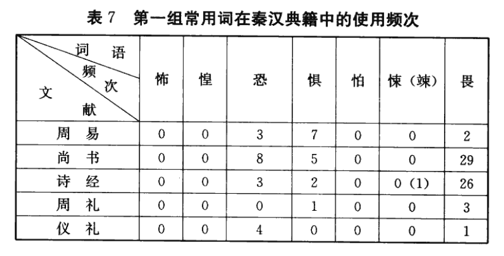


听音知意在先，见形知意在后   语言可以没有文字，不可以没有声音  

从总体上讲,《慧琳音义》的音韵系统比《切韵》简单,无论是声母还是韵母,都有不少地方作了归并,但我们注意到也有相反的情形,有一些在《切韵》系统中属于相同的音,在《慧琳音义》的注音中,却属于不同的音,这些说明**《慧琳音义》除了归并《切韵》系统的韵类以外,它也有一些韵类分得比《切韵》还细**。


“姉妹(上咨此反下每背反白虎通云姉者恣也妹者末也義取先後尊卑次也韓詩云**女兄曰姉女弟曰妹**說文從女市聲也市音茲死反妹字從末也)。”

“俳優(上敗埋反說文戱笑也從人從排省聲也下憶鳩反蒼頡篇云俳優樂人也顧野王曰樂人所為戱笑以自悅也說文俳戲也優倡也竝從人形聲字經文從手或從彳作徘優竝非)。”

Excerpt From: 唐 慧琳撰. “T2128 一切經音義.” Apple Books. 


量子电动力学确立后，确认光子是传递电磁相互作用的媒介粒子。带电粒子通过发射或吸收光子而相互作用，正反带电粒子对可湮没转化为光子，它们也可以在电磁场中产生。


“a短阿字(上聲短呼音近惡引)。

ā長阿字(依聲長呼別體作ā)。”

“e短藹字(去聲聲近櫻係反)。”

Excerpt From: 唐 智廣撰. “T2132 悉曇字記.” Apple Books. 

| 字號 |  字  |
| :--: | :--: |
|      |  仁  |

|      | 攝   | 聲調 | 韻目 | 字母 | 開合 | 等第 | 清濁 | 上字 | 下字 | 又音 | 又切 |
| ---- | ---- | ---- | ---- | ---- | ---- | ---- | ---- | ---- | ---- | ---- | ---- |
|      | 臻   | 平   | 真   | 日   | 開   | 三   | 次濁 | 如   | 鄰   |      |      |

[漢字古今音資料庫](http://xiaoxue.iis.sinica.edu.tw/ccr)  

[中国哲学书电子化计划](https://ctext.org/shi-ming/zhs?searchu=仁)

[汉语方言发音字典](http://cn.voicedic.com)  

[微盘瓶子](https://vdisk.weibo.com/u/5752060280)

[小不点搜索](https://www.xiaoso.net)  

日语的"忍者" = 汉语的“仁者” ？  

忍者读作にんじゃ，古汉语里“仁”用今天的拼音读作ning⁴  ，“者”读作jia³。可见两者的发音是一至的。

『仁』是儒学“核心中的核心”，《慧林音义》又是字书中“瑰宝中的瑰宝”，用它查最配：
“仁者(而親反周禮云德一曰仁鄭玄曰愛人及物曰仁上下相親曰仁釋名仁者忍也好生惡煞善惡含忍也)”。

可见根据古代字书《释名》的说法“仁” 字本身就有忍的含义，由此引出“好生恶杀，爱人及物”之意。另外，《易经》曰：“立人之道，曰仁与义。”  北宋的韵书《广韵》引庄子的话说仁就是“爱人利物”。

『仁』还是是第二人称you 你(不含尊敬不是您)，者后缀词尾可以不要。『者』相当于现代第一点第二点的序数第，相当于英语的th ，一者、二者、三者。后缀是虚化的成分。

上下相亲、爱人及物、好生恶杀，己所不欲勿施于人，简单来说『仁者』就是体贴的人。而『忍者』这个职业是做情报工作的，必须了解他人，“懂你”的这一要求可以从『仁』的第二人称you 得到解释。

所以结论是肯定的，“忍者”就是“仁者”。

参考资料：
竺家宁《声韵学之旅》  
周汝昌《唐诗宋词鉴赏》  
唐代  慧林《一切经音义》  


忍者发音にんじゃ，仁 发音ning⁴  者  jia³  忍者


《释名》：仁，忍也。好生恶杀，善含忍也。

人，仁也，仁生物也。故《易》曰：“立人之道，曰仁与义。”

《广韵》：仁贤庄子曰爱人利物谓之仁。[北宋] 1007年-1008年

仁者 = 仁 不等于尊者、贤者    

> 尊者是尊敬的人  
仁 发音ning⁴  者  jia³  忍者？  
仁是第二人称you 你(不含尊敬不是您)，者后缀词尾可以不要  
者相当于现代第一点第二点的序数第，相当于th   
一者、二者、三者。后缀是虚化的成分

中文名  忍者  
外文名  NINJA，にんじゃ    
【竺家宁】声韵学之旅视频  

作为东晋以及后续的宋、齐、梁、陈等南朝的官方语言，洛阳雅音在金陵（南京此时从建康改名金陵）也逐渐吸收了部分古老的吴越方言  

以东汉、西晋洛阳皇室旧音为基础，浸染金陵（南京）某些语音而形成的“金陵雅音”  

日本人渡海东来，在学习汉字的同时，又学习了作为“金陵雅音”的“吴音”，日后，日本人又在唐朝时期将长安的“唐京雅音”作为“汉音”传入，而今天的日语，正是在中国的“金陵雅音”和“唐京雅音”的基础上，融合日本本地方言形成的


在唐玄宗时代，善无畏、金刚智、不空三藏三位印度密宗大师来到中国，他们传下了密宗的教门。密宗注重护咒法修炼，和道教有很相似的地方，所以密宗和道教的理论开始深入融合


晚唐时期，密宗由中国向日本传播，在日本形成了东密。东密对密咒极为推崇，认为只要通过密宗法门的不懈努力就能使修行者发挥全部潜力，在东密的传播过程中，又深深影响了日本忍术，密宗的咒法被日本忍者大量吸收。很多忍者都是东密的狂热份子，尽管很多忍者不是刻意去修习密宗，但从生下来他们就被灌输了密宗思想，以后会不自觉的沉溺于其中或多或少的受到一些影响。


另据徐时仪先生考证,日本早在丰臣秀吉入侵朝鲜以前,至迟在明成祖永乐廿年(公元1422年)就已经从朝鲜得到《慧琳音义》


源自法语的单词“vis-à-vis” 和汉字“讎”(chóu)，无论从形还是意上都很相似。很容易注意到它们都呈现出左右对称的结构。词根vis 是look 看，vis-à-vis 两个人你看我，我看你，所以它的意思就是“face to face”，面对面。汉字“隹”(cuī)是一种短尾鸟。“讎”，左右都是鸟，中间一个言，像两只鸟你一句我一句地在说话。所以“讎”的本意是应答。例如诗经里有：“無言不讎，無德不報。”《詩・大雅・抑》。由应答引伸出报答，应答是回应别人说的话，报答是回应别人对你的好。又引伸出报复，即对恶的回应。

visa 签证
来自拉丁语charta visa, 即验证过的文件；visa, 看，词源同visage, charta, 纸，词源同chart.

vista 景观，远景，展望
来自拉丁语videre, 看；-st, 过去分词格。引申词义景观，远景，展望等。

perspective  
视角；观点；想法  
远景；景观   


二  再来一个  
欠  哈欠  
篆文两隹并列，二鳥成双，一呼一应，讎  
vis-à-vis  face to face  vis-à-vis/ ˌvi zəˈvi; French vi zaˈvi /  
> 讎 《拼音》chóu  
 1. 應答；報答。
《詩・大雅・抑》：“無言不讎，無德不報。”
  - 隹 《拼音》cuī  1. 短尾鳥。  

儔  chóu 伴侣  
> 嵇康《赠史秀才入军》  
鸳鸯于飞，啸侣命俦。  
朝游高原，夕宿中洲。  
交颈振翼，容与清流。  
咀嚼兰蕙，俛仰优游。

逑 qiú 配偶  
>《詩・周南・關雎》：“窈窕淑女，君子好逑。”  

仇有正负两义：嘉偶曰仇，《诗经》“君子好逑”又作“君子好仇”；怨敌曰仇，仇人仇家。《白鱼解字》  


「佢」应作「渠」，粤语作第三人称“他”之意，古诗词常用到，如朱熹的诗：问渠那得清如？陆游：移灯看影怜渠瘦

日本韩国越南都有古本唐诗集，尤其是日本宋代善本极多，一对比就知道是否被篡改的了

粤语的性质：

唐代岭南节度使~南汉国百姓，模仿唐代官话的后代。

残留大量南朝金陵通语的词汇，比如「佢」「衫袖」


吴语的性质：

唐代镇海军节度使~吴越国百姓，模仿唐代官话的后代。

残留大量南朝金陵通语的词汇，比如「佢」「衫袖」，衫袖 保留在温州、台州、永康、诸暨等地。


闽语的性质：

孙吴国闽地的百姓，一直说孙吴语说到21世纪。

虽然也有「模仿」晋室南迁带来的中古汉语，但跟吴粤对唐官的模仿相比，

闽地百姓简直算不上模仿，他们只是把南朝金陵音当做「新吴音」而已，跟日语性质一样。

孙吴国的核心词汇，比如「伊」「手䘼」，

被「佢/衫袖」围剿了一千七百年，仍然生存到了21世纪。

而南方相对较为封闭，受此影响较小，所以南方方言尤其是比北方官话更接近中古汉语。其中尤其**闽方言**，相对其他方言来说，与两汉时期汉语最接近，算是现今流行汉语方言中，**最古老**的一个了。

日语的jyō来自金陵音，tei来自长安音。

南宋周去非的**岭外代答**记录的当地白话用词，在今日仍大量使用


古代反切不止一套，不同的韵书（字书、音义）有不同的反切，《切韵》、《玉篇》、《经典释文》、《玄应音义》、《慧琳音义》各不相同，理论上每一套反切都该总结出不同的拼法，编写不同的工具书。实际上，基于《切韵》系韵书独一无二的地位，只有《广韵》有这样的待遇。


下女夫詞  賊來須打，客來須看  南華大學敦煌學研究

希伯来语: עִבְרִית 是犹太民族的语言，以色列国通用语言，为世界上较为古老的语言之一“希伯来”意为“渡河而来”，属于闪含语系闪米特语族的一个分支，没有元音字母，只有22个辅音字母，其文字从右往左书写。


“塔”是随着佛教传入中国以后产生的一个新词  《一切经音义》与词语探源-姚永铭   


转述赞美  
说事实预热  
谈感觉升温  
共鸣点保留  
无话时抛出    


**像诗的关键**  **写感受，不写道理**  
 > 结庐在人境,而无车马喧    
**山气日夕佳,飞鸟相与还**   
> 相与：**共同**  一道   
 **相处** 交往 《红楼梦》第三三回：“他近日和衔玉的那位令郎**相与甚厚**。”  
**交好的人** 《红楼梦》第八四回：“ 王尔调 陪笑道：‘**也是晚生的相与**。’”    

麻木不仁 仁是己所不欲勿施于人  
仁是儒学核心的核心  
**仁是体贴**  我是他应该怎么样  

**ptk音变**  
> わ**た**し、あな**た**、じ**て**んしゃ  
**t 全部发成d**  
**p、t、k声母开头的假名**，**不是在句首就会发生音变**。也就是從送氣音**變成不送氣音**
英文station的t會唸成/d/；spider的p會唸成/b/  
都是为了发音方便  

**母音延長**  **i  u, えー、おー！**  
> せん**せい**  [sen**seː**]  
お**とう**さん  [od**oː**san]   
**i う 遇到え、お 就失声了，え、お发长音**    

**母音清化  す**
> です  [de**sɯ̥**]   
其中[ɯ̥] 就是發音清化的「す」的唸法
母音清化就是只唸出子音，而且**聲帶不震動**  
然而嚴格來說，並不是不唸出/u/，而是/u/發生輕化，變得不明顯  
在唸「です」的「す」時，嘴形還是要保持/u/  

伪造古韵最难, 因为**直至明来陈第以前, 并没有人意识到古今音韵的不同**  《汉语诗律学》王力  

**3+1八度轮回**

三线一间、三间一线(一个轮回) 

> 往上下数三线一间或三间一线就是**另一个八度音**  

**四三拍 分母开始念**    
**单拍(子)单强，复拍(子)复强**  
**23、469拍常见，分母4、8常见**   

八度、五度和四度  
> **振动频率1:2、2:3、3:4  组成的泛音会引起舒适**   
2  1.5  1.33   
总是以**大三和弦开始结束**，它是地心引力  

**小度认音名，小程认半音**    
**小程：你只说度数我哪知道有几个半音？给你加上大小增减纯**  

**aug是增**  **dim是减**  

**声母介音主元音韵尾**   

**清  悄悄话**  
**浊  非悄悄**  

**舌尖元音全部由i 演化而来**   

清浊  **声带振否**   
送气  **气多气少**  
> 声带振动 **声音大** **浊音** 薄膜关闭，振动  
声带不振动 **悄悄话** **清音** 薄膜打开  
声带是两薄膜，合起来的初始状态  
**b p 英是清浊的差别，我们是送气不送气的差别**  
p p' **清音、送气清音**  **右上一撇表送气**    
b b'  **浊音、送气独音**    
k  k'  
g  g'   
**英文是上下的区别p b一清一浊，中文是左右的区别一不送气一送气p p'**      

**魚**  **ŋjo ˦˥** nio² **兒**  **ni²** **李白念法**      

斜 zia² 〜 z变清音s sia² 〜 xia² 〜 xie²  省力原则  
**汉字所有的ie(n) 都是ia(n) 变来的**     
远上寒山石径**斜**，白云生处有人家。
斜(xia²) 演变成今天的xie²     

**日语 日 に**    
**中古汉语 日念ni ，和今天的日语的日(に) 一至**  

**平入清 去入清浊**  粤语  
> 入声时长少一半  
**跳音时值是原来的1/2**    


### 中央C  
> 小字一组的**c¹** 或记作**C4**  

钢琴88个键，52 白，36 黑  
> 52 36 88    
**小1** 2 3 4   
**大1**  大  小  **小1**  
**两黑夹一白re，两端是do mi**  
**三黑夹两白sol la，两端是fa xi**  

**固定调唱名法**  五线谱  无需转调  
**首调唱名法**  简谱  音高要整体偏移几个半音  


### 小度
> **3+1八度轮回**   
和弦 线线线、间间间  
**线间两度线线三度**  **上行两度音**CD，**下行两度音**DC  
**线间两度、线线三度**  
**大M是Major，小m是minor**  

### 小程  
> **线间全  线线全全  线线间全全半**  


**高音谱**  

>上行线 c e g b d f a   
上行间 d f a c e g b   
**上行线 c e g  下行线 f d b**     
**上行间 d f a   下行间 g e c**     
二线G    
### 下一上二间三C     
> **1  2  3  哚  哆  哆↗**    

**低音谱**  
> 上行线 e g b d f a c  
上行间 f a c e g b d  
 **上行线 e g b  下行线 a f d**     
**上行间 f a c   下行间 b g e**     
四线F    
### 上一下二(间？)C       
> **1  2  ？  哚  哆  哆↗**    

**全休止**符像一盏**吊灯**   
**二分休止**符像放在桌上的**台灯**   
**四分休止**符像**钉子**    
**八分休止**符像**数字9**   
**十六**三十三六十四在**9上加灯泡**    


四声五度标记  阴平  阳平  上  去  
> 55  35  214  51  


跳音短促指尖弹，   
连线弹奏不抬腕，    
断奏跳音都抬腕，    
双音和弦不抬指，  
和弦指法不固定。  

断奏是雨点，  
跳音是急雨，  
连奏是流水。  
钟子期曰：  
『善哉，洋洋兮若江河』，  
可见伯牙鼓琴当时用的是连奏。  

苏州话字书乡音字类出版
> 1877  

国际音标制定的年份      
> 1888  


高音谱表
> 二线上是**小字一组**的 G(g1)  
下加一线是**中央 C(c1)**

记音符  蝌蚪的发育  
> **受精卵**全音符、**开眼蝌蚪**二分音符，**闭眼蝌蚪**四分、
**一尾**八分，**二尾**十六分，**三尾**三十二分  

找音 
> 线线线   
**do mi so si re fa la**  
do la **朵啦 下加一，上加一**    
上行 **mi so si**  **米说西**  
下行 **fa   re si**  **法约西**  
找音注意奇数和偶数的变化，**越过了si(7)就会发生奇偶切换**，在此之前都是**奇奇奇，偶偶偶的规律**    


**五个手指**    
> 12345  
**1 是拇指，5 是小指。告诉我们用哪个手指弹什么音**

**断奏**  断奏是雨点  
> 32415 按这样的顺序进行手指的训练    
**没有写连线的音用断奏的方法弹**，每个音都是断开的，  **每个音都要把手腕抬起来**     
**把手放在琴键上数完4拍之后再开始弹**    
**大臂带动小臂，最后提手腕、手指轻柔落下**，不是砸  
手臂手腕不要向手指施压  
**用胳膊的重量弹，而不是力量**      

**跳音**  跳音是急雨  
> **跳音是急促版的断奏**    
每个音也都是断开的，但是每个音更短促一点  
**手指通过指尖的弹性弹跳起来**，手腕如果不放忪声音会显得机械   

**每个音都要把手腕抬起来**     

左手的跳音完了以后是右手的连奏  
**连线弹奏结束前不可抬起手腕**     
左手的**跳音要注意声音的短促和手腕的放忪**    
连奏线上谱表写，下谱表不写，但是**下谱表是要跟着连奏**  
即有上又有下那么**尾巴朝上的音符右手弹，朝下的左手弹**    
弹奏**双音或和弦的断奏不需要抬手指**   


自然大调
> 听起来像12345671的音阶     
自然大调音阶的音程结构为：    
**全全半全全全半**    

C小调   
> 有三个降音  
是以C为主音的音调  


从零开始学钢琴-童薇  
音乐奥秘解码-轻松学乐理  
大家都来听古典-吉松隆  

____

示例（使用Template:IPA表示英文字“characters”的发音）：

```
{{IPA|[ˈkæɹəktə(ɹ)z]}}
```

您的浏览器实际显示：

| 当不用template:IPA时： | [ˈkæɹəktə(ɹ)z] |
| ---------------------- | -------------- |
| 当使用template:IPA时： | [ˈkæɹəktə(ɹ)z] |


**庄和诚《英语词源趣谈(第2版)》【MDX**

girl /g:l/ n.女孩;年轻女子;女朋友
这是个再普通不过的词,今指"女孩"、"姑娘"、“年轻女子"或“女朋友"。但在中古英语中,从13世纪至15世纪girl拼作girle/gurle,是个不分性别的词,"既指“女孩或“年轻女子”,也指"男孩或年轻男子",所以当时常用knave girle指“男孩”。girl在英语中出现之前的历史和出处已无从查考,在其他任何语言中也找不到有亲缘关系的词,在英语词源学中可说是个不解之谜。例 When she was a little girl, she dreamed of becoming a ballerina.
当她还是个小女孩的时候,她就梦想当一名芭蕾舞女演员。
They've had a baby girl.他们已经生了个女婴。
John took his girl out dancing every Friday. (NED)约翰每逢星期五就带女朋友出去跳舞。

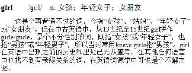


也就是**英语史上所谓的“元音大移动” (GreatVowel Shit)**。凡是长元音都将舌位顺序提高一级,也就是原来口较开的元音都变为口较闭的元音。而舌位最高或口最闭的**元音[i]和[u],又分别变为二合元音[ai]和[au]**0。这样,整个英语元音系统就发生了极大的变化。口语的发音大变,而书面语的拼写不变,当然拼写与发音之间就产生了很大的差异。桂灿昆《美国英语应用语音学》 


