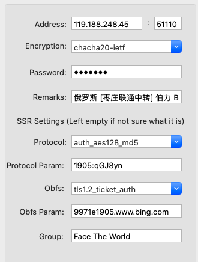

# 知乎大佬

> 王赟 Maig [z](https://www.zhihu.com/people/maigo) 
>
> 酱紫君 随机取牌算不出 24 点的概率是多少[z](https://www.zhihu.com/question/307729091/answer/1119004801)
>
> 上野  玄日语 史学 宗教学 音韵学 古希腊埃及语 和声学 语言学[z](https://www.zhihu.com/people/gao-peng-yu-77)
> UntPhesoca  古典音乐/语言学/ACG/轨道交通 [z](https://www.zhihu.com/people/UntW)
>
> 移影残风 [Git源码编译](https://zhuanlan.zhihu.com/p/74953334)
>
> stevenliuyi [latex-alpha2 latex+mma](https://www.zhihu.com/question/23207757/answer/611107795)
>
> Hadesth [mma高数笔记](https://zhuanlan.zhihu.com/p/93558801)

# MMA大佬

> [李宣](https://lixuan.xyz/blog) [GIF MMA编码](https://lixuan.xyz/blog/2019-10-29/2276.html)
> [苹果](http://chenminqi.github.io/)

# Github大佬

> [为什么我从vue转到了react?](https://github.com/coppyC/blog/issues/9)  [git issue blog很nice]()
>
> [markdown-nice](https://github.com/mdnice/markdown-nice)
>
> [搭建备用梯子：V2Ray + WebSocket + TLS + CloudFlare](https://printempw.github.io/)


# Pdawiki大佬 

> [ying汉大词典（第2版 陆谷sun）](https://www.pdawiki.com/forum/thread-35800-1-1.html) [漢語ＢＩＧ ｃｉ典3.0](https://www.pdawiki.com/forum/thread-37586-1-1.html)
>
> [MDX词典打包工具](https://www.pdawiki.com/forum/thread-36415-1-1.html)
>
> [自购美亚New Partridge Dictionary 2nd Edition](https://www.pdawiki.com/forum/thread-36045-1-1.html)
>
> [Dorland’s Illustrated Medical Dictionary 道兰氏图解医学词典](https://www.dorlandsonline.com/dorland/home) [p](https://www.pdawiki.com/forum/thread-29190-1-1.html)


# Geek大佬

> [How to use yes command ](https://www.howtogeek.com/415535/how-to-use-the-yes-command-on-linux/#comments)


# 免费论文

> [广西壮族自治区图书馆](http://www.gxlib.org.cn/) 
>
> [小众软件 IPFS图书](https://meta.appinn.net/t/ipfs-i-book-in/14123)

# 快速原型开发

- **Mathematica**

  > [Computational Linguistics](https://community.wolfram.com/content?curTag=computational linguistics)
  > 翻译多语字幕，标注单词音标语法、上传B 站
  >
  > [ASS-字幕格式规范](https://github.com/weizhenye/ASS/wiki/ASS-字幕格式规范)
  >
  > [FFMPEG流媒体](https://www.cnblogs.com/tocy/)

## pure function 移值

- **Haskell**

### 跨平台移值

- **C++**

# DATA

## Mac

### mac mount iPhone as drive

- # iExplorer

- [How can I mount an iPhone as a drive on OS X](https://superuser.com/questions/465394/how-can-i-mount-an-iphone-as-a-drive-on-os-x)

mac mount Android as drive

- **Syncthing** 是一款开源的点对点文件同步工具，可以运行在 Linux、Windows、Mac、Android 和其他（抱歉，没有iOS）

- SyncMate Expert

- > **Create a FTP/SSH server on Android and mount the server on OS X**. See [Map FTP server as a (local) drive in Finder](http://superuser.com/q/149385), [mount_ftp -- mount a FTP filesystem](https://developer.apple.com/library/mac/documentation/Darwin/Reference/ManPages/man8/mount_ftp.8.html). In Linux, one can use `curlftpfs`, but it seems not to be available for OS X. But anyway, you got the idea.

- >  **[USB Mass Storage Enabler](http://forum.xda-developers.com/android/apps-games/app-universal-mass-storage-enabler-beta-t3240097)** (This is an app that can mount the memory card in UMS mode, created by me)

## Android

> On Android 6, the following worked for me:
> Enable developer options (settings > about phone > keep tapping on 'build number')
> Settings > Developer options > Networking > Select USB Configuration > MTP (if it's already on MTP, switch to something else, then switch back to MTP).


# 建站

- echodict.com

  > Namesilo 域名注册
  >
  > cloudflare 域名解析

    - DNS、CDN 配置

  [全站HTTPS已启用](https://www.spiritdemon.com/tag/cloudflare/)

- voicetube.com

## 腾讯云

[腾讯云qq 1234](https://cloud.tencent.com/ qq 1234) 

# virmach

[virmach](virmach.com) gmail silu  2.25$ /month，做梯子测试

[hostodo](hostodo.com) 20\$ / year 建站

[buyvm](buyvm) 8\$ /month 贵，或许质量好？

## Namesilo 域名注册

### DNS 解析

**方式一：A + A**

- **第一条：**HOSTNAME：空，ADDRESS：主机 IP，TTL：3600
- **第二条：**HOSTNAME：www，ADDRESS：主机 IP ，TTL：3600

[Namesilo 域名注册](最便宜的国外域名注册商是Namesilo，主机不占优势，毕竟公司才成立不到10年，适合大量注册域名，可以省下不少资金。一站式国外域名注册商是Wealthyaffiliate，即富裕者联盟，或简称WA；成为它家会员可以享受一站式服务，你建立网站的各方面全都准备好了，只需要您花点时间学习下而已，当然前提是你英文要过关哟，因为WA平台上有全球各国的人士在上面，社区很热心，只要你有问题，留言一下，或者在线聊天，很快就有答复)

> [在线ping 站长之家](http://ping.chinaz.com/)
> [服务器运维](https://github.com/chengziqaq/Ubuntu-xfce-VNC) 
> [Fiddler抓包 网络crawler](https://www.52pojie.cn/thread-1124180-1-1.html)
> [hostwinds 主机](hostwinds.com)
> [Colab自动重连](https://zhuanlan.zhihu.com/p/100871755)
> [MMA截图和控制鼠标](https://zhuanlan.zhihu.com/p/33361062)
> [Blender Python2D动画](用Blender来学习Python创意编程，实现傅里叶级数可视化https://zhuanlan.zhihu.com/p/92267080)


## CloudFlare  CDN加速

- 隐藏IP

- 免费SSL证书


#  Zeit integrate with Github Cloud Develop

[zeit.co](https://zeit.co/)  


## SWR

[React Hooks for Remote Data Fetching](https://swr.now.sh/)

[SWR：最具潜力的 React Hooks 数据请求库](https://zhuanlan.zhihu.com/p/89570321)

[swr 源码解析](https://github.com/wendellhu95/blog/issues/23)

[zeit now 反向代理](https://sunsea.im/add-free-cdn-from-zeit.html)


## 不备案域名

不用 80 端口，不放违规内容，别被黑客利用放违规内容应该就没事


## VPS

- virmach.com
  - 支付宝 25\$ per year  2.25\$per month
- hostodo.com
  - 支付宝 20\$ per year, 5\$ per month 
- racknerd.com
  - 支付宝 23\$ per year, 6\$ per month
- budgetvm.com
  -  支付宝 8\$ per month
- hostwinds.com
  - paypal only

# NAS


## 使用群晖Docker 安装Jellyfin 家庭影院

- [smzdm](https://post.smzdm.com/p/a6lnxg3g/)


## 黑群晖 FastConnect：自定义域名+内外网访问，比QC更顺滑

- [蜗牛星际](https://zhuanlan.zhihu.com/p/73482384)

- [frps服务器](https://zhuanlan.zhihu.com/p/73482384)

- [有许多互联网分享精神的站长共享了自己搭建的 frp 服务器]()


## 树莓派NAS 个人网站


# 数据 + 技术 + 速度

- 数据
  - epwing 日语、汉语大词典；mdx 英汉大词典
  - 双语字幕
- [toml](https://github.com/toml-lang/toml) json markdown html 

- MMA 原型开发  + SwiftUI 展示 + SDL 全平台移值

- 仿粤语U学院、忆术家、多邻国，做一个学习软件

- [category-theory-for-programmers-print](file:///Users/vvw/Documents/GitHub/books/chinese/技术/category-theory-for-programmers-print.pdf) 


# 超级马里奥

- [source fork](https://github.com/Enzo-Liu/monao)
- [blogspot](http://mokehehe.blogspot.com/)  
- [YouTube - Making 'Super Nario Bros.' in Haskell](http://www.youtube.com/watch?v=gVLFGQGRsDw&fmt=18)

- [origin source code](https://github.com/mokehehe/monao)

- TO DO
  - 移值Swift, C++, Mathematica

- [SimpleNES](https://github.com/amhndu/SimpleNES) 
  - C++11 SFML

# 跨平台开发

- Haskell + SDL 超级马里奥

  - [blogspot](http://mokehehe.blogspot.com/)  
  - [YouTube - Making 'Super Nario Bros.' in Haskell](http://www.youtube.com/watch?v=gVLFGQGRsDw&fmt=18)

  - [source code](https://github.com/mokehehe/monao)

- SDL 支持所有桌面和移动平台
  - SDL officially supports Windows, Mac OS X, Linux, iOS, and Android

- 可以上架steam 商站

- [Haskell to WebAssembly compiler](https://github.com/tweag/asterius)

- Armadillo
  - C++ 矩阵运算库

## Cygwin

- 装cmake, g++
- mount 命令可以看到windows 磁盘目录被挂到哪里

## Windows

- sudo passwd will change the password of the WSL root user

# Deep Leaning

- **《深度学习入门：基于Python的理论与实现》**
- [Haskell井字棋](https://crypto.stanford.edu/~blynn/play/tictactoe.html) 
- [haskell神经网络实现](https://gist.github.com/masterdezign/34ab610715df7dbf504cbe7cacdba68e) 
- [10 Days Of Grad: Deep Learning From The First Principles](http://penkovsky.com/neural-networks/day1/) 10天学梯度：深度学习原理
- 美丽之问：宇宙万物的大设计


## Python for windows
> C:\Users\Administrator\AppData\Local\Programs\Python\Python38  默认安装位置
>
> D:\usr\Python38 自定义完装位置

- ```
  pip3 install jupyter
  ```


## 算法

> https://reference.wolfram.com/language/GraphUtilities/ref/PageRanks.html
>
> https://www.mathworks.com/help/textanalytics/ref/textrankscores.html
>
> https://github.com/YevaGabrielyan/tldl


# PC 开发


跨所有桌面平台

- [Avalonia](https://github.com/AvaloniaUI/Avalonia)  [Avalonia studio]()
- [WebWindow](https://github.com/SteveSandersonMS/WebWindow)


# Web云开发


# SVG Animation

- [Invention 13 by J. S. Bach  Synchronizing Scalable Vector Graphics (SVG) to Music](https://codepen.io/sgestrella/pen/OqONXW)
  - SVG 音画同步

- [Making 'Super Nario Bros.' in Haskell](https://www.youtube.com/watch?v=gVLFGQGRsDw)

## .Net Web方案

- [F#+Fable+Elmish](https://www.slaveoftime.fun/)  实现的动画控件不错

  - ### React 的另类用法系列（俄罗斯方块）

- [websharper](websharper.com)

- **Bolero: F# in WebAssembly**

- ASP.NET CORE Client-Side 是WebAssembly技术

- **Blazor**  .NET 类Electron跨平台框架(非微软官方)

## React 方案

- **SSR**  服务器端渲染(Server Side Rendering)
- 微前端

> [tailwindcss](https://github.com/tailwindcss/tailwindcss) [styled-components](https://github.com/styled-components/styled-components)  FFmpeg+RTMP推流 [wasm+ffmpeg前端剪视频](https://zhuanlan.zhihu.com/p/40786748) [2](https://zhuanlan.zhihu.com/p/67759237) 
>
> [微信知乎Markdonw排版工具  React Markdown编辑器](https://github.com/mdnice/markdown-nice) 
> http://dabblet.com  
> https://noderun.com  
> https://codepen.io 
> 网易云音乐云盘  免费存mp3
> 利用CloudFlare Worker 免费部署 JSProxy 服务
> https://chwl66.github.io/post/pLeXJDL_N/
> https://github.com/EtherDream/jsproxy-browser
>
> Chrome 印象笔记·**剪藏插件**
>
> [HTTP 缓存](https://zhuanlan.zhihu.com/p/59150268)
>
> **electron专家** https://newsn.net/category/electron/1/
>
> [RNStudyNotes](https://github.com/crazycodeboy/RNStudyNotes)

# APP开发

## Xcode 开发IOS 应用不能用越狱手机

## 测试

- **免费的的苹果开发者，必须提供爱思助手安装，无法扫码安**[装](2020最新苹果App真机调试测试详细教程)

- 测试证书

  > iOS证书申请这里用到一个工具Appuploader，可以在mac win linux系统中辅助快速申请iOS证书，不用Mac钥匙串助手，直接得到p12.mobileprovision ios证书文件，直接拿去打包IPA！很方便很快的创建iOS推送证书

- Appuploader [url](http://www.applicationloader.net/)

  - 支持Mac、Windows、Linux
  - 可以申请测试证书、APP 上架

- 爱思助手

  - 用助手安装软件可以验机有无暗病
  
  - 爱思开发者商店可以上架应用 
  
  - 安装命令行工具代码：xcode-select --install
  
    自签命令代码：codesign -f -s - --deep /Applications/i4Tools.app

# Win10 WSL | Ubuntu 18.04 with Xfce & Xrdp


## MUST make sure that the XRDP doesn’t use port 3389 

- which is used by Microsoft RDP (in case if your Windows 10 is already configured for RDP)


```
sudo apt install xfce4
sudo apt install xrdp
sudo echo xfce4-session >~/.xsession
sudo service xrdp restart
```


### Change the port from 3389 to 3390


```
vi /etc/xrdp/xrdp.ini

service xrdp restart
```


## Use Win10 remote destop to connect


Press Win key -> 附件 -> 远程桌面

> input: 
>
> localhost:3390


## Install chrome on Ubuntu18.04 

```
wget https://dl.google.com/linux/direct/google-chrome-stable_current_amd64.deb
```


## 网课

### Lebus

- [技术主页](https://juejin.im/user/5cbd3f35e51d456e8240dcf1)
- [cctalk 网课](https://m.cctalk.com/inst/s9vfhehl)  
- 2020更新**SwiftUI-iOS13+Swift5.1+Xcode11** 跟Lebus学iOS开发-进阶版
  - [试听](https://www.bilibili.com/video/av56005269)
  - [get set](https://www.bilibili.com/video/av56005269?p=3) 函数
    - remain2 // 回调get 函数，返回当前余额
    - remain2 = 7000  // 回调set 函数，相要余额是7000 ，打印买不买得起iphone ，还是只能买小米
      - 赋值是真赋值 内部的newVule 就是新值，但是get 又可以返回别的东西，不返回newVule 
      - 所以set 的时侯就是一种希望，如果它是这个值会怎么样的逻辑，只是打印买得起或买不起

> [Ass字幕上下标](ASS字幕（ae字幕-Aegisub）制作数学符号中的上下角标https://www.jianshu.com/p/b027c364def5)
>
> [VLC IOS开源播放器](https://github.com/videolan/vlc-ios)
>
> ffmpeg推流


# 语言学习

## Dictionary

[wordsense.eu](https://www.wordsense.eu/universal/)

[dictionary.com](https://www.dictionary.com/browse/vis-a-vis)

[jisho.org](https://jisho.org/)

[merriam-webster.com](https://www.merriam-webster.com/dictionary/cacoethes?src=search-dict-hed)

## IPA 国际音标

1. [国际语音学会手册](https://www.internationalphoneticassociation.org/content/handbook-ipa)
   《Handbook of the International Phonetic Association : A Guide to the Use of the International Phonetic Alphabet》
   - 可以下载到多语种真人录音，包括粤语、英语、日语、法语、德语、俄语、印地语、希伯来语等等
2. [東京外国語大学 国际音标教学](http://www.coelang.tufs.ac.jp/ipa/english/consonant_pulmonic.php)
   - IPA真人发音，有英文解说
   - 日语语法，有中文解说
     - [日本語文法日本語文法](http://www.coelang.tufs.ac.jp/ja/zt/gmod/)
3. **英語語音學** (含發音練習) 外文系  **Karen Steffen Chung 史嘉琳** [tw](https://e10aa8944c668c5e049e3851c3215aaa.cloudflareworkers.com/-----http://ocw.aca.ntu.edu.tw/ntu-ocw/ocw/cou/101S102)  


## 英日粤

>  **英語語音學** (含發音練習) 外文系  **Karen Steffen Chung 史嘉琳** [tw](https://e10aa8944c668c5e049e3851c3215aaa.cloudflareworkers.com/-----http://ocw.aca.ntu.edu.tw/ntu-ocw/ocw/cou/101S102)  
>
>  Peter Ladefoged 语音学教程
>
>  [国际语音学会手册](https://www.internationalphoneticassociation.org/content/handbook-ipa)
>  《Handbook of the International Phonetic Association : A Guide to the Use of the International Phonetic Alphabet》
>
>  【生肉】【N2】【日本文学史】0からまなぶ文学史 [bili](https://www.bilibili.com/video/av68712583?p=1) [yutu](https://www.youtube.com/watch?v=RARlZtbiIiQ)
>
>  (02)言語学入門　CH1　音声学と音韻論(2)[汉](https://www.bilibili.com/video/av41733498/?spm_id_from=333.788.videocard.2)  
>
>  [(01)言語学入門　CH1　音声学と音韻論(1) .md](./doc/lang/Japanese/言語学入門)  
>  [ipa-chart-with-sounds-version-3 IPA图表带发音](https://www.internationalphoneticalphabet.org/ipa-sounds/ipa-chart-with-sounds-version-3/)
>  /Users/XXX/Library/Caches/Google/Chrome/Default/Cache  找到缓存的mp3文件
>  [ipa在线输入](https://ipa.typeit.org/full/) 
>  [汉语拼音与国际音标对照表](https://zhuanlan.zhihu.com/p/99512131) 
>  [粤日英法国际音标转换](https://easypronunciation.com/zh/japanese-kanji-to-romaji-converter)  
>  [粤语发音词典](http://www.yueyv.com/)
>  [粤语U学院]()   
>  [日英词典](https://jisho.org/)
>  [汉语语法](《魏晋南北朝文与汉文佛典语言比较研究》陈秀兰) 
>  [美国英语应用语音学.桂灿昆 第九章]()  
>  [谢孟媛文法视频课程讲义]()  
>  [English Grammar in Use]() 
>  [Speech and Language Processing-Daniel Jurafsky, James H. Martin (2008)]()

### 日语

- [jisho](https://jisho.org/)

  > 日语的WolframAlpha

- [jlptsensei](https://jlptsensei.com/complete-jlpt-grammar-list/)

  > 完整的JLPT语法单词列表

- [楽しい Japanese](https://www.tanoshiijapanese.com/)

  > 动漫日语视频解说

- [jlptstudy](https://jlptstudy.net/)

  > 历年真题句子翻译

- [東京外国語大学 日本語文法日本語文法](http://www.coelang.tufs.ac.jp/ja/zt/gmod/)

  > 竟然有中文翻译

# 字典制作

> [Epwing数据导出](https://github.com/cegfdb/zero-epwing)
>
> [Goldendict 支持epwing可导出词头]()
>
> ([bob Mac开源取词翻译](https://github.com/ripperhe/Bob)  )
>
> [**MDict 文件格式分析**](https://bitbucket.org/xwang/mdict-analysis/src/default/)
> [**AnkiWeb**插件](https://github.com/finalion/WordQuery)
> [FairyDict](https://github.com/cegfdb/FairyDict)  
> [pdawiki Python辅助MDX转MOBI](https://www.pdawiki.com/forum/thread-36130-1-1.html)
>
> [JMdict, KANJIDIC](https://github.com/ezhmd/cham-jp-deck)
>
> [字幕 吹响！悠风号/響け！](https://bbs.vcb-s.com/thread-997-1-1.html)
>
> [Extracting subtitles with FFmpeg](https://sinestesia.co/blog/tutorials/extracting-subtitles-with-ffmpeg/)
>
> [《英汉医学大词典》](https://www.pdawiki.com/forum/forum.php?mod=viewthread&tid=29020&page=1#pid779395)
>
> [前端如何控制GIF的播放和暂停](https://www.jianshu.com/p/d5cc47f6a998)
> [《全医08总动员重新修訂版 》](https://www.pdawiki.com/forum/forum.php?mod=viewthread&tid=2559&highlight=%E5%8C%BB%E5%AD%A6)

### epwing


#### 制作工具

 [EBStudio2](http://ebstudio.info/)


#### 解包工具

[ebdump](http://ebstudio.info/home/EBDump.html)  注册Key：Mt.Yari  度盘有exe


##### 用ebdump提取epwing词典的文本

1. 运行ebdump，如果不是日文的操作系统，可以用apploc的日文方式shift jis运行ebdump
2. 点击第一个菜单，打开文件，选择需要转化的词典目录DATA\HONMON或HONMON.ebz
3. 选〔00〕本文，右边会出现blks的数目，就是具有多少条目；
4. 出力xxx 填入blks的数值；
5. 选“记述子(1)”或“plain text(2)”
6. 文字xxx 选shift jis
7. 下面的其他选项都为空白，路径可以选一个
8. 按右边的按钮xxx(T)就可以生成需要的文件了。
9. 转出来的文件是全角full-width，可以转为half-width (emeditor)；
   编码是shift jis，可以转为unicode(utf-8) (editpad或emeditor)
10. <A121>等是外字，可以参考ebdump的目录里面 的文件Gaiji.xml 和Gaijimap.xml来替换为unicode编码
11. 如果选择记述子的话，会有一些控制符号类似<1Fxx>，可以帮助编辑为正确的html格式（如词头、解释、黑体等等)。详细的转化可以参考这里
    http://www31.ocn.ne.jp/~h_ishida/EBStudio/Tech.html
    下载ebdump
    http://www31.ocn.ne.jp/~h_ishida/


#### 汉语大词典的外字还原

1. mdx 文本制成ebwing 格式
2. 利用新生成的外字信息对比ebwing汉大的外字


# 深度学习

> 深度学习入门：基于Python的理论与实现  Deep Learning book  introduction to hmatrix
> category-theory-for-programmers
> 编程中的数学-刘新宇
> Elementary-Algorithms-and-Data structures-Larry LIU Xinyu
> [《动手学深度学习》](https://github.com/d2l-ai/d2l-zh)
>
>   - 可运行的**Jupyter note**

## Python for Windows

> C:\Users\Administrator\AppData\Local\Programs\Python\Python38
> D:\usr\Python38
>
> pip3 install --upgrade pip
>
> - whoami
>
> - net user administrator
> - where cmd
>
> ```
> pip3 install jupyter
> cd /d  E:\GitHub\doc\lang\programming
> 
> ```

## Python for Mac

> which python3
> which python3.8
>
> which pip3.8
>
> pip3.8 install jieba
>
> sublim text 配置
>
> {
> 	"shell_cmd": "python3.8 ${file}"
> }
>
> \# encoding=utf-8
>
> \# 使用 coding: utf-8 设置中文编码只在 Python 3 有效
>
> import sys
> import codecs
> sys.stdout.reconfigure(encoding='utf-8')
> print(sys.getdefaultencoding())  # python3的系统编码
> print(sys.stdout.encoding)          # 标准输出的编码


# 语音分析

> [praat 开源的语音分析软件](http://www.fon.hum.uva.nl/praat/)  
>
> [Bilibili - Praat语音分析软件用法详解](https://www.bilibili.com/video/av28287489/)
>
> [wav2letter 开源语音识别](https://github.com/facebookresearch/wav2letter)
>
> [praat speech synthesis]()

# Bilibili网课

> React Hooks 技术胖
> https://www.bilibili.com/video/av63409044
>
> xcode+swiftui+metal+sprite kit

# 文件同步

>  Syncthing 开源P2P文件同步工具
>  smb文件共享  smb://10.168.1.1   

# GFW

# 黑科技

[搭建备用梯子：V2Ray + WebSocket + TLS + CloudFlare](https://printempw.github.io/v2ray-ws-tls-cloudflare/)

[新的扶墙加速姿势，完美替代CF](http://machbbs.com/hostloc/33418)

[如何用一月6RMB购买一台外国服务器](https://zhuanlan.zhihu.com/p/73610444)

[使用sftp自动上传文件到服务器](https://github.com/coppyC/blog/issues/3)


haproxy或nginx的stream{}完成TCP中转，不要令你的IDC发现你的主机上运行v2ray。
如采用建议2，则拓扑可表示为:

浏览器 -> socks5 -> v2ray客户端 ->WS-TLS ->中转服务器 ->WS-TLS ->(墙外)V2ray服务器 ->目标地址

这样一来中转服务器便无法得知TLS中传输的是什么，国内中转服务器亦无需运行v2ray服务。

## FaceTheWorld


- 我们的主域名是（国内用户访问快，推荐使用该域名）：https://ftw.jzfj.shop/

- 自动选优跳转页（国内访问较快）：https://ftw.b69o.top/

- 我们的永久域名是（国内访问比较慢，建议使用代理）：https://www.ftwssr.com/
      主订阅域名采用的是永久域名，国内用户可能会出现订阅不了的情况，如果订阅不了，可以尝试使用备用订阅域名
  节点信息被修改~俄罗斯 [VIP1] [**隧道中继**] 伯力

  

## CloudFlare +  JSProxy

   [CloudFlare 免费部署 JSProxy](https://chwl66.github.io/post/pLeXJDL_N/)

## ShadowsocksX-NG

ShadowsocksX-NG for MacOS

## Shadowsocks-rust

[shadowsocks-rust for linux windows](https://github.com/shadowsocks/shadowsocks-rust)


# Configure Gitee


## 1.  Connect to the host


### 1.1  Test login with the default  ubuntu account on 18.04

```
chmod 400 ~/gitee/GFW/keyt
ssh -i ~/gitee/GFW/keyt -p 22 ubuntu@111.229.53.195
exit
```


### 1.2 Allow root key login on Ubuntu 18.04

Copy ubuntu's Key for root


```
cd /home/ubuntu/.ssh/ && \
sudo rm -rf /root/.ssh; sudo mkdir /root/.ssh && \
sudo /bin/cp -rf authorized_keys /root/.ssh
```

```
ssh-keygen -R 111.229.53.195;
ssh -i ~/gitee/GFW/keyt -p 22 root@111.229.53.195
```

```
echo '
host=111.229.53.195;echo $host; \
ssh -i ~/gitee/GFW/keyt -p 22 -q root@$host exit; \
[[ $? == 0 ]] && echo connect to the host $host success. || \
echo connect to the host $host fail.
' | bash
```


### 1.3 Allow root password login on Ubuntu 18.04

```
ssh -i ~/gitee/GFW/keyt -p 22 ubuntu@111.229.53.195
cat /etc/ssh/sshd_config | grep '#PermitRootLogin prohibit-password'
sudo sed -i 's/#PermitRootLogin prohibit-password/PermitRootLogin yes/' /etc/ssh/sshd_config
cat /etc/ssh/sshd_config | grep 'PermitRootLogin'
sudo service ssh restart
systemctl restart sshd.service
exit
```


```
ssh -i ~/gitee/GFW/keyt -p 22 root@111.229.53.195
```


```
chmod 400 ~/gitee/GFW/keyt
ssh-keygen -R 111.229.53.195 && \
yes "yes" | ssh -i ~/gitee/GFW/keyt -p 22 root@111.229.53.195
```

```
host=111.229.53.195;echo $host; \
ssh -i ~/gitee/GFW/keyt -p 22 -q root@$host exit; && \
echo connect to the host $host success. || \
echo connect to the host $host fail.
```

```
host=111.229.53.195;echo $host; \
ssh -i ~/gitee/GFW/keyt -p 22 -q root@$host exit; \
[[ $? == 0 ]] && echo connect to the host $host success. || \
echo connect to the host $host fail.
```


## 2. Generate gitee private key


```
ssh-keygen -t rsa -C "123468935@qq.com" -f ~/gitee/GFW/keye
pbcopy <~/gitee/GFW/keye.pub
```

```
ssh -i ~/gitee/GFW/keye -T git@gitee.com
```


## 3. Upload the key to the host


```
echo 'EOF
cd /root
put /Users/vvw/gitee/GFW/keye
bye
EOF' | sftp -i ~/gitee/GFW/keyt root@111.229.53.195 && \
echo 'upload gitee private key success.'
```


3.1 configure the gitee ssh key

```
git config --global user.name “cegbdfa” && \
git config --global user.email "123468935@qq.com" && \
git config --global push.default matching && \
cp /root/keye /root/.ssh/id_rsa
```

```
git config --list   查看当前账号
git config --global credential.helper store
ssh -i .ssh/id_rsa -T git@gitee.com
```


## 4. Installing  Git from the Source


### Change  Source and Upgrade ubuntu 18.04 kernel

#### and Install build-essential

```
# rm -rf ~/.ssh/known_hosts; \
ssh -i ~/gitee/GFW/keyt -p 22 root@111.229.53.195

cp /etc/apt/sources.list /etc/apt/sources.list_backup && \
cat << EOF |
deb http://mirrors.163.com/ubuntu/ bionic main restricted universe multiverse
deb http://mirrors.163.com/ubuntu/ bionic-security main restricted universe multiverse
deb http://mirrors.163.com/ubuntu/ bionic-updates main restricted universe multiverse
deb http://mirrors.163.com/ubuntu/ bionic-proposed main restricted universe multiverse
deb http://mirrors.163.com/ubuntu/ bionic-backports main restricted universe multiverse
deb-src http://mirrors.163.com/ubuntu/ bionic main restricted universe multiverse
deb-src http://mirrors.163.com/ubuntu/ bionic-security main restricted universe multiverse
deb-src http://mirrors.163.com/ubuntu/ bionic-updates main restricted universe multiverse
deb-src http://mirrors.163.com/ubuntu/ bionic-proposed main restricted universe multiverse
deb-src http://mirrors.163.com/ubuntu/ bionic-backports main restricted universe multiverse
EOF
cat > /etc/apt/sources.list && \
killall apt-get; \
echo "Y" | rm /var/lib/apt/lists/lock; \
echo "Y" | rm /var/cache/apt/archives/lock; \
echo "Y" | rm /var/lib/dpkg/lock; \
apt-get update && \
echo "Y" | apt-get dist-upgrade && \
yes "Y" | apt-get install build-essential && \
echo "Y" | apt-get autoremove
```

```
(sleep 3; echo "Y";) | apt-get install build-essential
```


These commands will install git 2.3.0

```
sudo add-apt-repository ppa:git-core/ppa  
sudo apt update  
sudo apt install git  
```


### Installing the dependence [z](https://zhuanlan.zhihu.com/p/74953334)


```
apt-get install libcurl4-gnutls-dev libexpat1-dev gettext libz-dev libssl-dev lftp -y
```


### Get the last version

```
git_version=$(lftp https://mirrors.ustc.edu.cn/kernel.org/software/scm/git/ -e "cls;bye" | grep -e "git-[0-9].*.tar.gz" | sed -r 's/git-(.*).tar.gz/\1/g' | sort -rV | xargs | awk -F ' ' '{print $1}')
```


### Git Source Build  All in one Command  [z](https://zhuanlan.zhihu.com/p/74953334)

```
apt-get install libcurl4-gnutls-dev libexpat1-dev gettext libz-dev libssl-dev lftp -y && \
git_version=$(lftp https://mirrors.ustc.edu.cn/kernel.org/software/scm/git/ -e "cls;bye" | grep -e "git-[0-9].*.tar.gz" | sed -r 's/git-(.*).tar.gz/\1/g' | sort -rV | xargs | awk -F ' ' '{print $1}') && \
wget https://mirrors.ustc.edu.cn/kernel.org/software/scm/git/git-${git_version}.tar.gz && \
tar -zxvf git-${git_version}.tar.gz && \
cd git-${git_version} && \
make prefix=/usr/local all && \
make prefix=/usr/local install
git --version
```


```
git_version=2.9.5 && \
wget https://mirrors.ustc.edu.cn/kernel.org/software/scm/git/git-${git_version}.tar.gz && \
tar -zxvf git-${git_version}.tar.gz && \
cd git-${git_version} && \
make prefix=/usr/local all && \
make prefix=/usr/local install
```


### Needs Git version 2.3.0 above


```
GIT_SSH_COMMAND='ssh -o IdentitiesOnly=yes -i /Users/vvw/gitee/GFW/keye -F /dev/null' git clone https://gitee.com/cegbdfa/GFW.git
```


> From Git version 2.3.0, you can use the environment variable **GIT_SSH_COMMAND**

```
git --version
git config --list
apt-get --purge autoremove git
```

```
apt-get update && \
apt-get install git-lfs
```


xargs命令将多行输出内容转换成一行以空格分隔的输出内容，通过管道传递给awk命令，然后使用awk命令以空格为分隔符，获取第一个最高的版本号


## 5.  Clone the GFW from Gitee


```
GIT_SSH_COMMAND='ssh -o IdentitiesOnly=yes -i /root/keye -F /dev/null' git clone https://gitee.com/cegbdfa/GFW.git
```


```
GIT_SSH_COMMAND='ssh -i ~/keye' git clone https://gitee.com/cegbdfa/GFW.git && \
cd GFW && tar xvf shadowsocks-rust-linux.xz && \
nohup ./sslocal -c config.json >ss.log & \
cat ss.log && kill -9 $(lsof -i:1080 | tail -n +2  | awk '{print $2}' | tr '\n' ' ')
```


```
ssh-agent bash -c 'ssh-add /root/keye; git clone https://gitee.com/cegbdfa/GFW.git'
ssh-agent $(ssh-add /root/keye; git clone https://gitee.com/cegbdfa/GFW.git)

```


## sshfs 远程挂载

```
sshfs [user@]hostname:[directory] mountpoint
```


# Configure Shadowsocks-rust

```
apt update && apt-get install git && \
GIT_SSH_COMMAND='ssh -i ~/gitee/GFW/keye' && \
git clone https://gitee.com/cegbdfa/GFW.git && \
cd GFW && tar xvf shadowsocks-rust-linux.xz && \
nohup ./sslocal -c config.json >ss.log & \
cat ss.log && kill -9 $(lsof -i:1080 | tail -n +2  | awk '{print $2}' | tr '\n' ' ')
```

```
cd GFW && tar xvf shadowsocks-rust-linux.xz && \
nohup ./sslocal -c config.json >ss.log & \
cat ss.log && kill -9 $(lsof -i:1080 | tail -n +2  | awk '{print $2}' | tr '\n' ' ')
```


## 配置文件

> ```
>  {
>    "server": "119.188.248.45",
>    "local_address": "127.0.0.1",
>    "local_port": 1080,
>    "timeout": 300,
>    "workers": 1,
>    "server_port": 51110,
>    "password": "das1d23",
>    "method": "chacha20-ietf",
>    "obfs": "tls1.2_ticket_auth",
>    "obfs_param": "9971e1905.www.bing.com",
>    "protocol": "auth_aes128_md5",
>    "protocol_param": "1905:qGJ8yn"
>  }
> ```

```
nohup ./sslocal -c config.json >ss.log & 
kill -9 $(lsof -i:1080 | tail -n +2  | awk '{print $2}' | tr '\n' ' ')
```





- password 需要登录**FaceTheWorld** ，点某个服务器的节点，选JSON 格式的配置

## Socks5 Local client

```
# Read local client configuration from file
sslocal -c /path/to/shadowsocks.json
```


## proxychains 命令行代理

[proxychains-ng](https://github.com/rofl0r/proxychains-ng)

```
./configure --prefix=/usr --sysconfdir=/etc
make
make install
make install-config
```


### 全局配置文件

- /etc/proxychains.conf

  > [ProxyList]
  >
  > socks5 127.0.0.1 1080

- link  ~/usr/bin/proxychains4  ~/usr/bin/proxy

  > proxy curl https://www.youtube.com
  >
  > 只要本地1080端口的 socks5 客户端代理连接远程SS 正常，
  >
  > 就能下载到youtube 的前端代码


# Tools

- [电子书、音视频图像等等在线转换](https://www.aconvert.com/cn/)

- [JISHO API](https://jisho.org/forum/54fefc1f6e73340b1f160000-is-there-any-kind-of-search-api)

- Clearview mobi azw 阅读


## Docker

- [Docker — 从入门到实践](https://yeasy.gitbooks.io/docker_practice/content/)

- [docker.calibre-web](https://hub.docker.com/r/technosoft2000/calibre-web/)

- [群晖DOCKER架设Calibre书库](https://bassce.com/273.htm)
  
  - [Calibre Web 搭建笔记](https://immmmm.com/calibre-web/)
  
  - [使用Docker部署calibre-web私人云书库](https://www.jianshu.com/p/3819c9d0e5f0)

### calibre-web 架设

> ```
> sudo apt-get remove docker \
>             docker-engine \
>             docker.io
> ```
>
> ```
> sudo apt-get update && \
> sudo apt-get install \
>  apt-transport-https \
>  ca-certificates \
>  curl \
>  software-properties-common && \
> curl -fsSL https://mirrors.ustc.edu.cn/docker-ce/linux/ubuntu/gpg | sudo apt-key add - && \
> sudo add-apt-repository \
>  "deb [arch=amd64] https://mirrors.ustc.edu.cn/docker-ce/linux/ubuntu \
>  $(lsb_release -cs) \
>  stable"
> ```
>
> ```
> sudo apt-get install docker-ce && \
> curl -fsSL get.docker.com -o get-docker.sh && \
> sudo sh get-docker.sh --mirror Aliyun && \
> sudo docker pull ctiself/calibre-web
> ```

#### 配置

> ```
> sudo mkdir -p /books/calibre && \
> sudo chmod -R a+rw /books && \
> sudo useradd calibre && \
> sudo usermod -a -G docker calibre && \
> id calibre
> ```
>
> 记下uid gid，填到下面：uid=1001(calibre) gid=1001
>
> useradd calibre  权限只开放/books文件夹读写
> usermod -a -G docker calibre  加入用户组
>
> ```
> sudo docker create --name=calibre-web --restart=always \
> -v /books/calibre:/books \
> -v /docker/apps/calibre-web/config:/calibre-web/config \
> -e USE_CONFIG_DIR=true \
> -e SET_CONTAINER_TIMEZONE=true \
> -e CONTAINER_TIMEZONE=Europe/Vienna \
> -e PGID=1000 -e PUID=1000 \
> -p 8083:8083 \
> ctiself/calibre-web
> ```
> ```
> technosoft2000/calibre-web has error in git clone
> ```


#### 启动

```
docker start calibre-web && \
docker logs -f -t --tail 500 calibre-web
```

#### 测试

浏览器房问 ip:8083  ，出现配置页面说明安装完毕

>Calibre 数据库位置
> /books
> 
>日志级别
> INFO
> 日志文件位置
> /config/calibre-web.log
> 
>端口设置为8083，如果想用https，将pem和key文件放入config文件夹内
> 
>转换工具路径
> /usr/bin/ebook-convert
> Unrar位置
> 
>/usr/local/bin/unrar


calibre-web DB位置无效，请输入正确路径

> 利用PC版的calibre 导入图书，生成metadata.db
> 然后把"~/Calibre Library/metadata.db" 传到vps 的/books/calibre 文件夹下
>
> ```
> echo 'EOF
> cd /books/calibre
> put /Users/vvw/gitee/GFW/metadata.db
> Ying Yi Yi Xue Da Ci Dian - Chen Wei Yi  Li Ding Jun.azw3
> bye
> EOF' | sftp -i ~/gitee/GFW/keyt root@111.229.53.195 && \
> echo 'upload success.'
> ```

提交设置后，就可以点登陆按钮，第一次的默认用户名和密码时admin,admin123


## 内网穿透


- 当你在外面使用手机流量访问 *fcnas.cf*，域名会解析到frp服务器，通过内网穿透连接NAS。
- 当你在家中使用手机WiFi访问 *fcnas.cf*，域名会被家中的路由器劫持DNS，绑定到NAS的本地IP，局域网直达NAS，避免frp中转绕远路。

- [frps服务器](https://zhuanlan.zhihu.com/p/73482384)


# 写作

## markdown-nice

###  [微信知乎Markdonw排版工具](https://github.com/mdnice/markdown-nice)

- React Markdown 编辑器

## Gitbooks

## Gatsby

- [gatsby 建立博客详细教程及避坑攻略](https://zhuanlan.zhihu.com/p/109689076)

- [拥抱 Gatsby，用 React 搭建完整博客系统](http://pbeta.me/gatsby-from-zero-1/)

## Github issues

- 为什么我选择用 Github issues 来写博客

- [juejin](https://juejin.im/post/5ce53de85188252d46797fee)

- [github](https://github.com/hanxi/issues-blog)

- [github issues](https://developer.github.com/v3/issues/#list-issues-for-a-repository)


ASP.NET CORE Client-Side 是WebAssembly技术

Blazor  .NET 类Electron跨平台框架(非微软官方)

F#+Fable+Elmish


## 黑苹果

- [jianshu](https://www.jianshu.com/p/c37bd0352cdd)

- [黑小兵](https://blog.daliansky.net/Hackintosh-long-term-maintenance-model-checklist.html)

- [52pojie](https://www.52pojie.cn/thread-1064220-1-1.html)


讲话  

- 我叫xx,请问你是?对方告知名字时重复说一遍  
- 转述别人的赞美  哎〜你们是怎么认识的      
- 很喜欢你的 ｘｘｘ 
- 观察推理  这个是不是ｘｘｘ 
- **控制表现欲**你是脚手架，让对方盖房子  
- 那个人是谁我很想认识他   
- 镜像神经元不自觉的模仿，动作一致(试试自觉模仿)  
- 陈述事实预热，谈论感觉feeling 升温  
- 帮助对方说出自己最精彩的故事  
- 对方有保留不想说，可以从别人的故事开始   
- 对方开始说故事别急着说我也怎么样，向对方提出好的问题，不要自己下结论    
- 画面、色彩、声音、味道  
- 如果我是你的话一定会觉得  
- 共鸣点留着到卡壳的时候用说到什么什么的时候我特别有感觉   
- 顶着那么多光环，一定很难让人看到真实的自己吧  
- 我们梦里聊  
- 跟我客气啥  
- **my pleasure**  ˈpleZHər  **我的荣幸**    
- 帮这么可爱的女孩子我也很赚的嘛  
- 真想谢我请吃饭啊  

苏州的老城区就是平江路那边～或者是古镇之类的。我单位在**金鸡湖边**，**苏州中心商场**这边

 

**慕课mooc**    

**北航本科教材影印**    

[慧琳一切经音义 日本国立图书馆 狮谷白莲社藏本](https://www.digital.archives.go.jp/DAS/meta/MetSearch.cgi?DEF_XSL=default&IS_KIND=summary_normal&IS_SCH=META&IS_STYLE=default&IS_TYPE=meta&DB_ID=G9100001EXTERNAL&GRP_ID=G9100001&IS_SORT_FLD=&IS_SORT_KND=&IS_START=1&IS_TAG_S1=fpid&IS_CND_S1=ALL&IS_KEY_S1=F1000000000000103707&IS_NUMBER=100&ON_LYD=on&IS_EXTSCH=F9999999999999900000%2BF2009121017025600406%2BF2005031812174403109%2BF2008112110371121713%2BF1000000000000103707&IS_DATA_TYPE=&IS_LYD_DIV=&LIST_TYPE=default&IS_ORG_ID=F1000000000000103707&CAT_XML_FLG=on)

[互联网档案馆](https://www.archive.org/)  小不点搜索微盘搜索](https://www.xiaoso.net)     

[如风搜](http://www.rufengso.net)  [鸠摩搜索](https://www.jiumodiary.com) [国学迷](http://www.guoxuemi.com) [最强搜书](https://m.egouz.com/zt/dianzishuku)  [书阁](https://new.shuge.org)  [外网中文书](https://b-ok.cc) [IPFS 黑科技](https://book.tstrs.me/)

[买书] https://ebooksprite.com    

https://github.com/X140Yu/Developing_iOS_8_Apps_With_Swift/blob/master/subtitles/1. Logistics%2C iOS 8 Overview.srt

[bob翻译](https://github.com/ripperhe/Bob)  

[web剪贴版翻译](https://github.com/CopyTranslator/CopyTranslator)  

**俄毛资源站** [mac](xclient.info) [mac2](www.osxwin.com)     
https://rutracker.org/forum/index.php  [zh](https://www.zhihu.com/people/15257744406-13)    

[bk](http://gen.lib.rus.ec/)  [k](http://libgen.is/)   [ida](https://github.com/jas502n/IDA7.0-Pro/issues/1)    

[动画字幕搜索引擎](https://github.com/windrises/dialogue.moe)

https://github.com/windrises/dialogue.moe  

[步兵里番](https://windrises.net/bgmtools/multitag)  

https://sukebei.nyaa.si/view/2929794 [ak](magnet:?xt=urn:btih:8042d9e22f7152571ff8d96a3fddca468a652aa0&dn=A%20KITE%EF%BC%88%E3%82%AB%E3%82%A4%E3%83%88%EF%BC%89%20%5BBD%201920x1080%20AVC%2010bit%20ENG%20JAP%20AC3%5D&tr=http%3A%2F%2Fsukebei.tracker.wf%3A8888%2Fannounce&tr=udp%3A%2F%2Fopen.stealth.si%3A80%2Fannounce&tr=udp%3A%2F%2Ftracker.opentrackr.org%3A1337%2Fannounce&tr=udp%3A%2F%2Ftracker.coppersurfer.tk%3A6969%2Fannounce&tr=udp%3A%2F%2Fexodus.desync.com%3A6969%2Fannounce)  

[重排PDF](https://blog.csdn.net/qiangpx/article/details/51213442)  

[NAS视频搜索](https://dialogue.moe/search)

- [歌词搜索](https://github.com/yangjianxin1/QQMusicSpider)  
- [music下载](https://github.com/0xHJK/music-dl)  
- [字幕工具](https://github.com/1c7/Subtitle-Translation-Software)  [字幕下载工具](https://github.com/gyh1621/GetSubtitles)  [2](https://github.com/ausaki/subfinder) [3](https://github.com/1c7/Youtube-Auto-Subtitle-Download)    
- [磁力搜索magnetX铷磁铁](https://magnetw.app)  [2](https://mac.orsoon.com/Mac/168288.html)  
- [磁力在线播放webtorrent](https://zhuanlan.zhihu.com/p/99693825)
- https://magnet.nange.cn/  
- [IINA for mac开源视频播放器]()    
- [深入理解计算机系统视频及字幕](https://github.com/EugeneLiu/translationCSAPP)    

[手机图书馆](https://github.com/janeczku/calibre-web)  

- feem wifi文件传输 
- [app](https://github.com/yulinyige/Wifle) [wewechat](https://github.com/trazyn/weweChat)  


# echodict

1. 粤日英中互翻 
2. 全部有真人发音
3. 全部标注国际音标
4. 释意源自忆术家、多邻国
5. 存储用户发音


# hinote

> 内容为王  离散化碎片化随时入口进入    
> 听力为主  词根、音素、国标音标、单词  
> 短语搭配提示    
> 入口类似fooview、GitHub的bob  
>
> 词典像书籍式的连续阅读功能
>
> 自定义导出阅读功能
>
> 碎片重组
>
> 数据是最细粒度的原子，要能重组成分子
>
> 再到单行，段落，章节，书本  
>
> MMA独立界面**StandAloneInterfaces** [s](https://reference.wolfram.com/language/guide/StandAloneInterfaces.html)  
>
> .assets  .md  .db .html  /@东方语言学/网站/ 中古汉语  
>
> 通过标签过滤词条  .md .json .db用于渲染展示给用户的html 
>
> db 用于FTS, 存音频 json用于 
>
> .assets 文件夹装.db .html
>
> 可以给一切东西加标签（分类），下层文件夹自动继承上层文件夹的标签  
>
> 三种顶级标签：book, note, dic
>
> /book
>
> /line
>
> /end line
>
> /end book
>
> [东方语言学中古音](http://www.eastling.org) [韵典广韵](http://ytenx.org/kyonh)   [离线wiki](https://wiki.kiwix.org/wiki/Content_in_all_languages/zh-cn)  [单词分音节、朗读](https://www.howmanysyllables.com/words/beautiful)  [漢字古今音資料庫](http://xiaoxue.iis.sinica.edu.tw/ccr)  [中國哲學書電子化計劃](https://ctext.org/library.pl?if=gb&res=1495)  
>
> [方言发音](http://cn.voicedic.com) [吴语小词典](http://wu-chinese.com/minidict)  [粵語對照](http://apps.itsc.cuhk.edu.hk/hanyu/Page/Cover.aspx)  [慧琳一切经音义 日本国立图书馆 狮谷白莲社藏本](https://www.digital.archives.go.jp/DAS/meta/MetSearch.cgi?DEF_XSL=default&IS_KIND=summary_normal&IS_SCH=META&IS_STYLE=default&IS_TYPE=meta&DB_ID=G9100001EXTERNAL&GRP_ID=G9100001&IS_SORT_FLD=&IS_SORT_KND=&IS_START=1&IS_TAG_S1=fpid&IS_CND_S1=ALL&IS_KEY_S1=F1000000000000103707&IS_NUMBER=100&ON_LYD=on&IS_EXTSCH=F9999999999999900000%2BF2009121017025600406%2BF2005031812174403109%2BF2008112110371121713%2BF1000000000000103707&IS_DATA_TYPE=&IS_LYD_DIV=&LIST_TYPE=default&IS_ORG_ID=F1000000000000103707&CAT_XML_FLG=on) 
>
> [bob翻译](https://github.com/ripperhe/Bob)  [QingDic](https://github.com/yingDev/QingDict) [mdx解析](https://github.com/dictlab/mdict-cpp) [js解析mdx](https://github.com/terasum/js-mdict)  [mdx合成](https://www.pdawiki.com/forum/thread-36415-1-1.html)  
>
> [sonnet18 十四行诗18th](https://archive.org/details/sonnet_18_1604.poem_librivox/sonnet18_shakespeare_alp_128kb.mp3)    
>
> [语言问题 赵元任]()  
>
> [美国英语应用语音学 桂灿昆]() [A Course in Phonetics]() [An Introduction to Language-Victoria Fromkin]() [英語語音學 台大](http://ocw.aca.ntu.edu.tw/ntu-ocw/index.php/ocw/cou/101S102/1/V/1)  
>
> [日语语言学Japanese_phonolog](https://riyu.io)  
>
> [web剪贴版翻译](https://github.com/CopyTranslator/CopyTranslator)  
>
> [dictionary.com](https://www.dictionary.com/browse/vis-a-vis)  
>
> [离线维基百科](https://github.com/kiwix/apple)  [kiwix](https://wiki.kiwix.org/wiki/Content_in_all_languages/zh-cn)  
>
> [fariryDict](https://github.com/revir/FairyDict)  
>
> [中古汉语教程](https://bkrs.info/taolun/attachment.php?aid=637)  
>
> **查看MMA源码**    
> [Exploring Mathematica](https://wltools.github.io/LanguageSpec/Resources/Exploring-Mathematica)   
>
> [mma经验总结](https://mresources.github.io/tutorial/) [code](https://github.com/mresources/tutorial)   
>
> [mma强大的工具包](https://github.com/b3m2a1/mathematica-BTools)  [建站](https://github.com/b3m2a1/mathematica-BTools/blob/master/Packages/Web/SiteBuilder.m)  [code](https://github.com/mresources/tutorial)    
>
> > [usage](https://www.wolframcloud.com/objects/b3m2a1.docs/BTools/ref/WebSiteBuild.html)  
> >
> > 生成网站：
> >
> > WebSiteBuild[
> > FileNameJoin[{$HomeDirectory, "Documents/GitHub", 
> > "tutorial"}], Automatic]
> >
> > ?BTools`Web`WebSiteBuild  
> >
> > - ~/Library/Mathematica/Paclets/Repository/BTools-2.1.52/
> >   Packages/Web/SiteBuilder.m
>
> V12 查看除原生C++外的其他原码    
> GeneralUtilities`PrintDefinitions[BinLists]  
> MMA 黑魔法的大本营  
> ?GeneralUtilities`*    
> V12 以前    
> Debug`$ExamineCode = True    
> ?? Map
>
> [MMA视频教程](https://www.wolfram.com/broadcast/channels.html)       
>
> [view the code built-in Mathematica function?](https://mathematica.stackexchange.com/questions/17206/how-can-i-view-the-code-implementing-a-built-in-mathematica-function)  
> [MMA未文档化函数](https://mathematica.stackexchange.com/questions/805/what-are-some-useful-undocumented-mathematica-functions)  
> [**MMA Jupyter内核**](
> https://github.com/WolframResearch/WolframLanguageForJupyter)  
> [Haskell Jupyter内核](https://github.com/gibiansky/IHaskell)   
> [Mathematica 与 py js 愉快的玩耍](https://zhuanlan.zhihu.com/p/33944440)  
> [Mathematica 编码配置](https://zhuanlan.zhihu.com/p/79739964)     
> [用 Mathematica 过滤字幕文件只留下生词](https://zhuanlan.zhihu.com/p/25854872)    
> [Anki影音插件：用Anki学英语影视例句](https://zhuanlan.zhihu.com/p/33792983)  
> [**Mathpix 把图片转化为LaTeX**](https://zhuanlan.zhihu.com/p/51326450)  
> [InftyReader：最强公式识别软件](https://zhuanlan.zhihu.com/p/33944440)  
> WordData["rebell", "InfectedForms", "List"] 给出单词的所有变形   
> **MMA截图**    
> GUIKit 的GUIScreenShot 函数（新版的 CurrentScreenImage)   
> **MMA鼠标控制**  
> JLink  
> [Mathematica 玩别踩白块](https://zhuanlan.zhihu.com/p/33361062)  
> [Mathematica 歌姬计划](https://zhuanlan.zhihu.com/p/33511796)   
> [Mathematica分割音频辅助雅思听写](https://zhuanlan.zhihu.com/p/43165678)  
> [打造你自己的数学函数](https://zhuanlan.zhihu.com/p/32553064)  
> [Wolfram Language Server登场](https://zhuanlan.zhihu.com/p/74921013)  
> **MMA画几何图形**  
> **《Exploring Analytic Geometry 
> with Mathematica》**  
> [stackedit  浏览器里的Markdown支持abc记谱法、latex](https://stackedit.io)         
> [upmath.me markdonw+latex full+preview](https://github.com/parpalak/upmath.me)      
>
> [awesome 看SVG](https://github.com/sindresorhus/awesome)    
> **《音视频开发进阶指南基于Android与iOS平台》**      
> [语音识别](http://www.speech.zone)    
> 《**Speech and Language Processing-Daniel Jurafsky, James H. Martin**》  
> books/chinese/技术
> **汉语大词典（TXT）.7z**    
> [epwin导数据](https://github.com/FooSoft/zero-epwing)    
> **学研国語大辞典  epwin 有单词活用表**    
> doc/tech/data/collins.html.utf8.txt  英语单词变形  
> **编程中的数学-刘新宇**  **五星数学书**  
> https://github.com/liuxinyu95/unplugged    
> ABC记谱法    五线谱的文本表示  
> https://zh.wikipedia.org/wiki/ABC记谱法  
> doc/lang/programming   
> **深度学习入门：基于Python的理论与实现.ipynb**   
> **Category-theory-for-programmers.ipynb**   
> doc/lang/programming/mma   
> **instrument.txt**     
> [Bob Mac取词翻译](https://github.com/ripperhe/Bob) 
>
> **Magnet分屏软件**  
>
> [safari 内置浏览器调试](https://www.52pojie.cn/thread-1068599-1-1.html)  
>
> https://github.com/zwo/patch_webinspect     
>
> **俄毛资源站**
> https://rutracker.org/forum/index.php  
>
> [Vue 路由模块化配置](https://ainyi.com/77)  
>
> [swift 识别文字区域](http://code.cocoachina.com/view/138077)  
>
> [haskell神经网络实现](https://gist.github.com/masterdezign/34ab610715df7dbf504cbe7cacdba68e)  
>
> [facebook Haxl](https://github.com/facebook/Haxl)  [elm-lang](https://elm-lang.org/) 
>
> [fpj](https://blog.scottlogic.com/2016/04/04/a-functional-front-end-with-react.html)  [redux](https://github.com/reduxjs/redux)  [rxjs](https://github.com/Reactive-Extensions/RxJS)      
>
> [the Gentle Introduction To Haskell, version 98](https://www.haskell.org/tutorial/index.html)   
> [Determining the type of an expression](https://wiki.haskell.org/Determining_the_type_of_an_expression)  
> [Existentially quantified types](https://en.wikibooks.org/wiki/Haskell/Existentially_quantified_types)  
> [Category Theory for Programmers](https://github.com/hmemcpy/milewski-ctfp-pdf)  
> [category-theory-for-programmers-print](file:///Users/vvw/Documents/GitHub/books/chinese/技术/category-theory-for-programmers-print.pdf)  
> [hmatrix文档](https://hackage.haskell.org/package/hmatrix-0.20.0.0/docs/doc-index.html)  
> [标准库文档](https://www.haskell.org/onlinereport/standard-prelude.html)  
> [kaggle云计算](https://www.kaggle.com/masterdezign/iris-with-onehotencoded-targets)  
> [C++云计算](http://goo.gl/FvdOaS)  
> [深度学习云计算](https://www.floydhub.com)    
> [调试](https://www.jianshu.com/p/57523e147480)   
> [Markdown语法](https://github.com/younghz/Markdown)  
>
> [表格生成](https://www.tablesgenerator.com/)  
>
> [](https://www.haskell.org/onlinereport)
> [](http://penkovsky.com/neural-networks/day1)
> [](https://gist.github.com/masterdezign/34ab610715df7dbf504cbe7cacdba68e)
> [Haskell井字棋](https://crypto.stanford.edu/~blynn/play/tictactoe.html)  
> [vim写LaTex](https://castel.dev/post/lecture-notes-1)  
>
> [vscode+latex](https://github.com/James-Yu/LaTeX-Workshop)  
>
> [](https://github.com/gibiansky/IHaskell)
> [](https://hoogle.haskell.org/)
> [](http://hackage.haskell.org/package/hmatrix)
> [](http://dis.um.es/~alberto/material/hmatrix.pdf)
> [](https://blog.csdn.net/linxilinxilinxi/article/details/84026890)
> [](https://www.math.ubc.ca/~pwalls/math-python/jupyter/latex)
> [](https://castel.dev/post/lecture-notes-2/)
> [](https://bonxg.com/p/85.html)
> [](https://blog.csdn.net/qq_29695701/article/details/86304782)
> [](https://blog.csdn.net/wcs_152/article/details/81182669)
> [](https://www.jianshu.com/p/57523e147480)
> [](http://www.zvon.org/other/haskell/Outputprelude/recip_f.html)
> [](https://www.haskell.org/onlinereport/standard-prelude.html)


**音乐**  

> **logic x pro**   
> mathematica  
> sibelius  
> Synthesizer V Editor 虚拟戨姬  
> https://www.internationalphoneticalphabet.org/ipa-sounds/ipa-chart-with-sounds/   
> https://github.com/ripperhe/Bob osx 划词翻译   
> chrom 划词翻译  
> https://github.com/Selection-Translator/crx-selection-translate    
> 讲得很清楚的深度学习《深度学习入门：基于Python的理论与实现》  
> 高质量的haskell 井字棋  
> https://crypto.stanford.edu/~blynn/play/tictactoe.html  
> **haskell notebook** A Haskell kernel for IPython.  
> https://github.com/gibiansky/IHaskell  
> https://nbviewer.jupyter.org/  
> Haskell 101: Installation, Expressions and Types
> https://mmhaskell.com/liftoff/install  
> Shareable Haskell with Jupyter  
> https://mmhaskell.com/blog/2019/3/4/shareable-haskell-with-jupyter  
> Gradient Descent Typeclasses in Haskell  
> http://andrew.gibiansky.com/blog/machine-learning/gradient-descent  
> Cubase   
> **卡拉乐团**   
> http://www.karasolo.com  cegbafd  siluplsy@gmail.com   
> qqemail  cegfdb  vw123
> FL Mobile  
> **feem 离线热点文件传输** feem.io  
> **Xodo 免费PDF阅读器**    
> https://pt.eastgame.org  TLF  aiiniyo  vN15    123468935@qq.com  
> Deluge windows  
> **Transmission** linux osx  
> **flud**  ADM android  
> 洞箫入门半个老师    
> Euterpea  haskell muz   
> 【编曲/作曲】Nice Chord**好和弦**乐理教程  
> **吴奇音乐 Logic Pro X 全面出击**    
> **Quicksilver** osx  lauch  
> https://github.com/quicksilver/Quicksilver  
> **music21**  mit miz lib     
> **Tidal haskell**  live coding music    
> **VSCode + Latex Workshop + TeX Live + Git + Sumatra PDF**  
> **vst 免费音源插件** for  **SupperCollider**    
> https://git.iem.at/pd/vstplugin   
> https://midivst.com  音源下载  
> 《**the SupperCollider book**》   
> 《**Computer Music using SuperCollider and Logic Pro**》  
> **SuperCollider**: 前戏  **中文笔记**  
> http://www.bruceboding.org/sandbox/supercollider-0  
> 当当云阅读  写歌秘籍：歌词写作基础教程  
> https://www.jita5.cn  吉他层很多书  
> https://masuit.com/ 懒得勤快互联网分享 多软件  
> https://yun.naodai.org/Software/  多软件  
> **bilibili** 15726712xxx  
> **Mathematica** 激活指南  
> https://tiebamma.github.io/InstallTutorial/    
> **vvw dlxj github cegbdfa gitee**  
> **Telegram** 1572671xxxx  **facetheworld** 
> **https://ftw.jzfj.shop/**   GFW  
> https://www.**overleaf**.com **LaTex qq email login** 
> 音乐术语对照词典    
> 外国音乐表演用语词典  
> **和弦进行秘笈・活用与演奏-浦田太宏**  
> **流行歌词写作教程**·尤静波著  
> 【田馥甄】强势还原《**小幸运**》台式小清新治好了我上周的感冒 MIDI工程演示  **logic x 工程**   


**对付MacOS catalina 只读文件保护**  

- **tidcal haskell 音乐编程**    
- **安装ghc 8.6.5  cabal 2.4.1  tidcalcycles** 
- csrutil status  
- **sudo mount -uw /**  

>重启按 cmd+R  
>**csrutil disable**  
>**vi ~/.bashrc**  
>**export PATH=/Users/vvw/.cabal/bin:$PATH**  
>**source ~/.bashrc**   
>./configure --prefix=/usr  
>make install  
>link xxx /usr/bin  

**bashrc 下次就不生效了**  

> vi ~/**.bash_profile**    
> PATH="${HOME}/usr/bin:${PATH}"  
> export PATH  
> **~/.bash_profile  每次开shell 都执行**  

**Mac 内录**  

> ShowU Audio Capture   
>  Soundflower：https://github.com/mattingalls/Soundflower/releases  
> https://www.jianshu.com/p/db035dad616a  

pdf重排  

- ./k2pdfopt -n 叶嘉莹说陶渊明饮酒及拟古诗.pdf -dev dx -p 1-8 -wrap+ -c -ws -0.001 -hy -o 叶0.pdf  


http://ericfairbanks.org/music/tidal/code/2017/05/31/an-introduction-to-tidal.html  

**Tidal Tutorial site:http://ericfairbanks.org/**  


**GFW**    

- **Facetheworld** 
- https://ftw.jzfj.shop/  123468935@qq.com    
  Telegram群  15726712516  
- proxychains-ng  socks5 	127.0.0.1 1080  
- [订阅键接](https://www.ftwssr.com/link/GepPNKAFVOYAcaqf?sub=1&extend=1)  


**语言**    

> **斯坦福Andy美语发音教材**    

html5 

- 使用html5和svg制作巴赫音乐在线乐谱和演奏动画
- https://wow.techbrood.com/fiddle/44577  
- 黑客派  
- https://hacpai.com/ 
- Arya 在线 Markdown 编辑器  
- https://github.com/nicejade/markdown-online-editor/

**小说漫画**  

> 丰子恺：写给大家的简明艺术启蒙  
> 罗生门  
> 老舍茶館  
> 莫泊桑文集  
> 金庸全集（精制插图版，连载初回本）  
> 佛陀  漫画  
> 五百盲贼得眼故事画  敦煌学大辞典-季羡林   
> 我曾经是个骗子_李万铭  
> 宝石之国  动画   
> 七武士  
> www.hikindle.com  **收费杂志**  

**七武士**  

> 我不喜欢第一幕太精致，第一幕让人印象深刻并不好，应该不留痕迹的把观众带入故事中  
> 第一幕  马蹄声起    
> 山贼说：“这个村子也抢吗？  
> **动物声起次接人声**      
> 讲**故事从中间讲起**而省略掉开头和结尾**给悬念**  
> **中间一笔带过给提示**     


**动画**  

- Animate.css 
- remove.bg 抠图  
- 52pojie  0daydown 资源下载  
- Moho Pro 13 动画制作  
- 半次元  多绘画素材  
- https://nyaa.si/ 动漫书  
- https://pt.eastgame.org/  aiiniyo tlf电影  
- https://futaacg.com  扶她动漫   


Mathematica

- 啥是佩奇？我用 Mathematica 画给你看  
- Mathematica模拟吉他弹奏南山南  

煮饭烧肉  

- 真空烤管无烟烧烤炉  
- 太阳能烤炉    

烘焙

- 中式点心 
- 西式点心
- mooc 烘焙食品加工技术

种菜    

- 蒜黄 
- 智能叶菜种植机   
- 室内蔬菜种植柜   
- 水培阳台种菜  

水源  

- 快速喷雾蒸馏法  

古典吉他  

- 触弦 破蕊    

3D打印   

- 建筑3D打印  
- autocad 3d  

温控羽绒服

- 羽绒服智能温控鹅绒  

北航本科教材影印  

乐谱  

一、常见大陆乐谱网站：
五线谱：tan8网(即弹琴吧)，虫虫钢琴网（虫虫吉他网)，the one钢琴网，最全钢琴谱，搜谱网等；
钢琴简谱：everyonepiano(人人钢琴网)；

二、常见港台及国外乐谱网站：
1.http://www.tintinpiano.com（延延钢琴窝）
这是台湾钢琴谱网，积分收费下载的。如果你找的歌手在台湾唱片公司发唱片，甚至是闽南语唱片的，请尽量去这个网站找。上面也有一部分日本动漫谱，乐谱质量：都是网友作品，质量参差不齐，和弦错误比较多，当然也不乏好作品。

2.欧美正版乐谱：
http://www.halleonard.com（俗称hl站）
http://www.alfred-music.com（俗称al站）
乐谱质量都比较高（有时甚至是原曲作者亲自编写乐谱)，演奏难度不大。国内已有不少乐谱app购买其乐谱授权。如果你买合辑那么一辑10来首价格就很划算。

3.http://www.scoreexchange.com
这个网站原来是sibelius的在线乐谱网，现在是pdf格式的了，上面的乐谱都是老曲子（说白了就是曲作者死了60年以上的因此曲子版权没有限制）上面的谱子质量还可以，但也有可能有错误。你可以找到一些器乐改编、爵士改编乐谱。

4.imslp.org
著名的IMSLP国际乐谱库计划。找原版古典乐谱请尽量来这里，乐谱PDF全都是扫描的，音频mp3全都是现场音乐会或唱片里的，乐谱和音频都有很多版本，很有参考价值，全都是免费下载（当然个别现代作品有版权所属的可能下载不到）

＊(请养成一个好习惯，古典乐谱尽量看扫描pdf，因为出版社特别是专业音乐出版社出版的乐谱不管怎么说都比网上打谱员重新输入的乐谱错误少。当然国内也有不少出版社弄虚作假极度没有职业节操的。）

5.http://www.print-gakufu.com/
日本print-gakufu乐谱网。如果你想找日本流行歌手的钢琴谱或吉他谱或歌谱合唱谱等等，或著名动漫音乐家比如久石让的乐谱，都可以来这里。乐谱质量还可以，演奏难度都不大。价格也很便宜，每份乐谱人民币15元左右（可以买电子版还可以下载yamaha midi）  


博看书苑  

APP名字：博看书苑，下了瞄了下感觉还可以。杂志
有的微信公众号里直接就有博看，不用app也行。

比如微信打开：
[https://wk3.bookan.com.cn/index.html?id=17310&token=]!#/
那个id随便输就行

当然还有另外重要信息：
这些机构号都是通用的，先登录机构号在注册一个自己的个人号，建议永久收藏，失效更换其他机构号； 

账号为本人每个逐一亲测！全部高权限！可以正常下载期刊！比上次发的账号更多！权限更高！有时间会在评论区继续更新！
博看期刊机构账号和密码明细表单： 安徽省图书馆账号:ahst 密码:ahst
营口理工学院账号:yklgxy 密码yklgxy
南华大学图书馆账号:usc 密码:usc 大连大学图书馆账号 ALIANDX 密码:100140
兴义市图书馆账号xyslib 密码:xyslib
对外经济贸易大学图书馆账号:uibelib 密码:uibelib 东北农业大学图书馆账号:dbnylib 密码:dbnylib
成都中医院大学图书馆账号:cdzyytsg 密码:
cdzyytsg 大连教育学院图书馆账号:dljyxy 密码:dljyxy
广东省立中山图书馆账号:gdzslib 密码:gdzslib
广西科技大学鹿山学院图书馆账号:lsxylib 密码:lsxylib 广西大学图书馆账号:gxulib 密码:gxulib
河南建筑职业技术学院账号:hnjzzy 密码:hnjzzy
云南师范大学图书馆账号:ynnulib 密码:ynnulib 广州图书馆账号:gzst 密码:gzst
重庆人文科技学院图书馆账号:cqrwxy 密码:cqrwxy
首都医科大学图书馆账号:cpums 密码:cpums 沈阳大学图书馆账号:sydxlib 密码:sydxlib
湛江幼儿师范专科学校账号:zjyesf 密码:zjyesf
独墅湖图书馆账号:sdll 密码:sdll **中交隧道工程局有限公司账号**APP名字：博看书苑，下了瞄了下感觉还可以。杂志
有的微信公众号里直接就有博看，不用app也行。

比如微信打开：
[https://wk3.bookan.com.cn/index.html?id=17310&token=]!#/
那个id随便输就行

当然还有另外重要信息：
这些机构号都是通用的，先登录机构号在注册一个自己的个人号，建议永久收藏，失效更换其他机构号； 

手绘  

最受益匪浅的No.1 Marco Bucci
[https://www.youtube.com/channel/UCsDxB-CSMQ0Vu_hTag7-2UQ]
以下是我订阅的几个频道
Love Life Drawing（里面的分析视频不错）
[https://www.youtube.com/channel/UCA9o111IH1VD8Kxz0YLn8_A]
ProkoTV
[https://www.youtube.com/user/ProkoTV]
Alphonso Dunn
[https://www.youtube.com/channel/UCoBapgfK_m6G7airg1rdn8w]
Pic Candle 可爱涂鸦，女生的最爱。
[https://www.youtube.com/channel/UCaQWVXS0rc3EeMYmVfRXOog]
Circle Line Art School
[https://www.youtube.com/channel/UCVQxmyIOutGT4lmWlDN9pmA]
Jim Lee(画超级英雄）
[https://www.youtube.com/channel/UCMQxVUuQGFN3vpp39VMaUZg]
ZHC（画超级英雄）
[https://www.youtube.com/channel/UClQubH2NeMmGLTLgNdLBwXg]
Art of Wei（喜欢看他画人像）
[https://www.youtube.com/channel/UCKgkOEqGFUOiXrx1klhlmJQ]
DoKiDoKi Drawing（日本漫画）
[https://www.youtube.com/channel/UCY-tGAhulrOzRd6n1mLZwSg]
Sycra（电脑作画）
[https://www.youtube.com/channel/UC5dyu9y0EV0cSvGtbBtHw_w]
New Masters Academy（学院派）
[https://www.youtube.com/channel/UCliUF1c8m7MUspaCykJljSg]
The Drawing Database: Marc Leone NKU（学院派）
[https://www.youtube.com/channel/UCNPLX1hfy3Q8zr4eKvmhLGQ]
Archipel（日本的创意介绍，有些漫画游戏设计师）
[https://www.youtube.com/channel/UC3zoY9LapZERsN7caDKqz0w]


https://github.com/dlxj/doc  
https://github.com/vvw/  
https://gitee.com/cegbdfa  

https://ftw.b69o.top/  
https://www.ftwssr.com/link/GepPNKAFVOYAcaqf  

Mac  

- proxifier 全局代理  
- 如何优雅地一键实现 macOS 网络代理切换  

**MOHO Pro 12 for OSX**  
迅雷离线秒
magnet:?xt=urn:btih:192C49F3A1667A3056588 F064E08264F2ABCEC76
拿走不谢


[Mathematica 激活指南](https://tiebamma.github.io/InstallTutorial)  


##  Chrome 长截图


1. 打开 Chrome 浏览器，进入需要截图的网站页面
2. 等待页面加载完毕后，通过下面方法打开开发者工具
3. 在页面任何地方点击鼠标右键，在弹出菜单中选择“检查（Inspect）”选项，或者使用快捷键组合：`Alt` + `Command` + `I` (Mac) || `Ctrl` + `Shift` + `I` (Windows)
4. 使用快捷键组合来打开命令行（command palette）：`Command` + `Shift` + `P` (Mac) | `Ctrl` + `Shift` + `P` (Windows)
5. 在命令行中输入“Screen”，这时自动补齐功能会显示出一些包含 "Screen" 关键字的命令。移动方向键到“Capture full size screenshot”并回车（或直接用鼠标点击这个选项）

chrome 开发者工具 alt+ctrl+p 然后 capture node screenshot 看看正不正常


https://www.xiaoso.net/  小不点搜索 微盘搜索

巴蜀旧影 : 百年前一个日本人眼中的巴蜀风情  山川早水  

**Sci-Hub可用网址**

https://sci-hub.tw/

http://sci-hub.org.cn/（功能更加丰富便捷，含谷歌学术搜索、影响因子及全文下载链接等，强烈推荐）
http://sci-hub.cc/（俄罗斯）
http://sci-hub.bz/
http://sci-hub.io/
Sci-Hub最新可用替代网址请浏览此帖：https://discuss.sci-hub.org.cn/d/279

**英文文献及电子书搜索引擎**
http://gen.lib.rus.ec/
http://libgen.io/
http://booksc.org/
[http://b-ok.org](http://b-ok.org/)

**免费专利搜索下载网站**
http://www.freepatentsonline.com/
http://www.soopat.com/

*以上内容感谢Sci-Hub官方QQ群成员大海之心、東★東以及A.K.Tan的分享*

**如何通过文章标题查找其DOI号？**
中文文章：ChinaDOI网站（[http://www.chinadoi.cn](http://www.chinadoi.cn/)）
英文文章：CrossRef（[http://www.crossref.org](http://www.crossref.org/)


好像可以用ISBN 搜  
https://libgen.is/search.php?&res=100&req=chinese&phrase=1&view=simple&column=language&sort=id&sortmode=DESC


show biggest file or dirctory on mac 

sudo du -sh * | grep -E "\dG”

查慧林音义 仁

find . -type f | xargs cat | grep "<p>.*仁.*<span class='note-inline'>(”

仁孝(而親反愛人以及物曰仁上下相親曰仁貴賢親親曰仁殺身成人曰仁尒疋善事父母為孝謚法曰慈愛忘勞曰孝從命不違曰孝也)。

**仁者(而親反周禮云德一曰仁鄭玄曰愛人及物曰仁上下相親曰仁釋名仁者忍也好生惡煞善惡含忍也)。**


示例（使用Template:IPA表示英文字“characters”的发音）：

```
{{IPA|[ˈkæɹəktə(ɹ)z]}}
```

您的浏览器实际显示：

| 当不用template:IPA时： | [ˈkæɹəktə(ɹ)z] |
| ---------------------- | -------------- |
| 当使用template:IPA时： | [ˈkæɹəktə(ɹ)z] |

云词这个软件是不是彻底挂了？
好像就是过年的时候吧发现登不上去了，因为手机上有离线的词库和做好的笔记本，所以也没有太在意，以为是过年啊，服务器没有人注意，想过完年就会好。今天发现好像他的PC端也打不开了。。。。。我觉得活要见人，死要见尸，人人影视、射手网挂地时候还发了声明呢，这样一个我爱的软件，难道就这样悄无声息（不负责任）地抛弃了我们，至少该让我们这些死忠粉知道该不该继续等下去吧？

[我团队]\(http://www.voicedic.com/?cpage=20#comments) 目前正在弄音节总表，初步统计出粤东客家话音节总数量超过一千个，而普通话看新华字典拼音索引就知道了，才415个，普通话把好多音节都丢掉了。
如果我们国家真能文艺复兴，希望能弄一个可以拼写国内所有方言（包括普通话）的拼音方案，弄一个总表，各个方言在里面填充，每个音和字让大家网络投票，看能否做到一字一音一义，
传统论先放一边，大家讨论下是否音节数量越多越好？科技在发展，时代在进步，难道我们子孙后代的文化一定要局限于固定的蹩脚的拼音方案里面？难道普通话就就不能增加通用音节？？
首先，我们团队的一个立场先说一下，我们也很赞扬全国有统一的语言，这样方便交流等，
不过，我们汉语几千年的发展积累，就只用几十年就敲定的字和读音，是否有点仓促？是否丢掉l很多精华？

**MAC 软件下载**

> [https://www.fxxkmakeding.xyz/]
> [https://www.0daydown.com/]
> [https://xclient.info/]
> [https://www.waitsun.com/]
> [https://www.macappdownload.com/]
> [https://nmac.to/]
> [https://insmac.org/]


http://taiwanebook.ncl.edu.tw/zh-tw
台湾华文电子书库下载插件
https://chrome.google.com/webstore/detail/taiwan-ebooks-downloader/njahmpkifjjkgelmjpeaflclneafiblp
美国哈佛大学燕京图书馆中文善本特藏在线阅览
https://guides.library.harvard.edu/chinese
日本宫内厅书陵部藏汉籍在线阅览
http://db.sido.keio.ac.jp/kanseki/T_bib_line_2.php
七、地图类
世界历史地图集
http://www.worldhistorymaps.info/
八、图像类
月雅网中国书画在线高清图片
http://www.yueyaa.com/museum/
北京故宫藏品在线高清图片
http://www.dpm.org.cn/explore/collections.html
台北故宫藏品在线高清图片
https://theme.npm.edu.tw/opendata/DigitImageSets.aspx
美国大都会博物馆藏品在线高清图片
https://www.metmuseum.org/art/collection
数字敦煌
https://www.e-dunhuang.com/index.htm
九、导航类
台湾蒋经国基金会在线资源目录
http://www.cckf.org/zh/sino/search#c1=Sinology&amp;c4=07
中国研究网络资源导航
http://sinonavi.dahailaozhen.cn/main.asp
十、其他
PDF在线合并、拆分、转换
https://www.ilovepdf.com/zh_cn


买书 https://ebooksprite.com  

https://www.4138ys.com/search.php?page=2&searchword=%E9%87%8C%E7%95%AA&searchtype=


[词典讨论] 推荐大型古汉语字典词典辞典使用中华书局宋体字库 [复制链接]
http://www.ancientbooks.cn/helpcore?font


作者：陈浩
链接：https://www.zhihu.com/question/19550327/answer/12222576
来源：知乎
著作权归作者所有。商业转载请联系作者获得授权，非商业转载请注明出处。


OSX 截图

**基础快捷键（+表示同时操作、-表示分步操作）**
**Cmd+Shift+3：**全屏截图；截取整个屏幕，保存截图至桌面文件夹。
**Cmd+Shift+4：**区域截图；鼠标光标变成带坐标的小十字，通过拖拽截取特定区域，保存截图至桌面文件夹。
**Cmd+Shift+4 - 单击空格键 - 鼠标单击指定窗口：**窗口截图；出现小十字光标后对指定窗口按空格键，鼠标光标变成照相机，鼠标单击截取指定窗口，保存截图至桌面文件夹。
**进阶快捷键**
**Cmd+Shift+4 - 按住空格键拖动鼠标：**区域截图；选取区域范围后，按住空格键并拖到鼠标可移动选取范围，释放按键后保存截图至桌面文件夹。
**Cmd+Shift+4 - 按住Shift - 上下/左右移动鼠标：**区域截图；选取区域范围后，按住 Shift 并上下/左右移动鼠标即可固定选取范围宽度/高度改变高度/宽度，释放按键后保存截图至桌面文件夹。
**Cmd+Shift+4 - 按住Shift和Option:** 区域截图；选取区域范围后，按住 Shift 和 Option 键在上一快捷键功能的基础上自由切换高度宽度，释放按键后保存截图至桌面文件夹。
**Cmd+Shift+4 - 按住Option:** 区域截图；选取区域范围后，按住 Option 键可按比例缩放选取范围，释放按键后保存截图至桌面文件夹。
PS：以上介绍的快捷键配合按住 Control 键即可将截图文件保存在剪切板，以供调用。
**利用终端截图**
还有比较 Geek 的方法就是通过终端（Terminal）命令来截图，终端截图命令screencapture 有十多种参数可以选择，比如截图后立即显示、消除截图声音、延迟数秒后截图等。有兴趣的读者可以通过下面这条命令查看各个参数的具体使用方法。（运行结果即本文配图）
screencapture -h
系统自带截屏的技巧都在这里了，转自我在 [http://Tip4Mac.com](https://720462c7d00e123fb12198e2c2d018af.cloudflareworkers.com/-----https://link.zhihu.com/?target=http%3A//Tip4Mac.com) 的一篇小贴士。也就是前面 
任平生 回答里面的那个链接：[http://www.tip4mac.com/2011/01/screencapture-for-os-x/](https://720462c7d00e123fb12198e2c2d018af.cloudflareworkers.com/-----https://link.zhihu.com/?target=http%3A//www.tip4mac.com/2011/01/screencapture-for-os-x/) 

# GFW FaceTheWorld

我们的主域名是（国内用户访问快，推荐使用该域名）：https://ftw.jzfj.shop/
 自动选优跳转页（国内访问较快）：https://ftw.b69o.top/
 我们的永久域名是（国内访问比较慢，建议使用代理）：https://www.ftwssr.com/
 主订阅域名采用的是永久域名，国内用户可能会出现订阅不了的情况，如果订阅不了，可以尝试使用备用订阅域名
节点信息被修改~俄罗斯 [VIP1] [**隧道中继**] 伯力 

目前iOS13.1.3版本下Shadowrocket可以正常使用，但是V2ray不支持KCP协议，v2ray最好用的协议就是kcp，不支持有点难受

推荐Appstore-detour（低调。。）

Kitsunebi是一个基于V2Ray核心的iOS应用，支持VMess

## MaxOS

1. ShadowsocksX-NG

# 步骤1:安装xfce4 vnc4server


apt-get -y update && apt-get -y upgrade && apt-get -y install xfce4 && apt-get -y install vnc4server && vncserver :1 && vncserver -kill :1&&cd /root&&wget https://raw.githubusercontent.com/chengziqaq/Ubuntu-xfce-VNC/master/xstartup.txt&&mv xstartup.txt /root/.vnc/xstartup&&cd /root/.vnc/&&chmod 755 xstartup&&echo "安装firefox浏览器中"&&sudo apt-get install xfonts-wqy&&apt-get install -y firefox&&echo "重启中,开机后再执行步骤2的命令"&&reboot

# 步骤2:服务器重启后,执行

这两条分别复制执行
sudo su root
vncserver :1

# 步骤3:电脑连接VNC

VNC server地址填:
ip:1
然后输入你设置的密码
就完成了

# 其他:

## VNC开启

sudo -i
vncserver :1

## vnc关闭:

sudo -i
vncserver -kill :1

## vnc重启

sudo -i
vncserver -kill :1
vncserver :1


# SRT 字幕

- 顶部居中

> {\a6}，将它添加到字幕文字的前面就会将字幕显示在视频顶部居中位置

调整字幕显示位置使用{\aX}来实现，X代表如下数字：

- 1、2、3分别代表显示在画面**底**部的左对齐、居中和右对齐；
- 5、6、7分别代表显示在画面**顶**部的左对齐、居中和右对齐；
- 9、10、11分别代表显示在画面**中**部的左对齐、居中和右对齐；

其中，{\a2}是可以不写的，属于默认位置。

[ASS-字幕格式规范](https://github.com/weizhenye/ASS/wiki/ASS-字幕格式规范)


VMware Workstation 15 Pro


官方下载链接：https://download3.vmware.com/software/wkst/file/VMware-workstation-full-15.0.0-10134415.exe

永久许可证：ZC10K-8EF57-084QZ-VXYXE-ZF2XF


附：备用许可项

   UF71K-2TW5J-M88QZ-8WMNT-WKUY4

AZ7MK-44Y1J-H819Z-WMYNC-N7ATF

CU702-DRD1M-H89GP-JFW5E-YL8X6

YY5EA-00XDJ-480RP-35QQV-XY8F6

VA510-23F57-M85PY-7FN7C-MCRG0

