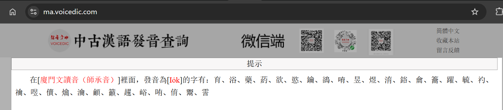

# 游戏翻译

see nodejs.md -> F\# Monads -> WPF

see NewLovePlusPlus所有资源\LovePlusEvery\out\TextAsset

LunaTranslator](https://github.com/HIllya51/LunaTranslator) 游戏翻译 python

- [VNR + Cheat Engine 翻译 PPSSPP 游戏](https://tieba.baidu.com/p/6929897404?pid=134661711694&cid=0#134661711694)
- [qolibri](https://github.com/mvf/qolibri) ebpwing + qt5

[SakuraTranslator](https://github.com/fkiliver/SakuraTranslator)  游戏翻译

- [VNR + Cheat Engine 翻译 PPSSPP 游戏

## Data

### ak48

```
echodict\chatgpt_server\lib\ak148_extradata.js
	# 提取 excel ，给 pandora 生成解析
```

### nlpp

````
# see huggingface/nlpp_audio
# see NewLovePlusPlus所有资源\LovePlusEvery\out\TextAsset
echodict\xml\extract_nlpp.js # 提取 excel ，给 pandora 生成解析
````


### 珍钻双语

https://github.com/Xzonn/NintendoOfficialChineseGames/blob/master/%E5%AE%9D%E5%8F%AF%E6%A2%A6%20%E6%99%B6%E7%81%BF%E9%92%BB%E7%9F%B3%EF%BC%8F%E6%98%8E%E4%BA%AE%E7%8F%8D%E7%8F%A0/dlp/simp_chinese.txt


### 游戏解包

SAK工具 各种格式转换

https://github.com/morkt/GARbro **游戏解包** WHITE ALBUM2 成功

火焰之纹章 Engage 成功提取音频

异度神剑3  Wwise-Unpacker 成功提取音频

- ```
  YUZU 模似器 -> 提取 RomFS 
  ```

  https://github.com/three-houses-research-team/THAT 风花雪月解包

  - https://github.com/three-houses-research-team/Progenitor voiceID

https://github.com/AlexCSDev/XbTool异度神剑3 解包

- https://github.com/vaxherd/xb3tool/blob/main/bdat.py 解包上一步出来的 bdat
- https://github.com/RoccoDev/bdat-rs/wiki/Xenoblade-3-BDAT-editing 这个解解看

- ```
  Wwise-Unpacker\Game_Files
  	# jp.pck 放这里面
  F:\GameAudio\switch\Wwise-Unpacker\unpack_wav.bat
  	# 双击就解压
  	# 结果在这
  
  xbtool.exe -g xb3 -t ExtractArchive -a bf3.arh bf3.ard -o unpack_xbtool
  
  python bdat.py -l jp -o out F:\GameAudio\switch\xbtool_040623\unpack_xbtool\bdat
  	xb3tool/out/msg_tlk110601.html
  		# 成功解出来文本
  	
  ./bdat-toolset-win64.exe extract F:\GameAudio\switch\xbtool_040623\unpack_xbtool\bdat -o out -f json --pretty
  	# 成功解码出文本
  	# 文本量不对劲，没什么用
  
  ```

- [音频解码](https://gbatemp.net/threads/help-with-xenoblade-chronicles-3-soundtrack-pck-format.615970/) [Wwise-Unpacker 工具](https://github.com/mortalis13/Wwise-Unpacker) 异度神剑3  Wwise-Unpacker 成功提取音频
  
  - https://xenobladedata.github.io/xb3_audio_mapping.html 音频和文字对应表
- https://gamebanana.com/questions/45278 只是模型导出？

- ```
  F:\GameAudio\switch\Xenoblade 3\sound
  ```

  

https://github.com/vgmstream/vgmstream

- https://huggingface.co/datasets/dlxjj/win10_dev/blob/main/vgmstream-win.zip

- ```
  F:\BigGame\YUZU 4176\YUZU\user\dump\0100A6301214E000\romfs\Data\StreamingAssets\Audio\GeneratedSoundBanks\Switch\Japanese
  	# 火焰之纹章 Engage 成功提取音频
  	# .wem 文件拖到 D:\usr\vgmstream-win\test.exe 成功提取
  ```

  

https://github.com/Xzonn/NintendoOfficialChineseGames/

- https://github.com/GreemDev/Ryujinx/releases

- https://xzonn.top/posts/Try-to-Extract-Messages-from-Games.html  

  - ```
    对于Nintendo Switch游戏的ROM文件，可以使用Ryujinx提取其中的romfs；对于任天堂自家的常用打包格式，可以使用Switch-Toolbox进行拆包；而对于跨平台的游戏引擎Unity，则有专门的工具AssetStudio用于分析数据文件。
    ```

- https://www.bilibili.com/opus/534827074512420036 MonsterHunterRise 解包
  - https://www.vgter.net/archives/2487 怪物猎人 崛起 曙光 下载
  - https://www.gamer520.com/ 下载站

https://www.bilibili.com/opus/745350067860275235 教程详细

https://github.com/SciresM/hactool  **switch 解包**

- https://juejin.cn/post/6929846759736737806

https://github.com/StudentBlake/XCI-Explorer  **switch 仅查看？**

- https://shipengliang.com/games/switch-%E8%A7%A3%E5%8C%85-%E5%9B%BE%E6%96%87%E6%95%99%E7%A8%8B.html
- https://www.bilibili.com/opus/456009863373992688


### 游戏原声

https://downloads.khinsider.com/game-soundtracks/album/love-plus-sound-portrait-rinko-kobayakawa-ds-sscx-10510


[李宏毅2020作业](http://speech.ee.ntu.edu.tw/~tlkagk/courses_ML20.html)

[李宏毅2021作业 pytorch+colab](https://speech.ee.ntu.edu.tw/~hylee/ml/2021-spring.html)

[英中文本机器翻译源码](https://github.com/foamliu/Transformer-v2)

> AI Challenger 2017中的英中机器文本翻译数据集，超过1000万的英中对照的句子对作为数据集合。其中，训练集合占据绝大部分，为12904955对，验证集合8000对，测试集A 8000条，测试集B 8000条。

- 这个是真大佬  机翻、语音识别、图像识别


[手写实现李航《统计学习方法》书中全部算法](https://github.com/Dod-o/Statistical-Learning-Method_Code)

[动手深度学习——编码器—解码器（seq2seq）](https://tangshusen.me/Dive-into-DL-PyTorch/#/chapter10_natural-language-processing/10.9_seq2seq)

[一文看懂 NLP 里的模型框架 Encoder-Decoder 和 Seq2Seq](https://easyaitech.medium.com/%E4%B8%80%E6%96%87%E7%9C%8B%E6%87%82-nlp-%E9%87%8C%E7%9A%84%E6%A8%A1%E5%9E%8B%E6%A1%86%E6%9E%B6-encoder-decoder-%E5%92%8C-seq2seq-1012abf88572)

[《百面机器学习》]()


# ebook

- https://ja.annas-archive.org/

  - https://ericlamtf.medium.com/%E5%BA%B7%E5%BE%B7%E8%BE%AD%E5%85%B8-%E6%AF%94%E8%BC%83-ca854390a32b  《**康德辭典**》比較

- https://zhuanlan.zhihu.com/p/587849884  **IPFS 图书**

  - https://www.yeeach.com/post/2291
    - https://github.com/book-searcher-org/book-searcher

- piratebayo3klnzokct3wt5yyxb2vpebbuyjl7m623iaxmqhsd52coid.onion

  - **tor 浏览器输入上面网址**
  
- 三省堂全訳漢辞海 ios有

  

# anime

- [pmfansub](https://www.weibo.com/u/1001770703?tabtype=newVideo) 珍珠钻石双语

- https://y2mate.ch/  dmmTV下载

- https://iproyal.cn/  美国家宽代理

- https://nyaa.si/?f=0&c=0_0&q=pokemon

- https://anidex.info/?q=pokemon&id=1,2,3

- https://rutracker.org/forum/tracker.php?nm=pokemon

- https://www.youtube.com/watch?v=-MlX_2wgTAY  XY粤语官方

- [DP双语动画](https://weibo.com/u/1001770703?tabtype=newVideo)

  

# game

psp 老男人游戏

switch
https://www.zake.store/swindex.html

[必看教程](https://www.bilibili.com/video/BV1ju411m7EQ)


## forum

[pmfansub](https://www.weibo.com/u/1001770703?tabtype=newVideo) 珍珠钻石双语

[pmfansub level-plus](https://www.level-plus.net/) cdef68935

[秒传脚本](https://greasyfork.org/zh-CN/scripts/424574-%E7%A7%92%E4%BC%A0%E9%93%BE%E6%8E%A5%E6%8F%90%E5%8F%96)

- [度盘秒传页面](https://pan.baidu.com/disk/main)


## 3ds破解

[switch所有游戏文本无敌了](https://github.com/Xzonn/NintendoOfficialChineseGames)

- [尝试从游戏中提取文本](https://xzonn.top/posts/Try-to-Extract-Messages-from-Games.html)

[AKB48所有文本](https://github.com/kurdtkobain/AKB148Guam_psp_trans)

[NLP+所有文本](https://github.com/Makein/NLPPGit)

- [最初的大本营](https://github.com/LovePlusProject/NLPPATCH)

- [3DS|CIA|CXI解包](https://gbatemp.net/threads/tutorial-how-to-decrypt-extract-rebuild-3ds-cia-cxi-files.383055/)
  - [HackingToolkit9DS](https://github.com/Asia81/HackingToolkit9DS)
  - [3DS自制主题从入门到精通](https://www.bilibili.com/read/cv14735254)

- [ROM解包](https://github.com/gdkchan/NLPUnpacker)
- [文本解包](https://github.com/gdkchan/NLPTextTool)

- [图片等的解包工具](https://github.com/LovePlusProject/nlpp-tools)

[3ds通用资源提取(很先进)](https://www.vg-resource.com/thread-40039.html)

- [0834 – Gyakuten Saiban 1 2 3 – Naruhodou Selection (JP) 逆转裁判123 成步堂选集(日)AVG(文字类)](https://www.oldmanemu.net/%e6%8e%8c%e6%9c%ba%e6%b8%b8%e6%88%8f/3ds/3ds%e5%ae%98%e6%96%b9%e6%b8%b8%e6%88%8f%e5%85%a8%e9%9b%86)
- [尝试从游戏中提取文本 大佬](https://xzonn.top/posts/Try-to-Extract-Messages-from-Games.html)

[游戏字库解析教程](https://www.bilibili.com/video/BV1CB4y1M7xx/)

[NLP+英化项目主页](https://www.gamebrew.org/wiki/NEW_LOVE_PLUS_PLUS_3DS)

- [汉化](https://github.com/wq1247/NLPP_CHN)
  - [bilibili](https://www.bilibili.com/video/BV1aU4y1p7iw)

[unity for 3ds自制游戏](https://www.youtube.com/watch?v=0q5cpwoPz9U)

- [Unity For 3 DS本体](https://archive.org/details/unity-for-3-ds)
  - [sdk](https://archive.org/details/3ds-sdk)
- [教程](https://gbatemp.net/threads/how-to-make-3ds-games-with-unity.441193/)
- [评论区](https://www.reddit.com/r/3dspiracy/comments/xs74yb/unity_3ds_adventures_part_2_still_no_n3ds_sdk/)

[3ds 宝可梦rom编辑](https://github.com/kwsch/pk3DS)

[Switch宝可梦rom编辑](https://github.com/kwsch/pkNX)

[3ds模型导出](https://projectpokemon.org/home/forums/topic/33764-ohana3ds-bch-tool-deprecated/)

[细致深入](https://firefox2100.github.io/3ds/2020/04/16/3DS_Mods/)

[Luma 汉化用补丁制作](https://tieba.baidu.com/p/7177655542?red_tag=2535992359)

https://github.com/SaitamaHung/Luma3DS-3GX-zh-cn

https://tieba.baidu.com/p/5490510814 动森

[SIFT学习笔记(三)](https://firefox2100.github.io/p.e.m.p.w.s2020/02/14/SIFT(3)/)


> Bulbasaur（妙蛙种子）是一种草/毒属性的神奇宝贝。这个名字是由两个英文词组成的，分别是 "bulb" 和 "dinosaur"。
>
> 1. "bulb"（球茎）：Bulbasaur 身上的植物像是一个球茎，它会随着神奇宝贝的成长而发展。Bulbasaur 的特点就是这个球茎，它可以从中汲取能量和发动特殊攻击。
> 2. "dinosaur"（恐龙）：Bulbasaur 的外形和生活习性都有些类似于恐龙。它有四条腿，外形像是一个小恐龙。这个名字正是强调了它与恐龙之间的相似性。
>
> 将 "bulb" 和 "dinosaur" 结合起来就得到了 "Bulbasaur" 这个名字，强调了它是一种具有植物特征且类似恐龙的神奇宝贝。在日本原版中，它的名字是 "Fushigidane"（フシギダネ），意为“神奇的种子”，也突显了它的草属性特点。


# drama

- https://dubdb.fandom.com/wiki/The_Big_Bang_Theory


# Project Euler


https://www.nayuki.io/page/project-euler-solutions

https://pe-cn.github.io/problems/

https://pe.metaquant.org/


# 日语

> [愛知大学 中国語語彙](http://hcs.aichi-u.ac.jp/php/search.php)
>
> - [【爱知大学】中日大辞典第三版](https://forum.freemdict.com/t/topic/9289)
>
> [物书堂](https://forum.freemdict.com/t/topic/12025)
>
> [NonJishoKei Japanese所有单词变形](https://github.com/NoHeartPen/NonJishoKei)　　
>
> - [真·哪里不会点哪里_日本語非辞書形辞典_v2](https://forum.freemdict.com/t/topic/14048)
>
> [日語誤用辭典](https://search.books.com.tw/redirect/move/key/市川保子/area/mid/item/CN11244764/page/1/idx/4/cat/CN1/pdf/0/spell/3)
>
> 　　[史上最強日本語類義表現](https://www.books.com.tw/products/0010908188?sloc=main)
>
> 　　- https://www.books.com.tw/
> 　　  - siluplsy 
> 　　　　　　　　　　　　　　　　　　　　　　　　　　　　　　　　　　　　　　　　　　　　　　　　　　  - https://github.com/hanmin0822/MisakaTranslator  翻译器
>
> > [用法](https://www.bilibili.com/video/BV1Z5411s7Ro)
> >
> > ```
> > 6:4EF4:1726AD09:0:89D74E8:UserHook3:HSN65001#16400000+-8:-18*-8@1726AD09
> > 最终正确的特殊码
> > 
> > HSN65001#16400000+-8:-18*-8@1726AD09   
> > ホントですか！？
> > ありがとうございます！
> > ```
>
> [Textractor 必看](https://github.com/Artikash/Textractor/issues/215)
>
> > HSN65001#16400000+-1C:-18*-8@1726B094 => られるなんて
> > 結構貴重な体験かも……。）
>
> [Translate PSP text from Japanese to English with VNR!](https://scan-vn.blogspot.com/2014/09/translate-psp-games-vn-from-japanese-to.html)
>
> [VNR + Cheat Engine 翻译 PPSSPP 游戏](https://tieba.baidu.com/p/6929897404?pid=134661711694&cid=0#134661711694)
> 　　　　　　　　　　　　　　　　　　　　　　　　　　  - https://github.com/hanmin0822/MisakaTranslator  翻译器
>
> 　　　　　　　　　　　　　　　　　　　　　　　　    [用法](https://www.bilibili.com/video/BV1Z5411s7Ro)
> 　　　　　　　　　　　　　　　　　　　　　　　　
> 　　　　　　　　　　　　　　　　　　　　　　　　    [Textractor 必看](https://github.com/Artikash/Textractor/issues/215)
> 　　　　　　　　　　　　　　　　　　　　　　　　
> 　　　　　　　　　　　　　　　　　　　　　　　　    > HSN65001#16400000+-1C:-18*-8@1726B094 => られるなんて
> 　　　　　　　　　　　　　　　　　　　　　　　　    > 結構貴重な体験かも……。）
> 　　　　　　　　　　　　　　　　　　　　　　　　
> 　　　　　　　　　　　　　　　　　　　　　　　　    [Translate PSP text from Japanese to English with VNR!](https://scan-vn.blogspot.com/2014/09/translate-psp-games-vn-from-japanese-to.html)
> 　　　　　　　　　　　　　　　　　　　　　　　　
> 　　　　　　　　　　　　　　　　　　　　　　　　    [VNR + Cheat Engine 翻译 PPSSPP 游戏](https://tieba.baidu.com/p/6929897404?pid=134661711694&cid=0#134661711694)

T.K.M.N字幕组


## 分词

最小熵原理（二）：“当机立断”之词库构建 [u](https://www.spaces.ac.cn/archives/5476)

> 互联网时代的社会语言学：基于SNS的文本数据挖掘 [u](http://www.matrix67.com/blog/archives/5044)
>
> 16 年后重谈 P 和 NP [u](http://www.matrix67.com/blog/archives/7084)
>
> > python3实现 [u](https://github.com/yanghanxy/New-Word-Detection)


# 韩语

- https://zh.dict.naver.com/#/search?query=박수   可以查各国语言



see huggingface\dict\广苏话在线发音.md

[语保工程](https://zhongguoyuyan.cn/) 1xxx3253  搜  梅州  广州 苏州 上海

[小學堂中古音](https://xiaoxue.iis.sinica.edu.tw/zhongguyin)

[苏州闲话单字调在线字典](https://www.wugniu.com/)

[粵語審音配詞字庫](https://humanum.arts.cuhk.edu.hk/Lexis/lexi-can/)

[泛語語料庫 嘉绒语](https://pangloss.cnrs.fr/corpus/Japhug?lang=en)

[新老派普通话的宽严式记音](https://phesoca.com/aws/268/)

[naver 日语单词本](https://learn.dict.naver.com/wordbook/jakodict/#/my/main) facebook账号登录 silu**@gmail.com  v4

[部件檢索](https://forum.freemdict.com/t/topic/10387)

[切韵拼音](https://phesoca.com/tupa/)

[朝鲜语音系](https://zh.wikipedia.org/zh-cn/%E6%9C%9D%E9%B2%9C%E8%AF%AD%E9%9F%B3%E7%B3%BB)


# 俄语

- https://en.openrussian.org/
  
- https://forum.freemdict.com/t/topic/19881
  
- http://www.simplecd.cc/page-ZbZPxeYm.html

- https://www.wanmen.org/courses/586d23485f07127674135d2a/lectures/586d23535f07127674158989
  
- 俄语初级（上）_吴石磊
  
- # プログレッシブ ロシア語辞典

  - https://kotobank.jp/rujaword/%D1%85%D0%BE%D1%80%D0%BE%D1%88%D0%BE

- [FRT Sora] Pocket Monsters   搜这个，俄语字幕 XY

- https://rutracker.org/forum/viewtopic.php?t=5049106 **海贼 俄日英字幕**

- http://cblle.tufs.ac.jp/dic/ru/v_search_list.php?serchTxt=этот

  - https://zh.m.wikibooks.org/zh-hans/%E4%BF%84%E8%AF%AD/%E4%BB%A3%E8%AF%8D

  > этот 阳性第一格


# mdx 词典制作

- https://www.pdawiki.com/forum/forum.php?mod=viewthread&tid=44885&extra=page%3D1%26filter%3Dtypeid%26typeid%3D71
- https://www.pdawiki.com/forum/forum.php?mod=viewthread&tid=36415


```

see huggingface/rwkv5-jp-trimvd/vector_sqlite.py -> insertJPdict

https://github.com/mmjang/mdict-query
https://github.com/terasum/medict 成品 app
https://github.com/liuyug/mdict-utils


# mdict -q '居る' '/mnt/y/huggingface/dict/mdict/JPCN/明镜日汉双解辞典/明镜日汉双解辞典.mdx'    


from mdict_query import IndexBuilder
builder = IndexBuilder('/mnt/y/huggingface/dict/mdict/JPCN/明镜日汉双解辞典/明镜日汉双解辞典.mdx')

result_text = builder.mdx_lookup('居る', ignorecase = True)

result_text2 = builder.mdx_lookup('░おる░【居る】🗏0444№7297', ignorecase = True)
	# 它有跳转

```


# mac mdx 词典


- https://www.pdawiki.com/forum/forum.php?mod=viewthread&tid=44885&extra=page%3D1


# Doc

[用 github actions 自動發佈 gh-pages]([https://medium.com/@milkmidi/%E6%B7%B1%E5%85%A5%E4%BD%86%E4%B8%8D%E6%B7%BA%E5%87%BA-%E5%A6%82%E4%BD%95%E7%94%A8-github-actions-%E8%87%AA%E5%8B%95%E7%99%BC%E4%BD%88-gh-pages-8183464dfe84](https://medium.com/@milkmidi/深入但不淺出-如何用-github-actions-自動發佈-gh-pages-8183464dfe84))

[使用 webpack + pug 開發 i18n 多語系網頁]([https://medium.com/@milkmidi/%E6%B7%B1%E5%85%A5%E4%BD%86%E4%B8%8D%E6%B7%BA%E5%87%BA-%E4%BD%BF%E7%94%A8-webpack-pug-%E9%96%8B%E7%99%BC-i18n-%E5%A4%9A%E8%AA%9E%E7%B3%BB%E7%B6%B2%E9%A0%81-5a5f07a3640f](https://medium.com/@milkmidi/深入但不淺出-使用-webpack-pug-開發-i18n-多語系網頁-5a5f07a3640f))

[mdbook 自动发布](https://github.com/peaceiris/actions-gh-pages)

[how to insert images](https://github.com/docsifyjs/docsify/issues/936)

## mdbook

> cargo install mdbook


```bash
cd tmp
mdbook init  # 生成初始文件和默认markdown
mdbook build # 生成html
mdbook watch # 监视文件改变，自动build
mdbook serve # 效果同watch，另外还创建web 服务器，并监听地址 http://localhost:3000
mdbook clean # 清除已生成的html
```


Q:

>I already have a written document:

```
- docs
  - chap1
     - doc1.md
  ...
  - img
     - img1.png 
```

here I inserted the image `img1.png` into `doc1.md` using

```
<div align=center>

</div>
```

This will show the img1 very well in GitHub or other markdown editor. But if I deploy the doc in gitpages, the image broken.

If I use

```
<div align=center>

</div>
```

it works.

But I don't want to make changes to my doc, how should I configure docsify to show the image properly?


A:

```
hook.beforeEach(function(content) {
            return content.replace(/..\/..\/img/g, "img");
          })
```


# 知乎大佬

> 王赟 Maig [z](https://www.zhihu.com/people/maigo) [g](https://maigoakisame.github.io/)
>
> > [声乐合成初探]([https://github.com/MaigoAkisame/VocalSynth-2007/blob/master/thesis/%E5%A3%B0%E4%B9%90%E5%90%88%E6%88%90%E5%88%9D%E6%8E%A2.pdf](https://github.com/MaigoAkisame/VocalSynth-2007/blob/master/thesis/声乐合成初探.pdf))
> >
> > [不同元音辅音在声音频谱的表现是什么样子？](https://www.zhihu.com/question/27126800)
>
> 酱紫君 随机取牌算不出 24 点的概率是多少[z](https://www.zhihu.com/question/307729091/answer/1119004801)
>
> 张觉非 计算图反向传播的原理及实现 [z](https://zhuanlan.zhihu.com/p/69175484)
>
> - 《深入理解神经网络：从逻辑回归到CNN》
>
>   - 试读1 https://www.ituring.com.cn/book/tupubarticle/27913
>   - 试读2 https://juejin.im/post/5d78b8fb5188251ecc40d730
>
> - [神经网络可视化 matplotlib](https://github.com/zhangjuefei/mentat)
>
> 
>
> 时光荏苒 nlp dl【中文分词系列】 2. 基于切分的新词发现   [p](https://kexue.fm/archives/3913/comment-page-1) 
>
> - [积分梯度：一种新颖的神经网络可视化方法](https://kexue.fm/archives/7533)
> - [重新写了之前的新词发现算法：更快更好的新词发现](https://kexue.fm/archives/6920)
> - [新词发现的信息熵方法与实现](https://kexue.fm/archives/3491)
> - [深度学习分词？只需一个词典](https://kexue.fm/archives/4245)
> - [基于AC自动机的快速分词](https://kexue.fm/archives/3908)
>
> 
>
> 罗然 shell脚本制作《落网》音乐播放器 [z](https://zhuanlan.zhihu.com/p/25957130)


> 上野  玄日语 史学 宗教学 音韵学 古希腊埃及语 和声学 语言学[z](https://www.zhihu.com/people/gao-peng-yu-77)
>UntPhesoca  古典音乐/语言学/ACG/轨道交通 [z](https://www.zhihu.com/people/UntW)
> 
>移影残风 [Git源码编译](https://zhuanlan.zhihu.com/p/74953334)
> 
>stevenliuyi [latex-alpha2 latex+mma](https://www.zhihu.com/question/23207757/answer/611107795)
> 
>Hadesth [mma高数笔记](https://zhuanlan.zhihu.com/p/93558801)

# MMA大佬

> [李宣](https://lixuan.xyz/blog) [GIF MMA编码](https://lixuan.xyz/blog/2019-10-29/2276.html)
> [苹果](http://chenminqi.github.io/)

#  语音识别大佬

> [语音声学特征提取：用于ASRT的语谱图特征的算法原理与实现](https://blog.ailemon.net/2021/03/08/speech-acoustic-feature-extraction-the-principle-and-implement-of-the-spectrogram-algorithm-for-asrt/)


# Github大佬

> [为什么我从vue转到了react?](https://github.com/coppyC/blog/issues/9)  [git issue blog很nice]()
>
> [markdown-nice](https://github.com/mdnice/markdown-nice)
>
> [搭建备用梯子：V2Ray + WebSocket + TLS + CloudFlare](https://printempw.github.io/)


# Pdawiki大佬 

> [ying汉大词典（第2版 陆谷sun）](https://www.pdawiki.com/forum/thread-35800-1-1.html) [漢語ＢＩＧ ｃｉ典3.0](https://www.pdawiki.com/forum/thread-37586-1-1.html)
>
> [MDX词典打包工具](https://www.pdawiki.com/forum/thread-36415-1-1.html)
>
> [自购美亚New Partridge Dictionary 2nd Edition](https://www.pdawiki.com/forum/thread-36045-1-1.html)
>
> [Dorland’s Illustrated Medical Dictionary 道兰氏图解医学词典](https://www.dorlandsonline.com/dorland/home) [p](https://www.pdawiki.com/forum/thread-29190-1-1.html)


# Geek大佬

> [How to use yes command ](https://www.howtogeek.com/415535/how-to-use-the-yes-command-on-linux/#comments)


# 前端大佬

[借助ffmpeg.wasm纯前端实现多音频和视频的合成](https://www.zhangxinxu.com/wordpress/2021/03/ffmpeg-wasm-audio-video-merge/)

[以20像素为基准的CSS网页布局实践分享](https://www.zhangxinxu.com/wordpress/2016/03/css-layout-base-20px/)


# Python 大佬

[《Machine Learning In Action》 中knn部分的代码精简优化](https://cugtyt.github.io/blog/ml-in-action/201711081901)


# 数学大佬

[既然有理数是稠密的，那么为什么存在无理数？](https://www.zhihu.com/question/453846157/answer/1846937536)

> 康托尔认为无理数的势（阿列夫1）和有理数的势（阿列夫0）不一样，并且无穷递缩等比数列的n是属于阿列夫0的，综上，我只敢把狗皮膏药贴在乖巧可控的有理点上

[学习数学可以陶冶情操吗？](https://www.zhihu.com/question/412899778/answer/1474782236)


## DD windows 大佬

[DD Windows 一键脚本（包含GCP谷歌云Oracle甲骨文）](https://sunpma.com/137.html)


# opencv 大佬(nihon)

[水平、垂直な線を取り除く](https://qiita.com/kaiyu_tech/items/a37fc929ac0f3328fea1)

- https://yanshilin.xyz/
  - 周旋的梦游仙境 | 一个工程师的后花园

# Psql 大佬

[skypyb](https://www.skypyb.com/)


# Rust 大佬

- https://www.zhihu.com/people/Nugine/posts


# Cloudflare 大佬


```
# https://github.com/yunyuyuan/cloudflare-blog
```


# 外国友人

阿倍仲麻侣

日本狸猫田中裕之


# 找老物

http://www.oldversion.com/

https://archive.org/

directx7 8 最有


# 免费论文

> [广西壮族自治区图书馆](http://www.gxlib.org.cn/) 
>
> [小众软件 IPFS图书](https://meta.appinn.net/t/ipfs-i-book-in/14123)

# 快速原型开发

- **Mathematica**

  > [Computational Linguistics](https://community.wolfram.com/content?curTag=computational linguistics)
  > 翻译多语字幕，标注单词音标语法、上传B 站
  >
  > [ASS-字幕格式规范](https://github.com/weizhenye/ASS/wiki/ASS-字幕格式规范)
  >
  > [FFMPEG流媒体](https://www.cnblogs.com/tocy/)

## pure function 移值

- **Haskell**

### 跨平台移值

- **C++**

# DATA

- 比特球云盘可以离线

## Mac

### mac mount iPhone as drive

- # iExplorer

- [How can I mount an iPhone as a drive on OS X](https://superuser.com/questions/465394/how-can-i-mount-an-iphone-as-a-drive-on-os-x)

mac mount Android as drive

- **Syncthing** 是一款开源的点对点文件同步工具，可以运行在 Linux、Windows、Mac、Android 和其他（抱歉，没有iOS）

- SyncMate Expert

- > **Create a FTP/SSH server on Android and mount the server on OS X**. See [Map FTP server as a (local) drive in Finder](http://superuser.com/q/149385), [mount_ftp -- mount a FTP filesystem](https://developer.apple.com/library/mac/documentation/Darwin/Reference/ManPages/man8/mount_ftp.8.html). In Linux, one can use `curlftpfs`, but it seems not to be available for OS X. But anyway, you got the idea.

- >  **[USB Mass Storage Enabler](http://forum.xda-developers.com/android/apps-games/app-universal-mass-storage-enabler-beta-t3240097)** (This is an app that can mount the memory card in UMS mode, created by me)

## Android

> On Android 6, the following worked for me:
> Enable developer options (settings > about phone > keep tapping on 'build number')
> Settings > Developer options > Networking > Select USB Configuration > MTP (if it's already on MTP, switch to something else, then switch back to MTP).


# 建站

- echodict.com

  > Namesilo 域名注册
  >
  > cloudflare 域名解析  账号：1234xxx@qq.com
  >
  > echodict@outlook.com

    - DNS、CDN 配置

  [全站HTTPS已启用](https://www.spiritdemon.com/tag/cloudflare/)

- echoplay.org

  > Namesilo 域名已注册
  >
  > echoplayorg@outlook.com

- echoplayer.com

  > name.com
  >
  > echoplayer 用户名  slplsy gmail
  >
  
  
  
- voicetube.com


## 腾讯云

[腾讯云qq 1234](https://cloud.tencent.com/ qq 1234) 


## buyvm

```
frantech.ca
slplsy@
auto strong passwd

# 后台管理
https://manage.buyvm.net/login
# 测速脚本
https://zhuanlan.zhihu.com/p/117547388

https://clients.servarica.com/
	si***@gmail.com pwd 同qq
	# 4G + 200G ssd + 4T hhd

https://linux.do/t/topic/286858
https://blog.laoda.de/archives/vps-servarica
https://linux.do/t/topic/273680
http://www.vpsxxs.com/servarica20240716/
	# 两个大盘鸡

LV RYZEN KVM 512MB

Hostname: xxxx
Main IP: xxx.xxx.xxx.77

Username: root
Password: xxxx

Hosting Package: LV RYZEN KVM 512MB

First Payment Amount: $48.00 USD
Recurring Amount: $48.00 USD
Billing Cycle: Biennially
Next Due Date: 04/01/2023
```


### idrivecompute

https://www.idrivecompute.com/

据说是美国家宽 ip


## 加密币

[法币转法币](https://wise.com/) slpy@gmail.com same qq passw

[okx](www.okx.com) c2c 充 USDT


## 后来的方案，让linux 适应windows 的分区


```
# 硬盘扩容
ls /dev/disk/by-id/
	--> ata-QEMU_DVD-ROM_QM00004  scsi-0BUYVM_SLAB_VOLUME-7514
		# scsi-0BUYVM_SLAB_VOLUME-7514 是新增的512G

fdisk -l
	# 看到新硬盘是sda

# 分区
# https://www.daniao.org/9632.html
fdisk /dev/sda


# 格式化
mkfs.ext4 -F /dev/disk/by-id/scsi-0BUYVM_SLAB_VOLUME-7514

	============   后来的方案，让linux 适应windows 的分区 =======================
	# yum install ntfsprogs
	# fdisk /dev/disk/by-id/scsi-0BUYVM_SLAB_VOLUME-7514
	# 这里用fdisk 分好区
	# mkfs.ntfs --fast -F /dev/sda1
		# 因为windows 不知为什么不识别ext4 分区了，只能让linux 去识别ntfs 分区

	# mount -t ntfs-3g /dev/sda1 /mnt
	# df -T
		# /dev/sda1           fuseblk  536867836  104168 536763668   1% /mnt
	
	# 开机自动挂
	# echo '/dev/sda1 /mnt/ ntfs-3g defaults 0 0' | sudo tee -a /etc/fstab
	# 注意：linux 分出来的ntfs 分区并不能被windows 识别，所以还是用windows 格式化吧，然后linux 装ntfsprogs，和ntfs-3g 挂载
	
 ------------->  mount 出来的ntfs分区全部是 root 权限，psql 读不了   <---------------------
	Thanks, I solved mounting the disk on fstab with this options: UUID=XXXXXXX   /mnt/shared ntfs-3g defaults,noatime,uid=1000,gid=users,dmask=022,fmask=133  0   0 
	
	
	id -u postgres  # 用户ID
	26
	id -g postgres  # 用户组ID
	26
	
	mount -o uid=26,gid=26,dmask=077,fmask=077 -t ntfs-3g /dev/sda1 /mnt
		# 成功挂载，而且权限是对的
			# 设成077 以后就没错了，它要求只有自已有完全权限，其他人完全没有任何权限
		# 更新：仅限不对导至psql 启动失败
			# Permissions should be u=rwx (0700) or u=rwx,g=rx (0750).  他希望的权限是这个
		https://superuser.com/questions/1271534/file-permissions-correct-ntfs-mount-option
			fmask=133 sets files permissions to 644
		
		https://www.nixonli.com/22806.html
			实际权限 = 777 - mask
				644 = 777 - 133
				700 = 777 - 077
				755 = 777 - 022

	
	echo '/dev/sda1 /mnt ntfs-3g defaults,noatime,uid=26,gid=26,dmask=022,fmask=133 0 0' | sudo tee -a /etc/fstab
	# 成功开机自动挂载
	
	
	Windows and Linux have a very different user and permissions model that is incompatible. For either chmod or chown to work, the file system needs to support users and permissions in a Linux-like way. NTFS is a Windows file system and so these commands can't possibly work.

One thing you can do is to mount the NTFS partition specifying a different user and mode for all of the files / directories:

mount -o uid=26,gid=26,dmask=022,fmask=133 /dev/disk/by-id/scsi-0BUYVM_SLAB_VOLUME-7514 /mnt 
This will mount with specified user and group giving directories mode 755 and files mode 644.


    ======================================================================


# 挂载
mkdir /data
mount -o discard,defaults /dev/disk/by-id/scsi-0BUYVM_SLAB_VOLUME-7514 /data
# 开机自动挂
echo '/dev/disk/by-id/scsi-0BUYVM_SLAB_VOLUME-7514 /data ext4 defaults,nofail,discard 0 0' | sudo tee -a /etc/fstab


# chrome for windows 2012
https://www.google.com/intl/en/chrome/?standalone=1
# 磁盘管理
https://hostloc.com/thread-830521-1-1.html
	diskmgmt.msc
```


### 双系统win7+centos7 


```
# centos7 引导win7

fdisk -l
vad1 是win7
vad2 是centos7

vi  /etc/grub.d/40_custom # 加在最后
menuentry "Windows 7" {
	set root=(hd0,1)
	chainloader +1
}

grub2-mkconfig --output=/boot/grub2/grub.cfg

reboot

重启就看到win7 了

```


```

Paragon ExtFS for Windows # windows 读写ext4 分区

把 keygen 和另外两个文件放到 ExtFS 的安装目录下，我的安装目录是 "C:\Program Files (x86)\Paragon Software\ExtFS for Windows"

打开 keygen，先点击 Patch RSA 2048，选择安装目录下的 Paragon ExtFS for Windows.exe

再次点击 Patch RSA 2048，选择安装目录下的 extservice.exe

点击 Generate 让生成 License，keygen 会重启 ExtFS 的服务。

之后打开 ExtFS 就发现已经破解完成。

```


```
老毛桃winpe启动光盘制作教程
https://www.laomaotao.net/doc/dvdwinpe.html

DD 命令一键将 Linux 安装成 Windows 系统
https://oldtang.com/881.html
https://zhuanlan.zhihu.com/p/56897277

# windows server 2012 安装Docker
https://www.jianshu.com/p/9dd33f2f625d

Windows平台： 使用cpu-Z即可查看。
Linux平台： 在终端执行#cat /proc/cpuinfo（或#grep -E '(vmx|svm)' /proc/cpuinfo）命令，找到flags部分，如果其中输出有VMX或SVM，即表明支持虚拟化技术。

```

```
DD Windows 一键脚本（包含GCP谷歌云Oracle甲骨文）
说明
无限制全自动dd安装Windows
突破没有VNC,没有救援模式,内存比dd包小的限制
使用Debian Live CD中的busybox做中间媒介,经过复杂的处理使本机的网络参数传进Windows操作系统中
即使没有DHCP能够让Windows获取网络参数,也能让Windows操作系统在开机的第一时间能够连通网络
特别注意：OpenVZ构架不适用

安装运行库
#Debian/Ubuntu:
apt-get install -y xz-utils openssl gawk file

#RedHat/CentOS:
yum install -y xz openssl gawk file
如果出现错误，运行以下代码

#Debian/Ubuntu:
apt-get update

#RedHat/CentOS:
yum update
一键脚本
示例脚本，补全DD包直连地址后运行即可；

wget --no-check-certificate -qO InstallNET.sh 'https://moeclub.org/attachment/LinuxShell/InstallNET.sh' && bash InstallNET.sh -dd '[Windows dd包直连地址]'
精简版DD包
选择好版本，输入以下一键脚本即可

# DD Windows Server 2003 32位 精简版 [账户Administrator密码cxthhhhh.com]
wget --no-check-certificate -qO InstallNET.sh 'https://moeclub.org/attachment/LinuxShell/InstallNET.sh' && bash InstallNET.sh -dd 'https://oss.sunpma.com/Windows/Win_Server2003_86_Administrator_cxthhhhh.com.gz'

# DD Windows Server 2008 R2 64位 精简版 [账户Administrator密码nat.ee]
wget --no-check-certificate -qO InstallNET.sh 'https://moeclub.org/attachment/LinuxShell/InstallNET.sh' && bash InstallNET.sh -dd 'https://oss.sunpma.com/Windows/Win_Server2008R2_sp1_64_Administrator_nat.ee.gz'

# DD Windows Server 2012 R2 64位 精简版 [账户Administrator密码WinSrv2012r2x64-Chinese]
wget --no-check-certificate -qO InstallNET.sh 'https://moeclub.org/attachment/LinuxShell/InstallNET.sh' && bash InstallNET.sh -dd 'https://oss.sunpma.com/Windows/Win_Server2012R2_64_Administrator_WinSrv2012r2x64-Chinese.gz'

# DD Windows Server 2019 Datacenter 64位 精简版 [账户Administrator密码WinSrv2019dc-Chinese]
wget --no-check-certificate -qO InstallNET.sh 'https://moeclub.org/attachment/LinuxShell/InstallNET.sh' && bash InstallNET.sh -dd 'https://oss.sunpma.com/Windows/Win_Server2019_64_Administrator_WinSrv2019dc-Chinese.gz'

# DD Windows7 32位 精简版 [账户Administrator密码Windows7x86-Chinese]
wget --no-check-certificate -qO InstallNET.sh 'https://moeclub.org/attachment/LinuxShell/InstallNET.sh' && bash InstallNET.sh -dd 'https://oss.sunpma.com/Windows/Win7_86_Administrator_Windows7x86-Chinese.gz'

# DD Windows7 sp1 64位 企业精简版 [账户Administrator密码nat.ee]
wget --no-check-certificate -qO InstallNET.sh 'https://moeclub.org/attachment/LinuxShell/InstallNET.sh' && bash InstallNET.sh -dd 'https://oss.sunpma.com/Windows/Win7_sp1_64_Administrator_nat.ee.gz'

#DD Windows8.1 64位 专业精简版 [账户Administrator密码nat.ee]
wget --no-check-certificate -qO InstallNET.sh 'https://moeclub.org/attachment/LinuxShell/InstallNET.sh' && bash InstallNET.sh -dd 'https://oss.sunpma.com/Windows/Win8.1_64_Administrator_nat.ee.gz'

# DD Windows10 2019LTSC 64位 企业精简版 [账户Administrator密码nat.ee]
wget --no-check-certificate -qO InstallNET.sh 'https://moeclub.org/attachment/LinuxShell/InstallNET.sh' && bash InstallNET.sh -dd 'https://oss.sunpma.com/Windows/Win10_2019LTSC_64_Administrator_nat.ee.gz'
完整版DD包
# DD Windows Server 2012 R2 Datacenter 64位 完整版 [账户administrator密码Password147]
wget --no-check-certificate -qO InstallNET.sh 'https://moeclub.org/attachment/LinuxShell/InstallNET.sh' && bash InstallNET.sh -dd 'https://oss.sunpma.com/Windows/Whole/cn_windows2012r2_administrator_Password147.gz'

# DD Windows Server 2016 Datacenter 64位 完整版 [账户administrator密码Password147]
wget --no-check-certificate -qO InstallNET.sh 'https://moeclub.org/attachment/LinuxShell/InstallNET.sh' && bash InstallNET.sh -dd 'https://oss.sunpma.com/Windows/Whole/cn_windows2016_administrator_Password147.gz'

# DD Windows Server 2019 Datacenter 64位 完整版 [账户administrator密码Password147]
wget --no-check-certificate -qO InstallNET.sh 'https://moeclub.org/attachment/LinuxShell/InstallNET.sh' && bash InstallNET.sh -dd 'https://oss.sunpma.com/Windows/Whole/cn_windows2019_administrator_Password147.gz'

# DD Windows7 sp1 64位 [账户Administrator密码nat.ee]
wget --no-check-certificate -qO InstallNET.sh 'https://moeclub.org/attachment/LinuxShell/InstallNET.sh' && bash InstallNET.sh -dd 'https://oss.sunpma.com/Windows/Whole/Win7_sp1_64_Administrator_nat.ee.gz'

# DD Windows8.1 64位 [账户Administrator密码nat.ee]
wget --no-check-certificate -qO InstallNET.sh 'https://moeclub.org/attachment/LinuxShell/InstallNET.sh' && bash InstallNET.sh -dd 'https://oss.sunpma.com/Windows/Whole/Win8.1_64_Administrator_nat.ee.gz'

# DD Windows10 LTSC 64位 [账户Administrator密码nat.ee]
wget --no-check-certificate -qO InstallNET.sh 'https://moeclub.org/attachment/LinuxShell/InstallNET.sh' && bash InstallNET.sh -dd 'https://oss.sunpma.com/Windows/Whole/Win10_LTSC_64_Administrator_nat.ee.gz'
Oracle甲骨文
此DD包仅适用于Oracle甲骨文DD Win使用

# DD Windows7 sp1 64位 企业精简版 [账户Administrator密码nat.ee]
wget --no-check-certificate -qO InstallNET.sh 'https://moeclub.org/attachment/LinuxShell/InstallNET.sh' && bash InstallNET.sh -dd 'https://oss.sunpma.com/Windows/Oracle_Win7_sp1_64_Administrator_nat.ee.gz'

# DD Windows8.1 64位 企业精简版 [账户Administrator密码nat.ee]
wget --no-check-certificate -qO InstallNET.sh 'https://moeclub.org/attachment/LinuxShell/InstallNET.sh' && bash InstallNET.sh -dd 'https://oss.sunpma.com/Windows/Oracle_Win8.1_64_Administrator_nat.ee.gz'

# DD Windows Server 2008 R2 64位 精简版 [账户Administrator密码nat.ee]
wget --no-check-certificate -qO InstallNET.sh 'https://moeclub.org/attachment/LinuxShell/InstallNET.sh' && bash InstallNET.sh -dd 'https://oss.sunpma.com/Windows/Oracle_Win_Server2008R2_sp1_64_Administrator_nat.ee.gz'

# DD Windows Server 2012 R2 64位 精简版 [账户Administrator密码nat.ee]
wget --no-check-certificate -qO InstallNET.sh 'https://moeclub.org/attachment/LinuxShell/InstallNET.sh' && bash InstallNET.sh -dd 'https://oss.sunpma.com/Windows/Oracle_Win_Server2012R2_64_Administrator_nat.ee.gz'
OVH
此DD包仅适用于OVH云服务器DD Win使用
说明：OVH需要使用网络参数进行安装，需要的可以参考下面的安装方法，博主并未进行测试，这里仅提供直链包；

# DD Windows7 64位 精简版 [账户administrator密码www.80host.com]
https://oss.sunpma.com/Windows/win/OVH_Win7_64_administrator_www.80host.com.gz
网络参数安装
比如GCP谷歌云Azure微软云OVH云服务器等需要指定网络参数安装的方式，示例为GCP谷歌云

# 将X.X.X.X替换为自己的网络参数.
# --ip-addr :IP Address/内网IP地址
# --ip-mask :Netmask   /子网掩码
# --ip-gate :Gateway   /网关
wget --no-check-certificate -qO InstallNET.sh 'https://moeclub.org/attachment/LinuxShell/InstallNET.sh' && bash InstallNET.sh --ip-addr X.X.X.X --ip-mask X.X.X.X --ip-gate X.X.X.X -dd 'DD包 直链地址'
例：
替换--ip-addr后面的X.X.X.X为你自己的内网IP即可；
在GCP谷歌云 Debian / Ubuntu 测试成功， CentOS 未测试；
账户：Administrator 密码：nat.ee
GCP谷歌云 香港

wget --no-check-certificate -qO InstallNET.sh 'https://moeclub.org/attachment/LinuxShell/InstallNET.sh' && bash InstallNET.sh --ip-addr X.X.X.X --ip-mask 255.255.255.0 --ip-gate 10.170.0.1 -dd 'https://oss.sunpma.com/Windows/Win7_sp1_64_Administrator_nat.ee.gz'
GCP谷歌云-台湾

wget --no-check-certificate -qO InstallNET.sh 'https://moeclub.org/attachment/LinuxShell/InstallNET.sh' && bash InstallNET.sh --ip-addr X.X.X.X --ip-mask 255.255.255.0 --ip-gate 10.140.0.1 -dd 'https://oss.sunpma.com/Windows/Win7_sp1_64_Administrator_nat.ee.gz'
连接上后如果遇到无法打开网页的情况，修改DNS即可

8.8.8.8
8.8.4.4
关于激活
可以使用本博客的KMS激活

如果不能使用KMS激活，可以试试下面的Key（不一定都能成功激活）

# Windows 7 企业版
KMS密钥：33PXH-7Y6KF-2VJC9-XBBR8-HVTHH / RHTBY-VWY6D-QJRJ9-JGQ3X-Q2289 / H8PDJ-H4NKW-3GKH7-YHKJ7-4C2JR

# Windows 8.1 专业版
KMS密钥：GCRJD-8NW9H-F2CDX-CCM8D-9D6T9

# Windows 10 LTSC 2019 企业版
KMS密钥：M7XTQ-FN8P6-TTKYV-9D4CC-J462D

# Windows Server 2019 数据中心版
KMS密钥：WMDGN-G9PQG-XVVXX-R3X43-63DFG
右键以管理员身份运行CMD（命令提示符），依次执行下面的命令；

slmgr.vbs -upk
slmgr.vbs -ipk KMS密钥
slmgr.vbs -ato
slmgr.vbs -dlv
Windows 7 旗舰版可能无法使用KMS进行激活，可以使用以下工具永久激活
激活工具：https://sunpma.lanzous.com/i0ohrjljzwb

Windows服务器开启Ping功能，打开系统运行服务 Win+R 输入命令

## 开启Ping ##
netsh firewall set icmpsetting 8
## 关闭Ping ##
netsh firewall set icmpsetting 8 disable
```


```
# 绝对大佬
https://sunpma.com/137.html
https://www.locmjj.com/374.html

这是我dd win7企业精简版的步骤。

先重装系统，debian10，kvm架构

apt-get update
apt-get install -y xz-utils openssl gawk file
wget --no-check-certificate -qO InstallNET.sh 'https://moeclub.org/attachment/LinuxShell/InstallNET.sh' && bash InstallNET.sh -dd 'https://oss.sunpma.com/Windows/Win7_sp1_64_Administrator_nat.ee.gz'

# 激活（以管理员运行）
slmgr /skms kms.sunpma.com
slmgr /ato
slmgr /xpr


双系统
https://hostloc.com/forum.php?mod=viewthread&tid=716600&extra=&highlight=%E5%8F%8C%E7%B3%BB%E7%BB%9F&page=1

https://hostloc.com/forum.php?mod=viewthread&tid=790452&highlight=%E5%8F%8C%E7%B3%BB%E7%BB%9F

buyvm装arch linux
https://lala.im/7262.html

.com32 chain.c32 hd0 0   # 成功启动win7


http://www.360doc.com/content/18/0714/18/21175922_770377533.shtml


https://www.cnblogs.com/fps2tao/p/11273658.html
Linux只能认识Ext3/4，fat32格式，如果Windows是NTFS格式磁盘分区，Grub2将无法识别。


https://linuxhint.com/grub_rescue_commands_centos/
https://www.thegeekdiary.com/centos-rhel-7-how-to-reinstall-grub2-from-rescue-mode/

grub> rootnoverify (hd0,0)
grub> chainloader +1
grub> makeactive
grub> boot

vi /etc/grub.d/40_custom
#!/bin/sh
exec tail -n +3 $0
# This file provides an easy way to add custom menu entries.  Simply type the
# menu entries you want to add after this comment.  Be careful not to change
# the 'exec tail' line above.
menuentry 'Windows7'{
set root=(hd0,1)
chainloader +1
}

yum install -y epel-release
yum –y install ntfs-3g
grub2-mkconfig -o /boot/grub2/grub.cfg
	# 会自动found win7 启动项
	# 重启就是两启动了

Dual boot with Windows (简体中文)
https://wiki.archlinux.org/title/Dual_boot_with_Windows_(%E7%AE%80%E4%BD%93%E4%B8%AD%E6%96%87)

Windows7+Archlinux双系统安装指南
https://www.jianshu.com/p/27ea66e1838c

Win7启动过程及启动项修复
http://dreambt.github.io/Windows/2011/05/18/win7-boot-process-and-restoration/

Centos7 修复 引导启动
https://blog.51cto.com/puppydong/1962085

DD命令备份Linux系统
https://blog.csdn.net/u013896064/article/details/56842939
```


```
三、忘记密码，但是已经登录系统：
1、在开始菜单中的搜索框中输入”mmc.EⅩE”，或按住Win+R
　　2、打开运行窗口输入”mmc.EⅩE”，单击 确定进入控制台
　　3、依次打开”文件”-”添加/删除管理单元”
　　4、在左侧可用管理单元中找到”本地用户和组”，依次单击”添加”-”完成”，再单击”确定”
　　5、展开控制台根节点中的本地用户和组，选中”用户”，在右侧用户名上单击右键，”设置密码”，不需要填入原密码

```


### 调整双系统硬盘空间


#### win7空间分给linux


```
fdisk -l
--> Disk /dev/vda: 42.9 GB  # win7和centos 都在这块盘上
	# 先将win7 分出一个新盘，格式化为fat32, linux下就可以直接识别了
	
/dev/vda1   *        2048    15923199     7960576    7  HPFS/NTFS/exFAT
/dev/vda2        15923200    41943039    13009920   83  Linux
/dev/vda3        41943040    83881983    20969472    c  W95 FAT32 (LBA)
	# /dev/vda3 就是win7 新分出来的fat32盘，目标是将它的空间加到 / 根目录下
	# fdisk -l 只能列出硬盘的分区表、容量大小以及分区类型，但看不到文件系统类型。
	# df -h 查看空间使用量。但只会列出已挂载的文件系统信息，对于没有挂载的文件系统是查看不到的。
	# parted 命令可以对大于2TB的磁盘设备进行分区，以及创建GPT分区（而fdisk命令就办不到了）。
		# parted /dev/vda

df -T
/dev/vda2      ext4      12674328 11612624    394824  97% /
/dev/sda1      ext4     515928320 52036916 437660620  11% /mnt
	# /dev/vda2 整个linux 都装在这里，格式是 ext4


fdisk /dev/vda3
	# 我的 / 和 /home 对应的分区是相连的，合并较为方便，便打算将这两个分区合并起来。
	#  fdisk拓展分区的前提是被合并的分区位于合并分区之后

# 分区不连续，可能只有先把linux 分区和新fat32 分区都删掉，再重装系统了

# 先用 arch linux 启动，备份整个linux ，重建分区，再从linux 备份恢复？

/******************************************
不要了
将 /dev/vda2 /dev/vda3 分区删掉，重建分区  
fdisk /dev/vda
	# m for help

格式化新建的/dev/vda2
	mkfs.ext4 /dev/vda2

恢复备份的linux 到新分区
mount /dev/vda2  /mnt # 新分区挂载到 /mnt
mkdir /data
mount -o discard,defaults /dev/disk/by-id/scsi-0BUYVM_SLAB_VOLUME-7514 /data                 # 数据盘挂载到 /data
不要了
******************************************/

先用arch linux live CD 删掉分区，成为free space，再用centos7 live cd 安装系统

文本模式安装centos7
按Esc键进入：
输入linux text进入文本安装界面：
这里前面带有”！” 号的是需要设置的，按2进入时区设置：
我们设置的是北京时间，所以选择5 （亚太地区）
然后输入63 （上海） 按C继续
输入3，选择安装源
选择，本地光驱安装 ...
默认是最小化安装

配置网络
ip addr
	# eth0 显示的网卡名称是这个

vi /etc/sysconfig/network-scripts/ifcfg-eth0
	# ONBOOT 的值改为yes
reboot
	# 重启就自动边接了
	
开启root 远程登录
vi /etc/ssh/sshd_config
输入 /
输入 Permit，回车，查找到后 把# 符号去掉

service sshd restart


grub2 引导win7
https://access.redhat.com/documentation/en-us/red_hat_enterprise_linux/7/html/system_administrators_guide/ch-working_with_the_grub_2_boot_loader

BIOS 启动grub2 读取配置
	/boot/grub2/grub.cfg

UEFI 启动grub2 读取配置
	/boot/efi/EFI/redhat/grub.cfg

重新生成配置文件用
/usr/sbin/grub2-mkconfig
	它是根据模板文件 /etc/grub.d/ 以及"定制配置"/etc/default/grub  生成的
		只改前一个不改后一个的话，重新生成后会丢失更改
	# 新内核安装后自动调用 grubby 程序更新配置

修改grub.cfg 请使用grubby 程序


Grub2 使用
https://linuxhint.com/grub_rescue_commands_centos/

centos7 live cd启动  -> Troubleshooting -> Rescue a CentOS system 
	-> type 1 for the rescue mode -> enter
	-> chroot /mnt/sysimage

确定磁盘类型
ls /dev/vd* # vps 是这种类型
ls /dev/sd*
ls /dev/hd* # very old IDE disks type

安装grub2 到硬盘，开机就可进grub 了
grub2-install /dev/vda
exit
reboot


重启进centos7 找回win7
yum install -y epel-release
yum –y install ntfs-3g
grub2-mkconfig -o /boot/grub2/grub.cfg  # 确实成功了，不需要其他配置

	# 会自动found win7 启动项
	# 重启就是两启动了

mount -t ntfs-3g /dev/vda1 /mnt


急求模式安装grub2
# https://www.thegeekdiary.com/centos-rhel-7-how-to-reinstall-grub2-from-rescue-mode/


### linux live cd下修复linux 引导
linux live CD,所以登录后直接执行grub命令，然后执行：
root (hdX,Y)
setup (hdX)
这里的X，如果是一个盘，就是0，如果你所安装的linux的根分区在第二个硬盘上，那X就是1了；Y，就是装有linux系统所在的根分区。因为我只有 一块硬盘，所以就是root (hd0,0)了。setup (hd0)就是把GRUB写到硬盘的MBR上。 然后重启，之前arch linux启动的grub菜单顺利出现。


```


#### 备份整个Linux


```
# 删除所有邮件
rm /var/mail/root
rm /var/spool/mqueue

cd /mnt # 一盘大磁盘mount 在这里
	# /data 应该mount 大物在里面，排除掉
tar -cvpzf backup.tar.gz --exclude=/mnt --exclude=/data  --one-file-system /
```


#### 原系统启动信息


```
cat /etc/fstab
UUID=8727c528-a369-431b-a732-7275351f63e3 /    ext4    defaults        1 1


# mount -o discard,defaults /dev/disk/by-id/scsi-0BUYVM_SLAB_VOLUME-7514 /data
	# 当时设为自动挂载的数据盘

# 挂载
mkdir /data
mount -o discard,defaults /dev/disk/by-id/scsi-0BUYVM_SLAB_VOLUME-7514 /data
# 开机自动挂
echo '/dev/disk/by-id/scsi-0BUYVM_SLAB_VOLUME-7514 /data ext4 defaults,nofail,discard 0 0' | sudo tee -a /etc/fstab


Win7 启动linux
	# EasyBCD 2.4
	有一个2项已列入bootloader.

默认: Windows 7
超时: 30 秒
引导驱动器: C:\

条目 #1
名称: Windows 7
BCD ID: {current}
驱动器: C:\
Bootloader的路径: \Windows\system32\winload.exe

条目 #2
名称: Centos7
BCD ID: {d9d11376-45f2-11eb-99cd-80fa5b2093f2}
驱动器: C:\
Bootloader的路径: \NST\nst_linux.mbr


https://www.jianshu.com/p/d4c3ccd75f0c
	# centos 7破坏grub实验和修复
	
	

```


#### U盘安装centos7


```
http://zhangqijun.com/%E5%AE%89%E8%A3%85win10%E5%92%8Ccentos7%E5%8F%8C%E7%B3%BB%E7%BB%9F%E5%8F%8A%E5%BC%95%E5%AF%BC%E4%BF%AE%E5%A4%8D/
```


ios的shadowrocket可以连接vmess协议


### BuyVM可以把系统装到存储块里


1.挂iso装系统
2.安装winpe到系统盘，根目录找到winpe.wim，用WimTool把virtio驱动打进去
3.重启进pe (VNC)，打上硬盘驱动，分区助手克隆系统盘到存储块，重启
4.bootice->选中原系统盘(不是存储块)->主引导记录->wee->

timeout 0
default 0
title 1. Windows
find --set-root --active command +1
find --set-root (hd0,0)/bootmgr /bootmgr
find --set-root (hd0,0)/ntldr /ntldr


## 办公

```
但是建设工程完成后具体到房屋的用途，要么属于商业房屋，要么属于住宅，并不存在“商住两用房”的法律概念。
```


# 信用卡


- **长城跨境通国际借记卡**
- **中银跨境一卡通**

 > #### 中银万事达非人哉小玉借记卡
 >
 > 长城冰雪借记卡
 >
 > https://cloud.bankofchina.com/sh/api/net/common/url/adr?id=mastecardsubroadbranch&applyCode=2019050876406015
 >
 > 4nlp2go  gmail  移动花卡
 >
 > 
 >
 > *信用卡客服与投诉热线：*40066-95566(中国境内)；
 >
 > https://poplite.xyz/post/2018/03/05/boc-debit-card-guide-for-online-payment.html#3-%E7%94%B3%E5%8D%A1%E6%8C%87%E5%8D%97
 >
 > > 545006
 > >
 > > 别忘了办的时候顺便让柜员帮你绑定中国银行网银（前提，要有一张中行储蓄卡
 > >
 > > 送到家后，请去你附近的中国银行网点进行激活（到银行仅需要2-3分钟即可成功激活，不需要预存，但是一些偏僻的银行工作人员可能会不认识这种卡，会说此卡为信用卡，你让他激活就是了，因为人不知道机器肯定知道）
 > >
 > > 当然激活后就不一定没有事情了，如果没有中行银联借记卡请在激活后顺便办理一张（推荐长城冰雪借记卡，白金卡特权而且可以不存款办理），因为需要银联卡购汇后才能转入万事达借记卡（目前来说万事达和威士卡都没有人民币账户清算，也不要将人民币存入万事达卡和威士卡）
 > >
 > > 完成后下载中国银行APP兑换外币转入就可以了
 > > 作者：默小桢qwq
 > > https://www.bilibili.com/read/cv3935494/
 > > 出处： bilibili
 >
 > https://poplite.xyz/post/2018/03/05/boc-debit-card-guide-for-online-payment.html
 >
 > https://cloud.bankofchina.com/sh/html/h5/card/indexreal.html?index=1&apply=direct
 >
 > https://zhuanlan.zhihu.com/p/116752328
 >
 > **不设申请门槛，支持网上申请和线下申请**
 > 只需本人有效身份证件，无需收入证明等财力证明材料。
 >
 > 消费或 ATM 取现支持直接使用美元、欧元、日元、港币等19 种外币，无需货币转换。
 >
 > 这张卡主要给学生党或者其他担心信用卡被误扣的人用的，比如可以用来买小鸡，用多少充多少不担心被反撸
 >
 > 申请门槛低，支持网上和线下申请
 > 无需提供收入证明等财力证明材料，只需凭本人有效身份证件在营业网点或网上办理。跨境通卡是真正的借记卡，在网银中识别为长城借记卡，不是零额度信用卡。
 >
 > 跨境通卡不能存人民币，只能存外币。 需要先将人民币兑换成外币，然后才能存入卡内。
 >
 > 不要把人民币转账到跨境通卡、或者在ATM上存人民币！存进或转进的钱不会记在账户上的！
 >
 > https://www.imtqy.com/boc-debit-card.html

  0772-2608031

  

7714956160


# virmach

[virmach](virmach.com) gmail silu  2.25$ /month，做梯子测试

- @doublev doubleW

[hostodo](hostodo.com) 20\$ / year 建站

[buyvm](buyvm) 8\$ /month 贵，或许质量好？

[cloudcone](cloudcone.com) 1.8$ /month

- [垃圾 VPS 线路的救星 - Hysteria ](https://www.hicairo.com/post/60.html)

## Namesilo 域名注册

### DNS 解析

**方式一：A + A**

- **第一条：**HOSTNAME：空，ADDRESS：主机 IP，TTL：3600
- **第二条：**HOSTNAME：www，ADDRESS：主机 IP ，TTL：3600

[Namesilo 域名注册](最便宜的国外域名注册商是Namesilo，主机不占优势，毕竟公司才成立不到10年，适合大量注册域名，可以省下不少资金。一站式国外域名注册商是Wealthyaffiliate，即富裕者联盟，或简称WA；成为它家会员可以享受一站式服务，你建立网站的各方面全都准备好了，只需要您花点时间学习下而已，当然前提是你英文要过关哟，因为WA平台上有全球各国的人士在上面，社区很热心，只要你有问题，留言一下，或者在线聊天，很快就有答复)

> [在线ping 站长之家](http://ping.chinaz.com/)
> [服务器运维](https://github.com/chengziqaq/Ubuntu-xfce-VNC) 
> [Fiddler抓包 网络crawler](https://www.52pojie.cn/thread-1124180-1-1.html)
> [hostwinds 主机](hostwinds.com)
> [Colab自动重连](https://zhuanlan.zhihu.com/p/100871755)
> [MMA截图和控制鼠标](https://zhuanlan.zhihu.com/p/33361062)
> [Blender Python2D动画](用Blender来学习Python创意编程，实现傅里叶级数可视化https://zhuanlan.zhihu.com/p/92267080)


## CloudFlare  CDN加速

- 隐藏IP

- 免费SSL证书


## Github Pages

[https 证书](https://poplite.xyz/post/2018/05/03/how-to-enable-https-for-custom-domain-on-github-pages.html)


#  Zeit integrate with Github Cloud Develop

[zeit.co](https://zeit.co/)  


## SWR

[React Hooks for Remote Data Fetching](https://swr.now.sh/)

[SWR：最具潜力的 React Hooks 数据请求库](https://zhuanlan.zhihu.com/p/89570321)

[swr 源码解析](https://github.com/wendellhu95/blog/issues/23)

[zeit now 反向代理](https://sunsea.im/add-free-cdn-from-zeit.html)


## 不备案域名

不用 80 端口，不放违规内容，别被黑客利用放违规内容应该就没事


## VPS

- virmach.com
  - 支付宝 25\$ per year  2.25\$per month
- hostodo.com
  - 支付宝 20\$ per year, 5\$ per month 
- racknerd.com
  - 支付宝 23\$ per year, 6\$ per month
- budgetvm.com
  -  支付宝 8\$ per month
- hostwinds.com
  - paypal only

# NAS


## 使用群晖Docker 安装Jellyfin 家庭影院

- [smzdm](https://post.smzdm.com/p/a6lnxg3g/)


## 黑群晖 FastConnect：自定义域名+内外网访问，比QC更顺滑

- [蜗牛星际](https://zhuanlan.zhihu.com/p/73482384)

- [frps服务器](https://zhuanlan.zhihu.com/p/73482384)  [ddnsto内网穿透]()

- [有许多互联网分享精神的站长共享了自己搭建的 frp 服务器]()


## 树莓派NAS 个人网站


# 数据 + 技术 + 速度

- 数据
  - epwing 日语、汉语大词典；mdx 英汉大词典
  - 双语字幕
- [toml](https://github.com/toml-lang/toml) json markdown html 

- MMA 原型开发  + SwiftUI 展示 + SDL 全平台移值

- 仿粤语U学院、忆术家、多邻国，做一个学习软件

- [category-theory-for-programmers-print](file:///Users/vvw/Documents/GitHub/books/chinese/技术/category-theory-for-programmers-print.pdf) 


# 超级马里奥

- [source fork](https://github.com/Enzo-Liu/monao)
- [blogspot](http://mokehehe.blogspot.com/)  
- [YouTube - Making 'Super Nario Bros.' in Haskell](http://www.youtube.com/watch?v=gVLFGQGRsDw&fmt=18)

- [origin source code](https://github.com/mokehehe/monao)

- TO DO
  - 移值Swift, C++, Mathematica

- [SimpleNES](https://github.com/amhndu/SimpleNES) 
  - C++11 SFML

# 跨平台开发

- Haskell + SDL 超级马里奥

  - [blogspot](http://mokehehe.blogspot.com/)  
  - [YouTube - Making 'Super Nario Bros.' in Haskell](http://www.youtube.com/watch?v=gVLFGQGRsDw&fmt=18)

  - [source code](https://github.com/mokehehe/monao)

- SDL 支持所有桌面和移动平台
  - SDL officially supports Windows, Mac OS X, Linux, iOS, and Android

- 可以上架steam 商站

- [Haskell to WebAssembly compiler](https://github.com/tweag/asterius)

- Armadillo
  - C++ 矩阵运算库

- elm+rust
  - [Look ma, no Electron!](https://github.com/huytd/kanban-app)

## Cygwin

- 装cmake, g++
- mount 命令可以看到windows 磁盘目录被挂到哪里

## Windows

- sudo passwd will change the password of the WSL root user

# Deep Leaning

- **《深度学习入门：基于Python的理论与实现》**
- [Haskell井字棋](https://crypto.stanford.edu/~blynn/play/tictactoe.html) 
- [haskell神经网络实现](https://gist.github.com/masterdezign/34ab610715df7dbf504cbe7cacdba68e) 
- [10 Days Of Grad: Deep Learning From The First Principles](http://penkovsky.com/neural-networks/day1/) 10天学梯度：深度学习原理
- 美丽之问：宇宙万物的大设计


左乘是行变换，右乘是列变换

列向量右乘一个矩阵，左边的矩阵行数没变列数被降维了（被降到和列向量对齐）

> 一列向量作为系数右乘一个矩阵，矩阵降维到一列。降维的方法是矩阵所有的列加仅求和
>
> N列向量右乘一个矩阵，矩阵降维到N列

*2 加倍 *1/2减倍


## Python for windows
> C:\Users\Administrator\AppData\Local\Programs\Python\Python38  默认安装位置
>
> D:\usr\Python38 自定义完装位置

- ```
  pip3 install jupyter
  ```


## 算法

> https://reference.wolfram.com/language/GraphUtilities/ref/PageRanks.html
>
> https://www.mathworks.com/help/textanalytics/ref/textrankscores.html
>
> https://github.com/YevaGabrielyan/tldl


# PC 开发


跨所有桌面平台

- [Avalonia](https://github.com/AvaloniaUI/Avalonia)  [Avalonia studio]()
- [WebWindow](https://github.com/SteveSandersonMS/WebWindow)


# Web云开发


# SVG Animation

- [Invention 13 by J. S. Bach  Synchronizing Scalable Vector Graphics (SVG) to Music](https://codepen.io/sgestrella/pen/OqONXW)
  - SVG 音画同步

- [Making 'Super Nario Bros.' in Haskell](https://www.youtube.com/watch?v=gVLFGQGRsDw)

## .Net Web方案

- [F#+Fable+Elmish](https://www.slaveoftime.fun/)  实现的动画控件不错

  - ### React 的另类用法系列（俄罗斯方块）

- [websharper](websharper.com)

- **Bolero: F# in WebAssembly**

- ASP.NET CORE Client-Side 是WebAssembly技术

- **Blazor**  .NET 类Electron跨平台框架(非微软官方)

## React 方案

- **SSR**  服务器端渲染(Server Side Rendering)
- 微前端

> [tailwindcss](https://github.com/tailwindcss/tailwindcss) [styled-components](https://github.com/styled-components/styled-components)  FFmpeg+RTMP推流 [wasm+ffmpeg前端剪视频](https://zhuanlan.zhihu.com/p/40786748) [2](https://zhuanlan.zhihu.com/p/67759237) 
>
> [微信知乎Markdonw排版工具  React Markdown编辑器](https://github.com/mdnice/markdown-nice) 
> http://dabblet.com  
> https://noderun.com  
> https://codepen.io 
> 网易云音乐云盘  免费存mp3
> 利用CloudFlare Worker 免费部署 JSProxy 服务
> https://chwl66.github.io/post/pLeXJDL_N/
> https://github.com/EtherDream/jsproxy-browser
>
> Chrome 印象笔记·**剪藏插件**
>
> [HTTP 缓存](https://zhuanlan.zhihu.com/p/59150268)
>
> **electron专家** https://newsn.net/category/electron/1/
>
> [RNStudyNotes](https://github.com/crazycodeboy/RNStudyNotes)

# APP开发

## Xcode 开发IOS 应用不能用越狱手机

## 测试

- **免费的的苹果开发者，必须提供爱思助手安装，无法扫码安**[装](2020最新苹果App真机调试测试详细教程)

- 测试证书

  > iOS证书申请这里用到一个工具Appuploader，可以在mac win linux系统中辅助快速申请iOS证书，不用Mac钥匙串助手，直接得到p12.mobileprovision ios证书文件，直接拿去打包IPA！很方便很快的创建iOS推送证书

- Appuploader [url](http://www.applicationloader.net/)

  - 支持Mac、Windows、Linux
  - 可以申请测试证书、APP 上架

- 爱思助手

  - 用助手安装软件可以验机有无暗病
  
  - 爱思开发者商店可以上架应用 
  
  - 安装命令行工具代码：xcode-select --install
  
    自签命令代码：codesign -f -s - --deep /Applications/i4Tools.app

# Win10 WSL | Ubuntu 18.04 with Xfce & Xrdp


## MUST make sure that the XRDP doesn’t use port 3389 

- which is used by Microsoft RDP (in case if your Windows 10 is already configured for RDP)


```
sudo apt install xfce4
sudo apt install xrdp
sudo echo xfce4-session >~/.xsession
sudo service xrdp restart
```


### Change the port from 3389 to 3390


```
vi /etc/xrdp/xrdp.ini

service xrdp restart
```


## Use Win10 remote destop to connect


Press Win key -> 附件 -> 远程桌面

> input: 
>
> localhost:3390


## Install chrome on Ubuntu18.04 

```
wget https://dl.google.com/linux/direct/google-chrome-stable_current_amd64.deb
```


## 网课

### Lebus

- [技术主页](https://juejin.im/user/5cbd3f35e51d456e8240dcf1)
- [cctalk 网课](https://m.cctalk.com/inst/s9vfhehl)  
- 2020更新**SwiftUI-iOS13+Swift5.1+Xcode11** 跟Lebus学iOS开发-进阶版
  - [试听](https://www.bilibili.com/video/av56005269)
  - [get set](https://www.bilibili.com/video/av56005269?p=3) 函数
    - remain2 // 回调get 函数，返回当前余额
    - remain2 = 7000  // 回调set 函数，相要余额是7000 ，打印买不买得起iphone ，还是只能买小米
      - 赋值是真赋值 内部的newVule 就是新值，但是get 又可以返回别的东西，不返回newVule 
      - 所以set 的时侯就是一种希望，如果它是这个值会怎么样的逻辑，只是打印买得起或买不起

### SwiftUI GraphQL Movie app
https://www.0daydown.com/06/1664465.html
GraphQL with iOS and SwiftUI: The Complete Developers Guide

> [Ass字幕上下标](ASS字幕（ae字幕-Aegisub）制作数学符号中的上下角标https://www.jianshu.com/p/b027c364def5)
>
> [VLC IOS开源播放器](https://github.com/videolan/vlc-ios)
>
> ffmpeg推流


# 语言学习

## Dictionary

[wordsense.eu](https://www.wordsense.eu/universal/)

[dictionary.com](https://www.dictionary.com/browse/vis-a-vis)

[jisho.org](https://jisho.org/)

[merriam-webster.com](https://www.merriam-webster.com/dictionary/cacoethes?src=search-dict-hed)

## IPA 国际音标

1. [国际语音学会手册](https://www.internationalphoneticassociation.org/content/handbook-ipa)
   《Handbook of the International Phonetic Association : A Guide to the Use of the International Phonetic Alphabet》
   - 可以下载到多语种真人录音，包括粤语、英语、日语、法语、德语、俄语、印地语、希伯来语等等
2. [東京外国語大学 国际音标教学](http://www.coelang.tufs.ac.jp/ipa/english/consonant_pulmonic.php)
   - IPA真人发音，有英文解说
   - 日语语法，有中文解说
     - [日本語文法日本語文法](http://www.coelang.tufs.ac.jp/ja/zt/gmod/)
3. **英語語音學** (含發音練習) 外文系  **Karen Steffen Chung 史嘉琳** [tw](https://e10aa8944c668c5e049e3851c3215aaa.cloudflareworkers.com/-----http://ocw.aca.ntu.edu.tw/ntu-ocw/ocw/cou/101S102) 
4. **汉字音典** 配合 《av phonetics app》 使用，绝配
   -  [**汉字音典**](https://www.zhihu.com/pin/1385527602149388288) [2](https://link.zhihu.com/?target=https%3A//github.com/osfans/MCPDict)
   - 林熹老师 词根词缀 https://b23.tv/UZcTmW
   - 美国英语应用语音学 桂灿昆
   - 国际语音学会手册 115 github
   - 【官方双语】e的矩阵指数——怎么算？为什么？https://b23.tv/5bY2ZO


## 英日粤

>  **英語語音學** (含發音練習) 外文系  **Karen Steffen Chung 史嘉琳** [tw](https://e10aa8944c668c5e049e3851c3215aaa.cloudflareworkers.com/-----http://ocw.aca.ntu.edu.tw/ntu-ocw/ocw/cou/101S102)  
>
>  Peter Ladefoged 语音学教程
>
>  [国际语音学会手册](https://www.internationalphoneticassociation.org/content/handbook-ipa)
>  《Handbook of the International Phonetic Association : A Guide to the Use of the International Phonetic Alphabet》
>
>  【生肉】【N2】【日本文学史】0からまなぶ文学史 [bili](https://www.bilibili.com/video/av68712583?p=1) [yutu](https://www.youtube.com/watch?v=RARlZtbiIiQ)
>
>  (02)言語学入門　CH1　音声学と音韻論(2)[汉](https://www.bilibili.com/video/av41733498/?spm_id_from=333.788.videocard.2)  
>
>  [(01)言語学入門　CH1　音声学と音韻論(1) .md](./doc/lang/Japanese/言語学入門)  
>  [ipa-chart-with-sounds-version-3 IPA图表带发音](https://www.internationalphoneticalphabet.org/ipa-sounds/ipa-chart-with-sounds-version-3/)
>  /Users/XXX/Library/Caches/Google/Chrome/Default/Cache  找到缓存的mp3文件
>  [ipa在线输入](https://ipa.typeit.org/full/) 
>  [汉语拼音与国际音标对照表](https://zhuanlan.zhihu.com/p/99512131) 
>  [粤日英法国际音标转换](https://easypronunciation.com/zh/japanese-kanji-to-romaji-converter)  
>  [粤语发音词典](http://www.yueyv.com/)
>  [粤语U学院]()   
>  [日英词典](https://jisho.org/)
>  [汉语语法](《魏晋南北朝文与汉文佛典语言比较研究》陈秀兰) 
>  [美国英语应用语音学.桂灿昆 第九章]()  
>  [谢孟媛文法视频课程讲义]()  
>  [English Grammar in Use]() 
>  [Speech and Language Processing-Daniel Jurafsky, James H. Martin (2008)]()

### 日语

- [jisho](https://jisho.org/)

  > 日语的WolframAlpha

- [jlptsensei](https://jlptsensei.com/complete-jlpt-grammar-list/)

  > 完整的JLPT语法单词列表

- [楽しい Japanese](https://www.tanoshiijapanese.com/)

  > 动漫日语视频解说

- [jlptstudy](https://jlptstudy.net/)

  > 历年真题句子翻译

- [東京外国語大学 日本語文法日本語文法](http://www.coelang.tufs.ac.jp/ja/zt/gmod/)

  > 竟然有中文翻译

- 喵翻 VNR  的复刻 https://github.com/project-yuki/YUKI

# 字典制作

> [epwing doc](http://www.mistys-internet.website/eb/index-en.html)
>
> [Epwing数据导出](https://github.com/cegfdb/zero-epwing)
>
> [ep lib](https://github.com/mistydemeo/eb)
>
> [EPWING format](https://github.com/qunwang6/epwing.rs)
>
> - Currently not supported: Images, **sound** and video
>
> [Goldendict 支持epwing可导出词头，支持声音]()
>
> [YUKI Galgame 翻译器](https://github.com/project-yuki/YUKI)
>
> [qolibri 比Goldendict清清晰， 技持声音](https://github.com/ludios/qolibri)
>
> ```
> qolibri already runs on unmodified SteamOS with some mild tinkering:
> 
> Grab qolibri .deb file from Releases
> Grab libeb16 .deb file from Debian
> Extract the following files from the .deb packages:
> qolibri
> libeb.so.16 (just a symlink)
> libeb.so.16.0.0
> With all 3 files in the current directory, start like this:
> 
> $ LD_LIBRARY_PATH=. ./qolibri
> ```
>
> 
>
> [bob Mac开源取词翻译](https://github.com/ripperhe/Bob)
>
> [textshot开源文字识别](https://github.com/ianzhao05/textshot)
>
> [simple-chinese-ocr 有配套算法详细文章](https://github.com/bojone/simple-chinese-ocr)
>
> [react+markdown](https://github.com/mdx-js/mdx)
>
> [cmake for qt+ios](https://github.com/OlivierLDff/QtIosCMake)
>
> [般若波罗蜜多心经 敦煌 法国国家图书馆藏](http://read.nlc.cn/allSearch/searchDetail?searchType=1002&showType=1&indexName=data_892&fid=BNF01487#)
>
> [敦煌文獻《般若波羅蜜多心經》 唐‧佚名注本再探]()
>
> > ```shell
> > sudo mount -uw /
> > >重启按 cmd+R  
> > >csrutil disable 
> > sudo gem update --system
> > 
> > sudo gem install cocoapods
> > pod setup
> > 
> > cd $project$
> > pod install
> > 
> > rm -rf ~/.cocoapods
> > pod setup
> > 
> > cd ~/.cocoapods/repos/master/Specs
> > ls | grep PLMedia*，若为空，则需重新 update CocoaPods
> > pod repo 命令看下你是否更换过源
> > https://www.jianshu.com/p/cd057b2055c0
> > 
> > pod --version
> > gem source -l
> > gem sources --remove https://rubygems.org/
> > gem sources -a https://gems.ruby-china.com/
> > sudo gem install cocoapods
> > pod --version
> > 
> > https://www.jianshu.com/p/cd057b2055c0
> > ```
>
> [**MDict 文件格式分析**](https://bitbucket.org/xwang/mdict-analysis/src/default/)
> [MDX 解包打包工具](https://github.com/dlxj/mdict-utils)
> [**AnkiWeb**插件](https://github.com/finalion/WordQuery)
> [FairyDict](https://github.com/cegfdb/FairyDict)  
> [pdawiki Python辅助MDX转MOBI](https://www.pdawiki.com/forum/thread-36130-1-1.html)
>
> [JMdict, KANJIDIC](https://github.com/ezhmd/cham-jp-deck)
>
> [字幕 吹响！悠风号/響け！](https://bbs.vcb-s.com/thread-997-1-1.html)
>
> [Extracting subtitles with FFmpeg](https://sinestesia.co/blog/tutorials/extracting-subtitles-with-ffmpeg/)
>
> [《英汉医学大词典》](https://www.pdawiki.com/forum/forum.php?mod=viewthread&tid=29020&page=1#pid779395)
>
> [前端如何控制GIF的播放和暂停](https://www.jianshu.com/p/d5cc47f6a998)
> [《全医08总动员重新修訂版 》](https://www.pdawiki.com/forum/forum.php?mod=viewthread&tid=2559&highlight=%E5%8C%BB%E5%AD%A6)


### epwing


#### 制作工具

 [EBStudio2](http://ebstudio.info/)


#### 解包工具

[ebdump](http://ebstudio.info/home/EBDump.html)  注册Key：Mt.Yari  度盘有exe


##### 用ebdump提取epwing词典的文本

1. 运行ebdump，如果不是日文的操作系统，可以用apploc的日文方式shift jis运行ebdump
2. 点击第一个菜单，打开文件，选择需要转化的词典目录DATA\HONMON或HONMON.ebz
3. 选〔00〕本文，右边会出现blks的数目，就是具有多少条目；
4. 出力xxx 填入blks的数值；
5. 选“记述子(1)”或“plain text(2)”
6. 文字xxx 选shift jis
7. 下面的其他选项都为空白，路径可以选一个
8. 按右边的按钮xxx(T)就可以生成需要的文件了。
9. 转出来的文件是全角full-width，可以转为half-width (emeditor)；
   编码是shift jis，可以转为unicode(utf-8) (editpad或emeditor)
10. <A121>等是外字，可以参考ebdump的目录里面 的文件Gaiji.xml 和Gaijimap.xml来替换为unicode编码
11. 如果选择记述子的话，会有一些控制符号类似<1Fxx>，可以帮助编辑为正确的html格式（如词头、解释、黑体等等)。详细的转化可以参考这里
    http://www31.ocn.ne.jp/~h_ishida/EBStudio/Tech.html
    下载ebdump
    http://www31.ocn.ne.jp/~h_ishida/


#### 汉语大词典的外字还原

1. mdx 文本制成ebwing 格式
2. 利用新生成的外字信息对比ebwing汉大的外字


# 爬虫

```python
有人爬清华的太过分了 服务器更新中=-=

---------------------
清华的比较简单 浏览器里会留缓存图片 python3 需要 pip install selenium img2pdf
from selenium import webdriver
import os,imghdr,shutil
import time,random
import img2pdf
from PIL import Image
def getpics(pdfidurl):
    options = webdriver.ChromeOptions()
    options.add_argument(r"user-data-dir=%s\wqbook"%os.getcwd())  # Path to your chrome profile
    driver = webdriver.Chrome("chromedriver.exe",chrome_options=options)
    pdf_url = 'https://lib-nuanxin.wqxuetang.com/read/pdf/{}'.format(pdfid)
    driver.get(pdf_url)
    body=driver.find_element_by_css_selector('body')
    time.sleep(5)
    scrpositon=0
    height=driver.execute_script("return document.body.scrollHeight;")
    print(height)
    while scrpositon<height:
        scrpositon+=1500
        driver.execute_script("window.scrollTo(0,%s);"%scrpositon)
        time.sleep(4+random.randint(0,1))
    driver.quit()
def movefiles(pdfid):
    os.mkdir(pdfid)
    path = 'wqbook\Default\Cache\\'
    fileList = os.listdir(path)
    for i in fileList:
        print(imghdr.what(path + i))
        ext = imghdr.what(path + i)
        if ext == 'png':
            shutil.copyfile(path + i, '%s\\'%pdfid + i + '.' + ext)
        os.remove(path + i)
def changename(pdfid):
    fileList = os.listdir(pdfid)
    for i in fileList:
        name=i.split('.')[0]
        name=name.split('_')[1]
        os.rename(r'%s\%s'%(pdfid,i),r'%s\%s.png'%(pdfid,int(name, 16)))

if __name__ == '__main__':
    for pdfid in [
        '',#书的id
    ]:
        getpics(pdfid)
        movefiles(pdfid)
        changename(pdfid)
        for file in os.listdir(pdfid):
            filepath = '%s\\'%pdfid + file
            img = Image.open(filepath)
            img.convert('RGB').save(filepath)
        a = ['%s\\'%pdfid + i for i in os.listdir(pdfid) if i.endswith(".png")]
        a.sort(key=lambda x: int(x.split('\\')[1].split('.')[0]))
        with open("%s.pdf"%pdfid, "wb") as f:
            f.write(img2pdf.convert(a))
        print('%s已完成'%pdfid)


电子工业的似乎会banIP了

--------------------------

电子工业的一页一页截就行 一样用法
from selenium import webdriver
import time,os
from selenium.webdriver.common.action_chains import ActionChains
import img2pdf
from PIL import Image, ImageDraw, ImageFilter

def getbook(bookid):
    driver = webdriver.Chrome()
    driver.set_window_size(1456,2536)
    driver.get('https://yd.51zhy.cn/ebook/reader/index.html#/pdfReader?id=%s'%bookid)
    time.sleep(5)
    ActionChains(driver).move_by_offset(200, 100).click().perform()

    pdfboxes = driver.find_elements_by_class_name('pdf_box')
    pagenum = 0
    if os.path.exists(bookid):
        pagenum=len(os.listdir(bookid))
    else:
        os.mkdir(bookid)
    for box in pdfboxes[pagenum:]:
        driver.execute_script("arguments[0].scrollIntoView(true)", box)
        while box.get_attribute('style') != 'background: white;': time.sleep(1)
        with open(r'%s/%s.png' % (bookid,pagenum), 'wb') as f:
            f.write(box.find_element_by_class_name('page').screenshot_as_png)
        pagenum += 1
    driver.quit()

if __name__ == '__main__':
    for bookid in [
        '',
    ]:
        getbook(bookid)
        for file in os.listdir(bookid):
            filepath = '%s\\'%bookid + file
            img = Image.open(filepath)
            img.convert('RGB').save(filepath)
        a = ['%s\\'%bookid + i for i in os.listdir(bookid) if i.endswith(".png")]
        a.sort(key=lambda x: int(x.split('\\')[1].split('.')[0]))
        with open("%s.pdf"%bookid, "wb") as f:
            f.write(img2pdf.convert(a))
        print('%s已完成'%bookid)


还要下个chromedrive 看电脑上的chrome版本 是最新的话就下载这个
https://chromedriver.storage.googleapis.com/index.html?path=79.0.3945.36/


检查下 selenium调用chrome后 是不是没设置浏览器窗口大小
因为调用的是chrome的 capture node screenshot 可能node没显示全


跑的时候chrome里 开发者工具 alt+ctrl+p 然后 capture node screenshot 看看正不正常？

机械工业的，有人抓了电脑书的
```


# 游戏汉化


[关于Rom Hacking你可以了解到的一些事](https://geocld.github.io/2020/01/16/rom-hacking/)

## 3DS

### 解包工具

- [HackingToolkit9DS](https://github.com/Asia81/HackingToolkit9DS-Deprecated-)

- [translation toolkit](https://github.com/IcySon55/Kuriimu)


# 深度学习

> 深度学习入门：基于Python的理论与实现  Deep Learning book  introduction to hmatrix
> category-theory-for-programmers
> 编程中的数学-刘新宇
> Elementary-Algorithms-and-Data structures-Larry LIU Xinyu
> [《动手学深度学习》](https://github.com/d2l-ai/d2l-zh)
>
>   - 可运行的**Jupyter note**

## Python for Windows

> C:\Users\Administrator\AppData\Local\Programs\Python\Python38
> D:\usr\Python38
>
> pip3 install --upgrade pip
>
> - whoami
>
> - net user administrator
> - where cmd
>
> ```
> pip3 install jupyter
> cd /d  E:\GitHub\doc\lang\programming
> 
> ```

## Python for Mac

> which python3
> which python3.8
>
> which pip3.8
>
> pip3.8 install jieba
>
> sublim text 配置
>
> {
> 	"shell_cmd": "python3.8 ${file}"
> }
>
> \# encoding=utf-8
>
> \# 使用 coding: utf-8 设置中文编码只在 Python 3 有效
>
> import sys
> import codecs
> sys.stdout.reconfigure(encoding='utf-8')
> print(sys.getdefaultencoding())  # python3的系统编码
> print(sys.stdout.encoding)          # 标准输出的编码


# 语音分析

> [praat 开源的语音分析软件](http://www.fon.hum.uva.nl/praat/)  
>
> [Bilibili - Praat语音分析软件用法详解](https://www.bilibili.com/video/av28287489/)
>
> [wav2letter 开源语音识别](https://github.com/facebookresearch/wav2letter)
>
> [praat speech synthesis]()

# Bilibili网课

> React Hooks 技术胖
> https://www.bilibili.com/video/av63409044
>
> xcode+swiftui+metal+sprite kit

# 文件同步

>  Syncthing 开源P2P文件同步工具
>  smb文件共享  smb://10.168.1.1   
>
>  天翼云 https://laowangblog.com/cloud-189-add-storage.html

# GFW

## 好用

https://github.com/ShadowsocksR-Live/shadowsocksr-native

```
curl --proxy socks5h://127.0.0.1:1080 www.google.com

cd /root/ssr-n/src
./ssr-client -c config.json -d  # 后台运行
./ssr-client -f # 退出

SSRoT（SSR over TLS）
```

​	https://github.com/TyrantLucifer/ssr-command-client


https://tlanyan.pp.ua/trojan-tutorial/   TROJ

Linux安装SSR服务端、客户端 [u](https://www.ishells.cn/archives/linux-ssr-server-client-install)

https://www.ishells.cn/archives/linux-ssr-server-client-install


# 黑科技

[搭建备用梯子：V2Ray + WebSocket + TLS + CloudFlare](https://printempw.github.io/v2ray-ws-tls-cloudflare/)

```
curl -O https://raw.githubusercontent.com/v2fly/fhs-install-v2ray/master/install-release.sh

bash install-release.sh

installed: /usr/local/bin/v2ray
installed: /usr/local/bin/v2ctl
installed: /usr/local/share/v2ray/geoip.dat
installed: /usr/local/share/v2ray/geosite.dat
installed: /usr/local/etc/v2ray/config.json
installed: /var/log/v2ray/
installed: /var/log/v2ray/access.log
installed: /var/log/v2ray/error.log
installed: /etc/systemd/system/v2ray.service
installed: /etc/systemd/system/v2ray@.service

Please execute the command: systemctl enable v2ray; systemctl start v2ray

```

[CSharp V2Ray 客户端](https://github.com/2dust/v2rayN)

[V2Ray+透明网关](https://tstrs.me/1488.html)

[新的扶墙加速姿势，完美替代CF](http://machbbs.com/hostloc/33418)

[如何用一月6RMB购买一台外国服务器](https://zhuanlan.zhihu.com/p/73610444)

[使用sftp自动上传文件到服务器](https://github.com/coppyC/blog/issues/3)

[Royal TSX 比XShell好用]()


haproxy或nginx的stream{}完成TCP中转，不要令你的IDC发现你的主机上运行v2ray。
如采用建议2，则拓扑可表示为:

浏览器 -> socks5 -> v2ray客户端 ->WS-TLS ->中转服务器 ->WS-TLS ->(墙外)V2ray服务器 ->目标地址

这样一来中转服务器便无法得知TLS中传输的是什么，国内中转服务器亦无需运行v2ray服务。

## FaceTheWorld


- 我们的主域名是（国内用户访问快，推荐使用该域名）：https://ftw.jzfj.shop/

- 自动选优跳转页（国内访问较快）：https://ftw.b69o.top/

- 我们的永久域名是（国内访问比较慢，建议使用代理）：https://www.ftwssr.com/
      主订阅域名采用的是永久域名，国内用户可能会出现订阅不了的情况，如果订阅不了，可以尝试使用备用订阅域名
  节点信息被修改~俄罗斯 [VIP1] [**隧道中继**] 伯力

> FaceTheWorld的各种地址：
国内访问主域名(国内CDN，访问速度优化)：https://ftw.jzfj.shop/
备用国内访问域名(国内CDN，访问速度优化)：
https://ftw.cywl.tech/
自动换选优跳转页：https://tz.cywl.tech/
永久主域名(已被GFW污染，请挂代理访问)：https://www.ftwssr.com/


## CloudFlare +  JSProxy

   [CloudFlare 免费部署 JSProxy](https://chwl66.github.io/post/pLeXJDL_N/)

## ShadowsocksX-NG

ShadowsocksX-NG for MacOS

## Shadowsocks-rust

[shadowsocks-rust for linux windows](https://github.com/shadowsocks/shadowsocks-rust)


# Configure Gitee

sudo passwd root

## 1.  Connect to the host


### 1.1  Test login with the default  ubuntu account on 18.04

```
chmod 400 ~/gitee/GFW/keyt
ssh -i ~/gitee/GFW/keyt -p 22 ubuntu@111.229.53.195
exit
```


### 1.2 Allow root key login on Ubuntu 18.04

Copy ubuntu's Key for root


```
cd /home/ubuntu/.ssh/ && \
sudo rm -rf /root/.ssh; sudo mkdir /root/.ssh && \
sudo /bin/cp -rf authorized_keys /root/.ssh
```

```
ssh-keygen -R 111.229.53.195;
ssh -i ~/gitee/GFW/keyt -p 22 root@111.229.53.195
```

```
echo '
host=111.229.53.195;echo $host; \
ssh -i ~/gitee/GFW/keyt -p 22 -q root@$host exit; \
[[ $? == 0 ]] && echo connect to the host $host success. || \
echo connect to the host $host fail.
' | bash
```


### 1.3 Allow root password login on Ubuntu 18.04

```
sudo passwd root
ssh -i ~/gitee/GFW/keyt -p 22 ubuntu@111.229.53.195
cat /etc/ssh/sshd_config | grep '#PermitRootLogin prohibit-password'
sudo sed -i 's/#PermitRootLogin prohibit-password/PermitRootLogin yes/' /etc/ssh/sshd_config
cat /etc/ssh/sshd_config | grep 'PermitRootLogin'
sudo service ssh restart
systemctl restart sshd.service
exit
```


```
ssh -i ~/gitee/GFW/keyt -p 22 root@111.229.53.195
```


```
chmod 400 ~/gitee/GFW/keyt
ssh-keygen -R 111.229.53.195 && \
yes "yes" | ssh -i ~/gitee/GFW/keyt -p 22 root@111.229.53.195
```

```
host=111.229.53.195;echo $host; \
ssh -i ~/gitee/GFW/keyt -p 22 -q root@$host exit; && \
echo connect to the host $host success. || \
echo connect to the host $host fail.
```

```
host=111.229.53.195;echo $host; \
ssh -i ~/gitee/GFW/keyt -p 22 -q root@$host exit; \
[[ $? == 0 ]] && echo connect to the host $host success. || \
echo connect to the host $host fail.
```


## 2. Generate gitee private key


```
ssh-keygen -t rsa -C "123468935@qq.com" -f ~/gitee/GFW/keye
pbcopy <~/gitee/GFW/keye.pub
```

```
ssh -i ~/gitee/GFW/keye -T git@gitee.com
```


## 3. Upload the key to the host

```sh
git clone --recursive https://github.com/RediSearch/RediSearch.git
```

```
echo 'EOF
cd /root
put /Users/vvw/gitee/GFW/keye
bye
EOF' | sftp -i ~/gitee/GFW/keyt root@111.229.53.195 && \
echo 'upload gitee private key success.'
```


3.1 configure the gitee ssh key

```
git config --global user.name “cegbdfa” && \
git config --global user.email "123468935@qq.com" && \
git config --global push.default matching && \
cp /root/keye /root/.ssh/id_rsa
```

```
git config --list   查看当前账号
git config --global credential.helper store
ssh -i .ssh/id_rsa -T git@gitee.com
```


## 4. Installing  Git from the Source


### Change  Source and Upgrade ubuntu 18.04 kernel

#### and Install build-essential

```
# rm -rf ~/.ssh/known_hosts; \
ssh -i ~/gitee/GFW/keyt -p 22 root@111.229.53.195

cp /etc/apt/sources.list /etc/apt/sources.list_backup && \
cat << EOF |
deb http://mirrors.163.com/ubuntu/ bionic main restricted universe multiverse
deb http://mirrors.163.com/ubuntu/ bionic-security main restricted universe multiverse
deb http://mirrors.163.com/ubuntu/ bionic-updates main restricted universe multiverse
deb http://mirrors.163.com/ubuntu/ bionic-proposed main restricted universe multiverse
deb http://mirrors.163.com/ubuntu/ bionic-backports main restricted universe multiverse
deb-src http://mirrors.163.com/ubuntu/ bionic main restricted universe multiverse
deb-src http://mirrors.163.com/ubuntu/ bionic-security main restricted universe multiverse
deb-src http://mirrors.163.com/ubuntu/ bionic-updates main restricted universe multiverse
deb-src http://mirrors.163.com/ubuntu/ bionic-proposed main restricted universe multiverse
deb-src http://mirrors.163.com/ubuntu/ bionic-backports main restricted universe multiverse
EOF
cat > /etc/apt/sources.list && \
killall apt-get; \
echo "Y" | rm /var/lib/apt/lists/lock; \
echo "Y" | rm /var/cache/apt/archives/lock; \
echo "Y" | rm /var/lib/dpkg/lock; \
apt-get update && \
echo "Y" | apt-get dist-upgrade && \
yes "Y" | apt-get install build-essential && \
echo "Y" | apt-get autoremove
```

```
(sleep 3; echo "Y";) | apt-get install build-essential
```


```
cp /etc/apt/sources.list /etc/apt/sources.list_backup && \
cat << EOF |
deb http://mirrors.aliyun.com/ubuntu/ bionic main restricted universe multiverse
deb http://mirrors.aliyun.com/ubuntu/ bionic-security main restricted universe multiverse
deb http://mirrors.aliyun.com/ubuntu/ bionic-updates main restricted universe multiverse
deb http://mirrors.aliyun.com/ubuntu/ bionic-proposed main restricted universe multiverse
deb http://mirrors.aliyun.com/ubuntu/ bionic-backports main restricted universe multiverse
deb-src http://mirrors.aliyun.com/ubuntu/ bionic main restricted universe multiverse
deb-src http://mirrors.aliyun.com/ubuntu/ bionic-security main restricted universe multiverse
deb-src http://mirrors.aliyun.com/ubuntu/ bionic-updates main restricted universe multiverse
deb-src http://mirrors.aliyun.com/ubuntu/ bionic-proposed main restricted universe multiverse
deb-src http://mirrors.aliyun.com/ubuntu/ bionic-backports main restricted universe multiverse
EOF
cat > /etc/apt/sources.list
```


These commands will install git 2.3.0

```
sudo add-apt-repository ppa:git-core/ppa  
sudo apt update  
sudo apt install git  
```


### Installing the dependence [z](https://zhuanlan.zhihu.com/p/74953334)


```
apt-get install libcurl4-gnutls-dev libexpat1-dev gettext libz-dev libssl-dev lftp -y
```


### Get the last version

```
git_version=$(lftp https://mirrors.ustc.edu.cn/kernel.org/software/scm/git/ -e "cls;bye" | grep -e "git-[0-9].*.tar.gz" | sed -r 's/git-(.*).tar.gz/\1/g' | sort -rV | xargs | awk -F ' ' '{print $1}')
```


### Git Source Build  All in one Command  [z](https://zhuanlan.zhihu.com/p/74953334)

```
apt-get install libcurl4-gnutls-dev libexpat1-dev gettext libz-dev libssl-dev lftp -y && \
git_version=$(lftp https://mirrors.ustc.edu.cn/kernel.org/software/scm/git/ -e "cls;bye" | grep -e "git-[0-9].*.tar.gz" | sed -r 's/git-(.*).tar.gz/\1/g' | sort -rV | xargs | awk -F ' ' '{print $1}') && \
wget https://mirrors.ustc.edu.cn/kernel.org/software/scm/git/git-${git_version}.tar.gz && \
tar -zxvf git-${git_version}.tar.gz && \
cd git-${git_version} && \
make prefix=/usr/local all && \
make prefix=/usr/local install
git --version
```


```
git_version=2.9.5 && \
wget https://mirrors.ustc.edu.cn/kernel.org/software/scm/git/git-${git_version}.tar.gz && \
tar -zxvf git-${git_version}.tar.gz && \
cd git-${git_version} && \
make prefix=/usr/local all && \
make prefix=/usr/local install
```


### Needs Git version 2.3.0 above


```
GIT_SSH_COMMAND='ssh -o IdentitiesOnly=yes -i /Users/vvw/gitee/GFW/keye -F /dev/null' git clone https://gitee.com/cegbdfa/GFW.git
```


> From Git version 2.3.0, you can use the environment variable **GIT_SSH_COMMAND**

```
git --version
git config --list
apt-get --purge autoremove git
```

```
apt-get update && \
apt-get install git-lfs
```


xargs命令将多行输出内容转换成一行以空格分隔的输出内容，通过管道传递给awk命令，然后使用awk命令以空格为分隔符，获取第一个最高的版本号


## 5.  Clone the GFW from Gitee


```
GIT_SSH_COMMAND='ssh -o IdentitiesOnly=yes -i /root/keye -F /dev/null' git clone https://gitee.com/cegbdfa/GFW.git
```


```
GIT_SSH_COMMAND='ssh -i ~/keye' git clone https://gitee.com/cegbdfa/GFW.git && \
cd GFW && tar xvf shadowsocks-rust-linux.xz && \
nohup ./sslocal -c config.json >ss.log & \
cat ss.log && kill -9 $(lsof -i:1080 | tail -n +2  | awk '{print $2}' | tr '\n' ' ')
```


```
ssh-agent bash -c 'ssh-add /root/keye; git clone https://gitee.com/cegbdfa/GFW.git'
ssh-agent $(ssh-add /root/keye; git clone https://gitee.com/cegbdfa/GFW.git)

```


## sshfs 远程挂载

```
sshfs [user@]hostname:[directory] mountpoint
```


# Configure Shadowsocks-rust

```
apt update && apt-get install git && \
GIT_SSH_COMMAND='ssh -i ~/gitee/GFW/keye' && \
git clone https://gitee.com/cegbdfa/GFW.git && \
cd GFW && tar xvf shadowsocks-rust-linux.xz && \
nohup ./sslocal -c config.json >ss.log & \
cat ss.log && kill -9 $(lsof -i:1080 | tail -n +2  | awk '{print $2}' | tr '\n' ' ')
```

```
cd GFW && tar xvf shadowsocks-rust-linux.xz && \
nohup ./sslocal -c config.json >ss.log & \
cat ss.log && kill -9 $(lsof -i:1080 | tail -n +2  | awk '{print $2}' | tr '\n' ' ')
```


## 配置文件

> ```
>  {
>    "server": "119.188.248.45",
>    "local_address": "127.0.0.1",
>    "local_port": 1080,
>    "timeout": 300,
>    "workers": 1,
>    "server_port": 51110,
>    "password": "das1d23",
>    "method": "chacha20-ietf",
>    "obfs": "tls1.2_ticket_auth",
>    "obfs_param": "9971e1905.www.bing.com",
>    "protocol": "auth_aes128_md5",
>    "protocol_param": "1905:qGJ8yn"
>  }
> ```

```
nohup ./sslocal -c config.json >ss.log & 
kill -9 $(lsof -i:1080 | tail -n +2  | awk '{print $2}' | tr '\n' ' ')
```


- password 需要登录**FaceTheWorld** ，点某个服务器的节点，选JSON 格式的配置

## Socks5 Local client

```
# Read local client configuration from file
sslocal -c /path/to/shadowsocks.json
```


**(客户端可以用，省事)**Linux安装SSR服务端、客户端 [u](https://www.ishells.cn/archives/linux-ssr-server-client-install)


## proxychains 命令行代理

[proxychains-ng](https://github.com/rofl0r/proxychains-ng)

```
./configure --prefix=/usr --sysconfdir=/etc
make
make install
make install-config
```

```
reboot
Command + R , 进入系统恢复页面
csrutil disable
reboot
csrutil status
# System Integrity Protection status: disabled. 说明SIP已关闭, 即可使用
```


### 全局配置文件

- /etc/proxychains.conf

  > [ProxyList]
  >
  > socks5 127.0.0.1 1080

- link  ~/usr/bin/proxychains4  ~/usr/bin/proxy

  > proxy curl https://www.youtube.com
  >
  > 只要本地1080端口的 socks5 客户端代理连接远程SS 正常，
  >
  > 就能下载到youtube 的前端代码


# Tools

- [电子书、音视频图像等等在线转换](https://www.aconvert.com/cn/)

- [JISHO API](https://jisho.org/forum/54fefc1f6e73340b1f160000-is-there-any-kind-of-search-api)

- Clearview mobi azw 阅读


## Docker

- [Docker — 从入门到实践](https://yeasy.gitbooks.io/docker_practice/content/)

- [docker.calibre-web](https://hub.docker.com/r/technosoft2000/calibre-web/)

- [群晖DOCKER架设Calibre书库](https://bassce.com/273.htm)
  
  - [Calibre Web 搭建笔记](https://immmmm.com/calibre-web/)
  
  - [使用Docker部署calibre-web私人云书库](https://www.jianshu.com/p/3819c9d0e5f0)

### calibre-web 架设

> ```
> sudo apt-get remove docker \
>             docker-engine \
>             docker.io
> ```
>
> ```
> sudo apt-get update && \
> sudo apt-get install \
>  apt-transport-https \
>  ca-certificates \
>  curl \
>  software-properties-common && \
> curl -fsSL https://mirrors.ustc.edu.cn/docker-ce/linux/ubuntu/gpg | sudo apt-key add - && \
> sudo add-apt-repository \
>  "deb [arch=amd64] https://mirrors.ustc.edu.cn/docker-ce/linux/ubuntu \
>  $(lsb_release -cs) \
>  stable"
> ```
>
> ```
> sudo apt-get install docker-ce && \
> curl -fsSL get.docker.com -o get-docker.sh && \
> sudo sh get-docker.sh --mirror Aliyun && \
> sudo docker pull ctiself/calibre-web
> ```

#### 配置

> ```
> sudo mkdir -p /books/calibre && \
> sudo chmod -R a+rw /books && \
> sudo useradd calibre && \
> sudo usermod -a -G docker calibre && \
> id calibre
> ```
>
> 记下uid gid，填到下面：uid=1001(calibre) gid=1001
>
> useradd calibre  权限只开放/books文件夹读写
> usermod -a -G docker calibre  加入用户组
>
> ```
> sudo docker create --name=calibre-web --restart=always \
> -v /books/calibre:/books \
> -v /docker/apps/calibre-web/config:/calibre-web/config \
> -e USE_CONFIG_DIR=true \
> -e SET_CONTAINER_TIMEZONE=true \
> -e CONTAINER_TIMEZONE=Europe/Vienna \
> -e PGID=1001 -e PUID=1001 \
> -p 8083:8083 \
> ctiself/calibre-web
> ```
> ```
> technosoft2000/calibre-web has error in git clone
> ```


#### 启动

```
docker start calibre-web && \
docker logs -f -t --tail 500 calibre-web
```

#### 测试

浏览器房问 ip:8083  ，出现配置页面说明安装完毕

>Calibre 数据库位置
> /books
> 
>日志级别
> INFO
> 日志文件位置
> /config/calibre-web.log
> 
>端口设置为8083，如果想用https，将pem和key文件放入config文件夹内
> 
>转换工具路径
> /usr/bin/ebook-convert
> Unrar位置
> 
>/usr/local/bin/unrar


calibre-web DB位置无效，请输入正确路径

> 利用PC版的calibre 导入图书，生成metadata.db
> 然后把"~/Calibre Library/metadata.db" 传到vps 的/books/calibre 文件夹下
>
> ```
> echo 'EOF
> cd /books/calibre
> put /Users/vvw/gitee/GFW/metadata.db
> Ying Yi Yi Xue Da Ci Dian - Chen Wei Yi  Li Ding Jun.azw3
> bye
> EOF' | sftp -i ~/gitee/GFW/keyt root@111.229.53.195 && \
> echo 'upload success.'
> ```

提交设置后，就可以点登陆按钮，第一次的默认用户名和密码时admin,admin123


## 内网穿透


- 当你在外面使用手机流量访问 *fcnas.cf*，域名会解析到frp服务器，通过内网穿透连接NAS。
- 当你在家中使用手机WiFi访问 *fcnas.cf*，域名会被家中的路由器劫持DNS，绑定到NAS的本地IP，局域网直达NAS，避免frp中转绕远路。

- [frps服务器](https://zhuanlan.zhihu.com/p/73482384)


# 写作

## markdown-nice

###  [微信知乎Markdonw排版工具](https://github.com/mdnice/markdown-nice)

- React Markdown 编辑器

## Gitbooks

## Gatsby

- [gatsby 建立博客详细教程及避坑攻略](https://zhuanlan.zhihu.com/p/109689076)

- [拥抱 Gatsby，用 React 搭建完整博客系统](http://pbeta.me/gatsby-from-zero-1/)

## Github issues

- 为什么我选择用 Github issues 来写博客

- [juejin](https://juejin.im/post/5ce53de85188252d46797fee)

- [github](https://github.com/hanxi/issues-blog)

- [github issues](https://developer.github.com/v3/issues/#list-issues-for-a-repository)


ASP.NET CORE Client-Side 是WebAssembly技术

Blazor  .NET 类Electron跨平台框架(非微软官方)

F#+Fable+Elmish


## 黑苹果

- [jianshu](https://www.jianshu.com/p/c37bd0352cdd)

- [黑小兵](https://blog.daliansky.net/Hackintosh-long-term-maintenance-model-checklist.html)

- [52pojie](https://www.52pojie.cn/thread-1064220-1-1.html)


讲话  

- 我叫xx,请问你是?对方告知名字时重复说一遍  
- 转述别人的赞美  哎〜你们是怎么认识的      
- 很喜欢你的 ｘｘｘ 
- 观察推理  这个是不是ｘｘｘ 
- **控制表现欲**你是脚手架，让对方盖房子  
- 那个人是谁我很想认识他   
- 镜像神经元不自觉的模仿，动作一致(试试自觉模仿)  
- 陈述事实预热，谈论感觉feeling 升温  
- 帮助对方说出自己最精彩的故事  
- 对方有保留不想说，可以从别人的故事开始   
- 对方开始说故事别急着说我也怎么样，向对方提出好的问题，不要自己下结论    
- 画面、色彩、声音、味道  
- 如果我是你的话一定会觉得  
- 共鸣点留着到卡壳的时候用说到什么什么的时候我特别有感觉   
- 顶着那么多光环，一定很难让人看到真实的自己吧  
- 我们梦里聊  
- 跟我客气啥  
- **my pleasure**  ˈpleZHər  **我的荣幸**    
- 帮这么可爱的女孩子我也很赚的嘛  
- 真想谢我请吃饭啊  

苏州的老城区就是平江路那边～或者是古镇之类的。我单位在**金鸡湖边**，**苏州中心商场**这边

 

**慕课mooc**    

**北航本科教材影印**    

[慧琳一切经音义 日本国立图书馆 狮谷白莲社藏本](https://www.digital.archives.go.jp/DAS/meta/MetSearch.cgi?DEF_XSL=default&IS_KIND=summary_normal&IS_SCH=META&IS_STYLE=default&IS_TYPE=meta&DB_ID=G9100001EXTERNAL&GRP_ID=G9100001&IS_SORT_FLD=&IS_SORT_KND=&IS_START=1&IS_TAG_S1=fpid&IS_CND_S1=ALL&IS_KEY_S1=F1000000000000103707&IS_NUMBER=100&ON_LYD=on&IS_EXTSCH=F9999999999999900000%2BF2009121017025600406%2BF2005031812174403109%2BF2008112110371121713%2BF1000000000000103707&IS_DATA_TYPE=&IS_LYD_DIV=&LIST_TYPE=default&IS_ORG_ID=F1000000000000103707&CAT_XML_FLG=on)

[互联网档案馆](https://www.archive.org/)  小不点搜索微盘搜索](https://www.xiaoso.net)     

[如风搜](http://www.rufengso.net)  [鸠摩搜索](https://www.jiumodiary.com) [国学迷](http://www.guoxuemi.com) [最强搜书](https://m.egouz.com/zt/dianzishuku)  [书阁](https://new.shuge.org)  [外网中文书](https://b-ok.cc) [IPFS 黑科技](https://book.tstrs.me/)

[买书] https://ebooksprite.com    

https://github.com/X140Yu/Developing_iOS_8_Apps_With_Swift/blob/master/subtitles/1. Logistics%2C iOS 8 Overview.srt

[bob翻译](https://github.com/ripperhe/Bob)  

[web剪贴版翻译](https://github.com/CopyTranslator/CopyTranslator)  

**俄毛资源站** [mac](xclient.info) [mac2](www.osxwin.com)     
https://rutracker.org/forum/index.php  [zh](https://www.zhihu.com/people/15257744406-13)    

[bk](http://gen.lib.rus.ec/)  [k](http://libgen.is/)   [ida](https://github.com/jas502n/IDA7.0-Pro/issues/1)    

[动画字幕搜索引擎](https://github.com/windrises/dialogue.moe)

https://github.com/windrises/dialogue.moe  

[步兵里番](https://windrises.net/bgmtools/multitag)  

https://sukebei.nyaa.si/view/2929794 [ak](magnet:?xt=urn:btih:8042d9e22f7152571ff8d96a3fddca468a652aa0&dn=A%20KITE%EF%BC%88%E3%82%AB%E3%82%A4%E3%83%88%EF%BC%89%20%5BBD%201920x1080%20AVC%2010bit%20ENG%20JAP%20AC3%5D&tr=http%3A%2F%2Fsukebei.tracker.wf%3A8888%2Fannounce&tr=udp%3A%2F%2Fopen.stealth.si%3A80%2Fannounce&tr=udp%3A%2F%2Ftracker.opentrackr.org%3A1337%2Fannounce&tr=udp%3A%2F%2Ftracker.coppersurfer.tk%3A6969%2Fannounce&tr=udp%3A%2F%2Fexodus.desync.com%3A6969%2Fannounce)  

[重排PDF](https://blog.csdn.net/qiangpx/article/details/51213442)  

[NAS视频搜索](https://dialogue.moe/search)

- [歌词搜索](https://github.com/yangjianxin1/QQMusicSpider)  
- [music下载](https://github.com/0xHJK/music-dl)  
- [字幕工具](https://github.com/1c7/Subtitle-Translation-Software)  [字幕下载工具](https://github.com/gyh1621/GetSubtitles)  [2](https://github.com/ausaki/subfinder) [3](https://github.com/1c7/Youtube-Auto-Subtitle-Download)    
- [磁力搜索magnetX铷磁铁](https://magnetw.app)  [2](https://mac.orsoon.com/Mac/168288.html)  
- [磁力在线播放webtorrent](https://zhuanlan.zhihu.com/p/99693825)
- https://magnet.nange.cn/  
- [IINA for mac开源视频播放器]()    
- [深入理解计算机系统视频及字幕](https://github.com/EugeneLiu/translationCSAPP)    

[手机图书馆](https://github.com/janeczku/calibre-web)  

- feem wifi文件传输 
- [app](https://github.com/yulinyige/Wifle) [wewechat](https://github.com/trazyn/weweChat)  


# music

## 实现谱文混排

```
# https://www.cnblogs.com/lilypondgaspard/p/15600901.html
Lilypond+TexLive（LuaLatex+lyluatex）+VS Code实现谱文混排
```


# echodict

1. 粤日英中互翻 
2. 全部有真人发音
3. 全部标注国际音标
4. 释意源自忆术家、多邻国
5. 存储用户发音


# hinote

> 内容为王  离散化碎片化随时入口进入    
> 听力为主  词根、音素、国标音标、单词  
> 短语搭配提示    
> 入口类似fooview、GitHub的bob  
>
> 词典像书籍式的连续阅读功能
>
> 自定义导出阅读功能
>
> 碎片重组
>
> 数据是最细粒度的原子，要能重组成分子
>
> 再到单行，段落，章节，书本  
>
> MMA独立界面**StandAloneInterfaces** [s](https://reference.wolfram.com/language/guide/StandAloneInterfaces.html)  
>
> .assets  .md  .db .html  /@东方语言学/网站/ 中古汉语  
>
> 通过标签过滤词条  .md .json .db用于渲染展示给用户的html 
>
> db 用于FTS, 存音频 json用于 
>
> .assets 文件夹装.db .html
>
> 可以给一切东西加标签（分类），下层文件夹自动继承上层文件夹的标签  
>
> 三种顶级标签：book, note, dic
>
> /book
>
> /line
>
> /end line
>
> /end book
>
> [东方语言学中古音](http://www.eastling.org) [韵典广韵](http://ytenx.org/kyonh)   [离线wiki](https://wiki.kiwix.org/wiki/Content_in_all_languages/zh-cn)  [单词分音节、朗读](https://www.howmanysyllables.com/words/beautiful)  [漢字古今音資料庫](http://xiaoxue.iis.sinica.edu.tw/ccr)  [中國哲學書電子化計劃](https://ctext.org/library.pl?if=gb&res=1495)  
>
> [方言发音](http://cn.voicedic.com) [吴语小词典](http://wu-chinese.com/minidict)  [粵語對照](http://apps.itsc.cuhk.edu.hk/hanyu/Page/Cover.aspx)  [慧琳一切经音义 日本国立图书馆 狮谷白莲社藏本](https://www.digital.archives.go.jp/DAS/meta/MetSearch.cgi?DEF_XSL=default&IS_KIND=summary_normal&IS_SCH=META&IS_STYLE=default&IS_TYPE=meta&DB_ID=G9100001EXTERNAL&GRP_ID=G9100001&IS_SORT_FLD=&IS_SORT_KND=&IS_START=1&IS_TAG_S1=fpid&IS_CND_S1=ALL&IS_KEY_S1=F1000000000000103707&IS_NUMBER=100&ON_LYD=on&IS_EXTSCH=F9999999999999900000%2BF2009121017025600406%2BF2005031812174403109%2BF2008112110371121713%2BF1000000000000103707&IS_DATA_TYPE=&IS_LYD_DIV=&LIST_TYPE=default&IS_ORG_ID=F1000000000000103707&CAT_XML_FLG=on) 
>
> [bob翻译](https://github.com/ripperhe/Bob)  [QingDic](https://github.com/yingDev/QingDict) [mdx解析](https://github.com/dictlab/mdict-cpp) [js解析mdx](https://github.com/terasum/js-mdict)  [mdx合成](https://www.pdawiki.com/forum/thread-36415-1-1.html)  
>
> [sonnet18 十四行诗18th](https://archive.org/details/sonnet_18_1604.poem_librivox/sonnet18_shakespeare_alp_128kb.mp3)    
>
> [语言问题 赵元任]()  
>
> [美国英语应用语音学 桂灿昆]() [A Course in Phonetics]() [An Introduction to Language-Victoria Fromkin]() [英語語音學 台大](http://ocw.aca.ntu.edu.tw/ntu-ocw/index.php/ocw/cou/101S102/1/V/1)  
>
> [日语语言学Japanese_phonolog](https://riyu.io)  
>
> [web剪贴版翻译](https://github.com/CopyTranslator/CopyTranslator)  
>
> [dictionary.com](https://www.dictionary.com/browse/vis-a-vis)  
>
> [离线维基百科](https://github.com/kiwix/apple)  [kiwix](https://wiki.kiwix.org/wiki/Content_in_all_languages/zh-cn)  
>
> [fariryDict](https://github.com/revir/FairyDict)  
>
> [中古汉语教程](https://bkrs.info/taolun/attachment.php?aid=637)  
>
> **查看MMA源码**    
> [Exploring Mathematica](https://wltools.github.io/LanguageSpec/Resources/Exploring-Mathematica)   
>
> [mma经验总结](https://mresources.github.io/tutorial/) [code](https://github.com/mresources/tutorial)   
>
> [mma强大的工具包](https://github.com/b3m2a1/mathematica-BTools)  [建站](https://github.com/b3m2a1/mathematica-BTools/blob/master/Packages/Web/SiteBuilder.m)  [code](https://github.com/mresources/tutorial)    
>
> > [usage](https://www.wolframcloud.com/objects/b3m2a1.docs/BTools/ref/WebSiteBuild.html)  
> >
> > 生成网站：
> >
> > WebSiteBuild[
> > FileNameJoin[{$HomeDirectory, "Documents/GitHub", 
> > "tutorial"}], Automatic]
> >
> > ?BTools`Web`WebSiteBuild  
> >
> > - ~/Library/Mathematica/Paclets/Repository/BTools-2.1.52/
> >   Packages/Web/SiteBuilder.m
>
> V12 查看除原生C++外的其他原码    
> GeneralUtilities`PrintDefinitions[BinLists]  
> MMA 黑魔法的大本营  
> ?GeneralUtilities`*    
> V12 以前    
> Debug`$ExamineCode = True    
> ?? Map
>
> [MMA视频教程](https://www.wolfram.com/broadcast/channels.html)       
>
> [view the code built-in Mathematica function?](https://mathematica.stackexchange.com/questions/17206/how-can-i-view-the-code-implementing-a-built-in-mathematica-function)  
> [MMA未文档化函数](https://mathematica.stackexchange.com/questions/805/what-are-some-useful-undocumented-mathematica-functions)  
> [**MMA Jupyter内核**](
> https://github.com/WolframResearch/WolframLanguageForJupyter)  
> [Haskell Jupyter内核](https://github.com/gibiansky/IHaskell)   
> [Mathematica 与 py js 愉快的玩耍](https://zhuanlan.zhihu.com/p/33944440)  
> [Mathematica 编码配置](https://zhuanlan.zhihu.com/p/79739964)     
> [用 Mathematica 过滤字幕文件只留下生词](https://zhuanlan.zhihu.com/p/25854872)    
> [Anki影音插件：用Anki学英语影视例句](https://zhuanlan.zhihu.com/p/33792983)  
> [**Mathpix 把图片转化为LaTeX**](https://zhuanlan.zhihu.com/p/51326450)  
> [InftyReader：最强公式识别软件](https://zhuanlan.zhihu.com/p/33944440)  
> WordData["rebell", "InfectedForms", "List"] 给出单词的所有变形   
> **MMA截图**    
> GUIKit 的GUIScreenShot 函数（新版的 CurrentScreenImage)   
> **MMA鼠标控制**  
> JLink  
> [Mathematica 玩别踩白块](https://zhuanlan.zhihu.com/p/33361062)  
> [Mathematica 歌姬计划](https://zhuanlan.zhihu.com/p/33511796)   
> [Mathematica分割音频辅助雅思听写](https://zhuanlan.zhihu.com/p/43165678)  
> [打造你自己的数学函数](https://zhuanlan.zhihu.com/p/32553064)  
> [Wolfram Language Server登场](https://zhuanlan.zhihu.com/p/74921013)  
> **MMA画几何图形**  
> **《Exploring Analytic Geometry 
> with Mathematica》**  
> [stackedit  浏览器里的Markdown支持abc记谱法、latex](https://stackedit.io)         
> [upmath.me markdonw+latex full+preview](https://github.com/parpalak/upmath.me)      
>
> [awesome 看SVG](https://github.com/sindresorhus/awesome)    
> **《音视频开发进阶指南基于Android与iOS平台》**      
> [语音识别](http://www.speech.zone)    
> 《**Speech and Language Processing-Daniel Jurafsky, James H. Martin**》  
> books/chinese/技术
> **汉语大词典（TXT）.7z**    
> [epwin导数据](https://github.com/FooSoft/zero-epwing)    
> **学研国語大辞典  epwin 有单词活用表**    
> doc/tech/data/collins.html.utf8.txt  英语单词变形  
> **编程中的数学-刘新宇**  **五星数学书**  
> https://github.com/liuxinyu95/unplugged    
> ABC记谱法    五线谱的文本表示  
> https://zh.wikipedia.org/wiki/ABC记谱法  
> doc/lang/programming   
> **深度学习入门：基于Python的理论与实现.ipynb**   
> **Category-theory-for-programmers.ipynb**   
> doc/lang/programming/mma   
> **instrument.txt**     
> [Bob Mac取词翻译](https://github.com/ripperhe/Bob) 
>
> **Magnet分屏软件**  
>
> [safari 内置浏览器调试](https://www.52pojie.cn/thread-1068599-1-1.html)  
>
> https://github.com/zwo/patch_webinspect     
>
> **俄毛资源站**
> https://rutracker.org/forum/index.php  
>
> [Vue 路由模块化配置](https://ainyi.com/77)  
>
> [swift 识别文字区域](http://code.cocoachina.com/view/138077)  
>
> [haskell神经网络实现](https://gist.github.com/masterdezign/34ab610715df7dbf504cbe7cacdba68e)  
>
> [facebook Haxl](https://github.com/facebook/Haxl)  [elm-lang](https://elm-lang.org/) 
>
> [fpj](https://blog.scottlogic.com/2016/04/04/a-functional-front-end-with-react.html)  [redux](https://github.com/reduxjs/redux)  [rxjs](https://github.com/Reactive-Extensions/RxJS)      
>
> [the Gentle Introduction To Haskell, version 98](https://www.haskell.org/tutorial/index.html)   
> [Determining the type of an expression](https://wiki.haskell.org/Determining_the_type_of_an_expression)  
> [Existentially quantified types](https://en.wikibooks.org/wiki/Haskell/Existentially_quantified_types)  
> [Category Theory for Programmers](https://github.com/hmemcpy/milewski-ctfp-pdf)  
> [category-theory-for-programmers-print](file:///Users/vvw/Documents/GitHub/books/chinese/技术/category-theory-for-programmers-print.pdf)  
> [hmatrix文档](https://hackage.haskell.org/package/hmatrix-0.20.0.0/docs/doc-index.html)  
> [标准库文档](https://www.haskell.org/onlinereport/standard-prelude.html)  
> [kaggle云计算](https://www.kaggle.com/masterdezign/iris-with-onehotencoded-targets)  
> [C++云计算](http://goo.gl/FvdOaS)  
> [深度学习云计算](https://www.floydhub.com)    
> [调试](https://www.jianshu.com/p/57523e147480)   
> [Markdown语法](https://github.com/younghz/Markdown)  
>
> [表格生成](https://www.tablesgenerator.com/)  
>
> [](https://www.haskell.org/onlinereport)
> [](http://penkovsky.com/neural-networks/day1)
> [](https://gist.github.com/masterdezign/34ab610715df7dbf504cbe7cacdba68e)
> [Haskell井字棋](https://crypto.stanford.edu/~blynn/play/tictactoe.html)  
> [vim写LaTex](https://castel.dev/post/lecture-notes-1)  
>
> [vscode+latex](https://github.com/James-Yu/LaTeX-Workshop)  
>
> [](https://github.com/gibiansky/IHaskell)
> [](https://hoogle.haskell.org/)
> [](http://hackage.haskell.org/package/hmatrix)
> [](http://dis.um.es/~alberto/material/hmatrix.pdf)
> [](https://blog.csdn.net/linxilinxilinxi/article/details/84026890)
> [](https://www.math.ubc.ca/~pwalls/math-python/jupyter/latex)
> [](https://castel.dev/post/lecture-notes-2/)
> [](https://bonxg.com/p/85.html)
> [](https://blog.csdn.net/qq_29695701/article/details/86304782)
> [](https://blog.csdn.net/wcs_152/article/details/81182669)
> [](https://www.jianshu.com/p/57523e147480)
> [](http://www.zvon.org/other/haskell/Outputprelude/recip_f.html)
> [](https://www.haskell.org/onlinereport/standard-prelude.html)


**音乐**  

> **logic x pro**   
> mathematica  
> sibelius  
> Synthesizer V Editor 虚拟戨姬  
> https://www.internationalphoneticalphabet.org/ipa-sounds/ipa-chart-with-sounds/   
> https://github.com/ripperhe/Bob osx 划词翻译   
> chrom 划词翻译  
> https://github.com/Selection-Translator/crx-selection-translate    
> 讲得很清楚的深度学习《深度学习入门：基于Python的理论与实现》  
> 高质量的haskell 井字棋  
> https://crypto.stanford.edu/~blynn/play/tictactoe.html  
> **haskell notebook** A Haskell kernel for IPython.  
> https://github.com/gibiansky/IHaskell  
> https://nbviewer.jupyter.org/  
> Haskell 101: Installation, Expressions and Types
> https://mmhaskell.com/liftoff/install  
> Shareable Haskell with Jupyter  
> https://mmhaskell.com/blog/2019/3/4/shareable-haskell-with-jupyter  
> Gradient Descent Typeclasses in Haskell  
> http://andrew.gibiansky.com/blog/machine-learning/gradient-descent  
> Cubase   
> **卡拉乐团**   
> http://www.karasolo.com  cegbafd  siluplsy@gmail.com   
> qqemail  cegfdb  vw123
> FL Mobile  
> **feem 离线热点文件传输** feem.io  
> **Xodo 免费PDF阅读器**    
> https://pt.eastgame.org  TLF  aiiniyo  vN15    123468935@qq.com  
> Deluge windows  
> **Transmission** linux osx  
> **flud**  ADM android  
> 洞箫入门半个老师    
> Euterpea  haskell muz   
> 【编曲/作曲】Nice Chord**好和弦**乐理教程  
> **吴奇音乐 Logic Pro X 全面出击**    
> **Quicksilver** osx  lauch  
> https://github.com/quicksilver/Quicksilver  
> **music21**  mit miz lib     
> **Tidal haskell**  live coding music    
> **VSCode + Latex Workshop + TeX Live + Git + Sumatra PDF**  
> **vst 免费音源插件** for  **SupperCollider**    
> https://git.iem.at/pd/vstplugin   
> https://midivst.com  音源下载  
> 《**the SupperCollider book**》   
> 《**Computer Music using SuperCollider and Logic Pro**》  
> **SuperCollider**: 前戏  **中文笔记**  
> http://www.bruceboding.org/sandbox/supercollider-0  
> 当当云阅读  写歌秘籍：歌词写作基础教程  
> https://www.jita5.cn  吉他层很多书  
> https://masuit.com/ 懒得勤快互联网分享 多软件  
> https://yun.naodai.org/Software/  多软件  
> **bilibili** 15726712xxx  
> **Mathematica** 激活指南  
> https://tiebamma.github.io/InstallTutorial/    
> **vvw dlxj github cegbdfa gitee**  
> **Telegram** 1572671xxxx  **facetheworld** 
> **https://ftw.jzfj.shop/**   GFW  
> https://www.**overleaf**.com **LaTex qq email login** 
> 音乐术语对照词典    
> 外国音乐表演用语词典  
> **和弦进行秘笈・活用与演奏-浦田太宏**  
> **流行歌词写作教程**·尤静波著  
> 【田馥甄】强势还原《**小幸运**》台式小清新治好了我上周的感冒 MIDI工程演示  **logic x 工程**   


**对付MacOS catalina 只读文件保护**  

- **tidcal haskell 音乐编程**    
- **安装ghc 8.6.5  cabal 2.4.1  tidcalcycles** 
- csrutil status  
- **sudo mount -uw /**  

>重启按 cmd+R  
>**csrutil disable**  
>**vi ~/.bashrc**  
>**export PATH=/Users/vvw/.cabal/bin:$PATH**  
>**source ~/.bashrc**   
>./configure --prefix=/usr  
>make install  
>link xxx /usr/bin  

**bashrc 下次就不生效了**  

> vi ~/**.bash_profile**    
> PATH="${HOME}/usr/bin:${PATH}"  
> export PATH  
> **~/.bash_profile  每次开shell 都执行**  

**Mac 内录**  

> ShowU Audio Capture   
>  Soundflower：https://github.com/mattingalls/Soundflower/releases  
> https://www.jianshu.com/p/db035dad616a  

pdf重排  

- ./k2pdfopt -n 叶嘉莹说陶渊明饮酒及拟古诗.pdf -dev dx -p 1-8 -wrap+ -c -ws -0.001 -hy -o 叶0.pdf  


http://ericfairbanks.org/music/tidal/code/2017/05/31/an-introduction-to-tidal.html  

**Tidal Tutorial site:http://ericfairbanks.org/**  


**GFW**    

- **Facetheworld** 
- https://ftw.jzfj.shop/  123468935@qq.com    
  Telegram群  15726712516  
- proxychains-ng  socks5 	127.0.0.1 1080  
- [订阅键接](https://www.ftwssr.com/link/GepPNKAFVOYAcaqf?sub=1&extend=1)  


**语言**    

> **斯坦福Andy美语发音教材**    

html5 

- 使用html5和svg制作巴赫音乐在线乐谱和演奏动画
- https://wow.techbrood.com/fiddle/44577  
- 黑客派  
- https://hacpai.com/ 
- Arya 在线 Markdown 编辑器  
- https://github.com/nicejade/markdown-online-editor/

**小说漫画**  

> 丰子恺：写给大家的简明艺术启蒙  
> 罗生门  
> 老舍茶館  
> 莫泊桑文集  
> 金庸全集（精制插图版，连载初回本）  
> 佛陀  漫画  
> 五百盲贼得眼故事画  敦煌学大辞典-季羡林   
> 我曾经是个骗子_李万铭  
> 宝石之国  动画   
> 七武士  
> www.hikindle.com  **收费杂志**  

**七武士**  

> 我不喜欢第一幕太精致，第一幕让人印象深刻并不好，应该不留痕迹的把观众带入故事中  
> 第一幕  马蹄声起    
> 山贼说：“这个村子也抢吗？  
> **动物声起次接人声**      
> 讲**故事从中间讲起**而省略掉开头和结尾**给悬念**  
> **中间一笔带过给提示**     


**动画**  

- Animate.css 
- remove.bg 抠图  
- 52pojie  0daydown 资源下载  
- Moho Pro 13 动画制作  
- 半次元  多绘画素材  
- https://nyaa.si/ 动漫书
-   http://uniondht.org 俄毛动漫
- https://pt.eastgame.org/  aiiniyo tlf电影  
- https://futaacg.com  扶她动漫   


Mathematica

- 啥是佩奇？我用 Mathematica 画给你看  
- Mathematica模拟吉他弹奏南山南  

煮饭烧肉  

- 真空烤管无烟烧烤炉  
- 太阳能烤炉    

烘焙

- 中式点心 
- 西式点心
- mooc 烘焙食品加工技术

种菜    

- 蒜黄 
- 智能叶菜种植机   
- 室内蔬菜种植柜   
- 水培阳台种菜  

水源  

- 快速喷雾蒸馏法  

古典吉他  

- 触弦 破蕊    

3D打印   

- 建筑3D打印  
- autocad 3d  

温控羽绒服

- 羽绒服智能温控鹅绒  

北航本科教材影印  

乐谱  

一、常见大陆乐谱网站：
五线谱：tan8网(即弹琴吧)，虫虫钢琴网（虫虫吉他网)，the one钢琴网，最全钢琴谱，搜谱网等；
钢琴简谱：everyonepiano(人人钢琴网)；

二、常见港台及国外乐谱网站：
1.http://www.tintinpiano.com（延延钢琴窝）
这是台湾钢琴谱网，积分收费下载的。如果你找的歌手在台湾唱片公司发唱片，甚至是闽南语唱片的，请尽量去这个网站找。上面也有一部分日本动漫谱，乐谱质量：都是网友作品，质量参差不齐，和弦错误比较多，当然也不乏好作品。

2.欧美正版乐谱：
http://www.halleonard.com（俗称hl站）
http://www.alfred-music.com（俗称al站）
乐谱质量都比较高（有时甚至是原曲作者亲自编写乐谱)，演奏难度不大。国内已有不少乐谱app购买其乐谱授权。如果你买合辑那么一辑10来首价格就很划算。

3.http://www.scoreexchange.com
这个网站原来是sibelius的在线乐谱网，现在是pdf格式的了，上面的乐谱都是老曲子（说白了就是曲作者死了60年以上的因此曲子版权没有限制）上面的谱子质量还可以，但也有可能有错误。你可以找到一些器乐改编、爵士改编乐谱。

4.imslp.org
著名的IMSLP国际乐谱库计划。找原版古典乐谱请尽量来这里，乐谱PDF全都是扫描的，音频mp3全都是现场音乐会或唱片里的，乐谱和音频都有很多版本，很有参考价值，全都是免费下载（当然个别现代作品有版权所属的可能下载不到）

＊(请养成一个好习惯，古典乐谱尽量看扫描pdf，因为出版社特别是专业音乐出版社出版的乐谱不管怎么说都比网上打谱员重新输入的乐谱错误少。当然国内也有不少出版社弄虚作假极度没有职业节操的。）

5.http://www.print-gakufu.com/
日本print-gakufu乐谱网。如果你想找日本流行歌手的钢琴谱或吉他谱或歌谱合唱谱等等，或著名动漫音乐家比如久石让的乐谱，都可以来这里。乐谱质量还可以，演奏难度都不大。价格也很便宜，每份乐谱人民币15元左右（可以买电子版还可以下载yamaha midi）  


博看书苑  

APP名字：博看书苑，下了瞄了下感觉还可以。杂志
有的微信公众号里直接就有博看，不用app也行。

比如微信打开：
[https://wk3.bookan.com.cn/index.html?id=17310&token=]!#/
那个id随便输就行

当然还有另外重要信息：
这些机构号都是通用的，先登录机构号在注册一个自己的个人号，建议永久收藏，失效更换其他机构号； 

账号为本人每个逐一亲测！全部高权限！可以正常下载期刊！比上次发的账号更多！权限更高！有时间会在评论区继续更新！
博看期刊机构账号和密码明细表单： 安徽省图书馆账号:ahst 密码:ahst
营口理工学院账号:yklgxy 密码yklgxy
南华大学图书馆账号:usc 密码:usc 大连大学图书馆账号 ALIANDX 密码:100140
兴义市图书馆账号xyslib 密码:xyslib
对外经济贸易大学图书馆账号:uibelib 密码:uibelib 东北农业大学图书馆账号:dbnylib 密码:dbnylib
成都中医院大学图书馆账号:cdzyytsg 密码:
cdzyytsg 大连教育学院图书馆账号:dljyxy 密码:dljyxy
广东省立中山图书馆账号:gdzslib 密码:gdzslib
广西科技大学鹿山学院图书馆账号:lsxylib 密码:lsxylib 广西大学图书馆账号:gxulib 密码:gxulib
河南建筑职业技术学院账号:hnjzzy 密码:hnjzzy
云南师范大学图书馆账号:ynnulib 密码:ynnulib 广州图书馆账号:gzst 密码:gzst
重庆人文科技学院图书馆账号:cqrwxy 密码:cqrwxy
首都医科大学图书馆账号:cpums 密码:cpums 沈阳大学图书馆账号:sydxlib 密码:sydxlib
湛江幼儿师范专科学校账号:zjyesf 密码:zjyesf
独墅湖图书馆账号:sdll 密码:sdll **中交隧道工程局有限公司账号**APP名字：博看书苑，下了瞄了下感觉还可以。杂志
有的微信公众号里直接就有博看，不用app也行。

比如微信打开：
[https://wk3.bookan.com.cn/index.html?id=17310&token=]!#/
那个id随便输就行

当然还有另外重要信息：
这些机构号都是通用的，先登录机构号在注册一个自己的个人号，建议永久收藏，失效更换其他机构号； 

手绘  

最受益匪浅的No.1 Marco Bucci
[https://www.youtube.com/channel/UCsDxB-CSMQ0Vu_hTag7-2UQ]
以下是我订阅的几个频道
Love Life Drawing（里面的分析视频不错）
[https://www.youtube.com/channel/UCA9o111IH1VD8Kxz0YLn8_A]
ProkoTV
[https://www.youtube.com/user/ProkoTV]
Alphonso Dunn
[https://www.youtube.com/channel/UCoBapgfK_m6G7airg1rdn8w]
Pic Candle 可爱涂鸦，女生的最爱。
[https://www.youtube.com/channel/UCaQWVXS0rc3EeMYmVfRXOog]
Circle Line Art School
[https://www.youtube.com/channel/UCVQxmyIOutGT4lmWlDN9pmA]
Jim Lee(画超级英雄）
[https://www.youtube.com/channel/UCMQxVUuQGFN3vpp39VMaUZg]
ZHC（画超级英雄）
[https://www.youtube.com/channel/UClQubH2NeMmGLTLgNdLBwXg]
Art of Wei（喜欢看他画人像）
[https://www.youtube.com/channel/UCKgkOEqGFUOiXrx1klhlmJQ]
DoKiDoKi Drawing（日本漫画）
[https://www.youtube.com/channel/UCY-tGAhulrOzRd6n1mLZwSg]
Sycra（电脑作画）
[https://www.youtube.com/channel/UC5dyu9y0EV0cSvGtbBtHw_w]
New Masters Academy（学院派）
[https://www.youtube.com/channel/UCliUF1c8m7MUspaCykJljSg]
The Drawing Database: Marc Leone NKU（学院派）
[https://www.youtube.com/channel/UCNPLX1hfy3Q8zr4eKvmhLGQ]
Archipel（日本的创意介绍，有些漫画游戏设计师）
[https://www.youtube.com/channel/UC3zoY9LapZERsN7caDKqz0w]


https://github.com/dlxj/doc  
https://github.com/vvw/  
https://gitee.com/cegbdfa  

https://ftw.b69o.top/  
https://www.ftwssr.com/link/GepPNKAFVOYAcaqf  

Mac  

- proxifier 全局代理  
- 如何优雅地一键实现 macOS 网络代理切换  

**MOHO Pro 12 for OSX**  
迅雷离线秒
magnet:?xt=urn:btih:192C49F3A1667A3056588 F064E08264F2ABCEC76
拿走不谢


[Mathematica 激活指南](https://tiebamma.github.io/InstallTutorial)  


##  Chrome 长截图


1. 打开 Chrome 浏览器，进入需要截图的网站页面
2. 等待页面加载完毕后，通过下面方法打开开发者工具
3. 在页面任何地方点击鼠标右键，在弹出菜单中选择“检查（Inspect）”选项，或者使用快捷键组合：`Alt` + `Command` + `I` (Mac) || `Ctrl` + `Shift` + `I` (Windows)
4. 使用快捷键组合来打开命令行（command palette）：`Command` + `Shift` + `P` (Mac) | `Ctrl` + `Shift` + `P` (Windows)
5. 在命令行中输入“Screen”，这时自动补齐功能会显示出一些包含 "Screen" 关键字的命令。移动方向键到“Capture full size screenshot”并回车（或直接用鼠标点击这个选项）

chrome 开发者工具 alt+ctrl+p 然后 capture node screenshot 看看正不正常


https://www.xiaoso.net/  小不点搜索 微盘搜索

巴蜀旧影 : 百年前一个日本人眼中的巴蜀风情  山川早水  

**Sci-Hub可用网址**

https://sci-hub.tw/

http://sci-hub.org.cn/（功能更加丰富便捷，含谷歌学术搜索、影响因子及全文下载链接等，强烈推荐）
http://sci-hub.cc/（俄罗斯）
http://sci-hub.bz/
http://sci-hub.io/
Sci-Hub最新可用替代网址请浏览此帖：https://discuss.sci-hub.org.cn/d/279

**英文文献及电子书搜索引擎**
http://gen.lib.rus.ec/
http://libgen.io/
http://booksc.org/
[http://b-ok.org](http://b-ok.org/)

**免费专利搜索下载网站**
http://www.freepatentsonline.com/
http://www.soopat.com/

*以上内容感谢Sci-Hub官方QQ群成员大海之心、東★東以及A.K.Tan的分享*

**如何通过文章标题查找其DOI号？**
中文文章：ChinaDOI网站（[http://www.chinadoi.cn](http://www.chinadoi.cn/)）
英文文章：CrossRef（[http://www.crossref.org](http://www.crossref.org/)


好像可以用ISBN 搜  
https://libgen.is/search.php?&res=100&req=chinese&phrase=1&view=simple&column=language&sort=id&sortmode=DESC


show biggest file or dirctory on mac 

sudo du -sh * | grep -E "\dG”

查慧林音义 仁

find . -type f | xargs cat | grep "<p>.*仁.*<span class='note-inline'>(”

仁孝(而親反愛人以及物曰仁上下相親曰仁貴賢親親曰仁殺身成人曰仁尒疋善事父母為孝謚法曰慈愛忘勞曰孝從命不違曰孝也)。

**仁者(而親反周禮云德一曰仁鄭玄曰愛人及物曰仁上下相親曰仁釋名仁者忍也好生惡煞善惡含忍也)。**


示例（使用Template:IPA表示英文字“characters”的发音）：

```
{{IPA|[ˈkæɹəktə(ɹ)z]}}
```

您的浏览器实际显示：

| 当不用template:IPA时： | [ˈkæɹəktə(ɹ)z] |
| ---------------------- | -------------- |
| 当使用template:IPA时： | [ˈkæɹəktə(ɹ)z] |

云词这个软件是不是彻底挂了？
好像就是过年的时候吧发现登不上去了，因为手机上有离线的词库和做好的笔记本，所以也没有太在意，以为是过年啊，服务器没有人注意，想过完年就会好。今天发现好像他的PC端也打不开了。。。。。我觉得活要见人，死要见尸，人人影视、射手网挂地时候还发了声明呢，这样一个我爱的软件，难道就这样悄无声息（不负责任）地抛弃了我们，至少该让我们这些死忠粉知道该不该继续等下去吧？

[我团队]\(http://www.voicedic.com/?cpage=20#comments) 目前正在弄音节总表，初步统计出粤东客家话音节总数量超过一千个，而普通话看新华字典拼音索引就知道了，才415个，普通话把好多音节都丢掉了。
如果我们国家真能文艺复兴，希望能弄一个可以拼写国内所有方言（包括普通话）的拼音方案，弄一个总表，各个方言在里面填充，每个音和字让大家网络投票，看能否做到一字一音一义，
传统论先放一边，大家讨论下是否音节数量越多越好？科技在发展，时代在进步，难道我们子孙后代的文化一定要局限于固定的蹩脚的拼音方案里面？难道普通话就就不能增加通用音节？？
首先，我们团队的一个立场先说一下，我们也很赞扬全国有统一的语言，这样方便交流等，
不过，我们汉语几千年的发展积累，就只用几十年就敲定的字和读音，是否有点仓促？是否丢掉l很多精华？

**MAC 软件下载**

> [https://www.fxxkmakeding.xyz/]
> [https://www.0daydown.com/]
> [https://xclient.info/]
> [https://www.waitsun.com/]
> [https://www.macappdownload.com/]
> [https://nmac.to/]
> [https://insmac.org/]


http://taiwanebook.ncl.edu.tw/zh-tw
台湾华文电子书库下载插件
https://chrome.google.com/webstore/detail/taiwan-ebooks-downloader/njahmpkifjjkgelmjpeaflclneafiblp
美国哈佛大学燕京图书馆中文善本特藏在线阅览
https://guides.library.harvard.edu/chinese
日本宫内厅书陵部藏汉籍在线阅览
http://db.sido.keio.ac.jp/kanseki/T_bib_line_2.php
七、地图类
世界历史地图集
http://www.worldhistorymaps.info/
八、图像类
月雅网中国书画在线高清图片
http://www.yueyaa.com/museum/
北京故宫藏品在线高清图片
http://www.dpm.org.cn/explore/collections.html
台北故宫藏品在线高清图片
https://theme.npm.edu.tw/opendata/DigitImageSets.aspx
美国大都会博物馆藏品在线高清图片
https://www.metmuseum.org/art/collection
数字敦煌
https://www.e-dunhuang.com/index.htm
九、导航类
台湾蒋经国基金会在线资源目录
http://www.cckf.org/zh/sino/search#c1=Sinology&amp;c4=07
中国研究网络资源导航
http://sinonavi.dahailaozhen.cn/main.asp
十、其他
PDF在线合并、拆分、转换
https://www.ilovepdf.com/zh_cn


买书 https://ebooksprite.com  

https://www.4138ys.com/search.php?page=2&searchword=%E9%87%8C%E7%95%AA&searchtype=


[词典讨论] 推荐大型古汉语字典词典辞典使用中华书局宋体字库 [复制链接]
http://www.ancientbooks.cn/helpcore?font


作者：陈浩
链接：https://www.zhihu.com/question/19550327/answer/12222576
来源：知乎
著作权归作者所有。商业转载请联系作者获得授权，非商业转载请注明出处。


OSX 截图

**基础快捷键（+表示同时操作、-表示分步操作）**
**Cmd+Shift+3：**全屏截图；截取整个屏幕，保存截图至桌面文件夹。
**Cmd+Shift+4：**区域截图；鼠标光标变成带坐标的小十字，通过拖拽截取特定区域，保存截图至桌面文件夹。
**Cmd+Shift+4 - 单击空格键 - 鼠标单击指定窗口：**窗口截图；出现小十字光标后对指定窗口按空格键，鼠标光标变成照相机，鼠标单击截取指定窗口，保存截图至桌面文件夹。
**进阶快捷键**
**Cmd+Shift+4 - 按住空格键拖动鼠标：**区域截图；选取区域范围后，按住空格键并拖到鼠标可移动选取范围，释放按键后保存截图至桌面文件夹。
**Cmd+Shift+4 - 按住Shift - 上下/左右移动鼠标：**区域截图；选取区域范围后，按住 Shift 并上下/左右移动鼠标即可固定选取范围宽度/高度改变高度/宽度，释放按键后保存截图至桌面文件夹。
**Cmd+Shift+4 - 按住Shift和Option:** 区域截图；选取区域范围后，按住 Shift 和 Option 键在上一快捷键功能的基础上自由切换高度宽度，释放按键后保存截图至桌面文件夹。
**Cmd+Shift+4 - 按住Option:** 区域截图；选取区域范围后，按住 Option 键可按比例缩放选取范围，释放按键后保存截图至桌面文件夹。
PS：以上介绍的快捷键配合按住 Control 键即可将截图文件保存在剪切板，以供调用。
**利用终端截图**
还有比较 Geek 的方法就是通过终端（Terminal）命令来截图，终端截图命令screencapture 有十多种参数可以选择，比如截图后立即显示、消除截图声音、延迟数秒后截图等。有兴趣的读者可以通过下面这条命令查看各个参数的具体使用方法。（运行结果即本文配图）
screencapture -h
系统自带截屏的技巧都在这里了，转自我在 [http://Tip4Mac.com](https://720462c7d00e123fb12198e2c2d018af.cloudflareworkers.com/-----https://link.zhihu.com/?target=http%3A//Tip4Mac.com) 的一篇小贴士。也就是前面 
任平生 回答里面的那个链接：[http://www.tip4mac.com/2011/01/screencapture-for-os-x/](https://720462c7d00e123fb12198e2c2d018af.cloudflareworkers.com/-----https://link.zhihu.com/?target=http%3A//www.tip4mac.com/2011/01/screencapture-for-os-x/) 

# GFW FaceTheWorld

我们的主域名是（国内用户访问快，推荐使用该域名）：https://ftw.jzfj.shop/
 自动选优跳转页（国内访问较快）：https://ftw.b69o.top/
 我们的永久域名是（国内访问比较慢，建议使用代理）：https://www.ftwssr.com/
 主订阅域名采用的是永久域名，国内用户可能会出现订阅不了的情况，如果订阅不了，可以尝试使用备用订阅域名
节点信息被修改~俄罗斯 [VIP1] [**隧道中继**] 伯力 

目前iOS13.1.3版本下Shadowrocket可以正常使用，但是V2ray不支持KCP协议，v2ray最好用的协议就是kcp，不支持有点难受

推荐Appstore-detour（低调。。）

Kitsunebi是一个基于V2Ray核心的iOS应用，支持VMess

## MaxOS

1. ShadowsocksX-NG

# 步骤1:安装xfce4 vnc4server


apt-get -y update && apt-get -y upgrade && apt-get -y install xfce4 && apt-get -y install vnc4server && vncserver :1 && vncserver -kill :1&&cd /root&&wget https://raw.githubusercontent.com/chengziqaq/Ubuntu-xfce-VNC/master/xstartup.txt&&mv xstartup.txt /root/.vnc/xstartup&&cd /root/.vnc/&&chmod 755 xstartup&&echo "安装firefox浏览器中"&&sudo apt-get install xfonts-wqy&&apt-get install -y firefox&&echo "重启中,开机后再执行步骤2的命令"&&reboot

# 步骤2:服务器重启后,执行

这两条分别复制执行
sudo su root
vncserver :1

# 步骤3:电脑连接VNC

VNC server地址填:
ip:1
然后输入你设置的密码
就完成了

# 其他:

## VNC开启

sudo -i
vncserver :1

## vnc关闭:

sudo -i
vncserver -kill :1

## vnc重启

sudo -i
vncserver -kill :1
vncserver :1


# SRT 字幕

- 顶部居中

> {\a6}，将它添加到字幕文字的前面就会将字幕显示在视频顶部居中位置

调整字幕显示位置使用{\aX}来实现，X代表如下数字：

- 1、2、3分别代表显示在画面**底**部的左对齐、居中和右对齐；
- 5、6、7分别代表显示在画面**顶**部的左对齐、居中和右对齐；
- 9、10、11分别代表显示在画面**中**部的左对齐、居中和右对齐；

其中，{\a2}是可以不写的，属于默认位置。

[ASS-字幕格式规范](https://github.com/weizhenye/ASS/wiki/ASS-字幕格式规范)


VMware Workstation 15 Pro


官方下载链接：https://download3.vmware.com/software/wkst/file/VMware-workstation-full-15.0.0-10134415.exe

永久许可证：ZC10K-8EF57-084QZ-VXYXE-ZF2XF


附：备用许可项

   UF71K-2TW5J-M88QZ-8WMNT-WKUY4

AZ7MK-44Y1J-H819Z-WMYNC-N7ATF

CU702-DRD1M-H89GP-JFW5E-YL8X6

YY5EA-00XDJ-480RP-35QQV-XY8F6

VA510-23F57-M85PY-7FN7C-MCRG0


## Windows


　　1、点击当前程序，【Win】键+【方向键左或右】可以使该应用缩至一半，并分别调整应用至屏幕的左右位置放置；

　　2、在上一步的基础上，同时按住【Win】键+【方向键的上或下】，能实现四分一窗口显示；

　　3、除了分屏快捷键，Win10还可以使用快捷键新建和切换虚拟桌面；【Win】+【Ctrl】+【D】组合键是新建桌面窗口；

　　5、【Win】+【Ctrl】+【方向键左或右】，可以切换虚拟桌面窗口；

　　6、【Win】+【Ctrl】+【方向键的上或下】，是程序右上角的最大化、向下还原、最小化的快捷方式。

 